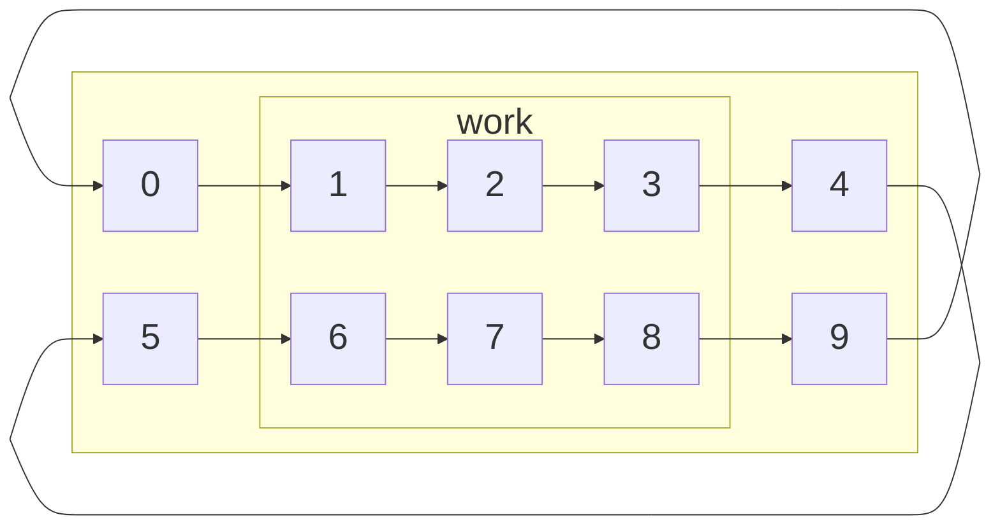
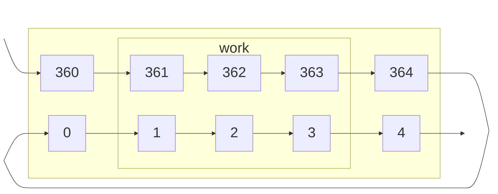
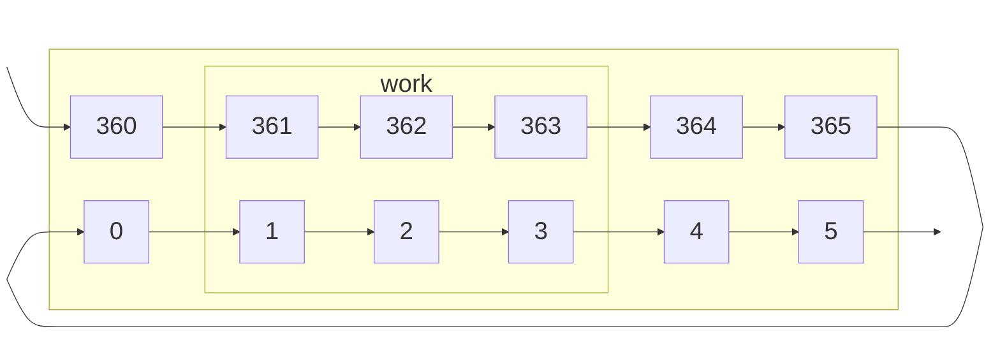
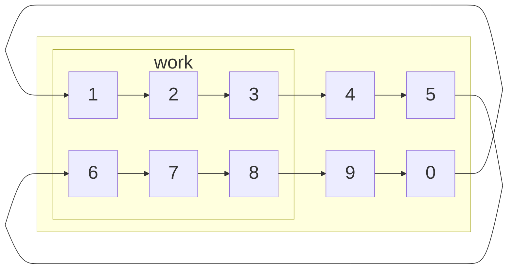
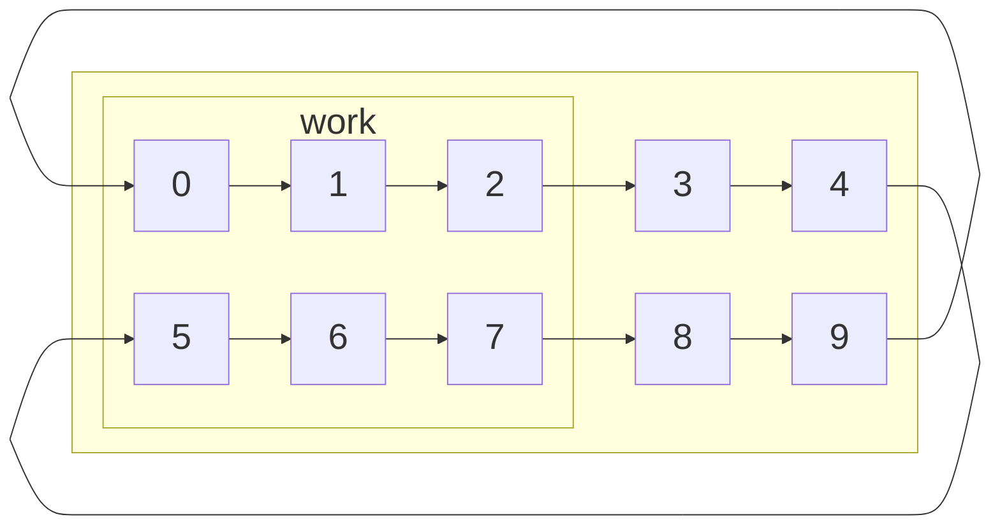
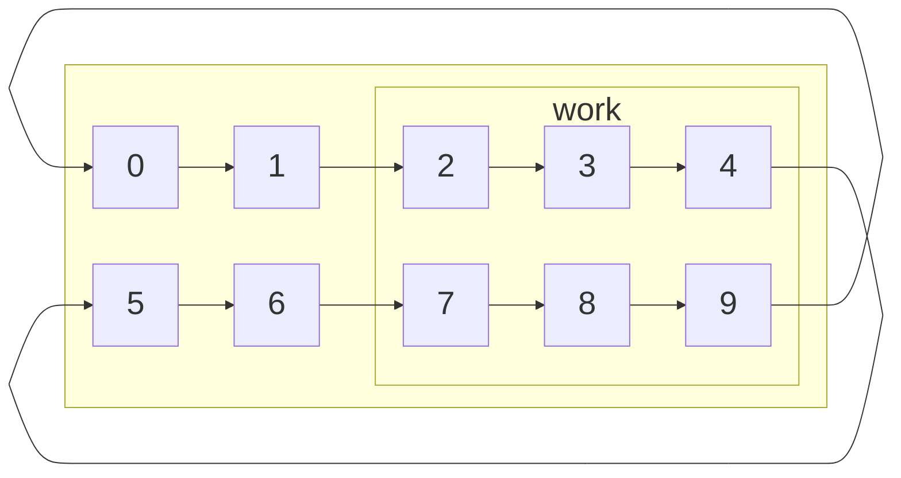
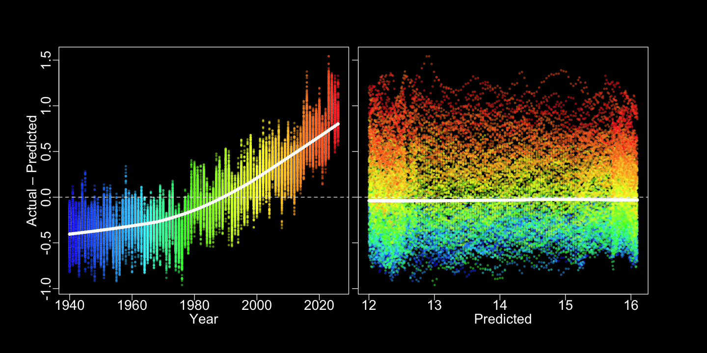
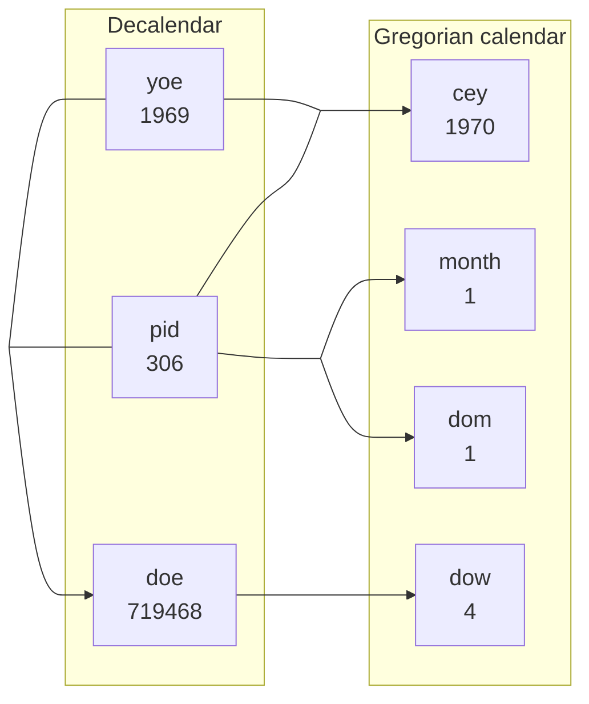
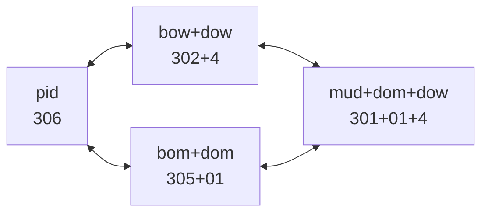
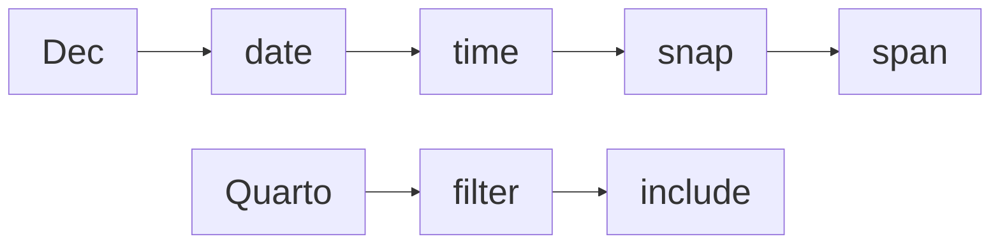

# Decalendar

Code

Introducing Decalendar, a solar calendar which measures time in years and days without the need for months or weeks.

Author

[Martin Laptev](https://maptv.github.io)

Published

2026+200

Modified

2026+200


#### Decalendar

My website serves as a demonstration of both the [Quarto](https://quarto.org) publishing📤system and the [Dec](../../dec) measurement📐system. I use several clever hacks to get Quarto to display all of the dates on my website in the Dec year+day format. Knowing the basics of the Dec calendar🗓️(Decalendar) will help you to understand the [filter](https://quarto.org/docs/extensions/filters.html) and [include](https://quarto.org/docs/output-formats/html-basics.html#includes) articles in the [Quarto section](../../quarto) of my site.

Among its many features, Quarto offers support for the [Observable](https://observablehq.com/) data visualization system. Observable is my top choice for interactive graphics. You can interact with the two Observable [calendar plots](https://observablehq.com/@observablehq/plot-calendar) below⬇️using the adjacent Observable [inputs](https://observablehq.com/documentation/inputs/overview). The [scrubber](https://observablehq.com/@mbostock/scrubber)🧽input is a great place to start because it cycles🔄through every value of the [range](https://observablehq.com/@observablehq/input-range)🎚️inputs beneath it.

#### 0 Day of year (doy)

To activate the scrubber input, press the “Play”▶️button adjacent to the range inputs. Upon activation, the box around the selected day in each plot will move back and forth between the first “day of year” ([doy](#doy)), [d](#d)0, and the last [doy](#doy), which is either [d](#d)364 or [d](#d)365. To insert or remove [d](#d)365, use the “Year length” [radio](https://observablehq.com/@observablehq/input-radio)📻input to set the number of days in the year.

The insertion of [d](#d)365 shifts 306 dates, [d](#d) to [d](#d), in the [Gregorian calendar](https://en.wikipedia.org/wiki/Gregorian_calendar#:~:text=the%20calendar%20used%20in%20most%20parts%20of%20the%20world) by 1 day, but does not change the order of any Dec dates, because [d](#d)365 is the last day of any Dec leap year and is always followed by [d](#d)0 of the subsequent Dec year ([y](#y)+1). The “Year length” radio input also changes the value of the negative “Day of year” range input by 1 day.

Similarly, the “[Coordinated Universal Time](https://en.wikipedia.org/wiki/Coordinated_Universal_Time#:~:text=the%20primary%20time%20standard%20globally%20used%20to%20regulate%20clocks%20and%20time) ([UTC](#utc)) [offset](https://en.wikipedia.org/wiki/UTC_offset#:~:text=the%20difference%20in%20hours%20and%20minutes%20between%20Coordinated%20Universal%20Time%20(UTC)%20and%20the%20standard%20time%20at%20a%20particular%20place)” radio input shifts the Gregorian calendar date selected by the “Month” and “Day of month” range inputs by 1 day. If the “[Color scheme](https://en.wikipedia.org/wiki/Color_scheme#:~:text=a%20combination%20of%202%20or%20more%20colors%20used%20in%20aesthetic%20or%20practical%20design)” radio input is set to the “Month” instead of the “Day”, the “[UTC](#utc) offset” radio input will also rotate the Dec colors🎨(Decolors) inside the calendar plot [cells](https://observablehq.com/plot/marks/cell) by 1 day.

From the perspective of Dec, month Decolors are only useful if we want to compare the Dec and Gregorian calendars. In contrast, day Decolors can help us organize days into groups of 100 called hectodays ([h](#h)) and groups of 10 named [xún](https://en.wikipedia.org/wiki/Chinese_calendar#:~:text=into%20nine%2D%20or-,ten%2Dday%20weeks,-known%20as%20x%C3%BAn) ([x](#x)). Dec defines [meteorological seasons](https://en.wikipedia.org/wiki/Season#Meteorological:~:text=reckoned%20by%20temperature) in terms of [h](#h) and uses [x](#x) in place of Gregorian calendar months and weeks.

\\\text{pid} = \text{x} \ast 10 + \text{dox} \tag{1}\\

The “Plot layout” radio input pivots the calendar plots by a quarter [turn](https://en.wikipedia.org/wiki/Turn_%28angle%29#:~:text=the%20Greek%20letter,to%20one%20turn), interchanging the horizontal (↔︎) and vertical (↕) axes. The axis labels indicate that [x](#x) and “days of xún” ([dox](#dox)) are analogous to weeks and “days of week” ([dow](#dow)). If we multiply an [x](#x) axis label by ten and add it to a [dox](#dox) axis label, we get a “positive integer [doy](#doy)” ([pid](#pid)) cell value: × 10 + = .

``` js
// https://observablehq.com/@tophtucker/horizontal-inputs
viewof leapscrub = Inputs.form([
  Inputs.radio(new Map([["365", false], ["366", true]]), {label: "Year length", value: loadLeap}),
  Inputs.radio(new Map([["Positive", false], ["Negative", true]]), {label: "UTC offset", value: negtzo}),
  Inputs.radio(new Map([["Day", false], ["Month", true]]), {label: "Color scheme", value: false}),
  Inputs.radio(new Map([["Vertical", false], ["Horizontal", true]]), {label: "Plot layout", value: vertic}),
  Scrubber(numbers, {autoplay: false, alternate: true, delay: 86.4, loopDelay: 864, format: y => "", inputStyle: "display:none;"}),
  ],
  {
    template: (inputs) => htl.html`
      <div style="display: flex; flex-wrap: wrap">${inputs}</div>
    `
})
```

``` js
viewof dotyInput = Inputs.range([0, 364 + leapInput], {value: 306, step: 1, label: "Day of year"});
viewof dotyInput1 = transformInput(
  Inputs.range([-365 - leapInput, -1], {step: 1, label: "Day of year"}),
  {bind: viewof dotyInput, transform: subN, invert: addN}
);
viewof monthInput = transformInput(
  Inputs.range([1, 12], {step: 1, label: "Month"}),
  {bind: viewof dotyInput, transform: doty2month, invert: month2doty}
);
viewof dotmInput = transformInput(
  Inputs.range([1, 31], {step: 1, label: "Day of month"}),
  {bind: viewof dotyInput, transform: doty2dotm, invert: (x => Math.floor(( 153 * (
    viewof monthInput.value > 2
    ? viewof monthInput.value - 3
    : viewof monthInput.value + 9) + 2
  ) / 5 + x - 1 + nOffInput
) % nDaysInput)});
```

``` js
decPlot = Plot.plot({
  padding: 0,
  width: layoInput ? 1080 : 360,
  height: layoInput ? 240 : 630,
  className: "calplot",
  title: "Decalendar",
  marginTop: coloInput && layoInput ? -2 : !coloInput && layoInput ? -22 : -3,
  marginLeft: coloInput && !layoInput ? 36 : !coloInput && !layoInput ? 24 : 31,
  marginRight: coloInput && !layoInput ? 36 : !coloInput && !layoInput ? 24 : 31,
  marginBottom: coloInput && layoInput ? 34 : !coloInput && layoInput ? 37 : 32,
  y: layoInput ? {
    tickSize: 0,
    label: "Day of xún    ",
    domain: [-1, 0, 1, 2, 3, 4, 5, 6, 7, 8, 9],
    ticks: [0, 1, 2, 3, 4, 5, 6, 7, 8, 9],
    tickPadding: -7,
    labelOffset: 25,
  } : {interval: 1, ticks: 18, label: "Xún", type: "band", tickSize: 0, tickPadding: -2, labelOffset: 32},
  x: layoInput ? {interval: 1, ticks: 18, label: "Xún", type: "band", tickSize: 0, labelOffset: 32} : {
    tickSize: 0,
    label: "       Day of xún",
    domain: [-1, 0, 1, 2, 3, 4, 5, 6, 7, 8, 9],
    ticks: [0, 1, 2, 3, 4, 5, 6, 7, 8, 9],
    tickPadding: -2,
    labelOffset: 32,
  },
  style: { fontSize: "21px", overflow: "visible"},
  color: {
    range: motyColors,
    domain: moty,
  },
  marks: [
    Plot.cell(dates, {
      x: (d, i) => layoInput ? Math.floor(i / 10) : i % 10,
      y: (d, i) => layoInput ? i % 10 : Math.floor(i / 10),
      fill: (d, i) => coloInput ? months[(new Date(d.getTime() - nOffInput * 86400000)).getUTCMonth()] : leapInput ? leaps[i] : comms[i],
      stroke: (d, i) => i === dotyInput ? "black" : "none",
      strokeDasharray: "5,2",
      strokeWidth: 3,
      inset: 0.5,
    }),
    layoInput ? Plot.axisX({
      ticks: d3.range(0, 37, 2),
      fill: (d, i) => leapInput ? dekLeapColors[d] : dekCommColors[d],
      textStroke: "black",
      textStrokeWidth: 1,
      tickSize: 0,
      tickPadding: coloInput ? -2 : 0, 
    }) : Plot.axisY({
      ticks: d3.range(0, 37, 2),
      fill: (d, i) => leapInput ? dekLeapColors[d] : dekCommColors[d],
      textStroke: "black",
      textStrokeWidth: 1,
      tickSize: 0,
      tickPadding: coloInput ? -24 : -26,
      labelOffset: coloInput ? 17 : 16,
    }),
    coloInput ? Plot.text(dates, {
      x: (d, i) => layoInput ? Math.floor(i / 10 + (i < 190 ? 1 : 0)) : 6,
      y: (d, i) => layoInput ? -1 : Math.floor(i / 10 + (i < 190 ? 1 : 0)),
      text: d => d.getUTCDate() === 7 ? months[d.getUTCMonth()].slice(0, 3) : "",
      dx: layoInput ? -4 : 129,
      dy:  layoInput ? -4 : 0,
      frameAnchor: layoInput ? "left" : "right",
      monospace: true,
      fontSize: "20px"}) : null,
    Plot.ruleY([layoInput ? dotyInput % 10 : Math.floor(dotyInput / 10)], {stroke: "black", strokeWidth: 2, dy: !coloInput && layoInput ? 10 : layoInput ? 9 : 8, x1: 0, x2: layoInput ? 36 : 9}),
    Plot.ruleY([layoInput ? dotyInput % 10 : Math.floor(dotyInput / 10)], {stroke: "black", strokeWidth: 2, dy:  !coloInput && layoInput ? -10 :layoInput ? -9 : -8, x1: 0, x2: layoInput ? 36 : 9}),
    Plot.ruleX([layoInput ? Math.floor(dotyInput / 10) : dotyInput % 10], {stroke: "black", strokeWidth: 2, dx: coloInput && !layoInput ? 13 : layoInput ? 13.5 : 14, y1: 0, y2: layoInput ? 9 : 36}),
    Plot.ruleX([layoInput ? Math.floor(dotyInput / 10) : dotyInput % 10], {stroke: "black", strokeWidth: 2, dx:  coloInput && !layoInput ? -13 : layoInput ? -13.5 : -14, y1: 0, y2: layoInput ? 9 : 36}),
    Plot.text(dates, {
      x: (d, i) => layoInput ? Math.floor(i / 10) : i % 10,
      y: (d, i) => layoInput ? i % 10 : Math.floor(i / 10),
      fill: (d, i) => coloInput && (i < 31 + nOffInput || i > 213 + nOffInput) ? "white" : !coloInput && (i < 20 || i > 199) ? "white" : "black",
      channels: {
        dayOfYear: {
          value: (d, i) => i,
          label: "Day of year"
        },
        month: {
          value: d => (new Date(d.getTime() - nOffInput * 86400000)).getUTCMonth() + 1,
          label: "Month"
        },
        dayOfMonth: {
          value: d => (new Date(d.getTime() - nOffInput * 86400000)).getUTCDate(),
          label: "Day of month"
        },
        week: {
          value: d => d3.utcWeek.count(d3.utcYear((new Date(d.getTime() - nOffInput * 86400000))), (new Date(d.getTime() - nOffInput * 86400000))),
          label: "Week"
        },
        dayOfWeek: {
          value: d => (new Date(d.getTime() - nOffInput * 86400000)).getUTCDay(),
          label: "Day of week"
        },
      },
      tip: {
        format: {
          dayOfYear: true,
          month: true,
          dayOfMonth: true,
          week: true,
          dayOfWeek: true,
          x: false,
          y: false,
          fill: false,
          text: false
        }
      },
      text: (d, i) => String(i),
      label: "Day of year",
      monospace: true,
      fontSize: "13px"})
  ]
})
```

``` js
grePlot = Plot.plot({
  padding: 0,
  width: layoInput ? 1080 : 220,
  height: layoInput ? 180 : 810,
  title: "Gregorian calendar",
  className: "calplot",
  marginTop: layoInput ? 2 : -2,
  marginBottom: 40,
  marginLeft: 33,
  y: layoInput ? {tickFormat: Plot.formatWeekday("en", "short"), tickSize: 0,
      domain: [-1, 0, 1, 2, 3, 4, 5, 6],
      ticks: [0, 1, 2, 3, 4, 5, 6],
      tickPadding: -3 + (leapInput && dotwInput === "Sat") * 5,
      label: null,
  } : {interval: 1, 
       ticks: 26, label: "Week", type: "band", tickSize: 0, tickPadding: -20, labelOffset: 21},
  x: layoInput ? {interval: 1, ticks: 26, label: "Week", type: "band", tickSize: 0, tickPadding: 2, labelOffset: 36} : {
    tickFormat: Plot.formatWeekday("en", "narrow"), 
    tickSize: 0,
    domain: [-1, 0, 1, 2, 3, 4, 5, 6],
    ticks: [0, 1, 2, 3, 4, 5, 6],
    tickPadding: -11 + (leapInput && dotwInput === "Sat") * 5,
    label: "     Day of week",
    labelOffset: 22 + (leapInput && dotwInput === "Sat") * 5,
  },
  style: { fontSize: "20px", overflow: "visible"},
  color: {
    range: motyColors,
    domain: moty,
    className: "cal",
  },
  marks: [
    Plot.cell(datesCal, {
      x: d => layoInput ? d3.utcWeek.count(d3.utcYear(d), d) : d.getUTCDay(),
      y: d => layoInput ? d.getUTCDay() : d3.utcWeek.count(d3.utcYear(d), d),
      fill: (d, i) => coloInput ? months[d.getUTCMonth()] : leapInput ? leaps[(i + 365 - 59 + nOffInput) % (365 + leapInput)] : comms[(i + 365 - 59 + nOffInput) % (365 + leapInput)],
      stroke: (d, i) => ((i + 365 - 59 + nOffInput) % (365 + leapInput)) === dotyInput ? "black" : "none",
      strokeDasharray: "5,2",
      strokeWidth: 2.5,
      inset: .5,
    }),
    Plot.text(datesCal, {
      x: d => layoInput ? d3.utcWeek.count(d3.utcYear(d), d) : 6,
      y: d => layoInput ? -1 : d3.utcWeek.count(d3.utcYear(d), d),
      text: d => d.getUTCDate() === 7 ? months[d.getUTCMonth()].slice(0, 3) : "",
      dx: layoInput ? 9 : 48,
      dy: layoInput ? -3 : 0,
      frameAnchor: layoInput ? "left" : "right",
      monospace: true,
      fontSize: "20px"}),
    Plot.ruleY(layoInput ? seldow : selwee, {stroke: "black", strokeWidth: 2, dy: layoInput ? -8.5 : -7, x1: 0, x2: layoInput ? 52 + (leapInput && dotwInput === "Sat") : 6}),
    Plot.ruleY(layoInput ? seldow : selwee, {stroke: "black", strokeWidth: 2, dy: layoInput ? 8.5 : 7, x1: 0, x2: layoInput ? 52 + (leapInput && dotwInput === "Sat") : 6}),
    Plot.ruleX(layoInput ? selwee : seldow, {stroke: "black", strokeWidth: 2, dx: 9.5, y1: 0, y2: layoInput ? 6 : 52 + (leapInput && dotwInput === "Sat")}),
    Plot.ruleX(layoInput ? selwee : seldow, {stroke: "black", strokeWidth: 2, dx: -9.5, y1: 0, y2: layoInput ? 6 : 52 + (leapInput && dotwInput === "Sat")}),
    Plot.text(datesCal, {
      x: layoInput ? d => d3.utcWeek.count(d3.utcYear(d), d) : {
        label: "Day of week",
        value: d => d.getUTCDay(),
      },
      y: layoInput ? {
        label: "Day of week",
        value: d => d.getUTCDay(),
      } : d => d3.utcWeek.count(d3.utcYear(d), d),
      fill: (d, i) => coloInput && (i < 90 + leapInput || i > 272 + leapInput) ? "white" : !coloInput && (i < 79 - nOffInput + leapInput || i > 258 - nOffInput + leapInput) ? "white" : "black",
      text: d => d.getUTCDate(),
      channels: {
        dayOfYear: {
          value: (d, i) => (i + 365 - 59 + nOffInput) % (365 + leapInput),
          label: "Day of year"
        },
        month: {
          value: d => d.getUTCMonth() + 1,
          label: "Month"
        },
        dayOfMonth: {
          value: d => d.getUTCDate(),
          label: "Day of month"
        },
      },
      tip: {
        format: {
          dayOfYear: true,
          month: true,
          dayOfMonth: true,
          x: true,
          y: true,
          fill: false,
          text: false,
        }
      },
      monospace: true,
      fontSize: "13px"})
  ]
})
```

First dow of the Gregorian calendar year

``` js
viewof dotwInput = Inputs.radio([
  "Sun", "Mon", "Tue", "Wed", "Thu", "Fri", "Sat",
  ], {value: gregBoyDotwStr})
```

There are two range inputs labelled “Day of year” because every [doy](#doy) can be expressed as either a positive or a negative integer. The [pid](#pid) is the number of days that have passed in the year, the [absolute value](https://en.wikipedia.org/wiki/Absolute_value#:~:text=non%2Dnegative%29-,magnitude%20of,measured%20without%20regard%20to%20its%20sign,-.%20Namely%2C) of the “negative integer [doy](#doy)” ([nid](#nid)) is the number of days left in the year, and their [difference](https://en.wikipedia.org/wiki/Subtraction#Notation_and_terminology:~:text=The%20result%20is%20the%20difference) is the “solar year length” ([syl](#syl)), which can be 365 or 366.

\\\text{syl} = \text{pid} - \text{nid} \tag{2}\\

The distinction between [pid](#pid) and [nid](#nid) can be explained in terms of [computer programming](https://en.wikipedia.org/wiki/Computer_programming#:~:text=the%20composition%20of%20sequences%20of%20instructions%2C%20called%20programs%2C%20that%20computers%20can%20follow%20to%20perform%20tasks). If we think of a year as an [array](https://en.wikipedia.org/wiki/Array_(data_structure)#Element_identifier_and_addressing_formulas:~:text=a%20data%20structure%20consisting%20of%20a%20collection%20of%20elements%20(values%20or%20variables)%2C%20of%20same%20memory%20size%2C%20each%20identified%20by%20at%20least%20one%20array%20index) and each day as an array element, a [syl](#syl) is the number of elements in the array, [pid](#pid) is a [positive index](https://en.wikipedia.org/wiki/Zero-based_numbering#:~:text=a%20way%20of%20numbering%20in%20which%20the%20initial%20element%20of%20a%20sequence%20is%20assigned%20the%20index%C2%A00), and [nid](#nid) is a [negative index](https://en.wikipedia.org/wiki/Array_slicing#:~:text=specify%20an%20offset%20from%20the%20end%20of%20the%20array). Array [indexes](https://en.wikipedia.org/wiki/Array_(data_structure)#Element_identifier_and_addressing_formulas:~:text=individual%20objects%20are%20selected%20by%20an%20index) can be used to obtain specific array elements individually via indexing or in groups via [array slicing](https://en.wikipedia.org/wiki/Array_slicing#:~:text=an%20operation%20that%20extracts%20a%20subset%20of%20elements%20from%20an%20array).

The year+day Dec date format is short for year+day/[syl](#syl). Dec truncates dates because the [syl](#syl) is not needed to specify a date, remains constant for 366, 1095, or 2920 days, has only 2 possible values: 365 or 366, and can be obtained by passing Year [y](#y) to Equations [3](#eq-leap) and [4](#eq-leap2syl) below. Nevertheless, we can use the [syl](#syl) to convert between different kinds of Dec dates.

\\ \text{leap}=\begin{cases} 1&{\begin{aligned} &\text{ if } (\text{y} + 1)\href{https://en.wikipedia.org/wiki/Modulo#:~:text=returns%20the%20remainder%20or%20signed%20remainder%20of%20a%20division}{\bmod} \\ \\ \\ \\ 4=0\\ &\href{https://en.wikipedia.org/wiki/Logical_conjunction}{\land}(\text{y} + 1)\href{https://en.wikipedia.org/wiki/Modulo#:~:text=returns%20the%20remainder%20or%20signed%20remainder%20of%20a%20division}{\bmod} 100\neq0\\ &\href{https://en.wikipedia.org/wiki/Logical_disjunction}{\lor}(\text{y} + 1)\href{https://en.wikipedia.org/wiki/Modulo#:~:text=returns%20the%20remainder%20or%20signed%20remainder%20of%20a%20division}{\bmod} 400=0\end{aligned}}\\\\ 0&{\text{ otherwise}}\end{cases} \tag{3}\\

\\\text{syl}=365+\text{leap} \tag{4}\\

## Julia

``` julia
function leap(year = 0)
    year += 1
    year % 4 == 0 && year % 100 != 0 || year % 400 == 0
end
```

    leap (generic function with 2 methods)

``` julia
leap(2019)
```

    true

``` julia
leap(2020)
```

    false

## Observable JavaScript

``` js
function leap(year = 0) {
  year += 1;
  return year % 4 === 0 && year % 100 !== 0 || year % 400 === 0;
}
leap(2019)
```

``` js
leap(2020)
```

## Python

``` python
def leap(year=2000):
    year += 1
    return year % 4 == 0 and year % 100 != 0 or year % 400 == 0
leap(2019)
```

    True

``` python
leap(2020)
```

    False

## R

``` downlit
leap <- function(year = 0) {
  year <- year + 1
  year %% 4 == 0 & year %% 100 != 0 | year %% 400 == 0
}
leap(2019)
```

    [1] TRUE

``` downlit
leap(2020)
```

    [1] FALSE

Dec categorizes each date as a [countdown](https://en.wikipedia.org/wiki/Countdown#:~:text=a%20sequence%20of%20backward%20counting%20to%20indicate%20the%20time%20remaining%20before%20an%20event%20is%20scheduled%20to%20occur) or countup date, depending on whether the date counts **up** the days **since** Year [y](#y) or counts **down** the days **until** Year [y](#y)+1. The current year+day [UTC](#utc) date, +, informs us that Year began days ago, whereas its countdown equivalent, -, tells us that Year will begin in days.

\\\text{y}+\dfrac{\text{pid}}{\text{syl}} = \text{y} + 1 + \dfrac{\text{nid}}{\text{syl}} \tag{5}\\

Both [pid](#pid) and [nid](#nid) can be useful. If we wanted to add 285 days to the [doy](#doy) selected below, for example to predict when a pregnant🤰woman will give birth to a baby👩‍🍼([Jukic et al. 2013+215](#ref-jukicLengthHumanPregnancy2013)), we should add 285 to the [pid](#pid) if it is less than 80 in a common year or less than 81 in a leap year, but otherwise we should add 1 to the year and add 285 to the [nid](#nid):  + 285 = .

``` js
Inputs.bind(Inputs.range([0, 364 + leapInput], {step: 1, label: "Day of year"}), viewof dotyInput)
```

``` js
Inputs.bind(Inputs.range([-365 - leapInput, -1], {step: 1, label: "Day of year"}), viewof dotyInput1)
```

Every [doy](#doy), [x](#x), and [dox](#dox) has an associated Decolor that can be expressed as a [hexadecimal](https://en.wikipedia.org/wiki/Web_colors#Hex_triplet:~:text=hexadecimal%20number%20used%20in%20HTML%2C%20CSS%2C%20SVG%2C%20and%20other%20computing%20applications%20to%20represent%20colors) ([hex](#hex)), “[hue saturation lightness](https://en.wikipedia.org/wiki/HSL_and_HSV#:~:text=the%20two%20most%20common%20cylindrical%2Dcoordinate%20representations%20of%20points%20in%20an%20RGB%20color%20model)” ([hsl](#hsl)), or “[red green blue](https://en.wikipedia.org/wiki/RGB_color_model#:~:text=an%20additive%20color%20model)” ([rgb](#rgb)) triplet. Use the “Day of year” range inputs above to choose from the [doy](#doy), 37 [x](#x), and 10 [dox](#dox) that can be displayed in [Table 1](#tbl-color) below and compare their corresponding [hue](https://en.wikipedia.org/wiki/Hue#:~:text=an%20angular%20position%20around%20a%20central%20or%20neutral%20point%20or%20axis%20on%20a%20color%20space%20coordinate%20diagram) degrees (h°) and [hex](#hex) and [rgb](#rgb) triplets.

|             |     | h°  | hex | red | green | blue |
|-------------|-----|-----|-----|-----|-------|------|
| [doy](#doy) |     |     |     |     |       |      |
| [x](#x)     |     |     |     |     |       |      |
| [dox](#dox) |     |     |     |     |       |      |

Table 1

The [radio](https://observablehq.com/@observablehq/input-radio) input beneath the plots selects the [dow](#dow) for [d](#d), the first day of the Gregorian calendar year. Changing the [d](#d) [dow](#dow) shifts every Gregorian calendar date by 1 to 6 days without affecting Decalendar. A leap year that begins on the last [dow](#dow), [Dow](#dow) 6, has an extra “week of year” ([woy](#woy)), but its first and last [woy](#woy), Weeks 0 and 53, each contribute only 1 day to the year.

Even though weeks determine the shape of the Gregorian calendar plot, its cell values are “days of month” ([dom](#dom)). We can uniquely identify🪪a specific day in any year with a [pid](#pid), rather than a month and a [dom](#dom). Except for [d](#d)365 in leap years, every year has the same [x](#x), [h](#h), and months, but not the same weeks. It takes 5, 6, 7, 11, or 12 years for a [d](#d) [dow](#dow) to recur.

The number of forms that the Gregorian calendar can take, 14, is the product of 7 [dow](#dow) and 2 year lengths. If we set aside an extra copy of a printed🖨️Gregorian calendar on [d](#d), we would have to wait 6, 11, 12, 17, 23, 28, or 40 years to use it. We can make the leap year form of Decalendar apply to any year by appending an asterisk (\*) to the label for [d](#d)365: 365\*.

The 365\* label is short for 365\*leap, where leap is the [left-hand side](https://en.wikipedia.org/wiki/Sides_of_an_equation#:~:text=the%20expression%20on%20the%20left%20of%20the%20%22%3D%22%20is%20the%20left%20side%20of%20the%20equation) of [Equation 3](#eq-leap). If leap is 1, Year [y](#y) is a leap year and 365\* is [d](#d)365, the last day of Year [y](#y). If leap is 0, Year [y](#y) is a common year and 365\* is [d](#d)0, the first day of Year [y](#y)+1. The 365\* label unites the common and leap year forms of Decalendar into a [perennial calendar](https://en.wikipedia.org/wiki/Perennial_calendar#:~:text=a%20calendar%20that%20applies%20to%20any%20year%2C%20keeping%20the%20same%20dates) that can be reused♻️every year.

#### 1 Day of xún (dox)

As opposed to a week, an [x](#x) can be split evenly into either 5 pairs of days or 2 equal halves called “pentadays of xún” ([pox](#pox)). Likewise, a common year can be divided evenly into 73 groups of 5 days called “pentadays” ([p](#p)): [p](#p)0 to [p](#p)72. The last [p](#p) of a leap year, [p](#p)73, consists of the final day of the leap year, [d](#d)365, and the first 4 days of the subsequent year: [d](#d)0 to [d](#d)3.

In the context of a common year, [p](#p)73 is synonymous with [p](#p)0 of the succeeding year. To obtain the current [p](#p), we divide the current [pid](#pid) by 5 and then use the [floor function](https://en.wikipedia.org/wiki/Floor_and_ceiling_functions#:~:text=the%20function%20that%20takes%20a%20real%20number%20x%20as%20input%20and%20returns%20the%20greatest%20integer%20less%20than%20or%20equal%20to%20x) as in [Equation 9](#eq-poy) to discard the [fractional part](https://en.wikipedia.org/wiki/Fractional_part#:~:text=the%20excess%20beyond%20that%20number%27s%20integer%20part) of the quotient: = [⌊](https://en.wikipedia.org/wiki/Fractional_part#:~:text=the%20excess%20beyond%20that%20number%27s%20integer%20part) ÷ 5[⌋](https://en.wikipedia.org/wiki/Fractional_part#:~:text=the%20excess%20beyond%20that%20number%27s%20integer%20part). If we divide a [pid](#pid) or a [dox](#dox) by 5, the remainder will be its corresponding “day of pentaday” ([dop](#dop)): = [mod](https://en.wikipedia.org/wiki/Modulo#:~:text=returns%20the%20remainder) 5.

\\\text{x} = \left\lfloor\dfrac{\text{pid}}{10}\right\rfloor \tag{6}\\ \\\text{dox} = \text{pid} \href{https://en.wikipedia.org/wiki/Modulo#:~:text=returns%20the%20remainder%20or%20signed%20remainder%20of%20a%20division}{\bmod} 10 \tag{7}\\ \\\text{pox} = \href{https://en.wikipedia.org/wiki/Iverson_bracket#:~:text=is%20defined%20to%20take%20the%20value%201%20for%20the%20values%20of%20the%20variables%20for%20which%20the%20statement%20is%20true%2C%20and%20takes%20the%20value%200%20otherwise}{\[}\text{dox} \> 4\href{https://en.wikipedia.org/wiki/Iverson_bracket#:~:text=is%20defined%20to%20take%20the%20value%201%20for%20the%20values%20of%20the%20variables%20for%20which%20the%20statement%20is%20true%2C%20and%20takes%20the%20value%200%20otherwise}{\]} \tag{8}\\ \\\text{p} = \left\lfloor\dfrac{\text{pid}}{5}\right\rfloor \tag{9}\\ \\\text{dop = dox} \href{https://en.wikipedia.org/wiki/Modulo#:~:text=returns%20the%20remainder%20or%20signed%20remainder%20of%20a%20division}{\bmod} 5 \tag{10}\\

In [Diagram 1](#fig-zero) below, each row is a [pox](#pox) and each square node is a [dox](#dox). [Diagram 1](#fig-zero) visualizes Schedule L, a Dec schedule that plans for exactly 219 work days per year, which is about an [x](#x) more than the 208 to 210 work days per year provisioned by a [four-day workweek](https://en.wikipedia.org/wiki/Four-day_workweek#:~:text=an%20arrangement%20where%20a%20workplace%20or%20place%20of%20education%20has%20its%20employees%20or%20students%20work%20or%20attend%20school%2C%20college%20or%20university%20over%20the%20course%20of%20four%20days%20per%20week). Schedule L designates [Dox](#dox) 1, 2, 3, 6, 7, and 8 as work days and [Dox](#dox) 0, 4, 5, and 9 as rest days.

###### Schedule L ([Dox](#dox) 0 to 9)



Diagram 1

Dec identifies groups of days between [Dop](#dop) 0 and 4 as “pentaday interquintile ranges” ([pir](#pir)): [Dop](#dop) 1, 2, and 3. Similarly, the days betwixt [Dox](#dox) 0 and 9 are “xún interdecile ranges” ([xir](#xir)). The names for [pir](#pir) and [xir](#xir) are inspired by the terms [quintile](https://en.wiktionary.org/wiki/quintile#:~:text=quantiles%20which%20divide%20an%20ordered%20sample%20population%20into%20five%20equally%20numerous%20subsets), [decile](https://en.wikipedia.org/wiki/Decile#:~:text=nine%20values%20that%20divide%20the%20sorted%20data%20into%20ten%20equal%20parts), and [interquartile range](https://en.wikipedia.org/wiki/Interquartile_range#:~:text=a%20measure%20of%20statistical%20dispersion). If we follow Schedule L, a [pir](#pir) is to a [workweek](https://en.wikipedia.org/wiki/Workweek_and_weekend#:~:text=the%20part%20of%20the%20seven%2Dday%20week%20devoted%20to%20working) as a [p](#p) is to a week and as an [x](#x) is to a [fortnight](https://en.wikipedia.org/wiki/Fortnight#:~:text=a%20unit%20of%20time%20equal%20to%2014%20days).

The pair of days between two [pir](#pir) is called a “[liminal](https://en.wikipedia.org/wiki/Liminality#:~:text=the%20quality%20of%20ambiguity%20or%20disorientation%20that%20occurs%20in%20the%20middle%20stage%20of%20a%20rite%20of%20passage) interconnecting margin” ([lim](#lim)). The last [lim](#lim) of a common year, [Lim](#lim) 73, comprises [d](#d)364 and [d](#d)0 and is synonymous with [Lim](#lim) 0 of the subsequent year. In a leap year, [Lim](#lim) 73 consists of [d](#d)364 and [d](#d)365 and overlaps with [Lim](#lim) 74, which is composed of [d](#d)365 and [d](#d)0 and is equivalent to [Lim](#lim) 0 of the ensuing year.

Except for [Lim](#lim) 74, every even-numbered [lim](#lim) is the border that separates two [xir](#xir). With the exception of [Lim](#lim) 73, every odd-numbered [lim](#lim) is flanked by the two [pir](#pir) within each [xir](#xir). [Diagram 2](#fig-zerocomm) below shows the final five [doy](#doy) of a common year and the first five [doy](#doy) of the following year, which include the last day of [Lim](#lim) 72, [Pir](#pir) 72, [Lim](#lim) 0, [Pir](#Pir) 0, and the first day of [Lim](#lim) 1.

###### Schedule L ([p](#p)72 and [p](#p)0)



Diagram 2

The diagrams above illustrate that the transition from a common year preserves the alternating pattern of two-day [lim](#lim) and three-day [pir](#pir). After 4 or 8 years, this pattern is interrupted by [Lim](#lim) 73 and 74 at the end of a leap year. In [Diagram 3](#fig-zeroleap) below, this interruption manifests as an extra [doy](#doy) per row which puts [d](#d)364 alongside [d](#d)365 and [d](#d)4 beside [d](#d)5 in a two-by-two grid.

###### Schedule L (d360 to d365 and d0 to d5)



Diagram 3

According to Schedule L, [pir](#pir) only contain workdays and [lim](#lim) are solely made up of rest days. When we follow Schedule L, a [lim](#lim) is the Dec analog of a weekend. To make [lim](#lim) appear like weekends we can start from [Dox](#dox) 1 instead of [Dox](#dox) 0 as in the [Diagram 4](#fig-one) below, which displays its [lim](#lim) as a two-by-two square on the right like [Lim](#lim) 73 and 1 in [Diagram 3](#fig-zeroleap) above.

###### Schedule L ([Dox](#dox) 1 to 0)



Diagram 4

The order of [dox](#dox) in [Diagram 4](#fig-one) is different than all of the previous diagrams but all of the diagrams above show Schedule L because the categorization of [dox](#dox) as work or rest days remains unchanged. If we left [rotate](https://en.wikipedia.org/wiki/Circular_shift#:~:text=moving%20the%20final%20entry%20to%20the%20first%20position%2C%20while%20shifting%20all%20other%20entries%20to%20the%20next%20position%2C%20or%20by%20performing%20the%20inverse%20operation) (↺) the [dox](#dox) categories of Schedule L by 1 day, we get the Schedule X Dec schedule: L ↺ 1 = X. Schedule X groups rest days at the end of each [p](#p).

###### Schedule X ([Dox](#dox) 0 to 9)



Diagram 5

If we adhere to Schedule X, there will be 4 consecutive work days during any transition from a leap year. To limit the number of consecutive work days to 3, we could right rotate (↻) Schedule L and obtain Schedule F: L ↻ 1 = F. Unlike Schedule X, Schedule F handles yearly transitions just as gracefully as Schedule L and provisions the same number of work days per year.

###### Schedule F ([Dox](#dox) 0 to 9)



Diagram 6

There are 32 Dec schedules which can be expressed as a five-bit (5b) [binary](https://en.wikipedia.org/wiki/Binary_number#:~:text=only%20two%20symbols%20for%20the%20natural%20numbers%3A%20typically%200%20%28zero%29%20and%201%20%28one%29) ([base](https://en.wikipedia.org/wiki/Radix#:~:text=the%20number%20of%20unique%20digits)2) sequence. Of these 32 binary sequences, 8 are palindromes. If a Dec schedule can be represented by a 5b palindrome, we can identify its work and rest days by the last digit of not only the [pid](#pid) but also either the subsequent [nid](#nid) ([nid](#nid)) in common years or the [nid](#nid) after next ([nid](#nid)) in leap years.

We can sum an [nid](#nid) with 1 to get an [nid](#nid), [nid](#nid) = [nid](#nid) + 1, or with 2 to get an [nid](#nid): [nid](#nid) = [nid](#nid) + 2. [Table 2](#tbl-vincommon) below displays the [pid](#pid), [nid](#nid), [nid](#nid), and “mixed integer [doy](#doy)” ([mid](#mid)) of the first and last 11 days of a common year. We can use the last digit of any [mid](#mid) that is derived from an [nid](#nid) to discern between the work and rest days of any of the 32 Dec 5b schedules in common years.

The horizontal line above all but the last digit of each [mid](#mid) in [Table 2](#tbl-vincommon) is called a [vinculum](https://en.wikipedia.org/wiki/Vinculum_(symbol)#:~:text=a%20horizontal%20line%20used%20in%20mathematical%20notation%20for%20various%20purposes). In Dec, a vinculum negates any digit beneath it. A negated zero is equal to zero: -0 = 0 = 0. Day -1, [d](#d)1, and [d](#d)19 all denote the last day of the Dec year: -1 = 1 = 19 = -10 + 9. The current Dec countdown date can be written as -, +, +, or +.

| [pid](#pid) |     |     | [nid](#nid) |     |     | [nid](#nid) | [mid](#mid) |
|-------------|-----|-----|-------------|-----|-----|-------------|-------------|
| 0           |     |     | -365        |     |     | -364        | 375         |
| 1           |     |     | -364        |     |     | -363        | 376         |
| 2           |     |     | -363        |     |     | -362        | 377         |
| 3           |     |     | -362        |     |     | -361        | 378         |
| 4           |     |     | -361        |     |     | -360        | 379         |
| 5           |     |     | -360        |     |     | -359        | 360         |
| 6           |     |     | -359        |     |     | -358        | 361         |
| 7           |     |     | -358        |     |     | -357        | 362         |
| 8           |     |     | -357        |     |     | -356        | 363         |
| 9           |     |     | -356        |     |     | -355        | 364         |
| 10          |     |     | -355        |     |     | -354        | 365         |
| …           |     |     | …           |     |     | …           | …           |
| 354         |     |     | -11         |     |     | -10         | 29          |
| 355         |     |     | -10         |     |     | -9          | 10          |
| 356         |     |     | -9          |     |     | -8          | 11          |
| 357         |     |     | -8          |     |     | -7          | 12          |
| 358         |     |     | -7          |     |     | -6          | 13          |
| 359         |     |     | -6          |     |     | -5          | 14          |
| 360         |     |     | -5          |     |     | -4          | 15          |
| 361         |     |     | -4          |     |     | -3          | 16          |
| 362         |     |     | -3          |     |     | -2          | 17          |
| 363         |     |     | -2          |     |     | -1          | 18          |
| 364         |     |     | -1          |     |     | -0          | 19          |

| [pid](#pid) |  |  | [nid](#nid) |  |  | [nid](#nid) | [mid](#mid) |  |  |  |  |  |  |  |  |  | [pid](#pid) |  |  | [nid](#nid) |  |  | [nid](#nid) |  | [mid](#mid) |
|----|----|----|----|----|----|----|----|----|----|----|----|----|----|----|----|----|----|----|----|----|----|----|----|----|----|
| 0 |  |  | -365 |  |  | -364 | 375 |  |  |  |  |  |  |  |  |  | 354 |  |  | -11 |  |  | -10 |  | 29 |
| 1 |  |  | -364 |  |  | -363 | 376 |  |  |  |  |  |  |  |  |  | 355 |  |  | -10 |  |  | -9 |  | 10 |
| 2 |  |  | -363 |  |  | -362 | 377 |  |  |  |  |  |  |  |  |  | 356 |  |  | -9 |  |  | -8 |  | 11 |
| 3 |  |  | -362 |  |  | -361 | 378 |  |  |  |  |  |  |  |  |  | 357 |  |  | -8 |  |  | -7 |  | 12 |
| 4 |  |  | -361 |  |  | -360 | 379 |  |  |  |  |  |  |  |  |  | 358 |  |  | -7 |  |  | -6 |  | 13 |
| 5 |  |  | -360 |  |  | -359 | 360 |  |  |  |  |  |  |  |  |  | 359 |  |  | -6 |  |  | -5 |  | 14 |
| 6 |  |  | -359 |  |  | -358 | 361 |  |  |  |  |  |  |  |  |  | 360 |  |  | -5 |  |  | -4 |  | 15 |
| 7 |  |  | -358 |  |  | -357 | 362 |  |  |  |  |  |  |  |  |  | 361 |  |  | -4 |  |  | -3 |  | 16 |
| 8 |  |  | -357 |  |  | -356 | 363 |  |  |  |  |  |  |  |  |  | 362 |  |  | -3 |  |  | -2 |  | 17 |
| 9 |  |  | -356 |  |  | -355 | 364 |  |  |  |  |  |  |  |  |  | 363 |  |  | -2 |  |  | -1 |  | 18 |
| 10 |  |  | -355 |  |  | -354 | 365 |  |  |  |  |  |  |  |  |  | 364 |  |  | -1 |  |  | -0 |  | 19 |

Table 2

In a common year, the last digits of [pid](#pid) and [nid](#nid) run antiparallel to each other like complementary strands of [deoxyribonucleic acid](https://en.wikipedia.org/wiki/DNA#:~:text=a%20polymer%20composed%20of%20two%20polynucleotide%20chains%20that%20coil%20around%20each%20other%20to%20form%20a%20double%20helix)🧬, but in place of [adenine](https://en.wikipedia.org/wiki/Adenine#:~:text=a%20purine%20nucleotide%20base%20that%20is%20found%20in%20DNA) to [thymine](https://en.wikipedia.org/wiki/Thymine#:~:text=one%20of%20the%20four%20nucleotide%20bases%20in%20the%20nucleic%20acid%20of%20DNA) and [cytosine](https://en.wikipedia.org/wiki/Cytosine#:~:text=one%20of%20the%20four%20nucleotide%20bases%20found%20in%20DNA) to [guanine](https://en.wikipedia.org/wiki/Guanine#:~:text=one%20of%20the%20four%20main%20nucleotide%20bases), the pattern is 0 to 4, 1 to 3, 2 to 2, 3 to 1, 4 to 0, and so on. The final digits of [pid](#pid) and [nid](#nid) follow the same pattern in leap years: 0 to 4, 1 to 3, 2 to 2, 3 to 1, 4 to 0, and so on.

The last digits of [pid](#pid) and [mid](#mid) are misaligned by 4 days in leap years and by 5 days in common years. Dec maintains a constant five-day misalignment by replacing the [mid](#mid) with the next [mid](#mid) ([mid](#mid)) in leap years. The accents above [nid](#mid) and [mid](#mid) both advance the apparent [doy](#doy) by one day. [Table 3](#tbl-vinculeap) below shows the [pid](#pid), [nid](#nid), [nid](#nid), and [mid](#mid) of the first and last 11 days of a leap year.

| [pid](#pid) |     |     | [nid](#nid) |     |     | [nid](#nid) | [mid](#mid) |
|-------------|-----|-----|-------------|-----|-----|-------------|-------------|
| 0           |     |     | -366        |     |     | -364        | 375         |
| 1           |     |     | -365        |     |     | -363        | 376         |
| 2           |     |     | -364        |     |     | -362        | 377         |
| 3           |     |     | -363        |     |     | -361        | 378         |
| 4           |     |     | -362        |     |     | -360        | 379         |
| 5           |     |     | -361        |     |     | -359        | 360         |
| 6           |     |     | -360        |     |     | -358        | 361         |
| 7           |     |     | -359        |     |     | -357        | 362         |
| 8           |     |     | -358        |     |     | -356        | 363         |
| 9           |     |     | -357        |     |     | -355        | 364         |
| 10          |     |     | -356        |     |     | -354        | 365         |
| …           |     |     | …           |     |     | …           | …           |
| 355         |     |     | -11         |     |     | -9          | 10          |
| 356         |     |     | -10         |     |     | -8          | 11          |
| 357         |     |     | -9          |     |     | -7          | 12          |
| 358         |     |     | -8          |     |     | -6          | 13          |
| 359         |     |     | -7          |     |     | -5          | 14          |
| 360         |     |     | -6          |     |     | -4          | 15          |
| 361         |     |     | -5          |     |     | -3          | 16          |
| 362         |     |     | -4          |     |     | -2          | 17          |
| 363         |     |     | -3          |     |     | -1          | 18          |
| 364         |     |     | -2          |     |     | -0          | 19          |
| 365         |     |     | -1          |     |     | -0          | 00          |

| [pid](#pid) |  | [nid](#nid) |  | [nid](#nid) | [mid](#mid) |  |  |  |  |  |  |  |  |  | [pid](#pid) |  | [nid](#nid) |  | [nid](#nid) | [mid](#mid) |
|----|----|----|----|----|----|----|----|----|----|----|----|----|----|----|----|----|----|----|----|----|
| 0 |  | -366 |  | -364 | 375 |  |  |  |  |  |  |  |  |  | 355 |  | -11 |  | -9 | 10 |
| 1 |  | -365 |  | -363 | 376 |  |  |  |  |  |  |  |  |  | 356 |  | -10 |  | -8 | 11 |
| 2 |  | -364 |  | -362 | 377 |  |  |  |  |  |  |  |  |  | 357 |  | -9 |  | -7 | 12 |
| 3 |  | -363 |  | -361 | 378 |  |  |  |  |  |  |  |  |  | 358 |  | -8 |  | -6 | 13 |
| 4 |  | -362 |  | -360 | 379 |  |  |  |  |  |  |  |  |  | 359 |  | -7 |  | -5 | 14 |
| 5 |  | -361 |  | -359 | 360 |  |  |  |  |  |  |  |  |  | 360 |  | -6 |  | -4 | 15 |
| 6 |  | -360 |  | -358 | 361 |  |  |  |  |  |  |  |  |  | 361 |  | -5 |  | -3 | 16 |
| 7 |  | -359 |  | -357 | 362 |  |  |  |  |  |  |  |  |  | 362 |  | -4 |  | -2 | 17 |
| 8 |  | -358 |  | -356 | 363 |  |  |  |  |  |  |  |  |  | 363 |  | -3 |  | -1 | 18 |
| 9 |  | -357 |  | -355 | 364 |  |  |  |  |  |  |  |  |  | 364 |  | -2 |  | -0 | 19 |
| 10 |  | -356 |  | -354 | 365 |  |  |  |  |  |  |  |  |  | 365 |  | -1 |  | -0 | 00 |

Table 3

A digit can be negated by a vinculum, augmented by an [acute accent](https://en.wikipedia.org/wiki/Acute_accent#:~:text=a%20diacritic%20used%20in%20many%20modern%20written%20languages%20with%20alphabets%20based%20on%20the%20Latin%2C%20Cyrillic%2C%20and%20Greek%20scripts), diminished by a [grave accent](https://en.wikipedia.org/wiki/Grave_accent#:~:text=a%20diacritical%20mark%20used%20to%20varying%20degrees%20in%20French%2C%20Dutch%2C%20Portuguese%2C%20Italian%2C%20Catalan%20and%20many%20other%20Western%20European%20languages), double augmented by a double acute accent, or double diminished by a double grave accent. The main purpose of these modifications is to change the appearance of the last digit of an [nid](#nid) so that it matches the work or rest day classification of the last digit of a [pid](#pid).

The Schedule L rule for categorization of work and rest days can be summarized as [\[](https://en.wikipedia.org/wiki/Iverson_bracket#:~:text=is%20defined%20to%20take%20the%20value%201%20for%20the%20values%20of%20the%20variables%20for%20which%20the%20statement%20is%20true%2C%20and%20takes%20the%20value%200%20otherwise)[dop](#dop) ∈ {1,2,3}[\]](https://en.wikipedia.org/wiki/Iverson_bracket#:~:text=is%20defined%20to%20take%20the%20value%201%20for%20the%20values%20of%20the%20variables%20for%20which%20the%20statement%20is%20true%2C%20and%20takes%20the%20value%200%20otherwise), where ∈ means “is an element of” and {1,2,3} is Set L, a [set](https://en.wikipedia.org/wiki/Set_(mathematics)#:~:text=a%20set%20is-,a%20collection%20of%20different%20things,-%5B1%5D) which contains all of the dop that are Schedule L work days. The Schedule L rule can be applied to the last digit of the mid or nid in common years, of the mid or nid in leap years, or of the pid in all years.

##### Base32

Schedule L can be expressed in Dec [duotrigesimal](https://en.wiktionary.org/wiki/duotrigesimal#:~:text=Based%20upon%20the%20number%20thirty%2Dtwo) (base32) as L, in [decimal](https://en.wikipedia.org/wiki/Decimal#:~:text=a%20numeral%20system%20that%20uses%20ten%20as%20its%20radix%20%28base%29) (base10) as 14, or in base2 as 01110, where 0 is a rest day and 1 is a work day. Any of the 32 Dec 5b schedules can be represented by a single letter of the Dec base32 (b32) alphabet. All 32 of the b32 letters are listed in [Table 4](#tbl-b32) below alongside their base10 (b10) and base2 (b2) equivalents.

|     |     |       |     |     |     |     |     |       |
|-----|-----|-------|-----|-----|-----|-----|-----|-------|
| A   | 0   | 00000 |     |     |     | N   | 16  | 10000 |
| A   | 1   | 00001 |     |     |     | O   | 17  | 10001 |
| B   | 2   | 00010 |     |     |     | O   | 18  | 10010 |
| C   | 3   | 00011 |     |     |     | P   | 19  | 10011 |
| D   | 4   | 00100 |     |     |     | Q   | 20  | 10100 |
| E   | 5   | 00101 |     |     |     | R   | 21  | 10101 |
| E   | 6   | 00110 |     |     |     | S   | 22  | 10110 |
| F   | 7   | 00111 |     |     |     | T   | 23  | 10111 |
| G   | 8   | 01000 |     |     |     | U   | 24  | 11000 |
| H   | 9   | 01001 |     |     |     | U   | 25  | 11001 |
| I   | 10  | 01010 |     |     |     | V   | 26  | 11010 |
| I   | 11  | 01011 |     |     |     | W   | 27  | 11011 |
| J   | 12  | 01100 |     |     |     | X   | 28  | 11100 |
| K   | 13  | 01101 |     |     |     | Y   | 29  | 11101 |
| L   | 14  | 01110 |     |     |     | Y   | 30  | 11110 |
| M   | 15  | 01111 |     |     |     | Z   | 31  | 11111 |

|     |     |       |     |     |     |     |     |       |     |     |     |     |     |       |     |     |     |     |     |       |
|-----|-----|-------|-----|-----|-----|-----|-----|-------|-----|-----|-----|-----|-----|-------|-----|-----|-----|-----|-----|-------|
| A   | 0   | 00000 |     |     |     | G   | 8   | 01000 |     |     |     | N   | 16  | 10000 |     |     |     | U   | 24  | 11000 |
| A   | 1   | 00001 |     |     |     | H   | 9   | 01001 |     |     |     | O   | 17  | 10001 |     |     |     | U   | 25  | 11001 |
| B   | 2   | 00010 |     |     |     | I   | 10  | 01010 |     |     |     | O   | 18  | 10010 |     |     |     | V   | 26  | 11010 |
| C   | 3   | 00011 |     |     |     | I   | 11  | 01011 |     |     |     | P   | 19  | 10011 |     |     |     | W   | 27  | 11011 |
| D   | 4   | 00100 |     |     |     | J   | 12  | 01100 |     |     |     | Q   | 20  | 10100 |     |     |     | X   | 28  | 11100 |
| E   | 5   | 00101 |     |     |     | K   | 13  | 01101 |     |     |     | R   | 21  | 10101 |     |     |     | Y   | 29  | 11101 |
| E   | 6   | 00110 |     |     |     | L   | 14  | 01110 |     |     |     | S   | 22  | 10110 |     |     |     | Y   | 30  | 11110 |
| F   | 7   | 00111 |     |     |     | M   | 15  | 01111 |     |     |     | T   | 23  | 10111 |     |     |     | Z   | 31  | 11111 |

Table 4

[Table 4](#tbl-b32) above shows that the b32 alphabet includes the 26 letters of the [English alphabet](https://en.wikipedia.org/wiki/English_alphabet#:~:text=a%20Latin%2Dscript%20alphabet%20consisting%20of%2026%C2%A0letters) and combines the 6 [vowels](https://en.wikipedia.org/wiki/Vowel#:~:text=a%20speech%20sound%20pronounced%20without%20any%20stricture%20in%20the%20vocal%20tract), A, E, I, O, U, and Y, with acute accents ( ́) to create 6 additional letters, A, E, I, O, U, and Y, for a total of 32 letters. The 6 additional accented letters are included immediately after their unaccented antecedents as per the order of the English alphabet.

[](../../asset/Hand_apaumy_couped_base32.svg)

[Wikimedia](https://commons.wikimedia.org/wiki/File:Hand_apaumy_couped.svg)

[](../../asset/Finger_binary.gif)

[Wikimedia](https://commons.wikimedia.org/wiki/File:Finger_binary.gif)

If we need more work days than those provided by Schedule L, we can switch to the Schedule LM Dec ten-bit (10b) schedule by following Schedule L on even numbered [p](#p) and Schedule M on odd numbered [p](#p). Schedule LM has 1 more work day per [x](#x) than Schedule L and provisions 255 work days per year without modifying the yearly transition shown in Diagrams [2](#fig-zerocomm) and [3](#fig-zeroleap) above.

In contrast to weekly schedules, Dec schedules like L and LM produce a consistent🎯number of work days every year. While Days 364, 365, and 0 can be work or rest days in the Gregorian calendar️, these days are always rest days if we comply with Schedule L or LM. Therefore, Schedules L and LM do not require any holidays to smooth the transition between years.

There are 11 United States (US) [Federal holidays](https://www.opm.gov/policy-data-oversight/pay-leave/federal-holidays/). US Federal holidays that fall on a Gregorian calendar️ rest day, [Dow](#dow) 0 or [Dow](#dow) 6, are observed on the nearest Gregorian calendar️ work day: [Dow](#dow) 1 or [Dow](#dow) 5. Rather than apply this rule to Schedule L and move holidays from [Dox](#dox) 0 to 1, 4 to 3, 5 to 6, or 9 to 8, we can switch between Dec schedules as needed.

Over the course of a Dec cycle, which consists of 400 years, 20871 weeks, or 146097 days, a five-day workweek provides an average of 260.8875 work days per year. If we round 260.8875 to 261 and then subtract the 11 US Federal holidays, we get an annual total of 250 work days, which is 1 [p](#p) less than the total work days provided annually by Schedule LM.

The yearly work day total of Schedule LM would be 249 if Days 19, 111, 149, 206, 296, and 316 were reclassified as rest days. Approximately, [d](#d)19 is the [northward equinox](https://en.wikipedia.org/wiki/March_equinox#:~:text=the%20equinox%20on%20the%20Earth%20when%20the%20subsolar%20point%20appears%20to%20leave%20the%20Southern%20Hemisphere%20and%20cross%20the%20celestial%20equator%2C%20heading%20northward%20as%20seen%20from%20Earth), [d](#d)111 is the [northern solstice](https://en.wikipedia.org/wiki/June_solstice#:~:text=the%20solstice%20on%20Earth%20that%20occurs%20annually%20between%2020%20and%2022%20June%20according%20to%20the%20Gregorian%20calendar), [d](#d)149 is the hottest [doy](#d) globally on average, [d](#d)206 is the [southward equinox](https://en.wikipedia.org/wiki/September_equinox#:~:text=the%20moment%20when%20the%20Sun%20appears%20to%20cross%20the%20celestial%20equator%2C%20heading%20southward), [d](#d)296 is the [southern solstice](https://en.wikipedia.org/wiki/December_solstice#:~:text=the%20solstice%20that%20occurs%20each%20December%20%E2%80%93%20typically%20on%2021%20December), and [d](#d)316 is the coldest [doy](#doy) globally on average.

The last US Federal holiday of the Gregorian calendar year is [Christmas](https://en.wikipedia.org/wiki/Christmas#:~:text=annual%20festival%20commemorating%20the%20birth%20of%20Jesus%20Christ)🎄. Although it occurs on [d](#d)299, which is the last day of Hectoday 2 ([h](#h)2), Christmas is likely to be celebrated on [d](#d)300, the first day of Hectoday 3 ([h](#h)3), by people who do not use Dec and live in a [UTC](#utc) time zone with a negative offset. The Dec analog of the [holiday season](https://en.wikipedia.org/wiki/Christmas_and_holiday_season#:~:text=an%20annual%20period%20generally%20spanning%20from%20November%20or%20December%20to%20early%20January%20incorporating%20Christmas%20Day%20and%20New%20Year%27s%20Day) is Hectoday -1 ([h](#h)1).

#### 2 Day of hectoday (doh)

[Astronomical seasons](https://en.wikipedia.org/wiki/Season#Astronomical) vary in duration. The length of a meteorological season is 2 months in the [Hindu calendar](https://en.wikipedia.org/wiki/Hindu_calendar#Solar_months_and_seasons:~:text=approximate%20correspondence%20to-,Hindu%20seasons,-%28%E1%B9%9Atu%29%20and), 3 months in the Gregorian calendar, 3 months, 9 [x](#x), or 90 [d](#d) in the [French Revolutionary](https://en.wikipedia.org/wiki/French_Republican_calendar#Design:~:text=There%20were%20twelve%20months%2C%20each%20divided%20into%20three%2010%2Dday%20weeks%20called%20d%C3%A9cades) calendar, 4 months, 12 [x](#x), or 120 [d](#d) in the [Egyptian](https://en.wikipedia.org/wiki/Egyptian_calendar#:~:text=Each%20season%20was%20divided%20into%20four%20months%20of%2030%20days.%20These%20twelve%20months%20were%20initially%20numbered%20within%20each%20season%20but%20came%20to%20also%20be%20known%20by%20the%20names%20of%20their%20principal%20festivals.%20Each%20month%20was%20divided%20into%20three%2010%2Dday%20periods%20known%20as%20decans%20or%20decades) calendar, 13 weeks or 91 [d](#d) in the [World Season Calendar](https://en.wikipedia.org/wiki/Isaac_Asimov#Calendar:~:text=divides%20the%20year%20into%20four%20seasons%20%28named%20A%E2%80%93D%29%20of%2013%20weeks%20%2891%20days%29%20each), and 1 [h](#h), 10 [x](#x), 20 [p](#p), or 100 [d](#d) in Decalendar.

As opposed to seasons in other calendars, the 4 Dec seasons are chosen from 2 overlapping sets of 4 consecutive [h](#h), called “positive integer hectodays” ([pih](#pih)) and “negative integer hectodays” ([nih](#nih)), to match [daily global mean temperature](https://pulse.climate.copernicus.eu) patterns. Every [doy](#doy) is simultaneously a member of a [pih](#pih), nih, “positive integer xún” ([pix](#pix)), and “negative integer xún” ([nix](#nix)).

\\\text{pih} = \left\lfloor\dfrac{\text{pid}}{100}\right\rfloor \tag{11}\\ \\\text{nih} = \left\lfloor\dfrac{\text{nid}}{100}\right\rfloor \tag{12}\\ \\\text{pix} = \left\lfloor\dfrac{\text{pid}}{10}\right\rfloor \tag{13}\\ \\\text{nix} = \left\lfloor\dfrac{\text{nid}}{10}\right\rfloor \tag{14}\\

Day 0 is in [h](#h)0, [x](#x)0, [h](#h)4, and [x](#x)37. Days 364 and 365 are in [h](#h)3, [x](#x)36, [h](#h)1, and [x](#x)1. While [h](#h)0 and [x](#x)0 start at the “beginning of year” ([boy](#boy)), both [h](#h)3 and [x](#x)36 extend beyond the “end of year” ([eoy](#eoy)). In contrast, [h](#h)4 and [x](#x)37 begin before the [boy](#boy) but [h](#h)1 and [x](#x)1 do not continue past the [eoy](#eoy). Each group of days has the same Decolor as its first [doy](#doy), regardless of its length.

For example, [h](#h)3, [x](#x)30, and [d](#d)300 all have the same Decolor even though their lengths vary tenfold. Day 365 does not affect [pih](#pih) and [pix](#pix) Decolors but shifts [nih](#nih) and [nix](#nix) Decolors by 1 day. If the [syl](#syl) is unknown, [nih](#nih) and [nix](#nix) have common year Decolors. Depending on the year, [woy](#woy) Decolors can differ by 1 to 6 days. If the year is unknown, [woy](#woy) are Decolorless.

The [line](https://observablehq.com/plot/marks/line) chart below labels the 4 Dec seasons, [h](#h)0, [h](#h)1, [h](#h)2, and [h](#h)1, with their respective colors: red, chartreuse, blue, and violet. The blue area denoting [h](#h)2 is truncated to hide its overlap with the violet area signifying [h](#h)1. Coincidentally, the [h](#h)2 and [h](#h)1 overlap begins 1 or 2 days before the soonest possible date of [Thanksgiving](https://en.wikipedia.org/wiki/Thanksgiving#:~:text=Thanksgiving%20is-,a%20national%20holiday,-celebrated%20on%20various)🦃and ends with [Christmas](https://en.wikipedia.org/wiki/Christmas#:~:text=annual%20festival%20commemorating%20the%20birth%20of%20Jesus%20Christ)🎄.

``` js
{
  // Common properties on the axes and annotations
  const axisCommon = {
    tickSize: 10,
    fontSize: 18,
    fill: "#333"
  };
  const gridY = {
    // We'll also use these properties for the ticks' vector lines on the y-axis
    stroke: "#c0c0c0",
    strokeOpacity: 0.7,
    strokeDasharray: "2,2"
  };
  const annotCommon = { fontSize: 16, fontWeight: 700, pointerEvents: "none" };
  const hideAnnotCommon = {
    ...annotCommon,
    px: "dayOfYear",
    py: "temp",
    fill: "#aaa",
    stroke: "#aaa",
    strokeWidth: 5,
    maxRadius: 5
  };

  // Highlight line marks on hover
  const pointerInactive = renderFilter(true);
  const pointerContext = renderFilter(false);
  const pointerFocus = renderFilter(false);

  const plot = Plot.plot({
    // Dimensions
    width: 640,
    marginTop: 0,
    marginRight: 10,
    marginBottom: 45,
    marginLeft: 45,
    // Scales
    y: {
      domain: [11, 17.5]
    },
    color: {
      scheme: "Turbo",
      legend: true,
      tickFormat: "d"
    },
    // Other top-level options
    axis: null,
    label: null,
    style: {
      background: "#fff",
      overflow: "visible",
    },
    // Marks
    marks: [
      Plot.ruleX([100, 200, 264], {stroke: ["#cdff00", "#00bdff", "#4800ff"], strokeWidth: 4, strokeDasharray: "2 2",}),
      Plot.ruleX([100, 200, 264], {stroke: (d, i) => i === 2 ? "#ddd" : "#555", strokeWidth: 4, strokeDasharray: "2 2", strokeDashoffset: 2}),
      Plot.areaY(d3.range(366), {x: d => d, y1: 11, y2: 17.5, fill: d => d < 265 ? piecewiseColor(Math.floor(d / 100) / 4) : "#4800ff", fillOpacity: 0.4}),
      // X-axis
      // The textAnchor option is not a channel so we'll use two axisX marks
      Plot.axisX({
        ...axisCommon,
        // Days of year that correspond to
        // ['Jan 1', 'Apr 1', 'Jul 1', 'Oct 1']
        // and ['Jan 1', 'Mar 1', 'May 1', 'Jul 1', 'Sep 1', 'Nov 1']
        ticks: [0, 50, 100, 150, 200, 250, 300, 350],
        stroke: "#333",
        label: "Day of year",
        labelAnchor: "center",
        labelOffset: 42,
      }),
      // Y-axis
      // Y-axis gridlines
      Plot.gridY({
        ...gridY,
        ticks: d3.range(12, 18)
      }),
      // Again, two axisY marks because neither textAnchor nor dx are channels
      Plot.axisY({
        ...axisCommon,
        ...gridY,
        ticks: d3.range(12, 18),
        tickFormat: "d",
        strokeDashoffset: 1,
        label: "Daily global mean temperatures",
        labelAnchor: "center",
        labelOffset: 40,
        tickPadding: 1,
        dx: 8,
      }),
      // Line marks
      Plot.line(
        temps,
        pointerInactive({
          x: "dayOfYear",
          y: "temp",
          stroke: "year",
          strokeWidth: 4,
          strokeOpacity: 0.8,
        })
      ),
      Plot.line(
        temps,
        pointerContext({
          x: "dayOfYear",
          y: "temp",
          z: "year",
          stroke: "#808080",
          strokeWidth: 4,
          strokeOpacity: 0.3,
        })
      ),
      Plot.line(
        temps,
        pointerFocus({
          x: "dayOfYear",
          y: "temp",
          stroke: "year",
          strokeWidth: 6,
        })
      ),
      Plot.line(fitted, {
        x: "day",
        y: "temperature",
        z: "segment"
      }),
      // On hover marks
      // Trick to hide x-axis when hovering
      Plot.ruleY(
        temps,
        Plot.pointer({
          px: "dayOfYear",
          py: "temp",
          x1: 0,
          x2: 366,
          y: 10.73,
          className: "hideXaxisRule",
          stroke: "#fff",
          strokeWidth: 30,
          inset: -20,
          maxRadius: 5
        })
      ),
      // Rule mark
      Plot.ruleX(
        temps,
        Plot.pointer({
          x: "dayOfYear",
          py: "temp",
          className: "point2datapointRule",
          stroke: "#333",
          insetTop: 5,
          insetBottom: -5,
          maxRadius: 5
        })
      ),
      // Dot mark
      Plot.dot(
        temps,
        Plot.pointer({
          x: "dayOfYear",
          y: "temp",
          fill: "year",
          stroke: "#aaa",
          r: 4,
          maxRadius: 5
        })
      ),
      // Text on datapoint (tooltip)
      Plot.text(
        temps,
        Plot.pointer({
          x: "dayOfYear",
          y: "temp",
          fill: "currentColor",
          text: (d) => `${d.year}\n${d3.format(".1f")(d.temp)}`,
          fontSize: 16,
          lineHeight: 1.1,
          stroke: "#aaa",
          className: "hoverYaxisValue",
          strokeWidth: 5,
          dy: -30,
          maxRadius: 5
        })
      ),
      // Hovered day on x-axis
      Plot.text(
        temps,
        Plot.pointer({
          ...axisCommon,
          x: "dayOfYear",
          py: "temp",
          text: (d) => "Day " + d.dayOfYear + " = " + d3.utcFormat("%b %-d")(new Date(d.date)),
          frameAnchor: "bottom",
          className: "hoverXaxisValue",
          dy: 22,
          maxRadius: 5
        })
      )
    ]
  });
  plot.addEventListener("input", () => {
    if (plot.value === null) {
      pointerInactive.update(true);
      pointerContext.update(false);
      pointerFocus.update(false);
    } else {
      const year = plot.value.year;
      pointerInactive.update(false);
      pointerContext.update((d) => d.year !== year);
      pointerFocus.update((d) => d.year === year);
    }
  });
  return plot;
}
```

The [line chart](https://en.wikipedia.org/wiki/Line_chart#:~:text=a%20type%20of%20chart%20that%20displays%20information%20as%20a%20series%20of%20data%20points%20called%20%27markers%27%20connected%20by%20straight%20line%20segments) shows [ERA5](https://cds.climate.copernicus.eu/datasets/reanalysis-era5-single-levels?tab=overview#:~:text=the%20fifth%20generation%20ECMWF%20reanalysis%20for%20the%20global%20climate%20and%20weather%20for%20the%20past%208%20decades) daily global mean temperatures for every doy. If we think of the method for assigning [doy](#doy) to Dec seasons in [Equation 15](#eq-season) as a [classification](https://en.wikipedia.org/wiki/Classification#:~:text=the%20activity%20of%20assigning%20objects%20to%20some%20pre%2Dexisting%20classes%20or%20categories) [model](https://en.wikipedia.org/wiki/Statistical_model#:~:text=a%20mathematical%20model%20that%20embodies%20a%20set%20of%20statistical%20assumptions%20concerning%20the%20generation%20of%20sample%20data), its “[goodness of fit](https://en.wikipedia.org/wiki/Goodness_of_fit#:~:text=a%20statistical%20model%20describes%20how%20well%20it%20fits%20a%20set%20of%20observations)” is supported by the fact that the hottest [doy](#doy) on average, [d](#d)149, is near the middle of [h](#h)1 and the coldest [doy](#doy) on average, [d](#d)316, is close to the center of [h](#h)1: 316 - 365 = -49.

\\\text{season} = \left\lfloor\dfrac{\text{pid} - \text{syl} \* \href{https://en.wikipedia.org/wiki/Iverson_bracket#:~:text=is%20defined%20to%20take%20the%20value%201%20for%20the%20values%20of%20the%20variables%20for%20which%20the%20statement%20is%20true%2C%20and%20takes%20the%20value%200%20otherwise}{\[}\text{nid} \ge -100\href{https://en.wikipedia.org/wiki/Iverson_bracket#:~:text=is%20defined%20to%20take%20the%20value%201%20for%20the%20values%20of%20the%20variables%20for%20which%20the%20statement%20is%20true%2C%20and%20takes%20the%20value%200%20otherwise}{\]}}{100}\right\rfloor \tag{15}\\

In the line chart, background Decolors indicate season, line Decolors denote the year in which the data was collected, and the thin line that is Decolorless shows the predictions of a [segmented linear regression](https://en.wikipedia.org/wiki/Segmented_regression#:~:text=a%20method%20in%20regression%20analysis%20in%20which%20the%20independent%20variable%20is%20partitioned%20into%20intervals%20and%20a%20separate%20line%20segment%20is%20fit%20to%20each%20interval) model with 5 [breakpoints](https://en.wikipedia.org/wiki/Segmented_regression#:~:text=The%20boundaries%20between%20the%20segments) fit to the data. The model [explained](https://en.wikipedia.org/wiki/Coefficient_of_determination#Adjusted_R2:~:text=an%20attempt%20to%20account%20for%20the%20phenomenon%20of%20the%20R2%20automatically%20increasing%20when%20extra%20explanatory%20variables%20are%20added%20to%20the%20model) almost 92% of the variation in the data and was only off by less than 0.35 degrees [on average](https://en.wikipedia.org/wiki/Mean_absolute_error#:~:text=a%20measure%20of%20errors%20between%20paired%20observations%20expressing%20the%20same%20phenomenon).

If the model predicted temperature using the year and [doy](#doy), instead of just the [doy](#doy), the variation explained by the model would increase to almost 98% and the mean absolute error would drop to less than 0.18 degrees, but the goal of the model is to demonstrate that Dec seasons can capture daily global mean temperature patterns regardless of the year.

As a consequence of regressing only on [doy](#doy) and not years, the leftmost plot below shows that the model [overpredicts](https://en.wiktionary.org/wiki/overpredict#:~:text=predict%20to%20be%20higher%20than%20the%20actual%20value) in less recent years and [underpredicts](https://en.wiktionary.org/wiki/underpredict#English:~:text=predict%20to%20be%20smaller%20than%20is%20the%20case) in more recent years. Nevertheless, the model fits the data well overall as evidenced by the rightmost plot below, which is a common [regression diagnostic](https://en.wikipedia.org/wiki/Regression_diagnostic#:~:text=a%20set%20of%20procedures%20available%20for%20regression%20analysis%20that%20seek%20to%20assess%20the%20validity%20of%20a%20model%20in%20any%20of%20a%20number%20of%20different%20ways) that plots predictions against [actual-predicted values](https://en.wikipedia.org/wiki/Errors_and_residuals#:~:text=the%20difference%20between%20the%20observed%20value%20and%20the%20estimated%20value%20of%20the%20quantity%20of%20interest).

[](index_files/figure-html/segment-r-segme-output-1.png)

[](index_files/figure-html/segment-r-segme-output-2.png)

[Source: Regress doy on temperature](segment-r-preview.llms.md#cell-segme)

In general, the hottest days are in [h](#h)1, the coldest days are in [h](#h)1, temperatures increase with time in [h](#h)0, and temperatures decrease with time in [h](#h)2. Therefore, we can refer to [h](#h)0, [h](#h)1, [h](#h)2, and [h](#h)1 as the rise📈, [crest](https://en.wikipedia.org/wiki/Crest_and_trough#:~:text=is%20the%20highest%20point%20of%20the%20wave)🔥, fall📉, and [trough](https://en.wikipedia.org/wiki/Crest_and_trough#:~:text=lowest%20point%20of%20the%20wave)❄️, respectively, of global mean temperatures. [Table 5](#tbl-hoy) below shows the Dec season names in the [Northern](https://en.wikipedia.org/wiki/Northern_Hemisphere#:~:text=half%20of%20Earth%20that%20is%20north%20of%20the%20equator) and [Southern](https://en.wikipedia.org/wiki/Southern_Hemisphere#:~:text=Earth%20that%20is-,south%20of%20the%20equator,-.%20It%20contains%20all) [Hemispheres](https://en.wikipedia.org/wiki/Hemispheres_of_Earth#:~:text=any%20division%20of%20the%20globe%20into%20two%20equal%20halves).

| Hemisphere | [h](#h)0 | [h](#h)1 | [h](#h)2 | [h](#h)1 |
|------------|----------|----------|----------|----------|
| Northern   | Spring   | Summer   | Autumn   | Winter   |
| Southern   | Autumn   | Winter   | Spring   | Summer   |

Table 5

When we keep the remainder after dividing a [doy](#doy) by 100, we obtain a “day of hectoday” ([doh](#doh)), which is the percent of an [h](#h) that has elapsed. If the [doy](#doy) is a [pid](#pid), the [h](#h) is a [pih](#pih): mod 100 = , but if it is an [nid](#nid), the [h](#h) is an [nih](#nih): mod 100 = . The [radix complement](https://en.wikipedia.org/wiki/Method_of_complements#:~:text=The%20radix%20complement%20of,is%20defined%20as) of the [doh](#doh) (100-[doh](#doh)) is the percent of the [pih](#pih), 100 - = , or the [nih](#nih), 100 - = , that is left.

\\\text{doh} = \text{doy} \href{https://en.wikipedia.org/wiki/Modulo#:~:text=returns%20the%20remainder%20or%20signed%20remainder%20of%20a%20division}{\bmod} 100 \tag{16}\\

Similarly, a [dox](#dox) is the number of days in an [x](#x) that have passed and the radix complement of a [dox](#dox) (10-[dox](#dox)) is the number of days in the [x](#x) that remain. The [doy](#doy) in a year+day Dec date is [zero padded](https://en.wikipedia.org/wiki/Padding_(cryptography)#Zero_padding:~:text=be%20padded%20are-,padded%20with%20zero,-.%20The%20zero%20padding) to three digits. If the three-digit [doy](#doy) is a [pid](#pid): , its first digit is a [pih](#pih): , its last two digits are a [doh](#doh): , its first two digits are a [pix](#pix): , and its final digit is a [dox](#dox): .

Whereas a pid gives us information on the current [pix](#pix) and [pih](#pih), an [nid](#nid) tells us about the [nix](#nix) and [nih](#nih) that either are coming up next or began today. The three-digit [nid](#nid) in a year+day Dec date, , presents an [nih](#nih) with its first digit: , the days until that [nih](#nih) with its last two digits: , an [nix](#nix) with its first two digits: , and the days until that [nix](#nix) with its final digit: .

An [nih](#nih) [mid](#mid), , shows the current [nih](#nih) with its first digit: , a [doh](#doh) with its final two digits: , an [nih](#nih) “mixed integer xún” ([mix](#mix)) with its first two digits: , and a [dox](#dox) with its last digit: . During [h](#h)1, Dec recommends using [nih](#nih) [mid](#mid) in lieu of [pid](#pid) for personal timekeeping because [nih](#nih) [mid](#mid) take into account the [syl](#syl) and thus avoid any uncertainty regarding the [eoy](#eoy).

Conversion of an [nih](#nih) [mix](#mix) to an [nix](#nix) only requires simple arithmetic: = -0 + = . If we then append a [dox](#dox), we get an [nix](#nix) [mid](#mid) like those in [Table 2](#tbl-vincommon): . During a leap year, we should put a grave accent above the [dox](#dox) in [nih](#nih) and [nix](#nix) [mid](#mid) as in [Table 3](#tbl-vinculeap) to facilitate identification of work and rest days based on a Dec schedule such as Schedule L: = = = .

We can see that [h](#h) is % done from the current [pid](#pid): , [h](#h) will begin after the remaining % of [h](#h) expires from the current [pih](#pih) [mid](#mid): , [h](#h) will start once the residual % of [h](#h) elapses from the current [nid](#nid): , and [h](#h) is % finished from the current [nih](#nih) [mid](#mid): . The last digit of the [doh](#doh) is the [dox](#dox) and the final digit of the 100-[doh](#doh) is the (10 - [dox](#dox)) [mod](https://en.wikipedia.org/wiki/Modulo#:~:text=returns%20the%20remainder) 10.

\\\text{dox} = \text{doh} \href{https://en.wikipedia.org/wiki/Modulo#:~:text=returns%20the%20remainder%20or%20signed%20remainder%20of%20a%20division}{\bmod} 10 \tag{17}\\

Any kind of [doy](#doy) can each be split into either an [x](#x) and [dox](#dox) or an [h](#h) and [doh](#doh), but the vinculum in a [mid](#mid) can be used to emphasize one of these two options. If we want to categorize work and rest days based on [dow](#dow) as in the Gregorian calendar instead of [dox](#dox) as in Decalendar, we can translate the “day of [era](https://en.wikipedia.org/wiki/Calendar_era#:~:text=the%20period%20of%20time%20elapsed%20since%20one%20epoch%20of%20a%20calendar)” ([doe](#doe)) equivalent of a year+day Dec date into a [dow](#dow).

#### 3 Day of era (doe)

Dec refers to midnight on [d](#d)0 as the [boy](#boy). At the [boy](#boy), the [pid](#pid) [rolls over](https://en.wikipedia.org/wiki/Rollover#:~:text=the%20act%20of%20a%20counter%20restarting%20its%20count%20sequence) from 364 or 365 to 0. If the [nid](#nid) did not reset to -365 or -366 at the [boy](#boy), it would continue from 1 to 0 and thus become a [pid](#pid). Therefore, the [doe](#doe) is like an [nid](#nid) that became a [pid](#pid) at the “beginning of era” ([boe](#boe)), midnight on [d](#d)0 of Year 0 (y0), and never restarted before or after the [boe](#boe).

Each of the ten Dec time zones has its own [boe](#boe), [doe](#doe), [boy](#boy), and [doy](#doy). The [boe](#boe) of the Zone 0 ([z](#z)0) Dec time zone is called the Dec [epoch](https://en.wikipedia.org/wiki/Epoch#:~:text=an%20instant%20in%20time%20chosen%20as%20the%20origin%20of%20a%20particular%20calendar%20era). We can convert [Julian day numbers](https://en.wikipedia.org/wiki/Julian_day#:~:text=a%20continuous%20count%20of%20days%20from%20the%20beginning%20of%20the%20Julian%20period) ([JDN](#jdn)) to z0 [doe](#doe) by subtracting the number of full days in between the start of the [Julian period](https://en.wikipedia.org/wiki/Julian_day#Terminology:~:text=a%20chronological%20interval%20of%207980%C2%A0years) and the Dec epoch, which is 1721119 if the z0 time is later than noon and 1721120 otherwise.

Dec uses [doe](#doe) for [calendrical calculations](https://en.wikipedia.org/wiki/Calendrical_calculation#:~:text=a%20calculation%20concerning%20calendar%20dates), such as finding the [POSIX](https://en.wikipedia.org/wiki/POSIX#:~:text=a%20family%20of%20standards%20specified%20by%20the%20IEEE%20Computer%20Society%20for%20maintaining%20compatibility%20between%20operating%20systems) [zero-based dow](https://pubs.opengroup.org/onlinepubs/007904875/utilities/date.html#:~:text=weekday%20as%20a%20decimal%20number%20%5B0%2C6%5D%20(0%3Dsunday)) of a given date. This year, the [dow](#dow) of Christmas is according to [Equation 18](#eq-dow): ( + ) [mod](https://en.wikipedia.org/wiki/Modulo#:~:text=returns%20the%20remainder) 7 = . Unlike [dow](#dow), [dox](#dox) can be found without much effort. The [dox](#dox) is the last digit of the [pid](#pid) or equivalently the remainder after dividing the [pid](#pid) by 10 as per [Equation 7](#eq-dox): 299 [mod](https://en.wikipedia.org/wiki/Modulo#:~:text=returns%20the%20remainder) 10 = 9.

\\\text{dow} = (\text{doe} + 3 - \href{https://en.wikipedia.org/wiki/Iverson_bracket#:~:text=is%20defined%20to%20take%20the%20value%201%20for%20the%20values%20of%20the%20variables%20for%20which%20the%20statement%20is%20true%2C%20and%20takes%20the%20value%200%20otherwise}{\[}\text{UTC offset} \< 0\href{https://en.wikipedia.org/wiki/Iverson_bracket#:~:text=is%20defined%20to%20take%20the%20value%201%20for%20the%20values%20of%20the%20variables%20for%20which%20the%20statement%20is%20true%2C%20and%20takes%20the%20value%200%20otherwise}{\]}) \href{https://en.wikipedia.org/wiki/Modulo#:~:text=returns%20the%20remainder%20or%20signed%20remainder%20of%20a%20division}{\bmod} 7 \tag{18}\\

[Equation 18](#eq-dow) is adapted from [Howard Hinnant](https://howardhinnant.github.io)’s [`weekday_from_days`](https://howardhinnant.github.io/date_algorithms.html#weekday_from_days) algorithm ([2021+185](#ref-hinnant2021date)). The Dec epoch [dow](#dow) is 3 = (0 + 3) [mod](https://en.wikipedia.org/wiki/Modulo#:~:text=returns%20the%20remainder) 7. The [UNIX epoch](https://en.wikipedia.org/wiki/Unix_time#:~:text=00%3A00%3A00%20UTC%20on%201%C2%A0January%201970) [dow](#dow) is 4 = (719468 + 3) [mod](https://en.wikipedia.org/wiki/Modulo#:~:text=returns%20the%20remainder) 7. Depending on how [mod](https://en.wikipedia.org/wiki/Modulo#:~:text=returns%20the%20remainder) is [defined](https://en.wikipedia.org/wiki/Modulo#Variants_of_the_definition), a negative [doe](#doe) could yield a negative [dow](#dow). We can add 7 to a negative [dow](#dow) in the bottom row of [Table 6](#tbl-dow) to obtain the positive [dow](#dow) above it.

|     | Sun | Mon | Tue | Wed | Thu | Fri | Sat |
|-----|-----|-----|-----|-----|-----|-----|-----|
| +   | 0   | 1   | 2   | 3   | 4   | 5   | 6   |
| -   | 7   | 6   | 5   | 4   | 3   | 2   | 1   |

Table 6

Christmas is an anchored⚓️holiday because it occurs on the same [pid](#pid) every year. In contrast, floating🛟holidays like Thanksgiving are always planned for the same [dow](#dow) and thus can fall on various [pid](#pid). We can use [Equation 19](#eq-dowdif), which is inspired by [Howard Hinnant](https://howardhinnant.github.io)’s [`weekday_difference`](https://howardhinnant.github.io/date_algorithms.html#weekday_difference) algorithm, to find the floating holiday date in a given year ([2021+185](#ref-hinnant2021date)).

\\\text{dow}\_\Delta = (\text{dow}\_\text{M} - \text{dow}\_\text{S} + 7) \href{https://en.wikipedia.org/wiki/Modulo#:~:text=returns%20the%20remainder%20or%20signed%20remainder%20of%20a%20division}{\bmod} 7 \tag{19}\\

In [Equation 19](#eq-dowdif), [dow](#dow)_(M) is the [minuend](https://en.wiktionary.org/wiki/minuend#:~:text=A%20number%20or%20quantity%20from%20which%20another%20is%20to%20be%20subtracted), [dow](#dow)_(S) is the [subtrahend](https://en.wikipedia.org/wiki/Subtraction#:~:text=number%20being%20subtracted), and [dow](#dow)_(Δ) is the [difference](https://en.wikipedia.org/wiki/Subtraction#Notation_and_terminology:~:text=The%20result%20is%20the%20difference) between them that ranges from 0 to 6. To get the [pid](#pid) of the first [Dow](#dow) 4 after [d](#d)266, which is Thanksgiving in the United States🇺🇸and Brazil🇧🇷, we plug 4 as [dow](#dow)_(M) and the [dow](#dow) of [d](#d)267 as [dow](#dow)_(S) into [Equation 19](#eq-dowdif), = (4 -  + 7) [mod](https://en.wikipedia.org/wiki/Modulo#:~:text=returns%20the%20remainder) 7, and then add 267: =  + 267.

> **WARNING:**
>
> [**Deck**aday the halls](https://en.wikipedia.org/wiki/Deck_the_Halls#:~:text=a%20traditional%20Christmas%20carol.) with **dow_(S)** of holly! Fa + la × 8! ’Tis the **hectoday** to be jolly! Aren’t you thankful that I couldn’t *thank* of a Thanksgiving pun?

When the current pid is the minuend and 299 is the subtrahend, the difference is the number of days *until* [d](#d)299 if it is negative or the days *since* [d](#d)299 if it is positive. The current difference tells us that days [d](#d)299 of this year: +299. We can then subtract the [syl](#syl) to get the number of days until [d](#d)299 of next year: +299-.

#### 4 Year of era (yoe)

To obtain a [doe](#doe) that we can plug into [Equation 18](#eq-dow), we can use the two components of a Dec year+day date, namely a “year of era” ([yoe](#yoe)) and a [pid](#pid), to solve Equations [20](#eq-yoe2coe), [21](#eq-yoe2yoc), [22](#eq-date2doc), and [23](#eq-doe), which are based on [Howard Hinnant](https://howardhinnant.github.io)’s [`days_from_civil`](https://howardhinnant.github.io/date_algorithms.html#days_from_civil) algorithm that he describes in his manuscript entitled [`chrono`-Compatible Low-Level Date Algorithms](https://howardhinnant.github.io/date_algorithms.html) ([2021+185](#ref-hinnant2021date)).

\\\text{coe} = \biggl \lfloor \frac{\text{yoe}-399\ast\href{https://en.wikipedia.org/wiki/Iverson_bracket#:~:text=is%20defined%20to%20take%20the%20value%201%20for%20the%20values%20of%20the%20variables%20for%20which%20the%20statement%20is%20true%2C%20and%20takes%20the%20value%200%20otherwise}{\[}\text{yoe} \geq 0\href{https://en.wikipedia.org/wiki/Iverson_bracket#:~:text=is%20defined%20to%20take%20the%20value%201%20for%20the%20values%20of%20the%20variables%20for%20which%20the%20statement%20is%20true%2C%20and%20takes%20the%20value%200%20otherwise}{\]}}{400} \biggr \rfloor \tag{20}\\

\\\text{yoc} = \text{yoe} - \text{coe} \ast 400 \tag{21}\\

\\\text{doc} = \text{yoc} \ast 365 + \left\lfloor\frac{\text{yoc}}{4}\right\rfloor - \left\lfloor\frac{\text{yoc}}{100}\right\rfloor + \text{pid} \tag{22}\\

\\\text{doe} = \text{coe} \ast 146097 + \text{doc} \tag{23}\\

## Julia

``` julia
function doe(year = 1969, pid = 306)
    coe = fld(year, 400)
    yoe = year - coe * 400
    return coe * 146097 +
           yoe * 365 +
           fld(yoe, 4) -
           fld(yoe, 100) +
           pid
end
```

    doe (generic function with 3 methods)

``` julia
doe()
```

    719468

## Observable JavaScript

``` js
function doe(year = 1969, pid = 306) {
  const coe = Math.floor(year / 400),
        yoe = year - coe * 400;
  return coe * 146097 +
    yoe * 365 +
    Math.floor(yoe / 4) -
    Math.floor(yoe / 100) +
    pid
}
doe()
```

## Python

``` python
def doe(year=1969, pid=306):
    coe = year // 400
    yoe = year - coe * 400
    return (
        coe * 146097
        + yoe * 365
        + yoe // 4
        - yoe // 100
        + pid
    )
doe()
```

    719468

## R

``` downlit
doe <- function(year = 1969, pid = 306) {
  coe <- year %/% 400
  yoe <- year - coe * 400
  coe * 146097 +
    yoe * 365 +
    yoe %/% 4 -
    yoe %/% 100 +
    pid
}
doe()
```

    [1] 719468

Equations [24](#eq-doe2coe), [25](#eq-doe2doc), [26](#eq-doe2yoc), [27](#eq-yoe), and [28](#eq-doe2pid) below are based on [Howard Hinnant](https://howardhinnant.github.io)’s [`civil_from_days`](https://howardhinnant.github.io/date_algorithms.html#civil_from_days) algorithm and useful for obtaining Dec dates from [doe](#doe), [UNIX timestamps](https://en.wikipedia.org/wiki/Unix_time#:~:text=the%20number%20of%20seconds%20that%20have%20elapsed%20since%2000%3A00%3A00%20UTC%20on%201%C2%A0January%201970), and [JDN](#jdn) ([2021+185](#ref-hinnant2021date)). Regardless of whether we convert a [yoe](#yoe) and [pid](#pid) to a [doe](#doe) or *vice versa*, along the way we calculate the “[cycle](https://en.wikipedia.org/wiki/Solar_cycle_(calendar)#:~:text=the%20Gregorian%20cycle%20of%20400%20years%20has%20exactly%20146%2C097%20days%2C%20i.e.%20exactly%2020%2C871%20weeks%2C%20one%20can%20say%20that%20the%20Gregorian%20so%2Dcalled%20solar%20cycle%20lasts%20400%20years) of era” ([coe](#coe)), “year of cycle” ([yoc](#yoc)), and “day of cycle” ([doc](#doc)).

\\\text{coe} = \left \lfloor \frac{\text{doe}-146096\ast\href{https://en.wikipedia.org/wiki/Iverson_bracket#:~:text=is%20defined%20to%20take%20the%20value%201%20for%20the%20values%20of%20the%20variables%20for%20which%20the%20statement%20is%20true%2C%20and%20takes%20the%20value%200%20otherwise}{\[}\text{doe} \geq 0\href{https://en.wikipedia.org/wiki/Iverson_bracket#:~:text=is%20defined%20to%20take%20the%20value%201%20for%20the%20values%20of%20the%20variables%20for%20which%20the%20statement%20is%20true%2C%20and%20takes%20the%20value%200%20otherwise}{\]}}{146097} \right \rfloor \tag{24}\\

\\\text{doc} = \text{doe} - \text{coe} \ast 146097 \tag{25}\\

\\\text{yoc} = \Biggl \lfloor \frac{\text{doc} - \left\lfloor \dfrac{\text{doc}}{1460} \right\rfloor + \left\lfloor \dfrac{\text{doc}}{36524} \right\rfloor - \left\lfloor \dfrac{\text{doc}}{146096} \right\rfloor}{365} \Biggr \rfloor \tag{26}\\

\\\text{yoe} = \text{yoc} + \text{coe} \ast 400 \tag{27}\\

\\\text{pid} = \text{doc} - \text{yoc} \ast 365 - \left \lfloor \frac{\text{yoc}}{4} \right \rfloor + \left \lfloor \frac{\text{yoc}}{100} \right \rfloor \tag{28}\\

## Julia

``` julia
function date(doe = 719468)
    coe = fld(doe, 146097)
    doc = doe - coe * 146097
    yoc = fld(
        doc -
        fld(doc, 1460) +
        fld(doc, 36524) -
        fld(doc, 146096),
        365
    )
    return (
        yoc + coe * 400,
        doc - (
            yoc * 365 +
            fld(yoc, 4) -
            fld(yoc, 100)
        )
    )
end
```

    date (generic function with 2 methods)

``` julia
date()
```

    (1969, 306)

## Observable JavaScript

``` js
function date(doe = 719468) {
  const coe = Math.floor(doe / 146097),
    doc = doe - coe * 146097,
    yoc = Math.floor(
      (
        doc
        - Math.floor(doc / 1460)
        + Math.floor(doc / 36524)
        - Math.floor(doc / 146096)
      ) / 365
    );
  return [
    yoc + coe * 400,
    doc - (
      yoc * 365 +
      Math.floor(yoc / 4) -
      Math.floor(yoc / 100)
    )
  ];
}
date()
```

## Python

``` python
def date(doe=719468):
    coe = doe // 146097
    doc = doe - coe * 146097
    yoc = (
        doc
        - doc // 1460
        + doc // 36524
        - doc // 146096
    ) // 365
    return (
        yoc + coe * 400,
        doc - (
            yoc * 365 +
            yoc // 4 -
            yoc // 100
        )
    )
date()
```

    (1969, 306)

## R

``` downlit
date <- function(doe = 719468) {
  coe <- doe %/% 146097
  doc <- doe - coe * 146097
  yoc <- (
    doc -
    doc %/% 1460 +
    doc %/% 36524 -
    doc %/% 146096
  ) %/% 365
  c(
    yoc + coe * 400,
    doc - (
      yoc * 365 +
      yoc %/% 4 -
      yoc %/% 100
    )
  )
}
date()
```

    [1] 1969  306

Dates generated by Equations [24](#eq-doe2coe), [25](#eq-doe2doc), [26](#eq-doe2yoc), [27](#eq-yoe), and [28](#eq-doe2pid) are guaranteed to be in the standard [yoe](#yoe)+[pid](#pid) format. Therefore, we can standardize Dec dates by converting them to [doe](#doe) and then back to dates again. A [round-trip](https://en.wikipedia.org/wiki/Round-trip_format_conversion#:~:text=converting%20from%20any%20data%20representation%20and%20back%20again) “date to [doe](#doe) to date” conversion ensures that the [yoe](#yoe) is an integer and the [pid](#pid) is a positive integer less than the [syl](#syl): 0 ≤ [pid](#pid) \< [syl](#syl).

#### 5 Day of week (dow)

Even though Decalendar functions best with [x](#x), Dec dates can display [dow](#dow) by expanding a [pid](#pid) into a “beginning of week” ([bow](#bow)) and a POSIX zero-based [dow](#dow). To calculate the [bow](#bow), we subtract the [dow](#dow) from the [pid](#pid): [bow](#bow) = [pid](#pid) - [dow](#dow). According to the current z0 [yoe](#yoe)+[bow](#bow)+[dow](#dow) date, , the most recent [Dow](#dow) 0 was on [d](#d) and today is [Dow](#dow) .

\\\text{yoe} + \frac{\text{pid}}{\text{syl}} = \text{yoe} + \frac{\text{bow + dow}}{\text{syl}} \tag{29}\\

A Dec [bow](#bow) date can have a countup or a countdown [bow](#bow). The countdown equivalent of is -. Like [nid](#nid), countdown [bow](#bow) can be useful. We can add up to 52 weeks to any countdown [bow](#bow) without having to take into account the length of the year. The sum of 52 weeks and the last [bow](#bow)+[dow](#dow) of this year is 52 × 7 +  + =  + .

Based on the calculation above, the Dec [bow](#bow) date which is 52 weeks after -+ is ++. When we see the same [dow](#dow) in two dates, we know that the difference between them is a multiple of 7. The [bow](#bow) can be used to identify a [woy](#woy) in phrases like “the week of [d](#d)” or “the week that begins on [d](#d)”. Years with the same [boy](#boy)[dow](#dow) also have matching [bow](#bow).

The [boy](#boy)[dow](#dow) is the [dow](#dow) of the first day of the Dec year. To obtain the current [woy](#woy), we sum the [boy](#boy)[dow](#dow) with the [bow](#bow) then divide by 7 as in [Equation 30](#eq-woy): = ( + ) ÷ 7. Like the [syl](#syl), the [boy](#boy)[dow](#dow) is omitted from Dec dates, because we can specify dates without it and derive it from the [yoe](#yoe). The result of turning a [yoe](#yoe) first into a [doe](#doe) and then into a [dow](#dow) is a [boy](#boy)[dow](#dow).

\\\text{woy} = \dfrac{\text{bow}+\text{boydow}}{7} \tag{30}\\

We can also convert a [bow](#bow) into a [boy](#boy)[dow](#dow) using [Equation 31](#eq-boydow). If [dow](#dow) were like [doy](#doy) and reset at every [boy](#boy), we would not need the [boy](#boy)[dow](#dow) because it would always be zero and conversion between [woy](#woy) and [bow](#bow) dates would be straightforward, but the reality is that the [boy](#boy)[dow](#dow) can be any integer from zero to six and is required to convert between [woy](#woy) and [bow](#bow) dates.

\\\text{boydow} = (7 - \text{bow}\href{https://en.wikipedia.org/wiki/Modulo#:~:text=returns%20the%20remainder%20or%20signed%20remainder%20of%20a%20division}{\bmod}7)\href{https://en.wikipedia.org/wiki/Modulo#:~:text=returns%20the%20remainder%20or%20signed%20remainder%20of%20a%20division}{\bmod}7 \tag{31}\\

By rearranging [Equation 30](#eq-woy), we can see that [bow](#bow) should expand to 7×[woy](#woy)-[boy](#boy)[dow](#dow), but [bow](#bow) and [woy](#woy) are interchangeable in Dec dates as if they were equivalent: [bow](#bow) = ~~7×~~[woy](#woy)~~-[boy](#boy)[dow](#dow)~~. To make sure that we can tell [bow](#bow) and [woy](#woy) dates apart, Dec pads the left sides of [woy](#woy) and [bow](#bow) in dates with zeros up to two digits for [woy](#woy) and up to three digits for [bow](#bow).

| Sun | Mon | Tue | Wed | Thu | Fri | Sat |
|-----|-----|-----|-----|-----|-----|-----|
| ☐   | ⚀   | ⚁   | ⚂   | ⚃   | ⚄   | ⚅   |

Table 7

[Table 7](#tbl-dice) above displays how any [dow](#dow) can be expressed as a half [domino](https://en.wikipedia.org/wiki/Dominoes#:~:text=a%20rectangular%20tile%2C%20usually%20with%20a%20line%20dividing%20its%20face%20into%20two%20square%20ends) in [septenary](https://en.wikipedia.org/wiki/List_of_numeral_systems#Standard_positional_numeral_systems:~:text=Septimal%2C-,septenary,-8) (base7). Likewise, [Table 8](#tbl-woy) below shows the first and last eleven [woy](#woy) as b10 integers: ++, quadraquinquagesimal (base54) [playing cards](https://en.wikipedia.org/wiki/Standard_52-card_deck#Terminology:~:text=52%20playing%20cards%3B-,13%20of%20each%20suit,-%3A%20clubs%2C%20diamonds%2C%20hearts): , and [mixed radix](https://en.wikipedia.org/wiki/Mixed_radix#:~:text=non%2Dstandard%20positional%20numeral%20systems%20in%20which%20the%20numerical%20base%20varies%20from%20position%20to%20position) pairs of [quinary](https://en.wikipedia.org/wiki/Quinary#:~:text=a%20numeral%20system%20with%20five%20as%20the%20base) (base5) [playing card suits](https://en.wikipedia.org/wiki/Playing_card_suit#:~:text=the%20categories%20into%20which%20the%20cards%20of%20a%20deck%20are%20divided) and [tridecimal](https://en.wikipedia.org/wiki/List_of_numeral_systems#Standard_positional_numeral_systems:~:text=Tredecimal%2C-,tridecimal,-%5B40%5D) (base13) [counting rods](https://en.wikipedia.org/wiki/Counting_rods#:~:text=small%20bars%2C%20typically%203%E2%80%9314%C2%A0cm%20(1%22%20to%206%22)%20long%2C%20that%20were%20used%20by%20mathematicians%20for%20calculation%20in%20ancient%20East%20Asia): .

| b10 | b54 | b5  | b13 |
|-----|-----|-----|-----|
| 0   | 🂡   | ♤   | 𝍠   |
| 1   | 🂢   | ♤   | 𝍡   |
| 2   | 🂣   | ♤   | 𝍢   |
| 3   | 🂤   | ♤   | 𝍣   |
| 4   | 🂥   | ♤   | 𝍤   |
| 5   | 🂦   | ♤   | 𝍮   |
| 6   | 🂧   | ♤   | 𝍯   |
| 7   | 🂨   | ♤   | 𝍰   |
| 8   | 🂩   | ♤   | 𝍱   |
| 9   | 🂪   | ♤   | 𝍥   |
| 10  | 🂫   | ♤   | 𝍦   |
| …   | …   | …   | …   |
| 43  | 🃕   | ☆   | 𝍤   |
| 44  | 🃖   | ☆   | 𝍮   |
| 45  | 🃗   | ☆   | 𝍯   |
| 46  | 🃘   | ☆   | 𝍰   |
| 47  | 🃙   | ☆   | 𝍱   |
| 48  | 🃚   | ☆   | 𝍥   |
| 49  | 🃛   | ☆   | 𝍦   |
| 50  | 🃝   | ☆   | 𝍧︎   |
| 51  | 🃞   | ☆   | 𝍨︎   |
| 52  | 🃟   | ☆   | 𝍠︎   |
| 53  | 🂠   | ☆   | 𝍡︎   |

| b10 | b54 | b5  | b13 |     |     | b10 | b54 | b5  | b13 |
|-----|-----|-----|-----|-----|-----|-----|-----|-----|-----|
| 0   | 🂡   | ♤   | 𝍠   |     |     | 43  | 🃕   | ♧   | 𝍤   |
| 1   | 🂢   | ♤   | 𝍡   |     |     | 44  | 🃖   | ♧   | 𝍮   |
| 2   | 🂣   | ♤   | 𝍢   |     |     | 45  | 🃗   | ♧   | 𝍯   |
| 3   | 🂤   | ♤   | 𝍣   |     |     | 46  | 🃘   | ♧   | 𝍰   |
| 4   | 🂥   | ♤   | 𝍤   |     |     | 47  | 🃙   | ♧   | 𝍱   |
| 5   | 🂦   | ♤   | 𝍮   |     |     | 48  | 🃚   | ♧   | 𝍥   |
| 6   | 🂧   | ♤   | 𝍯   |     |     | 49  | 🃛   | ♧   | 𝍦   |
| 7   | 🂨   | ♤   | 𝍰   |     |     | 50  | 🃝   | ♧   | 𝍧︎   |
| 8   | 🂩   | ♤   | 𝍱   |     |     | 51  | 🃞   | ♧   | 𝍨︎   |
| 9   | 🂪   | ♤   | 𝍥   |     |     | 52  | 🃟   | ☆   | 𝍠︎   |
| 10  | 🂫   | ♤   | 𝍦   |     |     | 53  | 🂠   | ☆   | 𝍡︎   |

Table 8

With the exception of Weeks 52 and 53, base54 (b54) and mixed radix [woy](#woy) have the same base5 (b5) playing card suit, b54 [playing card ranks](https://en.wikipedia.org/wiki/Standard_52-card_deck#Composition:~:text=A%20standard%2052%2Dcard%20French%2Dsuited%20deck%20comprises%2013%20ranks) are represented in mixed radix [woy](#woy) by base13 (b13) counting rods: ♔ = 𝍨, and b5 playing card suits can be interpreted as meteorological seasons in the Northern or Southern Hemisphere, as shown by [Table 9](#tbl-suit) below.

| Hemisphere | ♤      | ♡      | ♢      | ♧      |
|------------|--------|--------|--------|--------|
| Northern   | Spring | Summer | Autumn | Winter |
| Southern   | Autumn | Winter | Spring | Summer |

Table 9

To create a mixed radix [woy](#woy) and [dow](#dow), we expand a [pid](#pid) into a 7×[woy](#woy)-[boy](#boy)[dow](#dow)+[dow](#dow), discard everything except [woy](#woy)+[dow](#dow), convert the [dow](#dow) to base7 (b7), and split the [woy](#woy) into a b5 suit and a b13 rod. The result is similar to a [pid](#pid) in that the first of its three digits represents a season, its second digit tallies weeks instead of [x](#x), and its final digit counts days.

Decolors can help us understand unfamiliar date formats and [numeral systems](https://en.wikipedia.org/wiki/List_of_numeral_systems#Standard_positional_numeral_systems). Equivalent b10 and b54 [woy](#woy) have the same Decolor. To assign a Decolor to a [woy](#woy), we need the [boy](#boy)[dow](#dow). When the [boy](#boy)[dow](#dow) is unknown and cannot be obtained, it is best to forgo Decolor labeling entirely, as in [Table 8](#tbl-woy) below, instead of randomly choosing 1 of the 7 possible Decolors.

#### 6 Day of month (dom)

Dec year+day dates can be expanded to display the “beginning of month” ([bom](#bom)) and [POSIX dom](https://pubs.opengroup.org/onlinepubs/007904875/utilities/date.html#:~:text=day%20of%20the%20month%20as%20a%20decimal%20number%20%5B01%2C31%5D). The [bom](#bom) is the last [pid](#pid) of the previous month because POSIX [dom](#dom) are one-based. We can think of the [bom](#bom) as [Dom](#dom) 0 despite the fact that no such [dom](#dom) exists in POSIX or the Gregorian calendar. To obtain the [bom](#bom), we can subtract the [dom](#dom) from the [pid](#pid): =  - .

``` js
Inputs.bind(Inputs.range([0, 364 + leapInput], {step: 1, label: "Day of year"}), viewof dotyInput)
```

``` js
Inputs.bind(Inputs.range([-365 - leapInput, -1], {step: 1, label: "Day of year"}), viewof dotyInput1)
```

\\\text{bom} = \text{pid} - \text{dom} \tag{32}\\

We can find every possible [bom](#bom) by counting index☝️and ring💍fingers as 30 days and other fingers as 31 days, as shown by the hands🤲depicted below. For positive [UTC](#utc) offsets, we start counting from -1, which is the [doy](#doy) that precedes the first “month of year” ([moy](#moy)): [Moy](#moy) 0. To cover 12 months with only 10 fingers, the first and last finger each represent 2 months.


[Wikimedia](https://commons.wikimedia.org/wiki/File:Typing-colour_for-finger-positions.svg)

Like the [knuckle](https://en.wikipedia.org/wiki/Knuckle_mnemonic#:~:text=a%20mnemonic%20device%20for%20remembering%20the%20number%20of%20days%20in%20the%20months%20of%20the%20Julian%20and%20Gregorian%20calendars)👊and [musical keyboard](https://en.wikipedia.org/wiki/Month#:~:text=this%20cyclical%20pattern%20of%20month%20lengths%20matches%20the%20musical%20keyboard%20alternation%20of%20wide%20white%20keys%20(31%20days)%20and%20narrow%20black%20keys%20(30%20days))🎹[mnemonics](https://en.wikipedia.org/wiki/Mnemonic#:~:text=any%20learning%20technique%20that%20aids%20information%20retention%20or%20retrieval%20in%20the%20human%20memory), the finger🖐counting technique described above is an attempt to make sense of the irregular pattern of [month lengths](https://en.wikipedia.org/wiki/Month#:~:text=Name-,Number,of%20days) in the Gregorian calendar️. We do not need mnemonics, [rhymes](https://en.wikipedia.org/wiki/Thirty_Days_Hath_September), tables, [dactylonomy](https://en.wikipedia.org/wiki/Finger-counting#:~:text=counting%20using%20the%20fingers), or [mental calculations](https://en.wikipedia.org/wiki/Mental_calculation#:~:text=arithmetical%20calculations%20made%20by%20the%20mind%2C%20within%20the%20brain%2C%20with%20no%20help%20from%20any%20supplies) to use [h](#h) or [x](#x), because all of the required information is plainly visible in the [pid](#pid).

To convert a [pid](#pid) to or from a [POSIX month](https://pubs.opengroup.org/onlinepubs/007904875/utilities/date.html#:~:text=Month%20as%20a%20decimal%20number%20%5B01%2C12%5D) and [dom](#dom), we can use parts of the [`civil_from_days`](https://howardhinnant.github.io/date_algorithms.html#civil_from_days) and [`days_from_civil`](https://howardhinnant.github.io/date_algorithms.html#days_from_civil) algorithms ([Hinnant 2021+185](#ref-hinnant2021date)). POSIX months are one-based and start at [Moy](#moy) 10, whereas [moy](#moy) are zero-based and thus begin from [Moy](#moy) 0. To obtain a [moy](#moy), we can plug a [pid](#pid) into [Equation 33](#eq-pid2moy) or a POSIX month into [Equation 34](#eq-month2moy).

\\\text{moy} = \left\lfloor\dfrac{\text{pid} \ast 5 + 2}{153}\right\rfloor \tag{33}\\

\\\text{moy} = (\text{month} + 9) \href{https://en.wikipedia.org/wiki/Modulo#:~:text=returns%20the%20remainder%20or%20signed%20remainder%20of%20a%20division}{\bmod} 12 \tag{34}\\

\\\text{month} = (\text{moy} + 3) \href{https://en.wikipedia.org/wiki/Modulo#:~:text=returns%20the%20remainder%20or%20signed%20remainder%20of%20a%20division}{\bmod} 12 \tag{35}\\

\\\text{bom} = \left\lfloor\dfrac{\text{moy} \ast 153 + 2}{5}\right\rfloor - \href{https://en.wikipedia.org/wiki/Iverson_bracket#:~:text=is%20defined%20to%20take%20the%20value%201%20for%20the%20values%20of%20the%20variables%20for%20which%20the%20statement%20is%20true%2C%20and%20takes%20the%20value%200%20otherwise}{\[}\text{UTC offset} \ge 0\href{https://en.wikipedia.org/wiki/Iverson_bracket#:~:text=is%20defined%20to%20take%20the%20value%201%20for%20the%20values%20of%20the%20variables%20for%20which%20the%20statement%20is%20true%2C%20and%20takes%20the%20value%200%20otherwise}{\]} \tag{36}\\

\\\text{dom} = \text{pid} - \text{bom} \tag{37}\\

POSIX months and [moy](#moy) are shifted in relation to each other because the Dec epoch, 0000+000, is 2 months later than the Gregorian calendar epoch: -0001+306. To convert years, we add 1 to the yoe or subtract 1 from the Gregorian calendar️ “common era year” ([cey](#cey)) if the [pid](#pid) is greater than 305, the [moy](#moy) is greater than 9, or the POSIX month is less than 3.

\\ \text{cey}=\text{yoe}+\begin{cases} 1&{\begin{aligned} &\text{ if } \text{pid} \\\\ \\ \\ \\ \\ \gt 305\\ &\href{https://en.wikipedia.org/wiki/Logical_disjunction}{\lor}\text{moy}\\ \\ \\ \\ \gt 9\\ &\href{https://en.wikipedia.org/wiki/Logical_disjunction}{\lor}\text{month}\lt 3\end{aligned}}\\\\ 0&{\text{ otherwise}}\end{cases} \tag{38}\\

A similar adjustment is needed when dealing with negative [UTC](#utc) offsets. Dec does not permit “time zone offsets” ([tzo](#tzo)) to be negative and therefore adds one day to every negative [tzo](#tzo). [Equation 36](#eq-moy2bom) takes into account the possibility of a negative [UTC](#utc) offset and adjusts the [bom](#bom) accordingly. Starting from zero, we can count every adjusted [bom](#bom) on our fingers.


[Wikimedia](https://commons.wikimedia.org/wiki/File:Typing-colour_for-finger-positions.svg)

The adjusted [bom](#bom) pictured above are identical to the values in the rightmost column of the first table under the heading “[Computing day-of-year from month and day-of-month](https://howardhinnant.github.io/date_algorithms.html#Computing%20day-of-year%20from%20month%20and%20day-of-month)” in [`chrono`-Compatible Low-Level Date Algorithms](https://howardhinnant.github.io/date_algorithms.html) ([Hinnant 2021+185](#ref-hinnant2021date)). If [dom](#dom) were zero-based rather than one-based, we would add one to the right-hand side of [Equation 36](#eq-moy2bom).

According to [Equation 36](#eq-moy2bom), a [bom](#bom) should expand to ⌊([moy](#moy)×153+2)÷5⌋, but in Dec dates we can interchange [bom](#bom) and [moy](#moy) as if they were equivalent: [bom](#bom) = ~~⌊(~~[moy](#moy)~~×153+2)÷5⌋~~. By prepending zeros until it reaches a set number of digits for [bow](#bow): 3, [bom](#bom): 3, [dom](#dom): 2, [woy](#woy): 2, and [moy](#moy): 2, Dec helps us discern between various expanded date types.

##### Object Oriented Programming

Dec dates can be described in the context of [object oriented programming](https://en.wikipedia.org/wiki/Object-oriented_programming#:~:text=a%20programming%20paradigm%20based%20on%20objects). In this analogy, an object is a blueprint for Dec dates and an [instance](https://en.wikipedia.org/wiki/Instance_(computer_science)#:~:text=a%20specific%20occurrence%20of%20a%20software%20element%20that%20is%20based%20on%20a%20type%20definition) represents a specific Dec date. When we create an instance, we can specify the date that it will represent by providing either a [yoe](#yoe) and [pid](#pid) for it to store or a [cey](#cey), month, and [dom](#dom) for it to transform into a [yoe](#yoe) and [pid](#pid).

Regardless of the input, only a [yoe](#yoe) and [pid](#pid) are stored as [instance attributes](https://en.wikipedia.org/wiki/Instance_variable#:~:text=each%20instantiated%20object%20of%20the%20class%20has%20a%20separate%20copy). Our instance must contain one instance method for every potential output that is not an instance attribute. Instance methods can use instance attributes to produce their output. For example, a method based on Equations [33](#eq-pid2moy), [35](#eq-moy2month), [36](#eq-moy2bom), and [37](#eq-dom) could turn a [pid](#pid) into a month and [dom](#dom).

[Diagram 7](#fig-conv) below visualizes how an instance that represents the UNIX epoch would convert its [yoe](#yoe) and [pid](#pid) into a [cey](#cey), month, [dom](#dom), and [dow](#dow). For simplicity, [Diagram 7](#fig-conv) omits the [coe](#coe), [yoc](#yoc), and [doc](#doc) needed to convert a Dec date into a [doe](#doe), the [moy](#moy) and [bom](#bom) required to split a [doy](#doy) into a month and a [dom](#dom), and the negative [UTC](#utc) offset adjustment for [bom](#bom) and [dow](#dow).



Diagram 7

#### 7 Misaligned unit difference (mud)

Unlike weeks, Gregorian calendar months differ by length and therefore are not amenable to Dec date expansion. With a constant number of “days per month” (dpm), we could expand [bom](#bom) into dpm×[moy](#moy). If dpm was a multiple of 7 and [dow](#dow) reset at the [boy](#boy), we could use a “week of month” ([wom](#wom)) to expand [bow](#bow) into [bom](#bom)+[wom](#wom)×7 or [dom](#dom) into [wom](#wom)×7+[dow](#dow).

With a dpm of 28, months would align with weeks and would be very close to aligning with a year: 364 = 13 × 28. A dpm of 35 would align months with both weeks and [p](#p): 35 = 7 × 5. Sadly, the Gregorian calendar avoids all aligned alternatives, slams shut the perennial paradise pearly gates, and condemns its users to [Sisyphean](https://en.wikipedia.org/wiki/Sisyphus#:~:text=tasks%20that%20are%20laborious%2C%20futile%2C%20and%20never%2Dending%20are%20therefore%20often%20described%20as%20Sisyphean) struggle against misalignment.

Dec confronts measurement unit misalignment with “misaligned unit differences” ([mud](#mud)). Instead of redefining misaligned units to bring them into alignment, we can express the [onsets](https://en.wiktionary.org/wiki/onset#:~:text=A%20setting%20about%3B-,a%20beginning,-.%20synonyms%C2%A0%E2%96%B2) of all of the units as a [mud](#mud), then find the onset of any unit by adding the [counts](https://en.wikipedia.org/wiki/Count_data#:~:text=data%20which%20can%20take%20only%20the%20counting%20numbers%2C%20non%2Dnegative%20integer%20values%20%7B0%2C%201%2C%202%2C%203%2C%20...%7D%2C%20and%20where%20these%20integers%20arise%20from%20counting%20rather%20than%20ranking) of all of the other units to the [mud](#mud), or obtain a [pid](#pid) by summing the [mud](#mud) with all of the counts.

\\ \begin{aligned} \text{mud} &= \text{pid} - \text{dom} - \text{dow} \\ &= \text{bom} - \text{dow} \\ &= \text{bow} - \text{dom} \end{aligned} \tag{39}\\

In Decalendar, a count is the number of days that have passed since an onset. [Table 10](#tbl-unit) gives examples of count and onset pairs. We do not see the [boy](#boy) in Dec dates because it is always zero. Ignoring [UTC](#utc) offsets, there are 12 possible [bom](#bom). There are 372 rather than 53 possible [bow](#bow), because weeks are misaligned with not only months but also years.

| Unit  | Onset       | Count       |
|-------|-------------|-------------|
| Year  | [boy](#boy) | [doy](#doy) |
| Month | [bom](#bom) | [dom](#dom) |
| Week  | [bow](#bow) | [dow](#dow) |

Table 10

Dec date expansion only has one rule, namely that each expanded date should always [simplify](https://en.wikipedia.org/wiki/Simplification#:~:text=the%20process%20of%20replacing%20a%20mathematical%20expression%20by%20an%20equivalent%20one%20that%20is%20simpler) to its equivalent year+day date. As shown in [Diagram 8](#fig-mud) below, [bow](#bow)+[dow](#dow), [bom](#bom)+[dom](#dom), and [mud](#mud)+[dom](#dom)+[dow](#dow) all simplify to [pid](#pid) in compliance with the date expansion rule. In contrast, [woy](#woy) and [moy](#moy) dates are expected to exclude information needed for simplification.



Diagram 8

This exception to the date expansion rule facilitates the comparison of [woy](#woy) dates to [bow](#bow) or “[International Organization for Standardization](https://en.wikipedia.org/wiki/International_Organization_for_Standardization#:~:text=an%20independent%2C%20non%2Dgovernmental%2C%20international%20standard%20development%20organization)” (ISO) [week dates](https://en.wikipedia.org/wiki/ISO_week_date#:~:text=a%20leap%20week%20calendar%20system%20that%20is%20part%20of%20the%20ISO%208601%20date%20and%20time%20standard%20issued%20by%20the%20International%20Organization%20for%20Standardization): 1970-W01-4, [moy](#moy) dates to [bom](#bom) or ISO [month dates](https://en.wikipedia.org/wiki/ISO_8601#Calendar_dates:~:text=Calendar%20dates-,YYYY%2DMM%2DDD,YYYY%2DMM,-%28but%20not): 1970-01-01, [moy](#moy)+[dom](#dom) to “[Hypertext Markup Language](https://en.wikipedia.org/wiki/HTML#:~:text=the%20standard%20markup%20language%5Ba%5D%20for%20documents%20designed%20to%20be%20displayed%20in%20a%20web%20browser)” (HTML) [yearless dates](https://html.spec.whatwg.org/dev/common-microsyntaxes.html#yearless-dates:~:text=A%20yearless%20date%20consists%20of%20a%20Gregorian%20month%20and%20a%20day%20within%20that%20month%2C%20but%20with%20no%20associated%20year): 01-01, and [moy](#moy) or [woy](#woy) dates to [yoe](#yoe)+[mud](#mud)+[dom](#dom)+[dow](#dow): 1969+301+01+4.

From a [network science](https://en.wikipedia.org/wiki/Network_science#:~:text=an%20academic%20field%20which%20studies%20complex%20networks) perspective, [mud](#mud) dates can be viewed as [hubs](https://en.wikipedia.org/wiki/Hub_%28network_science%29#:~:text=a%20node%20with%20a%20number%20of%20links%20that%20greatly%20exceeds%20the%20average) that provide access to [dom](#dom) and [dow](#dow) directly, [bow](#bow), [bom](#bom), and [pid](#pid) via simplification, and [moy](#moy) per [Equation 40](#eq-mud2moy) below. Instead of adding 7 to [mud](#mud) as in [Equation 40](#eq-mud2moy), we can sum [mud](#mud) with [dow](#dow) to get [bom](#bom) for [Equation 41](#eq-bom2moy). Either approach is easier than obtaining [moy](#moy) from [pid](#pid) using [Equation 33](#eq-pid2moy).

\\ \text{moy} = \left\lfloor\dfrac{\text{mud+7}}{30}\right\rfloor \tag{40}\\ \\ \text{moy} = \left\lfloor\dfrac{\text{bom}}{30}\right\rfloor \tag{41}\\

The line chart below shows how [doy](#doy), [bow](#bow), [bom](#bom), [mud](#mud), [dom](#dom), and [dow](#dow) change over the course of a Dec year. Whereas [doy](#doy) increase linearly, the others look like [step](https://en.wikipedia.org/wiki/Step_function#:~:text=a%20finite%20linear%20combination%20of%20indicator%20functions%20of%20intervals) or [sawtooth](https://en.wikipedia.org/wiki/Sawtooth_wave#:~:text=named%20based%20on%20its%20resemblance%20to%20the%20teeth%20of%20a%20plain%2Dtoothed%20saw%20with%20a%20zero%20rake%20angle) [piecewise linear functions](https://en.wikipedia.org/wiki/Piecewise_linear_function#Examples:~:text=other%20examples%20of-,piecewise%20linear%20functions,-%3A). Changing the [boy](#boy)[dow](#dow) with the input beneath the plot shifts [bow](#bow), [mud](#mud), and [dow](#dow), but does not affect [mud](#mud) to [moy](#moy) conversion: [moy](#moy) = ⌊([mud](#mud) + 7) ÷ 30⌋.

``` js
Plot.plot({
  width: 900,
  height: 500,
  marginBottom: 41,
  marginTop: 1,
  style: {
    fontSize: "18px"
  },
  x: {
    label: "Day of year",
    domain: [0, 365]
  },
  y: {
    label: null
  },
  color: {
    domain: ["doy", "bow", "bom", "dom", "dow", "mud"],
    range: ["#2ca02c", "#d62728", "#1f77b4", "#9467bd", "#ff7f0e", "#8c564b"],
    legend: true,
    className: "lineplotlegend"
  },
  marks: [
    Plot.ruleX(
    doy,
    Plot.pointerX({
      x: x => x,
      strokeOpacity: 0.5,
      strokeWidth: 1
    })
    ),
    Plot.tip(doy, Plot.pointerX({
      x: x => x,
      y: x => x < 200 ? 360 : x < 300 ? 30 : 100,
      title: x => [
        `doy: ${doy[x]}`,
        `bow: ${bow[x]}`,
        `bom: ${bom[x]}`,
        `mud: ${mud[x]}`,
        `dom: ${dom[x]}`,
        `dow: ${dow[x]}`
      ].join("\n")
    })),
    Plot.line(doy, {
      x: x => x,
      y: x => doy[x],
      stroke: () => "doy",
      strokeWidth: 3
    }),
    Plot.line(doy, {
      x: x => x,
      y: x => bow[x],
      stroke: () => "bow",
      strokeWidth: 3
    }),
    Plot.line(doy, {
      x: x => x,
      y: x => bom[x],
      stroke: () => "bom",
      strokeWidth: 3
    }),
    Plot.line(doy, {
      x: x => x,
      y: x => mud[x],
      stroke: () => "mud",
      strokeWidth: 3
    }),
    Plot.line(doy, {
      x: x => x,
      y: x => dom[x],
      stroke: () => "dom",
      strokeWidth: 3
    }),
    Plot.line(doy, {
      x: x => x,
      y: x => dow[x],
      stroke: () => "dow",
      strokeWidth: 3
    }),
    Plot.dot(doy, Plot.pointerX({
      x: x => x,
      y: x => doy[x],
      fill: () => "doy",
      r: 6
    })),
    Plot.dot(doy, Plot.pointerX({
      x: x => x,
      y: x => bow[x],
      fill: () => "bow",
      r: 6
    })),
    Plot.dot(doy, Plot.pointerX({
      x: x => x,
      y: x => bom[x],
      fill: () => "bom",
      r: 6
    })),
    Plot.dot(doy, Plot.pointerX({
      x: x => x,
      y: x => mud[x],
      fill: () => "mud",
      r: 6
    })),
    Plot.dot(doy, Plot.pointerX({
      x: x => x,
      y: x => dom[x],
      fill: () => "dom",
      r: 6
    })),
    Plot.dot(doy, Plot.pointerX({
      x: x => x,
      y: x => dow[x],
      fill: () => "dow",
      r: 6
    })),
  ]
})
```

First dow of the Decalendar year

``` js
viewof mudInput = Inputs.radio(
  new Map([["Sun", 0], ["Mon", 1], ["Tue", 2], ["Wed", 3], ["Thu", 4], ["Fri", 5], ["Sat", 6]]),
  {value: 0}
  )
```

After we turn a [mud](#mud) into a [moy](#moy), we can find the zero-based index of its corresponding Gregorian calendar season: ⌊[moy](#moy) ÷ 3⌋. Even though a month is about as long as a [lunation](https://en.wikipedia.org/wiki/Lunar_month#Synodic_month:~:text=the%20average%20period%20of%20the%20Moon%27s%20orbit%20with%20respect%20to%20the%20line%20joining%20the%20Sun%20and%20Earth) and a week is almost as long as one of the four major [lunar phases](https://en.wikipedia.org/wiki/Lunar_phase#:~:text=the%20new%20moon%2C%20the%20first%20quarter%2C%20the%20full%20moon%2C%20and%20the%20last%20quarter), Gregorian calendar months and weeks are misaligned with the lunar cycle and thus cannot estimate [moonlight](https://en.wikipedia.org/wiki/Moonlight#:~:text=light%20from%20the%20surface%20of%20the%20Moon%2C%20consisting%20mostly%20of%20reflected%20sunlight%2C%20and%20some%20earthlight) levels.

#### 8 Day of bimester (dob)

We can get a sense of how much of the surface of the Moon🌙is illuminated by expanding a [pid](#pid) into a “beginning of bimester” ([bob](#bob)) and “day of bimester” ([dob](#dob)) instead of a [bom](#bom) and [dom](#dom), a [bow](#bow) and [dow](#dow), or a [mud](#mud), [dom](#dom), and [dow](#dow). A Dec bimester is exactly 59 days and is roughly a tenth of a percent shorter than 2 lunations: 59 ÷ (29.53 \* 2) \* 100% ≈ 99.9%.

To obtain a [dob](#dob), Dec employs an algorithm based on the [`from_days`](https://github.com/HowardHinnant/date/blob/7875f43aa9288d176191c83e8284d61acdd5ab7c/include/date/islamic.h#L2252) [method](https://en.wikipedia.org/wiki/Method_%28computer_programming%29#:~:text=a%20procedure%20associated%20with%20an%20object) of the `year_month_day` [object](https://en.wikipedia.org/wiki/Object_(computer_science)#:~:text=a%20semantic%20entity%20that%20has%20state%2C%20behavior%2C%20and%20identity) in the [`islamic.h`](https://github.com/HowardHinnant/date/blob/master/include/date/islamic.h) file of the [`date`](https://github.com/HowardHinnant/date) [repository](https://en.wikipedia.org/wiki/Repository_%28version_control%29#:~:text=a%20data%20structure%20that%20stores%20metadata%20for%20a%20set%20of%20files%20or%20directory%20structure) by [Howard Hinnant](https://howardhinnant.github.io) ([2021+185](#ref-hinnant2021date)). Equations [42](#eq-dot), [43](#eq-yot), and [44](#eq-dob) produces a “day of tricennium” ([dot](#dot)) and a “year of tricennium” ([yot](#yot)) along the way to turning a [doe](#doe) into a [dob](#dob). A Dec [tricennium](https://en.wiktionary.org/wiki/tricennium#:~:text=A%20period%20of%20thirty%20years) is 10631 days.

\\ \text{dot} = (\text{doe} + 3124) \bmod 10631 \tag{42}\\

\\ \text{yot} = \left\lfloor\frac{30\ast\text{doc}+10646}{10631}\right\rfloor - 1 \tag{43}\\

\\ \text{dob} = \left(\text{dot} - \left(354\ast\text{yot} + \left\lfloor \frac{11\ast(\text{yot}+1)+3}{30} \right\rfloor \right) \right) \bmod 59 \tag{44}\\

## Julia

``` julia
function dob(doe)
    dot = mod(doe + 3124, 10631)
    yot = floor(Int, (30 * dot + 10646) / 10631) - 1
    return mod(
        dot - (yot * 354 + floor(
            Int, (11 * (yot + 1) + 3) / 30)), 59)
end
```

    dob (generic function with 1 method)

``` julia
dob(227320)
```

    47

## Observable JavaScript

``` js
function dob(doe) {
  const dot = (doe + 3124) % 10631;
  const yot = Math.floor((30 * dot + 10646) / 10631) - 1;
  return (
    dot - (yot * 354 + Math.floor((
      11 * (yot + 1) + 3) / 30))) % 59;
}
dob(227320)
```

## Python

``` python
def dob(doe):
    dot = (doe + 3124) % 10631
    yot = (30 * dot + 10646) // 10631 - 1
    return (
        dot - (yot * 354 + (
            11 * (yot + 1) + 3) // 30)) % 59
dob(227320)
```

    47

## R

``` downlit
dob <- function(doe) {
  dot <- (doe + 3124) %% 10631
  yot <- floor((30 * dot + 10646) / 10631) - 1
  (dot - (yot * 354 + floor((
    11 * (yot + 1) + 3) / 30))) %% 59
}
dob(227320)
```

    [1] 47

A tricennium can be evenly split into 19 lunar common years and 11 lunar leap years, 180 bimesters and 11 lunar leap days, or 169 lunar short months and 191 lunar long months: 19 × 354 + 11 × 355 = 180 × 59 + 11 = 169 × 29 + 191 × 30 = 10631. Likewise, we can evenly divide a bimester into 1 lunar long month and 1 lunar short month: 30 + 29 = 59.

We can learn that the current bimester began days ago on Day by looking at the current year+[bob](#bob)+[dob](#dob) Dec date: +. All bimesters begin with [Dob](#dob) 0 and end with [Dob](#dob) 58. After 12 or 18 bimesters, a lunar leap day occurs. Dec designates lunar leap days as [Dob](#dob) 0, which is similar to how solar leap days appear when expressed as [mid](#mid).

Given that a bimester is slightly shorter than two lunations, we expect lunar phases and [dob](#dob) to slowly drift apart over 2 or 3 lunar years before being put back into alignment by [Dob](#dob) 0, but we should generally observe a new🌑moon on [Dob](#dob) 0 and 29, first quarter🌓moon on [Dob](#dob) 7 and 37, full🌕moon on [Dob](#dob) 14 and 44, and last quarter🌗moon on Dob 22 and 52.

Each moon diagram in the [small multiple](https://en.wikipedia.org/wiki/Small_multiple#:~:text=a%20series%20of%20similar%20graphs%20or%20charts%20using%20the%20same%20scale%20and%20axes) grid below has a [dob](#dob) above it. When the “Layout” radio input beneath the grid is set to “Dec”, the grid itself portrays a lunar year, its rows depict lunar months, its row labels are zero-based lunar [bom](#bom), and each of its columns has moon diagrams that are in the same lunar phase and [dob](#dob) which have the same last digit.

When we instead set the “Layout” radio input to “Gregorian”, the grid itself represents a Gregorian calendar year, its rows stand for Gregorian calendar months, its row labels are zero-based Gregorian calendar [bom](#bom), and its columns group days by [dow](#dow). Use the “Year” [number input](https://github.com/observablehq/inputs/blob/main/README.md#inputsnumberextent-options) to see how the lunation patterns of the two layouts change over time.

``` js
viewof moonyear = Inputs.number({
  label: "Year",
  value: +new URLSearchParams(new URL(document.baseURI).search).get("year") || new Date().getUTCFullYear(),
  min: 1900,
  max: 2100,
  step: 1
})
viewof moonlayo = Inputs.radio(new Map([["Dec", true], ["Gregorian", false]]), {label: "Layout", value: true})
```

``` js
Plot.plot({
  aspectRatio: moonlayo ? 0.75 : 0.6,
  marginLeft: 90,
  marginRight: moonlayo * 30,
  width: 1152,
  style: `
    margin: 0 -14px;
    background: #111;
    color: #fff;
    max-width: none;
    font-family: monospace;
    width: calc(100% + 28px);
  `,
  x: moonlayo
    ? {domain: d3.range(30), axis: null}
    : {domain: d3.range(1, 40), axis: null},
  y: moonlayo
    ? {domain: d3.range(12)}
    : {domain: d3.range(12).map(m => (m + 2) % 12)},
  length: {type: "identity"},
  marks: (({data, x, y, r, hemisphere, projection}) => [
    Plot.axisY({
      textAnchor: "start",
      tickSize: 0,
      dx: -50,
      fontSize: 26,
      tickFormat: d => moonlayo ? decRows[d] : moonNums[d]
    }),
    Plot.dot(data, {x, y, r, fill: "#333"}),
    Plot.text(data, {
      x,
      y,
      r,
      text: d => unix2dob(d.getTime()),
      dy: -r - 9,
      fontSize: 19
    }),
    Plot.vector(data, {
      x,
      y,
      length(d) {
        const noon = d3.utcHour.offset(d, 12);
        const illum = suncalc.getMoonIllumination(noon);
        return 180 - illum.phase * 360;
      },
      shape: {
        draw(context, length) {
          projection.rotate([length, 0]).scale(r);
          const path = d3.geoPath(projection, context);
          path(hemisphere);
        }
      },
      anchor: "start",
      fill: "currentColor"
    })
  ])({
    data: (() => {
      const start = Date.UTC(moonyear, 2, 1);
      return d3.utcDays(start, Date.UTC(moonyear + 1, 2, 1));
    })(),
    x(d) {
      if (!moonlayo) {
        const start = d3.utcMonth(d);
        const offset = start.getUTCDay() || 7;
        return d.getUTCDate() + offset;
      }
      const dob = unix2dobSort(d.getTime());
      // Leap day (354) goes after 353.
      if (dob === 354) return 29;
      const day = dob % 59;
      return day < 30 ? day : day - 30;
    },
    y(d) {
      if (!moonlayo) return d.getUTCMonth();
      const dob = unix2dobSort(d.getTime());
      // Leap day stays on the final row.
      if (dob === 354) return 11;
      const bimester = Math.floor(dob / 59);
      const day = dob % 59;
      return bimester * 2 + (day >= 30);
    },
    r: moonlayo ? 13 : 12,
    hemisphere: d3.geoCircle()(),
    projection: d3.geoOrthographic().translate([0, 0])

  })
})
```

Unsurprisingly, the “Dec” layout is almost indistinguishable every lunar year and the “Gregorian” layout varies wildly across Gregorian calendar years. To be fair, we would also see wild variation in the lunation pattern of Dec solar years, because [h](#h) and [x](#x), like Gregorian calendar months, closely follow the seasons and thus are entirely out of step with the lunar phases.

Dec dates in the year+[bob](#bob)+[dob](#dob) format allow us to track the lunar phases and then sum the [bob](#bob) and [dob](#dob) to identify dates using pid, identify seasons using h, gauge progress through the seasons using doh, or classify days as work or rest days using dox. Just as we can split a solar year in 73 [p](#p), we can also divide a bimester into 12 “pentadays of bimester” ([pob](#pob)).

\\\text{pob} = \left\lfloor\dfrac{\text{dob}}{5}\right\rfloor \tag{45}\\

In general, the moon goes from new moon to waxing crescent in [Pob](#pob) 0 and 6, from waxing crescent to waxing gibbous in [Pob](#pob) 1 and 7, from waxing gibbous to full moon in [Pob](#pob) 2 and 8, from full moon to waning gibbous in [Pob](#pob) 3 and 9, from waning gibbous to waning crescent in [Pob](#pob) 4 and 10, and finally from waning crescent to new moon in [Pob](#pob) 5 and 11.

The first quarter moon occurs around the middle of [Pob](#pob) 1 and 7, while the last quarter moon appears near the center of [Pob](#pob) 4 and 10. Solar common years, lunar leap years, lunar long months, and x can be divided evenly into [p](#p). Solar leap years, lunar common years, lunar short months, and bimesters are all only 1 day off from being evenly divisible by 5.

Dec lunar years and months are based on the [Lunar Hijri](https://en.wikipedia.org/wiki/Islamic_calendar#:~:text=a%20lunar%20calendar%20consisting%20of%2012%20lunar%20months%20in%20a%20year%20of%20354%20or%20355%20days) calendar. Whereas Lunar Hijri calendar dates consist of lunar years, months, and [dom](#dom), the analogous Dec dates comprise solar years, [bob](#bob), and [dob](#dob). An advantage of solar years is that it is easier to calculate the [syl](#syl) via Equations [3](#eq-leap) and [4](#eq-leap2syl) than the “lunar year length” ([lyl](#lyl)) with Equations [46](#eq-lunarleap) and [47](#eq-leap2lyl) below.

\\ \text{lunarleap}=\begin{cases} 1&{\begin{aligned} &\text{ if } \text{yot} = 1\\ &\href{https://en.wikipedia.org/wiki/Logical_disjunction}{\lor}\text{yot} = 4\\ &\href{https://en.wikipedia.org/wiki/Logical_disjunction}{\lor}\text{yot} = 6\\ &\href{https://en.wikipedia.org/wiki/Logical_disjunction}{\lor}\text{yot} = 9\\ &\href{https://en.wikipedia.org/wiki/Logical_disjunction}{\lor}\text{yot} = 12\\ &\href{https://en.wikipedia.org/wiki/Logical_disjunction}{\lor}\text{yot} = 15\\ &\href{https://en.wikipedia.org/wiki/Logical_disjunction}{\lor}\text{yot} = 17\\ &\href{https://en.wikipedia.org/wiki/Logical_disjunction}{\lor}\text{yot} = 20\\ &\href{https://en.wikipedia.org/wiki/Logical_disjunction}{\lor}\text{yot} = 23\\ &\href{https://en.wikipedia.org/wiki/Logical_disjunction}{\lor}\text{yot} = 25\\ &\href{https://en.wikipedia.org/wiki/Logical_disjunction}{\lor}\text{yot} = 28\end{aligned}}\\\\ 0&{\text{ otherwise}}\end{cases} \tag{46}\\

\\\text{lyl} = 354 + \text{lunarleap} \tag{47}\\

To find the [lyl](#lyl), we compare the [yot](#yot) against 10 values. To find the length of a Gregorian calendar month, we use an index to [choose from 12 values](https://howardhinnant.github.io/date_algorithms.html#last_day_of_month_common_year). In contrast, lunar months follow a simple pattern. According to [Equation 48](#eq-lunarmonth) below, lunar month indexes are one-based, even-numbered lunar months have 29 days, and odd-numbered lunar months have 30 days.

\\ \text{lunarmonth} = \left\lfloor\dfrac{11\ast\left(\text{dot} - 354\ast\text{yot} - \left\lfloor\dfrac{11\ast(\text{yot}+1)+3}{30}\right\rfloor\right) + 330}{325}\right\rfloor \tag{48}\\

#### 9 Moon

“The sky is the limit” is an understatement, because Decalendar can be adapted for people living on the Moon and other celestial bodies. Rather than days, lunar inhabitants would be best served by “spin orbit intervals” ([soi](#soi)), which are the inverse of the difference in the [sidereal](https://en.wikipedia.org/wiki/Sidereal#:~:text=Sidereal%2C%20meaning%20%22-,of%20the%20stars,-%22%2C%20may%20refer%20to) frequencies of a [spin](https://en.wikipedia.org/wiki/Earth%27s_rotation#:~:text=the%20rotation%20of%20planet%20Earth%20around%20its%20own%20axis) of the Earth on its axis and an [orbit](https://en.wikipedia.org/wiki/Orbit_of_the_Moon#:~:text=the%20Sun.%20It-,orbits%20Earth,-in%20the%20prograde) of the Moon around the Earth.

\\ \dfrac{1}{1\div\href{https://en.wikipedia.org/wiki/Day#:~:text=4.09%20seconds%28%2C%20or-,0.99726968,-of%20a%20solar}{0.99726968}-1\div\href{https://en.wikipedia.org/wiki/Lunar_month#:~:text=stars%20%28Latin:%20sidera%29:-,27.321661,-days%20%2827%20d%29}{27.321661}} = 1.03505 \tag{49}\\

The number of [soi](#soi) per mean [tropical year](https://en.wikipedia.org/wiki/Tropical_year#:~:text=the%20time%20that%20the%20Sun%20takes%20to%20return%20to%20the%20same%20position%20in%20the%20sky) is [365.2421897](https://en.wikipedia.org/wiki/Tropical_year#:~:text=1%2C%202000%2C%20was-,365.2421897,-or%20365%C2%A0ephemeris) ÷ 1.03505 = 352.87395749. We can match this quite closely by setting the lunar Decalendar (Decalunar) [syl](#syl) to 352 [soi](#soi) if the year is evenly divisible by 8 and to 353 [soi](#soi), otherwise: 7 ÷ 8 - 0.87395749 = 0.00104251 ≈ 1 ÷ 959. For greater precision, the Decalunar [syl](#syl) could be calculated as in [Equation 50](#eq-lunarsyl).

\\ 353 - \href{https://en.wikipedia.org/wiki/Iverson_bracket#:~:text=is%20defined%20to%20take%20the%20value%201%20for%20the%20values%20of%20the%20variables%20for%20which%20the%20statement%20is%20true%2C%20and%20takes%20the%20value%200%20otherwise}{\[}\text{y} \bmod 8 = 0 \href{https://en.wikipedia.org/wiki/Logical_disjunction}{\lor} \text{y} \bmod 959 = 479 \href{https://en.wikipedia.org/wiki/Iverson_bracket#:~:text=is%20defined%20to%20take%20the%20value%201%20for%20the%20values%20of%20the%20variables%20for%20which%20the%20statement%20is%20true%2C%20and%20takes%20the%20value%200%20otherwise}{\]} \tag{50}\\

The Decalunar epoch should be a new moon that occurs close to midnight on [d](#d)0 so that the [doy](#doy) and the “[soi](#soi) of year” ([soy](#soy)) would have a common origin and thus be easier to compare. As the initial lunar epoch, I would choose the [boy](#boy) 1976, the year of the [last lunar probe](https://en.wikipedia.org/wiki/List_of_lunar_probes#:~:text=Lunar%20exploration%20%281959%E2%80%93-,1976,-%29) of the [Space Race](https://en.wikipedia.org/wiki/Space_Race#:~:text=a%2020th%2Dcentury%20competition%20between%20the%20Cold%20War%20rivals%2C%20the%20United%20States%20and%20the%20Soviet%20Union%2C%20to%20achieve%20superior%20spaceflight%20capability), but a later epoch should be chosen once the Moon is permanently inhabited.

In Decalunar, a lunar leap year is 343 [soi](#soi) instead of 355 days, a lunar common year is 342 [soi](#soi) rather than 354 days, a bimester is 57 [soi](#soi) in lieu of 59 days, a short month is 28 [soi](#soi) as opposed to 29 days, and a long month is 29 [soi](#soi) instead of 30 days, and lunations are monitored by expanding a [pid](#pid) into a [bob](#bob) and “[soi](#soi) of bimester” ([sob](#sob)) rather than a [bob](#bob) and [dob](#dob).

A Decalunar lunar common year can be split evenly into 6 bimesters or 3 quadrimesters: 342 = 6 × 57 = 3 × 114. Decalendar and Decalunar can follow the same lunar leap year pattern because the fractional part of 12 [synodic months](https://en.wikipedia.org/wiki/Lunar_month#Synodic_month:~:text=the%20average%20period%20of%20the%20Moon%27s%20orbit%20with%20respect%20to%20the%20line%20joining%20the%20Sun%20and%20Earth) is nearly identical for days and [soi](#soi): [29.53059](https://en.wikipedia.org/wiki/Lunar_month#Synodic_month:~:text=synodic%20month%29%20is-,29.53059%20days,-or%2029%20d) × 12 [mod](https://en.wikipedia.org/wiki/Modulo#:~:text=returns%20the%20remainder) 1 ≈ 354.367 [mod](https://en.wikipedia.org/wiki/Modulo#:~:text=returns%20the%20remainder) 1 ≈ 354.367 ÷ 1.03505 [mod](https://en.wikipedia.org/wiki/Modulo#:~:text=returns%20the%20remainder) 1 ≈ 342.367 [mod](https://en.wikipedia.org/wiki/Modulo#:~:text=returns%20the%20remainder) 1.

Both Decalendar and Decalunar rely on the [syl](#syl) for precise timekeeping over long periods, and thus can adapt whenever the [lyl](#lyl) diverges from observed lunations. If need be, we can move a day or two between the [bob](#bob) and [dob](#dob) or a [soi](#soi) or two between the [bob](#bob) and [sob](#sob) to better match lunar observations without affecting the [doy](#doy) or [soy](#soy) as per Equations [51](#eq-sob) and [52](#eq-bobplusdob).

\\ \text{soy} = \text{bob}\_{\text{s}} + \text{sob} \tag{51}\\

\\ \text{doy} = \text{bob}\_{\text{d}} + \text{dob} \tag{52}\\

#### 10 Mars

Serependitiously, Earth and Mars rotate on their respective axes almost at the same rate. A Martian [sol](https://en.wikipedia.org/wiki/Mars_sol#:~:text=for%20sun%29%20is-,a%20solar%20day%20on%20Mars,-%3B%20that%20is%2C%20a) is [1.02749125](https://en.wikipedia.org/wiki/Mars_sol#:~:text=1.02749125%20Earth%20days), which is about 0.76% of a day less than a [soi](#soi). The Martian variant of Decalendar is called Dec[arean](https://en.wikipedia.org/wiki/List_of_adjectivals_and_demonyms_of_astronomical_bodies#Planets:~:text=Martian%2C%20Martial%2C-,Arean,-%5B9%5D) after [Ares](https://en.wikipedia.org/wiki/Ares#:~:text=Greek%20god%20of%20war%20and%20courage), one of the twelve Olympians and the god of war in Greek mythology. Decarean leap years are determined by cycles of 22 years or 14709 sols.

In a Decarean cycle, there are 9 short years with 668 sols and 13 long years with 669 sols. Years that are not evenly divisible by 2 always have 669 sols, which is easy to remember because odd years have an odd number of sols. There are also 2 even years with 669 sols every cycle which are always 10 years apart within a cycle and 12 years apart between cycles.

The Decarean epoch is 1953+084.41516515, matches the currently used system for [numbering Martian years](https://en.wikipedia.org/wiki/Timekeeping_on_Mars#Year_numbering:~:text=beginning%20May%2024%2C%201953), has the same fractional part as the [Mars Sol Date epoch](https://en.wikipedia.org/wiki/Timekeeping_on_Mars#Mars_Sol_Date:~:text=a%20running%20count%20of%20sols%20since%2029%20December%201873), and coincides with the Martian [northward equinox](https://en.wikipedia.org/wiki/Timekeeping_on_Mars#Definition_of_year_and_seasons:~:text=0-,northward%20equinox,-1%2C%202%2C%203), but is otherwise [arbitrary](https://en.wikipedia.org/wiki/Timekeeping_on_Mars#Year_numbering:~:text=the%20choice%20as-,%22arbitrary%22,-%2C%20the%20great%20dust). I first designed Decarean with [Martian colonization](https://en.wikipedia.org/wiki/Colonization_of_Mars#:~:text=establishing%20permanent%20human%20settlements%20on%20the%20planet%20Mars) in mind, but now I believe humanity should concentrate on [robotic spaceflight](https://en.wikipedia.org/wiki/Spaceflight#Uncrewed:~:text=without%20people%20on%20board).

As our technology improves, the cost of sending robots into space will decrease and the return on investments into robotic missions will increase. In contrast, [human spaceflight](https://en.wikipedia.org/wiki/Human_spaceflight#:~:text=spaceflight%20with%20a%20crew%20or%20passengers%20aboard%20a%20spacecraft) will remain expensive and limited by human anatomy and physiology. More importantly, robots are much less likely than astronauts to [contaminate Mars](https://en.wikipedia.org/wiki/Interplanetary_contamination#:~:text=It%20is%20thought%20that%20many,may%20have%20already%20been%20contaminated.) with biological material from Earth.

We need to avoid contamination so as not to complicate the search for [extraterrestrial life](https://en.wikipedia.org/wiki/Extraterrestrial_life#:~:text=life%20that%20originates%20from%20another%20world%20rather%20than%20on%20Earth) or traces thereof on Mars. Natural resources should only be collected from Martian sites that can be confirmed to never have harbored extraterrestrial life. We should first focus exclusively on exploration, then can begin exploitation, but should refrain from colonization of Mars.

#### 11 Venus

Even if we can prove without a doubt that Mars is and always has been devoid of extraterrestrial life, we still should not invest resources into enabling Mars to support human inhabitants, because those resources are much better spent on [terraforming](https://en.wikipedia.org/wiki/Terraforming_of_Venus#:~:text=transform%20Venus%20from%20a%20planet%20hostile%20to%20life%20to%20one%20that%20could%20sustainably%20host%20humans) and then [colonizing](https://en.wikipedia.org/wiki/Colonization_of_Venus#:~:text=establishing%20human%20settlements%20on%20the%20planet%20Venus) Venus, the planet that is [most similar](https://en.wikipedia.org/wiki/Venus#:~:text=similar%20to%20Earth%20in%20size%20and%20mass%20and%20is%20often%20described%20as%20Earth%27s%20%22sister%22%20or%20%22twin%22) to Earth in size, mass, composition, and orbit.

Whereas Venus should be the focal point for colonization, the Moon and its L1 and L2 [Lagrange points](https://en.wikipedia.org/wiki/Lagrange_point#:~:text=points%20of%20equilibrium%20for%20small%2Dmass%20objects%20under%20the%20gravitational%20influence%20of%20two%20massive%20orbiting%20bodies) will form the central hub for spaceflight. The proximity of the Moon allows for efficient communication with Earth. At light speed, radio signals can travel from Earth to the Moon in 1.25 to 1.39 Dec seconds ([s](#s)), Venus in 132 to 907 [s](#s), or Mars in 190 to 1390 [s](#s).

To put these numbers in context, the speed of light is around 7.195 [taurs](https://en.wikipedia.org/wiki/Turn_(angle)#Tau_proposals:~:text=%E2%81%A0%20turn-,Circumference%20of%20a%20circle,-%F0%9D%90%B6) ([c](#c)) per [s](#s), the [Equator](https://en.wikipedia.org/wiki/Equator#:~:text=the%20circle%20of%20latitude%20that%20divides%20Earth%20into%20the%20Northern%20and%20Southern%20Hemispheres) is about 1 [c](#c), there are exactly 90000 [s](#s) or 86400 [International System of Units](https://en.wikipedia.org/wiki/International_System_of_Units#:~:text=the%20world%27s%20most%20widely%20used%20system%20of%20measurement) ([SI](#si)) seconds in 1 day, and the approximate distance from Earth ranges from 9 to 10 [c](#c) for the Moon, 950 to 6525 [c](#c) for Venus, 1365 to 10000 [c](#c) for Mars, and 14700 to 24200 [c](#c) for Jupiter.

Mars represents the outer boundary of both the [habitable zone](https://en.wikipedia.org/wiki/Habitable_zone#:~:text=the%20range%20of%20orbits%20around%20a%20star%20within%20which%20a%20planetary%20surface%20could%20potentially%20support%20liquid%20water) and the [terrestrial planets](https://en.wikipedia.org/wiki/Terrestrial_planet#:~:text=a%20class%20of%20planet%20that%20is%20composed%20primarily%20of%20silicate%2C%20rocks%2C%20or%20metals) in our [Solar System](https://en.wikipedia.org/wiki/Solar_System#:~:text=the%20gravitationally%20bound%20system%20of%20the%20Sun%20and%20the%20masses%20that%20orbit%20it). The nearest possibly habitable [exoplanet](https://en.wikipedia.org/wiki/Exoplanet#:~:text=a%20planet%20outside%20the%20Solar%20System), [Proxima Centauri b](https://en.wikipedia.org/wiki/Proxima_Centauri_b#:~:text=an%20exoplanet%20orbiting%20within%20the%20habitable%20zone%20of%20the%20red%20dwarf%20star%20Proxima%20Centauri%20in%20the%20constellation%20Centaurus), is roughly 1 billion (10⁹) [c](#c) away. The pool of nearby [potentially habitable exoplanets](https://en.wikipedia.org/wiki/List_of_potentially_habitable_exoplanets#Main_list:~:text=a%20list%20of%20confirmed%20exoplanets%20within%20the%20circumstellar%20habitable%20zone%20that%20are%20either%20under%2010%20Earth%20masses%20or%20smaller%20than%202.5%20Earth%20radii%20and%20thus%20have%20a%20chance%20of%20being%20rocky) may expand in the future, perhaps due to the [Big Crunch](https://en.wikipedia.org/wiki/Big_Crunch#:~:text=the%20expansion%20of%20the%20universe%20eventually%20reverses%20and%20the%20universe%20recollapses) or a [galaxy merger](https://en.wikipedia.org/wiki/Galaxy_merger#:~:text=when%20two%20%28or%20more%29%20galaxies%20collide) involving the [Milky Way](https://en.wikipedia.org/wiki/Milky_Way#:~:text=the%20galaxy%20that%20includes%20the%20Solar%20System).

While we study potentially habitable exoplanets, we can create a habitable planet in our own backyard by terraforming Venus. To speed up the process, many terraformation approaches can be pursued in parallel. [Flybys](https://en.wikipedia.org/wiki/Flyby_(spaceflight)#:~:text=a%20spaceflight%20operation%20in%20which%20a%20spacecraft%20passes%20near%20another%20body) of asteroids or comets could increase the [rotational speed of Venus and expand its orbit](https://en.wikipedia.org/wiki/Terraforming_of_Venus#cite_note-45:~:text=move%20a%20planet%20in%20its%20orbit%2C%20or%20increase%20the%20speed%20of%20rotation) to bring it into the habitable zone and closer to Earth.

An expanded orbit would cool Venus and a faster rotational speed might promote the development of a protective [magnetosphere](https://en.wikipedia.org/wiki/Magnetosphere#:~:text=a%20region%20of%20space%20surrounding%20an%20astronomical%20object%2C%20such%20as%20a%20planet%20or%20other%20object%2C%20in%20which%20charged%20particles%20are%20affected%20by%20that%20object%27s%20magnetic%20field). Venus has an [axial tilt](https://en.wikipedia.org/wiki/Axial_tilt#:~:text=the%20angle%20between%20an%20object%27s%20rotational%20axis%20and%20its%20orbital%20axis) that is just 7.4 milliturns short of a half turn and thus has no seasons. Therefore, the [Venusian](https://en.wikipedia.org/wiki/List_of_adjectivals_and_demonyms_of_astronomical_bodies#Planets:~:text=%5B7%5D-,Venusian,-%2C%20Cytherean) Decalendar (De[cyther](https://en.wikipedia.org/wiki/List_of_adjectivals_and_demonyms_of_astronomical_bodies#Planets:~:text=Venusian%2C-,Cytherean,-cythero%2D)) does not need to count its own solar years and can instead use the same [yoe](#yoe) as Decalendar.

On Venus, a solar year is 224.7 [d](#d) and a solar day is 116.75 [d](#d). Decyther could match Venusian solar days exceptionally well with cycles of 4 years or 1401 days that comprise 3 short years of 350 [d](#d) and 1 long year of 351 [d](#d). Each Decyther year consists of 6 bimesters. Each Decyther bimester is 58 + [\[](https://en.wikipedia.org/wiki/Iverson_bracket#:~:text=is%20defined%20to%20take%20the%20value%201%20for%20the%20values%20of%20the%20variables%20for%20which%20the%20statement%20is%20true%2C%20and%20takes%20the%20value%200%20otherwise)*i* [mod](https://en.wikipedia.org/wiki/Modulo#:~:text=returns%20the%20remainder) 8 ∈ {0, 3, 6}[\]](https://en.wikipedia.org/wiki/Iverson_bracket#:~:text=is%20defined%20to%20take%20the%20value%201%20for%20the%20values%20of%20the%20variables%20for%20which%20the%20statement%20is%20true%2C%20and%20takes%20the%20value%200%20otherwise) [d](#d) long, where *i* is the zero-based bimester index.

A Decyther bimester represents half of a Venusian solar day and is thus analogous to half of a day on Earth or half of a lunation on the Moon, even though 1 bimester lasts about as long as 2 lunations. At Venusian midnight, the [ante meridiem](https://en.wikipedia.org/wiki/12-hour_clock#:~:text=%2C%20translating%20to%20%22-,before%20midday,-%22%29%20and%20p.m) bimester of a new solar day begins immediately after the [post meridiem](https://en.wikipedia.org/wiki/12-hour_clock#:~:text=%2C%20translating%20to%20%22-,after%20midday,-%22%29.%5B1) bimester of the preceding solar day ends.

Likewise, Venusian noon marks the start of the post meridiem bimester and the end of the ante meridiem bimester. In Decyther, Venusian midnight and Venusian noon are both denoted by [Dob](#dob) 0. When we combine an ante meridiem bimester with the post meridiem bimester that follows it, we get a Decyther [quadrimester](https://en.wiktionary.org/wiki/quadrimester#:~:text=A%20period%20of%20four%20months%20or%20about%20four%20months) which can be either 116 or 117 [d](#d) long.

Like Decalendar, Decyther identifies bimesters using [yoe](#yoe) and [bob](#bob). Decyther uses the same [yoe](#yoe) and [pid](#pid) as Decalendar, but expands [pid](#pid) into [bob](#bob) and [dob](#dob) to monitor Venusian solar days instead of lunations. Decyther uses bimesters in spite of that fact that Venus does not have a moon. Despite the fact that Mars has two moons, Decarean has no need for bimesters.

Venus and Mars often appear to be dissimilar to Earth in completely opposite ways and it seems that when one is similar to Earth, the other is not. For example, the axial tilts of Earth, Mars, and Venus are 6.5, 7, and 49.25 centiturns, respectively. The unique characteristics of these three planets present an opportunity to showcase the versatility of Decalendar.

#### Summary

At its heart❤️, Decalendar is a simple system that measures time solely in integer years and days. A Dec [yoe](#yoe)+[pid](#pid) date is essentially an abbreviation of [yoe](#yoe)+[pid](#pid)/[syl](#syl), which is a math expression that sums the [yoe](#yoe) with the fraction of the year that has elapsed. The difference between the denominator and the numerator of this fraction is the number of days left in the year.

Dec can expand a date to display different kinds of information without changing the decimal year value that the date represents. Date expansion allows Decalendar to use measurement units other than years and days, such as bimesters, months, and weeks. The simplest expanded dates show an onset, such as a [bob](#bob), [bom](#bom), or [bow](#bow), and the number of days since that onset.

By expanding year+day dates into [bow](#bow), [bom](#bom), and [mud](#mud) dates, Decalendar provides better support for monthly and weekly schedules than even the Gregorian calendar. Thanks to date expansion, Decalendar can be adapted to work on planets as different as Venus, Earth, and Mars. Therefore, Decalendar can be referred to as ***the*** calendar or the one calendar [to rule them all](https://en.wikipedia.org/wiki/One_Ring#:~:text=One%20ring%20to%20rule%20them%20all)!

#### Next

After reading this article, you should be able to understand my motivation for customizing [Quarto](../../quarto) and the examples in my [filter](../../quarto/filter) and [include](../../quarto/include) articles. If you want to see the full extent of the benefits that Dec provides, I recommend that you continue through the Dec section of my site to the [time](../../dec/time)⏳, [snap](../../dec/snap)🫰, and [span](../../dec/span)🌈articles. Dec has a lot more to offer than just dates!



In addition to the aforementioned articles, many other articles on my site discuss Dec. Notably, my [Jupyter](../../jupyter) article compares the code underlying Dec in several programming languages, my [Reveal](../../reveal) article features a presentation that introduces Dec, and my [Observable](../../observable) article describes how I demonstrate Dec in action with interactive and animated visualizations.

Thank you for your interest in Dec. You will find citation information for this article below. Please note that the original source of the algorithms for the conversion of Dec year+day dates and [doe](#doe) is [Hinnant, Howard](https://howardhinnant.github.io). 2021+185. “`chrono`-Compatible Low-Level Date Algorithms.” . <https://howardhinnant.github.io/date_algorithms.html>.

#### Cite

Of the [bibliography file](https://quarto.org/docs/authoring/citations#bibliography-files) [formats](https://pandoc.org/MANUAL.html#specifying-bibliographic-data) supported by [Quarto](https://quarto.org), I recommend [yaml](https://en.wikipedia.org/wiki/YAML#:~:text=a%20human%2Dreadable%20data%20serialization%20language). The yaml bibliography file shown below contains [bibliographic records](https://en.wikipedia.org/wiki/Bibliographic_record#:~:text=contains%20the%20data%20elements%20necessary%20to%20help%20users%20identify%20and%20retrieve%20that%20resource) ([metadata](https://en.wikipedia.org/wiki/Metadata#:~:text=the%20title%2C%20author%2C%20and%20publication%20date%20of%20a%20book%20are%20metadata%20about%20the%20book)) about the article you are currently reading and the article entitled [`chrono`-Compatible Low-Level Date Algorithms](https://howardhinnant.github.io/date_algorithms) in which [Howard Hinnant](https://howardhinnant.github.io) ([2021+185](#ref-hinnant2021date)) describes the algorithms underlying Dec dates.

``` yml
references:
- id: hinnant2021date
  author:
    - family: Hinnant
      given: Howard
  title: [<code>chrono</code>]{.nocase}-Compatible Low-Level Date Algorithms
  url: https://howardhinnant.github.io/date_algorithms
  issued:
    literal: 2021+185
- id: laptev2026date
  author:
    - family: Laptev
      given: Martin
  title: Decalendar
  url: https://maptv.github.io/dec/date
  issued:
    literal: 2026+200
```

Quarto configuration files, such as `_quarto.yml` and `_metadata.yml`, are written in yaml. Quarto input files, including Quarto markdown, [Jupyter](https://jupyter.org) notebook, [markdown](https://quarto.org/docs/authoring/markdown-basics), and specially formatted [script files](https://quarto.org/docs/computations/render-scripts), can start with a [yaml header](https://quarto.org/docs/authoring/front-matter.html). Therefore, we could put the metadata above directly into a Quarto configuration or input file rather than into a bibliography file.

As an alternative to yaml, I suggest the [BibTeX](https://en.wikipedia.org/wiki/BibTeX#:~:text=a%20bibliographic%20flat%2Dfile%20database%20file%20format) format. The BibTeX bibliography file below can be used by Quarto equally as well as the yaml bibliography file above. Regardless of the bibliography file format we choose, Quarto configuration and input files require that we store the [path](https://en.wikipedia.org/wiki/Path_(computing)#:~:text=a%20string%20that%20uniquely%20identifies%20an%20item%20in%20a%20hierarchical%20file%20system) to our bibliography file, or our list of bibliography file paths, in yaml format.

``` bib
@misc{hinnant2021date,
  author = "Howard Hinnant",
  title = "\texttt{chrono}-Compatible Low-Level Date Algorithms",
  url = "https://howardhinnant.github.io/date_algorithms",
  year = 2021+185
}
@misc{laptev2026date,
  author = "Martin Laptev",
  title = "Decalendar",
  url = "https://maptv.github.io/dec/date",
  year = 2026+200
}
```

In addition to storing metadata in a bibliography file, we can keep instructions regarding how to style citations and references in a [Citation Style Language](https://quarto.org/docs/authoring/citations#sec-citations-style) (csl) file. If we do not provide a csl file, Quarto will follow the [Chicago Manual of Style](https://chicagomanualofstyle.org) when processing parenthetical citations: ([Hinnant 2021+185](#ref-hinnant2021date)), narrative citations: ([2021+185](#ref-hinnant2021date)), and references:

[Hinnant, Howard](https://howardhinnant.github.io). 2021+185. *`chrono`-Compatible Low-Level Date Algorithms*. <https://howardhinnant.github.io/date_algorithms.html>.

When provided with [`nature.csl`](https://github.com/citation-style-language/styles/blob/master/nature.csl), [`american-medical-association.csl`](https://github.com/citation-style-language/styles/blob/master/american-medical-association.csl), or a similar csl file, Quarto will produce superscript numeric citations, which look just like Quarto [footnotes](https://quarto.org/docs/authoring/markdown-basics#footnotes): [^1]. Unlike Quarto citations, Quarto footnotes do not require any additional files or configuration. A Quarto output file can have both a [Footnotes](#footnotes) and [References](#references) section.

#### Glossary

- [a](#arcbeat): arcbeat, a hundred thousandth of a circle, 0.0036 degrees, 0.216 arcminutes, 12.96 arcseconds
- [b](#beat): beat, centimilliday, a hundred thousandth of a day, 864 milliseconds
  - [mb](#millibeat): millibeat, centimicroday, a thousandth of a beat, a hundred millionth of a day, 864 microseconds
- [bpc](#beatpercentiday): a musical or heart beat per centiday, a tenth of a beat per milliday, 0.0694 beats per minute, 100 beats per day
- [bpm](#beatpermilliday): a musical or heart beat per milliday, ten beats per centiday, 0.694 beats per minute, 1000 beats per day
- [bmi](#bodymassindex): body mass index, kilograins of body mass divided by height in zem squared (kg/z²)
- [c](#taur): taur, 𝜏*r*, 100000 kilozem, 40000 kilometers, nearly the circumference of the Earth, roughly the product of 𝜏 and the radius of the Earth, approximately the dividend of the surface area and the diameter of the Earth
  - [mc](#millitaur): millitaur, *m*𝜏*r*, a thousandth of a taur, 100 kilozem, 40 kilometers
  - [nc](#nanotaur): nanotaur, *n*𝜏*r*, a billionth of a taur, 100 millizem, 1 decizem, 4 centimeters
  - [nc³](#cubicnanotaur): cubic nanotaur, *n*𝜏*r*³, 1 cubic decizem
- [d](#day): day, a tenth of a decaday, a seventh of a week, a fifth of a pentaday, 10 decidays, 24 hours, 100 centidays, 1000 millidays, 1440 minutes, 86400 seconds, 100000 beats, the inverse of a quotidie
  - [dox](#dayofxun): day of xún
  - [dop](#dayofpent): day of pentaday
  - [dom](#dayofmonth): day of month
  - [dow](#dayofweek): day of week
  - [doy](#dayofyear): day of year, xún \* 10 + dox
  - [dd](#deciday): deciday, a tenth of a day, 2.4 hours, 144 minutes
  - [cd](#centiday): centiday, a hundredth of a day, 0.24 hours, 14.4 minutes
  - [md](#milliday): milliday, a thousandth of a day, 1.44 minutes
  - [cmd](#centimilliday): centimilliday, a hundred thousandth of a day, 1 beat, 864 milliseconds
  - [µd](#microday): microday, a millionth of a day, 86.4 milliseconds
  - [nd](#nanoday): nanoday, a billionth of a day, 86.4 microseconds
- [°](#degree): degree, 1/360 turns, 180/𝜋 or 360/𝜏 radians
  - [c°](#compassdegree): compass degree
  - [h°](#huedegree): hue degree
- [e](#egg): egg, 1000 grains, 2 ounces, 64 grams
- [ℓ](#cubit): ell, cubit, 10/9 zem
- [f](#foot): foot, 0.75 zem, 75 millimeters
- [g](#gutta): drop (gutta in Latin) or grain (granum in Latin), 64 microliters or 64 milligrams
  - [kg](#kilograin): kilograin or kilodrop, 64 grams or 64 milliliters
  - [Mg](#megagrain): megagrain or megadrop, 64 kilograms or 64 liters
- [h](#hectoday): a Dec season, represented by ***h***, because Dec seasons, except for Season 3, are 1 ***h***ectoday, 10 decadays, or one ***h***undred days long
- [hex](#hexadecimal): hexadecimal, base 16
- [hsl](#huesaturationlightness): hue saturation lightness
- [hsv](#huesaturationvalue): hue saturation value
- [i](#inch): inch, a sixteenth of a zem, 25 millimeters
- [k](#keg): keg, cubic zem, 64 liters, 1000 wine glasses, a million drops, half a barrel
- [kmph](#kilometersperhour): kilometers per hour, thousands of meters per hour, 1 kmph = 0.6 mv
- [L](#liter): liter, 15625 drops, a cubic decimeter
  - [mL](#milliliter): milliliter, a cubic centimeter, a thousandth of a liter, 15.625 drops
  - [µL](#microliter): microliter, a cubic millimeter, a millionth of a liter, 0.015625 drops
- [m](#meridian): meridian, a full circle around the Earth moving North or South; used in the abbreviations a.m. (antemeridian) and p.m. (postmeridian); the letter “m” in meridian can be vertically flipped to get the letter “w” in wěi
  - [dm](#decimeridian): decimeridian, a tenth of a meridian
  - [mm](#millimeridian): millimeridian, a thousandth of a meridian
- [m²](#squaremeter): square meter, 6.25 square zem
  - [cm²](#squarecentimeter): square centimeter, 6.25 square centizem
  - [dm²](#squaredecimeter): square decimeter, 6.25 square decizem
  - [km²](#squarekilometer): square kilometer, 6.25 square kilozem
  - [cm³](#cubiccentimeter): cubic centimeter, 1 milliliter, a thousandth of a liter, 15.625 drops
- [p](#pentaday): pentaday, a group of five days, half a decaday
- [n](#note): note, a specific frequency within an octave
- [o](#octave): octave, a two fold change in frequency
  - [do](#decioctave): decioctave, a tenth of a two fold change in frequency
- [þ](#perbeat): perbeat, the inverse of a beat, 1/beat, once per beat, every beat, 100000 q; symbolized by thorn (þ), which looks like a combination of the letters “p” and “b”; not to be confused with a picobeat (pb)
  - [Tþ](#teraperbeat): teraperbeat, 10¹² perbeat, the inverse of a picobeat, 1/picobeat, once per picobeat, every picobeat
- [q](#quotidie): quotidie, the inverse of a day, a hundred thousandth of a perbeat; the letter “q” in quotidie can be flipped vertically to produce the letter “d” in day
- [r](#rose): compass rose, a full circle along the horizon, 360 compass degrees
  - [mr](#millirose): compass millirose, a thousandth of a circle along the horizon, .36 compass degrees
- [rad](#radian): radian, \\1\over\tau\\ turns, \\360\over\tau\\ degrees, \\1\over 2\pi\\ turns, \\180\over\pi\\ degrees
- [rgb](#redgreenblue): red green blue
- [s](#second): second, 1/90 millidays, 0.9 beats, 1 Dec second = 0.96 SI seconds
- [SI](#internationalsystemofunits): [International System of Units](https://en.wikipedia.org/wiki/International_System_of_Units#:~:text=the%20world%27s%20most%20widely%20used%20system%20of%20measurement)
- [sol](#speedoflight): speed of light, 647.55170928 kiloomegars, 299792458 meters per second
- [sos](#speedofsound): speed of sound, 735.048 milliomegars, 340.3 meters per second
- [𝜏](#tau): 2𝜋 or approximately 6.2831853
- [Tenet](#tenequaltemperament): ten equal temperament
  - [Xet](#10et): Tenet
  - [12et](#twelveequaltemperament): twelve equal temperament
- [tod](#timeofday): time of day
- [t](#turn): turn, 360 degrees, 𝜏 or 2𝜋 radians
  - [ct](#centiturn): centiturn, a hundredth of a turn, 3.6 degrees, 𝜏/100 or 𝜋/50 radians
  - [dt](#deciturn): deciturn, a tenth of a turn, 36 degrees, 𝜏/10 or 𝜋/5 radians
  - [mt](#milliturn): milliturn, a thousandth of a turn, .36 degrees, 𝜏/1000 or 𝜋/500 radians
- [tzo](#timezoneoffset): time zone offset
- [u](#ounce): ounce (uncia in Latin), 500 grains, 32 grams, 500 drops, 32 milliliters
- [utc](#coordinateduniversaltime): [Coordinated Universal Time](https://en.wikipedia.org/wiki/Coordinated_Universal_Time#:~:text=the%20primary%20time%20standard%20globally%20used%20to%20regulate%20clocks%20and%20time)
- [US](#unitedstates): [United States](https://en.wikipedia.org/wiki/Imperial_and_US_customary_measurement_systems)
- [v](#omegar): omegar, ωr, 1041.6 miles per hour, 1.6 megameters per hour, 0.4629 kilometers per second, roughly 1.36 times the speed of sound
  - [kv](#kiloomegar): kiloomegar, kωr, 1.6 gigameters per hour, 0.4629 megameters per second, approximately 0.1544% of the speed of light
  - [mv](#milliomegar): milliomegar, mωr, 1.0416 miles per hour, 1.6 kilometers per hour, 0.4629 meters per second, approximately 0.136% of the speed of sound
- [w](#wei): wěi (纬), parallel, a measure of longitude; can be thought of as a measure of the **w**idth of a meridian on **E**arth; the letter “w” in wěi can be vertically flipped to get the letter “m” in meridian
  - [dw](#deciwei): deciwěi, a tenth of a wěi (纬), a tenth of a parallel
  - [mw](#milliwei): milliwěi, a thousandth of a wěi (纬), a thousandth of a parallel
- [x](#xun): xún (旬), decaday, a group of ten days, 2 pentadays, represented by x like the Roman numeral X
- [y](#year): year
  - [my](#milliyear): milliyear, a thousandth of a year
  - [yoe](#yearofera): year of era, integer years since the Dec epoch
- [z](#zoneequatorialmeter): zem, zone equatorial meter, 4 decimeters, 16 inches
  - [kz²](#squarekilozem): square kilozem, a million square zem, megahexamilliare, Mx, hexakilare, 16 hectares, 1600 ares, 40 acres, 0.16 square kilometers, 0.0625 square miles
  - [kz](#kilozem): kilozem, 1000 zem, 400 meters, a quarter mile
  - [z²](#squarezem): square zem, hexamilliare, 16 square decimeters, 1.7 square feet, 256 square inches
  - [Dz²](#squaredecazem): square decazem, 1 hexadeciare, 16 square meters, 19.75 square yards, 100 square zem
  - [z³](#cubiczem): cubic zem, 1 keg, 64 liters, 1000 wine glasses, a million drops, half a barrel
  - [dz³](#cubicdecizem): cubic decizem, 1000 drops, 64 milliliters, 2 ounces, 1 wine glass
  - [cz³](#cubiccentizem): cubic centizem, 1 drop, 64 microliters
  - [dz](#decizem): decizem, a tenth of a zem, 4 centimeters
  - [cz](#centizem): centizem, a hundredth of a zem, 4 millimeters
  - [mz](#millizem): millizem, a thousandth of a zem, 0.4 millimeters

``` js
function unix2dote(unix, zone, offset = 719468) {
  return [(unix ?? Date.now()) / 86400000 + (
    zone = zone ?? -Math.round(
      (new Date).getTimezoneOffset() / 144)
    ) / 10 + offset, zone]
}
function dote2date(dote, zone = 0) {
  const cote = Math.floor((
      dote >= 0 ? dote
      : dote - 146096
    ) / 146097),
  dotc = dote - cote * 146097,
  yotc = Math.floor((dotc
    - Math.floor(dotc / 1460)
    + Math.floor(dotc / 36524)
    - Math.floor(dotc / 146096)
  ) / 365);
  return [
    yotc + cote * 400,
    dotc - (yotc * 365
      + Math.floor(yotc / 4)
      - Math.floor(yotc / 100)
  ), zone]}
function dotw2diff(x, y) {
  return (x - y + 7) % 7;
}
dz = unix2dote(Date.now())
ydz = dote2date(...dz)
function year2leap(year = 1970) {
  return year % 4 == 0 && year % 100 != 0 || year % 400 == 0;
}
function dote2dotw(d = 719468) {
  return d >= -3 ? (d + 3) % 7 : (d + 4) % 7 + 6
}
function unix2doty(unix) {
  const dote = (
    unix ?? Date.now()
  ) / 86400000 + 719468,
    cote = Math.floor((
      dote >= 0 ? dote
      : dote - 146096
    ) / 146097),
  dotc = dote - cote * 146097,
  yotc = Math.floor((dotc
    - Math.floor(dotc / 1460)
    + Math.floor(dotc / 36524)
    - Math.floor(dotc / 146096)
  ) / 365);
  return dotc - (yotc * 365
      + Math.floor(yotc / 4)
      - Math.floor(yotc / 100)
  )}
function date2dote(year = 1969, doty = 306, zone = 0) {
    const cote = Math.floor((year >= 0 ? year : year - 399) / 400),
      yote = year - cote * 400;
    return [cote * 146097 + yote * 365 + Math.floor(yote / 4) - Math.floor(yote / 100) + doty, zone]
}
function addN(d) { return d + nDaysInput }
function subN(d) { return d - nDaysInput }
// https://observablehq.com/@observablehq/synchronized-inputs
// https://observablehq.com/@juang1744/transform-input/1
transformInput = function(target, {bind: source, transform = identity, involutory = false, invert = involutory ? transform : inverse(transform)} = {}){
  if (source === undefined) {
    source = target;
    target = html`<div>${source}</div>`;
  }
  function sourceInputHandler() {
    target.removeEventListener("input", targetInputHandler);
    setTransform(target).to(transform(source.value)).andDispatchEvent();
    target.addEventListener("input", targetInputHandler);
  }
  function targetInputHandler() {
    source.removeEventListener("input", sourceInputHandler);
    setTransform(source).to(invert(target.value)).andDispatchEvent();
    source.addEventListener("input", sourceInputHandler);
  }
  source.addEventListener("input", sourceInputHandler);
  target.addEventListener("input", targetInputHandler);
  invalidation.then(() => {
    source.removeEventListener("input", sourceInputHandler);
    target.removeEventListener("input", targetInputHandler);
  });
  sourceInputHandler();
  return target;
}
nDaysInput = 365 + leapInput
nDaysnOffInput = nDaysInput - nOffInput
function doty2greg(doty = 0) {
    const m = Math.floor((5 * doty + 2) / 153);
    return new Date(calYear, Math.floor(m < 10 ? m + 3 : m - 9) - 1, doty - Math.floor((153 * m + 2) / 5) + 1);
}
function doty2month(doty = 0) {
    return doty2greg((doty + nDaysnOffInput) % nDaysInput).getUTCMonth() + 1
}
function doty2dotm(doty = 0) {
    return doty2greg((doty + nDaysnOffInput) % nDaysInput).getUTCDate()
}
function month2doty(month = 1) {
    return Math.floor(
        (153 * (month > 2 ? month - 3 : month + 9) + 2) / 5 + nOffInput
) % nDaysInput}
function set(input, value) {
  input.value = value;
  input.dispatchEvent(new Event("input", {bubbles: true}));
}
setTransform = (input) => ({to: (value) => (input.value = value, {andDispatchEvent: (event = new Event("input")) => input.dispatchEvent(event)})});
function inverse(f) {
  switch (f) {
    case identity:  return identity;
    case Math.sqrt: return square;
    case Math.log:  return Math.exp;
    case Math.exp:  return Math.log;
    default:        return (x => solve(f, x, x));
  }
  function solve(f, y, x = 0) {
    const dx = 1e-6;
    let steps = 100, deltax, fx, dfx;
    do {
      fx = f(x)
      dfx = (f(x + dx) - fx) || dx;
      deltax = dx * (fx - y)/dfx
      x -= deltax;
    } while (Math.abs(deltax) > dx && --steps > 0);
    return steps === 0 ? NaN : x;
  }
function square(x) {
    return x * x;
  }
}
function identity(x) {
  return x;
}
// https://observablehq.com/@mbostock/scrubber
function Scrubber(values, {
  format = value => value,
  initial = 0,
  direction = 1,
  delay = null,
  autoplay = true,
  loop = true,
  loopDelay = null,
  alternate = false,
  inputStyle = ""
} = {}) {
  values = Array.from(values);
  const form = html`<form style="font: 18px var(--monospace); font-variant-numeric: tabular-nums; display: flex; height: 33px; align-items: center;">
  <button name=b type=button style="margin-right: 0.4em; width: 5em;"></button>
  <label style="display: flex; align-items: center;">
    <input name=i type=range min=0 max=${values.length - 1} value=${initial} step=1 style=${inputStyle}>
    <output name=o style="margin-left: 0.4em;"></output>
  </label>
</form>`;
  let frame = null;
  let timer = null;
  let interval = null;
  function start() {
    form.b.textContent = "Stop";
    if (delay === null) frame = requestAnimationFrame(tick);
    else interval = setInterval(tick, delay);
  }
  function stop() {
    form.b.textContent = "Play";
    if (frame !== null) cancelAnimationFrame(frame), frame = null;
    if (timer !== null) clearTimeout(timer), timer = null;
    if (interval !== null) clearInterval(interval), interval = null;
  }
  function running() {
    return frame !== null || timer !== null || interval !== null;
  }
  function tick() {
    if (form.i.valueAsNumber === (direction > 0 ? values.length - 1 : direction < 0 ? 0 : NaN)) {
      if (!loop) return stop();
      if (alternate) direction = -direction;
      if (loopDelay !== null) {
        if (frame !== null) cancelAnimationFrame(frame), frame = null;
        if (interval !== null) clearInterval(interval), interval = null;
        timer = setTimeout(() => (step(), start()), loopDelay);
        return;
      }
    }
    if (delay === null) frame = requestAnimationFrame(tick);
    step();
  }
  function step() {
    form.i.valueAsNumber = (form.i.valueAsNumber + direction + values.length) % values.length;
    form.i.dispatchEvent(new CustomEvent("input", {bubbles: true}));
  }
  form.i.oninput = event => {
    if (event && event.isTrusted && running()) stop();
    form.value = values[form.i.valueAsNumber];
    form.o.value = format(form.value, form.i.valueAsNumber, values);
  };
  form.b.onclick = () => {
    if (running()) return stop();
    direction = alternate && form.i.valueAsNumber === values.length - 1 ? -1 : 1;
    form.i.valueAsNumber = (form.i.valueAsNumber + direction) % values.length;
    form.i.dispatchEvent(new CustomEvent("input", {bubbles: true}));
    start();
  };
  form.i.oninput();
  if (autoplay) start();
  else stop();
  Inputs.disposal(form).then(stop);
  return form;
}
function isoWeekDate(date) {
  const d = new Date(Date.UTC(date.getUTCFullYear(), date.getUTCMonth(), date.getUTCDate()));
  const day = d.getUTCDay() || 7;
  d.setUTCDate(d.getUTCDate() + 4 - day);
  const year = d.getUTCFullYear();
  const week = Math.ceil((((d - Date.UTC(year, 0, 1)) / 86400000) + 1) / 7);
  return `${year}-W${String(week).padStart(2, "0")}-${day}`;
}
loadUnix = Date.now();
loadDote = unix2dote(loadUnix)
loadDate = new Date()
loadWeek = isoWeekDate(loadDate)
loadStr = loadDate.toUTCString().slice(0, 16)
loadIso = loadDate.toISOString().slice(0, 10)
loadHtml = loadIso.slice(5)
loadYdz = dote2date(...loadDote)
loadLeap = year2leap(loadYdz[0])
vertic = width > 500
negtzo = loadDate.getTimezoneOffset() > 0
march1doy = 0 + nOffInput
march1doyColor = textcolor(march1doy, piecewiseColor(march1doy / nDaysInput))
december31doy = 305 + nOffInput
december31doyColor = textcolor(december31doy, piecewiseColor(december31doy / nDaysInput))
january1doy = 306 + nOffInput
january1doyByNdaysInput = january1doy / nDaysInput
january1doyPiece = piecewiseColor(january1doyByNdaysInput)
january1doyColor = textcolor(january1doy, january1doyPiece)
january1doyColor1 = textcolor(january1doy, january1doyPiece)
january1doyColor2 = textcolor(january1doy, january1doyPiece)
january1doyColor3 = textcolor(january1doy, january1doyPiece)
decYear = ydz[0]
decYearOfCenturyBy100 = decYear % 100 / 100
decYearPiece = piecewiseColor(decYearOfCenturyBy100)
decYearColor = textcolor(decYear, decYearPiece)
decYearColor1 = textcolor(decYear, decYearPiece)
decYearColor2 = textcolor(decYear, decYearPiece)
decYearColor3 = textcolor(decYear, decYearPiece)
decYearColor4 = textcolor(decYear, decYearPiece)
decYearColor5 = textcolor(decYear, decYearPiece)
decYearColor6 = textcolor(decYear, decYearPiece)
decYearColor7 = textcolor(decYear, decYearPiece)
decYearColor8 = textcolor(decYear, decYearPiece)
decYearColor9 = textcolor(decYear, decYearPiece)
decYearColor10 = textcolor(decYear, decYearPiece)
decYearColor11 = textcolor(decYear, decYearPiece)
decYearColor12 = textcolor(decYear, decYearPiece)
nextYear = decYear + 1
nextYearOfCenturyBy100 = nextYear % 100 / 100
nextYearPiece = piecewiseColor(nextYearOfCenturyBy100)
nextYearColor = textcolor(nextYear, nextYearPiece)
nextYearColor1 = textcolor(nextYear, nextYearPiece)
nextYearColor2 = textcolor(nextYear, nextYearPiece)
nextYearColor3 = textcolor(nextYear, nextYearPiece)
nextYearColor4 = textcolor(nextYear, nextYearPiece)
nextYearColor5 = textcolor(nextYear, nextYearPiece)
nextYearColor6 = textcolor(nextYear, nextYearPiece)
nextYearColor7 = textcolor(nextYear, nextYearPiece)
nextYearColor8 = textcolor(nextYear, nextYearPiece)
nextYearColor9 = textcolor(nextYear, nextYearPiece)
decYearLastDoy = nDaysInYear - 1
decYearLastDoe = date2dote(decYear, decYearLastDoy)[0]
decYearLastDow = (decYearLastDoe + 3) % 7
decYearLastDowPiece = piecewiseColor(decYearLastDow / 7)
decYearLastDowColor = textcolor(decYearLastDow, decYearLastDowPiece)
decYearLastDowColor1 = textcolor(decYearLastDow, decYearLastDowPiece)
decYearLastDowColor2 = textcolor(decYearLastDow, decYearLastDowPiece)
decYearLastDowColor3 = textcolor(decYearLastDow, decYearLastDowPiece)
decYearLastBow = decYearLastDoy - decYearLastDow
decYearLastBowPiece = piecewiseColor(decYearLastBow / nDaysInYear)
decYearLastBowNeg = decYearLastBow - nDaysInYear
decYearLastBowNegAbs = Math.abs(decYearLastBowNeg)
decYearLastBowNegAbsPad = decYearLastBowNegAbs.toString().padStart(3, "0")
decYearLastBowNegColor = textcolor(decYearLastBowNeg, decYearLastBowPiece)
decYearLastBowNegColor1 = textcolor(decYearLastBowNegAbsPad, decYearLastBowPiece)
decYearLastBowSum = 364 - decYearLastBowNegAbs
decYearLastBowSumPiece = piecewiseColor(decYearLastBowSum / nDaysInput)
decYearLastBowSumColor = textcolor(decYearLastBowSum, decYearLastBowSumPiece)
decYearLastBowSumColor1 = textcolor(decYearLastBowSumPad, decYearLastBowSumPiece)
decYearLastBowSumPad = decYearLastBowSum.toString().padStart(3, "0")
decDoty = Math.floor(ydz[1])
decDotyByNdaysInput = decDoty / nDaysInput
decDotyPiece = piecewiseColor(decDotyByNdaysInput)
decDotyColor = textcolor(decDoty, decDotyPiece)
decDotyColor1 = textcolor(decDoty, decDotyPiece)
decDotyColor2 = textcolor(decDoty, decDotyPiece)
decDotyColor3 = textcolor(decDoty, decDotyPiece)
decDotyColor4 = textcolor(decDoty, decDotyPiece)
decDotyPad = String(decDoty).padStart(3, "0")
decDotyPadColor = textcolor(decDotyPad, decDotyPiece)
decDotyPadColor1 = textcolor(decDotyPad, decDotyPiece)
decDotyPadColor2 = textcolor(decDotyPad, decDotyPiece)
decDotyPadColor3 = textcolor(decDotyPad, decDotyPiece)
decNid = decDoty - nDaysInYear
decNidPlus1 = decNid + 1
decNixGrave = Math.abs(Math.floor(decNidPlus1 / 10))
decNihGrave = Math.abs(Math.floor(decNidPlus1 / 100))
decNixGraveBox = decNix * 10 % nDaysInput + nDaysInput
decNihGraveBoh = decNih * 100 % nDaysInput + nDaysInput
decNixGravePiece = piecewiseColor(decNixGraveBox / nDaysInput)
decNihGravePiece = piecewiseColor(decNihGraveBoh / nDaysInput)
decNixGraveColor = textcolor(decNixGrave, decNixGravePiece)
decNihGraveColor = textcolor(decNihGrave, decNihGravePiece)
decDoxGrave = (decNidPlus1 % 10 + 10) % 10
decDohGrave = ((decNidPlus1 % 100 + 100) % 100)
decDohGravePad = decDohGrave.toString().padStart(2, "0")
decDohGraveFirstDigit = Math.floor(decDohGrave / 10)
decDohGraveFirstPiece = piecewiseColor(decDohGraveFirstDigit / 10)
decDohGraveFirstColor = textcolor(decDohGraveFirstDigit, decDohGraveFirstPiece)
decDoxGravePiece = piecewiseColor(decDoxGrave / 10)
decDoxGraveColor = textcolor(decDoxGrave, decDoxGravePiece)
decDoxGraveColor1 = textcolor(decDoxGrave, decDoxGravePiece)
decNidPad = decNid.toString().padStart(3, "0")
decNidAbs = Math.abs(decNid)
decNidAbsPad = decNidAbs.toString().padStart(3, "0")
decDek = Math.floor(decDoty / 10)
decDekColor = textcolor(decDek, piecewiseColor(decDek * 10 / nDaysInput))
decDekPlus1 = decDek + 1
decPih = Math.floor(decDoty / 100)
decPihBoh = decPih * 100
decPihPiece = piecewiseColor(decPihBoh / nDaysInput)
decPihColor = textcolor(decPih, decPihPiece)
decPihPlus1 = decPih + 1
decPihPlus1Boh = decPihPlus1 * 100
decPihPlus1Piece = piecewiseColor(decPihPlus1Boh / nDaysInput)
decPihPlus1Color = textcolor(decPihPlus1, decPihPlus1Piece)
decPihPlus1Color1 = textcolor(decPihPlus1, decPihPlus1Piece)
decNix = Math.floor(decNid / 10)
decNih = Math.floor(decNid / 100)
decNixAbs = Math.abs(decNix)
decNihAbs = Math.abs(decNih)
decNixPlus1 = decNix + 1
decNihPlus1 = decNih + 1
decNixPlus1Abs = Math.abs(decNixPlus1)
decNihPlus1Abs = Math.abs(decNihPlus1)
decNixPlus1Box = decNixPlus1 * 10 % nDaysInput + nDaysInput
decNihPlus1Boh = decNihPlus1 * 100 % nDaysInput + nDaysInput
decNixPlus1Piece = piecewiseColor(decNixPlus1Box / nDaysInput)
decNihPlus1Piece = piecewiseColor(decNihPlus1Boh / nDaysInput)
decNixPlus1Color = textcolor(decNixPlus1Abs, decNixPlus1Piece)
decNixPlus1Color1 = textcolor(decNixPlus1Abs, decNixPlus1Piece)
decNihPlus1Color = textcolor(decNihPlus1Abs, decNihPlus1Piece)
decNihPlus1Color1 = textcolor(decNihPlus1Abs, decNihPlus1Piece)
decNihBoh = decNih * 100 % nDaysInput + nDaysInput
decNihAbsPiece = piecewiseColor(decNihBoh / nDaysInput)
decNihAbsColor = textcolor(decNihAbs, decNihAbsPiece)
decNihAbsColor1 = textcolor(decNihAbs, decNihAbsPiece)
decNihAbsColor2 = textcolor(decNihAbs, decNihAbsPiece)
decNihAbsColor3 = textcolor(decNihAbs, decNihAbsPiece)
decNihAbsColor4 = textcolor(decNihAbs, decNihAbsPiece)
decNihAbsColor5 = textcolor(decNihAbs, decNihAbsPiece)
decNihAbsColor6 = textcolor(decNihAbs, decNihAbsPiece)
decNihAbsColor7 = textcolor(decNihAbs, decNihAbsPiece)
decNihAbsColor8 = textcolor(decNihAbs, decNihAbsPiece)
decNihAbsColor9 = textcolor(decNihAbs, decNihAbsPiece)
decNixBox = decNix * 10 % nDaysInput + nDaysInput
decNixAbsPiece = piecewiseColor(decNixBox / nDaysInput)
decNixAbsColor = textcolor(decNixAbs, decNixAbsPiece)
decNixAbsColor1 = textcolor(decNixAbs, decNixAbsPiece)
decNixAbsColor2 = textcolor(decNixAbs, decNixAbsPiece)
decNixAbsColor3 = textcolor(decNixAbs, decNixAbsPiece)
decDohPid = decDoty % 100
decDohPidBy100 = decDohPid / 100
decDohPidPiece = piecewiseColor(decDohPidBy100)
decDohPidColor = textcolor(decDohPid, decDohPidPiece)
decDohPidColor1 = textcolor(decDohPid, decDohPidPiece)
decDohPidColor2 = textcolor(decDohPid, decDohPidPiece)
decDohPidColor3 = textcolor(decDohPid, decDohPidPiece)
decDohNid = Math.abs(decNid % 100)
decDohNidBy100 = decDohNid / 100
decDohNidPiece = piecewiseColor(decDohNidBy100)
decDohNidColor = textcolor(decDohNid, decDohNidPiece)
decDohNidColor1 = textcolor(decDohNid.toString().padStart(2, "0"), decDohNidPiece)
decDohNidColor2 = textcolor(decDohNid, decDohNidPiece)
decDoxNid = decNid % 10
decDoxNidPiece = piecewiseColor(Math.abs(decDoxNid) / 10)
decDoxNidColor = textcolor(Math.abs(decDoxNid), decDoxNidPiece)
decDohPidPad = decDohPid.toString().padStart(2, "0")
decDohNidPad = decDohNid.toString().padStart(2, "0")
decDohPidMid = (100 - decDohPid) % 100
decDohPidMidBy100 = decDohPidMid / 100
decDohPidMidPiece = piecewiseColor(decDohPidMidBy100)
decDohPidMidColor = textcolor(decDohPidMid, decDohPidMidPiece)
decDohPidMidColor1 = textcolor(decDohPidMid, decDohPidMidPiece)
decDohNidMid = (100 - decDohNid) % 100
decDohNidMidBy100 = decDohNidMid / 100
decDohNidMidPiece = piecewiseColor(decDohNidMidBy100)
decDohNidMidColor = textcolor(decDohNidMid, decDohNidMidPiece)
decDohNidMidColor1 = textcolor(decDohNidMid, decDohNidMidPiece)
decDoxPidMid = decDohPidMid % 10
decDoxNidMid = decDohNidMid % 10
decDoxPidMidColor = textcolor(decDoxPidMid, piecewiseColor(decDoxPidMid / 10))
decDoxNidMidPiece = piecewiseColor(decDoxNidMid / 10)
decDoxNidMidColor = textcolor(decDoxNidMid, decDoxNidMidPiece)
decDoxNidMidColor1 = textcolor(decDoxNidMid, decDoxNidMidPiece)
decDoxNidMidColor2 = textcolor(decDoxNidMid, decDoxNidMidPiece)
decDoxNidMidColor3 = textcolor(decDoxNidMid, decDoxNidMidPiece)
decDohPidMidPad = decDohPidMid.toString().padStart(2, "0")
decDohPidMidPadColor = textcolor(decDohPidMidPad, decDohPidMidPiece)
decDohNidMidPad = decDohNidMid.toString().padStart(2, "0")
decDohNidMidPadColor = textcolor(decDohNidMidPad, decDohNidMidPiece)
decDohNidMidPadColor1 = textcolor(decDohNidMidPad, decDohNidMidPiece)
decDohNidMidPadColor2 = textcolor(decDohNidMidPad, decDohNidMidPiece)
decDohNidMidPadColor3 = textcolor(decDohNidMidPad, decDohNidMidPiece)
decDohNidMidPadColor4 = textcolor(decDohNidMidPad, decDohNidMidPiece)
decDohNidMidPadColor5 = textcolor(decDohNidMidPad, decDohNidMidPiece)
decDohNidMidFirstDigit = Math.floor(decDohNidMid / 10) 
decDohNidMidFirstPiece = piecewiseColor(decDohNidMidFirstDigit / 10)
decDohNidMidFirstColor = textcolor(decDohNidMidFirstDigit, decDohNidMidFirstPiece)
decDohNidMidFirstColor1 = textcolor(decDohNidMidFirstDigit, decDohNidMidFirstPiece)
decDohNidMidFirstColor2 = textcolor(decDohNidMidFirstDigit, decDohNidMidFirstPiece)
decNihMix = decNihAbs * 10 + decDohNidMidFirstDigit
decDotd = decDoty % 10
decDotdColor = textcolor(decDotd, piecewiseColor(decDotd / 10))
decDotdComp = 10 - decDotd
decDotdModComp = decDotdComp % 10
decDotp = decDotd % 5
decPent = decDek * 2 + (decDotd > 4)
decPentColor = textcolor(decPent, piecewiseColor(decPent * 5 / 365))
decDotpColor = textcolor(decDotp, piecewiseColor(decDotp / 5))
decDob = dote2dob(Math.floor(dz[0]))
decBob = decDob === "0\u0300" ? decDoty : decDoty - decDob
decBobPiece = piecewiseColor(decBob / nDaysInYear)
decDobPiece = piecewiseColor(decDob === "0\u0300" ? 0 : decDob / 59)
decBobColor = textcolor(decBob, decBobPiece)
decBobColor1 = textcolor(decBob, decBobPiece)
decDobColor = textcolor(decDob, decDobPiece)
decDobColor1 = textcolor(decDob, decDobPiece)
decDobPad = decDob.toString().padStart(2, "0")
decBobPad = Math.abs(decBob).toString().padStart(3, "0")
decBobSign = decBob < 0 ? "-" : "+"
decBobSign1 = decBob < 0 ? "-" : ""
xmasDoy = 299 + nOffInput
xmasPir = 298 + nOffInput * 3
negOrPos = nOffInput ? "negative" : "positive"
xmasDiff = decDoty - 299
xmasDiffPos = (xmasDiff + nDaysInput) % nDaysInput
xmasDiffPiece = piecewiseColor(xmasDiffPos / nDaysInput)
xmasDiffAbs = Math.abs(xmasDiff)
xmasDiffColor = textcolor(xmasDiffAbs, xmasDiffPiece)
xmasDiffColor1 = textcolor(xmasDiffAbs, xmasDiffPiece)
xmasNext = xmasDiff - nDaysInput
xmasNextColor = textcolor(Math.abs(xmasNext), xmasDiffPiece)
xmasDiffSign = xmasDiff < 0 ? "-" : "+"
xmasDiffSince = xmasDiff < 0 ? "are left until" : "have passed since"
xmasDiffResult = xmasDiff < 0 ? "-" : ""
xmasDote = date2dote(decYear, 299)[0]
xmasDotw = dote2dotw(xmasDote)
xmasDotwPiece = piecewiseColor(xmasDotw / 7)
xmasDotwColor = textcolor(xmasDotw, xmasDotwPiece)
xmasDotwColor1 = textcolor(xmasDotw, xmasDotwPiece)
gregBoyDote = date2dote(loadYdz[0] - (loadYdz[1] < 306), 306)[0]
gregBoyDotw = (gregBoyDote + 3) % 7
loadDateStr = loadDate.toUTCString().split(" ", 4).join(" ")
dotwArr = ["Sun", "Mon", "Tue", "Wed", "Thu", "Fri", "Sat"] 
gregBoyDotwStr = dotwArr[gregBoyDotw]
dotw = Math.floor(dote2dotw(dz[0]))
dotwPiece = piecewiseColor(dotw / 7)
dotwColor = textcolor(dotw, dotwPiece)
dotwColor1 = textcolor(dotw, dotwPiece)
dotwColor2 = textcolor(dotw, dotwPiece)
dotwColor3 = textcolor(dotw, dotwPiece)
dotwColor4 = textcolor(dotw, dotwPiece)
dotwColor5 = textcolor(dotw, dotwPiece)
dotwColor6 = textcolor(dowDice[dotw], dotwPiece)
dotwColor7 = textcolor(dowDice[dotw], dotwPiece)
dotwColor8 = textcolor(dotw, dotwPiece)
day266dotw = dote2dotw(date2dote(decYear, 266)[0])
day266dotwColor = textcolor(day266dotw, piecewiseColor(day266dotw / 7))
day266dotwDiff = dotw2diff(4, day266dotw)
day266dotwDiffPiece = piecewiseColor(day266dotwDiff / 7)
day266dotwDiffColor = textcolor(day266dotwDiff, day266dotwDiffPiece)
day266dotwDiffColor1 = textcolor(day266dotwDiff, day266dotwDiffPiece)
day266dotwDiffPlus267 = day266dotwDiff + 267
day266dotwDiffPlus267Color = textcolor(day266dotwDiffPlus267, piecewiseColor(day266dotwDiffPlus267 / nDaysInput))
motyInput = Math.floor((5 * dotyInput + 2) / 153)
botmInput = Math.floor((153 * motyInput + 2) / 5) - 1
dayofmonthInput = dotyInput - botmInput 
dayofmonthPiece = piecewiseColor(dayofmonthInput / motyLens[motyInput])
dayofmonthColor = textcolor(dayofmonthInput, dayofmonthPiece)
dayofmonthColor1 = textcolor(dayofmonthInput, dayofmonthPiece)
monthNumber = dotyInput - dayofmonthInput
monthNumberColor = textcolor(monthNumber, piecewiseColor(monthNumber / nDaysInput))
dotw0doty = Math.floor(ydz[1]) - dotw
dotw0dotyPiece = piecewiseColor(dotw0doty / nDaysInYear)
dotw0dotyColor = textcolor(dotw0doty, dotw0dotyPiece)
dotw0dotyColor1 = textcolor(dotw0dotyPad, dotw0dotyPiece)
dotw0dotyColor2 = textcolor(dotw0doty, dotw0dotyPiece)
dotw0dotyColor3 = textcolor(dotw0dotyPad, dotw0dotyPiece)
dotw0dotyColor4 = textcolor(dotw0dotyPad, dotw0dotyPiece)
dotw0dotyColor5 = textcolor(dotw0dotyPad, dotw0dotyPiece)
dotw0dotyColor6 = textcolor(dotw0dotyPad, dotw0dotyPiece)
dotw0dotyNeg = Math.abs(dotw0doty - nDaysInput)
dotw0dotyPad = dotw0doty.toString().padStart(3, "0")
dotw0dotyNegPad = dotw0dotyNeg.toString().padStart(3, "0")
dotw0dotyNegColor = textcolor(dotw0dotyNegPad, dotw0dotyPiece)
doty0dote = date2dote(decYear, 0)[0]
doty0dotw = dote2dotw(doty0dote)
doty0dotwColor = textcolor(doty0dotw, piecewiseColor(doty0dotw / 7))
hybridMonthWeek = monthNumber - dotw
hybridMonthWeekColor = textcolor(hybridMonthWeek.toString().padStart(3, "0"), piecewiseColor(hybridMonthWeek / nDaysInYear))
weekofyear = Math.floor((ydz[1] + doty0dotw) / 7)
woySuit = Math.floor(weekofyear / 13)
woySign = weekofyear % 13
woySuitPiece = piecewiseColor((woySuit * 91 - doty0dotw) / nDaysInYear)
woySuitColor = textcolor(woySuits[woySuit], woySuitPiece)
woySignPiece = piecewiseColor(woySign / 13)
woySignColor = textcolor(woySigns[woySign], woySignPiece)
woyPad = weekofyear.toString().padStart(2, "0")
woyColor = textcolor(weekofyear, dotw0dotyPiece)
woyColor1 = textcolor(woyPad, dotw0dotyPiece)
woyColor2 = textcolor(woyPad, dotw0dotyPiece)
woyColor3 = textcolor(woyCards[weekofyear], dotw0dotyPiece)
dotw0sign = dotw0doty < 0 ? "-" : "+"
dotw0signIfNeg = dotw0doty < 0 ? "-" : ""
nDaysInYear = 365 + year2leap(decYear + 1)
Tminus = nDaysInYear - decDoty
TminusColor = textcolor(Tminus, decDotyPiece)
TminusColor1 = textcolor(Tminus, decDotyPiece)
TminusColor2 = textcolor(Tminus, decDotyPiece)
TminusColor3 = textcolor(Tminus, decDotyPiece)
TminusPadded = Tminus.toString().padStart(3, "0")
TminusPaddedColor = textcolor(TminusPadded, decDotyPiece)
TminusPaddedColor1 = textcolor(TminusPadded, decDotyPiece)
TminusPaddedColor2 = textcolor(TminusPadded, decDotyPiece)
TminusPaddedNeg = "-" + TminusPadded
fracYear = decYear + ydz[1] / nDaysInYear
fullfracYear = (fracYear).toFixed(4)
mod1FracYear = (fracYear % 1).toFixed(4)
woyCards = ["🂡", "🂢", "🂣", "🂤", "🂥", "🂦", "🂧", "🂨", "🂩", "🂪", "🂫", "🂭", "🂮", "🂱", "🂲", "🂳", "🂴", "🂵", "🂶", "🂷", "🂸", "🂹", "🂺", "🂻", "🂽", "🂾", "🃁", "🃂", "🃃", "🃄", "🃅", "🃆", "🃇", "🃈", "🃉", "🃊", "🃋", "🃍", "🃎", "🃑", "🃒", "🃓", "🃔", "🃕", "🃖", "🃗", "🃘", "🃙", "🃚", "🃛", "🃝", "🃞", "🃟", "🂠"]
woySuits = ["♤", "♡", "♢", "♧", "☆"]
woySigns = ["𝍠", "𝍡", "𝍢", "𝍣", "𝍤", "𝍮", "𝍯", "𝍰", "𝍱", "𝍥", "𝍦", "𝍧", "𝍨"]
dowDice = ["☐", "⚀", "⚁", "⚂", "⚃", "⚄", "⚅"]
months = ["January", "February", "March", "April", "May", "June", "July", "August", "September", "October", "November", "December"];
motyLens = [31, 30, 31, 30, 31, 31, 30, 31, 30, 31, 31, 28 + leapInput];
moonNums = ["0", "31", "61", "92", "122", "153", "184", "214", "245", "275", "306", "337"];
calYear = !leapInput && dotwInput == "Mon" ? 6 : !leapInput && dotwInput == "Tue" ? 7 : !leapInput && dotwInput == "Wed" ? 2 : !leapInput && dotwInput == "Thu" ? 3 : !leapInput && dotwInput == "Fri" ? 9 : !leapInput && dotwInput == "Sat" ? 10 : !leapInput && dotwInput == "Sun" ? 11 : leapInput && dotwInput == "Mon" ? 12 : leapInput && dotwInput == "Tue" ? 24 : leapInput && dotwInput == "Wed" ? 8 : leapInput && dotwInput == "Thu" ? 20 : leapInput && dotwInput == "Fri" ? 4 : leapInput && dotwInput == "Sat" ? 16 : leapInput && dotwInput == "Sun" ? 28 : 0;
datesCal = d3.utcDays(new Date(calYear, 0, 0), new Date(calYear, 12, 0));
leapInput = leapscrub[0]
nOffInput = leapscrub[1]
coloInput = leapscrub[2]
layoInput = leapscrub[3]
dates = d3.utcDays(new Date(1999, 2, 0), new Date(2000, 1, 28 + leapInput));
numbers = Array.from({length: 366}, (_, i) => i)
set(viewof dotyInput, leapscrub[4])
```

``` js
dotyInputNeg = dotyInput - nDaysInput 
dotyInputDek = Math.floor(dotyInput / 10)
dotyInputDekPiece = piecewiseColor(dotyInputDek / 37)
dotyInputDekD3rgb = d3.rgb(dotyInputDekPiece)
dotyInputDekColor = textcolor(dotyInputDek, dotyInputDekPiece)
dotyInputDekStyle = ({background: dotyInputDekPiece, fontFamily: "monospace"})
dotyInputDekColor1 = textcolor(dotyInputDek.toString().padStart(2, "0"), dotyInputDekStyle)
dotyInputDekColor2 = textcolor(Math.round(d3.hsl(dotyInputDekPiece).h).toString().padStart(3, "0"), {background: dotyInputDekPiece, fontFamily: "monospace"})
dotyInputDekColor3 = textcolor(dotyInputDekD3rgb.formatHex(), dotyInputDekStyle)
dotyInputDekColor4 = textcolor(dotyInputDekD3rgb.r.toString().padStart(3, "0"), dotyInputDekStyle)
dotyInputDekColor5 = textcolor(dotyInputDekD3rgb.b.toString().padStart(3, "0"), dotyInputDekStyle)
dotyInputDekColor6 = textcolor(dotyInputDekD3rgb.g.toString().padStart(3, "0"), dotyInputDekStyle)
dotyInputDod = dotyInput % 10
dotyInputDodPiece = piecewiseColor(dotyInputDod / 10)
dotyInputDodD3rgb = d3.rgb(dotyInputDodPiece)
dotyInputDodColor = textcolor(dotyInputDod, dotyInputDodPiece)
dotyInputDodStyle = ({background: dotyInputDodPiece, fontFamily: "monospace"})
dotyInputDodColor1 = textcolor(dotyInputDod, dotyInputDodStyle)
dotyInputDodColor2 = textcolor(Math.round(d3.hsl(dotyInputDodPiece).h).toString().padStart(3, "0"), dotyInputDodStyle)
dotyInputDodColor3 = textcolor(dotyInputDodD3rgb.formatHex(), dotyInputDodStyle)
dotyInputDodColor4 = textcolor(dotyInputDodD3rgb.r.toString().padStart(3, "0"), dotyInputDodStyle)
dotyInputDodColor5 = textcolor(dotyInputDodD3rgb.b.toString().padStart(3, "0"), dotyInputDodStyle)
dotyInputDodColor6 = textcolor(dotyInputDodD3rgb.g.toString().padStart(3, "0"), dotyInputDodStyle)
dotyInputPiece = piecewiseColor(dotyInput / nDaysInput)
dotyInputD3rgb = d3.rgb(dotyInputPiece)
dotyInputColor = textcolor(dotyInput, dotyInputPiece)
dotyInputStyle = ({background: dotyInputPiece, fontFamily: "monospace"})
dotyInputColor1 = textcolor(dotyInput.toString().padStart(3, "0"), dotyInputStyle)
dotyInputColor2 = textcolor(Math.round(d3.hsl(dotyInputPiece).h).toString().padStart(3, "0"), dotyInputStyle)
dotyInputColor3 = textcolor(dotyInputD3rgb.formatHex(), dotyInputStyle)
dotyInputColor4 = textcolor(dotyInputD3rgb.r.toString().padStart(3, "0"), dotyInputStyle)
dotyInputColor5 = textcolor(dotyInputD3rgb.b.toString().padStart(3, "0"), dotyInputStyle)
dotyInputColor6 = textcolor(dotyInputD3rgb.g.toString().padStart(3, "0"), dotyInputStyle)
dotyInputColor7 = textcolor(dotyInput, dotyInputPiece)
piecewiseColor = d3.piecewise(d3.interpolateRgb, [
  "#f00",    //  0   0 red
  "#f50",    //  0.25  20 yr
  "#f60",    //  0.5   24 yr orangered
  "#f70",    //  0.75  28 yr
  "#f90",    //  1     36 yr orange
  "#fb0",    //  1.25  44 yr
  "#fc0",    //  1.5   48 yr yelloworange
  "#fd0",    //  1.75  52 yr
  "#ff0",    //  2     60 yellow
  "#ef0",    //  2.25  64 gy
  "#df0",    //  2.5   68 gy limeyellow
  "#cf0",    //  2.75  72 gy
  "#af0",    //  3     80 gy lime
  "#8f0",    //  3.25  88 gy
  "#7f0",    //  3.5   92 gy greenlime
  "#6f0",    //  3.75  96 gy
  "#0f0",    //  4    120 green
  "#0f7",    //  4.25 148 cg
  "#0f9",    //  4.5  156 cg cyangreen
  "#0fb",    //  4.75 164 cg
  "#0ff",    //  5    180 cyan
  "#0cf",    //  5.25 192 bc
  "#0bf",    //  5.5  196 bc azurecyan
  "#0af",    //  5.75 200 bc
  "#08f",    //  6    208 bc azure
  "#06f",    //  6.25 216 bc
  "#05f",    //  6.5  220 bc blueazure
  "#04f",    //  6.75 224 bc
  "#00f",    //  7    240 blue
  "#50f",    //  7.25 260 mb
  "#60f",    //  7.5  264 mb purpleblue
  "#70f",    //  7.75 268 mb
  "#90f",    //  8    276 mb purple
  "#b0f",    //  8.25 284 mb
  "#c0f",    //  8.5  288 mb violetpurple
  "#d0f",    //  8.75 292 mb
  "#f0f",    //  9    300 magenta
  "#f0a",    //  9.25 320 rm
  "#f08",    //  9.5  328 rm
  "#f06",    //  9.75 336 rm
  "#f00",    //  0        0 red
])
// https://observablehq.com/@observablehq/text-color-annotations-in-markdown
function yiq(color) {
  const {r, g, b} = d3.rgb(color);
  return (r * 299 + g * 587 + b * 114) / 1000 / 255; // returns values between 0 and 1
}
function textcolor(content, style = {}) {
  const {
    background,
    color = yiq(background) > 0.5 ? "black" : "white",
    padding = "0 0.5px",
    borderRadius = "4px",
    fontFamily = "inherit",
    ...rest
  } = typeof style === "string" ? {background: style} : style;
  return htl.html`<span style=${{
    background,
    color,
    padding,
    borderRadius,
    fontFamily,
    ...rest
  }}>${content}</span>`;
}
day364rgb = piecewiseColor(364 / 365)
day365rgb = piecewiseColor(365 / 366)
seldow = seldat.map(x => x.getUTCDay())
selwee = seldat.map(d => d3.utcWeek.count(d3.utcYear(d), d))
seldat = datesCal.filter((d, i) => ((i + 365 - 59 + nOffInput) % nDaysInput) === dotyInput)
dekLeapColors = d3.range(37).map(x => piecewiseColor(x * 10 / 366))
dekCommColors = d3.range(37).map(x => piecewiseColor(x * 10 / 365))
leaps = d3.range(366).map(x => piecewiseColor(x / 366))
comms = d3.range(365).map(x => piecewiseColor(x / 365))
moty = ["March", "April", "May", "June", "July", "August", "September", "October", "November", "December", "January", "February"];
motyColors = d3.range(12).map(moty2doty).map(x => piecewiseColor(x / nDaysInput))
function moty2doty(moy = 1) {
  return (Math.floor(
    (153 * moy + 2) / 5
) + nOffInput) % nDaysInput}
easyDoy = dotyInput < (80 + leapInput) ? dotyInput : dotyInputNeg
easyDoyColor = textcolor(easyDoy, piecewiseColor(dotyInput / nDaysInput))
easySum = easyDoy + 285
easySumColor = textcolor(easySum, piecewiseColor(easySum / nDaysInput))
function unix2dob(unix) {
  const doe = unix / 86400000 + 3124,
  doc = doe % 10631,
  yoc = Math.floor((30 * doc + 10646) / 10631) - 1,
  doy = Math.floor(doc - (yoc * 354 + Math.floor((11 * (yoc + 1) + 3) / 30))) 
  return doy === 354 ? "0\u0300" : doy % 59;
  }
function unix2dobSort(unix) {
  const doe = unix / 86400000 + 3124,
  doc = doe % 10631,
  yoc = Math.floor((30 * doc + 10646) / 10631) - 1;
  return Math.floor(doc - (yoc * 354 + Math.floor((11 * (yoc + 1) + 3) / 30)));
  }
function dote2dob(doe) {
  const doc = doe % 10631,
  yoc = Math.floor((30 * doc + 10646) / 10631) - 1,
  doy = Math.floor(doc - (yoc * 354 + Math.floor((11 * (yoc + 1) + 3) / 30))) 
  return doy === 354 ? "0\u0300" : doy % 59;
  }
decRows = ["0", "30", "59", "89", "118", "148", "177", "207", "236", "266", "295", "325"];
suncalc = (await import("https://cdn.jsdelivr.net/npm/suncalc@1/+esm")).default
temps = await FileAttachment("temps.json").json()
// Adapted from https://observablehq.com/@observablehq/filtering-several-charts-1871
function renderFilter(initialTest = true) {
  const updates = new Array(); // 🌶🌶 support sharing across charts; needs invalidation
  // see https://observablehq.com/@observablehq/plot-brush-crossfilter-1653#analyzer for a technique
  return Object.assign(
    function apply(options) {
      return {
        ...options,
        render(index, scales, values, dimensions, context, next) {
          const data = temps;
          //const { data } = values;
          const filter = (test) =>
            typeof test === "function"
              ? index.filter((i) => test(data[i], i, data))
              : test
              ? index
              : [];
          let g = next(
            filter(initialTest),
            scales,
            values,
            dimensions,
            context
          );
          updates.push((test) => {
            // const transform = g.getAttribute("transform");
            g.replaceWith(
              (g = next(filter(test), scales, values, dimensions, context))
            );
            // g.setAttribute("transform", transform); // facet translate
          });
          return g;
        }
      };
    },
    {
      update(test) {
        return updates.map((update) => update?.(test));
      }
    }
  );
}
temperatureFit = day => {
  if (day < 100) return 12.6343652043669 + 0.0307141335141338 * day;
  if (day < 150) return 14.9231044981674 + 0.0078267405761289 * day;
  if (day < 200) return 18.8045346870537 - 0.0180494606897801 * day;
  if (day < 266) return 22.6564238250098 - 0.0373094376597727 * day;
  if (day < 316) return 16.6253313118584 - 0.0146427785167390 * day;
  return 8.37744550023555 + 0.0114311155086508 * day;
}
fitted = d3.range(366).map(day => ({
  day,
  temperature: temperatureFit(day),
  segment:
    day < 100 ? "0=99" :
    day < 150 ? "100=149" :
    day < 200 ? "150=199" :
    day < 266 ? "200=265" :
    day < 316 ? "266=315" :
                "316=365"
}))
doy = [...Array(366).keys()]
dow = doy.map(x => (x + mudInput) % 7)
bow = doy.map((x, i) => x - dow[i])
moy = doy.map(x => Math.floor((x * 5 + 2) / 153))
bom = moy.map(x => Math.floor((x * 153 + 2) / 5) - 1)
dom = doy.map((x, i) => x - bom[i])
mud = doy.map((x, i) => x - dom[i] - dow[i])
```

``` js
html`
<style>
#calplots {
  gap: 3px ${!layoInput * 9}px;
}
#decplot figure h2 {
  transform: translateX(${!layoInput * 15}px);
}
#greplot figure h2 {
  transform: translate(${!layoInput * 18}px, ${(!layoInput && (!leapInput || dotwInput !== "Sat")) * 6}px);
}
p:has(.radiotitle) {
  margin-top: -${layoInput ? 16 : 24}px;
  margin-bottom: -${width > 500 ? 6 : 9}px;
}
#calplots > div.cell {
  width: ${layoInput ? "100%" : "unset"};
}
#calplots > div.cell svg {
  width: ${layoInput ? "100%" : "unset"};
}
#fig-zerocomm.doxdiagram > figure {
  margin-top: -${width > 500 ? 21 : 9}px;
}
#fig-zeroleap.doxdiagram > figure {
  margin-top: -${width > 500 ? 18 : 5}px;
}
</style>
`
```

Back to top

## References

Hinnant, Howard. 2021+185. *`chrono`-Compatible Low-Level Date Algorithms*. <https://howardhinnant.github.io/date_algorithms>.

Jukic, A.M., D.D. Baird, C.R. Weinberg, D.R. McConnaughey, and A.J. Wilcox. 2013+215. “Length of Human Pregnancy and Contributors to Its Natural Variation.” *Human Reproduction* 28 (10): 2848–55. <https://doi.org/10.1093/humrep/det297>.

## Footnotes

## Reuse

[CC BY-SA 4.0](https://creativecommons.org/licenses/by-sa/4.0/)

[^1]: [Hinnant, Howard](https://howardhinnant.github.io). 2021+185. *`chrono`-Compatible Low-Level Date Algorithms*. <https://howardhinnant.github.io/date_algorithms.html>.
