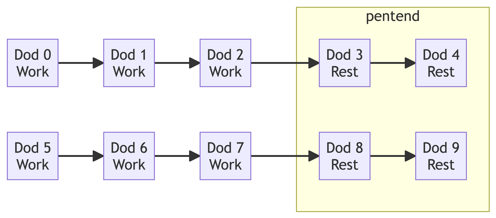
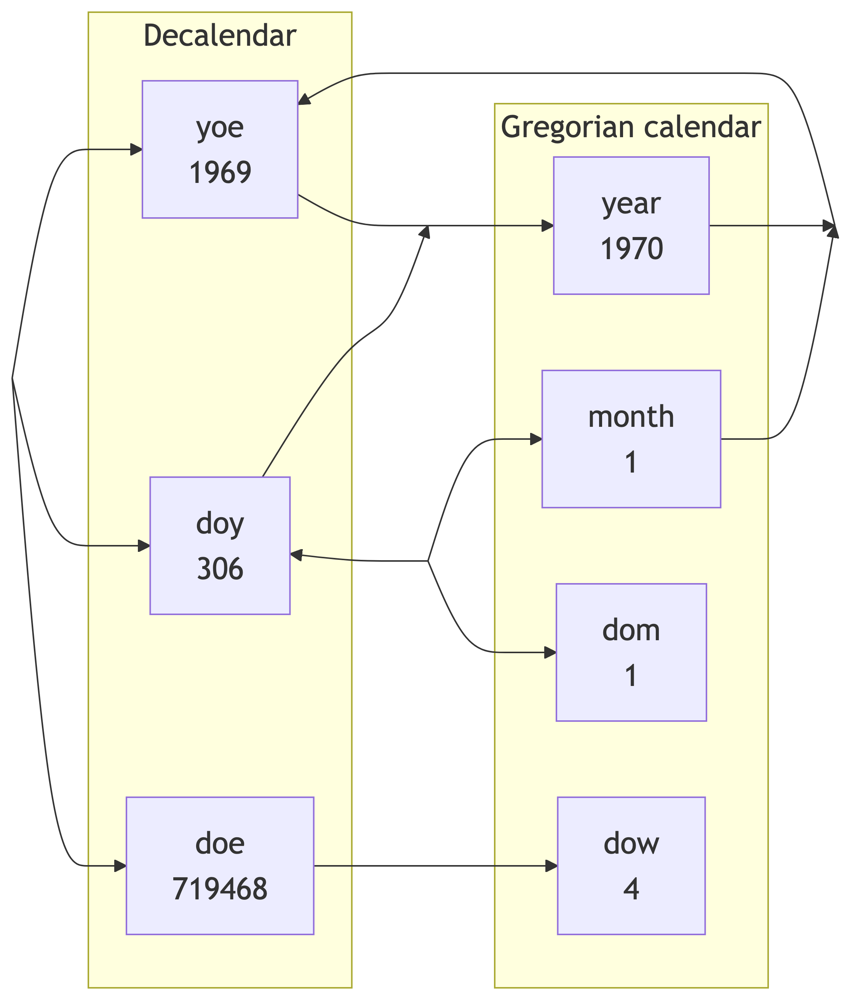
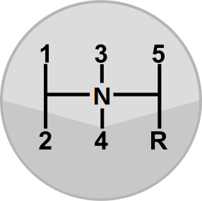
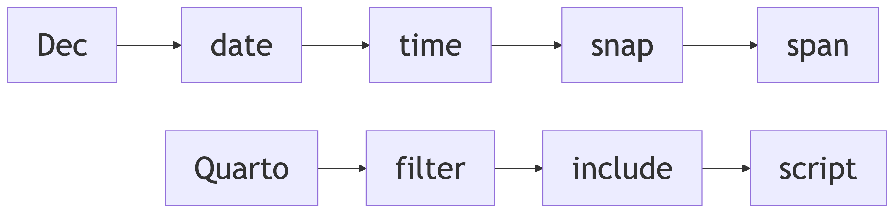

# Dec Date
Martin Laptev
2024+331

- [Day of year (doy)](#doy)
- [Day of era (doe)](#doe)
- [Year of era (yoe)](#yoe)
- [Day of week (dow)](#dow)
- [Day of dek (dod)](#dod)
- [Day of month (dom)](#dom)
- [Time of day (tod)](#tod)
- [Next](#next)
- [Cite](#cite)

My website serves as a demonstration of both the
[Quarto](https://quarto.org) publishing system and the [Dec](../../dec)
measurement system. I use several clever hacks to get Quarto to display
all of the dates on my website in the Dec
<span class="yellow">year</span>+<span class="cyan">day</span> format.
Knowing the basics of Dec dates will help you to understand the articles
on [filter](https://quarto.org/docs/extensions/filters.html),
[script](https://quarto.org/docs/projects/scripts.html), and
[include](https://quarto.org/docs/output-formats/html-basics.html#includes)
files in the [Quarto section](../../quarto) of my site.

Among its many features, Quarto offers support for the
[Observable](https://observablehq.com/) data analysis and visualization
system. In the Observable
[calendar🗓️plots](https://observablehq.com/@observablehq/plot-calendar)
below, [Gregorian
calendar](https://en.wikipedia.org/wiki/Gregorian_calendar#:~:text=the%20calendar%20used%20in%20most%20parts%20of%20the%20world)
months are identified by
[color](https://observablehq.com/@d3/color-schemes) and each day of the
year has its own [cell](https://observablehq.com/plot/marks/cell).
Despite these similarities, the two plots illustrate how the Dec (top)
and Gregorian (bottom) calendars differ.

In the Gregorian calendar, a month and a day-of-month
(<span class="under tool" data-bs-toggle="tooltip"
data-bs-title="day-of-month">dom</span>) identify a specific day in a
given year like a pair of coordinates, such as longitude and latitude in
the [geographic🌐coordinate
system](https://en.wikipedia.org/wiki/Geographic_coordinate_system#:~:text=a%20spherical%20or%20geodetic%20coordinate%20system%20for%20measuring%20and%20communicating%20positions%20directly%20on%20Earth%20as%20latitude%20and%20longitude)
or x and y in the [Cartesian coordinate
system](https://en.wikipedia.org/wiki/Cartesian_coordinate_system#:~:text=a%20coordinate%20system%20that%20specifies%20each%20point%20uniquely%20by%20a%20pair%20of%20real%20numbers%20called%20coordinates).
Instead of months and <span class="under tool" data-bs-toggle="tooltip"
data-bs-title="days-of-month">doms</span>, the Dec calendar (Decalendar)
uses a single number: the day-of-year (<span class="under tool"
data-bs-toggle="tooltip" data-bs-title="day-of-year">doy</span>).

# Day of year (doy)

The <span class="under tool" data-bs-toggle="tooltip"
data-bs-title="day-of-year">doy</span> chosen by the
[Observable](https://observablehq.com/)
[range](https://observablehq.com/@observablehq/input-range)🎚️inputs
below to be highlighted with a red🟥background in the calendar🗓️plots,
<span class="cyan">${dotyInput}</span>, functions like a pair of
coordinates in the top calendar🗓️plot by selecting a group of 10 days
called a dek on the x-axis↔️via the dek equation,
<span class="cyan">${dekInput}</span> =
⌊<span class="cyan">${dotyInput}</span> ÷ 10⌋, and a day-of-dek
(<span class="under tool" data-bs-toggle="tooltip"
data-bs-title="day-of-dek">dod</span>) on the y-axis↕with its last
digit, <span class="cyan">${dodInput}</span>.

The Play▶️button beneath the
[range](https://observablehq.com/@observablehq/input-range)🎚️inputs
cycles🔄through the year so that every <span class="under tool"
data-bs-toggle="tooltip" data-bs-title="day-of-year">doy</span> gets its
turn to have a red🟥background. All Dec years start on the first day,
<span class="tool" data-bs-toggle="tooltip"
data-bs-title="March 1"><u>Day 0</u></span>, of the first dek of the
year, Dek 0. [Common
years](https://en.wikipedia.org/wiki/Common_year#:~:text=a%20calendar%20year%20with%20365%20days)
end on <span class="tool" data-bs-toggle="tooltip"
data-bs-title="February 28"><u>Day 364</u></span>, the midpoint of Dek
36, whereas [leap
years](https://en.wikipedia.org/wiki/Leap_year#:~:text=a%20calendar%20year%20that%20contains%20an%20additional%20day)
end on <span class="tool" data-bs-toggle="tooltip"
data-bs-title="February 29"><u>Day 365</u></span>, the Dec and Gregorian
calendar [leap
day](https://en.wikipedia.org/wiki/February_29#:~:text=intercalary%20date%20added%20periodically).

The toggle✅input labelled “Leap year” to the right of the Play▶️button
adds or removes <span class="tool" data-bs-toggle="tooltip"
data-bs-title="February 29"><u>Day 365</u></span>, and thus shifts 306
dates, <span class="tool" data-bs-toggle="tooltip"
data-bs-title="March 1"><u>Day 0</u></span> to <span class="tool"
data-bs-toggle="tooltip" data-bs-title="December 31"><u>Day
305</u></span>, in the bottom calendar🗓️plot by one day, but does not
change the order of any dates in the top calendar🗓️plot, because
<span class="tool" data-bs-toggle="tooltip"
data-bs-title="February 29"><u>Day 365</u></span> is the last day of Dec
leap years and the <span class="under tool" data-bs-toggle="tooltip"
data-bs-title="day-of-year">doy</span> resets to zero at the start of
every year.

``` {ojs}
//| echo: false
viewof dotyInput = Inputs.range([0, 364 + leapInput], {value: 306, step: 1, label: "Day of year"});
viewof monthInput = transformInput(
  Inputs.range([1, 12], {step: 1, label: "Month"}),
  {bind: viewof dotyInput, transform: doty2month, invert: month2doty}
);
viewof dotyInput1 = transformInput(
  Inputs.range([-365 - leapInput, -1], {step: 1, label: "Day of year"}),
  {bind: viewof dotyInput, transform: subN, invert: addN}
);
viewof dotmInput = transformInput(
  Inputs.range([1, 31], {step: 1, label: "Day of month"}),
  {bind: viewof dotyInput, transform: doty2dotm, invert: (x => Math.floor(( 153 * (
    viewof monthInput.value > 2
    ? viewof monthInput.value - 3
    : viewof monthInput.value + 9) + 2
  ) / 5 + x - 1
))});
viewof leapscrub = Inputs.form([
  Scrubber(numbers, {autoplay: false, alternate: true, delay: 86.4, loopDelay: 864, format: y => "", inputStyle: "display:none;"}),
  Inputs.toggle({label: "Leap year", value: false}),
])
```

<div class="column-page">

``` {ojs}
//| echo: false
decPlot = Plot.plot({
  padding: 0,
  width: 1280,
  height: 280,
  className: "calplot",
  marginTop: -3,
  marginLeft: 31,
  marginBottom: 35,
  y: {tickSize: 0,
      label: "Day of dek    ",
      domain: [-1, 0, 1, 2, 3, 4, 5, 6, 7, 8, 9],
      ticks: [0, 1, 2, 3, 4, 5, 6, 7, 8, 9],
      tickPadding: -4,
      labelOffset: 28,
  },
  x: {interval: 1, ticks: 18, label: "Dek", type: "band", tickSize: 0, tickPadding: -2, labelOffset: 32},
  //fx: {tickFormat: ""},
  style: { fontSize: "21px" },
  color: {
    range: d3.schemePastel1.concat(d3.schemePastel2.slice(4, 7)).concat(d3.schemeSet1[0]),
    domain: months.concat("selected"),
    className: "cal",
  },
  marks: [
    Plot.cell(dates, {
      x: (d, i) => Math.floor(i / 10),
      y: (d, i) => i % 10,
      //fx: d => d.getUTCFullYear(),
      fill: d => Math.floor(unix2doty(d.getTime())) === dotyInput ? "selected" : months[d.getUTCMonth()],
      stroke: d => Math.floor(unix2doty(d.getTime())) === dotyInput ? "darkorange" : "none",
      strokeWidth: 3,
      inset: 0.5,
    }),
    Plot.text(dates, {
      x: (d, i) => Math.floor(i / 10),
      y: (d, i) => i % 10,
      //fx: d => d.getUTCFullYear(),
      text: d => d.getUTCDate() === 7 ? months[d.getUTCMonth()].slice(0, 3) : "",
      y: -1,
      frameAnchor: "left",
      dy: -1,
      monospace: true,
      fontSize: "18px"}),
    Plot.text(dates, {
      x: (d, i) => Math.floor(i / 10),
      y: (d, i) => i % 10,
      //fx: d => d.getUTCFullYear(),
      fill: d => Math.floor(unix2doty(d.getTime())) === dotyInput ? "white" : "black",
      //stroke: "white",
      text: (d, i) => String(i),//.padStart(3, "0").slice(1),
      monospace: true,
      fontSize: "16px"})
  ]
})
```

``` {ojs}
//| echo: false
calPlot = Plot.plot({
  padding: 0,
  width: 1280,
  height: 200,
  className: "calplot",
  marginTop: 0,
  marginBottom: 40,
  marginLeft: 42,
  y: {tickFormat: Plot.formatWeekday("en", "short"), tickSize: 0,
      domain: [-1, 0, 1, 2, 3, 4, 5, 6],
      ticks: [0, 1, 2, 3, 4, 5, 6],
      tickPadding: 2,
  },
  x: {interval: 1, ticks: 26, label: "Week", type: "band", tickSize: 0, tickPadding: 2, labelOffset: 36},
  //fx: {tickFormat: ""},
  style: { fontSize: "20px" },
  color: {
    range: d3.schemePastel1.concat(d3.schemePastel2.slice(4, 7)).concat(d3.schemeSet1[0]),
    domain: months.concat("selected"),
    className: "cal",
  },
  marks: [
    Plot.cell(datesCal, {
      x: d => d3.utcWeek.count(d3.utcYear(d), d),
      y: d => d.getUTCDay(),
      //fx: d => d.getUTCFullYear(),
      fill: d => Math.floor(unix2doty(d.getTime())) === dotyInput ? "selected" : months[d.getUTCMonth()],
      stroke: d => Math.floor(unix2doty(d.getTime())) === dotyInput ? "darkorange" : "none",
      strokeWidth: 3,
      inset: .5,
    }),
    Plot.text(datesCal, {
      x: d => d3.utcWeek.count(d3.utcYear(d), d),
      y: d => d.getUTCDay(),
      //fx: d => d.getUTCFullYear(),
      text: d => d.getUTCDate() === 7 ? months[d.getUTCMonth()].slice(0, 3) : "",
      y: -1,
      frameAnchor: "left",
      dy: -1,
      monospace: true,
      fontSize: "18px"}),
    Plot.text(datesCal, {
      x: d => d3.utcWeek.count(d3.utcYear(d), d),
      y: d => d.getUTCDay(),
      //fx: d => d.getUTCFullYear(),
      fill: d => Math.floor(unix2doty(d.getTime())) === dotyInput ? "white" : "black",
      //stroke: "white",
      text: d => d.getUTCDate(), //Math.floor(unix2doty(d.getTime())).toString().padStart(3, "0"),
      monospace: true,
      fontSize: "16px"})
  ]
})
```

</div>

<span class="radiotitle">First day of the Gregorian calendar year</span>

``` {ojs}
//| echo: false
//| id: radiobuttons
viewof dotwInput = Inputs.radio([
  "Sunday", "Monday", "Tuesday", "Wednesday", "Thursday", "Friday", "Saturday",
  ], {value: "Sunday"})
```

The radio🔘input beneath the calendar🗓️plots picks the
<span class="under tool" data-bs-toggle="tooltip"
data-bs-title="day-of-week">dow</span> for <span class="under tool"
data-bs-toggle="tooltip" data-bs-title="January 1">Day 306</span>, the
first day of the Gregorian calendar year. Changing the
<span class="under tool" data-bs-toggle="tooltip"
data-bs-title="January 1">Day 306</span> <span class="under tool"
data-bs-toggle="tooltip" data-bs-title="day-of-week">dow</span> does not
affect the top calendar🗓️plot, but shifts every date in the bottom
calendar🗓️plot by one to six days depending on the number of days that
Week 0, the first week of the year, contributes to the year.

There are two range🎚️inputs labeled as “day of year” because every
<span class="under tool" data-bs-toggle="tooltip"
data-bs-title="day-of-year">doy</span> can be expressed as both a
positive and a negative number. The typical range for
<span class="under tool" data-bs-toggle="tooltip"
data-bs-title="days-of-year">doys</span> is 0 to
<span class="orange">n</span>-1, but negative <span class="under tool"
data-bs-toggle="tooltip" data-bs-title="days-of-year">doys</span>
typically range from -<span class="orange">n</span> to -1, where
<span class="orange">n</span> is the number of days in the year. A
<span class="under tool" data-bs-toggle="tooltip"
data-bs-title="day-of-year">doy</span> outside these
[bounds](https://en.wikipedia.org/wiki/Upper_and_lower_bounds#:~:text=an%20upper%20bound%20or%20majorant%5B1%5D%20of%20a%20subset%20S%20of%20some%20preordered%20set%20(K%2C%20%E2%89%A4)%20is%20an%20element%20of%20K%20that%20is%20greater%20than%20or%20equal%20to%20every%20element%20of%20S.%5B2%5D%5B3%5D%20Dually%2C%20a%20lower%20bound%20or%20minorant%20of%20S%20is%20defined%20to%20be%20an%20element%20of%20K%20that%20is%20less%20than%20or%20equal%20to%20every%20element%20of%20S)
represents a day in a previous or subsequent year.

Unlike weeks in the Gregorian calendar, <span class="under tool"
data-bs-toggle="tooltip" data-bs-title="days-of-year">doys</span> and
deks do not need to continue in an infinite unbroken sequence. The last
day of the year, Day -1, is always followed by <span class="tool"
data-bs-toggle="tooltip" data-bs-title="March 1"><u>Day 0</u></span>,
regardless of the last 4 or 5 days of Dek 36 that extend past the end of
the year. If we want to track days seamlessly across years, we can use a
continuous count of days called the
day-of-[era](https://en.wikipedia.org/wiki/Calendar_era#:~:text=the%20period%20of%20time%20elapsed%20since%20one%20epoch%20of%20a%20calendar)
(<span class="under tool" data-bs-toggle="tooltip"
data-bs-title="day-of-era">doe</span>).

# Day of era (doe)

A <span class="under tool" data-bs-toggle="tooltip"
data-bs-title="day-of-era">doe</span> is essentially a [Julian
day](https://en.wikipedia.org/wiki/Julian_day#:~:text=a%20continuous%20count%20of%20days%20from%20the%20beginning%20of%20the%20Julian%20period)
with a different
[epoch](https://en.wikipedia.org/wiki/Epoch#:~:text=an%20instant%20in%20time%20chosen%20as%20the%20origin%20of%20a%20particular%20calendar%20era).
We can convert a Julian day in a <span class="under tool"
data-bs-toggle="tooltip" data-bs-title="day-of-era">doe</span> by
subtracting <span class="cyan">1721119.5</span> days to shift the epoch
from <span class="under yellow" data-bs-toggle="tooltip"
data-bs-title="4714 BC">-4713</span>+<span class="under cyan"
data-bs-toggle="tooltip"
data-bs-title="November 24">268</span>.<span class="under cyan"
data-bs-toggle="tooltip" data-bs-title="noon">5</span> to
<span class="under yellow" data-bs-toggle="tooltip"
data-bs-title="1 BC">0000</span>+<span class="under cyan"
data-bs-toggle="tooltip"
data-bs-title="March 1">000</span>.<span class="under cyan"
data-bs-toggle="tooltip" data-bs-title="midnight">0</span>. To turn a
[UNIX
timestamp](https://en.wikipedia.org/wiki/Unix_time#:~:text=the%20number%20of%20non%2Dleap%20seconds%20that%20have%20elapsed%20since%2000%3A00%3A00%20UTC%20on%201%C2%A0January%201970)
into a <span class="under tool" data-bs-toggle="tooltip"
data-bs-title="day-of-era">doe</span>, we divide by
[86400](https://en.wikipedia.org/wiki/Day#:~:text=average%2C%20this%20is-,24%20hours%20(86%2C400%20seconds),-.%20As%20a%20day)
to convert seconds to days and then add
<span class="cyan">719468.0</span> to account for the fact that the
[UNIX
epoch](https://en.wikipedia.org/wiki/Unix_time#:~:text=00%3A00%3A00%20UTC%20on%201%C2%A0January%201970)
is <span class="under yellow" data-bs-toggle="tooltip"
data-bs-title="1970">1969</span>+<span class="under cyan"
data-bs-toggle="tooltip"
data-bs-title="January 1">306</span>.<span class="under cyan"
data-bs-toggle="tooltip" data-bs-title="midnight">0</span>.

Dec uses <span class="under tool" data-bs-toggle="tooltip"
data-bs-title="days-of-era">does</span> for calculations, such as
finding the
[POSIX](https://en.wikipedia.org/wiki/POSIX#:~:text=a%20family%20of%20standards%20specified%20by%20the%20IEEE%20Computer%20Society%20for%20maintaining%20compatibility%20between%20operating%20systems)
[zero-based <span class="under tool" data-bs-toggle="tooltip"
data-bs-title="day-of-week">dow</span>](https://pubs.opengroup.org/onlinepubs/007904875/utilities/date.html#:~:text=weekday%20as%20a%20decimal%20number%20%5B0%2C6%5D%20(0%3Dsunday))
of a given date. This year, the <span class="under tool"
data-bs-toggle="tooltip" data-bs-title="day-of-week">dow</span> of
[Christmas](https://en.wikipedia.org/wiki/Christmas#:~:text=annual%20festival%20commemorating%20the%20birth%20of%20Jesus%20Christ)🎄is
<span class="wine">${xmasDotw}</span>, according to the Dec
<span class="under tool" data-bs-toggle="tooltip"
data-bs-title="day-of-week">dow</span> equation:
(<span class="cyan">${xmasDote}</span> + 3)
[mod](https://en.wikipedia.org/wiki/Modulo#:~:text=returns%20the%20remainder)
7 = <span class="wine">${xmasDotw}</span>. In contrast to the
<span class="under tool" data-bs-toggle="tooltip"
data-bs-title="day-of-week">dow</span>, finding the
<span class="under tool" data-bs-toggle="tooltip"
data-bs-title="day-of-dek">dod</span> of a given Dec date does not
require any calculations because the <span class="under tool"
data-bs-toggle="tooltip" data-bs-title="day-of-dek">dod</span> is simply
the last digit of the [integer
part](https://en.wikipedia.org/wiki/Decimal#:~:text=the%20integer%20written%20to%20the%20left%20of%20the%20decimal)
of the <span class="under tool" data-bs-toggle="tooltip"
data-bs-title="day-of-year">doy</span>.

<div>

> **Bad Pun Alert**
>
> [Dek the
> halls](https://en.wikipedia.org/wiki/Deck_the_Halls#:~:text=a%20traditional%20Christmas%20carol.)
> with <span class="under tool" data-bs-toggle="tooltip"
> data-bs-title="days-of-week">dows</span> of holly! Fa + la × 8!

</div>

Christmas🎄is a fixed⚓️holiday because it occurs on the same
<span class="under tool" data-bs-toggle="tooltip"
data-bs-title="day-of-year">doy</span>, <span class="tool"
data-bs-toggle="tooltip" data-bs-title="December 25"><u>Day
299</u></span>, every year. Unlike fixed⚓️holidays, Gregorian calendar
floating🛟holidays happen on a different <span class="under tool"
data-bs-toggle="tooltip" data-bs-title="day-of-year">doy</span> every
year so that their <span class="under tool" data-bs-toggle="tooltip"
data-bs-title="day-of-week">dow</span> can remain constant. Dec uses the
<span class="under tool" data-bs-toggle="tooltip"
data-bs-title="day-of-week">dow</span>
[delta](https://en.wikipedia.org/wiki/Delta_(letter)#:~:text=the%20difference%20operator)
equation, <span class="wine">w<sub>Δ</sub></span> =
(<span class="wine">w<sub>M</sub></span> -
<span class="wine">w<sub>S</sub></span> + 7)
[mod](https://en.wikipedia.org/wiki/Modulo#:~:text=returns%20the%20remainder)
7, to determine which of the seven possible floating🛟holiday dates
corresponds to the given year.

In the <span class="under tool" data-bs-toggle="tooltip"
data-bs-title="day-of-week">dow</span>
[delta](https://en.wikipedia.org/wiki/Delta_(letter)#:~:text=the%20difference%20operator)
equation, <span class="wine">w<sub>M</sub></span> is the
[minuend](https://en.wiktionary.org/wiki/minuend#:~:text=A%20number%20or%20quantity%20from%20which%20another%20is%20to%20be%20subtracted)
<span class="under tool" data-bs-toggle="tooltip"
data-bs-title="day-of-week">dow</span> destination and
<span class="wine">w<sub>S</sub></span> is the
[subtrahend](https://en.wikipedia.org/wiki/Subtraction#:~:text=number%20being%20subtracted)
<span class="under tool" data-bs-toggle="tooltip"
data-bs-title="day-of-week">dow</span> starting point. To get the
<span class="under tool" data-bs-toggle="tooltip"
data-bs-title="day-of-year">doy</span> of
[Thanksgiving](https://en.wikipedia.org/wiki/Thanksgiving#:~:text=Thanksgiving%20is-,a%20national%20holiday,-celebrated%20on%20various)🦃in
the United States and Brazil, we plug <span class="wine">4</span> as
<span class="wine">w<sub>M</sub></span> and
<span class="wine">${day266dotw}</span>, the <span class="under tool"
data-bs-toggle="tooltip" data-bs-title="day-of-week">dow</span> of
<span class="tool" data-bs-toggle="tooltip"
data-bs-title="November 22"><u>Day 266</u></span> this year, as
<span class="wine">w<sub>S</sub></span> into the
<span class="under tool" data-bs-toggle="tooltip"
data-bs-title="day-of-week">dow</span>
[delta](https://en.wikipedia.org/wiki/Delta_(letter)#:~:text=the%20difference%20operator)
equation, <span class="wine">${day266dotwDiff}</span> =
(<span class="wine">4</span> - <span class="wine">${day266dotw}</span> +
7)
[mod](https://en.wikipedia.org/wiki/Modulo#:~:text=returns%20the%20remainder)
7, and then add <span class="wine">w<sub>Δ</sub></span> to
<span class="cyan">266</span>: <span class="cyan">${day266dotwDiff +
266}</span> = <span class="wine">${day266dotwDiff}</span> +
<span class="cyan">266</span>. Simply put, Thanksgiving🦃is the first
<span class="under tool" data-bs-toggle="tooltip"
data-bs-title="Thrsday">Dow 4</span> after <span class="tool"
data-bs-toggle="tooltip" data-bs-title="November 12"><u>Day
256</u></span>.

Apart from the <span class="under tool" data-bs-toggle="tooltip"
data-bs-title="day-of-week">dow</span> and <span class="under tool"
data-bs-toggle="tooltip" data-bs-title="day-of-week">dow</span>
[delta](https://en.wikipedia.org/wiki/Delta_(letter)#:~:text=the%20difference%20operator)
equations, the Thanksgiving🦃calculation above relies on the Dec
<span class="under tool" data-bs-toggle="tooltip"
data-bs-title="day-of-era">doe</span> equation, which is based on the <a
href="https://howardhinnant.github.io/date_algorithms.html#days_from_civil"
class="mono under"><code>days_from_civil</code></a> algorithm created by
[Howard Hinnant](https://howardhinnant.github.io) and described in his
manuscript entitled [<span class="mono under">`chrono`</span>-Compatible
Low-Level Date
Algorithms](https://howardhinnant.github.io/date_algorithms.html), to
convert the
[cycle](https://en.wikipedia.org/wiki/Solar_cycle_(calendar)#:~:text=the%20Gregorian%20cycle%20of%20400%20years%20has%20exactly%20146%2C097%20days%2C%20i.e.%20exactly%2020%2C871%20weeks%2C%20one%20can%20say%20that%20the%20Gregorian%20so%2Dcalled%20solar%20cycle%20lasts%20400%20years)-of-era
(<span class="under tool" data-bs-toggle="tooltip"
data-bs-title="cycle-of-era">coe</span>), year-of-cycle
(<span class="under tool" data-bs-toggle="tooltip"
data-bs-title="year-of-cycle">yoc</span>), and <span class="under tool"
data-bs-toggle="tooltip" data-bs-title="day-of-year">doy</span> of
<span class="tool" data-bs-toggle="tooltip"
data-bs-title="November 22"><u>Day 266</u></span> into its
<span class="under tool" data-bs-toggle="tooltip"
data-bs-title="day-of-era">doe</span>:

$$\text{coe} = \Biggl \lfloor \frac{\begin{cases}\text{year}&{\text{if } \text{year} \geq 0;}\\\text{year}-399&{\text{otherwise.}}\end{cases}}{400} \Biggr \rfloor$$

yoc = year − coe × 400

<div style="overflow-x:auto;overflow-y:hidden;">

$$\text{doe} = \text{coe}\times146097 + \text{yoc}\times365 + \lfloor\frac{\text{yoc}}{4}\rfloor - \lfloor\frac{\text{yoc}}{100}\rfloor + \text{doy}$$

</div>

The Dec date equations, the
[inverse](https://en.wikipedia.org/wiki/Inverse#:~:text=Inverse%20function%2C-,a%20function%20that%20%22reverses%22%20another%20function,-Generalized%20inverse%2C%20a)🔁of
the Dec <span class="under tool" data-bs-toggle="tooltip"
data-bs-title="day-of-era">doe</span> equation above, are based on
Howard Hinnant’s <a
href="https://howardhinnant.github.io/date_algorithms.html#days_from_civil"
class="mono"><code>days_from_civil</code></a> algorithm and is useful
for obtaining Dec dates from <span class="under tool"
data-bs-toggle="tooltip" data-bs-title="days-of-era">does</span> and
<span class="under tool" data-bs-toggle="tooltip"
data-bs-title="day-of-era">doe</span> analogs like [Unix
timestamps](https://en.wikipedia.org/wiki/Unix_time#:~:text=the%20number%20of%20seconds%20that%20have%20elapsed%20since%2000%3A00%3A00%20UTC%20on%201%C2%A0January%201970)
and [Julian
days](https://en.wikipedia.org/wiki/Julian_day#:~:text=a%20continuous%20count%20of%20days%20from%20the%20beginning%20of%20the%20Julian%20period).
Apart from <span class="under tool" data-bs-toggle="tooltip"
data-bs-title="cycle-of-era">coe</span> and <span class="under tool"
data-bs-toggle="tooltip" data-bs-title="year-of-cycle">yoc</span>, the
Dec date equations use the day-of-cycle (<span class="under tool"
data-bs-toggle="tooltip" data-bs-title="day-of-cycle">doc</span>) of a
<span class="under tool" data-bs-toggle="tooltip"
data-bs-title="day-of-era">doe</span> to produce the
<span class="under tool" data-bs-toggle="tooltip"
data-bs-title="day-of-era">doe</span>’s corresponding year and
<span class="under tool" data-bs-toggle="tooltip"
data-bs-title="day-of-year">doy</span>:

$$\text{coe} = \Biggl \lfloor \frac{\begin{cases}\text{doe}&{\text{if } \text{doe} \geq 0;}\\\text{doe}-146096&{\text{otherwise.}}\end{cases}}{146097} \Biggr \rfloor$$

doc = doe − coe × 146097

$$\text{yoc} = \biggl \lfloor \frac{\text{doc} - \lfloor \frac{\text{doc}}{1460} \rfloor + \lfloor \frac{\text{doc}}{36524} \rfloor - \lfloor \frac{\text{doc}}{146096} \rfloor}{365} \biggr \rfloor$$

year = yoc + coe × 400

$$\text{doy} = \text{doc} - \text{yoc} \times 365 - \lfloor \frac{\text{yoc}}{4} \rfloor + \lfloor \frac{\text{yoc}}{100} \rfloor$$

Dates generated by the Dec date equations are guaranteed to be in the
standard <span class="yellow">year</span>+<span class="cyan">day</span>
format. Therefore, we can standardize Dec dates by performing a
[round-trip](https://en.wikipedia.org/wiki/Round-trip_format_conversion#:~:text=converting%20from%20any%20data%20representation%20and%20back%20again)
date-to-<span class="under tool" data-bs-toggle="tooltip"
data-bs-title="day-of-era">doe</span>-to-date conversion using the Dec
<span class="under tool" data-bs-toggle="tooltip"
data-bs-title="day-of-era">doe</span> and date equations consecutively.
This allows Dec to handle Dec dates with a non-integer
<span class="yellow">year</span> and a <span class="cyan">day</span>
outside the typical range of <span class="cyan">0</span> ≤
<span class="cyan">day</span> ≤ <span class="cyan">365</span>.

# Year of era (yoe)

A <span class="under tool" data-bs-toggle="tooltip"
data-bs-title="day-of-era">doe</span> is essentially a Dec date with a
<span class="yellow">year</span> that is always equal to
<span class="yellow">0</span> and a <span class="cyan">day</span> that
is
[unbounded](https://en.wikipedia.org/wiki/Bounded_set#:~:text=a%20set%20which%20is%20not%20bounded).
Similarly, a Dec year-of-era (<span class="under tool"
data-bs-toggle="tooltip" data-bs-title="year-of-era">yoe</span>) is
basically a Dec with a non-integer <span class="yellow">year</span> and
a <span class="cyan">day</span> permanently set to
<span class="cyan">0</span>. Both <span class="under tool"
data-bs-toggle="tooltip" data-bs-title="days-of-era">does</span> and
<span class="under tool" data-bs-toggle="tooltip"
data-bs-title="years-of-era">yoes</span> allow us to represent a date as
a single number and obtain the difference between two dates, either in
days (<span class="cyan">d<sub>M</sub></span> -
<span class="cyan">d<sub>S</sub></span>) or years
(<span class="yellow">y<sub>M</sub></span> -
<span class="yellow">y<sub>S</sub></span>).

Compared to <span class="under tool" data-bs-toggle="tooltip"
data-bs-title="days-of-era">does</span>, <span class="under tool"
data-bs-toggle="tooltip" data-bs-title="years-of-era">yoes</span> are
easier to turn into Dec dates. We can convert dates to
<span class="under tool" data-bs-toggle="tooltip"
data-bs-title="years-of-era">yoes</span> and vice versa with the Dec
<span class="under tool" data-bs-toggle="tooltip"
data-bs-title="year-of-era">yoe</span> equation:
<span class="yellow">y</span> = ⌊<span class="yellow">y</span>⌋ +
<span class="cyan">d</span> ÷ <span class="orange">n</span>. In the Dec
<span class="under tool" data-bs-toggle="tooltip"
data-bs-title="year-of-era">yoe</span> equation,
<span class="yellow">y</span> is the <span class="under tool"
data-bs-toggle="tooltip" data-bs-title="year-of-era">yoe</span>,
⌊<span class="yellow">y</span>⌋ + <span class="cyan">d</span> is the Dec
date, ⌊<span class="yellow">y</span>⌋ is the year,
<span class="cyan">d</span> is the <span class="under tool"
data-bs-toggle="tooltip" data-bs-title="day-of-year">doy</span>, and
<span class="orange">n</span> is the number of days in Year
⌊<span class="yellow">y</span>⌋. The current <span class="under tool"
data-bs-toggle="tooltip" data-bs-title="year-of-era">yoe</span> equation
values are <span class="yellow">${fullfracYear}</span> =
<span class="yellow">${decoYear}</span> +
<span class="cyan">${decoDoty}</span> ÷
<span class="orange">${nDaysInYear}</span>.

Dec dates do not include <span class="orange">n</span>, because it is
not needed to specify a date, remains constant for 366, 1095, or 2920
days, has only 2 possible values: 366 if
⌊<span class="yellow">y</span>⌋+1 is a Gregorian calendar leap year and
365 if ⌊<span class="yellow">y</span>⌋+1 is a Gregorian calendar common
year, and can be determined by applying the Gregorian calendar [leap
year
rule](https://en.wikipedia.org/wiki/Leap_year#:~:text=Every%20year%20that%20is%20exactly%20divisible%20by%20four%20is%20a%20leap%20year%2C%20except%20for%20years%20that%20are%20exactly%20divisible%20by%20100%2C%20but%20these%20centurial%20years%20are%20leap%20years%20if%20they%20are%20exactly%20divisible%20by%20400)
to ⌊<span class="yellow">y</span>⌋+1, as shown in the Dec year length
equation:

$$\text{n}=\begin{cases}
  366&{\begin{align}\text{if } (\lfloor \text{y}\rfloor+1)\text{ mod }\\\\\\\\4=0\\
  \href{https://en.wikipedia.org/wiki/Logical_conjunction}{\land}(\lfloor \text{y}\rfloor+1)\text{ mod }100\neq0\\
  \href{https://en.wikipedia.org/wiki/Logical_disjunction}{\lor}(\lfloor \text{y}\rfloor+1)\text{ mod }400=0\end{align}}\\\\
  365&{\text{otherwise.}}\end{cases}$$

Apart from its role in the Dec date and <span class="under tool"
data-bs-toggle="tooltip" data-bs-title="day-of-year">doy</span>
equations, <span class="orange">n</span> is needed to convert between
<span class="yellow">year</span>+<span class="cyan">day</span> and
<span class="yellow">year</span>-<span class="pink">day</span> Dec
dates. The
<span class="yellow">year</span>-<span class="pink">day</span> version
of the Dec <span class="under tool" data-bs-toggle="tooltip"
data-bs-title="year-of-era">yoe</span> equation is
⌊<span class="yellow">y</span>⌋+1+(<span class="cyan">d</span>-<span class="orange">n</span>)÷<span class="orange">n</span>=<span class="yellow">y</span>.
In essence, <span class="cyan">d</span>-<span class="orange">n</span> is
the number of days until the start of Year
⌊<span class="yellow">y</span>⌋+1. The current
<span class="yellow">year</span>-<span class="pink">day</span> date,
<span class="yellow">${nextYear}</span>-<span class="pink">${TminusPadded}</span>,
tells us that Year <span class="yellow">${nextYear}</span> will begin in
<span class="pink">${Tminus}</span> days.

The distinction between <span class="cyan">d</span> and
<span class="cyan">d</span>-<span class="orange">n</span> can also be
explained in terms of computer programming. If we think of years as
[arrays](https://en.wikipedia.org/wiki/Array_(data_structure)#Element_identifier_and_addressing_formulas:~:text=a%20data%20structure%20consisting%20of%20a%20collection%20of%20elements%20(values%20or%20variables)%2C%20of%20same%20memory%20size%2C%20each%20identified%20by%20at%20least%20one%20array%20index),
<span class="cyan">d</span> and
<span class="cyan">d</span>-<span class="orange">n</span> are like array
[indexes](https://en.wikipedia.org/wiki/Array_(data_structure)#Element_identifier_and_addressing_formulas:~:text=individual%20objects%20are%20selected%20by%20an%20index)
that can be used to identify array elements or combine them into groups
via
[slicing](https://en.wikipedia.org/wiki/Array_slicing#:~:text=an%20operation%20that%20extracts%20a%20subset%20of%20elements%20from%20an%20array).
In this analogy, <span class="orange">n</span> is the number of elements
in the array, <span class="cyan">d</span> is a [positive
index](https://en.wikipedia.org/wiki/Zero-based_numbering#:~:text=a%20way%20of%20numbering%20in%20which%20the%20initial%20element%20of%20a%20sequence%20is%20assigned%20the%20index%C2%A00),
and <span class="cyan">d</span>-<span class="orange">n</span> is a
[negative
index](https://en.wikipedia.org/wiki/Array_slicing#:~:text=specify%20an%20offset%20from%20the%20end%20of%20the%20array).

The <span class="under tool" data-bs-toggle="tooltip"
data-bs-title="year-of-era">yoe</span> equation can be rearranged into
the Dec <span class="under tool" data-bs-toggle="tooltip"
data-bs-title="day-of-year">doy</span> equation,
<span class="cyan">d</span> = ⌊<span class="yellow">y</span>
[mod](https://en.wikipedia.org/wiki/Modulo#:~:text=returns%20the%20remainder)
1 × <span class="orange">n</span>⌋, where <span class="yellow">y</span>
[mod](https://en.wikipedia.org/wiki/Modulo#:~:text=returns%20the%20remainder)
1 is the [decimal
part](https://en.wikipedia.org/wiki/Fractional_part#:~:text=the%20excess%20beyond%20that%20number%27s%20integer%20part)
of <span class="yellow">y</span>. The current <span class="under tool"
data-bs-toggle="tooltip" data-bs-title="day-of-year">doy</span> equation
values are <span class="cyan">${decoDoty}</span> =
⌊<span class="yellow">${mod1FracYear}</span> ×
<span class="orange">${nDaysInYear}</span>⌋. In Dec, a
<span class="under tool" data-bs-toggle="tooltip"
data-bs-title="day-of-year">doy</span> by itself is a floating🛟date and
a <span class="yellow">year</span>+<span class="cyan">day</span> date is
a fixed⚓️date. Unlike fixed⚓️dates, floating🛟dates do not include a
year and thus can apply to any year.

Fixed⚓️dates are
[unsimplified](https://en.wikipedia.org/wiki/Simplification#:~:text=the%20process%20of%20replacing%20a%20mathematical%20expression%20by%20an%20equivalent%20one%2C%20that%20is%20simpler)
math expressions. Instead of simplifying a fixed⚓️date into a
<span class="under tool" data-bs-toggle="tooltip"
data-bs-title="year-of-era">yoe</span>, we can do the opposite and
expand it to display additional information, such as the number of days
in between it and another date. An expanded version of the current date,
<span class="yellow">${decoYear}</span>+<span class="cyan">299</span>${xmasDiffSign}<span class="denim">${Math.abs(xmasDiff)}</span>,
can tell us that <span class="denim">${Math.abs(xmasDiff)}</span> days
${xmasDiffSince} <span class="tool" data-bs-toggle="tooltip"
data-bs-title="December 25"><u>Day 299</u></span>🎄of this year.

In the example above, the minuend <span class="cyan">${decoDoty}</span>
has been expanded into the subtrahend <span class="cyan">299</span> and
the difference <span class="denim">${xmasDiff}</span> according to the
minuend equation: minuend = subtrahend + difference. If we were
preparing for a rocket🚀launch, the minuend would be the current time,
the subtrahend would be the planned launch time, and the difference
would be the [“T-minus”
countdown](https://en.wikipedia.org/wiki/Countdown#:~:text=backward%20counting%20to%20indicate%20the%20time%20remaining%20before%20an%20event).

To see its minuend, subtrahend, and difference at the same time, we
could rewrite the expanded date above as a Dec span🌈:
<span class="yellow">${decoYear}</span>+<span class="cyan">${decoDoty}</span>=<span class="yellow">${decoYear}</span>+<span class="cyan">299</span>${xmasDiffSign}<span class="denim">${Math.abs(xmasDiff)}</span>.
Unlike expanded dates, Dec spans🌈represent time intervals instead of
individual dates and are structured like the minuend equation as opposed
to a math expression that can be simplified to a
<span class="under tool" data-bs-toggle="tooltip"
data-bs-title="year-of-era">yoe</span>.

Whereas expanded dates have a set structure that does not change, Dec
spans🌈can omit the subtrahend,
<span class="yellow">${decoYear}</span>+<span class="cyan">${decoDoty}</span>=${xmasDiffSign}<span class="denim">${Math.abs(xmasDiff)}</span>,
or the difference,
<span class="yellow">${decoYear}</span>+<span class="cyan">${decoDoty}</span>=<span class="yellow">${decoYear}</span>+<span class="cyan">299</span>.
If the year is the same on both sides of the equals sign, it can be
omitted from the minuend,
<span class="cyan">${decoDoty}</span>=<span class="yellow">${decoYear}</span>+<span class="cyan">299</span>${xmasDiffSign}<span class="denim">${Math.abs(xmasDiff)}</span>,
or from the subtrahend along with the difference:
<span class="yellow">${decoYear}</span>+<span class="cyan">${decoDoty}</span>=<span class="cyan">299</span>.

Dec spans🌈 can omit their entire
[left](https://en.wikipedia.org/wiki/Sides_of_an_equation#:~:text=the%20expression%20on%20the%20left%20of%20the%20%22%3D%22)-hand
side to indicate that the minuend is <span class="tool"
data-bs-toggle="tooltip" data-bs-title="March 1"><u>Day 0</u></span> of
the given year. Similarly, an empty
[right](https://en.wikipedia.org/wiki/Sides_of_an_equation#:~:text=The%20expression%20on%20the%20right%20side%20of%20the%20%22%3D%22%20sign)-hand
side means that the subtrahend is <span class="tool"
data-bs-toggle="tooltip" data-bs-title="March 1"><u>Day 0</u></span> of
the subsequent year. Dec spans🌈with at least one year are called
fixed⚓️spans🌈. In contrast, floating🛟spans🌈do not contain a year and
thus can be reused♻️ every year.

Floating🛟dates and spans🌈are reusable♻️across all years, but the
information displayed by expanded dates and spans🌈may not be.
Information related to weeks is difficult to reuse♻️, because it takes 6
to 40 years for the pattern of <span class="under tool"
data-bs-toggle="tooltip" data-bs-title="days-of-week">dows</span> in a
year to repeat. At the price of reusability♻️, Dec can function without
deks and use weeks instead.

# Day of week (dow)

Even though Decalendar works best with deks, Dec dates can display POSIX
[zero-based](https://pubs.opengroup.org/onlinepubs/007904875/utilities/date.html#:~:text=Weekday%20as%20a%20decimal%20number%20%5B0%2C6%5D)
<span class="under tool" data-bs-toggle="tooltip"
data-bs-title="days-of-week">dows</span>. Instead of the current Dec
date,
<span class="yellow">${decoYear}</span>+<span class="cyan">${decoDoty}</span>,
the [navigation
bar](https://en.wikipedia.org/wiki/Navigation_bar#:~:text=a%20section%20of%20a%20graphical%20user%20interface%20intended%20to%20aid%20visitors%20in%20accessing%20information)
(navbar) of my site displays the current Dec <span class="under tool"
data-bs-toggle="tooltip" data-bs-title="day-of-week">dow</span> date,
<span class="yellow">${decoYear}</span>${dotw0sign}<span class="cyan">${dotw0doty}</span>+<span class="wine">${dotw}</span>,
by splitting the current <span class="under tool"
data-bs-toggle="tooltip" data-bs-title="day-of-year">doy</span>,
<span class="cyan">${decoDoty}</span>, into the <span class="under tool"
data-bs-toggle="tooltip" data-bs-title="day-of-year">doy</span> of the
first day of the current week (<span class="under tool"
data-bs-toggle="tooltip" data-bs-title="Sunday">Dow 0</span>
<span class="under tool" data-bs-toggle="tooltip"
data-bs-title="day-of-year">doy</span>),
<span class="cyan">${dotw0doty}</span>, and the current POSIX
<span class="under tool" data-bs-toggle="tooltip"
data-bs-title="day-of-week">dow</span>:
<span class="wine">${dotw}</span>.

Instead of the <span class="under tool" data-bs-toggle="tooltip"
data-bs-title="day-of-year">doy</span> <span class="cyan">d</span>, Dec
<span class="under tool" data-bs-toggle="tooltip"
data-bs-title="day-of-week">dow</span> dates display
<span class="cyan">d</span>-<span class="wine">w</span>+<span class="wine">w</span>,
where <span class="cyan">d</span>-<span class="wine">w</span> is the
<span class="under tool" data-bs-toggle="tooltip"
data-bs-title="Sunday">Dow 0</span> <span class="under tool"
data-bs-toggle="tooltip" data-bs-title="day-of-year">doy</span> and
<span class="wine">w</span> is the <span class="under tool"
data-bs-toggle="tooltip" data-bs-title="day-of-week">dow</span>
associated with <span class="cyan">d</span>. We evaluate the
subtraction, <span class="cyan">d</span>-<span class="wine">w</span>, to
obtain the <span class="under tool" data-bs-toggle="tooltip"
data-bs-title="Sunday">Dow 0</span> <span class="under tool"
data-bs-toggle="tooltip" data-bs-title="day-of-year">doy</span>, but
leave the addition unsimplified so we can see
<span class="wine">w</span>. Dec <span class="under tool"
data-bs-toggle="tooltip" data-bs-title="day-of-week">dow</span> dates
supply all of the information needed to identify specific dates and
coordinate schedules based on deks or weeks.

Dec dates can be further modified to include [POSIX week
numbers](https://pubs.opengroup.org/onlinepubs/007904875/utilities/date.html#:~:text=week%20of%20the%20year%20(sunday%20as%20the%20first%20day%20of%20the%20week)%20as%20a%20decimal%20number%20%5B00%2C53%5D.%20all%20days%20in%20a%20new%20year%20preceding%20the%20first%20sunday%20shall%20be%20considered%20to%20be%20in%20week%200.):
<span class="yellow">${decoYear}</span>+7×<span class="wheat">${week}</span>+<span class="wine">${dotw}</span>.
The current week number, <span class="wheat">${week}</span>, is the sum
of the <span class="under tool" data-bs-toggle="tooltip"
data-bs-title="Sunday">Dow 0</span> <span class="under tool"
data-bs-toggle="tooltip" data-bs-title="day-of-year">doy</span>,
<span class="cyan">${dotw0doty}</span>, and the first
<span class="under tool" data-bs-toggle="tooltip"
data-bs-title="day-of-week">dow</span> of the year (<span class="tool"
data-bs-toggle="tooltip" data-bs-title="March 1"><u>Day 0</u></span>
<span class="under tool" data-bs-toggle="tooltip"
data-bs-title="day-of-week">dow</span>),
<span class="wine">${doty0dotw}</span>, divided by 7:
<span class="wheat">${week}</span> =
(<span class="cyan">${dotw0doty}</span> +
<span class="wine">${doty0dotw}</span>) ÷ 7. The current Dec
floating🛟week date,
7×<span class="wheat">${week}</span>+<span class="wine">${dotw}</span>,
is equal to the sum of the current <span class="under tool"
data-bs-toggle="tooltip" data-bs-title="day-of-year">doy</span> and the
<span class="tool" data-bs-toggle="tooltip"
data-bs-title="March 1"><u>Day 0</u></span> <span class="under tool"
data-bs-toggle="tooltip" data-bs-title="day-of-week">dow</span>: 7 ×
<span class="wheat">${week}</span> + <span class="wine">${dotw}</span> =
<span class="cyan">${decoDoty}</span> +
<span class="wine">${doty0dotw}</span>.

Dec week dates turn
<span class="cyan">d</span>-<span class="wine">w</span> into
7×<span class="wheat">W</span>-<span class="wine">w<sub>0</sub></span>,
where <span class="wheat">W</span> is the week number and
<span class="wine">w<sub>0</sub></span> is the <span class="tool"
data-bs-toggle="tooltip" data-bs-title="March 1"><u>Day 0</u></span>
<span class="under tool" data-bs-toggle="tooltip"
data-bs-title="day-of-week">dow</span>. In this case, the subtraction is
omitted, because <span class="wine">w<sub>0</sub></span> is not
necessary to identify a date and can be calculated from a given
<span class="yellow">y</span> by flooring it, turning it into a
<span class="under tool" data-bs-toggle="tooltip"
data-bs-title="day-of-era">doe</span>, and passing it into the
<span class="under tool" data-bs-toggle="tooltip"
data-bs-title="day-of-week">dow</span> equation. POSIX week numbers may
be useful for [week-based
accounting](https://en.wikipedia.org/wiki/Accounting_period#52%E2%80%9353-week_fiscal_year:~:text=used%20by%20companies%20that%20desire%20that%20their%20fiscal%20year%20always%20end%20on%20the%20same%20day%20of%20the%20week)🧾.

# Day of dek (dod)

Following the Dec week date pattern described above, we can base Dec
dates on any fixed-length calendar unit, including the 20-day
[dudek](https://en.wiktionary.org/wiki/dudek#Esperanto:~:text=dudek-,twenty,-Polish%5Bedit),
30-day
[tridek](https://en.wiktionary.org/wiki/tridek#Esperanto:~:text=tridek-,thirty,-Categories%3A),
40-day
[kvardek](https://en.wiktionary.org/wiki/kvardek#Esperanto:~:text=kvardek-,forty,-Categories%3A),
73-day
[sepdektri](https://en.wiktionary.org/wiki/sepdek_tri#Esperanto:~:text=sepdek%20tri-,seventy%2Dthree,-Categories%3A),
or 90-day [naŭdek](https://en.wiktionary.org/wiki/na%C5%ADdek). The
10-day
[dek](https://en.wiktionary.org/wiki/dek#Esperanto:~:text=dek-,ten%20(10),-Derived%20terms%5B)
is the best possible choice, because our [decimal numeral
system](https://en.wikipedia.org/wiki/Decimal#:~:text=system%20for%20denoting%20integer%20and%20non%2Dinteger%20numbers)
allows us to naturally combine a dek,
<span class="cyan">${decoDoty.slice(0, 2)}</span>, and a
<span class="under tool" data-bs-toggle="tooltip"
data-bs-title="day-of-dek">dod</span>,
<span class="cyan">${decoDoty\[2\]}</span>, into a
<span class="under tool" data-bs-toggle="tooltip"
data-bs-title="day-of-year">doy</span>:
<span class="cyan">${decoDoty}</span>.

While weeks are not evenly divisible by two, a dek can be cut✂️into two
equal halves called pents. The flowcharts below show Schedule
<span class="green">3</span>, the recommended pently schedule of
<span class="green">work</span> and <span class="blue">rest</span> day.
Schedule <span class="green">3</span> can be short for Schedule
<span class="blue">1</span>+<span class="green">3</span>+<span class="blue">1</span>,
if you prefer the zero-based top flowchart, or Schedule
<span class="green">3</span>+<span class="blue">2</span>, if you favor
the one-based bottom flowchart.

<div>

<figure class=''>

<div>



</div>

</figure>

</div>

<div>

<figure class=''>

<div>



</div>

</figure>

</div>

Both flowcharts use <span class="under tool" data-bs-toggle="tooltip"
data-bs-title="day-of-dek">dod</span> numbers, but the bottom one starts
from <span class="under tool" data-bs-toggle="tooltip"
data-bs-title="day-of-dek">Dod</span> 1 instead of
<span class="under tool" data-bs-toggle="tooltip"
data-bs-title="day-of-dek">Dod</span> 0 and refers to
<span class="under tool" data-bs-toggle="tooltip"
data-bs-title="day-of-dek">Dod</span> 0 as <span class="under tool"
data-bs-toggle="tooltip" data-bs-title="day-of-dek">Dod</span> 10. Like
the <span class="under tool" data-bs-toggle="tooltip"
data-bs-title="days-of-dek">dods</span> in the flowcharts above, the
<span class="under tool" data-bs-toggle="tooltip"
data-bs-title="days-of-year">doys</span> in the tables below are
arranged in both a zero-based (top) and a one-based (bottom) manner. The
tables visualize the seamless transition between a common year and the
subsequent year.

<table>
<colgroup>
<col style="width: 19%" />
<col style="width: 20%" />
<col style="width: 20%" />
<col style="width: 20%" />
<col style="width: 19%" />
</colgroup>
<thead>
<tr>
<th><span class="blue">Rest</span></th>
<th><span class="green">Work</span></th>
<th><span class="green">Work</span></th>
<th><span class="green">Work</span></th>
<th><span class="blue">Rest</span></th>
</tr>
</thead>
<tbody>
<tr>
<td><span class="blue">360</span></td>
<td><span class="green">361</span></td>
<td><span class="green">362</span></td>
<td><span class="green">363</span></td>
<td><span class="blue">364</span></td>
</tr>
<tr>
<td><span class="blue">0</span></td>
<td><span class="green">1</span></td>
<td><span class="green">2</span></td>
<td><span class="green">3</span></td>
<td><span class="blue">4</span></td>
</tr>
</tbody>
</table>

<table>
<colgroup>
<col style="width: 19%" />
<col style="width: 20%" />
<col style="width: 20%" />
<col style="width: 19%" />
<col style="width: 19%" />
</colgroup>
<thead>
<tr>
<th><span class="green">Work</span></th>
<th><span class="green">Work</span></th>
<th><span class="green">Work</span></th>
<th><span class="blue">Rest</span></th>
<th><span class="blue">Rest</span></th>
</tr>
</thead>
<tbody>
<tr>
<td><span class="green">361</span></td>
<td><span class="green">362</span></td>
<td><span class="green">363</span></td>
<td><span class="blue">364</span></td>
<td><span class="blue">0</span></td>
</tr>
<tr>
<td><span class="green">1</span></td>
<td><span class="green">2</span></td>
<td><span class="green">3</span></td>
<td><span class="blue">4</span></td>
<td><span class="blue">5</span></td>
</tr>
</tbody>
</table>

After 4 or 8 years of consecutive pents, the Schedule
<span class="green">3</span> pattern shown in the flowcharts and tables
above is interrupted by <span class="blue">3</span> consecutive
<span class="blue">rest</span> days during the transition from a leap
year. This interruption is represented by 4 empty cells in the middle
row of the two tables below. The middle row contains only one day:
<span class="tool" data-bs-toggle="tooltip"
data-bs-title="February 29"><u>Day 365</u></span> in the top table and
<span class="tool" data-bs-toggle="tooltip"
data-bs-title="March 1"><u>Day 0</u></span> in bottom one.

<table>
<colgroup>
<col style="width: 19%" />
<col style="width: 20%" />
<col style="width: 20%" />
<col style="width: 20%" />
<col style="width: 19%" />
</colgroup>
<thead>
<tr>
<th><span class="blue">Rest</span></th>
<th><span class="green">Work</span></th>
<th><span class="green">Work</span></th>
<th><span class="green">Work</span></th>
<th><span class="blue">Rest</span></th>
</tr>
</thead>
<tbody>
<tr>
<td><span class="blue">360</span></td>
<td><span class="green">361</span></td>
<td><span class="green">362</span></td>
<td><span class="green">363</span></td>
<td><span class="blue">364</span></td>
</tr>
<tr>
<td></td>
<td></td>
<td></td>
<td></td>
<td><span class="blue">365</span></td>
</tr>
<tr>
<td><span class="blue">0</span></td>
<td><span class="green">1</span></td>
<td><span class="green">2</span></td>
<td><span class="green">3</span></td>
<td><span class="blue">4</span></td>
</tr>
</tbody>
</table>

<table>
<colgroup>
<col style="width: 19%" />
<col style="width: 20%" />
<col style="width: 20%" />
<col style="width: 19%" />
<col style="width: 19%" />
</colgroup>
<thead>
<tr>
<th><span class="green">Work</span></th>
<th><span class="green">Work</span></th>
<th><span class="green">Work</span></th>
<th><span class="blue">Rest</span></th>
<th><span class="blue">Rest</span></th>
</tr>
</thead>
<tbody>
<tr>
<td><span class="green">361</span></td>
<td><span class="green">362</span></td>
<td><span class="green">363</span></td>
<td><span class="blue">364</span></td>
<td><span class="blue">365</span></td>
</tr>
<tr>
<td></td>
<td></td>
<td></td>
<td></td>
<td><span class="blue">0</span></td>
</tr>
<tr>
<td><span class="green">1</span></td>
<td><span class="green">2</span></td>
<td><span class="green">3</span></td>
<td><span class="blue">4</span></td>
<td><span class="blue">5</span></td>
</tr>
</tbody>
</table>

The last pent in common years is Pent 72. <span class="tool"
data-bs-toggle="tooltip" data-bs-title="February 29"><u>Day
365</u></span> is the only day in Pent 73. <span class="tool"
data-bs-toggle="tooltip" data-bs-title="March 1"><u>Day 0</u></span> is
the first day of Pent 0, the first pent of the year. To get the current
pent number, ${decoPent}, we double the current dek number,
<span class="cyan">${decoDek}</span>, and then add 1 if the current
<span class="under tool" data-bs-toggle="tooltip"
data-bs-title="day-of-dek">dod</span> number,
<span class="cyan">${decoDod}</span>, is greater than 4. To avoid
[off-by-one
errors](https://en.wikipedia.org/wiki/Off-by-one_error#:~:text=a%20logic%20error%20that%20involves%20a%20number%20that%20differs%20from%20its%20intended%20value%20by%201),
pent, dek, <span class="under tool" data-bs-toggle="tooltip"
data-bs-title="day-of-dek">dod</span>, and <span class="under tool"
data-bs-toggle="tooltip" data-bs-title="day-of-week">dow</span> numbers
are always zero-based in Dec.

Apart from pent numbers, a pent can also be expressed as a span🌈. Pent
72 can be represented as
<span class="cyan">360</span>=<span class="cyan">365</span>-<span class="denim">5</span>,
<span class="cyan">360</span>=-<span class="denim">5</span>, or
<span class="cyan">360</span>=<span class="cyan">365</span>. In addition
to omitting the subtrahend or the difference, we can make the subtrahend
precede the minuend to indicate that we want to start from the latest
day and work backwards:
<span class="cyan">365</span>=<span class="cyan">360</span>+<span class="denim">5</span>,
<span class="cyan">365</span>=<span class="cyan">360</span>, or
<span class="cyan">365</span>=+<span class="denim">5</span>.

Spans🌈can also represent groups of non-consecutive days. All of the
Schedule <span class="green">3</span> <span class="green">work</span>
days in a year can be expressed as
<span class="cyan">1</span>=<span class="cyan">4</span>=:<span class="sienna">5</span>.
In this span🌈, we start with Days <span class="tool"
data-bs-toggle="tooltip" data-bs-title="March 2"><u>1</u></span>,
<span class="tool" data-bs-toggle="tooltip"
data-bs-title="March 3"><u>2</u></span>, and <span class="tool"
data-bs-toggle="tooltip" data-bs-title="March 4"><u>3</u></span> and
then include every day that is a multiple of 5 days away from one of the
starting days. The number preceded by a colon is called a step and
determines which days we want to include.

 Schedule <span class="green">3</span> is one
of six pently schedules that allow us to organize
<span class="green">work</span> and <span class="blue">rest</span> days
into five homogeneous columns like in the tables and flowcharts above.
These schedules are like the gears⚙️of a
[5-speed](https://en.m.wikipedia.org/wiki/Manual_transmission#:~:text=Common%20shift%20pattern%20for%20a%205%2Dspeed%20transmission)
[manual
transmission](https://en.m.wikipedia.org/wiki/Manual_transmission#:~:text=a%20multi%2Dspeed%20motor%20vehicle%20transmission%20system%20where%20gear%20changes%20require%20the%20driver%20to%20manually%20select%20the%20gears%20by%20operating%20a%20gear%20stick%20and%20clutch)
in a car. The approximate speed ranges for the five gears⚙️are \<5, 5 to
10, 10 to 15, 15 to 20, and ≥20 <span class="tool"
data-bs-toggle="tooltip"
data-bs-title="thousands of meters"><u>kilometers</u></span> per
<span class="tool" data-bs-toggle="tooltip"
data-bs-title="a hundredth of a day"><u>centiday</u></span>.

In this analogy,
[Neutral](https://en.m.wikipedia.org/wiki/Neutral#:~:text=the%20state%20where%20no%20gears%20are%20selected%20for%20a%20motor%20vehicle's%20transmission)
(N), 1st, 2nd, 3rd, 4th, and 5th gear⚙️are Schedules
<span class="green">0</span>, <span class="green">1</span>,
<span class="green">2</span>, <span class="green">3</span>,
<span class="green">4</span>, and <span class="green">5</span>,
respectively. To complete the
[gearshift](https://en.m.wikipedia.org/wiki/Gear_stick#:~:text=a%20metal%20lever%20attached%20to%20the%20transmission%20of%20an%20automobile)
analogy, Reverse (R) would be a time machine that takes us to the past.
As our driving speed changes, we would shift up to a higher gear⚙️or
shift down to a lower gear⚙️. Similarly, we can switch between the six
pently schedules as needed.

The names of the pently schedules are derived from their respective
numbers of <span class="green">work</span> days per pent. The
total🧮number of <span class="green">work</span> days per year provided
by Schedules <span class="green">0</span>, <span class="green">1</span>,
<span class="green">2</span>, <span class="green">3</span>,
<span class="green">4</span>, and <span class="green">5</span> are 0,
73, 146, 219, 292, and 365, respectively. In general, Schedule
<span class="green">3</span> should be the default and Schedule
<span class="green">5</span> should only be used temporarily during
crises‼️and emergencies🚨.

In addition to switching between schedules, we can also mix them to
create hybrid schedules. Schedule <span class="green">34</span> mixes
Schedules <span class="green">3</span> and <span class="green">4</span>
to obtain an annual total🧮of 255 <span class="green">work</span> days
without modifying the transition between years shown in the tables
above. This annual total🧮is about 1 pent less than the 260 to 262
<span class="green">work</span> days that we get annually from a 5-day
<span class="green">work</span>week.

Unlike weekly schedules, Schedules <span class="green">3</span> and
<span class="green">34</span> provide a consistent🎯number of
<span class="green">work</span> days every year. While Days
<span class="tool" data-bs-toggle="tooltip"
data-bs-title="February 28"><u>364</u></span>, <span class="tool"
data-bs-toggle="tooltip" data-bs-title="February 29"><u>365</u></span>,
and <span class="tool" data-bs-toggle="tooltip"
data-bs-title="March 1"><u>0</u></span> can be
<span class="green">work</span> or <span class="blue">rest</span> days
in the Gregorian calendar, these days are always
<span class="blue">rest</span> days according to Schedules
<span class="green">3</span> and <span class="green">34</span>.
Therefore, Schedules <span class="green">3</span> and
<span class="green">34</span> do not require any holidays to smooth the
transition between years.

There are 11 United States [Federal
holidays](https://www.opm.gov/policy-data-oversight/pay-leave/federal-holidays/).
Federal holidays that fall on a Gregorian calendar
<span class="blue">rest</span> day, <span class="under tool"
data-bs-toggle="tooltip" data-bs-title="Sunday">Dow 0</span> or
<span class="under tool" data-bs-toggle="tooltip"
data-bs-title="Saturday">Dow 6</span>, are observed on the nearest
Gregorian calendar <span class="green">work</span> day:
<span class="under tool" data-bs-toggle="tooltip"
data-bs-title="Monday">Dow 1</span> or <span class="under tool"
data-bs-toggle="tooltip" data-bs-title="Friday">Dow 5</span>. To apply
this rule to Schedule <span class="green">3</span>, we would observe the
Day <span class="tool" data-bs-toggle="tooltip"
data-bs-title="June 19"><u>110</u></span>⛓️‍💥, <span class="tool"
data-bs-toggle="tooltip" data-bs-title="July 4"><u>125</u></span>🎆,
<span class="tool" data-bs-toggle="tooltip"
data-bs-title="November 11"><u>255</u></span>🫡, and <span class="tool"
data-bs-toggle="tooltip"
data-bs-title="December 25"><u>299</u></span>🎄holidays on Days
<span class="tool" data-bs-toggle="tooltip"
data-bs-title="June 20"><u>111</u></span>⛓️‍💥, <span class="tool"
data-bs-toggle="tooltip" data-bs-title="July 5"><u>126</u></span>🎆,
<span class="tool" data-bs-toggle="tooltip"
data-bs-title="November 12"><u>256</u></span>🫡, and <span class="tool"
data-bs-toggle="tooltip"
data-bs-title="December 26"><u>298</u></span>🎄, respectively.

Holidays that fall on the same Gregorian calendar date every year have a
reusable♻️floating🛟Dec date, which can be identified with a month and a
<span class="under tool" data-bs-toggle="tooltip"
data-bs-title="day-of-month">dom</span> or a dek and a
<span class="under tool" data-bs-toggle="tooltip"
data-bs-title="day-of-dek">dod</span>. Unlike a month and dom, a doy
contains a dek and a <span class="under tool" data-bs-toggle="tooltip"
data-bs-title="day-of-dek">dod</span>, the Dec equivalent of a week and
a dow. Unlike weeks and dows, deks and dods are perfectly synchronized
with years and months.

# Day of month (dom)

Dec dates can also be modified to display Dec month and [POSIX
<span class="under tool" data-bs-toggle="tooltip"
data-bs-title="day-of-month">dom</span>](https://pubs.opengroup.org/onlinepubs/007904875/utilities/date.html#:~:text=day%20of%20the%20month%20as%20a%20decimal%20number%20%5B01%2C31%5D)
numbers. The current Dec <span class="under tool"
data-bs-toggle="tooltip" data-bs-title="day-of-month">dom</span> date is
<span class="yellow">${decoYear}</span>+<span class="cyan">${monthNumber}</span>+<span class="magenta">${dotm}</span>.
Dec <span class="under tool" data-bs-toggle="tooltip"
data-bs-title="day-of-month">dom</span> dates represent each month with
the last <span class="under tool" data-bs-toggle="tooltip"
data-bs-title="day-of-year">doy</span> of the previous month because
POSIX <span class="under tool" data-bs-toggle="tooltip"
data-bs-title="days-of-month">doms</span> start from one instead of
zero. For zero-based <span class="under tool" data-bs-toggle="tooltip"
data-bs-title="days-of-month">doms</span>, we represent each month with
its first <span class="under tool" data-bs-toggle="tooltip"
data-bs-title="day-of-year">doy</span>:
<span class="yellow">${decoYear}</span>+<span class="cyan">${monthNumber0}</span>+<span class="magenta">${dotm0}</span>.

Dec <span class="under tool" data-bs-toggle="tooltip"
data-bs-title="day-of-month">dom</span> dates replace the
<span class="under tool" data-bs-toggle="tooltip"
data-bs-title="day-of-year">doy</span> <span class="cyan">d</span> from
Dec dates with
<span class="cyan">d</span>-<span class="magenta">m</span>+<span class="magenta">m</span>.
We evaluate the subtraction to get
<span class="cyan">d</span>-<span class="magenta">m</span>, the Dec
month number, but not the addition, so we can see
<span class="magenta">m</span>, the <span class="under tool"
data-bs-toggle="tooltip" data-bs-title="day-of-month">dom</span>. If we
combine the <span class="under tool" data-bs-toggle="tooltip"
data-bs-title="day-of-month">dom</span> and <span class="under tool"
data-bs-toggle="tooltip" data-bs-title="day-of-week">dow</span> patterns
above, we can create hybrid <span class="under tool"
data-bs-toggle="tooltip"
data-bs-title="day-of-month">dom</span>+<span class="under tool"
data-bs-toggle="tooltip" data-bs-title="day-of-week">dow</span> Dec
dates:
<span class="yellow">${decoYear}</span>+<span class="cyan">${monthNumber -
dotw}</span>+<span class="magenta">${dotm}</span>+<span class="wine">${dotw}</span>,
where <span class="cyan">${monthNumber - dotw}</span> is
<span class="cyan">d</span>-<span class="magenta">m</span>-<span class="wine">w</span>,
the <span class="under tool" data-bs-toggle="tooltip"
data-bs-title="day-of-year">doy</span> of the last
<span class="under tool" data-bs-toggle="tooltip"
data-bs-title="Sunday">Dow 0</span> before the beginning of the month.

We can obtain Dec month numbers using only a pair of hands🤲by counting
index☝️and ring💍fingers as 30 days and other fingers as 31 days. For
zero-based <span class="under tool" data-bs-toggle="tooltip"
data-bs-title="days-of-month">doms</span>, we start counting from 0. For
one-based <span class="under tool" data-bs-toggle="tooltip"
data-bs-title="days-of-month">doms</span>, we start counting from -1, as
shown in the image below. To spread 12 months across 10 fingers, the
first and last fingers each represent 2 months.

<?xml version="1.0" encoding="UTF-8"?>
<svg id="finger" enable-background="new 0 0 838.332 516.951" overflow="visible" ns:pagebounds="-124 716 716 124" ns:rulerorigin="124 -124" ns:vieworigin="-123.4824 642.7246" version="1.1" viewBox="0 -5 531.09 270" xml:space="preserve" xmlns="http://www.w3.org/2000/svg" xmlns:dc="http://purl.org/dc/elements/1.1/" xmlns:ns="&#38;#38;#38;ns_ai;" xmlns:ns1="&#38;#38;#38;ns_sfw;" xmlns:ns2="&#38;#38;#38;ns_vars;" xmlns:pdf="http://ns.adobe.com/pdf/1.3/" xmlns:rdf="http://www.w3.org/1999/02/22-rdf-syntax-ns#" xmlns:x="adobe:ns:meta/" xmlns:xap="http://ns.adobe.com/xap/1.0/" xmlns:xapgimg="http://ns.adobe.com/xap/1.0/g/img/" xmlns:xapmm="http://ns.adobe.com/xap/1.0/mm/">
    <metadata>
        <ns1:sfw>
            <ns1:slices/>
            <ns1:slicesourcebounds x="-123.482" y="125.773" width="838.332" height="516.951" bottomleftorigin="true"/>
        </ns1:sfw>
        <ns2:variablesets>
            <ns2:variableset locked="none" varsetname="binding1">
                <ns2:variables/>
                <ns2:sampledatasets/>
            </ns2:variableset>
        </ns2:variablesets>
<x:xmpmeta x:xmptk="XMP toolkit 3.0-29, framework 1.6">
<rdf:rdf>
&#10; <rdf:description rdf:about="uuid:4dd77512-294e-11df-b0f4-001f5b3c2ba8">
  <pdf:producer>Adobe PDF library 6.66</pdf:producer>
 </rdf:description>
&#10; <rdf:description rdf:about="uuid:4dd77512-294e-11df-b0f4-001f5b3c2ba8">
 </rdf:description>
&#10; <rdf:description rdf:about="uuid:4dd77512-294e-11df-b0f4-001f5b3c2ba8">
 </rdf:description>
&#10; <rdf:description rdf:about="uuid:4dd77512-294e-11df-b0f4-001f5b3c2ba8">
  <xap:modifydate>2010-03-06T19:45:34Z</xap:modifydate>
  <xap:createdate>2008-03-27T12:07:11+01:00</xap:createdate>
  <xap:creatortool>Illustrator</xap:creatortool>
  <xap:metadatadate>2008-03-27T16:40:58+01:00</xap:metadatadate>
  <xap:thumbnails>
   <rdf:alt>
    <rdf:li rdf:parsetype="Resource">
     <xapgimg:format>JPEG</xapgimg:format>
     <xapgimg:width>256</xapgimg:width>
     <xapgimg:height>160</xapgimg:height>
     <xapgimg:image>/9j/4AAQSkZJRgABAgEASABIAAD/7QAsUGhvdG9zaG9wIDMuMAA4QklNA+0AAAAAABAASAAAAAEA
AQBIAAAAAQAB/+4ADkFkb2JlAGTAAAAAAf/bAIQABgQEBAUEBgUFBgkGBQYJCwgGBggLDAoKCwoK
DBAMDAwMDAwQDA4PEA8ODBMTFBQTExwbGxscHx8fHx8fHx8fHwEHBwcNDA0YEBAYGhURFRofHx8f
Hx8fHx8fHx8fHx8fHx8fHx8fHx8fHx8fHx8fHx8fHx8fHx8fHx8fHx8fHx8f/8AAEQgAoAEAAwER
AAIRAQMRAf/EAaIAAAAHAQEBAQEAAAAAAAAAAAQFAwIGAQAHCAkKCwEAAgIDAQEBAQEAAAAAAAAA
AQACAwQFBgcICQoLEAACAQMDAgQCBgcDBAIGAnMBAgMRBAAFIRIxQVEGE2EicYEUMpGhBxWxQiPB
UtHhMxZi8CRygvElQzRTkqKyY3PCNUQnk6OzNhdUZHTD0uIIJoMJChgZhJRFRqS0VtNVKBry4/PE
1OT0ZXWFlaW1xdXl9WZ2hpamtsbW5vY3R1dnd4eXp7fH1+f3OEhYaHiImKi4yNjo+Ck5SVlpeYmZ
qbnJ2en5KjpKWmp6ipqqusra6voRAAICAQIDBQUEBQYECAMDbQEAAhEDBCESMUEFURNhIgZxgZEy
obHwFMHR4SNCFVJicvEzJDRDghaSUyWiY7LCB3PSNeJEgxdUkwgJChgZJjZFGidkdFU38qOzwygp
0+PzhJSktMTU5PRldYWVpbXF1eX1RlZmdoaWprbG1ub2R1dnd4eXp7fH1+f3OEhYaHiImKi4yNjo
+DlJWWl5iZmpucnZ6fkqOkpaanqKmqq6ytrq+v/aAAwDAQACEQMRAD8A9KaVpWlnS7MmzgJMEdT6
afyD2xVFfonSv+WKD/kUn9MVd+idK/5YoP8AkUn9MVd+idK/5YoP+RSf0xV36J0r/lig/wCRSf0x
V36J0r/lig/5FJ/TFXfonSv+WKD/AJFJ/TFXfonSv+WKD/kUn9MVd+idK/5YoP8AkUn9MVd+idK/
5YoP+RSf0xV5L/zjFaWl1+Wjy3MMc8v6Uvl5yqHagl2FWB6Yq9a/ROlf8sUH/IpP6Yq79E6V/wAs
UH/IpP6Yq79E6V/yxQf8ik/pirv0TpX/ACxQf8ik/pirv0TpX/LFB/yKT+mKu/ROlf8ALFB/yKT+
mKu/ROlf8sUH/IpP6Yq79E6V/wAsUH/IpP6Yq79E6V/yxQf8ik/pirv0TpX/ACxQf8ik/pirv0Tp
X/LFB/yKT+mKu/ROlf8ALFB/yKT+mKu/ROlf8sUH/IpP6Yq79E6V/wAsUH/IpP6Yq79E6V/yxQf8
ik/pirv0TpX/ACxQf8ik/pirv0TpX/LFB/yKT+mKu/ROlf8ALFB/yKT+mKu/ROlf8sUH/IpP6Yq7
9E6V/wAsUH/IpP6YqhdV0rSxpd4RZwAiCSh9NP5D7YqitJ/45Vl/xgi/4gMVReKuxV2KuxV2KuxV
2KuxV2KvH/8AnFn/AMlfJ/21b/8A5O4q9gxV2KuxV2KuxV2KuxV2KuxV2KuxV2KuxV2KuxV2KuxV
2KuxV2KoTVv+OVe/8YJf+IHFXaT/AMcqy/4wRf8AEBirzvTrnXNTjaZ75vVC27Su8t4vJ57WG5bg
ltc2kcaL6/BV4k0FSxJzUa3tTwcnBw38XHyZ+E1S367qX6ZOieo31n6uLwX31vU+Hp8zGY/Q+t15
cqHn6vT9nK/5Y/d8fD/FXPy9zH8x6bpdqNxqmmpDJLM12LiZLZI0u9TgIeY8Ucsbyeqh6chx6d8s
0Xanj5RDhq/NY6mzyRBtdbAJF8CewM2qCv0/Xz+rOj/Kea/mPJC6Xd6nq2nw6lbzNaQXI5xW8l1q
c7otSBykF5CGNN/sD+OCOmsXbKWejVK2kvqep6jqGmpO1vLpfpetcm61ORZvrCl14xfXIzHwAoau
/L2yqWGjVsJ6rhA25qt8mp2WradpT3DTy6qJvRuRdanGsJt1V2LR/XJDLyUkCjpQ+OYHaOo/LYjk
ript02bxTVUv1e21LSNOn1O4u2uoLUCSW3juNThd0qAwWQ30oU06VQ5odP7ReJkEeCrPf+xzDhoc
0Wug62VBbUQjEVKCXVHAPhy+vpyp48R8sqPtOf8AU/8AZfsT4Pm8t/5xw03Urv8AL6Zobz6ukep3
iFfUvviIcEtSG7tkH2qfZJ71zN7Q7b/L5BDg4tgedc/gxhjsPQ+Op/p/9A/WG9f6r9e+vfWtT4en
6npel6H1yvLl8XP1fbj3yn/RD+68Tg/iqr8r7k+FvTtXXU9INj6tw13+kLqOxjC3Wpwem8wbhKSb
ybmqld0oK/zDL+ze2vzOXw+Hh277/QwzR4ImSNutG1m3tZrj9Iep6KNJ6fq6onLiCePL6+3GtOtD
8s6Pw3XDW+SWWMuqajZwX8Fw1tBdxrNDA9zqczokg5KGkF7EGbid6KMujpbF23HPR5Kdld6ne3t9
YpK0Mmmukc07XepyLM0qCUFYxeR+mFR1G7tU16ZpO09d+WmIVxbe5EtRVbNXd7qdpqdjpjytNNqf
q+jci71ONYfQXm3KL645k5g0FHSnXfpmHDtm4Slw/TXXv+CBqbBNK97LqOmxJd3Vw9zbiaGOWGK5
1OFys0qxEq7XsoBXnX7O/Tbrjp+2PEmI8NX5/sWGps1S+2h1m4t4rgXfpCZFk9L19Uk48hXjz+vR
8qVpXiK+AyuXblGuD7f2IOq8l5s9bAJF6HI3CGfVEBPhy+vvSvjxPywDt3+h9v7EfmvJkulaRpmo
aXZ36vfxrdwRzrGdRviVEqB6E+t2rnQhzEgstN1e9t/rUd+YYpHf04ml1N2VVcqoZxqCcjQbniPl
nLan2hljySgIDY97eMVhQsLXWrzUtSsfr3pnTXjjaX1tUb1DLGJuQX6+vDirhaVapFdq0G/7M1H5
nCMhFXbg6nN4cq5obWTrem6rpmnC8Ep1MzUm9fVF9L6ugc/B9fbnyrT7S0982McVmmqGpMgdlR11
i3ltWmvPVhlurW3lRJtUjbjcXCQsVY37gEB6j4Tlk9MIi7bIZ7NUynWdJsNO0e+1BWvpWs7eW4WI
6lfKGMSF+PL1WpWnWmYU5UCe5yEq/QGtU/46Yr4epqn/AHkM5T/ROf8AU/8AZfsb/B80DoKajr2k
watb3DWENzy4W0l1qdyy8GKNWUXluDVlJHwdM67EOOIl3h1uXVcMiK5KLyan+lbrSVmZZrJY5Zbs
3epssizg8AsP1tShUo3I+o3bx2vx4OLqmOpsXSjfXmp6fJaRSyNcNqE62sDrd6nCIpGBfmym7l9R
eCN8IK7038KNcPAxGfOmQz7HZWv/ANMWFlcXz3hlS1jaZ40n1KN2WMFiFZ7ydA1BtyjYeIOc/j7b
4pAcHM9/7GA1Nnky60uLqfyrdfWpfXuIFvLaS4KqpkNtJJB6jKoChn9PkQoAqdhTN+5aZaT/AMcq
y/4wRf8AEBirynTdeGmIYfqF5ferBYS87KFplSunWycHb4QH+DlQV+Eg985rtXBxZr4ojYc3Czxu
XNS/TE3+ITrv6Lv/AEfqosfqf1Wb6xX1DKZacfR4dF/vOVf2aZi+FHwuHjjfFf2e5r4Rw1Y5t6j5
kXWre0+pafeiOKeG8W4eB3hcQ/vBGr24n+JiAnT4TXlQgjMjQ4hp84lOUdvNMYcJ3IRR88Q8/SXS
NTNxQn0Db/GAKUZkDF1QlqBuNDvSpU07TBrceUXD1BPB5hBaP5hXRNLtNKubC9lkgpBHPFbusUzF
qIIvrAgkZm5fY4V69QK5YMnCBYKZRsk2Edo+uTaPqWr6xeaVqH1XUhCwRbaQPAtshRmuDII4lU15
ArI232uOUTnZJaskRKgCFa+8wvqWs6PrNtpWo/VdMW4Zka1kLzi5RY1NuYxJGwAqxLOoI6E1zmu2
NZgzYTjjOIlfXyLm6PTzxysr9Z81R69pF5pVppmoxyTj6vLPJbM8cDchyEwhM0iso34ceVKGlCDn
NafRjFkhOU4Vz59Pk7Aysckt8x/nvonl7ULPS77y9rs2qXsbSw2lpZiRmWP7TIJJIWZRQ78fmBgx
dkSyAyjPHwjrZ/Uk5K6MY/IvWb3yl+X0kevaHqdp697dXqu9sY1WKUjh6jTGIKzcfhHeopUmmZva
WmGoz+icD6QOfcwgaG4ZsdduB5o/xB+h9T+rfUvqBtPqk31nl6vrepTj6Xp0+H+85V/ZpvmH+Xj4
HB4kOLivme6u5le/JZq/mQeYI9Mm0/Tb4w2N7Ffmdrd3ilW3DVjie3E4Z2Y8RWi9asKZuux+x82D
MMkq4a6OJqc8DExvdHX/AOYNrNBc2SaRqgumjaMxtbboXX4WlVGd0VuWx470NK0OdeLPIOqjhPOw
kun+Z49K06002fTr+R7SKO2SaO3dUnMYWNTEJvRkYt9rhx5AVPRSctnqI4oXPYByJQsk2Flhrraf
qGp6jPpt96GpSRSgC3kQwCKNYW+sNKIolFED8ldgAfiIpnI9rShqsoOOUeVbsZRugCFl1rrajqmk
6zb6bf8A1bTxMxja2lMk63UYRTBwV4yF+0ebrt0rmBDAIwlEzjZrr3H3KI0CLCvfeZ4NatvqVtYX
0f8ApEHrXD27vHEYZ0kkWT0PWdXCp9jjWtK064cGnGLJGUpRrnz/AGLCHCQSQr2XnCOG1htpdK1A
XESRxmL0lDuSrbxRu6SOv7ttwm3emVnRGVyEoVfex8K97Cu/nIqjEaHq1QCRW1oPwY5EaP8Apw+a
+H5h6H5dtxb+X9MtxKk4htIIxNEeUb8Y1HJD3VqVBzsxydkwjTtY81W9sYLLy+L6zjlmWC8F5FF6
qCVgH9N15LXwOcBrsGE5pXkrf+aXKiTXJCaTq/miPWdZlt9CFzdTyQve2gukj+qusQjRDI68JecS
LJVOnLidxnY9hxEdMBE8Q335dXVa8Az3NILzLqnmSbXdEnudGW1vLc3P1GxNyshuucYWWkqLwi9J
fi+P7XQb5uYE8Q2aMUY0d1b9J+ZJ7vTor3RRZWzahYc7n60kvGl5EVHBF5HkwC/Tl2WR4Ts24wOI
bvRPNo5eVdZHIJWxuRyavEfuW3PEM1PkDmsyC4n3OcGO/wCLLmlf8PatTr/dQf8AVbPNvysf9Uh/
sv8AiXL4vJJfJGuzWHliys49LvdRSIPS8skUwPzdpPgM7QOePLi1UHxA56dp9scR5B0GohczuELJ
rsq+ZtRu/wBF3jvcxwRNZLGv1iEQKSHlBYRBZfWPDjIa8W8DTMwy3OzKEPSNwhta1qS4m02STT7u
0+pXa3SpcIOU5CtF6MAiMvKUiXmFamynwzD7XHHp5Dl5nkzEdjuiNU8zi9027s/0XqNp9ahkhN1d
W5jgi9RSvqSuC3FErVjTYZxmDS+uPrhzHVhHHuNwz2w/5RnUv+M+q/8AUXPnYuxTXSf+OVZf8YIv
+IDFXmmg6tpdlC8V5eQW0jRWLqk0iRsUOm2o5AMRUVUivtnL9r4pSzWATsHB1ESZJmfMvlwCp1Wz
p/zERf8ANWavwMn80/Jo4D3MX8qebvKmieWtPsda1qx0u9VHZrW9uYbeUK8jMpMcrKwqrAjbpmXq
9NklkJEZHl0PcGzJCRPJQX8xPy//AMZ3Fx/ibSvQOnQxib69bcC4nlYqG50qAwNM6X2eiceOQmOH
1ddujIQlw8urvMX5ieQJbjQzF5m0qQRaraySlL62YIiluTtR9lHcnN3mnEjY9V4JUdujJPMv5nfl
rL5d1WKLzZo0kslncLHGmoWrMzGJgAqiSpJPbKDIOPDFKxsVvlz8zfy2h8vaXFL5s0aOWO0gSSN9
QtVZWWJQQQZKgg55hqNDnOSREJ/Uf4T3vRCQrmoeS/PvkafUPMEUPmLTJJJ9TkmhRby3LPH9XgXm
oD1ZaqRUbZPV6TNww9Etodx/nSWMhuxDzn5n8txf85BeR76XVrOOyh0+/Sa6e4iWJGkjkVFZy3EF
mNACd8zNNp8n5LJHhlZlHaixJHEGdfmBruiXnlHULa01C2ubhxGUhhmjkchJVdyFUkniilj4AE5h
9n6fIMwJjLkeh/mllMilef8AN38rreZ4ZfNelrLGeLr9aiNCOoqGIygdnagi+CXyKeMd7HPy+/Nn
8s7PyhYW135n06C4T1ecUlxGrDlM7CoJ8Dnp2A1AA9zoM+KRmSAhj+av5bf4t1e5/wAS6d9Xlgs1
il+sJxYp6vIA13pyFcy8M4i7LKGOXCNlDXfzS/Lia40gxeZNPcQ36SSlbhDxQRSAsd9hVhmD2z+8
05jHcshjlR2Revfmv+Wsuh6jFF5m055ZLWZURbiMlmaMgAAHqc43Bo8wyRJieY6MYY5WNkx8n+cv
KN35a0022tWMvpW0MUoW4iqjpGoZWHKoI8DlWfT5BM+k8+5jKBvkpeU9a0e3/TH1i+t4fX1O5ng9
SVE5xPx4yJyI5I1DRhscs1OGZ4dj9I6JnE7bdERLqumXHmqzmgu4ZYUiMbypIrIHcSFVLA05EISB
7YxxSGCVg/UP0rwnhLKMwWpOvJ//ACiWif8AMBa/8mVzv4cg7YJBpGr2NlYra3TPDcQvKskbRSAg
iRv8n7j3zgNdocxzSIiatzIyFITR9UtLfXNcuZxLFb3ssElpM8MyrKsdusTFCUoaOhH9hGdj2Fjl
j0wjIUbP3up18TKdjuQXme+guvMOgXtss01pYm6+uTpDMyRetEEj5sFoOTCgzd45DiDRixyAOypP
f293LYwWwkllN/YtwWKSvFLuJ3Y/DsFVSSewy7LkiYndtxwPEGaebgT5U1oAEk2FyAAKk/uW6AZq
so9B9znBKv8AFXlilf0xZU61+sxf81Z5n+Vy/wA2XyLmcQSD8v8AXNFsfKNhaXt/b2l1EJPUt55U
ikXnK7ryRyrDkrBhUdDXPUtLtij7g89qYE5DshX1vRl82ardNf24tZ4bSOC4MqCOR4RIZVR68WKC
VOQB25DxzNwyG7KETwjZD6zqmmX1/oUVldw3UkeopLIkMiyFYxDKhdgpNF5Oor4kZgduSB00mVGj
7k58yf8AKO6p/wAwc/8AyabODwf3kfeGqHMMjsP+UZ1L/jPqv/UXPneO1TXSf+OVZf8AGCL/AIgM
Vea6Hpun30BkvraK7eKGxiiadFkKRjTrZ+C8weK83ZqDuSe+cx2vmnHNQJAodXB1EiJc0z/w55e/
6tdp/wAiIv8AmnNX+ZyfzpfMtHHLveX6f5X8t3v59eYLW80q0ubWLRrV4reaCOSJHaQAsqMpUH3A
zYz1GQaWJEjfEercZngG/VkXm/yP5LgGjfV9B06D1dUtopfStYY+cb8uSNxUclbup2y/sTPOeoAl
IkV1KMc5b79Ez1LyB5EGnXRXy5pisIZCrLZwKwPE7ghAQflnbnHGuQUTPemHlP8AL3yFceVtHuLj
y3pc1xPZW8s00llbu7vJErMzMyEkknMMAU0ZMkuI7lC6Z5D/AC+XXfMC3Pl/Svq1tNbrCstpbmON
Xt0chAy8V5O5O2cX7RajLDOIwlIbdCR9zuNFvjBLF/PXlLyfZfmb+Wn6M0bT7aG7u79ZxbW0MaSq
tqGXmEUBwDuK5haPU5Tp8xlKRIEep23ciURYX/8AOSnlPyvH+UWtalFpFnFqFl9V+qXccEaSx+pe
wI/F1AI5KSDg7F1WWWpjEykQb6n+aVyRHC9I0vyx5aOmWhOk2ZPox1Jt4ifsD/JzWZNXm4j65c+8
sxEPNfyB8reSZvye8v32qaTp0tzci5Mt1dQQO7sLqVRV5FJPwqBmz7X1OYaqcYykAK2BPcGGMDhZ
dD5L8nnzvc2h0SwNommwzJbG2iMQlknkRnEfHiGKxqK07Z0Hs1llkwyMyZerrv0Dr+0SY1WyF8++
TvKVpbaQbTRbG2M+q2sE5htoo/UicsWjfgo5I3EVU7HOkjEWHCw5JEnfopeYPJ3lGHQdSmh0Swim
itZniljtoUdWWNirKyqCpB3BGZUsca5NsZm+apoHk7yjPoenTz6JYTTy20MksslrC7u7xhmZmZSS
STUk55tm1OXjl6pcz1LXKcrO7EPy28vaCv5h/mLajTrb6tBeWPoQGJCkfO2LNwUii1PhmTqs+Tws
Z4jZB6+bZkmeGO7Mb/SdLj8x6TZx2kUdncx3UlzaqirDI8IQRM8YHFinqvxJG1cohqMnhS9R5jr7
2AmeE7qHnnRdHtvK97PbWNvBOnphJYokRwHlVGAZQD8SsQfEHJaLPM5QDIke9OKR4huy/Ne0p15P
/wCUS0T/AJgLX/kyud/DkHbBN8kl2KuxV2KpT5uJHlTWiCQRYXJBBoR+5boRleU+g+5ISr/C3ln/
AKtFl/0jxf8ANOeZfmsv86XzLmcISH8v9E0a+8o6fdX1hb3d1IJBJcXESSyNwldF5O4ZjxVQo36C
mep6bfHEnuDz2pkRkO6FfRdHbzXqtm1jbtaW8NpJBbGJDFG8wkEjIlOKl/STkQN6DwzNwxG7KEjw
jdDazpmm2N/ocllaQ2skmopFI0MaxlkMMr8W4gVHJFND3AzA7ciBppMrNH3Jz5k/5R3VP+YOf/k0
2cHg/vI+8NUOYZHYf8ozqX/GfVf+oufO8dqmuk/8cqy/4wRf8QGKvLtLsNTu4+dlqT6akcFhG8cU
UcnqMNPt29RjMJKNRwvwUFFG1anOa7WyxGWjEHbz/QXC1EhxclLzInmbRtFudSTXpZ2gApE9vbAE
uwQbrHXYtX36e+YWnljnPhMB16y7ve1wMSapJ9R/KvzK3mqbzPo/nKfTNUurZLS8kaytrgSRxmq/
A9EWlB0X+OSGuhwcEsYMQb5lfFFUQlGmeTPzL80aLYahefmDKnGU3EMS6XZDhLC7xq3JOFfHfMka
zHpsp4Me468RZGcYmgFceVfzTvdT1PRpfzElEVvDCXkXSrFS63QkBHwgFePp9Qe/amdR2ZrJ6rGZ
H070kSjV0iR5a/NnSBpOm2v5jyi2uLhbKJTpFgfSX03cU5BiQoj4ha/qpmVPEYjmxlwGzw/ara1+
Vf5iQaZrF7c/mEb5JYjc3ltc6Lp80czWyl0qkvqIKUoCF228Bmv1HZ2LLLjkPUOtkfcQyxayqiBs
35c/KPzNfS+WvMGqecpJxpUBuNJsrbTbKzit3uohzosS8GHFqbpnE5e0sceOEcY9R3uUjdfb9ruB
A87R2r+Tdd/MPyvr/l7VPMk0Vqt49iStrbkN9UkSVJGCrG32lFQrDEarHpskJwxi+G+cut+a8JI5
sc0aL8z9A/NfTPI1955m1SxvdJkvRP8AULaJo/SdkVArevX+7+1Xv9OXTlp8mnlmGIAiVfVL9FIF
g1btU/JjzL5a8rJY6f5xE2hWNwosNMvtH0+9EP1u4WM8ZLlZW2MvI0Ar7VxxdpY82W5Y6mQbInIf
SL6e5TAgc2SR/ld+aMWoNqMf5mTLeNELcv8Aoex4+kpBVAleAAIqKDufE4dL2/HBHhx4qH9Y/pDX
l0wn9W6V6X5E/NDzfoOn6lf/AJjTIFmNxBCNJsaJLBKyI3JPT5fZ7jO5xkkA26iU4wkQI/ahJvJ/
5oX2qa1oFx+YcrW9rHFHI40mxUyJdRFmHwgFaDbY5kw45Xu2RnGgac3lP80tMudJ0m3/ADDl9C5L
wRk6TYn01hiMg+0GLbJx65oO0+zsGDGcnDxG+8jn8VJibNJhof5ea15Uj1zXG8z3F/qmot9d1OZr
a3QTfV1PFFQiQR/DVQV2G21BTNGNVDLKEDAcI2G56seMSIFbJ3YaFq2pWtjq82syi9eJZbeURRVh
WZKtGqgCNgQ1GLIa0B2oKVT1EImUBAVfeenxQZgWKRc3ljVLpBFf61JfWtQz2s1vbiNypqvP01jY
gMAaVp45HHq4wlxRhG/fL9aI5ADYCnd+W7iCzmlTUbhmijZlV7i9IJVSQGpcq33Gvvk46uBI/dw+
1IyDuD03SxCNMtBDEIYRDH6UK/ZReA4qPYDbOxdiisVY9eXmsT6xdWtrdJaW9okVB6QkdnkDMxLM
1KUoAAPHfwnCFuLnzmBoLtOvNXi1yGxu7pLqC4tZ5wfSEbq8EkKihVqEMJzWo7DGcaTp85mTaf5B
yUq81sF8rayxRZAtjckxvy4tSFtm4FGofZgffIZT6T7khjQ8oXnGh8y6v0pX1Lb/AKoZ5t+aj/qc
P9l/xTl8Pmk3krQJ9R8tWd7Fq17pkcoYLZWLoIE9NzGSouEuJPjKc2+PqTnp2n3xxPkHQaidTOwQ
r6DMfMuo2f6UvRJbRwStfCRfrEwnUgJKSpiKxeieHGNacm8TXMwx3O7KE/SNgoazor282nRyX91e
C8uktke4f47diDJ68Bh9HjKFiKAsG2Y9qg4fa54NPI/V5HkzjPY7K+q+WFs9Mu7w6pqF0LaF5vqt
zcNJBL6al/TlQBeUb0oy13Gcbh1YMx6Icx0/awjk3GwZ7Yf8ozqX/GfVf+oufOwdimuk/wDHKsv+
MEX/ABAYq8q03UNctVKabpX6ShaCweWX147fhIdOtgY6PyLfCqty2+1TtnNdq44HL6pUa7nCzgcW
5U9efzZrOk3Gmy6C1qk6/wB8l1bzMCh5qAhaEHkygH4thvv0zD04wwnxGf8AsT3NcOEG7TXT9V83
anZpfaZ5fS8spa+hcrepGr8TxaizRxyCjAr8Sjp4UOZo7Dkf4h8mz8qe9A+X4PNekW6eXrfRhe3V
kHaTlcRW78HYSB2X97GATKVAWVj8JJptl2fseU5mXFzZz05Ju0TBpHnyDVbzUx5f5yXyRRvbm7t1
WNbcNwIk5NzLmVqjgvGg6123PZeP8tjMTvun8vtVobUbrX5JNHuX0xPrENxPcxWUU4dzJYv9VmSV
3WGNADMaMheppQUqRsvEOTYBMdIZAgFG6j5m8z6hYXNg/ltoI7uJ4HnW7gkKLIpRnCH0+RUGoXkK
+IxOGfciPZswQbWaX5l81WGmWlgPLRmFpDHAJfrkCc/TQJy4/FxrStKnONyeyOaUieMbl2wEu5D6
Lq/mfSfr3DQGuf0hdy3z1uYIvTealYhRpOYXj9v4a/yjLdR7K5Z8NSHpiB8kASHRgmr+Y9fb/nIP
Qr9tDK3aaHPElj9aiPJPVkJk9WnEdelMsj7O5I4Dg4hxSlxWwN8XJn2t635n1jT3sZPL7WqM8cvq
rdQTHlA6zIvEmLZnjClq7CpoemVaf2Uy458RkOR+0EMyJHojj5z82UNPKxr2rfQf805R/oPzfzwn
1dyB8taxr+h6fZaL+hfUgWcQR381zFCCbmciMvFF9ZZfilC/CW8c7EYpQjuOTqs3Z8iTK1SGy84N
req6vZaKt4t9KIJFW5iijRrEtbng8lHkDMrfajSnbkN8cefhvZiNOQALWajZ+c/rFrq15ogtINJ9
Sd/9KhlUq6em7OyHmixxsz/BG5NKAZidpR/MYuAbJ/L7EWr/APO56zpfFPL/AAsdRhoLpLuB2EEy
/wB4sT+iSeDVCsV96ZosPYsoTEuLkbYx0xBu0PoFz5uaxFlYaALtNKY6fPKbuKI+rbfAQyMDuVCt
8LMu9ORIORydiylIniG57lOmJPNVvNc82WdzHaXHl5Uu5qNDB9djJdaMWYMEKALw35MDuKV3pjaj
srwo8Up7e5rng4RZKheat5ymtJ4V8tUMkbID9dgO7KR0oP15hxxYgfr/ANiWsRj3vTtGlgl0exlt
3MkElvE0MhHEsjICpKnpUds7UG3ZpZF5saZTJb6PfTQ8nVJlNoFcIxXkoe4VqGm1QD7ZqsvbenhI
xJNjybBjJY5L5i1p9f1FtK0OW7YLAl5DPPBbvBKFYqvIPMkgeNlf4TtWh3qBtNHqY5occN4l12sg
OIWaWR+a9TtPMdjLrOiTWkstvc29jbW80Fy07M0MshLl4UjEaw/tH4uW3TfJMTI0GOmMY2bZAPPE
QlgSbSb6BJ5obcSv9UKq08ixIW4XDtTk4rQHBLBICy5YyxJpMvM8cUnlrVo5ZfQiezuFkm4l+CmJ
gW4AqW4jeld8xsguJ9zYGJrr/nYqCfKpBpuPr9v/AEOed/l9N/qp/wBIf1uZZ7kD5ffzdoOkW+lQ
aA99Fbg8bl7m2t2YuxdgYw84FGYgfHuM67F7QaWERGzsO51mXQSlIm+aWtq2tnzBqNzFpJl1KRYY
b/TfWjUWyxJygf1yeEvrCVzRV+Hjvm97P1kc8OPHvH5NUsAxiiVO8vtWutR0hdT006bEl4jwN6sc
4kl4MoQlCCn7tnb7O9Oo709tGR00rDChRosg8yf8o7qn/MHP/wAmmzhcH95H3hphzDI7D/lGdS/4
z6r/ANRc+d47VNdJ/wCOVZf8YIv+IDFXnWgyy2lqPVtLxlnhsZYZIbS5nRk/R1tHUPDG6/bjYUrX
bOb7U0mXJluMSRTh58cjLYJkdUQCv1PUP+4dff8AVHNd/J+f+aWjwZdyI8g340fylYabqNpfQ3lu
JBLGLG7kA5yu4+KOJlPwsOhzs4jYOyCraalHH5svdSe1vhZ3ECwxSfUbwkvHwLAoIuQHxbEih3p0
OSSnf+JtO/3zff8AcPvv+qOKsQvluo30y8NleNA76wfgtZ5JFFzfJNDziRGkTnGpYclHvvmTppiJ
Nt2CQB3a+vn/AJYdR/7h97/1RzN8eHe5Pix73fXz/wAsOo/9w+9/6o4+PDvXxY97vr5/5YdR/wC4
fe/9UcfHh3r4se95nq93X/nIHQZPqt4KaHcD0zZ3QlP719xEY/UI9wtMpOWPiA3tTWZjjBt6Z9fP
/LDqP/cPvf8Aqjl3jw72zxY97vr5/wCWHUf+4fe/9UcfHh3r4se9Y0k93cWMMNjfc/r1nITJZXcS
BIrqOR2Z5IlRQEQnc5XmyxMSAWGTJExO7JtI1e3sbe4trm3vVlW9vW+Gyu5FKyXcroyukTKwZWBB
BzWuGt1/Wra+0LUbK2t757m7tpoIENjeIDJKhRAWaJVUcm6sQB3xVry7rlraeX9Mtbi3vknt7SCK
ZPqF6eLpGqsKiEjYjFUv8oaimn/pr65aX0X1zVbq7t/9BvG5QyFQjfDEaV4nY74qhvMd2115jsdQ
t7O+ktLeJopnFjdghpA5WiGLmR8O5AoNq9Rms7VwzyYqiLNtGeJMdmzqiAEmz1Hbw06+P6oc53+T
8/8ANLh+DLuZX5Ztp7Xy3pVtcIY54LO3jljPVXSJVYH5EZ2ceQdkGPaTqKWVitrcWt8s0LyK4Wxv
HWokb7LpEysPAg0OcJrezNRLNIiBIJcuMxSF0i9Ntret3U1lfpb30sElq/1G7PNY4FhaqrEWWjxn
ZgNtxsQc67sPFLFphGYqVn73Va6BnO47oLzNPPeeYNBvbawv5LWwN19bk+o3YKetEEjorRBmqw/Z
Bp3pm5hMCQacWKQBsKk88t1LZQw2V9z+vWLkvY3cahY7uJ3ZneJVUKqkkk5dlyxMSAW3HjkJDZmv
mW2nuvLuq21uhknns7iOKMdWd4mVQK+JOa2Y9JcwJQNetCARbahQ776dfD9cOedfyTqf5hczxI97
f6dtf+Wa/wD+4fff9Ucf5J1P8wr4ke9i0LXMXmbWtRewvxZ3/wBWFpILK6Yt6EXCSqLGXSjNtzA5
dq53ns7A4dPw5PTKy6/Vgylss1prq7n0t7fT9QdbO9S5uK2N2vGII8ZI5RLyPKRfhWppvSgOZna3
7zTyjDeTijHKjsi9auZLrR761gsb9p7i3liiU2F4oLuhVRyaIAbnqTTOOw9n5xMExPMMI4ZXyZTY
f8ozqX/GfVf+oufOwdimuk/8cqy/4wRf8QGKoC38ttaRLb6fql5Z2ce0Nqn1eRI17IhnhmcKP2V5
UA2FBiqp+htR/wCr9ff8BY/9k2Ku/Q2o/wDV+vv+Asf+ybFWIXPmq+hW5vkudXl8vWUskN1q6DTd
hCxSaeOD6v6jwRMrBmHxGhKqy0JlwmraTniJcLLl0i/ZQy6/fMrCqsEsSCD3H+jZFub/AENqP/V+
vv8AgLH/ALJsVd+htR/6v19/wFj/ANk2Ku/Q2o/9X6+/4Cx/7JsVd+htR/6v19/wFj/2TYq8m1zT
bwf85M+XITqt00jeXrlhclbX1FAmk+EAQCOnzSvvir1n9Daj/wBX6+/4Cx/7JsVd+htR/wCr9ff8
BY/9k2Ku/Q2o/wDV+vv+Asf+ybFXfobUf+r9ff8AAWP/AGTYq79Daj/1fr7/AICx/wCybFWOatqW
vRarLpOjXd9qd5axpNfO76fbQQiSpjjMhs5WaV1UsFC0AoWZaishElqyZow5ppoX1nWdLh1CDWtS
hWQukkEsdgJIpYZGimifjbsvKORGQ8WIqNiRkWwGxaP/AENqP/V+vv8AgLH/ALJsUu/Q2o/9X6+/
4Cx/7JsVd+htR/6v19/wFj/2TYq79Daj/wBX6+/4Cx/7JsVd+htR/wCr9ff8BY/9k2Ku/Q2o/wDV
+vv+Asf+ybFXfobUf+r9ff8AAWP/AGTYq79Daj/1fr7/AICx/wCybFXfobUf+r9ff8BY/wDZNirv
0NqP/V+vv+Asf+ybFXfobUf+r9ff8BY/9k2Ku/Q2o/8AV+vv+Asf+ybFXHRL9gVbXb8qdmAWzUkH
/KW3Vh8wa4qqXFja2Hl6eztU4W8FtIkalmc0CHdnYszMepZiSTud8VV9J/45Vl/xgi/4gMVVbu7t
LO1lu7yaO2tYFMk08zBI0RRUszsQFA8TiqC0XzP5e1wS/ojUYL4wcfXWFwzIHqULL9oBqGhPXCRS
AUzwJYX5MjQ+W/qMihls7i90+RSNmFtdSwVI/wAtU5fTmRHk6jOKmUy/LyV38k6NHIS01pbJZTsx
qTLZ/wCjSknx5xHKC7WJsWmPmLWI9F0HUNWkQyLY28k4iHV2RSVjX/KdqKPc5GRoWyYJe6FLo+nW
OsNeTy+ZlvbEXV/60hFxLdXUUEsBjZinoP6pRI6cU2K0Ycs4zRdp5surG/pkeXk5EoARemZ2jjux
V4/rv/rUfln/AMBy6/5PSYq9gxV2KsK8zWFprHnC20vVoxc6ZFp73UFhLvBLMZhHJI6H4ZDEvALy
+zzr1zm/aDVZcYiIExHl8W7FEFF+TJZbK91Ty5LLJNFp5hutNaZjI62V0GCRGRiWf0poJVFdwnEZ
seyNYc+ASl9Q2P49zDJGiyrNmwYd5WPrvreoH7V7q15WvX/Q2Gnj/hbMZfDk6nUm5o38vwW8vvdE
U+u31/cofGOS8lMLfTFwOUy5uzxiogeSeahqFhp1nLe6hcR2lnAvKa4mdY40XpVmYgDAzQWi+aPL
+tvNHpd7Hcy24Vp4RVZUV68GaNwrhWoeLUoe2EikAprgS7FXYq7FXYq7FXYq7FXYq7FXYqhNW/45
V7/xgl/4gcVdpP8AxyrL/jBF/wAQGKpD+ZFjcXHlv6xDE1z+jLm31Ca0UczNDbSB5VCA/E6JWSNe
7quTxyqQJYzFimM6hJKBY+aNEH1q8sV9aFYiP9Ms5QGmtwa0PqpRo67CQKelcz8sOOLh458JejaZ
qVlqenW2o2Mons7yJJ7eZejRyAMp39jmtc5jOij0Nf8AM1l0Vb6O6hTpSO5tIWY/7KdZTl2Pk6zW
D1IjyKTFFrWnEf7watdAHx+ucNR/7Hcrnzc3Tm4BZ53k+tXOiaEp/wB7rxbu6A6i204i4LfI3Agj
b2fNR21qPD00u+W3z/Y5OMWUPqqfXfMvl7S/2Fmm1S5Xs0VigRR9FzcwP9Gc97OYOLMZ/wA0fe3Z
jszLO2cZ2KvH9d/9aj8s/wDgOXX/ACekxV7BirsVYr5yT6rqvl7WB8Kw3b6fdP4QagnFR/sruK3G
aTt7Dx4Ce78fdbZiO6hfyfo/zZoepVpDdmbSbrbb/SFE1u7H/Jlt/TX3kzU+zWoqcsZ6i/l+PsbM
w2tl000cMMk0rcYolLux7KoqTnYuOSwTy9efor8t7bVblaSR6c2p3a/8WyRm6m/4d2zIGwdNIcU6
82U+VNMfSvK+kaZJ/eWNlb28h8WiiVGP0kZju5Yjr14PMPmj6sp56N5dkBYfsz6nSvyZbRG+XqN2
aPMvTY+pcbPPoq+WozqHniS9gX/RdFtJbO4uB+3c3bQy+gD3EUcQdx4uncHBqpAmk6eO1s+zFch2
KuxV2KuxV2KuxV2KuxV2KuxVCat/xyr3/jBL/wAQOKu0n/jlWX/GCL/iAxVF4q83ex/w55jk0anH
SdSMl3oh6LG9eV1Z/wCxY+rEP5SygUjzN02S/SXFzw6ojyjf/oHzBJoEx46VrDyXWjMfsxXZrJdW
g9pKNcR/89B0CjK9Rjo2zwzsUmkw9D8wbuv2b/SrYoNvtWdxOJD8yLpBv4ZXjaNaORXaGwtvO+sW
v2UvrO0vYx/NLG8tvOR/qosA+nBkG7LRy9NKFrJ+kvN+rajXlb6cqaTZnYjmv7+7dSP5neONveLO
K9pNTc44x/Dufi7TCNrVfLym786a3eEVi0+3tNNiJ/ZmYPd3FP8AWjmt/uzYezmHhwGX84/cwzHd
lmdC1OxV4/rv/rUfln/wHLr/AJPSYq9gxV2Ksf8AP1nPd+TtWW2XleQQG7sh/wAvNoRcW/8AyViX
KNVjE8cgeVJid0u1q3bXPK8h05x688Ud5pcrfZFxEVuLVz7LKiMc860eY6fPGR/hO/3H7HLkLDfm
fXIdW/LK4v7ItH+nLOO1tP545dTK20YanRkknAYdiM9Nju4GQ0CVPzrFGfK1xYKoWK/e20zgNhxv
riO0p22pNl8uTq8AuYTDzz5iudJ0uO204qdd1RzaaUrDkEkKkvcOv++4EBkbx2XqwyrHDiNO1nKh
bEZ0bQ9Hs9J0hfW1O6cWmmJMSxluZeUjzzEbsFo88zdSAx65sJyEIuFGJnJ6B5d0K10LR7fTLZmk
WIFpbiSnqTTSMXlmkI6vJIxZvc5rSbc8BMsCuxV2KuxV2KuxV2KuxV2KuxV2KoTVv+OVe/8AGCX/
AIgcVYzrPmDWLG20LS9I+rxXuoWzzfW7xHmhjjtkiDKIo5IGd3MwoPUWgDHtTMPW6vwIcVXu15cn
CLUrDz5e6fKlt5vhhtI5CFh1u15fUWZjQLOshZ7Uk9CzMh/nBIXKdJ2nDNtykxx5hJO/N3l867ok
ltBIsOoQstzpd0wqIruLeJzTfgfsyAfaQsvfNnGRBsNpFimE8YfMvl9S/OyuuQNVIM1lf2slDQ7j
1Le4jp4EjuDmz2nH3uBvGSiPzA09/NWirrsyWOuWmm6nb31ggZ2klaewZJLaIBpZI5ljZo+IPRlP
xI1MHh4JUW3UAziK70Vr3mLVE1PTtd0DQdU1G5s47u1kt3s57UPDdRq4P+krCwpc20HLavDkQD0M
ckgRsjTYpRO/JOvJkDW2gQWrxXKzw1a8nuoHgae5mYzXE4V/9+TSM3055v2pgzjKZ5BXF8ftdvAi
tkb5CUvp+p3zf3t7qt+ZK7/7yztYpv8A8Y7Rc7TsrGIaaA8r+e7jzO5TrVdY0rSLNr3VLuKztVIU
zTOEUsfsqK/aZuyjc9s2FMGOH8zNHJ5x6dqslp3uhZSqKdz6L8bk/RFXwy3wJ1dNnhS7mCXWp6fq
n/OSnlLUNPnS5srnyzdPDPGaqw9eQfQQdiDuDscqa2f3n5i6ZHeT2unWF7rBtXeK5mskhWFJYzxe
MS3MtukjK2zemWoag7gjLY4ZSFgM445HkjNE87+XtXu/qEMz22qcS/6OvI2t7gqv2mjWQASqvdoy
yjxyEomPNiYkc0/yBF7IYP5JLW/k+zt+DyNpaS2DIgLOTp8j2pAHdj6P055xqsEjqJRAsk/fu5kT
sx1U8yLfQ6ePL2ot5ei1VtZRisHNeSPKbbh6m9L5/XVq9Ph7DO97NjkhijHJ9Udv1OBqYmQIijvN
nnTQorWw/SX1nTI49Rspphf2txbJxhuUk+GR0EchUorcUZjmwlIEOFgwyjOyHaeL3VdWn8zapE0F
xcJ6Gl2Ugo9pY15BGHaWZgJJfD4U34A5mYMXCN+bPLk4imfkSzGq6ndeaJd7aP1NO0RT09JHpdXA
/wCM00fFT/IgI+2cxc+Til5ByMMKCbeY/Olrpdz+jLGA6rr7oHTTYmCCNG2WW6mIZYIz2JBZt+Cs
QRmBqNVDCLkWU5iI3SS18zec7TVdNXV5tOubTUrpbQ2lpbzQyxGRXZWSWSeYS8OPx/u1+EFhSlDh
aPtPxsnDw1s1Y8/Eapn2bVyHYq7FXYq7FXYq7FXYq7FXYqhNW/45V7/xgl/4gcVSq88uWGveXbC3
umkhlgjims7yBuE8Ewi4iSNqEV4sQQwKsCQwINMhkxxnExkLBQQCKLFrqfUdGmGm+aEjktbk+haa
0i0tLgv8KxXCEt6EzV48WPBz9lqngOZ1vZcsXqhvH7Q4OXAY7jk3p41zyuQNDX9IaGux0CVwrwj/
AJcZnNFA7QSHh/K0Y2Nmi7XMfTk3Heyx6itilVrdXnmLzvqun+WfX0+xuoYLzWbu5tpI5LG6IaKS
OJJV9J5po44mT7SCjyHlUBun0+rBhcTYLeYCZt6PoHlXQtBjkGm2qxzz0N1eOTJczsP2pp35SSHw
5HboKDATbaBSbYEuxVguleaLHy95NLzIZr1dRv7K206IqJri7F7OBGgYj7QHqFjsE+M7YYQvYJAJ
KU2um3t1fLrWvyLea0Q3oqtTb2aP1htFbpts8hHOTvQcVXaYcIgPNzceMR966wi1bzTPJDo0v1LR
onaK710AMzuhKvFYqwKsykUaZgUU7AO3LjVm1NbRYZM1bBjx0LTND/5yR8q6bpsZjtY/Lt6/xu8j
tJLcyySSO8hZ2d3YsxJ3JzAJtxCWX6z5Iv8ARDLqPlNDNaEtLd+XGaiMWJZ3sXY0hkJNfTP7tj/I
SWzIw6gx2PJux5SOaXU0XzJpgbeWJXNGHOG4t7iI0ND8MsE0TD2ZTmeRGY8nLoSCfeUfM2oRXy+X
tfm9a7YM2lamVCfW41BLRyhQqLcRruQuzr8agUYLrc2EwPk4WTHwnyTDyCVfy6bhAPRur/U7q3Yd
HhuNRuJopB7PG6sPnlAiBya2R4VWTQwzxPDNGssMilZI3AZWUihDA7EHFXmXnXypf+XNKvLzyzI0
GjSRut9YDlJ9QV9mvbFaOeMIJZrcDjQVQAgq90MxiKapYgTaKTXdQ1DS7XS/KUDaH5dhgjit9VmQ
C4aBFCotnbSA8BwA/eTrUf77P2s0Os7WjC4w3l9jDJqANghY20/RGTRtFs3vtZuyZxZo5eaVmNGu
by4fkVWo+KWUknovJqLmlw4MuqnZ+bjRhLIWT+XPJstreJrOt3Iv9bVWWERgra2ivsyW0Z3JI2aV
6u3bip450+l0cMAqPPvc3HjEeTKcy2x2KuxV2KuxV2KuxV2KuxV2KoTVv+OVe/8AGCX/AIgcVdpP
/HKsv+MEX/EBiqreWdpe2stpeQpcWs6mOeCVQ6OjChVlaoIPvirz/VNLvvJxNxGz3nlGo9QuWkuN
NXpyLGrS2i9yfji6nkn2NHr+yhP1Y9pdzi5cF7hnOlafYWdsTZpGBct680sYH72RlVfUJH2iVVRX
wAza6bAMWMQ7nIhHhFI3L2TsVdirHdT8naPJfza1a2ca6xID6lwB8TgqqsPAFliQEjrxFegpfp8g
jLdtxT4TuxSWxn8wa0vlyF3hs0iW5124QlXFs7MkdtGw3V7lkcFhuqK1KMUOZWpy8Iocy35slCg9
ItbW1tLWK1tYkgtYEWKCCJQiIiCiqqigAAFABmucN5Jrv/rUfln/AMBy6/5PSYq9gxVgHnzSRoty
/m+xHG2HFfMluK8XtwOIvAOgktxQyN+1EDWpVMydPl4TR5N2LJRTGy8s6frEBGq20d1YhgywSqGV
nQ8lah/lYVB8cv1WUAcLbnntTKba2t7W3itraJYbeBFjhhjAVERBxVVUbAACgGa9xFXFXYq0QGBB
FQdiDiQrz+/guzq3+F/K8cUTWscYursp/o2nQMo9NPTWgeYp/dwgii/E1F4hue/kcyzEyPo5+Z/H
e4n5e5b8mV+XPLOmaBZtBZhpJpm9S9vpjzuLmWlDJNJtU+AFFUfCoCgDN9jxxgOGIoBygABQTbJp
dirsVdirsVdirsVdirsVdirsVQmrf8cq9/4wS/8AEDirtJ/45Vl/xgi/4gMVReKtEAih3B6jFWM+
SZPqMd55WlNJtBcR2gPVtOmq1k426IitAT/NG2KsnxV2KuxVokAVOwHU4qxryKi3FpqGvBQo169k
vICB1tUVbe1cf5MsMKy/7M4SbSSybAh4/rv/AK1H5Z/8By6/5PSYq9gxVSura3uraa1uEEtvOjRT
RNuGRxxZT7EHFUh8gzv/AIbg02c1vdEZtKvK1qXtKIshqB/fRcJh7OMSbVkeKuxV2KoPWNVs9I0q
71O9Yra2cTzTFRyYqgrRVG7MeiqOp2xVL/J2m3lloiSaggTVdQke/wBTQHlwuLk8zEGH2hCvGJT3
VRiqeYq7FXYq7FXYq7FXYq7FXYq7FXYq7FUJq3/HKvf+MEv/ABA4q7Sf+OVZf8YIv+IDFUXirsVY
35ssry2mtfM2mRNPf6UrrdWce73djJQzwqO8iFRLD/lLwqA7HFU707UbHUrGC/sJluLO6RZbeeM1
V0YVBGKonFXYqxTzFdSa/dSeVdMkPpNRfMV9GaC2t2FTbKwP+9Fwvw0G8aEuaEx8lWUQwxQxJDCi
xxRqEjjQBVVVFAqgbAAYqvxV4/rv/rUfln/wHLr/AJPSYq9gxV2KsV16O50DV28z2kTz6fOiw+Yb
SJS8npx/3V7Ei1LvCCVkUDk0dKVMaqyrJLO8tL21iu7OeO5tZ1DwzxMHjdTuGVlqCDiqtirsVYlO
480+Y0tIjz8v6BcCW9kG6XOpQmsUA8VtHAkkp/u3iv7DjFWW4q7FXYq7FXYq7FXYq7FXYq7FXYq7
FXYqhNW/45V7/wAYJf8AiBxV2k/8cqy/4wRf8QGKovFXYq7FWOS+WdTs72a68uakmnJdu0t3YXVu
13aNK5LPNHGsts8Ujk1fjJxJ348iSVWm0DzXeP8A7kvMZigG3o6TaJZ8/wDjJJcPfSf8i2Q4qvPk
bSHB9a71WYn7RbVdRUEeBSOdEp/sd++Kpvpul6dplmlnp1tFaWsdSkEKBEBJqTRe5O5PfFUVirsV
YBqfkbWrn869G85xtD+h7DSJ9PnUuRN60kjsvFONCtG68sVZ/irsVdirH5/InlmSeWeG3msJbglr
htOurrT/AFGbcu4s5YAzH+Y74qtbye8BD6TrWp2Mo6iW5fUI39nS/Nyaf8Y2Q++KrJdC84XsZttQ
8wxRWj7SHS7JrO5ZNqr68txd8OXTkiKwr8JU0IVT2wsLOws4bKyhWC1gUJDCgoqqMVRGKuxV2Kux
V2KuxV2KuxV2KuxV2KuxV2KoTVv+OVe/8YJf+IHFVCwnvILG2hewn5xRIjUaAiqqAf8AduKq/wBd
uf8Algn/AOCg/wCquKu+u3P/ACwT/wDBQf8AVXFXfXbn/lgn/wCCg/6q4q767c/8sE//AAUH/VXF
XfXbn/lgn/4KD/qrirvrtz/ywT/8FB/1VxV3125/5YJ/+Cg/6q4q767c/wDLBP8A8FB/1VxV3125
/wCWCf8A4KD/AKq4q767c/8ALBP/AMFB/wBVcVd9duf+WCf/AIKD/qrirvrtz/ywT/8ABQf9VcVd
9duf+WCf/goP+quKu+u3P/LBP/wUH/VXFXfXbn/lgn/4KD/qrirvrtz/AMsE/wDwUH/VXFXfXbn/
AJYJ/wDgoP8Aqrirvrtz/wAsE/8AwUH/AFVxV3125/5YJ/8AgoP+quKu+u3P/LBP/wAFB/1VxV31
25/5YJ/+Cg/6q4q767c/8sE//BQf9VcVd9duf+WCf/goP+quKu+u3P8AywT/APBQf9VcVd9duf8A
lgn/AOCg/wCquKu+u3P/ACwT/wDBQf8AVXFXfXbn/lgn/wCCg/6q4q767c/8sE//AAUH/VXFXfXb
n/lgn/4KD/qrirvrtz/ywT/8FB/1VxVQv57yexuYUsJ+csTotWgAqykD/duKv//Z</xapgimg:image>
    </rdf:li>
   </rdf:alt>
  </xap:thumbnails>
 </rdf:description>
&#10; <rdf:description rdf:about="uuid:4dd77512-294e-11df-b0f4-001f5b3c2ba8">
  <xapmm:documentid>uuid:db0c57f4-dad3-11dc-b3c0-003065732f80</xapmm:documentid>
 </rdf:description>
&#10; <rdf:description rdf:about="uuid:4dd77512-294e-11df-b0f4-001f5b3c2ba8">
  <dc:format>image/svg+xml</dc:format>
  <dc:title>
   <rdf:alt>
    <rdf:li xml:lang="x-default">keyboard.ai</rdf:li>
   </rdf:alt>
  </dc:title>
 </rdf:description>
&#10;</rdf:rdf>
</x:xmpmeta>
                                                                                                                                                                                                                                                                                                                                                                                                                                                                                                                                                                                                                                                                                                                                                                                                                                                                                                                                                                                                                                                                                                                                                                                                                                                                                                                                                                                                                                                                                                                                                                                                                                                                                                                                                                                                                                                                                                                                                                                                                                                                                                                                &#10;            </metadata>
        <g transform="translate(275 25.452)"><path d="m104.83 115.39c6.404-2.645-8.252-81.105-10.439-94.6-3.708-22.874 20.403-27.359 24.219-4.037 2.169 13.249 13.406 91.545 19.883 92.723" fill="#cff" ns:knockout="Off"/><path d="m77.572 137.87c6.351-6.543-36.331-73.707-43.051-83.852-10.573-15.957 10.541-26.844 19.885-13.199 5.886 8.594 44.021 77.211 50.424 74.564" fill="#c0dbfc" ns:knockout="Off"/><path d="m61.288 163.93c-12.38-12.268-42.161-34.516-50.955-40.324-16.419-10.842-8.151-28.834 9.289-19.791 11.855 6.146 51.601 40.602 57.951 34.057" fill="#befc75" ns:knockout="Off"/><path d="m180.69 146.27c2.476-0.215 5.742-3.523 10.661-9.414 26.474-31.705 55.667-34.346 63.162-17.869-17.557 10.336-45.352 33.574-50.785 56.691" fill="#e9befc" ns:knockout="Off"/><path d="m138.49 109.47c6.477 1.178 26.692-67.762 31.054-82.859 5.918-20.479 27.516-13.883 22.155 6.934-3.078 11.955-15.788 56.023-17.843 84.938" fill="#ff6" ns:knockout="Off"/><path d="m71.329 145.83c21.224-35.646 55.968-37.51 81.838-34.816" fill="#fff" stroke="#000" stroke-linecap="round" stroke-linejoin="bevel" stroke-width="2.2742" ns:knockout="Off"/><path d="m203.41 176.23c-4.001 17.025-13.369 32.77-24.92 43.295-12.778 11.641-27.906 5.285-41.088 9.52-9.404 3.021-17.9 6.805-28.715 3.371-16.236-5.16-38.154-46.174-42.324-61.123-2.028-7.266-45.412-39.908-56.348-47.131-16.419-10.84-8.151-28.834 9.288-19.791 11.856 6.146 51.603 40.602 57.953 34.059 6.351-6.545-36.33-73.709-43.052-83.854-10.573-15.957 10.54-26.844 19.885-13.198 5.885 8.593 44.021 77.212 50.424 74.565 6.404-2.646-8.252-81.106-10.44-94.601-3.708-22.874 20.403-27.36 24.22-4.038 2.168 13.25 13.406 91.547 19.882 92.723 6.477 1.178 26.693-67.762 31.055-82.859 5.918-20.478 27.515-13.883 22.154 6.934-3.876 15.059-23.037 81.07-16.934 103.57 3.519 12.973 6.746 11.52 16.583-0.262 26.473-31.705 55.666-34.346 63.162-17.869-17.557 10.335-45.353 33.575-50.785 56.691z" fill="none" stroke="#000" stroke-linecap="round" stroke-linejoin="bevel" stroke-width="2.2742" ns:knockout="Off"/></g><g transform="translate(-275.39 26.165)"><path d="m425.07 115.77c-6.403-2.646 8.252-81.105 10.439-94.6 3.707-22.875-20.402-27.36-24.219-4.038-2.17 13.249-13.407 91.546-19.884 92.724" fill="#cff" ns:knockout="Off"/><path d="m452.33 138.26c-6.352-6.543 36.33-73.709 43.051-83.852 10.572-15.957-10.541-26.845-19.885-13.199-5.885 8.592-44.021 77.211-50.424 74.564" fill="#c0dbfc" ns:knockout="Off"/><path d="m468.61 164.32c12.381-12.268 42.16-34.516 50.957-40.324 16.418-10.842 8.15-28.834-9.289-19.791-11.855 6.146-51.602 40.602-57.951 34.057" fill="#befc75" ns:knockout="Off"/><path d="m349.21 146.65c-2.476-0.213-5.742-3.521-10.661-9.414-26.474-31.703-55.667-34.346-63.162-17.867 17.557 10.336 45.352 33.574 50.786 56.691" fill="#e9befc" ns:knockout="Off"/><path d="m391.41 109.86c-6.477 1.178-26.692-67.763-31.054-82.86-5.917-20.478-27.515-13.882-22.155 6.934 3.078 11.954 15.788 56.024 17.843 84.938" fill="#ff6" ns:knockout="Off"/><path d="m327.84 175.51c4.001 17.025 13.369 32.77 24.919 43.293 12.779 11.641 27.907 5.285 41.089 9.52 9.405 3.021 17.901 6.807 28.714 3.371 16.238-5.16 38.154-46.172 42.324-61.123 2.029-7.266 45.414-39.908 56.35-47.131 16.418-10.84 8.15-28.834-9.289-19.791-11.855 6.148-51.602 40.602-57.951 34.059s36.33-73.709 43.051-83.852c10.572-15.958-10.541-26.846-19.885-13.199-5.885 8.592-44.021 77.211-50.424 74.564-6.403-2.646 8.253-81.105 10.439-94.6 3.707-22.875-20.402-27.361-24.219-4.039-2.169 13.25-13.406 91.547-19.883 92.725s-26.692-67.764-31.054-82.861c-5.918-20.477-27.516-13.882-22.155 6.934 3.877 15.059 23.037 81.072 16.934 103.57-3.519 12.971-6.746 11.518-16.583-0.264-26.474-31.703-55.667-34.346-63.162-17.869 17.557 10.337 45.352 33.576 50.785 56.693z" fill="none" stroke="#000" stroke-linecap="round" stroke-linejoin="bevel" stroke-width="2.2742" ns:knockout="Off"/><path d="m459.92 145.12c-21.223-35.648-55.966-37.51-81.839-34.818" fill="#fff" stroke="#000" stroke-linecap="round" stroke-linejoin="bevel" stroke-width="2.2742" ns:knockout="Off"/></g>
        &#10;    <text transform="translate(-4,18.354)" fill="#000000" font-family="Tahoma" font-size="13.333px" style="line-height:1;shape-inside:url(#rect109);white-space:pre" xml:space="preserve"/><text x="74.959618" y="20.693985" fill="#000000" font-family="Tahoma" font-size="13.333px" text-align="center" text-anchor="middle" style="line-height:1" xml:space="preserve"><tspan x="74.959618" y="20.693985"><tspan x="74.959618" y="20.693985" font-family="Tahoma" font-size="13.333px" style="line-height:1">May</tspan></tspan><tspan x="74.959618" y="35.762753"><tspan x="74.959618" y="35.762753" font-family="Tahoma" font-size="13.333px" style="line-height:1">60</tspan></tspan></text><text x="151.14308" y="7.6939859" fill="#000000" font-family="Tahoma" font-size="13.333px" text-align="center" text-anchor="middle" style="line-height:1" xml:space="preserve"><tspan x="151.14308" y="7.6939859" style="line-height:1">June</tspan><tspan x="151.14308" y="22.762749" style="line-height:1">91</tspan></text><text x="214.66582" y="42.130184" fill="#000000" font-family="Tahoma" font-size="13.333px" text-align="center" text-anchor="middle" style="line-height:1" xml:space="preserve"><tspan x="214.66582" y="42.130184"><tspan x="214.66582" y="42.130184" font-family="Tahoma" font-size="13.333px" style="line-height:1">July</tspan></tspan><tspan x="214.66582" y="57.198948"><tspan x="214.66582" y="57.198948" font-family="Tahoma" font-size="13.333px" style="line-height:1">121</tspan></tspan></text><text x="230.51364" y="110.2179" fill="#000000" font-family="Tahoma" font-size="13.333px" text-align="center" text-anchor="middle" style="line-height:1" xml:space="preserve"><tspan x="230.51364" y="110.2179"><tspan x="230.51364" y="110.2179" font-family="Tahoma" font-size="13.333px" style="line-height:1">August</tspan></tspan><tspan x="230.51364" y="125.28667"><tspan x="230.51364" y="125.28667" font-family="Tahoma" font-size="13.333px" style="line-height:1">152</tspan></tspan></text><text x="501.76001" y="115.98518" fill="#000000" font-family="Tahoma" font-size="13.333px" text-align="center" text-anchor="middle" style="line-height:1" xml:space="preserve"><tspan x="501.76001" y="115.98518" font-family="Tahoma" font-size="13.333px" style="line-height:1"/></text><text x="287.47159" y="108.20547" fill="#000000" font-family="Tahoma" font-size="13.333px" text-align="center" text-anchor="middle" style="line-height:1" xml:space="preserve"><tspan x="287.47159" y="108.20547" style="line-height:1">September</tspan><tspan x="287.47159" y="123.27423" style="line-height:1">183</tspan></text><text x="317.61273" y="42.130184" fill="#000000" font-family="Tahoma" font-size="13.333px" text-align="center" text-anchor="middle" style="line-height:1" xml:space="preserve"><tspan x="317.61273" y="42.130184" style="line-height:1">October</tspan><tspan x="317.61273" y="57.198948" style="line-height:1">213</tspan></text><text x="381.24997" y="8.1301823" fill="#000000" font-family="Tahoma" font-size="13.333px" text-align="center" text-anchor="middle" style="line-height:1" xml:space="preserve"><tspan x="381.24997" y="8.1301823" style="line-height:1">November</tspan><tspan x="381.24997" y="23.198946" style="line-height:1">244</tspan></text><text x="459.61121" y="21.130182" fill="#000000" font-family="Tahoma" font-size="13.333px" text-align="center" text-anchor="middle" style="line-height:1" xml:space="preserve"><tspan x="459.61121" y="21.130182" style="line-height:1">December</tspan><tspan x="459.61121" y="36.198944" style="line-height:1">274</tspan></text><text x="501.9632" y="85.693985" fill="#000000" font-family="Tahoma" font-size="13.333px" text-align="center" text-anchor="middle" style="line-height:1" xml:space="preserve"><tspan x="0" y="-0.15816404"><tspan x="501.9632" y="85.693985" font-family="Tahoma" font-size="13.333px" style="line-height:1"/></tspan><tspan x="0" y="13.175136"/><tspan x="501.9632" y="85.693985" font-family="Tahoma" font-size="13.333px"><tspan x="501.9632" y="85.693985" style="line-height:1">January</tspan><tspan x="501.9632" y="100.76275" style="line-height:1">305</tspan><tspan x="501.9632" y="115.83151" style="line-height:1"/></tspan><tspan x="501.9632" y="115.83151" font-family="Tahoma" font-size="13.333px"><tspan x="501.9632" y="115.83151" style="line-height:1">February</tspan><tspan x="501.9632" y="130.90027" style="line-height:1">336</tspan></tspan></text><text x="515.56207" y="226.96729" fill="#ffffff" font-family="Tahoma" font-size="13.333px" stroke="#000000" stroke-linejoin="round" stroke-width=".378" text-align="center" text-anchor="middle" style="line-height:1" xml:space="preserve"><tspan x="515.56207" y="226.96729" font-family="Tahoma" font-size="13.333px" style="line-height:1"/></text><text x="21.274513" y="86.13018" fill="#000000" font-family="Tahoma" font-size="13.333px" text-align="center" text-anchor="middle" style="line-height:1" xml:space="preserve"><tspan x="0" y="-0.075284496"><tspan x="21.274513" y="86.13018" font-family="Tahoma" font-size="13.333px" style="line-height:1"/></tspan><tspan x="0" y="13.258015"/><tspan x="21.274513" y="86.13018"><tspan x="21.274513" y="86.13018" font-family="Tahoma" font-size="13.333px" style="line-height:1">March</tspan></tspan><tspan x="21.274513" y="101.19894"><tspan x="21.274513" y="101.19894" font-family="Tahoma" font-size="13.333px" style="line-height:1">-1</tspan></tspan><tspan x="21.274513" y="116.26772"><tspan x="21.274513" y="116.26772" font-family="Tahoma" font-size="13.333px" style="line-height:1">April</tspan></tspan><tspan x="21.274513" y="131.33647"><tspan x="21.274513" y="131.33647" font-family="Tahoma" font-size="13.333px" style="line-height:1">30</tspan></tspan></text></svg>

The
finger🖐[mnemonic](https://en.wikipedia.org/wiki/Mnemonic#:~:text=any%20learning%20technique%20that%20aids%20information%20retention%20or%20retrieval%20in%20the%20human%20memory)
described above is similar to the
[knuckle👊](https://en.wikipedia.org/wiki/Knuckle_mnemonic#:~:text=a%20mnemonic%20device%20for%20remembering%20the%20number%20of%20days%20in%20the%20months%20of%20the%20Julian%20and%20Gregorian%20calendars)and
[musical
keyboard🎹](https://en.wikipedia.org/wiki/Month#:~:text=this%20cyclical%20pattern%20of%20month%20lengths%20matches%20the%20musical%20keyboard%20alternation%20of%20wide%20white%20keys%20(31%20days)%20and%20narrow%20black%20keys%20(30%20days))mnemonics.
These mnemonics attempt to make sense of the irregular pattern of [month
lengths](https://en.wikipedia.org/wiki/Month#:~:text=Name-,Number,of%20days)
in the Gregorian calendar. As opposed to months, we do not need
mnemonics, tables, or mental calculations to use deks, because all of
the required information is plainly visible in the
<span class="under tool" data-bs-toggle="tooltip"
data-bs-title="day-of-year">doy</span>.

# Time of day (tod)

In addition to the dek and <span class="under tool"
data-bs-toggle="tooltip" data-bs-title="day-of-dek">dod</span>,
<span class="under tool" data-bs-toggle="tooltip"
data-bs-title="days-of-year">doys</span> can also provide the
time-of-day (<span class="under tool" data-bs-toggle="tooltip"
data-bs-title="time-of-day">tod</span>). The dek,
<span class="under tool" data-bs-toggle="tooltip"
data-bs-title="day-of-dek">dod</span>, and <span class="under tool"
data-bs-toggle="tooltip" data-bs-title="time-of-day">tod</span> are all
just different parts of the <span class="under tool"
data-bs-toggle="tooltip" data-bs-title="day-of-year">doy</span>. If we
floor a <span class="under tool" data-bs-toggle="tooltip"
data-bs-title="day-of-year">doy</span>, ⌊<span class="cyan">d</span>⌋,
we get its integer part, which is a floating🛟date that provides the dek
and <span class="under tool" data-bs-toggle="tooltip"
data-bs-title="day-of-dek">dod</span>, and if we obtain the remainder
after dividing a <span class="under tool" data-bs-toggle="tooltip"
data-bs-title="day-of-year">doy</span> or a <span class="under tool"
data-bs-toggle="tooltip" data-bs-title="day-of-era">doe</span> by 1,
<span class="cyan">d</span>
[mod](https://en.wikipedia.org/wiki/Modulo#:~:text=returns%20the%20remainder)
1, we get its decimal part, which is a <span class="under tool"
data-bs-toggle="tooltip" data-bs-title="time-of-day">tod</span>.

The combination of a <span class="under tool" data-bs-toggle="tooltip"
data-bs-title="time-of-day">tod</span> and a Dec time zone
<span class="lime">z</span> is called a Dec time:
.<span class="cyan">tod</span>-<span class="lime">z</span>. Dec times
can be appended to Dec dates to form Dec snaps🫰:
<span class="yellow">year</span>+<span class="cyan">day</span>.<span class="cyan">tod</span>-<span class="lime">z</span>.
The Dec snap on the left side of the navbar of my site,
<span class="yellow">${decoYear}</span>${dotw0sign}<span class="cyan">${dotw0doty}</span>+<span class="wine">${dotw}</span>🗓️<span class="cyan">${decidayTime}</span>${zoneSign}<span class="lime">${Math.abs(zone)}</span>🕓,
multiplies the <span class="under tool" data-bs-toggle="tooltip"
data-bs-title="time-of-day">tod</span> by 10,
<span class="cyan">${dayTime.toFixed(5)}</span> × 10 =
<span class="cyan">${decidayTime}</span>, so it is in the same
[deciday](https://en.wiktionary.org/wiki/deciday#:~:text=One%20tenth%20of%20one%20day)
units as the time zone.

# Next

After reading this article, you should be able to understand the
examples in the [filter](../../quarto/filter),
[script](../../quarto/script), and [include](../../quarto/include)
articles in the [Quarto section](../../quarto) of my site. To see the
full extent of the benefits that Decalendar can provide, I recommend
that you continue on through the [Dec section](../../dec) of my site to
the [time](../../dec/time)🕰️, [ISO 8601](../../dec/iso)🌐,
[snap](../../dec/snap)🫰, and [span](../../dec/span)🌈articles.

<div id="navchart">

<div>



</div>

</div>

# Cite

Thank you for your interest in Dec. You will find citation information
for this article below. Please note that the original source of the
algorithms underlying the conversion of Dec
<span class="yellow">year</span>+<span class="cyan">day</span> dates and
<span class="under tool" data-bs-toggle="tooltip"
data-bs-title="days-of-era">does</span> is [Hinnant,
Howard](https://howardhinnant.github.io). <span class="tool"
data-bs-toggle="tooltip"
data-bs-title="2021-09-01"><u><span class="yellow">2021</span>+<span class="cyan">184</span></u></span>.
“`chrono`-Compatible Low-Level Date Algorithms.”
<span class="yellow">${decoYear}</span>+<span class="cyan">${decoDoty}</span>.
<https://howardhinnant.github.io/date_algorithms.html>.

``` {ojs}
//| echo: false
//| output: false
unix = {
  while(true) {
    yield Date.now();
  }
}
// http://howardhinnant.github.io/date_algorithms.html#civil_from_days
function unix2dote(unix, zone, offset = 719468) {
  return [(unix ?? Date.now()) / 86400000 + (
    zone = zone ?? -Math.round(
      (new Date).getTimezoneOffset() / 144)
    ) / 10 + offset, zone]
}
function dote2date(dote, zone = 0) {
  const cote = Math.floor((
      dote >= 0 ? dote
      : dote - 146096
    ) / 146097),
  dotc = dote - cote * 146097,
  yotc = Math.floor((dotc
    - Math.floor(dotc / 1460)
    + Math.floor(dotc / 36524)
    - Math.floor(dotc / 146096)
  ) / 365);
  return [
    yotc + cote * 400,
    dotc - (yotc * 365
      + Math.floor(yotc / 4)
      - Math.floor(yotc / 100)
  ), zone]}
function doty2deco0(year = 1969, doty = 306, zone = 0) {
  return `${year.toString().padStart(4, "0")}+${Math.floor(doty).toString().padStart(3, "0")}${String(doty % 1 * 10).slice(0, 6)}-${zone}`
}
function dotw2diff(x, y) {
  return (x - y + 7) % 7;
}
dz = unix2dote(unix)
ydz = dote2date(...dz)
deco = doty2deco0(...ydz)
function year2leap(year = 1970) {
  return year % 4 == 0 && year % 100 != 0 || year % 400 == 0;
}
function dote2dotw(d = 719468) {
  return d >= -3 ? (d + 3) % 7 : (d + 4) % 7 + 6
}
decoYear = deco.slice(0, 4)
nextYear = parseInt(decoYear) + 1
decoDoty = deco.slice(5, 8)
decoDek = decoDoty.slice(0, 2)
decoDod = decoDoty[2]
decoPent = decoDek * 2 + (decoDod > 4)
xmasDiff = decoDoty - 299
xmasDiffSign = xmasDiff < 0 ? "-" : "+"
xmasDiffSince = xmasDiff < 0 ? "are left until" : "have passed since"
dotyInputStr = String(dotyInput).padStart(3, "0")
dekInput = parseInt(dotyInputStr.slice(0, 2))
dodInput = dotyInputStr[2]
xmasDote = date2dote(ydz[0], 299)[0]
xmasDotw = dote2dotw(xmasDote)
dotw = Math.floor(dote2dotw(dz[0]))
day266dotw = dote2dotw(date2dote(ydz[0], 266)[0])
day266dotwDiff = dotw2diff(4, day266dotw)
week = Math.floor((ydz[1] + doty0dotw) / 7)
dotm = doty2dotm(Math.floor(ydz[1]))
dotm0 = String(dotm - 1).padStart(2, "0")
dotm1 = dotm.toString().padStart(2, "0")
monthNumber = Math.floor(ydz[1] - dotm)
monthNumber0 = String(monthNumber + 1).padStart(3, "0")
monthNumber1 = monthNumber.toString().padStart(3, "0")
dotw0doty = Math.floor(ydz[1]) - dotw
doty0dote = date2dote(ydz[0], 0, ydz[2])
doty0dotw = dote2dotw(...doty0dote)
dotw0sign = dotw0doty < 0 ? "-" : "+"
dayTime = dz[0] % 1
decidayTime = (dayTime * 10).toFixed(4)
zone = dz[1]
zoneSign = zone < 0 ? "+" : "-"
nDaysInYear = 365 + year2leap(ydz[0] + 1)
Tminus = nDaysInYear - decoDoty
TminusPadded = Tminus.toString().padStart(3, "0")
fracYear = ydz[0] + ydz[1] / nDaysInYear
fullfracYear = (fracYear).toFixed(4)
mod1FracYear = (fracYear % 1).toFixed(4)
months = ["January", "February", "March", "April", "May", "June", "July", "August", "September", "October", "November", "December"];
monthNums = ["305", "336", "", "31", "61", "92", "122", "153", "184", "214", "245", "275"];
today = new Date()
monthName = today.toLocaleString('default', { month: 'long' });
monthNumJS = today.getMonth();
currMonth = monthNums[monthNumJS]
nextMonth = monthNums[(monthNumJS + 1) % 12]
dekStart = Math.floor(decoDoty / 10) * 10
diff = parseInt(currMonth || 0) - parseInt(nextMonth || nDaysInYear)
  //currMonth === "" ? 0 : parseInt(currMonth) - nextMonth === "" ? nDaysInYear : parseInt(nextMonth)
// https://observablehq.com/@juang1744/transform-input/1
transformInput = function(target, {bind: source, transform = identity, involutory = false, invert = involutory ? transform : inverse(transform)} = {}){
  if (source === undefined) {
    source = target;
    target = html`<div>${source}</div>`;
  }
  function sourceInputHandler() {
    target.removeEventListener("input", targetInputHandler);
    setTransform(target).to(transform(source.value)).andDispatchEvent();
    target.addEventListener("input", targetInputHandler);
  }
  function targetInputHandler() {
    source.removeEventListener("input", sourceInputHandler);
    setTransform(source).to(invert(target.value)).andDispatchEvent();
    source.addEventListener("input", sourceInputHandler);
  }
  source.addEventListener("input", sourceInputHandler);
  target.addEventListener("input", targetInputHandler);
  invalidation.then(() => {
    source.removeEventListener("input", sourceInputHandler);
    target.removeEventListener("input", targetInputHandler);
  });
  sourceInputHandler();
  return target;
}
setTransform = (input) => ({to: (value) => (input.value = value, {andDispatchEvent: (event = new Event("input")) => input.dispatchEvent(event)})});
function inverse(f) {
  switch (f) {
    case identity:  return identity;
    case Math.sqrt: return square;
    case Math.log:  return Math.exp;
    case Math.exp:  return Math.log;
    default:        return (x => solve(f, x, x));
  }
  function solve(f, y, x = 0) {
    const dx = 1e-6;
    let steps = 100, deltax, fx, dfx;
    do {
      fx = f(x)
      dfx = (f(x + dx) - fx) || dx;
      deltax = dx * (fx - y)/dfx
      x -= deltax;
    } while (Math.abs(deltax) > dx && --steps > 0);
    return steps === 0 ? NaN : x;
  }
function square(x) {
    return x * x;
  }
}
function identity(x) {
  return x;
}
function doty2month(doty = 0) {
    const m = Math.floor((5 * doty + 2) / 153);
    return Math.floor(m < 10 ? m + 3 : m - 9);
}
function month2doty(month = 1) {
    return Math.floor(
        (153 * (month > 2 ? month - 3 : month + 9) + 2) / 5
)}
function doty2dotm(doty = 0) {
    const m = Math.floor((5 * doty + 2) / 153);
    return doty - Math.floor((153 * m + 2) / 5) + 1;
}
numbers = Array.from({length: 366}, (_, i) => i)
set(viewof dotyInput, leapscrub[0])
// https://observablehq.com/@observablehq/synchronized-inputs
function set(input, value) {
  input.value = value;
  input.dispatchEvent(new Event("input", {bubbles: true}));
}
// https://observablehq.com/@mbostock/scrubber
function Scrubber(values, {
  format = value => value,
  initial = 0,
  direction = 1,
  delay = null,
  autoplay = true,
  loop = true,
  loopDelay = null,
  alternate = false,
  inputStyle = ""
} = {}) {
  values = Array.from(values);
  const form = html`<form style="font: 18px var(--monospace); font-variant-numeric: tabular-nums; display: flex; height: 33px; align-items: center;">
  <button name=b type=button style="margin-right: 0.4em; width: 5em;"></button>
  <label style="display: flex; align-items: center;">
    <input name=i type=range min=0 max=${values.length - 1} value=${initial} step=1 style=${inputStyle}>
    <output name=o style="margin-left: 0.4em;"></output>
  </label>
</form>`;
  let frame = null;
  let timer = null;
  let interval = null;
  function start() {
    form.b.textContent = "Stop";
    if (delay === null) frame = requestAnimationFrame(tick);
    else interval = setInterval(tick, delay);
  }
  function stop() {
    form.b.textContent = "Play";
    if (frame !== null) cancelAnimationFrame(frame), frame = null;
    if (timer !== null) clearTimeout(timer), timer = null;
    if (interval !== null) clearInterval(interval), interval = null;
  }
  function running() {
    return frame !== null || timer !== null || interval !== null;
  }
  function tick() {
    if (form.i.valueAsNumber === (direction > 0 ? values.length - 1 : direction < 0 ? 0 : NaN)) {
      if (!loop) return stop();
      if (alternate) direction = -direction;
      if (loopDelay !== null) {
        if (frame !== null) cancelAnimationFrame(frame), frame = null;
        if (interval !== null) clearInterval(interval), interval = null;
        timer = setTimeout(() => (step(), start()), loopDelay);
        return;
      }
    }
    if (delay === null) frame = requestAnimationFrame(tick);
    step();
  }
  function step() {
    form.i.valueAsNumber = (form.i.valueAsNumber + direction + values.length) % values.length;
    form.i.dispatchEvent(new CustomEvent("input", {bubbles: true}));
  }
  form.i.oninput = event => {
    if (event && event.isTrusted && running()) stop();
    form.value = values[form.i.valueAsNumber];
    form.o.value = format(form.value, form.i.valueAsNumber, values);
  };
  form.b.onclick = () => {
    if (running()) return stop();
    direction = alternate && form.i.valueAsNumber === values.length - 1 ? -1 : 1;
    form.i.valueAsNumber = (form.i.valueAsNumber + direction) % values.length;
    form.i.dispatchEvent(new CustomEvent("input", {bubbles: true}));
    start();
  };
  form.i.oninput();
  if (autoplay) start();
  else stop();
  Inputs.disposal(form).then(stop);
  return form;
}
calYear = !leapInput && dotwInput == "Monday" ? 6 : !leapInput && dotwInput == "Tuesday" ? 7 : !leapInput && dotwInput == "Wednesday" ? 2 : !leapInput && dotwInput == "Thursday" ? 3 : !leapInput && dotwInput == "Friday" ? 9 : !leapInput && dotwInput == "Saturday" ? 10 : !leapInput && dotwInput == "Sunday" ? 11 : leapInput && dotwInput == "Monday" ? 12 : leapInput && dotwInput == "Tuesday" ? 24 : leapInput && dotwInput == "Wednesday" ? 8 : leapInput && dotwInput == "Thursday" ? 20 : leapInput && dotwInput == "Friday" ? 4 : leapInput && dotwInput == "Saturday" ? 16 : leapInput && dotwInput == "Sunday" ? 28 : 0;
datesCal = d3.utcDays(new Date(calYear, 0, 0), new Date(calYear, 12, 0));
function unix2doty(unix) {
  const dote = (
    unix ?? Date.now()
  ) / 86400000 + 719468,
    cote = Math.floor((
      dote >= 0 ? dote
      : dote - 146096
    ) / 146097),
  dotc = dote - cote * 146097,
  yotc = Math.floor((dotc
    - Math.floor(dotc / 1460)
    + Math.floor(dotc / 36524)
    - Math.floor(dotc / 146096)
  ) / 365);
  return dotc - (yotc * 365
      + Math.floor(yotc / 4)
      - Math.floor(yotc / 100)
  )}
function date2dote(year = 1969, doty = 306, zone = 0) {
    const cote = Math.floor((year >= 0 ? year : year - 399) / 400),
      yote = year - cote * 400;
    return [cote * 146097 + yote * 365 + Math.floor(yote / 4) - Math.floor(yote / 100) + doty, zone]
}
function doty2deco(yearDoty = [1969, 306], zone = 0) {
    const yd = dote2date(...date2dote(yearDoty[0], Math.floor(yearDoty[1]), zone));
    return `${yd[0].toString().padStart(4, "0")}+${yd[1].toString().padStart(3, "0")}${
        yearDoty[1].toString().includes(".") ? "." + (
            (yearDoty[1] > 0) ? (yearDoty[1] - zone).toString().split(".").pop()
            : [...(yearDoty[1] - zone).toString().split(".").pop()].map(
                (e, i, a) => (i + 1 === a.length) ? 10 - e : 9 - e
            ).join("")
        ) : ""
    }`
}
function deco2doty(timestamp = "1969+306.00000Z") {
    const arr = timestamp.toString().split(/(?=[+-]|[a-zA-Z])/, 3);
    switch (arr.length) {
        case 1: return [unix2doty(Date.now())[0], parseFloat(arr[0]), 0];
        case 2: return (/^[a-zA-Z]+$/.test(arr[1]))
            ? [unix2doty(Date.now())[0], parseFloat(arr[0]), zone2hour(arr[1]) / 24]
            : [parseFloat(arr[0]), parseFloat(arr[1]), 0];
    };
    return [parseFloat(arr[0]), parseFloat(arr[1]), /^[a-zA-Z]+$/.test(arr[2])
        ? zone2hour(arr[2]) / 24
        : parseFloat(arr[2].replace(/([+-])/, "$1\."))];
}
function zone2hour(zone = "Z") {
    return (zone = zone.toUpperCase()) == "Z" ? 0
        : zone > "@" && zone < "J" ? zone.charCodeAt() - 64
        : zone > "J" && zone < "N" ? zone.charCodeAt() - 65
        : zone < "Z" && zone > "M" ? -(zone.charCodeAt() - 77)
        : zone;
}
function doty2unix(year = 1969, doty = 306, zone = 0) {
    return (date2dote(year, doty, zone) - 719468) * 86400000;
}
function doty2isoc(yd) {
    return new Date(doty2unix(...yd))
}
function doty2greg(doty = 306) {
    const m = Math.floor((5 * doty + 2) / 153);
    return [
      Math.floor(m < 10 ? m + 3 : m - 9),
      Math.floor(doty - (153 * m + 2) / 5 + 2)
    ];
}
function greg2doty(month = 1, day = 1) {
    return Math.floor(
        (153 * (month > 2 ? month - 3 : month + 9) + 2) / 5 + day - 1
)}
function greg2year(year = 1970, month = 1) { return year - (month < 3) }
function isoc2doty(isoc) {
  return [greg2year(isoc.getFullYear(), isoc.getUTCMonth() + 1), greg2doty(isoc.getUTCMonth() + 1, isoc.getUTCDate())];
}
leapInput = leapscrub[1]
function addN(d) { return d + 365 + leapInput }
function subN(d) { return d - 365 - leapInput }
dates = d3.utcDays(new Date(1999, 2, 0), new Date(2000, 1, 28 + leapInput));
```

<style>
h6.relative.anchored {
  margin-top: -25px;
  margin-bottom: -2px;
}
<!-- .calplot { -->
<!--   margin-top: -15px; -->
<!--   margin-bottom: -15px; -->
<!-- } -->
#decalendar > g.cluster-label {
  transform: translate(305px, 50px) !important;
}
span.cal-swatch {
  font-size: 14px !important;
}
form.oi-3a86ea-checkbox {
  max-width: 700px;
}
div.cell:has(form.oi-3a86ea-toggle) {
  display: flex;
  flex-wrap: wrap;
  align-items: center;
}
div.observablehq > div:has(form.oi-3a86ea-toggle) {
  display: flex;
  flex-wrap: wrap;
  align-items: center;
}
form.oi-3a86ea-toggle {
  max-width: 100% !important;
  --label-width: 100px;
  display: flex;
  flex-wrap: wrap;
  align-items: center;
}
form.oi-3a86ea {
  --input-width: 200px;
  padding-right: 9px;
}
form.oi-3a86ea-toggle > label {
  width: 75px;
}
input.oi-3a86ea-input[type="checkbox"] {
  margin: 4px 0px 0px 0px;
}
div > form > label {
  --label-width: 140px;
}
input[type="radio"] {
  margin: 1px 0px 0px 0px;
}
p:has(.radiotitle) {
  margin-top: -3px;
  margin-bottom: -3px;
}
#radiobuttons {
  margin-bottom: -12px;
}
svg#finger {
  max-width: 760px;
}
h4.anchored {
  margin: 8px 0px 8px 0px;
}
div.cell-output-display:has(svg#mermaid-1.flowchart.mermaid-js) {
  margin-top: -35px;
}
div.cell-output-display:has(svg#mermaid-2.flowchart.mermaid-js) {
  margin-top: -35px;
  margin-bottom: -35px;
}
</style>
