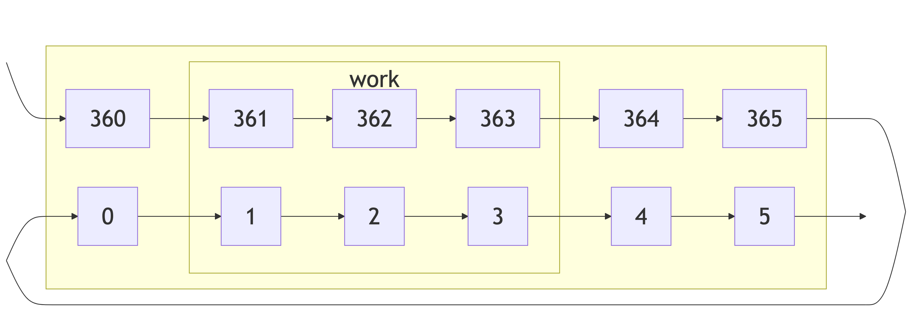
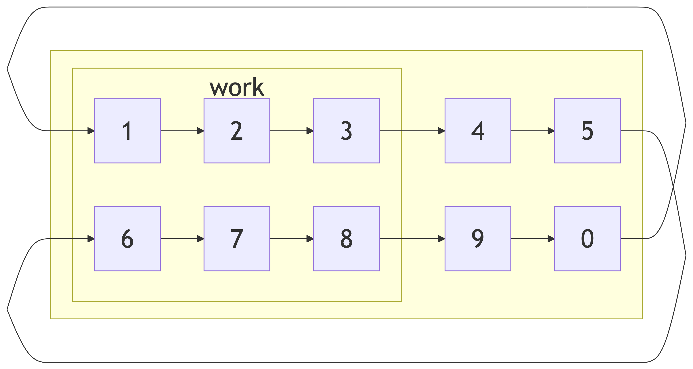
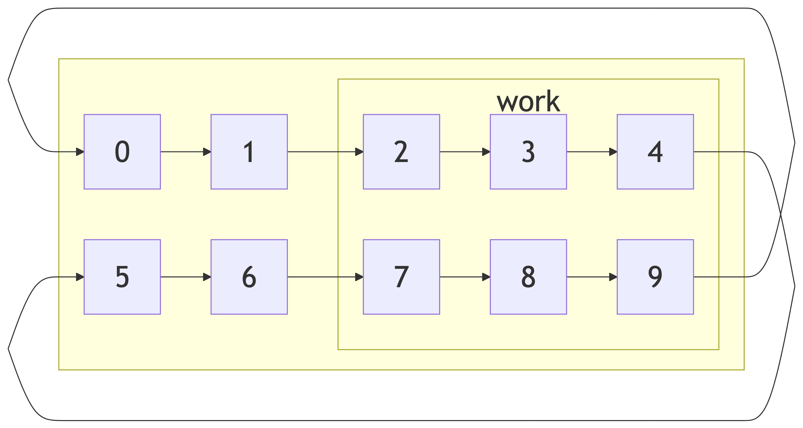
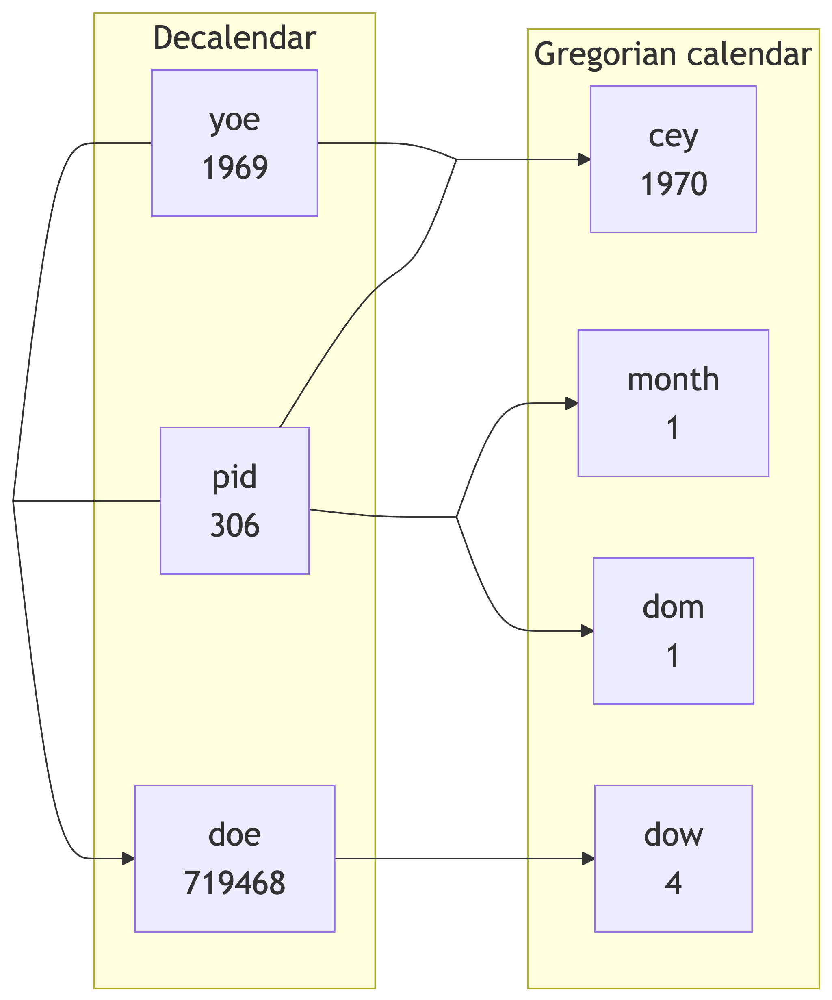
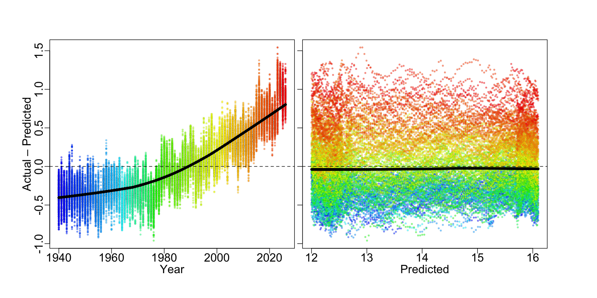
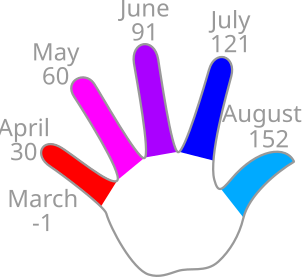
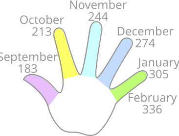
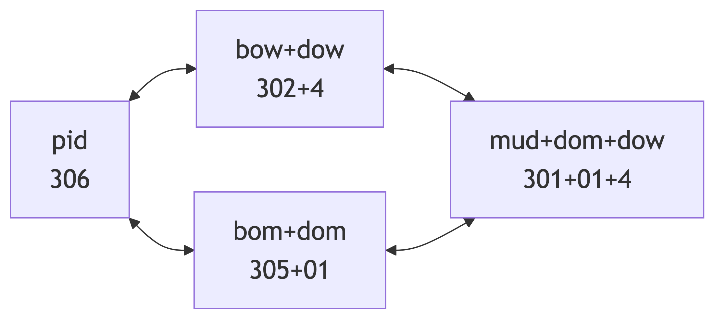
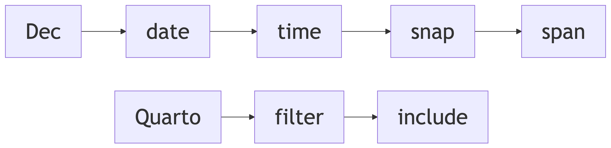

# Decalendar
Martin Laptev
2026+178

- [Decalendar](#decalendar)
- [Day of year (doy)](#sec-doy)
- [Day of xún (dox)](#sec-dox)
  - [Schedule <span class="color14by32 tool" data-bs-toggle="tooltip"
    data-bs-title="duotrigesimal L is decimal 14 or binary 01110">L</span>
    (Dox <span class="color0">0</span> to
    <span class="color9">9</span>)](#schedule-l-dox-0-to-9)
  - [Schedule <span class="color14by32 tool" data-bs-toggle="tooltip"
    data-bs-title="duotrigesimal L is decimal 14 or binary 01110">L</span>
    (p<span class="color360by365">72</span> and
    p<span class="color0">0</span>)](#schedule-l-p72-and-p0)
  - [Schedule <span class="color14by32 tool" data-bs-toggle="tooltip"
    data-bs-title="duotrigesimal L is decimal 14 or binary 01110">L</span>
    (<span class="tool" data-bs-toggle="tooltip"
    data-bs-title="day">d</span><span class="color360by366">360</span>
    to <span class="tool" data-bs-toggle="tooltip"
    data-bs-title="day">d</span><span class="color365by366">365</span>
    and <span class="tool" data-bs-toggle="tooltip"
    data-bs-title="day">d</span><span class="color0">0</span> to
    <span class="tool" data-bs-toggle="tooltip"
    data-bs-title="day">d</span><span class="color005by365">5</span>)](#schedule-l-d360-to-d365-and-d0-to-d5)
  - [Schedule <span class="color14by32 tool" data-bs-toggle="tooltip"
    data-bs-title="duotrigesimal L is decimal 14 or binary 01110">L</span>
    (Dox <span class="color1">1</span> to
    <span class="color0">0</span>)](#schedule-l-dox-1-to-0)
  - [Schedule <span class="color28by32 tool" data-bs-toggle="tooltip"
    data-bs-title="duotrigesimal X is decimal 28 or binary 11100">X</span>
    (Dox <span class="color0">0</span> to
    <span class="color9">9</span>)](#schedule-x-dox-0-to-9)
  - [Schedule <span class="color07by32 tool" data-bs-toggle="tooltip"
    data-bs-title="duotrigesimal F is decimal 7 or binary 00111">F</span>
    (Dox <span class="color0">0</span> to
    <span class="color9">9</span>)](#schedule-f-dox-0-to-9)
  - [Base32](#b32)
- [Day of hectoday (doh)](#sec-doh)
- [Day of era (doe)](#sec-doe)
- [Year of era (yoe)](#sec-yoe)
- [Day of week (dow)](#sec-dow)
- [Day of month (dom)](#sec-dom)
- [Day of bimester (dob)](#sec-dob)
- [Moon](#moon)
- [Mars](#mars)
- [Venus](#venus)
- [Summary](#tldr)
- [Next](#next)
- [Cite](#cite)
- [Glossary](#glos)

<div>

<figure class=''>

<div>


</div>

</figure>

</div>

# Decalendar

My website serves as a demonstration of both the
[Quarto](https://quarto.org) publishing📤system and the [Dec](../../dec)
measurement📐system. I use several clever hacks to get Quarto to display
all of the dates on my website in the Dec year+day format. Knowing the
basics of the Dec calendar🗓️(Decalendar) will help you to understand the
[filter](https://quarto.org/docs/extensions/filters.html) and
[include](https://quarto.org/docs/output-formats/html-basics.html#includes)
articles in the [Quarto section](../../quarto) of my site.

Among its many features, Quarto offers support for the
[Observable](https://observablehq.com/) data visualization system.
Observable is my top choice for interactive graphics. You can interact
with the two Observable [calendar
plots](https://observablehq.com/@observablehq/plot-calendar)
below⬇️using the adjacent Observable
[inputs](https://observablehq.com/documentation/inputs/overview). The
[scrubber](https://observablehq.com/@mbostock/scrubber)🧽input is a
great place to start because it cycles🔄through every value of the
[range](https://observablehq.com/@observablehq/input-range)🎚️inputs
beneath it.

# Day of year (doy)

To activate the scrubber input, press the “Play”▶️button adjacent to the
range inputs. Upon activation, the box around the selected day in each
plot will move back and forth between the first “day of year”
(<a href="#doy" id="dayofyear" class="tool" data-bs-toggle="tooltip"
data-bs-title="day of year">doy</a>),
<a href="#d" id="day" class="tool" data-bs-toggle="tooltip"
data-bs-title="day">d</a><span class="color0">0</span>, and the last
<a href="#doy" class="tool" data-bs-toggle="tooltip"
data-bs-title="day of year">doy</a>, which is either
<a href="#d" class="tool" data-bs-toggle="tooltip"
data-bs-title="day">d</a><span class="color364by365">364</span> or
<a href="#d" class="tool" data-bs-toggle="tooltip"
data-bs-title="day">d</a><span class="color365by366">365</span>. To
insert or remove <a href="#d" class="tool" data-bs-toggle="tooltip"
data-bs-title="day">d</a><span class="color365by366">365</span>, use the
“Year length”
[radio](https://observablehq.com/@observablehq/input-radio)📻input to
set the number of days in the year.

The insertion of <a href="#d" class="tool" data-bs-toggle="tooltip"
data-bs-title="day">d</a><span class="color365by366">365</span> shifts
306 dates, <a href="#d" class="tool" data-bs-toggle="tooltip"
data-bs-title="day">d</a>${march1doyColor} to
<a href="#d" class="tool" data-bs-toggle="tooltip"
data-bs-title="day">d</a>${december31doyColor}, in the [Gregorian
calendar](https://en.wikipedia.org/wiki/Gregorian_calendar#:~:text=the%20calendar%20used%20in%20most%20parts%20of%20the%20world)
by 1 day, but does not change the order of any Dec dates, because
<a href="#d" class="tool" data-bs-toggle="tooltip"
data-bs-title="day">d</a><span class="color365by366">365</span> is the
last day of any Dec leap year and is always followed by
<a href="#d" class="tool" data-bs-toggle="tooltip"
data-bs-title="day">d</a><span class="color0">0</span> of the subsequent
Dec year (<a href="#y" id="year" class="tool" data-bs-toggle="tooltip"
data-bs-title="year">y</a>+1). The “Year length” radio input also
changes the value of the negative “Day of year” range input by 1 day.

Similarly, the “[Coordinated Universal
Time](https://en.wikipedia.org/wiki/Coordinated_Universal_Time#:~:text=the%20primary%20time%20standard%20globally%20used%20to%20regulate%20clocks%20and%20time)
(<a href="#utc" id="coordinateduniversaltime" class="tool"
data-bs-toggle="tooltip"
data-bs-title="Coordinated Universal Time">UTC</a>)
[offset](https://en.wikipedia.org/wiki/UTC_offset#:~:text=the%20difference%20in%20hours%20and%20minutes%20between%20Coordinated%20Universal%20Time%20(UTC)%20and%20the%20standard%20time%20at%20a%20particular%20place)”
radio input shifts the Gregorian calendar date selected by the “Month”
and “Day of month” range inputs by 1 day. If the “[Color
scheme](https://en.wikipedia.org/wiki/Color_scheme#:~:text=a%20combination%20of%202%20or%20more%20colors%20used%20in%20aesthetic%20or%20practical%20design)”
radio input is set to the “Month” instead of the “Day”, the
“<a href="#utc" class="tool" data-bs-toggle="tooltip"
data-bs-title="Coordinated Universal Time">UTC</a> offset” radio input
will also rotate the Dec colors🎨(Decolors) inside the calendar plot
[cells](https://observablehq.com/plot/marks/cell) by 1 day.

From the perspective of Dec, month Decolors are only useful if we want
to compare the Dec and Gregorian calendars. In contrast, day Decolors
can help us organize days into groups of 100 called <span class="tool"
data-bs-toggle="tooltip"
data-bs-title="hundreds of days">hectodays</span>
(<a href="#h" id="hectoday" class="tool" data-bs-toggle="tooltip"
data-bs-title="groups of one hundred days">h</a>) and groups of 10 named
[xún](https://en.wikipedia.org/wiki/Chinese_calendar#:~:text=into%20nine%2D%20or-,ten%2Dday%20weeks,-known%20as%20x%C3%BAn)
(<a href="#x" id="xun" class="tool" data-bs-toggle="tooltip"
data-bs-title="groups of ten days">x</a>). Dec defines [meterological
seasons](https://en.wikipedia.org/wiki/Season#Meteorological:~:text=reckoned%20by%20temperature)
in terms of <a href="#h" class="tool" data-bs-toggle="tooltip"
data-bs-title="groups of one hundred days">h</a> and uses
<a href="#x" class="tool" data-bs-toggle="tooltip"
data-bs-title="groups of ten days">x</a> in place of Gregorian calendar
months and weeks.

<div id="equationgroup00" class="equationgroup">

<span id="eq-pid">
pid = x \* 10 + dox   (1)
</span>

</div>

The “Plot layout” radio input pivots the calendar plots by a quarter
[turn](https://en.wikipedia.org/wiki/Turn_%28angle%29#:~:text=the%20Greek%20letter,to%20one%20turn),
interchanging the horizontal (↔) and vertical (↕) axes. The axis labels
indicate that <a href="#x" class="tool" data-bs-toggle="tooltip"
data-bs-title="groups of ten days">x</a> and “days of xún”
(<a href="#dox" id="dayofxun" class="tool" data-bs-toggle="tooltip"
data-bs-title="days of xún">dox</a>) are analogous to weeks and “days of
week”
(<a href="#dow" id="dayofweek" class="tool" data-bs-toggle="tooltip"
data-bs-title="day of week">dow</a>). If we multiply an
<a href="#x" class="tool" data-bs-toggle="tooltip"
data-bs-title="groups of ten days">x</a> ${layoInput ? “↔” : “↕”} axis
label by ten and add it to a
<a href="#dox" class="tool" data-bs-toggle="tooltip"
data-bs-title="days of xún">dox</a> ${layoInput ? “↕” : “↔”} axis label,
we get a “positive integer
<a href="#doy" class="tool" data-bs-toggle="tooltip"
data-bs-title="day of year">doy</a>”
(<a href="#pid" id="positiveintegerdoy" class="tool"
data-bs-toggle="tooltip"
data-bs-title="positive integer day of year">pid</a>) cell value:
${dotyInputDekColor} × 10 + ${dotyInputDodColor} = ${dotyInputColor}.

<div id="calobservable">

``` {ojs}
//| echo: false
//| label: leapscrubvert
// https://observablehq.com/@tophtucker/horizontal-inputs
viewof leapscrub = Inputs.form([
  Inputs.radio(new Map([["365", false], ["366", true]]), {label: "Year length", value: loadLeap}),
  Inputs.radio(new Map([["Positive", false], ["Negative", true]]), {label: "UTC offset", value: negtzo}),
  Inputs.radio(new Map([["Day", false], ["Month", true]]), {label: "Color scheme", value: false}),
  Inputs.radio(new Map([["Vertical", false], ["Horizontal", true]]), {label: "Plot layout", value: vertic}),
  Scrubber(numbers, {autoplay: false, alternate: true, delay: 86.4, loopDelay: 864, format: y => "", inputStyle: "display:none;"}),
  ],
  {
    template: (inputs) => htl.html`
      <div style="display: flex; flex-wrap: wrap">${inputs}</div>
    `
})
```

``` {ojs}
//| echo: false
//| label: calsliders
//| className: sliders
viewof dotyInput = Inputs.range([0, 364 + leapInput], {value: 306, step: 1, label: "Day of year"});
viewof dotyInput1 = transformInput(
  Inputs.range([-365 - leapInput, -1], {step: 1, label: "Day of year"}),
  {bind: viewof dotyInput, transform: subN, invert: addN}
);
viewof monthInput = transformInput(
  Inputs.range([1, 12], {step: 1, label: "Month"}),
  {bind: viewof dotyInput, transform: doty2month, invert: month2doty}
);
viewof dotmInput = transformInput(
  Inputs.range([1, 31], {step: 1, label: "Day of month"}),
  {bind: viewof dotyInput, transform: doty2dotm, invert: (x => Math.floor(( 153 * (
    viewof monthInput.value > 2
    ? viewof monthInput.value - 3
    : viewof monthInput.value + 9) + 2
  ) / 5 + x - 1 + nOffInput
) % nDaysInput)});
```

<div id="calplots" class="column-page">

``` {ojs}
//| echo: false
//| className: calplot
//| label: decplot
decPlot = Plot.plot({
  padding: 0,
  width: layoInput ? 1080 : 360,
  height: layoInput ? 240 : 630,
  className: "calplot",
  title: "Decalendar",
  marginTop: coloInput && layoInput ? -2 : !coloInput && layoInput ? -22 : -3,
  marginLeft: coloInput && !layoInput ? 36 : !coloInput && !layoInput ? 24 : 31,
  marginRight: coloInput && !layoInput ? 36 : !coloInput && !layoInput ? 24 : 31,
  marginBottom: coloInput && layoInput ? 34 : !coloInput && layoInput ? 37 : 32,
  y: layoInput ? {
    tickSize: 0,
    label: "Day of xún    ",
    domain: [-1, 0, 1, 2, 3, 4, 5, 6, 7, 8, 9],
    ticks: [0, 1, 2, 3, 4, 5, 6, 7, 8, 9],
    tickPadding: -7,
    labelOffset: 25,
  } : {interval: 1, ticks: 18, label: "Xún", type: "band", tickSize: 0, tickPadding: -2, labelOffset: 32},
  x: layoInput ? {interval: 1, ticks: 18, label: "Xún", type: "band", tickSize: 0, labelOffset: 32} : {
    tickSize: 0,
    label: "       Day of xún",
    domain: [-1, 0, 1, 2, 3, 4, 5, 6, 7, 8, 9],
    ticks: [0, 1, 2, 3, 4, 5, 6, 7, 8, 9],
    tickPadding: -2,
    labelOffset: 32,
  },
  style: { fontSize: "21px", overflow: "visible"},
  color: {
    range: motyColors,
    domain: moty,
  },
  marks: [
    Plot.cell(dates, {
      x: (d, i) => layoInput ? Math.floor(i / 10) : i % 10,
      y: (d, i) => layoInput ? i % 10 : Math.floor(i / 10),
      fill: (d, i) => coloInput ? months[(new Date(d.getTime() - nOffInput * 86400000)).getUTCMonth()] : leapInput ? leaps[i] : comms[i],
      stroke: (d, i) => i === dotyInput ? "black" : "none",
      strokeDasharray: "5,2",
      strokeWidth: 3,
      inset: 0.5,
    }),
    layoInput ? Plot.axisX({
      ticks: d3.range(0, 37, 2),
      fill: (d, i) => leapInput ? dekLeapColors[d] : dekCommColors[d],
      textStroke: "black",
      textStrokeWidth: 1,
      tickSize: 0,
      tickPadding: coloInput ? -2 : 0, 
    }) : Plot.axisY({
      ticks: d3.range(0, 37, 2),
      fill: (d, i) => leapInput ? dekLeapColors[d] : dekCommColors[d],
      textStroke: "black",
      textStrokeWidth: 1,
      tickSize: 0,
      tickPadding: coloInput ? -24 : -26,
      labelOffset: coloInput ? 17 : 16,
    }),
    coloInput ? Plot.text(dates, {
      x: (d, i) => layoInput ? Math.floor(i / 10 + (i < 190 ? 1 : 0)) : 6,
      y: (d, i) => layoInput ? -1 : Math.floor(i / 10 + (i < 190 ? 1 : 0)),
      text: d => d.getUTCDate() === 7 ? months[d.getUTCMonth()].slice(0, 3) : "",
      dx: layoInput ? -4 : 129,
      dy:  layoInput ? -4 : 0,
      frameAnchor: layoInput ? "left" : "right",
      monospace: true,
      fontSize: "20px"}) : null,
    Plot.ruleY([layoInput ? dotyInput % 10 : Math.floor(dotyInput / 10)], {stroke: "black", strokeWidth: 2, dy: !coloInput && layoInput ? 10 : layoInput ? 9 : 8, x1: 0, x2: layoInput ? 36 : 9}),
    Plot.ruleY([layoInput ? dotyInput % 10 : Math.floor(dotyInput / 10)], {stroke: "black", strokeWidth: 2, dy:  !coloInput && layoInput ? -10 :layoInput ? -9 : -8, x1: 0, x2: layoInput ? 36 : 9}),
    Plot.ruleX([layoInput ? Math.floor(dotyInput / 10) : dotyInput % 10], {stroke: "black", strokeWidth: 2, dx: coloInput && !layoInput ? 13 : layoInput ? 13.5 : 14, y1: 0, y2: layoInput ? 9 : 36}),
    Plot.ruleX([layoInput ? Math.floor(dotyInput / 10) : dotyInput % 10], {stroke: "black", strokeWidth: 2, dx:  coloInput && !layoInput ? -13 : layoInput ? -13.5 : -14, y1: 0, y2: layoInput ? 9 : 36}),
    Plot.text(dates, {
      x: (d, i) => layoInput ? Math.floor(i / 10) : i % 10,
      y: (d, i) => layoInput ? i % 10 : Math.floor(i / 10),
      fill: (d, i) => coloInput && (i < 31 + nOffInput || i > 213 + nOffInput) ? "white" : !coloInput && (i < 20 || i > 199) ? "white" : "black",
      channels: {
        dayOfYear: {
          value: (d, i) => i,
          label: "Day of year"
        },
        month: {
          value: d => (new Date(d.getTime() - nOffInput * 86400000)).getUTCMonth() + 1,
          label: "Month"
        },
        dayOfMonth: {
          value: d => (new Date(d.getTime() - nOffInput * 86400000)).getUTCDate(),
          label: "Day of month"
        },
        week: {
          value: d => d3.utcWeek.count(d3.utcYear((new Date(d.getTime() - nOffInput * 86400000))), (new Date(d.getTime() - nOffInput * 86400000))),
          label: "Week"
        },
        dayOfWeek: {
          value: d => (new Date(d.getTime() - nOffInput * 86400000)).getUTCDay(),
          label: "Day of week"
        },
      },
      tip: {
        format: {
          dayOfYear: true,
          month: true,
          dayOfMonth: true,
          week: true,
          dayOfWeek: true,
          x: false,
          y: false,
          fill: false,
          text: false
        }
      },
      text: (d, i) => String(i),
      label: "Day of year",
      monospace: true,
      fontSize: "13px"})
  ]
})
```

``` {ojs}
//| echo: false
//| className: calplot
//| label: greplot
grePlot = Plot.plot({
  padding: 0,
  width: layoInput ? 1080 : 220,
  height: layoInput ? 180 : 810,
  title: "Gregorian calendar",
  className: "calplot",
  marginTop: layoInput ? 2 : -2,
  marginBottom: 40,
  marginLeft: 33,
  y: layoInput ? {tickFormat: Plot.formatWeekday("en", "short"), tickSize: 0,
      domain: [-1, 0, 1, 2, 3, 4, 5, 6],
      ticks: [0, 1, 2, 3, 4, 5, 6],
      tickPadding: -3 + (leapInput && dotwInput === "Sat") * 5,
      label: null,
  } : {interval: 1, 
       ticks: 26, label: "Week", type: "band", tickSize: 0, tickPadding: -20, labelOffset: 21},
  x: layoInput ? {interval: 1, ticks: 26, label: "Week", type: "band", tickSize: 0, tickPadding: 2, labelOffset: 36} : {
    tickFormat: Plot.formatWeekday("en", "narrow"), 
    tickSize: 0,
    domain: [-1, 0, 1, 2, 3, 4, 5, 6],
    ticks: [0, 1, 2, 3, 4, 5, 6],
    tickPadding: -11 + (leapInput && dotwInput === "Sat") * 5,
    label: "     Day of week",
    labelOffset: 22 + (leapInput && dotwInput === "Sat") * 5,
  },
  style: { fontSize: "20px", overflow: "visible"},
  color: {
    range: motyColors,
    domain: moty,
    className: "cal",
  },
  marks: [
    Plot.cell(datesCal, {
      x: d => layoInput ? d3.utcWeek.count(d3.utcYear(d), d) : d.getUTCDay(),
      y: d => layoInput ? d.getUTCDay() : d3.utcWeek.count(d3.utcYear(d), d),
      fill: (d, i) => coloInput ? months[d.getUTCMonth()] : leapInput ? leaps[(i + 365 - 59 + nOffInput) % (365 + leapInput)] : comms[(i + 365 - 59 + nOffInput) % (365 + leapInput)],
      stroke: (d, i) => ((i + 365 - 59 + nOffInput) % (365 + leapInput)) === dotyInput ? "black" : "none",
      strokeDasharray: "5,2",
      strokeWidth: 2.5,
      inset: .5,
    }),
    Plot.text(datesCal, {
      x: d => layoInput ? d3.utcWeek.count(d3.utcYear(d), d) : 6,
      y: d => layoInput ? -1 : d3.utcWeek.count(d3.utcYear(d), d),
      text: d => d.getUTCDate() === 7 ? months[d.getUTCMonth()].slice(0, 3) : "",
      dx: layoInput ? 9 : 48,
      dy: layoInput ? -3 : 0,
      frameAnchor: layoInput ? "left" : "right",
      monospace: true,
      fontSize: "20px"}),
    Plot.ruleY(layoInput ? seldow : selwee, {stroke: "black", strokeWidth: 2, dy: layoInput ? -8.5 : -7, x1: 0, x2: layoInput ? 52 + (leapInput && dotwInput === "Sat") : 6}),
    Plot.ruleY(layoInput ? seldow : selwee, {stroke: "black", strokeWidth: 2, dy: layoInput ? 8.5 : 7, x1: 0, x2: layoInput ? 52 + (leapInput && dotwInput === "Sat") : 6}),
    Plot.ruleX(layoInput ? selwee : seldow, {stroke: "black", strokeWidth: 2, dx: 9.5, y1: 0, y2: layoInput ? 6 : 52 + (leapInput && dotwInput === "Sat")}),
    Plot.ruleX(layoInput ? selwee : seldow, {stroke: "black", strokeWidth: 2, dx: -9.5, y1: 0, y2: layoInput ? 6 : 52 + (leapInput && dotwInput === "Sat")}),
    Plot.text(datesCal, {
      x: layoInput ? d => d3.utcWeek.count(d3.utcYear(d), d) : {
        label: "Day of week",
        value: d => d.getUTCDay(),
      },
      y: layoInput ? {
        label: "Day of week",
        value: d => d.getUTCDay(),
      } : d => d3.utcWeek.count(d3.utcYear(d), d),
      fill: (d, i) => coloInput && (i < 90 + leapInput || i > 272 + leapInput) ? "white" : !coloInput && (i < 79 - nOffInput + leapInput || i > 258 - nOffInput + leapInput) ? "white" : "black",
      text: d => d.getUTCDate(),
      channels: {
        dayOfYear: {
          value: (d, i) => (i + 365 - 59 + nOffInput) % (365 + leapInput),
          label: "Day of year"
        },
        month: {
          value: d => d.getUTCMonth() + 1,
          label: "Month"
        },
        dayOfMonth: {
          value: d => d.getUTCDate(),
          label: "Day of month"
        },
      },
      tip: {
        format: {
          dayOfYear: true,
          month: true,
          dayOfMonth: true,
          x: true,
          y: true,
          fill: false,
          text: false,
        }
      },
      monospace: true,
      fontSize: "13px"})
  ]
})
```

</div>

<span class="radiotitle">First <span class="tool"
data-bs-toggle="tooltip" data-bs-title="day of week">dow</span> of the
Gregorian calendar year</span>

``` {ojs}
//| echo: false
//| label: centerradio
//| className: radiobuttons
viewof dotwInput = Inputs.radio([
  "Sun", "Mon", "Tue", "Wed", "Thu", "Fri", "Sat",
  ], {value: gregBoyDotwStr})
```

</div>

There are two range inputs labelled “Day of year” because every
<a href="#doy" class="tool" data-bs-toggle="tooltip"
data-bs-title="day of year">doy</a> can be expressed as either a
positive or a negative integer. The
<a href="#pid" class="tool" data-bs-toggle="tooltip"
data-bs-title="positive integer day of year">pid</a> is the number of
days that have passed in the year, the [absolute
value](https://en.wikipedia.org/wiki/Absolute_value#:~:text=non%2Dnegative%29-,magnitude%20of,measured%20without%20regard%20to%20its%20sign,-.%20Namely%2C)
of the “negative integer
<a href="#doy" class="tool" data-bs-toggle="tooltip"
data-bs-title="day of year">doy</a>”
(<a href="#nid" id="negativeintegerdoy" class="tool"
data-bs-toggle="tooltip"
data-bs-title="negative integer day of year">nid</a>) is the number of
days left in the year, and their
[difference](https://en.wikipedia.org/wiki/Subtraction#Notation_and_terminology:~:text=The%20result%20is%20the%20difference)
is the “solar year length”
(<a href="#syl" id="solaryearlength" class="tool"
data-bs-toggle="tooltip" data-bs-title="solar year length">syl</a>),
which can be <span class="color364by365">365</span> or
<span class="color365by366">366</span>.

<div id="equationgroup01" class="equationgroup">

<span id="eq-syl">
syl = pid − nid   (2)
</span>

</div>

The distinction between
<a href="#pid" class="tool" data-bs-toggle="tooltip"
data-bs-title="positive integer day of year">pid</a> and
<a href="#nid" class="tool" data-bs-toggle="tooltip"
data-bs-title="negative integer day of year">nid</a> can be explained in
terms of [computer
programming](https://en.wikipedia.org/wiki/Computer_programming#:~:text=the%20composition%20of%20sequences%20of%20instructions%2C%20called%20programs%2C%20that%20computers%20can%20follow%20to%20perform%20tasks).
If we think of a year as an
[array](https://en.wikipedia.org/wiki/Array_(data_structure)#Element_identifier_and_addressing_formulas:~:text=a%20data%20structure%20consisting%20of%20a%20collection%20of%20elements%20(values%20or%20variables)%2C%20of%20same%20memory%20size%2C%20each%20identified%20by%20at%20least%20one%20array%20index)
and each day as an array element, a
<a href="#syl" class="tool" data-bs-toggle="tooltip"
data-bs-title="solar year length">syl</a> is the number of elements in
the array, <a href="#pid" class="tool" data-bs-toggle="tooltip"
data-bs-title="positive integer day of year">pid</a> is a [positive
index](https://en.wikipedia.org/wiki/Zero-based_numbering#:~:text=a%20way%20of%20numbering%20in%20which%20the%20initial%20element%20of%20a%20sequence%20is%20assigned%20the%20index%C2%A00),
and <a href="#nid" class="tool" data-bs-toggle="tooltip"
data-bs-title="negative integer day of year">nid</a> is a [negative
index](https://en.wikipedia.org/wiki/Array_slicing#:~:text=specify%20an%20offset%20from%20the%20end%20of%20the%20array).
Array
[indexes](https://en.wikipedia.org/wiki/Array_(data_structure)#Element_identifier_and_addressing_formulas:~:text=individual%20objects%20are%20selected%20by%20an%20index)
can be used to obtain specific array elements individually via indexing
or in groups via [array
slicing](https://en.wikipedia.org/wiki/Array_slicing#:~:text=an%20operation%20that%20extracts%20a%20subset%20of%20elements%20from%20an%20array).

The year+day Dec date format is short for
<span class="nowrap">year+day/<a href="#syl" class="tool" data-bs-toggle="tooltip"
data-bs-title="solar year length">syl</a></span>. Dec truncates dates
because the <a href="#syl" class="tool" data-bs-toggle="tooltip"
data-bs-title="solar year length">syl</a> is not needed to specify a
date, remains constant for 366, 1095, or 2920 days, has only 2 possible
values: <span class="color364by365">365</span> or
<span class="color365by366">366</span>, and can be obtained by passing
Year <a href="#y" class="tool" data-bs-toggle="tooltip"
data-bs-title="year">y</a> to Equations
<a href="#eq-leap" class="quarto-xref">3</a> and
<a href="#eq-leap2syl" class="quarto-xref">4</a> below. Nevertheless, we
can use the <a href="#syl" class="tool" data-bs-toggle="tooltip"
data-bs-title="solar year lengths">syl</a> to convert between different
kinds of Dec dates.

<div id="equationgroup01" class="equationgroup">

<span id="eq-leap">
$$
\text{leap}=\begin{cases}
  1&{\begin{aligned}
    &\text{ if } (\text{y} + 1)\href{https://en.wikipedia.org/wiki/Modulo#:~:text=returns%20the%20remainder%20or%20signed%20remainder%20of%20a%20division}{\bmod} \\\\\\\\4=0\\
    &\href{https://en.wikipedia.org/wiki/Logical_conjunction}{\land}(\text{y} + 1)\href{https://en.wikipedia.org/wiki/Modulo#:~:text=returns%20the%20remainder%20or%20signed%20remainder%20of%20a%20division}{\bmod} 100\neq0\\
    &\href{https://en.wikipedia.org/wiki/Logical_disjunction}{\lor}(\text{y} + 1)\href{https://en.wikipedia.org/wiki/Modulo#:~:text=returns%20the%20remainder%20or%20signed%20remainder%20of%20a%20division}{\bmod} 400=0\end{aligned}}\\\\
  0&{\text{ otherwise}}\end{cases}
 \qquad(3)$$
</span>

<span id="eq-leap2syl">
syl = 365 + leap   (4)
</span>

</div>

<div class="panel-tabset" group="language">

### Julia

``` julia
function leap(year = 0)
    year += 1
    year % 4 == 0 && year % 100 != 0 || year % 400 == 0
end
```

    leap (generic function with 2 methods)

``` julia
leap(2019)
```

    true

``` julia
leap(2020)
```

    false

### Observable JavaScript

``` {ojs}
function leap(year = 0) {
  year += 1;
  return year % 4 === 0 && year % 100 !== 0 || year % 400 === 0;
}
leap(2019)
leap(2020)
```

### Python

``` python
def leap(year=2000):
    year += 1
    return year % 4 == 0 and year % 100 != 0 or year % 400 == 0
leap(2019)
```

    True

``` python
leap(2020)
```

    False

### R

``` r
leap <- function(year = 0) {
  year <- year + 1
  year %% 4 == 0 & year %% 100 != 0 | year %% 400 == 0
}
leap(2019)
```

    [1] TRUE

``` r
leap(2020)
```

    [1] FALSE

</div>

Dec categorizes each date as a
[countdown](https://en.wikipedia.org/wiki/Countdown#:~:text=a%20sequence%20of%20backward%20counting%20to%20indicate%20the%20time%20remaining%20before%20an%20event%20is%20scheduled%20to%20occur)
or countup date, depending on whether the date counts **up** the days
**since** Year <a href="#y" class="tool" data-bs-toggle="tooltip"
data-bs-title="year">y</a> or counts **down** the days **until** Year
<a href="#y" class="tool" data-bs-toggle="tooltip"
data-bs-title="year">y</a>+1. The current year+day
<a href="#utc" class="tool" data-bs-toggle="tooltip"
data-bs-title="Coordinated Universal Time">UTC</a> date,
<span class="nowrap">${decYearColor}<span class="mono">+</span>${decDotyPadColor}</span>,
informs us that Year ${decYearColor1} began ${decDotyColor} days ago,
whereas its countdown equivalent,
<span class="nowrap">${nextYearColor}<span class="mono">-</span>${TminusPaddedColor}</span>,
tells us that Year ${nextYearColor1} will begin in ${TminusColor} days.

<div id="equationgroup02" class="equationgroup">

<span id="eq-updown">
$$\text{y}+\dfrac{\text{pid}}{\text{syl}} = \text{y} + 1 + \dfrac{\text{nid}}{\text{syl}} \qquad(5)$$
</span>

</div>

Both <a href="#pid" class="tool" data-bs-toggle="tooltip"
data-bs-title="positive integer days of year">pid</a> and
<a href="#nid" class="tool" data-bs-toggle="tooltip"
data-bs-title="negative integer days of year">nid</a> can be useful. If
we wanted to add 285 days to the
<a href="#doy" class="tool" data-bs-toggle="tooltip"
data-bs-title="day of year">doy</a> selected below, for example to
predict when a pregnant🤰woman will give birth to a baby👩‍🍼(Jukic et al.
2013+215), we should add 285 to the
<a href="#pid" class="tool" data-bs-toggle="tooltip"
data-bs-title="positive integer day of year">pid</a> if it is less than
80 in a common year or less than 81 in a leap year, but otherwise we
should add 1 to the year and add 285 to the
<a href="#nid" class="tool" data-bs-toggle="tooltip"
data-bs-title="negative integer day of year">nid</a>: ${easyDoyColor} +
285 = ${easySumColor}.

``` {ojs}
//| echo: false
//| label: boundsliders
//| className: sliders
//| code-copy: false
Inputs.bind(Inputs.range([0, 364 + leapInput], {step: 1, label: "Day of year"}), viewof dotyInput)
Inputs.bind(Inputs.range([-365 - leapInput, -1], {step: 1, label: "Day of year"}), viewof dotyInput1)
```

Every <a href="#doy" class="tool" data-bs-toggle="tooltip"
data-bs-title="day of year">doy</a>,
<a href="#x" class="tool" data-bs-toggle="tooltip"
data-bs-title="groups of ten days">x</a>, and
<a href="#dox" class="tool" data-bs-toggle="tooltip"
data-bs-title="days of xún">dox</a> has an associated Decolor that can
be expressed as a
[hexadecimal](https://en.wikipedia.org/wiki/Web_colors#Hex_triplet:~:text=hexadecimal%20number%20used%20in%20HTML%2C%20CSS%2C%20SVG%2C%20and%20other%20computing%20applications%20to%20represent%20colors)
(<a href="#hex" id="hexadecimal" class="tool" data-bs-toggle="tooltip"
data-bs-title="hexadecimal">hex</a>), “[hue saturation
lightness](https://en.wikipedia.org/wiki/HSL_and_HSV#:~:text=the%20two%20most%20common%20cylindrical%2Dcoordinate%20representations%20of%20points%20in%20an%20RGB%20color%20model)”
(<a href="#hsl" id="huesaturationlightness" class="tool"
data-bs-toggle="tooltip"
data-bs-title="hue saturation lightness">hsl</a>), or
“[<span class="color0">red</span> <span class="color4">green</span>
<span class="color7">blue</span>](https://en.wikipedia.org/wiki/RGB_color_model#:~:text=an%20additive%20color%20model)”
(<a href="#rgb" id="redgreenblue" class="tool" data-bs-toggle="tooltip"
data-bs-title="red green blue">rgb</a>) triplet. Use the “Day of year”
range inputs above to choose from the ${nDaysInput}
<a href="#doy" class="tool" data-bs-toggle="tooltip"
data-bs-title="day of year">doy</a>, 37
<a href="#x" class="tool" data-bs-toggle="tooltip"
data-bs-title="groups of ten days">x</a>, and 10
<a href="#dox" class="tool" data-bs-toggle="tooltip"
data-bs-title="days of xún">dox</a> that can be displayed in
<a href="#tbl-color" class="quarto-xref">Table 1</a> below and compare
their corresponding
[hue](https://en.wikipedia.org/wiki/Hue#:~:text=an%20angular%20position%20around%20a%20central%20or%20neutral%20point%20or%20axis%20on%20a%20color%20space%20coordinate%20diagram)
degrees (<span class="tool" data-bs-toggle="tooltip"
data-bs-title="hsl degrees">h°</span>) and
<a href="#hex" class="tool" data-bs-toggle="tooltip"
data-bs-title="hexadecimal">hex</a> and
<a href="#rgb" class="tool" data-bs-toggle="tooltip"
data-bs-title="red green blue">rgb</a> triplets.

<table>
<colgroup>
<col style="width: 38%" />
<col style="width: 11%" />
<col style="width: 8%" />
<col style="width: 8%" />
<col style="width: 11%" />
<col style="width: 11%" />
<col style="width: 11%" />
</colgroup>
<thead>
<tr>
<th></th>
<th></th>
<th><span class="tool" data-bs-toggle="tooltip"
data-bs-title="hsl or hsv degrees">h°</span></th>
<th><span class="tool" data-bs-toggle="tooltip"
data-bs-title="hexadecimal">hex</span></th>
<th><span class="color0">red</span></th>
<th><span class="color4">green</span></th>
<th><span class="color7">blue</span></th>
</tr>
</thead>
<tbody>
<tr>
<td><a href="#doy" class="tool" data-bs-toggle="tooltip"
data-bs-title="day of year">doy</a></td>
<td>${dotyInputColor1}</td>
<td>${dotyInputColor2}</td>
<td>${dotyInputColor3}</td>
<td>${dotyInputColor4}</td>
<td>${dotyInputColor5}</td>
<td>${dotyInputColor6}</td>
</tr>
<tr>
<td><a href="#x" class="tool" data-bs-toggle="tooltip"
data-bs-title="groups of ten days">x</a></td>
<td>${dotyInputDekColor1}</td>
<td>${dotyInputDekColor2}</td>
<td>${dotyInputDekColor3}</td>
<td>${dotyInputDekColor4}</td>
<td>${dotyInputDekColor5}</td>
<td>${dotyInputDekColor6}</td>
</tr>
<tr>
<td><a href="#dox" class="tool" data-bs-toggle="tooltip"
data-bs-title="days of xún">dox</a></td>
<td>${dotyInputDodColor1}</td>
<td>${dotyInputDodColor2}</td>
<td>${dotyInputDodColor3}</td>
<td>${dotyInputDodColor4}</td>
<td>${dotyInputDodColor5}</td>
<td>${dotyInputDodColor6}</td>
</tr>
</tbody>
</table>

The [radio](https://observablehq.com/@observablehq/input-radio) input
beneath the plots selects the
<a href="#dow" class="tool" data-bs-toggle="tooltip"
data-bs-title="day of week">dow</a> for
<a href="#d" class="tool" data-bs-toggle="tooltip"
data-bs-title="day">d</a>${january1doyColor}, the first day of the
Gregorian calendar year. Changing the
<a href="#d" class="tool" data-bs-toggle="tooltip"
data-bs-title="day">d</a>${january1doyColor1}
<a href="#dow" class="tool" data-bs-toggle="tooltip"
data-bs-title="day of week">dow</a> shifts every Gregorian calendar date
by 1 to 6 days without affecting Decalendar. A leap year that begins on
the last <a href="#dow" class="tool" data-bs-toggle="tooltip"
data-bs-title="day of week">dow</a>,
<a href="#dow" class="tool" data-bs-toggle="tooltip"
data-bs-title="day of week">Dow</a> <span class="color6by7">6</span>,
has an extra “week of year”
(<a href="#woy" id="weekofyear" class="tool" data-bs-toggle="tooltip"
data-bs-title="week of year">woy</a>), but its first and last
<a href="#woy" class="tool" data-bs-toggle="tooltip"
data-bs-title="week of year">woy</a>, Weeks 0 and 53, each contribute
only 1 day to the year.

Even though weeks determine the shape of the Gregorian calendar plot,
its cell values are “days of month”
(<a href="#dom" id="dayofmonth" class="tool" data-bs-toggle="tooltip"
data-bs-title="days of month">dom</a>). We can uniquely identify🪪a
specific day in any year with a
<a href="#pid" class="tool" data-bs-toggle="tooltip"
data-bs-title="positive integer day of year">pid</a>, rather than a
month and a <a href="#dom" class="tool" data-bs-toggle="tooltip"
data-bs-title="day of month">dom</a>. Except for
<a href="#d" class="tool" data-bs-toggle="tooltip"
data-bs-title="day">d</a><span class="color365by366">365</span> in leap
years, every year has the same
<a href="#x" class="tool" data-bs-toggle="tooltip"
data-bs-title="groups of ten days">x</a>,
<a href="#h" class="tool" data-bs-toggle="tooltip"
data-bs-title="groups of one hundred days">h</a>, and months, but not
the same weeks. It takes 5, 6, 7, 11, or 12 years for a
<a href="#d" class="tool" data-bs-toggle="tooltip"
data-bs-title="day">d</a>${january1doyColor2}
<a href="#dow" class="tool" data-bs-toggle="tooltip"
data-bs-title="day of week">dow</a> to recur.

The number of forms that the Gregorian calendar can take, 14, is the
product of 7 <a href="#dow" class="tool" data-bs-toggle="tooltip"
data-bs-title="days of week">dow</a> and 2 year lengths. If we set aside
an extra copy of a printed🖨️Gregorian calendar on
<a href="#d" class="tool" data-bs-toggle="tooltip"
data-bs-title="day">d</a>${january1doyColor3}, we would have to wait 6,
11, 12, 17, 23, 28, or 40 years to use it. We can make the leap year
form of Decalendar apply to any year by appending an asterisk (\*) to
the label for <a href="#d" class="tool" data-bs-toggle="tooltip"
data-bs-title="day">d</a><span class="color365by366">365</span>:
<span class="color0">365</span>\*.

The <span class="color0">365</span>\* label is short for
<span class="color0">365</span>\*leap, where leap is the [left-hand
side](https://en.wikipedia.org/wiki/Sides_of_an_equation#:~:text=the%20expression%20on%20the%20left%20of%20the%20%22%3D%22%20is%20the%20left%20side%20of%20the%20equation)
of <a href="#eq-leap" class="quarto-xref">Equation 3</a>. If leap is 1,
Year <a href="#y" class="tool" data-bs-toggle="tooltip"
data-bs-title="year">y</a> is a leap year and
<span class="color0">365</span>\* is
<a href="#d" class="tool" data-bs-toggle="tooltip"
data-bs-title="day">d</a><span class="color365by366">365</span>, the
last day of Year <a href="#y" class="tool" data-bs-toggle="tooltip"
data-bs-title="year">y</a>. If leap is 0, Year
<a href="#y" class="tool" data-bs-toggle="tooltip"
data-bs-title="year">y</a> is a common year and
<span class="color0">365</span>\* is
<a href="#d" class="tool" data-bs-toggle="tooltip"
data-bs-title="day">d</a><span class="color0">0</span>, the first day of
Year <a href="#y" class="tool" data-bs-toggle="tooltip"
data-bs-title="year">y</a>+1. The <span class="color0">365</span>\*
label unites the common and leap year forms of Decalendar into a
[perennial
calendar](https://en.wikipedia.org/wiki/Perennial_calendar#:~:text=a%20calendar%20that%20applies%20to%20any%20year%2C%20keeping%20the%20same%20dates)
that can be reused♻️every year.

# Day of xún (dox)

As opposed to a week, an
<a href="#x" class="tool" data-bs-toggle="tooltip"
data-bs-title="group of ten days">x</a> can be split evenly into either
5 pairs of days or 2 equal halves called “pentadays of xún”
(<a href="#pox" id="pentadayofxun" class="tool" data-bs-toggle="tooltip"
data-bs-title="pentadays of xún">pox</a>). Likewise, a common year can
be divided evenly into 73 groups of 5 days called “pentadays”
(<a href="#p" id="pentaday" class="tool" data-bs-toggle="tooltip"
data-bs-title="pentadays">p</a>):
<a href="#p" class="tool" data-bs-toggle="tooltip"
data-bs-title="pentadays">p</a><span class="color0">0</span> to
<a href="#p" class="tool" data-bs-toggle="tooltip"
data-bs-title="pentadays">p</a><span class="color360by365">72</span>.
The last <a href="#p" class="tool" data-bs-toggle="tooltip"
data-bs-title="pentaday">p</a> of a leap year,
<a href="#p" class="tool" data-bs-toggle="tooltip"
data-bs-title="pentaday">p</a><span class="color365by366">73</span>,
consists of the final day of the leap year,
<a href="#d" class="tool" data-bs-toggle="tooltip"
data-bs-title="day">d</a><span class="color365by366">365</span>, and the
first 4 days of the subsequent year:
<a href="#d" class="tool" data-bs-toggle="tooltip"
data-bs-title="day">d</a><span class="color0">0</span> to
<a href="#d" class="tool" data-bs-toggle="tooltip"
data-bs-title="day">d</a><span class="color003">3</span>.

In the context of a common year,
<a href="#p" class="tool" data-bs-toggle="tooltip"
data-bs-title="pentaday">p</a><span class="color0">73</span> is
synonymous with <a href="#p" class="tool" data-bs-toggle="tooltip"
data-bs-title="pentaday">p</a><span class="color0">0</span> of the
succeeding year. To obtain the current
<a href="#p" class="tool" data-bs-toggle="tooltip"
data-bs-title="pentaday">p</a>, we divide the current
<a href="#pid" class="tool" data-bs-toggle="tooltip"
data-bs-title="positive integer days of year">pid</a> by 5 and then use
the [floor
function](https://en.wikipedia.org/wiki/Floor_and_ceiling_functions#:~:text=the%20function%20that%20takes%20a%20real%20number%20x%20as%20input%20and%20returns%20the%20greatest%20integer%20less%20than%20or%20equal%20to%20x)
as in <a href="#eq-poy" class="quarto-xref">Equation 9</a> to discard
the [fractional
part](https://en.wikipedia.org/wiki/Fractional_part#:~:text=the%20excess%20beyond%20that%20number%27s%20integer%20part)
of the quotient: ${decPentColor} = <a
href="https://en.wikipedia.org/wiki/Fractional_part#:~:text=the%20excess%20beyond%20that%20number%27s%20integer%20part"
class="nounder">⌊</a>${decDotyColor1} ÷ 5<a
href="https://en.wikipedia.org/wiki/Fractional_part#:~:text=the%20excess%20beyond%20that%20number%27s%20integer%20part"
class="nounder">⌋</a>. If we divide a
<a href="#pid" class="tool" data-bs-toggle="tooltip"
data-bs-title="positive integer days of year">pid</a> or a
<a href="#dox" class="tool" data-bs-toggle="tooltip"
data-bs-title="days of xún">dox</a> by 5, the remainder will be its
corresponding “day of pentaday”
(<a href="#dop" id="dayofpentaday" class="tool" data-bs-toggle="tooltip"
data-bs-title="days of pentaday">dop</a>): ${decDotpColor} =
${decDotyColor2}
[mod](https://en.wikipedia.org/wiki/Modulo#:~:text=returns%20the%20remainder)
5.

<div id="equationgroup03" class="equationgroup">

<span id="eq-xun">
$$\text{x} = \left\lfloor\dfrac{\text{pid}}{10}\right\rfloor \qquad(6)$$
</span> <span id="eq-dox">
$$\text{dox} = \text{pid} \href{https://en.wikipedia.org/wiki/Modulo#:~:text=returns%20the%20remainder%20or%20signed%20remainder%20of%20a%20division}{\bmod} 10 \qquad(7)$$
</span> <span id="eq-pox">
$$\text{pox} = \href{https://en.wikipedia.org/wiki/Iverson_bracket#:~:text=is%20defined%20to%20take%20the%20value%201%20for%20the%20values%20of%20the%20variables%20for%20which%20the%20statement%20is%20true%2C%20and%20takes%20the%20value%200%20otherwise}{\[}\text{dox} \> 4\href{https://en.wikipedia.org/wiki/Iverson_bracket#:~:text=is%20defined%20to%20take%20the%20value%201%20for%20the%20values%20of%20the%20variables%20for%20which%20the%20statement%20is%20true%2C%20and%20takes%20the%20value%200%20otherwise}{\]} \qquad(8)$$
</span> <span id="eq-poy">
$$\text{p} = \left\lfloor\dfrac{\text{pid}}{5}\right\rfloor \qquad(9)$$
</span> <span id="eq-dop">
$$\text{dop = dox} \href{https://en.wikipedia.org/wiki/Modulo#:~:text=returns%20the%20remainder%20or%20signed%20remainder%20of%20a%20division}{\bmod} 5 \qquad(10)$$
</span>

</div>

In <a href="#fig-zero" class="quarto-xref">Diagram 2</a> below, each row
is a <a href="#pox" class="tool" data-bs-toggle="tooltip"
data-bs-title="pentaday of xún">pox</a> and each square node is a
<a href="#dox" class="tool" data-bs-toggle="tooltip"
data-bs-title="days of xún">dox</a>.
<a href="#fig-zero" class="quarto-xref">Diagram 2</a> visualizes
Schedule <span class="color14by32 tool" data-bs-toggle="tooltip"
data-bs-title="duotrigesimal L is decimal 14 or binary 01110">L</span>,
a Dec schedule that plans for exactly 219 work days per year, which is
about an <a href="#x" class="tool" data-bs-toggle="tooltip"
data-bs-title="groups of ten days">x</a> more than the 208 to 210 work
days per year provisioned by a [four-day
workweek](https://en.wikipedia.org/wiki/Four-day_workweek#:~:text=an%20arrangement%20where%20a%20workplace%20or%20place%20of%20education%20has%20its%20employees%20or%20students%20work%20or%20attend%20school%2C%20college%20or%20university%20over%20the%20course%20of%20four%20days%20per%20week).
Schedule <span class="color14by32 tool" data-bs-toggle="tooltip"
data-bs-title="duotrigesimal L is decimal 14 or binary 01110">L</span>
designates <a href="#dox" class="tool" data-bs-toggle="tooltip"
data-bs-title="days of xún">Dox</a> <span class="color1">1</span>,
<span class="color2">2</span>, <span class="color3">3</span>,
<span class="color6">6</span>, <span class="color7">7</span>, and
<span class="color8">8</span> as work days and
<a href="#dox" class="tool" data-bs-toggle="tooltip"
data-bs-title="days of xún">Dox</a> <span class="color0">0</span>,
<span class="color4">4</span>, <span class="color5">5</span>, and
<span class="color9">9</span> as rest days.

<div class="centered">

### Schedule <span class="color14by32 tool" data-bs-toggle="tooltip" data-bs-title="duotrigesimal L is decimal 14 or binary 01110">L</span> (<a href="#dox" class="tool" data-bs-toggle="tooltip"
data-bs-title="days of xún">Dox</a> <span class="color0">0</span> to <span class="color9">9</span>)

</div>

<div>

<figure class=''>

<div>


</div>

</figure>

</div>

Dec identifies groups of days between
<a href="#dop" class="tool" data-bs-toggle="tooltip"
data-bs-title="day of pentaday">Dop</a> <span class="color0">0</span>
and <span class="color8">4</span> as “pentaday interquintile ranges”
(<a href="#pir" id="pentadayinterquintilerange" class="tool"
data-bs-toggle="tooltip"
data-bs-title="pentaday interquintile ranges">pir</a>):
<a href="#dop" class="tool" data-bs-toggle="tooltip"
data-bs-title="day of pentaday">Dop</a> <span class="color2">1</span>,
<span class="color4">2</span>, and <span class="color6">3</span>.
Similarly, the days betwixt
<a href="#dox" class="tool" data-bs-toggle="tooltip"
data-bs-title="days of xún">Dox</a> <span class="color0">0</span> and
<span class="color9">9</span> are “xún interdecile ranges”
(<a href="#xir" id="xuninterdecilerange" class="tool"
data-bs-toggle="tooltip" data-bs-title="xún interdecile ranges">xir</a>).
The names for <a href="#pir" class="tool" data-bs-toggle="tooltip"
data-bs-title="pentaday interquintile range">pir</a> and
<a href="#xir" class="tool" data-bs-toggle="tooltip"
data-bs-title="xún interdecile range">xir</a> are inspired by the terms
[quintile](https://en.wiktionary.org/wiki/quintile#:~:text=quantiles%20which%20divide%20an%20ordered%20sample%20population%20into%20five%20equally%20numerous%20subsets),
[decile](https://en.wikipedia.org/wiki/Decile#:~:text=nine%20values%20that%20divide%20the%20sorted%20data%20into%20ten%20equal%20parts),
and [interquartile
range](https://en.wikipedia.org/wiki/Interquartile_range#:~:text=a%20measure%20of%20statistical%20dispersion).
If we follow Schedule <span class="color14by32 tool"
data-bs-toggle="tooltip"
data-bs-title="duotrigesimal L is decimal 14 or binary 01110">L</span>,
a <a href="#pir" class="tool" data-bs-toggle="tooltip"
data-bs-title="pentaday interquintile ranges">pir</a> is to a
[workweek](https://en.wikipedia.org/wiki/Workweek_and_weekend#:~:text=the%20part%20of%20the%20seven%2Dday%20week%20devoted%20to%20working)
as a <a href="#p" class="tool" data-bs-toggle="tooltip"
data-bs-title="pentaday">p</a> is to a week and as an
<a href="#x" class="tool" data-bs-toggle="tooltip"
data-bs-title="groups of ten days">x</a> is to a
[fortnight](https://en.wikipedia.org/wiki/Fortnight#:~:text=a%20unit%20of%20time%20equal%20to%2014%20days).

The pair of days between two
<a href="#pir" class="tool" data-bs-toggle="tooltip"
data-bs-title="pentaday interquintile ranges">pir</a> is called a
“[liminal](https://en.wikipedia.org/wiki/Liminality#:~:text=the%20quality%20of%20ambiguity%20or%20disorientation%20that%20occurs%20in%20the%20middle%20stage%20of%20a%20rite%20of%20passage)
interconnecting margin”
(<a href="#lim" id="liminalinterconnectingmargin" class="tool"
data-bs-toggle="tooltip"
data-bs-title="liminal interconnecting margin">lim</a>). The last
<a href="#lim" class="tool" data-bs-toggle="tooltip"
data-bs-title="liminal interconnecting margin">lim</a> of a common year,
<a href="#lim" class="tool" data-bs-toggle="tooltip"
data-bs-title="liminal interconnecting margin">Lim</a>
<span class="color364by365">73</span>, comprises
<a href="#d" class="tool" data-bs-toggle="tooltip"
data-bs-title="day">d</a><span class="color364by365">364</span> and
<a href="#d" class="tool" data-bs-toggle="tooltip"
data-bs-title="day">d</a><span class="color0">0</span> and is synonymous
with <a href="#lim" class="tool" data-bs-toggle="tooltip"
data-bs-title="liminal interconnecting margin">Lim</a>
<span class="color364by365">0</span> of the subsequent year. In a leap
year, <a href="#lim" class="tool" data-bs-toggle="tooltip"
data-bs-title="liminal interconnecting margin">Lim</a>
<span class="color364by366">73</span> consists of
<a href="#d" class="tool" data-bs-toggle="tooltip"
data-bs-title="day">d</a><span class="color364by366">364</span> and
<a href="#d" class="tool" data-bs-toggle="tooltip"
data-bs-title="day">d</a><span class="color365by366">365</span> and
overlaps with <a href="#lim" class="tool" data-bs-toggle="tooltip"
data-bs-title="liminal interconnecting margin">Lim</a>
<span class="color365by366">74</span>, which is composed of
<a href="#d" class="tool" data-bs-toggle="tooltip"
data-bs-title="day">d</a><span class="color365by366">365</span> and
<a href="#d" class="tool" data-bs-toggle="tooltip"
data-bs-title="day">d</a><span class="color0">0</span> and is equivalent
to <a href="#lim" class="tool" data-bs-toggle="tooltip"
data-bs-title="liminal interconnecting margin">Lim</a>
<span class="color365by366">0</span> of the ensuing year.

Except for <a href="#lim" class="tool" data-bs-toggle="tooltip"
data-bs-title="liminal interconnecting margin">Lim</a>
<span class="color365by366">74</span>, every even-numbered
<a href="#lim" class="tool" data-bs-toggle="tooltip"
data-bs-title="liminal interconnecting margin">lim</a> is the border
that separates two <a href="#xir" class="tool" data-bs-toggle="tooltip"
data-bs-title="xún interdecile ranges">xir</a>. With the exception of
<a href="#lim" class="tool" data-bs-toggle="tooltip"
data-bs-title="liminal interconnecting margin">Lim</a>
<span class="color364by365">73</span>, every odd-numbered
<a href="#lim" class="tool" data-bs-toggle="tooltip"
data-bs-title="liminal interconnecting margin">lim</a> is flanked by the
two <a href="#pir" class="tool" data-bs-toggle="tooltip"
data-bs-title="pentaday interquintile ranges">pir</a> within each
<a href="#xir" class="tool" data-bs-toggle="tooltip"
data-bs-title="xún interdecile range">xir</a>.
<a href="#fig-zerocomm" class="quarto-xref">Diagram 3</a> below shows
the final five <a href="#doy" class="tool" data-bs-toggle="tooltip"
data-bs-title="days of year">doy</a> of a common year and the first five
<a href="#doy" class="tool" data-bs-toggle="tooltip"
data-bs-title="days of year">doy</a> of the following year, which
include the last day of
<a href="#lim" class="tool" data-bs-toggle="tooltip"
data-bs-title="liminal interconnecting margin">Lim</a>
<span class="color359by365">72</span>,
<a href="#pir" class="tool" data-bs-toggle="tooltip"
data-bs-title="pentaday interquintile range">Pir</a>
<span class="color361by365">72</span>,
<a href="#lim" class="tool" data-bs-toggle="tooltip"
data-bs-title="liminal interconnecting margin">Lim</a>
<span class="color364by365">0</span>,
<a href="#Pir" class="tool" data-bs-toggle="tooltip"
data-bs-title="pentaday interquintile range">Pir</a>
<span class="color001">0</span>, and the first day of
<a href="#lim" class="tool" data-bs-toggle="tooltip"
data-bs-title="liminal interconnecting margin">Lim</a>
<span class="color004">1</span>.

<div class="centered">

### Schedule <span class="color14by32 tool" data-bs-toggle="tooltip" data-bs-title="duotrigesimal L is decimal 14 or binary 01110">L</span> (<a href="#p" class="tool" data-bs-toggle="tooltip"
data-bs-title="pentaday">p</a><span class="color360by365">72</span> and <a href="#p" class="tool" data-bs-toggle="tooltip"
data-bs-title="pentaday">p</a><span class="color0">0</span>)

</div>

<div>

<figure class=''>

<div>


</div>

</figure>

</div>

The diagrams above illustrate that the transition from a common year
preserves the alternating pattern of two-day
<a href="#lim" class="tool" data-bs-toggle="tooltip"
data-bs-title="liminal interconnecting margin">lim</a> and three-day
<a href="#pir" class="tool" data-bs-toggle="tooltip"
data-bs-title="pentaday interquintile ranges">pir</a>. After 4 or 8
years, this pattern is interrupted by
<a href="#lim" class="tool" data-bs-toggle="tooltip"
data-bs-title="liminal interconnecting margin">Lim</a>
<span class="color364by366">73</span> and
<span class="color365by366">74</span> at the end of a leap year. In
<a href="#fig-zeroleap" class="quarto-xref">Diagram 4</a> below, this
interruption manifests as an extra
<a href="#doy" class="tool" data-bs-toggle="tooltip"
data-bs-title="days of year">doy</a> per row which puts
<a href="#d" class="tool" data-bs-toggle="tooltip"
data-bs-title="day">d</a><span class="color364by366">364</span>
alongside <a href="#d" class="tool" data-bs-toggle="tooltip"
data-bs-title="day">d</a><span class="color365by366">365</span> and
<a href="#d" class="tool" data-bs-toggle="tooltip"
data-bs-title="day">d</a><span class="color004">4</span> beside
<a href="#d" class="tool" data-bs-toggle="tooltip"
data-bs-title="day">d</a><span class="color005by365">5</span> in a
two-by-two grid.

<div class="centered">

### Schedule <span class="color14by32 tool" data-bs-toggle="tooltip" data-bs-title="duotrigesimal L is decimal 14 or binary 01110">L</span> (<span class="tool" data-bs-toggle="tooltip" data-bs-title="day">d</span><span class="color360by366">360</span> to <span class="tool" data-bs-toggle="tooltip" data-bs-title="day">d</span><span class="color365by366">365</span> and <span class="tool" data-bs-toggle="tooltip" data-bs-title="day">d</span><span class="color0">0</span> to <span class="tool" data-bs-toggle="tooltip" data-bs-title="day">d</span><span class="color005by365">5</span>)

</div>

<div>

<figure class=''>

<div>



</div>

</figure>

</div>

According to Schedule <span class="color14by32 tool"
data-bs-toggle="tooltip"
data-bs-title="duotrigesimal L is decimal 14 or binary 01110">L</span>,
<a href="#pir" class="tool" data-bs-toggle="tooltip"
data-bs-title="pentaday interquintile ranges">pir</a> only contain
workdays and <a href="#lim" class="tool" data-bs-toggle="tooltip"
data-bs-title="liminal interconnecting margin">lim</a> are solely made
up of rest days. When we follow Schedule <span class="color14by32 tool"
data-bs-toggle="tooltip"
data-bs-title="duotrigesimal L is decimal 14 or binary 01110">L</span>,
a <a href="#lim" class="tool" data-bs-toggle="tooltip"
data-bs-title="liminals">lim</a> is the Dec analog of a weekend. To make
<a href="#lim" class="tool" data-bs-toggle="tooltip"
data-bs-title="liminal interconnecting margin">lim</a> appear like
weekends we can start from
<a href="#dox" class="tool" data-bs-toggle="tooltip"
data-bs-title="days of xún">Dox</a> <span class="color1">1</span>
instead of <a href="#dox" class="tool" data-bs-toggle="tooltip"
data-bs-title="days of xún">Dox</a> <span class="color0">0</span> as in
the <a href="#fig-one" class="quarto-xref">Diagram 5</a> below, which
displays its <a href="#lim" class="tool" data-bs-toggle="tooltip"
data-bs-title="liminal interconnecting margin">lim</a> as a two-by-two
square on the right like
<a href="#lim" class="tool" data-bs-toggle="tooltip"
data-bs-title="liminal interconnecting margin">Lim</a>
<span class="color364by366">73</span> and
<span class="color004">1</span> in
<a href="#fig-zeroleap" class="quarto-xref">Diagram 4</a> above.

<div class="centered">

### Schedule <span class="color14by32 tool" data-bs-toggle="tooltip" data-bs-title="duotrigesimal L is decimal 14 or binary 01110">L</span> (<a href="#dox" class="tool" data-bs-toggle="tooltip"
data-bs-title="days of xún">Dox</a> <span class="color1">1</span> to <span class="color0">0</span>)

</div>

<div>

<figure class=''>

<div>



</div>

</figure>

</div>

The order of <a href="#dox" class="tool" data-bs-toggle="tooltip"
data-bs-title="days of xún">dox</a> in
<a href="#fig-one" class="quarto-xref">Diagram 5</a> is different than
all of the previous diagrams but all of the diagrams above show Schedule
<span class="color14by32 tool" data-bs-toggle="tooltip"
data-bs-title="duotrigesimal L is decimal 14 or binary 01110">L</span>
because the categorization of
<a href="#dox" class="tool" data-bs-toggle="tooltip"
data-bs-title="days of xún">dox</a> as work or rest days remains
unchanged. If we left
[rotate](https://en.wikipedia.org/wiki/Circular_shift#:~:text=moving%20the%20final%20entry%20to%20the%20first%20position%2C%20while%20shifting%20all%20other%20entries%20to%20the%20next%20position%2C%20or%20by%20performing%20the%20inverse%20operation)
(↺) the <a href="#dox" class="tool" data-bs-toggle="tooltip"
data-bs-title="days of xún">dox</a> categories of Schedule
<span class="color14by32 tool" data-bs-toggle="tooltip"
data-bs-title="duotrigesimal L is decimal 14 or binary 01110">L</span>
by 1 day, we get the Schedule <span class="color28by32 tool"
data-bs-toggle="tooltip"
data-bs-title="duotrigesimal X is decimal 28 or binary 11100">X</span>
Dec schedule: <span class="color14by32 tool" data-bs-toggle="tooltip"
data-bs-title="duotrigesimal L is decimal 14 or binary 01110">L</span> ↺
1 = <span class="color28by32 tool" data-bs-toggle="tooltip"
data-bs-title="duotrigesimal X is decimal 28 or binary 11100">X</span>.
Schedule <span class="color28by32 tool" data-bs-toggle="tooltip"
data-bs-title="duotrigesimal X is decimal 28 or binary 11100">X</span>
groups rest days at the end of each
<a href="#p" class="tool" data-bs-toggle="tooltip"
data-bs-title="pentaday">p</a>.

<div class="centered">

### Schedule <span class="color28by32 tool" data-bs-toggle="tooltip" data-bs-title="duotrigesimal X is decimal 28 or binary 11100">X</span> (<a href="#dox" class="tool" data-bs-toggle="tooltip"
data-bs-title="days of xún">Dox</a> <span class="color0">0</span> to <span class="color9">9</span>)

</div>

<div>

<figure class=''>

<div>



</div>

</figure>

</div>

If we adhere to Schedule <span class="color28by32 tool"
data-bs-toggle="tooltip"
data-bs-title="duotrigesimal X is decimal 28 or binary 11100">X</span>,
there will be 4 consecutive work days during any transition from a leap
year. To limit the number of consecutive work days to 3, we could right
rotate (↻) Schedule <span class="color14by32 tool"
data-bs-toggle="tooltip"
data-bs-title="duotrigesimal L is decimal 14 or binary 01110">L</span>
and obtain Schedule <span class="color07by32 tool"
data-bs-toggle="tooltip"
data-bs-title="duotrigesimal F is decimal 7 or binary 00111">F</span>:
<span class="color14by32 tool" data-bs-toggle="tooltip"
data-bs-title="duotrigesimal L is decimal 14 or binary 01110">L</span> ↻
1 = <span class="color07by32 tool" data-bs-toggle="tooltip"
data-bs-title="duotrigesimal F is decimal 7 or binary 00111">F</span>.
Unlike Schedule <span class="color28by32 tool" data-bs-toggle="tooltip"
data-bs-title="duotrigesimal X is decimal 28 or binary 11100">X</span>,
Schedule <span class="color07by32 tool" data-bs-toggle="tooltip"
data-bs-title="duotrigesimal F is decimal 7 or binary 00111">F</span>
handles yearly transitions just as gracefully as Schedule
<span class="color14by32 tool" data-bs-toggle="tooltip"
data-bs-title="duotrigesimal L is decimal 14 or binary 01110">L</span>
and provisions the same number of work days per year.

<div class="centered">

### Schedule <span class="color07by32 tool" data-bs-toggle="tooltip" data-bs-title="duotrigesimal F is decimal 7 or binary 00111">F</span> (<a href="#dox" class="tool" data-bs-toggle="tooltip"
data-bs-title="days of xún">Dox</a> <span class="color0">0</span> to <span class="color9">9</span>)

</div>

<div>

<figure class=''>

<div>



</div>

</figure>

</div>

There are 32 Dec schedules which can be expressed as a five-bit
(<span class="tool" data-bs-toggle="tooltip"
data-bs-title="five-bit">5b</span>)
[binary](https://en.wikipedia.org/wiki/Binary_number#:~:text=only%20two%20symbols%20for%20the%20natural%20numbers%3A%20typically%200%20%28zero%29%20and%201%20%28one%29)
(<span class="tool" data-bs-toggle="tooltip"
data-bs-title="binary">[base](https://en.wikipedia.org/wiki/Radix#:~:text=the%20number%20of%20unique%20digits)2</span>)
sequence. Of these 32 binary sequences, 8 are palindromes. If a Dec
schedule can be represented by a <span class="tool"
data-bs-toggle="tooltip" data-bs-title="five-bit">5b</span> palindrome,
we can identify its work and rest days by the last digit of not only the
<a href="#pid" class="tool" data-bs-toggle="tooltip"
data-bs-title="positive integer days of year">pid</a> but also either
the subsequent <a href="#nid" class="tool" data-bs-toggle="tooltip"
data-bs-title="negative integer day of year">nid</a>
(<a href="#nid" class="tool" data-bs-toggle="tooltip"
data-bs-title="next negative integer day of year">ni<span
class="acute">d</span></a>) in common years or the
<a href="#nid" class="tool" data-bs-toggle="tooltip"
data-bs-title="negative integer day of year">nid</a> after next
(<a href="#nid" class="tool" data-bs-toggle="tooltip"
data-bs-title="negative integer day of year">ni<span
class="doubleacute">d</span></a>) in leap years.

We can sum a <a href="#nid" class="tool" data-bs-toggle="tooltip"
data-bs-title="negative integer day of year">nid</a> with 1 to get a
<a href="#nid" class="tool" data-bs-toggle="tooltip"
data-bs-title="next negative integer day of year">ni<span
class="acute">d</span></a>,
<a href="#nid" class="tool" data-bs-toggle="tooltip"
data-bs-title="next negative integer day of year">ni<span
class="acute">d</span></a> =
<a href="#nid" class="tool" data-bs-toggle="tooltip"
data-bs-title="negative integer day of year">nid</a> + 1, or with 2 to
get a <a href="#nid" class="tool" data-bs-toggle="tooltip"
data-bs-title="next negative integer day of year">ni<span
class="doubleacute">d</span></a>:
<a href="#nid" class="tool" data-bs-toggle="tooltip"
data-bs-title="next negative integer day of year">ni<span
class="doubleacute">d</span></a> =
<a href="#nid" class="tool" data-bs-toggle="tooltip"
data-bs-title="negative integer day of year">nid</a> + 2.
<a href="#tbl-vincommon" class="quarto-xref">Table 2</a> below displays
the <a href="#pid" class="tool" data-bs-toggle="tooltip"
data-bs-title="positive integer days of year">pid</a>,
<a href="#nid" class="tool" data-bs-toggle="tooltip"
data-bs-title="negative integer day of year">nid</a>,
<a href="#nid" class="tool" data-bs-toggle="tooltip"
data-bs-title="next negative integer day of year">ni<span
class="acute">d</span></a>, and “mixed integer
<a href="#doy" class="tool" data-bs-toggle="tooltip"
data-bs-title="day of year">doy</a>”
(<a href="#mid" id="mixedintegerdoy" class="tool"
data-bs-toggle="tooltip"
data-bs-title="mixed integer day of year">mid</a>) of the first and last
11 days of a common year. We can use the last digit of any
<a href="#mid" class="tool" data-bs-toggle="tooltip"
data-bs-title="mixed integer day of year">mid</a> that is derived from
an <a href="#nid" class="tool" data-bs-toggle="tooltip"
data-bs-title="negative integer days of year">nid</a> to discern between
the work and rest days of any of the 32 Dec <span class="tool"
data-bs-toggle="tooltip" data-bs-title="five-bit">5b</span> schedules in
common years.

The horizontal line above all but the last digit of the
<a href="#mid" class="tool" data-bs-toggle="tooltip"
data-bs-title="mixed integer days of year">mid</a> in
<a href="#tbl-vincommon" class="quarto-xref">Table 2</a> is called a
[vinculum](https://en.wikipedia.org/wiki/Vinculum_(symbol)#:~:text=a%20horizontal%20line%20used%20in%20mathematical%20notation%20for%20various%20purposes).
In Dec, a vinculum negates whatever is beneath it, negating all of the
digits of an integer flips its
[sign](https://en.wikipedia.org/wiki/Sign_(mathematics)#:~:text=property%20of%20being%20either%20positive%2C%20negative%2C%20or%200),
and a negative integer is denoted by either a vinculum or a [minus
sign](https://en.wikipedia.org/wiki/Plus_and_minus_signs#Minus_sign:~:text=When%20it%20is%20placed%20immediately%20before%20an%20unsigned%20number%2C%20the%20combination%20names%20a%20negative%20number%2C%20the%20additive%20inverse%20of%20the%20positive%20number%20that%20the%20numeral%20would%20otherwise%20name).
For example, <a href="#d" class="tool" data-bs-toggle="tooltip"
data-bs-title="day">d</a><span class="color364by365"><span class="overline">1</span></span>
and <a href="#d" class="tool" data-bs-toggle="tooltip"
data-bs-title="day">d</a><span class="color364by365"><span class="overline">1</span>9</span>
are two equivalent ways to write Day
<span class="color364by365">-1</span>, the last day of the Dec year.

<div class="d-block d-xl-none">

<table>
<colgroup>
<col style="width: 23%" />
<col style="width: 0%" />
<col style="width: 0%" />
<col style="width: 23%" />
<col style="width: 0%" />
<col style="width: 0%" />
<col style="width: 25%" />
<col style="width: 25%" />
</colgroup>
<thead>
<tr>
<th><a href="#pid" class="tool" data-bs-toggle="tooltip"
data-bs-title="positive integer days of year">pid</a></th>
<th></th>
<th></th>
<th><a href="#nid" class="tool" data-bs-toggle="tooltip"
data-bs-title="negative integer day of year">nid</a></th>
<th></th>
<th></th>
<th><a href="#nid" class="tool" data-bs-toggle="tooltip"
data-bs-title="negative integer day of year">ni<span
class="acute">d</span></a></th>
<th><a href="#mid" class="tool" data-bs-toggle="tooltip"
data-bs-title="mixed integer day of year"><span
class="overline">mi</span>d</a></th>
</tr>
</thead>
<tbody>
<tr>
<td><span class="color0">0</span></td>
<td></td>
<td></td>
<td><span class="color0">-365</span></td>
<td></td>
<td></td>
<td><span class="color0 nowrap">-36<span
class="acute">4</span></span></td>
<td><span class="color0"><span class="overline">37</span>5</span></td>
</tr>
<tr>
<td><span class="color001">1</span></td>
<td></td>
<td></td>
<td><span class="color001">-364</span></td>
<td></td>
<td></td>
<td><span class="color001">-36<span class="acute">3</span></span></td>
<td><span class="color001"><span class="overline">37</span>6</span></td>
</tr>
<tr>
<td><span class="color002">2</span></td>
<td></td>
<td></td>
<td><span class="color002">-363</span></td>
<td></td>
<td></td>
<td><span class="color002">-36<span class="acute">2</span></span></td>
<td><span class="color002"><span class="overline">37</span>7</span></td>
</tr>
<tr>
<td><span class="color003">3</span></td>
<td></td>
<td></td>
<td><span class="color003">-362</span></td>
<td></td>
<td></td>
<td><span class="color003">-36<span class="acute">1</span></span></td>
<td><span class="color003"><span class="overline">37</span>8</span></td>
</tr>
<tr>
<td><span class="color004">4</span></td>
<td></td>
<td></td>
<td><span class="color004">-361</span></td>
<td></td>
<td></td>
<td><span class="color004">-36<span class="acute">0</span></span></td>
<td><span class="color004"><span class="overline">37</span>9</span></td>
</tr>
<tr>
<td><span class="color005by365">5</span></td>
<td></td>
<td></td>
<td><span class="color005by365">-360</span></td>
<td></td>
<td></td>
<td><span class="color005by365">-35<span
class="acute">9</span></span></td>
<td><span class="color005by365"><span
class="overline">36</span>0</span></td>
</tr>
<tr>
<td><span class="color006">6</span></td>
<td></td>
<td></td>
<td><span class="color006">-359</span></td>
<td></td>
<td></td>
<td><span class="color006">-35<span class="acute">8</span></span></td>
<td><span class="color006"><span class="overline">36</span>1</span></td>
</tr>
<tr>
<td><span class="color007">7</span></td>
<td></td>
<td></td>
<td><span class="color007">-358</span></td>
<td></td>
<td></td>
<td><span class="color007">-35<span class="acute">7</span></span></td>
<td><span class="color007"><span class="overline">36</span>2</span></td>
</tr>
<tr>
<td><span class="color008by365">8</span></td>
<td></td>
<td></td>
<td><span class="color008by365">-357</span></td>
<td></td>
<td></td>
<td><span class="color008by365">-35<span
class="acute">6</span></span></td>
<td><span class="color008by365"><span
class="overline">36</span>3</span></td>
</tr>
<tr>
<td><span class="color009">9</span></td>
<td></td>
<td></td>
<td><span class="color009">-356</span></td>
<td></td>
<td></td>
<td><span class="color009">-35<span class="acute">5</span></span></td>
<td><span class="color009"><span class="overline">36</span>4</span></td>
</tr>
<tr>
<td><span class="color010">10</span></td>
<td></td>
<td></td>
<td><span class="color010">-355</span></td>
<td></td>
<td></td>
<td><span class="color010">-35<span class="acute">4</span></span></td>
<td><span class="color010"><span class="overline">36</span>5</span></td>
</tr>
<tr>
<td>…</td>
<td></td>
<td></td>
<td>…</td>
<td></td>
<td></td>
<td>…</td>
<td>…</td>
</tr>
<tr>
<td><span class="color354by365">354</span></td>
<td></td>
<td></td>
<td><span class="color354by365">-11</span></td>
<td></td>
<td></td>
<td><span class="color354by365">-1<span
class="acute">0</span></span></td>
<td><span class="color354by365"><span
class="overline">2</span>9</span></td>
</tr>
<tr>
<td><span class="color355by365">355</span></td>
<td></td>
<td></td>
<td><span class="color355by365">-10</span></td>
<td></td>
<td></td>
<td><span class="color355by365">-<span
class="acute">9</span></span></td>
<td><span class="color355by365"><span
class="overline">1</span>0</span></td>
</tr>
<tr>
<td><span class="color356by365">356</span></td>
<td></td>
<td></td>
<td><span class="color356by365">-9</span></td>
<td></td>
<td></td>
<td><span class="color356by365">-<span
class="acute">8</span></span></td>
<td><span class="color356by365"><span
class="overline">1</span>1</span></td>
</tr>
<tr>
<td><span class="color357by365">357</span></td>
<td></td>
<td></td>
<td><span class="color357by365">-8</span></td>
<td></td>
<td></td>
<td><span class="color357by365">-<span
class="acute">7</span></span></td>
<td><span class="color357by365"><span
class="overline">1</span>2</span></td>
</tr>
<tr>
<td><span class="color358by365">358</span></td>
<td></td>
<td></td>
<td><span class="color358by365">-7</span></td>
<td></td>
<td></td>
<td><span class="color358by365">-<span
class="acute">6</span></span></td>
<td><span class="color358by365"><span
class="overline">1</span>3</span></td>
</tr>
<tr>
<td><span class="color359by365">359</span></td>
<td></td>
<td></td>
<td><span class="color359by365">-6</span></td>
<td></td>
<td></td>
<td><span class="color359by365">-<span
class="acute">5</span></span></td>
<td><span class="color359by365"><span
class="overline">1</span>4</span></td>
</tr>
<tr>
<td><span class="color360by365">360</span></td>
<td></td>
<td></td>
<td><span class="color360by365">-5</span></td>
<td></td>
<td></td>
<td><span class="color360by365">-<span
class="acute">4</span></span></td>
<td><span class="color360by365"><span
class="overline">1</span>5</span></td>
</tr>
<tr>
<td><span class="color361by365">361</span></td>
<td></td>
<td></td>
<td><span class="color361by365">-4</span></td>
<td></td>
<td></td>
<td><span class="color361by365">-<span
class="acute">3</span></span></td>
<td><span class="color361by365"><span
class="overline">1</span>6</span></td>
</tr>
<tr>
<td><span class="color362by365">362</span></td>
<td></td>
<td></td>
<td><span class="color362by365">-3</span></td>
<td></td>
<td></td>
<td><span class="color362by365">-<span
class="acute">2</span></span></td>
<td><span class="color362by365"><span
class="overline">1</span>7</span></td>
</tr>
<tr>
<td><span class="color363by365">363</span></td>
<td></td>
<td></td>
<td><span class="color363by365">-2</span></td>
<td></td>
<td></td>
<td><span class="color363by365">-<span
class="acute">1</span></span></td>
<td><span class="color363by365"><span
class="overline">1</span>8</span></td>
</tr>
<tr>
<td><span class="color364by365">364</span></td>
<td></td>
<td></td>
<td><span class="color364by365">-1</span></td>
<td></td>
<td></td>
<td><span class="color364by365">-<span
class="acute">0</span></span></td>
<td><span class="color364by365"><span
class="overline">1</span>9</span></td>
</tr>
</tbody>
</table>

</div>

<div class="d-none d-xl-block">

<table>
<colgroup>
<col style="width: 11%" />
<col style="width: 0%" />
<col style="width: 0%" />
<col style="width: 11%" />
<col style="width: 0%" />
<col style="width: 0%" />
<col style="width: 12%" />
<col style="width: 12%" />
<col style="width: 0%" />
<col style="width: 0%" />
<col style="width: 0%" />
<col style="width: 0%" />
<col style="width: 0%" />
<col style="width: 0%" />
<col style="width: 0%" />
<col style="width: 0%" />
<col style="width: 0%" />
<col style="width: 11%" />
<col style="width: 0%" />
<col style="width: 0%" />
<col style="width: 11%" />
<col style="width: 0%" />
<col style="width: 0%" />
<col style="width: 12%" />
<col style="width: 0%" />
<col style="width: 12%" />
</colgroup>
<thead>
<tr>
<th><a href="#pid" class="tool" data-bs-toggle="tooltip"
data-bs-title="positive integer days of year">pid</a></th>
<th></th>
<th></th>
<th><a href="#nid" class="tool" data-bs-toggle="tooltip"
data-bs-title="negative integer day of year">nid</a></th>
<th></th>
<th></th>
<th><a href="#nid" class="tool" data-bs-toggle="tooltip"
data-bs-title="negative integer day of year">ni<span
class="acute">d</span></a></th>
<th><a href="#mid" class="tool" data-bs-toggle="tooltip"
data-bs-title="mixed integer day of year"><span
class="overline">mi</span>d</a></th>
<th></th>
<th></th>
<th></th>
<th></th>
<th></th>
<th></th>
<th></th>
<th></th>
<th></th>
<th><a href="#pid" class="tool" data-bs-toggle="tooltip"
data-bs-title="positive integer days of year">pid</a></th>
<th></th>
<th></th>
<th><a href="#nid" class="tool" data-bs-toggle="tooltip"
data-bs-title="negative integer day of year">nid</a></th>
<th></th>
<th></th>
<th><a href="#nid" class="tool" data-bs-toggle="tooltip"
data-bs-title="negative integer day of year">ni<span
class="acute">d</span></a></th>
<th></th>
<th><a href="#mid" class="tool" data-bs-toggle="tooltip"
data-bs-title="mixed integer day of year"><span
class="overline">mi</span>d</a></th>
</tr>
</thead>
<tbody>
<tr>
<td><span class="color0">0</span></td>
<td></td>
<td></td>
<td><span class="color0">-365</span></td>
<td></td>
<td></td>
<td><span class="color0 nowrap">-36<span
class="acute">4</span></span></td>
<td><span class="color0"><span class="overline">37</span>5</span></td>
<td></td>
<td></td>
<td></td>
<td></td>
<td></td>
<td></td>
<td></td>
<td></td>
<td></td>
<td><span class="color354by365">354</span></td>
<td></td>
<td></td>
<td><span class="color354by365">-11</span></td>
<td></td>
<td></td>
<td><span class="color354by365">-1<span
class="acute">0</span></span></td>
<td></td>
<td><span class="color354by365"><span
class="overline">2</span>9</span></td>
</tr>
<tr>
<td><span class="color001">1</span></td>
<td></td>
<td></td>
<td><span class="color001">-364</span></td>
<td></td>
<td></td>
<td><span class="color001">-36<span class="acute">3</span></span></td>
<td><span class="color001"><span class="overline">37</span>6</span></td>
<td></td>
<td></td>
<td></td>
<td></td>
<td></td>
<td></td>
<td></td>
<td></td>
<td></td>
<td><span class="color355by365">355</span></td>
<td></td>
<td></td>
<td><span class="color355by365">-10</span></td>
<td></td>
<td></td>
<td><span class="color355by365">-<span
class="acute">9</span></span></td>
<td></td>
<td><span class="color355by365"><span
class="overline">1</span>0</span></td>
</tr>
<tr>
<td><span class="color002">2</span></td>
<td></td>
<td></td>
<td><span class="color002">-363</span></td>
<td></td>
<td></td>
<td><span class="color002">-36<span class="acute">2</span></span></td>
<td><span class="color002"><span class="overline">37</span>7</span></td>
<td></td>
<td></td>
<td></td>
<td></td>
<td></td>
<td></td>
<td></td>
<td></td>
<td></td>
<td><span class="color356by365">356</span></td>
<td></td>
<td></td>
<td><span class="color356by365">-9</span></td>
<td></td>
<td></td>
<td><span class="color356by365">-<span
class="acute">8</span></span></td>
<td></td>
<td><span class="color356by365"><span
class="overline">1</span>1</span></td>
</tr>
<tr>
<td><span class="color003">3</span></td>
<td></td>
<td></td>
<td><span class="color003">-362</span></td>
<td></td>
<td></td>
<td><span class="color003">-36<span class="acute">1</span></span></td>
<td><span class="color003"><span class="overline">37</span>8</span></td>
<td></td>
<td></td>
<td></td>
<td></td>
<td></td>
<td></td>
<td></td>
<td></td>
<td></td>
<td><span class="color357by365">357</span></td>
<td></td>
<td></td>
<td><span class="color357by365">-8</span></td>
<td></td>
<td></td>
<td><span class="color357by365">-<span
class="acute">7</span></span></td>
<td></td>
<td><span class="color357by365"><span
class="overline">1</span>2</span></td>
</tr>
<tr>
<td><span class="color004">4</span></td>
<td></td>
<td></td>
<td><span class="color004">-361</span></td>
<td></td>
<td></td>
<td><span class="color004">-36<span class="acute">0</span></span></td>
<td><span class="color004"><span class="overline">37</span>9</span></td>
<td></td>
<td></td>
<td></td>
<td></td>
<td></td>
<td></td>
<td></td>
<td></td>
<td></td>
<td><span class="color358by365">358</span></td>
<td></td>
<td></td>
<td><span class="color358by365">-7</span></td>
<td></td>
<td></td>
<td><span class="color358by365">-<span
class="acute">6</span></span></td>
<td></td>
<td><span class="color358by365"><span
class="overline">1</span>3</span></td>
</tr>
<tr>
<td><span class="color005by365">5</span></td>
<td></td>
<td></td>
<td><span class="color005by365">-360</span></td>
<td></td>
<td></td>
<td><span class="color005by365">-35<span
class="acute">9</span></span></td>
<td><span class="color005by365"><span
class="overline">36</span>0</span></td>
<td></td>
<td></td>
<td></td>
<td></td>
<td></td>
<td></td>
<td></td>
<td></td>
<td></td>
<td><span class="color359by365">359</span></td>
<td></td>
<td></td>
<td><span class="color359by365">-6</span></td>
<td></td>
<td></td>
<td><span class="color359by365">-<span
class="acute">5</span></span></td>
<td></td>
<td><span class="color359by365"><span
class="overline">1</span>4</span></td>
</tr>
<tr>
<td><span class="color006">6</span></td>
<td></td>
<td></td>
<td><span class="color006">-359</span></td>
<td></td>
<td></td>
<td><span class="color006">-35<span class="acute">8</span></span></td>
<td><span class="color006"><span class="overline">36</span>1</span></td>
<td></td>
<td></td>
<td></td>
<td></td>
<td></td>
<td></td>
<td></td>
<td></td>
<td></td>
<td><span class="color360by365">360</span></td>
<td></td>
<td></td>
<td><span class="color360by365">-5</span></td>
<td></td>
<td></td>
<td><span class="color360by365">-<span
class="acute">4</span></span></td>
<td></td>
<td><span class="color360by365"><span
class="overline">1</span>5</span></td>
</tr>
<tr>
<td><span class="color007">7</span></td>
<td></td>
<td></td>
<td><span class="color007">-358</span></td>
<td></td>
<td></td>
<td><span class="color007">-35<span class="acute">7</span></span></td>
<td><span class="color007"><span class="overline">36</span>2</span></td>
<td></td>
<td></td>
<td></td>
<td></td>
<td></td>
<td></td>
<td></td>
<td></td>
<td></td>
<td><span class="color361by365">361</span></td>
<td></td>
<td></td>
<td><span class="color361by365">-4</span></td>
<td></td>
<td></td>
<td><span class="color361by365">-<span
class="acute">3</span></span></td>
<td></td>
<td><span class="color361by365"><span
class="overline">1</span>6</span></td>
</tr>
<tr>
<td><span class="color008by365">8</span></td>
<td></td>
<td></td>
<td><span class="color008by365">-357</span></td>
<td></td>
<td></td>
<td><span class="color008by365">-35<span
class="acute">6</span></span></td>
<td><span class="color008by365"><span
class="overline">36</span>3</span></td>
<td></td>
<td></td>
<td></td>
<td></td>
<td></td>
<td></td>
<td></td>
<td></td>
<td></td>
<td><span class="color362by365">362</span></td>
<td></td>
<td></td>
<td><span class="color362by365">-3</span></td>
<td></td>
<td></td>
<td><span class="color362by365">-<span
class="acute">2</span></span></td>
<td></td>
<td><span class="color362by365"><span
class="overline">1</span>7</span></td>
</tr>
<tr>
<td><span class="color009">9</span></td>
<td></td>
<td></td>
<td><span class="color009">-356</span></td>
<td></td>
<td></td>
<td><span class="color009">-35<span class="acute">5</span></span></td>
<td><span class="color009"><span class="overline">36</span>4</span></td>
<td></td>
<td></td>
<td></td>
<td></td>
<td></td>
<td></td>
<td></td>
<td></td>
<td></td>
<td><span class="color363by365">363</span></td>
<td></td>
<td></td>
<td><span class="color363by365">-2</span></td>
<td></td>
<td></td>
<td><span class="color363by365">-<span
class="acute">1</span></span></td>
<td></td>
<td><span class="color363by365"><span
class="overline">1</span>8</span></td>
</tr>
<tr>
<td><span class="color010">10</span></td>
<td></td>
<td></td>
<td><span class="color010">-355</span></td>
<td></td>
<td></td>
<td><span class="color010">-35<span class="acute">4</span></span></td>
<td><span class="color010"><span class="overline">36</span>5</span></td>
<td></td>
<td></td>
<td></td>
<td></td>
<td></td>
<td></td>
<td></td>
<td></td>
<td></td>
<td><span class="color364by365">364</span></td>
<td></td>
<td></td>
<td><span class="color364by365">-1</span></td>
<td></td>
<td></td>
<td><span class="color364by365">-<span
class="acute">0</span></span></td>
<td></td>
<td><span class="color364by365"><span
class="overline">1</span>9</span></td>
</tr>
</tbody>
</table>

</div>

In a common year, the last digits of
<a href="#pid" class="tool" data-bs-toggle="tooltip"
data-bs-title="positive integer days of year">pid</a> and
<a href="#nid" class="tool" data-bs-toggle="tooltip"
data-bs-title="negative integer day of year">ni<span
class="acute">d</span></a> run antiparallel to each other like
complementary strands of [deoxyribonucleic
acid](https://en.wikipedia.org/wiki/DNA#:~:text=a%20polymer%20composed%20of%20two%20polynucleotide%20chains%20that%20coil%20around%20each%20other%20to%20form%20a%20double%20helix)🧬,
but in place of
[adenine](https://en.wikipedia.org/wiki/Adenine#:~:text=a%20purine%20nucleotide%20base%20that%20is%20found%20in%20DNA)
to
[thymine](https://en.wikipedia.org/wiki/Thymine#:~:text=one%20of%20the%20four%20nucleotide%20bases%20in%20the%20nucleic%20acid%20of%20DNA)
and
[cytosine](https://en.wikipedia.org/wiki/Cytosine#:~:text=one%20of%20the%20four%20nucleotide%20bases%20found%20in%20DNA)
to
[guanine](https://en.wikipedia.org/wiki/Guanine#:~:text=one%20of%20the%20four%20main%20nucleotide%20bases),
the pattern is <span class="color0">0</span> to
<span class="color5"><span class="acute">4</span></span>,
<span class="color1">1</span> to
<span class="color4"><span class="acute">3</span></span>,
<span class="color2">2</span> to
<span class="color3"><span class="acute">2</span></span>,
<span class="color3">3</span> to
<span class="color2"><span class="acute">1</span></span>,
<span class="color4">4</span> to
<span class="color1"><span class="acute">0</span></span>, and so on. The
final digits of <a href="#pid" class="tool" data-bs-toggle="tooltip"
data-bs-title="positive integer days of year">pid</a> and
<a href="#nid" class="tool" data-bs-toggle="tooltip"
data-bs-title="negative integer days of year">ni<span
class="doubleacute">d</span></a> follow the same pattern in leap years:
<span class="color0">0</span> to
<span class="color6"><span class="doubleacute">4</span></span>,
<span class="color1">1</span> to
<span class="color5"><span class="doubleacute">3</span></span>,
<span class="color2">2</span> to
<span class="color4"><span class="doubleacute">2</span></span>,
<span class="color3">3</span> to
<span class="color3"><span class="doubleacute">1</span></span>,
<span class="color4">4</span> to
<span class="color2"><span class="doubleacute">0</span></span>, and so
on.

The last digits of <a href="#pid" class="tool" data-bs-toggle="tooltip"
data-bs-title="positive integer days of year">pid</a> and
<a href="#mid" class="tool" data-bs-toggle="tooltip"
data-bs-title="mixed integer days of year"><span
class="overline">mi</span>d</a> are misaligned by 4 days in leap years
and by 5 days in common years. Dec maintains a constant five-day
misalignment by replacing the
<a href="#mid" class="tool" data-bs-toggle="tooltip"
data-bs-title="mixed integer days of year"><span
class="overline">mi</span>d</a> with the next
<a href="#mid" class="tool" data-bs-toggle="tooltip"
data-bs-title="mixed integer days of year"><span
class="overline">mi</span>d</a>
(<a href="#mid" class="tool" data-bs-toggle="tooltip"
data-bs-title="next mixed integer day of year"><span
class="overline">mi</span><span class="grave">d</span></a>) in leap
years. The accents above
<a href="#mid" class="tool" data-bs-toggle="tooltip"
data-bs-title="negative integer day of year">ni<span
class="acute">d</span></a> and
<a href="#mid" class="tool" data-bs-toggle="tooltip"
data-bs-title="next mixed integer day of year"><span
class="overline">mi</span><span class="grave">d</span></a> both advance
the apparent <a href="#doy" class="tool" data-bs-toggle="tooltip"
data-bs-title="day of year">doy</a> by one day.
<a href="#tbl-vinculeap" class="quarto-xref">Table 3</a> below shows the
<a href="#pid" class="tool" data-bs-toggle="tooltip"
data-bs-title="positive integer days of year">pid</a>,
<a href="#nid" class="tool" data-bs-toggle="tooltip"
data-bs-title="negative integer day of year">nid</a>,
<a href="#nid" class="tool" data-bs-toggle="tooltip"
data-bs-title="negative integer day of year">ni<span
class="doubleacute">d</span></a>, and
<a href="#mid" class="tool" data-bs-toggle="tooltip"
data-bs-title="next mixed integer day of year"><span
class="overline">mi</span><span class="grave">d</span></a> of the first
and last 11 days of a leap year.

<div class="d-block d-xl-none">

<table>
<colgroup>
<col style="width: 16%" />
<col style="width: 0%" />
<col style="width: 0%" />
<col style="width: 17%" />
<col style="width: 0%" />
<col style="width: 0%" />
<col style="width: 29%" />
<col style="width: 33%" />
</colgroup>
<thead>
<tr>
<th><a href="#pid" class="tool" data-bs-toggle="tooltip"
data-bs-title="positive integer days of year">pid</a></th>
<th></th>
<th></th>
<th><a href="#nid" class="tool" data-bs-toggle="tooltip"
data-bs-title="negative integer day of year">nid</a></th>
<th></th>
<th></th>
<th><a href="#nid" class="tool" data-bs-toggle="tooltip"
data-bs-title="negative integer day of year">ni<span
class="doubleacute">d</span></a></th>
<th><a href="#mid" class="tool" data-bs-toggle="tooltip"
data-bs-title="next mixed integer day of year"><span
class="overline">mi</span><span class="grave">d</span></a></th>
</tr>
</thead>
<tbody>
<tr>
<td><span class="color0">0</span></td>
<td></td>
<td></td>
<td><span class="color0">-366</span></td>
<td></td>
<td></td>
<td><span class="color0">-36<span
class="doubleacute">4</span></span></td>
<td><span class="color0"><span class="overline">37</span><span
class="grave">5</span></span></td>
</tr>
<tr>
<td><span class="color001">1</span></td>
<td></td>
<td></td>
<td><span class="color001">-365</span></td>
<td></td>
<td></td>
<td><span class="color001">-36<span
class="doubleacute">3</span></span></td>
<td><span class="color001"><span class="overline">37</span><span
class="grave">6</span></span></td>
</tr>
<tr>
<td><span class="color002">2</span></td>
<td></td>
<td></td>
<td><span class="color002">-364</span></td>
<td></td>
<td></td>
<td><span class="color002">-36<span
class="doubleacute">2</span></span></td>
<td><span class="color002"><span class="overline">37</span><span
class="grave">7</span></span></td>
</tr>
<tr>
<td><span class="color003">3</span></td>
<td></td>
<td></td>
<td><span class="color003">-363</span></td>
<td></td>
<td></td>
<td><span class="color003">-36<span
class="doubleacute">1</span></span></td>
<td><span class="color003"><span class="overline">37</span><span
class="grave">8</span></span></td>
</tr>
<tr>
<td><span class="color004">4</span></td>
<td></td>
<td></td>
<td><span class="color004">-362</span></td>
<td></td>
<td></td>
<td><span class="color004">-36<span
class="doubleacute">0</span></span></td>
<td><span class="color004"><span class="overline">37</span><span
class="grave">9</span></span></td>
</tr>
<tr>
<td><span class="color005by366">5</span></td>
<td></td>
<td></td>
<td><span class="color005by366">-361</span></td>
<td></td>
<td></td>
<td><span class="color005by366">-36<span
class="doubleacute">9</span></span></td>
<td><span class="color005by366"><span class="overline">36</span><span
class="grave">0</span></span></td>
</tr>
<tr>
<td><span class="color006">6</span></td>
<td></td>
<td></td>
<td><span class="color006">-360</span></td>
<td></td>
<td></td>
<td><span class="color006">-35<span
class="doubleacute">8</span></span></td>
<td><span class="color006"><span class="overline">36</span><span
class="grave">1</span></span></td>
</tr>
<tr>
<td><span class="color007">7</span></td>
<td></td>
<td></td>
<td><span class="color007">-359</span></td>
<td></td>
<td></td>
<td><span class="color007">-35<span
class="doubleacute">7</span></span></td>
<td><span class="color007"><span class="overline">36</span><span
class="grave">2</span></span></td>
</tr>
<tr>
<td><span class="color008by366">8</span></td>
<td></td>
<td></td>
<td><span class="color008by366">-358</span></td>
<td></td>
<td></td>
<td><span class="color008by366">-35<span
class="doubleacute">6</span></span></td>
<td><span class="color008by366"><span class="overline">36</span><span
class="grave">3</span></span></td>
</tr>
<tr>
<td><span class="color009">9</span></td>
<td></td>
<td></td>
<td><span class="color009">-357</span></td>
<td></td>
<td></td>
<td><span class="color009">-35<span
class="doubleacute">5</span></span></td>
<td><span class="color009"><span class="overline">36</span><span
class="grave">4</span></span></td>
</tr>
<tr>
<td><span class="color010">10</span></td>
<td></td>
<td></td>
<td><span class="color010">-356</span></td>
<td></td>
<td></td>
<td><span class="color010">-35<span
class="doubleacute">4</span></span></td>
<td><span class="color010"><span class="overline">36</span><span
class="grave">5</span></span></td>
</tr>
<tr>
<td>…</td>
<td></td>
<td></td>
<td>…</td>
<td></td>
<td></td>
<td>…</td>
<td>…</td>
</tr>
<tr>
<td><span class="color355by366">355</span></td>
<td></td>
<td></td>
<td><span class="color355by366">-11</span></td>
<td></td>
<td></td>
<td><span class="color355by366">-<span
class="doubleacute">9</span></span></td>
<td><span class="color355by366"><span class="overline">1</span><span
class="grave">0</span></span></td>
</tr>
<tr>
<td><span class="color356by366">356</span></td>
<td></td>
<td></td>
<td><span class="color356by366">-10</span></td>
<td></td>
<td></td>
<td><span class="color356by366">-<span
class="doubleacute">8</span></span></td>
<td><span class="color356by366"><span class="overline">1</span><span
class="grave">1</span></span></td>
</tr>
<tr>
<td><span class="color357by366">357</span></td>
<td></td>
<td></td>
<td><span class="color357by366">-9</span></td>
<td></td>
<td></td>
<td><span class="color357by366">-<span
class="doubleacute">7</span></span></td>
<td><span class="color357by366"><span class="overline">1</span><span
class="grave">2</span></span></td>
</tr>
<tr>
<td><span class="color358by366">358</span></td>
<td></td>
<td></td>
<td><span class="color358by366">-8</span></td>
<td></td>
<td></td>
<td><span class="color358by366">-<span
class="doubleacute">6</span></span></td>
<td><span class="color358by366"><span class="overline">1</span><span
class="grave">3</span></span></td>
</tr>
<tr>
<td><span class="color359by366">359</span></td>
<td></td>
<td></td>
<td><span class="color359by366">-7</span></td>
<td></td>
<td></td>
<td><span class="color359by366">-<span
class="doubleacute">5</span></span></td>
<td><span class="color359by366"><span class="overline">1</span><span
class="grave">4</span></span></td>
</tr>
<tr>
<td><span class="color360by366">360</span></td>
<td></td>
<td></td>
<td><span class="color360by366">-6</span></td>
<td></td>
<td></td>
<td><span class="color360by366">-<span
class="doubleacute">4</span></span></td>
<td><span class="color360by366"><span class="overline">1</span><span
class="grave">5</span></span></td>
</tr>
<tr>
<td><span class="color361by366">361</span></td>
<td></td>
<td></td>
<td><span class="color361by366">-5</span></td>
<td></td>
<td></td>
<td><span class="color361by366">-<span
class="doubleacute">3</span></span></td>
<td><span class="color361by366"><span class="overline">1</span><span
class="grave">6</span></span></td>
</tr>
<tr>
<td><span class="color362by366">362</span></td>
<td></td>
<td></td>
<td><span class="color362by366">-4</span></td>
<td></td>
<td></td>
<td><span class="color362by366">-<span
class="doubleacute">2</span></span></td>
<td><span class="color362by366"><span class="overline">1</span><span
class="grave">7</span></span></td>
</tr>
<tr>
<td><span class="color363by366">363</span></td>
<td></td>
<td></td>
<td><span class="color363by366">-3</span></td>
<td></td>
<td></td>
<td><span class="color363by366">-<span
class="doubleacute">1</span></span></td>
<td><span class="color363by366"><span class="overline">1</span><span
class="grave">8</span></span></td>
</tr>
<tr>
<td><span class="color364by366">364</span></td>
<td></td>
<td></td>
<td><span class="color364by366">-2</span></td>
<td></td>
<td></td>
<td><span class="color364by366">-<span
class="doubleacute">0</span></span></td>
<td><span class="color364by366"><span class="overline">1</span><span
class="grave">9</span></span></td>
</tr>
<tr>
<td><span class="color365by366">365</span></td>
<td></td>
<td></td>
<td><span class="color365by366">-1</span></td>
<td></td>
<td></td>
<td><span class="color365by366">-<span
class="acute">0</span></span></td>
<td><span class="color365by366"><span class="overline">0</span><span
class="grave">0</span></span></td>
</tr>
</tbody>
</table>

</div>

<div class="d-none d-xl-block">

<table>
<colgroup>
<col style="width: 7%" />
<col style="width: 0%" />
<col style="width: 8%" />
<col style="width: 0%" />
<col style="width: 14%" />
<col style="width: 16%" />
<col style="width: 0%" />
<col style="width: 0%" />
<col style="width: 0%" />
<col style="width: 0%" />
<col style="width: 0%" />
<col style="width: 0%" />
<col style="width: 0%" />
<col style="width: 0%" />
<col style="width: 0%" />
<col style="width: 8%" />
<col style="width: 0%" />
<col style="width: 8%" />
<col style="width: 0%" />
<col style="width: 13%" />
<col style="width: 16%" />
</colgroup>
<thead>
<tr>
<th><a href="#pid" class="tool" data-bs-toggle="tooltip"
data-bs-title="positive integer days of year">pid</a></th>
<th></th>
<th><a href="#nid" class="tool" data-bs-toggle="tooltip"
data-bs-title="negative integer day of year">nid</a></th>
<th></th>
<th><a href="#nid" class="tool" data-bs-toggle="tooltip"
data-bs-title="negative integer day of year">ni<span
class="doubleacute">d</span></a></th>
<th><a href="#mid" class="tool" data-bs-toggle="tooltip"
data-bs-title="next mixed integer day of year"><span
class="overline">mi</span><span class="grave">d</span></a></th>
<th></th>
<th></th>
<th></th>
<th></th>
<th></th>
<th></th>
<th></th>
<th></th>
<th></th>
<th><a href="#pid" class="tool" data-bs-toggle="tooltip"
data-bs-title="positive integer days of year">pid</a></th>
<th></th>
<th><a href="#nid" class="tool" data-bs-toggle="tooltip"
data-bs-title="negative integer day of year">nid</a></th>
<th></th>
<th><a href="#nid" class="tool" data-bs-toggle="tooltip"
data-bs-title="negative integer day of year">ni<span
class="doubleacute">d</span></a></th>
<th><a href="#mid" class="tool" data-bs-toggle="tooltip"
data-bs-title="next mixed integer day of year"><span
class="overline">mi</span><span class="grave">d</span></a></th>
</tr>
</thead>
<tbody>
<tr>
<td><span class="color0">0</span></td>
<td></td>
<td><span class="color0">-366</span></td>
<td></td>
<td><span class="color0">-36<span
class="doubleacute">4</span></span></td>
<td><span class="color0"><span class="overline">37</span><span
class="grave">5</span></span></td>
<td></td>
<td></td>
<td></td>
<td></td>
<td></td>
<td></td>
<td></td>
<td></td>
<td></td>
<td><span class="color355by366">355</span></td>
<td></td>
<td><span class="color355by366">-11</span></td>
<td></td>
<td><span class="color355by366">-<span
class="doubleacute">9</span></span></td>
<td><span class="color355by366"><span class="overline">1</span><span
class="grave">0</span></span></td>
</tr>
<tr>
<td><span class="color001">1</span></td>
<td></td>
<td><span class="color001">-365</span></td>
<td></td>
<td><span class="color001">-36<span
class="doubleacute">3</span></span></td>
<td><span class="color001"><span class="overline">37</span><span
class="grave">6</span></span></td>
<td></td>
<td></td>
<td></td>
<td></td>
<td></td>
<td></td>
<td></td>
<td></td>
<td></td>
<td><span class="color356by366">356</span></td>
<td></td>
<td><span class="color356by366">-10</span></td>
<td></td>
<td><span class="color356by366">-<span
class="doubleacute">8</span></span></td>
<td><span class="color356by366"><span class="overline">1</span><span
class="grave">1</span></span></td>
</tr>
<tr>
<td><span class="color002">2</span></td>
<td></td>
<td><span class="color002">-364</span></td>
<td></td>
<td><span class="color002">-36<span
class="doubleacute">2</span></span></td>
<td><span class="color002"><span class="overline">37</span><span
class="grave">7</span></span></td>
<td></td>
<td></td>
<td></td>
<td></td>
<td></td>
<td></td>
<td></td>
<td></td>
<td></td>
<td><span class="color357by366">357</span></td>
<td></td>
<td><span class="color357by366">-9</span></td>
<td></td>
<td><span class="color357by366">-<span
class="doubleacute">7</span></span></td>
<td><span class="color357by366"><span class="overline">1</span><span
class="grave">2</span></span></td>
</tr>
<tr>
<td><span class="color003">3</span></td>
<td></td>
<td><span class="color003">-363</span></td>
<td></td>
<td><span class="color003">-36<span
class="doubleacute">1</span></span></td>
<td><span class="color003"><span class="overline">37</span><span
class="grave">8</span></span></td>
<td></td>
<td></td>
<td></td>
<td></td>
<td></td>
<td></td>
<td></td>
<td></td>
<td></td>
<td><span class="color358by366">358</span></td>
<td></td>
<td><span class="color358by366">-8</span></td>
<td></td>
<td><span class="color358by366">-<span
class="doubleacute">6</span></span></td>
<td><span class="color358by366"><span class="overline">1</span><span
class="grave">3</span></span></td>
</tr>
<tr>
<td><span class="color004">4</span></td>
<td></td>
<td><span class="color004">-362</span></td>
<td></td>
<td><span class="color004">-36<span
class="doubleacute">0</span></span></td>
<td><span class="color004"><span class="overline">37</span><span
class="grave">9</span></span></td>
<td></td>
<td></td>
<td></td>
<td></td>
<td></td>
<td></td>
<td></td>
<td></td>
<td></td>
<td><span class="color359by366">359</span></td>
<td></td>
<td><span class="color359by366">-7</span></td>
<td></td>
<td><span class="color359by366">-<span
class="doubleacute">5</span></span></td>
<td><span class="color359by366"><span class="overline">1</span><span
class="grave">4</span></span></td>
</tr>
<tr>
<td><span class="color005by366">5</span></td>
<td></td>
<td><span class="color005by366">-361</span></td>
<td></td>
<td><span class="color005by366">-36<span
class="doubleacute">9</span></span></td>
<td><span class="color005by366"><span class="overline">36</span><span
class="grave">0</span></span></td>
<td></td>
<td></td>
<td></td>
<td></td>
<td></td>
<td></td>
<td></td>
<td></td>
<td></td>
<td><span class="color360by366">360</span></td>
<td></td>
<td><span class="color360by366">-6</span></td>
<td></td>
<td><span class="color360by366">-<span
class="doubleacute">4</span></span></td>
<td><span class="color360by366"><span class="overline">1</span><span
class="grave">5</span></span></td>
</tr>
<tr>
<td><span class="color006">6</span></td>
<td></td>
<td><span class="color006">-360</span></td>
<td></td>
<td><span class="color006">-35<span
class="doubleacute">8</span></span></td>
<td><span class="color006"><span class="overline">36</span><span
class="grave">1</span></span></td>
<td></td>
<td></td>
<td></td>
<td></td>
<td></td>
<td></td>
<td></td>
<td></td>
<td></td>
<td><span class="color361by366">361</span></td>
<td></td>
<td><span class="color361by366">-5</span></td>
<td></td>
<td><span class="color361by366">-<span
class="doubleacute">3</span></span></td>
<td><span class="color361by366"><span class="overline">1</span><span
class="grave">6</span></span></td>
</tr>
<tr>
<td><span class="color007">7</span></td>
<td></td>
<td><span class="color007">-359</span></td>
<td></td>
<td><span class="color007">-35<span
class="doubleacute">7</span></span></td>
<td><span class="color007"><span class="overline">36</span><span
class="grave">2</span></span></td>
<td></td>
<td></td>
<td></td>
<td></td>
<td></td>
<td></td>
<td></td>
<td></td>
<td></td>
<td><span class="color362by366">362</span></td>
<td></td>
<td><span class="color362by366">-4</span></td>
<td></td>
<td><span class="color362by366">-<span
class="doubleacute">2</span></span></td>
<td><span class="color362by366"><span class="overline">1</span><span
class="grave">7</span></span></td>
</tr>
<tr>
<td><span class="color008by366">8</span></td>
<td></td>
<td><span class="color008by366">-358</span></td>
<td></td>
<td><span class="color008by366">-35<span
class="doubleacute">6</span></span></td>
<td><span class="color008by366"><span class="overline">36</span><span
class="grave">3</span></span></td>
<td></td>
<td></td>
<td></td>
<td></td>
<td></td>
<td></td>
<td></td>
<td></td>
<td></td>
<td><span class="color363by366">363</span></td>
<td></td>
<td><span class="color363by366">-3</span></td>
<td></td>
<td><span class="color363by366">-<span
class="doubleacute">1</span></span></td>
<td><span class="color363by366"><span class="overline">1</span><span
class="grave">8</span></span></td>
</tr>
<tr>
<td><span class="color009">9</span></td>
<td></td>
<td><span class="color009">-357</span></td>
<td></td>
<td><span class="color009">-35<span
class="doubleacute">5</span></span></td>
<td><span class="color009"><span class="overline">36</span><span
class="grave">4</span></span></td>
<td></td>
<td></td>
<td></td>
<td></td>
<td></td>
<td></td>
<td></td>
<td></td>
<td></td>
<td><span class="color364by366">364</span></td>
<td></td>
<td><span class="color364by366">-2</span></td>
<td></td>
<td><span class="color364by366">-<span
class="doubleacute">0</span></span></td>
<td><span class="color364by366"><span class="overline">1</span><span
class="grave">9</span></span></td>
</tr>
<tr>
<td><span class="color010">10</span></td>
<td></td>
<td><span class="color010">-356</span></td>
<td></td>
<td><span class="color010">-35<span
class="doubleacute">4</span></span></td>
<td><span class="color010"><span class="overline">36</span><span
class="grave">5</span></span></td>
<td></td>
<td></td>
<td></td>
<td></td>
<td></td>
<td></td>
<td></td>
<td></td>
<td></td>
<td><span class="color365by366">365</span></td>
<td></td>
<td><span class="color365by366">-1</span></td>
<td></td>
<td><span class="color365by366">-<span
class="acute">0</span></span></td>
<td><span class="color365by366"><span class="overline">0</span><span
class="grave">0</span></span></td>
</tr>
</tbody>
</table>

</div>

A digit can be negated by a vinculum, augmented by an [acute
accent](https://en.wikipedia.org/wiki/Acute_accent#:~:text=a%20diacritic%20used%20in%20many%20modern%20written%20languages%20with%20alphabets%20based%20on%20the%20Latin%2C%20Cyrillic%2C%20and%20Greek%20scripts),
diminished by a [grave
accent](https://en.wikipedia.org/wiki/Grave_accent#:~:text=a%20diacritical%20mark%20used%20to%20varying%20degrees%20in%20French%2C%20Dutch%2C%20Portuguese%2C%20Italian%2C%20Catalan%20and%20many%20other%20Western%20European%20languages),
double augmented by a double acute accent, or double diminished by a
double grave accent. The main purpose of these modifications is to
change the appearance of the last digit of an
<a href="#nid" class="tool" data-bs-toggle="tooltip"
data-bs-title="negative integer day of year">nid</a> so that it matches
the work or rest day classification of the last digit of a
<a href="#pid" class="tool" data-bs-toggle="tooltip"
data-bs-title="positive integer day of year">pid</a>.

The Schedule <span class="color14by32 tool" data-bs-toggle="tooltip"
data-bs-title="duotrigesimal L is decimal 14 or binary 01110">L</span>
rule for categorization of work and rest days can be summarized as <a
href="https://en.wikipedia.org/wiki/Iverson_bracket#:~:text=is%20defined%20to%20take%20the%20value%201%20for%20the%20values%20of%20the%20variables%20for%20which%20the%20statement%20is%20true%2C%20and%20takes%20the%20value%200%20otherwise"
class="nounder">[</a><a href="#dop" class="tool" data-bs-toggle="tooltip"
data-bs-title="day of pentaday">dop</a> ∈
{<span class="color2">1</span>,<span class="color4">2</span>,<span class="color6">3</span>}<a
href="https://en.wikipedia.org/wiki/Iverson_bracket#:~:text=is%20defined%20to%20take%20the%20value%201%20for%20the%20values%20of%20the%20variables%20for%20which%20the%20statement%20is%20true%2C%20and%20takes%20the%20value%200%20otherwise"
class="nounder">]</a>, where ∈ means “is an element of” and
{<span class="color2">1</span>,<span class="color4">2</span>,<span class="color6">3</span>}
is Set <span class="color14by32 tool" data-bs-toggle="tooltip"
data-bs-title="duotrigesimal L is decimal 14 or binary 01110">L</span>,
a
[set](https://en.wikipedia.org/wiki/Set_(mathematics)#:~:text=a%20set%20is-,a%20collection%20of%20different%20things,-%5B1%5D)
which contains all of the <span class="tool" data-bs-toggle="tooltip"
data-bs-title="days of pentaday">dop</span> that are Schedule
<span class="color14by32 tool" data-bs-toggle="tooltip"
data-bs-title="duotrigesimal L is decimal 14 or binary 01110">L</span>
work days. The Schedule <span class="color14by32 tool"
data-bs-toggle="tooltip"
data-bs-title="duotrigesimal L is decimal 14 or binary 01110">L</span>
rule can be applied to the last digit of the <span class="tool"
data-bs-toggle="tooltip"
data-bs-title="next mixed integer day of year"><span class="overline">mi</span>d</span>
or <span class="tool" data-bs-toggle="tooltip"
data-bs-title="mixed integer day of year">ni<span class="acute">d</span></span>
in common years, of the <span class="tool" data-bs-toggle="tooltip"
data-bs-title="next mixed integer day of year"><span class="overline">mi</span><span class="grave">d</span></span>
or <span class="tool" data-bs-toggle="tooltip"
data-bs-title="mixed integer day of year">ni<span class="doubleacute">d</span></span>
in leap years, or of the <span class="tool" data-bs-toggle="tooltip"
data-bs-title="positive integer days of year">pid</span> in all years.

## Base32

Schedule <span class="color14by32 tool" data-bs-toggle="tooltip"
data-bs-title="duotrigesimal L is decimal 14 or binary 01110">L</span>
can be expressed in Dec
[duotrigesimal](https://en.wiktionary.org/wiki/duotrigesimal#:~:text=Based%20upon%20the%20number%20thirty%2Dtwo)
(<span class="tool" data-bs-toggle="tooltip"
data-bs-title="duotrigesimal">base32</span>) as
<span class="color14by32 tool" data-bs-toggle="tooltip"
data-bs-title="duotrigesimal L is decimal 14 or binary 01110">L</span>,
in
[decimal](https://en.wikipedia.org/wiki/Decimal#:~:text=a%20numeral%20system%20that%20uses%20ten%20as%20its%20radix%20%28base%29)
(<span class="tool" data-bs-toggle="tooltip"
data-bs-title="decimal">base10</span>) as
<span class="color14by32">14</span>, or in <span class="tool"
data-bs-toggle="tooltip" data-bs-title="binary">base2</span> as
<span class="color14by32">01110</span>, where 0 is a rest day and 1 is a
work day. Any of the 32 Dec <span class="tool" data-bs-toggle="tooltip"
data-bs-title="five-bit">5b</span> schedules can be represented by a
single letter of the Dec base32 (<span class="tool"
data-bs-toggle="tooltip" data-bs-title="Dec base32">b32</span>)
alphabet. All 32 of the <span class="tool" data-bs-toggle="tooltip"
data-bs-title="Dec base32">b32</span> letters are listed in
<a href="#tbl-b32" class="quarto-xref">Table 4</a> below alongside their
base10 (<span class="tool" data-bs-toggle="tooltip"
data-bs-title="base10">b10</span>) and base2 (<span class="tool"
data-bs-toggle="tooltip" data-bs-title="Dec base2">b2</span>)
equivalents.

<div class="d-block d-xl-none">

<table>
<colgroup>
<col style="width: 9%" />
<col style="width: 12%" />
<col style="width: 22%" />
<col style="width: 3%" />
<col style="width: 3%" />
<col style="width: 3%" />
<col style="width: 9%" />
<col style="width: 12%" />
<col style="width: 22%" />
</colgroup>
<tbody>
<tr>
<td><span class="color0">A</span></td>
<td><span class="color0">0</span></td>
<td><span class="color0">00000</span></td>
<td></td>
<td></td>
<td></td>
<td><span class="color16by32">N</span></td>
<td><span class="color16by32">16</span></td>
<td><span class="color16by32">10000</span></td>
</tr>
<tr>
<td><span class="color01by32"><span class="acute">A</span></span></td>
<td><span class="color01by32">1</span></td>
<td><span class="color01by32">00001</span></td>
<td></td>
<td></td>
<td></td>
<td><span class="color17by32">O</span></td>
<td><span class="color17by32">17</span></td>
<td><span class="color17by32">10001</span></td>
</tr>
<tr>
<td><span class="color02by32">B</span></td>
<td><span class="color02by32">2</span></td>
<td><span class="color02by32">00010</span></td>
<td></td>
<td></td>
<td></td>
<td><span class="color18by32"><span class="acute">O</span></span></td>
<td><span class="color18by32">18</span></td>
<td><span class="color18by32">10010</span></td>
</tr>
<tr>
<td><span class="color03by32">C</span></td>
<td><span class="color03by32">3</span></td>
<td><span class="color03by32">00011</span></td>
<td></td>
<td></td>
<td></td>
<td><span class="color19by32">P</span></td>
<td><span class="color19by32">19</span></td>
<td><span class="color19by32">10011</span></td>
</tr>
<tr>
<td><span class="color04by32">D</span></td>
<td><span class="color04by32">4</span></td>
<td><span class="color04by32">00100</span></td>
<td></td>
<td></td>
<td></td>
<td><span class="color20by32">Q</span></td>
<td><span class="color20by32">20</span></td>
<td><span class="color20by32">10100</span></td>
</tr>
<tr>
<td><span class="color05by32">E</span></td>
<td><span class="color05by32">5</span></td>
<td><span class="color05by32">00101</span></td>
<td></td>
<td></td>
<td></td>
<td><span class="color21by32">R</span></td>
<td><span class="color21by32">21</span></td>
<td><span class="color21by32">10101</span></td>
</tr>
<tr>
<td><span class="color06by32"><span class="acute">E</span></span></td>
<td><span class="color06by32">6</span></td>
<td><span class="color06by32">00110</span></td>
<td></td>
<td></td>
<td></td>
<td><span class="color22by32">S</span></td>
<td><span class="color22by32">22</span></td>
<td><span class="color22by32">10110</span></td>
</tr>
<tr>
<td><span class="color07by32">F</span></td>
<td><span class="color07by32">7</span></td>
<td><span class="color07by32">00111</span></td>
<td></td>
<td></td>
<td></td>
<td><span class="color23by32">T</span></td>
<td><span class="color23by32">23</span></td>
<td><span class="color23by32">10111</span></td>
</tr>
<tr>
<td><span class="color08by32">G</span></td>
<td><span class="color08by32">8</span></td>
<td><span class="color08by32">01000</span></td>
<td></td>
<td></td>
<td></td>
<td><span class="color24by32">U</span></td>
<td><span class="color24by32">24</span></td>
<td><span class="color24by32">11000</span></td>
</tr>
<tr>
<td><span class="color09by32">H</span></td>
<td><span class="color09by32">9</span></td>
<td><span class="color09by32">01001</span></td>
<td></td>
<td></td>
<td></td>
<td><span class="color25by32"><span class="acute">U</span></span></td>
<td><span class="color25by32">25</span></td>
<td><span class="color25by32">11001</span></td>
</tr>
<tr>
<td><span class="color10by32">I</span></td>
<td><span class="color10by32">10</span></td>
<td><span class="color10by32">01010</span></td>
<td></td>
<td></td>
<td></td>
<td><span class="color26by32">V</span></td>
<td><span class="color26by32">26</span></td>
<td><span class="color26by32">11010</span></td>
</tr>
<tr>
<td><span class="color11by32"><span class="acute">I</span></span></td>
<td><span class="color11by32">11</span></td>
<td><span class="color11by32">01011</span></td>
<td></td>
<td></td>
<td></td>
<td><span class="color27by32">W</span></td>
<td><span class="color27by32">27</span></td>
<td><span class="color27by32">11011</span></td>
</tr>
<tr>
<td><span class="color12by32">J</span></td>
<td><span class="color12by32">12</span></td>
<td><span class="color12by32">01100</span></td>
<td></td>
<td></td>
<td></td>
<td><span class="color28by32">X</span></td>
<td><span class="color28by32">28</span></td>
<td><span class="color28by32">11100</span></td>
</tr>
<tr>
<td><span class="color13by32">K</span></td>
<td><span class="color13by32">13</span></td>
<td><span class="color13by32">01101</span></td>
<td></td>
<td></td>
<td></td>
<td><span class="color29by32">Y</span></td>
<td><span class="color29by32">29</span></td>
<td><span class="color29by32">11101</span></td>
</tr>
<tr>
<td><span class="color14by32">L</span></td>
<td><span class="color14by32">14</span></td>
<td><span class="color14by32">01110</span></td>
<td></td>
<td></td>
<td></td>
<td><span class="color30by32"><span class="acute">Y</span></span></td>
<td><span class="color30by32">30</span></td>
<td><span class="color30by32">11110</span></td>
</tr>
<tr>
<td><span class="color15by32">M</span></td>
<td><span class="color15by32">15</span></td>
<td><span class="color15by32">01111</span></td>
<td></td>
<td></td>
<td></td>
<td><span class="color31by32">Z</span></td>
<td><span class="color31by32">31</span></td>
<td><span class="color31by32">11111</span></td>
</tr>
</tbody>
</table>

</div>

<div class="d-none d-xl-block">

<table>
<colgroup>
<col style="width: 4%" />
<col style="width: 6%" />
<col style="width: 10%" />
<col style="width: 1%" />
<col style="width: 1%" />
<col style="width: 1%" />
<col style="width: 4%" />
<col style="width: 6%" />
<col style="width: 10%" />
<col style="width: 1%" />
<col style="width: 1%" />
<col style="width: 1%" />
<col style="width: 4%" />
<col style="width: 6%" />
<col style="width: 10%" />
<col style="width: 1%" />
<col style="width: 1%" />
<col style="width: 1%" />
<col style="width: 4%" />
<col style="width: 6%" />
<col style="width: 10%" />
</colgroup>
<tbody>
<tr>
<td><span class="color0">A</span></td>
<td><span class="color0">0</span></td>
<td><span class="color0">00000</span></td>
<td></td>
<td></td>
<td></td>
<td><span class="color08by32">G</span></td>
<td><span class="color08by32">8</span></td>
<td><span class="color08by32">01000</span></td>
<td></td>
<td></td>
<td></td>
<td><span class="color16by32">N</span></td>
<td><span class="color16by32">16</span></td>
<td><span class="color16by32">10000</span></td>
<td></td>
<td></td>
<td></td>
<td><span class="color24by32">U</span></td>
<td><span class="color24by32">24</span></td>
<td><span class="color24by32">11000</span></td>
</tr>
<tr>
<td><span class="color01by32"><span class="acute">A</span></span></td>
<td><span class="color01by32">1</span></td>
<td><span class="color01by32">00001</span></td>
<td></td>
<td></td>
<td></td>
<td><span class="color09by32">H</span></td>
<td><span class="color09by32">9</span></td>
<td><span class="color09by32">01001</span></td>
<td></td>
<td></td>
<td></td>
<td><span class="color17by32">O</span></td>
<td><span class="color17by32">17</span></td>
<td><span class="color17by32">10001</span></td>
<td></td>
<td></td>
<td></td>
<td><span class="color25by32"><span class="acute">U</span></span></td>
<td><span class="color25by32">25</span></td>
<td><span class="color25by32">11001</span></td>
</tr>
<tr>
<td><span class="color02by32">B</span></td>
<td><span class="color02by32">2</span></td>
<td><span class="color02by32">00010</span></td>
<td></td>
<td></td>
<td></td>
<td><span class="color10by32">I</span></td>
<td><span class="color10by32">10</span></td>
<td><span class="color10by32">01010</span></td>
<td></td>
<td></td>
<td></td>
<td><span class="color18by32"><span class="acute">O</span></span></td>
<td><span class="color18by32">18</span></td>
<td><span class="color18by32">10010</span></td>
<td></td>
<td></td>
<td></td>
<td><span class="color26by32">V</span></td>
<td><span class="color26by32">26</span></td>
<td><span class="color26by32">11010</span></td>
</tr>
<tr>
<td><span class="color03by32">C</span></td>
<td><span class="color03by32">3</span></td>
<td><span class="color03by32">00011</span></td>
<td></td>
<td></td>
<td></td>
<td><span class="color11by32"><span class="acute">I</span></span></td>
<td><span class="color11by32">11</span></td>
<td><span class="color11by32">01011</span></td>
<td></td>
<td></td>
<td></td>
<td><span class="color19by32">P</span></td>
<td><span class="color19by32">19</span></td>
<td><span class="color19by32">10011</span></td>
<td></td>
<td></td>
<td></td>
<td><span class="color27by32">W</span></td>
<td><span class="color27by32">27</span></td>
<td><span class="color27by32">11011</span></td>
</tr>
<tr>
<td><span class="color04by32">D</span></td>
<td><span class="color04by32">4</span></td>
<td><span class="color04by32">00100</span></td>
<td></td>
<td></td>
<td></td>
<td><span class="color12by32">J</span></td>
<td><span class="color12by32">12</span></td>
<td><span class="color12by32">01100</span></td>
<td></td>
<td></td>
<td></td>
<td><span class="color20by32">Q</span></td>
<td><span class="color20by32">20</span></td>
<td><span class="color20by32">10100</span></td>
<td></td>
<td></td>
<td></td>
<td><span class="color28by32">X</span></td>
<td><span class="color28by32">28</span></td>
<td><span class="color28by32">11100</span></td>
</tr>
<tr>
<td><span class="color05by32">E</span></td>
<td><span class="color05by32">5</span></td>
<td><span class="color05by32">00101</span></td>
<td></td>
<td></td>
<td></td>
<td><span class="color13by32">K</span></td>
<td><span class="color13by32">13</span></td>
<td><span class="color13by32">01101</span></td>
<td></td>
<td></td>
<td></td>
<td><span class="color21by32">R</span></td>
<td><span class="color21by32">21</span></td>
<td><span class="color21by32">10101</span></td>
<td></td>
<td></td>
<td></td>
<td><span class="color29by32">Y</span></td>
<td><span class="color29by32">29</span></td>
<td><span class="color29by32">11101</span></td>
</tr>
<tr>
<td><span class="color06by32"><span class="acute">E</span></span></td>
<td><span class="color06by32">6</span></td>
<td><span class="color06by32">00110</span></td>
<td></td>
<td></td>
<td></td>
<td><span class="color14by32">L</span></td>
<td><span class="color14by32">14</span></td>
<td><span class="color14by32">01110</span></td>
<td></td>
<td></td>
<td></td>
<td><span class="color22by32">S</span></td>
<td><span class="color22by32">22</span></td>
<td><span class="color22by32">10110</span></td>
<td></td>
<td></td>
<td></td>
<td><span class="color30by32"><span class="acute">Y</span></span></td>
<td><span class="color30by32">30</span></td>
<td><span class="color30by32">11110</span></td>
</tr>
<tr>
<td><span class="color07by32">F</span></td>
<td><span class="color07by32">7</span></td>
<td><span class="color07by32">00111</span></td>
<td></td>
<td></td>
<td></td>
<td><span class="color15by32">M</span></td>
<td><span class="color15by32">15</span></td>
<td><span class="color15by32">01111</span></td>
<td></td>
<td></td>
<td></td>
<td><span class="color23by32">T</span></td>
<td><span class="color23by32">23</span></td>
<td><span class="color23by32">10111</span></td>
<td></td>
<td></td>
<td></td>
<td><span class="color31by32">Z</span></td>
<td><span class="color31by32">31</span></td>
<td><span class="color31by32">11111</span></td>
</tr>
</tbody>
</table>

</div>

<a href="#tbl-b32" class="quarto-xref">Table 4</a> above shows that the
<span class="tool" data-bs-toggle="tooltip"
data-bs-title="the Dec base32">b32</span> alphabet includes the 26
letters of the [English
alphabet](https://en.wikipedia.org/wiki/English_alphabet#:~:text=a%20Latin%2Dscript%20alphabet%20consisting%20of%2026%C2%A0letters)
and combines the 6
[vowels](https://en.wikipedia.org/wiki/Vowel#:~:text=a%20speech%20sound%20pronounced%20without%20any%20stricture%20in%20the%20vocal%20tract),
<span class="color0">A</span>, <span class="color05by32">E</span>,
<span class="color10by32">I</span>, <span class="color17by32">O</span>,
<span class="color24by32">U</span>, and
<span class="color29by32">Y</span>, with acute accents ( ́) to create 6
additional letters,
<span class="color01by32"><span class="acute">A</span></span>,
<span class="color05by32"><span class="acute">E</span></span>,
<span class="color11by32"><span class="acute">I</span></span>,
<span class="color18by32"><span class="acute">O</span></span>,
<span class="color25by32"><span class="acute">U</span></span>, and
<span class="color30by32"><span class="acute">Y</span></span>, for a
total of 32 letters. The 6 additional accented letters are included
immediately after their unaccented antecedents as per the order of the
English alphabet.

<div class="column-margin">

<div id="fingerbinarysvg" class="hand">


</div>

<span class="handlabel">[Wikimedia](https://commons.wikimedia.org/wiki/File:Hand_apaumy_couped.svg)</span>

<div id="fingerbinarygif" class="hand">


</div>

<span class="handlabel">[Wikimedia](https://commons.wikimedia.org/wiki/File:Finger_binary.gif)</span>

</div>

If we need more work days than those provided by Schedule
<span class="color14by32 tool" data-bs-toggle="tooltip"
data-bs-title="duotrigesimal L is decimal 14 or binary 01110">L</span>,
we can switch to the Schedule <span class="color14by32 tool"
data-bs-toggle="tooltip"
data-bs-title="duotrigesimal L is decimal 14 or binary 01110">L</span><span class="color15by32 tool"
data-bs-toggle="tooltip"
data-bs-title="duotrigesimal M is decimal 15 or binary 01111">M</span>
Dec ten-bit (<span class="tool" data-bs-toggle="tooltip"
data-bs-title="ten-bit">10b</span>) schedule by following Schedule
<span class="color14by32 tool" data-bs-toggle="tooltip"
data-bs-title="duotrigesimal L is decimal 14 or binary 01110">L</span>
on even numbered <a href="#p" class="tool" data-bs-toggle="tooltip"
data-bs-title="pentadays">p</a> and Schedule
<span class="color15by32 tool" data-bs-toggle="tooltip"
data-bs-title="duotrigesimal M is decimal 17 or binary 01111">M</span>
on odd numbered <a href="#p" class="tool" data-bs-toggle="tooltip"
data-bs-title="pentadays">p</a>. Schedule <span class="color14by32 tool"
data-bs-toggle="tooltip"
data-bs-title="duotrigesimal L is decimal 14 or binary 01110">L</span><span class="color15by32 tool"
data-bs-toggle="tooltip"
data-bs-title="duotrigesimal M is decimal 15 or binary 01111">M</span>
has 1 more work day per
<a href="#x" class="tool" data-bs-toggle="tooltip"
data-bs-title="group of ten days">x</a> than Schedule
<span class="color14by32 tool" data-bs-toggle="tooltip"
data-bs-title="duotrigesimal L is decimal 14 or binary 01110">L</span>
and provisions 255 work days per year without modifying the yearly
transition shown in Diagrams
<a href="#fig-zerocomm" class="quarto-xref">3</a> and
<a href="#fig-zeroleap" class="quarto-xref">4</a> above.

In contrast to weekly schedules, Dec schedules like
<span class="color14by32 tool" data-bs-toggle="tooltip"
data-bs-title="L in base32 is 14 in base10 and 01110 in base2">L</span>
and <span class="color14by32 tool" data-bs-toggle="tooltip"
data-bs-title="L in base32 is 14 in base10 and 01110 in base2">L</span><span class="color15by32 tool"
data-bs-toggle="tooltip"
data-bs-title="M in base32 is 15 in base10 and 01111 in base2">M</span>
produce a consistent🎯number of work days every year. While Days
<span class="color364by365">364</span>,
<span class="color365by366">365</span>, and
<span class="color0">0</span> can be work or rest days in the Gregorian
calendar️, these days are always rest days if we comply with Schedule
<span class="color14by32 tool" data-bs-toggle="tooltip"
data-bs-title="L in base32 is 14 in base10 and 01110 in base2">L</span>
or <span class="color14by32 tool" data-bs-toggle="tooltip"
data-bs-title="L in base32 is 14 in base10 and 01110 in base2">L</span><span class="color15by32 tool"
data-bs-toggle="tooltip"
data-bs-title="M in base32 is 15 in base10 and 01111 in base2">M</span>.
Therefore, Schedules <span class="color14by32 tool"
data-bs-toggle="tooltip"
data-bs-title="L in base32 is 14 in base10 and 01110 in base2">L</span>
and <span class="color14by32 tool" data-bs-toggle="tooltip"
data-bs-title="L in base32 is 14 in base10 and 01110 in base2">L</span><span class="color15by32 tool"
data-bs-toggle="tooltip"
data-bs-title="M in base32 is 15 in base10 and 01111 in base2">M</span>
do not require any holidays to smooth the transition between years.

There are 11 United States (US) [Federal
holidays](https://www.opm.gov/policy-data-oversight/pay-leave/federal-holidays/).
US Federal holidays that fall on a Gregorian calendar️ rest day,
<a href="#dow" class="tool" data-bs-toggle="tooltip"
data-bs-title="day of week">Dow</a> <span class="color0 tool"
data-bs-toggle="tooltip" data-bs-title="Sunday">0</span> or
<a href="#dow" class="tool" data-bs-toggle="tooltip"
data-bs-title="day of week">Dow</a> <span class="color6by7 tool"
data-bs-toggle="tooltip" data-bs-title="Saturday">6</span>, are observed
on the nearest Gregorian calendar️ work day:
<a href="#dow" class="tool" data-bs-toggle="tooltip"
data-bs-title="day of week">Dow</a> <span class="color1by7 tool"
data-bs-toggle="tooltip" data-bs-title="Monday">1</span> or
<a href="#dow" class="tool" data-bs-toggle="tooltip"
data-bs-title="day of week">Dow</a> <span class="color5by7 tool"
data-bs-toggle="tooltip" data-bs-title="Friday">5</span>. Rather than
apply this rule to Schedule <span class="color14by32 tool"
data-bs-toggle="tooltip"
data-bs-title="duotrigesimal L is decimal 14 or binary 01110">L</span>
and move holidays from
<a href="#dox" class="tool" data-bs-toggle="tooltip"
data-bs-title="days of xún">Dox</a> <span class="color0">0</span> to
<span class="color1">1</span>, <span class="color4">4</span> to
<span class="color3">3</span>, <span class="color5">5</span> to
<span class="color6">6</span>, or <span class="color9">9</span> to
<span class="color8">8</span>, we can switch between Dec schedules as
needed.

Over the course of a Dec cycle, which consists of 400 years, 20871
weeks, or 146097 days, a five-day workweek provides an average of
260.8875 work days per year. If we round 260.8875 to 261 and then
subtract the 11 US Federal holidays, we get an annual total of 250 work
days, which is 1 <a href="#p" class="tool" data-bs-toggle="tooltip"
data-bs-title="pentaday">p</a> less than the total work days provided
annually by Schedule <span class="color14by32 tool"
data-bs-toggle="tooltip"
data-bs-title="duotrigesimal L is decimal 14 or binary 01110">L</span><span class="color15by32 tool"
data-bs-toggle="tooltip"
data-bs-title="duotrigesimal M is decimal 15 or binary 01111">M</span>.

The yearly work day total of Schedule <span class="color14by32 tool"
data-bs-toggle="tooltip"
data-bs-title="duotrigesimal L is decimal 14 or binary 01110">L</span><span class="color15by32 tool"
data-bs-toggle="tooltip"
data-bs-title="duotrigesimal M is decimal 15 or binary 01111">M</span>
would be 249 if Days <span class="color019">19</span>,
<span class="color111by365">111</span>,
<span class="color149by365">149</span>,
<span class="color206by365">206</span>,
<span class="color296by365">296</span>, and
<span class="color316by365">316</span> were reclassified as rest days.
Approximately, <a href="#d" class="tool" data-bs-toggle="tooltip"
data-bs-title="day">d</a><span class="color019">19</span> is the
[northward
equinox](https://en.wikipedia.org/wiki/March_equinox#:~:text=the%20equinox%20on%20the%20Earth%20when%20the%20subsolar%20point%20appears%20to%20leave%20the%20Southern%20Hemisphere%20and%20cross%20the%20celestial%20equator%2C%20heading%20northward%20as%20seen%20from%20Earth),
<a href="#d" class="tool" data-bs-toggle="tooltip"
data-bs-title="day">d</a><span class="color111by365">111</span> is the
[northern
solstice](https://en.wikipedia.org/wiki/June_solstice#:~:text=the%20solstice%20on%20Earth%20that%20occurs%20annually%20between%2020%20and%2022%20June%20according%20to%20the%20Gregorian%20calendar),
<a href="#d" class="tool" data-bs-toggle="tooltip"
data-bs-title="day">d</a><span class="color149by365">149</span> is the
hottest <a href="#d" class="tool" data-bs-toggle="tooltip"
data-bs-title="days of year">doy</a> globally on average,
<a href="#d" class="tool" data-bs-toggle="tooltip"
data-bs-title="day">d</a><span class="color206by365">206</span> is the
[southward
equinox](https://en.wikipedia.org/wiki/September_equinox#:~:text=the%20moment%20when%20the%20Sun%20appears%20to%20cross%20the%20celestial%20equator%2C%20heading%20southward),
<a href="#d" class="tool" data-bs-toggle="tooltip"
data-bs-title="day">d</a><span class="color296by365">296</span> is the
[southern
solstice](https://en.wikipedia.org/wiki/December_solstice#:~:text=the%20solstice%20that%20occurs%20each%20December%20%E2%80%93%20typically%20on%2021%20December),
and <a href="#d" class="tool" data-bs-toggle="tooltip"
data-bs-title="day">d</a><span class="color316by365">316</span> is the
coldest <a href="#doy" class="tool" data-bs-toggle="tooltip"
data-bs-title="days of year">doy</a> globally on average.

The last US Federal holiday of the Gregorian calendar year is
[Christmas](https://en.wikipedia.org/wiki/Christmas#:~:text=annual%20festival%20commemorating%20the%20birth%20of%20Jesus%20Christ)🎄.
Although it occurs on <a href="#d" class="tool" data-bs-toggle="tooltip"
data-bs-title="day">d</a><span class="color299by365">299</span>, which
is the last day of <span class="tool" data-bs-toggle="tooltip"
data-bs-title="hundreds of days">Hectoday</span>
<span class="color200by365">2</span>
(<a href="#h" class="tool" data-bs-toggle="tooltip"
data-bs-title="groups of one hundred days">h</a><span class="color200by365">2</span>),
Christmas is likely to be celebrated on
<a href="#d" class="tool" data-bs-toggle="tooltip"
data-bs-title="day">d</a><span class="color300by365">300</span>, the
first day of <span class="tool" data-bs-toggle="tooltip"
data-bs-title="hundreds of days">Hectoday</span>
<span class="color300by365">3</span>
(<a href="#h" class="tool" data-bs-toggle="tooltip"
data-bs-title="groups of one hundred days">h</a><span class="color300by365">3</span>),
by people who do not use Dec and live in a
<a href="#utc" class="tool" data-bs-toggle="tooltip"
data-bs-title="Coordinated Universal Time">UTC</a> time zone with a
negative offset. The Dec analog of the [holiday
season](https://en.wikipedia.org/wiki/Christmas_and_holiday_season#:~:text=an%20annual%20period%20generally%20spanning%20from%20November%20or%20December%20to%20early%20January%20incorporating%20Christmas%20Day%20and%20New%20Year%27s%20Day)
is <span class="tool" data-bs-toggle="tooltip"
data-bs-title="hundreds of days">Hectoday</span>
<span class="color265by365">-1</span>
(<a href="#h" class="tool" data-bs-toggle="tooltip"
data-bs-title="groups of one hundred days">h</a><span class="color265by365"><span class="overline">1</span></span>).

# Day of hectoday (doh)

[Astronomical
seasons](https://en.wikipedia.org/wiki/Season#Astronomical) vary in
duration. The length of a meterological season is 2 months in the [Hindu
calendar](https://en.wikipedia.org/wiki/Hindu_calendar#Solar_months_and_seasons:~:text=approximate%20correspondence%20to-,Hindu%20seasons,-%28%E1%B9%9Atu%29%20and),
3 months in the Gregorian calendar, 3 months, 9
<a href="#x" class="tool" data-bs-toggle="tooltip"
data-bs-title="groups of ten days">x</a>, or 90
<a href="#d" class="tool" data-bs-toggle="tooltip"
data-bs-title="days">d</a> in the [French
Revolutionary](https://en.wikipedia.org/wiki/French_Republican_calendar#Design:~:text=There%20were%20twelve%20months%2C%20each%20divided%20into%20three%2010%2Dday%20weeks%20called%20d%C3%A9cades)
calendar, 4 months, 12
<a href="#x" class="tool" data-bs-toggle="tooltip"
data-bs-title="groups of ten days">x</a>, or 120
<a href="#d" class="tool" data-bs-toggle="tooltip"
data-bs-title="days">d</a> in the
[Egyptian](https://en.wikipedia.org/wiki/Egyptian_calendar#:~:text=Each%20season%20was%20divided%20into%20four%20months%20of%2030%20days.%20These%20twelve%20months%20were%20initially%20numbered%20within%20each%20season%20but%20came%20to%20also%20be%20known%20by%20the%20names%20of%20their%20principal%20festivals.%20Each%20month%20was%20divided%20into%20three%2010%2Dday%20periods%20known%20as%20decans%20or%20decades)
calendar, 13 weeks or 91
<a href="#d" class="tool" data-bs-toggle="tooltip"
data-bs-title="days">d</a> in the [World Season
Calendar](https://en.wikipedia.org/wiki/Isaac_Asimov#Calendar:~:text=divides%20the%20year%20into%20four%20seasons%20%28named%20A%E2%80%93D%29%20of%2013%20weeks%20%2891%20days%29%20each),
and 1 <a href="#h" class="tool" data-bs-toggle="tooltip"
data-bs-title="groups of one hundred days">h</a>, 10
<a href="#x" class="tool" data-bs-toggle="tooltip"
data-bs-title="group of ten days">x</a>, 20
<a href="#p" class="tool" data-bs-toggle="tooltip"
data-bs-title="pentadays">p</a>, or 100
<a href="#d" class="tool" data-bs-toggle="tooltip"
data-bs-title="days">d</a> in Decalendar.

As opposed to seasons in other calendars, the 4 Dec seasons are chosen
from 2 overlapping sets of 4 consecutive
<a href="#h" class="tool" data-bs-toggle="tooltip"
data-bs-title="groups of one hundred days">h</a>, called “positive
integer hectodays”
(<a href="#pih" id="positiveintegerhectoday" class="tool"
data-bs-toggle="tooltip"
data-bs-title="positive integer hectodays">pih</a>) and “negative
integer hectodays”
(<a href="#nih" id="negativeintegerhectoday" class="tool"
data-bs-toggle="tooltip"
data-bs-title="negative integer hectodays">nih</a>), to match [daily
global mean temperature](https://pulse.climate.copernicus.eu) patterns.
Every <a href="#doy" class="tool" data-bs-toggle="tooltip"
data-bs-title="days of year">doy</a> is simultaneously a member of a
<a href="#pih" class="tool" data-bs-toggle="tooltip"
data-bs-title="positive integer hectoday">pih</a>, <span class="tool"
data-bs-toggle="tooltip"
data-bs-title="negative integer hectoday">nih</span>, “positive integer
xún” (<a href="#pix" id="positiveintegerxun" class="tool"
data-bs-toggle="tooltip" data-bs-title="positive integer xún">pix</a>),
and “negative integer xún”
(<a href="#nix" id="negativeintegerxun" class="tool"
data-bs-toggle="tooltip" data-bs-title="negative integer xún">nix</a>).

<div id="equationgroup04" class="equationgroup">

<span id="eq-pih">
$$\text{pih} = \left\lfloor\dfrac{\text{pid}}{100}\right\rfloor \qquad(11)$$
</span> <span id="eq-nih">
$$\text{nih} = \left\lfloor\dfrac{\text{nid}}{100}\right\rfloor \qquad(12)$$
</span> <span id="eq-pix">
$$\text{pix} = \left\lfloor\dfrac{\text{pid}}{10}\right\rfloor \qquad(13)$$
</span> <span id="eq-nix">
$$\text{nix} = \left\lfloor\dfrac{\text{nid}}{10}\right\rfloor \qquad(14)$$
</span>

</div>

Day <span class="color0">0</span> is in
<a href="#h" class="tool" data-bs-toggle="tooltip"
data-bs-title="group of one hundred days">h</a><span class="color0">0</span>,
<a href="#x" class="tool" data-bs-toggle="tooltip"
data-bs-title="group of ten days">x</a><span class="color0">0</span>,
<a href="#h" class="tool" data-bs-toggle="tooltip"
data-bs-title="group of one hundred days">h</a><span class="color330by365"><span class="overline">4</span></span>,
and <a href="#x" class="tool" data-bs-toggle="tooltip"
data-bs-title="group of ten days">x</a><span class="color360by365"><span class="overline">37</span></span>.
Days <span class="color364by365">364</span> and
<span class="color365by366">365</span> are in
<a href="#h" class="tool" data-bs-toggle="tooltip"
data-bs-title="group of one hundred days">h</a><span class="color300by365">3</span>,
<a href="#x" class="tool" data-bs-toggle="tooltip"
data-bs-title="group of ten days">x</a><span class="color360by365">36</span>,
<a href="#h" class="tool" data-bs-toggle="tooltip"
data-bs-title="group of one hundred days">h</a><span class="color265by365"><span class="overline">1</span></span>,
and <a href="#x" class="tool" data-bs-toggle="tooltip"
data-bs-title="group of ten days">x</a><span class="color355by365"><span class="overline">1</span></span>.
While <a href="#h" class="tool" data-bs-toggle="tooltip"
data-bs-title="group of one hundred days">h</a><span class="color0">0</span>
and <a href="#x" class="tool" data-bs-toggle="tooltip"
data-bs-title="group of ten days">x</a><span class="color0">0</span>
start at the “beginning of year”
(<a href="#boy" id="beginningofyear" class="tool"
data-bs-toggle="tooltip" data-bs-title="beginning of year">boy</a>),
both <a href="#h" class="tool" data-bs-toggle="tooltip"
data-bs-title="group of one hundred days">h</a><span class="color300by365">3</span>
and <a href="#x" class="tool" data-bs-toggle="tooltip"
data-bs-title="group of ten days">x</a><span class="color360by365">36</span>
extend beyond the “end of year”
(<a href="#eoy" id="endofyear" class="tool" data-bs-toggle="tooltip"
data-bs-title="end of year">eoy</a>). In contrast,
<a href="#h" class="tool" data-bs-toggle="tooltip"
data-bs-title="group of one hundred days">h</a><span class="color330by365"><span class="overline">4</span></span>
and <a href="#x" class="tool" data-bs-toggle="tooltip"
data-bs-title="group of ten days">x</a><span class="color360by365"><span class="overline">37</span></span>
begin before the <a href="#boy" class="tool" data-bs-toggle="tooltip"
data-bs-title="beginning of year">boy</a> but
<a href="#h" class="tool" data-bs-toggle="tooltip"
data-bs-title="group of one hundred days">h</a><span class="color265by365"><span class="overline">1</span></span>
and <a href="#x" class="tool" data-bs-toggle="tooltip"
data-bs-title="group of ten days">x</a><span class="color355by365"><span class="overline">1</span></span>
do not continue past the
<a href="#eoy" class="tool" data-bs-toggle="tooltip"
data-bs-title="end of year">eoy</a>. Each group of days has the same
Decolor as its first
<a href="#doy" class="tool" data-bs-toggle="tooltip"
data-bs-title="days of year">doy</a>, regardless of its length.

For example, <a href="#h" class="tool" data-bs-toggle="tooltip"
data-bs-title="group of one hundred days">h</a><span class="color300by365">3</span>,
<a href="#x" class="tool" data-bs-toggle="tooltip"
data-bs-title="group of ten days">x</a><span class="color300by365">30</span>,
and <a href="#d" class="tool" data-bs-toggle="tooltip"
data-bs-title="day">d</a><span class="color300by365">300</span> all have
the same Decolor even though their lengths vary tenfold. Day
<span class="color365by366">365</span> does not affect
<a href="#pih" class="tool" data-bs-toggle="tooltip"
data-bs-title="positive integer hectoday">pih</a> and
<a href="#pix" class="tool" data-bs-toggle="tooltip"
data-bs-title="positive integer xún">pix</a> Decolors but shifts
<a href="#nih" class="tool" data-bs-toggle="tooltip"
data-bs-title="negative integer hectodays">nih</a> and
<a href="#nix" class="tool" data-bs-toggle="tooltip"
data-bs-title="negative integer xún">nix</a> Decolors by 1 day. If the
<a href="#syl" class="tool" data-bs-toggle="tooltip"
data-bs-title="solar year length">syl</a> is unknown,
<a href="#nih" class="tool" data-bs-toggle="tooltip"
data-bs-title="negative integer hectoday">nih</a> and
<a href="#nix" class="tool" data-bs-toggle="tooltip"
data-bs-title="negative integer xún">nix</a> have common year Decolors.
Depending on the year,
<a href="#woy" class="tool" data-bs-toggle="tooltip"
data-bs-title="week of year">woy</a> Decolors can differ by 1 to 6 days.
If the year is unknown,
<a href="#woy" class="tool" data-bs-toggle="tooltip"
data-bs-title="week of year">woy</a> are Decolorless.

The [line](https://observablehq.com/plot/marks/line) chart below labels
the 4 Dec seasons, <a href="#h" class="tool" data-bs-toggle="tooltip"
data-bs-title="groups of one hundred days">h</a><span class="color0">0</span>,
<a href="#h" class="tool" data-bs-toggle="tooltip"
data-bs-title="groups of one hundred days">h</a><span class="color100">1</span>,
<a href="#h" class="tool" data-bs-toggle="tooltip"
data-bs-title="groups of one hundred days">h</a><span class="color200by365">2</span>,
and <a href="#h" class="tool" data-bs-toggle="tooltip"
data-bs-title="groups of one hundred days">h</a><span class="color265by365"><span class="overline">1</span></span>,
with their respective colors: <span class="color0">red</span>,
<span class="color100">chartreuse</span>,
<span class="color200by365">blue</span>, and
<span class="color265by365">violet</span>. The
<span class="color200by365">blue</span> area denoting
<a href="#h" class="tool" data-bs-toggle="tooltip"
data-bs-title="groups of one hundred days">h</a><span class="color200by365">2</span>
is truncated to hide its overlap with the
<span class="color265by365">violet</span> area signifying
<a href="#h" class="tool" data-bs-toggle="tooltip"
data-bs-title="groups of one hundred days">h</a><span class="color265by365"><span class="overline">1</span></span>.
Coincidentally, the <a href="#h" class="tool" data-bs-toggle="tooltip"
data-bs-title="groups of one hundred days">h</a><span class="color200by365">2</span>
and <a href="#h" class="tool" data-bs-toggle="tooltip"
data-bs-title="groups of one hundred days">h</a><span class="color265by365"><span class="overline">1</span></span>
overlap begins 1 or 2 days before the soonest possible date of
[Thanksgiving](https://en.wikipedia.org/wiki/Thanksgiving#:~:text=Thanksgiving%20is-,a%20national%20holiday,-celebrated%20on%20various)🦃and
ends with
[Christmas](https://en.wikipedia.org/wiki/Christmas#:~:text=annual%20festival%20commemorating%20the%20birth%20of%20Jesus%20Christ)🎄.

``` {ojs}
//| echo: false
//| class: decseason
//| label: decseasonplot
{
  // Common properties on the axes and annotations
  const axisCommon = {
    tickSize: 10,
    fontSize: 18,
    fill: "#333"
  };
  const gridY = {
    // We'll also use these properties for the ticks' vector lines on the y-axis
    stroke: "#c0c0c0",
    strokeOpacity: 0.7,
    strokeDasharray: "2,2"
  };
  const annotCommon = { fontSize: 16, fontWeight: 700, pointerEvents: "none" };
  const hideAnnotCommon = {
    ...annotCommon,
    px: "dayOfYear",
    py: "temp",
    fill: "#aaa",
    stroke: "#aaa",
    strokeWidth: 5,
    maxRadius: 5
  };

  // Highlight line marks on hover
  const pointerInactive = renderFilter(true);
  const pointerContext = renderFilter(false);
  const pointerFocus = renderFilter(false);

  const plot = Plot.plot({
    // Dimensions
    width: 640,
    marginTop: 0,
    marginRight: 10,
    marginBottom: 45,
    marginLeft: 45,
    // Scales
    y: {
      domain: [11, 17.5]
    },
    color: {
      scheme: "Turbo",
      legend: true,
      tickFormat: "d"
    },
    // Other top-level options
    axis: null,
    label: null,
    style: {
      background: "#fff",
      overflow: "visible",
    },
    // Marks
    marks: [
      Plot.ruleX([100, 200, 264], {stroke: ["#cdff00", "#00bdff", "#4800ff"], strokeWidth: 4, strokeDasharray: "2 2",}),
      Plot.ruleX([100, 200, 264], {stroke: (d, i) => i === 2 ? "#ddd" : "#555", strokeWidth: 4, strokeDasharray: "2 2", strokeDashoffset: 2}),
      Plot.areaY(d3.range(366), {x: d => d, y1: 11, y2: 17.5, fill: d => d < 265 ? piecewiseColor(Math.floor(d / 100) / 4) : "#4800ff", fillOpacity: 0.4}),
      // X-axis
      // The textAnchor option is not a channel so we'll use two axisX marks
      Plot.axisX({
        ...axisCommon,
        // Days of year that correspond to
        // ['Jan 1', 'Apr 1', 'Jul 1', 'Oct 1']
        // and ['Jan 1', 'Mar 1', 'May 1', 'Jul 1', 'Sep 1', 'Nov 1']
        ticks: [0, 50, 100, 150, 200, 250, 300, 350],
        stroke: "#333",
        label: "Day of year",
        labelAnchor: "center",
        labelOffset: 42,
      }),
      // Y-axis
      // Y-axis gridlines
      Plot.gridY({
        ...gridY,
        ticks: d3.range(12, 18)
      }),
      // Again, two axisY marks because neither textAnchor nor dx are channels
      Plot.axisY({
        ...axisCommon,
        ...gridY,
        ticks: d3.range(12, 18),
        tickFormat: "d",
        strokeDashoffset: 1,
        label: "Daily global mean temperatures",
        labelAnchor: "center",
        labelOffset: 40,
        tickPadding: 1,
        dx: 8,
      }),
      // Line marks
      Plot.line(
        temps,
        pointerInactive({
          x: "dayOfYear",
          y: "temp",
          stroke: "year",
          strokeWidth: 4,
          strokeOpacity: 0.8,
        })
      ),
      Plot.line(
        temps,
        pointerContext({
          x: "dayOfYear",
          y: "temp",
          z: "year",
          stroke: "#808080",
          strokeWidth: 4,
          strokeOpacity: 0.3,
        })
      ),
      Plot.line(
        temps,
        pointerFocus({
          x: "dayOfYear",
          y: "temp",
          stroke: "year",
          strokeWidth: 6,
        })
      ),
      Plot.line(fitted, {
        x: "day",
        y: "temperature",
        z: "segment"
      }),
      // On hover marks
      // Trick to hide x-axis when hovering
      Plot.ruleY(
        temps,
        Plot.pointer({
          px: "dayOfYear",
          py: "temp",
          x1: 0,
          x2: 366,
          y: 10.73,
          className: "hideXaxisRule",
          stroke: "#fff",
          strokeWidth: 30,
          inset: -20,
          maxRadius: 5
        })
      ),
      // Rule mark
      Plot.ruleX(
        temps,
        Plot.pointer({
          x: "dayOfYear",
          py: "temp",
          className: "point2datapointRule",
          stroke: "#333",
          insetTop: 5,
          insetBottom: -5,
          maxRadius: 5
        })
      ),
      // Dot mark
      Plot.dot(
        temps,
        Plot.pointer({
          x: "dayOfYear",
          y: "temp",
          fill: "year",
          stroke: "#aaa",
          r: 4,
          maxRadius: 5
        })
      ),
      // Text on datapoint (tooltip)
      Plot.text(
        temps,
        Plot.pointer({
          x: "dayOfYear",
          y: "temp",
          fill: "currentColor",
          text: (d) => `${d.year}\n${d3.format(".1f")(d.temp)}`,
          fontSize: 16,
          lineHeight: 1.1,
          stroke: "#aaa",
          className: "hoverYaxisValue",
          strokeWidth: 5,
          dy: -30,
          maxRadius: 5
        })
      ),
      // Hovered day on x-axis
      Plot.text(
        temps,
        Plot.pointer({
          ...axisCommon,
          x: "dayOfYear",
          py: "temp",
          text: (d) => "Day " + d.dayOfYear + " = " + d3.utcFormat("%b %-d")(new Date(d.date)),
          frameAnchor: "bottom",
          className: "hoverXaxisValue",
          dy: 22,
          maxRadius: 5
        })
      )
    ]
  });
  plot.addEventListener("input", () => {
    if (plot.value === null) {
      pointerInactive.update(true);
      pointerContext.update(false);
      pointerFocus.update(false);
    } else {
      const year = plot.value.year;
      pointerInactive.update(false);
      pointerContext.update((d) => d.year !== year);
      pointerFocus.update((d) => d.year === year);
    }
  });
  return plot;
}
```

The line chart shows
[ERA5](https://cds.climate.copernicus.eu/datasets/reanalysis-era5-single-levels?tab=overview#:~:text=the%20fifth%20generation%20ECMWF%20reanalysis%20for%20the%20global%20climate%20and%20weather%20for%20the%20past%208%20decades)
daily global mean temperatures for every doy. If we think of the method
for assigning <a href="#doy" class="tool" data-bs-toggle="tooltip"
data-bs-title="days of year">doy</a> to Dec seasons in
<a href="#eq-season" class="quarto-xref">Equation 15</a> as a
[classification](https://en.wikipedia.org/wiki/Classification#:~:text=the%20activity%20of%20assigning%20objects%20to%20some%20pre%2Dexisting%20classes%20or%20categories)
[model](https://en.wikipedia.org/wiki/Statistical_model#:~:text=a%20mathematical%20model%20that%20embodies%20a%20set%20of%20statistical%20assumptions%20concerning%20the%20generation%20of%20sample%20data),
its “[goodness of
fit](https://en.wikipedia.org/wiki/Goodness_of_fit#:~:text=a%20statistical%20model%20describes%20how%20well%20it%20fits%20a%20set%20of%20observations)”
is supported by the fact that the hottest
<a href="#doy" class="tool" data-bs-toggle="tooltip"
data-bs-title="days of year">doy</a> on average,
<a href="#d" class="tool" data-bs-toggle="tooltip"
data-bs-title="day">d</a><span class="color149by365">149</span>, is near
the middle of <a href="#h" class="tool" data-bs-toggle="tooltip"
data-bs-title="groups of one hundred days">h</a><span class="color100">1</span>
and the coldest <a href="#doy" class="tool" data-bs-toggle="tooltip"
data-bs-title="days of year">doy</a> on average,
<a href="#d" class="tool" data-bs-toggle="tooltip"
data-bs-title="day">d</a><span class="color316by365">316</span>, is
close to the center of
<a href="#h" class="tool" data-bs-toggle="tooltip"
data-bs-title="groups of one hundred days">h</a><span class="color265by365"><span class="overline">1</span></span>:
<span class="color316by365">316</span> <span class="mono">-</span> 365 =
<span class="color316by365">-49</span>.

<div id="equationgroup05" class="equationgroup">

<span id="eq-season">
$$\text{season} = \left\lfloor\dfrac{\text{pid} - \text{syl} \* \href{https://en.wikipedia.org/wiki/Iverson_bracket#:~:text=is%20defined%20to%20take%20the%20value%201%20for%20the%20values%20of%20the%20variables%20for%20which%20the%20statement%20is%20true%2C%20and%20takes%20the%20value%200%20otherwise}{\[}\text{nid} \ge -100\href{https://en.wikipedia.org/wiki/Iverson_bracket#:~:text=is%20defined%20to%20take%20the%20value%201%20for%20the%20values%20of%20the%20variables%20for%20which%20the%20statement%20is%20true%2C%20and%20takes%20the%20value%200%20otherwise}{\]}}{100}\right\rfloor \qquad(15)$$
</span>

</div>

In the line chart, background Decolors indicate season, line Decolors
denote the year in which the data was collected, and the thin line that
is Decolorless shows the predictions of a [segmented linear
regression](https://en.wikipedia.org/wiki/Segmented_regression#:~:text=a%20method%20in%20regression%20analysis%20in%20which%20the%20independent%20variable%20is%20partitioned%20into%20intervals%20and%20a%20separate%20line%20segment%20is%20fit%20to%20each%20interval)
model with 5
[breakpoints](https://en.wikipedia.org/wiki/Segmented_regression#:~:text=The%20boundaries%20between%20the%20segments)
fit to the data. The model
[explained](https://en.wikipedia.org/wiki/Coefficient_of_determination#Adjusted_R2:~:text=an%20attempt%20to%20account%20for%20the%20phenomenon%20of%20the%20R2%20automatically%20increasing%20when%20extra%20explanatory%20variables%20are%20added%20to%20the%20model)
almost 92% of the variation in the data and was only off by less than
0.35 degrees [on
average](https://en.wikipedia.org/wiki/Mean_absolute_error#:~:text=a%20measure%20of%20errors%20between%20paired%20observations%20expressing%20the%20same%20phenomenon).

If the model predicted temperature using the year and
<a href="#doy" class="tool" data-bs-toggle="tooltip"
data-bs-title="day of year">doy</a>, instead of just the
<a href="#doy" class="tool" data-bs-toggle="tooltip"
data-bs-title="day of year">doy</a>, the variation explained by model
would increase to almost 98% and the mean absolute error would drop to
less than 0.18 degrees, but the goal of the model is to demonstrate that
Dec seasons can capture daily global mean temperature patterns
regardless of the year.

As a consequence of regressing only on
<a href="#doy" class="tool" data-bs-toggle="tooltip"
data-bs-title="day of year">doy</a> and not years, the leftmost plot
below shows that the model
[overpredicts](https://en.wiktionary.org/wiki/overpredict#:~:text=predict%20to%20be%20higher%20than%20the%20actual%20value)
in less recent years and
[underpredicts](https://en.wiktionary.org/wiki/underpredict#English:~:text=predict%20to%20be%20smaller%20than%20is%20the%20case)
in more recent years. Nevertheless, the model fits the data well overall
as evidenced by rightmost plot below, which is a common [regression
diagnostic](https://en.wikipedia.org/wiki/Regression_diagnostic#:~:text=a%20set%20of%20procedures%20available%20for%20regression%20analysis%20that%20seek%20to%20assess%20the%20validity%20of%20a%20model%20in%20any%20of%20a%20number%20of%20different%20ways)
that compares predicted and [actual <span class="mono">-</span>
predicted
values](https://en.wikipedia.org/wiki/Errors_and_residuals#:~:text=the%20difference%20between%20the%20observed%20value%20and%20the%20estimated%20value%20of%20the%20quantity%20of%20interest).

<div id="residualsversusfitted" class="baserplot">

<div class="quarto-embed-nb-cell"
notebook="/Users/martinlaptev/maptv/maptv.github.io/dec/date/segment-r.ipynb"
notebook-title="Regress doy on temperature"
notebook-cellId="cell-segme">




</div>

</div>

In general, the hottest days are in
<a href="#h" class="tool" data-bs-toggle="tooltip"
data-bs-title="group of one hundred days">h</a><span class="color100">1</span>,
the coldest days are in
<a href="#h" class="tool" data-bs-toggle="tooltip"
data-bs-title="group of one hundred days">h</a><span class="color265by365"><span class="overline">1</span></span>,
temperatures increase with time in
<a href="#h" class="tool" data-bs-toggle="tooltip"
data-bs-title="group of one hundred days">h</a><span class="color0">0</span>,
and temperatures decrease with time in
<a href="#h" class="tool" data-bs-toggle="tooltip"
data-bs-title="group of one hundred days">h</a><span class="color200by365">2</span>.
Therefore, we can refer to
<a href="#h" class="tool" data-bs-toggle="tooltip"
data-bs-title="group of one hundred days">h</a><span class="color0">0</span>,
<a href="#h" class="tool" data-bs-toggle="tooltip"
data-bs-title="group of one hundred days">h</a><span class="color100">1</span>,
<a href="#h" class="tool" data-bs-toggle="tooltip"
data-bs-title="group of one hundred days">h</a><span class="color200by365">2</span>,
and <a href="#h" class="tool" data-bs-toggle="tooltip"
data-bs-title="groups of one hundred days">h</a><span class="color265by365"><span class="overline">1</span></span>
as the rise📈,
[crest](https://en.wikipedia.org/wiki/Crest_and_trough#:~:text=is%20the%20highest%20point%20of%20the%20wave)🔥,
fall📉, and
[trough](https://en.wikipedia.org/wiki/Crest_and_trough#:~:text=lowest%20point%20of%20the%20wave)❄️,
respectively, of global mean temperatures.
<a href="#tbl-hoy" class="quarto-xref">Table 5</a> below shows the Dec
season names in the
[Northern](https://en.wikipedia.org/wiki/Northern_Hemisphere#:~:text=half%20of%20Earth%20that%20is%20north%20of%20the%20equator)
and
[Southern](https://en.wikipedia.org/wiki/Southern_Hemisphere#:~:text=Earth%20that%20is-,south%20of%20the%20equator,-.%20It%20contains%20all)
[Hemispheres](https://en.wikipedia.org/wiki/Hemispheres_of_Earth#:~:text=any%20division%20of%20the%20globe%20into%20two%20equal%20halves).

<table>
<colgroup>
<col style="width: 23%" />
<col style="width: 19%" />
<col style="width: 19%" />
<col style="width: 19%" />
<col style="width: 19%" />
</colgroup>
<thead>
<tr>
<th>Hemisphere</th>
<th><a href="#h" class="tool" data-bs-toggle="tooltip"
data-bs-title="group of one hundred days">h</a><span
class="color0">0</span></th>
<th><a href="#h" class="tool" data-bs-toggle="tooltip"
data-bs-title="group of one hundred days">h</a><span
class="color100">1</span></th>
<th><a href="#h" class="tool" data-bs-toggle="tooltip"
data-bs-title="group of one hundred days">h</a><span
class="color200by365">2</span></th>
<th><a href="#h" class="tool" data-bs-toggle="tooltip"
data-bs-title="group of one hundred days">h</a><span
class="color265by365"><span class="overline">1</span></span></th>
</tr>
</thead>
<tbody>
<tr>
<td>Northern</td>
<td>Spring</td>
<td>Summer</td>
<td>Autumn</td>
<td>Winter</td>
</tr>
<tr>
<td>Southern</td>
<td>Autumn</td>
<td>Winter</td>
<td>Spring</td>
<td>Summer</td>
</tr>
</tbody>
</table>

When we keep the remainder after dividing a
<a href="#doy" class="tool" data-bs-toggle="tooltip"
data-bs-title="day of year">doy</a> by 100, we obtain a “day of
hectoday”
(<a href="#doh" id="dayofhectoday" class="tool" data-bs-toggle="tooltip"
data-bs-title="day of hectoday">doh</a>), which is the percent of an
<a href="#h" class="tool" data-bs-toggle="tooltip"
data-bs-title="group of one hundred days">h</a> that has elapsed. If the
<a href="#doy" class="tool" data-bs-toggle="tooltip"
data-bs-title="day of year">doy</a> is a
<a href="#pid" class="tool" data-bs-toggle="tooltip"
data-bs-title="positive integer day of year">pid</a>, the
<a href="#h" class="tool" data-bs-toggle="tooltip"
data-bs-title="group of one hundred days">h</a> is a
<a href="#pih" class="tool" data-bs-toggle="tooltip"
data-bs-title="positive integer hectoday">pih</a>: ${decDotyColor3} mod
100 = ${decDohPidColor}, but if it is an
<a href="#nid" class="tool" data-bs-toggle="tooltip"
data-bs-title="negative integer day of year">nid</a>, the
<a href="#h" class="tool" data-bs-toggle="tooltip"
data-bs-title="group of one hundred days">h</a> is a
<a href="#nih" class="tool" data-bs-toggle="tooltip"
data-bs-title="negative integer hectoday">nih</a>:
<span class="overline">${TminusColor1}</span> mod 100 =
${decDohNidMidColor}. The [radix
complement](https://en.wikipedia.org/wiki/Method_of_complements#:~:text=The%20radix%20complement%20of,is%20defined%20as)
of the
<a href="#doh" id="dayofhectoday" class="tool" data-bs-toggle="tooltip"
data-bs-title="day of hectoday">doh</a>
(100<span class="mono">-</span><a href="#doh" id="dayofhectoday" class="tool" data-bs-toggle="tooltip"
data-bs-title="day of hectoday">doh</a>) is the percent of the
<a href="#pih" class="tool" data-bs-toggle="tooltip"
data-bs-title="positive integer hectoday">pih</a>, 100
<span class="mono">-</span> ${decDohPidColor1} = ${decDohPidMidColor},
or the <a href="#nih" class="tool" data-bs-toggle="tooltip"
data-bs-title="negative integer hectoday">nih</a>, 100
<span class="mono">-</span> ${decDohNidMidColor1} = ${decDohNidColor},
that is left.

<div id="equationgroup06" class="equationgroup">

<span id="eq-doh">
$$\text{doh} = \text{doy} \href{https://en.wikipedia.org/wiki/Modulo#:~:text=returns%20the%20remainder%20or%20signed%20remainder%20of%20a%20division}{\bmod} 100 \qquad(16)$$
</span>

</div>

Similarly, a <a href="#dox" class="tool" data-bs-toggle="tooltip"
data-bs-title="days of xún">dox</a> is the number of days in an
<a href="#x" class="tool" data-bs-toggle="tooltip"
data-bs-title="group of ten days">x</a> that have passed and the radix
complement of a <a href="#dox" class="tool" data-bs-toggle="tooltip"
data-bs-title="days of xún">dox</a>
(10<span class="mono">-</span><a href="#dox" class="tool" data-bs-toggle="tooltip"
data-bs-title="days of xún">dox</a>) is the number of days in the
<a href="#x" class="tool" data-bs-toggle="tooltip"
data-bs-title="group of ten days">x</a> that remain. The
<a href="#doy" class="tool" data-bs-toggle="tooltip"
data-bs-title="day of year">doy</a> in a year+day Dec date is [zero
padded](https://en.wikipedia.org/wiki/Padding_(cryptography)#Zero_padding:~:text=be%20padded%20are-,padded%20with%20zero,-.%20The%20zero%20padding)
to three digits. If the three-digit
<a href="#doy" class="tool" data-bs-toggle="tooltip"
data-bs-title="day of year">doy</a> is a
<a href="#pid" class="tool" data-bs-toggle="tooltip"
data-bs-title="positive integer day of year">pid</a>:
${decDotyPadColor1}, its first digit is a
<a href="#pih" class="tool" data-bs-toggle="tooltip"
data-bs-title="positive integer hectoday">pih</a>: ${decPih}, its last
two digits are a <a href="#doh" class="tool" data-bs-toggle="tooltip"
data-bs-title="days of hectoday">doh</a>: ${decDohPidColor2}, its first
two digits are a <a href="#pix" class="tool" data-bs-toggle="tooltip"
data-bs-title="positive integer xún">pix</a>: ${decDekColor}, and its
final digit is a <a href="#dox" class="tool" data-bs-toggle="tooltip"
data-bs-title="days of xún">dox</a>: ${decDotdColor}.

Whereas a pid gives us information on the current
<a href="#pix" class="tool" data-bs-toggle="tooltip"
data-bs-title="positive integer xún">pix</a> and
<a href="#pih" class="tool" data-bs-toggle="tooltip"
data-bs-title="positive integer hectoday">pih</a>, an
<a href="#nid" class="tool" data-bs-toggle="tooltip"
data-bs-title="negative integer day of year">nid</a> tells us about the
<a href="#nix" class="tool" data-bs-toggle="tooltip"
data-bs-title="negative integer xún">nix</a> and
<a href="#nih" class="tool" data-bs-toggle="tooltip"
data-bs-title="negative integer hectoday">nih</a> that either are coming
up next or began today. The three-digit
<a href="#nid" class="tool" data-bs-toggle="tooltip"
data-bs-title="negative integer day of year">nid</a> in a year+day Dec
date, <span class="overline">${TminusColor3}</span>, presents an
<a href="#nih" class="tool" data-bs-toggle="tooltip"
data-bs-title="negative integer hectoday">nih</a> with its first digit:
<span class="overline">${decNihPlus1Color}</span>, the days until that
<a href="#nih" class="tool" data-bs-toggle="tooltip"
data-bs-title="negative integer hectoday">nih</a> with its last two
digits: <span class="overline">${decDohNidColor1}</span>, an
<a href="#nix" class="tool" data-bs-toggle="tooltip"
data-bs-title="negative integer xún">nix</a> with its first two digits:
<span class="overline">${decNixPlus1Color}</span>, and the days until
that <a href="#nix" class="tool" data-bs-toggle="tooltip"
data-bs-title="negative integer xún">nix</a> with its final digit:
<span class="overline">${decDoxNidColor}</span>.

An <a href="#nih" class="tool" data-bs-toggle="tooltip"
data-bs-title="negative integer hectoday">nih</a>
<a href="#mid" class="tool" data-bs-toggle="tooltip"
data-bs-title="mixed integer day of year">mid</a>,
<span class="overline">${decNihAbsColor}</span>${decDohNidMidPadColor},
shows the current <a href="#nih" class="tool" data-bs-toggle="tooltip"
data-bs-title="negative integer hectoday">nih</a> with its first digit:
<span class="overline">${decNihAbsColor1}</span>, a
<a href="#doh" class="tool" data-bs-toggle="tooltip"
data-bs-title="days of hectoday">doh</a> with its final two digits:
${decDohNidMidPadColor1}, an
<a href="#nih" class="tool" data-bs-toggle="tooltip"
data-bs-title="negative integer hectoday">nih</a> “mixed integer xún”
(<a href="#mix" class="tool" data-bs-toggle="tooltip"
data-bs-title="mixed integer xún">mix</a>) with its first two digits:
<span class="overline">${decNihAbsColor2}</span>${decDohNidMidFirstColor},
and a <a href="#dox" class="tool" data-bs-toggle="tooltip"
data-bs-title="days of xún">dox</a> with its last digit:
${decDoxNidMidColor}. During
<a href="#h" class="tool" data-bs-toggle="tooltip"
data-bs-title="group of one hundred days">h</a><span class="color265by365"><span class="overline">1</span></span>,
Dec recommends using
<a href="#nih" class="tool" data-bs-toggle="tooltip"
data-bs-title="negative integer hectoday">nih</a>
<a href="#mid" class="tool" data-bs-toggle="tooltip"
data-bs-title="mixed integer day of year">mid</a> in lieu of
<a href="#pid" class="tool" data-bs-toggle="tooltip"
data-bs-title="positive integer day of year">pid</a> for personal
timekeeping because <a href="#nih" class="tool" data-bs-toggle="tooltip"
data-bs-title="negative integer hectodays">nih</a>
<a href="#mid" class="tool" data-bs-toggle="tooltip"
data-bs-title="mixed integer day of year">mid</a> take into account the
<a href="#syl" class="tool" data-bs-toggle="tooltip"
data-bs-title="solar year length">syl</a> and thus avoid any uncertainty
regarding the <a href="#eoy" class="tool" data-bs-toggle="tooltip"
data-bs-title="end of year">eoy</a>.

Conversion of a <a href="#nih" class="tool" data-bs-toggle="tooltip"
data-bs-title="negative integer hectoday">nih</a>
<a href="#mix" class="tool" data-bs-toggle="tooltip"
data-bs-title="mixed integer xún">mix</a> to a
<a href="#nix" class="tool" data-bs-toggle="tooltip"
data-bs-title="negative integer xún">nix</a> only requires simple
arithmetic:
<span class="overline">${decNihAbsColor3}</span>${decDohNidMidFirstColor1}
= -${decNihAbsColor4}<span class="color0">0</span> +
${decDohNidMidFirstColor2} =
<span class="overline">${decNixAbsColor}</span>. If we then append a
<a href="#dox" class="tool" data-bs-toggle="tooltip"
data-bs-title="days of xún">dox</a>, we get a
<a href="#nix" class="tool" data-bs-toggle="tooltip"
data-bs-title="negative integer xún">nix</a>
<a href="#mid" class="tool" data-bs-toggle="tooltip"
data-bs-title="mixed integer day of year">mid</a> like those in
<a href="#tbl-vincommon" class="quarto-xref">Table 2</a>:
<span class="overline">${decNixAbsColor1}</span>${decDoxNidMidColor1}.
During a leap year, we should put a grave accent above the
<a href="#dox" class="tool" data-bs-toggle="tooltip"
data-bs-title="days of xún">dox</a> in
<a href="#nih" class="tool" data-bs-toggle="tooltip"
data-bs-title="negative integer hectoday">nih</a> and
<a href="#nix" class="tool" data-bs-toggle="tooltip"
data-bs-title="negative integer xún">nix</a>
<a href="#mid" class="tool" data-bs-toggle="tooltip"
data-bs-title="mixed integer days of year">mid</a> as in
<a href="#tbl-vinculeap" class="quarto-xref">Table 3</a> to facilitate
identification of work and rest days based on a Dec schedule such as
Schedule <span class="color14by32 tool" data-bs-toggle="tooltip"
data-bs-title="duotrigesimal L is decimal 14 or binary 01110">L</span>:
<span class="overline">${decNihGraveColor}</span>${decDohGraveFirstColor}<span class="grave">${decDoxGraveColor}</span>
=
<span class="overline">${decNixGraveColor}</span><span class="grave">${decDoxGraveColor1}</span>
=
<span class="overline">${decNihAbsColor5}</span>${decDohNidMidPadColor2}
=
<span class="overline">${decNixPlus1Color1}</span>${decDoxNidMidColor2}.

We can see that <a href="#h" class="tool" data-bs-toggle="tooltip"
data-bs-title="group of one hundred days">h</a>${decPihColor} is
${decDohPidColor3}% done from the current
<a href="#pid" class="tool" data-bs-toggle="tooltip"
data-bs-title="positive integer day of year">pid</a>: ${decDotyColor4},
<a href="#h" class="tool" data-bs-toggle="tooltip"
data-bs-title="group of one hundred days">h</a>${decPihPlus1Color} will
begin after the remaining ${decDohPidMidColor1}% of
<a href="#h" class="tool" data-bs-toggle="tooltip"
data-bs-title="group of one hundred days">h</a>${decPih} expires from
the current <a href="#pih" class="tool" data-bs-toggle="tooltip"
data-bs-title="positive integer hectoday">pih</a>
<a href="#mid" class="tool" data-bs-toggle="tooltip"
data-bs-title="mixed integer day of year">mid</a>:
${decPihPlus1Color1}<span class="overline">${decDohPidMidPadColor}</span>,
<a href="#h" class="tool" data-bs-toggle="tooltip"
data-bs-title="group of one hundred days">h</a><span class="overline">${decNihPlus1Color1}</span>
will start once the residual ${decDohNidColor2}% of
<a href="#h" class="tool" data-bs-toggle="tooltip"
data-bs-title="group of one hundred days">h</a><span class="overline">${decNihAbsColor6}</span>
elapses from the current
<a href="#nid" class="tool" data-bs-toggle="tooltip"
data-bs-title="negative integer day of year">nid</a>:
<span class="overline">${TminusColor2}</span>, and
<a href="#h" class="tool" data-bs-toggle="tooltip"
data-bs-title="group of one hundred days">h</a><span class="overline">${decNihAbsColor7}</span>
is ${decDohNidMidPadColor3}% finished from the current
<a href="#nih" class="tool" data-bs-toggle="tooltip"
data-bs-title="negative integer hectoday">nih</a>
<a href="#mid" class="tool" data-bs-toggle="tooltip"
data-bs-title="mixed integer day of year">mid</a>:
<span class="overline">${decNihAbsColor8}</span>${decDohNidMidPadColor4}.
The last digit of the
<a href="#doh" class="tool" data-bs-toggle="tooltip"
data-bs-title="days of hectoday">doh</a> is the
<a href="#dox" class="tool" data-bs-toggle="tooltip"
data-bs-title="days of xún">dox</a> and the final digit of the
100<span class="mono">-</span><a href="#doh" class="tool" data-bs-toggle="tooltip"
data-bs-title="days of hectoday">doh</a> is the (10
<span class="mono">-</span>
<a href="#dox" class="tool" data-bs-toggle="tooltip"
data-bs-title="days of xún">dox</a>)
[mod](https://en.wikipedia.org/wiki/Modulo#:~:text=returns%20the%20remainder)
10.

<div id="equationgroup07" class="equationgroup">

<span id="eq-doh2dox">
$$\text{dox} = \text{doh} \href{https://en.wikipedia.org/wiki/Modulo#:~:text=returns%20the%20remainder%20or%20signed%20remainder%20of%20a%20division}{\bmod} 10 \qquad(17)$$
</span>

</div>

Any kind of <a href="#doy" class="tool" data-bs-toggle="tooltip"
data-bs-title="days of year">doy</a> can each be split into either an
<a href="#x" class="tool" data-bs-toggle="tooltip"
data-bs-title="group of ten days">x</a> and
<a href="#dox" class="tool" data-bs-toggle="tooltip"
data-bs-title="days of xún">dox</a> or an
<a href="#h" class="tool" data-bs-toggle="tooltip"
data-bs-title="group of one hundred days">h</a> and
<a href="#doh" class="tool" data-bs-toggle="tooltip"
data-bs-title="days of hectoday">doh</a>, but the vinculum in a
<a href="#mid" class="tool" data-bs-toggle="tooltip"
data-bs-title="mixed integer day of year">mid</a> can can be used to
emphasize one of these two options. If we want to categorize work and
rest days based on <a href="#dow" class="tool" data-bs-toggle="tooltip"
data-bs-title="days of week">dow</a> as in the Gregorian calendar
instead of <a href="#dox" class="tool" data-bs-toggle="tooltip"
data-bs-title="days of xún">dox</a> as in Decalendar, we can translate
the “day of
[era](https://en.wikipedia.org/wiki/Calendar_era#:~:text=the%20period%20of%20time%20elapsed%20since%20one%20epoch%20of%20a%20calendar)”
(<a href="#doe" id="dayofera" class="tool" data-bs-toggle="tooltip"
data-bs-title="day of era">doe</a>) equivalent of a year+day Dec date
into a <a href="#dow" class="tool" data-bs-toggle="tooltip"
data-bs-title="days of week">dow</a>.

# Day of era (doe)

Dec refers to midnight on
<a href="#d" class="tool" data-bs-toggle="tooltip"
data-bs-title="day">d</a><span class="color0">0</span> as the
<a href="#boy" class="tool" data-bs-toggle="tooltip"
data-bs-title="beginning of year">boy</a>. At the
<a href="#boy" class="tool" data-bs-toggle="tooltip"
data-bs-title="beginning of year">boy</a>, the
<a href="#pid" class="tool" data-bs-toggle="tooltip"
data-bs-title="positive integer day of year">pid</a> [rolls
over](https://en.wikipedia.org/wiki/Rollover#:~:text=the%20act%20of%20a%20counter%20restarting%20its%20count%20sequence)
from <span class="color364by365">364</span> or
<span class="color365by366">365</span> to <span class="color0">0</span>.
If the <a href="#nid" class="tool" data-bs-toggle="tooltip"
data-bs-title="negative integer day of year">nid</a> did not reset to
<span class="color0">-365</span> or <span class="color0">-366</span> at
the <a href="#boy" class="tool" data-bs-toggle="tooltip"
data-bs-title="beginning of year">boy</a>, it would continue from
<span class="color364by365"><span class="overline">1</span></span> to
<span class="color0">0</span> and thus become a
<a href="#pid" class="tool" data-bs-toggle="tooltip"
data-bs-title="positive integer day of year">pid</a>. Therefore, the
<a href="#doe" class="tool" data-bs-toggle="tooltip"
data-bs-title="day of era">doe</a> is like a
<a href="#nid" class="tool" data-bs-toggle="tooltip"
data-bs-title="negative integer day of year">nid</a> that became a
<a href="#pid" class="tool" data-bs-toggle="tooltip"
data-bs-title="positive integer day of year">pid</a> at the “beginning
of era”
(<a href="#boe" id="beginningofera" class="tool" data-bs-toggle="tooltip"
data-bs-title="beginning of era">boe</a>), midnight on
<a href="#d" class="tool" data-bs-toggle="tooltip"
data-bs-title="day">d</a><span class="color0">0</span> of Year
<span class="color0">0</span> (y<span class="color0">0</span>), and
never restarted before or after the
<a href="#boe" class="tool" data-bs-toggle="tooltip"
data-bs-title="beginning of era">boe</a>.

Each of the ten Dec time zones has its own
<a href="#boe" class="tool" data-bs-toggle="tooltip"
data-bs-title="beginning of era">boe</a>,
<a href="#doe" class="tool" data-bs-toggle="tooltip"
data-bs-title="day of era">doe</a>,
<a href="#boy" class="tool" data-bs-toggle="tooltip"
data-bs-title="beginning of year">boy</a>, and
<a href="#doy" class="tool" data-bs-toggle="tooltip"
data-bs-title="day of year">doy</a>. The
<a href="#boe" class="tool" data-bs-toggle="tooltip"
data-bs-title="beginning of era">boe</a> of the Zone
<span class="color0">0</span>
(<a href="#z" id="zone" class="tool" data-bs-toggle="tooltip"
data-bs-title="zone">z</a><span class="color0">0</span>) Dec time zone
is called the Dec
[epoch](https://en.wikipedia.org/wiki/Epoch#:~:text=an%20instant%20in%20time%20chosen%20as%20the%20origin%20of%20a%20particular%20calendar%20era).
We can convert [Julian day
numbers](https://en.wikipedia.org/wiki/Julian_day#:~:text=a%20continuous%20count%20of%20days%20from%20the%20beginning%20of%20the%20Julian%20period)
(<a href="#jdn" id="Juliandaynumber" class="tool"
data-bs-toggle="tooltip" data-bs-title="Julian day numbers">JDN</a>) to
<span class="tool" data-bs-toggle="tooltip"
data-bs-title="zone">z</span><span class="color0">0</span>
<a href="#doe" class="tool" data-bs-toggle="tooltip"
data-bs-title="days of era">doe</a> by subtracting the number of full
days in between the start of the [Julian
period](https://en.wikipedia.org/wiki/Julian_day#Terminology:~:text=a%20chronological%20interval%20of%207980%C2%A0years)
and the Dec epoch, which is 1721119 if the <span class="tool"
data-bs-toggle="tooltip"
data-bs-title="zone">z</span><span class="color0">0</span> time is later
than noon and 1721120 otherwise.

Dec uses <a href="#doe" class="tool" data-bs-toggle="tooltip"
data-bs-title="days of era">doe</a> for [calendrical
calculations](https://en.wikipedia.org/wiki/Calendrical_calculation#:~:text=a%20calculation%20concerning%20calendar%20dates),
such as finding the
[POSIX](https://en.wikipedia.org/wiki/POSIX#:~:text=a%20family%20of%20standards%20specified%20by%20the%20IEEE%20Computer%20Society%20for%20maintaining%20compatibility%20between%20operating%20systems)
[zero-based <span class="tool" data-bs-toggle="tooltip"
data-bs-title="day of week">dow</span>](https://pubs.opengroup.org/onlinepubs/007904875/utilities/date.html#:~:text=weekday%20as%20a%20decimal%20number%20%5B0%2C6%5D%20(0%3Dsunday))
of a given date. This year, the
<a href="#dow" class="tool" data-bs-toggle="tooltip"
data-bs-title="day of week">dow</a> of Christmas is ${xmasDotwColor}
according to <a href="#eq-dow" class="quarto-xref">Equation 18</a>:
(${xmasDote} + ${3 - nOffInput})
[mod](https://en.wikipedia.org/wiki/Modulo#:~:text=returns%20the%20remainder)
7 = ${xmasDotwColor1}. Unlike
<a href="#dow" class="tool" data-bs-toggle="tooltip"
data-bs-title="days of week">dow</a>,
<a href="#dox" class="tool" data-bs-toggle="tooltip"
data-bs-title="days of xún">dox</a> can be found without much effort.
The <a href="#dox" class="tool" data-bs-toggle="tooltip"
data-bs-title="days of xún">dox</a> is the last digit of the
<a href="#pid" class="tool" data-bs-toggle="tooltip"
data-bs-title="positive integer day of year">pid</a> or equivalently the
remainder after dividing the
<a href="#pid" class="tool" data-bs-toggle="tooltip"
data-bs-title="positive integer day of year">pid</a> by 10 as per
<a href="#eq-dox" class="quarto-xref">Equation 7</a>:
<span class="color299by365">299</span>
[mod](https://en.wikipedia.org/wiki/Modulo#:~:text=returns%20the%20remainder)
10 = <span class="color9">9</span>.

<div id="equationgroup08" class="equationgroup">

<span id="eq-dow">
$$\text{dow} = (\text{doe} + 3 - \href{https://en.wikipedia.org/wiki/Iverson_bracket#:~:text=is%20defined%20to%20take%20the%20value%201%20for%20the%20values%20of%20the%20variables%20for%20which%20the%20statement%20is%20true%2C%20and%20takes%20the%20value%200%20otherwise}{\[}\text{UTC offset} \< 0\href{https://en.wikipedia.org/wiki/Iverson_bracket#:~:text=is%20defined%20to%20take%20the%20value%201%20for%20the%20values%20of%20the%20variables%20for%20which%20the%20statement%20is%20true%2C%20and%20takes%20the%20value%200%20otherwise}{\]}) \href{https://en.wikipedia.org/wiki/Modulo#:~:text=returns%20the%20remainder%20or%20signed%20remainder%20of%20a%20division}{\bmod} 7 \qquad(18)$$
</span>

</div>

<a href="#eq-dow" class="quarto-xref">Equation 18</a> is adapted from
[Howard Hinnant](https://howardhinnant.github.io)’s
[`weekday_from_days`](https://howardhinnant.github.io/date_algorithms.html#weekday_from_days)
algorithm (2021+185). The Dec epoch
<a href="#dow" class="tool" data-bs-toggle="tooltip"
data-bs-title="day of week">dow</a> is <span class="color3by7">3</span>
= (0 + 3)
[mod](https://en.wikipedia.org/wiki/Modulo#:~:text=returns%20the%20remainder)
7. The [UNIX
epoch](https://en.wikipedia.org/wiki/Unix_time#:~:text=00%3A00%3A00%20UTC%20on%201%C2%A0January%201970)
<a href="#dow" class="tool" data-bs-toggle="tooltip"
data-bs-title="day of week">dow</a> is <span class="color4by7">4</span>
= (719468 + 3)
[mod](https://en.wikipedia.org/wiki/Modulo#:~:text=returns%20the%20remainder)
7. Depending on how
[mod](https://en.wikipedia.org/wiki/Modulo#:~:text=returns%20the%20remainder)
is
[defined](https://en.wikipedia.org/wiki/Modulo#Variants_of_the_definition),
a negative <a href="#doe" class="tool" data-bs-toggle="tooltip"
data-bs-title="day of era">doe</a> could yield a negative
<a href="#dow" class="tool" data-bs-toggle="tooltip"
data-bs-title="day of week">dow</a>. We can add 7 to a negative
<a href="#dow" class="tool" data-bs-toggle="tooltip"
data-bs-title="day of week">dow</a> in the bottom row of
<a href="#tbl-dow" class="quarto-xref">Table 6</a> to obtain the
positive <a href="#dow" class="tool" data-bs-toggle="tooltip"
data-bs-title="day of week">dow</a> above it.

<table>
<colgroup>
<col style="width: 8%" />
<col style="width: 11%" />
<col style="width: 13%" />
<col style="width: 13%" />
<col style="width: 13%" />
<col style="width: 13%" />
<col style="width: 13%" />
<col style="width: 12%" />
</colgroup>
<thead>
<tr>
<th></th>
<th>Sun</th>
<th>Mon</th>
<th>Tue</th>
<th>Wed</th>
<th>Thu</th>
<th>Fri</th>
<th>Sat</th>
</tr>
</thead>
<tbody>
<tr>
<td><span class="mono">+</span></td>
<td><span class="color0">0</span></td>
<td><span class="color1by7">1</span></td>
<td><span class="color2by7">2</span></td>
<td><span class="color3by7">3</span></td>
<td><span class="color4by7">4</span></td>
<td><span class="color5by7">5</span></td>
<td><span class="color6by7">6</span></td>
</tr>
<tr>
<td><span class="mono">-</span></td>
<td><span class="color0">7</span></td>
<td><span class="color1by7">6</span></td>
<td><span class="color2by7">5</span></td>
<td><span class="color3by7">4</span></td>
<td><span class="color4by7">3</span></td>
<td><span class="color5by7">2</span></td>
<td><span class="color6by7">1</span></td>
</tr>
</tbody>
</table>

Christmas is an anchored⚓️holiday because it occurs on the same
<a href="#pid" class="tool" data-bs-toggle="tooltip"
data-bs-title="positive integer day of year">pid</a> every year. In
contrast, floating🛟holidays like Thanksgiving are always planned for
the same <a href="#dow" class="tool" data-bs-toggle="tooltip"
data-bs-title="day of week">dow</a> and thus can fall on various
<a href="#pid" class="tool" data-bs-toggle="tooltip"
data-bs-title="positive integer days of year">pid</a>. We can use
<a href="#eq-dowdif" class="quarto-xref">Equation 19</a>, which is
inspired by [Howard Hinnant](https://howardhinnant.github.io)’s
[`weekday_difference`](https://howardhinnant.github.io/date_algorithms.html#weekday_difference)
algorithm, to find the floating holiday date in a given year (2021+185).

<div id="equationgroup09" class="equationgroup">

<span id="eq-dowdif">
$$\text{dow}\_\Delta = (\text{dow}\_\text{M} - \text{dow}\_\text{S} + 7) \href{https://en.wikipedia.org/wiki/Modulo#:~:text=returns%20the%20remainder%20or%20signed%20remainder%20of%20a%20division}{\bmod} 7 \qquad(19)$$
</span>

</div>

In <a href="#eq-dowdif" class="quarto-xref">Equation 19</a>,
<a href="#dow" class="tool" data-bs-toggle="tooltip"
data-bs-title="day of week">dow</a><sub>M</sub> is the
[minuend](https://en.wiktionary.org/wiki/minuend#:~:text=A%20number%20or%20quantity%20from%20which%20another%20is%20to%20be%20subtracted),
<a href="#dow" class="tool" data-bs-toggle="tooltip"
data-bs-title="day of week">dow</a><sub>S</sub> is the
[subtrahend](https://en.wikipedia.org/wiki/Subtraction#:~:text=number%20being%20subtracted),
and <a href="#dow" class="tool" data-bs-toggle="tooltip"
data-bs-title="day of week">dow</a><sub>Δ</sub> is the
[difference](https://en.wikipedia.org/wiki/Subtraction#Notation_and_terminology:~:text=The%20result%20is%20the%20difference)
between them that ranges from 0 to 6. To get the
<a href="#pid" class="tool" data-bs-toggle="tooltip"
data-bs-title="positive integer day of year">pid</a> of the first
<a href="#dow" class="tool" data-bs-toggle="tooltip"
data-bs-title="day of week">Dow</a> <span class="color4by7 tool"
data-bs-toggle="tooltip" data-bs-title="Thursday">4</span> after
<a href="#d" class="tool" data-bs-toggle="tooltip"
data-bs-title="day">d</a><span class="color266by365">266</span>, which
is Thanksgiving in the United States🇺🇸and Brazil🇧🇷, we plug
<span class="color4by7">4</span> as
<a href="#dow" class="tool" data-bs-toggle="tooltip"
data-bs-title="day of week">dow</a><sub>M</sub> and the
<a href="#dow" class="tool" data-bs-toggle="tooltip"
data-bs-title="day of week">dow</a> of
<a href="#d" class="tool" data-bs-toggle="tooltip"
data-bs-title="day">d</a><span class="color267by365">267</span> as
<a href="#dow" class="tool" data-bs-toggle="tooltip"
data-bs-title="day of week">dow</a><sub>S</sub> into
<a href="#eq-dowdif" class="quarto-xref">Equation 19</a>,
${day266dotwDiffColor} = (<span class="color4by7">4</span>
<span class="mono">-</span> ${day266dotwColor} + 7)
[mod](https://en.wikipedia.org/wiki/Modulo#:~:text=returns%20the%20remainder)
7, and then add 267: ${day266dotwDiffPlus267Color} =
${day266dotwDiffColor1} + <span class="color267by365">267</span>.

<div>

> **Bad Pun Alert**
>
> [**Deck**aday the
> halls](https://en.wikipedia.org/wiki/Deck_the_Halls#:~:text=a%20traditional%20Christmas%20carol.)
> with <span class="tool" data-bs-toggle="tooltip"
> data-bs-title="days of week">**dow<sub>S</sub>**</span> of holly! Fa +
> la × 8! ’Tis the **<span class="tool" data-bs-toggle="tooltip"
> data-bs-title="hundred days">hectoday</span>** to be jolly! Aren’t you
> thankful that I couldn’t *thank* of a Thanksgiving pun?

</div>

When the current pid is the minuend and
<span class="color299by365">299</span> is the subtrahend, the difference
is the number of days *until*
<a href="#d" class="tool" data-bs-toggle="tooltip"
data-bs-title="day">d</a><span class="color299by365">299</span> if it is
negative or the days *since*
<a href="#d" class="tool" data-bs-toggle="tooltip"
data-bs-title="day">d</a><span class="color299by365">299</span> if it is
positive. The current difference tells us that ${xmasDiffColor} days
${xmasDiffSince} <a href="#d" class="tool" data-bs-toggle="tooltip"
data-bs-title="day">d</a><span class="color299by365">299</span> of this
year:
${decYearColor2}+<span class="color299by365">299</span><span class="mono">${xmasDiffSign}</span>${xmasDiffColor1}.
We can then subtract the
<a href="#syl" class="tool" data-bs-toggle="tooltip"
data-bs-title="solar year length">syl</a> to get the number of days
until <a href="#d" class="tool" data-bs-toggle="tooltip"
data-bs-title="day">d</a><span class="color299by365">299</span> of next
year:
${nextYearColor2}+<span class="color299by365">299</span><span class="mono">-</span>${xmasNextColor}.

# Year of era (yoe)

To obtain a <a href="#doe" class="tool" data-bs-toggle="tooltip"
data-bs-title="day of era">doe</a> that we can plug into
<a href="#eq-dow" class="quarto-xref">Equation 18</a>, we can use the
two components of a Dec year+day date, namely a “year of era”
(<a href="#yoe" id="yearofera" class="tool" data-bs-toggle="tooltip"
data-bs-title="year of era">yoe</a>) and a
<a href="#pid" class="tool" data-bs-toggle="tooltip"
data-bs-title="positive integer day of year">pid</a>, to solve Equations
<a href="#eq-yoe2coe" class="quarto-xref">20</a>,
<a href="#eq-yoe2yoc" class="quarto-xref">21</a>,
<a href="#eq-date2doc" class="quarto-xref">22</a>, and
<a href="#eq-doe" class="quarto-xref">23</a>, which are based on [Howard
Hinnant](https://howardhinnant.github.io)’s <a
href="https://howardhinnant.github.io/date_algorithms.html#days_from_civil"
class="mono under"><code>days_from_civil</code></a> algorithm that he
describes in his manuscript entitled
[<span class="mono under">`chrono`</span>-Compatible Low-Level Date
Algorithms](https://howardhinnant.github.io/date_algorithms.html)
(2021+185).

<div id="equationgroup10" class="equationgroup">

<span id="eq-yoe2coe">
$$\text{coe} = \biggl \lfloor \frac{\text{yoe}-399\ast\href{https://en.wikipedia.org/wiki/Iverson_bracket#:~:text=is%20defined%20to%20take%20the%20value%201%20for%20the%20values%20of%20the%20variables%20for%20which%20the%20statement%20is%20true%2C%20and%20takes%20the%20value%200%20otherwise}{\[}\text{yoe} \geq 0\href{https://en.wikipedia.org/wiki/Iverson_bracket#:~:text=is%20defined%20to%20take%20the%20value%201%20for%20the%20values%20of%20the%20variables%20for%20which%20the%20statement%20is%20true%2C%20and%20takes%20the%20value%200%20otherwise}{\]}}{400} \biggr \rfloor \qquad(20)$$
</span>

<span id="eq-yoe2yoc">
yoc = yoe − coe \* 400   (21)
</span>

<span id="eq-date2doc">
$$\text{doc} = \text{yoc} \ast 365 + \left\lfloor\frac{\text{yoc}}{4}\right\rfloor - \left\lfloor\frac{\text{yoc}}{100}\right\rfloor + \text{pid} \qquad(22)$$
</span>

<span id="eq-doe">
doe = coe \* 146097 + doc   (23)
</span>

</div>

<div class="panel-tabset" group="language">

### Julia

``` julia
function doe(year = 1969, pid = 306)
    coe = fld(year, 400)
    yoe = year - coe * 400
    return coe * 146097 +
           yoe * 365 +
           fld(yoe, 4) -
           fld(yoe, 100) +
           pid
end
```

    doe (generic function with 3 methods)

``` julia
doe()
```

    719468

### Observable JavaScript

``` {ojs}
function doe(year = 1969, pid = 306) {
  const coe = Math.floor(year / 400),
        yoe = year - coe * 400;
  return coe * 146097 +
    yoe * 365 +
    Math.floor(yoe / 4) -
    Math.floor(yoe / 100) +
    pid
}
doe()
```

### Python

``` python
def doe(year=1969, pid=306):
    coe = year // 400
    yoe = year - coe * 400
    return (
        coe * 146097
        + yoe * 365
        + yoe // 4
        - yoe // 100
        + pid
    )
doe()
```

    719468

### R

``` r
doe <- function(year = 1969, pid = 306) {
  coe <- year %/% 400
  yoe <- year - coe * 400
  coe * 146097 +
    yoe * 365 +
    yoe %/% 4 -
    yoe %/% 100 +
    pid
}
doe()
```

    [1] 719468

</div>

Equations <a href="#eq-doe2coe" class="quarto-xref">24</a>,
<a href="#eq-doe2doc" class="quarto-xref">25</a>,
<a href="#eq-doe2yoc" class="quarto-xref">26</a>,
<a href="#eq-yoe" class="quarto-xref">27</a>, and
<a href="#eq-doe2pid" class="quarto-xref">28</a> below are based on
[Howard Hinnant](https://howardhinnant.github.io)’s <a
href="https://howardhinnant.github.io/date_algorithms.html#civil_from_days"
class="mono"><code>civil_from_days</code></a> algorithm and useful for
obtaining Dec dates from
<a href="#doe" class="tool" data-bs-toggle="tooltip"
data-bs-title="days of era">doe</a>, [UNIX
timestamps](https://en.wikipedia.org/wiki/Unix_time#:~:text=the%20number%20of%20seconds%20that%20have%20elapsed%20since%2000%3A00%3A00%20UTC%20on%201%C2%A0January%201970),
and <a href="#jdn" class="tool" data-bs-toggle="tooltip"
data-bs-title="Julian day numbers">JDN</a> (2021+185). Regardless of
whether we convert a
<a href="#yoe" class="tool" data-bs-toggle="tooltip"
data-bs-title="year of era">yoe</a> and
<a href="#pid" class="tool" data-bs-toggle="tooltip"
data-bs-title="positive integer day of year">pid</a> to a
<a href="#doe" class="tool" data-bs-toggle="tooltip"
data-bs-title="day of era">doe</a> or *vice versa*, along the way we
calculate the
“[cycle](https://en.wikipedia.org/wiki/Solar_cycle_(calendar)#:~:text=the%20Gregorian%20cycle%20of%20400%20years%20has%20exactly%20146%2C097%20days%2C%20i.e.%20exactly%2020%2C871%20weeks%2C%20one%20can%20say%20that%20the%20Gregorian%20so%2Dcalled%20solar%20cycle%20lasts%20400%20years)
of era”
(<a href="#coe" id="cycleofera" class="tool" data-bs-toggle="tooltip"
data-bs-title="cycle of era">coe</a>), “year of cycle”
(<a href="#yoc" id="yearofcycle" class="tool" data-bs-toggle="tooltip"
data-bs-title="year of cycle">yoc</a>), and “day of cycle”
(<a href="#doc" id="dayofcycle" class="tool" data-bs-toggle="tooltip"
data-bs-title="day of cycle">doc</a>).

<div id="equationgroup11" class="equationgroup">

<span id="eq-doe2coe">
$$\text{coe} = \left \lfloor \frac{\text{doe}-146096\ast\href{https://en.wikipedia.org/wiki/Iverson_bracket#:~:text=is%20defined%20to%20take%20the%20value%201%20for%20the%20values%20of%20the%20variables%20for%20which%20the%20statement%20is%20true%2C%20and%20takes%20the%20value%200%20otherwise}{\[}\text{doe} \geq 0\href{https://en.wikipedia.org/wiki/Iverson_bracket#:~:text=is%20defined%20to%20take%20the%20value%201%20for%20the%20values%20of%20the%20variables%20for%20which%20the%20statement%20is%20true%2C%20and%20takes%20the%20value%200%20otherwise}{\]}}{146097} \right \rfloor \qquad(24)$$
</span>

<span id="eq-doe2doc">
doc = doe − coe \* 146097   (25)
</span>

<span id="eq-doe2yoc">
$$\text{yoc} = \Biggl \lfloor \frac{\text{doc} - \left\lfloor \dfrac{\text{doc}}{1460} \right\rfloor + \left\lfloor \dfrac{\text{doc}}{36524} \right\rfloor - \left\lfloor \dfrac{\text{doc}}{146096} \right\rfloor}{365} \Biggr \rfloor \qquad(26)$$
</span>

<span id="eq-yoe">
yoe = yoc + coe \* 400   (27)
</span>

<span id="eq-doe2pid">
$$\text{pid} = \text{doc} - \text{yoc} \ast 365 - \left \lfloor \frac{\text{yoc}}{4} \right \rfloor + \left \lfloor \frac{\text{yoc}}{100} \right \rfloor \qquad(28)$$
</span>

</div>

<div class="panel-tabset" group="language">

### Julia

``` julia
function date(doe = 719468)
    coe = fld(doe, 146097)
    doc = doe - coe * 146097
    yoc = fld(
        doc -
        fld(doc, 1460) +
        fld(doc, 36524) -
        fld(doc, 146096),
        365
    )
    return (
        yoc + coe * 400,
        doc - (
            yoc * 365 +
            fld(yoc, 4) -
            fld(yoc, 100)
        )
    )
end
```

    date (generic function with 2 methods)

``` julia
date()
```

    (1969, 306)

### Observable JavaScript

``` {ojs}
function date(doe = 719468) {
  const coe = Math.floor(doe / 146097),
    doc = doe - coe * 146097,
    yoc = Math.floor(
      (
        doc
        - Math.floor(doc / 1460)
        + Math.floor(doc / 36524)
        - Math.floor(doc / 146096)
      ) / 365
    );
  return [
    yoc + coe * 400,
    doc - (
      yoc * 365 +
      Math.floor(yoc / 4) -
      Math.floor(yoc / 100)
    )
  ];
}
date()
```

### Python

``` python
def date(doe=719468):
    coe = doe // 146097
    doc = doe - coe * 146097
    yoc = (
        doc
        - doc // 1460
        + doc // 36524
        - doc // 146096
    ) // 365
    return (
        yoc + coe * 400,
        doc - (
            yoc * 365 +
            yoc // 4 -
            yoc // 100
        )
    )
date()
```

    (1969, 306)

### R

``` r
date <- function(doe = 719468) {
  coe <- doe %/% 146097
  doc <- doe - coe * 146097
  yoc <- (
    doc -
    doc %/% 1460 +
    doc %/% 36524 -
    doc %/% 146096
  ) %/% 365
  c(
    yoc + coe * 400,
    doc - (
      yoc * 365 +
      yoc %/% 4 -
      yoc %/% 100
    )
  )
}
date()
```

    [1] 1969  306

</div>

Dates generated by Equations
<a href="#eq-doe2coe" class="quarto-xref">24</a>,
<a href="#eq-doe2doc" class="quarto-xref">25</a>,
<a href="#eq-doe2yoc" class="quarto-xref">26</a>,
<a href="#eq-yoe" class="quarto-xref">27</a>, and
<a href="#eq-doe2pid" class="quarto-xref">28</a> are guaranteed to be in
the standard <a href="#yoe" class="tool" data-bs-toggle="tooltip"
data-bs-title="year of era">yoe</a>+<a href="#pid" class="tool" data-bs-toggle="tooltip"
data-bs-title="positive integer day of year">pid</a> format. Therefore,
we can standardize Dec dates by converting them to
<a href="#doe" class="tool" data-bs-toggle="tooltip"
data-bs-title="days of era">doe</a> and then back to dates again. A
[round-trip](https://en.wikipedia.org/wiki/Round-trip_format_conversion#:~:text=converting%20from%20any%20data%20representation%20and%20back%20again)
“date to <a href="#doe" class="tool" data-bs-toggle="tooltip"
data-bs-title="day of era">doe</a> to date” conversion ensures that the
<a href="#yoe" class="tool" data-bs-toggle="tooltip"
data-bs-title="year of era">yoe</a> is an integer and the
<a href="#pid" class="tool" data-bs-toggle="tooltip"
data-bs-title="positive integer day of year">pid</a> is a positive
integer less than the
<a href="#syl" class="tool" data-bs-toggle="tooltip"
data-bs-title="solar year length">syl</a>: <span class="color0">0</span>
≤ <a href="#pid" class="tool" data-bs-toggle="tooltip"
data-bs-title="positive integer day of year">pid</a> \<
<a href="#syl" class="tool" data-bs-toggle="tooltip"
data-bs-title="solar year length">syl</a>.

# Day of week (dow)

Even though Decalendar functions best with
<a href="#x" class="tool" data-bs-toggle="tooltip"
data-bs-title="groups of ten days">x</a>, Dec dates can display
<a href="#dow" class="tool" data-bs-toggle="tooltip"
data-bs-title="days of week">dow</a> by expanding a
<a href="#pid" class="tool" data-bs-toggle="tooltip"
data-bs-title="positive integer day of year">pid</a> into a “beginning
of week” (<a href="#bow" id="beginningofweek" class="tool"
data-bs-toggle="tooltip" data-bs-title="beginning of week">bow</a>) and
a POSIX zero-based <a href="#dow" class="tool" data-bs-toggle="tooltip"
data-bs-title="day of week">dow</a>. To calculate the
<a href="#bow" class="tool" data-bs-toggle="tooltip"
data-bs-title="beginning of week">bow</a>, we subtract the
<a href="#dow" class="tool" data-bs-toggle="tooltip"
data-bs-title="day of week">dow</a> from the
<a href="#pid" class="tool" data-bs-toggle="tooltip"
data-bs-title="positive integer day of year">pid</a>:
<a href="#bow" class="tool" data-bs-toggle="tooltip"
data-bs-title="beginning of week">bow</a> =
<a href="#pid" class="tool" data-bs-toggle="tooltip"
data-bs-title="positive integer day of year">pid</a>
<span class="mono">-</span>
<a href="#dow" class="tool" data-bs-toggle="tooltip"
data-bs-title="day of week">dow</a>. According to the current
<span class="tool" data-bs-toggle="tooltip"
data-bs-title="zone">z</span><span class="color0">0</span>
<span class="nowrap"><a href="#yoe" class="tool" data-bs-toggle="tooltip"
data-bs-title="year of era">yoe</a>+<a href="#bow" class="tool" data-bs-toggle="tooltip"
data-bs-title="beginning of week">bow</a>+<a href="#dow" class="tool" data-bs-toggle="tooltip"
data-bs-title="day of week">dow</a></span> date,
<span class="nowrap">${decYearColor3}<span class="mono">${dotw0sign}</span>${dotw0dotyColor1}+${dotwColor}</span>,
the most recent <a href="#dow" class="tool" data-bs-toggle="tooltip"
data-bs-title="days of week">Dow</a> <span class="color0">0</span> was
on <a href="#d" class="tool" data-bs-toggle="tooltip"
data-bs-title="day">d</a>${dotw0dotyColor2} and today is
<a href="#dow" class="tool" data-bs-toggle="tooltip"
data-bs-title="days of week">Dow</a> ${dotwColor1}.

<div id="equationgroup12" class="equationgroup">

<span id="eq-bow">
$$\text{yoe} + \frac{\text{pid}}{\text{syl}} = \text{yoe} + \frac{\text{bow + dow}}{\text{syl}} \qquad(29)$$
</span>

</div>

A Dec <a href="#bow" class="tool" data-bs-toggle="tooltip"
data-bs-title="beginning of week">bow</a> date can have a countup or a
countdown <a href="#bow" class="tool" data-bs-toggle="tooltip"
data-bs-title="beginning of week">bow</a>. The countdown equivalent of
<span class="nowrap">${decYearColor4}<span class="mono">${dotw0sign}</span>${dotw0dotyColor3}+${dotwColor2}</span>
is
<span class="nowrap">${nextYearColor3}<span class="mono">-</span>${dotw0dotyNegColor}+${dotwColor3}</span>.
Like <a href="#nid" class="tool" data-bs-toggle="tooltip"
data-bs-title="negative integer day of year">nid</a>, countdown
<a href="#bow" class="tool" data-bs-toggle="tooltip"
data-bs-title="beginning of week">bow</a> can be useful. We can add up
to 52 weeks to any countdown
<a href="#bow" class="tool" data-bs-toggle="tooltip"
data-bs-title="beginning of week">bow</a> without having to take into
account the length of the year. The sum of 52 weeks and the last
<a href="#bow" class="tool" data-bs-toggle="tooltip"
data-bs-title="beginning of week">bow</a>+<a href="#dow" class="tool" data-bs-toggle="tooltip"
data-bs-title="days of week">dow</a> of this year is 52 × 7 +
${decYearLastBowNegColor} + ${decYearLastDowColor} =
${decYearLastBowSumColor} + ${decYearLastDowColor1}.

Based on the calculation above, the Dec
<a href="#bow" class="tool" data-bs-toggle="tooltip"
data-bs-title="beginning of week">bow</a> date which is 52 weeks after
<span class="nowrap">${nextYearColor4}<span class="mono">-</span>${decYearLastBowNegColor1}<span class="mono">+</span>${decYearLastDowColor2}</span>
is
<span class="nowrap">${nextYearColor5}<span class="mono">+</span>${decYearLastBowSumColor1}<span class="mono">+</span>${decYearLastDowColor3}</span>.
When we see the same
<a href="#dow" class="tool" data-bs-toggle="tooltip"
data-bs-title="days of week">dow</a> in two dates, we know that
difference between them is a multiple of 7. The
<a href="#bow" class="tool" data-bs-toggle="tooltip"
data-bs-title="beginning of week">bow</a> can be used to identify a
<a href="#woy" class="tool" data-bs-toggle="tooltip"
data-bs-title="week of year">woy</a> in phrases like “the week of
<a href="#d" class="tool" data-bs-toggle="tooltip"
data-bs-title="day">d</a>${dotw0dotyColor4}” or “the week that begins on
<a href="#d" class="tool" data-bs-toggle="tooltip"
data-bs-title="day">d</a>${dotw0dotyColor5}”. Years with the same
<a href="#boy" class="tool" data-bs-toggle="tooltip"
data-bs-title="beginning of year">boy</a><a href="#dow" class="tool" data-bs-toggle="tooltip"
data-bs-title="day of week">dow</a> also have matching
<a href="#bow" class="tool" data-bs-toggle="tooltip"
data-bs-title="beginnings of week">bow</a>.

The <a href="#boy" class="tool" data-bs-toggle="tooltip"
data-bs-title="beginning of year">boy</a><a href="#dow" class="tool" data-bs-toggle="tooltip"
data-bs-title="day of week">dow</a> is the
<a href="#dow" class="tool" data-bs-toggle="tooltip"
data-bs-title="day of week">dow</a> of the first day of the Dec year. To
obtain the current <a href="#woy" class="tool" data-bs-toggle="tooltip"
data-bs-title="week of year">woy</a>, we sum the
<a href="#boy" class="tool" data-bs-toggle="tooltip"
data-bs-title="beginning of year">boy</a><a href="#dow" class="tool" data-bs-toggle="tooltip"
data-bs-title="day of week">dow</a> with the
<a href="#bow" class="tool" data-bs-toggle="tooltip"
data-bs-title="beginning of week">bow</a> then divide by 7 as in
<a href="#eq-woy" class="quarto-xref">Equation 30</a>: ${woyColor} =
(${doty0dotwColor} + ${dotw0dotyColor6}) ÷ 7. Like the
<a href="#syl" class="tool" data-bs-toggle="tooltip"
data-bs-title="solar year length">syl</a>, the
<a href="#boy" class="tool" data-bs-toggle="tooltip"
data-bs-title="beginning of year">boy</a><a href="#dow" class="tool" data-bs-toggle="tooltip"
data-bs-title="day of week">dow</a> is omitted from Dec dates, because
we can specify dates without it and derive it from the
<a href="#yoe" class="tool" data-bs-toggle="tooltip"
data-bs-title="year of era">yoe</a>. The result of turning a
<a href="#yoe" class="tool" data-bs-toggle="tooltip"
data-bs-title="year of era">yoe</a> first into a
<a href="#doe" class="tool" data-bs-toggle="tooltip"
data-bs-title="day of era">doe</a> and then into a
<a href="#dow" class="tool" data-bs-toggle="tooltip"
data-bs-title="day of week">dow</a> is a
<a href="#boy" class="tool" data-bs-toggle="tooltip"
data-bs-title="beginning of year">boy</a><a href="#dow" class="tool" data-bs-toggle="tooltip"
data-bs-title="day of week">dow</a>.

<div id="equationgroup13" class="equationgroup">

<span id="eq-woy">
$$\text{woy} = \dfrac{\text{bow}+\text{boydow}}{7} \qquad(30)$$
</span>

</div>

We can also convert a
<a href="#bow" class="tool" data-bs-toggle="tooltip"
data-bs-title="beginnings of week">bow</a> into a
<a href="#boy" class="tool" data-bs-toggle="tooltip"
data-bs-title="beginning of year">boy</a><a href="#dow" class="tool" data-bs-toggle="tooltip"
data-bs-title="day of week">dow</a> using
<a href="#eq-boydow" class="quarto-xref">Equation 31</a>. If
<a href="#dow" class="tool" data-bs-toggle="tooltip"
data-bs-title="days of week">dow</a> were like
<a href="#doy" class="tool" data-bs-toggle="tooltip"
data-bs-title="days of year">doy</a> and reset at every
<a href="#boy" class="tool" data-bs-toggle="tooltip"
data-bs-title="beginning of year">boy</a>, we would not need the
<a href="#boy" class="tool" data-bs-toggle="tooltip"
data-bs-title="beginning of year">boy</a><a href="#dow" class="tool" data-bs-toggle="tooltip"
data-bs-title="day of week">dow</a> because it would always be zero and
conversion between <a href="#woy" class="tool" data-bs-toggle="tooltip"
data-bs-title="week of year">woy</a> and
<a href="#bow" class="tool" data-bs-toggle="tooltip"
data-bs-title="beginning of week">bow</a> dates would be
straightforward, but the reality is that the
<a href="#boy" class="tool" data-bs-toggle="tooltip"
data-bs-title="beginning of year">boy</a><a href="#dow" class="tool" data-bs-toggle="tooltip"
data-bs-title="day of week">dow</a> can be any integer from zero to six
and is required to convert between
<a href="#woy" class="tool" data-bs-toggle="tooltip"
data-bs-title="week of year">woy</a> and
<a href="#bow" class="tool" data-bs-toggle="tooltip"
data-bs-title="beginning of week">bow</a> dates.

<div id="equationgroup14" class="equationgroup">

<span id="eq-boydow">
$$\text{boydow} = (7 - \text{bow}\href{https://en.wikipedia.org/wiki/Modulo#:~:text=returns%20the%20remainder%20or%20signed%20remainder%20of%20a%20division}{\bmod}7)\href{https://en.wikipedia.org/wiki/Modulo#:~:text=returns%20the%20remainder%20or%20signed%20remainder%20of%20a%20division}{\bmod}7 \qquad(31)$$
</span>

</div>

By rearranging <a href="#eq-woy" class="quarto-xref">Equation 30</a>, we
can see that <a href="#bow" class="tool" data-bs-toggle="tooltip"
data-bs-title="beginnings of week">bow</a> should expand to
<span class="nowrap">7×<a href="#woy" class="tool" data-bs-toggle="tooltip"
data-bs-title="week of year">woy</a><span class="mono">-</span><a href="#boy" class="tool" data-bs-toggle="tooltip"
data-bs-title="beginning of year">boy</a><a href="#dow" class="tool" data-bs-toggle="tooltip"
data-bs-title="day of week">dow</a></span>, but
<a href="#bow" class="tool" data-bs-toggle="tooltip"
data-bs-title="beginnings of week">bow</a> and
<a href="#woy" class="tool" data-bs-toggle="tooltip"
data-bs-title="weeks of year">woy</a> are interchangeable in Dec dates
as if they were equivalent:
<a href="#bow" class="tool" data-bs-toggle="tooltip"
data-bs-title="beginning of week">bow</a> =
<span class="nowrap"><s>7×</s><a href="#woy" class="tool" data-bs-toggle="tooltip"
data-bs-title="week of year">woy</a><s><span class="mono">-</span><a href="#boy" class="tool" data-bs-toggle="tooltip"
data-bs-title="beginning of year">boy</a><a href="#dow" class="tool" data-bs-toggle="tooltip"
data-bs-title="day of week">dow</a></s></span>. To make sure that we can
tell <a href="#bow" class="tool" data-bs-toggle="tooltip"
data-bs-title="beginnings of week">bow</a> and
<a href="#woy" class="tool" data-bs-toggle="tooltip"
data-bs-title="weeks of year">woy</a> dates apart, Dec pads the left
sides of <a href="#woy" class="tool" data-bs-toggle="tooltip"
data-bs-title="weeks of year">woy</a> and
<a href="#bow" class="tool" data-bs-toggle="tooltip"
data-bs-title="beginnings of week">bow</a> in dates with zeros up to two
digits for <a href="#woy" class="tool" data-bs-toggle="tooltip"
data-bs-title="weeks of year">woy</a> and up to three digits for
<a href="#bow" class="tool" data-bs-toggle="tooltip"
data-bs-title="beginnings of week">bow</a>.

<table style="width:100%;">
<colgroup>
<col style="width: 14%" />
<col style="width: 14%" />
<col style="width: 14%" />
<col style="width: 14%" />
<col style="width: 14%" />
<col style="width: 14%" />
<col style="width: 13%" />
</colgroup>
<thead>
<tr>
<th>Sun</th>
<th>Mon</th>
<th>Tue</th>
<th>Wed</th>
<th>Thu</th>
<th>Fri</th>
<th>Sat</th>
</tr>
</thead>
<tbody>
<tr>
<td><span class="color0 firstdieface">☐</span></td>
<td><span class="color1by7 dieface">⚀</span></td>
<td><span class="color2by7 dieface">⚁</span></td>
<td><span class="color3by7 dieface">⚂</span></td>
<td><span class="color4by7 dieface">⚃</span></td>
<td><span class="color5by7 dieface">⚄</span></td>
<td><span class="color6by7 dieface">⚅</span></td>
</tr>
</tbody>
</table>

<a href="#tbl-dice" class="quarto-xref">Table 7</a> above displays how
any <a href="#dow" class="tool" data-bs-toggle="tooltip"
data-bs-title="day of week">dow</a> can be expressed as a half
[domino](https://en.wikipedia.org/wiki/Dominoes#:~:text=a%20rectangular%20tile%2C%20usually%20with%20a%20line%20dividing%20its%20face%20into%20two%20square%20ends)
in
[septenary](https://en.wikipedia.org/wiki/List_of_numeral_systems#Standard_positional_numeral_systems:~:text=Septimal%2C-,septenary,-8)
(<span class="tool" data-bs-toggle="tooltip"
data-bs-title="septenary">base7</span>). Likewise,
<a href="#tbl-woy" class="quarto-xref">Table 8</a> below shows the first
and last eleven <a href="#woy" class="tool" data-bs-toggle="tooltip"
data-bs-title="week of year">woy</a> as <span class="tool"
data-bs-toggle="tooltip" data-bs-title="base10">b10</span> integers:
${decYearColor6}<span class="mono">+</span>${woyColor2}<span class="mono">+</span>${dotwColor5},
quadraquinquagesimal (<span class="tool" data-bs-toggle="tooltip"
data-bs-title="quadraquinquagesimal">base54</span>) [playing
cards](https://en.wikipedia.org/wiki/Standard_52-card_deck#Terminology:~:text=52%20playing%20cards%3B-,13%20of%20each%20suit,-%3A%20clubs%2C%20diamonds%2C%20hearts):
${decYearColor7}<span class="playingcard">${woyColor3}</span><span class="halfdomino">${dotwColor6}</span>,
and [mixed
radix](https://en.wikipedia.org/wiki/Mixed_radix#:~:text=non%2Dstandard%20positional%20numeral%20systems%20in%20which%20the%20numerical%20base%20varies%20from%20position%20to%20position)
pairs of
[quinary](https://en.wikipedia.org/wiki/Quinary#:~:text=a%20numeral%20system%20with%20five%20as%20the%20base)
(<span class="tool" data-bs-toggle="tooltip"
data-bs-title="quinary">base5</span>) [playing card
suits](https://en.wikipedia.org/wiki/Playing_card_suit#:~:text=the%20categories%20into%20which%20the%20cards%20of%20a%20deck%20are%20divided)
and
[tridecimal](https://en.wikipedia.org/wiki/List_of_numeral_systems#Standard_positional_numeral_systems:~:text=Tredecimal%2C-,tridecimal,-%5B40%5D)
(<span class="tool" data-bs-toggle="tooltip"
data-bs-title="tridecimal">base13</span>) [counting
rods](https://en.wikipedia.org/wiki/Counting_rods#:~:text=small%20bars%2C%20typically%203%E2%80%9314%C2%A0cm%20(1%22%20to%206%22)%20long%2C%20that%20were%20used%20by%20mathematicians%20for%20calculation%20in%20ancient%20East%20Asia):
${decYearColor8}<span class="playingcardsuit">${woySuitColor}</span><span class="countingrod">${woySignColor}</span><span class="halfdomino">${dotwColor7}</span>.

<div class="d-block d-xl-none">

<table>
<colgroup>
<col style="width: 23%" />
<col style="width: 28%" />
<col style="width: 23%" />
<col style="width: 24%" />
</colgroup>
<thead>
<tr>
<th><span class="tool" data-bs-toggle="tooltip"
data-bs-title="base10">b10</span></th>
<th><span class="tool" data-bs-toggle="tooltip"
data-bs-title="quadraquinquagesimal">b54</span></th>
<th><span class="tool" data-bs-toggle="tooltip"
data-bs-title="quinary">b5</span></th>
<th><span class="tool" data-bs-toggle="tooltip"
data-bs-title="tridecimal">b13</span></th>
</tr>
</thead>
<tbody>
<tr>
<td>0</td>
<td><span class="bigcard">🂡</span></td>
<td>♤</td>
<td><span class="bigsign">𝍠</span></td>
</tr>
<tr>
<td>1</td>
<td><span class="bigcard">🂢</span></td>
<td>♤</td>
<td><span class="bigsign">𝍡</span></td>
</tr>
<tr>
<td>2</td>
<td><span class="bigcard">🂣</span></td>
<td>♤</td>
<td><span class="bigsign">𝍢</span></td>
</tr>
<tr>
<td>3</td>
<td><span class="bigcard">🂤</span></td>
<td>♤</td>
<td><span class="bigsign">𝍣</span></td>
</tr>
<tr>
<td>4</td>
<td><span class="bigcard">🂥</span></td>
<td>♤</td>
<td><span class="bigsign">𝍤</span></td>
</tr>
<tr>
<td>5</td>
<td><span class="bigcard">🂦</span></td>
<td>♤</td>
<td><span class="bigsign">𝍮</span></td>
</tr>
<tr>
<td>6</td>
<td><span class="bigcard">🂧</span></td>
<td>♤</td>
<td><span class="bigsign">𝍯</span></td>
</tr>
<tr>
<td>7</td>
<td><span class="bigcard">🂨</span></td>
<td>♤</td>
<td><span class="bigsign">𝍰</span></td>
</tr>
<tr>
<td>8</td>
<td><span class="bigcard">🂩</span></td>
<td>♤</td>
<td><span class="bigsign">𝍱</span></td>
</tr>
<tr>
<td>9</td>
<td><span class="bigcard">🂪</span></td>
<td>♤</td>
<td><span class="bigsign">𝍥</span></td>
</tr>
<tr>
<td>10</td>
<td><span class="bigcard">🂫</span></td>
<td>♤</td>
<td><span class="bigsign">𝍦</span></td>
</tr>
<tr>
<td>…</td>
<td>…</td>
<td>…</td>
<td>…</td>
</tr>
<tr>
<td>43</td>
<td><span class="bigcard">🃕</span></td>
<td>☆</td>
<td><span class="bigsign">𝍤</span></td>
</tr>
<tr>
<td>44</td>
<td><span class="bigcard">🃖</span></td>
<td>☆</td>
<td><span class="bigsign">𝍮</span></td>
</tr>
<tr>
<td>45</td>
<td><span class="bigcard">🃗</span></td>
<td>☆</td>
<td><span class="bigsign">𝍯</span></td>
</tr>
<tr>
<td>46</td>
<td><span class="bigcard">🃘</span></td>
<td>☆</td>
<td><span class="bigsign">𝍰</span></td>
</tr>
<tr>
<td>47</td>
<td><span class="bigcard">🃙</span></td>
<td>☆</td>
<td><span class="bigsign">𝍱</span></td>
</tr>
<tr>
<td>48</td>
<td><span class="bigcard">🃚</span></td>
<td>☆</td>
<td><span class="bigsign">𝍥</span></td>
</tr>
<tr>
<td>49</td>
<td><span class="bigcard">🃛</span></td>
<td>☆</td>
<td><span class="bigsign">𝍦</span></td>
</tr>
<tr>
<td>50</td>
<td><span class="bigcard">🃝</span></td>
<td>☆</td>
<td><span class="bigsign">𝍧︎</span></td>
</tr>
<tr>
<td>51</td>
<td><span class="bigcard">🃞</span></td>
<td>☆</td>
<td><span class="bigsign">𝍨︎</span></td>
</tr>
<tr>
<td>52</td>
<td><span class="bigcard">🃟</span></td>
<td>☆</td>
<td><span class="bigsign">𝍠︎</span></td>
</tr>
<tr>
<td>53</td>
<td><span class="bigcard">🂠</span></td>
<td>☆</td>
<td><span class="bigsign">𝍡︎</span></td>
</tr>
</tbody>
</table>

</div>

<div class="d-none d-xl-block">

<table style="width:100%;">
<colgroup>
<col style="width: 11%" />
<col style="width: 14%" />
<col style="width: 11%" />
<col style="width: 12%" />
<col style="width: 0%" />
<col style="width: 0%" />
<col style="width: 13%" />
<col style="width: 11%" />
<col style="width: 11%" />
<col style="width: 12%" />
</colgroup>
<thead>
<tr>
<th><span class="tool" data-bs-toggle="tooltip"
data-bs-title="base10">b10</span></th>
<th><span class="tool" data-bs-toggle="tooltip"
data-bs-title="quadraquinquagesimal">b54</span></th>
<th><span class="tool" data-bs-toggle="tooltip"
data-bs-title="quinary">b5</span></th>
<th><span class="tool" data-bs-toggle="tooltip"
data-bs-title="tridecimal">b13</span></th>
<th></th>
<th></th>
<th><span class="tool" data-bs-toggle="tooltip"
data-bs-title="base10">b10</span></th>
<th><span class="tool" data-bs-toggle="tooltip"
data-bs-title="quadraquinquagesimal">b54</span></th>
<th><span class="tool" data-bs-toggle="tooltip"
data-bs-title="quinary">b5</span></th>
<th><span class="tool" data-bs-toggle="tooltip"
data-bs-title="tridecimal">b13</span></th>
</tr>
</thead>
<tbody>
<tr>
<td>0</td>
<td><span class="bigcard">🂡</span></td>
<td>♤</td>
<td><span class="bigsign">𝍠</span></td>
<td></td>
<td></td>
<td>43</td>
<td><span class="bigcard">🃕</span></td>
<td>♧</td>
<td><span class="bigsign">𝍤</span></td>
</tr>
<tr>
<td>1</td>
<td><span class="bigcard">🂢</span></td>
<td>♤</td>
<td><span class="bigsign">𝍡</span></td>
<td></td>
<td></td>
<td>44</td>
<td><span class="bigcard">🃖</span></td>
<td>♧</td>
<td><span class="bigsign">𝍮</span></td>
</tr>
<tr>
<td>2</td>
<td><span class="bigcard">🂣</span></td>
<td>♤</td>
<td><span class="bigsign">𝍢</span></td>
<td></td>
<td></td>
<td>45</td>
<td><span class="bigcard">🃗</span></td>
<td>♧</td>
<td><span class="bigsign">𝍯</span></td>
</tr>
<tr>
<td>3</td>
<td><span class="bigcard">🂤</span></td>
<td>♤</td>
<td><span class="bigsign">𝍣</span></td>
<td></td>
<td></td>
<td>46</td>
<td><span class="bigcard">🃘</span></td>
<td>♧</td>
<td><span class="bigsign">𝍰</span></td>
</tr>
<tr>
<td>4</td>
<td><span class="bigcard">🂥</span></td>
<td>♤</td>
<td><span class="bigsign">𝍤</span></td>
<td></td>
<td></td>
<td>47</td>
<td><span class="bigcard">🃙</span></td>
<td>♧</td>
<td><span class="bigsign">𝍱</span></td>
</tr>
<tr>
<td>5</td>
<td><span class="bigcard">🂦</span></td>
<td>♤</td>
<td><span class="bigsign">𝍮</span></td>
<td></td>
<td></td>
<td>48</td>
<td><span class="bigcard">🃚</span></td>
<td>♧</td>
<td><span class="bigsign">𝍥</span></td>
</tr>
<tr>
<td>6</td>
<td><span class="bigcard">🂧</span></td>
<td>♤</td>
<td><span class="bigsign">𝍯</span></td>
<td></td>
<td></td>
<td>49</td>
<td><span class="bigcard">🃛</span></td>
<td>♧</td>
<td><span class="bigsign">𝍦</span></td>
</tr>
<tr>
<td>7</td>
<td><span class="bigcard">🂨</span></td>
<td>♤</td>
<td><span class="bigsign">𝍰</span></td>
<td></td>
<td></td>
<td>50</td>
<td><span class="bigcard">🃝</span></td>
<td>♧</td>
<td><span class="bigsign">𝍧︎</span></td>
</tr>
<tr>
<td>8</td>
<td><span class="bigcard">🂩</span></td>
<td>♤</td>
<td><span class="bigsign">𝍱</span></td>
<td></td>
<td></td>
<td>51</td>
<td><span class="bigcard">🃞</span></td>
<td>♧</td>
<td><span class="bigsign">𝍨︎</span></td>
</tr>
<tr>
<td>9</td>
<td><span class="bigcard">🂪</span></td>
<td>♤</td>
<td><span class="bigsign">𝍥</span></td>
<td></td>
<td></td>
<td>52</td>
<td><span class="bigcard">🃟</span></td>
<td>☆</td>
<td><span class="bigsign">𝍠︎</span></td>
</tr>
<tr>
<td>10</td>
<td><span class="bigcard">🂫</span></td>
<td>♤</td>
<td><span class="bigsign">𝍦</span></td>
<td></td>
<td></td>
<td>53</td>
<td><span class="bigcard">🂠</span></td>
<td>☆</td>
<td><span class="bigsign">𝍡︎</span></td>
</tr>
</tbody>
</table>

</div>

With the exception of Weeks 52 and 53, <span class="tool"
data-bs-toggle="tooltip"
data-bs-title="quadraquinquagesimal">base54</span> (<span class="tool"
data-bs-toggle="tooltip" data-bs-title="base54">b54</span>) and mixed
radix <a href="#woy" class="tool" data-bs-toggle="tooltip"
data-bs-title="week of year">woy</a> have the same <span class="tool"
data-bs-toggle="tooltip" data-bs-title="quinary">base5</span>
(<span class="tool" data-bs-toggle="tooltip"
data-bs-title="quinary">b5</span>) playing card suit, <span class="tool"
data-bs-toggle="tooltip" data-bs-title="base54">b54</span> [playing card
ranks](https://en.wikipedia.org/wiki/Standard_52-card_deck#Composition:~:text=A%20standard%2052%2Dcard%20French%2Dsuited%20deck%20comprises%2013%20ranks)
are represented in mixed radix
<a href="#woy" class="tool" data-bs-toggle="tooltip"
data-bs-title="week of year">woy</a> by <span class="tool"
data-bs-toggle="tooltip" data-bs-title="tridecimal">base13</span>
(<span class="tool" data-bs-toggle="tooltip"
data-bs-title="tridecimal">b13</span>) counting rods: ♔ = 𝍨, and
<span class="tool" data-bs-toggle="tooltip"
data-bs-title="quinary">b5</span> playing card suits can be interpreted
as meteorological seasons in the Northern or Southern Hemisphere, as
shown by <a href="#tbl-suit" class="quarto-xref">Table 9</a> below.

<table>
<thead>
<tr>
<th>Hemisphere</th>
<th>♤</th>
<th>♡</th>
<th>♢</th>
<th>♧</th>
</tr>
</thead>
<tbody>
<tr>
<td>Northern</td>
<td>Spring</td>
<td>Summer</td>
<td>Autumn</td>
<td>Winter</td>
</tr>
<tr>
<td>Southern</td>
<td>Autumn</td>
<td>Winter</td>
<td>Spring</td>
<td>Summer</td>
</tr>
</tbody>
</table>

To create a mixed radix
<a href="#woy" class="tool" data-bs-toggle="tooltip"
data-bs-title="week of year">woy</a> and
<a href="#dow" class="tool" data-bs-toggle="tooltip"
data-bs-title="day of week">dow</a>, we expand a
<a href="#pid" class="tool" data-bs-toggle="tooltip"
data-bs-title="positive integer days of year">pid</a> into a
<span class="nowrap">7×<a href="#woy" class="tool" data-bs-toggle="tooltip"
data-bs-title="week of year">woy</a><span class="mono">-</span><a href="#boy" class="tool" data-bs-toggle="tooltip"
data-bs-title="beginning of year">boy</a><a href="#dow" class="tool" data-bs-toggle="tooltip"
data-bs-title="day of week">dow</a>+<a href="#dow" class="tool" data-bs-toggle="tooltip"
data-bs-title="day of week">dow</a></span>, discard everything except
<a href="#woy" class="tool" data-bs-toggle="tooltip"
data-bs-title="week of year">woy</a>+<a href="#dow" class="tool" data-bs-toggle="tooltip"
data-bs-title="day of week">dow</a>, convert the
<a href="#dow" class="tool" data-bs-toggle="tooltip"
data-bs-title="day of week">dow</a> to <span class="tool"
data-bs-toggle="tooltip" data-bs-title="septenary">base7</span>
(<span class="tool" data-bs-toggle="tooltip"
data-bs-title="base7">b7</span>), and split the
<a href="#woy" class="tool" data-bs-toggle="tooltip"
data-bs-title="week of year">woy</a> into a <span class="tool"
data-bs-toggle="tooltip" data-bs-title="quinary">b5</span> suit and a
<span class="tool" data-bs-toggle="tooltip"
data-bs-title="tridecimal">b13</span> rod. The result is similar to a
<a href="#pid" class="tool" data-bs-toggle="tooltip"
data-bs-title="positive integer days of year">pid</a> in that the first
of its three digits represents a season, its second digit tallies weeks
instead of <a href="#x" class="tool" data-bs-toggle="tooltip"
data-bs-title="groups of ten days">x</a>, and its final digit counts
days.

Decolors can help us understand unfamiliar date formats and [numeral
systems](https://en.wikipedia.org/wiki/List_of_numeral_systems#Standard_positional_numeral_systems).
Equivalent <span class="tool" data-bs-toggle="tooltip"
data-bs-title="base10">b10</span> and <span class="tool"
data-bs-toggle="tooltip" data-bs-title="base54">b54</span>
<a href="#woy" class="tool" data-bs-toggle="tooltip"
data-bs-title="week of year">woy</a> have the same Decolor. To assign a
Decolor to a <a href="#woy" class="tool" data-bs-toggle="tooltip"
data-bs-title="week of year">woy</a>, we need the
<a href="#boy" class="tool" data-bs-toggle="tooltip"
data-bs-title="beginning of year">boy</a><a href="#dow" class="tool" data-bs-toggle="tooltip"
data-bs-title="day of week">dow</a>. When the
<a href="#boy" class="tool" data-bs-toggle="tooltip"
data-bs-title="beginning of year">boy</a><a href="#dow" class="tool" data-bs-toggle="tooltip"
data-bs-title="day of week">dow</a> is unknown and cannot be obtained,
it is best to forgo Decolor labeling entirely, as in
<a href="#tbl-woy" class="quarto-xref">Table 8</a> below, instead of
randomly choosing 1 of the 7 possible Decolors.

# Day of month (dom)

Dec year+day dates can be expanded to display the “beginning of month”
(<a href="#bom" id="beginningofmonth" class="tool"
data-bs-toggle="tooltip" data-bs-title="beginning of month">bom</a>) and
[POSIX <span class="tool" data-bs-toggle="tooltip"
data-bs-title="day of month">dom</span>](https://pubs.opengroup.org/onlinepubs/007904875/utilities/date.html#:~:text=day%20of%20the%20month%20as%20a%20decimal%20number%20%5B01%2C31%5D).
The <a href="#bom" class="tool" data-bs-toggle="tooltip"
data-bs-title="beginning of month">bom</a> is the last
<a href="#pid" class="tool" data-bs-toggle="tooltip"
data-bs-title="positive integer day of year">pid</a> of the previous
month because POSIX <a href="#dom" class="tool" data-bs-toggle="tooltip"
data-bs-title="days of month">dom</a> are one-based. We can think of the
<a href="#bom" class="tool" data-bs-toggle="tooltip"
data-bs-title="beginning of month">bom</a> as
<a href="#dom" class="tool" data-bs-toggle="tooltip"
data-bs-title="days of month">Dom</a> 0 despite the fact that no such
<a href="#dom" class="tool" data-bs-toggle="tooltip"
data-bs-title="days of month">dom</a> exists in POSIX or the Gregorian
calendar. To obtain the
<a href="#bom" class="tool" data-bs-toggle="tooltip"
data-bs-title="beginning of month">bom</a>, we can subtract the
<a href="#dom" class="tool" data-bs-toggle="tooltip"
data-bs-title="days of month">dom</a> from the
<a href="#pid" class="tool" data-bs-toggle="tooltip"
data-bs-title="positive integer day of year">pid</a>:
${monthNumberColor} = ${dotyInputColor7} <span class="mono">-</span>
${dayofmonthColor}.

``` {ojs}
//| echo: false
//| label: boundsliders1
//| className: sliders
//| code-copy: false
Inputs.bind(Inputs.range([0, 364 + leapInput], {step: 1, label: "Day of year"}), viewof dotyInput)
Inputs.bind(Inputs.range([-365 - leapInput, -1], {step: 1, label: "Day of year"}), viewof dotyInput1)
```

<div id="equationgroup15" class="equationgroup">

<span id="eq-bom">
bom = pid − dom   (32)
</span>

</div>

We can find every possible
<a href="#bom" class="tool" data-bs-toggle="tooltip"
data-bs-title="beginning of month">bom</a> by counting index☝️and
ring💍fingers as 30 days and other fingers as 31 days, as shown by the
hands🤲depicted below. For positive
<a href="#utc" class="tool" data-bs-toggle="tooltip"
data-bs-title="Coordinated Universal Time">UTC</a> offsets, we start
counting from -1, which is the
<a href="#doy" class="tool" data-bs-toggle="tooltip"
data-bs-title="days of year">doy</a> that precedes the first “month of
year”
(<a href="#moy" id="monthofyear" class="tool" data-bs-toggle="tooltip"
data-bs-title="month of year">moy</a>):
<a href="#moy" class="tool" data-bs-toggle="tooltip"
data-bs-title="month of year">Moy</a> <span class="color0">0</span>. To
cover 12 months with only 10 fingers, the first and last finger each
represent 2 months.

<div class="hand">




</div>

<span class="handlabel">[Wikimedia](https://commons.wikimedia.org/wiki/File:Typing-colour_for-finger-positions.svg)</span>

Like the
[knuckle](https://en.wikipedia.org/wiki/Knuckle_mnemonic#:~:text=a%20mnemonic%20device%20for%20remembering%20the%20number%20of%20days%20in%20the%20months%20of%20the%20Julian%20and%20Gregorian%20calendars)👊and
[musical
keyboard](https://en.wikipedia.org/wiki/Month#:~:text=this%20cyclical%20pattern%20of%20month%20lengths%20matches%20the%20musical%20keyboard%20alternation%20of%20wide%20white%20keys%20(31%20days)%20and%20narrow%20black%20keys%20(30%20days))🎹[mnemonics](https://en.wikipedia.org/wiki/Mnemonic#:~:text=any%20learning%20technique%20that%20aids%20information%20retention%20or%20retrieval%20in%20the%20human%20memory),
the finger🖐counting technique described above is an attempt to make
sense of the irregular pattern of [month
lengths](https://en.wikipedia.org/wiki/Month#:~:text=Name-,Number,of%20days)
in the Gregorian calendar️. We do not need mnemonics,
[rhymes](https://en.wikipedia.org/wiki/Thirty_Days_Hath_September),
tables,
[dactylonomy](https://en.wikipedia.org/wiki/Finger-counting#:~:text=counting%20using%20the%20fingers),
or [mental
calculations](https://en.wikipedia.org/wiki/Mental_calculation#:~:text=arithmetical%20calculations%20made%20by%20the%20mind%2C%20within%20the%20brain%2C%20with%20no%20help%20from%20any%20supplies)
to use <a href="#h" class="tool" data-bs-toggle="tooltip"
data-bs-title="groups of one hundred days">h</a> or
<a href="#x" class="tool" data-bs-toggle="tooltip"
data-bs-title="groups of ten days">x</a>, because all of the required
information is plainly visible in the
<a href="#pid" class="tool" data-bs-toggle="tooltip"
data-bs-title="positive integer day of year">pid</a>.

To convert a <a href="#pid" class="tool" data-bs-toggle="tooltip"
data-bs-title="positive integer day of year">pid</a> to or from a [POSIX
month](https://pubs.opengroup.org/onlinepubs/007904875/utilities/date.html#:~:text=Month%20as%20a%20decimal%20number%20%5B01%2C12%5D)
and <a href="#dom" class="tool" data-bs-toggle="tooltip"
data-bs-title="day of month">dom</a>, we can use parts of the <a
href="https://howardhinnant.github.io/date_algorithms.html#civil_from_days"
class="mono under"><code>civil_from_days</code></a> and <a
href="https://howardhinnant.github.io/date_algorithms.html#days_from_civil"
class="mono under"><code>days_from_civil</code></a> algorithms (Hinnant
2021+185). POSIX months are one-based and start at
<a href="#moy" class="tool" data-bs-toggle="tooltip"
data-bs-title="month of year">Moy</a>
<span class="color306by365">10</span>, whereas
<a href="#moy" class="tool" data-bs-toggle="tooltip"
data-bs-title="months of year">moy</a> are zero-based and thus begin
from <a href="#moy" class="tool" data-bs-toggle="tooltip"
data-bs-title="month of year">Moy</a> <span class="color0">0</span>. To
obtain a <a href="#moy" class="tool" data-bs-toggle="tooltip"
data-bs-title="month of year">moy</a>, we can plug a
<a href="#pid" class="tool" data-bs-toggle="tooltip"
data-bs-title="positive integer day of year">pid</a> into
<a href="#eq-pid2moy" class="quarto-xref">Equation 33</a> or a POSIX
month into <a href="#eq-month2moy" class="quarto-xref">Equation 34</a>.

<div id="equationgroup16" class="equationgroup">

<span id="eq-pid2moy">
$$\text{moy} = \left\lfloor\dfrac{\text{pid} \ast 5 + 2}{153}\right\rfloor \qquad(33)$$
</span>

<span id="eq-month2moy">
$$\text{moy} = (\text{month} + 9) \href{https://en.wikipedia.org/wiki/Modulo#:~:text=returns%20the%20remainder%20or%20signed%20remainder%20of%20a%20division}{\bmod} 12 \qquad(34)$$
</span>

<span id="eq-moy2month">
$$\text{month} = (\text{moy} + 3) \href{https://en.wikipedia.org/wiki/Modulo#:~:text=returns%20the%20remainder%20or%20signed%20remainder%20of%20a%20division}{\bmod} 12 \qquad(35)$$
</span>

<span id="eq-moy2bom">
$$\text{bom} = \left\lfloor\dfrac{\text{moy} \ast 153 + 2}{5}\right\rfloor - \href{https://en.wikipedia.org/wiki/Iverson_bracket#:~:text=is%20defined%20to%20take%20the%20value%201%20for%20the%20values%20of%20the%20variables%20for%20which%20the%20statement%20is%20true%2C%20and%20takes%20the%20value%200%20otherwise}{\[}\text{UTC offset} \ge 0\href{https://en.wikipedia.org/wiki/Iverson_bracket#:~:text=is%20defined%20to%20take%20the%20value%201%20for%20the%20values%20of%20the%20variables%20for%20which%20the%20statement%20is%20true%2C%20and%20takes%20the%20value%200%20otherwise}{\]} \qquad(36)$$
</span>

<span id="eq-dom">
dom = pid − bom   (37)
</span>

</div>

POSIX months and <a href="#moy" class="tool" data-bs-toggle="tooltip"
data-bs-title="months of year">moy</a> are shifted in relation to each
other because the Dec epoch,
<span class="color0">0000</span>+<span class="color0">000</span>, is 2
months later than the Gregorian calendar epoch:
<span class="color99by100">-0001</span>+<span class="color306by365">306</span>.
To convert years, we add 1 to the <span class="tool"
data-bs-toggle="tooltip" data-bs-title="year of era">yoe</span> or
subtract 1 from the Gregorian calendar️ “common era year”
(<a href="#cey" id="commonerayear" class="tool" data-bs-toggle="tooltip"
data-bs-title="common era year">cey</a>) if the
<a href="#pid" class="tool" data-bs-toggle="tooltip"
data-bs-title="positive integer day of year">pid</a> is greater than
<span class="color305by365">305</span>, the
<a href="#moy" class="tool" data-bs-toggle="tooltip"
data-bs-title="month of year">moy</a> is greater than
<span class="color275by365">9</span>, or the POSIX month is less than
<span class="color0">3</span>.

<div id="equationgroup17" class="equationgroup">

<span id="eq-cey">
$$
\text{cey}=\text{yoe}+\begin{cases}
  1&{\begin{aligned}
    &\text{ if } \text{pid} \\\\\\\\\\\\\gt 305\\
    &\href{https://en.wikipedia.org/wiki/Logical_disjunction}{\lor}\text{moy}\\\\\\\\\gt 9\\
    &\href{https://en.wikipedia.org/wiki/Logical_disjunction}{\lor}\text{month}\lt 3\end{aligned}}\\\\
  0&{\text{ otherwise}}\end{cases}
 \qquad(38)$$
</span>

</div>

A similar adjustment is needed when dealing with negative
<a href="#utc" class="tool" data-bs-toggle="tooltip"
data-bs-title="Coordinated Universal Time">UTC</a> offsets. Dec does not
permit “time zone offsets”
(<a href="#tzo" id="timezoneoffset" class="tool" data-bs-toggle="tooltip"
data-bs-title="time zone offsets">tzo</a>) to be negative and therefore
adds one day to every negative
<a href="#tzo" class="tool" data-bs-toggle="tooltip"
data-bs-title="time zone offset">tzo</a>.
<a href="#eq-moy2bom" class="quarto-xref">Equation 36</a> takes into
account the possibility of a negative
<a href="#utc" class="tool" data-bs-toggle="tooltip"
data-bs-title="Coordinated Universal Time">UTC</a> offset and adjusts
the <a href="#bom" class="tool" data-bs-toggle="tooltip"
data-bs-title="beginning of month">bom</a> accordingly. Starting from
zero, we can count every adjusted
<a href="#bom" class="tool" data-bs-toggle="tooltip"
data-bs-title="beginning of month">bom</a> on our fingers.

<div class="hand">


</div>

<span class="handlabel">[Wikimedia](https://commons.wikimedia.org/wiki/File:Typing-colour_for-finger-positions.svg)</span>

The adjusted <a href="#bom" class="tool" data-bs-toggle="tooltip"
data-bs-title="beginnings of month">bom</a> pictured above are identical
to the values in the rightmost column of the first table under the
heading “[Computing day-of-year from month and
day-of-month](https://howardhinnant.github.io/date_algorithms.html#Computing%20day-of-year%20from%20month%20and%20day-of-month)”
in [<span class="mono under">`chrono`</span>-Compatible Low-Level Date
Algorithms](https://howardhinnant.github.io/date_algorithms.html)
(Hinnant 2021+185). If
<a href="#dom" class="tool" data-bs-toggle="tooltip"
data-bs-title="day of month">dom</a> were zero-based rather than
one-based, we would add one to the right-hand side of
<a href="#eq-moy2bom" class="quarto-xref">Equation 36</a>.

Dec dates can also be explained in terms of [object oriented
programming](https://en.wikipedia.org/wiki/Object-oriented_programming#:~:text=a%20programming%20paradigm%20based%20on%20objects).
In this analogy, an object is a blueprint for Dec dates and an
[instance](https://en.wikipedia.org/wiki/Instance_(computer_science)#:~:text=a%20specific%20occurrence%20of%20a%20software%20element%20that%20is%20based%20on%20a%20type%20definition)
represents a specific Dec date. When we create an instance, we can
specify the date that it will represent by providing either a
<a href="#yoe" class="tool" data-bs-toggle="tooltip"
data-bs-title="year of era">yoe</a> and
<a href="#pid" class="tool" data-bs-toggle="tooltip"
data-bs-title="positive integer days of year">pid</a> for it to store or
a <a href="#cey" class="tool" data-bs-toggle="tooltip"
data-bs-title="common era year">cey</a>, month, and
<a href="#dom" class="tool" data-bs-toggle="tooltip"
data-bs-title="day of month">dom</a> for it to transform into a
<a href="#yoe" class="tool" data-bs-toggle="tooltip"
data-bs-title="year of era">yoe</a> and
<a href="#pid" class="tool" data-bs-toggle="tooltip"
data-bs-title="positive integer days of year">pid</a>.

Regardless of the input, only a
<a href="#yoe" class="tool" data-bs-toggle="tooltip"
data-bs-title="year of era">yoe</a> and
<a href="#pid" class="tool" data-bs-toggle="tooltip"
data-bs-title="positive integer days of year">pid</a> are stored as
[instance
attributes](https://en.wikipedia.org/wiki/Instance_variable#:~:text=each%20instantiated%20object%20of%20the%20class%20has%20a%20separate%20copy).
Our instance must contain one instance method for every potential output
that is not an instance attribute. Instance methods can use instance
attributes to produce their output. For example, a method based on
Equations <a href="#eq-pid2moy" class="quarto-xref">33</a>,
<a href="#eq-moy2month" class="quarto-xref">35</a>,
<a href="#eq-moy2bom" class="quarto-xref">36</a>, and
<a href="#eq-dom" class="quarto-xref">37</a> could turn a
<a href="#pid" class="tool" data-bs-toggle="tooltip"
data-bs-title="positive integer days of year">pid</a> into a month and
<a href="#dom" class="tool" data-bs-toggle="tooltip"
data-bs-title="day of month">dom</a>.

<a href="#fig-conv" class="quarto-xref">Diagram 8</a> below visualizes
how an instance that represents the UNIX epoch would convert its
<a href="#yoe" class="tool" data-bs-toggle="tooltip"
data-bs-title="year of era">yoe</a> and
<a href="#pid" class="tool" data-bs-toggle="tooltip"
data-bs-title="positive integer days of year">pid</a> into a
<a href="#cey" class="tool" data-bs-toggle="tooltip"
data-bs-title="common era year">cey</a>, month,
<a href="#dom" class="tool" data-bs-toggle="tooltip"
data-bs-title="day of month">dom</a>, and
<a href="#dow" class="tool" data-bs-toggle="tooltip"
data-bs-title="day of week">dow</a>. For simplicity,
<a href="#fig-conv" class="quarto-xref">Diagram 8</a> omits the
<a href="#coe" class="under tool" data-bs-toggle="tooltip"
data-bs-title="cycle of era">coe</a>,
<a href="#yoc" class="tool" data-bs-toggle="tooltip"
data-bs-title="year of cycle">yoc</a>, and
<a href="#doc" class="tool" data-bs-toggle="tooltip"
data-bs-title="day of cycle">doc</a> needed to convert a Dec date into a
<a href="#doe" class="tool" data-bs-toggle="tooltip"
data-bs-title="day of era">doe</a>, the
<a href="#moy" class="tool" data-bs-toggle="tooltip"
data-bs-title="months of year">moy</a> and
<a href="#bom" class="tool" data-bs-toggle="tooltip"
data-bs-title="beginning of month">bom</a> required to split a
<a href="#doy" class="tool" data-bs-toggle="tooltip"
data-bs-title="day of year">doy</a> into a month and a
<a href="#dom" class="tool" data-bs-toggle="tooltip"
data-bs-title="day of month">dom</a>, and the negative
<a href="#utc" class="tool" data-bs-toggle="tooltip"
data-bs-title="Coordinated Universal Time">UTC</a> offset adjustment for
<a href="#bom" class="tool" data-bs-toggle="tooltip"
data-bs-title="beginnings of month">bom</a> and
<a href="#dow" class="tool" data-bs-toggle="tooltip"
data-bs-title="days of week">dow</a>.

<div>

<figure class=''>

<div>



</div>

</figure>

</div>

Unlike weeks, Gregorian calendar months differ by length and therefore
are not amenable to Dec date expansion. With a constant number of “days
per month” (<span class="tool" data-bs-toggle="tooltip"
data-bs-title="days per month">dpm</span>), we could expand
<a href="#bom" class="tool" data-bs-toggle="tooltip"
data-bs-title="beginnings of month">bom</a> into <span class="tool"
data-bs-toggle="tooltip"
data-bs-title="days per month">dpm</span>×<a href="#moy" class="tool" data-bs-toggle="tooltip"
data-bs-title="months of year">moy</a>. If <span class="tool"
data-bs-toggle="tooltip" data-bs-title="days per month">dpm</span> was a
multiple of 7 and <a href="#dow" class="tool" data-bs-toggle="tooltip"
data-bs-title="day of week">dow</a> reset at the
<a href="#boy" class="tool" data-bs-toggle="tooltip"
data-bs-title="beginning of year">boy</a>, we could use a “week of
month” (<a href="#wom" class="tool" data-bs-toggle="tooltip"
data-bs-title="week of month">wom</a>) to expand
<a href="#bow" class="tool" data-bs-toggle="tooltip"
data-bs-title="beginnings of week">bow</a> into
<a href="#bom" class="tool" data-bs-toggle="tooltip"
data-bs-title="beginning of month">bom</a>+<a href="#wom" class="tool" data-bs-toggle="tooltip"
data-bs-title="week of month">wom</a>×7 or
<a href="#dom" class="tool" data-bs-toggle="tooltip"
data-bs-title="days of month">dom</a> into
<a href="#wom" class="tool" data-bs-toggle="tooltip"
data-bs-title="week of month">wom</a>×7+<a href="#dow" class="tool" data-bs-toggle="tooltip"
data-bs-title="days of week">dow</a>.

A <span class="tool" data-bs-toggle="tooltip"
data-bs-title="days per month">dpm</span> of 35 would align months,
weeks, and <a href="#p" class="tool" data-bs-toggle="tooltip"
data-bs-title="pentadays">p</a>, : 35 = 7 × 5, in the same way that
<a href="#h" class="tool" data-bs-toggle="tooltip"
data-bs-title="groups of one hundred days">h</a>,
<a href="#x" class="tool" data-bs-toggle="tooltip"
data-bs-title="groups of ten days">x</a>, and
<a href="#p" class="tool" data-bs-toggle="tooltip"
data-bs-title="pentadays">p</a> are aligned: 100 = 10 × 5 × 2. Sadly,
Gregorian calendar months and weeks are misaligned and the Gregorian
calendar does not provide any way to mitigate this misalignment. To be
fair, bridging the gap between months and weeks is a formidable task.

Dec confronts this challenge with “misaligned unit differences”
(<a href="#mud" class="tool" data-bs-toggle="tooltip"
data-bs-title="misaligned unit differences">mud</a>). Instead of
redefining misaligned time measurement units to bring them into
alignment, we can express the
[onsets](https://en.wiktionary.org/wiki/onset#:~:text=A%20setting%20about%3B-,a%20beginning,-.%20synonyms%C2%A0%E2%96%B2)
of all of the units as a
<a href="#mud" class="tool" data-bs-toggle="tooltip"
data-bs-title="misaligned unit difference">mud</a>, then find the onset
of any unit by adding the
[counts](https://en.wikipedia.org/wiki/Count_data#:~:text=data%20which%20can%20take%20only%20the%20counting%20numbers%2C%20non%2Dnegative%20integer%20values%20%7B0%2C%201%2C%202%2C%203%2C%20...%7D%2C%20and%20where%20these%20integers%20arise%20from%20counting%20rather%20than%20ranking)
of all of the other units to the
<a href="#mud" class="tool" data-bs-toggle="tooltip"
data-bs-title="misaligned unit difference">mud</a>, or obtain a
<a href="#pid" class="tool" data-bs-toggle="tooltip"
data-bs-title="positive integer day of year">pid</a> by summing the
<a href="#mud" class="tool" data-bs-toggle="tooltip"
data-bs-title="misaligned unit difference">mud</a> with all of the
counts.

<div id="equationgroup18" class="equationgroup">

<span id="eq-mud">
mud = pid − dom − dow = bom − dow = bow − dom   (39)
</span>

</div>

In Decalendar, a count is the number of days that have passed since an
onset. <a href="#tbl-unit" class="quarto-xref">Table 10</a> gives
examples of count and onset pairs. We do not see the
<a href="#boy" class="tool" data-bs-toggle="tooltip"
data-bs-title="beginnings of year">boy</a> in Dec dates because it is
always zero. Ignoring
<a href="#utc" class="tool" data-bs-toggle="tooltip"
data-bs-title="Coordinated Universal Time">UTC</a> offsets, there are 12
possible <a href="#bom" class="tool" data-bs-toggle="tooltip"
data-bs-title="beginnings of month">bom</a>. There are 372 rather than
53 possible <a href="#bom" class="tool" data-bs-toggle="tooltip"
data-bs-title="beginnings of week">bow</a>, because weeks are misaligned
with not only months but also years.

<table>
<colgroup>
<col style="width: 33%" />
<col style="width: 33%" />
<col style="width: 33%" />
</colgroup>
<thead>
<tr>
<th>Unit</th>
<th>Onset</th>
<th>Count</th>
</tr>
</thead>
<tbody>
<tr>
<td>Year</td>
<td><a href="#boy" class="tool" data-bs-toggle="tooltip"
data-bs-title="beginnings of year">boy</a></td>
<td><a href="#doy" class="tool" data-bs-toggle="tooltip"
data-bs-title="days of year">doy</a></td>
</tr>
<tr>
<td>Month</td>
<td><a href="#bom" class="tool" data-bs-toggle="tooltip"
data-bs-title="beginning of month">bom</a></td>
<td><a href="#dom" class="tool" data-bs-toggle="tooltip"
data-bs-title="days of month">dom</a></td>
</tr>
<tr>
<td>Week</td>
<td><a href="#bom" class="tool" data-bs-toggle="tooltip"
data-bs-title="beginning of week">bow</a></td>
<td><a href="#dow" class="tool" data-bs-toggle="tooltip"
data-bs-title="day of week">dow</a></td>
</tr>
</tbody>
</table>

We can interpret a <a href="#mud" class="tool" data-bs-toggle="tooltip"
data-bs-title="misaligned unit difference">mud</a> as the last Dow
<span class="color0">0</span> before a
<a href="#bom" class="tool" data-bs-toggle="tooltip"
data-bs-title="beginning of month">bom</a>. which is reset at the
<a href="#boy" class="tool" data-bs-toggle="tooltip"
data-bs-title="beginnings of year">boy</a>. there
<a href="#bom" class="tool" data-bs-toggle="tooltip"
data-bs-title="beginnings of week">bow</a> range from -6 to 365. that
there are more possible
<a href="#bom" class="tool" data-bs-toggle="tooltip"
data-bs-title="beginnings of week">bow</a> in one year than .
definition, the onsets of misaligned units do not coincide at regular
intervals.

``` {ojs}
//| echo: false
//| label: mudradio
//| className: radiobuttons
viewof mudInput = Inputs.radio(
  new Map([["Sun", 0], ["Mon", 1], ["Tue", 2], ["Wed", 3], ["Thu", 4], ["Fri", 5], ["Sat", 6]]),
  {value: 0}
  )
```

``` {ojs}
//| echo: false
//| label: mudplot
//| className: linechart
doy = [...Array(366).keys()]
dow = doy.map(x => (x + mudInput) % 7)
bow = doy.map((x, i) => x - dow[i])
moy = doy.map(x => Math.floor((x * 5 + 2) / 153))
bom = moy.map(x => Math.floor((x * 153 + 2) / 5) - 1)
dom = doy.map((x, i) => x - bom[i])
mud = doy.map((x, i) => x - dom[i] - dow[i])
Plot.plot({
  width: 900,
  height: 500,
  marginBottom: 41,
  marginTop: 1,
  style: {
    fontSize: "18px"
  },
  x: {
    label: "Day of year",
    domain: [0, 365]
  },
  y: {
    label: null
  },
  color: {
    domain: ["doy", "bow", "bom", "dom", "dow", "mud"],
    range: ["#2ca02c", "#d62728", "#1f77b4", "#9467bd", "#ff7f0e", "#8c564b"],
    legend: true,
    className: "lineplotlegend"
  },
  marks: [
    Plot.line(doy, {
      x: x => x,
      y: x => doy[x],
      stroke: () => "doy",
      strokeWidth: 3
    }),
    Plot.line(doy, {
      x: x => x,
      y: x => bow[x],
      stroke: () => "bow",
      strokeWidth: 3
    }),
    Plot.line(doy, {
      x: x => x,
      y: x => bom[x],
      stroke: () => "bom",
      strokeWidth: 3
    }),
    Plot.line(doy, {
      x: x => x,
      y: x => mud[x],
      stroke: () => "mud",
      strokeWidth: 3
    }),
    Plot.line(doy, {
      x: x => x,
      y: x => dom[x],
      stroke: () => "dom",
      strokeWidth: 3
    }),
    Plot.line(doy, {
      x: x => x,
      y: x => dow[x],
      stroke: () => "dow",
      strokeWidth: 3
    }),
    Plot.ruleX(
    doy,
    Plot.pointerX({
      x: x => x,
      strokeOpacity: 0.5,
      strokeWidth: 1
    })
    ),
    Plot.tip(doy, Plot.pointerX({
      x: x => x,
      y: x => x,
      title: x => [
        `doy: ${doy[x]}`,
        `bow: ${bow[x]}`,
        `bom: ${bom[x]}`,
        `mud: ${mud[x]}`,
        `dom: ${dom[x]}`,
        `dow: ${dow[x]}`
      ].join("\n")
    }))
  ]
})
```

For example, the onset which are .
<a href="#tbl-unit" class="quarto-xref">Table 10</a> displays the name
of onset and count In Decalendar, count is the number of days since an
onset like a <a href="#bom" class="tool" data-bs-toggle="tooltip"
data-bs-title="beginning of month">bom</a> or
<a href="#bom" class="tool" data-bs-toggle="tooltip"
data-bs-title="beginning of week">bow</a>.@tbl-unit lists the onsets of
include <a href="#boy" class="tool" data-bs-toggle="tooltip"
data-bs-title="beginnings of year">boy</a>,
<a href="#bom" class="tool" data-bs-toggle="tooltip"
data-bs-title="beginnings of month">bom</a>, and
<a href="#bom" class="tool" data-bs-toggle="tooltip"
data-bs-title="beginnings of week">bow</a>. We can co

The beginning of year. We can calculate a
<a href="#mud" class="tool" data-bs-toggle="tooltip"
data-bs-title="misaligned unit difference">mud</a> by subtracting the
**[counts](https://en.wikipedia.org/wiki/Count_data#:~:text=data%20which%20can%20take%20only%20the%20counting%20numbers%2C%20non%2Dnegative%20integer%20values%20%7B0%2C%201%2C%202%2C%203%2C%20...%7D%2C%20and%20where%20these%20integers%20arise%20from%20counting%20rather%20than%20ranking)**
of the misaligned units from the
<a href="#pid" class="tool" data-bs-toggle="tooltip"
data-bs-title="positive integer day of year">pid</a>.

If there are only two misaligned units, we can also obtain a mud by
subtracting the count of one unit from the onset of the other.

When the misaligned units are months and weeks, each
<a href="#mud" class="tool" data-bs-toggle="tooltip"
data-bs-title="misaligned unit difference">mud</a> represents a specific
combination of <a href="#bom" class="tool" data-bs-toggle="tooltip"
data-bs-title="beginning of month">bom</a>,
<a href="#bom" class="tool" data-bs-toggle="tooltip"
data-bs-title="beginning of week">bow</a>,
<a href="#dom" class="tool" data-bs-toggle="tooltip"
data-bs-title="days of month">dom</a>, and
<a href="#dow" class="tool" data-bs-toggle="tooltip"
data-bs-title="days of week">dow</a>. As needed, we can switch between
<a href="#mud" class="tool" data-bs-toggle="tooltip"
data-bs-title="misaligned unit difference">mud</a>,
<a href="#bom" class="tool" data-bs-toggle="tooltip"
data-bs-title="beginning of month">bom</a>,
<a href="#bom" class="tool" data-bs-toggle="tooltip"
data-bs-title="beginning of week">bow</a> dates.

+day d only months, only weeks, or neither months nor weeks:
<a href="#mud" class="tool" data-bs-toggle="tooltip"
data-bs-title="misaligned unit difference">mud</a><span class="mono">+</span><a href="#dom" class="tool" data-bs-toggle="tooltip"
data-bs-title="days of month">dom</a><span class="mono">+</span><a href="#dow" class="tool" data-bs-toggle="tooltip"
data-bs-title="days of week">dow</a> =
<a href="#bom" class="tool" data-bs-toggle="tooltip"
data-bs-title="beginning of month">bom</a><span class="mono">+</span><a href="#dow" class="tool" data-bs-toggle="tooltip"
data-bs-title="days of week">dow</a> =
<a href="#bom" class="tool" data-bs-toggle="tooltip"
data-bs-title="beginning of week">bow</a><span class="mono">+</span><a href="#dow" class="tool" data-bs-toggle="tooltip"
data-bs-title="day of week">dow</a>, or neither months nor weeks:
<a href="#pid" class="tool" data-bs-toggle="tooltip"
data-bs-title="positive integer days of year">pid</a>. The opposite of
date expansion is date simplification.

because all of these are equivalent:
<a href="#pid" class="tool" data-bs-toggle="tooltip"
data-bs-title="positive integer days of year">pid</a> =
<a href="#bom" class="tool" data-bs-toggle="tooltip"
data-bs-title="beginning of month">bom</a><span class="mono">+</span><a href="#dow" class="tool" data-bs-toggle="tooltip"
data-bs-title="days of week">dow</a> =
<a href="#bom" class="tool" data-bs-toggle="tooltip"
data-bs-title="beginning of week">bow</a><span class="mono">+</span><a href="#dow" class="tool" data-bs-toggle="tooltip"
data-bs-title="day of week">dow</a> =
<a href="#mud" class="tool" data-bs-toggle="tooltip"
data-bs-title="misaligned unit difference">mud</a><span class="mono">+</span><a href="#dom" class="tool" data-bs-toggle="tooltip"
data-bs-title="days of month">dom</a><span class="mono">+</span><a href="#dow" class="tool" data-bs-toggle="tooltip"
data-bs-title="days of week">dow</a>.

To , we can expand <a href="#pid" class="tool" data-bs-toggle="tooltip"
data-bs-title="positive integer days of year">pid</a> into
<a href="#mud" class="tool" data-bs-toggle="tooltip"
data-bs-title="misaligned unit difference">mud</a><span class="mono">+</span><a href="#dom" class="tool" data-bs-toggle="tooltip"
data-bs-title="days of month">dom</a><span class="mono">+</span><a href="#dow" class="tool" data-bs-toggle="tooltip"
data-bs-title="days of week">dow</a>. We can always simplify this math
expression into a pid or partially simplify it to obtain the bom or bow:
pid = . If we need way, we can directly access the
<a href="#dom" class="tool" data-bs-toggle="tooltip"
data-bs-title="days of month">dom</a> and
<a href="#dow" class="tool" data-bs-toggle="tooltip"
data-bs-title="days of week">dow</a> or sum Furthermore we can sum the
<a href="#mud" class="tool" data-bs-toggle="tooltip"
data-bs-title="misaligned unit difference">mud</a> with the
<a href="#dow" class="tool" data-bs-toggle="tooltip"
data-bs-title="days of week">dow</a> to get the
<a href="#bom" class="tool" data-bs-toggle="tooltip"
data-bs-title="beginning of month">bom</a> or with the
<a href="#dom" class="tool" data-bs-toggle="tooltip"
data-bs-title="days of month">dom</a> to obtain the
<a href="#bow" class="tool" data-bs-toggle="tooltip"
data-bs-title="beginnings of week">bow</a>.

Even though a month is about as long as a
[lunation](https://en.wikipedia.org/wiki/Lunar_month#Synodic_month:~:text=the%20average%20period%20of%20the%20Moon%27s%20orbit%20with%20respect%20to%20the%20line%20joining%20the%20Sun%20and%20Earth)
and a week is almost as long as one of the four major [lunar
phases](https://en.wikipedia.org/wiki/Lunar_phase#:~:text=the%20new%20moon%2C%20the%20first%20quarter%2C%20the%20full%20moon%2C%20and%20the%20last%20quarter),
Gregorian calendar months,
<a href="#dom" class="tool" data-bs-toggle="tooltip"
data-bs-title="days of month">dom</a>, weeks, and
<a href="#dow" class="tool" data-bs-toggle="tooltip"
data-bs-title="days of week">dow</a> do not provide any information
about the level of illumination of the Moon🌙by the Sun☀️. To be fair,
Gregorian calendar months can provide the season, albeit not as directly
as <a href="#doy" class="tool" data-bs-toggle="tooltip"
data-bs-title="days of year">doy</a>,
<a href="#x" class="tool" data-bs-toggle="tooltip"
data-bs-title="groups of ten days">x</a>, or
<a href="#h" class="tool" data-bs-toggle="tooltip"
data-bs-title="groups of one hundred days">h</a>.

# Day of bimester (dob)

We can get a sense of how much of the surface of the Moon is illuminated
by expanding a <a href="#pid" class="tool" data-bs-toggle="tooltip"
data-bs-title="positive integer day of year">pid</a> in a Dec date into
a “beginning of bimester”
(<a href="#bob" id="beginningofbimester" class="tool"
data-bs-toggle="tooltip" data-bs-title="beginning of bimester">bob</a>)
and “day of bimester”
(<a href="#dob" id="dayofbimester" class="tool" data-bs-toggle="tooltip"
data-bs-title="day of bimester">dob</a>) in place of a
<a href="#bom" class="tool" data-bs-toggle="tooltip"
data-bs-title="beginning of month">bom</a> and
<a href="#dom" class="tool" data-bs-toggle="tooltip"
data-bs-title="day of month">dom</a> or a
<a href="#bow" class="tool" data-bs-toggle="tooltip"
data-bs-title="beginnings of week">bow</a> and
<a href="#dow" class="tool" data-bs-toggle="tooltip"
data-bs-title="days of week">dow</a>. A Dec bimester is exactly 59 days
and is roughly a tenth of a percent shorter than two lunations: 59 /
(29.53 \* 2) \* 100% ≈ 99.9%.

To obtain a <a href="#dob" class="tool" data-bs-toggle="tooltip"
data-bs-title="day of bimester">dob</a>, Dec employs an algorithm based
on the
[`from_days`](https://github.com/HowardHinnant/date/blob/7875f43aa9288d176191c83e8284d61acdd5ab7c/include/date/islamic.h#L2252)
[method](https://en.wikipedia.org/wiki/Method_%28computer_programming%29#:~:text=a%20procedure%20associated%20with%20an%20object)
of the `year_month_day`
[object](https://en.wikipedia.org/wiki/Object_(computer_science)#:~:text=a%20semantic%20entity%20that%20has%20state%2C%20behavior%2C%20and%20identity)
in the
[`islamic.h`](https://github.com/HowardHinnant/date/blob/master/include/date/islamic.h)
file of the [`date`](https://github.com/HowardHinnant/date)
[repository](https://en.wikipedia.org/wiki/Repository_%28version_control%29#:~:text=a%20data%20structure%20that%20stores%20metadata%20for%20a%20set%20of%20files%20or%20directory%20structure)
by [Howard Hinnant](https://howardhinnant.github.io) (2021+185).
Equations <a href="#eq-dot" class="quarto-xref">40</a>,
<a href="#eq-yot" class="quarto-xref">41</a>, and
<a href="#eq-dob" class="quarto-xref">42</a> produces a “day of
tricennium” (<a href="#dot" id="dayoftricennium" class="tool"
data-bs-toggle="tooltip" data-bs-title="day of tricennium">dot</a>) and
a “year of tricennium”
(<a href="#yot" id="yearoftricennium" class="tool"
data-bs-toggle="tooltip" data-bs-title="year of tricennium">yot</a>)
along the way to turning a
<a href="#doe" class="tool" data-bs-toggle="tooltip"
data-bs-title="day of era">doe</a> into a
<a href="#dob" class="tool" data-bs-toggle="tooltip"
data-bs-title="day of bimester">dob</a>. A Dec
[tricennium](https://en.wiktionary.org/wiki/tricennium#:~:text=A%20period%20of%20thirty%20years)
is 10631 days.

<div id="equationgroup19" class="equationgroup">

<span id="eq-dot">
dot = (doe + 3124) mod  10631   (40)
</span>

<span id="eq-yot">
$$
\text{yot} = \left\lfloor\frac{30\ast\text{doc}+10646}{10631}\right\rfloor - 1
 \qquad(41)$$
</span>

<span id="eq-dob">
$$
\text{dob} = \left(\text{dot} - \left(354\ast\text{yot} + \left\lfloor \frac{11\ast(\text{yot}+1)+3}{30} \right\rfloor \right) \right) \bmod 59
 \qquad(42)$$
</span>

</div>

<div class="panel-tabset" group="language">

### Julia

``` julia
function dob(doe)
    dot = mod(doe + 3124, 10631)
    yot = floor(Int, (30 * dot + 10646) / 10631) - 1
    return mod(
        dot - (yot * 354 + floor(
            Int, (11 * (yot + 1) + 3) / 30)), 59)
end
```

    dob (generic function with 1 method)

``` julia
dob(227320)
```

    47

### Observable JavaScript

``` {ojs}
function dob(doe) {
  const dot = (doe + 3124) % 10631;
  const yot = Math.floor((30 * dot + 10646) / 10631) - 1;
  return (
    dot - (yot * 354 + Math.floor((
      11 * (yot + 1) + 3) / 30))) % 59;
}
dob(227320)
```

### Python

``` python
def dob(doe):
    dot = (doe + 3124) % 10631
    yot = (30 * dot + 10646) // 10631 - 1
    return (
        dot - (yot * 354 + (
            11 * (yot + 1) + 3) // 30)) % 59
dob(227320)
```

    47

### R

``` r
dob <- function(doe) {
  dot <- (doe + 3124) %% 10631
  yot <- floor((30 * dot + 10646) / 10631) - 1
  (dot - (yot * 354 + floor((
    11 * (yot + 1) + 3) / 30))) %% 59
}
dob(227320)
```

    [1] 47

</div>

A tricennium can be evenly split into 19 lunar common years and 11 lunar
leap years, 180 bimesters and 11 lunar leap days, or 169 lunar short
months and 191 lunar long months: 19 × 354 + 11 × 355 = 180 × 59 + 11 =
169 × 29 + 191 × 30 = 10631. Likewise, we can evenly divide a bimester
into 1 lunar long month and 1 lunar short month: 30 + 29 = 59.

We can learn that the current bimester began ${decDobColor} days ago on
Day <span class="mono">${decBobSign1}</span>${decBobColor} by looking at
the current year+<a href="#bob" class="tool" data-bs-toggle="tooltip"
data-bs-title="beginning of bimester">bob</a>+<a href="#dob" class="tool" data-bs-toggle="tooltip"
data-bs-title="day of bimester">dob</a> Dec date:
${decYearColor11}<span class="mono">${decBobSign}</span>${decBobColor1}<span class="mono">+</span>${decDobColor1}.
All bimesters begin with
<a href="#dob" class="tool" data-bs-toggle="tooltip"
data-bs-title="day of bimester">Dob</a> <span class="color0">0</span>
and end with <a href="#dob" class="tool" data-bs-toggle="tooltip"
data-bs-title="day of bimester">Dob</a>
<span class="color58by59">58</span>. After 12 or 18 bimesters, a lunar
leap day occurs. Dec designates lunar leap days as
<a href="#dob" class="tool" data-bs-toggle="tooltip"
data-bs-title="days of bimester">Dob</a>
<span class="color0"><span class="grave">0</span></span>, which is
similar to how solar leap days appear when expressed as
<a href="#mid" class="tool" data-bs-toggle="tooltip"
data-bs-title="next mixed integer days of year"><span
class="overline">mi</span><span class="grave">d</span></a>.

Given that a bimester is slightly shorter than two lunations, we expect
lunar phases and <a href="#dob" class="tool" data-bs-toggle="tooltip"
data-bs-title="day of bimester">dob</a> to slowly drift apart over 2 or
3 lunar years before being put back into alignment by
<a href="#dob" class="tool" data-bs-toggle="tooltip"
data-bs-title="day of bimester">Dob</a>
<span class="color0"><span class="grave">0</span></span>, but we should
generally observe a new🌑moon on
<a href="#dob" class="tool" data-bs-toggle="tooltip"
data-bs-title="day of bimester">Dob</a> <span class="color0">0</span>
and <span class="color29by59">29</span>, first quarter🌓moon on
<a href="#dob" class="tool" data-bs-toggle="tooltip"
data-bs-title="day of bimester">Dob</a>
<span class="color07by59">7</span> and
<span class="color37by59">37</span>, full🌕moon on
<a href="#dob" class="tool" data-bs-toggle="tooltip"
data-bs-title="day of bimester">Dob</a>
<span class="color14by59">14</span> and
<span class="color44by59">44</span>, and last quarter🌗moon on
<span class="tool" data-bs-toggle="tooltip"
data-bs-title="day of bimester">Dob</span>
<span class="color22by59">22</span> and
<span class="color52by59">52</span>.

Each moon diagram in the [small
multiple](https://en.wikipedia.org/wiki/Small_multiple#:~:text=a%20series%20of%20similar%20graphs%20or%20charts%20using%20the%20same%20scale%20and%20axes)
grid below has a <a href="#dob" class="tool" data-bs-toggle="tooltip"
data-bs-title="days of bimester">dob</a> above it. When the “Layout”
radio input beneath the grid is set to “Dec”, the grid itself portrays a
lunar year, its rows depict lunar months, its row labels are zero-based
lunar <a href="#bom" class="tool" data-bs-toggle="tooltip"
data-bs-title="beginning of month">bom</a>, and each of its columns has
moon diagrams that are in the same lunar phase and
<a href="#dob" class="tool" data-bs-toggle="tooltip"
data-bs-title="days of bimester">dob</a> which have the same last digit.

When we instead set the “Layout” radio input to “Gregorian”, the grid
itself represents a Gregorian calendar year, its rows stand for
Gregorian calendar months, its row labels are zero-based Gregorian
calendar <a href="#bom" class="tool" data-bs-toggle="tooltip"
data-bs-title="beginning of month">bom</a>, and its columns group days
by <a href="#dow" class="tool" data-bs-toggle="tooltip"
data-bs-title="day of week">dow</a>. Use the “Year” [number
input](https://github.com/observablehq/inputs/blob/main/README.md#inputsnumberextent-options)
to see how the lunation patterns of the two layouts change over time.

<div id="moonobservable">

``` {ojs}
//| echo: false
//| label: mooninputs
//| className: astroinputs
viewof moonyear = Inputs.number({
  label: "Year",
  value: +new URLSearchParams(new URL(document.baseURI).search).get("year") || new Date().getUTCFullYear(),
  min: 1900,
  max: 2100,
  step: 1
})
viewof moonlayo = Inputs.radio(new Map([["Dec", true], ["Gregorian", false]]), {label: "Layout", value: true})
```

``` {ojs}
//| echo: false
//| label: moonplot
//| className: astroplot
Plot.plot({
  aspectRatio: moonlayo ? 0.75 : 0.6,
  marginLeft: 90,
  marginRight: moonlayo * 30,
  width: 1152,
  style: `
    margin: 0 -14px;
    background: #111;
    color: #fff;
    max-width: none;
    font-family: monospace;
    width: calc(100% + 28px);
  `,
  x: moonlayo
    ? {domain: d3.range(30), axis: null}
    : {domain: d3.range(1, 40), axis: null},
  y: moonlayo
    ? {domain: d3.range(12)}
    : {domain: d3.range(12).map(m => (m + 2) % 12)},
  length: {type: "identity"},
  marks: (({data, x, y, r, hemisphere, projection}) => [
    Plot.axisY({
      textAnchor: "start",
      tickSize: 0,
      dx: -50,
      fontSize: 26,
      tickFormat: d => moonlayo ? decRows[d] : moonNums[d]
    }),
    Plot.dot(data, {x, y, r, fill: "#333"}),
    Plot.text(data, {
      x,
      y,
      r,
      text: d => unix2dob(d.getTime()),
      dy: -r - 9,
      fontSize: 19
    }),
    Plot.vector(data, {
      x,
      y,
      length(d) {
        const noon = d3.utcHour.offset(d, 12);
        const illum = suncalc.getMoonIllumination(noon);
        return 180 - illum.phase * 360;
      },
      shape: {
        draw(context, length) {
          projection.rotate([length, 0]).scale(r);
          const path = d3.geoPath(projection, context);
          path(hemisphere);
        }
      },
      anchor: "start",
      fill: "currentColor"
    })
  ])({
    data: (() => {
      const start = Date.UTC(moonyear, 2, 1);
      return d3.utcDays(start, Date.UTC(moonyear + 1, 2, 1));
    })(),
    x(d) {
      if (!moonlayo) {
        const start = d3.utcMonth(d);
        const offset = start.getUTCDay() || 7;
        return d.getUTCDate() + offset;
      }
      const dob = unix2dobSort(d.getTime());
      // Leap day (354) goes after 353.
      if (dob === 354) return 29;
      const day = dob % 59;
      return day < 30 ? day : day - 30;
    },
    y(d) {
      if (!moonlayo) return d.getUTCMonth();
      const dob = unix2dobSort(d.getTime());
      // Leap day stays on the final row.
      if (dob === 354) return 11;
      const bimester = Math.floor(dob / 59);
      const day = dob % 59;
      return bimester * 2 + (day >= 30);
    },
    r: moonlayo ? 13 : 12,
    hemisphere: d3.geoCircle()(),
    projection: d3.geoOrthographic().translate([0, 0])

  })
})
```

</div>

Unsurprisingly, the “Dec” layout is almost indistinguishable every lunar
year and the “Gregorian” layout varies wildly across Gregorian calendar
years. To be fair, we would also see wild variation in the lunation
pattern of Dec solar years, because
<a href="#h" class="tool" data-bs-toggle="tooltip"
data-bs-title="groups of one hundred days">h</a> and
<a href="#x" class="tool" data-bs-toggle="tooltip"
data-bs-title="groups of ten days">x</a>, like Gregorian calendar
months, closely follow the seasons and thus are entirely out of step
with the lunar phases.

Dec dates in the
year+<a href="#bob" class="tool" data-bs-toggle="tooltip"
data-bs-title="beginning of bimester">bob</a>+<a href="#dob" class="tool" data-bs-toggle="tooltip"
data-bs-title="day of bimester">dob</a> format allow us to track the
lunar phases and then sum the
<a href="#bob" class="tool" data-bs-toggle="tooltip"
data-bs-title="beginning of bimester">bob</a> and
<a href="#dob" class="tool" data-bs-toggle="tooltip"
data-bs-title="day of bimester">dob</a> to identify dates using pid,
identify seasons using h, gauge progress through the seasons using doh,
or classify days as work or rest days using dox. Just as we can split a
solar year in 73 <a href="#p" class="tool" data-bs-toggle="tooltip"
data-bs-title="pentadays">p</a>, we can also divide a bimester into 12
“pentadays of bimester”
(<a href="#pob" id="pentadayofbimester" class="tool"
data-bs-toggle="tooltip" data-bs-title="pentadays of bimester">pob</a>).

<div id="equationgroup20" class="equationgroup">

<span id="eq-pob">
$$\text{pob} = \left\lfloor\dfrac{\text{dob}}{5}\right\rfloor \qquad(43)$$
</span>

</div>

In general, the moon goes from new moon to waxing crescent in
<a href="#pob" class="tool" data-bs-toggle="tooltip"
data-bs-title="Pentaday of bimester">Pob</a>
<span class="color0">0</span> and <span class="color30by59">6</span>,
from waxing crescent to waxing gibbous in
<a href="#pob" class="tool" data-bs-toggle="tooltip"
data-bs-title="Pentaday of bimester">Pob</a>
<span class="color05by59">1</span> and
<span class="color35by59">7</span>, from waxing gibbous to full moon in
<a href="#pob" class="tool" data-bs-toggle="tooltip"
data-bs-title="Pentaday of bimester">Pob</a>
<span class="color10by59">2</span> and
<span class="color40by59">8</span>, from full moon to waning gibbous in
<a href="#pob" class="tool" data-bs-toggle="tooltip"
data-bs-title="Pentaday of bimester">Pob</a>
<span class="color15by59">3</span> and
<span class="color45by59">9</span>, from waning gibbous to waning
crescent in <a href="#pob" class="tool" data-bs-toggle="tooltip"
data-bs-title="Pentaday of bimester">Pob</a>
<span class="color20by59">4</span> and
<span class="color50by59">10</span>, and finally from waning crescent to
new moon in <a href="#pob" class="tool" data-bs-toggle="tooltip"
data-bs-title="Pentaday of bimester">Pob</a>
<span class="color25by59">5</span> and
<span class="color55by59">11</span>.

The first quarter moon occurs around the middle of
<a href="#pob" class="tool" data-bs-toggle="tooltip"
data-bs-title="Pentaday of bimester">Pob</a>
<span class="color05by59">1</span> and
<span class="color35by59">7</span>, while the last quarter moon appears
near the center of <a href="#pob" class="tool" data-bs-toggle="tooltip"
data-bs-title="Pentaday of bimester">Pob</a>
<span class="color20by59">4</span> and
<span class="color50by59">10</span>. Solar common years, lunar leap
years, lunar long months, and <span class="tool"
data-bs-toggle="tooltip" data-bs-title="groups of ten days">x</span> can
be divided evenly into
<a href="#p" class="tool" data-bs-toggle="tooltip"
data-bs-title="pentadays">p</a>. Solar leap years, lunar common years,
lunar short months, and bimesters are all only 1 day off from being
evenly divisible by 5.

Dec lunar years and months are based on the [Lunar
Hijri](https://en.wikipedia.org/wiki/Islamic_calendar#:~:text=a%20lunar%20calendar%20consisting%20of%2012%20lunar%20months%20in%20a%20year%20of%20354%20or%20355%20days)
calendar. Whereas Lunar Hijri calendar dates consist of lunar years,
months, and <a href="#dom" class="tool" data-bs-toggle="tooltip"
data-bs-title="days of month">dom</a>, the analogous Dec dates comprise
solar years, <a href="#bob" class="tool" data-bs-toggle="tooltip"
data-bs-title="beginnings of bimester">bob</a>, and
<a href="#dob" class="tool" data-bs-toggle="tooltip"
data-bs-title="days of bimester">dob</a>. An advantage of solar years is
that it is easier to calculate the
<a href="#syl" class="tool" data-bs-toggle="tooltip"
data-bs-title="solar year length">syl</a> via Equations
<a href="#eq-leap" class="quarto-xref">3</a> and
<a href="#eq-leap2syl" class="quarto-xref">4</a> than the “lunar year
length” (<a href="#lyl" id="lunaryearlength" class="tool"
data-bs-toggle="tooltip" data-bs-title="lunar year length">lyl</a>) with
Equations <a href="#eq-lunarleap" class="quarto-xref">44</a> and
<a href="#eq-leap2lyl" class="quarto-xref">45</a> below.

<div id="equationgroup21" class="equationgroup">

<span id="eq-lunarleap">
$$
\text{lunarleap}=\begin{cases}
  1&{\begin{aligned}
    &\text{ if } \text{yot} = 1\\
    &\href{https://en.wikipedia.org/wiki/Logical_disjunction}{\lor}\text{yot} = 4\\
    &\href{https://en.wikipedia.org/wiki/Logical_disjunction}{\lor}\text{yot} = 6\\
    &\href{https://en.wikipedia.org/wiki/Logical_disjunction}{\lor}\text{yot} = 9\\
    &\href{https://en.wikipedia.org/wiki/Logical_disjunction}{\lor}\text{yot} = 12\\
    &\href{https://en.wikipedia.org/wiki/Logical_disjunction}{\lor}\text{yot} = 15\\
    &\href{https://en.wikipedia.org/wiki/Logical_disjunction}{\lor}\text{yot} = 17\\
    &\href{https://en.wikipedia.org/wiki/Logical_disjunction}{\lor}\text{yot} = 20\\
    &\href{https://en.wikipedia.org/wiki/Logical_disjunction}{\lor}\text{yot} = 23\\
    &\href{https://en.wikipedia.org/wiki/Logical_disjunction}{\lor}\text{yot} = 25\\
    &\href{https://en.wikipedia.org/wiki/Logical_disjunction}{\lor}\text{yot} = 28\end{aligned}}\\\\
  0&{\text{ otherwise}}\end{cases}
 \qquad(44)$$
</span>

<span id="eq-leap2lyl">
lyl = 354 + lunarleap   (45)
</span>

</div>

To find the <a href="#lyl" class="tool" data-bs-toggle="tooltip"
data-bs-title="lunar year length">lyl</a>, we compare the
<a href="#yot" class="tool" data-bs-toggle="tooltip"
data-bs-title="year of tricennium">yot</a> against 10 values. To find
the length of a Gregorian calendar month, we use an index to [choose
from 12
values](https://howardhinnant.github.io/date_algorithms.html#last_day_of_month_common_year).
In contrast, lunar months follow a simple pattern. According to
<a href="#eq-lunarmonth" class="quarto-xref">Equation 46</a> below,
lunar month indexes are one-based, even-numbered lunar months have 29
days, and odd-numbered lunar months have 30 days.

<div id="equationgroup22" class="equationgroup">

<span id="eq-lunarmonth">
$$
\text{lunarmonth} = \left\lfloor\dfrac{11\ast\left(\text{dot} - 354\ast\text{yot} - \left\lfloor\dfrac{11\ast(\text{yot}+1)+3}{30}\right\rfloor\right) + 330}{325}\right\rfloor
 \qquad(46)$$
</span>

</div>

# Moon

“The sky is the limit” is an understatement, because Decalendar can be
adapted for people living on the Moon and other celestial bodies. Rather
than days, lunar inhabitants would be best served by “spin orbit
intervals” (<a href="#soi" id="spinorbitinterval" class="tool"
data-bs-toggle="tooltip" data-bs-title="spin orbit intervals">soi</a>),
which are the inverse of the difference in the
[sidereal](https://en.wikipedia.org/wiki/Sidereal#:~:text=Sidereal%2C%20meaning%20%22-,of%20the%20stars,-%22%2C%20may%20refer%20to)
frequencies of a
[spin](https://en.wikipedia.org/wiki/Earth%27s_rotation#:~:text=the%20rotation%20of%20planet%20Earth%20around%20its%20own%20axis)
of the Earth on its axis and an
[orbit](https://en.wikipedia.org/wiki/Orbit_of_the_Moon#:~:text=the%20Sun.%20It-,orbits%20Earth,-in%20the%20prograde)
of the Moon around the Earth.

<div id="equationgroup23" class="equationgroup">

<span id="eq-soi">
$$
\dfrac{1}{1\div\href{https://en.wikipedia.org/wiki/Day#:~:text=4.09%20seconds%28%2C%20or-,0.99726968,-of%20a%20solar}{0.99726968}-1\div\href{https://en.wikipedia.org/wiki/Lunar_month#:~:text=stars%20%28Latin:%20sidera%29:-,27.321661,-days%20%2827%20d%29}{27.321661}} = 1.03505
 \qquad(47)$$
</span>

</div>

The number of <a href="#soi" class="tool" data-bs-toggle="tooltip"
data-bs-title="spin orbit intervals">soi</a> per mean [tropical
year](https://en.wikipedia.org/wiki/Tropical_year#:~:text=the%20time%20that%20the%20Sun%20takes%20to%20return%20to%20the%20same%20position%20in%20the%20sky)
is
[365.2421897](https://en.wikipedia.org/wiki/Tropical_year#:~:text=1%2C%202000%2C%20was-,365.2421897,-or%20365%C2%A0ephemeris)
÷ 1.03505 = 352.87395749. We can match this quite closely by setting the
lunar Decalendar (Decalunar)
<a href="#syl" class="tool" data-bs-toggle="tooltip"
data-bs-title="solar year length">syl</a> to 352
<a href="#soi" class="tool" data-bs-toggle="tooltip"
data-bs-title="spin orbit intervals">soi</a> if the year is evenly
divisible by 8 and to 353
<a href="#soi" class="tool" data-bs-toggle="tooltip"
data-bs-title="spin orbit intervals">soi</a>, otherwise: 7 ÷ 8
<span class="mono">-</span> 0.87395749 = 0.00104251 ≈ 1 ÷ 959. For
greater precision, the Decalunar
<a href="#syl" class="tool" data-bs-toggle="tooltip"
data-bs-title="solar year length">syl</a> could be calculated as in
<a href="#eq-lunarsyl" class="quarto-xref">Equation 48</a>.

<div id="equationgroup24" class="equationgroup">

<span id="eq-lunarsyl">
$$
353 - \href{https://en.wikipedia.org/wiki/Iverson_bracket#:~:text=is%20defined%20to%20take%20the%20value%201%20for%20the%20values%20of%20the%20variables%20for%20which%20the%20statement%20is%20true%2C%20and%20takes%20the%20value%200%20otherwise}{\[}\text{y} \bmod 8 = 0 \href{https://en.wikipedia.org/wiki/Logical_disjunction}{\lor} \text{y} \bmod 959 = 479
\href{https://en.wikipedia.org/wiki/Iverson_bracket#:~:text=is%20defined%20to%20take%20the%20value%201%20for%20the%20values%20of%20the%20variables%20for%20which%20the%20statement%20is%20true%2C%20and%20takes%20the%20value%200%20otherwise}{\]}
 \qquad(48)$$
</span>

</div>

The Decalunar epoch should be a new moon that occurs close to midnight
on <a href="#d" class="tool" data-bs-toggle="tooltip"
data-bs-title="day">d</a><span class="color0">0</span> so that the
<a href="#doy" class="tool" data-bs-toggle="tooltip"
data-bs-title="day of year">doy</a> and the
“<a href="#soi" class="tool" data-bs-toggle="tooltip"
data-bs-title="spin orbit interval">soi</a> of year”
(<a href="#soy" id="soiofyear" class="tool" data-bs-toggle="tooltip"
data-bs-title="soi of year">soy</a>) would have a common origin and thus
be easier to compare. As the initial lunar epoch, I would choose the
<a href="#boy" class="tool" data-bs-toggle="tooltip"
data-bs-title="beginning of year">boy</a>
<span class="color76by100">1976</span>, the year of the [last lunar
probe](https://en.wikipedia.org/wiki/List_of_lunar_probes#:~:text=Lunar%20exploration%20%281959%E2%80%93-,1976,-%29)
of the [Space
Race](https://en.wikipedia.org/wiki/Space_Race#:~:text=a%2020th%2Dcentury%20competition%20between%20the%20Cold%20War%20rivals%2C%20the%20United%20States%20and%20the%20Soviet%20Union%2C%20to%20achieve%20superior%20spaceflight%20capability),
but a later epoch should be chosen once the Moon is permanently
inhabited.

In Decalunar, a lunar leap year is 343
<a href="#soi" class="tool" data-bs-toggle="tooltip"
data-bs-title="spin orbit intervals">soi</a> instead of 355 days, a
lunar common year is 342
<a href="#soi" class="tool" data-bs-toggle="tooltip"
data-bs-title="spin orbit intervals">soi</a> rather than 354 days, a
bimester is 57 <a href="#soi" class="tool" data-bs-toggle="tooltip"
data-bs-title="spin orbit intervals">soi</a> in lieu of 59 days, a short
month is 28 <a href="#soi" class="tool" data-bs-toggle="tooltip"
data-bs-title="spin orbit intervals">soi</a> as opposed to 29 days, and
a long month is 29 <a href="#soi" class="tool" data-bs-toggle="tooltip"
data-bs-title="spin orbit intervals">soi</a> instead of 30 days, and
lunations are monitored by expanding a
<a href="#pid" class="tool" data-bs-toggle="tooltip"
data-bs-title="positive integer day of year">pid</a> into a
<a href="#bob" class="tool" data-bs-toggle="tooltip"
data-bs-title="beginning of bimester">bob</a> and
“<a href="#soi" class="tool" data-bs-toggle="tooltip"
data-bs-title="spin orbit interval">soi</a> of bimester”
(<a href="#sob" id="soiofbimester" class="tool" data-bs-toggle="tooltip"
data-bs-title="soi of bimester">sob</a>) rather than a
<a href="#bob" class="tool" data-bs-toggle="tooltip"
data-bs-title="beginning of bimester">bob</a> and
<a href="#dob" class="tool" data-bs-toggle="tooltip"
data-bs-title="day of bimester">dob</a>.

A Decalunar lunar common year can be split evenly into 6 bimesters or 3
quadrimesters: 342 = 6 × 57 = 3 × 114. Decalendar and Decalunar can
follow the same lunar leap year pattern because the fractional part of
12 [synodic
months](https://en.wikipedia.org/wiki/Lunar_month#Synodic_month:~:text=the%20average%20period%20of%20the%20Moon%27s%20orbit%20with%20respect%20to%20the%20line%20joining%20the%20Sun%20and%20Earth)
is nearly identical for days and
<a href="#soi" class="tool" data-bs-toggle="tooltip"
data-bs-title="spin orbit intervals">soi</a>:
[29.53059](https://en.wikipedia.org/wiki/Lunar_month#Synodic_month:~:text=synodic%20month%29%20is-,29.53059%20days,-or%2029%20d)
× 12
[mod](https://en.wikipedia.org/wiki/Modulo#:~:text=returns%20the%20remainder)
1 ≈ 354.367
[mod](https://en.wikipedia.org/wiki/Modulo#:~:text=returns%20the%20remainder)
1 ≈ 354.367 ÷ 1.03505
[mod](https://en.wikipedia.org/wiki/Modulo#:~:text=returns%20the%20remainder)
1 ≈ 342.367
[mod](https://en.wikipedia.org/wiki/Modulo#:~:text=returns%20the%20remainder)
1.

Both Decalendar and Decalunar rely on the
<a href="#syl" class="tool" data-bs-toggle="tooltip"
data-bs-title="solar year length">syl</a> for precise timekeeping over
long periods, and thus can adapt whenever the
<a href="#lyl" class="tool" data-bs-toggle="tooltip"
data-bs-title="lunar year length">lyl</a> diverges from observed
lunations. If need be, we can move a day or two between the
<a href="#bob" class="tool" data-bs-toggle="tooltip"
data-bs-title="beginning of bimester">bob</a> and
<a href="#dob" class="tool" data-bs-toggle="tooltip"
data-bs-title="day of bimester">dob</a> or a
<a href="#soi" class="tool" data-bs-toggle="tooltip"
data-bs-title="spin orbit intervals">soi</a> or two between the
<a href="#bob" class="tool" data-bs-toggle="tooltip"
data-bs-title="beginning of bimester">bob</a> and
<a href="#sob" class="tool" data-bs-toggle="tooltip"
data-bs-title="soi of bimester">sob</a> to better match lunar
observations without affecting the
<a href="#doy" class="tool" data-bs-toggle="tooltip"
data-bs-title="day of year">doy</a> or
<a href="#soy" class="tool" data-bs-toggle="tooltip"
data-bs-title="soi of year">soy</a> as per Equations
<a href="#eq-sob" class="quarto-xref">49</a> and
<a href="#eq-bobplusdob" class="quarto-xref">50</a>.

<div id="equationgroup25" class="equationgroup">

<span id="eq-sob">
soy = bob<sub>s</sub> + sob   (49)
</span>

<span id="eq-bobplusdob">
doy = bob<sub>d</sub> + dob   (50)
</span>

</div>

# Mars

Serependitiously, Earth and Mars rotate on their respective axes almost
at the same rate. A Martian
[sol](https://en.wikipedia.org/wiki/Mars_sol#:~:text=for%20sun%29%20is-,a%20solar%20day%20on%20Mars,-%3B%20that%20is%2C%20a)
is
[1.02749125](https://en.wikipedia.org/wiki/Mars_sol#:~:text=1.02749125%20Earth%20days),
which is about 0.76% of a day less than a
<a href="#soi" class="tool" data-bs-toggle="tooltip"
data-bs-title="spin orbit interval">soi</a>. The Martian variant of
Decalendar is called
Dec[arean](https://en.wikipedia.org/wiki/List_of_adjectivals_and_demonyms_of_astronomical_bodies#Planets:~:text=Martian%2C%20Martial%2C-,Arean,-%5B9%5D)
after
[Ares](https://en.wikipedia.org/wiki/Ares#:~:text=Greek%20god%20of%20war%20and%20courage),
one of the twelve Olympians and the god of war in Greek mythology.
Decarean leap years are determined by cycles of 22 years or 14709 sols.

In a Decarean cycle, there are 9 short years with 668 sols and 13 long
years with 669 sols. Years that are not evenly divisible by 2 always
have 669 sols, which is easy to remember because odd years have an odd
number of sols. There are also 2 even years with 669 sols every cycle
which are always 10 years apart within a cycle and 12 years apart
between cycles.

The Decarean epoch is 1953+084.41516515, matches the currently used
system for [numbering Martian
years](https://en.wikipedia.org/wiki/Timekeeping_on_Mars#Year_numbering:~:text=beginning%20May%2024%2C%201953),
has the same fractional part as the [Mars Sol Date
epoch](https://en.wikipedia.org/wiki/Timekeeping_on_Mars#Mars_Sol_Date:~:text=a%20running%20count%20of%20sols%20since%2029%20December%201873),
and coincides with the Martian [northward
equinox](https://en.wikipedia.org/wiki/Timekeeping_on_Mars#Definition_of_year_and_seasons:~:text=0-,northward%20equinox,-1%2C%202%2C%203),
but is otherwise
[arbitrary](https://en.wikipedia.org/wiki/Timekeeping_on_Mars#Year_numbering:~:text=the%20choice%20as-,%22arbitrary%22,-%2C%20the%20great%20dust).
I first designed Decarean with [Martian
colonization](https://en.wikipedia.org/wiki/Colonization_of_Mars#:~:text=establishing%20permanent%20human%20settlements%20on%20the%20planet%20Mars)
in mind, but now I believe humanity should concentrate on [robotic
spaceflight](https://en.wikipedia.org/wiki/Spaceflight#Uncrewed:~:text=without%20people%20on%20board).

As our technology improves, the cost of sending robots into space will
decrease and the return on investments into robotic missions will
increase. In contrast, [human
spaceflight](https://en.wikipedia.org/wiki/Human_spaceflight#:~:text=spaceflight%20with%20a%20crew%20or%20passengers%20aboard%20a%20spacecraft)
will remain expensive and limited by human anatomy and physiology. More
importantly, robots are much less likely than astronauts to [contaminate
Mars](https://en.wikipedia.org/wiki/Interplanetary_contamination#:~:text=It%20is%20thought%20that%20many,may%20have%20already%20been%20contaminated.)
with biological material from Earth.

We need to avoid contamination so as not to complicate the search for
[extraterrestrial
life](https://en.wikipedia.org/wiki/Extraterrestrial_life#:~:text=life%20that%20originates%20from%20another%20world%20rather%20than%20on%20Earth)
or traces thereof on Mars. Natural resources should only be collected
from Martian sites that can be confirmed to never have harbored
extraterrestrial life. We should first focus exclusively on exploration,
then can begin exploitation, but should refrain from colonization of
Mars.

# Venus

Even if we can prove without a doubt that Mars is and always has been
devoid of extraterrestrial life, we still should not invest resources
into enabling Mars to support human inhabitants, because those resources
are much better spent on
[terraforming](https://en.wikipedia.org/wiki/Terraforming_of_Venus#:~:text=transform%20Venus%20from%20a%20planet%20hostile%20to%20life%20to%20one%20that%20could%20sustainably%20host%20humans)
and then
[colonizing](https://en.wikipedia.org/wiki/Colonization_of_Venus#:~:text=establishing%20human%20settlements%20on%20the%20planet%20Venus)
Venus, the planet that is [most
similar](https://en.wikipedia.org/wiki/Venus#:~:text=similar%20to%20Earth%20in%20size%20and%20mass%20and%20is%20often%20described%20as%20Earth%27s%20%22sister%22%20or%20%22twin%22)
to Earth in size, mass, composition, and orbit.

Whereas Venus should be the focal point for colonization, the Moon and
its L1 and L2 [Lagrange
points](https://en.wikipedia.org/wiki/Lagrange_point#:~:text=points%20of%20equilibrium%20for%20small%2Dmass%20objects%20under%20the%20gravitational%20influence%20of%20two%20massive%20orbiting%20bodies)
will form the central hub for spaceflight. The proximity of the Moon
allows for efficient communication with Earth. At light speed, radio
signals can travel from Earth to the Moon in 1.25 to 1.39 Dec seconds
(<a href="#s" id="second" class="tool" data-bs-toggle="tooltip"
data-bs-title="Dec seconds">s</a>), Venus in 132 to 907
<a href="#s" class="tool" data-bs-toggle="tooltip"
data-bs-title="Dec second">s</a>, or Mars in 190 to 1390
<a href="#s" class="tool" data-bs-toggle="tooltip"
data-bs-title="Dec second">s</a>.

To put these numbers in context, the speed of light is around 7.195
[taurs](https://en.wikipedia.org/wiki/Turn_(angle)#Tau_proposals:~:text=%E2%81%A0%20turn-,Circumference%20of%20a%20circle,-%F0%9D%90%B6)
(<a href="#c" id="taur" class="tool" data-bs-toggle="tooltip"
data-bs-title="taurs">c</a>) per
<a href="#s" class="tool" data-bs-toggle="tooltip"
data-bs-title="Dec seconds">s</a>, the
[Equator](https://en.wikipedia.org/wiki/Equator#:~:text=the%20circle%20of%20latitude%20that%20divides%20Earth%20into%20the%20Northern%20and%20Southern%20Hemispheres)
is about 1 <a href="#c" class="tool" data-bs-toggle="tooltip"
data-bs-title="taurs">c</a>, there are exactly 90000
<a href="#s" class="tool" data-bs-toggle="tooltip"
data-bs-title="Dec seconds">s</a> or 86400 [International System of
Units](https://en.wikipedia.org/wiki/International_System_of_Units#:~:text=the%20world%27s%20most%20widely%20used%20system%20of%20measurement)
(<a href="#si" id="internationalsystemofunits" class="tool"
data-bs-toggle="tooltip"
data-bs-title="International System of Units">SI</a>) seconds in 1 day,
and the approximate distance from Earth ranges from 9 to 10
<a href="#c" class="tool" data-bs-toggle="tooltip"
data-bs-title="taurs">c</a> for the Moon, 950 to 6525
<a href="#c" class="tool" data-bs-toggle="tooltip"
data-bs-title="taurs">c</a> for Venus, 1365 to 10000
<a href="#c" class="tool" data-bs-toggle="tooltip"
data-bs-title="taurs">c</a> for Mars, and 14700 to 24200
<a href="#c" class="tool" data-bs-toggle="tooltip"
data-bs-title="taurs">c</a> for Jupiter.

Mars represents the outer boundary of both the [habitable
zone](https://en.wikipedia.org/wiki/Habitable_zone#:~:text=the%20range%20of%20orbits%20around%20a%20star%20within%20which%20a%20planetary%20surface%20could%20potentially%20support%20liquid%20water)
and the [terrestrial
planets](https://en.wikipedia.org/wiki/Terrestrial_planet#:~:text=a%20class%20of%20planet%20that%20is%20composed%20primarily%20of%20silicate%2C%20rocks%2C%20or%20metals)
in our [Solar
System](https://en.wikipedia.org/wiki/Solar_System#:~:text=the%20gravitationally%20bound%20system%20of%20the%20Sun%20and%20the%20masses%20that%20orbit%20it).
The nearest possibly habitable
[exoplanet](https://en.wikipedia.org/wiki/Exoplanet#:~:text=a%20planet%20outside%20the%20Solar%20System),
[Proxima Centauri
b](https://en.wikipedia.org/wiki/Proxima_Centauri_b#:~:text=an%20exoplanet%20orbiting%20within%20the%20habitable%20zone%20of%20the%20red%20dwarf%20star%20Proxima%20Centauri%20in%20the%20constellation%20Centaurus),
is roughly 1 billion (10<sup>9</sup>)
<a href="#c" class="tool" data-bs-toggle="tooltip"
data-bs-title="taurs">c</a> away. The pool of nearby [potentially
habitable
exoplanets](https://en.wikipedia.org/wiki/List_of_potentially_habitable_exoplanets#Main_list:~:text=a%20list%20of%20confirmed%20exoplanets%20within%20the%20circumstellar%20habitable%20zone%20that%20are%20either%20under%2010%20Earth%20masses%20or%20smaller%20than%202.5%20Earth%20radii%20and%20thus%20have%20a%20chance%20of%20being%20rocky)
may expand in the future, perhaps due to the [Big
Crunch](https://en.wikipedia.org/wiki/Big_Crunch#:~:text=the%20expansion%20of%20the%20universe%20eventually%20reverses%20and%20the%20universe%20recollapses)
or a [galaxy
merger](https://en.wikipedia.org/wiki/Galaxy_merger#:~:text=when%20two%20%28or%20more%29%20galaxies%20collide)
involving the [Milky
Way](https://en.wikipedia.org/wiki/Milky_Way#:~:text=the%20galaxy%20that%20includes%20the%20Solar%20System).

While we study potentially habitable exoplanets, we can create a
habitable planet in our own backyard by terraforming Venus. To speed up
the process, many terraformation approaches can be pursued in parallel.
[Flybys](https://en.wikipedia.org/wiki/Flyby_(spaceflight)#:~:text=a%20spaceflight%20operation%20in%20which%20a%20spacecraft%20passes%20near%20another%20body)
of asteroids or comets could increase the [rotational speed of Venus and
expand its
orbit](https://en.wikipedia.org/wiki/Terraforming_of_Venus#cite_note-45:~:text=move%20a%20planet%20in%20its%20orbit%2C%20or%20increase%20the%20speed%20of%20rotation)
to bring it into the habitable zone and closer to Earth.

An expanded orbit would cool Venus and a faster rotational speed might
promote the development of a protective
[magnetosphere](https://en.wikipedia.org/wiki/Magnetosphere#:~:text=a%20region%20of%20space%20surrounding%20an%20astronomical%20object%2C%20such%20as%20a%20planet%20or%20other%20object%2C%20in%20which%20charged%20particles%20are%20affected%20by%20that%20object%27s%20magnetic%20field).
Venus has an [axial
tilt](https://en.wikipedia.org/wiki/Axial_tilt#:~:text=the%20angle%20between%20an%20object%27s%20rotational%20axis%20and%20its%20orbital%20axis)
that is just 7.4 <span class="tool" data-bs-toggle="tooltip"
data-bs-title="thousandths of a turn">milliturns</span> short of a half
turn and thus has no seasons. Therefore, the
[Venusian](https://en.wikipedia.org/wiki/List_of_adjectivals_and_demonyms_of_astronomical_bodies#Planets:~:text=%5B7%5D-,Venusian,-%2C%20Cytherean)
Decalendar
(De[cyther](https://en.wikipedia.org/wiki/List_of_adjectivals_and_demonyms_of_astronomical_bodies#Planets:~:text=Venusian%2C-,Cytherean,-cythero%2D))
does not need to count its own solar years and can instead use the same
<a href="#yoe" class="tool" data-bs-toggle="tooltip"
data-bs-title="year of era">yoe</a> as Decalendar.

On Venus, a solar year is 224.7
<a href="#d" class="tool" data-bs-toggle="tooltip"
data-bs-title="days">d</a> and a solar day is 116.75
<a href="#d" class="tool" data-bs-toggle="tooltip"
data-bs-title="days">d</a>. Decyther could match Venusian solar days
exceptionally well with cycles of 4 years or 1401 days that comprise 3
short years of 350 <a href="#d" class="tool" data-bs-toggle="tooltip"
data-bs-title="days">d</a> and 1 long year of 351
<a href="#d" class="tool" data-bs-toggle="tooltip"
data-bs-title="days">d</a>. Each Decyther year consists of 6 bimesters.
Each Decyther bimester is 58 + <a
href="https://en.wikipedia.org/wiki/Iverson_bracket#:~:text=is%20defined%20to%20take%20the%20value%201%20for%20the%20values%20of%20the%20variables%20for%20which%20the%20statement%20is%20true%2C%20and%20takes%20the%20value%200%20otherwise"
class="nounder">[</a>*i*
[mod](https://en.wikipedia.org/wiki/Modulo#:~:text=returns%20the%20remainder)
8 ∈ {0, 3, 6}<a
href="https://en.wikipedia.org/wiki/Iverson_bracket#:~:text=is%20defined%20to%20take%20the%20value%201%20for%20the%20values%20of%20the%20variables%20for%20which%20the%20statement%20is%20true%2C%20and%20takes%20the%20value%200%20otherwise"
class="nounder">]</a> <a href="#d" class="tool" data-bs-toggle="tooltip"
data-bs-title="days">d</a> long, where *i* is the zero-based bimester
index.

A Decyther bimester represents half of a Venusian solar day and is thus
analogous to half of a day on Earth or half of a lunation on the Moon,
even though 1 bimester lasts about as long as 2 lunations. At Venusian
midnight, the [ante
meridiem](https://en.wikipedia.org/wiki/12-hour_clock#:~:text=%2C%20translating%20to%20%22-,before%20midday,-%22%29%20and%20p.m)
bimester of a new solar day begins immediately after the [post
meridiem](https://en.wikipedia.org/wiki/12-hour_clock#:~:text=%2C%20translating%20to%20%22-,after%20midday,-%22%29.%5B1)
bimester of the preceding solar day ends.

Likewise, Venusian noon marks the start of the post meridiem bimester
and the end of the ante meridiem bimester. In Decyther, Venusian
midnight and Venusian noon are both denoted by
<a href="#dob" class="tool" data-bs-toggle="tooltip"
data-bs-title="day of bimester">Dob</a> <span class="color0">0</span>.
When we combine an ante meridiem bimester with the post meridiem
bimester that follows it, we get a Decyther
[quadrimester](https://en.wiktionary.org/wiki/quadrimester#:~:text=A%20period%20of%20four%20months%20or%20about%20four%20months)
which can be either 116 or 117
<a href="#d" class="tool" data-bs-toggle="tooltip"
data-bs-title="days">d</a> long.

Like Decalendar, Decyther identifies bimesters using
<a href="#yoe" class="tool" data-bs-toggle="tooltip"
data-bs-title="years of era">yoe</a> and
<a href="#bob" class="tool" data-bs-toggle="tooltip"
data-bs-title="beginnings of bimester">bob</a>. Decyther uses the same
<a href="#yoe" class="tool" data-bs-toggle="tooltip"
data-bs-title="year of era">yoe</a> and
<a href="#pid" class="tool" data-bs-toggle="tooltip"
data-bs-title="positive integer day of year">pid</a> as Decalendar, but
expands <a href="#pid" class="tool" data-bs-toggle="tooltip"
data-bs-title="positive integer days of year">pid</a> into
<a href="#bob" class="tool" data-bs-toggle="tooltip"
data-bs-title="beginnings of bimester">bob</a> and
<a href="#dob" class="tool" data-bs-toggle="tooltip"
data-bs-title="days of bimester">dob</a> to monitor Venusian solar days
instead of lunations. Decyther uses bimesters in spite of that fact that
Venus does not have a moon. Despite the fact that Mars has two moons,
Decarean has no need for bimesters.

Venus and Mars often appear to be dissimilar to Earth in completely
opposite ways and it seems that when one is similar to Earth, the other
is not. For example, the axial tilts of Earth, Mars, and Venus are 6.5,
7, and 49.25 <span class="tool" data-bs-toggle="tooltip"
data-bs-title="hundredths of a turn">centiturns</span>, respectively.
The unique characteristics of these three planets present an opportunity
to showcase the versatility of Decalendar.

# Summary

At its heart❤️, Decalendar is a simple system that measures time solely
in integer years and days. A Dec
<a href="#yoe" class="tool" data-bs-toggle="tooltip"
data-bs-title="year of era">yoe</a>+<a href="#pid" class="tool" data-bs-toggle="tooltip"
data-bs-title="positive integer day of year">pid</a> date is essentially
an abbreviation of <a href="#yoe" class="tool" data-bs-toggle="tooltip"
data-bs-title="year of era">yoe</a>+<a href="#pid" class="tool" data-bs-toggle="tooltip"
data-bs-title="positive integer day of year">pid</a>/<a href="#syl" class="tool" data-bs-toggle="tooltip"
data-bs-title="solar year length">syl</a>, which is a math expression
that sums the <a href="#yoe" class="tool" data-bs-toggle="tooltip"
data-bs-title="year of era">yoe</a> with the fraction of the year that
has elapsed. The difference between the denominator and the numerator of
this fraction is the number of days left in the year.

Dec can expand a date to display different kinds of information without
changing the decimal year value that the date represents. Date expansion
allows Decalendar to use measurement units other than years and days,
such as bimesters, months, and weeks. In essence, expanded dates show
the number of days since or until a reference point, such as a
<a href="#bob" class="tool" data-bs-toggle="tooltip"
data-bs-title="beginnings of bimester">bob</a>,
<a href="#bom" class="tool" data-bs-toggle="tooltip"
data-bs-title="beginnings of month">bom</a>, or
<a href="#bow" class="tool" data-bs-toggle="tooltip"
data-bs-title="beginning of week">bow</a>.

Date expansion gives the reference point a numeric representation part
of an expanded dates can be labeled with a Decolor based on Regardless
of the number of days per month, a
<a href="#bom" class="tool" data-bs-toggle="tooltip"
data-bs-title="beginning of month">bom</a> is an integer that represents
a month and a <a href="#pid" class="tool" data-bs-toggle="tooltip"
data-bs-title="positive integer day of year">pid</a> is the sum of a
<a href="#bom" class="tool" data-bs-toggle="tooltip"
data-bs-title="beginning of month">bom</a> and
<a href="#dom" class="tool" data-bs-toggle="tooltip"
data-bs-title="day of month">dom</a>. By expanding
<a href="#pid" class="tool" data-bs-toggle="tooltip"
data-bs-title="positive integer days of year">pid</a> into
<a href="#bow" class="tool" data-bs-toggle="tooltip"
data-bs-title="beginnings of week">bow</a> and
<a href="#dow" class="tool" data-bs-toggle="tooltip"
data-bs-title="days of week">dow</a>, Decalendar provides unmatched
support for weekly schedules. Thanks to date expansion, Decalendar is
truly unrivaled and can be referred to as ***the*** calendar or the one
calendar [to rule them
all](https://en.wikipedia.org/wiki/One_Ring#:~:text=One%20ring%20to%20rule%20them%20all)!

# Next

After reading this article, you should be able to understand my
motivation for customizing [Quarto](../../quarto) and the examples in my
[filter](../../quarto/filter) and [include](../../quarto/include)
articles. If you want to see the full extent of the benefits that Dec
provides, I recommend that you continue through the Dec section of my
site to the [time](../../dec/time)⏳, [snap](../../dec/snap)🫰, and
[span](../../dec/span)🌈articles. Dec has a lot more to offer than just
dates!

<div id="decnav">

<div>



</div>

</div>

In addition to the aforementioned articles, many other articles on my
site discuss Dec. Notably, my [Jupyter](../../jupyter) article compares
the code underlying Dec in several programming languages, my
[Reveal](../../reveal) article features a presentation that introduces
Dec, and my [Observable](../../observable) article describes how I
demonstrate Dec in action with interactive and animated visualizations.

Thank you for your interest in Dec. You will find citation information
for this article below. Please note that the original source of the
algorithms for the conversion of Dec year+day dates and
<a href="#doe" class="tool" data-bs-toggle="tooltip"
data-bs-title="days of era">doe</a> is [Hinnant,
Howard](https://howardhinnant.github.io). <span class="tool"
data-bs-toggle="tooltip" data-bs-title="2021-09-01">2021+185</span>.
“`chrono`-Compatible Low-Level Date Algorithms.”
${decYearColor12}+${decDotyPadColor3}.
<https://howardhinnant.github.io/date_algorithms.html>.

# Cite

Of the [bibliography
file](https://quarto.org/docs/authoring/citations#bibliography-files)
[formats](https://pandoc.org/MANUAL.html#specifying-bibliographic-data)
supported by [Quarto](https://quarto.org), I recommend
[yaml](https://en.wikipedia.org/wiki/YAML#:~:text=a%20human%2Dreadable%20data%20serialization%20language).
The yaml bibliography file shown below contains [bibliographic
records](https://en.wikipedia.org/wiki/Bibliographic_record#:~:text=contains%20the%20data%20elements%20necessary%20to%20help%20users%20identify%20and%20retrieve%20that%20resource)
([metadata](https://en.wikipedia.org/wiki/Metadata#:~:text=the%20title%2C%20author%2C%20and%20publication%20date%20of%20a%20book%20are%20metadata%20about%20the%20book))
about the article you are currently reading and the article entitled
[<span class="mono under">`chrono`</span>-Compatible Low-Level Date
Algorithms](https://howardhinnant.github.io/date_algorithms) in which
[Howard Hinnant](https://howardhinnant.github.io) (2021+185) describes
the algorithms underlying Dec dates.

<div class="code-with-filename">

**ref.yml**

``` yml
references:
- id: hinnant2021date
  author:
    - family: Hinnant
      given: Howard
  title: [<code>chrono</code>]{.nocase}-Compatible Low-Level Date Algorithms
  url: https://howardhinnant.github.io/date_algorithms
  issued:
    literal: 2021+185
- id: laptev2026date
  author:
    - family: Laptev
      given: Martin
  title: Decalendar
  url: https://maptv.github.io/dec/date
  issued:
    literal: 2026+178
```

</div>

Quarto configuration files, such as `_quarto.yml` and `_metadata.yml`,
are written in yaml. Quarto input files, including Quarto markdown,
[Jupyter](https://jupyter.org) notebook,
[markdown](https://quarto.org/docs/authoring/markdown-basics), and
specially formatted [script
files](https://quarto.org/docs/computations/render-scripts), can start
with a [yaml
header](https://quarto.org/docs/authoring/front-matter.html). Therefore,
we could put the metadata above directly into a Quarto configuration or
input file rather than into a bibliography file.

As an alternative to yaml, I suggest the
[BibTeX](https://en.wikipedia.org/wiki/BibTeX#:~:text=a%20bibliographic%20flat%2Dfile%20database%20file%20format)
format. The BibTeX bibliography file below can be used by Quarto equally
as well as the yaml bibliography file above. Regardless of the
bibliography file format we choose, Quarto configuration and input files
require that we store the
[path](https://en.wikipedia.org/wiki/Path_(computing)#:~:text=a%20string%20that%20uniquely%20identifies%20an%20item%20in%20a%20hierarchical%20file%20system)
to our bibliography file, or our list of bibliography file paths, in
yaml format.

<div class="code-with-filename">

**ref.bib**

``` bib
@misc{hinnant2021date,
  author = "Howard Hinnant",
  title = "\texttt{chrono}-Compatible Low-Level Date Algorithms",
  url = "https://howardhinnant.github.io/date_algorithms",
  year = 2021+185
}
@misc{laptev2026date,
  author = "Martin Laptev",
  title = "Decalendar",
  url = "https://maptv.github.io/dec/date",
  year = 2026+178
}
```

</div>

In addition to storing metadata in a bibliography file, we can keep
instructions regarding how to style citations and references in a
[Citation Style
Language](https://quarto.org/docs/authoring/citations#sec-citations-style)
(csl) file. If we do not provide a csl file, Quarto will follow the
[Chicago Manual of Style](https://chicagomanualofstyle.org) when
processing parenthetical citations: (Hinnant 2021+185), narrative
citations: (2021+185), and references:

[Hinnant, Howard](https://howardhinnant.github.io). <span class="tool"
data-bs-toggle="tooltip"
data-bs-title="September 1, 2021">2021+185</span>. *`chrono`-Compatible
Low-Level Date Algorithms*.
<https://howardhinnant.github.io/date_algorithms.html>.

When provided with
[`nature.csl`](https://github.com/citation-style-language/styles/blob/master/nature.csl),
[`american-medical-association.csl`](https://github.com/citation-style-language/styles/blob/master/american-medical-association.csl),
or a similar csl file, Quarto will produce superscript numeric
citations, which look just like Quarto
[footnotes](https://quarto.org/docs/authoring/markdown-basics#footnotes):
[1]. Unlike Quarto citations, Quarto footnotes do not require any
additional files or configuration. A Quarto output file can have both a
[Footnotes](#footnotes) and [References](#references) section.

# Glossary

<div id="gloslist" class="column-page-right">

- <a href="#arcbeat" id="ab">a</a>: arcbeat, a hundred thousandth of a
  circle, 0.0036 degrees, 0.216 arcminutes, 12.96 arcseconds
- <a href="#beat" id="b">b</a>: beat, centimilliday, a hundred
  thousandth of an day, 864 milliseconds
  - <a href="#millibeat" id="mb">mb</a>: millibeat, centimicroday, a
    thousandth of a beat, a hundred millionth of a day, 864 microseconds
- <a href="#beatpercentiday" id="bpc">bpc</a>: a musical or heart beat
  per centiday, a tenth of a beat per milliday,
  0.069<span class="vinculum">4</span> beats per minute, 100 beats per
  day
- <a href="#beatpermilliday" id="bpm">bpm</a>: a musical or heart beat
  per milliday, ten beats per centiday,
  0.69<span class="vinculum">4</span> beats per minute, 1000 beats per
  day
- <a href="#bodymassindex" id="bmi">bmi</a>: body mass index, kilograins
  of body mass divided by height in zem squared (kg/z²)
- <a href="#taur" id="c">c</a>: taur, 𝜏*r*, 100000 kilozem, 40000
  kilometers, nearly the circumference of the Earth, roughly the product
  of 𝜏 and the radius of the Earth, approximately the dividend of the
  surface area and the diameter of the Earth
  - <a href="#millitaur" id="mc">mc</a>: millitaur, *m*𝜏*r*, a
    thousandth of a taur, 100 kilozem, 40 kilometers
  - <a href="#nanotaur" id="nc">nc</a>: nanotaur, *n*𝜏*r*, a thousandth
    of a taur, 100 millizem, 1 decizem, 4 centimeters
  - <a href="#cubicnanotaur" id="nc3">nc³</a>: cubic nanotaur, *n*𝜏*r*³,
    1 cubic decizem
- <a href="#day" id="d">d</a>: day, a tenth of a decaday, a seventh of
  week, a fifth of a pentaday, 10 decidays, 24 hours, 100 centidays,
  1000 millidays, 1440 minutes, 86400 seconds, 100000 beats, the inverse
  of a quotidie
  - <a href="#dayofxun" id="dox">dox</a>: day of xún
  - <a href="#dayofpent" id="dop">dop</a>: day of pentaday
  - <a href="#dayofmonth" id="dom">dom</a>: day of month
  - <a href="#dayofweek" id="dow">dow</a>: day of week
  - <a href="#dayofyear" id="doy">doy</a>: day of year, xún \* 10 + dox
  - <a href="#deciday" id="dd">dd</a>: deciday, a tenth of a day, 2.4
    hours, 144 minutes
  - <a href="#centiday" id="cd">cd</a>: centiday, a hundredth of a day,
    0.24 hours, 14.4 minutes
  - <a href="#milliday" id="md">md</a>: milliday, a thousandth of a day,
    1.44 minutes
  - <a href="#centimilliday" id="cmd">cmd</a>: centimilliday, a hundred
    thousandth of a day, 1 beat, 864 milliseconds
  - <a href="#microday" id="ud">µd</a>: microday, a millionth of a day,
    86.4 milliseconds
  - <a href="#nanoday" id="nd">nd</a>: nanoday, a billionth of a day,
    86.4 microseconds
- <a href="#degree" id="deg">°</a>: degree, 1/360 turns, 180/𝜋 or 360/𝜏
  radians
  - <a href="#compassdegree" id="cdeg">c°</a>: compass degree
  - <a href="#huedegree" id="hdeg">h°</a>: hue degree
- <a href="#egg" id="e">e</a>: egg, 1000 grains, 2 ounces, 64 grams
- <a href="#cubit" id="ell">ℓ</a>: ell, cubit, 10/9 zem
- <a href="#foot" id="f">f</a>: foot, 0.75 zem, 75 millimeter
- <a href="#gutta" id="g">g</a>: drop (gutta in Latin) or grain (granum
  in Latin), 64 microliters or 64 milligrams
  - <a href="#kilograin" id="kg">kg</a>: kilograin or kilodrop, 64 grams
    or 64 milliliters
  - <a href="#megagrain" id="Mg">Mg</a>: megagrain or megadrop, 64
    kilograms or 64 liters
- <a href="#hectoday" id="h">h</a>: a Dec season, represented by
  ***h***, because Dec seasons, except for Season 3, are 1
  ***h***ectoday, 10 decadays, or one ***h***undred days long
- <a href="#hexadecimal" id="hex">hex</a>: hexadecimal, base 16
- <a href="#huesaturationlightness" id="hsl">hsl</a>: hue saturation
  lightness
- <a href="#huesaturationvalue" id="hsv">hsv</a>: hue saturation value
- <a href="#inch" id="i">i</a>: inch, a sixteenth of a zem, 25
  millimeter
- <a href="#keg" id="k">k</a>: keg, cubic zem, 64 liters, 1000 wine
  glasses, a million drops, half a barrel
- <a href="#kilometersperhour" id="kmph">kmph</a>: kilometers per hour,
  thousands of meters per hour, 1 kmph = 0.6 mv
- <a href="#liter" id="L">L</a>: liter, 15625 drops, a cubic decimeter
  - <a href="#milliliter" id="mL">mL</a>: milliliter, a cubic
    centimeter, a thousandth of a liter, 15.625 drops
  - <a href="#microliter" id="uL">µL</a>: microliter, a cubic
    millimeter, a millionth of a liter, 0.015625 drops
- <a href="#meridian" id="m">m</a>: meridian, a full circle around the
  Earth moving North or South; used in the abbreviations a.m.
  (antemeridian) and p.m. (postmeridian); the letter “m” in meridian can
  be vertically flipped to get the letter “w” in wěi
  - <a href="#decimeridian" id="dm">dm</a>: decimeridian, a tenth of a
    meridian
  - <a href="#millimeridian" id="mm">mm</a>: millimeridian, a thousandth
    of a meridian
- <a href="#squaremeter" id="m2">m²</a>: square meter, 6.25 square zem
  - <a href="#squarecentimeter" id="cm2">cm²</a>: square centimeter,
    6.25 square centizem
  - <a href="#squaredecimeter" id="dm2">dm²</a>: square decimeter, 6.25
    square decizem
  - <a href="#squarekilometer" id="km2">km²</a>: square kilometer, 6.25
    square kilozem
  - <a href="#cubiccentimeter" id="cm3">cm³</a>: cubic centimeter, 1
    millilter, a thousandth of a liter, 15.625 drops
- <a href="#pentaday" id="p">p</a>: pentaday, a group of five days, half
  a decaday
- <a href="#note" id="n">n</a>: note, a specific frequency within an
  octave
- <a href="#octave" id="o">o</a>: octave, a two fold change in frequency
  - <a href="#decioctave" id="do">do</a>: decioctave, a tenth of a two
    fold change in frequency
- <a href="#perbeat" id="per">þ</a>: perbeat, the inverse of a beat,
  1/beat, once per beat, every beat, 100000 q; symbolized by thorn (þ),
  which looks like a combination of the letters “p” and “b”; not to be
  confused with a picobeat (pb)
  - <a href="#teraperbeat" id="Tpb">Tþ</a>: teraperbeat, 10<sup>12</sup>
    perbeat, the inverse of a picobeat, 1/picobeat, once per picobeat,
    every picobeat
- <a href="#quotidie" id="q">q</a>: quotidie, the inverse of a day, a
  hundred thousandth of a perbeat; the letter “q” in quotidie can be
  flipped vertically to produce the letter “d” in day
- <a href="#rose" id="r">r</a>: compass rose, a full circle along the
  horizon, 360 compass degress
  - <a href="#millirose" id="mr">mr</a>: compass millirose, a thousandth
    of a circle along the horizon, .36 compass degress
- <a href="#radian" id="rad">rad</a>: radian, $1\over\tau$ turns,
  $360\over\tau$ degrees, $1\over 2\pi$ turns, $180\over\pi$ degrees
- <a href="#redgreenblue" id="rgb">rgb</a>: red green blue
- <a href="#second" id="s">s</a>: second, 1/90 millidays, 0.9 beats, 1
  Dec second = 0.96 SI seconds
- <a href="#internationalsystemofunits" id="si">SI</a>: [International
  System of
  Units](https://en.wikipedia.org/wiki/International_System_of_Units#:~:text=the%20world%27s%20most%20widely%20used%20system%20of%20measurement)
- <a href="#speedoflight" id="sol">sol</a>: speed of light, 647.55170928
  kiloomegars, 299792458 meters per second
- <a href="#speedofsound" id="sos">sos</a>: speed of sound, 735.048
  milliomegars, 340.3 meters per second
- <a href="#tau" id="2pi">𝜏</a>: 2𝜋 or approximately 6.2831853
- <a href="#tenequaltemperament" id="tenet">Tenet</a>: ten equal
  temperament
  - <a href="#10et" id="xet">Xet</a>: Tenet
  - <a href="#twelveequaltemperance" id="12et">12et</a>: twelve equal
    temperance
- <a href="#timeofday" id="tod">tod</a>: time of day
- <a href="#turn" id="t">t</a>: turn, 360 degrees, 𝜏 or 2𝜋 radians
  - <a href="#centiturn" id="ct">ct</a>: centiturn, a hundredth of a
    turn, 3.6 degrees, 𝜏/100 or 𝜋/50 radians
  - <a href="#deciturn" id="dt">dt</a>: deciturn, a tenth of a turn, 36
    degrees, 𝜏/10 or 𝜋/5 radians
  - <a href="#milliturn" id="mt">mt</a>: milliturn, a thousandth of a
    turn, .36 degrees, 𝜏/1000 or 𝜋/500 r $\pi\over 500$ radians
- <a href="#timezoneoffset" id="tzo">tzo</a>: time zone offset
- <a href="#ounce" id="u">u</a>: ounce (uncia in Latin), 500 grains, 32
  grams, 500 drops, 32 milliliters
- <a href="#coordinateduniversaltime" id="utc">utc</a>: [Coordinated
  Universal
  Time](https://en.wikipedia.org/wiki/Coordinated_Universal_Time#:~:text=the%20primary%20time%20standard%20globally%20used%20to%20regulate%20clocks%20and%20time)
- <a href="#unitedstates" id="us">US</a>: [United
  States](https://en.wikipedia.org/wiki/Imperial_and_US_customary_measurement_systems)
- <a href="#omegar" id="v">v</a>: omegar, ωr,
  1041.<span class="vinculum">6</span> miles per hour,
  1.<span class="vinculum">6</span> megameters per hour,
  0.4<span class="vinculum">629</span> kilometers per second, roughly
  1.36 times the speed of sound
  - <a href="#kiloomegar" id="kv">kv</a>: kiloomegar, kωr,
    1.<span class="vinculum">6</span> gigameters per hour,
    0.4<span class="vinculum">629</span> megameters per second,
    approximately 0.1544% of the speed of light
  - <a href="#milliomegar" id="mv">mv</a>: milliomegar, mωr,
    1.041<span class="vinculum">6</span> miles per hour,
    1.<span class="vinculum">6</span> kilometers per hour,
    0.4<span class="vinculum">629</span> meters per second,
    approximately 0.136% the speed of sound
- <a href="#wei" id="w">w</a>: wěi (纬), parallel, a measure of
  longitude; can be thought of as a measure of the **w**idth of a
  meridian on **E**arth; the letter “w” in wěi can be vertically flipped
  to get the letter “m” in meridian
  - <a href="#deciwei" id="dw">dw</a>: deciwěi, a tenth of a wěi (纬), a
    tenth of a parallel
  - <a href="#milliwei" id="mw">mw</a>: milliwěi, a thousanth of a wěi
    (纬), a thousanth of a parallel
- <a href="#xun" id="x">x</a>: xún (旬), decaday, a group of ten days, 2
  pentadays, represented by x like the Roman numeral X
- <a href="#year" id="y">y</a>: year
  - <a href="#milliyear" id="my">my</a>: milliyear, a thousandth of a
    year
  - <a href="#yearofera" id="yoe">yoe</a>: year of era, integer years
    since the Dec epoch
- <a href="#zoneequatorialmeter" id="z">z</a>: zem, zone equatorial
  meter, 4 decimeters, 16 inches
  - <a href="#squarekilozem" id="kz2">kz²</a>: square kilozem, a million
    square zem, megahexamilliare, Mx, hexakilare, 16 hectares, 1600
    ares, 40 acres, 0.16 square kilometers, 0.0625 square miles
  - <a href="#kilozem" id="kz">kz</a>: kilozem, 1000 zem, 400 meters, a
    quarter mile
  - <a href="#squarezem" id="z2">z²</a>: square zem, hexamilliare, 16
    square decimeters, 1.<span class="vinculum">7</span> square feet,
    256 square inches
  - <a href="#squaredecazem" id="Dz2">Dz²</a>: square decazem, 1
    hexadeciare, 16 square meters, 19.75 square yards, 100 square zem
  - <a href="#cubiczem" id="z3">z³</a>: cubic zem, 1 keg, 64 liters,
    1000 wine glasses, a million drops, half a barrel
  - <a href="#cubicdecizem" id="dz3">dz³</a>: cubic decizem, 1000 drops,
    64 milliliters, 2 ounces, 1 wine glass
  - <a href="#cubiccentizem" id="cz3">cz³</a>: cubic centizem, 1 drop,
    64 microliters
  - <a href="#decizem" id="dz">dz</a>: decizem, a tenth of a zem, 4
    centimeters
  - <a href="#centizem" id="cz">cz</a>: centizem, a hundredth of a zem,
    4 millimeters
  - <a href="#millizem" id="mz">mz</a>: millizem, a thousandth of a zem,
    0.4 millimeters

</div>

``` {ojs}
//| echo: false
//| output: false
// http://howardhinnant.github.io/date_algorithms.html#civil_from_days
function unix2dote(unix, zone, offset = 719468) {
  return [(unix ?? Date.now()) / 86400000 + (
    zone = zone ?? -Math.round(
      (new Date).getTimezoneOffset() / 144)
    ) / 10 + offset, zone]
}
function dote2date(dote, zone = 0) {
  const cote = Math.floor((
      dote >= 0 ? dote
      : dote - 146096
    ) / 146097),
  dotc = dote - cote * 146097,
  yotc = Math.floor((dotc
    - Math.floor(dotc / 1460)
    + Math.floor(dotc / 36524)
    - Math.floor(dotc / 146096)
  ) / 365);
  return [
    yotc + cote * 400,
    dotc - (yotc * 365
      + Math.floor(yotc / 4)
      - Math.floor(yotc / 100)
  ), zone]}
function dotw2diff(x, y) {
  return (x - y + 7) % 7;
}
dz = unix2dote(Date.now())
ydz = dote2date(...dz)
function year2leap(year = 1970) {
  return year % 4 == 0 && year % 100 != 0 || year % 400 == 0;
}
function dote2dotw(d = 719468) {
  return d >= -3 ? (d + 3) % 7 : (d + 4) % 7 + 6
}
function unix2doty(unix) {
  const dote = (
    unix ?? Date.now()
  ) / 86400000 + 719468,
    cote = Math.floor((
      dote >= 0 ? dote
      : dote - 146096
    ) / 146097),
  dotc = dote - cote * 146097,
  yotc = Math.floor((dotc
    - Math.floor(dotc / 1460)
    + Math.floor(dotc / 36524)
    - Math.floor(dotc / 146096)
  ) / 365);
  return dotc - (yotc * 365
      + Math.floor(yotc / 4)
      - Math.floor(yotc / 100)
  )}
function date2dote(year = 1969, doty = 306, zone = 0) {
    const cote = Math.floor((year >= 0 ? year : year - 399) / 400),
      yote = year - cote * 400;
    return [cote * 146097 + yote * 365 + Math.floor(yote / 4) - Math.floor(yote / 100) + doty, zone]
}
function addN(d) { return d + nDaysInput }
function subN(d) { return d - nDaysInput }
// https://observablehq.com/@observablehq/synchronized-inputs
// https://observablehq.com/@juang1744/transform-input/1
transformInput = function(target, {bind: source, transform = identity, involutory = false, invert = involutory ? transform : inverse(transform)} = {}){
  if (source === undefined) {
    source = target;
    target = html`<div>${source}</div>`;
  }
  function sourceInputHandler() {
    target.removeEventListener("input", targetInputHandler);
    setTransform(target).to(transform(source.value)).andDispatchEvent();
    target.addEventListener("input", targetInputHandler);
  }
  function targetInputHandler() {
    source.removeEventListener("input", sourceInputHandler);
    setTransform(source).to(invert(target.value)).andDispatchEvent();
    source.addEventListener("input", sourceInputHandler);
  }
  source.addEventListener("input", sourceInputHandler);
  target.addEventListener("input", targetInputHandler);
  invalidation.then(() => {
    source.removeEventListener("input", sourceInputHandler);
    target.removeEventListener("input", targetInputHandler);
  });
  sourceInputHandler();
  return target;
}
nDaysInput = 365 + leapInput
nDaysnOffInput = nDaysInput - nOffInput
function doty2greg(doty = 0) {
    const m = Math.floor((5 * doty + 2) / 153);
    return new Date(calYear, Math.floor(m < 10 ? m + 3 : m - 9) - 1, doty - Math.floor((153 * m + 2) / 5) + 1);
}
function doty2month(doty = 0) {
    return doty2greg((doty + nDaysnOffInput) % nDaysInput).getUTCMonth() + 1
}
function doty2dotm(doty = 0) {
    return doty2greg((doty + nDaysnOffInput) % nDaysInput).getUTCDate()
}
function month2doty(month = 1) {
    return Math.floor(
        (153 * (month > 2 ? month - 3 : month + 9) + 2) / 5 + nOffInput
) % nDaysInput}
function set(input, value) {
  input.value = value;
  input.dispatchEvent(new Event("input", {bubbles: true}));
}
setTransform = (input) => ({to: (value) => (input.value = value, {andDispatchEvent: (event = new Event("input")) => input.dispatchEvent(event)})});
function inverse(f) {
  switch (f) {
    case identity:  return identity;
    case Math.sqrt: return square;
    case Math.log:  return Math.exp;
    case Math.exp:  return Math.log;
    default:        return (x => solve(f, x, x));
  }
  function solve(f, y, x = 0) {
    const dx = 1e-6;
    let steps = 100, deltax, fx, dfx;
    do {
      fx = f(x)
      dfx = (f(x + dx) - fx) || dx;
      deltax = dx * (fx - y)/dfx
      x -= deltax;
    } while (Math.abs(deltax) > dx && --steps > 0);
    return steps === 0 ? NaN : x;
  }
function square(x) {
    return x * x;
  }
}
function identity(x) {
  return x;
}
// https://observablehq.com/@mbostock/scrubber
function Scrubber(values, {
  format = value => value,
  initial = 0,
  direction = 1,
  delay = null,
  autoplay = true,
  loop = true,
  loopDelay = null,
  alternate = false,
  inputStyle = ""
} = {}) {
  values = Array.from(values);
  const form = html`<form style="font: 18px var(--monospace); font-variant-numeric: tabular-nums; display: flex; height: 33px; align-items: center;">
  <button name=b type=button style="margin-right: 0.4em; width: 5em;"></button>
  <label style="display: flex; align-items: center;">
    <input name=i type=range min=0 max=${values.length - 1} value=${initial} step=1 style=${inputStyle}>
    <output name=o style="margin-left: 0.4em;"></output>
  </label>
</form>`;
  let frame = null;
  let timer = null;
  let interval = null;
  function start() {
    form.b.textContent = "Stop";
    if (delay === null) frame = requestAnimationFrame(tick);
    else interval = setInterval(tick, delay);
  }
  function stop() {
    form.b.textContent = "Play";
    if (frame !== null) cancelAnimationFrame(frame), frame = null;
    if (timer !== null) clearTimeout(timer), timer = null;
    if (interval !== null) clearInterval(interval), interval = null;
  }
  function running() {
    return frame !== null || timer !== null || interval !== null;
  }
  function tick() {
    if (form.i.valueAsNumber === (direction > 0 ? values.length - 1 : direction < 0 ? 0 : NaN)) {
      if (!loop) return stop();
      if (alternate) direction = -direction;
      if (loopDelay !== null) {
        if (frame !== null) cancelAnimationFrame(frame), frame = null;
        if (interval !== null) clearInterval(interval), interval = null;
        timer = setTimeout(() => (step(), start()), loopDelay);
        return;
      }
    }
    if (delay === null) frame = requestAnimationFrame(tick);
    step();
  }
  function step() {
    form.i.valueAsNumber = (form.i.valueAsNumber + direction + values.length) % values.length;
    form.i.dispatchEvent(new CustomEvent("input", {bubbles: true}));
  }
  form.i.oninput = event => {
    if (event && event.isTrusted && running()) stop();
    form.value = values[form.i.valueAsNumber];
    form.o.value = format(form.value, form.i.valueAsNumber, values);
  };
  form.b.onclick = () => {
    if (running()) return stop();
    direction = alternate && form.i.valueAsNumber === values.length - 1 ? -1 : 1;
    form.i.valueAsNumber = (form.i.valueAsNumber + direction) % values.length;
    form.i.dispatchEvent(new CustomEvent("input", {bubbles: true}));
    start();
  };
  form.i.oninput();
  if (autoplay) start();
  else stop();
  Inputs.disposal(form).then(stop);
  return form;
}
loadUnix = Date.now();
loadDote = unix2dote(loadUnix)
loadDate = new Date()
loadStr = loadDate.toUTCString().slice(0, 16)
loadIso = loadDate.toISOString().slice(0, 10)
loadYdz = dote2date(...loadDote)
loadLeap = year2leap(loadYdz[0])
vertic = width > 500
negtzo = loadDate.getTimezoneOffset() > 0
march1doy = 0 + nOffInput
march1doyColor = textcolor(march1doy, piecewiseColor(march1doy / nDaysInput))
december31doy = 305 + nOffInput
december31doyColor = textcolor(december31doy, piecewiseColor(december31doy / nDaysInput))
january1doy = 306 + nOffInput
january1doyByNdaysInput = january1doy / nDaysInput
january1doyPiece = piecewiseColor(january1doyByNdaysInput)
january1doyColor = textcolor(january1doy, january1doyPiece)
january1doyColor1 = textcolor(january1doy, january1doyPiece)
january1doyColor2 = textcolor(january1doy, january1doyPiece)
january1doyColor3 = textcolor(january1doy, january1doyPiece)
decYear = ydz[0]
decYearOfCenturyBy100 = decYear % 100 / 100
decYearPiece = piecewiseColor(decYearOfCenturyBy100)
decYearColor = textcolor(decYear, decYearPiece)
decYearColor1 = textcolor(decYear, decYearPiece)
decYearColor2 = textcolor(decYear, decYearPiece)
decYearColor3 = textcolor(decYear, decYearPiece)
decYearColor4 = textcolor(decYear, decYearPiece)
decYearColor5 = textcolor(decYear, decYearPiece)
decYearColor6 = textcolor(decYear, decYearPiece)
decYearColor7 = textcolor(decYear, decYearPiece)
decYearColor8 = textcolor(decYear, decYearPiece)
decYearColor9 = textcolor(decYear, decYearPiece)
decYearColor10 = textcolor(decYear, decYearPiece)
decYearColor11 = textcolor(decYear, decYearPiece)
decYearColor12 = textcolor(decYear, decYearPiece)
nextYear = decYear + 1
nextYearOfCenturyBy100 = nextYear % 100 / 100
nextYearPiece = piecewiseColor(nextYearOfCenturyBy100)
nextYearColor = textcolor(nextYear, nextYearPiece)
nextYearColor1 = textcolor(nextYear, nextYearPiece)
nextYearColor2 = textcolor(nextYear, nextYearPiece)
nextYearColor3 = textcolor(nextYear, nextYearPiece)
nextYearColor4 = textcolor(nextYear, nextYearPiece)
nextYearColor5 = textcolor(nextYear, nextYearPiece)
decYearLastDoy = nDaysInYear - 1
decYearLastDoe = date2dote(decYear, decYearLastDoy)[0]
decYearLastDow = (decYearLastDoe + 3) % 7
decYearLastDowPiece = piecewiseColor(decYearLastDow / 7)
decYearLastDowColor = textcolor(decYearLastDow, decYearLastDowPiece)
decYearLastDowColor1 = textcolor(decYearLastDow, decYearLastDowPiece)
decYearLastDowColor2 = textcolor(decYearLastDow, decYearLastDowPiece)
decYearLastDowColor3 = textcolor(decYearLastDow, decYearLastDowPiece)
decYearLastBow = decYearLastDoy - decYearLastDow
decYearLastBowPiece = piecewiseColor(decYearLastBow / nDaysInYear)
decYearLastBowNeg = decYearLastBow - nDaysInYear
decYearLastBowNegAbs = Math.abs(decYearLastBowNeg)
decYearLastBowNegAbsPad = decYearLastBowNegAbs.toString().padStart(3, "0")
decYearLastBowNegColor = textcolor(decYearLastBowNeg, decYearLastBowPiece)
decYearLastBowNegColor1 = textcolor(decYearLastBowNegAbsPad, decYearLastBowPiece)
decYearLastBowSum = 364 - decYearLastBowNegAbs
decYearLastBowSumPiece = piecewiseColor(decYearLastBowSum / nDaysInput)
decYearLastBowSumColor = textcolor(decYearLastBowSum, decYearLastBowSumPiece)
decYearLastBowSumColor1 = textcolor(decYearLastBowSumPad, decYearLastBowSumPiece)
decYearLastBowSumPad = decYearLastBowSum.toString().padStart(3, "0")
decDoty = Math.floor(ydz[1])
decDotyByNdaysInput = decDoty / nDaysInput
decDotyPiece = piecewiseColor(decDotyByNdaysInput)
decDotyColor = textcolor(decDoty, decDotyPiece)
decDotyColor1 = textcolor(decDoty, decDotyPiece)
decDotyColor2 = textcolor(decDoty, decDotyPiece)
decDotyColor3 = textcolor(decDoty, decDotyPiece)
decDotyColor4 = textcolor(decDoty, decDotyPiece)
decDotyPad = String(decDoty).padStart(3, "0")
decDotyPadColor = textcolor(decDotyPad, decDotyPiece)
decDotyPadColor1 = textcolor(decDotyPad, decDotyPiece)
decDotyPadColor2 = textcolor(decDotyPad, decDotyPiece)
decDotyPadColor3 = textcolor(decDotyPad, decDotyPiece)
decNid = decDoty - nDaysInYear
decNidPlus1 = decNid + 1
decNixGrave = Math.abs(Math.floor(decNidPlus1 / 10))
decNihGrave = Math.abs(Math.floor(decNidPlus1 / 100))
decNixGraveBox = decNix * 10 % nDaysInput + nDaysInput
decNihGraveBoh = decNih * 100 % nDaysInput + nDaysInput
decNixGravePiece = piecewiseColor(decNixGraveBox / nDaysInput)
decNihGravePiece = piecewiseColor(decNihGraveBoh / nDaysInput)
decNixGraveColor = textcolor(decNixGrave, decNixGravePiece)
decNihGraveColor = textcolor(decNihGrave, decNihGravePiece)
decDoxGrave = (decNidPlus1 % 10 + 10) % 10
decDohGrave = ((decNidPlus1 % 100 + 100) % 100)
decDohGravePad = decDohGrave.toString().padStart(2, "0")
decDohGraveFirstDigit = Math.floor(decDohGrave / 10)
decDohGraveFirstPiece = piecewiseColor(decDohGraveFirstDigit / 10)
decDohGraveFirstColor = textcolor(decDohGraveFirstDigit, decDohGraveFirstPiece)
decDoxGravePiece = piecewiseColor(decDoxGrave / 10)
decDoxGraveColor = textcolor(decDoxGrave, decDoxGravePiece)
decDoxGraveColor1 = textcolor(decDoxGrave, decDoxGravePiece)
decNidPad = decNid.toString().padStart(3, "0")
decNidAbs = Math.abs(decNid)
decNidAbsPad = decNidAbs.toString().padStart(3, "0")
decDek = Math.floor(decDoty / 10)
decDekColor = textcolor(decDek, piecewiseColor(decDek * 10 / nDaysInput))
decDekPlus1 = decDek + 1
decPih = Math.floor(decDoty / 100)
decPihBoh = decPih * 100
decPihPiece = piecewiseColor(decPihBoh / nDaysInput)
decPihColor = textcolor(decPih, decPihPiece)
decPihPlus1 = decPih + 1
decPihPlus1Boh = decPihPlus1 * 100
decPihPlus1Piece = piecewiseColor(decPihPlus1Boh / nDaysInput)
decPihPlus1Color = textcolor(decPihPlus1, decPihPlus1Piece)
decPihPlus1Color1 = textcolor(decPihPlus1, decPihPlus1Piece)
decNix = Math.floor(decNid / 10)
decNih = Math.floor(decNid / 100)
decNixAbs = Math.abs(decNix)
decNihAbs = Math.abs(decNih)
decNixPlus1 = decNix + 1
decNihPlus1 = decNih + 1
decNixPlus1Abs = Math.abs(decNixPlus1)
decNihPlus1Abs = Math.abs(decNihPlus1)
decNixPlus1Box = decNixPlus1 * 10 % nDaysInput + nDaysInput
decNihPlus1Boh = decNihPlus1 * 100 % nDaysInput + nDaysInput
decNixPlus1Piece = piecewiseColor(decNixPlus1Box / nDaysInput)
decNihPlus1Piece = piecewiseColor(decNihPlus1Boh / nDaysInput)
decNixPlus1Color = textcolor(decNixPlus1Abs, decNixPlus1Piece)
decNixPlus1Color1 = textcolor(decNixPlus1Abs, decNixPlus1Piece)
decNihPlus1Color = textcolor(decNihPlus1Abs, decNihPlus1Piece)
decNihPlus1Color1 = textcolor(decNihPlus1Abs, decNihPlus1Piece)
decNihBoh = decNih * 100 % nDaysInput + nDaysInput
decNihAbsPiece = piecewiseColor(decNihBoh / nDaysInput)
decNihAbsColor = textcolor(decNihAbs, decNihAbsPiece)
decNihAbsColor1 = textcolor(decNihAbs, decNihAbsPiece)
decNihAbsColor2 = textcolor(decNihAbs, decNihAbsPiece)
decNihAbsColor3 = textcolor(decNihAbs, decNihAbsPiece)
decNihAbsColor4 = textcolor(decNihAbs, decNihAbsPiece)
decNihAbsColor5 = textcolor(decNihAbs, decNihAbsPiece)
decNihAbsColor6 = textcolor(decNihAbs, decNihAbsPiece)
decNihAbsColor7 = textcolor(decNihAbs, decNihAbsPiece)
decNihAbsColor8 = textcolor(decNihAbs, decNihAbsPiece)
decNixBox = decNix * 10 % nDaysInput + nDaysInput
decNixAbsPiece = piecewiseColor(decNixBox / nDaysInput)
decNixAbsColor = textcolor(decNixAbs, decNixAbsPiece)
decNixAbsColor1 = textcolor(decNixAbs, decNixAbsPiece)
decDohPid = decDoty % 100
decDohPidBy100 = decDohPid / 100
decDohPidPiece = piecewiseColor(decDohPidBy100)
decDohPidColor = textcolor(decDohPid, decDohPidPiece)
decDohPidColor1 = textcolor(decDohPid, decDohPidPiece)
decDohPidColor2 = textcolor(decDohPid, decDohPidPiece)
decDohPidColor3 = textcolor(decDohPid, decDohPidPiece)
decDohNid = Math.abs(decNid % 100)
decDohNidBy100 = decDohNid / 100
decDohNidPiece = piecewiseColor(decDohNidBy100)
decDohNidColor = textcolor(decDohNid, decDohNidPiece)
decDohNidColor1 = textcolor(decDohNid.toString().padStart(2, "0"), decDohNidPiece)
decDohNidColor2 = textcolor(decDohNid, decDohNidPiece)
decDoxNid = decNid % 10
decDoxNidPiece = piecewiseColor(Math.abs(decDoxNid) / 10)
decDoxNidColor = textcolor(Math.abs(decDoxNid), decDoxNidPiece)
decDohPidPad = decDohPid.toString().padStart(2, "0")
decDohNidPad = decDohNid.toString().padStart(2, "0")
decDohPidMid = (100 - decDohPid) % 100
decDohPidMidBy100 = decDohPidMid / 100
decDohPidMidPiece = piecewiseColor(decDohPidMidBy100)
decDohPidMidColor = textcolor(decDohPidMid, decDohPidMidPiece)
decDohPidMidColor1 = textcolor(decDohPidMid, decDohPidMidPiece)
decDohNidMid = (100 - decDohNid) % 100
decDohNidMidBy100 = decDohNidMid / 100
decDohNidMidPiece = piecewiseColor(decDohNidMidBy100)
decDohNidMidColor = textcolor(decDohNidMid, decDohNidMidPiece)
decDohNidMidColor1 = textcolor(decDohNidMid, decDohNidMidPiece)
decDoxPidMid = decDohPidMid % 10
decDoxNidMid = decDohNidMid % 10
decDoxPidMidColor = textcolor(decDoxPidMid, piecewiseColor(decDoxPidMid / 10))
decDoxNidMidPiece = piecewiseColor(decDoxNidMid / 10)
decDoxNidMidColor = textcolor(decDoxNidMid, decDoxNidMidPiece)
decDoxNidMidColor1 = textcolor(decDoxNidMid, decDoxNidMidPiece)
decDoxNidMidColor2 = textcolor(decDoxNidMid, decDoxNidMidPiece)
decDohPidMidPad = decDohPidMid.toString().padStart(2, "0")
decDohPidMidPadColor = textcolor(decDohPidMidPad, decDohPidMidPiece)
decDohNidMidPad = decDohNidMid.toString().padStart(2, "0")
decDohNidMidPadColor = textcolor(decDohNidMidPad, decDohNidMidPiece)
decDohNidMidPadColor1 = textcolor(decDohNidMidPad, decDohNidMidPiece)
decDohNidMidPadColor2 = textcolor(decDohNidMidPad, decDohNidMidPiece)
decDohNidMidPadColor3 = textcolor(decDohNidMidPad, decDohNidMidPiece)
decDohNidMidPadColor4 = textcolor(decDohNidMidPad, decDohNidMidPiece)
decDohNidMidFirstDigit = Math.floor(decDohNidMid / 10) 
decDohNidMidFirstPiece = piecewiseColor(decDohNidMidFirstDigit / 10)
decDohNidMidFirstColor = textcolor(decDohNidMidFirstDigit, decDohNidMidFirstPiece)
decDohNidMidFirstColor1 = textcolor(decDohNidMidFirstDigit, decDohNidMidFirstPiece)
decDohNidMidFirstColor2 = textcolor(decDohNidMidFirstDigit, decDohNidMidFirstPiece)
decNihMix = decNihAbs * 10 + decDohNidMidFirstDigit
decDotd = decDoty % 10
decDotdColor = textcolor(decDotd, piecewiseColor(decDotd / 10))
decDotdComp = 10 - decDotd
decDotdModComp = decDotdComp % 10
decDotp = decDotd % 5
decPent = decDek * 2 + (decDotd > 4)
decPentColor = textcolor(decPent, piecewiseColor(decPent * 5 / 365))
decDotpColor = textcolor(decDotp, piecewiseColor(decDotp / 5))
decDob = dote2dob(Math.floor(dz[0]))
decBob = decDob === "0\u0300" ? decDoty : decDoty - decDob
decBobPiece = piecewiseColor(decBob / nDaysInYear)
decDobPiece = piecewiseColor(decDob === "0\u0300" ? 0 : decDob / 59)
decBobColor = textcolor(decBob, decBobPiece)
decBobColor1 = textcolor(decBob, decBobPiece)
decDobColor = textcolor(decDob, decDobPiece)
decDobColor1 = textcolor(decDob, decDobPiece)
decDobPad = decDob.toString().padStart(2, "0")
decBobPad = Math.abs(decBob).toString().padStart(3, "0")
decBobSign = decBob < 0 ? "-" : "+"
decBobSign1 = decBob < 0 ? "-" : ""
xmasDoy = 299 + nOffInput
xmasPir = 298 + nOffInput * 3
negOrPos = nOffInput ? "negative" : "positive"
xmasDiff = decDoty - 299
xmasDiffPos = (xmasDiff + nDaysInput) % nDaysInput
xmasDiffPiece = piecewiseColor(xmasDiffPos / nDaysInput)
xmasDiffAbs = Math.abs(xmasDiff)
xmasDiffColor = textcolor(xmasDiffAbs, xmasDiffPiece)
xmasDiffColor1 = textcolor(xmasDiffAbs, xmasDiffPiece)
xmasNext = xmasDiff - nDaysInput
xmasNextColor = textcolor(Math.abs(xmasNext), xmasDiffPiece)
xmasDiffSign = xmasDiff < 0 ? "-" : "+"
xmasDiffSince = xmasDiff < 0 ? "are left until" : "have passed since"
xmasDiffResult = xmasDiff < 0 ? "-" : ""
xmasDote = date2dote(decYear, 299)[0]
xmasDotw = dote2dotw(xmasDote)
xmasDotwPiece = piecewiseColor(xmasDotw / 7)
xmasDotwColor = textcolor(xmasDotw, xmasDotwPiece)
xmasDotwColor1 = textcolor(xmasDotw, xmasDotwPiece)
gregBoyDote = date2dote(loadYdz[0] - (loadYdz[1] < 306), 306)[0]
gregBoyDotw = (gregBoyDote + 3) % 7
loadDateStr = loadDate.toUTCString().split(" ", 4).join(" ")
dotwArr = ["Sun", "Mon", "Tue", "Wed", "Thu", "Fri", "Sat"] 
gregBoyDotwStr = dotwArr[gregBoyDotw]
dotw = Math.floor(dote2dotw(dz[0]))
dotwPiece = piecewiseColor(dotw / 7)
dotwColor = textcolor(dotw, dotwPiece)
dotwColor1 = textcolor(dotw, dotwPiece)
dotwColor2 = textcolor(dotw, dotwPiece)
dotwColor3 = textcolor(dotw, dotwPiece)
dotwColor4 = textcolor(dotw, dotwPiece)
dotwColor5 = textcolor(dotw, dotwPiece)
dotwColor6 = textcolor(dowDice[dotw], dotwPiece)
dotwColor7 = textcolor(dowDice[dotw], dotwPiece)
dotwColor8 = textcolor(dotw, dotwPiece)
day266dotw = dote2dotw(date2dote(decYear, 266)[0])
day266dotwColor = textcolor(day266dotw, piecewiseColor(day266dotw / 7))
day266dotwDiff = dotw2diff(4, day266dotw)
day266dotwDiffPiece = piecewiseColor(day266dotwDiff / 7)
day266dotwDiffColor = textcolor(day266dotwDiff, day266dotwDiffPiece)
day266dotwDiffColor1 = textcolor(day266dotwDiff, day266dotwDiffPiece)
day266dotwDiffPlus267 = day266dotwDiff + 267
day266dotwDiffPlus267Color = textcolor(day266dotwDiffPlus267, piecewiseColor(day266dotwDiffPlus267 / nDaysInput))
motyInput = Math.floor((5 * dotyInput + 2) / 153)
botmInput = Math.floor((153 * motyInput + 2) / 5) - 1
dayofmonthInput = dotyInput - botmInput 
dayofmonthPiece = piecewiseColor(dayofmonthInput / motyLens[motyInput])
dayofmonthColor = textcolor(dayofmonthInput, dayofmonthPiece)
dayofmonthColor1 = textcolor(dayofmonthInput, dayofmonthPiece)
monthNumber = dotyInput - dayofmonthInput
monthNumberColor = textcolor(monthNumber, piecewiseColor(monthNumber / nDaysInput))
dotw0doty = Math.floor(ydz[1]) - dotw
dotw0dotyPiece = piecewiseColor(dotw0doty / nDaysInYear)
dotw0dotyColor = textcolor(dotw0doty, dotw0dotyPiece)
dotw0dotyColor1 = textcolor(dotw0dotyPad, dotw0dotyPiece)
dotw0dotyColor2 = textcolor(dotw0doty, dotw0dotyPiece)
dotw0dotyColor3 = textcolor(dotw0dotyPad, dotw0dotyPiece)
dotw0dotyColor4 = textcolor(dotw0dotyPad, dotw0dotyPiece)
dotw0dotyColor5 = textcolor(dotw0dotyPad, dotw0dotyPiece)
dotw0dotyColor6 = textcolor(dotw0dotyPad, dotw0dotyPiece)
dotw0dotyNeg = Math.abs(dotw0doty - nDaysInput)
dotw0dotyPad = dotw0doty.toString().padStart(3, "0")
dotw0dotyNegPad = dotw0dotyNeg.toString().padStart(3, "0")
dotw0dotyNegColor = textcolor(dotw0dotyNegPad, dotw0dotyPiece)
doty0dote = date2dote(decYear, 0)[0]
doty0dotw = dote2dotw(doty0dote)
doty0dotwColor = textcolor(doty0dotw, piecewiseColor(doty0dotw / 7))
hybridMonthWeek = monthNumber - dotw
hybridMonthWeekColor = textcolor(hybridMonthWeek.toString().padStart(3, "0"), piecewiseColor(hybridMonthWeek / nDaysInYear))
weekofyear = Math.floor((ydz[1] + doty0dotw) / 7)
woySuit = Math.floor(weekofyear / 13)
woySign = weekofyear % 13
woySuitPiece = piecewiseColor((woySuit * 91 - doty0dotw) / nDaysInYear)
woySuitColor = textcolor(woySuits[woySuit], woySuitPiece)
woySignPiece = piecewiseColor(woySign / 13)
woySignColor = textcolor(woySigns[woySign], woySignPiece)
woyPad = weekofyear.toString().padStart(2, "0")
woyColor = textcolor(weekofyear, dotw0dotyPiece)
woyColor1 = textcolor(woyPad, dotw0dotyPiece)
woyColor2 = textcolor(woyPad, dotw0dotyPiece)
woyColor3 = textcolor(woyCards[weekofyear], dotw0dotyPiece)
dotw0sign = dotw0doty < 0 ? "-" : "+"
dotw0signIfNeg = dotw0doty < 0 ? "-" : ""
nDaysInYear = 365 + year2leap(decYear + 1)
Tminus = nDaysInYear - decDoty
TminusColor = textcolor(Tminus, decDotyPiece)
TminusColor1 = textcolor(Tminus, decDotyPiece)
TminusColor2 = textcolor(Tminus, decDotyPiece)
TminusColor3 = textcolor(Tminus, decDotyPiece)
TminusPadded = Tminus.toString().padStart(3, "0")
TminusPaddedColor = textcolor(TminusPadded, decDotyPiece)
TminusPaddedNeg = "-" + TminusPadded
fracYear = decYear + ydz[1] / nDaysInYear
fullfracYear = (fracYear).toFixed(4)
mod1FracYear = (fracYear % 1).toFixed(4)
woyCards = ["🂡", "🂢", "🂣", "🂤", "🂥", "🂦", "🂧", "🂨", "🂩", "🂪", "🂫", "🂭", "🂮", "🂱", "🂲", "🂳", "🂴", "🂵", "🂶", "🂷", "🂸", "🂹", "🂺", "🂻", "🂽", "🂾", "🃁", "🃂", "🃃", "🃄", "🃅", "🃆", "🃇", "🃈", "🃉", "🃊", "🃋", "🃍", "🃎", "🃑", "🃒", "🃓", "🃔", "🃕", "🃖", "🃗", "🃘", "🃙", "🃚", "🃛", "🃝", "🃞", "🃟", "🂠"]
woySuits = ["♤", "♡", "♢", "♧", "☆"]
woySigns = ["𝍠", "𝍡", "𝍢", "𝍣", "𝍤", "𝍮", "𝍯", "𝍰", "𝍱", "𝍥", "𝍦", "𝍧", "𝍨"]
dowDice = ["☐", "⚀", "⚁", "⚂", "⚃", "⚄", "⚅"]
months = ["January", "February", "March", "April", "May", "June", "July", "August", "September", "October", "November", "December"];
motyLens = [31, 30, 31, 30, 31, 31, 30, 31, 30, 31, 31, 28 + leapInput];
moonNums = ["0", "31", "61", "92", "122", "153", "184", "214", "245", "275", "306", "337"];
calYear = !leapInput && dotwInput == "Mon" ? 6 : !leapInput && dotwInput == "Tue" ? 7 : !leapInput && dotwInput == "Wed" ? 2 : !leapInput && dotwInput == "Thu" ? 3 : !leapInput && dotwInput == "Fri" ? 9 : !leapInput && dotwInput == "Sat" ? 10 : !leapInput && dotwInput == "Sun" ? 11 : leapInput && dotwInput == "Mon" ? 12 : leapInput && dotwInput == "Tue" ? 24 : leapInput && dotwInput == "Wed" ? 8 : leapInput && dotwInput == "Thu" ? 20 : leapInput && dotwInput == "Fri" ? 4 : leapInput && dotwInput == "Sat" ? 16 : leapInput && dotwInput == "Sun" ? 28 : 0;
datesCal = d3.utcDays(new Date(calYear, 0, 0), new Date(calYear, 12, 0));
leapInput = leapscrub[0]
nOffInput = leapscrub[1]
coloInput = leapscrub[2]
layoInput = leapscrub[3]
dates = d3.utcDays(new Date(1999, 2, 0), new Date(2000, 1, 28 + leapInput));
numbers = Array.from({length: 366}, (_, i) => i)
set(viewof dotyInput, leapscrub[4])
dotyInputNeg = dotyInput - nDaysInput 
dotyInputDek = Math.floor(dotyInput / 10)
dotyInputDekPiece = piecewiseColor(dotyInputDek / 37)
dotyInputDekD3rgb = d3.rgb(dotyInputDekPiece)
dotyInputDekColor = textcolor(dotyInputDek, dotyInputDekPiece)
dotyInputDekStyle = ({background: dotyInputDekPiece, fontFamily: "monospace"})
dotyInputDekColor1 = textcolor(dotyInputDek.toString().padStart(2, "0"), dotyInputDekStyle)
dotyInputDekColor2 = textcolor(Math.round(d3.hsl(dotyInputDekPiece).h).toString().padStart(3, "0"), {background: dotyInputDekPiece, fontFamily: "monospace"})
dotyInputDekColor3 = textcolor(dotyInputDekD3rgb.formatHex(), dotyInputDekStyle)
dotyInputDekColor4 = textcolor(dotyInputDekD3rgb.r.toString().padStart(3, "0"), dotyInputDekStyle)
dotyInputDekColor5 = textcolor(dotyInputDekD3rgb.b.toString().padStart(3, "0"), dotyInputDekStyle)
dotyInputDekColor6 = textcolor(dotyInputDekD3rgb.g.toString().padStart(3, "0"), dotyInputDekStyle)
dotyInputDod = dotyInput % 10
dotyInputDodPiece = piecewiseColor(dotyInputDod / 10)
dotyInputDodD3rgb = d3.rgb(dotyInputDodPiece)
dotyInputDodColor = textcolor(dotyInputDod, dotyInputDodPiece)
dotyInputDodStyle = ({background: dotyInputDodPiece, fontFamily: "monospace"})
dotyInputDodColor1 = textcolor(dotyInputDod, dotyInputDodStyle)
dotyInputDodColor2 = textcolor(Math.round(d3.hsl(dotyInputDodPiece).h).toString().padStart(3, "0"), dotyInputDodStyle)
dotyInputDodColor3 = textcolor(dotyInputDodD3rgb.formatHex(), dotyInputDodStyle)
dotyInputDodColor4 = textcolor(dotyInputDodD3rgb.r.toString().padStart(3, "0"), dotyInputDodStyle)
dotyInputDodColor5 = textcolor(dotyInputDodD3rgb.b.toString().padStart(3, "0"), dotyInputDodStyle)
dotyInputDodColor6 = textcolor(dotyInputDodD3rgb.g.toString().padStart(3, "0"), dotyInputDodStyle)
dotyInputPiece = piecewiseColor(dotyInput / nDaysInput)
dotyInputD3rgb = d3.rgb(dotyInputPiece)
dotyInputColor = textcolor(dotyInput, dotyInputPiece)
dotyInputStyle = ({background: dotyInputPiece, fontFamily: "monospace"})
dotyInputColor1 = textcolor(dotyInput.toString().padStart(3, "0"), dotyInputStyle)
dotyInputColor2 = textcolor(Math.round(d3.hsl(dotyInputPiece).h).toString().padStart(3, "0"), dotyInputStyle)
dotyInputColor3 = textcolor(dotyInputD3rgb.formatHex(), dotyInputStyle)
dotyInputColor4 = textcolor(dotyInputD3rgb.r.toString().padStart(3, "0"), dotyInputStyle)
dotyInputColor5 = textcolor(dotyInputD3rgb.b.toString().padStart(3, "0"), dotyInputStyle)
dotyInputColor6 = textcolor(dotyInputD3rgb.g.toString().padStart(3, "0"), dotyInputStyle)
dotyInputColor7 = textcolor(dotyInput, dotyInputPiece)
piecewiseColor = d3.piecewise(d3.interpolateRgb, [
  "#f00",    //  0   0 red
  "#f50",    //  0.25  20 yr
  "#f60",    //  0.5   24 yr orangered
  "#f70",    //  0.75  28 yr
  "#f90",    //  1     36 yr orange
  "#fb0",    //  1.25  44 yr
  "#fc0",    //  1.5   48 yr yelloworange
  "#fd0",    //  1.75  52 yr
  "#ff0",    //  2     60 yellow
  "#ef0",    //  2.25  64 gy
  "#df0",    //  2.5   68 gy limeyellow
  "#cf0",    //  2.75  72 gy
  "#af0",    //  3     80 gy lime
  "#8f0",    //  3.25  88 gy
  "#7f0",    //  3.5   92 gy greenlime
  "#6f0",    //  3.75  96 gy
  "#0f0",    //  4    120 green
  "#0f7",    //  4.25 148 cg
  "#0f9",    //  4.5  156 cg cyangreen
  "#0fb",    //  4.75 164 cg
  "#0ff",    //  5    180 cyan
  "#0cf",    //  5.25 192 bc
  "#0bf",    //  5.5  196 bc azurecyan
  "#0af",    //  5.75 200 bc
  "#08f",    //  6    208 bc azure
  "#06f",    //  6.25 216 bc
  "#05f",    //  6.5  220 bc blueazure
  "#04f",    //  6.75 224 bc
  "#00f",    //  7    240 blue
  "#50f",    //  7.25 260 mb
  "#60f",    //  7.5  264 mb purpleblue
  "#70f",    //  7.75 268 mb
  "#90f",    //  8    276 mb purple
  "#b0f",    //  8.25 284 mb
  "#c0f",    //  8.5  288 mb violetpurple
  "#d0f",    //  8.75 292 mb
  "#f0f",    //  9    300 magenta
  "#f0a",    //  9.25 320 rm
  "#f08",    //  9.5  328 rm
  "#f06",    //  9.75 336 rm
  "#f00",    //  0        0 red
])
// https://observablehq.com/@observablehq/text-color-annotations-in-markdown
function yiq(color) {
  const {r, g, b} = d3.rgb(color);
  return (r * 299 + g * 587 + b * 114) / 1000 / 255; // returns values between 0 and 1
}
function textcolor(content, style = {}) {
  const {
    background,
    color = yiq(background) > 0.5 ? "black" : "white",
    padding = "0 0.5px",
    borderRadius = "4px",
    fontFamily = "inherit",
    ...rest
  } = typeof style === "string" ? {background: style} : style;
  return htl.html`<span style=${{
    background,
    color,
    padding,
    borderRadius,
    fontFamily,
    ...rest
  }}>${content}</span>`;
}
day364rgb = piecewiseColor(364 / 365)
day365rgb = piecewiseColor(365 / 366)
seldow = seldat.map(x => x.getUTCDay())
selwee = seldat.map(d => d3.utcWeek.count(d3.utcYear(d), d))
seldat = datesCal.filter((d, i) => ((i + 365 - 59 + nOffInput) % nDaysInput) === dotyInput)
dekLeapColors = d3.range(37).map(x => piecewiseColor(x * 10 / 366))
dekCommColors = d3.range(37).map(x => piecewiseColor(x * 10 / 365))
leaps = d3.range(366).map(x => piecewiseColor(x / 366))
comms = d3.range(365).map(x => piecewiseColor(x / 365))
moty = ["March", "April", "May", "June", "July", "August", "September", "October", "November", "December", "January", "February"];
motyColors = d3.range(12).map(moty2doty).map(x => piecewiseColor(x / nDaysInput))
function moty2doty(moy = 1) {
  return (Math.floor(
    (153 * moy + 2) / 5
) + nOffInput) % nDaysInput}
easyDoy = dotyInput < (80 + leapInput) ? dotyInput : dotyInputNeg
easyDoyColor = textcolor(easyDoy, piecewiseColor(dotyInput / nDaysInput))
easySum = easyDoy + 285
easySumColor = textcolor(easySum, piecewiseColor(easySum / nDaysInput))
function unix2dob(unix) {
  const doe = unix / 86400000 + 3124,
  doc = doe % 10631,
  yoc = Math.floor((30 * doc + 10646) / 10631) - 1,
  doy = Math.floor(doc - (yoc * 354 + Math.floor((11 * (yoc + 1) + 3) / 30))) 
  return doy === 354 ? "0\u0300" : doy % 59;
  }
function unix2dobSort(unix) {
  const doe = unix / 86400000 + 3124,
  doc = doe % 10631,
  yoc = Math.floor((30 * doc + 10646) / 10631) - 1;
  return Math.floor(doc - (yoc * 354 + Math.floor((11 * (yoc + 1) + 3) / 30)));
  }
function dote2dob(doe) {
  const doc = doe % 10631,
  yoc = Math.floor((30 * doc + 10646) / 10631) - 1,
  doy = Math.floor(doc - (yoc * 354 + Math.floor((11 * (yoc + 1) + 3) / 30))) 
  return doy === 354 ? "0\u0300" : doy % 59;
  }
decRows = ["0", "30", "59", "89", "118", "148", "177", "207", "236", "266", "295", "325"];
suncalc = (await import("https://cdn.jsdelivr.net/npm/suncalc@1/+esm")).default
temps = await FileAttachment("temps.json").json()
// Adapted from https://observablehq.com/@observablehq/filtering-several-charts-1871
function renderFilter(initialTest = true) {
  const updates = new Array(); // 🌶🌶 support sharing across charts; needs invalidation
  // see https://observablehq.com/@observablehq/plot-brush-crossfilter-1653#analyzer for a technique
  return Object.assign(
    function apply(options) {
      return {
        ...options,
        render(index, scales, values, dimensions, context, next) {
          const data = temps;
          //const { data } = values;
          const filter = (test) =>
            typeof test === "function"
              ? index.filter((i) => test(data[i], i, data))
              : test
              ? index
              : [];
          let g = next(
            filter(initialTest),
            scales,
            values,
            dimensions,
            context
          );
          updates.push((test) => {
            // const transform = g.getAttribute("transform");
            g.replaceWith(
              (g = next(filter(test), scales, values, dimensions, context))
            );
            // g.setAttribute("transform", transform); // facet translate
          });
          return g;
        }
      };
    },
    {
      update(test) {
        return updates.map((update) => update?.(test));
      }
    }
  );
}
temperatureFit = day => {
  if (day < 100) return 12.6343652043669 + 0.0307141335141338 * day;
  if (day < 150) return 14.9231044981674 + 0.0078267405761289 * day;
  if (day < 200) return 18.8045346870537 - 0.0180494606897801 * day;
  if (day < 266) return 22.6564238250098 - 0.0373094376597727 * day;
  if (day < 316) return 16.6253313118584 - 0.0146427785167390 * day;
  return 8.37744550023555 + 0.0114311155086508 * day;
}
fitted = d3.range(366).map(day => ({
  day,
  temperature: temperatureFit(day),
  segment:
    day < 100 ? "0=99" :
    day < 150 ? "100=149" :
    day < 200 ? "150=199" :
    day < 266 ? "200=265" :
    day < 316 ? "266=315" :
                "316=365"
}))
```

``` {ojs}
//| echo: false
//| output: false
html`
<style>
#calplots {
  gap: 3px ${!layoInput * 9}px;
}
#decplot figure h2 {
  transform: translateX(${!layoInput * 15}px);
}
#greplot figure h2 {
  transform: translate(${!layoInput * 18}px, ${(!layoInput && (!leapInput || dotwInput !== "Sat")) * 6}px);
}
p:has(.radiotitle) {
  margin-top: -${layoInput ? 16 : 24}px;
  margin-bottom: -${width > 500 ? 6 : 9}px;
}
#calplots > div.cell {
  width: ${layoInput ? "100%" : "unset"};
}
#calplots > div.cell svg {
  width: ${layoInput ? "100%" : "unset"};
}
#fig-zerocomm.doxdiagram > figure {
  margin-top: -${width > 500 ? 21 : 9}px;
}
#fig-zeroleap.doxdiagram > figure {
  margin-top: -${width > 500 ? 18 : 5}px;
}
</style>
`
```

<style>
.color0 {
  background: #ff0000;
  color: white;
  padding: 0px .5px;
  border-radius: 4px;
}
.color001 {
  background: #ff0900;
  color: white;
  padding: 0px .5px;
  border-radius: 4px;
}
.color002 {
  background: #ff1300;
  color: white;
  padding: 0px .5px;
  border-radius: 4px;
}
.color003 {
  background: #ff1c00;
  color: white;
  padding: 0px .5px;
  border-radius: 4px;
}
.color004 {
  background: #ff2500;
  color: white;
  padding: 0px .5px;
  border-radius: 4px;
}
.color005by365 {
  background: #ff2f00;
  color: white;
  padding: 0px .5px;
  border-radius: 4px;
}
.color005by366 {
  background: #ff2e00;
  color: white;
  padding: 0px .5px;
  border-radius: 4px;
}
.color006 {
  background: #ff3800;
  color: white;
  padding: 0px .5px;
  border-radius: 4px;
}
.color007 {
  background: #ff4100;
  color: white;
  padding: 0px .5px;
  border-radius: 4px;
}
.color008by365 {
  background: #ff4b00;
  color: white;
  padding: 0px .5px;
  border-radius: 4px;
}
.color008by366 {
  background: #ff4a00;
  color: white;
  padding: 0px .5px;
  border-radius: 4px;
}
.color009 {
  background: #ff5400;
  color: white;
  padding: 0px .5px;
  border-radius: 4px;
}
.color010 {
  background: #ff5700;
  color: white;
  padding: 0px .5px;
  border-radius: 4px;
}
.color019 {
  background: #ff6700;
  color: black;
  padding: 0px .5px;
  border-radius: 4px;
}
.color100 {
  background: #cdff00;
  color: black;
  padding: 0px .5px;
  border-radius: 4px;
}
.color111by365 {
  background: #a4ff00;
  color: black;
  padding: 0px .5px;
  border-radius: 4px;
}
.color149by365 {
  background: #00ff27;
  color: black;
  padding: 0px .5px;
  border-radius: 4px;
}
.color200by365 {
  background: #00bcff;
  color: black;
  padding: 0px .5px;
  border-radius: 4px;
}
.color206by365 {
  background: #00b1ff;
  color: black;
  padding: 0px .5px;
  border-radius: 4px;
}
.color265by365 {
  background: #5600ff;
  color: white;
  padding: 0px .5px;
  border-radius: 4px;
}
.color266by365 {
  background: #5800ff;
  color: white;
  padding: 0px .5px;
  border-radius: 4px;
}
.color267by365 {
  background: #5900ff;
  color: white;
  padding: 0px .5px;
  border-radius: 4px;
}
.color275by365 {
  background: #6800ff;
  color: white;
  padding: 0px .5px;
  border-radius: 4px;
}
.color296by365 {
  background: #a800ff;
  color: white;
  padding: 0px .5px;
  border-radius: 4px;
}
.color299by365 {
  background: #b300ff;
  color: white;
  padding: 0px .5px;
  border-radius: 4px;
}
.color300by365 {
  background: #b700ff;
  color: white;
  padding: 0px .5px;
  border-radius: 4px;
}
.color305by366 {
  background: #c100ff;
  color: white;
  padding: 0px .5px;
  border-radius: 4px;
}
.color305by365 {
  background: #c200ff;
  color: white;
  padding: 0px .5px;
  border-radius: 4px;
}
.color306by366 {
  background: #c300ff;
  color: white;
  padding: 0px .5px;
  border-radius: 4px;
}
.color306by365 {
  background: #c400ff;
  color: white;
  padding: 0px .5px;
  border-radius: 4px;
}
.color316by365 {
  background: #d700ff;
  color: white;
  padding: 0px .5px;
  border-radius: 4px;
}
.color330by365 {
  background: #ff00f1;
  color: white;
  padding: 0px .5px;
  border-radius: 4px;
}
.color354by366 {
  background: #ff0071;
  color: white;
  padding: 0px .5px;
  border-radius: 4px;
}
.color354by365, .color355by366 {
  background: #ff006d;
  color: white;
  padding: 0px .5px;
  border-radius: 4px;
}
.color355by365, .color356by366 {
  background: #ff0069;
  color: white;
  padding: 0px .5px;
  border-radius: 4px;
}
.color356by365 {
  background: #ff0065;
  color: white;
  padding: 0px .5px;
  border-radius: 4px;
}
.color357by366 {
  background: #ff0064;
  color: white;
  padding: 0px .5px;
  border-radius: 4px;
}
.color357by365, .color358by366 {
  background: #ff0059;
  color: white;
  padding: 0px .5px;
  border-radius: 4px;
}
.color358by365, .color359by366 {
  background: #ff004e;
  color: white;
  padding: 0px .5px;
  border-radius: 4px;
}
.color359by365, .color360by366 {
  background: #ff0043;
  color: white;
  padding: 0px .5px;
  border-radius: 4px;
}
.color360by365, .color361by366 {
  background: #ff0038;
  color: white;
  padding: 0px .5px;
  border-radius: 4px;
}
.color361by365, .color362by366 {
  background: #ff002d;
  color: white;
  padding: 0px .5px;
  border-radius: 4px;
}
.color362by365 {
  background: #ff0022;
  color: white;
  padding: 0px .5px;
  border-radius: 4px;
}
.color363by366 {
  background: #ff0021;
  color: white;
  padding: 0px .5px;
  border-radius: 4px;
}
.color363by365, .color364by366 {
  background: #ff0016;
  color: white;
  padding: 0px .5px;
  border-radius: 4px;
}
.color364by365, .color365by366 {
  background: #ff000b;
  color: white;
  padding: 0px .5px;
  border-radius: 4px;
}
.color1 {
  background: hsl(36 100% 50%);
  color: black;
  padding: 0px .5px;
  border-radius: 4px;
}
.color2 {
  background: hsl(60 100% 50%);
  color: black;
  padding: 0px .5px;
  border-radius: 4px;
}
.color3 {
  background: hsl(80 100% 50%);
  color: black;
  padding: 0px .5px;
  border-radius: 4px;
}
.color4 {
  background: hsl(120 100% 50%);
  color: black;
  padding: 0px .5px;
  border-radius: 4px;
}
.color5 {
  background: hsl(180 100% 50%);
  color: black;
  padding: 0px .5px;
  border-radius: 4px;
}
.color6 {
  background: hsl(216 100% 50%);
  color: white;
  padding: 0px .5px;
  border-radius: 4px;
}
.color7 {
  background: hsl(240 100% 50%);
  color: white;
  padding: 0px .5px;
  border-radius: 4px;
}
.color8 {
  background: hsl(276 100% 50%);
  color: white;
  padding: 0px .5px;
  border-radius: 4px;
}
.color9 {
  background: hsl(300 100% 50%);
  color: white;
  padding: 0px .5px;
  border-radius: 4px;
}
.color99by100 {
  background: #ff0029;
  color: white;
  padding: 0px .5px;
  border-radius: 4px;
}
.color05by59 {
  background: #ff8400;
  color: black;
  padding: 0px .5px;
  border-radius: 4px;
}
.color07by59 {
  background: #ffb200;
  color: black;
  padding: 0px .5px;
  border-radius: 4px;
}
.color10by59 {
  background: #ffd900;
  color: black;
  padding: 0px .5px;
  border-radius: 4px;
}
.color14by59 {
  background: #e6ff00;
  color: black;
  padding: 0px .5px;
  border-radius: 4px;
}
.color15by59 {
  background: #daff00;
  color: black;
  padding: 0px .5px;
  border-radius: 4px;
}
.color20by59 {
  background: #7eff00;
  color: black;
  padding: 0px .5px;
  border-radius: 4px;
}
.color22by59 {
  background: #67ff00;
  color: black;
  padding: 0px .5px;
  border-radius: 4px;
}
.color25by59 {
  background: #00ff71;
  color: black;
  padding: 0px .5px;
  border-radius: 4px;
}
.color29by59 {
  background: #00ffe8;
  color: black;
  padding: 0px .5px;
  border-radius: 4px;
}
.color30by59 {
  background: #00eeff;
  color: black;
  padding: 0px .5px;
  border-radius: 4px;
}
.color35by59 {
  background: #0091ff;
  color: white;
  padding: 0px .5px;
  border-radius: 4px;
}
.color37by59 {
  background: #0065ff;
  color: white;
  padding: 0px .5px;
  border-radius: 4px;
}
.color40by59 {
  background: #00c3ff;
  color: white;
  padding: 0px .5px;
  border-radius: 4px;
}
.color44by59 {
  background: #6300ff;
  color: white;
  padding: 0px .5px;
  border-radius: 4px;
}
.color45by59 {
  background: #6f00ff;
  color: white;
  padding: 0px .5px;
  border-radius: 4px;
}
.color50by59 {
  background: #ca00ff;
  color: white;
  padding: 0px .5px;
  border-radius: 4px;
}
.color52by59 {
  background: #e600ff;
  color: white;
  padding: 0px .5px;
  border-radius: 4px;
}
.color55by59 {
  background: #ff00a0;
  color: white;
  padding: 0px .5px;
  border-radius: 4px;
}
.color58by59 {
  background: #ff0045;
  color: white;
  padding: 0px .5px;
  border-radius: 4px;
}
.color01by32 {
  background: #ff5900;
  color: black;
  padding: 0px .5px;
  border-radius: 4px;
}
.color02by32 {
  background: #ff6f00;
  color: black;
  padding: 0px .5px;
  border-radius: 4px;
}
.color03by32 {
  background: #ff9100;
  color: black;
  padding: 0px .5px;
  border-radius: 4px;
}
.color04by32 {
  background: #ffbb00;
  color: black;
  padding: 0px .5px;
  border-radius: 4px;
}
.color05by32 {
  background: #ffd000;
  color: black;
  padding: 0px .5px;
  border-radius: 4px;
}
.color06by32 {
  background: #ffee00;
  color: black;
  padding: 0px .5px;
  border-radius: 4px;
}
.color07by32 {
  background: #f2ff00;
  color: black;
  padding: 0px .5px;
  border-radius: 4px;
}
.color08by32 {
  background: #ddff00;
  color: black;
  padding: 0px .5px;
  border-radius: 4px;
}
.color09by32 {
  background: #c4ff00;
  color: black;
  padding: 0px .5px;
  border-radius: 4px;
}
.color10by32 {
  background: #99ff00;
  color: black;
  padding: 0px .5px;
  border-radius: 4px;
}
.color11by32 {
  background: #7bff00;
  color: black;
  padding: 0px .5px;
  border-radius: 4px;
}
.color12by32 {
  background: #66ff00;
  color: black;
  padding: 0px .5px;
  border-radius: 4px;
}
.color13by32 {
  background: #00ff1e;
  color: black;
  padding: 0px .5px;
  border-radius: 4px;
}
.color14by32 {
  background: #00ff88;
  color: black;
  padding: 0px .5px;
  border-radius: 4px;
}
.color15by32 {
  background: #00ffb3;
  color: black;
  padding: 0px .5px;
  border-radius: 4px;
}
.color16by32 {
  background: #00ffff;
  color: black;
  padding: 0px .5px;
  border-radius: 4px;
}
.color17by32 {
  background: #00c8ff;
  color: black;
  padding: 0px .5px;
  border-radius: 4px;
}
.color18by32 {
  background: #00b3ff;
  color: black;
  padding: 0px .5px;
  border-radius: 4px;
}
.color19by32 {
  background: #0091ff;
  color: white;
  padding: 0px .5px;
  border-radius: 4px;
}
.color20by32 {
  background: #0066ff;
  color: white;
  padding: 0px .5px;
  border-radius: 4px;
}
.color21by32 {
  background: #0051ff;
  color: white;
  padding: 0px .5px;
  border-radius: 4px;
}
.color22by32 {
  background: #0022ff;
  color: white;
  padding: 0px .5px;
  border-radius: 4px;
}
.color23by32 {
  background: #4000ff;
  color: white;
  padding: 0px .5px;
  border-radius: 4px;
}
.color24by32 {
  background: #6600ff;
  color: white;
  padding: 0px .5px;
  border-radius: 4px;
}
.color25by32 {
  background: #8000ff;
  color: white;
  padding: 0px .5px;
  border-radius: 4px;
}
.color26by32 {
  background: #aa00ff;
  color: white;
  padding: 0px .5px;
  border-radius: 4px;
}
.color27by32 {
  background: #c800ff;
  color: white;
  padding: 0px .5px;
  border-radius: 4px;
}
.color28by32 {
  background: #dd00ff;
  color: white;
  padding: 0px .5px;
  border-radius: 4px;
}
.color29by32 {
  background: #ff00ea;
  color: white;
  padding: 0px .5px;
  border-radius: 4px;
}
.color30by32 {
  background: #ff0099;
  color: white;
  padding: 0px .5px;
  border-radius: 4px;
}
.color31by32 {
  background: #ff006f;
  color: white;
  padding: 0px .5px;
  border-radius: 4px;
}
.color1by7 {
  background: #ffc700;
  color: black;
  padding: 0px .5px;
  border-radius: 4px;
}
.color2by7 {
  background: #bdff00;
  color: black;
  padding: 0px .5px;
  border-radius: 4px;
}
.color3by7 {
  background: #00ff7c;
  color: black;
  padding: 0px .5px;
  border-radius: 4px;
}
.color4by7 {
  background: #00acff;
  color: black;
  padding: 0px .5px;
  border-radius: 4px;
}
.color5by7 {
  background: #3100ff;
  color: white;
  padding: 0px .5px;
  border-radius: 4px;
}
.color6by7 {
  background: #d100ff;
  color: white;
  padding: 0px .5px;
  border-radius: 4px;
}
.radiotitle {
  overflow: visible;
  text-align: center;
}
p:has(.radiotitle) {
  overflow: visible;
}
#decplot, #greplot {
  overflow: visible;
}
#calplots {
  display: flex;
  flex-wrap: wrap;
  overflow: visible;
}
div.cell:has(form.oi-3a86ea) {
  display: flex;
  flex-wrap: wrap;
  align-items: center;
}
form.oi-3a86ea {
  --input-width: 200px;
  padding-right: 9px;
}
div.column-page:has(svg.leftplot), div.column-page:has(svg.rightplot) {
  display: flex;
  justify-content: space-between;
}
div.observablehq > figure > h2 {
  text-align: center;
  font-size: 1.3rem;
  margin-bottom: -8px;
  border-bottom: none;
}
input[type="radio"] {
  margin: 1px 0px 0px 0px;
}
h4.anchored {
  margin: 8px 0px 8px 0px;
}
span.nodeLabel > p {
  text-align: center;
}
div.hand > p {
  display: flex;
  flex-wrap: wrap;
  justify-content: center;
  gap: 15px 9px;
}
#lefthand {
  width: 254px;
}
#righthand {
  width: 300px;
}
p:has(span.handlabel)  {
  margin: -20px 5px 5px 5px;
  width: 100%;
  text-align: center;
}
div.equationgroup {
  margin-top: -9px;
  margin-bottom: -8px;
  overflow: visible;
}
.nowrap {
  white-space: nowrap;
}
svg.topplot {
  margin-top: -9px;
  margin-bottom: -9px;
  overflow: clip;
}
svg.btmplot {
  margin-top: -9px;
  margin-bottom: -15px;
  overflow: clip;
}
svg.leftplot {
  margin-top: -9px;
  margin-bottom: -15px;
  overflow: clip;
}
svg.rightplot {
  margin-top: -9px;
  margin-bottom: -15px;
  overflow: clip;
}
form.oi-3a86ea-checkbox {
  max-width: 800px;
}
div:has(div.description) {
  display: none;
}
div#conversionchart > div {
  display: flex;
  justify-content: center;
}
h4.hiddenheading, h5.hiddenheading {
  display: none;
}
div#leapscrubvert {
  margin-top: -10px;
}
div#leapscrubvert form div:has(label):nth-child(even) {
  width: 210px;
}
div#leapscrubvert form div:has(label):nth-child(odd) {
  width: 150px;
}
div#leapscrubvert form > label, div#sliders form > label {
  width: 110px;
}
div#leapscrubvert form div:has(label), div#sliders form div:has(label) {
  width: 205px;
}
div#leapscrubvert form:last-child {
  width: 45px;
}
div#leapscrubvert span form label {
  width: 75px;
}
input[type="number"] {
  width: 120px;
}
#centerradio {
  margin-bottom: 3px;
  display: flex;
  justify-content: center;
}
#centerradio form {
  padding-right: 0px;
  padding-left: 5px;
}
div.pairedinputs span:has(button):nth-child(2) {
  display: none !important;
}
div.pairedinputs span:has(button):nth-child(3) > button:nth-child(-n + 3) {
  display: none !important;
}
div.pairedinputs div.cell-output.cell-output-display {
  overflow: visible;
}
div.pairedinputs span:has(button) {
  padding-right: 9px;
}
div.pairedinputs div:has(> form > select) {
  width: 42px;
}
div.pairedinputs input[type="number"] {
  width: 45px;
}
div.pairedinputs input[type="range"] {
  width: 250px;
}
div.pairedinputs {
  display: flex;
  flex-wrap: wrap;
}
div#bitwise div:has(> form > button):first-child {
  width: 168px;
  font-family: monospace;
}
div#bitwise div:has(> form > button):last-child {
  width: 120px;
  font-family: monospace;
}
div#bitwise div:has(> form > div > input[name="number"]) {
  margin-right: -3px;
  width: 55px;
}
div#bitwise div form label:has(input[type="radio"]):last-child {
  margin: 0px;
}
div#bitwise div > form > button {
  margin-right: -.6px;
}
#fig-topdatenav figcaption {
  display: none;
}
div.cell-output-display:has(svg#mermaid-2) {
  margin-top: -20px;
  margin-bottom: -19px;
}
div.cell-output-display:has(svg#mermaid-3) {
  margin-top: -36px;
  margin-bottom: -21px;
}
div.cell-output-display:has(svg#mermaid-4) {
  margin-top: -34px;
  margin-bottom: -21px;
}
div.cell-output-display:has(svg#mermaid-5) {
  margin-top: -20px;
  margin-bottom: -19px;
}
div.cell-output-display:has(svg#mermaid-6) {
  margin-top: -20px;
  margin-bottom: -19px;
}
div.tippy-box div.tippy-content figure figcaption {
  display: none;
}
.overflowtable {
  overflow-x: auto;
  overflow-y: hidden;
  text-align: center;
}
main.content:has(section#sec-dox div#fig-zero.doxdiagram) {
  counter-reset: diagnum 0;
  counter-reset: tblnum -1;
}
figcaption {
  text-align: left;
}
div.tippy-box div.tippy-content {
  overflow: hidden;
}
.viz-header, .viz-footer {
  max-width: 640px;
  font-family: FranklinITCProLight, Arial, Helvetica, sans-serif;
  background-color: #fff;
}
.viz-header {
  font-size: 18px;
  font-weight: 700;
}
.instructions  {
  font-size: 16px;
}
.caption  {
/*     max-width: ${svgWidth * 0.9}px; */
  font-size: 14px;
  color: #666;
}
.data-source {
  text-decoration: underline!important;
  color: inherit!important;
}
.viz-static {
  height: auto; 
  border: 1px solid #c0c0c0;"
}
@media (max-width: 768px) {
  .viz-static {
    max-width: 100%;
  }
}
#boundinputs label {
  width: 90px;
}
form.oi-3a86ea {
  flex-wrap: nowrap;
}
div > form > label {
  --label-width: 110px;
}
#fingerbinarysvg {
  margin-bottom: 9px;
}
#fingerbinarysvg {
  margin-bottom: 14px;
}
#fingerbinarygif {
  margin-top: 6px;
  margin-bottom: 12px;
}
@media (max-width: 690px), @media (min-width: 768px) and (max-width: 948px), @media (min-width: 992px) and (max-width: 1196px) {
  #calsliders div.cell-output.cell-output-display:has(#calsliders-1) {
    order: -2;
  }
  #calsliders div.cell-output.cell-output-display:has(#calsliders-3) {
    order: -1;
  }
}
.diagtitle {
  font-weight: 500;
}
.tool {
  white-space: nowrap;
  font-weight: 400;
}
code {
  font-size: 1em;
}
#moonplot {
  overflow: visible;
}
.dieface, .firstdieface {
  display: inline-flex;
  align-items: center;
  justify-content: center;
  height: 20px;
  padding: 0.9px 0px 8.8px 0px;
  font-size: 29px;
  width: 20px;
}
.firstdieface {
  padding: 0px 0px 7.8px 0.75px;
}
.playingcard span:not(:has(*)) {
  padding-bottom: 6.5px !important;
  position: relative;
  top: 0.4px;
  display: inline-flex;
  place-items: center;
  height: 20.5px;
  font-size: 25px;
  justify-content: center;
  align-items: center;
}
.halfdomino span:not(:has(*)) {
  padding-bottom: 7.8px !important;
  position: relative;
  top: 2.2px;
  display: inline-flex;
  place-items: center;
  height: 20.5px;
  font-size: 32px;
  justify-content: center;
  align-items: center;
  width: 22px;
  padding-left: 1px !important;
}
.playingcardsuit span:not(:has(*)) {
  padding-bottom: 0.5px !important;
  position: relative;
  top: 1px;
  display: inline-flex;
  place-items: center;
  height: 20.5px;
  font-size: 20px;
  width: 18px;
  justify-content: center;
  align-items: center;
}
.countingrod span:not(:has(*)) {
  padding-bottom: 6px !important;
  padding-left: 0.5px !important;
  position: relative;
  top: 0.5px;
  display: inline-flex;
  place-items: center;
  height: 20.5px;
  font-size: 26px;
  width: 16px;
  justify-content: center;
  align-items: center;
}
.bigcard {
  font-size: 56px;
  position: relative;
  bottom: 46px;
  display: block;
  margin-bottom: -78px;
}
.bigsign {
  position: relative;
  bottom: 5px;
  font-size: 20px;
  display: block;
  margin-bottom: -8px;
}
#decseasonplot {
  overflow: visible;
}
#segme figure.figure {
  margin: -45px 0px -25px 0px;
}
#segme div.cell-output {
  overflow: hidden;
}
#decseasonplot figure svg {
  width: 100%
}
#decseasonplot figure svg:nth-child(1) {
  max-width: 360px
}
#decseasonplot figure svg:nth-child(2) {
  max-width: 900px
}
#mudplot .lineplotlegend-swatches {
  font-size: 18px;
}
</style>

<div id="refs" class="references csl-bib-body hanging-indent">

<div id="ref-hinnant2021date" class="csl-entry">

Hinnant, Howard. 2021+185.
*<span class="nocase"><code>chrono</code></span>-Compatible Low-Level
Date Algorithms*. <https://howardhinnant.github.io/date_algorithms>.

</div>

<div id="ref-jukicLengthHumanPregnancy2013" class="csl-entry">

Jukic, A.M., D.D. Baird, C.R. Weinberg, D.R. McConnaughey, and A.J.
Wilcox. 2013+215. “Length of Human Pregnancy and Contributors to Its
Natural Variation.” *Human Reproduction* 28 (10): 2848–55.
<https://doi.org/10.1093/humrep/det297>.

</div>

</div>

[1] [Hinnant, Howard](https://howardhinnant.github.io).
<span class="tool" data-bs-toggle="tooltip"
data-bs-title="September 1, 2021">2021+185</span>. *`chrono`-Compatible
Low-Level Date Algorithms*.
<https://howardhinnant.github.io/date_algorithms.html>.
