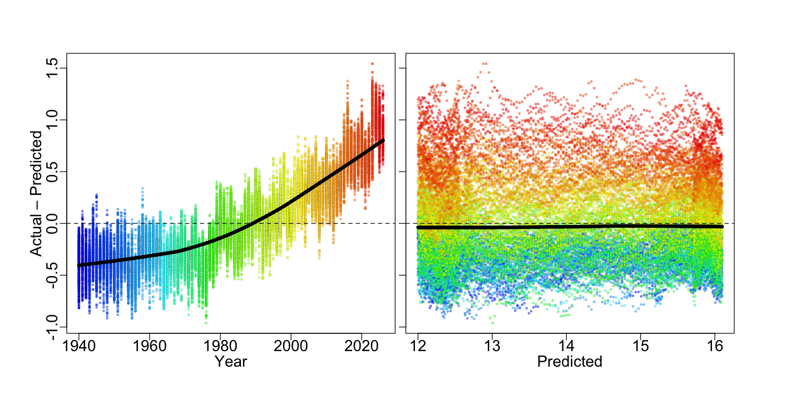
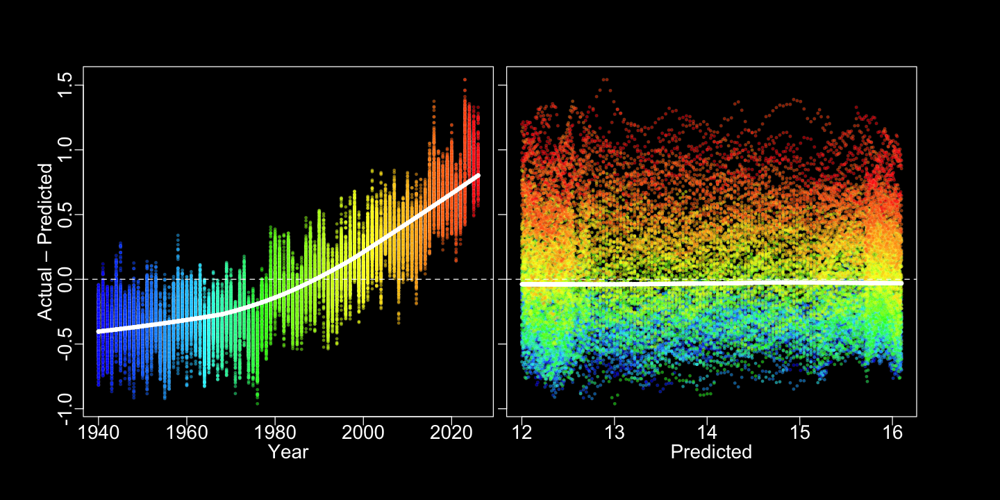
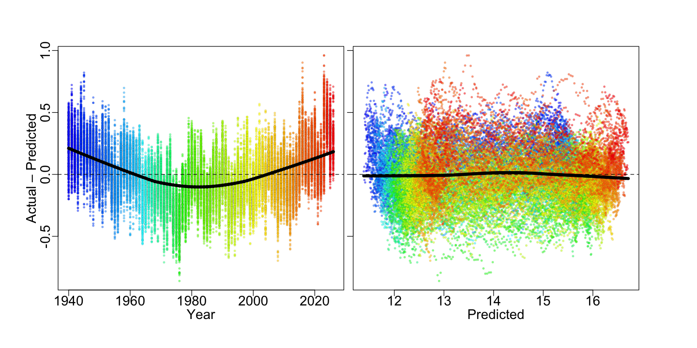
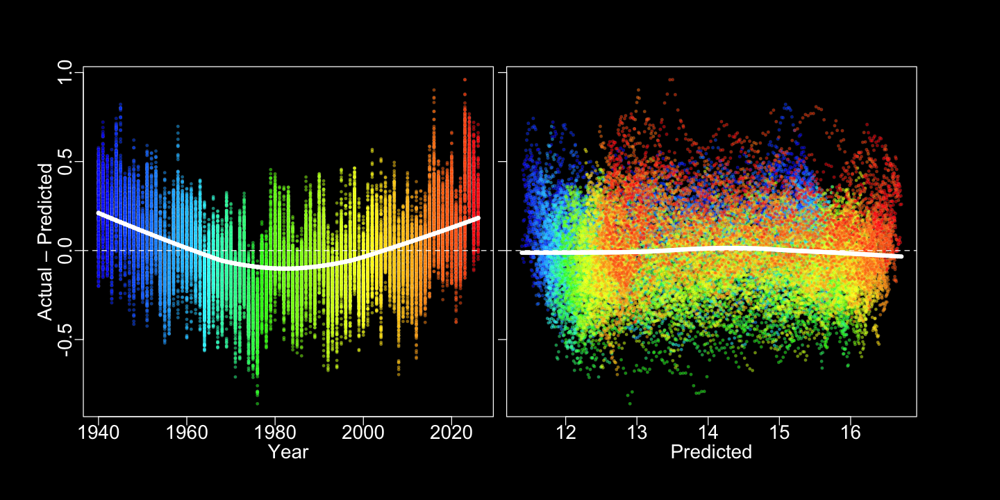

# Segmented regression of temperature on day of year

Author

[Martin Laptev](https://maptv.github.io)

Published

2026+200

Modified

2026+214

This notebook fits the [segmented linear regression](https://en.wikipedia.org/wiki/Segmented_regression) model described in the Dec seasons section of the [Decalendar](../../dec/date/index.llms.md) article. The model predicts daily global mean temperature from the day of year alone, so that we can check how well the 4 Dec seasons capture the annual temperature cycle.

##### Data

The data are daily global mean near-surface (2 m) air temperatures published by [Climate Pulse](https://pulse.climate.copernicus.eu), a service of the Copernicus Climate Change Service (C3S) implemented by the European Centre for Medium-Range Weather Forecasts (ECMWF). Each daily value is the mean of the hourly 2 m temperature fields from 00 to 23 UTC in ERA5, the fifth generation ECMWF reanalysis ([Hersbach et al. 2020+106](#ref-hersbach2020era5)), whose hourly single-level fields are distributed through the C3S Climate Data Store ([Copernicus Climate Change Service (C3S) 2018](#ref-c3s2018era5hourly)). A reanalysis combines past weather observations with a weather forecast model to produce a complete, physically consistent record of the atmosphere, in this case from 1940 to the present.

The code below reads the CSV file directly from Climate Pulse, so every rerun of the notebook picks up the newest data. The outputs shown here were computed on 31,649 days from 1940-01-01 to 2026-08-25. ERA5 lags real time by about 5 days, and the values for the most recent days are marked as preliminary and may change slightly once the final ERA5 data are available. Of the 5 columns in the file, the model only uses `date` and `2t`, the daily mean temperature in degrees Celsius, which R renames to `X2t` because a syntactically valid R name cannot begin with a digit.

The predictor `x` is the number of days since March 1, which is the Decalendar positive integer day of year (pid), ranging from 0 on March 1 to 364 or 365 on the last day of February. January and February dates are assigned to the year that began on the previous March 1 by adding the length of that year: 365, or 366 if that February has 29 days.

    In [1]:

``` r
url <- "https://sites.ecmwf.int/data/climatepulse/data/series/era5_daily_series_2t_global.csv"

d <- read.csv(url, comment.char = "#")

d$date <- as.Date(d$date)
d$year <- as.integer(format(d$date, "%Y"))

# March 1 = day 0
march1 <- as.Date(paste0(d$year, "-03-01"))

d$x <- as.integer(d$date - march1)

# Move January and February to the end of the March-February year
leap <- (d$year %% 4 == 0 & d$year %% 100 != 0) |
        (d$year %% 400 == 0)

d$x[d$x < 0] <- d$x[d$x < 0] + ifelse(leap[d$x < 0], 366, 365)

# Spline hinges
d$h100 <- pmax(0, d$x - 100)
d$h150 <- pmax(0, d$x - 150)
d$h200 <- pmax(0, d$x - 200)
d$h266 <- pmax(0, d$x - 266)
d$h316 <- pmax(0, d$x - 316)

# Fit actual 2t observations
fit <- lm(X2t ~ x + h100 + h150 + h200 + h266 + h316, data = d)
```

##### Model

The model is a continuous piecewise linear function of `x` with fixed breakpoints, fit by [ordinary least squares](https://en.wikipedia.org/wiki/Ordinary_least_squares) using the `lm` function in R ([R Core Team 2024+105](#ref-rcoreteam2024r)). Each breakpoint \\k\\ enters the model as a “hinge” term, \\\max(0, x - k)\\, which is zero before the breakpoint and grows by 1 per day after it:

\\\hat{T} = \beta_0 + \beta_1 x + \sum\_{k \in K} \gamma_k \max(0,\\ x - k), \qquad K = \\100, 150, 200, 266, 316\\\\

\\\beta_0\\ is the predicted temperature on March 1 (\\x = 0\\), \\\beta_1\\ is the slope of the first segment, and each \\\gamma_k\\ is the change in slope at breakpoint \\k\\. Because the hinge terms are continuous, the predicted line has no jumps at the breakpoints.

The breakpoints were chosen by hand rather than estimated from the data. Days 100 and 200 are the first days of the Dec seasons h1 and h2. Day 266 is the first day of h-1 in leap years (Day 265 in common years). Day 150 is the middle of h1 and is next to Day 149, the hottest day of year on average. Day 316 is the coldest day of year on average and is close to the middle of h-1.

    In [2]:

``` r
summary(fit)
```

    Call:
    lm(formula = X2t ~ x + h100 + h150 + h200 + h266 + h316, data = d)

    Residuals:
         Min       1Q   Median       3Q      Max 
    -0.96097 -0.32496 -0.08715  0.28957  1.54234 

    Coefficients:
                  Estimate Std. Error t value Pr(>|t|)    
    (Intercept) 12.6344176  0.0085715 1474.00   <2e-16 ***
    x            0.0307125  0.0001329  231.03   <2e-16 ***
    h100        -0.0228730  0.0003414  -66.99   <2e-16 ***
    h150        -0.0258890  0.0004559  -56.78   <2e-16 ***
    h200        -0.0192706  0.0004077  -47.27   <2e-16 ***
    h266         0.0226814  0.0004150   54.66   <2e-16 ***
    h316         0.0260683  0.0005596   46.59   <2e-16 ***
    ---
    Signif. codes:  0 ‘***’ 0.001 ‘**’ 0.01 ‘*’ 0.05 ‘.’ 0.1 ‘ ’ 1

    Residual standard error: 0.4232 on 31642 degrees of freedom
    Multiple R-squared:  0.9164,    Adjusted R-squared:  0.9164 
    F-statistic: 5.778e+04 on 6 and 31642 DF,  p-value: < 2.2e-16

    In [3]:

``` r
coef(fit)
```

(Intercept)  
12.6344175682665

x  
0.0307125467293055

h100  
-0.0228730109146586

h150  
-0.0258889596598377

h200  
-0.0192705824978766

h266  
0.0226814026184337

h316  
0.0260682888975322

    In [4]:

``` r
# Mean Absolute Error (MAE)
mean(abs(d$X2t - fitted(fit)))
```

0.348672385245436

The model explains about 91.6% of the variation in daily global mean temperature (\\R^2 = 0.916\\), with a residual standard error of 0.42 °C and a mean absolute error (MAE) of 0.35 °C. The p-values in the summary above should not be taken at face value, because consecutive days are strongly correlated with each other and ordinary least squares standard errors assume independent residuals. The purpose of the model is to show how closely a simple seasonal shape fits the data, not to test hypotheses.

Adding up the slope changes gives the slope of each segment:

|    Days | Slope (°C per day) | Predicted temperature on first day (°C) |
|--------:|-------------------:|----------------------------------------:|
|    0–99 |            +0.0307 |                                   12.63 |
| 100–149 |            +0.0078 |                                   15.71 |
| 150–199 |            −0.0180 |                                   16.10 |
| 200–265 |            −0.0373 |                                   15.20 |
| 266–315 |            −0.0146 |                                   12.73 |
| 316–365 |            +0.0114 |                                   12.00 |

Temperatures rise quickly in h0, level off and peak near Day 150 in h1, fall fastest in h2, and bottom out near Day 316 in h-1. Nothing in the model forces the end of one year to connect to the start of the next, but it nearly does: the prediction for Day 365 (12.56 °C) is within 0.1 °C of the prediction for Day 0 (12.63 °C).

    In [5]:

``` r
unique_years <- sort(unique(d$year))
num_years <- length(unique_years)

year_palette <- colorRampPalette(c(
  "#00f8",
  "#04f8",
  "#05f8",
  "#06f8",
  "#08f8",
  "#0af8",
  "#0bf8",
  "#0cf8",
  "#0ff8",
  "#0fb8",
  "#0f98",
  "#0f78",
  "#0f08",
  "#6f08",
  "#7f08",
  "#8f08",
  "#af08",
  "#cf08",
  "#df08",
  "#ef08",
  "#ff08",
  "#fd08",
  "#fc08",
  "#fb08",
  "#f908",
  "#f708",
  "#f608",
  "#f508",
  "#f008"
), alpha = TRUE)

year_colors <- year_palette(num_years)
names(year_colors) <- unique_years

point_colors <- year_colors[as.character(d$year)]
```

    In [6]:

``` r
options(repr.plot.width = 12, repr.plot.height = 6)
```

##### Residual plots

The two plots below show the residuals, the actual minus the predicted temperatures. Points are colored by year, from blue for the 1940s through green and yellow to red for the 2020s. The thick line is a LOWESS smooth ([Cleveland 1979](#ref-cleveland1979lowess)) of the residuals, and the dashed line marks a residual of zero. Each figure has a light and a dark version to match the site theme.

The left plot shows residuals against year. The residuals average about −0.3 °C in every decade from the 1940s through the 1970s and rise to about +0.8 °C in the 2020s, so the model overpredicts temperatures in earlier years and underpredicts them in later years. This is expected, because the model ignores the long-term warming trend and predicts the same temperature for a given day of year in every year.

The right plot shows residuals against predicted temperatures, a common [regression diagnostic](https://en.wikipedia.org/wiki/Regression_diagnostic). The LOWESS line stays within a few hundredths of a degree of zero across the full range of predictions, which indicates that the piecewise linear shape of the model captures the annual cycle without systematic errors at any particular temperature. The vertical spread of the points mostly reflects the differences between years shown in the left plot.

    In [7]:

``` r
par(
    bg = "#FFFFFF",
    fg = "#000000",
    cex.axis = 1.4,
    cex.lab = 1.4,
    cex.sub = 1.4,
    mfrow = c(1, 2)
)

par(mar = c(5, 5, 4, .4))
plot(
  d$year,
  residuals(fit),
  pch = 21,
  bg = point_colors,
  col = "#0008",
  lwd = 0.1,
  cex = 0.5,
  mgp = c(1.7, 0.5, 0),
  xlab = "Year",
  ylab = "Actual – Predicted"
)
abline(h = 0, lty = 2)
lines(lowess(d$year, residuals(fit)), lwd = 5)

par(mar = c(5, .4, 4, 5))
plot(
  fitted(fit),
  residuals(fit),
  pch = 21,
  bg = point_colors,
  col = "#0008",
  lwd = 0.1,
  cex = 0.5,
  mgp = c(1.7, 0.5, 0),
  yaxt = "n",
  xlab = "Predicted",
  ylab = ""
)
axis(2, labels = FALSE)
abline(h = 0, lty = 2)
lines(lowess(fitted(fit), residuals(fit)), lwd = 5)


par(bg = "#000000",
    fg = "#FFFFFF",
    col.axis = "#FFFFFF",
    col.lab = "#FFFFFF",
    col.sub  = "#FFFFFF"
   )

par(mar = c(5, 5, 4, .4))
plot(
  d$year,
  residuals(fit),
  pch = 21,
  bg = point_colors,
  col = "#fff8",
  lwd = 0.1,
  cex = 0.5,
  mgp = c(1.7, 0.5, 0),
  xlab = "Year",
  ylab = "Actual – Predicted"
)
abline(h = 0, lty = 2)
lines(lowess(d$year, residuals(fit)), lwd = 5)

par(mar = c(5, .4, 4, 5))
plot(
  fitted(fit),
  residuals(fit),
  pch = 21,
  bg = point_colors,
  col = "#fff8",
  lwd = 0.1,
  cex = 0.5,
  mgp = c(1.7, 0.5, 0),
  yaxt = "n",
  xlab = "Predicted",
  ylab = ""
)
axis(2, labels = FALSE)
abline(h = 0, lty = 2)
lines(lowess(fitted(fit), residuals(fit)), lwd = 5)
```

[](segment-r_files/figure-html/segme-output-1.png)

[](segment-r_files/figure-html/segme-output-2.png)

##### Adding the year

To see how much of the remaining error is due to the long-term trend, the next model adds the year as a linear predictor.

    In [8]:

``` r
fit_year <- lm(X2t ~ x + h100 + h150 + h200 + h266 + h316 + year, data = d)
```

    In [9]:

``` r
summary(fit_year)
```

    Call:
    lm(formula = X2t ~ x + h100 + h150 + h200 + h266 + h316 + year, 
        data = d)

    Residuals:
         Min       1Q   Median       3Q      Max 
    -0.86049 -0.14969 -0.00689  0.14524  0.96031 

    Coefficients:
                  Estimate Std. Error t value Pr(>|t|)    
    (Intercept) -1.582e+01  1.001e-01 -158.08   <2e-16 ***
    x            3.071e-02  7.045e-05  435.98   <2e-16 ***
    h100        -2.289e-02  1.809e-04 -126.53   <2e-16 ***
    h150        -2.571e-02  2.416e-04 -106.42   <2e-16 ***
    h200        -1.941e-02  2.160e-04  -89.86   <2e-16 ***
    h266         2.253e-02  2.199e-04  102.45   <2e-16 ***
    h316         2.616e-02  2.965e-04   88.23   <2e-16 ***
    year         1.435e-02  5.040e-05  284.65   <2e-16 ***
    ---
    Signif. codes:  0 ‘***’ 0.001 ‘**’ 0.01 ‘*’ 0.05 ‘.’ 0.1 ‘ ’ 1

    Residual standard error: 0.2243 on 31641 degrees of freedom
    Multiple R-squared:  0.9765,    Adjusted R-squared:  0.9765 
    F-statistic: 1.879e+05 on 7 and 31641 DF,  p-value: < 2.2e-16

The year coefficient is 0.0144 °C per year, or about 1.4 °C per century. Adding the year raises the variation explained to about 97.7% (\\R^2 = 0.977\\), and the MAE shown below falls to 0.18 °C. The intercept changes because it now refers to Year 0 rather than to an average year, but the coefficients for `x` and the hinge terms barely change. In other words, the shape of the annual temperature cycle is essentially the same in every year, which is why Dec seasons can describe it regardless of the year.

A straight line is only a rough approximation of the warming trend, which has accelerated in recent decades. The U-shaped LOWESS line in the residuals-versus-year plot below shows this: the year model underpredicts at both ends of the record and overpredicts in between.

    In [10]:

``` r
dev.new(width = 96, height = 4)
```

    In [11]:

``` r
par(
    bg = "#FFFFFF",
    fg = "#000000",
    cex.axis = 1.4,
    cex.lab = 1.4,
    cex.sub = 1.4,
    mfrow = c(1, 2)
)

par(mar = c(5, 5, 4, .4))
plot(
  d$year,
  residuals(fit_year),
  pch = 21,
  bg = point_colors,
  col = "#0008",
  lwd = 0.1,
  cex = 0.5,
  mgp = c(1.7, 0.5, 0),
  xlab = "Year",
  ylab = "Actual – Predicted"
)
abline(h = 0, lty = 2)
lines(lowess(d$year, residuals(fit_year)), lwd = 5)

par(mar = c(5, .4, 4, 5))
plot(
  fitted(fit_year),
  residuals(fit_year),
  pch = 21,
  bg = point_colors,
  col = "#0008",
  lwd = 0.1,
  cex = 0.5,
  mgp = c(1.7, 0.5, 0),
  yaxt = "n",
  xlab = "Predicted",
  ylab = ""
)
axis(2, labels = FALSE)
abline(h = 0, lty = 2)
lines(lowess(fitted(fit_year), residuals(fit_year)), lwd = 5)


par(bg = "#000000",
    fg = "#FFFFFF",
    col.axis = "#FFFFFF",
    col.lab = "#FFFFFF",
    col.sub  = "#FFFFFF"
   )

par(mar = c(5, 5, 4, .4))
plot(
  d$year,
  residuals(fit_year),
  pch = 21,
  bg = point_colors,
  col = "#fff8",
  lwd = 0.1,
  cex = 0.5,
  mgp = c(1.7, 0.5, 0),
  xlab = "Year",
  ylab = "Actual – Predicted"
)
abline(h = 0, lty = 2)
lines(lowess(d$year, residuals(fit_year)), lwd = 5)

par(mar = c(5, .4, 4, 5))
plot(
  fitted(fit_year),
  residuals(fit_year),
  pch = 21,
  bg = point_colors,
  col = "#fff8",
  lwd = 0.1,
  cex = 0.5,
  mgp = c(1.7, 0.5, 0),
  yaxt = "n",
  xlab = "Predicted",
  ylab = ""
)
axis(2, labels = FALSE)
abline(h = 0, lty = 2)
lines(lowess(fitted(fit_year), residuals(fit_year)), lwd = 5)
```

[](segment-r_files/figure-html/cell-12-output-1.png)

[](segment-r_files/figure-html/cell-12-output-2.png)

    In [12]:

``` r
# Mean Absolute Error (MAE)
mean(abs(d$X2t - fitted(fit_year)))
```

0.17783703546148

##### References

Cleveland, William S. 1979. “Robust Locally Weighted Regression and Smoothing Scatterplots.” *Journal of the American Statistical Association* 74 (368): 829–36. <https://doi.org/10.1080/01621459.1979.10481038>.

Copernicus Climate Change Service (C3S). 2018. “ERA5 Hourly Data on Single Levels from 1940 to Present.” Copernicus Climate Change Service (C3S) Climate Data Store (CDS), 2018. <https://doi.org/10.24381/cds.adbb2d47>.

Hersbach, Hans, Bill Bell, Paul Berrisford, et al. 2020+106. “The ERA5 Global Reanalysis.” *Quarterly Journal of the Royal Meteorological Society* 146 (730): 1999–2049. <https://doi.org/10.1002/qj.3803>.

R Core Team. 2024+105. *R: A Language and Environment for Statistical Computing*. V. 4.4.1. R Foundation for Statistical Computing, released 2024+105. <https://www.R-project.org>.

Back to top
