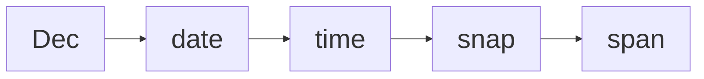
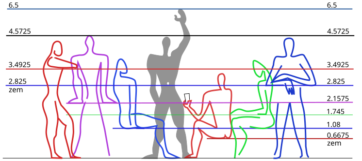
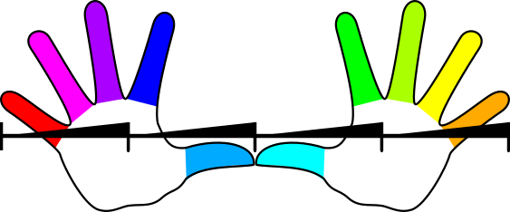
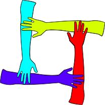
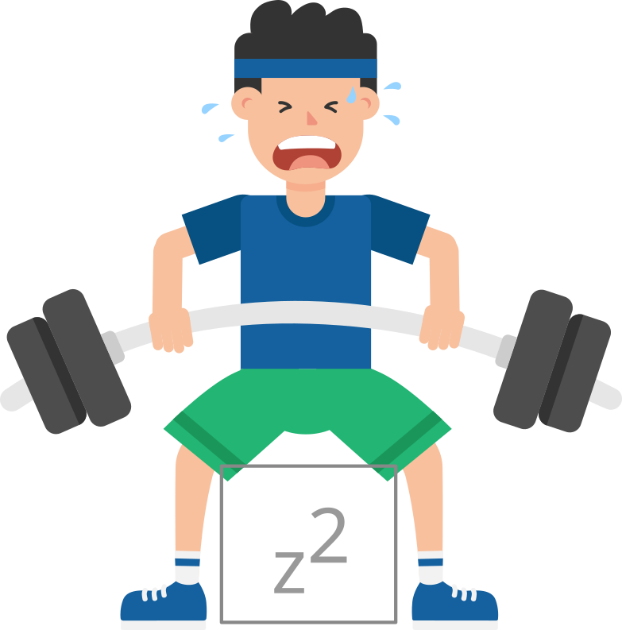
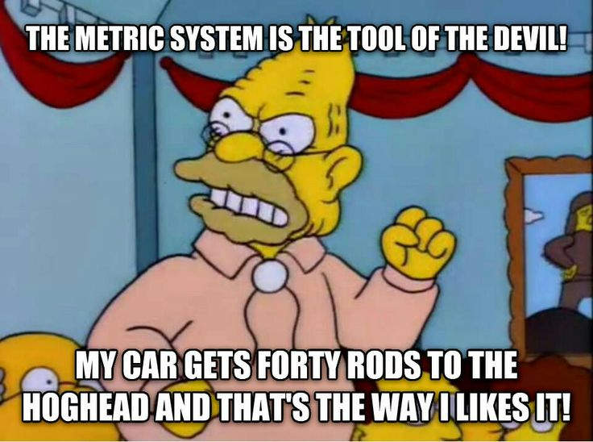
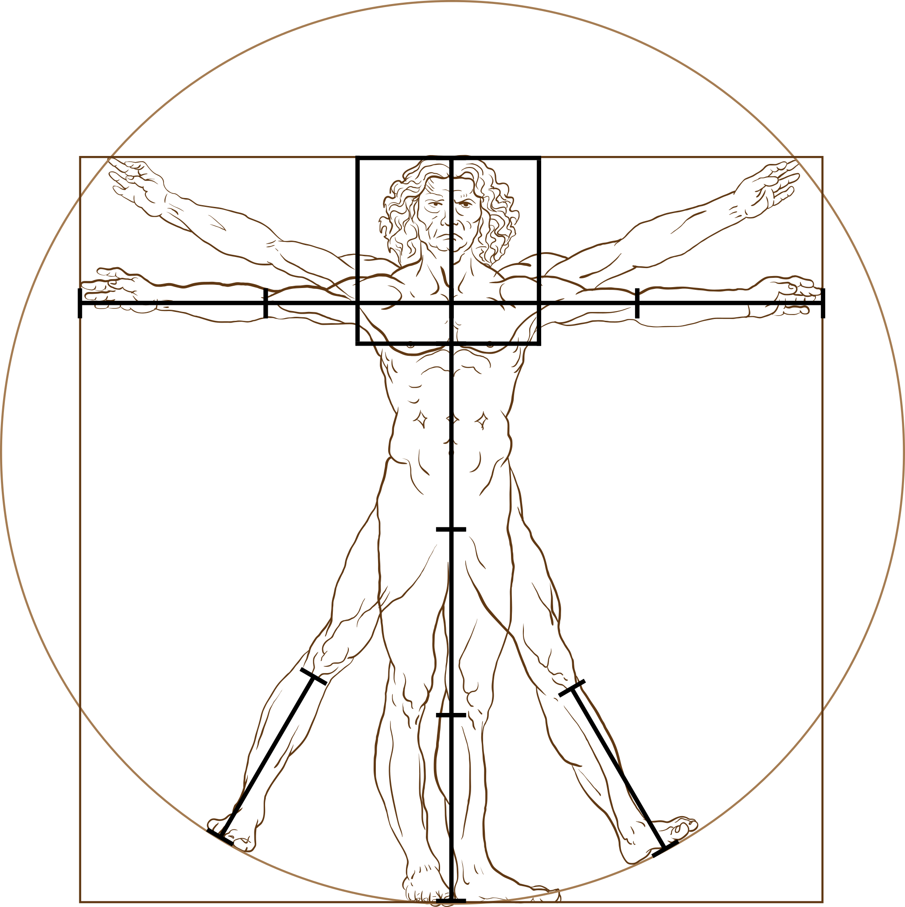
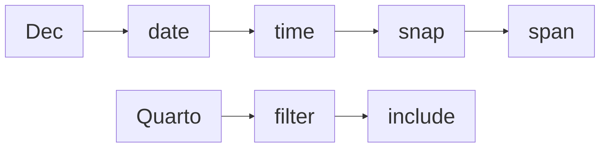

# Dec Measurement System

Code

Introducing Dec, a measurement system, which uses turns instead of months, weeks, hours, minutes, seconds, and degrees.

Author

[Martin Laptev](https://maptv.github.io)

Published

2026+200

Modified

2026+200



#### 0 Dec measurement system

This part of my website focuses on Dec, a [measurement system](https://en.wikipedia.org/wiki/System_of_units_of_measurement#:~:text=a%20collection%20of%20units%20of%20measurement%20and%20rules%20relating%20them%20to%20each%20other) that [I](https://maptv.github.io) created. All Dec measurements are based on [turns](https://en.wikipedia.org/wiki/Turn_%28angle%29#:~:text=a%20unit%20of%20plane%20angle%20measurement%20equal%20to%202%CF%80%C2%A0radians%2C%20360%C2%A0degrees). When measuring [angles](https://en.wikipedia.org/wiki/Angle#:~:text=the%20figure%20formed%20by%20two%20rays)📐, a [turn](https://en.wikipedia.org/wiki/Turn_%28angle%29#:~:text=the%20Greek%20letter,to%20one%20turn) ([t](#t)) represents a full⭕️circle and equals 360 [degrees](https://en.wikipedia.org/wiki/Degree_(angle)#:~:text=a%20measurement%20of%20a%20plane%20angle%20in%20which%20one%20full%20rotation%20is%20360%20degrees) ([°](#deg)) or [\\\underline\tau\\](#2pi), 2[𝜋](#pi), or 900[ϡ](#sampi) [radians](https://en.wikipedia.org/wiki/Radian#:~:text=the%20unit%20of%20angle%20in%20the%20International%20System%20of%20Units) ([rad](#rad)). [Geographic coordinates](https://en.wikipedia.org/wiki/Geographic_coordinate_system#:~:text=positions%20directly%20on%20Earth%20as%20latitude%20and%20longitude) and [compass](https://en.wikipedia.org/wiki/Compass#:~:text=a%20device%20that%20shows%20the%20cardinal%20directions%20used%20for%20navigation%20and%20geographic%20orientation)🧭directions are angles and thus can — and should — be measured in turns instead of [rad](#rad) or [°](#deg).

#### 1 Longitude latitude course

Dec measures [longitude](https://en.wikipedia.org/wiki/Longitude#:~:text=denoted%20by%20the%20Greek%20letter%20lambda) in [wěi](https://en.wiktionary.org/wiki/%E7%B7%AF#:~:text=(geography)-,latitude,-coordinate%20terms%C2%A0%E2%96%B2) ([w](#w)), [latitude](https://en.wikipedia.org/wiki/Latitude#:~:text=denoted%20by%20the%20Greek%20lower%2Dcase%20letter%20phi) in [meridians](https://en.wikipedia.org/wiki/Meridian_arc#Full_meridian_(polar_perimeter):~:text=The%20polar%20Earth%27s%20circumference%20is%20simply%20four%20times%20quarter%20meridian) ([m](#m)), and compass directions in [roses](https://en.wikipedia.org/wiki/Compass_rose#:~:text=a%20polar%20diagram%20displaying%20the%20orientation%20of%20the%20cardinal%20directions)🌹([r](#r)). To measure certain kinds of angles, Dec uses specific types of turns with distinct names like [w](#w), [m](#m), or [r](#r). All turn types can be combined with [metric prefixes](https://en.wikipedia.org/wiki/Metric_prefix#:~:text=a%20unit%20prefix%20that%20precedes%20a%20basic%20unit%20of%20measure%20to%20indicate%20a%20multiple%20or%20submultiple%20of%20the%20unit), like [deci](https://en.wikipedia.org/wiki/Deci-#:~:text=a%20decimal%20unit%20prefix%20in%20the%20metric%20system%20denoting%20a%20factor%20of%20one%20tenth), [centi](https://en.wikipedia.org/wiki/Centi-#:~:text=a%20unit%20prefix%20in%20the%20metric%20system%20denoting%20a%20factor%20of%20one%20hundredth), or [milli](https://en.wikipedia.org/wiki/Milli-#:~:text=a%20unit%20prefix%20in%20the%20metric%20system%20denoting%20a%20factor%20of%20one%20thousandth), to create turn [submultiples](https://en.wikipedia.org/wiki/Multiple_%28mathematics%29#:~:text=of%20%22a%20being-,a%20unit%20fraction,-of%20b%22%20%28a), such as deciturns ([dt](#dt)), centiturns ([ct](#ct)), or milliturns ([mt](#mt)).

[Table 1](#tbl-map) below⬇️provides the current longitude in milliwěi ([mw](#mw)) and latitude in millimeridians ([mm](#mm)) of Points 0 and 1 on the [map](#fig-distmap)🗺️beneath [Table 1](#tbl-map). By default, Point 0 is at 800 [mw](#mw) and 0 [mm](#mm), near the [Galápagos🏝️archipelago](https://en.wikipedia.org/wiki/Gal%C3%A1pagos_Islands#:~:text=an%20archipelago%20of%20volcanic%20islands%20in%20the%20Eastern%20Pacific) of Ecuador🇪🇨, and Point 1 is at 800 [mw](#mw) and 100 [mm](#mm), near the bottom of the [Missouri bootheel](https://en.wikipedia.org/wiki/Missouri_Bootheel#:~:text=a%20salient%20(protrusion)%20located%20in%20the%20southeasternmost%20part%20of%20the%20U.S.%20state%20of%20Missouri) in the United States🇺🇸.

To move the points, click the [map](#fig-distmap) or edit their coordinates in [Table 1](#tbl-map). The [toggle](https://observablehq.com/framework/inputs/toggle)✅inputs above⬆️[Table 1](#tbl-map) add layers to the [map](#fig-distmap): country borders, a rainbow🌈colored grid of Dec [graticules](https://en.wikipedia.org/wiki/Graticule_(cartography)#:~:text=a%20graphical%20depiction%20of%20a%20coordinate%20system%20as%20a%20grid%20of%20lines), a [choropleth](https://en.wikipedia.org/wiki/Choropleth_map#:~:text=a%20type%20of%20statistical%20thematic%20map%20that%20uses%20pseudocolor) of [Coordinated Universal Time](https://en.wikipedia.org/wiki/Coordinated_Universal_Time#:~:text=the%20primary%20time%20standard%20globally%20used%20to%20regulate%20clocks%20and%20time) ([utc](#utc)) time zones, and [solar terminator](https://en.wikipedia.org/wiki/Terminator_(solar)#:~:text=a%20moving%20line%20that%20divides%20the%20daylit%20side%20and%20the%20dark%20night%20side%20of%20a%20planetary%20body) shading with a yellow🟡dot denoting the [point](https://en.wikipedia.org/wiki/Subsolar_point#:~:text=the%20point%20at%20which%20its%20Sun%20is%20perceived%20to%20be%20directly%20overhead) where the Sun☀️is [directly overhead](https://en.wikipedia.org/wiki/Zenith#:~:text=the%20imaginary%20point%20on%20the%20celestial%20sphere%20directly%20%22above%22%20a%20particular%20location): [mw](#mw) and [mm](#mm).

Alongside the geographic coordinates of a point, each row of [Table 1](#tbl-map) contains the [course](https://en.wikipedia.org/wiki/Azimuth#:~:text=%20azimuth%20is%20usually%20denoted%20alpha) in milliroses ([mr](#mr)) we would need to maintain to travel🧳the shortest distance to the other point. The shortest distance is shown as orange🟠dots on the [map](#fig-distmap). The default courses in [mr](#mr) are 0 (North) from Point 0 to 1 and 500 (South) from Point 1 to 0.

#### 2 Distance speed duration

Dec measures distance in [taurs](https://en.wikipedia.org/wiki/Turn_(angle)#Tau_proposals:~:text=%E2%81%A0%20turn-,Circumference%20of%20a%20circle,-%F0%9D%90%B6) ([c](#c)), speed in [omegars](https://en.wikipedia.org/wiki/Angular_velocity#:~:text=linear%20velocity%20is%20the%20radius%20times%20the%20angular%20velocity) ([v](#v)), and time in years ([y](#y)) and days ([d](#d)). Each of these four turn types approximates (\\\approx\\) a physical property of the Earth🌍: [c](#c) = [\\\underline{\tau r}\\](#c) \\\approx\\ its [circumference](https://en.wikipedia.org/wiki/Earth%27s_circumference#:~:text=the%20distance%20around%20Earth), [y](#y) \\\approx\\ the duration of its [orbit](https://en.wikipedia.org/wiki/Earth%27s_orbit#:~:text=From%20a%20vantage%20point%20above%20the%20north%20pole%20of%20either%20the%20Sun%20or%20Earth%2C%20Earth%20would%20appear%20to%20revolve%20in%20a%20counterclockwise%20direction%20around%20the%20Sun) around the Sun️, [d](#d) \\\approx\\ the duration of its [rotation](https://en.wikipedia.org/wiki/Earth%27s_rotation#:~:text=the%20rotation%20of%20planet%20Earth%20around%20its%20own%20axis) on its [axis](https://en.wikipedia.org/wiki/Axial_tilt#:~:text=the%20imaginary%20line%20that%20passes%20through%20both%20the%20north%20pole%20and%20south%20pole), and \\\text c\over\text d\\ = [v](#v) = [\\\underline{\omega r}\\](#v) \\\approx\\ the speed of its rotation at the [Equator](https://en.wikipedia.org/wiki/Equator#:~:text=the%20circle%20of%20latitude%20that%20divides%20Earth%20into%20the%20Northern%20and%20Southern%20hemispheres).

At a speed of 0.5 [v](#v) or 500 milliomegars ([mv](#mv)), we could travel the 0.1 [c](#c) or 100 millitaurs ([mc](#mc)) between the default positions📍of Points 0 and 1 in 0.2 [d](#d) or 200 millidays ([md](#md)). The time required to travel between two points is the distance divided by the speed: [mc](#mc) ÷ [v](#v) = [md](#md) = [c](#c) ÷ [v](#v) = [mc](#mc) ÷ [mv](#mv) = [d](#d).

##### Interactive world map

``` js
viewof travelspeed = Inputs.range([0, 1000], {label: "Speed", value: 500, step: 1})
```

``` js
viewof yaw = Inputs.range([0, 1000], {label: "Yaw", value: 500, step: 1})
```

``` js
viewof pitch = Inputs.range([-500, 500], {label: "Pitch", value: 0, step: 1})
```

``` js
viewof roll = Inputs.range([-500, 500], {label: "Roll", value: 0, step: 1})
```

``` js
viewof mapsize = Inputs.range([0, 100], {label: "Size", value: 100, step: 1})
```

``` js
viewof select = Inputs.select(
  projections, {format: x => x.name, value: projections.find(t => t.name === "Equirectangular (plate carrée)")})
```

``` js
viewof bordertoggle = labelToggle(Inputs.toggle, "Border", false, "bordertoggle")
viewof gridtoggle = labelToggle(Inputs.toggle, "Grid", false, "gridtoggle")
viewof utctoggle = labelToggle(Inputs.toggle, "UTC", false, "utctoggle")
viewof suntoggle = labelToggle(Inputs.toggle, "Sun", false, "suntoggle")
rstbtn.node();
```

``` js
table = createTable([
  { Point: 0, Milliwěi: 800, Millimeridian: 0, Millirose: 0 },
  { Point: 1, Milliwěi: 800, Millimeridian: 100, Millirose: 500 },
], { headerEditable: false, appendRows: false })
//   {Point: 0, Milliwěi: `${Math.floor(long2turn(Place_A[0], 3))}`, Millimeridian: `${Math.floor(lati2turn(Place_A[1], 3))}`, Millirose: `${Math.floor(lati2turn(coor2bear(Place_A, Place_B)))}`},
//   {Point: 1, Milliwěi: `${Math.floor(long2turn(Place_B[0], 3))}`, Millimeridian: `${Math.floor(lati2turn(Place_B[1], 3))}`, Millirose: `${Math.floor(lati2turn(coor2bear(Place_B, Place_A)))}`},
// ], {headerEditable: false, appendRows: false})
```

Table 1

``` js
// https://observablehq.com/@d3/solar-terminator
// https://observablehq.com/@mbostock/time-zones
viewof coordinates = worldMapCoordinates([[turn2long(table.rows[1].cells[1].childNodes[0].innerText), turn2degr(table.rows[1].cells[2].childNodes[0].innerText % 250)], [turn2long(table.rows[2].cells[1].childNodes[0].innerText), turn2degr(table.rows[2].cells[2].childNodes[0].innerText % 250)], projection], [width, height * mapsize / 100])
//viewof coordinates = worldMapCoordinates([
//  [turn2long(table.rows[1].cells[1].childNodes[0].innerText), turn2degr(table.rows[1].cells[2].childNodes[0].innerText % 250)],
//  [turn2long(table.rows[2].cells[1].childNodes[0].innerText), turn2degr(table.rows[2].cells[2].childNodes[0].innerText % 250)],
//  projection], [width, height])
```

Figure 1

##### Color wheel compass

``` js
preview()
```

``` js
// https://observablehq.com/@maddievision/enneagram
quickRender(326, 326, context => {
  const center = 163
  const ringRadius = 140
  const ringLineWidth = 4
  // Ring
  context.beginPath();
  context.lineWidth = ringLineWidth
  context.strokeStyle = "#ddd"
  context.arc(center, center, ringRadius, 0, 2 * Math.PI);
  context.stroke();
  context.font = "Bold 16px Arial"
  context.textAlign = 'center'
  let octPoints = []
  for (let i = 0; i < 8; i++) {
    const xPhase = Math.sin(i / 8 * 2 * Math.PI)
    const yPhase = Math.cos(i / 8 * 2 * Math.PI)
    const x = center + ringRadius * xPhase
    const y = center - ringRadius * yPhase
    octPoints.push([x, y])
  }
  // Lines
  octConnections.forEach(([a, b], i ) => {
    const [x1, y1] = octPoints[a]
    const [x2, y2] = octPoints[b]
    const lineAngle = Math.atan2(y2 - y1, x2 - x1)
    // Draw just short of the label circumference
    const x2a = x2 - 28 * Math.cos(lineAngle)
    const y2a = y2 - 28 * Math.sin(lineAngle)
    const x1a = x1 + 28 * Math.cos(lineAngle)
    const y1a = y1 + 28 * Math.sin(lineAngle)
    context.lineWidth = ringLineWidth
    context.strokeStyle = "#ddd"
    context.beginPath();
    context.moveTo(x2a, y2a);
    context.lineTo(x1a, y1a);
    context.stroke();
  })
  // Arrow Heads
  octConnections.forEach(([a, b], i ) => {
    const [x1, y1] = octPoints[a]
    const [x2, y2] = octPoints[b]
    const lineAngle = Math.atan2(y2 - y1, x2 - x1)
    const xl = x2 - 88 * Math.cos(lineAngle - (15 / 360) * 2 * Math.PI)
    const yl = y2 - 88 * Math.sin(lineAngle - (15 / 360) * 2 * Math.PI)
    const xr = x2 - 88 * Math.cos(lineAngle + (15 / 360) * 2 * Math.PI)
    const yr = y2 - 88 * Math.sin(lineAngle + (15 / 360) * 2 * Math.PI)
    const x2a = x2 - 22 * Math.cos(lineAngle)
    const y2a = y2 - 22 * Math.sin(lineAngle)
    const x = x2 - 69 * Math.cos(lineAngle)
    const y = y2 - 69 * Math.sin(lineAngle)
    context.fillStyle = hsl8[i]
    context.strokeStyle = window.darkmode ? "#aaa" : "#333";
    context.lineWidth = 1
    context.beginPath();
    context.moveTo(x2a, y2a);
    context.lineTo(xl, yl);
    context.lineTo(xr, yr);
    context.lineTo(x2a, y2a);
    context.fill();
    context.stroke();
    context.fillStyle = yiq(hsl8[i]) > 0.51 ? "#000" : "white"
    context.fillText(["N", "NE", "E", "SE", "S", "SW", "W", "NW"][i], x, y + 6)
  })
  // Labels
  octPoints.forEach(([x, y], i) => {
    context.lineWidth = 1
    context.fillStyle = hsl8[i]
    context.strokeStyle = window.darkmode ? "#aaa" : "#333";
    context.beginPath();
    context.arc(x, y, 22, 0, 2 * Math.PI);
    context.fill();
    context.stroke();
    context.fillStyle = yiq(hsl8[i]) > 0.51 ? "#000" : "white";
    context.fillText(["N", "NE", "E", "SE", "S", "SW", "W", "NW"][i], x, y + 6)
  })
})
```

``` js
// https://observablehq.com/@observablehq/categorical-palette-tool
displayPalette(hsl8, {darkMode: true})
```

``` js
// https://observablehq.com/@maddievision/enneagram
quickRender(326, 326, context => {
  const center = 163
  const ringRadius = 140
  const ringLineWidth = 4
  // Ring
  context.beginPath();
  context.lineWidth = ringLineWidth
  context.strokeStyle = "#ddd"
  context.arc(center, center, ringRadius, 0, 2 * Math.PI);
  context.stroke();
  context.font = "Bold 24px Arial"
  context.textAlign = 'center'
  let decPoints = []
  for (let i = 0; i < 10; i++) {
    const xPhase = Math.sin(i / 10 * 2 * Math.PI)
    const yPhase = Math.cos(i / 10 * 2 * Math.PI)
    const x = center + ringRadius * xPhase
    const y = center - ringRadius * yPhase
    decPoints.push([x, y])
  }
  // Lines
  decConnections.forEach(([a, b], i ) => {
    const [x1, y1] = decPoints[a]
    const [x2, y2] = decPoints[b]
    const lineAngle = Math.atan2(y2 - y1, x2 - x1)
    // Draw just short of the label circumference
    const x2a = x2 - 28 * Math.cos(lineAngle)
    const y2a = y2 - 28 * Math.sin(lineAngle)
    const x1a = x1 + 28 * Math.cos(lineAngle)
    const y1a = y1 + 28 * Math.sin(lineAngle)
    context.lineWidth = ringLineWidth
    context.strokeStyle = "#ddd"
    context.beginPath();
    context.moveTo(x2a, y2a);
    context.lineTo(x1a, y1a);
    context.stroke();
  })
  // Arrow Heads
  decConnections.forEach(([a, b], i ) => {
    const [x1, y1] = decPoints[a]
    const [x2, y2] = decPoints[b]
    const lineAngle = Math.atan2(y2 - y1, x2 - x1)
    const xl = x2 - 79 * Math.cos(lineAngle - (15 / 360) * 2 * Math.PI)
    const yl = y2 - 79 * Math.sin(lineAngle - (15 / 360) * 2 * Math.PI)
    const xr = x2 - 79 * Math.cos(lineAngle + (15 / 360) * 2 * Math.PI)
    const yr = y2 - 79 * Math.sin(lineAngle + (15 / 360) * 2 * Math.PI)
    const x2a = x2 - 22 * Math.cos(lineAngle)
    const y2a = y2 - 22 * Math.sin(lineAngle)
    const x = x2 - 60 * Math.cos(lineAngle)
    const y = y2 - 60 * Math.sin(lineAngle)
    context.fillStyle = hsl10[i]
    context.strokeStyle = window.darkmode ? "#aaa" : "#333";
    context.lineWidth = 1
    context.beginPath();
    context.moveTo(x2a, y2a);
    context.lineTo(xl, yl);
    context.lineTo(xr, yr);
    context.lineTo(x2a, y2a);
    context.fill();
    context.stroke();
    context.fillStyle = yiq(hsl10[i]) > 0.51 ? "#000" : "white"
    context.fillText(i, x, y + 8)
  })
  // Labels
  decPoints.forEach(([x, y], i) => {
    context.lineWidth = 1
    context.fillStyle = hsl10[i]
    context.strokeStyle = window.darkmode ? "#aaa" : "#333";
    context.beginPath();
    context.arc(x, y, 22, 0, 2 * Math.PI);
    context.fill();
    context.stroke();
    context.fillStyle = yiq(hsl10[i]) > 0.51 ? "#000" : "white";
    context.fillText(i, x, y + 8)
  })
})
```

``` js
// https://observablehq.com/@observablehq/categorical-palette-tool
displayPalette(hsl10.slice(0, 10), {darkMode: true})
```

``` js
// https://observablehq.com/@pjedwards/compass-rose-as-legend-with-colors
svg`<svg width="${size}" height="${size}" viewBox="${-size/2} ${-size/2} ${size} ${size}">
  <g transform='rotate(${Math.round(-colorD * .36)})'>
  ${repeat(tick(radius, 5, '#434343'), 5 * 4 * 10)}
  ${repeat(tick(radius, 8), 10 * 4)}
  ${repeat(`<path d="M 0,-${radius+12} l 3,10 l -6,0 z" fill="black" stroke="black" stroke-width="1"/>`, 4, 0)}
  ${repeat(`<path d="M 0,-${radius+12} l 3,10 l -6,0 z" fill="white" stroke="black" stroke-width="1"/>`, 4, 45)}
  <circle r="${radius}" fill="#d3d3d3" stroke="#434343" stroke-width="3" />
  ${repeat(directionMarker(radius+14, 24), 4, 0)}
  ${repeat(directionMarker(radius+12, 24), 4, 45)}
  ${repeat(turnMarker(radius+14, 32), 4, 0)}
  ${repeat(turnMarker(radius+12, 32), 4, 45)}
  ${repeat(pie(radius-margin/2, 2 * Math.PI * (radius-margin/2) / deccolors.length / 2, 1, deccolors), deccolors.length, 360/deccolors.length)}
</svg>
`
```

Figure 2

``` js
// https://observablehq.com/@paavanb/progressive-color-picker
decBar = colorbar({
  colorFn: t => hslToRgb(dec2hue(t) / 1000, colorS / 1000, colorL / 1000),
  onSelect: t => {
    set(viewof colorD, t * 1000)
    onUpdateHSL(dec2hue(t), colorS / 1000, colorL / 1000)
  }
})
```

``` js
// https://observablehq.com/@paavanb/progressive-color-picker
{ const input = Inputs.range([0, 1000], { label: "Hue", value: 0, step: 1 })
  input.value = initialHSL[0]
  input.oninput = (evt) => onUpdateHSL(dec2hue(evt.currentTarget.value / 1000), colorS / 1000, colorL / 1000)
  return Inputs.bind(input, viewof colorD)
}
```

``` js
// https://observablehq.com/@paavanb/progressive-color-picker
{ const input = Inputs.range([0, 1000], { label: "Saturation", value: 1000, step: 1, })
  input.oninput = (evt) => onUpdateHSL(colorD, evt.currentTarget.value / 1000, colorL / 1000)
  return Inputs.bind(input, viewof colorS)
}
```

``` js
// https://observablehq.com/@paavanb/progressive-color-picker
{ const input = Inputs.range([0, 1000], { label: "Lightness", value: 500, step: 1, })
  input.oninput = (evt) => onUpdateHSL(colorD, colorS / 1000, evt.currentTarget.value / 1000)
  return Inputs.bind(input, viewof colorL)
}
```

##### Course color table

|     | **mr**🧭 | **c°**🧭 | **h°**🎨 | **hex**🎨 |
|-----|----------|----------|----------|-----------|
|     |          |          |          |           |
| NE  | 125      | 45       | 44       | fb0       |
| E   | 250      | 90       | 68       | df0       |
| SE  | 375      | 135      | 96       | 6f0       |
| S   | 500      | 180      | 180      | 0ff       |
| SW  | 625      | 225      | 216      | 06f       |
| W   | 750      | 270      | 264      | 60f       |
| NW  | 875      | 315      | 292      | d0f       |
| N   | 0        | 0        | 0        | f00       |

Table 2

The [color🎨wheel](https://en.wikipedia.org/wiki/Color_wheel#:~:text=an%20abstract%20illustrative%20organization%20of%20color%20hues%20around%20a%20circle) compass above indicates both a [hue](https://en.wikipedia.org/wiki/Hue#:~:text=an%20angular%20position%20around%20a%20central%20or%20neutral%20point%20or%20axis%20on%20a%20color%20space%20coordinate%20diagram) in [mt](#mt) and a course in [mr](#mr). We can convert the hue to [HSL and HSV](https://en.wikipedia.org/wiki/HSL_and_HSV#:~:text=the%20two%20most%20common%20cylindrical%2Dcoordinate%20representations%20of%20points%20in%20an%20RGB%20color%20model) degrees ([h°](#hdeg)) and the course to compass degrees ([c°](#cdeg)): 25 [mr](#mr) = 9 [c°](#cdeg). To rotate🔄the color wheel compass, use the “Hue” [range](https://observablehq.com/framework/inputs/range)🎚️and [hue bar](https://observablehq.com/@paavanb/progressive-color-picker) inputs beneath it or change the course from Point 0 to 1 by interacting with [Table 1](#tbl-map) or the [map](#fig-distmap) above.

#### 3 Red green blue (rgb)

Beneath the hue bar, [Table 2](#tbl-color) compares the current Point 0 to 1 course in its top row with the [cardinal](https://en.wikipedia.org/wiki/Cardinal_direction#:~:text=north%2C%20south%2C%20east%2C%20and%20west) and [intercardinal](https://en.wikipedia.org/wiki/Cardinal_direction#:~:text=northeast%20(NE)%2C%20southeast%20(SE)%2C%20southwest%20(SW)%2C%20and%20northwest%20(NW)) directions. Together, the range inputs underneath the hue bar form a “hue saturation lightness” ([hsl](#hsl)) triplet. Like “[red green blue](https://en.wikipedia.org/wiki/RGB_color_model#:~:text=an%20additive%20color%20model)” ([rgb](#rgb)) or [hexadecimal](https://en.wikipedia.org/wiki/Web_colors#Hex_triplet:~:text=hexadecimal%20number%20used%20in%20HTML%2C%20CSS%2C%20SVG%2C%20and%20other%20computing%20applications%20to%20represent%20colors) ([hex](#hex)) triplets, [hsl](#hsl) triplets specify a full-fledged color instead of just a hue.

Color labels🏷️provide a general idea of angular [measure](https://en.wikipedia.org/wiki/Angle#:~:text=The%20magnitude%20of%20an%20angle), regardless of the metric prefixes or [units](https://en.wikipedia.org/wiki/Angle#Units) we use. Therefore, we can reuse♻️colors across many different contexts. Most often, red designates starting points, like North (0 [mr](#mr)) and [Longitude 0](https://en.wikipedia.org/wiki/18th_meridian_west#:~:text=a%20line%20of%20longitude%20that%20extends%20from%20the%20North%20Pole%20across%20the%20Arctic%20Ocean%2C%20Greenland%2C%20Iceland%2C%20the%20Atlantic%20Ocean%2C%20the%20Canary%20Islands%2C%20the%20Southern%20Ocean%2C%20and%20Antarctica%20to%20the%20South%20Pole) (0 [mw](#mw)), and cyan denotes midpoints, such as South (500 [mr](#mr)) and [Longitude 5](https://en.wikipedia.org/wiki/162nd_meridian_east#:~:text=a%20line%20of%20longitude%20that%20extends%20from%20the%20North%20Pole%20across%20the%20Arctic%20Ocean%2C%20Asia%2C%20the%20Pacific%20Ocean%2C%20the%20Southern%20Ocean%2C%20and%20Antarctica%20to%20the%20South%20Pole) (500 [mw](#mw)).

> **WARNING:**
>
> Feeling ***disoriented***😵‍💫? Of [***course***](https://en.wikipedia.org/wiki/Course_(navigation)#:~:text=the%20cardinal%20direction%20in%20which%20the%20craft%20is%20to%20be%20steered) you are! Color labels️ can help you find your [***bearings***](https://en.wikipedia.org/wiki/Bearing_(navigation)#:~:text=the%20horizontal%20angle%20between%20the%20direction%20of%20an%20object%20and%20north%20or%20another%20object), stay on [***track***](https://en.wikipedia.org/wiki/Course_(navigation)#:~:text=The%20path%20that%20a%20vessel%20follows), and avoid [***heading***](https://en.wikipedia.org/wiki/Course_(navigation)#:~:text=the%20direction%20where%20the%20watercraft's%20bow%20or%20the%20aircraft's%20nose%20is%20pointed) aches🤕. Orange you glad I couldn’t think of a color pun?

The Equator (0 [mm](#mm)) is the [major latitude](https://en.wikipedia.org/wiki/Circle_of_latitude#:~:text=mark%20the%20divisions%20between%20the%20five%20principal%20geographical%20zones) midway between the South (-250 [mm](#mm)) and North (250 [mm](#mm)) Poles. Unlike the Equator, the Tropics of [Cancer](https://en.wikipedia.org/wiki/Tropic_of_Cancer#:~:text=northernmost%20circle%20of%20latitude%20where%20the%20Sun%20can%20be%20seen%20directly%20overhead)♋(65 [mm](#mm)) and [Capricorn](https://en.wikipedia.org/wiki/Tropic_of_Capricorn#:~:text=the%20southernmost%20latitude%20where%20the%20Sun%20can%20be%20seen%20directly%20overhead)♑️(-65 [mm](#mm)) and the [Arctic](https://en.wikipedia.org/wiki/Arctic_Circle#:~:text=the%20southernmost%20latitude%20at%20which%2C%20on%20the%20winter%20solstice%20in%20the%20Northern%20Hemisphere%2C%20the%20Sun%20does%20not%20rise%20all%20day%2C%20and%20on%20the%20Northern%20Hemisphere%27s%20summer%20solstice%2C%20the%20Sun%20does%20not%20set) (250 [mm](#mm) – 65 [mm](#mm) = 185 [mm](#mm)) and [Antarctic](https://en.wikipedia.org/wiki/Antarctic_Circle#:~:text=the%20Sun%20is%20above%20the%20horizon%20for%2024%20continuous%20hours%20at%20least%20once%20per%20year%20(and%20therefore%20visible%20at%20solar%20midnight)%20and%20the%20centre%20of%20the%20Sun%20(ignoring%20refraction)%20is%20below%20the%20horizon%20for%2024%20continuous%20hours%20at%20least%20once%20per%20year%20(and%20therefore%20not%20visible%20at%20solar%20noon)) (65 [mm](#mm) – 250 [mm](#mm) = -185 [mm](#mm)) Circles are defined by the [axial tilt](https://en.wikipedia.org/wiki/Axial_tilt#Earth:~:text=the%20angle%20between%20the%20ecliptic%20and%20the%20celestial%20equator%20on%20the%20celestial%20sphere) of the Earth🌏: 65 [mt](#mt).

#### 4 Dec time zones

Enable the [“Grid” toggle input](#toggles) to see Latitudes [-2](https://en.wikipedia.org/wiki/72nd_parallel_south#:~:text=a%20circle%20of%20latitude%20that%20is%2072%20degrees%20south%20of%20the%20Earth's%20equatorial%20plane%20in%20the%20Antarctic) (-200 mm), [-1](https://en.wikipedia.org/wiki/36th_parallel_south#:~:text=a%20circle%20of%20latitude%20that%20is%2036%20degrees%20south%20of%20the%20Earth's%20equatorial%20plane) (-100 [mm](#mm)), [0](https://en.wikipedia.org/wiki/Equator#:~:text=the%20circle%20of%20latitude%20that%20divides%20Earth%20into%20the%20Northern%20and%20Southern%20hemispheres) (0 [mm](#mm)), [1](https://en.wikipedia.org/wiki/36th_parallel_north#:~:text=a%20circle%20of%20latitude%20that%20is%2036%20degrees%20north%20of%20the%20Earth's%20equatorial%20plane) (100 [mm](#mm)), and [2](https://en.wikipedia.org/wiki/72nd_parallel_north#:~:text=a%20circle%20of%20latitude%20that%20is%2072%20degrees%20north%20of%20the%20Earth's%20equatorial%20plane%2C%20in%20the%20Arctic) (200 [mm](#mm)) on the [map](#fig-distmap) above along with the ten major longitudes that divide the Earth🌎into the ten Dec time zones. In Dec, Longitude 0 serves as the [Prime Meridian](https://en.wikipedia.org/wiki/Prime_meridian#:~:text=an%20arbitrarily%2Dchosen%20meridian%20%28a%20line%20of%20longitude%29%20in%20a%20geographic%20coordinate%20system%20at%20which%20longitude%20is%20defined%20to%20be%200%C2%B0), [International Date Line](https://en.wikipedia.org/wiki/International_Date_Line#:~:text=the%20line%20between%20the%20South%20and%20North%20Poles%20that%20is%20the%20boundary%20between%20one%20calendar%20day%20and%20the%20next), the start of Zone 0, and the end of Zone 9.

Like the ten major longitudes that separate them, Dec time zones are numbered 0 to 9. Based on its current deciwěi ([dw](#dw)) longitude, , Point 0 on the [map](#fig-distmap) above is in Zone . The number assigned to each time zone is its offset from Zone 0 in decidays ([dd](#dd)). To obtain the [dd](#dd) offset at a location, we [floor](https://en.wikipedia.org/wiki/Floor_and_ceiling_functions#:~:text=the%20greatest%20integer%20less%20than%20or%20equal%20to%20x) its [dw](#dw) longitude: ⌊⌋ = .

``` js
viewof longitude = Inputs.range([0, 10], {label: "Longitude", value: .5, step: .01})
```

Each Dec time zone is 0.1 [w](#w) wide and 0.5 [m](#m) long. While 1 [m](#m) is always ~1 [c](#c) long, the length of a [w](#w) [varies by latitude](https://en.wikipedia.org/wiki/Longitude#Length_of_a_degree_of_longitude:~:text=depends%20only%20on%20the%20radius%20of%20a%20circle%20of%20latitude). At the Equator, 1 [w](#w) is ~1 [c](#c) long. At the [North](https://en.wikipedia.org/wiki/North_Pole#:~:text=the%20point%20in%20the%20Northern%20Hemisphere%20where%20the%20Earth%27s%20axis%20of%20rotation%20meets%20its%20surface) or [South](https://en.wikipedia.org/wiki/South_Pole#:~:text=the%20point%20in%20the%20Southern%20Hemisphere%20where%20the%20Earth%27s%20axis%20of%20rotation%20meets%20its%20surface) Pole, the length of a [w](#w) is zero. The approximate [c](#c) length of a [w](#w) is the [cosine](https://en.wikipedia.org/wiki/Sine_and_cosine#:~:text=the%20ratio%20of%20the%20length%20of%20the%20adjacent%20leg%20to%20that%20of%20the%20hypotenuse) of its latitude in [m](#m), [rad](#rad), or [°](#deg), depending on the input requirement of our cosine function: cos() = .

``` js
viewof latitude = Inputs.range([-.25, .25], {label: "Latitude", value: 0, step: .001})
```

``` js
viewof costype = Inputs.radio(["turns", "radians", "degrees"], {label: "Cosine input", value: "turns"})
```

#### 5 Zone equatorial meter (zem)

[Wikimedia](https://commons.m.wikimedia.org/wiki/File:Modulor_measurements.svg#mw-jump-to-license)

Apart from [c](#c), Dec also measures distance using a unit called the **z**one **e**quatorial **m**eter (zem). The width of a Dec time zone at the Equator is approximately ten million (~10⁷) zem ([z](#z)). Similarly, the distance from the Equator to one of the Poles is ~10⁷ [meters](https://en.wikipedia.org/wiki/Metre#Definition:~:text=the%20base%20unit%20of%20length%20in%20the%20International%20System%20of%20Units). In other words, a decimeridian ([dm](#dm)) is ~10⁷ [z](#z) long and a [quarter meridian](https://en.wikipedia.org/wiki/Meridian_arc#Full_meridian_(polar_perimeter):~:text=The%20distance%20from%20the%20equator%20to%20the%20pole) is ~10⁷ meters long.

[Wikimedia](https://commons.wikimedia.org/wiki/File:Typing-colour_for-finger-positions.svg)

#### 6 Length area volume

You can approximate a [z](#z) using your hands🤲. With your palms flat on a table in front of you and the tips of your thumbs👍touching, the maximum distance between the tips of your pinkies is ~1 [z](#z). When you spread out the fingers on one hand✋or do the “[call me](https://en.wikipedia.org/wiki/Shaka_sign#:~:text=the%20gesture%20is%20commonly%20understood%20to%20mimic%20the%20handset%20of%20a%20traditional%20landline%20telephone)”, “[drink](https://en.wikipedia.org/wiki/Shaka_sign#:~:text=placing%20the%20thumb%20to%20the%20mouth%20and%20motioning%20the%20little%20finger%20upward%20as%20if%20tipping%20up%20a%20bottle%27s%20bottom%20end)”, or “[shaka](https://en.wikipedia.org/wiki/Shaka_sign#:~:text=a%20gesture%20with%20friendly%20intent%20often%20associated%20with%20Hawaii%20and%20surf%20culture)”🤙gesture, your thumb and pinky tips are ~0.5 [z](#z) apart.

[Wikimedia](https://commons.wikimedia.org/wiki/File:Extended_arm.jpg)

To visualize a square zem ([z²](#z2)), imagine four people standing in a circle, facing inward, each with their right hand placed on top of the elbow of the person to their right. Alternatively, two people can stand in front of each other and raise their arms💪, placing one hand on the elbow of the other person and the other hand on their own elbow.

[Wikimedia](https://commons.wikimedia.org/wiki/File:Man_Lifting_Barbell_Cartoon.svg)

You can approximate a [z²](#z2) yourself by sitting in a chair🪑or standing🧍with your knees and feet🦶1 [z](#z), 4 decimeters, or 16 inches apart, which is probably about the width of your hips or shoulders. The [z²](#z2) will be between your shins, its top will be below your knees, and its bottom will be either above your ankles or feet, depending on your height.

![](data:image/svg+xml;base64,PHN2ZyB2ZXJzaW9uPSIxLjEiIHg9IjBweCIgeT0iMHB4IiB2aWV3Ym94PSIwIDAgNDMwLjY0MDUzIDM4NS45NjM4MSIgZW5hYmxlLWJhY2tncm91bmQ9Im5ldyAwIDAgMTUwMCA1MjUiIHNwYWNlPSJwcmVzZXJ2ZSIgaWQ9ImN1YmljemVtIiBzb2RpcG9kaTpkb2NuYW1lPSJjdWJpY1plbS5zdmciIGlua3NjYXBlOnZlcnNpb249IjEuNCAoZTdjM2ZlYjEsIDIwMjQtMTAtMDkpIiB3aWR0aD0iNDMwLjY0MDUzIiBoZWlnaHQ9IjM4NS45NjM4MSIgeG1sbnM6aW5rc2NhcGU9Imh0dHA6Ly93d3cuaW5rc2NhcGUub3JnL25hbWVzcGFjZXMvaW5rc2NhcGUiIHhtbG5zOnNvZGlwb2RpPSJodHRwOi8vc29kaXBvZGkuc291cmNlZm9yZ2UubmV0L0RURC9zb2RpcG9kaS0wLmR0ZCIgeGxpbms9Imh0dHA6Ly93d3cudzMub3JnLzE5OTkveGxpbmsiIHhtbG5zPSJodHRwOi8vd3d3LnczLm9yZy8yMDAwL3N2ZyIgeG1sbnM6c3ZnPSJodHRwOi8vd3d3LnczLm9yZy8yMDAwL3N2ZyIgeG1sbnM6bnM0PSImYW1wOyMzODsjMzg7IzM4O25zX3NmdzsiPjxkZWZzIGlkPSJkZWZzNzQiPjwvZGVmcz48bmFtZWR2aWV3IGlkPSJuYW1lZHZpZXc3NCIgcGFnZWNvbG9yPSIjZmZmZmZmIiBib3JkZXJjb2xvcj0iIzAwMDAwMCIgYm9yZGVyb3BhY2l0eT0iMC4yNSIgaW5rc2NhcGU6c2hvd3BhZ2VzaGFkb3c9IjIiIGlua3NjYXBlOnBhZ2VvcGFjaXR5PSIwLjAiIGlua3NjYXBlOnBhZ2VjaGVja2VyYm9hcmQ9IjAiIGlua3NjYXBlOmRlc2tjb2xvcj0iI2QxZDFkMSIgaW5rc2NhcGU6em9vbT0iMC43OTI3MDcxNCIgaW5rc2NhcGU6Y3g9IjIyNi40MzkyNCIgaW5rc2NhcGU6Y3k9IjE2OC40MTAyNCIgaW5rc2NhcGU6d2luZG93LXdpZHRoPSIxMjU2IiBpbmtzY2FwZTp3aW5kb3ctaGVpZ2h0PSI4OTYiIGlua3NjYXBlOndpbmRvdy14PSIyMjEiIGlua3NjYXBlOndpbmRvdy15PSIzMiIgaW5rc2NhcGU6d2luZG93LW1heGltaXplZD0iMCIgaW5rc2NhcGU6Y3VycmVudC1sYXllcj0ic3ZnNzQiPjwvbmFtZWR2aWV3PjxtZXRhZGF0YSBpZD0ibWV0YWRhdGExIj48c2Z3PjxzbGljZXM+PC9zbGljZXM+PHNsaWNlc291cmNlYm91bmRzIGJvdHRvbWxlZnRvcmlnaW49InRydWUiIGhlaWdodD0iNTc1MCIgd2lkdGg9IjY0MjYuMzY2IiB4PSItNTA5Ni4zNjYiIHk9Ii0xMDAwIj48L3NsaWNlc291cmNlYm91bmRzPjwvc2Z3PjwvbWV0YWRhdGE+PGcgaWQ9Imc0Ij48ZyBpZD0iZzc2IiB0cmFuc2Zvcm09InRyYW5zbGF0ZSgtMzc4LjQyNTQ4LC03My4zODcwNTgpIj48ZyBpZD0iQUctUEVPUExFIj48ZyBpZD0iUE9MWUxJTkVfMTU0XyI+PHBhdGggZmlsbD0ibm9uZSIgc3Ryb2tlPSIjZmY2YjZiIiBzdHJva2Utd2lkdGg9IjIuNzUiIHN0cm9rZS1saW5lY2FwPSJyb3VuZCIgc3Ryb2tlLWxpbmVqb2luPSJyb3VuZCIgc3Ryb2tlLW1pdGVybGltaXQ9IjEwIiBkPSJtIDM5OC42ODgsMzE3LjAxMyBjIDAuOTE2LDEuNjU5IDEuODI4LDMuMzU2IDMuMzA2LDQuNTg4IDEuNDMsMS4xOTIgMy4yMzYsMS44MjQgNS4wMiwyLjI2NyA1LjgyOCwxLjQ0OCAxMi4xMTUsMS40OTIgMTguMDg3LDEuNzA5IDUuNzQsMC4yMDkgMTEuNDksMC4zNDUgMTcuMjM0LDAuMjIgNy4zMTIsLTAuMTU5IDE0LjYyNiwtMC4zNzYgMjEuOTM5LC0wLjQ3OCA2LjEzNCwtMC4wODYgMTIuMjQyLDAuMTEgMTguMzQ3LDAuNzI1IDMuMTEyLDAuMzE0IDYuMjE2LDAuNzQ4IDkuMzM2LDAuOTY5IDEuMjYsMC4wODkgMi41NTgsLTAuMDI2IDMuODA3LDAuMTUyIDAuNjcyLDAuMDk2IDEuMjQsMC4zMzkgMS41NSwwLjk3NSAwLjczNiwxLjUwOCAwLjI2MywzLjczMSAwLjA1OSw1LjI3NSAtMC40MTQsMy4xMzYgLTAuMTc1LDYuMjUzIC0wLjU5OSw5LjM4OCAtMC43MzIsNS40MDggMC44OCwxMC44NiAwLjQ4OSwxNi4zMDEgLTAuNTk4LDguMzI0IDAuODkzMDUsMjQuOTczIDAuODkzMDUsMjQuOTczIC0wLjAyNTEsLTAuMDE2IDEuNDgyMjUsMTEuMjA0MTIgMS45ODU5NSwxNy42MDkgMC4yMTY3NiwyLjc1NjI1IDAuNTQzLDYuNTU1NSAwLjUwMyw4LjI5MyAtMC4wMjEsMS40NDEgLTAuMTE1LDMuNDkgMC45MzYsNC42NTIgMS4wMzMsMS4xNDMgMy4wMjEsMS4wNTEgNC40MTIsMS4wMzMgMi44NjgsLTAuMDM2IDUuNzI3LC0wLjM2NiA4LjU5LC0wLjUyMSAzLjMzNywtMC4xODEgNi43MDUsLTAuMjUzIDEwLjAyNywtMC42NDEgMS41NzksLTAuMTg1IDMuNDg0LC0wLjM2MiA0LjgzNSwtMS4zMTUgMC42MTM1OSwtMS4wNDQwMSAxLjUxMSwtNC4wNjkgMS42NzQsLTUuOTg4IDAuMjUsLTIuOTQ2IDAuODMyLC01Ljg2IDEuNDE1LC04Ljc1NCAxLjIxMywtNi4wMiAwLjYyOSwtMTIgMi4wODEsLTE3Ljk2NiAxLjYyNywtNi42ODcgLTAuNjY2LC0xMy4zNDcgMS4wNjIsLTIwLjAwOSAxLjU0MywtNS45NDkgMC4yNDg4NiwtMTIuNzQ1NzIgMC42MzUsLTE3LjkyNCAwLjYxODQzLC02LjE4MDg2IDEuMzYxLC0xMi4xNDMgMS42MjksLTE4LjI1NyAwLjEzNywtMy4xMTUgMC4xOCwtNi4yMzkgMC4wMDgsLTkuMzUzIC0wLjEyOCwtMi4zMSAtMC4yODQsLTQuNzY0IC0xLjExNCwtNi45NDkgLTEuMzAzLC0zLjQyOCAtNS4xODgsLTUuMTQ4IC04LjM1MSwtNi40MzUgLTIuNzI5LC0xLjExIC01LjU4LC0xLjg5MSAtOC40MTMsLTIuNjgxIiBpZD0icGF0aDEzIiBzb2RpcG9kaTpub2RldHlwZXM9ImNzY2NjY2NjY2NjY2Njc2NjY2NjY2NjY3NjY2NjY2MiIC8+PC9nPjxnIGlkPSJQT0xZTElORV8xNTVfIj48cGF0aCBmaWxsPSJub25lIiBzdHJva2U9IiNmZjZiNmIiIHN0cm9rZS13aWR0aD0iMi43NSIgc3Ryb2tlLWxpbmVjYXA9InJvdW5kIiBzdHJva2UtbGluZWpvaW49InJvdW5kIiBzdHJva2UtbWl0ZXJsaW1pdD0iMTAiIGQ9Im0gNTAwLjgyNiw0MzEuMjk1IGMgLTAuNjIxLC0wLjc2NyAtMS4zNzcsLTEuOTY0IC0yLjUxNSwtMS44NDYgLTAuODE5LDAuMDg1IC0xLjUzNCwwLjcyMyAtMi4wMjYsMS4zNDMgLTEuMTc0LDEuNDggLTEuMzU4LDMuNDYxIC0xLjM5Myw1LjI4MiAtMC4wNDIsMi4xOTIgMC4xNiw0LjM4MiAwLjIwMyw2LjU3MyAwLjA0NSwyLjI1NCAtMC4xMTYsNC41MDIgLTAuMTg3LDYuNzU0IC0wLjA3LDIuMjU1IC0wLjIsNS4xNzQgMi4xMTYsNi4zODYgMi41MzksMS4zMjkgNS45NjIsMS4yMzEgOC43MzksMS4zMzggNC43NjcsMC4xODMgOS41NDIsMC4xOTMgMTQuMzExLDAuMjcxIDQuNDU2LDAuMDczIDguOTEyLDAuMTUzIDEzLjM2OSwwLjE4NyA0LjM0MSwwLjAzMyA4LjY4OCwwLjAyOCAxMy4wMjksLTAuMDg2IDQuNDM0LC0wLjExNyA4Ljg4NiwtMC4yOCAxMy4yODcsLTAuODU5IDIuNjgsLTAuMzUzIDUuOTk5LC0wLjczMiA4LjE4MywtMi41MTEgMS41ODIsLTEuMjg4IDEuNTM5LC0zLjE1OSAwLjkzMywtNC45NDcgLTAuNjksLTIuMDM5IC0xLjg2NCwtNC4zNTEgLTMuNjEyLC01LjcwNSAtMi4zMDcsLTEuNzg4IC01LjU0NSwtMi4zMDggLTguMjkzLC0zLjAzMyAtMi4xMiwtMC41NTkgLTQuMjg5LC0xLjA1MSAtNi4zMjYsLTEuODc0IC0xLjYyNywtMC42NTcgLTMuMDY1LC0xLjYwNSAtNC40MzksLTIuNjg2IC0zLjcyNywtMi45MyAtNy4zODksLTUuOTQyIC0xMS4xNDMsLTguODM4IC0yLjIzOCwtMS43MjYgLTQuNjksLTMuODkgLTcuNjM5LC00LjE1IC0yLC0wLjE3NyAtMy45NTYsMC42MTMgLTUuNjc3LDEuNTU3IC0zLjQ4OCwxLjkxMyAtNi4xMzMsNC43NDYgLTguODA1LDcuNjMgLTEuMzMyLDEuNDM3IC0yLjgzOCwzLjAyMSAtNC43OTcsMy41NTkgLTEuNTE5LDAuNDE3IC0yLjkwNiwtMC4wNjIgLTQuMTI3LC0wLjk5NyAtMS4yMjcsLTAuOTQzIC0yLjIxOSwtMi4xNTUgLTMuMTkxLC0zLjM0OCB6IiBpZD0icGF0aDE0IiBzb2RpcG9kaTpub2RldHlwZXM9ImNzY2NjY2Njc3NjY2NjY2NjY2NjY2NjY2MiIC8+PC9nPjxnIGlkPSJQT0xZTElORV8xNTZfIj48cGF0aCBmaWxsPSJub25lIiBzdHJva2U9IiNmZjZiNmIiIHN0cm9rZS13aWR0aD0iMi43NSIgc3Ryb2tlLWxpbmVjYXA9InJvdW5kIiBzdHJva2UtbGluZWpvaW49InJvdW5kIiBzdHJva2UtbWl0ZXJsaW1pdD0iMTAiIGQ9Im0gNDk5LjAxOSw0MjkuNTQxIGMgMS4yOTQsLTQuODQgMi4yMDQsLTkuNzQ2IDIuNzQ5LC0xNC43MjUiIGlkPSJwYXRoMTUiIHNvZGlwb2RpOm5vZGV0eXBlcz0iY2MiIC8+PC9nPjxnIGlkPSJQT0xZTElORV8xNTdfIj48cGF0aCBmaWxsPSJub25lIiBzdHJva2U9IiNmZjZiNmIiIHN0cm9rZS13aWR0aD0iMi43NSIgc3Ryb2tlLWxpbmVjYXA9InJvdW5kIiBzdHJva2UtbGluZWpvaW49InJvdW5kIiBzdHJva2UtbWl0ZXJsaW1pdD0iMTAiIGQ9Im0gNDA1LjYxNCwxMzYuMzA1IGMgMS4yOTksNC4yMjggMS4yNTgsOC42MDUgMC4xMDYsMTIuODY0IiBpZD0icGF0aDE2IiAvPjwvZz48ZyBpZD0iUE9MWUxJTkVfMTU4XyI+PHBhdGggZmlsbD0ibm9uZSIgc3Ryb2tlPSIjZmY2YjZiIiBzdHJva2Utd2lkdGg9IjIuNzUiIHN0cm9rZS1saW5lY2FwPSJyb3VuZCIgc3Ryb2tlLWxpbmVqb2luPSJyb3VuZCIgc3Ryb2tlLW1pdGVybGltaXQ9IjEwIiBkPSJtIDQ0NC4yNTQsMjgxLjk3IGMgLTIuMTAxLDIuNDg4IC00LjA0NSw1LjA0OCAtNS44NTYsNy43NTQgLTEuOTA0LDIuODQ2IC0zLjc1Nyw1Ljc0NCAtNi4wMjIsOC4zMjQgLTQuNDQ1LDUuMDYxIC0xMC4yNSw5LjE0IC0xNS45MTUsMTIuNzIgLTIuNzYyLDEuNzQ1IC01LjY3MiwzLjI1MSAtOC43NDcsNC4zNjMgLTIuODQ0LDEuMDI5IC01LjkzMiwxLjkxNSAtOC45ODMsMS44ODMgLTEuMjg3LC0wLjAxMyAtMi43NDYsLTAuMjAxIC0zLjcyMiwtMS4xMjUgLTEuNDY3LC0xLjM4OCAtMS41ODksLTMuNzg0IC0yLjIwOCwtNS41NzQgLTAuODIxLC0yLjM3MyAtMi40MjMsLTQuMzY0IC0zLjQ0LC02LjY0NSAtMS4wMzMsLTIuMzE1IC0xLjE4MSwtNC44MjcgLTEuMTY0LC03LjMzIDAuMDIzLC0zLjUxNiAwLjIzMiwtNy4wMjIgMC4wOTEsLTEwLjUzOCAtMC4xMzcsLTMuNDAyIC0wLjQ1NywtNi43OTYgLTAuODAxLC0xMC4xODEgLTAuNzMsLTcuMTggLTEuNjY2LC0xNC4zNDEgLTIuMTAxLC0yMS41NDggLTAuNDQ2LC03LjM3MiAtMC4xMjMsLTE0Ljc2IDAuMDQ5LC0yMi4xMzUgMC4xNiwtNi44NTEgLTAuMjcyLC0xMy42NjMgLTAuNzA5LC0yMC40OTYgLTAuNDM3LC02Ljg0MiAtMC43NjYsLTEzLjYzMyAtMC4yMzMsLTIwLjQ4MyAwLjUzMSwtNi44MjYgMS41MDUsLTEzLjY1OSAyLjg3MSwtMjAuMzY3IDAuNjI0LC0zLjA2MyAxLjI3OCwtNi4yMzEgMi42OSwtOS4wNDUgMS4zMzYsLTIuNjYzIDMuNDMyLC00Ljg0NyA1LjUwMiwtNi45NTMgMi41MzYsLTIuNTgxIDUuNzc0LC01LjYwNyA5LjY2MywtNS40NTkgMi4yNSwwLjA4NiA0LjM3LDEuMDUzIDYuMzY0LDIuMDE1IDIuOTQ3LDEuNDIxIDUuODkxLDIuODczIDkuMDYzLDMuNzI5IDQuOTIsMS4zMjkgMTAuMTgzLDAuODg1IDE0LjQzNiw0LjA4MiAyLjM4NywxLjc5NCA0LjE5OCw0LjIxNSA1Ljc1Miw2LjczNiAxLjc4NSwyLjg5NiAzLjQxNSw1LjkyIDQuOTEyLDguOTc1IDIuOSw1LjkyMSA0Ljk1NCwxMi4yMDkgNS45MDYsMTguNzQxIDAuOTUyLDYuNTMxIDAuNTExLDEyLjk5OCAtMC4yNjIsMTkuNTE4IC0wLjg0Nyw3LjE0MSAtMS42NDUsMTQuMjE0IC0xLjM4MiwyMS40MiAwLjI1LDYuODQ3IDEuNjIsMTMuNDY2IDIuODE2LDIwLjE5IDAuNTc3LDMuMjQ0IDEuMTAyLDYuNTIyIDEuMTkzLDkuODIxIiBpZD0icGF0aDE3IiAvPjwvZz48ZyBpZD0iUE9MWUxJTkVfMTU5XyI+PHBhdGggZmlsbD0ibm9uZSIgc3Ryb2tlPSIjZmY2YjZiIiBzdHJva2Utd2lkdGg9IjIuNzUiIHN0cm9rZS1saW5lY2FwPSJyb3VuZCIgc3Ryb2tlLWxpbmVqb2luPSJyb3VuZCIgc3Ryb2tlLW1pdGVybGltaXQ9IjEwIiBkPSJtIDM5NC40MDEsMTk4LjMyNyBjIDAuNzA5LDYuNDk3IDEuNTM4LDEyLjk3MyAyLjQ1MywxOS40NDQgMC44OTMsNi4zMTYgMS45MTUsMTIuNTg1IDMuNTA0LDE4Ljc2OSAxLjU4NCw2LjE2MyAzLjUzMiwxMi4yNDkgNi4wMjcsMTguMTA2IDEuMjE4LDIuODU5IDIuNTc4LDUuNjU2IDMuOTUsOC40NDQgMS4xMTEsMi4yNTggMi4yNTEsNC40NDYgNC4xMTQsNi4xODMgNC4xNzMsMy44OTEgMTAuMDY1LDYuMDQ4IDE1LjMyOSw3Ljk5NSA2LjAzLDIuMjMgMTIuMTc1LDQuMTQ0IDE4LjM5Nyw1Ljc2MiA2LjAzMiwxLjU2OCAxMi4xNTQsMi44MTkgMTguMzM5LDMuNjA0IDMuMDksMC4zOTIgNi4xODcsMC40NzUgOS4yODQsMC43NjIgMi4xMTksMC4xOTYgNC4wMiwwLjc5NCA1Ljg5LDEuOCAyLjczNSwxLjQ3MSA1LjIwMSwzLjM4OSA3LjcyNyw1LjE4IDEuNDA5LDEgMi44ODIsMS45MDMgNC41NzYsMi4zMTEgNC43NTgsMS4xNDYgOS43NDksLTAuNzk4IDE0LjUwMSwwLjMzIDIuMzcyLDAuNTYzIDQuNDE2LDEuOTkgNi40OTcsMy4xOTQgMC45OTksMC41NzggMi45NTksMS45MzMgNC4yMjgsMS40MDIgMS4yOTUsLTAuNTQyIDAuOTgsLTIuNjc4IDAuNjA5LC0zLjY5OSAtMC42MzMsLTEuNzM5IC0yLjA5NCwtMy4wODkgLTMuMjc3LC00LjQ0OSAtMi44NzMsLTMuMzAyIC01LjY5NCwtNy43NDIgLTEwLjEwMiwtOS4xMTUgLTIuNjMyLC0wLjgyIC01LjUwNCwtMC44NjcgLTguMjE5LC0xLjI2OCAtMy4wOTcsLTAuNDU3IC02LjE4MSwtMS4wMjMgLTkuMTkxLC0xLjg5MyAtNS4xNTQsLTEuNDg4IC05LjkzMiwtMy45NTEgLTE0LjY4MywtNi4zOTIgLTcuNjM2LC0zLjkyMyAtMTUuMjcyLC03Ljg0NiAtMjIuOTA4LC0xMS43NjkgLTQuODQxLC0yLjQ4NyAtOS43NTQsLTQuOTA4IC0xNC4zMzUsLTcuODU3IC0zLjczNywtMi40MDYgLTcuODE3LC01LjUwOSAtOC45NzQsLTEwLjAzIC0wLjU3MywtMi4yNDEgLTAuNzA3LC00LjYzMiAtMC45ODEsLTYuOTIgLTAuNTQ5LC00LjU5MSAtMS4wOTgsLTkuMTgzIC0xLjY0NywtMTMuNzc0IC0wLjY3MSwtNS42MDcgLTEuNDQsLTExLjE5IC0yLjI4OCwtMTYuNzczIC0wLjUxMiwtMy4zNzIgLTEuMDI0LC02Ljc0MyAtMS41MzYsLTEwLjExNSIgaWQ9InBhdGgxOCIgLz48L2c+PGcgaWQ9IlBPTFlMSU5FXzE2MF8iPjxwYXRoIGZpbGw9Im5vbmUiIHN0cm9rZT0iI2ZmNmI2YiIgc3Ryb2tlLXdpZHRoPSIyLjc1IiBzdHJva2UtbGluZWNhcD0icm91bmQiIHN0cm9rZS1saW5lam9pbj0icm91bmQiIHN0cm9rZS1taXRlcmxpbWl0PSIxMCIgZD0ibSA0MjQuNDUyLDEzNy40MzIgYyAyLjk3MiwyLjE1MiA2LjQ5MSwzLjY2MiAxMC4wMDIsNC42NzkgMi42NSwwLjc2OCA1LjUwNiwxLjAwOCA4LjE4MiwwLjE5OSAwLjc5NSwtMC4yNCAxLjY0OCwtMC41OTMgMi4yMDEsLTEuMjM3IDAuNzc2LC0wLjkwNCAwLjY4MSwtMi4xOTIgMC43OCwtMy4zMDEgMC4wNzQsLTAuODMxIDAuMjczLC0xLjU3MSAwLjY1NCwtMi4zMiAwLjQ1OCwtMC45MDEgMS4xMTgsLTEuNzQ2IDEuMjA3LC0yLjc4NCAwLjA3NywtMC44ODkgLTAuMTQzLC0xLjc4IC0wLjEyNiwtMi42NzMgMC4wMjIsLTEuMTYgLTAuMTI1LC0yLjk5MyAwLjYyNCwtMy45OTYgMS4wODMsLTEuNDUgNC41ODgsLTEuODMgNC4zMjcsLTQuMDcxIC0wLjExLC0wLjk0NSAtMC42NzYsLTEuODc4IC0xLjE0MSwtMi42NzYgLTAuOTc5LC0xLjY4MSAtMi4wNjksLTMuMjg4IC0yLjk3OCwtNS4wMTEgLTAuOTA2LC0xLjcxOCAtMi4yOTgsLTMuOTM2IC0xLjIxLC01Ljg1MiAwLjkyMSwtMS42MjIgMS40NzcsLTMuMTk0IDAuOTg2LC01LjA4OCAtMC4yNDcsLTAuOTUgLTAuNzU1LC0xLjgwNyAtMS4wMDYsLTIuNzU4IC0wLjQ3LC0xLjc4MyAtMC41OTYsLTMuNjkzIC0wLjgyMywtNS41MTggLTAuMTEsLTAuODg1IC0wLjIwNiwtMS43NzEgLTAuMjg1LC0yLjY2IiBpZD0icGF0aDE5IiAvPjwvZz48ZyBpZD0iUE9MWUxJTkVfMTYxXyI+PHBhdGggZmlsbD0ibm9uZSIgc3Ryb2tlPSIjZmY2YjZiIiBzdHJva2Utd2lkdGg9IjIuNzUiIHN0cm9rZS1saW5lY2FwPSJyb3VuZCIgc3Ryb2tlLWxpbmVqb2luPSJyb3VuZCIgc3Ryb2tlLW1pdGVybGltaXQ9IjEwIiBkPSJtIDQzMC41MzQsMTU2LjY4NCBjIC0wLjQ4NiwtNS4xNjggMC42NTksLTEwLjI5NCAzLjMxOSwtMTQuNzUzIiBpZD0icGF0aDIwIiAvPjwvZz48ZyBpZD0iUE9MWUxJTkVfMTYyXyI+PHBhdGggZmlsbD0ibm9uZSIgc3Ryb2tlPSIjZmY2YjZiIiBzdHJva2Utd2lkdGg9IjIuNzUiIHN0cm9rZS1saW5lY2FwPSJyb3VuZCIgc3Ryb2tlLWxpbmVqb2luPSJyb3VuZCIgc3Ryb2tlLW1pdGVybGltaXQ9IjEwIiBkPSJtIDQyMS4wODksMTIyLjQzNyBjIC0wLjg1NSwwLjczNyAtMi4wNjUsMS42MzkgLTMuMjY0LDEuMjg2IC0xLjIyMiwtMC4zNTkgLTIuMDY5LC0xLjc4NSAtMi42NjMsLTIuODAxIC0xLjQwOCwtMi40MSAtMi40OTksLTUuMDcxIC0zLjIzNywtNy43NjEgLTAuMzY0LC0xLjMyNiAtMC43NSwtMi44NjkgLTAuMjMzLC00LjIxMSAwLjQ5LC0xLjI3MiAxLjgyNSwtMi4zMzIgMy4yMDUsLTIuMzk4IDEuMDU3LC0wLjA1MSAyLjAxOCwwLjUyOCAyLjc5NCwxLjE5MyAxLjQ2NSwxLjI1NSAyLjMwOCwzLjAyMSAzLjY0Niw0LjM4MiAwLjkzNCwwLjk1IDIuNDcyLDEuNjI3IDMuNjQ5LDAuNjMxIDEuMiwtMS4wMTUgMC42NTgsLTMuMzggMC42NjcsLTQuNjkzIDAuMDEsLTEuNDY0IDAuMjA4LC0yLjk5NiAwLjgyNiwtNC4zNCAwLjY2OCwtMS40NTMgMS44MzUsLTEuODQ5IDIuOTczLC0yLjgyNiAxLjEyNSwtMC45NjYgMC42ODIsLTIuNTcxIDAuNTA4LC0zLjg0NiAtMC4xNzgsLTEuMzAxIC0wLjM1OSwtMi42OSAwLjYxMSwtMy43NDEgMS4xNiwtMS4yNTYgMy4xMSwtMS41MzQgNC42OTIsLTEuODUzIDAuODA3LC0wLjE2MyAxLjYxNiwtMC4zMTkgMi4zODksLTAuNjEyIDAuNjExLC0wLjIzMiAxLjIwOSwtMC41NzkgMS44NjgsLTAuNjYyIDEuNTQ4LC0wLjE5NSAzLjAyNywxLjE1NyA0LjMyOSwxLjc1MyAwLjk0MSwwLjQzIDEuOTg0LDAuNjU1IDIuOTQxLDAuMTI2IDEuMTM3LC0wLjYyOSAxLjM1MiwtMS44NiAxLjQ3OCwtMy4wMzggMC4xNzMsLTEuNjE3IDAuNjI3LC0zLjM2MiAwLjI1MiwtNC45ODYgLTAuMzU3LC0xLjU0NyAtMS40NTQsLTMuMDQ3IC0yLjM5MSwtNC4yNzggLTAuNzcsLTEuMDEyIC0xLjcxMywtMS43MjQgLTIuOTMzLC0yLjA4OSAtMi40NjksLTAuNzM5IC01LjI0MywtMC43MjYgLTcuNzg0LC0wLjk4MyAtMy4xMzUsLTAuMzE3IC02LjI2NCwtMC43MDMgLTkuMzk1LC0xLjA1OCAtMi40NDMsLTAuMjc2IC00Ljg5LC0wLjU3MiAtNy4zNTMsLTAuNDg1IC00Ljc2OSwwLjE2OCAtOS44ODIsMS41MDMgLTEzLjk4NywzLjk3OSAtNC4yNjMsMi41NzEgLTcuMjQ1LDcuMDY0IC05Ljc0NCwxMS4yNTQgLTAuOTczLDEuNjMxIC0xLjg5NSwzLjM3NiAtMi4yODcsNS4yNTEgLTAuNDI4LDIuMDQyIC0wLjExNSw0LjE0MiAwLjAyNSw2LjE5OCAwLjMxNyw0LjY1MSAtMC4zMzIsOS43NTggMi4yNDYsMTMuOTA0IDEuMTIsMS44MDEgMi42NTIsMy4zMzkgMy42MDIsNS4yNDYgMC45MTQsMS44MzUgMS4wOTQsMy45MTggMS4zODgsNS45MTYgMC40NzYsMy4yMzYgMS42MDYsNi42NDEgNC4yNTgsOC43NzQgMi4wODMsMS42NzYgNS40OCwtMC41MjYgNS42MzcsLTIuOTQzIDAuMTAxLC0xLjU2MyAtMC4wMDgsLTIuNjU3IDEuMzI1LC0zLjY4OSAxLjEzNiwtMC44OCAyLjM5OCwtMS41MzEgMy4yOSwtMi42ODQgMC44NzYsLTEuMTMzIDEuNDIyLC0yLjUgMS44MDIsLTMuODciIGlkPSJwYXRoMjEiIC8+PC9nPjxnIGlkPSJQT0xZTElORV8xNjNfIj48cGF0aCBmaWxsPSJub25lIiBzdHJva2U9IiNmZjZiNmIiIHN0cm9rZS13aWR0aD0iMi43NSIgc3Ryb2tlLWxpbmVjYXA9InJvdW5kIiBzdHJva2UtbGluZWpvaW49InJvdW5kIiBzdHJva2UtbWl0ZXJsaW1pdD0iMTAiIGQ9Im0gMzg3Ljg3MiwxNjguMjIgYyAtMC42OTksNi4wMyAtMC43MjUsMTEuODQ2IDAuMjg3LDE3LjgzOCAwLjU0NCwzLjIyIDEuMDI0LDYuNDQ4IDEuNTUzLDkuNjY4IDAuMjI5LDEuMzkyIDAuNzE5LDIuNjA3IDIuMjg1LDIuNzY4IDIuNTI2LDAuMjYgNS4yNjEsLTAuNzkzIDcuNjk5LC0xLjI3NiAyLjY3MywtMC41MyA1LjM3NSwtMC43MDMgOC4wOTUsLTAuNTY1IDMuMTUxLDAuMTYgNi4yNTUsMC43MTIgOS4zOTEsMS4wMjYgMS41ODYsMC4xNTkgMy41NDIsMC4zOTYgNS4wNDIsLTAuMzIyIDEuMzU3LC0wLjY1IDEuNzQ3LC0yLjE3OCAyLjAzNywtMy41MjUgMC41OTcsLTIuNzY4IDEuMjI1LC01LjYwMSAxLjMwNiwtOC40NDIgMC4wMTUsLTAuNTIyIDAuMDA5LC0xLjA0NSAtMC4wMjQsLTEuNTY3IiBpZD0icGF0aDIyIiAvPjwvZz48ZyBpZD0iUE9MWUxJTkVfMTY0XyI+PHBhdGggZmlsbD0ibm9uZSIgc3Ryb2tlPSIjZmY2YjZiIiBzdHJva2Utd2lkdGg9IjIuNzUiIHN0cm9rZS1saW5lY2FwPSJyb3VuZCIgc3Ryb2tlLWxpbmVqb2luPSJyb3VuZCIgc3Ryb2tlLW1pdGVybGltaXQ9IjEwIiBkPSJtIDUyNy4yNzMsNDE2LjA1NiBjIC0wLjMxMiwyLjkzNyAtMC41NDYsMy44NzQgLTAuNzY0LDYuODE5IiBpZD0icGF0aDIzIiBzb2RpcG9kaTpub2RldHlwZXM9ImNjIiAvPjwvZz48L2c+PGcgaWQ9IkFHLU9VVExJTkUiPjxnIGlkPSJQT0xZTElORV8xNTNfIj48cGF0aCBmaWxsPSJub25lIiBzdHJva2U9IiNmZjZiNmIiIHN0cm9rZS13aWR0aD0iMy41IiBzdHJva2UtbGluZWNhcD0icm91bmQiIHN0cm9rZS1saW5lam9pbj0icm91bmQiIHN0cm9rZS1taXRlcmxpbWl0PSIxMCIgZD0ibSA0NDUuODQ2LDkyLjM2NiBjIDEuMTI4LC0wLjEzMyAxLjkxNywtMC45NTggMi4yMSwtMi4wMTUgMC40MjEsLTEuNTEzIDAuNTY3LC0zLjMyNiAwLjU5MSwtNC44OTMgMC4wMTQsLTAuOSAtMC4xNDksLTEuNzM5IC0wLjU0MywtMi41NTEgLTAuNjYzLC0xLjM2NiAtMS41NTYsLTIuODM1IC0yLjYzOSwtMy45MTcgLTAuNzIzLC0wLjcyMiAtMS41OTksLTEuMTQ5IC0yLjU3OSwtMS40MDIgLTIuMzA4LC0wLjU5NyAtNC44MTQsLTAuNjMzIC03LjE3MywtMC44NjggLTQuODUsLTAuNDgzIC05LjY5NCwtMS4zMDggLTE0LjU2NSwtMS41NDkgLTQuMjk0LC0wLjIxMiAtOC42MDksMC41ODEgLTEyLjYxOSwyLjExMyAtMy43MjMsMS40MjIgLTYuNzM2LDMuNjAxIC05LjIwOSw2LjcyNyAtMS41NzcsMS45OTMgLTMuMDQyLDQuMTE5IC00LjM0Nyw2LjMgLTAuODk2LDEuNDk3IC0xLjc0LDMuMDc2IC0yLjE5Nyw0Ljc3MSAtMC4zNjIsMS4zNDMgLTAuMzkxLDIuNzIxIC0wLjMwNSw0LjEwMyAwLjE1NSwyLjUwNiAwLjI3NSw0Ljk5MyAwLjM1OCw3LjUwNCAwLjA3MSwyLjE1MSAwLjIxMSw0LjM2IDAuODY0LDYuNDI2IDAuNDk2LDEuNTcgMS4zNzMsMi45MzMgMi4zNTEsNC4yNDMgMS4wMjQsMS4zNzMgMi4xNTEsMi43MTQgMi43ODcsNC4zMjQgMC42NjEsMS42NzUgMC44MjEsMy41MDMgMS4wODMsNS4yNjggMC40NTUsMy4wNzcgMS40NjUsNS45OTggMy43MjYsOC4yNDQgMC4yODMsMC4yODEgMC41ODYsMC41NiAwLjkyNywwLjc3MSAwLjM1NCwwLjIxOSAwLjkwNywwLjI2IDEuMTAxLDAuNTIxIDAuMjg3LDAuMzg3IDAuMzQ3LDEuMjU0IDAuNDUxLDEuNzI0IDAuMTE0LDAuNTE3IDAuMjExLDEuMDM5IDAuMjg3LDEuNTYzIDAuMTM0LDAuOTIzIDAuMjA0LDEuODU1IDAuMjExLDIuNzg4IDAuMDA5LDEuMDU2IC0wLjA2MSwyLjExMiAtMC4xOTksMy4xNTggLTAuMDcyLDAuNTUgLTAuMTYzLDEuMDk3IC0wLjI3MSwxLjY0MSAtMC4wODcsMC40MzcgLTAuMTE4LDEuMjIzIC0wLjM3LDEuNTkgLTAuMTgyLDAuMjY1IC0wLjIxLDAuMTk3IC0wLjU2OSwwLjE4NCAtMC4xOSwtMC4wMDcgLTAuMzgxLC0wLjAwOCAtMC41NzEsLTEwZS00IC0wLjM5MSwwLjAxNCAtMC43OCwwLjA1NyAtMS4xNjMsMC4xMzMgLTMuMTYxLDAuNjI4IC01LjgwMSwzLjE2MyAtNy45Nyw1LjM3NiAtMS41NzgsMS42MSAtMy4xOCwzLjI2MSAtNC40MzMsNS4xNDUgLTEuMTIsMS42ODMgLTEuODcyLDMuNTUyIC0yLjQ0LDUuNDg1IC0xLjM3OCw0LjY4NiAtMi4xNDMsOS42MDIgLTIuODQxLDE0LjQyOCAtMC43MjcsNS4wMjMgLTEuMzI0LDEwLjA3NSAtMS41MzcsMTUuMTQ5IC0wLjE5OCw0LjcyOSAwLjAxMiw5LjQ0MiAwLjMxNCwxNC4xNjEgMC4zNTUsNS41NTEgMC43NzYsMTEuMDk5IDAuODg0LDE2LjY2MiAwLjEwNiw1LjQ4NCAtMC4xMywxMC45NzYgLTAuMjU4LDE2LjQ1OCAtMC4xMDksNC42NzYgLTAuMDIxLDkuMzYyIDAuMzI0LDE0LjAyOCAwLjQxNCw1LjYwNCAxLjA3NywxMS4xODggMS42NzcsMTYuNzc0IDAuNSw0LjY1NyAxLjAwMiw5LjMyNiAxLjEyOCwxNC4wMTEgMC4xMjUsNC42NTQgLTAuNyw5LjUzMSAwLjIwNywxNC4xMjkgMC42ODIsMy40NjEgMy4yMDEsNi4wNjggNC4zMDcsOS4zNTUgMC44MDYsMi4zOTQgMC45MzgsNS41NDUgMy44MTgsNi4zMzYgMC41MzIsMC4xNDYgMS4wNjMsMC4xNiAxLjYwNCwwLjIzOCAwLjU3LDAuMDgyIDAuNTY0LDAuMjY3IDAuODcsMC44MTYgMC4yNTQsMC40NTcgMC41MTMsMC45MTEgMC43OTUsMS4zNTIgMC42NTMsMS4wMjIgMS40MjcsMS45NjUgMi40MDIsMi42OTYgMy4wNDIsMi4yODMgNy4zOTQsMi42NDYgMTEuMDQ2LDMuMDAxIDQuOTMsMC40NzkgOS45MDUsMC42OSAxNC44NTUsMC44MjMgNC41ODUsMC4xMjMgOS4xNzYsMC4yMTkgMTMuNzYyLDAuMTE5IDYuNjIxLC0wLjE0NCAxMy4yNDMsLTAuMjg5IDE5Ljg2NCwtMC40MzMgNC40LC0wLjA5NiA4LjgsLTAuMTEgMTMuMTk4LDAuMDg2IDUuMDM1LDAuMjI0IDEwLjAyNywwLjg4OCAxNS4wMzcsMS4zOTYgMS4xNTUsMC4xMTcgMi4zMTYsMC4yMTEgMy40NzgsMC4yMzcgMC44NDcsMC4wMTkgMS43ODksLTAuMDc2IDIuNjIxLDAuMTUzIDEuMDYyLDAuMjkzIDEuMzQxLDEuMjM2IDEuNDIzLDIuMjMxIDAuMTQzLDEuNzU0IC0wLjE2NSwzLjU1NiAtMC40MjUsNS4yODUgLTAuNDIxLDIuODAzIC0wLjI4NCw1LjYwMSAtMC42NTksOC40MTEgbCAwLjY0NywxNC40MjEgYyAtMC40MjEsNS42MTIgMC41MjEwNiwxMS4yMjYgMC42OSwxNi44MzkgMC4yMjg5NCw0Ljk5NTc4IDAuNjUxMjgsOS40MjM2MSAxLjA3LDE0LjMwMiAwLjUwOTE4LDUuOTMyMjUgMC45NDAyMSwxMS41NDc3NiAxLjUwMSwxNy43OTggMC4xNjA2MiwxLjc5MDE2IDAuMTA2LDMuNjE5IDAuMjY4LDUuNDE0IDAuMDUzLDAuNTg0IDAuMTM1LDEuMTgxIDAuMzM3LDEuNzM1IDAuMDgyLDAuMjI1IDAuMTgsMC40NDYgMC4zMTIsMC42NDggMC4zNTgsMC41NDcgMC4zOTcsMC42NDcgMC4zMiwxLjM2NSAtMC41MDIsNC42NzggLTEuNDM4LDkuMzA2IC0yLjY1MiwxMy44NDggLTEuMjA5LC0wLjQ3NCAtMi40MjYsMC43MyAtMy4wMjcsMS42NjEgLTAuNzMzLDEuMTM2IC0wLjk2NiwyLjUwNCAtMS4wNTcsMy44MzEgLTAuMjI1LDMuMjgzIDAuMjQ3LDYuNTc4IDAuMTUyLDkuODY2IC0wLjA3OCwyLjY4NiAtMC41NzQsNS42NTQgMC4wMzIsOC4zMTggMC4zMzIsMS40NjIgMS4yNzcsMi40MDIgMi42NTksMi44OTIgMi40NzEsMC44NzggNS4yOTYsMC45MDkgNy44ODYsMS4wMTIgNy4yNjcsMC4yODggMTQuNTUzLDAuMjkyIDIxLjgyNCwwLjM5NyA2LjgwMiwwLjA5OSAxMy42MDgsMC4xMzMgMjAuNDA5LC0wLjA1OSAzLjI5OSwtMC4wOTMgNi42MDMsLTAuMjU3IDkuODg3LC0wLjU5MyAyLjgwMiwtMC4yODcgNS43NjcsLTAuNjEzIDguMzg1LC0xLjcyMSAxLjI5MiwtMC41NDcgMi42MzcsLTEuNCAzLjAxNSwtMi44NDIgMC4zNzYsLTEuNDM3IC0wLjIwMSwtMy4wMjkgLTAuNzksLTQuMzI0IC0wLjcwNSwtMS41NTEgLTEuNTkyLC0zLjIxNCAtMi45MTksLTQuMzMzIC0xLjMyNiwtMS4xMTkgLTMuMDYsLTEuNjcgLTQuNjksLTIuMTYzIC0zLjI0NiwtMC45ODEgLTYuNjMyLC0xLjU3MiAtOS44MDYsLTIuNzg0IC0yLjY0MiwtMS4wMDkgLTQuNzQ1LC0yLjc5NCAtNi45MjcsLTQuNTM1IC0zLjA2MiwtMi40NDIgLTYuMTEsLTQuOSAtOS4yMTEsLTcuMjkxIC0xLjgyNiwtMS40MDkgLTMuNzE3LC0zIC01Ljk2MSwtMy42ODkgLTAuNzY4LC0wLjIzNiAtMS41NjksLTAuMzQ4IC0yLjM3MiwtMC4zMDggMC4xNiwtMi4xNTcgMC4zMDcsLTQuMzE1IDAuNTE3LC02LjQ2OCAwLjA2NCwtMC42NTcgLTAuMDUsLTEuNDQ4NSAwLjQyMywtMS43OTM1IDAuMjkyLC0wLjIxMyAwLjg5NSwtMC4zNTg1IDEuMjQxLC0wLjUxMDUgMi42NDksLTEuMTY2IDIuMjMxLC00LjgwNyAyLjQ1NCwtNy4yMiAwLjM0NSwtMy43MzQgMS4xNTUsLTcuNDQzIDEuOTQ0LC0xMS4xMDQgbCAzLjkwMiwtNjAuMzU4IGMgLTAuMDA3LDAuMTExMzUgMC44NCwtOC4wMjkgMC45ODksLTEyLjA2MSAwLjE0NSwtMy45NDIgMC4xOTUsLTcuOTU3IC0wLjM0MiwtMTEuODczIC0wLjI2OCwtMS45NTUgLTAuNjg0LC00LjA0MyAtMi4wMDksLTUuNTgyIC0xLjc1NSwtMi4wMzkgLTQuNTk4LC0zLjMwOCAtNy4wMjgsLTQuMzA2IC0xLjY5NCwtMC42OTUgLTMuNDQsLTEuMjYgLTUuMTk1LC0xLjc3OCAtMC41MzMsLTAuMTU4IC0xLjA2NywtMC4zMTQgLTEuNjAyLC0wLjQ2NyAtMC40MjMsLTAuMTIgLTEuNDE1LC0wLjE4MiAtMS43MDYsLTAuNDc1IC0wLjE2MywtMC4xNjQgLTAuMjE5LC0wLjgyOSAtMC4zMTksLTEuMDg2IC0wLjI5LC0wLjc0MiAtMC43NDYsLTEuNDA2IC0xLjIzOCwtMi4wMjggLTEuMjY3LC0xLjYwNCAtMi42ODQsLTMuMTA5IC00LjAwNiwtNC42NjkgLTEuODg1LC0yLjIyNSAtMy44NDYsLTQuNzI3IC02LjQ4OCwtNi4wOTMgLTIuNTg2LC0xLjMzNyAtNS42NzYsLTEuMzYgLTguNDk4LC0xLjczNyAtMy44OTEsLTAuNTE5IC03Ljc4MSwtMS4yMDUgLTExLjUzMiwtMi4zODQgLTMuODIyLC0xLjIwMSAtNy40NTYsLTIuOTIyIC0xMS4wMjMsLTQuNzI4IC0zLjY2MywtMS44NTQgLTcuMzA1LC0zLjc0OSAtMTAuOTU3LC01LjYyMyAtMi42MDUsLTEuMzM3IC01LjIxLC0yLjY3NCAtNy44MTQsLTQuMDEgLTAuOTQsLTAuNDgzIC0xLjg4MSwtMC45NjUgLTIuODIxLC0xLjQ0OCAtMC4zMzIsLTAuMTcxIC0xLjA5MSwtMC4zOCAtMS4zMjIsLTAuNjc5IC0wLjI3NiwtMC4zNTYgLTAuMTM3LC0xLjYxNyAtMC4xNzYsLTIuMTAzIC0wLjA3NCwtMC45MTkgLTAuMTc3LC0xLjgzNiAtMC4yOTUsLTIuNzUxIC0wLjIzOSwtMS44NTMgLTAuNTQ2LC0zLjY5OSAtMC44ODUsLTUuNTM3IC0wLjc3NywtNC4yMDMgLTEuNjQ1LC04LjM5OCAtMi4xNzMsLTEyLjY0MyAtMC45NDEsLTcuNTY5IC0wLjcyOCwtMTUuMjQyIDAuMTY5LC0yMi44MDIgMC45NzgsLTguMjQgMi4xMzgsLTE2LjQxOCAwLjk5MywtMjQuNzA3IC0xLjA2MSwtNy42ODEgLTMuNjc4LC0xNC45MjggLTcuMjg4LC0yMS43NjYgLTIuOTcxLC01LjYyNiAtNi4yODYsLTEyLjQ2OSAtMTIuNTg2LC0xNC45NjQgLTAuMjExLC0wLjA4NCAtMC40MjQsLTAuMTYyIC0wLjYzOSwtMC4yMzQgLTAuNjQ3LC0wLjIxOCAtMC42NzYsLTAuMjQgLTAuNzIyLC0wLjkyNiAtMC4wNjUsLTAuOTY1IC0wLjA3NSwtMS45MzUgLTAuMDI5LC0yLjkwMSAwLjA5MSwtMS44ODkgMC40MDEsLTMuNzY2IDAuOTQ1LC01LjU3OCAwLjUyMiwtMS43NDEgMS4yMTIsLTMuNjE4IDIuMjIyLC01LjE0MiAwLjMyNywtMC40OTUgMC40MzYsLTAuMzQ1IDAuOTc3LC0wLjE5MSAwLjQyNiwwLjEyMSAwLjg1NCwwLjIzMyAxLjI4NywwLjMyNyAwLjY4MywwLjE0OCAxLjM3NCwwLjI1NiAyLjA3MSwwLjMwNCAxLjk4NSwwLjEzOSA0LjQzOCwtMC4wMTEgNi4xNzksLTEuMTE3IDEuOTY3LC0xLjI1IDEuMTE0LC0zLjY0OSAxLjgzMiwtNS41MjcgMC4zOTEsLTEuMDIzIDEuMTY3LC0xLjg5MyAxLjQzNywtMi45NjEgMC4yMDUsLTAuODExIDAuMDA5LC0xLjY0MiAtMC4wMzQsLTIuNDYgLTAuMDY2LC0xLjI1NiAtMC4wNCwtMi42ODggMC4yNTEsLTMuOTEgMC4yNDMsLTEuMDIgMS4xNTcsLTEuNTU0IDIuMDA0LC0yLjA0OCAwLjgzMiwtMC40ODUgMi4yNjEsLTEuMDIzIDIuNjIxLC0yLjAzNSAwLjI1MywtMC43MTMgLTAuMDg3LC0xLjUxOCAtMC4zODQsLTIuMTY4IC0xLjQxNiwtMy4wOTYgLTMuNjk1LC01LjcyMyAtNC45MDcsLTguOTQgLTAuMjk3LC0wLjc4NyAtMC41NjUsLTEuNjc4IC0wLjMwOSwtMi41MTIgMC4yNDQsLTAuNzk2IDAuODYsLTEuNDIyIDEuMTUzLC0yLjIwMiAwLjcxMywtMS44OTcgMC4xOTUsLTMuNTkzIC0wLjUxLC01LjM3MiAtMC40MTUsLTEuMDQ4IC0wLjU4MSwtMi4xNTcgLTAuNzI5LC0zLjI3IC0wLjI2MSwtMS45NjUgLTAuNTMxLC0zLjkyNSAtMC43MDYsLTUuODk2IHoiIGlkPSJwYXRoNjgiIHNvZGlwb2RpOm5vZGV0eXBlcz0iY2NjY2NjY2NjY2NjY2NjY2NjY3NjY2NjY2NzY2Njc2NjY2NjY2NjY2NjY2NjY2NjY2NjY2Nzc2NjY2NjY3NzY3NjY2NjY2NjY2Njc2NjY2NjY3NjY2Njc3Njc2NjY3NjY2Njc2NjY3NjY2NjY2NjY3NjY2NzY2NjY2NjY2NjY2Njc3NjY2NjY2NjY2NjIiAvPjwvZz48L2c+PGcgaWQ9Imc3NSI+PGcgaWQ9Imc3NCI+PHBhdGggZmlsbD0ibm9uZSIgc3Ryb2tlPSIjZmY2YjZiIiBzdHJva2Utd2lkdGg9IjMuNSIgc3Ryb2tlLWxpbmVjYXA9InJvdW5kIiBzdHJva2UtbGluZWpvaW49InJvdW5kIiBzdHJva2UtbWl0ZXJsaW1pdD0iMTAiIGQ9Im0gNDQ1Ljg0Niw5Mi4zNjYgYyAxLjEyOCwtMC4xMzMgMS45MTcsLTAuOTU4IDIuMjEsLTIuMDE1IDAuNDIxLC0xLjUxMyAwLjU2NywtMy4zMjYgMC41OTEsLTQuODkzIDAuMDE0LC0wLjkgLTAuMTQ5LC0xLjczOSAtMC41NDMsLTIuNTUxIC0wLjY2MywtMS4zNjYgLTEuNTU2LC0yLjgzNSAtMi42MzksLTMuOTE3IC0wLjcyMywtMC43MjIgLTEuNTk5LC0xLjE0OSAtMi41NzksLTEuNDAyIC0yLjMwOCwtMC41OTcgLTQuODE0LC0wLjYzMyAtNy4xNzMsLTAuODY4IC00Ljg1LC0wLjQ4MyAtOS42OTQsLTEuMzA4IC0xNC41NjUsLTEuNTQ5IC00LjI5NCwtMC4yMTIgLTguNjA5LDAuNTgxIC0xMi42MTksMi4xMTMgLTMuNzIzLDEuNDIyIC02LjczNiwzLjYwMSAtOS4yMDksNi43MjcgLTEuNTc3LDEuOTkzIC0zLjA0Miw0LjExOSAtNC4zNDcsNi4zIC0wLjg5NiwxLjQ5NyAtMS43NCwzLjA3NiAtMi4xOTcsNC43NzEgLTAuMzYyLDEuMzQzIC0wLjM5MSwyLjcyMSAtMC4zMDUsNC4xMDMgMC4xNTUsMi41MDYgMC4yNzUsNC45OTMgMC4zNTgsNy41MDQgMC4wNzEsMi4xNTEgMC4yMTEsNC4zNiAwLjg2NCw2LjQyNiAwLjQ5NiwxLjU3IDEuMzczLDIuOTMzIDIuMzUxLDQuMjQzIDEuMDI0LDEuMzczIDIuMTUxLDIuNzE0IDIuNzg3LDQuMzI0IDAuNjYxLDEuNjc1IDAuODIxLDMuNTAzIDEuMDgzLDUuMjY4IDAuNDU1LDMuMDc3IDEuNDY1LDUuOTk4IDMuNzI2LDguMjQ0IDAuMjgzLDAuMjgxIDAuNTg2LDAuNTYgMC45MjcsMC43NzEgMC4zNTQsMC4yMTkgMC45MDcsMC4yNiAxLjEwMSwwLjUyMSAwLjI4NywwLjM4NyAwLjM0NywxLjI1NCAwLjQ1MSwxLjcyNCAwLjExNCwwLjUxNyAwLjIxMSwxLjAzOSAwLjI4NywxLjU2MyAwLjEzNCwwLjkyMyAwLjIwNCwxLjg1NSAwLjIxMSwyLjc4OCAwLjAwOSwxLjA1NiAtMC4wNjEsMi4xMTIgLTAuMTk5LDMuMTU4IC0wLjA3MiwwLjU1IC0wLjE2MywxLjA5NyAtMC4yNzEsMS42NDEgLTAuMDg3LDAuNDM3IC0wLjExOCwxLjIyMyAtMC4zNywxLjU5IC0wLjE4MiwwLjI2NSAtMC4yMSwwLjE5NyAtMC41NjksMC4xODQgLTAuMTksLTAuMDA3IC0wLjM4MSwtMC4wMDggLTAuNTcxLC0xMGUtNCAtMC4zOTEsMC4wMTQgLTAuNzgsMC4wNTcgLTEuMTYzLDAuMTMzIC0zLjE2MSwwLjYyOCAtNS44MDEsMy4xNjMgLTcuOTcsNS4zNzYgLTEuNTc4LDEuNjEgLTMuMTgsMy4yNjEgLTQuNDMzLDUuMTQ1IC0xLjEyLDEuNjgzIC0xLjg3MiwzLjU1MiAtMi40NCw1LjQ4NSAtMS4zNzgsNC42ODYgLTIuMTQzLDkuNjAyIC0yLjg0MSwxNC40MjggLTAuNzI3LDUuMDIzIC0xLjMyNCwxMC4wNzUgLTEuNTM3LDE1LjE0OSAtMC4xOTgsNC43MjkgMC4wMTIsOS40NDIgMC4zMTQsMTQuMTYxIDAuMzU1LDUuNTUxIDAuNzc2LDExLjA5OSAwLjg4NCwxNi42NjIgMC4xMDYsNS40ODQgLTAuMTMsMTAuOTc2IC0wLjI1OCwxNi40NTggLTAuMTA5LDQuNjc2IC0wLjAyMSw5LjM2MiAwLjMyNCwxNC4wMjggMC40MTQsNS42MDQgMS4wNzcsMTEuMTg4IDEuNjc3LDE2Ljc3NCAwLjUsNC42NTcgMS4wMDIsOS4zMjYgMS4xMjgsMTQuMDExIDAuMTI1LDQuNjU0IC0wLjcsOS41MzEgMC4yMDcsMTQuMTI5IDAuNjgyLDMuNDYxIDMuMjAxLDYuMDY4IDQuMzA3LDkuMzU1IDAuODA2LDIuMzk0IDAuOTM4LDUuNTQ1IDMuODE4LDYuMzM2IDAuNTMyLDAuMTQ2IDEuMDYzLDAuMTYgMS42MDQsMC4yMzggMC41NywwLjA4MiAwLjU2NCwwLjI2NyAwLjg3LDAuODE2IDAuMjU0LDAuNDU3IDAuNTEzLDAuOTExIDAuNzk1LDEuMzUyIDAuNjUzLDEuMDIyIDEuNDI3LDEuOTY1IDIuNDAyLDIuNjk2IDMuMDQyLDIuMjgzIDcuMzk0LDIuNjQ2IDExLjA0NiwzLjAwMSA0LjkzLDAuNDc5IDkuOTA1LDAuNjkgMTQuODU1LDAuODIzIDQuNTg1LDAuMTIzIDkuMTc2LDAuMjE5IDEzLjc2MiwwLjExOSA2LjYyMSwtMC4xNDQgMTMuMjQzLC0wLjI4OSAxOS44NjQsLTAuNDMzIDQuNCwtMC4wOTYgOC44LC0wLjExIDEzLjE5OCwwLjA4NiA1LjAzNSwwLjIyNCAxMC4wMjcsMC44ODggMTUuMDM3LDEuMzk2IDEuMTU1LDAuMTE3IDIuMzE2LDAuMjExIDMuNDc4LDAuMjM3IDAuODQ3LDAuMDE5IDEuNzg5LC0wLjA3NiAyLjYyMSwwLjE1MyAxLjA2MiwwLjI5MyAxLjM0MSwxLjIzNiAxLjQyMywyLjIzMSAwLjE0MywxLjc1NCAtMC4xNjUsMy41NTYgLTAuNDI1LDUuMjg1IC0xLjI0NTksMjQuMDI0OSAyLjE0MTE1LDUzLjU4MTIyIDMuNTE3LDc3LjE4NSAwLjA1MywwLjU4NCAwLjEzNSwxLjE4MSAwLjMzNywxLjczNSAwLjA4MiwwLjIyNSAwLjE4LDAuNDQ2IDAuMzEyLDAuNjQ4IDAuMzU4LDAuNTQ3IDAuMzk3LDAuNjQ3IDAuMzIsMS4zNjUgLTAuNTAyLDQuNjc4IC0xLjQzOCw5LjMwNiAtMi42NTIsMTMuODQ4IC0xLjIwOSwtMC40NzQgLTIuNDI2LDAuNzMgLTMuMDI3LDEuNjYxIC0wLjczMywxLjEzNiAtMC45NjYsMi41MDQgLTEuMDU3LDMuODMxIC0wLjIyNSwzLjI4MyAwLjI0Nyw2LjU3OCAwLjE1Miw5Ljg2NiAtMC4wNzgsMi42ODYgLTAuNTc0LDUuNjU0IDAuMDMyLDguMzE4IDAuMzMyLDEuNDYyIDEuMjc3LDIuNDAyIDIuNjU5LDIuODkyIDIuNDcxLDAuODc4IDUuMjk2LDAuOTA5IDcuODg2LDEuMDEyIDcuMjY3LDAuMjg4IDE0LjU1MywwLjI5MiAyMS44MjQsMC4zOTcgNi44MDIsMC4wOTkgMTMuNjA4LDAuMTMzIDIwLjQwOSwtMC4wNTkgMy4yOTksLTAuMDkzIDYuNjAzLC0wLjI1NyA5Ljg4NywtMC41OTMgMi44MDIsLTAuMjg3IDUuNzY3LC0wLjYxMyA4LjM4NSwtMS43MjEgMS4yOTIsLTAuNTQ3IDIuNjM3LC0xLjQgMy4wMTUsLTIuODQyIDAuMzc2LC0xLjQzNyAtMC4yMDEsLTMuMDI5IC0wLjc5LC00LjMyNCAtMC43MDUsLTEuNTUxIC0xLjU5MiwtMy4yMTQgLTIuOTE5LC00LjMzMyAtMS4zMjYsLTEuMTE5IC0zLjA2LC0xLjY3IC00LjY5LC0yLjE2MyAtMy4yNDYsLTAuOTgxIC02LjYzMiwtMS41NzIgLTkuODA2LC0yLjc4NCAtMi42NDIsLTEuMDA5IC00Ljc0NSwtMi43OTQgLTYuOTI3LC00LjUzNSAtMy4wNjIsLTIuNDQyIC02LjExLC00LjkgLTkuMjExLC03LjI5MSAtMS44MjYsLTEuNDA5IC0zLjcxNywtMyAtNS45NjEsLTMuNjg5IC0wLjc2OCwtMC4yMzYgLTEuNTY5LC0wLjM0OCAtMi4zNzIsLTAuMzA4IDAuMTYsLTIuMTU3IDAuMzA3LC00LjMxNSAwLjUxNywtNi40NjggMC4wNjQsLTAuNjU3IC0wLjE2MjI4LC0xLjc3OTQxIDAuNDIzLC0xLjc5MzUgMC42Mzc4OCwtMC4wMTU0IDAuODk1LC0wLjQwNzIzIDEuMjQxLC0wLjQxMSA0LjE0ODY5LDAuMTA5MyA4LjIyMjIzLC02NS4yNTcyOSA5LjI4OSwtOTAuODQyNSAwLjE0NSwtMy45NDIgMC4xOTUsLTcuOTU3IC0wLjM0MiwtMTEuODczIC0wLjI2OCwtMS45NTUgLTAuNjg0LC00LjA0MyAtMi4wMDksLTUuNTgyIC0xLjc1NSwtMi4wMzkgLTQuNTk4LC0zLjMwOCAtNy4wMjgsLTQuMzA2IC0xLjY5NCwtMC42OTUgLTMuNDQsLTEuMjYgLTUuMTk1LC0xLjc3OCAtMC41MzMsLTAuMTU4IC0xLjA2NywtMC4zMTQgLTEuNjAyLC0wLjQ2NyAtMC40MjMsLTAuMTIgLTEuNDE1LC0wLjE4MiAtMS43MDYsLTAuNDc1IC0wLjE2MywtMC4xNjQgLTAuMjE5LC0wLjgyOSAtMC4zMTksLTEuMDg2IC0wLjI5LC0wLjc0MiAtMC43NDYsLTEuNDA2IC0xLjIzOCwtMi4wMjggLTEuMjY3LC0xLjYwNCAtMi42ODQsLTMuMTA5IC00LjAwNiwtNC42NjkgLTEuODg1LC0yLjIyNSAtMy44NDYsLTQuNzI3IC02LjQ4OCwtNi4wOTMgLTIuNTg2LC0xLjMzNyAtNS42NzYsLTEuMzYgLTguNDk4LC0xLjczNyAtMy44OTEsLTAuNTE5IC03Ljc4MSwtMS4yMDUgLTExLjUzMiwtMi4zODQgLTMuODIyLC0xLjIwMSAtNy40NTYsLTIuOTIyIC0xMS4wMjMsLTQuNzI4IC0zLjY2MywtMS44NTQgLTcuMzA1LC0zLjc0OSAtMTAuOTU3LC01LjYyMyAtMi42MDUsLTEuMzM3IC01LjIxLC0yLjY3NCAtNy44MTQsLTQuMDEgLTAuOTQsLTAuNDgzIC0xLjg4MSwtMC45NjUgLTIuODIxLC0xLjQ0OCAtMC4zMzIsLTAuMTcxIC0xLjA5MSwtMC4zOCAtMS4zMjIsLTAuNjc5IC0wLjI3NiwtMC4zNTYgLTAuMTM3LC0xLjYxNyAtMC4xNzYsLTIuMTAzIC0wLjA3NCwtMC45MTkgLTAuMTc3LC0xLjgzNiAtMC4yOTUsLTIuNzUxIC0wLjIzOSwtMS44NTMgLTAuNTQ2LC0zLjY5OSAtMC44ODUsLTUuNTM3IC0wLjc3NywtNC4yMDMgLTEuNjQ1LC04LjM5OCAtMi4xNzMsLTEyLjY0MyAtMC45NDEsLTcuNTY5IC0wLjcyOCwtMTUuMjQyIDAuMTY5LC0yMi44MDIgMC45NzgsLTguMjQgMi4xMzgsLTE2LjQxOCAwLjk5MywtMjQuNzA3IC0xLjA2MSwtNy42ODEgLTMuNjc4LC0xNC45MjggLTcuMjg4LC0yMS43NjYgLTIuOTcxLC01LjYyNiAtNi4yODYsLTEyLjQ2OSAtMTIuNTg2LC0xNC45NjQgLTAuMjExLC0wLjA4NCAtMC40MjQsLTAuMTYyIC0wLjYzOSwtMC4yMzQgLTAuNjQ3LC0wLjIxOCAtMC42NzYsLTAuMjQgLTAuNzIyLC0wLjkyNiAtMC4wNjUsLTAuOTY1IC0wLjA3NSwtMS45MzUgLTAuMDI5LC0yLjkwMSAwLjA5MSwtMS44ODkgMC40MDEsLTMuNzY2IDAuOTQ1LC01LjU3OCAwLjUyMiwtMS43NDEgMS4yMTIsLTMuNjE4IDIuMjIyLC01LjE0MiAwLjMyNywtMC40OTUgMC40MzYsLTAuMzQ1IDAuOTc3LC0wLjE5MSAwLjQyNiwwLjEyMSAwLjg1NCwwLjIzMyAxLjI4NywwLjMyNyAwLjY4MywwLjE0OCAxLjM3NCwwLjI1NiAyLjA3MSwwLjMwNCAxLjk4NSwwLjEzOSA0LjQzOCwtMC4wMTEgNi4xNzksLTEuMTE3IDEuOTY3LC0xLjI1IDEuMTE0LC0zLjY0OSAxLjgzMiwtNS41MjcgMC4zOTEsLTEuMDIzIDEuMTY3LC0xLjg5MyAxLjQzNywtMi45NjEgMC4yMDUsLTAuODExIDAuMDA5LC0xLjY0MiAtMC4wMzQsLTIuNDYgLTAuMDY2LC0xLjI1NiAtMC4wNCwtMi42ODggMC4yNTEsLTMuOTEgMC4yNDMsLTEuMDIgMS4xNTcsLTEuNTU0IDIuMDA0LC0yLjA0OCAwLjgzMiwtMC40ODUgMi4yNjEsLTEuMDIzIDIuNjIxLC0yLjAzNSAwLjI1MywtMC43MTMgLTAuMDg3LC0xLjUxOCAtMC4zODQsLTIuMTY4IC0xLjQxNiwtMy4wOTYgLTMuNjk1LC01LjcyMyAtNC45MDcsLTguOTQgLTAuMjk3LC0wLjc4NyAtMC41NjUsLTEuNjc4IC0wLjMwOSwtMi41MTIgMC4yNDQsLTAuNzk2IDAuODYsLTEuNDIyIDEuMTUzLC0yLjIwMiAwLjcxMywtMS44OTcgMC4xOTUsLTMuNTkzIC0wLjUxLC01LjM3MiAtMC40MTUsLTEuMDQ4IC0wLjU4MSwtMi4xNTcgLTAuNzI5LC0zLjI3IC0wLjI2MSwtMS45NjUgLTAuNTMxLC0zLjkyNSAtMC43MDYsLTUuODk2IHoiIGlkPSJwYXRoNzQiIHNvZGlwb2RpOm5vZGV0eXBlcz0iY2NjY2NjY2NjY2NjY2NjY2NjY3NjY2NjY2NzY2Njc2NjY2NjY2NjY2NjY2NjY2NjY2NjY2Nzc2NjY2NzY2NjY2NjY2NjY3NjY2NjY2NzY2NjY3NzY2NzY2NjY3NjY2NzY2NjY2NjY2NzY2Njc2NjY2NjY2NjY2NjY3NzY2NjY2NjY2NjYyIgLz48L2c+PC9nPjwvZz48dXNlIHg9IjAiIHk9IjAiIGhyZWY9IiNnNzYiIGlkPSJ1c2UxIiB0cmFuc2Zvcm09Im1hdHJpeCgtMSwwLDAsMSw0MzAuNjQwNTQsLTEuNTM4NDE5MmUtNykiIC8+PC9nPjxnIGlkPSJnMyIgdHJhbnNmb3JtPSJtYXRyaXgoMC45NzAyOTksMCwwLDAuOTcwMjk5LDUuOTk5Njg2OCwxNS45MTMyODYpIiBzdHlsZT0ic3Ryb2tlLXdpZHRoOjUuMTUzMDU7c3Ryb2tlLWRhc2hhcnJheTpub25lIj48cmVjdCBzdHlsZT0iZmlsbDpub25lO3N0cm9rZTojZTQ2OTVlO3N0cm9rZS13aWR0aDo1LjE1MzA1O3N0cm9rZS1saW5lY2FwOnJvdW5kO3N0cm9rZS1saW5lam9pbjpyb3VuZDtzdHJva2UtZGFzaGFycmF5Om5vbmUiIGlkPSJyZWN0OSIgd2lkdGg9IjEwMy4yMDc4NiIgaGVpZ2h0PSIxMDMuMjA3ODYiIHg9IjE2NC4yNzMwMyIgeT0iMjQ4Ljk4MTcyIiAvPjxnIGlkPSJnMiIgdHJhbnNmb3JtPSJ0cmFuc2xhdGUoLTEyLjg3MjM1NiwtOS4yMDIyNTMxKSIgc3R5bGU9InN0cm9rZS13aWR0aDo1LjE1MzA1O3N0cm9rZS1kYXNoYXJyYXk6bm9uZSI+PHRleHQgc3BhY2U9InByZXNlcnZlIiBzdHlsZT0iZm9udC1zaXplOjg1LjMzMzNweDtsaW5lLWhlaWdodDoxO2ZvbnQtZmFtaWx5OlRhaG9tYTstaW5rc2NhcGUtZm9udC1zcGVjaWZpY2F0aW9uOlRhaG9tYTt0ZXh0LWFsaWduOmNlbnRlcjtsZXR0ZXItc3BhY2luZzowcHg7d29yZC1zcGFjaW5nOjBweDt3cml0aW5nLW1vZGU6bHItdGI7ZGlyZWN0aW9uOmx0cjt0ZXh0LWFuY2hvcjptaWRkbGU7ZmlsbDpub25lO3N0cm9rZTojZTQ2OTVlO3N0cm9rZS13aWR0aDo1LjE1MzA1O3N0cm9rZS1saW5lY2FwOnJvdW5kO3N0cm9rZS1saW5lam9pbjpyb3VuZDtzdHJva2UtZGFzaGFycmF5Om5vbmUiIHg9IjIxNS4xMDA4OCIgeT0iMzQ5LjU3OTU2IiBpZD0idGV4dDkiPjx0c3BhbiBzb2RpcG9kaTpyb2xlPSJsaW5lIiBpZD0idHNwYW45IiB4PSIyMTUuMTAwODgiIHk9IjM0OS41Nzk1NiIgc3R5bGU9ImZvbnQtc2l6ZTo4NS4zMzMzcHg7ZmlsbDojZTQ2OTVlO2ZpbGwtb3BhY2l0eToxO3N0cm9rZTpub25lO3N0cm9rZS13aWR0aDo1LjE1MzA1O3N0cm9rZS1kYXNoYXJyYXk6bm9uZSI+ejx0c3BhbiBzdHlsZT0iZm9udC1zaXplOjg1LjMzMzNweDtiYXNlbGluZS1zaGlmdDpzdXBlcjtmaWxsOiNlNDY5NWU7ZmlsbC1vcGFjaXR5OjE7c3Ryb2tlOm5vbmU7c3Ryb2tlLXdpZHRoOjUuMTUzMDU7c3Ryb2tlLWRhc2hhcnJheTpub25lIiBpZD0idHNwYW4xMCI+PC90c3Bhbj48L3RzcGFuPjwvdGV4dD48dGV4dCBzcGFjZT0icHJlc2VydmUiIHN0eWxlPSJmb250LXNpemU6NTMuMzMzM3B4O2xpbmUtaGVpZ2h0OjE7Zm9udC1mYW1pbHk6VGFob21hOy1pbmtzY2FwZS1mb250LXNwZWNpZmljYXRpb246VGFob21hO3RleHQtYWxpZ246Y2VudGVyO2xldHRlci1zcGFjaW5nOjBweDt3b3JkLXNwYWNpbmc6MHB4O3dyaXRpbmctbW9kZTpsci10YjtkaXJlY3Rpb246bHRyO3RleHQtYW5jaG9yOm1pZGRsZTtmaWxsOm5vbmU7c3Ryb2tlOiNlNDY5NWU7c3Ryb2tlLXdpZHRoOjUuMTUzMDU7c3Ryb2tlLWxpbmVjYXA6cm91bmQ7c3Ryb2tlLWxpbmVqb2luOnJvdW5kO3N0cm9rZS1kYXNoYXJyYXk6bm9uZSIgeD0iMjQ3LjEwMDg4IiB5PSIzMDkuNTc5NTYiIGlkPSJ0ZXh0MiI+PHRzcGFuIHNvZGlwb2RpOnJvbGU9ImxpbmUiIGlkPSJ0c3BhbjIiIHg9IjI0Ny4xMDA4OCIgeT0iMzA5LjU3OTU2IiBzdHlsZT0iZm9udC1zaXplOjUzLjMzMzNweDtmaWxsOiNlNDY5NWU7ZmlsbC1vcGFjaXR5OjE7c3Ryb2tlOm5vbmU7c3Ryb2tlLXdpZHRoOjUuMTUzMDU7c3Ryb2tlLWRhc2hhcnJheTpub25lIj4zPC90c3Bhbj48L3RleHQ+PC9nPjwvZz48dXNlIHg9IjAiIHk9IjAiIGhyZWY9IiNnMyIgaWQ9InVzZTMiIHRyYW5zZm9ybT0idHJhbnNsYXRlKDE1My4xMDYzNikiIC8+PHVzZSB4PSIwIiB5PSIwIiBocmVmPSIjdXNlMyIgaWQ9InVzZTQiIHRyYW5zZm9ybT0idHJhbnNsYXRlKC0zMDYpIiAvPjwvc3ZnPg==)

[Dimensions.com](https://www.dimensions.com/element/sitting-male-side-1)

#### 7 Typical seat height

According to [dimensions.com](https://www.dimensions.com), 115 [centizem](#cz) ([cz](#cz)) is the [typical seat height](https://www.dimensions.com/element/sitting-female-side-1#:~:text=Seat%20Height%20(Typical)%3A-,18%E2%80%9D%20%7C%2046%20cm,-Style%3A%20Casual) for both men and women in the age range of 25 to 45 [y](#y). A box📦that is the size of a cubic zem ([z³](#z3)) would likely fit under a typical chair or in between the shins of two people sitting in front of each other with their knees and feet 1 [z](#z) apart and their legs🦵bent at right angles (25 [ct](#ct)).

#### 8 Perpetually setting sun

In [Slovak](https://sk.wikipedia.org/wiki/Zem)🇸🇰, [zem](#z) means Earth. This is fitting because all Dec units are based on physical attributes of the Earth. At the Equator, the Earth rotates on its axis at a speed of ~1.00224 [v](#v). If we could indefinitely maintain this speed while flying West in an airplane✈️towards the setting sun️, we would be able to perpetually fly [into the sunset](https://tvtropes.org/pmwiki/pmwiki.php/Main/RidingIntoTheSunset)🌅.

#### 9 Airplane cruising speed

To travel fast enough for a perpetual sunset, the airplane would need to surpass the [speed of sound](https://en.wikipedia.org/wiki/Speed_of_sound#:~:text=the%20distance%20travelled%20per%20unit%20of%20time%20by%20a%20sound%20wave)🔊([sos](#sos)), which at 15 [°](#deg) [Celsius](https://en.wikipedia.org/wiki/Celsius#:~:text=the%20unit%20of%20temperature%20on%20the%20Celsius%20temperature%20scale) and 1 [standard atmosphere](https://en.wikipedia.org/wiki/Standard_atmosphere_(unit)#:~:text=a%20unit%20of%20pressure%20defined%20as%20101325%20Pa) is 0.735048 [v](#v) or Mach 1. [Mach numbers](https://en.wikipedia.org/wiki/Mach_number) are relative to the [sos](#sos), which varies greatly by air temperature and pressure. The cruising speed of a [Boeing 747](https://en.wikipedia.org/wiki/Boeing_747#:~:text=sweep%2C%20allowing%20a-,Mach%C2%A00.85,-%28490%C2%A0kn;%20900) is ~0.54 [v](#v) or Mach ~0.85.

The highway🛣️speed of a car🚗is roughly tenfold slower than the cruising speed of an airplane️. If we are driving on a highway at a speed of 50 [mv](#mv) and our exit is 1000 [z](#z) away, we will have 20 centimillidays ([cmd](#cmd)) until we have to exit the highway️. To ensure we do not miss our exit, we can periodically check a countdown of the remaining [z](#z): .

#### 10 Centimilliday (cmd)

Dec refers to [cmd](#cmd) as beats ([b](#b)) because they are similar in duration to heart❤️beats or [musical beats](https://en.wikipedia.org/wiki/Beat_(music)#:~:text=I-,n%20music%20and%20music%20theory%2C%20the%20beat%20is%20the%20basic%20unit%20of%20time,-%2C%20the). In Dec, 1 [d](#d) = 100 centiday ([cd](#cd)) = 10⁵ [b](#b) = 10⁶ microdays ([µd](#ud)), 1 [mc](#mc) = 100 kilozem ([kz](#kz)) = 10⁵ [z](#z) = 10⁶ decizem ([dz](#dz)) = 10⁶ nanotaurs ([nc](#nc)), and therefore, 1 [mv](#mv) = \\\text{mc}\over\text d\\ = \\\text {kz}\over\text {cd}\\ = \\\text z\over\text b\\ = \\\text {dz}\over\text{µd}\\ = \\\text {nc}\over\text{µd}\\. A cd is 96% of a quarter hour and a [b](#b) is 86.4% of a second.

#### 11 Heart rate tempo

A [normal resting heart rate](https://en.wikipedia.org/wiki/Heart_rate#:~:text=heart%20rate%20is-,60%E2%80%93100%20bpm,-.%20An%20ultra%2Dtrained) is between 100 and 166.6 [b](#b) per [md](#md) ([bpm](#bpm)). The unofficial anthem of the Dec measurement system, “[Turn the beat around](https://en.wikipedia.org/wiki/Turn_the_Beat_Around#:~:text=a%20disco%20song%20written%20by%20Gerald%20Jackson%20and%20Peter%20Jackson%2C%20and%20performed%20by%20American%20actress%20and%20singer%20Vicki%20Sue%20Robinson%20in%201976)”, has a [tempo](https://en.wikipedia.org/wiki/Tempo#:~:text=the%20speed%20or%20pace%20of%20a%20given%20composition) of 188.64 [bpm](#bpm), which corresponds to the *allegro* [tempo marking](https://en.wikipedia.org/wiki/Tempo#Approximately_from_the_slowest_to_the_fastest). A Dec clock⏰ticks at a rate of 100 [bpm](#bpm), \\\text b^{-1}\\, \\1\over\text b\\, 1 [inverse](https://en.wikipedia.org/wiki/Multiplicative_inverse#:~:text=x%2C%20denoted%20by-,1/x%20or%20x%E2%88%921,-%2C%20is%20a%20number) beat, or 1 perbeat ([þ](#per)), which is 1.15740 times more frequent than a [Hertz](https://en.wikipedia.org/wiki/Hertz#:~:text=one%20event%20(or%20cycle)).

#### 12 Frequency period wavelength

Dec uses [þ](#per), [b](#b), and [z](#z), often with metric prefixes, to measure the [frequency](https://en.wikipedia.org/wiki/Frequency#:~:text=the%20number%20of%20occurrences%20of%20a%20repeating%20event%20per%20unit%20of%20time), [period](https://en.wikipedia.org/wiki/Frequency#:~:text=the%20reciprocal%20of%20the%20frequency), and [wavelength](https://en.wikipedia.org/wiki/Wavelength#:~:text=the%20distance%20over%20which%20the%20wave%27s%20shape%20repeats), respectively, of a sound or light wave. Equations [1](#eq-freq), [2](#eq-peri), and [3](#eq-wave) below show how frequency, period, and wavelength are related to each other and to speed. The speed of light ([sol](#sol)) is ~647.551657 kiloomegars ([kv](#kv)), which is ~881 thousand times faster than the [sos](#sos).

\\\text{frequency} = \dfrac{\text{speed}}{\text{wavelength}} = \dfrac{1}{\text{period}} \tag{1}\\

\\\text{period} = \dfrac{\text{wavelength}}{\text{speed}} = \dfrac{1}{\text{frequency}} \tag{2}\\

\\\text{wavelength} = \text{speed} \ast \text{period} = \dfrac{\text{speed}}{\text{frequency}} \tag{3}\\

The frequency range of the [visible](https://en.wikipedia.org/wiki/Visible_spectrum#:~:text=the%20band%20of%20the%20electromagnetic%20spectrum%20that%20is%20visible%20to%20the%20human%20eye) spectrum of light is ~328.32 to ~682.56 teraperbeats ([Tþ](#Tpb)). The range of sound frequencies which can be [audible](https://en.wikipedia.org/wiki/Hearing_range#:~:text=the%20frequency%20range%20that%20can%20be%20heard%20by%20humans)👂for humans is ~[10.368](https://en.wikipedia.org/wiki/Hearing_range#:~:text=humans%20can%20hear%20sound%20as%20low%20as%2012%C2%A0Hz) to ~[24192](https://en.wikipedia.org/wiki/Hearing_range#:~:text=8%5D%20and-,as%20high%20as%2028%C2%A0kHz,-%2C%20though%20the%20threshold) [þ](#per). The period and wavelength that correspond to the frequency chosen by the range input below are 1000 ÷ [þ](#per) = millibeats ([mb](#mb)) and 735.048 [mv](#mv) ÷ [þ](#per) = [z](#z).

``` js
// https://observablehq.com/@freedmand/sounds
viewof iobs = Inputs.range([1, 9999], { step: 1,  value: 380, label: "Frequency" })
```

``` js
// https://observablehq.com/@freedmand/sounds
viewof beats = Inputs.range([1, 999], { step: 1,  value: 1, label: "Duration" })
```

``` js
// https://observablehq.com/@freedmand/sounds
Play((t) => Math.sin(iobs / .864 * t * 2 * Math.PI), beats * .864, iobs)
```

#### 13 Decioctave octave note

In addition to [þ](#per), the limits of human hearing can also be expressed in decioctaves ([do](#do)). A [do](#do) is a tenth of an [octave](https://en.wikipedia.org/wiki/Octave#:~:text=an%20interval%20between%20two%20notes%2C%20one%20having%20twice%20the%20frequency%20of%20vibration%20of%20the%20other) ([o](#o)). An [o](#o) is a two-fold change in frequency. The audible range for humans is ~3 to ~103 [do](#do). The [range](https://en.wikipedia.org/wiki/Range_(music)#:~:text=the%20distance%20from%20the%20lowest%20to%20the%20highest%20pitch%20it%20can%20play) of an 88-key piano🎹is ~23.76 to ~3616.64 [þ](#per) or ~8 to ~80 [do](#do). The equations and code below convert between [o](#o) and [þ](#per).

\\\text{o} = \log_2\\\left(\frac{\text{p}}{14.1275}\right) \tag{4}\\

\\\text{p} = 14.1275 \ast 2^{\text{o}} \tag{5}\\

## Julia

``` julia
perbeat(o) = 14.1275 * 2.0^o
```

    perbeat (generic function with 1 method)

``` julia
octave(p) = log2(p / 14.1275)
```

    octave (generic function with 1 method)

``` julia
octave(113.02)
```

    3.0

``` julia
perbeat(3)
```

    113.02

## Observable JavaScript

``` js
perbeat = o => 14.1275 * 2 ** o;
octave = p => Math.log2(p / 14.1275);
octave(113.02)
```

``` js
perbeat(3)
```

## Python

``` python
import math
perbeat = lambda o: 14.1275 * 2 ** o
octave = lambda p: math.log2(p / 14.1275)
octave(113.02)
```

    3.0

``` python
perbeat(3)
```

    113.02

## R

``` downlit
perbeat <- \(o) 14.1275 * 2^o
octave <- \(p) log2(p / 14.1275)
octave(113.02)
```

    [1] 3

``` downlit
perbeat(3)
```

    [1] 113.02

#### 14 Color and sound

Each [do](#do) has a corresponding musical note ([n](#n)) that determines its color label. The idea of linking colors and musical notes dates back to the 1704 book by [Isaac Newton](https://en.wikipedia.org/wiki/Isaac_Newton#:~:text=,an%20English%20polymath,-active%20as%20a) entitled [Opticks](https://en.wikipedia.org/wiki/Opticks#:~:text=a%20collection%20of%20three%20books%20by%20Isaac%20Newton)[^1]. On 2025+080, I read [The Color of Sound](https://www.flutopedia.com/sound_color.htm) by [Clint Goss](https://www.clintgoss.com)[^2], which presents a method of associating musical notes with colors by matching sound and light frequencies.

\\\text{n} = \text{o} \href{https://en.wikipedia.org/wiki/Modulo#:~:text=returns%20the%20remainder%20or%20signed%20remainder%20of%20a%20division}{\bmod} 1 \ast 10 \tag{6}\\

The lollipops🍭in the chart below represent the ten Dec notes in Octave 4. The lollipops and the [do](#do) values above them are labeled with the ten Dec colors. Beneath each lollipop is its frequency rounded to the nearest [þ](#per). Click or tap each lollipop to hear its associated sound. The chart demonstrates that data points can be labeled with both color and sound.

``` js
// https://observablehq.com/@mcmire/tone-map
{
  const points = origs.map((orig, i) => ({
    origin: orig,
    x: orig,
    ratio: Fraction(1, 1),
    label: labels[i],
    color: colors[i],
    freq: hertz[i],
    alwaysShowLabel: true
  }));
  return renderGraph(points, {
    // axisTextColor: window.darkmode ? "#FFF" : "#000",
    xAxis: {
      ticks: origs.map(Math.round)
    },
  });
}
```

#### 15 Système international d’unités

As a scientist of European origin, I have a strong preference for the [International System of Units](https://en.wikipedia.org/wiki/International_System_of_Units#:~:text=the%20world%27s%20most%20widely%20used%20system%20of%20measurement) ([SI](#si)) over the United States🇺🇸([US](#us)) [customary measurement system](https://en.wikipedia.org/wiki/Imperial_and_US_customary_measurement_systems). Nevertheless, having grown up in the [US](#us), I understand the animosity towards unfamiliar measurement units expressed by Grandpa Simpson in “A Star Is Burns”, Season 6 Episode 18 of [the Simpsons](https://en.wikipedia.org/wiki/The_Simpsons#:~:text=an%20American%20animated%20sitcom).

[](../asset/metric.jpg)

#### 16 US customary units

Dec redefines [US](#us) customary units to facilitate [conversion](https://en.wikipedia.org/wiki/Conversion_of_units#:~:text=the%20conversion%20of%20the%20unit%20of%20measurement%20in%20which%20a%20quantity%20is%20expressed) with [SI](#si) and Dec units. The values in the first column of the tables below are approximate [fold changes](https://en.wikipedia.org/wiki/Fold_change#:~:text=measure%20describing%20how%20much%20a%20quantity%20changes%20between%20an%20original%20and%20a%20subsequent%20measurement) from original to redefined [US](#us) customary units. A fold change of 1 means 0 [change](https://en.wikipedia.org/wiki/Relative_change#:~:text=compare%20two%20quantities%20while%20taking%20into%20account%20the%20%22sizes%22%20of%20the%20things%20being%20compared) is required for alignment with the [SI](#si) and Dec units shown in the second and third column, respectively.

Unlike Dec and [SI](#si), the [US](#us) customary measurement system does not use metric prefixes to scale units by [powers of ten](https://en.wikipedia.org/wiki/Power_of_10#:~:text=any%20of%20the%20integer%20powers%20of%20the%20number%20ten). Redefined [US](#us) customary units can serve as convenient reference points and provide intuitive names for certain fractions and multiples of Dec and [SI](#si) units. For example, after being redefined, one hand is equal to a decimeter or a quarter [z](#z).

#### 17 Length and distance

The [unidimensional](https://en.wiktionary.org/wiki/unidimensional#:~:text=not%20comparable%29-,one%2Ddimensional,-quotations%C2%A0%E2%96%BC) (1D) units in [Table 3](#tbl-1d) below can be divided into two groups: [human-](https://en.wikipedia.org/wiki/List_of_human-based_units_of_measurement#:~:text=units%20of%20measurement%20based%20on%20human%20body%20parts) or horse-based length units and [surveying](https://en.wikipedia.org/wiki/Surveying#:~:text=determining%20the%20terrestrial%20positions%20of%20points%20based%20on%20the%20distances%20and%20angles%20between%20them) distance units. A horse🐴length is about as long as a [cruiser](https://en.wikipedia.org/wiki/Cruiser_(motorcycle)#:~:text=a%20motorcycle%20in%20the%20style%20of%20those%20made%20by%20American%20manufacturers) or [touring motorcycle](https://en.wikipedia.org/wiki/Touring_motorcycle#:~:text=a%20type%20of%20motorcycle%20designed%20for%20touring)🏍️, approximately equivalent to the height of the tallest basketball🏀players, and roughly half of the length of a [compact](https://en.wikipedia.org/wiki/Compact_car#:~:text=sits%20between%20subcompact%20cars%20and%20mid%2Dsize%20cars) to [mid-size](https://en.wikipedia.org/wiki/Mid-size_car#:~:text=larger%20than%20compact%20cars%20and%20smaller%20than%20full%2Dsize%20cars) car.

| [US](#us) 1D units | [zem](#z) | meter |
|----|----|----|
| 0.9843 [inches](https://en.wikipedia.org/wiki/Inch) | 0.0625 | 0.025 |
| 0.9843 [palms](https://en.wikipedia.org/wiki/Palm_(unit)) | 0.1875 | 0.075 |
| 0.9843 [hands](https://en.wikipedia.org/wiki/Hand_(unit)) | 0.25 | 0.1 |
| 0.9843 [shaftments](https://en.wikipedia.org/wiki/Shaftment) | 0.375 | 0.15 |
| 0.9942 [links](https://en.wikipedia.org/wiki/Link_(unit)) | 0.5 | 0.2 |
| 0.9843 [spans](https://en.wikipedia.org/wiki/Span_(unit)) | 0.5625 | 0.225 |
| 0.9843 [feet](https://en.wikipedia.org/wiki/Foot_(unit)) | 0.75 | 0.3 |
| 0.9843 [steps](https://en.wikipedia.org/wiki/Pace_(unit)) | 1.875 | 0.75 |
| 0.9843 [yards](https://en.wikipedia.org/wiki/Yard) | 2.25 | 0.9 |
| 0.9843 [fathoms](https://en.wikipedia.org/wiki/Fathom) | 4.5 | 1.8 |
| 1 [horse length](https://en.wikipedia.org/wiki/Horse_length) | 6 | 2.4 |
| 0.9942 [rods](https://en.wikipedia.org/wiki/Rod_(unit)) | 12.5 | 5 |
| 0.9942 [chains](https://en.wikipedia.org/wiki/Chain_(unit)) | 50 | 20 |
| 0.9942 [furlongs](https://en.wikipedia.org/wiki/Furlong) | 500 | 200 |
| 0.9942 [miles](https://en.wikipedia.org/wiki/Mile) | 4000 | 1600 |
| 0.9942 [leagues](https://en.wikipedia.org/wiki/League_(unit)) | 12000 | 4800 |

Table 3

#### 18 Miles per hour

When we divide a 1D unit by a time unit, we get a speed unit. A mile per hour is very close to a [z](#z) per [b](#b) and a [knot](https://en.wikipedia.org/wiki/Knot_(unit)#:~:text=a%20unit%20of%20speed%20equal%20to%20one%20nautical%20mile%20per%20hour), which is used to measure the speed of aircraft and watercraft, is almost exactly the same as 10/9 [z](#z) per [b](#b). Dec refers to 10/9 [z](#z) as a [cubit](https://en.wikipedia.org/wiki/Cubit#:~:text=an%20ancient%20unit%20of%20length%20based%20on%20the%20distance%20from%20the%20elbow%20to%20the%20tip%20of%20the%20middle%20finger) or [ell](https://en.wikipedia.org/wiki/Ell#:~:text=a%20northwestern%20European%20unit%20of%20measurement) ([ℓ](#ell)). An [mv](#mv) can also be expressed as one [ℓ](#ell) per Dec second ([s](#s)). There are 86400 [SI](#si) seconds or 90000 [s](#s) in one day.

| [US](#us) speed units | [mv](#mv) | [kmph](#kmph) |
|----|----|----|
| 0.9448 [inches/second](https://en.wikipedia.org/wiki/Inch_per_second) | 0.05625 | 0.09375 |
| 0.9448 [feet/second](https://en.wikipedia.org/wiki/Foot_per_second) | 0.675 | 0.675 |
| 0.9942 [miles/hour](https://en.wikipedia.org/wiki/Miles_per_hour) | 0.96 | 1.6 |
| 0.9448 yards/second | 2.025 | 3.375 |

Table 4

#### 19 Are hectare acre

If we raise a 1D unit to the second power, we get a [bidimensional](https://en.wiktionary.org/wiki/bidimensional#:~:text=not%20comparable%29-,Two%2Ddimensional,-.) (2D) area unit. A [z²](#z2) is 1 hexamilliare, 16 square (sq.) decimeters ([dm²](#dm2)), ~0.1975 Dec [sq. yards](https://en.wikipedia.org/wiki/Square_yard#:~:text=U.S.%20customary%20unit%20of%20area), 1.7 Dec [sq. feet](https://en.wikipedia.org/wiki/Square_foot#:~:text=the%20area%20of%20a%20square%20with%20sides%20of%201%20foot), or 256 Dec sq. inches. A sq. kilozem ([kz²](#kz2)) is 1 hexakilare, 16 [hectares](https://en.wikipedia.org/wiki/Hectare#:~:text=a%20square%20with%20100%2Dmetre%20sides), 1600 [ares](https://en.wikipedia.org/wiki/Hectare#Are), 40 Dec [acres](https://en.wikipedia.org/wiki/Acre#:~:text=%20is-,a%20unit%20of%20land%20area,-used%20in%20the), 0.16 sq. [kilometers](https://en.wikipedia.org/wiki/Kilometre#:~:text=a%20unit%20of%20length%20in%20the%20International%20System%20of%20Units) ([km²](#km2)), 0.0625 Dec [sq. miles](https://en.wikipedia.org/wiki/Square_mile#:~:text=US%20unit%20of%20measure%20for%20area), 10⁶ [z²](#z2), or 1 megahexamilliare.

| [US](#us) 2D units | [cz²](#cz2) | [cm²](#cm2) |
|----|----|----|
| 0.9688 [sq. inches](https://en.wikipedia.org/wiki/Square_inch) | 39.0625 | 6.25 |
| 0.9688 [sq. feet](https://en.wikipedia.org/wiki/Square_foot) | 5625 | 900 |
| 0.9688 [sq. yards](https://en.wikipedia.org/wiki/Square_yard) | 50625 | 8100 |
| 0.9884 [acres](https://en.wikipedia.org/wiki/Acre) | 25 × 10⁷ | 4 × 10⁷ |
| 0.9884 [sq. miles](https://en.wikipedia.org/wiki/Square_mile) | 16 × 10¹⁰ | 256 × 10⁸ |

Table 5

#### 20 Drop wineglass keg

[US](#us) tridimensional (3D) volume units tend to scale by [powers of two](https://en.wikipedia.org/wiki/Power_of_two#:~:text=a%20number%20of%20the%20form%202n%20where%20n%20is%20an%20integer). A cubic (cu.) decizem ([dz³](#dz3)) is like a double shot, either of espresso☕️or of liquor🥃, and is equal to 1 cu. nanotaur ([nc³](#nc3)), 1 Dec wineglass (🍷glass), 2 Dec ounces ([u](#u)), 4 Dec tablespoons (table🥄), 64 cu. centimeters (cm³), 64 milliliters ([mL](#mL)), 1000 Dec drops ([g](#g)), or 1000 cu. centizem ([cz³](#cz3)).

| US 3D units | [cz³](#cz3) | [cm³](#cm3) |
|----|----|----|
| 1.2549 [drops](https://en.wikipedia.org/wiki/Drop_(unit)) | 1 | 0.064 |
| 0.9535 [cu. inches](https://en.wikipedia.org/wiki/Cubic_inch) | 244.140625 | 15.625 |
| 1.0821 [table🥄](https://en.wikipedia.org/wiki/Tablespoon) | 250 | 16 |
| 1.0821 [ounces](https://en.wikipedia.org/wiki/Ounce#Fluid_ounce) | 500 | 32 |
| 1.0821 [🍷glasses](https://en.wikipedia.org/wiki/Wine_glass#Capacity_measure) | 1000 | 64 |
| 0.9468 [cups](https://en.wikipedia.org/wiki/Cup_(unit)) | 3500 | 224 |
| 0.9468 [pints](https://en.wikipedia.org/wiki/Pint) | 7000 | 448 |
| 0.9468 [quarts](https://en.wikipedia.org/wiki/Quart) | 14000 | 896 |
| 0.9468 [gallons](https://en.wikipedia.org/wiki/Gallon) | 56000 | 3584 |
| 0.9535 [cu. feet](https://en.wikipedia.org/wiki/Cubic_foot) | 421875 | 27000 |
| 1.0735 [kegs](https://en.wikipedia.org/wiki/Keg#Specifications_for_a_U.S._1%E2%81%842_barrel_keg) | 1000000 | 64000 |
| 1.0735 [barrels](https://en.wikipedia.org/wiki/Barrel_(unit)) | 2000000 | 128000 |
| 1.0735 [hogsheads](https://en.wikipedia.org/wiki/Hogshead) | 4000000 | 256000 |
| 0.9535 [cu. yards](https://en.wikipedia.org/wiki/Cubic_yard) | 11390625 | 729000 |

Table 6

#### 21 Grain pound ton

Dec and [SI](#si) measurements of mass are based on volumes of water🌊. A [dz³](#dz3) of water weighs \\1\over7\\ Dec pounds, 64 grams, or 1000 Dec grains ([g](#g)). One [u](#u) of water weighs \\1\over14\\ Dec pounds, 500 Dec [g](#g), or 32 grams. In Dec, [g](#g) is short for [*granum*](https://en.wiktionary.org/wiki/granum) and [*gutta*](https://en.wiktionary.org/wiki/gutta), the Latin words for grain and drop, respectively. Similarly, [u](#u) originates from [*uncia*](https://en.wiktionary.org/wiki/uncia), the Latin word for “a twelfth”.

| [US](#us) mass units | grain | gram |
|----|----|----|
| 0.9877 [grains](https://en.wikipedia.org/wiki/Grain_(unit)) | 1 | 0.064 |
| 0.96 [carats](https://en.wikipedia.org/wiki/Carat_(mass)) | 3 | 0.192 |
| 1.1288 [ounces](https://en.wikipedia.org/wiki/Ounce) | 500 | 32 |
| 0.9877 [pounds](https://en.wikipedia.org/wiki/Pound_(mass)) | 7000 | 448 |
| 0.9877 [tons](https://en.wikipedia.org/wiki/Short_ton) | 14000000 | 896000 |

Table 7

#### 22 Body mass index (bmi)

A [z³](#z3) is 1 keg. A keg of water weighs 64 kilograms, 128 Dec pounds, or 1000 Dec kilograins ([kg](#kg)). If [Leonardo da Vinci](https://en.wikipedia.org/wiki/Leonardo_da_Vinci#:~:text=an%20Italian%20polymath%20of%20the%20High%20Renaissance)’s [Vitruvian Man](https://en.wikipedia.org/wiki/Vitruvian_Man#:~:text=a%20drawing%20by%20the%20Italian%20Renaissance%20artist%20and%20scientist%20Leonardo%20da%20Vinci) were 4 [z](#z) tall, we could measure 1 [z](#z) from his knees to his feet or from his elbows to his fingertips. If he also weighed 1000 Dec [kg](#kg), his [body mass index](https://en.wikipedia.org/wiki/Body_mass_index#:~:text=the%20body%20mass%20divided%20by%20the%20square%20of%20the%20body%20height) ([bmi](#bmi)) would be 62.5 [kg](#kg) per [z²](#z2) (\\\text {kg}\over\text z^2\\) or 25 kilograms per [m²](#m2) (\\\text {kilogram}\over\text m^2\\).

[Wikimedia](https://commons.wikimedia.org/wiki/File:Da_Vinci_Vitruve_Luc_Viatour_2.svg)

A normal [bmi](#bmi) ranges from 46.25 to 62.5 \\\text {kg}\over\text z^2\\ or 18.5 to 25 \\\text {kg}\over\text m^2\\. An obese person has a [bmi](#bmi) above 75 \\\text {kg}\over\text z^2\\ or 30 \\\text {kg}\over\text m^2\\. Severe or morbid obesity is defined as a [bmi](#bmi) above 100 \\\text {kg}\over\text z^2\\ or 40 \\\text {kg}\over\text m^2\\. A person with the weight and height selected by the range inputs below would be considered : [kg](#kg) ÷ [z²](#z2) = \\\text {kg}\over\text z^2\\ = kilograms ÷ [m²](#m2) = \\\text {kilograms}\over\text m^2\\.

``` js
viewof kilograins = Inputs.range([0, 10000], {label: "Weight", value: 1000, step: 1})
```

``` js
viewof zems = Inputs.range([0, 10], {label: "Height", value: 4, step: 0.01})
```

#### 23 Centizem centimeter inch

The longest length depicted in the image of a ruler📏below is 1 [dz](#dz), 1 [nc](#nc), 4 centimeters, or \\8\over5\\ Dec inches, and the shortest length is \\1\over2\\ [mz](#mz), \\1\over5\\ millimeters, \\1\over125\\ Dec inches, or \\1\over127\\ [US](#us) customary inches. A [US](#us) customary inch is \\127\over2\\ [mz](#mz), \\127\over5\\ millimeters, or \\127\over125\\ Dec inches. A Dec inch is \\5\over2\\ centimeters. A centimeter is \\5\over2\\ [cz](#cz). A [z](#z) is 4 decimeters or 16 Dec inches.

[Wikimedia](https://commons.wikimedia.org/wiki/File:Ruler_illustration.svg)

#### 24 Claude Boniface Collignon

In 1788, [Claude Boniface Collignon](https://en.wikipedia.org/wiki/Claude_Boniface_Collignon#:~:text=a%20French%20attorney%20who%20contributed%20to%20scientific%20and%20social%20reforms%20in%20the%20time%20of%20the%20French%20Revolution) proposed measuring length in [dz](#dz) or [nc](#nc) and tracking time in [xún](https://en.wikipedia.org/wiki/Chinese_calendar#:~:text=into%20nine%2D%20or-,ten%2Dday%20weeks,-known%20as%20x%C3%BAn) ([x](#x)), [dd](#dd), [md](#md), [µd](#ud), and nanodays ([nd](#nd))[^3]. On 2025+039, while searching for units akin to [c](#c) and [z](#z), I noticed the definition of a zem, 1 [z](#z) = 10⁻⁸ [c](#c) = 40 centimeters, in a table of [ten possible length units](https://www.roma1.infn.it/~dagos/history/sm/node12.html) from an [arxiv](https://arxiv.org/abs/physics/0412078) [article](https://www.roma1.infn.it/~dagos/history/sm/sm.html) entitled “Why does the meter beat the second?”[^4].

#### Summary

This article introduces the Dec measurement system and describes how Dec uses the properties of the planet Earth to define units based on turns for geographic coordinates, compass directions, distances, speeds, areas, volumes, weights, frequencies, wavelengths, and periods. Dec units can be combined with metric prefixes to form multiples or submultiples.

Dec attempts to bridge the gap, improve interoperability, and facilitate conversion between the [US](#us) customary and [SI](#si) measurement systems by redefining certain units. Redefinition of [US](#us) customary units makes human-based length units ~1.58% shorter and surveying distance units ~0.58% shorter. Dec also redefines [SI](#si) seconds to be 4% shorter.

Dec color labels can convey an impression of a value at a glance👀. Dec sound labels allow us to quickly estimate a value without even having to look at it🙈. Both types of labels can help avoid confusion when [decimal separators](https://en.wikipedia.org/wiki/Decimal_separator#:~:text=In%20English%2Dspeaking%20countries%2C%20the%20decimal%20point%20is%20usually%20a%20small%20dot%20%28.%29%20placed%20either%20on%20the%20baseline) appear, disappear, or move due to a measurement unit change such as the addition, removal, or replacement of a metric prefix.

#### Next

Now that you have had a taste👅of Dec, I hope that you are hungry🤤for more! If so, dive🤿deeper by reading my article on Dec [dates](../dec/date), [times](../dec/time), and [snaps](../dec/snap). My [filter](../quarto/filter) and [include](../quarto/include) articles discuss the [Quarto](../quarto) publishing system and how I customize my Quarto website to display a Dec [snap](../dec/snap) in the [navigation bar](https://en.wikipedia.org/wiki/Navigation_bar#:~:text=a%20section%20of%20a%20graphical%20user%20interface%20intended%20to%20aid%20visitors%20in%20accessing%20information) and Dec [dates](../dec/date) in the [article list](../list) and [title blocks](https://quarto.org/docs/authoring/title-blocks).



#### Cite

Of the [bibliography file](https://quarto.org/docs/authoring/citations#bibliography-files) [formats](https://pandoc.org/MANUAL.html#specifying-bibliographic-data) supported by [Quarto](https://quarto.org), I recommend [yaml](https://en.wikipedia.org/wiki/YAML#:~:text=a%20human%2Dreadable%20data%20serialization%20language). The yaml bibliography file shown below contains [bibliographic records](https://en.wikipedia.org/wiki/Bibliographic_record#:~:text=contains%20the%20data%20elements%20necessary%20to%20help%20users%20identify%20and%20retrieve%20that%20resource) ([metadata](https://en.wikipedia.org/wiki/Metadata#:~:text=the%20title%2C%20author%2C%20and%20publication%20date%20of%20a%20book%20are%20metadata%20about%20the%20book)) about the article you are currently reading and the article entitled [`chrono`-Compatible Low-Level Date Algorithms](https://howardhinnant.github.io/date_algorithms) in which [Howard Hinnant](https://howardhinnant.github.io) ([2021+185](#ref-hinnant2021date)) describes the algorithms underlying Dec dates.

``` yml
references:
- id: hinnant2021date
  author:
    - family: Hinnant
      given: Howard
  title: [<code>chrono</code>]{.nocase}-Compatible Low-Level Date Algorithms
  url: https://howardhinnant.github.io/date_algorithms
  issued:
    literal: 2021+185
- id: laptev2026dec
  author:
    - family: Laptev
      given: Martin
  title: Dec Measurement System
  url: https://maptv.github.io/dec
  issued:
    literal: 2026+200
```

Quarto configuration files, such as `_quarto.yml` and `_metadata.yml`, are written in yaml. Quarto input files, including Quarto markdown, [Jupyter](https://jupyter.org) notebook, [markdown](https://quarto.org/docs/authoring/markdown-basics), and specially formatted [script files](https://quarto.org/docs/computations/render-scripts), can start with a [yaml header](https://quarto.org/docs/authoring/front-matter.html). Therefore, we could put the metadata above directly into a Quarto configuration or input file rather than into a bibliography file.

As an alternative to yaml, I suggest the [BibTeX](https://en.wikipedia.org/wiki/BibTeX#:~:text=a%20bibliographic%20flat%2Dfile%20database%20file%20format) format. The BibTeX bibliography file below can be used by Quarto equally as well as the yaml bibliography file above. Regardless of the bibliography file format we choose, Quarto configuration and input files require that we store the [path](https://en.wikipedia.org/wiki/Path_(computing)#:~:text=a%20string%20that%20uniquely%20identifies%20an%20item%20in%20a%20hierarchical%20file%20system) to our bibliography file, or our list of bibliography file paths, in yaml format.

``` bib
@misc{hinnant2021date,
  author = "Howard Hinnant",
  title = "\texttt{chrono}-Compatible Low-Level Date Algorithms",
  url = "https://howardhinnant.github.io/date_algorithms",
  year = 2021+185
}
@misc{laptev2026dec,
  author = "Martin Laptev",
  title = "Dec Measurement System",
  url = "https://maptv.github.io/dec",
  year = 2026+200
}
```

In addition to storing metadata in a bibliography file, we can keep instructions regarding how to style citations and references in a [Citation Style Language](https://quarto.org/docs/authoring/citations#sec-citations-style) (csl) file. If we do not provide a csl file, Quarto will follow the [Chicago Manual of Style](https://chicagomanualofstyle.org) when processing parenthetical citations: ([Hinnant 2021+185](#ref-hinnant2021date)), narrative citations: ([2021+185](#ref-hinnant2021date)), and references:

[Hinnant, Howard](https://howardhinnant.github.io). 2021+185. *`chrono`-Compatible Low-Level Date Algorithms*. <https://howardhinnant.github.io/date_algorithms.html>.

When provided with [`nature.csl`](https://github.com/citation-style-language/styles/blob/master/nature.csl), [`american-medical-association.csl`](https://github.com/citation-style-language/styles/blob/master/american-medical-association.csl), or a similar csl file, Quarto will produce superscript numeric citations, which look just like Quarto [footnotes](https://quarto.org/docs/authoring/markdown-basics#footnotes): [^5]. Unlike Quarto citations, Quarto footnotes do not require any additional files or configuration. A Quarto output file can have both a [Footnotes](#footnotes) and [References](#references) section.

#### Observable notebooks

In alphabetical order below, you will find a list of the [Observable](http://observablehq.com) [computational notebooks](https://en.wikipedia.org/wiki/Notebook_interface#:~:text=a%20virtual%20notebook%20environment%20used%20for%20literate%20programming) that inspired many of the visualizations above and thus deserve their own section before the [references](#references) and [footnotes](#footnotes) further below. On the [Observable website](https://observablehq.com), you can [search](https://observablehq.com/search) for other awesome Observable notebooks, read the [blog](https://observablehq.com/blog), or watch [webinars](https://observablehq.com/resource-center#webinars) and [other videos](https://observablehq.com/resource-center#videos).

0.  [Armstrong, Zan](https://observablehq.com/@zanarmstrong). 2023+057. *Text color annotations in markdown*. <https://observablehq.com/@observablehq/text-color-annotations-in-markdown>.
1.  [Bostock, Mike](https://observablehq.com/@mbostock). 2020+335. *Time Zones*. <https://observablehq.com/@mbostock/time-zones>.
2.  [Bostock, Mike](https://observablehq.com/@mbostock). 2022+037. *Solar Terminator*. <https://observablehq.com/@d3/solar-terminator>.
3.  [Bostock, Mike](https://observablehq.com/@mbostock). 2023+314. *Input: Table*. <https://observablehq.com/@observablehq/input-table>.
4.  [Edwards, Paul](https://observablehq.com/@pjedwards). 2022+171. *Compass Rose as legend with colors*. <https://observablehq.com/@pjedwards/compass-rose-as-legend-with-colors>.
5.  [Freedman, Dylan](https://observablehq.com/@freedmand). 2017+345. *Sounds*. <https://observablehq.com/@freedmand/sounds>.
6.  [Gordon, Marcus A.](https://observablehq.com/@magfoto). 2018+288. *Wavelengths and Spectral Colours*. <https://observablehq.com/@magfoto/wavelengths-and-spectral-colours>.
7.  [Harmath, Dénes](https://observablehq.com/user/@thsoft). 2018+104. *ABC*. <https://observablehq.com/@thsoft/abc>.
8.  [Johnson, Ian](https://observablehq.com/@enjalot). 2021+121. *Draggable World Map Coordinates Input*. <https://observablehq.com/@enjalot/draggable-world-map-coordinates-input>.
9.  [Lim, Maddie](https://observablehq.com/@maddievision). 2018+330. *Enneagram*. <https://observablehq.com/@maddievision/enneagram>.
10. [Paavanb](https://observablehq.com/@paavanb). 2024+006. *Progressive Color Picker*. <https://observablehq.com/@paavanb/progressive-color-picker>.
11. [Patel, Amit](https://observablehq.com/@redblobgames). 2021+290. *Compass Rose*. <https://observablehq.com/@paavanb/progressive-color-picker>.
12. [Pettiross, Jeff](https://observablehq.com/@pettiross). 2024+150. *Categorical color scheme test tool*. <https://observablehq.com/@observablehq/categorical-palette-tool>
13. [Rieder, Lukas](https://observablehq.com/@lukasrieder). 2023+032. *Editable table*. <https://observablehq.com/@parlant/editable-table>.
14. [Rivière, Philippe](https://observablehq.com/@fil). 2022+259. *Add a class to an observable input*. <https://observablehq.com/@recifs/add-a-class-to-an-observable-input--support>.
15. [Rivière, Philippe](https://observablehq.com/@fil). 2023+330. *D3 Projections*. <https://observablehq.com/@fil/d3-projections>.
16. [Winkler, Elliot](https://observablehq.com/@mcmire). 2019+070. *Illustrating harmony with the harmonic series*. <https://observablehq.com/@mcmire/illustrating-harmony-with-the-harmonic-series>.
17. [Yamahata, Christophe](https://observablehq.com/@christophe-yamahata). 2021+119. *Great circle: shortest distance between two locations on Earth 🌏*. <https://observablehq.com/@christophe-yamahata/great-circle-shortest-distance-between-two-locations-on-ea>.

#### Glossary

- [a](#arcbeat): arcbeat, a hundred thousandth of a circle, 0.0036 degrees, 0.216 arcminutes, 12.96 arcseconds
- [b](#beat): beat, centimilliday, a hundred thousandth of a day, 864 milliseconds
  - [mb](#millibeat): millibeat, centimicroday, a thousandth of a beat, a hundred millionth of a day, 864 microseconds
- [bpc](#beatpercentiday): a musical or heart beat per centiday, a tenth of a beat per milliday, 0.0694 beats per minute, 100 beats per day
- [bpm](#beatpermilliday): a musical or heart beat per milliday, ten beats per centiday, 0.694 beats per minute, 1000 beats per day
- [bmi](#bodymassindex): body mass index, kilograins of body mass divided by height in zem squared (kg/z²)
- [c](#taur): taur, 𝜏*r*, 100000 kilozem, 40000 kilometers, nearly the circumference of the Earth, roughly the product of 𝜏 and the radius of the Earth, approximately the dividend of the surface area and the diameter of the Earth
  - [mc](#millitaur): millitaur, *m*𝜏*r*, a thousandth of a taur, 100 kilozem, 40 kilometers
  - [nc](#nanotaur): nanotaur, *n*𝜏*r*, a billionth of a taur, 100 millizem, 1 decizem, 4 centimeters
  - [nc³](#cubicnanotaur): cubic nanotaur, *n*𝜏*r*³, 1 cubic decizem
- [d](#day): day, a tenth of a decaday, a seventh of a week, a fifth of a pentaday, 10 decidays, 24 hours, 100 centidays, 1000 millidays, 1440 minutes, 86400 seconds, 100000 beats, the inverse of a quotidie
  - [dox](#dayofxun): day of xún
  - [dop](#dayofpent): day of pentaday
  - [dom](#dayofmonth): day of month
  - [dow](#dayofweek): day of week
  - [doy](#dayofyear): day of year, xún \* 10 + dox
  - [dd](#deciday): deciday, a tenth of a day, 2.4 hours, 144 minutes
  - [cd](#centiday): centiday, a hundredth of a day, 0.24 hours, 14.4 minutes
  - [md](#milliday): milliday, a thousandth of a day, 1.44 minutes
  - [cmd](#centimilliday): centimilliday, a hundred thousandth of a day, 1 beat, 864 milliseconds
  - [µd](#microday): microday, a millionth of a day, 86.4 milliseconds
  - [nd](#nanoday): nanoday, a billionth of a day, 86.4 microseconds
- [°](#degree): degree, 1/360 turns, 180/𝜋 or 360/𝜏 radians
  - [c°](#compassdegree): compass degree
  - [h°](#huedegree): hue degree
- [e](#egg): egg, 1000 grains, 2 ounces, 64 grams
- [ℓ](#cubit): ell, cubit, 10/9 zem
- [f](#foot): foot, 0.75 zem, 75 millimeters
- [g](#gutta): drop (gutta in Latin) or grain (granum in Latin), 64 microliters or 64 milligrams
  - [kg](#kilograin): kilograin or kilodrop, 64 grams or 64 milliliters
  - [Mg](#megagrain): megagrain or megadrop, 64 kilograms or 64 liters
- [h](#hectoday): a Dec season, represented by ***h***, because Dec seasons, except for Season 3, are 1 ***h***ectoday, 10 decadays, or one ***h***undred days long
- [hex](#hexadecimal): hexadecimal, base 16
- [hsl](#huesaturationlightness): hue saturation lightness
- [hsv](#huesaturationvalue): hue saturation value
- [i](#inch): inch, a sixteenth of a zem, 25 millimeters
- [k](#keg): keg, cubic zem, 64 liters, 1000 wine glasses, a million drops, half a barrel
- [kmph](#kilometersperhour): kilometers per hour, thousands of meters per hour, 1 kmph = 0.6 mv
- [L](#liter): liter, 15625 drops, a cubic decimeter
  - [mL](#milliliter): milliliter, a cubic centimeter, a thousandth of a liter, 15.625 drops
  - [µL](#microliter): microliter, a cubic millimeter, a millionth of a liter, 0.015625 drops
- [m](#meridian): meridian, a full circle around the Earth moving North or South; used in the abbreviations a.m. (antemeridian) and p.m. (postmeridian); the letter “m” in meridian can be vertically flipped to get the letter “w” in wěi
  - [dm](#decimeridian): decimeridian, a tenth of a meridian
  - [mm](#millimeridian): millimeridian, a thousandth of a meridian
- [m²](#squaremeter): square meter, 6.25 square zem
  - [cm²](#squarecentimeter): square centimeter, 6.25 square centizem
  - [dm²](#squaredecimeter): square decimeter, 6.25 square decizem
  - [km²](#squarekilometer): square kilometer, 6.25 square kilozem
  - [cm³](#cubiccentimeter): cubic centimeter, 1 milliliter, a thousandth of a liter, 15.625 drops
- [p](#pentaday): pentaday, a group of five days, half a decaday
- [n](#note): note, a specific frequency within an octave
- [o](#octave): octave, a two fold change in frequency
  - [do](#decioctave): decioctave, a tenth of a two fold change in frequency
- [þ](#perbeat): perbeat, the inverse of a beat, 1/beat, once per beat, every beat, 100000 q; symbolized by thorn (þ), which looks like a combination of the letters “p” and “b”; not to be confused with a picobeat (pb)
  - [Tþ](#teraperbeat): teraperbeat, 10¹² perbeat, the inverse of a picobeat, 1/picobeat, once per picobeat, every picobeat
- [q](#quotidie): quotidie, the inverse of a day, a hundred thousandth of a perbeat; the letter “q” in quotidie can be flipped vertically to produce the letter “d” in day
- [r](#rose): compass rose, a full circle along the horizon, 360 compass degrees
  - [mr](#millirose): compass millirose, a thousandth of a circle along the horizon, .36 compass degrees
- [rad](#radian): radian, \\1\over\tau\\ turns, \\360\over\tau\\ degrees, \\1\over 2\pi\\ turns, \\180\over\pi\\ degrees
- [rgb](#redgreenblue): red green blue
- [s](#second): second, 1/90 millidays, 0.9 beats, 1 Dec second = 0.96 SI seconds
- [SI](#internationalsystemofunits): [International System of Units](https://en.wikipedia.org/wiki/International_System_of_Units#:~:text=the%20world%27s%20most%20widely%20used%20system%20of%20measurement)
- [sol](#speedoflight): speed of light, 647.55170928 kiloomegars, 299792458 meters per second
- [sos](#speedofsound): speed of sound, 735.048 milliomegars, 340.3 meters per second
- [𝜏](#tau): 2𝜋 or approximately 6.2831853
- [Tenet](#tenequaltemperament): ten equal temperament
  - [Xet](#10et): Tenet
  - [12et](#twelveequaltemperament): twelve equal temperament
- [tod](#timeofday): time of day
- [t](#turn): turn, 360 degrees, 𝜏 or 2𝜋 radians
  - [ct](#centiturn): centiturn, a hundredth of a turn, 3.6 degrees, 𝜏/100 or 𝜋/50 radians
  - [dt](#deciturn): deciturn, a tenth of a turn, 36 degrees, 𝜏/10 or 𝜋/5 radians
  - [mt](#milliturn): milliturn, a thousandth of a turn, .36 degrees, 𝜏/1000 or 𝜋/500 radians
- [tzo](#timezoneoffset): time zone offset
- [u](#ounce): ounce (uncia in Latin), 500 grains, 32 grams, 500 drops, 32 milliliters
- [utc](#coordinateduniversaltime): [Coordinated Universal Time](https://en.wikipedia.org/wiki/Coordinated_Universal_Time#:~:text=the%20primary%20time%20standard%20globally%20used%20to%20regulate%20clocks%20and%20time)
- [US](#unitedstates): [United States](https://en.wikipedia.org/wiki/Imperial_and_US_customary_measurement_systems)
- [v](#omegar): omegar, ωr, 1041.6 miles per hour, 1.6 megameters per hour, 0.4629 kilometers per second, roughly 1.36 times the speed of sound
  - [kv](#kiloomegar): kiloomegar, kωr, 1.6 gigameters per hour, 0.4629 megameters per second, approximately 0.1544% of the speed of light
  - [mv](#milliomegar): milliomegar, mωr, 1.0416 miles per hour, 1.6 kilometers per hour, 0.4629 meters per second, approximately 0.136% of the speed of sound
- [w](#wei): wěi (纬), parallel, a measure of longitude; can be thought of as a measure of the **w**idth of a meridian on **E**arth; the letter “w” in wěi can be vertically flipped to get the letter “m” in meridian
  - [dw](#deciwei): deciwěi, a tenth of a wěi (纬), a tenth of a parallel
  - [mw](#milliwei): milliwěi, a thousandth of a wěi (纬), a thousandth of a parallel
- [x](#xun): xún (旬), decaday, a group of ten days, 2 pentadays, represented by x like the Roman numeral X
- [y](#year): year
  - [my](#milliyear): milliyear, a thousandth of a year
  - [yoe](#yearofera): year of era, integer years since the Dec epoch
- [z](#zoneequatorialmeter): zem, zone equatorial meter, 4 decimeters, 16 inches
  - [kz²](#squarekilozem): square kilozem, a million square zem, megahexamilliare, Mx, hexakilare, 16 hectares, 1600 ares, 40 acres, 0.16 square kilometers, 0.0625 square miles
  - [kz](#kilozem): kilozem, 1000 zem, 400 meters, a quarter mile
  - [z²](#squarezem): square zem, hexamilliare, 16 square decimeters, 1.7 square feet, 256 square inches
  - [Dz²](#squaredecazem): square decazem, 1 hexadeciare, 16 square meters, 19.75 square yards, 100 square zem
  - [z³](#cubiczem): cubic zem, 1 keg, 64 liters, 1000 wine glasses, a million drops, half a barrel
  - [dz³](#cubicdecizem): cubic decizem, 1000 drops, 64 milliliters, 2 ounces, 1 wine glass
  - [cz³](#cubiccentizem): cubic centizem, 1 drop, 64 microliters
  - [dz](#decizem): decizem, a tenth of a zem, 4 centimeters
  - [cz](#centizem): centizem, a hundredth of a zem, 4 millimeters
  - [mz](#millizem): millizem, a thousandth of a zem, 0.4 millimeters

``` js
function createTable(data, options) {
  let table = html`<table class="editable-table"></table>`;
  table.innerHTML = xss.filterXSS(tableify.default(data));
  makeTableEditable(table, options);
  return table;
}
table.setAttribute("class", "table")
```

``` js
tableify = import("https://cdn.skypack.dev/tableify@1.1.1?min")
xss = import("https://cdn.skypack.dev/xss@1.0.14?min")
function createCellDiv(value, max) {
  return `<div style="
    width: ${Math.abs(value) / max}%;
    float: left;
    padding: 0px 0px 0px 2px;
    text-indent: 2px;
    box-sizing: border-box;
    overflow: visible;
    white-space: nowrap;
    display: flex;
    justify-content: start;">${Math.round(value)}</div>`
}
liveTable = observeTable(table)
function makeTableEditable(table, options) {
  const defaults = {headerEditable: false, appendRows: true};
  options = options === undefined ? {} : options;
  for (let key in defaults) {
    options[key] = options[key] === undefined ? defaults[key] : options[key];
  }
  return Generators.observe((_notify) => {
    const navigate = (event) => {
      const cell = event.target;
      const row = cell.closest('tr');
      const table = row.closest('table');
      const isBody = row.parentNode.tagName === 'TBODY';
      const isHeader = row.parentNode.tagName === 'THEAD';
      const colIndex = cell.cellIndex;
      const colCount = row.cells.length;
      const rowIndex = row.rowIndex;
      const rowCount = table.rows.length;
      const headStop = options.headerEditable ? 0 : 1;
      let direction = null;
      let x = colIndex;
      let y = rowIndex;
      if (![
      // https://www.freecodecamp.org/news/javascript-keycode-list-keypress-event-key-codes#heading-a-full-list-of-key-event-values
        8, 9, 13, 16, 17, 18, 27, 33, 34, 35, 36, 37, 38, 39, 40, 46, 48, 49, 50, 51, 52, 53, 54, 55, 56, 57, 109, 189
      ].includes(event.which)) {
        event.preventDefault();
      }
      else {
      switch(event.code) {
        // Tab cycles through the table, adding new rows as needed.
        case 'Tab':
          event.preventDefault();
          if (event.altKey || event.shiftKey) {
            direction = -1;
            if (x - 1 < 0) {
              if (y - 1 < headStop) break;
              x = colCount - 1;
              y = y - 1;
            } else {
              x = x - 1;
            }
          } else {
            direction = 1;
            if (x + 1 === colCount) {
              x = 0;
              y = y + 1;
            } else {
              x = x + 1;
            }
          }
          break;
        // Plain Enter navigates downwards.
        // Shift + Enter or Alt + Enter goes up to the cell above.
        case 'Enter':
          event.preventDefault();
          if (event.altKey || event.shiftKey) {
            direction = -1;
            x = x;
            y = y - 1;
          }
          else {
            direction = 1;
            x = x;
            y = y + 1;
          }
          break;
        // The arrow keys allow you to navigate through cells.
        // No new rows are added.
        case 'ArrowUp':
        case 'ArrowDown':
        case 'ArrowLeft':
        case 'ArrowRight':
        case 'Enter':
          if (!event.altKey) break;
          event.preventDefault();
          switch(event.code) {
            case 'ArrowUp':
              direction = -1;
              y = Math.max(y - 1, headStop);
              break;
            case 'ArrowDown':
              direction = 1;
              y = Math.min(y + 1, rowCount - 1);
              break;
            case 'ArrowLeft':
              direction = -1;
              x = Math.max(x - 1, 0);
              break;
            case 'ArrowRight':
              direction = 1;
              x = Math.min(x + 1, colCount - 1);
              break;
          }
          break;
      }
      if (direction !== null) {
        let nextRow;
        if (y === rowCount) {
          nextRow = options.appendRows ? addRowRelativeTo(row, direction) : row;
        } else {
          nextRow = table.rows[y];
        }
        let nextCell = nextRow.cells[x];
        focusCell(nextCell);
      }
    };
    }
    table.addEventListener("keydown", navigate, false);
    if (table.rows.length > 0) {
      for (let row of table.rows) {
        if (!options.headerEditable && row.rowIndex === 0) continue;
        for (let cell of row.cells) {
        if (cell.cellIndex === 0) continue;
          let cellValue = cell.innerText
          cell.innerHTML = `<div style="
            width: ${Math.abs(cellValue) / (cell.cellIndex === 2 ? 2.5 : 10)}%;
            float: left;
            padding: 0px 0px 0px 2px;
            text-indent: 2px;
            box-sizing: border-box;
            overflow: visible;
            white-space: nowrap;
            display: flex;
            justify-content: start;">${cellValue}</div>`
        if (cell.cellIndex === 3) continue;
          cell.contentEditable = true;
        }
      }
    }
    return () => table.removeEventListener("keydown", navigate);
  });
}
function observeTable(table) {
  return Generators.observe((notify) => {
    const keyinput = (event) => notify(parseTableData(table));
    table.addEventListener("input", keyinput, false);
    notify(parseTableData(table));
    return () => window.removeEventListener("input", keyinput);
  });
}
function parseTableData(table) {
  const header = [];
  const data = [];
  for (let row of table.rows) {
    const rowIndex = row.rowIndex;
    const isHeader = row.parentNode.tagName === 'THEAD' && rowIndex === 0;
    let obj = {};
    for (let cell of row.cells) {
      const head = header[cell.cellIndex];
      if (isHeader) {
        header.push(cell.innerText);
      } else {
        obj[head] = cell.innerText;
      }
    }
    if (!isHeader) data.push(obj);
  }
  return JSON.parse(JSON.stringify(data));
}
function focusCell(td) {
  const s = window.getSelection();
  const r = document.createRange();
  let textNode = td.childNodes[0];
  const i = td.innerText.length;
  td.focus();
  if (textNode) {
    r.setStart(textNode, i);
    r.setEnd(textNode, i);
  } else {
    r.selectNode(td);
  }
  s.removeAllRanges();
  s.addRange(r);
}
function addRowRelativeTo(tr, direction) {
  const newTr = document.createElement('tr');
  const insertPosition = direction == 1 ? 'afterend' : 'beforebegin';
  tr.insertAdjacentElement(insertPosition, newTr);
  for (let _td of Array.from(tr.children)) {
    const newTd = document.createElement('td');
    newTd.appendChild(document.createTextNode(''));
    newTd.contentEditable = true;
    newTr.appendChild(newTd);
  }
  return newTr;
}
// https://observablehq.com/@observablehq/text-color-annotations-in-markdown
rstbtn = d3.create('button').html('Reset').attr("id", "rstbtn").attr("class", "btn btn-quarto");
// https://observablehq.com/@recifs/add-a-class-to-an-observable-input--support
function labelToggle(inputType, inputLabel, inputValue, inputId) {
  const input = inputType({label: inputLabel, value: inputValue});
  input.setAttribute("id", inputId);
  return input;
}
// https://observablehq.com/@observablehq/synchronized-inputs
function set(input, value) {
  input.value = value;
  input.dispatchEvent(new Event("input", {bubbles: true}));
}
// https://observablehq.com/@observablehq/input-table
// https://stackoverflow.com/a/52079217
// Converts from degrees to radians.
function toRadians(degrees) { return degrees * Math.PI / 180; };
// Converts from radians to degrees.
function toDegrees(radians) { return radians * 180 / Math.PI; }
function coor2bear(strt, dest) {
  const [strtLng, strtLat] = strt.map(toRadians);
  const [destLng, destLat] = dest.map(toRadians);
  return (toDegrees(Math.atan2(
    Math.sin(destLng - strtLng) * Math.cos(destLat),
    Math.cos(strtLat) * Math.sin(destLat) - Math.sin(strtLat) * Math.cos(destLat) * Math.cos(destLng - strtLng)
  )) + 360) % 360;
}
function yiq(color) {
  const {r, g, b} = d3.rgb(color);
  return (r * 299 + g * 587 + b * 114) / 1000 / 255; // returns values between 0 and 1
}
function textcolor(content, style = {}) {
  const {
    background,
    color = yiq(background) > 0.5 ? "#000" : "white",
    padding = "0 2px",
    borderRadius = "4px",
    fontWeight = 400,
    fontFamily = "sans-serif",
    ...rest
  } = typeof style === "string" ? {background: style} : style;
  return htl.html`<span style=${{
    background,
    color,
    padding,
    borderRadius,
    fontWeight,
    fontFamily,
    ...rest
  }}>${content}</span>`;
}
function turn2comp(turn) {
  return ["N", "NE", "E", "SE", "S", "SW", "W", "NW"][Math.round(turn / 125) % 8]
}
function dec2rgb(d) {
  const color = d3.color(piecewiseColor(d % 1))
  return [color.r, color.g, color.b]
}
function dec2hue(d) {
  return rgbToHsl(...dec2rgb(d))[0] * 1000
}
piecewiseColor = d3.piecewise(d3.interpolateRgb, [
  "#f00",    //  0   0 red
  "#f50",    //  0.25  20 yr
  "#f60",    //  0.5   24 yr orangered
  "#f70",    //  0.75  28 yr
  "#f90",    //  1     36 yr orange
  "#fb0",    //  1.25  44 yr
  "#fc0",    //  1.5   48 yr yelloworange
  "#fd0",    //  1.75  52 yr
  "#ff0",    //  2     60 yellow
  "#ef0",    //  2.25  64 gy
  "#df0",    //  2.5   68 gy limeyellow
  "#cf0",    //  2.75  72 gy
  "#af0",    //  3     80 gy lime
  "#8f0",    //  3.25  88 gy
  "#7f0",    //  3.5   92 gy greenlime
  "#6f0",    //  3.75  96 gy
  "#0f0",    //  4    120 green
  "#0f7",    //  4.25 148 cg
  "#0f9",    //  4.5  156 cg cyangreen
  "#0fb",    //  4.75 164 cg
  "#0ff",    //  5    180 cyan
  "#0cf",    //  5.25 192 bc
  "#0bf",    //  5.5  196 bc azurecyan
  "#0af",    //  5.75 200 bc
  "#08f",    //  6    208 bc azure
  "#06f",    //  6.25 216 bc
  "#05f",    //  6.5  220 bc blueazure
  "#04f",    //  6.75 224 bc
  "#00f",    //  7    240 blue
  "#50f",    //  7.25 260 mb
  "#60f",    //  7.5  264 mb purpleblue
  "#70f",    //  7.75 268 mb
  "#90f",    //  8    276 mb purple
  "#b0f",    //  8.25 284 mb
  "#c0f",    //  8.5  288 mb violetpurple
  "#d0f",    //  8.75 292 mb
  "#f0f",    //  9    300 magenta
  "#f0a",    //  9.25 320 rm
  "#f08",    //  9.5  328 rm
  "#f06",    //  9.75 336 rm
  "#f00",    //  0        0 red
])
hueMtr = Math.round(colorD)
hueDeg = dec2hue(colorD / 1000) * .36
hStr = `hsl(${hueDeg}`
slStr = `, ${colorS / 10}%, ${colorL / 10}%)`
hslStr = hStr + slStr
bkgH = ({background: hStr + ", 100%, 50%)"})
bkgHsl = ({background: hslStr})
rainbowMtr = textcolor(hueMtr, bkgHsl)
rainbowDir = textcolor(turn2comp(hueMtr), bkgHsl)
rainbowDegC = textcolor(Math.round(colorD *.36), bkgHsl)
rainbowDegH = textcolor(Math.round(hueDeg), bkgHsl)
rainbowHex = textcolor(shortenHex(d3.color(hslStr).formatHex()).slice(1), bkgHsl)
rainbowN5zn = textcolor('-5', d3.color(`hsl(180${slStr}`).formatHex())
rainbowP583 = textcolor('5.83̅', d3.color(`hsl(129.88235294117646${slStr}`).formatHex())
// Show preview swatches of color
preview = () => {
  const container = DOM.element('div')
  d3.select(container).attr('style', 'display: flex;')
  d3.select(container)
    .append('div')
      .text('Selected')
      .style('font-weight', 'bold')
    .append('div')
      .classed('swatch', true)
      .style('background-color', `hsl(${dec2hue(colorD / 1000) * .36}, ${colorS / 10}%, ${colorL / 10}%`);
  d3.select(container)
    .append('div')
      .text('Preview')
      .style('font-style', 'italic')
    .append('div')
      .classed('swatch', true)
      .style('background-color', `rgb(${hoverRGB[0]}, ${hoverRGB[1]}, ${hoverRGB[2]}`)
  d3.select(container).selectAll('div.swatch')
    .style('width', '100px')
    .style('height', '100px')
    .style('margin-right', '8px')
    .style('padding', '4px')
  return container
}
// The currently hovered color
mutable hoverRGB = [255, 0, 0]
/**
 * Draw an interactive color bar
 * @param colorFn (t: number) => [number, number, number] Given a position on the bar (between 0 and 1), return its RGB
 * @param onSelect (t: number) => void Callback for when a position is selected on the bar
 */
function colorbar({colorFn, onSelect}) {
  const WIDTH = 360
  const HEIGHT = 32
  const container = DOM.element('div')
  function handleSelect(coords) {
    const t = coords[0] / WIDTH
    onSelect(t)
  }
  let isDragging = false
  const canvas = d3.select(container).append('canvas')
    .attr('width', WIDTH)
    .attr('height', HEIGHT)
    .attr('style', 'cursor: crosshair; border: 1px solid black; border-radius: 2px;')
    .on('mousedown', function() {
      isDragging = true
      handleSelect(d3.mouse(this))
    })
    .on('mouseup', () => { isDragging = false; })
    .on('mousemove', function() {
      const coords = d3.mouse(this)
      if (isDragging) {
        handleSelect(coords)
      }
      mutable hoverRGB = colorFn(coords[0] / WIDTH)
    })
  const ctx = canvas.node().getContext('2d')
  const imgData = ctx.getImageData(0, 0, WIDTH, HEIGHT)
  // Possible optimization: cache d3.range so we're not recalculating it a million times
  d3.range(WIDTH).forEach(colIdx => {
    const t = colIdx / WIDTH
    const rgb = colorFn(t)
    d3.range(HEIGHT).forEach(rowIdx => {
      const screenIdx = rowIdx * WIDTH + colIdx
      const imgDataIdx = 4 * screenIdx
      imgData.data[imgDataIdx] = rgb[0]
      imgData.data[imgDataIdx + 1] = rgb[1]
      imgData.data[imgDataIdx + 2] = rgb[2]
      imgData.data[imgDataIdx + 3] = 255
    })
  });
  ctx.putImageData(imgData, 0, 0)
  return container;
}
initialRGB = [255, 0, 0]
initialHSL = rgbToHsl(...initialRGB)
viewof colorR = Inputs.input(initialRGB[0])
viewof colorG = Inputs.input(initialRGB[1])
viewof colorB = Inputs.input(initialRGB[2])
viewof colorD = Inputs.input(dec2hue(initialHSL[0]))
viewof colorS = Inputs.input(1000)
viewof colorL = Inputs.input(500)
viewof colorA = Inputs.input(1000)
/**
 * Update all color values based on current HSL
 */
onUpdateHSL = function(h, s, l) {
  const rgb = hslToRgb(h / 1000, s / 1000, l / 1000)
  console.log(h)
  set(viewof colorR, rgb[0])
  set(viewof colorG, rgb[1])
  set(viewof colorB, rgb[2])
}
/**
 * Credit to github.com/mjackson Source: https://gist.github.com/mjackson/5311256
 * Converts an RGB color value to HSL. Conversion formula
 * adapted from http://en.wikipedia.org/wiki/HSL_color_space.
 * Assumes r, g, and b are contained in the set [0, 255] and
 * returns h, s, and l in the set [0, 1].
 *
 * @param   Number  r       The red color value
 * @param   Number  g       The green color value
 * @param   Number  b       The blue color value
 * @return  Array           The HSL representation
 */
function rgbToHsl(r, g, b) {
  r /= 255, g /= 255, b /= 255;
  var max = Math.max(r, g, b), min = Math.min(r, g, b);
  var h, s, l = (max + min) / 2;
  if (max == min) {
    h = s = 0; // achromatic
  } else {
    var d = max - min;
    s = l > 0.5 ? d / (2 - max - min) : d / (max + min);
    switch (max) {
      case r: h = (g - b) / d + (g < b ? 6 : 0); break;
      case g: h = (b - r) / d + 2; break;
      case b: h = (r - g) / d + 4; break;
    }
    h /= 6;
  }
  return [ h, s, l ];
}
/**
 * Credit to github.com/mjackson Source: https://gist.github.com/mjackson/5311256
 * Converts an HSL color value to RGB. Conversion formula
 * adapted from http://en.wikipedia.org/wiki/HSL_color_space.
 * Assumes h, s, and l are contained in the set [0, 1] and
 * returns r, g, and b in the set [0, 255].
 *
 * @param   {number}  h       The hue
 * @param   {number}  s       The saturation
 * @param   {number}  l       The lightness
 * @return  {Array}           The RGB representation
 */
function hslToRgb(h, s, l){
    let r, g, b;
    if(s == 0){
        r = g = b = l; // achromatic
    } else {
        let q = l < 0.5 ? l * (1 + s) : l + s - l * s;
        let p = 2 * l - q;
        r = hue2rgb(p, q, h + 1/3);
        g = hue2rgb(p, q, h);
        b = hue2rgb(p, q, h - 1/3);
    }
    return [Math.round(r * 255), Math.round(g * 255), Math.round(b * 255)];
}
/**
 * Credit github.com/mjackson. Source: https://gist.github.com/mjackson/5311256
 */
function hue2rgb(p, q, t) {
  if (t < 0) t += 1;
  if (t > 1) t -= 1;
  if (t < 1/6) return p + (q - p) * 6 * t;
  if (t < 1/2) return q;
  if (t < 2/3) return p + (q - p) * (2/3 - t) * 6;
  return p;
}
// https://observablehq.com/@maddievision/simple-canvas
pixelRatio = window.devicePixelRatio;
createCanvas = (width, height) => {
  const canvas = document.createElement('canvas');
  canvas.width = width * pixelRatio;
  canvas.height = height * pixelRatio;
  canvas.style.width = width + 'px';
  canvas.style.height = height + 'px';
  return canvas
}
renderWithScale = (context, renderFunction) => {
  context.save();
  context.scale(pixelRatio, pixelRatio);
  renderFunction()
  context.restore();
}
quickRender = (width, height, renderer) => {
  const canvas = createCanvas(width, height)
  const context = canvas.getContext('2d')
  renderWithScale(context, () => {
    renderer(context)
  })
  return canvas
}
// http://howardhinnant.github.io/date_algorithms.html#civil_from_days
function unix2dote(unix, zone, offset = 719468) {
  return [(unix ?? Date.now()) / 86400000 + (
    zone = zone ?? -Math.round(
      (new Date).getTimezoneOffset() / 144)
    ) / 10 + offset, zone]
}
function unix2dote1(unix, zone, offset = 719468) {
  return [(unix ?? Date.now()) / 86400000 + (
    zone = zone ?? (-Math.round(
      (new Date).getTimezoneOffset() / 144) + 10) % 10
    ) / 10 + offset, zone]
}
octConnections = [
  [0, 4],
  [1, 5],
  [2, 6],
  [3, 7],
  [4, 0],
  [5, 1],
  [6, 2],
  [7, 3],
]
decConnections = [
  [0, 5],
  [1, 6],
  [2, 7],
  [3, 8],
  [4, 9],
  [5, 0],
  [6, 1],
  [7, 2],
  [8, 3],
  [9, 4]
]
hsl8 = [
  `hsl(0, ${colorS / 10}%, ${colorL / 10}%)`,   // 0
  `hsl(44, ${colorS / 10}%, ${colorL / 10}%)`, // 875
  `hsl(68, ${colorS / 10}%, ${colorL / 10}%)`, // 750
  `hsl(96, ${colorS / 10}%, ${colorL / 10}%)`, // 625
  `hsl(180, ${colorS / 10}%, ${colorL / 10}%)`, // 500
  `hsl(216, ${colorS / 10}%, ${colorL / 10}%)`, // 375
  `hsl(264, ${colorS / 10}%, ${colorL / 10}%)`, // 250
  `hsl(292, ${colorS / 10}%, ${colorL / 10}%)`, // 125
]
hsl10 = [
  `hsl(0, ${colorS / 10}%, ${colorL / 10}%)`, // red
  `hsl(36, ${colorS / 10}%, ${colorL / 10}%)`, // orange
  `hsl(60, ${colorS / 10}%, ${colorL / 10}%)`, // yellow
  `hsl(80, ${colorS / 10}%, ${colorL / 10}%)`, // lime
  `hsl(120, ${colorS / 10}%, ${colorL / 10}%)`, // green
  `hsl(180, ${colorS / 10}%, ${colorL / 10}%)`, // cyan
  `hsl(208, ${colorS / 10}%, ${colorL / 10}%)`, // azure
  `hsl(240, ${colorS / 10}%, ${colorL / 10}%)`, // blue
  `hsl(276, ${colorS / 10}%, ${colorL / 10}%)`, // violet
  `hsl(300, ${colorS / 10}%, ${colorL / 10}%)`, // magenta
  `hsl(0, ${colorS / 10}%, ${colorL / 10}%)`, // red
]
hsla10 = [
  `hsla(0, ${colorS / 10}%, ${colorL / 10}%, ${colorA / 10}%)`, // red
  `hsla(36, ${colorS / 10}%, ${colorL / 10}%, ${colorA / 10}%)`, // orange
  `hsla(60, ${colorS / 10}%, ${colorL / 10}%, ${colorA / 10}%)`, // yellow
  `hsla(80, ${colorS / 10}%, ${colorL / 10}%, ${colorA / 10}%)`, // lime
  `hsla(120, ${colorS / 10}%, ${colorL / 10}%, ${colorA / 10}%)`, // green
  `hsla(180, ${colorS / 10}%, ${colorL / 10}%, ${colorA / 10}%)`, // cyan
  `hsla(208, ${colorS / 10}%, ${colorL / 10}%, ${colorA / 10}%)`, // azure
  `hsla(240, ${colorS / 10}%, ${colorL / 10}%, ${colorA / 10}%)`, // blue
  `hsla(276, ${colorS / 10}%, ${colorL / 10}%, ${colorA / 10}%)`, // violet
  `hsla(300, ${colorS / 10}%, ${colorL / 10}%, ${colorA / 10}%)`, // magenta
  `hsla(0, ${colorS / 10}%, ${colorL / 10}%, ${colorA / 10}%)`, // red
]
function dote2date(dote, zone = 0) {
  const cote = Math.floor((
      dote >= 0 ? dote
      : dote - 146096
    ) / 146097),
  dotc = dote - cote * 146097,
  yotc = Math.floor((dotc
    - Math.floor(dotc / 1460)
    + Math.floor(dotc / 36524)
    - Math.floor(dotc / 146096)
  ) / 365);
  return [
    yotc + cote * 400,
    dotc - (yotc * 365
      + Math.floor(yotc / 4)
      - Math.floor(yotc / 100)
  ), zone]}
sunLonHsl = textcolor(sunLon, `hsl(${d3.hsl(piecewiseColor(sunLon % 1000 / 1000)).h}` + slStr)
sunLatHsl = textcolor(sunLat, `hsl(${d3.hsl(piecewiseColor((sunLat + 1000) % 1000 / 1000)).h}` + slStr)
dz = unix2dote(now)
ydz = dote2date(...dz)
decZone = ydz[2]
decZonePos = (decZone + 10) % 10
decSign = decZone < 0 ? "+" : "–"
ydzP0 = dote2date(...unix2dote(now, 0))
decYearP0 = ydzP0[0]
decYdaP0 = ydzP0[1]
decDateP0 = Math.floor(decYdaP0)
decDateP0pad = String(decDateP0).padStart(3, "0")
decTimeP0 = ydzP0[1] % 1
decDekP0 = Math.floor(decDateP0 / 10)
decDodP0 = decDateP0 % 10
decYearP0hsl0 = textcolor(decYearP0, `hsl(${d3.hsl(piecewiseColor(decYearP0 % 1000 / 1000)).h}` + slStr)
decYearP0hsl1 = textcolor(decYearP0, `hsl(${d3.hsl(piecewiseColor(decYearP0 % 1000 / 1000)).h}` + slStr)
decDateP0hsl0 = textcolor(decDateP0pad, `hsl(${d3.hsl(piecewiseColor(decDateP0 / (365 + isLeapP0))).h}` + slStr)
decDateP0hsl1 = textcolor(decDateP0pad, `hsl(${d3.hsl(piecewiseColor(decDateP0 / (365 + isLeapP0))).h}` + slStr)
decYdaP0hsl = textcolor(decYdaP0.toFixed(5).padStart(9, "0"), `hsl(${d3.hsl(piecewiseColor(decYdaP0 / (365 + isLeapP0))).h}` + slStr)
decTimeP0hsl0 = textcolor((decTimeP0 * 10).toFixed(4), `hsl(${d3.hsl(piecewiseColor(decTimeP0)).h}` + slStr)
decTimeP0hsl1 = textcolor((decTimeP0 * 10).toFixed(4), `hsl(${d3.hsl(piecewiseColor(decTimeP0)).h}` + slStr)
decDekP0hsl = textcolor(decDekP0, `hsl(${d3.hsl(piecewiseColor(decDekP0 / 37)).h}` + slStr)
decDodP0hsl = textcolor(decDodP0, `hsl(${d3.hsl(piecewiseColor(decDodP0 / 10)).h}` + slStr)
decLon = longitude % 10
decLonHsl = textcolor(parseFloat(decLon.toFixed(2)), `hsl(${d3.hsl(piecewiseColor(decLon / 10)).h}` + slStr)
decZon = Math.floor(decLon)
decZonHsl = textcolor(decZon, `hsl(${d3.hsl(piecewiseColor(decZon / 10)).h}` + slStr)
parLat = textcolor(parseFloat(latitude.toFixed(3)), `hsl(${d3.hsl(piecewiseColor((latitude + 1) % 1)).h}` + slStr)
parCos = Math.cos(latitude * 2 * Math.PI)
parLen = textcolor(parseFloat(parCos.toFixed(3)), `hsl(${d3.hsl(piecewiseColor(parCos)).h}` + slStr)
conversionFactor = costype === "turns" ? "" : costype === "radians" ?  tex`\,\tau\!` : tex`\times360`
zemsLeft = 1000 - 50 * Math.floor(now / 86400000 % 1 * 1000 % 1 * 100 % 21)
zLeft = textcolor(zemsLeft, `hsl(${d3.hsl(piecewiseColor(zemsLeft / 1000)).h}` + slStr)
point0long = long2turn(Place_A[0], 1)
point0zone = Math.floor(point0long)
point0lHsl = textcolor(parseFloat(point0long.toFixed(2)), `hsl(${d3.hsl(piecewiseColor(point0long / 10)).h}` + slStr)
point0zHsl = textcolor(point0zone, `hsl(${d3.hsl(piecewiseColor(point0zone / 10)).h}` + slStr)
isLeapP0 = decYearP0 % 4 == 0 && decYearP0 % 100 != 0 || decYearP0 % 400 == 0;
timezones = FileAttachment("../asset/timezones.json").json()
zones = topojson.feature(timezones, timezones.objects.timezones).features
mesh = topojson.mesh(timezones, timezones.objects.timezones)
color = d3.scaleSequential(d3.interpolateRdBu).domain([-12, 14])
coor = [[[-18, -89.98], [-18, 89.98], [18, 89.98], [18, -89.98], [-18, -89.98], ]]
deczones = [...Array(10).keys()].map(
  i => ({
    "type": "Feature",
    "geometry": {
      "type": "Polygon",
      "coordinates": [coor[0].map(t => [t[0]+36*i, t[1]])]
      },
    "properties": []
  })
)
// https://observablehq.com/@enjalot/draggable-world-map-coordinates-input
// https://observablehq.com/@christophe-yamahata/great-circle-shortest-distance-between-two-locations-on-ea
function worldMapCoordinates(config = {}, dimensions) {
  var n_point;
  var lonA, lonB, latA, latB;
  const {
    value = [], title, description, width = dimensions[0]
  } = Array.isArray(config) ? {value: config} : config;
  const height = dimensions[1];
  [lonA, latA] = value[0];
  [lonB, latB] = value[1];
  lonA = lonA != null ? lonA : 90;
  latA = latA != null ? latA : 0.025;
  lonB = lonB != null ? lonB : -90;
  latB = latB != null ? latB : 36;
  const formEl = html`<form style="width: ${width}px;"></form>`;
  const context = DOM.context2d(width, height);
  const canvas = context.canvas;
  const projection = config[2]
    .precision(0.1)
    .fitSize([width, height], { type: "Sphere" });
  const path = d3.geoPath(projection, context).pointRadius(2.5);
  formEl.append(canvas);
  function fillMesh(f) {
    context.beginPath();
    path(f);
    context.fillStyle = color(f.properties.zone);
    context.fill();
    context.innerHTML = `<title>${f.properties.places} ${f.properties.time_zone}</title>`;
  }
  function draw(lon0, lat0, lon1, lat1) {
    if (!utctoggle) {
      context.beginPath(); path({type: "Sphere"});
      context.fillStyle = window.darkmode ? "#007FFF" : mapcolors.ocean;
      context.fill();
      if (gridtoggle) {
        deczones.map((f, i) =>  {
          context.beginPath();
          path(f);
          context.fillStyle = hsla10[i];
          context.fill();
        })
      }
    }
    if (utctoggle) {
      zones.map(f => fillMesh(f))
    }
    context.beginPath();
    path(land);
    if (!utctoggle) {
      context.fillStyle = window.darkmode ? "#0808" : mapcolors.land;
      context.fill();
    }
    context.strokeStyle = `#000`;
    context.stroke();
    if (bordertoggle) {
      context.beginPath();
      path(borders);
      context.lineWidth = 1.25;
      context.strokeStyle = window.darkmode ? "#aaa" : "#333";
      context.stroke();
    }
    if (utctoggle) {
      context.beginPath();
      path(mesh);
      context.lineWidth = 1.25;
      context.strokeStyle = `#999`;
      context.stroke();
    }
    if (gridtoggle) {
      context.beginPath();
      path(graticule);
      context.lineWidth = 1.25;
      context.strokeStyle = utctoggle || !window.darkmode ? "#000" : "#fff";
      context.stroke();
      context.fillStyle = "#000";
      context.font = width < 760 ? "14px serif" : width < 990 ? "17px serif" : "23px serif";
      d3.range(-1.5, 342 + 1, 36).map(x =>  context.fillText(long2zone(x), ...projection([x, 54.7])));
      d3.range(-1.5, 342 + 1, 36).map(x =>  context.fillText(long2zone(x), ...projection([x, -59.7])));
      // context.font = width < 760 ? "12px serif" : "21px serif";
      // context.fillStyle = `#000`;
      // d3.range(-1.5, 342 + 1, 36).map(x =>  context.fillText(long2zone(x), ...projection([x, 27.5])));
      // d3.range(-1.5, 342 + 1, 36).map(x =>  context.fillText(long2zone(x), ...projection([x, -48])));
      // d3.range(-18, 336 + 1, 36).map(x => context.fillText(formatLongitude(x), ...projection([x, 90])));
      // d3.range(-18, 336 + 1, 36).map(x => context.fillText(formatLongitude(x), ...projection([x, -90])));
    }
    if (suntoggle) {
      context.beginPath();
      path(night);
      context.fillStyle = "rgba(0,0,255,0.3)";
      context.fill();
      context.beginPath();
      path.pointRadius(width / 84 + 5);
      path({type: "Point", coordinates: sun});
      context.strokeStyle = "#0009";
      context.fillStyle = "#ff0b";
      context.lineWidth = 1;
      context.stroke();
      context.fill();
    }
    if (lon0 != null && lat0 != null) {
      const pointPath = { type: "MultiPoint", coordinates: [[lon0, lat0]], id: "point0test"};
      context.beginPath();
      path.pointRadius(point_radius_2);
      path(pointPath);
      context.fillStyle = window.darkmode ? "#A24" : "#FDF";
      context.fill();
      context.strokeStyle = window.darkmode ? "white" : "black";
      context.stroke();
    }
    if (lon1 != null && lat1 != null) {
      const pointPath = { type: "MultiPoint", coordinates: [[lon1, lat1]] };
      context.beginPath();
      path.pointRadius(point_radius_2);
      path(pointPath);
      context.fillStyle = window.darkmode ? "#24B" : "#BFF";
      context.fill();
      context.strokeStyle = window.darkmode ? "white" : "black";
      context.stroke();
    }
    // We draw the path between 2 points
    var interpolation = d3.geoInterpolate([lon0,lat0],[lon1,lat1]);
    var nb_points =  d3.geoDistance([lon0,lat0],[lon1,lat1])*20;
    for(let i = 1; i<nb_points; i++) {
      const pointPath = { type: "MultiPoint", coordinates: [interpolation(i/nb_points)] };
      path.pointRadius(point_radius);
      context.beginPath(),
      context.fillStyle = window.darkmode ? "#FF420E" : "orange",
      path(pointPath),
      context.strokeStyle = window.darkmode ? "white" : "black";
      context.fill(),
      context.stroke();
    }
  }
  draw(lonA, latA, lonB, latB);
  canvas.onclick = function(ev) {
    const { offsetX, offsetY } = ev;
    var coords = projection.invert([offsetX, offsetY]);
    if(n_point==0){
    lonA = +coords[0].toFixed(2);
    latA = +coords[1].toFixed(2);
      n_point = 1;
    }else{
    lonB = +coords[0].toFixed(2);
    latB = +coords[1].toFixed(2);
      n_point = 0;
    }
    const point0bear = Math.round(lati2turn(coor2bear([lonA, latA], [lonB, latB])))
    set(viewof colorD, point0bear)
    table.rows[1].cells[1].innerHTML = createCellDiv(long2turn(lonA), 10)
    table.rows[2].cells[1].innerHTML = createCellDiv(long2turn(lonB), 10)
    table.rows[1].cells[2].innerHTML = createCellDiv(lati2turn(latA), 2.5)
    table.rows[2].cells[2].innerHTML = createCellDiv(lati2turn(latB), 2.5)
    table.rows[1].cells[3].innerHTML = createCellDiv(point0bear, 10)
    table.rows[2].cells[3].innerHTML = createCellDiv(lati2turn(coor2bear([lonB, latB], [lonA, latA])), 10)
    draw(lonA, latA, lonB, latB);
    canvas.dispatchEvent(new CustomEvent("input", { bubbles: true }));
  };
  function resetlatlon() {
    lonA = -90;
    latA = 0;
    lonB = -90;
    latB = 36;
    set(viewof bordertoggle, false);
    set(viewof gridtoggle, false);
    set(viewof suntoggle, false);
    set(viewof utctoggle, false);
    set(viewof yaw, 500);
    set(viewof pitch, 0);
    set(viewof roll, 0);
    set(viewof select, projections.find(t => t.name === "Equirectangular (plate carrée)"));
    set(viewof colorD, 0)
    set(viewof colorS, 1000)
    set(viewof colorL, 500)
    table.rows[1].cells[1].innerHTML = createCellDiv(800, 10)
    table.rows[2].cells[1].innerHTML = createCellDiv(800, 10)
    table.rows[1].cells[2].innerHTML = createCellDiv(0, 2.5)
    table.rows[2].cells[2].innerHTML = createCellDiv(100, 2.5)
    table.rows[1].cells[3].innerHTML = createCellDiv(0, 10)
    table.rows[2].cells[3].innerHTML = createCellDiv(500, 10)
    draw(lonA, latA, lonB, latB);
    canvas.dispatchEvent(new CustomEvent("input", { bubbles: true }));
  }
  table.onkeyup = function(ev) {
   if ([
    // https://www.freecodecamp.org/news/javascript-keycode-list-keypress-event-key-codes#heading-a-full-list-of-key-event-values
      9, 13, 27
    ].includes(ev.which)) {
      lonA = turn2long(liveTable[0].Milliparallel);
      latA = turn2degr(liveTable[0].Millimeridian);
      lonB = turn2long(liveTable[1].Milliparallel);
      latB = turn2degr(liveTable[1].Millimeridian);
      const point0bear = Math.round(lati2turn(coor2bear([lonA, latA], [lonB, latB])))
      set(viewof colorD, point0bear)
      table.rows[1].cells[1].innerHTML = createCellDiv(long2turn(lonA), 10)
      table.rows[2].cells[1].innerHTML = createCellDiv(long2turn(lonB), 10)
      table.rows[1].cells[2].innerHTML = createCellDiv(lati2turn(latA), 2.5)
      table.rows[2].cells[2].innerHTML = createCellDiv(lati2turn(latB), 2.5)
      table.rows[1].cells[3].innerHTML = createCellDiv(point0bear, 10)
      table.rows[2].cells[3].innerHTML = createCellDiv(lati2turn(coor2bear([lonB, latB], [lonA, latA])), 10)
      draw(lonA, latA, lonB, latB);
      canvas.dispatchEvent(new CustomEvent("input", { bubbles: true }));
    } else if ([
    // https://www.freecodecamp.org/news/javascript-keycode-list-keypress-event-key-codes#heading-a-full-list-of-key-event-values
      8, 46, 48, 49, 50, 51, 52, 53, 54, 55, 56, 57, 109, 189
    ].includes(ev.which)) {
      lonA = turn2long(liveTable[0].Milliparallel);
      latA = turn2degr(liveTable[0].Millimeridian);
      lonB = turn2long(liveTable[1].Milliparallel);
      latB = turn2degr(liveTable[1].Millimeridian);
      const point0bear = Math.round(lati2turn(coor2bear([lonA, latA], [lonB, latB])))
      set(viewof colorD, point0bear)
      table.rows[1].cells[3].innerHTML = createCellDiv(point0bear, 10)
      table.rows[2].cells[3].innerHTML = createCellDiv(lati2turn(coor2bear([lonB, latB], [lonA, latA])), 10)
      draw(lonA, latA, lonB, latB);
      canvas.dispatchEvent(new CustomEvent("input", { bubbles: true }));
    }
  }
  rstbtn.on('click', resetlatlon);
  document.getElementsByClassName("quarto-color-scheme-toggle")[0].onclick = function (e) {
    window.quartoToggleColorScheme();
    window.darkmode = document.getElementsByTagName("body")[0].className.match(/quarto-dark/) ? true : false;
    draw(lonA, latA, lonB, latB);
    return false;
  };
  const form = input({
    type: "worldMapCoordinates",
    title,
    description,
    display: v => "",
     // html`<div style="width: ${width}px; white-space: nowrap; color: #444; text-align: center; font: 13px sans-serif; margin-bottom: 5px;">
     //       <span style="color: ${color_A}">Longitude: ${lonA != null ? lonA.toFixed(2) : ""}</span>
     //       &nbsp; &nbsp;
     //       <span style="color: ${color_A}">Latitude: ${latA != null ? latA.toFixed(2) : ""} </span>
     //     </div>
     //     <div style="width: ${width}px; white-space: nowrap; color: #444; text-align: center; font: 13px sans-serif; margin-bottom: 5px;">
     //       <span style="color: ${color_B}">Longitude: ${lonB != null ? lonB.toFixed(2) : ""}</span>
     //       &nbsp; &nbsp;
     //       <span style="color: ${color_B}">Latitude: ${latB != null ? latB.toFixed(2) : ""}</span>
     //     </div>`,
    getValue: () => [[lonA != null ? lonA : null, latA != null ? latA : null], [lonB != null ? lonB : null, latB != null ? latB : null]],
    form: formEl
  });
  return form;
}
point_radius = width / 900 * mapsize / 100 + 3
point_radius_2 = width / 150 * mapsize / 100 + 3
Place_A = coordinates[0]
Place_B = coordinates[1]
distance_km = (d3.geoDistance(Place_A, Place_B)* 6371).toFixed(0)
distance_mc = distance_km / 40
distance_mcHsl0 = textcolor(parseFloat(distance_mc.toFixed(0)), `hsl(${d3.hsl(piecewiseColor(distance_mc % 1000 / 1000)).h}` + slStr)
distance_mcHsl1 = textcolor(parseFloat(distance_mc.toFixed(0)), `hsl(${d3.hsl(piecewiseColor(distance_mc % 1000 / 1000)).h}` + slStr)
distance_c = distance_mc / 1000
distance_cHsl = textcolor(parseFloat(distance_c.toFixed(3)), `hsl(${d3.hsl(piecewiseColor(distance_c % 1)).h}` + slStr)
velocity_v = travelspeed / 1000
velocity_vHsl0 = textcolor(parseFloat(velocity_v.toFixed(3)), `hsl(${d3.hsl(piecewiseColor(velocity_v)).h}` + slStr)
velocity_vHsl1 = textcolor(parseFloat(velocity_v.toFixed(3)), `hsl(${d3.hsl(piecewiseColor(velocity_v)).h}` + slStr)
velocity_mvHsl = textcolor(parseFloat(travelspeed.toFixed(0)), `hsl(${d3.hsl(piecewiseColor(travelspeed / 1000)).h}` + slStr)
traveltime = Math.round(distance_mc) / Math.round(travelspeed)
traveltimeHsl0 = Number.isFinite(traveltime) ? textcolor(parseFloat(Math.round(traveltime * 1000).toFixed(3)), `hsl(${d3.hsl(piecewiseColor(traveltime % 1)).h}` + slStr) : traveltime
traveltimeHsl1 = Number.isFinite(traveltime) ? textcolor(parseFloat(traveltime.toFixed(3)), `hsl(${d3.hsl(piecewiseColor(traveltime % 1)).h}` + slStr) : traveltime
nb_points = Math.round(distance_km/150)
d3format = require("d3-format@1")
function input(config) {
  let {
    form,
    type = "text",
    attributes = {},
    action,
    getValue,
    title,
    description,
    format,
    display,
    submit,
    options
  } = config;
  const wrapper = html`<div></div>`;
  if (!form)
    form = html`<form>
    <input name=input type=${type} />
  </form>`;
  Object.keys(attributes).forEach(key => {
    const val = attributes[key];
    if (val != null) form.input.setAttribute(key, val);
  });
  if (submit)
    form.append(
      html`<input name=submit type=submit style="margin: 0 0.75em" value="${
        typeof submit == "string" ? submit : "Submit"
      }" />`
    );
  form.append(
    html`<output name=output style="font: 14px Menlo, Consolas, monospace; margin-left: 0.5em;"></output>`
  );
  if (title)
    form.prepend(
      html`<div style="font: 700 0.9rem sans-serif; margin-bottom: 3px;">${title}</div>`
    );
  if (description)
    form.append(
      html`<div style="font-size: 0.85rem; font-style: italic; margin-top: 3px;">${description}</div>`
    );
  if (format)
    format = typeof format === "function" ? format : d3format.format(format);
  if (action) {
    action(form);
  } else {
    const verb = submit
      ? "onsubmit"
      : type == "button"
      ? "onclick"
      : type == "checkbox" || type == "radio"
      ? "onchange"
      : "oninput";
    form[verb] = e => {
      e && e.preventDefault();
      const value = getValue ? getValue(form.input) : form.input.value;
      if (form.output) {
        const out = display ? display(value) : format ? format(value) : value;
        if (out instanceof window.Element) {
          while (form.output.hasChildNodes()) {
            form.output.removeChild(form.output.lastChild);
          }
          form.output.append(out);
        } else {
          form.output.value = out;
        }
      }
      form.value = value;
      if (verb !== "oninput")
        form.dispatchEvent(new CustomEvent("input", { bubbles: true }));
    };
    if (verb !== "oninput")
      wrapper.oninput = e => e && e.stopPropagation() && e.preventDefault();
    if (verb !== "onsubmit") form.onsubmit = e => e && e.preventDefault();
    form[verb]();
  }
  while (form.childNodes.length) {
    wrapper.appendChild(form.childNodes[0]);
  }
  form.append(wrapper);
  return form;
}
// https://observablehq.com/@fil/d3-projections
projections = [
  { name: "Airocean", value: d3.geoAirocean },
  { name: "Airy’s minimum error", value: d3.geoAiry },
  { name: "Aitoff", value: d3.geoAitoff },
  { name: "American polyconic", value: d3.geoPolyconic },
  { name: "Armadillo", value: d3.geoArmadillo, options: { clip: { type: "Sphere" } } },
  { name: "August", value: d3.geoAugust },
  { name: "azimuthal equal-area", value: d3.geoAzimuthalEqualArea },
  { name: "azimuthal equidistant", value: d3.geoAzimuthalEquidistant },
  { name: "Baker dinomic", value: d3.geoBaker },
  { name: "Berghaus’ star", value: d3.geoBerghaus, options: { clip: { type: "Sphere" } } },
  { name: "Bertin’s 1953", value: d3.geoBertin1953 },
  { name: "Boggs’ eumorphic", value: d3.geoBoggs },
  { name: "Boggs’ eumorphic (interrupted)", value: d3.geoInterruptedBoggs, options: { clip: { type: "Sphere" } } },
  { name: "Bonne", value: d3.geoBonne },
  { name: "Bottomley", value: d3.geoBottomley },
  { name: "Bromley", value: d3.geoBromley },
  { name: "Butterfly (gnomonic)", value: d3.geoPolyhedralButterfly },
  { name: "Butterfly (Collignon)", value: d3.geoPolyhedralCollignon },
  { name: "Butterfly (Waterman)", value: d3.geoPolyhedralWaterman },
  { name: "Cahill-Keyes", value: d3.geoCahillKeyes },
  { name: "Collignon", value: d3.geoCollignon },
  { name: "conic equal-area", value: d3.geoConicEqualArea },
  { name: "conic equidistant", value: d3.geoConicEquidistant },
  { name: "Craig retroazimuthal", value: d3.geoCraig },
  { name: "Craster parabolic", value: d3.geoCraster },
  { name: "Cox", value: d3.geoCox },
  { name: "cubic", value: d3.geoCubic },
  { name: "cylindrical equal-area", value: d3.geoCylindricalEqualArea },
  { name: "cylindrical stereographic", value: d3.geoCylindricalStereographic },
  { name: "dodecahedral", value: d3.geoDodecahedral },
  { name: "Eckert I", value: d3.geoEckert1 },
  { name: "Eckert II", value: d3.geoEckert2 },
  { name: "Eckert III", value: d3.geoEckert3 },
  { name: "Eckert IV", value: d3.geoEckert4 },
  { name: "Eckert V", value: d3.geoEckert5 },
  { name: "Eckert VI", value: d3.geoEckert6 },
  { name: "Eisenlohr conformal", value: d3.geoEisenlohr },
  { name: "Equal Earth", value: d3.geoEqualEarth },
  { name: "Equirectangular (plate carrée)", value: d3.geoEquirectangular },
  { name: "Fahey pseudocylindrical", value: d3.geoFahey },
  { name: "flat-polar parabolic", value: d3.geoMtFlatPolarParabolic },
  { name: "flat-polar quartic", value: d3.geoMtFlatPolarQuartic },
  { name: "flat-polar sinusoidal", value: d3.geoMtFlatPolarSinusoidal },
  { name: "Foucaut’s stereographic equivalent", value: d3.geoFoucaut },
  { name: "Foucaut’s sinusoidal", value: d3.geoFoucautSinusoidal },
  { name: "general perspective", value: d3.geoSatellite },
  { name: "Gingery", value: d3.geoGingery, options: { clip: { type: "Sphere" } } },
  { name: "Ginzburg V", value: d3.geoGinzburg5 },
  { name: "Ginzburg VI", value: d3.geoGinzburg6 },
  { name: "Ginzburg VIII", value: d3.geoGinzburg8 },
  { name: "Ginzburg IX", value: d3.geoGinzburg9 },
  { name: "Goode’s homolosine", value: d3.geoHomolosine},
  { name: "Goode’s homolosine (interrupted)", value: d3.geoInterruptedHomolosine, options: { clip: { type: "Sphere" } }  },
  { name: "gnomonic", value: d3.geoGnomonic },
  { name: "Gringorten square", value: d3.geoGringorten },
  { name: "Gringorten quincuncial", value: d3.geoGringortenQuincuncial },
  { name: "Guyou square", value: d3.geoGuyou },
  { name: "Hammer", value: d3.geoHammer },
  { name: "Hammer retroazimuthal", value: d3.geoHammerRetroazimuthal, options: { clip: { type: "Sphere" } } },
  { name: "HEALPix", value: d3.geoHealpix, options: { clip: { type: "Sphere" } } },
  { name: "Hill eucyclic", value: d3.geoHill },
  { name: "Hufnagel pseudocylindrical", value: d3.geoHufnagel },
  { name: "icosahedral", value: d3.geoIcosahedral },
  { name: "Imago", value: d3.geoImago },
  { name: "Kavrayskiy VII", value: d3.geoKavrayskiy7 },
  { name: "Lagrange conformal", value: d3.geoLagrange },
  { name: "Larrivée", value: d3.geoLarrivee },
  { name: "Laskowski tri-optimal", value: d3.geoLaskowski },
  { name: "Loximuthal", value: d3.geoLoximuthal },
  { name: "Mercator", value: d3.geoMercator },
  { name: "Miller cylindrical", value: d3.geoMiller },
  { name: "Mollweide", value: d3.geoMollweide },
  { name: "Mollweide (Goode’s interrupted)", value: d3.geoInterruptedMollweide, options: { clip: { type: "Sphere" } } },
  { name: "Mollweide (interrupted hemispheres)", value: d3.geoInterruptedMollweideHemispheres, options: { clip: { type: "Sphere" } } },
  { name: "Natural Earth", value: d3.geoNaturalEarth1 },
  { name: "Natural Earth II", value: d3.geoNaturalEarth2 },
  { name: "Nell–Hammer", value: d3.geoNellHammer },
  { name: "Nicolosi globular", value: d3.geoNicolosi },
  { name: "orthographic", value: d3.geoOrthographic },
  { name: "Patterson cylindrical", value: d3.geoPatterson },
  { name: "Peirce quincuncial", value: d3.geoPeirceQuincuncial },
  { name: "rectangular polyconic", value: d3.geoRectangularPolyconic },
  { name: "Robinson", value: d3.geoRobinson },
  { name: "sinusoidal", value: d3.geoSinusoidal },
  { name: "sinusoidal (interrupted)", value: d3.geoInterruptedSinusoidal, options: { clip: { type: "Sphere" } } },
  { name: "sinu-Mollweide", value: d3.geoSinuMollweide },
  { name: "sinu-Mollweide (interrupted)", value: d3.geoInterruptedSinuMollweide, options: { clip: { type: "Sphere" } } },
  { name: "stereographic", value: d3.geoStereographic },
  { name: "Lee’s tetrahedal", value: d3.geoTetrahedralLee },
  { name: "Times", value: d3.geoTimes },
  { name: "Tobler hyperelliptical", value: d3.geoHyperelliptical },
  { name: "transverse Mercator", value: d3.geoTransverseMercator },
  { name: "Van der Grinten", value: d3.geoVanDerGrinten },
  { name: "Van der Grinten II", value: d3.geoVanDerGrinten2 },
  { name: "Van der Grinten III", value: d3.geoVanDerGrinten3 },
  { name: "Van der Grinten IV", value: d3.geoVanDerGrinten4 },
  { name: "Wagner IV", value: d3.geoWagner4 },
  { name: "Wagner VI", value: d3.geoWagner6 },
  { name: "Wagner VII", value: d3.geoWagner7 },
  { name: "Werner", value: d3.geoBonne ? () => d3.geoBonne().parallel(90) : null },
  { name: "Wiechel", value: d3.geoWiechel },
  { name: "Winkel tripel", value: d3.geoWinkel3 }
]
mapcolors = ({
  night: "#719fb6",
  day: "#ffe438",
  grid: "#4b6a79",
  ocean: "#adeeff",
  land: "#90ff7888",
  sun: "#ffb438"
})
function long2turn(degrees = -180, e = 3) {
  // turns: e=0, deciturns: e=1, etc.
  return (((degrees %= 360) < 0 ? degrees + 360 : degrees) + 18) / (360 / 10**e) % 10**e;
}
function turn2degr(turns = -500, e = 3) {
  // turns: e=0, deciturns: e=1, etc.
  return turns % 10**e * (360 / 10**e)
}
function turn2long(turns = -500, e = 3) {
  // turns: e=0, deciturns: e=1, etc.
  return turns % 10**e * (360 / 10**e) - 18
}
function long2zone(degrees = -180) { return Math.floor(long2turn(degrees, 1)); }
function lati2turn(degrees = -180, e = 3) {
  // turns: e=0, deciturns: e=1, etc.
  return (degrees %= 360) / (360 / 10**e) % 10**e;
}
selectedProjection = select ? select.value() : d3.geoEquirectangular()
projection = {
  let proj = selectedProjection;
  if (proj.rotate) proj.rotate([-turn2long(yaw), -turn2degr(pitch), turn2degr(roll)]);
  return proj;
}
sun = {
  const now = new Date;
  const day = new Date(+now).setUTCHours(0, 0, 0, 0);
  const t = solar.century(now);
  const longitude = (day - now) / 864e5 * 360 - 180;
  return [longitude - solar.equationOfTime(t) / 4, solar.declination(t)];
}
sunLon = Math.round(long2turn(sun[0]))
sunLat = Math.round(lati2turn(sun[1]))
night = d3.geoCircle().radius(90).center(antipode(sun))()
antipode = ([longitude, latitude]) => [longitude + 180, -latitude]
height = {
  const [[x0, y0], [x1, y1]] = d3.geoPath(projection.fitWidth(width, sphere)).bounds(sphere);
  const dy = Math.ceil(y1 - y0), l = Math.min(Math.ceil(x1 - x0), dy);
  projection.scale(projection.scale() * (l - 1) / l).precision(0.2);
  return dy;
}
d3 = require("d3@5", "d3-array@3", "d3-geo@3", "d3-geo-projection@4", "d3-geo-polygon@1.8")
sphere = ({type: "Sphere"})
graticule = d3.geoGraticule().stepMinor([36, 36]).stepMajor([36, 36])()
graticule.coordinates = graticule.coordinates.map(
  i => i.map(j => j.map((k, index, arr) => i.length === 3 && index === 0 ? k - 18 : k))
)
```

``` js
land = topojson.feature(world, world.objects.land)
world = fetch("https://cdn.jsdelivr.net/npm/world-atlas@2/land-50m.json").then(response => response.json())
topojson = require("topojson-client@3")
solar = require("solar-calculator@0.3/dist/solar-calculator.min.js")
borders = topojson.mesh(countries, countries.objects.countries, (a, b) => a !== b)
countries = fetch("https://cdn.jsdelivr.net/npm/world-atlas@2/countries-50m.json").then(response => response.json())
deccolors = [
  `hsl(20${slStr}`,
  `hsl(24${slStr}`,
  `hsl(28${slStr}`,
  `hsl(36${slStr}`,
  `hsl(44${slStr}`,
  `hsl(48${slStr}`,
  `hsl(52${slStr}`,
  `hsl(60${slStr}`,
  `hsl(64${slStr}`,
  `hsl(68${slStr}`,
  `hsl(72${slStr}`,
  `hsl(80${slStr}`,
  `hsl(88${slStr}`,
  `hsl(92${slStr}`,
  `hsl(96${slStr}`,
  `hsl(120${slStr}`,
  `hsl(148${slStr}`,
  `hsl(156${slStr}`,
  `hsl(164${slStr}`,
  `hsl(180${slStr}`,
  `hsl(192${slStr}`,
  `hsl(196${slStr}`,
  `hsl(200${slStr}`,
  `hsl(208${slStr}`,
  `hsl(216${slStr}`,
  `hsl(220${slStr}`,
  `hsl(224${slStr}`,
  `hsl(240${slStr}`,
  `hsl(260${slStr}`,
  `hsl(264${slStr}`,
  `hsl(268${slStr}`,
  `hsl(276${slStr}`,
  `hsl(284${slStr}`,
  `hsl(288${slStr}`,
  `hsl(292${slStr}`,
  `hsl(300${slStr}`,
  `hsl(320${slStr}`,
  `hsl(328${slStr}`,
  `hsl(336${slStr}`,
  `hsl(0${slStr}`,
]
viewof size = Inputs.range([50, 700], {
  value: 300,
  step: 20,
  label: 'size'
})
viewof numMajorTicks = Inputs.range([0, 45], {
  value: 6,
  step: 2,
  label: "Major ticks"
})
viewof numMinorTicks = Inputs.range([0, 10], {
  value: 2,
  step: 1,
  label: "Minor ticks"
})
function repeat(component, N, initialAngle=0) {
  // NOTE: if component is a function, it will be called with (angle, i)
  if (N <= 0) return "";
  let result = [];
  for (let i = 0; i < N; i++) {
    let angle = (360 / N) * i + initialAngle;
    let el = typeof component === 'function'? component(angle, i) : component;
    result.push(`<g transform="rotate(${angle})">${el}</g>`);
  }
  return result.join("");
}
function tick(radius, length, color='black') {
  return `<path d="M 0,${-radius} l 0,${-length}" fill="none" stroke="${color}" stroke-width="1" />`;
}
function directionMarker(radius, fontSize) { return (angle, _) => {
  let label = {0: 'N', 45: 'NE', 90: 'E', 135: 'SE', 180: 'S', 225: 'SW', 270: 'W', 315: 'NW'}[angle] ?? '??';
  return `<text y="${-radius-(margin/2)}" font-size="${fontSize}" text-anchor="middle" dy=".36em">${label}</text>`;
};
}
function turnMarker(radius, fontSize) { return (angle, _) => {
  let label = {0: '0', 45: '125', 90: '250', 135: '375', 180: '500', 225: '625', 270: '750', 315: '875'}[angle] ?? '??';
  return `<text y="${-radius-(margin/2)}" font-size="${fontSize}" text-anchor="middle" dy="-0.36em">${label}</text>`;
  };
}
function pie(radius, width, narrowness=1.0, piecolors) {
  return (_, i) => `<path id="piepath" d="M 0,0 L ${-width},${-radius} A ${width} ${width/2} 0 0 1 ${width} ${-radius} z" fill="${piecolors[i]}" stroke="black" stroke-width="0.5"/>`;
}
margin = size / 14
padding = 42
radius = size / 2 - margin - padding
window.darkmode = document.getElementsByTagName("body")[0].className.match(/quarto-dark/) ? true : false;
```

``` js
function displayPalette(palette, { darkMode = false } = {}) {
  return htl.html`
  <div style="display: flex; flex-direction: column;">
    <div style="margin-bottom:8px;">${cielabScatter(palette, { darkMode: darkMode })}</div>
    <div style="display: flex; flex-direction: row; align-items: center; justify-content: space-evenly;">
      <div style="">${lightnessSpectrum(palette, { darkMode: darkMode })}</div>
      <div>${swatches(palette)}</div>
  </div></div>
</div>`
}
paletteDots = function(palette, { darkMode = false } = {}) {
  return Plot.plot( {
    marks: [
      Plot.dot(palette, {
        x: (d,i) => i * 36,
        r: 16,
        fill: { value: (d) => d, label: "Color" },
        stroke: darkMode ? "white" : "#202020" ,
        tip: {
          format: { x: false },
          fill: darkMode ? "#202020" : "white"
        }
      }),
      Plot.text(palette.map((d,i) => i), {
        x: (d) => d * 36,
        dx: 18,
        dy: 16,
        opacity: 0.8
      }),
    ],
    x: { domain: [ 0, 320 ], ticks: 0 },
    height: 48,
    width: (palette.length) * 40,
    marginTop: 16,
    style: { fontSize: 18, overflow: "visible" }
    })
}
function cielabScatter(palette, { darkMode = false } = {}) {
  let labPalette = palette.map((c,i)=>({...d3.lab(c), i, color: c, ...({})}));
  return Plot.plot({
    width: colorsize,
    height: colorsize,
    style: { fontSize: 12 },
    marks: [
      Plot.frame({rx: size / 2, ry: size / 2, opacity: 0.2}),
      Plot.gridX({ticks: 3, opacity: 0.2}),
      Plot.gridY({ticks: 3, opacity: 0.2}),
      Plot.ruleX([0], {opacity: 0.25}),
      Plot.ruleY([0], {opacity: 0.25}),
      Plot.dot(labPalette, {
        x: "a", y: "b", r: 5,
        fill: { value: (d) => d.color, label: "Color" },
        channels: {
          L: { value: "l", label: "L*" }
        },
        tip: {
          format: { fill: (d,i) => `${i}` },
          fill: "#202020",
        }
      }),
    ],
    x: {
      domain: [-80, 80],
      ticks: 3,
      tickSize: 0,
      labelArrow: null,
      labelAnchor: "center",
      label: "a*"
    },
    y: {
      domain: [-80, 80],
      ticks: 3,
      tickRotate: 0,
      tickSize: 0,
      labelArrow: null,
      labelAnchor: "center",
      label: "b*"
    }
  });
}
function lightnessSpectrum(palette, { darkMode = false } = {}) {
  let labPalette = palette.map((c,i)=>({...d3.lab(c), i, color: c, ...({})}));
  return Plot.plot({
    height: colorsize,
    width: 70,
    style: { fontSize: 12, overflow: "visible" }, // let the tip overflow the rect of the plot
    marks: [
      Plot.tickY( labPalette, {
        y: (d) => d.l,
        stroke: { value: (d) => d.color, label: "Color" },
        strokeWidth: 3,
        tip: {
          anchor: "right",
          frameAnchor: "left",
          format: {
            fontSize: 12,
            stroke: (d,i) => `${i}`,
            a: true, b: true
          },
          fill: "#202020"
        },
        channels: {
          a: { value: "a", label: "a*" },
          b: { value: "b", label: "b*" }
        },
      })
    ],
    y: {
      domain: [30, 100],
      grid: true,
      tickSize: 0,
      labelAnchor: "center",
      label: "L*",
      labelArrow: false
    },
  })
}
function swatches(palette) {
  return Plot.plot({
    height: colorsize,
    width: 50,
    x: {ticks: 0},
    margin: 0,
    marks: [
      Plot.barX(
        palette, {
          y: (d,i) => i,
          fill: (d) => d,
          inset: -1
        }
      )
    ]
})}
colorsize = 210
kilograms = kilograins * 0.064
kgrains = parseFloat(kilograins.toFixed(2))
kgrams = parseFloat(kilograms.toFixed(2))
zem2 = parseFloat((zems**2).toFixed(2))
meter2 = parseFloat(((zems*.4)**2).toFixed(2))
bmi = parseFloat((kilograins / zems**2).toFixed(2))
bmim2 = parseFloat((kilograms / meter2).toFixed(2))
bmiStr = bmi < 46.25 ? "underweight" : bmi < 62.5 ? "normal" : bmi < 75 ? "overweight" : "obese"
// https://observablehq.com/@magfoto/wavelengths-and-spectral-colours
// takes wavelength in nm and returns an rgba value
    function wavelengthToColor(wavelength) {
        let R,
            G,
            B,
            alpha,
            colorSpace,
            wl = wavelength,
            gamma = 1;
        if (wl >= 380 && wl < 440) {
            R = -1 * (wl - 440) / (440 - 380);
            G = 0;
            B = 1;
       } else if (wl >= 440 && wl < 490) {
           R = 0;
           G = (wl - 440) / (490 - 440);
           B = 1;
        } else if (wl >= 490 && wl < 510) {
            R = 0;
            G = 1;
            B = -1 * (wl - 510) / (510 - 490);
        } else if (wl >= 510 && wl < 580) {
            R = (wl - 510) / (580 - 510);
            G = 1;
            B = 0;
        } else if (wl >= 580 && wl < 645) {
            R = 1;
            G = -1 * (wl - 645) / (645 - 580);
            B = 0.0;
        } else if (wl >= 645 && wl <= 780) {
            R = 1;
            G = 0;
            B = 0;
        } else {
            R = 0;
            G = 0;
            B = 0;
        }
        // intensty is lower at the edges of the visible spectrum.
        if (wl > 780 || wl < 380) {
            alpha = 0;
        } else if (wl > 700) {
            alpha = (780 - wl) / (780 - 700);
        } else if (wl < 420) {
            alpha = (wl - 380) / (420 - 380);
        } else {
            alpha = 1;
        }
        colorSpace = ["rgba(" + (R * 100) + "%," + (G * 100) + "%," + (B * 100) + "%, " + alpha + ")", R, G, B, alpha]
        // colorSpace is an array with 5 elements.
        // The first element is the complete code as a string.
        // Use colorSpace[0] as is to display the desired color.
        // Use the last four elements alone or together to access each of the individual r, g, and b channels.
        return colorSpace;
    }
// https://observablehq.com/@freedmand/sounds
function piano(stlibWidth) {
  const width = 960;
  const keyHeight = 450;
  const height = 575;
  const whiteKeys = 11;
  const blackKeys = [1, 1, 1, 0, 1, 1, 0, 1, 1, 1, 0, 1];
  const whiteOffsets = blackKeys.reduce((x, y) => x.concat([y + x[x.length - 1] + 1]), [0]);
  const svg = html`<svg width="100%" height="auto" viewBox="0 0 ${width} ${height}"
    xmlns="http://www.w3.org/2000/svg"></svg>`;
  function wrap(elem, note) {
    const freq = 440 * Math.pow(2, note / 12);
    // Play a note when clicked.
    const oscillator = ctx.createOscillator();
    const gain = ctx.createGain();
    gain.gain.value = 0;
    oscillator.type = 'square';
    oscillator.frequency.setValueAtTime(freq, ctx.currentTime);
    oscillator.connect(gain);
    gain.connect(ctx.destination);
    oscillator.start();
    elem.style.cursor = 'pointer';
    elem.onclick = () => {
      gain.gain.cancelScheduledValues(ctx.currentTime);
      gain.gain.linearRampToValueAtTime(0.1, ctx.currentTime + 0.05);
      gain.gain.linearRampToValueAtTime(0, ctx.currentTime + 0.3);
    };
    return elem;
  }
  // Draw the white keys.
  for (let i = 0; i <= whiteKeys - 1; i++) {
    svg.appendChild(wrap(html`<svg><rect x="${width * i / whiteKeys}" y="0" width="${width / whiteKeys}" height="${keyHeight}" fill=${whiteKeyColors[i]} stroke="black" stroke-width="2"/></svg>`, whiteOffsets[i] - 4));
    svg.appendChild(html`<svg><text style="user-select: none;" x="${width * (i + 0.5) / whiteKeys}" y="${keyHeight + 42}" font-family="monospace" id="pianotext" font-size="36" text-anchor="middle">${String.fromCharCode('A'.charCodeAt(0) + (i + 5) % 7) + (i < 4 ? "3" : "4")}</text></svg>`);
    svg.appendChild(html`<svg><text style="user-select: none;" x="${width * (i + 0.5) / whiteKeys}" y="${keyHeight + 82}" font-family="monospace" id="pianotext" font-size="36" text-anchor="middle">${Math.round(220 * Math.pow(2, (whiteOffsets[i] - 4) / 12) * .864)}</text></svg>`);
    svg.appendChild(html`<svg><text style="user-select: none;" x="${width * (i + 0.5) / whiteKeys}" y="${keyHeight + 122}" font-family="monospace" id="pianotext" font-size="36" text-anchor="middle">${Math.round(73504.8 / (220 * Math.pow(2, (whiteOffsets[i] - 4) / 12) * .864))}</text></svg>`);
  }
  // Draw the black keys.
  for (let i = 0; i <= whiteKeys - 2; i++) {
    if (blackKeys[i] == 1) {
      svg.appendChild(wrap(html`<svg><rect x="${width * ((i + 0.65) / whiteKeys)}" y="0" width="${width / whiteKeys * 0.7}" height="${keyHeight * 0.55}" fill=${blackKeyColors[i]} stroke="black" stroke-width="2"/></svg>`, whiteOffsets[i] - 4 + blackKeys[i]));
    }
  }
  return svg;
}
whiteKeyColors = [
  "#fff",
  "#fff",
  "#fff",
  xetHex[1],
  xetHex[2],
  xetHex[4],
  xetHex[6],
  xetHex[7],
  xetHex[9],
  xetHex[11],
  "#fff",
  "#fff",
  "#fff",
]
blackKeyColors = [
  "#000",
  "#000",
  xetHex[0],
  "",
  xetHex[3],
  xetHex[5],
  "",
  xetHex[8],
  xetHex[10],
  "#000",
  "#000",
  "#000",
]
// https://observablehq.com/@freedmand/sounds
ctx = new (window.AudioContext || window.webkitAudioContext)()
function Play(genFn, duration, frequency) {
  return new SoundBuffer(genFn, duration, frequency).gui();
}
class SoundBuffer {
  constructor(genFn, duration, frequency) {
    this.duration = duration;
    this.frequency = frequency;
    // Create an audio buffer.
    this.audioBuffer = ctx.createBuffer(1, ctx.sampleRate * this.duration, ctx.sampleRate);
    this.buffer = this.audioBuffer.getChannelData(0);
    let max = 0;
    for (let i = 0; i < this.audioBuffer.length; i++) {
      const value = genFn(i / ctx.sampleRate);
      this.buffer[i] = value;
      if (Math.abs(value) > max) max = Math.abs(value);
    }
    for (let i = 0; i < this.audioBuffer.length; i++) {
      this.buffer[i] = this.buffer[i] / max;
    }
  }
  play(maxVol = 0.3) {
    this.stop();
    this.source = ctx.createBufferSource();
    this.source.buffer = this.audioBuffer;
    const gain = ctx.createGain();
    gain.gain.value = maxVol;
    this.source.connect(gain);
    gain.connect(ctx.destination);
    this.source.start();
  }
  stop() {
    if (this.source) this.source.stop();
  }
  draw(height = 50, width = width, color = 'blue') {
    const drawingCtx = DOM.context2d(width, height);
    // Draw the middle line.
    drawingCtx.strokeStyle = 'gainsboro';
    drawingCtx.beginPath();
    drawingCtx.moveTo(0, height / 2);
    drawingCtx.lineTo(width, height / 2);
    drawingCtx.stroke();
    // Draw the waveform.
    drawingCtx.strokeStyle = color;
    drawingCtx.beginPath();
    for (let i = 0; i < width; i++) {
      const value = this.buffer[Math.floor(i / width * this.audioBuffer.length)];
      const y = height - Math.floor((value / 2 + 0.5) * height * 0.9 + height * 0.05);
      if (i == 0) {
        drawingCtx.moveTo(i, y);
      } else {
        drawingCtx.lineTo(i, y);
      }
    }
    drawingCtx.stroke();
    return drawingCtx.canvas;
  }
  gui() {
    const ui = html`<style>
      .sound-player {
        border: solid 1px gainsboro;
        background: #f5f5f5;
        font-family: sans-serif;
        color: #6f6f6f;
        font-size: 0.8em;
      }
      .sound-pane {
        height: 50px;
        background: white;
        margin: 8px;
        border: solid 1px gainsboro;
        position: relative;
      }
      .icons {
        margin: 0 8px 8px 8px;
      }
      .icons .button {
         cursor: pointer;
         border: solid 1px transparent;
      }
      .icons .button:hover {
         border: solid 1px gainsboro;
      }
      .cursor {
        background: red;
        width: 2px;
        height: 100%;
        position: absolute;
      }
    </style>
    <div class="sound-player">
      <div class="sound-pane">
        <span class="cursor" style="display: none;"></span>
      </div>
      <div class="icons">
        <span class="button play-button" style="font-size:18px;">▶</span>
        <span class="button stop-button" style="font-size:18px;">◼</span>&nbsp;&nbsp;
        <span class="duration">Frequency: ${this.frequency} ib, Duration: ${Math.round(this.duration / .864)} b</span>
      </div>
    </div>`;
    const cursor = ui.querySelector('.cursor');
    let interval = null;
    const resetInterval = () => {
      if (interval != null) {
        clearInterval(interval);
        interval = null;
      }
    };
    const soundPlayer = ui.querySelector('.sound-player');
    ui.querySelector('.sound-pane').appendChild(this.draw(46, width - 20));
    ui.querySelector('.play-button').onclick = () => {
      cursor.style.left = '0';
      this.play();
      cursor.style.display = 'block';
      const playTime = Date.now();
      resetInterval();
      interval = setInterval(() => {
        if (!document.contains(soundPlayer)) {
          resetInterval();
          this.stop();
        }
        let progress = (Date.now() - playTime) / this.duration / 1000;
        if (progress < 0) progress = 0;
        if (progress > 1) {
          progress = 1;
          resetInterval();
          this.stop();
          cursor.style.display = 'none';
        }
        cursor.style.left = `${Math.floor(progress * (width - 20))}px`;
      }, 20);
    };
    ui.querySelector('.stop-button').onclick = () => {
      resetInterval();
      this.stop();
      cursor.style.display = 'none';
    };
    return ui;
  }
}
function shortenHex(hex) {
  if (!/^#([0-9a-f]{3}){1,2}$/i.test(hex)) {
    return hex;
  }
  hex = hex.replace("#", "");
  if (hex.length === 6 && hex[0] === hex[1] && hex[2] === hex[3] && hex[4] === hex[5]) {
    return "#" + hex[0] + hex[2] + hex[4];
  }
  return "#" + hex;
}
piecewiseIob = d3.piecewise(d3.interpolateRound, [
  301.734720,
  319.675162,
  338.684026,
  358.823261,
  380.160000,
  402.765523,
  426.715171,
  452.088950,
  478.971619,
  507.452688,
  537.627456,
  569.596406,
  603.466416,
  639.351360,
])
piecewiseLen = d3.piecewise(d3.interpolateRound, [
  2436.073648,
  2299.359125,
  2170.306080,
  2048.495960,
  1933.522727,
  1825.002285,
  1722.572924,
  1625.892425,
  1534.637900,
  1448.505481,
  1367.206961,
  1290.471625,
  1218.042928,
  1149.677698,
])
class minMax {
  constructor(limits) {
    this.min = Math.min(...limits)
    this.max = Math.max(...limits)
  }
  scale(val) {
    return (val - this.min) / (this.max - this.min)
  }
}
octave4scaler = new minMax([200, 400])
freqs = [
  201.38,
  213.36,
  226.04,
  239.49,
  253.73,
  268.81,
  284.80,
  301.73,
  319.68,
  338.68,
  358.82,
  380.16,
]
notes = [
  "A♯",
  "B",
  "C",
  "C♯",
  "D",
  "D♯",
  "E",
  "F",
  "F#",
  "G",
  "G♯",
  "A",
]
xet = freqs.map(x => octave4scaler.scale(x))
xetFix = xet.map(x => parseFloat((x * 10).toFixed(2)))
xetCol = xet.map(piecewiseColor)
xetHex = xetCol.map(x => d3.color(x).formatHex())
xetHue = xetCol.map(x => Math.round(d3.hsl(x).h))
xetIob = xet.map(piecewiseIob)
xetLen = xet.map(piecewiseLen)
hues = Object.fromEntries([
    0.002,
    0.00390625,
    0.004,
    0.0058,
    0.0078125,
    0.008,
    0.014,
    0.015625,
    0.0158,
    0.016,
    0.021,
    0.022,
    0.024,
    0.030,
    0.03125,
    0.040,
    0.039,
    0.0625,
    0.065,
    0.067,
    0.130,
    0.185,
    1/3,
    0.40069,
    0.41302,
    0.413,
    0.4132,
    0.420,
    0.450,
    0.460,
    0.480,
    0.490,
    0.49008,
    0.599,
    0.704,
    0.754,
    0.788,
    0.815,
    0.864,
    0.935,
    0.960,
  ].map(i => [i, d3.hsl(piecewiseColor(i)).h])
);
h26div300 = d3.hsl(piecewiseColor(26 / 300)).h
hD039 = d3.hsl(piecewiseColor(39 / 365)).h
hD080 = d3.hsl(piecewiseColor(80 / 365)).h
hD285 = d3.hsl(piecewiseColor(285 / 365)).h
fMile = 1.6 / 1.609344
fInch = 25 / 25.4
hIob = d3.hsl(piecewiseColor(1 / .864 % 1)).h
hDrop = d3.hsl(piecewiseColor(64 / 51 % 1)).h
hMass = d3.hsl(piecewiseColor(448 / 453.59237)).h
hGall = d3.hsl(piecewiseColor(3.584 / 3.785411784)).h
hBarr = d3.hsl(piecewiseColor(128 / 119.24 % 1)).h
hCara = d3.hsl(piecewiseColor(192 / 200)).h
hAvOz = d3.hsl(piecewiseColor(32 / 28.349523125  % 1)).h
hFlOz = d3.hsl(piecewiseColor(32 / 29.5735295625 % 1)).h
hInch = d3.hsl(piecewiseColor(fInch)).h
hPerS = d3.hsl(piecewiseColor(fInch * .96)).h
hSqIn = d3.hsl(piecewiseColor(fInch**2)).h
hCuIn = d3.hsl(piecewiseColor(fInch**3)).h
hMile = d3.hsl(piecewiseColor(fMile)).h
hSqMi = d3.hsl(piecewiseColor(fMile**2)).h
bcHue = (xetHue[1] + xetHue[2]) / 2
ddsHue = (xetHue[4] + xetHue[5]) / 2
dseHue = (xetHue[5] + xetHue[6]) / 2
// https://observablehq.com/@mcmire/tone-map
axisColor = d3.hsl(0, 0, 0.5)
GraphableTone = {
  const _assertRequiredKeys = Symbol("assertRequiredKeys");
  class GraphableTone {
    constructor(args) {
      this[_assertRequiredKeys](args);
      const { recognizedProps, unrecognizedProps } = lod.reduce(
        args,
        (results, value, key) => {
          if (this.constructor.knownKeys.indexOf(key) !== -1) {
            results.recognizedProps[key] = value;
          } else {
            results.unrecognizedProps[key] = value;
          }
          return results;
        },
        { recognizedProps: {}, unrecognizedProps: {} }
      );
      this._setProps(recognizedProps, unrecognizedProps);
    }
    get origin() {
      return this._origin;
    }
    set origin(origin) {
      this._origin = Fraction(origin);
    }
    get frequency() {
      return this.origin.mul(this.ratio);
    }
    cloneWith(overrideProps) {
      const recognizedProps = lod.pick(this, this.constructor.knownKeys);
      return new this.constructor({
        ...recognizedProps,
        ...this.unrecognizedProps,
        ...overrideProps
      });
    }
    toPlainObject() {
      const recognizedProps = lod.pick(this, this.constructor.knownKeys);
      return {
        ...recognizedProps,
        ...this.unrecognizedProps
      }; 
    }
    toDebug() {
      return {
        ...this,
        ratio: `${this.ratio.n}/${this.ratio.d}`,
        frequency: this.frequency.valueOf(),
        origin: this.origin.valueOf(),
        seriesIndex: this.seriesIndex,
        colorIndex: this.colorIndex,
        index: this.index,
        alwaysShowLabel: this.alwaysShowLabel
      };
    }
    _setProps(recognizedProps, unrecognizedProps) {
      this.ratio = recognizedProps.ratio;
      this.origin = recognizedProps.origin != null ? recognizedProps.origin : originFrequency;
      this.index = recognizedProps.index;
      this.seriesIndex = recognizedProps.seriesIndex != null ? recognizedProps.seriesIndex : 0;
      this.colorIndex = recognizedProps.colorIndex != null ? recognizedProps.colorIndex : this.seriesIndex;
      this.alwaysShowLabel = recognizedProps.alwaysShowLabel != null ? recognizedProps.alwaysShowLabel : true;
      Object.assign(this, unrecognizedProps);
      this.unrecognizedProps = unrecognizedProps;
    }    
    [_assertRequiredKeys](args) {
      const missingKey = this.constructor.requiredKeys.find(requiredKey => {
        return !args.hasOwnProperty(requiredKey);
      });
      if (missingKey != null) {
        throw new Error(`Missing key: ${missingKey}`);
      }
    }
  }
  GraphableTone.knownKeys = [
    "ratio",
    "origin",
    "index",
    "seriesIndex",
    "colorIndex",
    "alwaysShowLabel"
  ];
  GraphableTone.requiredKeys = ["ratio"];
  GraphableTone.wrap = (value, options = {}) => {
    const defaults = options.defaults || {};
    if (value instanceof GraphableTone) {
      return value;
    } else {
      return new GraphableTone({ ...defaults, ...value });
    }
  }
  return GraphableTone;
}
renderGraph = (possibleTones, config = {}) => {
  const tones = possibleTones.map((possibleTone, index) => {
    return GraphableTone.wrap(possibleTone, { defaults: { index }});
  });
  const mapToY = mapToYFor(tones, config);
  synth.releaseAll();
  const height = graphHeight;
  const svg = d3.select(DOM.svg(width, height))
    .attr("viewBox", `6 -25 ${width} ${height}`)
    .attr("preserveAspectRatio", "xMidYMid meet")
    .style("width", "100%")
    .style("height", "auto");
  if (config.drawConnections) {
    addConnectionsTo(svg, tones, config);
  }
  addStiltsTo(svg, tones, config); 
  const circles = addPointsTo(svg, tones, config);
  addPointLabelsTo(svg, tones, config);
  addXAxisTo(svg, tones, config);
  // addYAxisTo(svg, tones, config);
  augmentGraphToPlayTones(svg, circles, {
    getTonesFrom: (tone) => [tone],
    onMouseDown: (circle, tone) => {
      circle.transition("mousedown")
        .duration(transitionDuration)
        .ease(d3.easeLinear)
        .attr("r", pointRadius * 2);
      svg.select(`.point-label--${tone.seriesIndex}--${tone.index}`)
        .transition()
        .attr("opacity", 1)
        .attr("y", t => mapToY(t.label) - (pointRadius * 2) - 10);
    },
    onMouseUp: (circle, tone) => {
      circle.transition("mouseup")
        .duration(transitionDuration)
        .ease(d3.easeLinear)
        .attr("r", pointRadius);
      svg.selectAll(".point-label")
        .transition()
        .attr("opacity", t => (t.alwaysShowLabel && !config.drawConnections) ? 1 : 0)
        .attr("y", t => mapToY(t.label) - (pointRadius * 2));
    }
  });
  return svg.node();
}
graphHeight = 400
augmentGraphToPlayTones = (
  svg,
  elements,
  {
    getTonesFrom,
    getTargetFrom = (element) => element,
    eventSource = "augmentGraphToPlayTones",
    onMouseDown = () => {},
    onMouseUp = () => {}, 
  }
) => {
  const BUFFER_TIME = 250; // ms
  const notesBeingPlayed = [];
  const interruptAllEventsFor = (selection) => {
    selection
      .interrupt("mouseover")
      .interrupt("mouseout")
      .interrupt("mousedown");
  };
  elements.each((datum, i, nodes) => {
    const element = d3.select(nodes[i]);
    const target = getTargetFrom(element);
    target
      .style("cursor", "pointer")
      .on(`mousedown.${eventSource}`, () => {
        interruptAllEventsFor(target);
        getTonesFrom(datum).forEach(tone => {
          synth.triggerAttack((tone.freq ?? tone.frequency.valueOf()));
          notesBeingPlayed.push({
            datum: datum,
            target: target,
            element: element,
            tone: tone,
            time: new Date()
          });
        });
        onMouseDown(target, datum, element);
      });
  });
  svg.on(`mouseup.${eventSource}`, () => {
    const fn = (note) => {
      interruptAllEventsFor(note.target);
      synth.triggerRelease((note.tone.freq ?? note.tone.frequency.valueOf()));
      onMouseUp(note.target, note.datum, note.element);
    };
    notesBeingPlayed.forEach(note => {
      const now = new Date();
      const timeBuffer = BUFFER_TIME - (now - note.time);
      if (timeBuffer > 0) {
        setTimeout(() => fn(note), timeBuffer);
      } else {
        fn(note);
      }
    });
    // clear the whole thing
    notesBeingPlayed.splice(0, notesBeingPlayed.length);
  });
}
reduceFraction = (fraction, { min, max }) => {
  let n = 0;
  while (fraction.valueOf() < min || fraction.valueOf() > max) {
    if (n > 100) {
      throw "Too many iterations";
    }
    if (fraction > max) {
      fraction = fraction.div(2);
    } else if (fraction < min) {
      fraction = fraction.mul(2);
    }
    n++;
  }
  return fraction;
}
primeNumbersUpTo = (limit) => {
  const maxMultiple = Math.sqrt(limit);
  const workingPrimes = lod.range(2, limit + 1).reduce((o, n) => ({ ...o, [n]: true }), {});
  for (let multiple = 2; multiple <= maxMultiple; multiple++) {
    if (workingPrimes[multiple]) {
      for (let nonPrime = multiple * multiple; nonPrime <= limit; nonPrime += multiple) {
        workingPrimes[nonPrime] = false;
      }
    }
  }
  const primes = lod.reduce(workingPrimes, (array, isPrime, n) => {
    if (isPrime) {
      return array.concat([
        parseInt(n, 10)
      ]);
    } else {
      return array;
    }
  }, []);
  return [1].concat(primes);
}
synth = new Tone.PolySynth(16, Tone.Synth, {
  oscillator: {
    type: "sine",
    volume: -20
  },
  envelope: {
    attack: 0.05,
    decay: 0,
    sustain: 1,
    release: 1.2
  }
}).toMaster()
origin = Fraction(originFrequency)
lollimargin = ({top: 36, right: width < 450 ? 10 : width < 500 ? 11 : width < 550 ? 12 : width < 600 ? 13 : width < 650 ? 14 : width < 700 ? 15 : 16, bottom: 28, left: width < 450 ? 10 : width < 500 ? 11 : width < 550 ? 12 : width < 600 ? 13 : width < 650 ? 14 : width < 700 ? 15 : 16})
numberOfColors = 10
rowHeight = 60
originFrequency = 440
pointRadius = width < 600 ? 10 : width < 650 ? 11 : width < 700 ? 12 : width < 750 ? 13 : width < 800 ? 14 : width < 850 ? 15 : width < 900 ? 16 : width < 950 ? 17 : 18
transitionDuration = 200
addStiltsTo = (svg, tones, config) => {
  const mapToX = mapToXFor(tones, config);
  const mapToY = mapToYFor(tones, config);
  const height = calculateGraphHeight(tones);
  svg
    .append("g")
    .attr("stroke", config.axisTextColor ?? axisColor)
    .attr("stroke-dasharray", "2, 3")
    .attr("stroke-width", 1)
    .selectAll("line")
    .data(tones)
    .enter().append("line")
      .attr("x1", tone => mapToX(tone.x ?? tone.frequency))
      .attr("x2", tone => mapToX(tone.x ?? tone.frequency))
      .attr("y1", tone => mapToY(tone.label))
      .attr("y2", height - lollimargin.bottom);
}
addPointsTo = (svg, tones, config) => {
  const mapToX = mapToXFor(tones, config);
  const mapToY = mapToYFor(tones, config);
  const colors = colorsFor(tones);
  const circles = svg
    .append("g")
    .selectAll("circle")
    .data(tones)
    .enter().append("circle")
      .attr("cx", t => mapToX(t.x ?? t.frequency))
      .attr("cy", t => mapToY(t.label))
      .attr("r", pointRadius)
      .attr("fill", t => t.color ?? (t.isColored === false ? "#ccc" : colors[t.colorIndex]))
      .attr("stroke", config.axisTextColor ?? axisColor)
      .attr("stroke-width", 1);
  return circles;
}
addPointLabelsTo = (svg, tones, config) => {
  const mapToX = mapToXFor(tones, config);
  const mapToY = mapToYFor(tones, config);
  const colors = colorsFor(tones);
  svg
    .append("g")
    .selectAll("text")
      .data(tones)
      .enter().append("text")
        .attr("class", (tone, i) => {
          return `point-label point-label--${tone.seriesIndex}--${tone.index}`;
        })
        .text(tone => {
          if (tone.label != null) return tone.label;
          const ratioAsString = `${tone.ratio.n}/${tone.ratio.d}`;
          if (tone.frequency.equals(tone.origin)) {
            return tone.origin;
          } else {
            return ratioAsString;
          }
        })
        .attr("class", "unselectable")
        .attr("font-family", "sans-serif")
        .attr("font-size", width < 600 ? "32px" : width < 650 ? "34px" : width < 700 ? "36px" : width < 750 ? "38px" : width < 800 ? "40px" : width < 850 ? "42px" : width < 900 ? "44px" : width < 950 ? "46px" : "48px")
        .attr("text-anchor", "middle")
        .attr("fill", t => t.color ?? (t.isColored === false ? "#ccc" : colors[t.colorIndex]))
        .attr("stroke", config.axisTextColor ?? axisColor)
        .attr("stroke-width", width < 400 ? 1.25 : width < 500 ? 1.5 : width < 600 ? 1.75 : width < 700 ? 2 : width < 800 ? 2.25 : width < 900 ? 2.5 : width < 1000 ? 2.75 : 3)
        .attr("paint-order", "stroke")
        .attr("stroke-linejoin", "round")
        .attr("x", t => mapToX(t.x ?? t.frequency))
        .attr("y", t => mapToY(t.label) - (pointRadius * 2))
        .attr("opacity", (t, _) => {
          return (t.alwaysShowLabel && !config.drawConnections) ? 1 : 0;
        });
}
addYAxisTo = (svg, tones, config) => {
  const mapToY = mapToYFor(tones, config);
  const axis = d3.axisLeft(mapToY);
  svg.append("g")
    .attr("transform", `translate(${lollimargin.left * 3},0)`)
    .call(axis)
    .selectAll("text")
      .attr("class", "unselectable")
      .attr("font-size", config.axisFontSize ?? "16px");
}
addXAxisTo = (svg, tones, config) => {    
  svg.append("g").call(g => {
    const height = calculateGraphHeight(tones);
    const axis = d3.axisBottom(mapToXFor(tones, config)).tickSizeOuter(0);
    if (config.xAxis != null && config.xAxis.ticks) {
      axis.tickValues(config.xAxis.ticks);
    }
    const axisGroup = g
      .attr("transform", `translate(0,${height - lollimargin.bottom})`)
      .call(axis);
    axisGroup.selectAll("text")
      .attr("class", "unselectable")
      .attr("font-size", width < 600 ? "16px" : width < 650 ? "18px" : width < 700 ? "20px" : width < 750 ? "22px" : width < 800 ? "24px" : width < 850 ? "26px" : width < 900 ? "28px" : width < 950 ? "30px" : "32px")
      .attr("fill", config.axisTextColor ?? axisColor);
    axisGroup.selectAll("path")
      .attr("stroke", config.axisTextColor ?? axisColor);
    axisGroup.selectAll("line")
      .attr("stroke", config.axisTextColor ?? axisColor);
  });
  svg.append("text")
    .attr("class", "unselectable")
    .attr("x", (width - lollimargin.left - lollimargin.right) / 2 + lollimargin.left)
    .attr("y", calculateGraphHeight(tones) + (width < 600 ? 20 : width < 650 ? 22 : width < 700 ? 24 : width < 750 ? 26 : width < 800 ? 28 : width < 850 ? 30 : width < 900 ? 32 : width < 950 ? 34 : 36))
    .attr("text-anchor", "middle")
    .attr("font-size", config.axisTitleFontSize ?? ("font-size", width < 600 ? "20px" : width < 650 ? "22px" : width < 700 ? "24px" : width < 750 ? "26px" : width < 800 ? "28px" : width < 850 ? "30px" : width < 900 ? "32px" : width < 950 ? "34px" : "36px"))
    .attr("fill", config.axisTextColor ?? axisColor)
    .text(config.xAxisTitle ?? "Perbeat (inverse centimilliday)");
}
addConnectionsTo = (svg, tones, config) => {
  const connections = ToneConnections.generate(tones, config);
  const gradients = Object.values(
    lod.keyBy(
      connections.map(connection => connection.gradient),
      gradient => gradient.id
    )
  );
  const linearGradientGroup = svg.append("defs")
    .selectAll("linearGradient")
    .data(gradients)
    .enter().append("linearGradient")
      .attr("id", gradient => gradient.id);
  linearGradientGroup.append("stop")
    .attr("offset", "0%")
    .attr("stop-color", gradient => gradient.from);
  linearGradientGroup.append("stop")
    .attr("offset", "100%")
    .attr("stop-color", gradient => gradient.to);
  svg.append("g")
    .selectAll("path")
    .data(connections)
    .enter().append("path")
      .attr("d", connection => {
        const curve = connection.curve;
        return [
          `M ${curve.start.x} ${curve.start.y}`,
          /*
          `C ${curve.control1.x} ${curve.control1.y}`,
          `${curve.control2.x} ${curve.control2.y}`,
          */
          `L ${curve.end.x} ${curve.end.y + 0.1}`
        ].join(" ");
      })
      .attr("stroke-width", "1px")
      .attr("stroke", connection => `url(#${connection.gradient.id})`)
      .attr("fill", "none");
  svg.append("g")
    .selectAll("text")
    .data(connections)
    .enter().append("text")
      .text(connection => connection.text.content)
      .attr("class", "unselectable")
      .attr("font-family", "sans-serif")
      .attr("font-size", "13px")
      .attr("font-weight", "bold")
      .attr("text-anchor", "middle")
      .attr("x", connection => connection.text.x)
      .attr("y", connection => connection.text.y)
      .attr("transform", connection => {
        return `rotate(${connection.text.angle} ${connection.text.x} ${connection.text.y})`
      })
      .attr("fill", connection => connection.gradient.to)
}
ToneConnections = {
  const gradients = {};
  let lastGradientIndex = 0;
  class ToneConnections {
    constructor(tones, config) {
      this.tones = tones;
      this.combinationsOfTones = [...G.clone.combination(tones, 2)];
      this.results = [];
      this.mapToX = mapToXFor(tones, config);
      this.colors = colorsFor(tones);
    }
    generate() {
      this.combinationsOfTones.forEach(([tone1, tone2], index) => {
        const point1 = { x: this.mapToX(tone1.x ?? tone1.frequency), y: mapToY(tone1.label) };
        const point2 = { x: this.mapToX(tone2.x ?? tone2.frequency), y: mapToY(tone2.label) };
        const curveHeight = Math.sqrt(5 * (point2.x - point1.x));
        const controlPosition = (point2.x - point1.x) / 10;
        const curve = {
          start: point1,
          control1: { x: point1.x + controlPosition, y: point1.y - curveHeight },
          control2: { x: point2.x - controlPosition, y: point1.y - curveHeight },
          end: point2
        };
        const xDist = curve.end.x - curve.start.x;
        const yDist = curve.end.y - curve.start.y;
        const ratioDiff = (tone2.ratio > tone1.ratio)
          ? tone2.ratio.div(tone1.ratio)
          : tone1.ratio.div(tone2.ratio);
        const text = {
          x: curve.start.x + (xDist / 2) + 5,
          y: curve.start.y + (yDist / 2) - 5,
          angle: Math.atan(yDist / xDist) * (360 / (2 * Math.PI)),
          content: ratioDiff.toFraction()
        };
        const gradient = this._findOrAddGradientFor(tone1, tone2);
        this.results.push({ curve, gradient, text });
      });
    }
    _findOrAddGradientFor(tone1, tone2) {
      const color1 = this.colors[tone1.colorIndex];
      const color2 = this.colors[tone2.colorIndex];
      const key = [color1.toString(), color2.toString()].join("/");
      if (key in gradients) {
        return gradients[key];
      } else {
        lastGradientIndex++;
        const gradient = {
          from: color1,
          to: color2,
          id: `gradient-${lastGradientIndex}`
        };
        gradients[key] = gradient;
        return gradient;
      }
    }
  }
  ToneConnections.generate = (tones, config) => {
    const connections = new ToneConnections(tones, config);
    connections.generate();
    return connections.results;
  }
  return ToneConnections;
}
mapToXFor = (tones, options = {}) => {
  const xAxis = options.xAxis || {};
  const frequencies = tones.map(t => t.x ?? t.frequency);
  const min = xAxis.min != null ? xAxis.min : d3.min(frequencies);
  const max = xAxis.max != null ? xAxis.max : d3.max(frequencies);
  let scale = d3.scaleLog()
    .base(2)
    .domain([min, max]);
  if (xAxis.nice) {
    scale = scale.nice();
  }
  scale = scale.range([lollimargin.left * 4, width - (lollimargin.right * 2)]);
  return scale;
}
mapToYFor = (tones, options = {}) => {
  const labels = tones.map(t => t.label);
  const height = calculateGraphHeight(tones);
  return d3.scalePoint()
    .domain(labels)
    .range([height - lollimargin.bottom, lollimargin.top])
    .padding(0.5);
}
mapToY = index => {
  return lollimargin.top + (rowHeight * index) + (rowHeight / 2);
}
colorsFor = tones => {
  return lod.range(0, 360, 360 / numberOfColorsAmong(tones)).map(hue => d3.hcl(hue, 70, 80))
}
numberOfColorsAmong = (tones) => lod.uniqBy(tones, t => t.colorIndex).length
calculateGraphHeight = tones => {
  const numberOfSeries = Object.keys(lod.countBy(tones, "seriesIndex")).length;
  return lollimargin.top + (rowHeight * numberOfSeries) + lollimargin.bottom + 200;
}
lod = require("lodash@4.17.0")
G = require("generatorics@1.1.0")
Tone = require("tone@0.12.80")
Fraction = require("fraction.js@4.0.8")
colors = [...Array(10).keys()].map(x => x / 10).map(piecewiseColor).map(d3.color).map(x => x.hex())
hertz = origs.map(x => x / .864)
labels = [...Array(10).keys()].map(x => x + 40)
origs = labels.map(x => 14.1275 * 2 **(x / 10))
```

``` js
html`
<style>
.colorAs {
  background: hsl(${xetHue[0]} ${colorS / 10}% ${colorL / 10}%);
  color: ${yiq(`hsl(${xetHue[0]}, ${colorS / 10}%, ${colorL / 10}%)`) > 0.51 ? "black" : "white"};
  padding: 0px .5px;
  border-radius: 4px;
  font-weight: 400;
}
.colorAs3 {
  background: hsl(${hues[0.40069]} ${colorS / 10}% ${colorL / 10}%);
  color: ${yiq(`hsl(${hues[0.40069]}, ${colorS / 10}%, ${colorL / 10}%)`) > 0.51 ? "black" : "white"};
  padding: 0px .5px;
  border-radius: 4px;
  font-weight: 400;
}
.color0158 {
  background: hsl(${hues[0.0158]} ${colorS / 10}% ${colorL / 10}%);
  color: ${yiq(`hsl(${hues[0.0158]}, ${colorS / 10}%, ${colorL / 10}%)`) > 0.51 ? "black" : "white"};
  padding: 0px .5px;
  border-radius: 4px;
  font-weight: 400;
}
.colorC4 {
  background: hsl(${hues[0.41302]} ${colorS / 10}% ${colorL / 10}%);
  color: ${yiq(`hsl(${hues[0.41302]}, ${colorS / 10}%, ${colorL / 10}%)`) > 0.51 ? "black" : "white"};
  padding: 0px .5px;
  border-radius: 4px;
  font-weight: 400;
}
.colorA4 {
  background: hsl(${hues[0.49008]} ${colorS / 10}% ${colorL / 10}%);
  color: ${yiq(`hsl(${hues[0.49008]}, ${colorS / 10}%, ${colorL / 10}%)`) > 0.51 ? "black" : "white"};
  padding: 0px .5px;
  border-radius: 4px;
  font-weight: 400;
}
.colorB {
  background: hsl(${xetHue[1]} ${colorS / 10}% ${colorL / 10}%);
  color: ${yiq(`hsl(${xetHue[1]}, ${colorS / 10}%, ${colorL / 10}%)`) > 0.51 ? "black" : "white"};
  padding: 0px .5px;
  border-radius: 4px;
  font-weight: 400;
}
.colorBc {
  background: hsl(${bcHue} ${colorS / 10}% ${colorL / 10}%);
  color: ${yiq(`hsl(${bcHue}, ${colorS / 10}%, ${colorL / 10}%)`) > 0.51 ? "black" : "white"};
  padding: 0px .5px;
  border-radius: 4px;
  font-weight: 400;
}
.colorC {
  background: hsl(${xetHue[2]} ${colorS / 10}% ${colorL / 10}%);
  color: ${yiq(`hsl(${xetHue[2]}, ${colorS / 10}%, ${colorL / 10}%)`) > 0.51 ? "black" : "white"};
  padding: 0px .5px;
  border-radius: 4px;
  font-weight: 400;
}
.colorCs {
  background: hsl(${xetHue[3]} ${colorS / 10}% ${colorL / 10}%);
  color: ${yiq(`hsl(${xetHue[3]}, ${colorS / 10}%, ${colorL / 10}%)`) > 0.51 ? "black" : "white"};
  padding: 0px .5px;
  border-radius: 4px;
  font-weight: 400;
}
.colorD {
  background: hsl(${xetHue[4]} ${colorS / 10}% ${colorL / 10}%);
  color: ${yiq(`hsl(${xetHue[4]}, ${colorS / 10}%, ${colorL / 10}%)`) > 0.51 ? "black" : "white"};
  padding: 0px .5px;
  border-radius: 4px;
  font-weight: 400;
}
.colorDs {
  background: hsl(${xetHue[5]} ${colorS / 10}% ${colorL / 10}%);
  color: ${yiq(`hsl(${xetHue[5]}, ${colorS / 10}%, ${colorL / 10}%)`) > 0.51 ? "black" : "white"};
  padding: 0px .5px;
  border-radius: 4px;
  font-weight: 400;
}
.colorDds {
  background: hsl(${ddsHue} ${colorS / 10}% ${colorL / 10}%);
  color: ${yiq(`hsl(${ddsHue}, ${colorS / 10}%, ${colorL / 10}%)`) > 0.51 ? "black" : "white"};
  padding: 0px .5px;
  border-radius: 4px;
  font-weight: 400;
}
.colorDsE {
  background: hsl(${dseHue} ${colorS / 10}% ${colorL / 10}%);
  color: ${yiq(`hsl(${dseHue}, ${colorS / 10}%, ${colorL / 10}%)`) > 0.51 ? "black" : "white"};
  padding: 0px .5px;
  border-radius: 4px;
  font-weight: 400;
}
.colorE {
  background: hsl(${xetHue[6]} ${colorS / 10}% ${colorL / 10}%);
  color: ${yiq(`hsl(${xetHue[6]}, ${colorS / 10}%, ${colorL / 10}%)`) > 0.51 ? "black" : "white"};
  padding: 0px .5px;
  border-radius: 4px;
  font-weight: 400;
}
.colorF {
  background: hsl(${xetHue[7]} ${colorS / 10}% ${colorL / 10}%);
  color: ${yiq(`hsl(${xetHue[7]}, ${colorS / 10}%, ${colorL / 10}%)`) > 0.51 ? "black" : "white"};
  padding: 0px .5px;
  border-radius: 4px;
  font-weight: 400;
}
.colorFs {
  background: hsl(${xetHue[8]} ${colorS / 10}% ${colorL / 10}%);
  color: ${yiq(`hsl(${xetHue[8]}, ${colorS / 10}%, ${colorL / 10}%)`) > 0.51 ? "black" : "white"};
  padding: 0px .5px;
  border-radius: 4px;
  font-weight: 400;
}
.colorG {
  background: hsl(${xetHue[9]} ${colorS / 10}% ${colorL / 10}%);
  color: ${yiq(`hsl(${xetHue[9]}, ${colorS / 10}%, ${colorL / 10}%)`) > 0.51 ? "black" : "white"};
  padding: 0px .5px;
  border-radius: 4px;
  font-weight: 400;
}
.colorGs {
  background: hsl(${xetHue[10]} ${colorS / 10}% ${colorL / 10}%);
  color: ${yiq(`hsl(${xetHue[10]}, ${colorS / 10}%, ${colorL / 10}%)`) > 0.51 ? "black" : "white"};
  padding: 0px .5px;
  border-radius: 4px;
  font-weight: 400;
}
.colorA {
  background: hsl(${xetHue[11]} ${colorS / 10}% ${colorL / 10}%);
  color: ${yiq(`hsl(${xetHue[11]}, ${colorS / 10}%, ${colorL / 10}%)`) > 0.51 ? "black" : "white"};
  padding: 0px .5px;
  border-radius: 4px;
  font-weight: 400;
}
.color0 {
  background: hsl(0 ${colorS / 10}% ${colorL / 10}%);
  color: ${yiq(`hsl(0, ${colorS / 10}%, ${colorL / 10}%)`) > 0.51 ? "black" : "white"};
  padding: 0px .5px;
  border-radius: 4px;
  font-weight: 400;
}
.color002 {
  background: hsl(${hues[.002]} ${colorS / 10}% ${colorL / 10}%);
  color: ${yiq(`hsl(${hues[.002]}, ${colorS / 10}%, ${colorL / 10}%)`) > 0.51 ? "black" : "white"};
  padding: 0px .5px;
  border-radius: 4px;
  font-weight: 400;
}
.color004 {
  background: hsl(${hues[.004]} ${colorS / 10}% ${colorL / 10}%);
  color: ${yiq(`hsl(${hues[.004]}, ${colorS / 10}%, ${colorL / 10}%)`) > 0.51 ? "black" : "white"};
  padding: 0px .5px;
  border-radius: 4px;
  font-weight: 400;
}
.color00390625 {
  background: hsl(${hues[.00390625]} ${colorS / 10}% ${colorL / 10}%);
  color: ${yiq(`hsl(${hues[.00390625]}, ${colorS / 10}%, ${colorL / 10}%)`) > 0.51 ? "black" : "white"};
  padding: 0px .5px;
  border-radius: 4px;
  font-weight: 400;
}
.color0058 {
  background: hsl(${hues[.0058]} ${colorS / 10}% ${colorL / 10}%);
  color: ${yiq(`hsl(${hues[.0058]}, ${colorS / 10}%, ${colorL / 10}%)`) > 0.51 ? "black" : "white"};
  padding: 0px .5px;
  border-radius: 4px;
  font-weight: 400;
}
.color0078125 {
  background: hsl(${hues[.0078125]} ${colorS / 10}% ${colorL / 10}%);
  color: ${yiq(`hsl(${hues[.0078125]}, ${colorS / 10}%, ${colorL / 10}%)`) > 0.51 ? "black" : "white"};
  padding: 0px .5px;
  border-radius: 4px;
  font-weight: 400;
}
.color008 {
  background: hsl(${hues[.008]} ${colorS / 10}% ${colorL / 10}%);
  color: ${yiq(`hsl(${hues[.008]}, ${colorS / 10}%, ${colorL / 10}%)`) > 0.51 ? "black" : "white"};
  padding: 0px .5px;
  border-radius: 4px;
  font-weight: 400;
}
.color014 {
  background: hsl(${hues[.014]} ${colorS / 10}% ${colorL / 10}%);
  color: ${yiq(`hsl(${hues[.014]}, ${colorS / 10}%, ${colorL / 10}%)`) > 0.51 ? "black" : "white"};
  padding: 0px .5px;
  border-radius: 4px;
  font-weight: 400;
}
.color015625 {
  background: hsl(${hues[0.015625]} ${colorS / 10}% ${colorL / 10}%);
  color: ${yiq(`hsl(${hues[0.015625]}, ${colorS / 10}%, ${colorL / 10}%)`) > 0.51 ? "black" : "white"};
  padding: 0px .5px;
  border-radius: 4px;
  font-weight: 400;
}
.color016 {
  background: hsl(${hues[0.016]} ${colorS / 10}% ${colorL / 10}%);
  color: ${yiq(`hsl(${hues[0.016]}, ${colorS / 10}%, ${colorL / 10}%)`) > 0.51 ? "black" : "white"};
  padding: 0px .5px;
  border-radius: 4px;
  font-weight: 400;
}
.color021 {
  background: hsl(${hues[0.021]} ${colorS / 10}% ${colorL / 10}%);
  color: ${yiq(`hsl(${hues[0.021]}, ${colorS / 10}%, ${colorL / 10}%)`) > 0.51 ? "black" : "white"};
  padding: 0px .5px;
  border-radius: 4px;
  font-weight: 400;
}
.color022 {
  background: hsl(${hues[0.022]} ${colorS / 10}% ${colorL / 10}%);
  color: ${yiq(`hsl(${hues[0.022]}, ${colorS / 10}%, ${colorL / 10}%)`) > 0.51 ? "black" : "white"};
  padding: 0px .5px;
  border-radius: 4px;
  font-weight: 400;
}
.color024 {
  background: hsl(${hues[0.024]} ${colorS / 10}% ${colorL / 10}%);
  color: ${yiq(`hsl(${hues[0.024]}, ${colorS / 10}%, ${colorL / 10}%)`) > 0.51 ? "black" : "white"};
  padding: 0px .5px;
  border-radius: 4px;
  font-weight: 400;
}
.color025 {
  background: hsl(20 ${colorS / 10}% ${colorL / 10}%);
  color: ${yiq(`hsl(20, ${colorS / 10}%, ${colorL / 10}%)`) > 0.51 ? "black" : "white"};
  padding: 0px .5px;
  border-radius: 4px;
  font-weight: 400;
}
.color030 {
  background: hsl(${hues[0.030]} ${colorS / 10}% ${colorL / 10}%);
  color: ${yiq(`hsl(${hues[0.030]}, ${colorS / 10}%, ${colorL / 10}%)`) > 0.51 ? "black" : "white"};
  padding: 0px .5px;
  border-radius: 4px;
  font-weight: 400;
}
.color03125 {
  background: hsl(${hues[0.03125]} ${colorS / 10}% ${colorL / 10}%);
  color: ${yiq(`hsl(${hues[0.03125]}, ${colorS / 10}%, ${colorL / 10}%)`) > 0.51 ? "black" : "white"};
  padding: 0px .5px;
  border-radius: 4px;
  font-weight: 400;
}
.color039 {
  background: hsl(${hues[0.039]} ${colorS / 10}% ${colorL / 10}%);
  color: ${yiq(`hsl(${hues[0.039]}, ${colorS / 10}%, ${colorL / 10}%)`) > 0.51 ? "black" : "white"};
  padding: 0px .5px;
  border-radius: 4px;
  font-weight: 400;
}
.color040 {
  background: hsl(${hues[0.040]} ${colorS / 10}% ${colorL / 10}%);
  color: ${yiq(`hsl(${hues[0.040]}, ${colorS / 10}%, ${colorL / 10}%)`) > 0.51 ? "black" : "white"};
  padding: 0px .5px;
  border-radius: 4px;
  font-weight: 400;
}
.color050 {
  background: hsl(24 ${colorS / 10}% ${colorL / 10}%);
  color: ${yiq(`hsl(24, ${colorS / 10}%, ${colorL / 10}%)`) > 0.51 ? "black" : "white"};
  padding: 0px .5px;
  border-radius: 4px;
  font-weight: 400;
}
.color0625 {
  background: hsl(${hues[0.0625]} ${colorS / 10}% ${colorL / 10}%);
  color: ${yiq(`hsl(${hues[0.0625]}, ${colorS / 10}%, ${colorL / 10}%)`) > 0.51 ? "black" : "white"};
  padding: 0px .5px;
  border-radius: 4px;
  font-weight: 400;
}
.color065 {
  background: hsl(${hues[0.065]} ${colorS / 10}% ${colorL / 10}%);
  color: ${yiq(`hsl(${hues[0.065]}, ${colorS / 10}%, ${colorL / 10}%)`) > 0.51 ? "black" : "white"};
  padding: 0px .5px;
  border-radius: 4px;
  font-weight: 400;
}
.color067 {
  background: hsl(${hues[0.067]} ${colorS / 10}% ${colorL / 10}%);
  color: ${yiq(`hsl(${hues[0.067]}, ${colorS / 10}%, ${colorL / 10}%)`) > 0.51 ? "black" : "white"};
  padding: 0px .5px;
  border-radius: 4px;
  font-weight: 400;
}
.color26div300 {
  background: hsl(${h26div300} ${colorS / 10}% ${colorL / 10}%);
  color: ${yiq(`hsl(${h26div300}, ${colorS / 10}%, ${colorL / 10}%)`) > 0.51 ? "black" : "white"};
  padding: 0px .5px;
  border-radius: 4px;
  font-weight: 400;
}
.color1 {
  background: hsl(36 ${colorS / 10}% ${colorL / 10}%);
  color: ${yiq(`hsl(36, ${colorS / 10}%, ${colorL / 10}%)`) > 0.51 ? "black" : "white"};
  padding: 0px .5px;
  border-radius: 4px;
  font-weight: 400;
}
.color125 {
  background: hsl(44 ${colorS / 10}% ${colorL / 10}%);
  color: ${yiq(`hsl(44, ${colorS / 10}%, ${colorL / 10}%)`) > 0.51 ? "black" : "white"};
  padding: 0px .5px;
  border-radius: 4px;
  font-weight: 400;
}
.color130 {
  background: hsl(${hues[0.130]} ${colorS / 10}% ${colorL / 10}%);
  color: ${yiq(`hsl(${hues[0.130]}, ${colorS / 10}%, ${colorL / 10}%)`) > 0.51 ? "black" : "white"};
  padding: 0px .5px;
  border-radius: 4px;
  font-weight: 400;
}
.color185 {
  background: hsl(${hues[0.185]} ${colorS / 10}% ${colorL / 10}%);
  color: ${yiq(`hsl(${hues[0.185]}, ${colorS / 10}%, ${colorL / 10}%)`) > 0.51 ? "black" : "white"};
  padding: 0px .5px;
  border-radius: 4px;
  font-weight: 400;
}
.color2 {
  background: hsl(60 ${colorS / 10}% ${colorL / 10}%);
  color: ${yiq(`hsl(60, ${colorS / 10}%, ${colorL / 10}%)`) > 0.51 ? "black" : "white"};
  padding: 0px .5px;
  border-radius: 4px;
  font-weight: 400;
}
.color250 {
  background: hsl(68 ${colorS / 10}% ${colorL / 10}%);
  color: ${yiq(`hsl(68, ${colorS / 10}%, ${colorL / 10}%)`) > 0.51 ? "black" : "white"};
  padding: 0px .5px;
  border-radius: 4px;
  font-weight: 400;
}
.color3 {
  background: hsl(80 ${colorS / 10}% ${colorL / 10}%);
  color: ${yiq(`hsl(80, ${colorS / 10}%, ${colorL / 10}%)`) > 0.51 ? "black" : "white"};
  padding: 0px .5px;
  border-radius: 4px;
  font-weight: 400;
}
.colorThird {
  background: hsl(${hues[1/3]} ${colorS / 10}% ${colorL / 10}%);
  color: ${yiq(`hsl(${hues[1/3]}, ${colorS / 10}%, ${colorL / 10}%)`) > 0.51 ? "black" : "white"};
  padding: 0px .5px;
  border-radius: 4px;
  font-weight: 400;
}
.color375 {
  background: hsl(96 ${colorS / 10}% ${colorL / 10}%);
  color: ${yiq(`hsl(96, ${colorS / 10}%, ${colorL / 10}%)`) > 0.51 ? "black" : "white"};
  padding: 0px .5px;
  border-radius: 4px;
  font-weight: 400;
}
.color4 {
  background: hsl(120 ${colorS / 10}% ${colorL / 10}%);
  color: ${yiq(`hsl(120, ${colorS / 10}%, ${colorL / 10}%)`) > 0.51 ? "black" : "white"};
  padding: 0px .5px;
  border-radius: 4px;
  font-weight: 400;
}
.color413 {
  background: hsl(${hues[0.413]} ${colorS / 10}% ${colorL / 10}%);
  color: ${yiq(`hsl(${hues[0.413]}, ${colorS / 10}%, ${colorL / 10}%)`) > 0.51 ? "black" : "white"};
  padding: 0px .5px;
  border-radius: 4px;
  font-weight: 400;
}
.color4132 {
  background: hsl(${hues[0.4132]} ${colorS / 10}% ${colorL / 10}%);
  color: ${yiq(`hsl(${hues[0.4132]}, ${colorS / 10}%, ${colorL / 10}%)`) > 0.51 ? "black" : "white"};
  padding: 0px .5px;
  border-radius: 4px;
  font-weight: 400;
}
.color420 {
  background: hsl(${hues[0.420]} ${colorS / 10}% ${colorL / 10}%);
  color: ${yiq(`hsl(${hues[0.420]}, ${colorS / 10}%, ${colorL / 10}%)`) > 0.51 ? "black" : "white"};
  padding: 0px .5px;
  border-radius: 4px;
  font-weight: 400;
}
.color450 {
  background: hsl(${hues[0.450]} ${colorS / 10}% ${colorL / 10}%);
  color: ${yiq(`hsl(${hues[0.450]}, ${colorS / 10}%, ${colorL / 10}%)`) > 0.51 ? "black" : "white"};
  padding: 0px .5px;
  border-radius: 4px;
  font-weight: 400;
}
.color460 {
  background: hsl(${hues[0.460]} ${colorS / 10}% ${colorL / 10}%);
  color: ${yiq(`hsl(${hues[0.460]}, ${colorS / 10}%, ${colorL / 10}%)`) > 0.51 ? "black" : "white"};
  padding: 0px .5px;
  border-radius: 4px;
  font-weight: 400;
}
.color480 {
  background: hsl(${hues[0.480]} ${colorS / 10}% ${colorL / 10}%);
  color: ${yiq(`hsl(${hues[0.480]}, ${colorS / 10}%, ${colorL / 10}%)`) > 0.51 ? "black" : "white"};
  padding: 0px .5px;
  border-radius: 4px;
  font-weight: 400;
}
.color490 {
  background: hsl(${hues[0.490]} ${colorS / 10}% ${colorL / 10}%);
  color: ${yiq(`hsl(${hues[0.490]}, ${colorS / 10}%, ${colorL / 10}%)`) > 0.51 ? "black" : "white"};
  padding: 0px .5px;
  border-radius: 4px;
  font-weight: 400;
}
.color5 {
  background: hsl(180 ${colorS / 10}% ${colorL / 10}%);
  color: ${yiq(`hsl(180, ${colorS / 10}%, ${colorL / 10}%)`) > 0.51 ? "black" : "white"};
  padding: 0px .5px;
  border-radius: 4px;
  font-weight: 400;
}
.color599 {
  background: hsl(${hues[0.599]} ${colorS / 10}% ${colorL / 10}%);
  color: ${yiq(`hsl(${hues[0.599]}, ${colorS / 10}%, ${colorL / 10}%)`) > 0.51 ? "black" : "white"};
  padding: 0px .5px;
  border-radius: 4px;
  font-weight: 400;
}
.color6 {
  background: hsl(208 ${colorS / 10}% ${colorL / 10}%);
  color: ${yiq(`hsl(208, ${colorS / 10}%, ${colorL / 10}%)`) > 0.51 ? "black" : "white"};
  padding: 0px .5px;
  border-radius: 4px;
  font-weight: 400;
}
.color625 {
  background: hsl(216 ${colorS / 10}% ${colorL / 10}%);
  color: ${yiq(`hsl(216, ${colorS / 10}%, ${colorL / 10}%)`) > 0.51 ? "black" : "white"};
  padding: 0px .5px;
  border-radius: 4px;
  font-weight: 400;
}
.color7 {
  background: hsl(240 ${colorS / 10}% ${colorL / 10}%);
  color: ${yiq(`hsl(240, ${colorS / 10}%, ${colorL / 10}%)`) > 0.51 ? "black" : "white"};
  padding: 0px .5px;
  border-radius: 4px;
  font-weight: 400;
}
.color704 {
  background: hsl(${hues[0.704]} ${colorS / 10}% ${colorL / 10}%);
  color: ${yiq(`hsl(${hues[0.704]}, ${colorS / 10}%, ${colorL / 10}%)`) > 0.51 ? "black" : "white"};
  padding: 0px .5px;
  border-radius: 4px;
  font-weight: 400;
}
.color750 {
  background: hsl(264 ${colorS / 10}% ${colorL / 10}%);
  color: ${yiq(`hsl(264, ${colorS / 10}%, ${colorL / 10}%)`) > 0.51 ? "black" : "white"};
  padding: 0px .5px;
  border-radius: 4px;
  font-weight: 400;
}
.color754 {
  background: hsl(${hues[0.754]} ${colorS / 10}% ${colorL / 10}%);
  color: ${yiq(`hsl(${hues[0.754]}, ${colorS / 10}%, ${colorL / 10}%)`) > 0.51 ? "black" : "white"};
  padding: 0px .5px;
  border-radius: 4px;
  font-weight: 400;
}
.color788 {
  background: hsl(${hues[0.788]} ${colorS / 10}% ${colorL / 10}%);
  color: ${yiq(`hsl(${hues[0.788]}, ${colorS / 10}%, ${colorL / 10}%)`) > 0.51 ? "black" : "white"};
  padding: 0px .5px;
  border-radius: 4px;
  font-weight: 400;
}
.color8 {
  background: hsl(276 ${colorS / 10}% ${colorL / 10}%);
  color: ${yiq(`hsl(276, ${colorS / 10}%, ${colorL / 10}%)`) > 0.51 ? "black" : "white"};
  padding: 0px .5px;
  border-radius: 4px;
  font-weight: 400;
}
.color815 {
  background: hsl(${hues[0.815]} ${colorS / 10}% ${colorL / 10}%);
  color: ${yiq(`hsl(${hues[0.815]}, ${colorS / 10}%, ${colorL / 10}%)`) > 0.51 ? "black" : "white"};
  padding: 0px .5px;
  border-radius: 4px;
  font-weight: 400;
}
.color864 {
  background: hsl(${hues[0.864]} ${colorS / 10}% ${colorL / 10}%);
  color: ${yiq(`hsl(${hues[0.864]}, ${colorS / 10}%, ${colorL / 10}%)`) > 0.51 ? "black" : "white"};
  padding: 0px .5px;
  border-radius: 4px;
  font-weight: 400;
}
.color875 {
  background: hsl(292 ${colorS / 10}% ${colorL / 10}%);
  color: ${yiq(`hsl(292, ${colorS / 10}%, ${colorL / 10}%)`) > 0.51 ? "black" : "white"};
  padding: 0px .5px;
  border-radius: 4px;
  font-weight: 400;
}
.color9 {
  background: hsl(300 ${colorS / 10}% ${colorL / 10}%);
  color: ${yiq(`hsl(300, ${colorS / 10}%, ${colorL / 10}%)`) > 0.51 ? "black" : "white"};
  padding: 0px .5px;
  border-radius: 4px;
  font-weight: 400;
}
.color935 {
  background: hsl(${hues[0.935]} ${colorS / 10}% ${colorL / 10}%);
  color: ${yiq(`hsl(${hues[0.935]}, ${colorS / 10}%, ${colorL / 10}%)`) > 0.51 ? "black" : "white"};
  padding: 0px .5px;
  border-radius: 4px;
  font-weight: 400;
}
.color950 {
  background: hsl(328 ${colorS / 10}% ${colorL / 10}%);
  color: ${yiq(`hsl(328, ${colorS / 10}%, ${colorL / 10}%)`) > 0.51 ? "black" : "white"};
  padding: 0px .5px;
  border-radius: 4px;
  font-weight: 400;
}
.color960 {
  background: hsl(${hues[0.960]} ${colorS / 10}% ${colorL / 10}%);
  color: ${yiq(`hsl(${hues[0.960]}, ${colorS / 10}%, ${colorL / 10}%)`) > 0.51 ? "black" : "white"};
  padding: 0px .5px;
  border-radius: 4px;
  font-weight: 400;
}
.colorD039 {
  background: hsl(${hD039} ${colorS / 10}% ${colorL / 10}%);
  color: ${yiq(`hsl(${hD039}, ${colorS / 10}%, ${colorL / 10}%)`) > 0.51 ? "black" : "white"};
  padding: 0px .5px;
  border-radius: 4px;
  font-weight: 400;
}
.colorD080 {
  background: hsl(${hD080} ${colorS / 10}% ${colorL / 10}%);
  color: ${yiq(`hsl(${hD080}, ${colorS / 10}%, ${colorL / 10}%)`) > 0.51 ? "black" : "white"};
  padding: 0px .5px;
  border-radius: 4px;
  font-weight: 400;
}
.colorD285 {
  background: hsl(${hD285} ${colorS / 10}% ${colorL / 10}%);
  color: ${yiq(`hsl(${hD285}, ${colorS / 10}%, ${colorL / 10}%)`) > 0.51 ? "black" : "white"};
  padding: 0px .5px;
  border-radius: 4px;
  font-weight: 400;
}
.colorff6300 {
  background: #ff6300;
  color: black;
  padding: 0px .5px;
  border-radius: 4px;
  font-weight: 400;
}
.colorffec00 {
  background: #ffec00;
  color: black;
  padding: 0px .5px;
  border-radius: 4px;
  font-weight: 400;
}
.color99ff00 {
  background: #99ff00;
  color: black;
  padding: 0px .5px;
  border-radius: 4px;
  font-weight: 400;
}
.color28ff00 {
  background: #28ff00;
  color: black;
  padding: 0px .5px;
  border-radius: 4px;
  font-weight: 400;
}
.color00ffe8 {
  background: #00ffe8;
  color: black;
  padding: 0px .5px;
  border-radius: 4px;
  font-weight: 400;
}
.color007cff {
  background: #007cff;
  color: white;
  padding: 0px .5px;
  border-radius: 4px;
  font-weight: 400;
}
.color0800ff {
  background: #0800ff;
  color: white;
  padding: 0px .5px;
  border-radius: 4px;
  font-weight: 400;
}
.color5e00d6 {
  background: #5e00d6;
  color: white;
  padding: 0px .5px;
  border-radius: 4px;
  font-weight: 400;
}
.colorIob {
  background: hsl(${hIob} ${colorS / 10}% ${colorL / 10}%);
  color: ${yiq(`hsl(${hIob}, ${colorS / 10}%, ${colorL / 10}%)`) > 0.51 ? "black" : "white"};
  padding: 0px .5px;
  border-radius: 4px;
  font-weight: 400;
}
.colorMile {
  background: hsl(${hMile} ${colorS / 10}% ${colorL / 10}%);
  color: ${yiq(`hsl(${hMile}, ${colorS / 10}%, ${colorL / 10}%)`) > 0.51 ? "black" : "white"};
  padding: 0px .5px;
  border-radius: 4px;
  font-weight: 400;
}
.colorPerS {
  background: hsl(${hPerS} ${colorS / 10}% ${colorL / 10}%);
  color: ${yiq(`hsl(${hPerS}, ${colorS / 10}%, ${colorL / 10}%)`) > 0.51 ? "black" : "white"};
  padding: 0px .5px;
  border-radius: 4px;
  font-weight: 400;
}
.colorInch {
  background: hsl(${hInch} ${colorS / 10}% ${colorL / 10}%);
  color: ${yiq(`hsl(${hInch}, ${colorS / 10}%, ${colorL / 10}%)`) > 0.51 ? "black" : "white"};
  padding: 0px .5px;
  border-radius: 4px;
  font-weight: 400;
}
.colorCuIn {
  background: hsl(${hCuIn} ${colorS / 10}% ${colorL / 10}%);
  color: ${yiq(`hsl(${hCuIn}, ${colorS / 10}%, ${colorL / 10}%)`) > 0.51 ? "black" : "white"};
  padding: 0px .5px;
  border-radius: 4px;
  font-weight: 400;
}
.colorDrop {
  background: hsl(${hDrop} ${colorS / 10}% ${colorL / 10}%);
  color: ${yiq(`hsl(${hDrop}, ${colorS / 10}%, ${colorL / 10}%)`) > 0.51 ? "black" : "white"};
  padding: 0px .5px;
  border-radius: 4px;
  font-weight: 400;
}
.colorMass {
  background: hsl(${hMass} ${colorS / 10}% ${colorL / 10}%);
  color: ${yiq(`hsl(${hMass}, ${colorS / 10}%, ${colorL / 10}%)`) > 0.51 ? "black" : "white"};
  padding: 0px .5px;
  border-radius: 4px;
  font-weight: 400;
}
.colorCara {
  background: hsl(${hCara} ${colorS / 10}% ${colorL / 10}%);
  color: ${yiq(`hsl(${hCara}, ${colorS / 10}%, ${colorL / 10}%)`) > 0.51 ? "black" : "white"};
  padding: 0px .5px;
  border-radius: 4px;
  font-weight: 400;
}
.colorGall {
  background: hsl(${hGall} ${colorS / 10}% ${colorL / 10}%);
  color: ${yiq(`hsl(${hGall}, ${colorS / 10}%, ${colorL / 10}%)`) > 0.51 ? "black" : "white"};
  padding: 0px .5px;
  border-radius: 4px;
  font-weight: 400;
}
.colorBarr {
  background: hsl(${hBarr} ${colorS / 10}% ${colorL / 10}%);
  color: ${yiq(`hsl(${hBarr}, ${colorS / 10}%, ${colorL / 10}%)`) > 0.51 ? "black" : "white"};
  padding: 0px .5px;
  border-radius: 4px;
  font-weight: 400;
}
.colorAvOz {
  background: hsl(${hAvOz} ${colorS / 10}% ${colorL / 10}%);
  color: ${yiq(`hsl(${hAvOz}, ${colorS / 10}%, ${colorL / 10}%)`) > 0.51 ? "black" : "white"};
  padding: 0px .5px;
  border-radius: 4px;
  font-weight: 400;
}
.colorFlOz {
  background: hsl(${hFlOz} ${colorS / 10}% ${colorL / 10}%);
  color: ${yiq(`hsl(${hFlOz}, ${colorS / 10}%, ${colorL / 10}%)`) > 0.51 ? "black" : "white"};
  padding: 0px .5px;
  border-radius: 4px;
  font-weight: 400;
}
.colorSqMi {
  background: hsl(${hSqMi} ${colorS / 10}% ${colorL / 10}%);
  color: ${yiq(`hsl(${hSqMi}, ${colorS / 10}%, ${colorL / 10}%)`) > 0.51 ? "black" : "white"};
  padding: 0px .5px;
  border-radius: 4px;
  font-weight: 400;
}
.colorSqIn {
  background: hsl(${hSqIn} ${colorS / 10}% ${colorL / 10}%);
  color: ${yiq(`hsl(${hSqIn}, ${colorS / 10}%, ${colorL / 10}%)`) > 0.51 ? "black" : "white"};
  padding: 0px .5px;
  border-radius: 4px;
  font-weight: 400;
}
</style>
`
```

Back to top

## References

Hinnant, Howard. 2021+185. *`chrono`-Compatible Low-Level Date Algorithms*. <https://howardhinnant.github.io/date_algorithms>.

## Footnotes

## Reuse

[CC BY-SA 4.0](https://creativecommons.org/licenses/by-sa/4.0/)

[^1]: [Newton, Issac](https://en.wikipedia.org/wiki/Isaac_Newton#:~:text=,an%20English%20polymath,-active%20as%20a). 1704. *Opticks*. <https://doi.org/10.5479/sil.302475.39088000644674>.

[^2]: [Clint Goss](https://www.clintgoss.com). 2022+098. *Color of Sound*. <https://www.flutopedia.com/sound_color.htm>.

[^3]: [Collignon, Claude Boniface](https://en.wikipedia.org/wiki/Claude_Boniface_Collignon#:~:text=a%20French%20attorney%20who%20contributed%20to%20scientific%20and%20social%20reforms%20in%20the%20time%20of%20the%20French%20Revolution). 1788. *Découverte d’étalons justes, naturels, invariables et universels*. <https://archive.org/details/dcouvertedtalon00collgoog/page/n68/mode/2up>.

[^4]: [Agnoli, Paolo](http://www.paoloagnoli.it) & [D’Agostini, Giulio](https://www.roma1.infn.it/~dagos). 2004+330. *Why does the meter beat the second?*. <https://arxiv.org/abs/physics/0412078>.

[^5]: [Hinnant, Howard](https://howardhinnant.github.io). 2021+185. *`chrono`-Compatible Low-Level Date Algorithms*. <https://howardhinnant.github.io/date_algorithms.html>.
