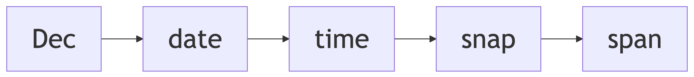
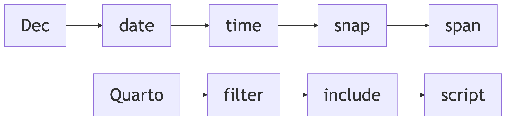

# Dec
Martin Laptev
2025+040

- [Dec](#dec)
- [Map](#map)
- [Hue](#hue)
- [Hex](#hex)
- [Pun](#pun)
- [UTC](#utc)

<div id="decnav">

<div>



</div>

</div>

# Dec

This section of my website focuses on Dec, a [measurement
system](https://en.wikipedia.org/wiki/System_of_units_of_measurement#:~:text=a%20collection%20of%20units%20of%20measurement%20and%20rules%20relating%20them%20to%20each%20other)
that [I](https://maptv.github.io) created. All Dec measurements are
based on
[turns](https://en.wikipedia.org/wiki/Turn_%28angle%29#:~:text=a%20unit%20of%20plane%20angle%20measurement%20equal%20to%202%CF%80%C2%A0radians%2C%20360%C2%A0degrees)
(t). When measuring
[angles](https://en.wikipedia.org/wiki/Angle#:~:text=the%20figure%20formed%20by%20two%20rays)📐,
t represents a full⭕️circle and equals 2*π*
([$\underline\tau$](https://en.wikipedia.org/wiki/Turn_%28angle%29#:~:text=the%20Greek%20letter,to%20one%20turn))
[radians](https://en.wikipedia.org/wiki/Radian#:~:text=the%20unit%20of%20angle%20in%20the%20International%20System%20of%20Units)
(rad) or 360
[degrees](https://en.wikipedia.org/wiki/Degree_(angle)#:~:text=a%20measurement%20of%20a%20plane%20angle%20in%20which%20one%20full%20rotation%20is%20360%20degrees)
(°). Dec measures distance📏in turns called
[taurs](https://en.wikipedia.org/wiki/Turn_(angle)#Tau_proposals:~:text=%E2%81%A0%20turn-,Circumference%20of%20a%20circle,-%F0%9D%90%B6)
(c) and tracks time⏳with two other types of turns: years (y) and days
(d).

The three turn types that Dec uses for distance📏and time⏳measurement
are all approximations of physical attributes of the Earth🌍: c ≈ the
[circumference](https://en.wikipedia.org/wiki/Earth%27s_circumference#:~:text=the%20distance%20around%20Earth)
of the Earth🌏, y ≈ the duration of
[orbit](https://en.wikipedia.org/wiki/Earth%27s_orbit#:~:text=From%20a%20vantage%20point%20above%20the%20north%20pole%20of%20either%20the%20Sun%20or%20Earth%2C%20Earth%20would%20appear%20to%20revolve%20in%20a%20counterclockwise%20direction%20around%20the%20Sun)
of the Earth🌎around the Sun☀️, and d ≈ the duration of
[rotation](https://en.wikipedia.org/wiki/Earth%27s_rotation#:~:text=the%20rotation%20of%20planet%20Earth%20around%20its%20own%20axis)
of the Earth🌍on its
[axis](https://en.wikipedia.org/wiki/Axial_tilt#:~:text=the%20imaginary%20line%20that%20passes%20through%20both%20the%20north%20pole%20and%20south%20pole).
Notably, $\text c\over\text d$ = [v =
ωr](https://en.wikipedia.org/wiki/Angular_velocity#:~:text=linear%20velocity%20is%20the%20radius%20times%20the%20angular%20velocity)
≈ the speed of the rotation of Earth🌏at the
[Equator](https://en.wikipedia.org/wiki/Equator#:~:text=the%20circle%20of%20latitude%20that%20divides%20Earth%20into%20the%20Northern%20and%20Southern%20hemispheres).

The table below⬇️provides the current
[longitude](https://en.wikipedia.org/wiki/Longitude#:~:text=a%20geographic%20coordinate%20that%20specifies%20the%20east%2Dwest%20position%20of%20a%20point%20on%20the%20surface%20of%20the%20Earth)
([*λ*](https://en.wikipedia.org/wiki/Longitude#:~:text=denoted%20by%20the%20Greek%20letter%20lambda))
in <span class="under tool" data-bs-toggle="tooltip"
data-bs-title="thousandths of a circle of latitude">milli[parallels](https://en.wikipedia.org/wiki/Circle_of_latitude#:~:text=an%20abstract%20east%E2%80%93west%20small%20circle%20connecting%20all%20locations%20around%20Earth%20(ignoring%20elevation)%20at%20a%20given%20latitude%20coordinate%20line)</span>
(m*λ*) and
[latitude](https://en.wikipedia.org/wiki/Latitude#:~:text=a%20geographic%20coordinate%20that%20specifies%20the%20north%2Dsouth%20position%20of%20a%20point%20on%20the%20surface%20of%20the%20Earth)
([*ϕ*](https://en.wikipedia.org/wiki/Latitude#:~:text=denoted%20by%20the%20Greek%20lower%2Dcase%20letter%20phi))
in <span class="under tool" data-bs-toggle="tooltip"
data-bs-title="thousandths of a polar circumferences">milli[meridians](https://en.wikipedia.org/wiki/Meridian_arc#Full_meridian_(polar_perimeter):~:text=The%20polar%20Earth%27s%20circumference%20is%20simply%20four%20times%20quarter%20meridian)</span>
(m*ϕ*) of Points <span class="point0">0</span> and
<span class="point1">1</span> on the map🗺️beneath the table. By default,
<span class="point0">Point 0</span> is at
<span class="point0">800</span> m*λ* and <span class="point0">0</span>
m*ϕ*, which is near the
[Galápagos🏝️archipelago](https://en.wikipedia.org/wiki/Gal%C3%A1pagos_Islands#:~:text=an%20archipelago%20of%20volcanic%20islands%20in%20the%20Eastern%20Pacific)
of Ecuador🇪🇨, and <span class="point1">Point 1</span> is at
<span class="point1">800</span> m*λ* and <span class="point1">100</span>
m*ϕ*, which is in the United States🇺🇸city of [Memphis,
Tennessee](https://en.wikipedia.org/wiki/Memphis,_Tennessee#:~:text=a%20city%20in%20the%20U.S.%20state%20of%20Tennessee).

In the table, the geographic coordinates of each point are followed by
the
[course](https://en.wikipedia.org/wiki/Course_(navigation)#:~:text=the%20cardinal%20direction%20in%20which%20the%20craft%20is%20to%20be%20steered)
([*α*](https://en.wikipedia.org/wiki/Azimuth#:~:text=%20azimuth%20is%20usually%20denoted%20alpha))
in <span class="under tool" data-bs-toggle="tooltip"
data-bs-title="thousandths of a compass rose">milli[windroses](https://en.wikipedia.org/wiki/Compass_rose#:~:text=a%20polar%20diagram%20displaying%20the%20orientation%20of%20the%20cardinal%20directions)</span>
(m*α*) we would need to maintain to travel🧳the shortest distance📏to
the other point on the map🗺️. The default courses in m*α* are
<span class="point0">0</span> (North) from <span class="point0">Point
0</span> to <span class="point1">Point 1</span> and
<span class="point1">500</span> (South) from <span class="point1">Point
1</span> to <span class="point0">Point 0</span>. By default, the points
are 100 <span class="under tool" data-bs-toggle="tooltip"
data-bs-title="thousandths of a taur">millitaurs</span> (mc) apart.

Click the map🗺️to move the points. To return the points to their
original positions📍, click the “Reset” button above the table. Next to
the “Reset” button, there are
[toggle](https://observablehq.com/framework/inputs/toggle)✅inputs that
add country borders, a grid of Dec
[graticules](https://en.wikipedia.org/wiki/Graticule_(cartography)#:~:text=a%20graphical%20depiction%20of%20a%20coordinate%20system%20as%20a%20grid%20of%20lines),
[solar
terminator](https://en.wikipedia.org/wiki/Terminator_(solar)#:~:text=a%20moving%20line%20that%20divides%20the%20daylit%20side%20and%20the%20dark%20night%20side%20of%20a%20planetary%20body)
shading, a yellow🟡dot denoting where the Sun☀️is directly overhead
(${Math.floor(long2turn(sun\[0\]))} m*λ*,
${Math.floor(lati2turn(sun\[1\]))} m*ϕ*), and
[UTC](https://en.wikipedia.org/wiki/Coordinated_Universal_Time#:~:text=the%20primary%20time%20standard%20globally%20used%20to%20regulate%20clocks%20and%20time)
time zones.

An airplane✈️flying at 500 <span class="under tool"
data-bs-toggle="tooltip"
data-bs-title="thousandths of the circumference of Earth">milliomegars</span>
(mv), half the equatorial speed of the rotation of Earth🌎on its axis,
could travel🧳the 100 mc between the default positions📍of Points
<span class="point0">0</span> and <span class="point1">1</span> in 200
<span class="under tool" data-bs-toggle="tooltip"
data-bs-title="thousandths of a day">millidays</span> (md). To get the
time in days (d) required to travel🧳between two points, we divide the
distance📏in mc by the speed in mv: ${distance_mtaur} mc ÷
${travelspeed} mv = ${(distance_mtaur / travelspeed).toFixed(3)} d.

# Map

``` {ojs}
//| echo: false
//| label: toggles
viewof bordertoggle = labelToggle(Inputs.toggle, "Border", false, "bordertoggle")
viewof gridtoggle = labelToggle(Inputs.toggle, "Grid", false, "gridtoggle")
viewof suntoggle = labelToggle(Inputs.toggle, "Sun", false, "suntoggle")
viewof utctoggle = labelToggle(Inputs.toggle, "UTC", false, "utctoggle")
rstbtn.node();
```

``` {ojs}
//| echo: false
//| label: speedinput
//| column: margin
viewof travelspeed = Inputs.range([0, 1000], {label: "Speed", value: 500, step: 1})
```

``` {ojs}
//| echo: false
//| label: sizeinput
//| column: margin
viewof mapsize = Inputs.range([0, 100], {label: "Size", value: 100, step: 1})
```

``` {ojs}
//| echo: false
//| label: projselect
//| column: margin
viewof select = Inputs.select(
  projections, {format: x => x.name, value: projections.find(t => t.name === "Equirectangular (plate carrée)")})
```

``` {ojs}
//| echo: false
//| label: maptable
table = createTable([
  { Point: 0, Milliparallel: 800, Millimeridian: 0, Milliwindrose: 0 },
  { Point: 1, Milliparallel: 800, Millimeridian: 100, Milliwindrose: 500 },
], { headerEditable: false, appendRows: false })
//   {Point: 0, Milliparallel: `${Math.floor(long2turn(Place_A[0], 3))}`, Millimeridian: `${Math.floor(lati2turn(Place_A[1], 3))}`, Milliwindrose: `${Math.floor(lati2turn(coor2bear(Place_A, Place_B)))}`},
//   {Point: 1, Milliparallel: `${Math.floor(long2turn(Place_B[0], 3))}`, Millimeridian: `${Math.floor(lati2turn(Place_B[1], 3))}`, Milliwindrose: `${Math.floor(lati2turn(coor2bear(Place_B, Place_A)))}`},
// ], {headerEditable: false, appendRows: false})
```

<div class="column-page">

``` {ojs}
//| echo: false
//| label: distmap
// https://observablehq.com/@d3/solar-terminator
// https://observablehq.com/@mbostock/time-zones
viewof coordinates = worldMapCoordinates([[turn2long(table.rows[1].cells[1].childNodes[0].innerText), turn2degr(table.rows[1].cells[2].childNodes[0].innerText % 250)], [turn2long(table.rows[2].cells[1].childNodes[0].innerText), turn2degr(table.rows[2].cells[2].childNodes[0].innerText % 250)], projection], [width, height * mapsize / 100])
//viewof coordinates = worldMapCoordinates([
//  [turn2long(table.rows[1].cells[1].childNodes[0].innerText), turn2degr(table.rows[1].cells[2].childNodes[0].innerText % 250)],
//  [turn2long(table.rows[2].cells[1].childNodes[0].innerText), turn2degr(table.rows[2].cells[2].childNodes[0].innerText % 250)],
//  projection], [width, height])
```

</div>

# Hue

``` {ojs}
//| echo: false
//| label: colorpreview
//| column: margin
//| class: colorcomponent
preview()
```

``` {ojs}
//| echo: false
//| label: coloropposites8
//| column: margin
//| class: coloropp
quickRender(326, 326, context => {
  const center = 163
  const ringRadius = 140
  const ringLineWidth = 4
  // Ring
  context.beginPath();
  context.lineWidth = ringLineWidth
  context.strokeStyle = "#ddd"
  context.arc(center, center, ringRadius, 0, 2 * Math.PI);
  context.stroke();
  context.font = "Bold 16px Arial"
  context.textAlign = 'center'
  let octPoints = []
  for (let i = 0; i < 8; i++) {
    const xPhase = Math.sin(i / 8 * 2 * Math.PI)
    const yPhase = Math.cos(i / 8 * 2 * Math.PI)
    const x = center + ringRadius * xPhase
    const y = center - ringRadius * yPhase
    octPoints.push([x, y])
  }
  // Lines
  octConnections.forEach(([a, b], i ) => {
    const [x1, y1] = octPoints[a]
    const [x2, y2] = octPoints[b]
    const lineAngle = Math.atan2(y2 - y1, x2 - x1)
    // Draw just short of the label circumference
    const x2a = x2 - 28 * Math.cos(lineAngle)
    const y2a = y2 - 28 * Math.sin(lineAngle)
    const x1a = x1 + 28 * Math.cos(lineAngle)
    const y1a = y1 + 28 * Math.sin(lineAngle)
    context.lineWidth = ringLineWidth
    context.strokeStyle = "#ddd"
    context.beginPath();
    context.moveTo(x2a, y2a);
    context.lineTo(x1a, y1a);
    context.stroke();
  })
  // Arrow Heads
  octConnections.forEach(([a, b], i ) => {
    const [x1, y1] = octPoints[a]
    const [x2, y2] = octPoints[b]
    const lineAngle = Math.atan2(y2 - y1, x2 - x1)
    const xl = x2 - 88 * Math.cos(lineAngle - (15 / 360) * 2 * Math.PI)
    const yl = y2 - 88 * Math.sin(lineAngle - (15 / 360) * 2 * Math.PI)
    const xr = x2 - 88 * Math.cos(lineAngle + (15 / 360) * 2 * Math.PI)
    const yr = y2 - 88 * Math.sin(lineAngle + (15 / 360) * 2 * Math.PI)
    const x2a = x2 - 22 * Math.cos(lineAngle)
    const y2a = y2 - 22 * Math.sin(lineAngle)
    const x = x2 - 69 * Math.cos(lineAngle)
    const y = y2 - 69 * Math.sin(lineAngle)
    context.fillStyle = hsl8[i]
    context.strokeStyle = window.darkmode ? "#aaa" : "#333";
    context.lineWidth = 1
    context.beginPath();
    context.moveTo(x2a, y2a);
    context.lineTo(xl, yl);
    context.lineTo(xr, yr);
    context.lineTo(x2a, y2a);
    context.fill();
    context.stroke();
    context.fillStyle = yiq(hsl8[i]) > 0.51 ? "#000" : "white"
    context.fillText(["N", "NE", "E", "SE", "S", "SW", "W", "NW"][i], x, y + 6)
  })
  // Labels
  octPoints.forEach(([x, y], i) => {
    context.lineWidth = 1
    context.fillStyle = hsl8[i]
    context.strokeStyle = window.darkmode ? "#aaa" : "#333";
    context.beginPath();
    context.arc(x, y, 22, 0, 2 * Math.PI);
    context.fill();
    context.stroke();
    context.fillStyle = yiq(hsl8[i]) > 0.51 ? "#000" : "white";
    context.fillText(["N", "NE", "E", "SE", "S", "SW", "W", "NW"][i], x, y + 6)
  })
})
```

``` {ojs}
//| echo: false
//| label: colorcomparer8
//| column: margin
//| class: colorcomparer
displayPalette(hsl8, {darkMode: true})
```

``` {ojs}
//| echo: false
//| label: coloropposites10
//| column: margin
//| class: coloropp
quickRender(326, 326, context => {
  const center = 163
  const ringRadius = 140
  const ringLineWidth = 4
  // Ring
  context.beginPath();
  context.lineWidth = ringLineWidth
  context.strokeStyle = "#ddd"
  context.arc(center, center, ringRadius, 0, 2 * Math.PI);
  context.stroke();
  context.font = "Bold 24px Arial"
  context.textAlign = 'center'
  let decPoints = []
  for (let i = 0; i < 10; i++) {
    const xPhase = Math.sin(i / 10 * 2 * Math.PI)
    const yPhase = Math.cos(i / 10 * 2 * Math.PI)
    const x = center + ringRadius * xPhase
    const y = center - ringRadius * yPhase
    decPoints.push([x, y])
  }
  // Lines
  decConnections.forEach(([a, b], i ) => {
    const [x1, y1] = decPoints[a]
    const [x2, y2] = decPoints[b]
    const lineAngle = Math.atan2(y2 - y1, x2 - x1)
    // Draw just short of the label circumference
    const x2a = x2 - 28 * Math.cos(lineAngle)
    const y2a = y2 - 28 * Math.sin(lineAngle)
    const x1a = x1 + 28 * Math.cos(lineAngle)
    const y1a = y1 + 28 * Math.sin(lineAngle)
    context.lineWidth = ringLineWidth
    context.strokeStyle = "#ddd"
    context.beginPath();
    context.moveTo(x2a, y2a);
    context.lineTo(x1a, y1a);
    context.stroke();
  })
  // Arrow Heads
  decConnections.forEach(([a, b], i ) => {
    const [x1, y1] = decPoints[a]
    const [x2, y2] = decPoints[b]
    const lineAngle = Math.atan2(y2 - y1, x2 - x1)
    const xl = x2 - 79 * Math.cos(lineAngle - (15 / 360) * 2 * Math.PI)
    const yl = y2 - 79 * Math.sin(lineAngle - (15 / 360) * 2 * Math.PI)
    const xr = x2 - 79 * Math.cos(lineAngle + (15 / 360) * 2 * Math.PI)
    const yr = y2 - 79 * Math.sin(lineAngle + (15 / 360) * 2 * Math.PI)
    const x2a = x2 - 22 * Math.cos(lineAngle)
    const y2a = y2 - 22 * Math.sin(lineAngle)
    const x = x2 - 60 * Math.cos(lineAngle)
    const y = y2 - 60 * Math.sin(lineAngle)
    context.fillStyle = hsl10[i]
    context.strokeStyle = window.darkmode ? "#aaa" : "#333";
    context.lineWidth = 1
    context.beginPath();
    context.moveTo(x2a, y2a);
    context.lineTo(xl, yl);
    context.lineTo(xr, yr);
    context.lineTo(x2a, y2a);
    context.fill();
    context.stroke();
    context.fillStyle = yiq(hsl10[i]) > 0.51 ? "#000" : "white"
    context.fillText(i, x, y + 8)
  })
  // Labels
  decPoints.forEach(([x, y], i) => {
    context.lineWidth = 1
    context.fillStyle = hsl10[i]
    context.strokeStyle = window.darkmode ? "#aaa" : "#333";
    context.beginPath();
    context.arc(x, y, 22, 0, 2 * Math.PI);
    context.fill();
    context.stroke();
    context.fillStyle = yiq(hsl10[i]) > 0.51 ? "#000" : "white";
    context.fillText(i, x, y + 8)
  })
})
```

``` {ojs}
//| echo: false
//| label: colorcomparer10
//| column: margin
//| class: colorcomparer
displayPalette(hsl10.slice(0, 10), {darkMode: true})
```

``` {ojs}
//| echo: false
//| label: colorwheelcompass
//| class: colorcomponent
// https://observablehq.com/@pjedwards/compass-rose-as-legend-with-colors
svg`<svg width="${size}" height="${size}" viewBox="${-size/2} ${-size/2} ${size} ${size}">
  <g transform='rotate(${Math.round(-colorD * .36)})'>
  ${repeat(tick(radius, 5, '#434343'), 5 * 4 * 10)}
  ${repeat(tick(radius, 8), 10 * 4)}
  ${repeat(`<path d="M 0,-${radius+12} l 3,10 l -6,0 z" fill="black" stroke="black" stroke-width="1"/>`, 4, 0)}
  ${repeat(`<path d="M 0,-${radius+12} l 3,10 l -6,0 z" fill="white" stroke="black" stroke-width="1"/>`, 4, 45)}
  <circle r="${radius}" fill="#d3d3d3" stroke="#434343" stroke-width="3" />
  ${repeat(directionMarker(radius+14, 24), 4, 0)}
  ${repeat(directionMarker(radius+12, 24), 4, 45)}
  ${repeat(turnMarker(radius+14, 32), 4, 0)}
  ${repeat(turnMarker(radius+12, 32), 4, 45)}
  ${repeat(pie(radius-margin/2, 2 * Math.PI * (radius-margin/2) / deccolors.length / 2, 1, deccolors), deccolors.length, 360/deccolors.length)}
</svg>
`
```

``` {ojs}
//| echo: false
//| label: colorbar
//| class: colorcomponent
// https://observablehq.com/@paavanb/progressive-color-picker
decBar = colorbar({
  colorFn: t => hslToRgb(dec2hue(t) / 1000, colorS / 1000, colorL / 1000),
  onSelect: t => {
    set(viewof colorD, t * 1000)
    onUpdateHSL(dec2hue(t), colorS / 1000, colorL / 1000)
  }
})
```

``` {ojs}
//| echo: false
//| label: colorslider
//| class: colorcomponent
// https://observablehq.com/@paavanb/progressive-color-picker
{ const input = Inputs.range([0, 1000], { label: "hue", value: 0, step: 1 })
  input.value = initialHSL[0]
  input.oninput = (evt) => onUpdateHSL(dec2hue(evt.currentTarget.value / 1000), colorS / 1000, colorL / 1000)
  return Inputs.bind(input, viewof colorD)
}
```

``` {ojs}
//| echo: false
//| label: saturslider
//| class: colorcomponent
// https://observablehq.com/@paavanb/progressive-color-picker
{ const input = Inputs.range([0, 1000], { label: "saturation", value: 1000, step: 1, })
  input.oninput = (evt) => onUpdateHSL(colorD, evt.currentTarget.value / 1000, colorL / 1000)
  return Inputs.bind(input, viewof colorS)
}
```

``` {ojs}
//| echo: false
//| label: lightslider
//| class: colorcomponent
// https://observablehq.com/@paavanb/progressive-color-picker
{ const input = Inputs.range([0, 1000], { label: "lightness", value: 500, step: 1, })
  input.oninput = (evt) => onUpdateHSL(colorD, colorS / 1000, evt.currentTarget.value / 1000)
  return Inputs.bind(input, viewof colorL)
}
```

# Hex

<table>
<colgroup>
<col style="width: 17%" />
<col style="width: 18%" />
<col style="width: 21%" />
<col style="width: 21%" />
<col style="width: 20%" />
</colgroup>
<thead>
<tr>
<th>🧭</th>
<th><strong>m<span class="math inline"><em>α</em></span></strong></th>
<th><strong>c°</strong></th>
<th><strong>h°</strong></th>
<th><strong>hex</strong></th>
</tr>
</thead>
<tbody>
<tr>
<td>${rainbowDir}</td>
<td>${rainbowMtr}</td>
<td>${rainbowDegC}</td>
<td>${rainbowDegH}</td>
<td>${rainbowHex}</td>
</tr>
<tr>
<td>${rainbowNE}</td>
<td>${rainbowNEmtr}</td>
<td>${rainbowNEdegC}</td>
<td>${rainbowNEdegH}</td>
<td>${rainbowNEhex}</td>
</tr>
<tr>
<td>${rainbowE}</td>
<td>${rainbowEmtr}</td>
<td>${rainbowEdegC}</td>
<td>${rainbowEdegH}</td>
<td>${rainbowEhex}</td>
</tr>
<tr>
<td>${rainbowSE}</td>
<td>${rainbowSEmtr}</td>
<td>${rainbowSEdegC}</td>
<td>${rainbowSEdegH}</td>
<td>${rainbowSEhex}</td>
</tr>
<tr>
<td>${rainbowS}</td>
<td>${rainbowSmtr}</td>
<td>${rainbowSdegC}</td>
<td>${rainbowSdegH}</td>
<td>${rainbowShex}</td>
</tr>
<tr>
<td>${rainbowSW}</td>
<td>${rainbowSWmtr}</td>
<td>${rainbowSWdegC}</td>
<td>${rainbowSWdegH}</td>
<td>${rainbowSWhex}</td>
</tr>
<tr>
<td>${rainbowW}</td>
<td>${rainbowWmtr}</td>
<td>${rainbowWdegC}</td>
<td>${rainbowWdegH}</td>
<td>${rainbowWhex}</td>
</tr>
<tr>
<td>${rainbowNW}</td>
<td>${rainbowNWmtr}</td>
<td>${rainbowNWdegC}</td>
<td>${rainbowNWdegH}</td>
<td>${rainbowNWhex}</td>
</tr>
<tr>
<td>${rainbowN}</td>
<td>${rainbowNmtr}</td>
<td>${rainbowNdegC}</td>
<td>${rainbowNdegH}</td>
<td>${rainbowNhex}</td>
</tr>
</tbody>
</table>

The
[color🎨wheel](https://en.wikipedia.org/wiki/Color_wheel#:~:text=an%20abstract%20illustrative%20organization%20of%20color%20hues%20around%20a%20circle)
[compass](https://en.wikipedia.org/wiki/Compass#:~:text=a%20device%20that%20shows%20the%20cardinal%20directions%20used%20for%20navigation%20and%20geographic%20orientation)🧭above⬆️indicates
both a
[hue](https://en.wikipedia.org/wiki/Hue#:~:text=an%20angular%20position%20around%20a%20central%20or%20neutral%20point%20or%20axis%20on%20a%20color%20space%20coordinate%20diagram)
and a [direction](https://en.wikipedia.org/wiki/Cardinal_direction). To
rotate🔄the color🎨wheel compass🧭, use the
[Observable](https://observablehq.com) hue
[bar](https://observablehq.com/@paavanb/progressive-color-picker)📊and
range🎚️inputs beneath it or change the course from
<span class="point0">Point 0</span> to <span class="point1">Point
1</span> on the map🗺️. The table above⬆️shows the currently indicated
direction (top row) and the
[cardinal](https://en.wikipedia.org/wiki/Cardinal_direction#:~:text=north%2C%20south%2C%20east%2C%20and%20west)
and
[intercardinal](https://en.wikipedia.org/wiki/Cardinal_direction#:~:text=northeast%20(NE)%2C%20southeast%20(SE)%2C%20southwest%20(SW)%2C%20and%20northwest%20(NW))
directions.

# Pun

<div>

> **Bad Pun Alert**
>
> Feeling ***disoriented***😵‍💫? Of
> [***course***](https://en.wikipedia.org/wiki/Course_(navigation)#:~:text=the%20cardinal%20direction%20in%20which%20the%20craft%20is%20to%20be%20steered)
> you are! Color🎨labels can help you find your
> [***bearings***](https://en.wikipedia.org/wiki/Bearing_(navigation)#:~:text=the%20horizontal%20angle%20between%20the%20direction%20of%20an%20object%20and%20north%20or%20another%20object),
> stay on
> [***track***](https://en.wikipedia.org/wiki/Course_(navigation)#:~:text=The%20path%20that%20a%20vessel%20follows),
> and avoid
> [***heading***](https://en.wikipedia.org/wiki/Course_(navigation)#:~:text=the%20direction%20where%20the%20watercraft's%20bow%20or%20the%20aircraft's%20nose%20is%20pointed)
> aches🤕. <span class="orange">Orange</span> you glad I couldn’t think
> of a color🎨pun?

</div>

The range🎚️inputs beneath the color🎨wheel compass🧭represent a hue,
saturation, and lightness (HSL) triplet that specifies a color with
three <span class="under tool" data-bs-toggle="tooltip"
data-bs-title="a thousandth of a turn">milliturn</span> (mt) values. We
can convert the hue mt value into compass🧭degrees (c°) and [HSL and
HSV](https://en.wikipedia.org/wiki/HSL_and_HSV#:~:text=the%20two%20most%20common%20cylindrical%2Dcoordinate%20representations%20of%20points%20in%20an%20RGB%20color%20model)
hue degrees (h°). We can also translate an HSL triplet into an HSV,
[RGB](https://en.wikipedia.org/wiki/RGB_color_model#:~:text=an%20additive%20color%20model),
or
[hexadecimal](https://en.wikipedia.org/wiki/Web_colors#Hex_triplet:~:text=hexadecimal%20number%20used%20in%20HTML%2C%20CSS%2C%20SVG%2C%20and%20other%20computing%20applications%20to%20represent%20colors)
(hex) triplet.

Color🎨can provide a general sense of
angular📐[measure](https://en.wikipedia.org/wiki/Angle#:~:text=The%20magnitude%20of%20an%20angle),
regardless of the [metric
prefixes](https://en.wikipedia.org/wiki/Metric_prefix#:~:text=a%20unit%20prefix%20that%20precedes%20a%20basic%20unit%20of%20measure%20to%20indicate%20a%20multiple%20or%20submultiple%20of%20the%20unit)
or [units](https://en.wikipedia.org/wiki/Angle#Units) we use. Therefore,
we can reuse♻️colors🎨across many different contexts. In any context,
starting points are red: North (<span class="color0">0</span> m*α*),
[Longitude
0](https://en.wikipedia.org/wiki/18th_meridian_west#:~:text=a%20line%20of%20longitude%20that%20extends%20from%20the%20North%20Pole%20across%20the%20Arctic%20Ocean%2C%20Greenland%2C%20Iceland%2C%20the%20Atlantic%20Ocean%2C%20the%20Canary%20Islands%2C%20the%20Southern%20Ocean%2C%20and%20Antarctica%20to%20the%20South%20Pole)
(<span class="color0">0</span> m*λ*), and midnight
(<span class="color0">0</span> md); midpoints are cyan: South
(<span class="color5">500</span> m*α*), [Longitude
5](https://en.wikipedia.org/wiki/162nd_meridian_east#:~:text=a%20line%20of%20longitude%20that%20extends%20from%20the%20North%20Pole%20across%20the%20Arctic%20Ocean%2C%20Asia%2C%20the%20Pacific%20Ocean%2C%20the%20Southern%20Ocean%2C%20and%20Antarctica%20to%20the%20South%20Pole)
(<span class="color5">500</span> ml), and noon
(<span class="color5">500</span> md).

Apart from m*α*, m*λ*, and md, we can apply color🎨labels🏷️based on
<span class="under tool" data-bs-toggle="tooltip"
data-bs-title="thousandths of a year">milliyears</span> (my) and
<span class="under tool" data-bs-toggle="tooltip"
data-bs-title="thousandths of a millennium">millimillennia</span> (mk).
Every year (y) starts on <span class="tool" data-bs-toggle="tooltip"
data-bs-title="March 1"><u>Day 0</u></span>
(<span class="color0">0</span> my). The midyear point
(<span class="color5">500</span> my) is noon of <span class="under tool"
data-bs-toggle="tooltip" data-bs-title="August 30">Day 182</span> in
common years and midnight of <span class="under tool"
data-bs-toggle="tooltip" data-bs-title="August 31">Day 183</span> in
leap years. Every millennium (k) starts with Year 0
(<span class="color0">0</span> mk) and has Year 500
(<span class="color5">500</span> mk) as its midpoint.

The Equator, also known as Latitude 0, is the midpoint between the South
(<span class="color75">-250</span> m*ϕ*) and North
(<span class="color25">250</span> m*ϕ*) Pole. When the “Grid”
toggle✅input is enabled, Latitudes
[-2](https://en.wikipedia.org/wiki/72nd_parallel_south#:~:text=a%20circle%20of%20latitude%20that%20is%2072%20degrees%20south%20of%20the%20Earth's%20equatorial%20plane%20in%20the%20Antarctic)
(<span class="color8">-200</span> m*ϕ*),
[-1](https://en.wikipedia.org/wiki/36th_parallel_south#:~:text=a%20circle%20of%20latitude%20that%20is%2036%20degrees%20south%20of%20the%20Earth's%20equatorial%20plane)
(<span class="color9">-100</span> m*ϕ*), 0
(<span class="color0">0</span> m*ϕ*),
[1](https://en.wikipedia.org/wiki/36th_parallel_north#:~:text=a%20circle%20of%20latitude%20that%20is%2036%20degrees%20north%20of%20the%20Earth's%20equatorial%20plane)
(<span class="color1">100</span> m*ϕ*), and
[2](https://en.wikipedia.org/wiki/72nd_parallel_north#:~:text=a%20circle%20of%20latitude%20that%20is%2072%20degrees%20north%20of%20the%20Earth's%20equatorial%20plane%2C%20in%20the%20Arctic)
(<span class="color2">200</span> m*ϕ*) are shown on the
map🗺️above⬆️along with the ten major longitudes that divide the
Earth🌍into the ten Dec time zones.

Each Dec time zone is one <span class="under tool"
data-bs-toggle="tooltip"
data-bs-title="a tenth of a circle of latitude">deciparallel</span>
(d*λ*) wide and half of a meridian (*ϕ*) long. While one *ϕ* is always
about one c long, the length of a parallel (*λ*) [varies by
latitude](https://en.wikipedia.org/wiki/Longitude#Length_of_a_degree_of_longitude:~:text=depends%20only%20on%20the%20radius%20of%20a%20circle%20of%20latitude).
At the Equator, one *λ* is roughly one c long. At the
[North](https://en.wikipedia.org/wiki/North_Pole#:~:text=the%20point%20in%20the%20Northern%20Hemisphere%20where%20the%20Earth%27s%20axis%20of%20rotation%20meets%20its%20surface)
or
[South](https://en.wikipedia.org/wiki/South_Pole#:~:text=the%20point%20in%20the%20Southern%20Hemisphere%20where%20the%20Earth%27s%20axis%20of%20rotation%20meets%20its%20surface)
Pole, the length of *λ* is zero. In general, the approximate length of a
parallel is the
[cosine](https://en.wikipedia.org/wiki/Sine_and_cosine#:~:text=the%20ratio%20of%20the%20length%20of%20the%20adjacent%20leg%20to%20that%20of%20the%20hypotenuse)
of its *ϕ* latitude: cos(${parLat}) = ${parLen}.

``` {ojs}
//| echo: false
//| label: latinput
viewof latitude = Inputs.range([-.25, .25], {label: "Latitude", value: 0, step: .001})
```

Like the ten major longitudes that separate them, Dec time zones are
numbered <span class="color0">0</span> to <span class="color9">9</span>.
The number assigned to each time zone is its offset in
<span class="under tool" data-bs-toggle="tooltip"
data-bs-title="tenths of a day">decidays</span> (dd) from Zone
<span class="color0">0</span>. To obtain the dd offset o at a location,
we
[floor](https://en.wikipedia.org/wiki/Floor_and_ceiling_functions#:~:text=the%20greatest%20integer%20less%20than%20or%20equal%20to%20x)
its d*λ* longitude: o = ⌊d*λ*⌋. For example, the current d*λ* longitude
of [Point 0](.point0) on the map🗺️above⬆️, ${point0lHsl}, corresponds to
Zone ${point0zHsl}.

# UTC

[UTC time zone
offsets](https://en.wikipedia.org/wiki/UTC_offset#:~:text=the%20difference%20in%20hours%20and%20minutes%20between%20Coordinated%20Universal%20Time%20(UTC)%20and%20the%20standard%20time%20at%20a%20particular%20place)
range from ${rainbowN5zn} to ${rainbowP583} dd. Negative UTC offsets are
common to the East of New Zealand🇳🇿and to the West of the United
Kingdom🇬🇧. By design, each Dec time zone has a positive offset that can
be converted to a negative offset by subtracting ten dd. Negative
offsets can sometimes facilitate conversion of times across time zones.

To obtain the time in Zone <span class="color0">0</span>, we can
subtract either one of the offsets of any time zone from its time. The
Zone <span class="color8">8</span> to <span class="color0">0</span>
conversion calculations are ${decTimeZn8} –
<span class="color8">8</span> = , ${decTimeZn8} +
<span class="color8">8</span> = . Inversely, we can get the time in any
time zone by adding either one of its offset to the Zone
<span class="color0">0</span> time. The Zone
<span class="color0">0</span> to <span class="color8">8</span>
conversion calculations are ${decTimeZn8} –
<span class="color8">8</span> = , ${decTimeZn8} +
<span class="color8">8</span> = .

Of the two possible results, we can pick the one that is within the
typical bounds for a Dec time: 0 \<= time \< 10.

The time zone By default, Points <span class="point0">0</span> and
<span class="point1">1</span> on the map🗺️above⬆️lie on [Longitude
8](https://en.wikipedia.org/wiki/90th_meridian_west#:~:text=a%20line%20of%20longitude%20that%20extends%20from%20the%20North%20Pole%20across%20the%20Arctic%20Ocean%2C%20North%20America%2C%20the%20Gulf%20of%20Mexico%2C%20Central%20America%2C%20the%20Pacific%20Ocean%2C%20the%20Southern%20Ocean%2C%20and%20Antarctica%20to%20the%20South%20Pole)
(${rainbowMer8} m*λ*), the start of Zone <span class="color8">8</span>.
To obtain the time in Zone <span class="color0">0</span>, we can
subtract either the positive or negative offset of Zone
<span class="color8">8</span> from its time:

and make

At least one of the two kinds of offsets will result in Inversely, we
can get the time in any time zone by adding either one of its offset to
the Zone <span class="color0">0</span> time.

The time zone conversion calculations for Zone
<span class="color8">8</span> are

We can choose the offset based on whether we want the resulting time to
be positive or negative. In Zone <span class="color0">0</span>, the
positive time is currently ${decTimeZ0n} and the current negative time
is ${decTimeZ0p}

In Dec, negative times are perfectly valid, but only positive times are
shown by default. Negative times tell us how much of the day is left,
instead of how much of the day has passed. Positive and negative times
are two sides of the same coin🪙. At noon, half of the day has passed
and half is left, just like a glass🥃can be both half full and half
empty.

To convert between positive and negative times, we can add and subtract
ten dd as needed.

In contrast, dates are impacted by our choice of a positive or negative
offset. Positive offset dates are one day ahead of their negative
counterparts.

The date in Zone ${rainbow8zn4} is ${decDateHsl} if we use its positive
offset and ${decYestHsl} otherwise. By providing a positive and negative
offset for each time zone, Dec can match the date in any UTC time zone.

Dates calculated using negative offsets will be This may be useful avoid
date mismatches between Dec time zones that overlap with negative thus
can be roughly one day ahead of their geographically closest UTC
analogs. Zone ${rainbow6zon}, the default time of Points ${rainbow9zon}
are .

unless we subtract ten dd to make their offsets negative. The width of a
UTC time zone is often
41.<span style="text-decoration-line:overline;">6</span> m*λ*, but
ranges from 0 m*λ* to the width of China🇨🇳:
[424](https://en.wikipedia.org/wiki/List_of_extreme_points_of_China#:~:text=109%C2%B056%E2%80%B2E-,West,-%3A%20Akto%20County)
m*λ* –
[254](https://en.wikipedia.org/wiki/List_of_extreme_points_of_China#:~:text=%20%5Bcitation%20needed%5D-,East,-%3A%20Fuyuan%20County%2C%20Heilongjiang%2C%20on)
m*λ* = 170 m*λ*.

To accomodate negative UTC offsets, we can make any Dec offset negative
by subtracting ten.

The Dec time zone that corresponds to your UTC offset is Zone
${decZone1st}.

If you UTC offset is negative, To match the date in negative UTC zones,
we can substract

Each offset has a negative form that yields the same time but on a date
that is one day earlier. To obtain the time in Zone ${rainbow0zn1}
(*t*<sub>0</sub>), we can subtract the offset (*o*<sub>*x*</sub>) of any
time zone *x* from its deciday time (*t*<sub>*x*</sub>): *t*<sub>0</sub>
= *t*<sub>*x*</sub> – *o*<sub>*x*</sub>. Inversely, we can get the time
in any time zone by adding its offset to the Zone ${rainbow0zn2} time.
If *t*<sub>*x*</sub> is less than *o*<sub>*x*</sub>, then
*t*<sub>0</sub> will be negative: *t*<sub>*x*</sub> \<
*o*<sub>*x*</sub> → *t*<sub>0</sub> \< 0.

We can add ten to any negative deciday time become positive.

Instead of adding ten to a negative difference, we can subtract a the
negative version of the offset In Dec, both times and offsets can be
negative. Positive times tell us how much of the day has passed and
negative times let us know how much of the day is left. Converting
between positive and negative times or offsets is as easy as subtracting
or adding ten. Negative offsets can facilitate mental calculations We
can subtract ten from a time zone number to get a negative time zone
offset.

Both positive and negative offsets yield the correct time, but negative
offsets result in a date that is one day behind the correct date
produced by positive offsets.

Not shown on the map are the four [major
parallels](https://en.wikipedia.org/wiki/Circle_of_latitude#:~:text=mark%20the%20divisions%20between%20the%20five%20principal%20geographical%20zones)
that depend on the [axial
tilt](https://en.wikipedia.org/wiki/Axial_tilt#Earth:~:text=the%20angle%20between%20the%20ecliptic%20and%20the%20celestial%20equator%20on%20the%20celestial%20sphere)
of the Earth🌏(${rainbowTilt} mt): the Tropics of
[Cancer](https://en.wikipedia.org/wiki/Tropic_of_Cancer#:~:text=northernmost%20circle%20of%20latitude%20where%20the%20Sun%20can%20be%20seen%20directly%20overhead)♋(${rainbowCanc}
m*ϕ*) and
[Capricorn](https://en.wikipedia.org/wiki/Tropic_of_Capricorn#:~:text=the%20southernmost%20latitude%20where%20the%20Sun%20can%20be%20seen%20directly%20overhead)♑️(${rainbowCapr}
m*ϕ*), and the
[Arctic](https://en.wikipedia.org/wiki/Arctic_Circle#:~:text=the%20southernmost%20latitude%20at%20which%2C%20on%20the%20winter%20solstice%20in%20the%20Northern%20Hemisphere%2C%20the%20Sun%20does%20not%20rise%20all%20day%2C%20and%20on%20the%20Northern%20Hemisphere%27s%20summer%20solstice%2C%20the%20Sun%20does%20not%20set)
(${rainbowArc0} m*ϕ* – ${rainbowArc1} m*ϕ* = ${rainbowArc2} m*ϕ*) and
[Antarctic](https://en.wikipedia.org/wiki/Antarctic_Circle#:~:text=the%20Sun%20is%20above%20the%20horizon%20for%2024%20continuous%20hours%20at%20least%20once%20per%20year%20(and%20therefore%20visible%20at%20solar%20midnight)%20and%20the%20centre%20of%20the%20Sun%20(ignoring%20refraction)%20is%20below%20the%20horizon%20for%2024%20continuous%20hours%20at%20least%20once%20per%20year%20(and%20therefore%20not%20visible%20at%20solar%20noon))
(${rainbowAnt0} m*ϕ* – ${rainbowAnt1} m*ϕ* = ${rainbowAnt2} m*ϕ*)
Circles.

In Zone ${decZone2nd}, the current date is ${decYearHsl}+${decDateHsl}
and the current time in decidays is ${decTimeHsl}–${decZone3rd}. The
time that has elapsed since this webpage was loaded is ${elaTimeHsl}.
Even distances can be labeled🏷️with color🎨.

At an average speed of ${travelspeed} $\text m\omega \text r$, we could
cover the ${distance_mtaur} $\text m\tau r$ between Points
<span class="point0">0</span> and <span class="point1">1</span> in
${traveltime} <span class="under tool" data-bs-toggle="tooltip"
data-bs-title="thousandths of a day">milliday</span> (md).

We can think of <span class="under tool" data-bs-toggle="tooltip"
data-bs-title="hundredths of the circumference of Earth">centitaurs</span>
per day ($\text c\omega \text r$) as a percent (%) and $\text m\omega$
as a
[permille](https://en.wikipedia.org/wiki/Per_mille#:~:text=indicates%20parts%20per%20thousand)
(‰) of . Notably, 1$\text m\omega$ =
1.<span style="text-decoration-line:overline;">6</span> kilometers per
hour ($\text{km}\over\text h$) ≈ 1 mile per hour
($\text {mi}\over\text h$). Other than ease of conversion, another
advantage of a global scale, $\text m\tau r\over\text d$,
$\text m\lambda$, $\text m\phi$ are the right size to measure distance
and position.

b the closest Dec analog of $\text{km}\over\text h$ and
$\text {mi}\over\text h$, the main Dec speed measurement units are
equivalent to $\text c\tau r\over\text d$.

The advantage of $\text c\tau r\over\text d$ is that is equivalent to is
<span class="under tool" data-bs-toggle="tooltip"
data-bs-title="ten millionths of the circumference of Earth">decimicrotaurs</span>
per <span class="under tool" data-bs-toggle="tooltip"
data-bs-title="a hundred thousandth of a day">centimilliday</span>
($\text d\micro\tau r\over\text {cmd}$).

that 1$\text c\tau r\over\text d$ = zems per beat
($\text z\over\text b$). Zem stands for **z**one **e**quatorial
**m**icrowidth or **zem** (z) and a beat is roughly the duration of a
heart or musical beat.

Converting between Dec speed units is straightforward:
10$\text m\tau r\over\text d$ = 1 $\text c\tau\over\text d$ = 1

Zem stands for zone equatorial microwidth and is equal to 4m.

The length of 1 *τ**r* is exactly equal to 10000 kilozems (kz) or 40000
kilometers (km), which is is 1.96575kz less than the length of a
[meridian](https://en.wikipedia.org/wiki/Meridian_(geography)#:~:text=the%20locus%20connecting%20points%20of%20equal%20longitude)
(*ϕ*) and 18.75425kz less than the length of the
[Equator](https://en.wikipedia.org/wiki/Equator#:~:text=the%20circle%20of%20latitude%20that%20divides%20Earth%20into%20the%20Northern%20and%20Southern%20hemispheres)
(*ϕ*<sub>0</sub>). of these points are in milliturns to indicate that an
angle rather than a distance kilometers (km) or meters (m) and days to
hours (h) or seconds (s).

The scale of $\tau\text r$ and d is well suited for [air
travel](https://en.wikipedia.org/wiki/Air_travel#:~:text=a%20form%20of%20travel%20in%20vehicles%20such%20as%20airplanes%2C%20jet%20aircraft%2C%20helicopters%2C%20hot%20air%20balloons%2C%20blimps%2C%20gliders%2C%20hang%20gliders%2C%20parachutes%2C%20or%20anything%20else%20that%20can%20sustain%20flight).
If we had our very own
[seaplane](https://en.wikipedia.org/wiki/Seaplane#:~:text=a%20powered%20fixed%2Dwing%20aircraft%20capable%20of%20taking%20off%20and%20landing%20(alighting)%20on%20water),
we could fly 1 <span class="under tool" data-bs-toggle="tooltip"
data-bs-title="a tenth of a meridian">decimeridian</span> directly South
from the [Mississippi
River](https://en.wikipedia.org/wiki/Mississippi_River#:~:text=the%20primary%20river%20of%20the%20largest%20drainage%20basin%20in%20the%20United%20States)
near [Memphis,
Tennessee](https://en.wikipedia.org/wiki/Memphis,_Tennessee#:~:text=a%20city%20in%20the%20U.S.%20state%20of%20Tennessee)
to the land next to [Santa Fe
Island](https://en.wikipedia.org/wiki/Santa_Fe_Island#:~:text=a%20small%20island%20of%2024%20square%20kilometres%20(9.3%C2%A0sq%C2%A0mi)%20which%20lies%20in%20the%20middle%20of%20the%20Gal%C3%A1pagos%20Archipelago%20in%20Ecuador)🏝️in
the [Galápagos
archipelago](https://en.wikipedia.org/wiki/Gal%C3%A1pagos_Islands#:~:text=an%20archipelago%20of%20volcanic%20islands%20in%20the%20Eastern%20Pacific).

We can think of <span class="under tool" data-bs-toggle="tooltip"
data-bs-title="hundredths of a meridian">centitaur</span> per day
($\text c\tau r\over\text d$) as a percent (%) and
<span class="under tool" data-bs-toggle="tooltip"
data-bs-title="thousandths of a meridian">millitaur</span> per day
($\text m\tau r\over\text d$) as a
[permille](https://en.wikipedia.org/wiki/Per_mille#:~:text=indicates%20parts%20per%20thousand)
(‰) of the equatorial speed at which Earth🌏rotates on its axis.
Conversion of $\text m\tau r$ to kilometers (km) or meters (m) and days
to hours (h) or seconds (s) is straightforward: 1$\text m\tau r$ = 40km
= 40000m, 1d = 24h = 86400s, and 1$\text m\tau r\over\text d$ =
1.<span style="text-decoration-line:overline;">6</span>$\text{km}\over\text h$
= 2.16$\text m\over\text s$.

It is very easy to switch between multiples and submultiples of units,
Dec distance📏and time⏳units are all based on powers of ten, so

Warning bad pun alert Turn the beat around, Love to hear the
percussion…🪩🕺💃🎶🎵

When dealing with shorter distances and durations, it is convenient to
use submultiples of meridians and days. permission to land The Dec
analogs of meters and seconds of a meter (m) is called

Notably, $\text m\tau\text r\over\text d$ ≈ $\text{mi}\over\text h$.

$\text m\lambda\over\text d$ closer to the distances and durations we
may encounter A meridian per day (*ω* = $\lambda\over\text d$) The speed
of the rotation of Earth🌎at the
[Equator](https://en.wikipedia.org/wiki/Equator#:~:text=the%20circle%20of%20latitude%20that%20divides%20Earth%20into%20the%20Northern%20and%20Southern%20hemispheres)
is roughly . is approximation
[465.10](https://en.wikipedia.org/wiki/Earth%27s_rotation#:~:text=an%20equatorial%20speed%20of%20465.10%20metres%20per%20second)
meters per second ($\text m\over\text s$) or 1.0046*ω*.

Similarly, we can think of <span class="under tool"
data-bs-toggle="tooltip"
data-bs-title="hundredths of meridians">centimeridians</span> per day
($\text c\lambda\over\text d$) as percents : 1$\lambda\over\text d$ =
100$\text c\lambda\over\text d$. Conversion between Dec and SI speed
units is easy: 1$\text c\lambda\over\text d$ =
0.216$\text m\over\text s$.

and a meridian y = 365 or 366 days depending on the Dec leap year rule,
and Dec speed measurements are based on *λ* / d (*ω*) , which stands for
the circumference of the Earth and amounts to

and is equal to 365 or 366 days, depending on the leap year rule. A day
(d) represents the Earth on its axis and is equal to. Millennia (10e3y),
centuries (10e2y), and decades (10e1y) are multiples of years. Decidays
(10e-1d), centidays (10e-2d), and millidays (10e-3d) are submultiples of
days.

Like different kinds of turns can be combined to form new units.

For measurements of length or distance, a turn represents a
[meridian](https://en.wikipedia.org/wiki/Meridian_(geography)#:~:text=the%20locus%20connecting%20points%20of%20equal%20longitude)
(*λ*), a trip around the world through the North and South Poles, and is
equal to 40000 kilometers (km).

In Dec, time measurement is based on
[days](https://en.wikipedia.org/wiki/Day#:~:text=the%20time%20period%20of%20a%20full%20rotation%20of%20the%20Earth%20with%20respect%20to%20the%20Sun)
(d) and

are two special kinds of turns that are the basis of time and distance
measurements. have their own names and are defined in terms of

A day is a turn of the Earth on its axis that has a duration of 86400
seconds and a meridian is a turn around the Earth that passes through
the North and South Poles. A beat is 0.864 seconds (s) and a zem is 4
meters (m). Any kind of
[angle](https://en.wikipedia.org/wiki/Angle#:~:text=the%20figure%20formed%20by%20two%20rays)📐,
such as a
[bearing](https://en.wikipedia.org/wiki/Bearing_(navigation)#:~:text=the%20horizontal%20angle%20between%20the%20direction%20of%20an%20object%20and%20north%20or%20another%20object)
on a
[compass](https://en.wikipedia.org/wiki/Compass#:~:text=a%20device%20that%20shows%20the%20cardinal%20directions%20used%20for%20navigation%20and%20geographic%20orientation)🧭or
a
[${rainbowHue0}](https://en.wikipedia.org/wiki/Hue#:~:text=an%20angular%20position%20around%20a%20central%20or%20neutral%20point%20or%20axis%20on%20a%20color%20space%20coordinate%20diagram%20(such%20as%20a%20chromaticity%20diagram)%20or%20color%20wheel)
on a
[color🎨wheel](https://en.wikipedia.org/wiki/Color_wheel#:~:text=an%20abstract%20illustrative%20organization%20of%20color%20hues%20around%20a%20circle),
can be measured in turns or
[submultiples](https://en.wikipedia.org/wiki/Multiple_(mathematics)#:~:text=the%20quotient%20of%20the%20main%20unit%20by%20an%20integer)
of turns like <span class="under tool" data-bs-toggle="tooltip"
data-bs-title="thousandths of a turn">milliturns</span>
([*m**τ*](https://en.wikipedia.org/wiki/Turn_%28angle%29#:~:text=e.g.%2C%20centiturns%20(ctr)%2C-,milliturns,-(mtr)%2C%20etc)).

The color🎨wheel below⬇️rotates🔄in response to the
[Observable](https://observablehq.com)
[range](https://observablehq.com/@observablehq/input-range)🎚️and [hue
bar](https://observablehq.com/@paavanb/progressive-color-picker)📊inputs
beneath it to orient the selected ${rainbowHue1} upward. The [HSL and
HSV](https://en.wikipedia.org/wiki/HSL_and_HSV#:~:text=the%20two%20most%20common%20cylindrical%2Dcoordinate%20representations%20of%20points%20in%20an%20RGB%20color%20model)
models use degrees instead of milliturns so the milliturn shown by the
range🎚️input, ${rainbowMtr}, is rounded to the nearest degree,
${rainbowDeg}, and then used as part of an HSL triplet to obtain the
[hex
triplet](https://en.wikipedia.org/wiki/Web_colors#Hex_triplet:~:text=hexadecimal%20number%20used%20in%20HTML%2C%20CSS%2C%20SVG%2C%20and%20other%20computing%20applications%20to%20represent%20colors)
${rainbowHex}.

Integer milliturns are capable of selecting all three
[additive](https://en.wikipedia.org/wiki/Primary_color#:~:text=summing%20the%20spectral%20power%20distributions%20(the%20intensity%20of%20each%20wavelength)%20of%20the%20individual%20light%20sources)
(<span class="red">red</span>=0,
<span class="lime">green</span>=1/3=.<span style="text-decoration-line:overline;">3</span>,
<span class="azul">blue</span>=2/3=.<span style="text-decoration-line:overline;">6</span>)
and all three
[subtractive](https://en.wikipedia.org/wiki/Primary_color#:~:text=predicts%20the%20resultant%20spectral%20power%20distribution%20of%20light%20filtered%20through%20overlaid%20partially%20absorbing%20materials)
(<span class="yellow">yellow</span>=1/6=.1<span style="text-decoration-line:overline;">6</span>,
<span class="cyan">cyan</span>=1/2=0.5,
<span class="magenta">magenta</span>=5/6=.8<span style="text-decoration-line:overline;">3</span>)
[primary
color](https://en.wikipedia.org/wiki/Primary_color#:~:text=colorants%20or%20colored%20lights%20that%20can%20be%20mixed%20in%20varying%20amounts%20to%20produce%20a%20gamut%20of%20colors)🎨hues
only when converted to degrees and rounded. Unlike milliturns, degrees
can represent [repeating decimal
numbers](https://en.wikipedia.org/wiki/Repeating_decimal#:~:text=a%20number%20whose%20digits%20are%20eventually%20periodic%20(that%20is%2C%20after%20some%20place%2C%20the%20same%20sequence%20of%20digits%20is%20repeated%20forever))
as integers and thus are useful to specifying primary colors
(<span class="red">red</span>=0°, <span class="lime">green</span>=120°,
<span class="azul">blue</span>=240°,
<span class="yellow">yellow</span>=60°,
<span class="cyan">cyan</span>=180°,
<span class="magenta">magenta</span>=300°).

rotation matches the so that it can be used to select exactly. To
specify the others, we would typically need to fractions or [repeating
decimal
numbers](https://en.wikipedia.org/wiki/Repeating_decimal#:~:text=a%20number%20whose%20digits%20are%20eventually%20periodic%20(that%20is%2C%20after%20some%20place%2C%20the%20same%20sequence%20of%20digits%20is%20repeated%20forever)),
but the example below uses rounding
(<span class="lime">green</span>=120°,
<span class="azul">blue</span>=240°)
(<span class="yellow">yellow</span>=60°,
<span class="magenta">magenta</span>=300°) [primary
colors](https://en.wikipedia.org/wiki/Primary_color#:~:text=colorants%20or%20colored%20lights%20that%20can%20be%20mixed%20in%20varying%20amounts%20to%20produce%20a%20gamut%20of%20colors).

to allow for identification of the hues of
[additive](https://en.wikipedia.org/wiki/Primary_color#:~:text=summing%20the%20spectral%20power%20distributions%20(the%20intensity%20of%20each%20wavelength)%20of%20the%20individual%20light%20sources)
and
[subtractive](https://en.wikipedia.org/wiki/Primary_color#:~:text=predicts%20the%20resultant%20spectral%20power%20distribution%20of%20light%20filtered%20through%20overlaid%20partially%20absorbing%20materials)
() [primary
colors](https://en.wikipedia.org/wiki/Primary_color#:~:text=colorants%20or%20colored%20lights%20that%20can%20be%20mixed%20in%20varying%20amounts%20to%20produce%20a%20gamut%20of%20colors)
with integers.${rainbowDeg}.

To specify the hues of these colors in turns,
(<span class="red">red</span>=0,
<span class="lime">green</span>=1/3=.<span style="text-decoration-line:overline;">3</span>,
<span class="azul">blue</span>=2/3=.<span style="text-decoration-line:overline;">6</span>,
<span class="yellow">yellow</span>=1/6=.1<span style="text-decoration-line:overline;">6</span>,
<span class="cyan">cyan</span>=1/2=0.5,
<span class="magenta">magenta</span>=5/6=.8<span style="text-decoration-line:overline;">3</span>).
We can stipulate any pure primary color🎨, instead of just its
${rainbowHue2}, with only three characters
(<span class="red">red</span>=f00, <span class="lime">green</span>=0f0,
<span class="azul">blue</span>=00f,
<span class="yellow">yellow</span>=ff0,
<span class="cyan">cyan</span>=0ff,
<span class="magenta">magenta</span>=f0f) in a

The milliturn value selected above⬆️, ${rainbowMtr1}, is closest to the
${rainbowDir}
[compass🧭direction](https://en.wikipedia.org/wiki/Cardinal_direction).

With submultiples of turns, we can represent any [dyadic
rational](https://en.wikipedia.org/wiki/Dyadic_rational#:~:text=a%20number%20that%20can%20be%20expressed%20as%20a%20fraction%20whose%20denominator%20is%20a%20power%20of%20two)
as an integer.

In the color🎨wheel and compass🧭examples above, each type of turn is
used individually. Different types of turns can also work together in
groups.
[Geopositioning](https://en.wikipedia.org/wiki/Geopositioning#:~:text=the%20process%20of%20determining%20or%20estimating%20the%20geographic%20position%20of%20an%20object%20or%20a%20person)📍relies
on a pair of coordinates:
[longitude](https://en.wikipedia.org/wiki/Longitude#:~:text=a%20geographic%20coordinate%20that%20specifies%20the%20east%2Dwest%20position%20of%20a%20point%20on%20the%20surface%20of%20the%20Earth)
(*λ*) and
[latitude](https://en.wikipedia.org/wiki/Latitude#:~:text=a%20geographic%20coordinate%20that%20specifies%20the%20north%2Dsouth%20position%20of%20a%20point%20on%20the%20surface%20of%20the%20Earth)
(*ϕ*). When the globe🌍below⬇️detects a click🖱️event, it marks the
chosen location and provides relevant information like the *λ* and *ϕ*
angles in milliturns.

along with information about the chosen location or use longitude and
latitude along with a compass🧭bearing (*γ*) to control the globe🌍below
in three dimensions.

The colorwheel compassdemonstrates that are, which can be truncated to
three digits. an alternative to degrees that instead of degrees
advantage of degrees is their incredible divisibility.

Colors can be represented by HSL, , <span class="mono"></span>, or
[RGB](https://en.wikipedia.org/wiki/RGB_color_model#:~:text=an%20additive%20color%20model%5B1%5D%20in%20which%20the%20red%2C%20green%2C%20and%20blue%20primary%20colors%20of%20light%20are%20added%20together%20in%20various%20ways%20to%20reproduce%20a%20broad%20array%20of%20colors),
, triplets. Hex triplets are
[base16](https://en.wikipedia.org/wiki/Hexadecimal#:~:text=a%20positional%20numeral%20system%20that%20represents%20numbers%20using%20a%20radix%20(base)%20of%20sixteen),
RGB triplets are
[base256](https://en.wikipedia.org/wiki/List_of_numeral_systems#:~:text=two%20pentadecimal%20digits.-,256,-Number%20expressible%20with),
and

Turns can represent anything that is circular, spherical, or cyclical,
like the , a
[compass](https://en.wikipedia.org/wiki/Compass#:~:text=a%20device%20that%20shows%20the%20cardinal%20directions%20used%20for%20navigation%20and%20geographic%20orientation),
[Earth’s
orbits](https://en.wikipedia.org/wiki/Earth%27s_orbit#:~:text=complete%20orbit%20takes-,365.256%C2%A0days,-(1%20sidereal%20year))
around the Sun (years), [Earth’s
rotations](https://en.wikipedia.org/wiki/Earth%27s_rotation#:~:text=the%20rotation%20of%20planet%20Earth%20around%20its%20own%20axis)
on [its
axis](https://en.wikipedia.org/wiki/Axial_tilt#:~:text=the%20imaginary%20line%20that%20passes%20through%20both%20the%20north%20pole%20and%20south%20pole)
(days),
[meridians](https://en.wikipedia.org/wiki/Meridian_%28geography%29#:~:text=words%2C%20it%20is-,a%20line%20of%20longitude,-.%20The%20position%20of),
and
[parallels](https://en.wikipedia.org/wiki/Circle_of_latitude#:~:text=an%20abstract%20east%E2%80%93west%20small%20circle%20connecting%20all%20locations%20around%20Earth%20(ignoring%20elevation)%20at%20a%20given%20latitude%20coordinate%20line).
A [quarter
meridian](https://en.wikipedia.org/wiki/Meridian_arc#Quarter_meridian:~:text=The%20distance%20from%20the%20equator%20to%20the%20pole)
is very close to 10 <span class="under tool" data-bs-toggle="tooltip"
data-bs-title="millions of meters">megameters</span> because the length
of a
[meter](https://en.wikipedia.org/wiki/Metre#Definition:~:text=the%20base%20unit%20of%20length%20in%20the%20International%20System%20of%20Units)
was [once
defined](https://en.wikipedia.org/wiki/Metre#:~:text=one%20ten%2Dmillionth%20of%20the%20distance%20from%20the%20equator%20to%20the%20North%20Pole)
as a ten millionth of the distance from the
[Equator](https://en.wikipedia.org/wiki/Equator#:~:text=the%20circle%20of%20latitude%20that%20divides%20Earth%20into%20the%20Northern%20and%20Southern%20hemispheres)
to the [North
Pole](https://en.wikipedia.org/wiki/North_Pole#:~:text=the%20point%20in%20the%20Northern%20Hemisphere%20where%20the%20Earth%27s%20axis%20of%20rotation%20meets%20its%20surface).


For time measurement, Dec uses turns to measure years, days, longitudes,
and latitudes. can therefore represent

The symbol *τ* represents any kind of turn. A turn can be a year, a day,
a meridian, a parallel, or a color🎨wheel.

are many kinds of turns. can Dec uses names to distinguish between
different kinds of turns. of years, and called days and

In geopositioning, a turn can be a circle of longitude or latitude.

are ’s turns
[turns](https://en.wikipedia.org/wiki/Earth%27s_rotation#:~:text=the%20rotation%20of%20planet%20Earth%20around%20its%20own%20axis)
on . days are turns. In time measurement, both years and days are turns.

various Dec measures
[longitude](https://en.wikipedia.org/wiki/Longitude#:~:text=a%20geographic%20coordinate%20that%20specifies%20the%20east%2Dwest%20position%20of%20a%20point%20on%20the%20surface%20of%20the%20Earth%2C%20or%20another%20celestial%20body)
and the <span class="cyan">time-of-day</span>
(<span class="cyan under tool" data-bs-toggle="tooltip"
data-bs-title="time-of-day">tod</span>) in terms of
[Earth](https://en.wikipedia.org/wiki/Earth#:~:text=the%20third%20planet%20from%20the%20Sun)’s
[turns](https://en.wikipedia.org/wiki/Earth%27s_rotation#:~:text=the%20rotation%20of%20planet%20Earth%20around%20its%20own%20axis)
on [its
axis](https://en.wikipedia.org/wiki/Axial_tilt#:~:text=the%20imaginary%20line%20that%20passes%20through%20both%20the%20north%20pole%20and%20south%20pole).
In different contexts of time, a turn is day. A turn of longitude is
called a circle.

The current <span class="cyan under tool" data-bs-toggle="tooltip"
data-bs-title="time-of-day">tod</span> is an approximation the longitude
of the Sun.

Turns help us understand the relationship between longitude and tod. A
half turn separates noon and midnight or the Western and Eastern
Hemispheres.

Longitude defines the ten Dec time zones that standardize the
<span class="cyan under tool" data-bs-toggle="tooltip"
data-bs-title="time-of-day">tod</span>.

Longitudes start at [Meridian
0](https://en.wikipedia.org/wiki/18th_meridian_west#:~:text=a%20line%20of%20longitude%20that%20extends%20from%20the%20North%20Pole%20across%20the%20Arctic%20Ocean%2C%20Greenland%2C%20Iceland%2C%20the%20Atlantic%20Ocean%2C%20the%20Canary%20Islands%2C%20the%20Southern%20Ocean%2C%20and%20Antarctica%20to%20the%20South%20Pole)
and <span class="cyan under tool" data-bs-toggle="tooltip"
data-bs-title="times-of-day">tods</span> start at
<span class="cyan under tool" data-bs-toggle="tooltip"
data-bs-title="midnight">Dot 0</span>.

Meridian 0 is the Dec [International Date
Line](https://en.wikipedia.org/wiki/International_Date_Line#:~:text=the%20line%20between%20the%20South%20and%20North%20Poles%20that%20is%20the%20boundary%20between%20one%20calendar%20day%20and%20the%20next)
and [prime
meridian](https://en.wikipedia.org/wiki/Prime_meridian#:~:text=an%20arbitrarily%2Dchosen%20meridian%20%28a%20line%20of%20longitude%29%20in%20a%20geographic%20coordinate%20system%20at%20which%20longitude%20is%20defined%20to%20be%200%C2%B0),
whereas .

41.<span class="over">6</span>

[Meridian
1](https://en.wikipedia.org/wiki/18th_meridian_east#:~:text=a%20line%20of%20longitude%20that%20extends%20from%20the%20North%20Pole%20across%20the%20Arctic%20Ocean%2C%20Europe%2C%20Africa%2C%20the%20Atlantic%20Ocean%2C%20the%20Southern%20Ocean%2C%20and%20Antarctica%20to%20the%20South%20Pole)
divides Europe and Africa into Western and Eastern halves.

which runs through Iceland and the Atlantic Ocean just West of Africa,
In the context of time measurement, a turn on Earth’s axis is called a
day and a turn around the Sun is a year.

for
[geopositioning](https://en.wikipedia.org/wiki/Geopositioning#:~:text=the%20process%20of%20determining%20or%20estimating%20the%20geographic%20position%20of%20an%20object%20or%20a%20person)

To measure time, Dec uses years and days. Years are turns of a celestial
body around [the point it
orbits](https://en.wikipedia.org/wiki/Barycenter_%28astronomy%29#:~:text=the%20point%20about%20which%20the%20bodies%20orbit).
Days are turns of a [celestial
body](https://en.wikipedia.org/wiki/Astronomical_object#:~:text=a%20single%2C%20tightly%20bound%2C%20contiguous%20entity)
on [its
axis](https://en.wikipedia.org/wiki/Axial_tilt#:~:text=the%20imaginary%20line%20that%20passes%20through%20both%20the%20north%20pole%20and%20south%20pole).

The distinguishing characteristics of Dec are its simplicity and
consistency. These qualities are evident when comparing Dec and
[UTC](https://en.wikipedia.org/wiki/Coordinated_Universal_Time#:~:text=the%20primary%20time%20standard%20globally%20used%20to%20regulate%20clocks%20and%20time)
time zones using the
[toggle](https://observablehq.com/@observablehq/input-toggle)✅inputs
beneath the world🌏map🗺️below⬇️. The 10 Dec time zones are all 1
<span class="under tool" data-bs-toggle="tooltip"
data-bs-title="a tenth of a turn">deciturn</span> wide, whereas the 40
UTC time zones shown on the map all deviate from their standard width of
41⅔ <span class="under tool" data-bs-toggle="tooltip"
data-bs-title="thousandths of a turn">milliturns</span> to conform to
political boundaries.

In addition to showing and hiding time zones, the toggle✅inputs also
can add country borders and a
[solar☀️terminator](https://en.wikipedia.org/wiki/Terminator_(solar)#:~:text=a%20moving%20line%20that%20divides%20the%20daylit%20side%20and%20the%20dark%20night%20side%20of%20a%20planetary%20body)
shade effect to the map🗺️.

For a more realistic view of the world, you can interact with the
globe🌐below⬇️. as it really is

Dec has ten
[time⏳zones](https://en.wikipedia.org/wiki/Time_zone#:~:text=an%20area%20which%20observes%20a%20uniform%20standard%20time)
which are each one <span class="under tool" data-bs-toggle="tooltip"
data-bs-title="a tenth of a turn">deciturn</span> wide and are numbered
zero through nine, like the ten
[meridians](https://en.wikipedia.org/wiki/Meridian_%28geography%29#:~:text=words%2C%20it%20is-,a%20line%20of%20longitude,-.%20The%20position%20of)
that separate them. Zone <span class="lime">0</span> is in between
Meridians 0 and 1. [Meridian
0](https://en.wikipedia.org/wiki/18th_meridian_west#:~:text=a%20line%20of%20longitude%20that%20extends%20from%20the%20North%20Pole%20across%20the%20Arctic%20Ocean%2C%20Greenland%2C%20Iceland%2C%20the%20Atlantic%20Ocean%2C%20the%20Canary%20Islands%2C%20the%20Southern%20Ocean%2C%20and%20Antarctica%20to%20the%20South%20Pole),
which runs through Iceland and the Atlantic Ocean just West of Africa,
is the Dec [International Date
Line](https://en.wikipedia.org/wiki/International_Date_Line#:~:text=the%20line%20between%20the%20South%20and%20North%20Poles%20that%20is%20the%20boundary%20between%20one%20calendar%20day%20and%20the%20next)
and [prime
meridian](https://en.wikipedia.org/wiki/Prime_meridian#:~:text=an%20arbitrarily%2Dchosen%20meridian%20%28a%20line%20of%20longitude%29%20in%20a%20geographic%20coordinate%20system%20at%20which%20longitude%20is%20defined%20to%20be%200%C2%B0).
[Meridian
1](https://en.wikipedia.org/wiki/18th_meridian_east#:~:text=a%20line%20of%20longitude%20that%20extends%20from%20the%20North%20Pole%20across%20the%20Arctic%20Ocean%2C%20Europe%2C%20Africa%2C%20the%20Atlantic%20Ocean%2C%20the%20Southern%20Ocean%2C%20and%20Antarctica%20to%20the%20South%20Pole)
divides Europe and Africa into Western and Eastern halves.

The
[choropleth](https://en.wikipedia.org/wiki/Choropleth_map#:~:text=a%20type%20of%20statistical%20thematic%20map%20that%20uses%20pseudocolor%2C%20meaning%20color%20corresponding%20with%20an%20aggregate%20summary%20of%20a%20geographic%20characteristic%20within%20spatial%20enumeration%20units%2C%20such%20as%20population%20density%20or%20per%2Dcapita%20income)🎨map🗺️below
shows all ten Dec meridians and the full spectrum of UTC time⏳zones.

UTC+00:00 is in the middle of Zone 0, but makes detours to include
Iceland and other islands. Except for such detours, each UTC time zone
is 41.6̅ milliturns wide.

The ISO🌐8601 format is

If the Dec day-of-year (<span class="under tool"
data-bs-toggle="tooltip" data-bs-title="day-of-year">doy</span>),
<span class="cyan">${String(decDate).padStart(3,
“0”)}</span>.<span class="cyan">${decTime.toFixed(5).slice(2)}</span>,
is greater than <span class="under tool" data-bs-toggle="tooltip"
data-bs-title="January 1">306</span>, the Dec year is 1 less than the
ISO🌐year.

The ISO🌐8601
[time⏳interval](https://en.wikipedia.org/wiki/ISO_8601#Time_intervals:~:text=the%20intervening%20time%20between%20two%20time%20points)
from now until midnight can be expressed without including the current
time as , which is equivalent to the Dec span🌈.

ISO🌐8601 and Dec are different objectives. ISO🌐8601 seeks to
standardize how we measure time, whereas Dec aims to completely redefine
how we measure time.

Unlike ISO🌐8601, the documentation describing Dec is available for free
under a [Creative Commons
license](https://en.wikipedia.org/wiki/Creative_Commons_license#:~:text=one%20of%20several%20public%20copyright%20licenses%20that%20enable%20the%20free%20distribution%20of%20an%20otherwise%20copyrighted%20%22work%22).
While ISO🌐8601 standardizes,

can be split two components: the Dec calendar🗓️(Decalendar) and
clock🕓(Declock). The year in Dec is the same as in the Dec
counts🧮years and days as integers and fractions. In Dec, the
[integer](https://en.wikipedia.org/wiki/Decimal#:~:text=the%20integer%20written%20to%20the%20left%20of%20the%20decimal%20separator)
and
[fractional](https://en.wikipedia.org/wiki/Fractional_part#:~:text=the%20excess%20beyond%20that%20number%27s%20integer%20part)
part of a year form a date, while the fractional part of a year. The
fractional years are expressed by while [fractional
days](https://en.wikipedia.org/wiki/Decimal_time#Fractional_days) are .
since the Dec
[epoch](https://en.wikipedia.org/wiki/Epoch#:~:text=an%20instant%20in%20time%20chosen%20as%20the%20origin%20of%20a%20particular%20calendar%20era),
Dec tracks the date as and the time of day as fractional days using a
single number called the <span class="under tool"
data-bs-toggle="tooltip" data-bs-title="day-of-year">doy</span>. In
essence, Decalendar and Declock count🧮fractions of a year and a day,
respectively. The numerator and denominator for Decalendar is the number
of days in the year, and the Declock denominator is 10<sup>*x*</sup>,
where *x* is the number of digits in the numerator. In both systems,
only the numerator, not the denominator, is provided. In the context of
Decalendar, the numerator is the days that have passed in the year,
while in the context of Declock, the numerator is the parts of the day
that have passed in the day.

To avoid any confusion between the two, we can say <span class="tool"
data-bs-toggle="tooltip" data-bs-title="March 6"><u>Day 5</u></span> to
mean the date when 5 days have passed this year or <span class="tool"
data-bs-toggle="tooltip" data-bs-title="March 1"><u>Day 0</u></span> to
mean the first day-of-year (<span class="under tool"
data-bs-toggle="tooltip" data-bs-title="day-of-year">doy</span>). This
is like the use of the term “day zero” in other contexts, such as
epidemiology. The analogous term for times is “Dot”. The word “Dot”
conveys that at its core Declock is a system built on [fractional
days](https://en.wikipedia.org/wiki/Decimal_time#Fractional_days)
expressed as decimal numbers. The 5 in “Dot 5” can be thought of as a
number after a decimal (0.5) or a numerator (⁵/₁₀), either way it means
noon, the time when half the day has passed.

The analogy to decimals or fractions is important, because it explains
why adding a zero at the end of a time does not change the time, only
the implied tolerance of time points or the implied duration of time
intervals. If Dot 5 is a time point, it has an implied tolerance of 5%
of the day (.5 ± .05), because any time after Dot 45 and before Dot 55
(\[.45, .55)) would round to Dot 5. On the other hand, if Dot 5 is the
start time for a time interval, that interval is implied to start at Dot
5 and end before Dot 6 (\[.5, .6)) and thus have a duration of 10% of
the day (Dot 6-Dot 5). Every additional digit we add decreases the
implied tolerance and the implied duration 10-fold.

If we really want to insist on punctuality, we could include up to 5
digits in a time. Specifying times with more than 5 digits is possible,
and may be useful for scientific or technical purposes, but it is
analogous to providing [extremely long GPS
coordinates](https://xkcd.com/2170/); at some point the level of
precision stops having relevance to daily life. If we want to strive for
the highest level of precision possible, we can add the word “sharp” or
the `#` symbol to the time. Saying “5 Sharp” or writing `5#` means as
close as possible to noon. Times that include `#` cannot have an implied
duration. We can only add `#` to a time, so there is no need say “Dot 5
Sharp” or write `.5#`.

<div id="decnav">

<div>



</div>

</div>

``` {ojs}
//| echo: false
//| output: false
// https://observablehq.com/@parlant/editable-table
function createTable(data, options) {
  let table = html`<table class="editable-table"></table>`;
  table.innerHTML = xss.filterXSS(tableify.default(data));
  makeTableEditable(table, options);
  return table;
}
table.setAttribute("class", "table")
tableify = import("https://cdn.skypack.dev/tableify@1.1.1?min")
xss = import("https://cdn.skypack.dev/xss@1.0.14?min")
function createCellDiv(value, max) {
  return `<div style="
    width: ${Math.abs(value) / max}%;
    float: left;
    padding: 0px 0px 0px 2px;
    text-indent: 2px;
    box-sizing: border-box;
    overflow: visible;
    white-space: nowrap;
    display: flex;
    justify-content: start;">${Math.round(value)}</div>`
}
liveTable = observeTable(table)
function makeTableEditable(table, options) {
  const defaults = {headerEditable: false, appendRows: true};
  options = options === undefined ? {} : options;
  for (let key in defaults) {
    options[key] = options[key] === undefined ? defaults[key] : options[key];
  }
  return Generators.observe((_notify) => {
    const navigate = (event) => {
      const cell = event.target;
      const row = cell.closest('tr');
      const table = row.closest('table');
      const isBody = row.parentNode.tagName === 'TBODY';
      const isHeader = row.parentNode.tagName === 'THEAD';
      const colIndex = cell.cellIndex;
      const colCount = row.cells.length;
      const rowIndex = row.rowIndex;
      const rowCount = table.rows.length;
      const headStop = options.headerEditable ? 0 : 1;
      let direction = null;
      let x = colIndex;
      let y = rowIndex;
      if (![
      // https://www.freecodecamp.org/news/javascript-keycode-list-keypress-event-key-codes#heading-a-full-list-of-key-event-values
        8, 9, 13, 16, 17, 18, 27, 33, 34, 35, 36, 37, 38, 39, 40, 46, 48, 49, 50, 51, 52, 53, 54, 55, 56, 57, 109, 189
      ].includes(event.which)) {
        event.preventDefault();
      }
      else {
      switch(event.code) {
        // Tab cycles through the table, adding new rows as needed.
        case 'Tab':
          event.preventDefault();
          if (event.altKey || event.shiftKey) {
            direction = -1;
            if (x - 1 < 0) {
              if (y - 1 < headStop) break;
              x = colCount - 1;
              y = y - 1;
            } else {
              x = x - 1;
            }
          } else {
            direction = 1;
            if (x + 1 === colCount) {
              x = 0;
              y = y + 1;
            } else {
              x = x + 1;
            }
          }
          break;
        // Plain Enter navigates downwards.
        // Shift + Enter or Alt + Enter goes up to the cell above.
        case 'Enter':
          event.preventDefault();
          if (event.altKey || event.shiftKey) {
            direction = -1;
            x = x;
            y = y - 1;
          }
          else {
            direction = 1;
            x = x;
            y = y + 1;
          }
          break;
        // The arrow keys allow you to navigate through cells.
        // No new rows are added.
        case 'ArrowUp':
        case 'ArrowDown':
        case 'ArrowLeft':
        case 'ArrowRight':
        case 'Enter':
          if (!event.altKey) break;
          event.preventDefault();
          switch(event.code) {
            case 'ArrowUp':
              direction = -1;
              y = Math.max(y - 1, headStop);
              break;
            case 'ArrowDown':
              direction = 1;
              y = Math.min(y + 1, rowCount - 1);
              break;
            case 'ArrowLeft':
              direction = -1;
              x = Math.max(x - 1, 0);
              break;
            case 'ArrowRight':
              direction = 1;
              x = Math.min(x + 1, colCount - 1);
              break;
          }
          break;
      }
      if (direction !== null) {
        let nextRow;
        if (y === rowCount) {
          nextRow = options.appendRows ? addRowRelativeTo(row, direction) : row;
        } else {
          nextRow = table.rows[y];
        }
        let nextCell = nextRow.cells[x];
        focusCell(nextCell);
      }
    };
    }
    table.addEventListener("keydown", navigate, false);
    if (table.rows.length > 0) {
      for (let row of table.rows) {
        if (!options.headerEditable && row.rowIndex === 0) continue;
        for (let cell of row.cells) {
        if (cell.cellIndex === 0) continue;
          let cellValue = cell.innerText
          cell.innerHTML = `<div style="
            width: ${Math.abs(cellValue) / (cell.cellIndex === 2 ? 2.5 : 10)}%;
            float: left;
            padding: 0px 0px 0px 2px;
            text-indent: 2px;
            box-sizing: border-box;
            overflow: visible;
            white-space: nowrap;
            display: flex;
            justify-content: start;">${cellValue}</div>`
        if (cell.cellIndex === 3) continue;
          cell.contentEditable = true;
        }
      }
    }
    return () => table.removeEventListener("keydown", navigate);
  });
}
function observeTable(table) {
  return Generators.observe((notify) => {
    const keyinput = (event) => notify(parseTableData(table));
    table.addEventListener("input", keyinput, false);
    notify(parseTableData(table));
    return () => window.removeEventListener("input", keyinput);
  });
}
function parseTableData(table) {
  const header = [];
  const data = [];
  for (let row of table.rows) {
    const rowIndex = row.rowIndex;
    const isHeader = row.parentNode.tagName === 'THEAD' && rowIndex === 0;
    let obj = {};
    for (let cell of row.cells) {
      const head = header[cell.cellIndex];
      if (isHeader) {
        header.push(cell.innerText);
      } else {
        obj[head] = cell.innerText;
      }
    }
    if (!isHeader) data.push(obj);
  }
  return JSON.parse(JSON.stringify(data));
}
function focusCell(td) {
  const s = window.getSelection();
  const r = document.createRange();
  let textNode = td.childNodes[0];
  const i = td.innerText.length;
  td.focus();
  if (textNode) {
    r.setStart(textNode, i);
    r.setEnd(textNode, i);
  } else {
    r.selectNode(td);
  }
  s.removeAllRanges();
  s.addRange(r);
}
function addRowRelativeTo(tr, direction) {
  const newTr = document.createElement('tr');
  const insertPosition = direction == 1 ? 'afterend' : 'beforebegin';
  tr.insertAdjacentElement(insertPosition, newTr);
  for (let _td of Array.from(tr.children)) {
    const newTd = document.createElement('td');
    newTd.appendChild(document.createTextNode(''));
    newTd.contentEditable = true;
    newTr.appendChild(newTd);
  }
  return newTr;
}
// https://observablehq.com/@observablehq/text-color-annotations-in-markdown
rstbtn = d3.create('button').html('Reset').attr("id", "rstbtn").attr("class", "btn btn-quarto");
// https://observablehq.com/@recifs/add-a-class-to-an-observable-input--support
function labelToggle(inputType, inputLabel, inputValue, inputId) {
  const input = inputType({label: inputLabel, value: inputValue});
  input.setAttribute("id", inputId);
  return input;
}
function labelNumeric(inputType, extent, inputLabel, inputValue, inputId) {
  const input = inputType(extent, {label: inputLabel, value: inputValue});
  input.setAttribute("id", inputId);
  return input;
}
// https://observablehq.com/@observablehq/synchronized-inputs
function set(input, value) {
  input.value = value;
  input.dispatchEvent(new Event("input", {bubbles: true}));
}
// https://observablehq.com/@observablehq/input-table
function sparkbar(max, color) {
  return x => htl.html`<div style="
    width: ${100 * Math.abs(x) / max}%;
    background: ${color};
    float: right;
    padding-right: 3px;
    box-sizing: border-box;
    overflow: visible;
    display: flex;
    justify-content: end;">${x.toLocaleString("en")}`
}
// https://stackoverflow.com/a/52079217
// Converts from degrees to radians.
function toRadians(degrees) { return degrees * Math.PI / 180; };
// Converts from radians to degrees.
function toDegrees(radians) { return radians * 180 / Math.PI; }
function coor2bear(strt, dest) {
  const [strtLng, strtLat] = strt.map(toRadians);
  const [destLng, destLat] = dest.map(toRadians);
  return (toDegrees(Math.atan2(
    Math.sin(destLng - strtLng) * Math.cos(destLat),
    Math.cos(strtLat) * Math.sin(destLat) - Math.sin(strtLat) * Math.cos(destLat) * Math.cos(destLng - strtLng)
  )) + 360) % 360;
}
function yiq(color) {
  const {r, g, b} = d3.rgb(color);
  return (r * 299 + g * 587 + b * 114) / 1000 / 255; // returns values between 0 and 1
}
function textcolor(content, style = {}) {
  const {
    background,
    color = yiq(background) > 0.51 ? "#000" : "white",
    padding = "0 5px",
    borderRadius = "4px",
    fontWeight = 400,
    fontFamily = "monospace",
    ...rest
  } = typeof style === "string" ? {background: style} : style;
  return htl.html`<span style=${{
    background,
    color,
    padding,
    borderRadius,
    fontWeight,
    fontFamily,
    ...rest
  }}>${content}</span>`;
}
function turn2comp(turn) {
  return ["N", "NE", "E", "SE", "S", "SW", "W", "NW"][Math.round(turn / 125) % 8]
}
function dec2rgb(d) {
  const color = d3.color(piecewiseColor(d % 1))
  return [color.r, color.g, color.b]
}
function dec2hue(d) {
  return rgbToHsl(...dec2rgb(d))[0] * 1000
}
piecewiseColor = d3.piecewise(d3.interpolateRgb, [
  "#f00", // red
  "#f0f", // magenta
  "#a0f", // violet
  "#00f", // blue
  "#0af", // azure
  "#0ff", // cyan
  "#0f0", // green
  "#af0", // lime
  "#ff0", // yellow
  "#fa0", // orange
  "#f00", // red
])
hueMtr = Math.round(colorD)
hueDeg = dec2hue(colorD / 1000) * .36
hStr = `hsl(${hueDeg}`
slStr = `, ${colorS / 10}%, ${colorL / 10}%)`
hslStr = hStr + slStr
bkgH = ({background: hStr + ", 100%, 50%)"})
bkgHsl = ({background: hslStr})
rainbowHue = textcolor('hue', bkgH)
rainbowCourse = textcolor('Course', bkgHsl)
rainbowMtr = textcolor(hueMtr, bkgHsl)
rainbowDir = textcolor(turn2comp(hueMtr), bkgHsl)
rainbowDegC = textcolor(Math.round(colorD *.36), bkgHsl)
rainbowDegH = textcolor(Math.round(hueDeg), bkgHsl)
rainbowHex = textcolor(d3.color(hslStr).formatHex().slice(1), bkgHsl)
rainbowN = textcolor('N', "hsl(0" + slStr)
rainbowNmtr = textcolor('0', "hsl(0" + slStr)
rainbowNdegH = textcolor('0', "hsl(0" + slStr)
rainbowNdegC = textcolor('0', "hsl(0" + slStr)
rainbowNhex = textcolor(d3.color("hsl(0" + slStr).formatHex().slice(1), "hsl(0" + slStr)
rainbowNE = textcolor('NE', "hsl(295" + slStr)
rainbowNEmtr = textcolor('125', "hsl(295" + slStr)
rainbowNEdegH = textcolor('295', "hsl(295" + slStr)
rainbowNEdegC = textcolor('45', "hsl(295" + slStr)
rainbowNEhex = textcolor(d3.color("hsl(295" + slStr).formatHex().slice(1), "hsl(295" + slStr)
rainbowE = textcolor('E', "hsl(260" + slStr)
rainbowEmtr = textcolor('250', "hsl(260" + slStr)
rainbowEdegH = textcolor('260', "hsl(260" + slStr)
rainbowEdegC = textcolor('90', "hsl(260" + slStr)
rainbowEhex = textcolor(d3.color("hsl(260" + slStr).formatHex().slice(1), "hsl(260" + slStr)
rainbowSE = textcolor('SE', "hsl(210" + slStr)
rainbowSEmtr = textcolor('375', "hsl(210" + slStr)
rainbowSEdegH = textcolor('210', "hsl(210" + slStr)
rainbowSEdegC = textcolor('135', "hsl(210" + slStr)
rainbowSEhex = textcolor(d3.color("hsl(210" + slStr).formatHex().slice(1), "hsl(210" + slStr)
rainbowS = textcolor('S', "hsl(180" + slStr)
rainbowSmtr = textcolor('500', "hsl(180" + slStr)
rainbowSdegH = textcolor('180', "hsl(180" + slStr)
rainbowSdegC = textcolor('180', "hsl(180" + slStr)
rainbowShex = textcolor(d3.color("hsl(180" + slStr).formatHex().slice(1), "hsl(180" + slStr)
rainbowSW = textcolor('SW', "hsl(110" + slStr)
rainbowSWmtr = textcolor('625', "hsl(110" + slStr)
rainbowSWdegH = textcolor('110', "hsl(110" + slStr)
rainbowSWdegC = textcolor('225', "hsl(110" + slStr)
rainbowSWhex = textcolor(d3.color("hsl(110" + slStr).formatHex().slice(1), "hsl(110" + slStr)
rainbowW = textcolor('W', "hsl(70" + slStr)
rainbowWmtr = textcolor('750', "hsl(70" + slStr)
rainbowWdegH = textcolor('70', "hsl(70" + slStr)
rainbowWdegC = textcolor('270', "hsl(70" + slStr)
rainbowWhex = textcolor(d3.color("hsl(70" + slStr).formatHex().slice(1), "hsl(70" + slStr)
rainbowNW = textcolor('NW', "hsl(45" + slStr)
rainbowNWmtr = textcolor('875', "hsl(45" + slStr)
rainbowNWdegH = textcolor('45', "hsl(45" + slStr)
rainbowNWdegC = textcolor('315', "hsl(45" + slStr)
rainbowNWhex = textcolor(d3.color("hsl(45" + slStr).formatHex().slice(1), "hsl(45" + slStr)
rainbowEast = textcolor('East', "hsl(260" + slStr)
rainbowWest = textcolor('West', "hsl(70" + slStr)
rainbowNort = textcolor('0', "hsl(0" + slStr)
rainbowSout = textcolor('500', "hsl(180" + slStr)
rainbowMidN = textcolor('0', "hsl(0" + slStr)
rainbowNoon = textcolor('500', "hsl(180" + slStr)
rainbowEqua = textcolor('0', "hsl(0" + slStr)
rainbowMer0 = textcolor('0', "hsl(0" + slStr)
rainbowMer5 = textcolor('500', "hsl(180" + slStr)
rainbowDay0 = textcolor('0', "hsl(0" + slStr)
rainbowMidY = textcolor('500', "hsl(180" + slStr)
rainbowY000 = textcolor('0', "hsl(0" + slStr)
rainbowY500 = textcolor('500', "hsl(180" + slStr)
rainbowN100 = textcolor('-100', "hsl(40" + slStr)
rainbowN200 = textcolor('-200', "hsl(60" + slStr)
rainbowP100 = textcolor('100', "hsl(300" + slStr)
rainbowP200 = textcolor('200', "hsl(280" + slStr)
rainbowTilt = textcolor('65', "hsl(320.94117647058823" + slStr)
rainbowCanc = textcolor('65', "hsl(320.94117647058823" + slStr)
rainbowCapr = textcolor('-65', "hsl(25.88235294117647" + slStr)
rainbowArc0 = textcolor('250', "hsl(260" + slStr)
rainbowArc1 = textcolor('65', "hsl(320.94117647058823" + slStr)
rainbowArc2 = textcolor('185', "hsl(283.05882352941177" + slStr)
rainbowAnt0 = textcolor('65', "hsl(320.94117647058823" + slStr)
rainbowAnt1 = textcolor('250', "hsl(260" + slStr)
rainbowAnt2 = textcolor('-185', "hsl(56.94117647058823" + slStr)
rainbowNpol = textcolor('250', "hsl(260" + slStr)
rainbowSpol = textcolor('-250', "hsl(70" + slStr)
rainbow0num = textcolor('0', d3.color(`hsl(0${slStr}`).formatHex()) // red
rainbow9num = textcolor('9', d3.color(`hsl(40${slStr}`).formatHex()) // red
rainbow0rng = textcolor('0', d3.color(`hsl(0${slStr}`).formatHex()) // red
rainbow9rng = textcolor('9', d3.color(`hsl(40${slStr}`).formatHex()) // red
rainbow0zn0 = textcolor('0', d3.color(`hsl(0${slStr}`).formatHex()) // red
rainbow0zn1 = textcolor('0', d3.color(`hsl(0${slStr}`).formatHex()) // red
rainbow0zn2 = textcolor('0', d3.color(`hsl(0${slStr}`).formatHex()) // red
rainbow6zon = textcolor('6', d3.color(`hsl(120${slStr}`).formatHex()) // red
rainbow8zn0 = textcolor('8', d3.color(`hsl(60${slStr}`).formatHex()) // red
rainbow8zn1 = textcolor('8', d3.color(`hsl(60${slStr}`).formatHex()) // red
rainbow8zn2 = textcolor('8', d3.color(`hsl(60${slStr}`).formatHex()) // red
rainbow8zn3 = textcolor('8', d3.color(`hsl(60${slStr}`).formatHex()) // red
rainbow8zn4 = textcolor('8', d3.color(`hsl(60${slStr}`).formatHex()) // red
rainbowN2zn = textcolor('-2', d3.color(`hsl(60${slStr}`).formatHex()) // red
rainbowMer8 = textcolor('800', d3.color(`hsl(60${slStr}`).formatHex()) // red
rainbow9zon = textcolor('9', d3.color(`hsl(40${slStr}`).formatHex()) // red
rainbowN5zn = textcolor('-5', d3.color(`hsl(180${slStr}`).formatHex()) // red
rainbowP583 = textcolor('5.83̅', d3.color(`hsl(129.88235294117646${slStr}`).formatHex()) // red
rainbowN4zn = textcolor('-4', d3.color(`hsl(120${slStr}`).formatHex()) // red
rainbowN1zn = textcolor('-1', d3.color(`hsl(40${slStr}`).formatHex()) // red
rainbowP5zn = textcolor('5', d3.color(`hsl(180${slStr}`).formatHex()) // red
rainbowP12h = textcolor('UTC+12:00', d3.color(`hsl(180${slStr}`).formatHex()) // red
rainbowN12h = textcolor('UTC-12:00', d3.color(`hsl(180${slStr}`).formatHex()) // red
rainbow0000 = textcolor('0.0000', d3.color(`hsl(0${slStr}`).formatHex()) // red
rainbow8000 = textcolor('8.0000', d3.color(`hsl(80${slStr}`).formatHex()) // red
rainbow0hex = textcolor('f00', d3.color(`hsl(0${slStr}`).formatHex()) // red
rainbow1hex = textcolor('f0f', d3.color(`hsl(300${slStr}`).formatHex()) // magenta
rainbow2hex = textcolor('a0f', d3.color(`hsl(280${slStr}`).formatHex()) // violet
rainbow3hex = textcolor('00f', d3.color(`hsl(240${slStr}`).formatHex()) // blue
rainbow4hex = textcolor('0af', d3.color(`hsl(200${slStr}`).formatHex()) // azure
rainbow5hex = textcolor('0ff', d3.color(`hsl(180${slStr}`).formatHex()) // cyan
rainbow6hex = textcolor('0f0', d3.color(`hsl(120${slStr}`).formatHex()) // green
rainbow7hex = textcolor('af0', d3.color(`hsl(80${slStr}`).formatHex()) // lime
rainbow8hex = textcolor('ff0', d3.color(`hsl(60${slStr}`).formatHex()) // yellow
rainbow9hex = textcolor('fa0', d3.color(`hsl(40${slStr}`).formatHex()) // orange
// Show preview swatches of color
preview = () => {
  const container = DOM.element('div')
  d3.select(container).attr('style', 'display: flex;')
  d3.select(container)
    .append('div')
      .text('Selected')
      .style('font-weight', 'bold')
    .append('div')
      .classed('swatch', true)
      .style('background-color', `hsl(${dec2hue(colorD / 1000) * .36}, ${colorS / 10}%, ${colorL / 10}%`);
  d3.select(container)
    .append('div')
      .text('Preview')
      .style('font-style', 'italic')
    .append('div')
      .classed('swatch', true)
      .style('background-color', `rgb(${hoverRGB[0]}, ${hoverRGB[1]}, ${hoverRGB[2]}`)
  d3.select(container).selectAll('div.swatch')
    .style('width', '100px')
    .style('height', '100px')
    .style('margin-right', '8px')
    .style('padding', '4px')
  return container
}
// The currently hovered color
mutable hoverRGB = [255, 0, 0]
/**
 * Draw an interactive color bar
 * @param colorFn (t: number) => [number, number, number] Given a position on the bar (between 0 and 1), return its RGB
 * @param onSelect (t: number) => void Callback for when a position is selected on the bar
 */
function colorbar({colorFn, onSelect}) {
  const WIDTH = 360
  const HEIGHT = 32
  const container = DOM.element('div')
  function handleSelect(coords) {
    const t = coords[0] / WIDTH
    onSelect(t)
  }
  let isDragging = false
  const canvas = d3.select(container).append('canvas')
    .attr('width', WIDTH)
    .attr('height', HEIGHT)
    .attr('style', 'cursor: crosshair; border: 1px solid black; border-radius: 2px;')
    .on('mousedown', function() {
      isDragging = true
      handleSelect(d3.mouse(this))
    })
    .on('mouseup', () => { isDragging = false; })
    .on('mousemove', function() {
      const coords = d3.mouse(this)
      if (isDragging) {
        handleSelect(coords)
      }
      mutable hoverRGB = colorFn(coords[0] / WIDTH)
    })
  const ctx = canvas.node().getContext('2d')
  const imgData = ctx.getImageData(0, 0, WIDTH, HEIGHT)
  // Possible optimization: cache d3.range so we're not recalculating it a million times
  d3.range(WIDTH).forEach(colIdx => {
    const t = colIdx / WIDTH
    const rgb = colorFn(t)
    d3.range(HEIGHT).forEach(rowIdx => {
      const screenIdx = rowIdx * WIDTH + colIdx
      const imgDataIdx = 4 * screenIdx
      imgData.data[imgDataIdx] = rgb[0]
      imgData.data[imgDataIdx + 1] = rgb[1]
      imgData.data[imgDataIdx + 2] = rgb[2]
      imgData.data[imgDataIdx + 3] = 255
    })
  });
  ctx.putImageData(imgData, 0, 0)
  return container;
}
initialRGB = [255, 0, 0]
initialHSL = rgbToHsl(...initialRGB)
viewof colorR = Inputs.input(initialRGB[0])
viewof colorG = Inputs.input(initialRGB[1])
viewof colorB = Inputs.input(initialRGB[2])
viewof colorD = Inputs.input(dec2hue(initialHSL[0]))
viewof colorS = Inputs.input(1000)
viewof colorL = Inputs.input(500)
viewof colorA = Inputs.input(1000)
/**
 * Update all color values based on current HSL
 */
onUpdateHSL = function(h, s, l) {
  const rgb = hslToRgb(h / 1000, s / 1000, l / 1000)
  console.log(h)
  set(viewof colorR, rgb[0])
  set(viewof colorG, rgb[1])
  set(viewof colorB, rgb[2])
}
/**
 * Credit to github.com/mjackson Source: https://gist.github.com/mjackson/5311256
 * Converts an RGB color value to HSL. Conversion formula
 * adapted from http://en.wikipedia.org/wiki/HSL_color_space.
 * Assumes r, g, and b are contained in the set [0, 255] and
 * returns h, s, and l in the set [0, 1].
 *
 * @param   Number  r       The red color value
 * @param   Number  g       The green color value
 * @param   Number  b       The blue color value
 * @return  Array           The HSL representation
 */
function rgbToHsl(r, g, b) {
  r /= 255, g /= 255, b /= 255;
  var max = Math.max(r, g, b), min = Math.min(r, g, b);
  var h, s, l = (max + min) / 2;
  if (max == min) {
    h = s = 0; // achromatic
  } else {
    var d = max - min;
    s = l > 0.5 ? d / (2 - max - min) : d / (max + min);
    switch (max) {
      case r: h = (g - b) / d + (g < b ? 6 : 0); break;
      case g: h = (b - r) / d + 2; break;
      case b: h = (r - g) / d + 4; break;
    }
    h /= 6;
  }
  return [ h, s, l ];
}
/**
 * Credit to github.com/mjackson Source: https://gist.github.com/mjackson/5311256
 * Converts an HSL color value to RGB. Conversion formula
 * adapted from http://en.wikipedia.org/wiki/HSL_color_space.
 * Assumes h, s, and l are contained in the set [0, 1] and
 * returns r, g, and b in the set [0, 255].
 *
 * @param   {number}  h       The hue
 * @param   {number}  s       The saturation
 * @param   {number}  l       The lightness
 * @return  {Array}           The RGB representation
 */
function hslToRgb(h, s, l){
    let r, g, b;
    if(s == 0){
        r = g = b = l; // achromatic
    } else {
        let q = l < 0.5 ? l * (1 + s) : l + s - l * s;
        let p = 2 * l - q;
        r = hue2rgb(p, q, h + 1/3);
        g = hue2rgb(p, q, h);
        b = hue2rgb(p, q, h - 1/3);
    }
    return [Math.round(r * 255), Math.round(g * 255), Math.round(b * 255)];
}
/**
 * Credit github.com/mjackson. Source: https://gist.github.com/mjackson/5311256
 */
function hue2rgb(p, q, t) {
  if (t < 0) t += 1;
  if (t > 1) t -= 1;
  if (t < 1/6) return p + (q - p) * 6 * t;
  if (t < 1/2) return q;
  if (t < 2/3) return p + (q - p) * (2/3 - t) * 6;
  return p;
}
// https://observablehq.com/@maddievision/simple-canvas
pixelRatio = window.devicePixelRatio;
createCanvas = (width, height) => {
  const canvas = document.createElement('canvas');
  canvas.width = width * pixelRatio;
  canvas.height = height * pixelRatio;
  canvas.style.width = width + 'px';
  canvas.style.height = height + 'px';
  return canvas
}
renderWithScale = (context, renderFunction) => {
  context.save();
  context.scale(pixelRatio, pixelRatio);
  renderFunction()
  context.restore();
}
quickRender = (width, height, renderer) => {
  const canvas = createCanvas(width, height)
  const context = canvas.getContext('2d')
  renderWithScale(context, () => {
    renderer(context)
  })
  return canvas
}
// http://howardhinnant.github.io/date_algorithms.html#civil_from_days
function unix2dote(unix, zone, offset = 719468) {
  return [(unix ?? Date.now()) / 86400000 + (
    zone = zone ?? (-Math.round(
      (new Date).getTimezoneOffset() / 144) + 10) % 10
    ) / 10 + offset, zone]
}
octConnections = [
  [0, 4],
  [1, 5],
  [2, 6],
  [3, 7],
  [4, 0],
  [5, 1],
  [6, 2],
  [7, 3],
]
decConnections = [
  [0, 5],
  [1, 6],
  [2, 7],
  [3, 8],
  [4, 9],
  [5, 0],
  [6, 1],
  [7, 2],
  [8, 3],
  [9, 4]
]
coor = [[[-18, -90], [-18, 90], [18, 90], [18, -90], [-18, -90], ]]
deczones = [...Array(10).keys()].map(
  i => ({
    "type": "Feature",
    "geometry": {
      "type": "Polygon",
      "coordinates": [coor[0].map(t => [t[0]+36*i, t[1]])]
      },
    "properties": []
  })
)
hsl8 = [
  `hsl(0, ${colorS / 10}%, ${colorL / 10}%)`, // red
  `hsl(295, ${colorS / 10}%, ${colorL / 10}%)`, // magenta
  `hsl(260, ${colorS / 10}%, ${colorL / 10}%)`, // violet
  `hsl(210, ${colorS / 10}%, ${colorL / 10}%)`, // blue
  `hsl(180, ${colorS / 10}%, ${colorL / 10}%)`, // azure
  `hsl(110, ${colorS / 10}%, ${colorL / 10}%)`, // green
  `hsl(70, ${colorS / 10}%, ${colorL / 10}%)`, // lime
  `hsl(45, ${colorS / 10}%, ${colorL / 10}%)`, // orange
]
hsl10 = [
  `hsl(0, ${colorS / 10}%, ${colorL / 10}%)`, // red
  // `hsl(340, ${colorS / 10}%, ${colorL / 10}%)`, // magentared
  `hsl(300, ${colorS / 10}%, ${colorL / 10}%)`, // magenta
  `hsl(280, ${colorS / 10}%, ${colorL / 10}%)`, // violet
  `hsl(240, ${colorS / 10}%, ${colorL / 10}%)`, // blue
  `hsl(200, ${colorS / 10}%, ${colorL / 10}%)`, // azure
  `hsl(180, ${colorS / 10}%, ${colorL / 10}%)`, // cyan
  // `hsl(160, ${colorS / 10}%, ${colorL / 10}%)`, // cyangreen
  `hsl(120, ${colorS / 10}%, ${colorL / 10}%)`, // green
  `hsl(80, ${colorS / 10}%, ${colorL / 10}%)`, // lime
  `hsl(60, ${colorS / 10}%, ${colorL / 10}%)`, // yellow
  `hsl(40, ${colorS / 10}%, ${colorL / 10}%)`, // orange
  `hsl(0, ${colorS / 10}%, ${colorL / 10}%)`, // red
]
hsla10 = [
  `hsla(0, ${colorS / 10}%, ${colorL / 10}%, ${colorA / 10}%)`, // red
  // `hsla(340, ${colorS / 10}%, ${colorL / 10}%, ${colorA / 10}%)`, // magentared
  `hsla(300, ${colorS / 10}%, ${colorL / 10}%, ${colorA / 10}%)`, // magenta
  `hsla(280, ${colorS / 10}%, ${colorL / 10}%, ${colorA / 10}%)`, // violet
  `hsla(240, ${colorS / 10}%, ${colorL / 10}%, ${colorA / 10}%)`, // blue
  `hsla(200, ${colorS / 10}%, ${colorL / 10}%, ${colorA / 10}%)`, // azure
  `hsla(180, ${colorS / 10}%, ${colorL / 10}%, ${colorA / 10}%)`, // cyan
  // `hsla(160, ${colorS / 10}%, ${colorL / 10}%, ${colorA / 10}%)`, // cyangreen
  `hsla(120, ${colorS / 10}%, ${colorL / 10}%, ${colorA / 10}%)`, // green
  `hsla(80, ${colorS / 10}%, ${colorL / 10}%, ${colorA / 10}%)`, // lime
  `hsla(60, ${colorS / 10}%, ${colorL / 10}%, ${colorA / 10}%)`, // yellow
  `hsla(40, ${colorS / 10}%, ${colorL / 10}%, ${colorA / 10}%)`, // orange
  `hsla(0, ${colorS / 10}%, ${colorL / 10}%, ${colorA / 10}%)`, // red
]
function dote2date(dote, zone = 0) {
  const cote = Math.floor((
      dote >= 0 ? dote
      : dote - 146096
    ) / 146097),
  dotc = dote - cote * 146097,
  yotc = Math.floor((dotc
    - Math.floor(dotc / 1460)
    + Math.floor(dotc / 36524)
    - Math.floor(dotc / 146096)
  ) / 365);
  return [
    yotc + cote * 400,
    dotc - (yotc * 365
      + Math.floor(yotc / 4)
      - Math.floor(yotc / 100)
  ), zone]}
elapsed = {
  let i = 0;
  while (true) {
    yield Promises.tick(864, ++i);
  }
}
elaTime = elapsed % 1e5
elaTimeHsl = textcolor(elaTime, `hsl(${d3.hsl(piecewiseColor(elaTime % 1000 / 1000)).h}` + slStr)
dzP0 = unix2dote(now, 0)
dzP8 = unix2dote(now, 8)
ydzP0 = dote2date(...dzP0)
ydzP8 = dote2date(...dzP8)
dzN2 = unix2dote(now, -2)
ydzN2 = dote2date(...dzN2)
decYearP8 = ydzP8[0]
decYearN2 = ydzN2[0]
decDateP8 = Math.floor(ydzP8[1])
decDateN2 = Math.floor(ydzN2[1])
decTimeP8 = ydzP8[1] % 1
decTimeP0 = ydzP0[1] % 1
decTimeN0 = (decTimeP0 - 1) % 1
utcOffset = -(new Date).getTimezoneOffset() / 144
utcOffsHsl = textcolor(utcOffset.toFixed(2).replace(/[.,]00$/, ""), `hsl(${d3.hsl(piecewiseColor((utcOffset + 10) % 10 / 10)).h}` + slStr)
decYearHsl = textcolor(decYearP8, `hsl(${d3.hsl(piecewiseColor(decYear % 1000 / 1000)).h}` + slStr)
decDateHsl = textcolor(decDateP8.toString().padStart(3, "0"), `hsl(${d3.hsl(piecewiseColor(decDateP8 / (365 + isLeapP8))).h}` + slStr)
decYestHsl = textcolor(decDateN2.toString().padStart(3, "0"), `hsl(${d3.hsl(piecewiseColor(decDateN2 / (365 + isLeapN2))).h}` + slStr)
decTimeZn8 = textcolor((decTimeP8 * 10).toFixed(4), `hsl(${d3.hsl(piecewiseColor(decTimeP8)).h}` + slStr)
decTimeZ0p = textcolor((decTimeP0 * 10).toFixed(4), `hsl(${d3.hsl(piecewiseColor(decTimeP0)).h}` + slStr)
decTimeZ0n = textcolor((decTimeN0 * 10).toFixed(4), `hsl(${d3.hsl(piecewiseColor(decTimeP0)).h}` + slStr)
parLat = textcolor(latitude.toFixed(3), `hsl(${d3.hsl(piecewiseColor((latitude + 1) % 1)).h}` + slStr)
parCos = Math.cos(latitude * 2 * Math.PI)
parLen = textcolor(parCos.toFixed(3), `hsl(${d3.hsl(piecewiseColor(parCos)).h}` + slStr)
point0long = long2turn(Place_A[0], 1)
point0zone = Math.floor(point0long)
point0lHsl = textcolor(point0long.toFixed(2), `hsl(${d3.hsl(piecewiseColor(point0long / 10)).h}` + slStr)
point0zHsl = textcolor(point0zone, `hsl(${d3.hsl(piecewiseColor(point0zone / 10)).h}` + slStr)
decDek = Math.floor(decDate / 10)
decDod = decDate % 10
decMoty = Math.floor((5 * decDate + 2) / 153)
decDotm = Math.floor(decDate - (153 * decMoty + 2) / 5 + 1)
isoYear = decYear + (decMoty > 9)
month = decMoty < 10 ? decMoty + 3 : decMoty - 9
decHour = decTime * 24
decMinute = (decHour % 1) * 60
decSecond = (decMinute % 1) * 60
isoHour = Math.floor(decHour)
isoMinute = Math.floor(decMinute)
isoSecond = Math.floor(decSecond)
isLeapP8 = decYearP8 % 4 == 0 && decYearP8 % 100 != 0 || decYearP8 % 400 == 0;
isLeapN2 = decYearN2 % 4 == 0 && decYearN2 % 100 != 0 || decYearN2 % 400 == 0;
timezones = FileAttachment("../asset/timezones.json").json()
zones = topojson.feature(timezones, timezones.objects.timezones).features
mesh = topojson.mesh(timezones, timezones.objects.timezones)
color = d3.scaleSequential(d3.interpolateRdBu).domain([-12, 14])
// https://observablehq.com/@enjalot/draggable-world-map-coordinates-input
// https://observablehq.com/@christophe-yamahata/great-circle-shortest-distance-between-two-locations-on-ea
function worldMapCoordinates(config = {}, dimensions) {
  var n_point;
  var lonA, lonB, latA, latB;
  const {
    value = [], title, description, width = dimensions[0]
  } = Array.isArray(config) ? {value: config} : config;
  const height = dimensions[1];
  [lonA, latA] = value[0];
  [lonB, latB] = value[1];
  lonA = lonA != null ? lonA : 90;
  latA = latA != null ? latA : 0.025;
  lonB = lonB != null ? lonB : -90;
  latB = latB != null ? latB : 36;
  const formEl = html`<form style="width: ${width}px;"></form>`;
  const context = DOM.context2d(width, height);
  const canvas = context.canvas;
  const projection = config[2]
    .precision(0.1)
    .fitSize([width, height], { type: "Sphere" }).rotate([-148, 0]);
  const path = d3.geoPath(projection, context).pointRadius(2.5);
  formEl.append(canvas);
  function fillMesh(f) {
    context.beginPath();
    path(f);
    context.fillStyle = color(f.properties.zone);
    context.fill();
    context.innerHTML = `<title>${f.properties.places} ${f.properties.time_zone}</title>`;
  }
  function draw(lon0, lat0, lon1, lat1) {
    if (!utctoggle) {
      context.beginPath(); path({type: "Sphere"});
      context.fillStyle = window.darkmode ? "#007FFF" : mapcolors.ocean;
      context.fill();
      if (gridtoggle) {
        deczones.map((f, i) =>  {
          context.beginPath();
          path(f);
          context.fillStyle = hsla10[i];
          context.fill();
        })
      }
    }
    if (utctoggle) {
      zones.map(f => fillMesh(f))
    }
    context.beginPath();
    path(land);
    if (!utctoggle) {
      context.fillStyle = window.darkmode ? "#0808" : mapcolors.land;
      context.fill();
    }
    context.strokeStyle = `#000`;
    context.stroke();
    if (bordertoggle) {
      context.beginPath();
      path(borders);
      context.lineWidth = 1.25;
      context.strokeStyle = window.darkmode ? "#aaa" : "#333";
      context.stroke();
    }
    if (utctoggle) {
      context.beginPath();
      path(mesh);
      context.lineWidth = 1.25;
      context.strokeStyle = `#999`;
      context.stroke();
    }
    if (gridtoggle) {
      context.beginPath();
      path(graticule);
      context.lineWidth = 1.25;
      context.strokeStyle = utctoggle || !window.darkmode ? "#000" : "#fff";
      context.stroke();
      // context.font = width < 760 ? "12px serif" : "21px serif";
      // context.fillStyle = `#000`;
      // d3.range(-1.5, 342 + 1, 36).map(x =>  context.fillText(long2zone(x), ...projection([x, 27.5])));
      // d3.range(-1.5, 342 + 1, 36).map(x =>  context.fillText(long2zone(x), ...projection([x, -48])));
      // d3.range(-18, 336 + 1, 36).map(x => context.fillText(formatLongitude(x), ...projection([x, 90])));
      // d3.range(-18, 336 + 1, 36).map(x => context.fillText(formatLongitude(x), ...projection([x, -90])));
    }
    if (suntoggle) {
      context.beginPath();
      path(night);
      context.fillStyle = "rgba(0,0,255,0.3)";
      context.fill();
      context.beginPath();
      path.pointRadius(width / 84 + 5);
      path({type: "Point", coordinates: sun});
      context.strokeStyle = "#0009";
      context.fillStyle = "#ff0b";
      context.lineWidth = 1;
      context.stroke();
      context.fill();
    }
    if (lon0 != null && lat0 != null) {
      const pointPath = { type: "MultiPoint", coordinates: [[lon0, lat0]], id: "point0test"};
      context.beginPath();
      path.pointRadius(point_radius_2);
      path(pointPath);
      context.fillStyle = window.darkmode ? "#CC042C" : "pink";
      context.fill();
      context.strokeStyle = window.darkmode ? "white" : "black";
      context.stroke();
    }
    if (lon1 != null && lat1 != null) {
      const pointPath = { type: "MultiPoint", coordinates: [[lon1, lat1]] };
      context.beginPath();
      path.pointRadius(point_radius_2);
      path(pointPath);
      context.fillStyle = window.darkmode ? "blue" : "cyan";
      context.fill();
      context.strokeStyle = window.darkmode ? "white" : "black";
      context.stroke();
    }
    // We draw the path between 2 points
    var interpolation = d3.geoInterpolate([lon0,lat0],[lon1,lat1]);
    var nb_points =  d3.geoDistance([lon0,lat0],[lon1,lat1])*20;
    for(let i = 1; i<nb_points; i++) {
      const pointPath = { type: "MultiPoint", coordinates: [interpolation(i/nb_points)] };
      path.pointRadius(point_radius);
      context.beginPath(),
      context.fillStyle = window.darkmode ? "#FF420E" : "orange",
      path(pointPath),
      context.strokeStyle = window.darkmode ? "white" : "black";
      context.fill(),
      context.stroke();
    }
  }
  draw(lonA, latA, lonB, latB);
  canvas.onclick = function(ev) {
    const { offsetX, offsetY } = ev;
    var coords = projection.invert([offsetX, offsetY]);
    if(n_point==0){
    lonA = +coords[0].toFixed(2);
    latA = +coords[1].toFixed(2);
      n_point = 1;
    }else{
    lonB = +coords[0].toFixed(2);
    latB = +coords[1].toFixed(2);
      n_point = 0;
    }
    const point0bear = Math.round(lati2turn(coor2bear([lonA, latA], [lonB, latB])))
    set(viewof colorD, point0bear)
    table.rows[1].cells[1].innerHTML = createCellDiv(long2turn(lonA), 10)
    table.rows[2].cells[1].innerHTML = createCellDiv(long2turn(lonB), 10)
    table.rows[1].cells[2].innerHTML = createCellDiv(lati2turn(latA) % 250, 2.5)
    table.rows[2].cells[2].innerHTML = createCellDiv(lati2turn(latB) % 250, 2.5)
    table.rows[1].cells[3].innerHTML = createCellDiv(point0bear, 10)
    table.rows[2].cells[3].innerHTML = createCellDiv(lati2turn(coor2bear([lonB, latB], [lonA, latA])), 10)
    draw(lonA, latA, lonB, latB);
    canvas.dispatchEvent(new CustomEvent("input", { bubbles: true }));
  };
  function resetlatlon() {
    lonA = -90;
    latA = 0;
    lonB = -90;
    latB = 36;
    set(viewof bordertoggle, false);
    set(viewof gridtoggle, false);
    set(viewof suntoggle, false);
    set(viewof utctoggle, false);
    set(viewof select, projections.find(t => t.name === "Equirectangular (plate carrée)"));
    set(viewof colorD, 0)
    set(viewof colorS, 1000)
    set(viewof colorL, 500)
    table.rows[1].cells[1].innerHTML = createCellDiv(800, 10)
    table.rows[2].cells[1].innerHTML = createCellDiv(800, 10)
    table.rows[1].cells[2].innerHTML = createCellDiv(0, 2.5)
    table.rows[2].cells[2].innerHTML = createCellDiv(100, 2.5)
    table.rows[1].cells[3].innerHTML = createCellDiv(0, 10)
    table.rows[2].cells[3].innerHTML = createCellDiv(500, 10)
    draw(lonA, latA, lonB, latB);
    canvas.dispatchEvent(new CustomEvent("input", { bubbles: true }));
  }
  table.onkeyup = function(ev) {
   if ([
    // https://www.freecodecamp.org/news/javascript-keycode-list-keypress-event-key-codes#heading-a-full-list-of-key-event-values
      9, 13, 27
    ].includes(ev.which)) {
      lonA = turn2long(liveTable[0].Milliparallel);
      latA = turn2degr(liveTable[0].Millimeridian % 250);
      lonB = turn2long(liveTable[1].Milliparallel);
      latB = turn2degr(liveTable[1].Millimeridian % 250);
      const point0bear = Math.round(lati2turn(coor2bear([lonA, latA], [lonB, latB])))
      set(viewof colorD, point0bear)
      table.rows[1].cells[1].innerHTML = createCellDiv(long2turn(lonA), 10)
      table.rows[2].cells[1].innerHTML = createCellDiv(long2turn(lonB), 10)
      table.rows[1].cells[2].innerHTML = createCellDiv(lati2turn(latA) % 250, 2.5)
      table.rows[2].cells[2].innerHTML = createCellDiv(lati2turn(latB) % 250, 2.5)
      table.rows[1].cells[3].innerHTML = createCellDiv(point0bear, 10)
      table.rows[2].cells[3].innerHTML = createCellDiv(lati2turn(coor2bear([lonB, latB], [lonA, latA])), 10)
      draw(lonA, latA, lonB, latB);
      canvas.dispatchEvent(new CustomEvent("input", { bubbles: true }));
    } else if ([
    // https://www.freecodecamp.org/news/javascript-keycode-list-keypress-event-key-codes#heading-a-full-list-of-key-event-values
      8, 46, 48, 49, 50, 51, 52, 53, 54, 55, 56, 57, 109, 189
    ].includes(ev.which)) {
      lonA = turn2long(liveTable[0].Milliparallel);
      latA = turn2degr(liveTable[0].Millimeridian % 250);
      lonB = turn2long(liveTable[1].Milliparallel);
      latB = turn2degr(liveTable[1].Millimeridian % 250);
      const point0bear = Math.round(lati2turn(coor2bear([lonA, latA], [lonB, latB])))
      set(viewof colorD, point0bear)
      table.rows[1].cells[3].innerHTML = createCellDiv(point0bear, 10)
      table.rows[2].cells[3].innerHTML = createCellDiv(lati2turn(coor2bear([lonB, latB], [lonA, latA])), 10)
      draw(lonA, latA, lonB, latB);
      canvas.dispatchEvent(new CustomEvent("input", { bubbles: true }));
    }
  }
  rstbtn.on('click', resetlatlon);
  document.getElementsByClassName("quarto-color-scheme-toggle")[0].onclick = function (e) {
    window.quartoToggleColorScheme();
    window.darkmode = document.getElementsByTagName("body")[0].className.match(/quarto-dark/) ? true : false;
    draw(lonA, latA, lonB, latB);
    return false;
  };
  const form = input({
    type: "worldMapCoordinates",
    title,
    description,
    display: v => "",
     // html`<div style="width: ${width}px; white-space: nowrap; color: #444; text-align: center; font: 13px sans-serif; margin-bottom: 5px;">
     //       <span style="color: ${color_A}">Longitude: ${lonA != null ? lonA.toFixed(2) : ""}</span>
     //       &nbsp; &nbsp;
     //       <span style="color: ${color_A}">Latitude: ${latA != null ? latA.toFixed(2) : ""} </span>
     //     </div>
     //     <div style="width: ${width}px; white-space: nowrap; color: #444; text-align: center; font: 13px sans-serif; margin-bottom: 5px;">
     //       <span style="color: ${color_B}">Longitude: ${lonB != null ? lonB.toFixed(2) : ""}</span>
     //       &nbsp; &nbsp;
     //       <span style="color: ${color_B}">Latitude: ${latB != null ? latB.toFixed(2) : ""}</span>
     //     </div>`,
    getValue: () => [[lonA != null ? lonA : null, latA != null ? latA : null], [lonB != null ? lonB : null, latB != null ? latB : null]],
    form: formEl
  });
  return form;
}
point_radius = width / 900 * mapsize / 100 + 3
point_radius_2 = width / 150 * mapsize / 100 + 3
Place_A = coordinates[0]
Place_B = coordinates[1]
distance_km = (d3.geoDistance(Place_A, Place_B)* 6371).toFixed(0)
distance_mtaur = Math.floor(distance_km / 40)
traveltime = Math.floor(distance_mtaur / travelspeed * 1000)
nb_points = Math.round(distance_km/150)
d3format = require("d3-format@1")
function input(config) {
  let {
    form,
    type = "text",
    attributes = {},
    action,
    getValue,
    title,
    description,
    format,
    display,
    submit,
    options
  } = config;
  const wrapper = html`<div></div>`;
  if (!form)
    form = html`<form>
    <input name=input type=${type} />
  </form>`;
  Object.keys(attributes).forEach(key => {
    const val = attributes[key];
    if (val != null) form.input.setAttribute(key, val);
  });
  if (submit)
    form.append(
      html`<input name=submit type=submit style="margin: 0 0.75em" value="${
        typeof submit == "string" ? submit : "Submit"
      }" />`
    );
  form.append(
    html`<output name=output style="font: 14px Menlo, Consolas, monospace; margin-left: 0.5em;"></output>`
  );
  if (title)
    form.prepend(
      html`<div style="font: 700 0.9rem sans-serif; margin-bottom: 3px;">${title}</div>`
    );
  if (description)
    form.append(
      html`<div style="font-size: 0.85rem; font-style: italic; margin-top: 3px;">${description}</div>`
    );
  if (format)
    format = typeof format === "function" ? format : d3format.format(format);
  if (action) {
    action(form);
  } else {
    const verb = submit
      ? "onsubmit"
      : type == "button"
      ? "onclick"
      : type == "checkbox" || type == "radio"
      ? "onchange"
      : "oninput";
    form[verb] = e => {
      e && e.preventDefault();
      const value = getValue ? getValue(form.input) : form.input.value;
      if (form.output) {
        const out = display ? display(value) : format ? format(value) : value;
        if (out instanceof window.Element) {
          while (form.output.hasChildNodes()) {
            form.output.removeChild(form.output.lastChild);
          }
          form.output.append(out);
        } else {
          form.output.value = out;
        }
      }
      form.value = value;
      if (verb !== "oninput")
        form.dispatchEvent(new CustomEvent("input", { bubbles: true }));
    };
    if (verb !== "oninput")
      wrapper.oninput = e => e && e.stopPropagation() && e.preventDefault();
    if (verb !== "onsubmit") form.onsubmit = e => e && e.preventDefault();
    form[verb]();
  }
  while (form.childNodes.length) {
    wrapper.appendChild(form.childNodes[0]);
  }
  form.append(wrapper);
  return form;
}
// https://observablehq.com/@fil/d3-projections
projections = [
  { name: "Airocean", value: d3.geoAirocean },
  { name: "Airy’s minimum error", value: d3.geoAiry },
  { name: "Aitoff", value: d3.geoAitoff },
  { name: "American polyconic", value: d3.geoPolyconic },
  { name: "Armadillo", value: d3.geoArmadillo, options: { clip: { type: "Sphere" } } },
  { name: "August", value: d3.geoAugust },
  { name: "azimuthal equal-area", value: d3.geoAzimuthalEqualArea },
  { name: "azimuthal equidistant", value: d3.geoAzimuthalEquidistant },
  { name: "Baker dinomic", value: d3.geoBaker },
  { name: "Berghaus’ star", value: d3.geoBerghaus, options: { clip: { type: "Sphere" } } },
  { name: "Bertin’s 1953", value: d3.geoBertin1953 },
  { name: "Boggs’ eumorphic", value: d3.geoBoggs },
  { name: "Boggs’ eumorphic (interrupted)", value: d3.geoInterruptedBoggs, options: { clip: { type: "Sphere" } } },
  { name: "Bonne", value: d3.geoBonne },
  { name: "Bottomley", value: d3.geoBottomley },
  { name: "Bromley", value: d3.geoBromley },
  { name: "Butterfly (gnomonic)", value: d3.geoPolyhedralButterfly },
  { name: "Butterfly (Collignon)", value: d3.geoPolyhedralCollignon },
  { name: "Butterfly (Waterman)", value: d3.geoPolyhedralWaterman },
  { name: "Cahill-Keyes", value: d3.geoCahillKeyes },
  { name: "Collignon", value: d3.geoCollignon },
  { name: "conic equal-area", value: d3.geoConicEqualArea },
  { name: "conic equidistant", value: d3.geoConicEquidistant },
  { name: "Craig retroazimuthal", value: d3.geoCraig },
  { name: "Craster parabolic", value: d3.geoCraster },
  { name: "Cox", value: d3.geoCox },
  { name: "cubic", value: d3.geoCubic },
  { name: "cylindrical equal-area", value: d3.geoCylindricalEqualArea },
  { name: "cylindrical stereographic", value: d3.geoCylindricalStereographic },
  { name: "dodecahedral", value: d3.geoDodecahedral },
  { name: "Eckert I", value: d3.geoEckert1 },
  { name: "Eckert II", value: d3.geoEckert2 },
  { name: "Eckert III", value: d3.geoEckert3 },
  { name: "Eckert IV", value: d3.geoEckert4 },
  { name: "Eckert V", value: d3.geoEckert5 },
  { name: "Eckert VI", value: d3.geoEckert6 },
  { name: "Eisenlohr conformal", value: d3.geoEisenlohr },
  { name: "Equal Earth", value: d3.geoEqualEarth },
  { name: "Equirectangular (plate carrée)", value: d3.geoEquirectangular },
  { name: "Fahey pseudocylindrical", value: d3.geoFahey },
  { name: "flat-polar parabolic", value: d3.geoMtFlatPolarParabolic },
  { name: "flat-polar quartic", value: d3.geoMtFlatPolarQuartic },
  { name: "flat-polar sinusoidal", value: d3.geoMtFlatPolarSinusoidal },
  { name: "Foucaut’s stereographic equivalent", value: d3.geoFoucaut },
  { name: "Foucaut’s sinusoidal", value: d3.geoFoucautSinusoidal },
  { name: "general perspective", value: d3.geoSatellite },
  { name: "Gingery", value: d3.geoGingery, options: { clip: { type: "Sphere" } } },
  { name: "Ginzburg V", value: d3.geoGinzburg5 },
  { name: "Ginzburg VI", value: d3.geoGinzburg6 },
  { name: "Ginzburg VIII", value: d3.geoGinzburg8 },
  { name: "Ginzburg IX", value: d3.geoGinzburg9 },
  { name: "Goode’s homolosine", value: d3.geoHomolosine},
  { name: "Goode’s homolosine (interrupted)", value: d3.geoInterruptedHomolosine, options: { clip: { type: "Sphere" } }  },
  { name: "gnomonic", value: d3.geoGnomonic },
  { name: "Gringorten square", value: d3.geoGringorten },
  { name: "Gringorten quincuncial", value: d3.geoGringortenQuincuncial },
  { name: "Guyou square", value: d3.geoGuyou },
  { name: "Hammer", value: d3.geoHammer },
  { name: "Hammer retroazimuthal", value: d3.geoHammerRetroazimuthal, options: { clip: { type: "Sphere" } } },
  { name: "HEALPix", value: d3.geoHealpix, options: { clip: { type: "Sphere" } } },
  { name: "Hill eucyclic", value: d3.geoHill },
  { name: "Hufnagel pseudocylindrical", value: d3.geoHufnagel },
  { name: "icosahedral", value: d3.geoIcosahedral },
  { name: "Imago", value: d3.geoImago },
  { name: "Kavrayskiy VII", value: d3.geoKavrayskiy7 },
  { name: "Lagrange conformal", value: d3.geoLagrange },
  { name: "Larrivée", value: d3.geoLarrivee },
  { name: "Laskowski tri-optimal", value: d3.geoLaskowski },
  { name: "Loximuthal", value: d3.geoLoximuthal },
  { name: "Mercator", value: d3.geoMercator },
  { name: "Miller cylindrical", value: d3.geoMiller },
  { name: "Mollweide", value: d3.geoMollweide },
  { name: "Mollweide (Goode’s interrupted)", value: d3.geoInterruptedMollweide, options: { clip: { type: "Sphere" } } },
  { name: "Mollweide (interrupted hemispheres)", value: d3.geoInterruptedMollweideHemispheres, options: { clip: { type: "Sphere" } } },
  { name: "Natural Earth", value: d3.geoNaturalEarth1 },
  { name: "Natural Earth II", value: d3.geoNaturalEarth2 },
  { name: "Nell–Hammer", value: d3.geoNellHammer },
  { name: "Nicolosi globular", value: d3.geoNicolosi },
  { name: "orthographic", value: d3.geoOrthographic },
  { name: "Patterson cylindrical", value: d3.geoPatterson },
  { name: "Peirce quincuncial", value: d3.geoPeirceQuincuncial },
  { name: "rectangular polyconic", value: d3.geoRectangularPolyconic },
  { name: "Robinson", value: d3.geoRobinson },
  { name: "sinusoidal", value: d3.geoSinusoidal },
  { name: "sinusoidal (interrupted)", value: d3.geoInterruptedSinusoidal, options: { clip: { type: "Sphere" } } },
  { name: "sinu-Mollweide", value: d3.geoSinuMollweide },
  { name: "sinu-Mollweide (interrupted)", value: d3.geoInterruptedSinuMollweide, options: { clip: { type: "Sphere" } } },
  { name: "stereographic", value: d3.geoStereographic },
  { name: "Lee’s tetrahedal", value: d3.geoTetrahedralLee },
  { name: "Times", value: d3.geoTimes },
  { name: "Tobler hyperelliptical", value: d3.geoHyperelliptical },
  { name: "transverse Mercator", value: d3.geoTransverseMercator },
  { name: "Van der Grinten", value: d3.geoVanDerGrinten },
  { name: "Van der Grinten II", value: d3.geoVanDerGrinten2 },
  { name: "Van der Grinten III", value: d3.geoVanDerGrinten3 },
  { name: "Van der Grinten IV", value: d3.geoVanDerGrinten4 },
  { name: "Wagner IV", value: d3.geoWagner4 },
  { name: "Wagner VI", value: d3.geoWagner6 },
  { name: "Wagner VII", value: d3.geoWagner7 },
  { name: "Werner", value: d3.geoBonne ? () => d3.geoBonne().parallel(90) : null },
  { name: "Wiechel", value: d3.geoWiechel },
  { name: "Winkel tripel", value: d3.geoWinkel3 }
]
mapcolors = ({
  night: "#719fb6",
  day: "#ffe438",
  grid: "#4b6a79",
  ocean: "#adeeff",
  land: "#90ff7888",
  sun: "#ffb438"
})
function long2turn(degrees = -180, e = 3) {
  // turns: e=0, deciturns: e=1, etc.
  return (((degrees %= 360) < 0 ? degrees + 360 : degrees) + 18) / (360 / 10**e) % 10**e;
}
function turn2degr(turns = -500, e = 3) {
  // turns: e=0, deciturns: e=1, etc.
  return turns % 10**e * (360 / 10**e)
}
function turn2long(turns = -500, e = 3) {
  // turns: e=0, deciturns: e=1, etc.
  return turns % 10**e * (360 / 10**e) - 18
}
function long2zone(degrees = -180) { return Math.floor(long2turn(degrees, 1)); }
function lati2turn(degrees = -180, e = 3) {
  // turns: e=0, deciturns: e=1, etc.
  return (degrees %= 360) / (360 / 10**e) % 10**e;
}
projection = select ? select.value() : d3.geoEquirectangular()
sun = {
  const now = new Date;
  const day = new Date(+now).setUTCHours(0, 0, 0, 0);
  const t = solar.century(now);
  const longitude = (day - now) / 864e5 * 360 - 180;
  return [longitude - solar.equationOfTime(t) / 4, solar.declination(t)];
}
night = d3.geoCircle().radius(90).center(antipode(sun))()
antipode = ([longitude, latitude]) => [longitude + 180, -latitude]
height = {
  const [[x0, y0], [x1, y1]] = d3.geoPath(projection.fitWidth(width, sphere)).bounds(sphere);
  const dy = Math.ceil(y1 - y0), l = Math.min(Math.ceil(x1 - x0), dy);
  projection.scale(projection.scale() * (l - 1) / l).precision(0.2);
  return dy;
}
d3 = require("d3@5", "d3-array@3", "d3-geo@3", "d3-geo-projection@4", "d3-geo-polygon@1.8")
sphere = ({type: "Sphere"})
graticule = d3.geoGraticule().stepMinor([36, 36]).stepMajor([36, 36])()
graticule.coordinates = graticule.coordinates.map(
  i => i.map(j => j.map((k, index, arr) => i.length === 3 && index === 0 ? k - 18 : k))
)
land = topojson.feature(world, world.objects.land)
world = fetch("https://cdn.jsdelivr.net/npm/world-atlas@2/land-50m.json").then(response => response.json())
topojson = require("topojson-client@3")
solar = require("solar-calculator@0.3/dist/solar-calculator.min.js")
borders = topojson.mesh(countries, countries.objects.countries, (a, b) => a !== b)
countries = fetch("https://cdn.jsdelivr.net/npm/world-atlas@2/countries-50m.json").then(response => response.json())
deccolors = [
  `hsl(344.94117647058823${slStr})`,
  `hsl(329.88235294117646${slStr})`,
  `hsl(315.05882352941177${slStr})`,
  `hsl(300${slStr})`,
  `hsl(295.05882352941177${slStr})`,
  `hsl(289.88235294117646${slStr})`,
  `hsl(284.94117647058823${slStr})`,
  `hsl(280${slStr})`,
  `hsl(270.11764705882354${slStr})`,
  `hsl(260${slStr})`,
  `hsl(250.11764705882354${slStr})`,
  `hsl(240${slStr})`,
  `hsl(229.8823529411765${slStr})`,
  `hsl(220${slStr})`,
  `hsl(209.88235294117646${slStr})`,
  `hsl(200${slStr})`,
  `hsl(195.05882352941177${slStr})`,
  `hsl(189.88235294117646${slStr})`,
  `hsl(184.94117647058823${slStr})`,
  `hsl(180${slStr})`,
  `hsl(164.94117647058823${slStr})`,
  `hsl(150.11764705882354${slStr})`,
  `hsl(135.05882352941177${slStr})`,
  `hsl(120${slStr})`,
  `hsl(109.88235294117646${slStr})`,
  `hsl(100${slStr})`,
  `hsl(89.88235294117646${slStr})`,
  `hsl(80${slStr})`,
  `hsl(75.05882352941177${slStr})`,
  `hsl(69.88235294117646${slStr})`,
  `hsl(64.94117647058825${slStr})`,
  `hsl(60${slStr})`,
  `hsl(55.05882352941176${slStr})`,
  `hsl(50.11764705882353${slStr})`,
  `hsl(44.94117647058823${slStr})`,
  `hsl(40${slStr})`,
  `hsl(30.11764705882353${slStr})`,
  `hsl(20${slStr})`,
  `hsl(10.117647058823530${slStr})`,
  `hsl(0${slStr})`,
]
viewof size = Inputs.range([50, 700], {
  value: 300,
  step: 20,
  label: 'size'
})
viewof numMajorTicks = Inputs.range([0, 45], {
  value: 6,
  step: 2,
  label: "Major ticks"
})
viewof numMinorTicks = Inputs.range([0, 10], {
  value: 2,
  step: 1,
  label: "Minor ticks"
})
function repeat(component, N, initialAngle=0) {
  // NOTE: if component is a function, it will be called with (angle, i)
  if (N <= 0) return "";
  let result = [];
  for (let i = 0; i < N; i++) {
    let angle = (360 / N) * i + initialAngle;
    let el = typeof component === 'function'? component(angle, i) : component;
    result.push(`<g transform="rotate(${angle})">${el}</g>`);
  }
  return result.join("");
}
function tick(radius, length, color='black') {
  return `<path d="M 0,${-radius} l 0,${-length}" fill="none" stroke="${color}" stroke-width="1" />`;
}
function directionMarker(radius, fontSize) { return (angle, _) => {
  let label = {0: 'N', 45: 'NE', 90: 'E', 135: 'SE', 180: 'S', 225: 'SW', 270: 'W', 315: 'NW'}[angle] ?? '??';
  return `<text y="${-radius-(margin/2)}" font-size="${fontSize}" text-anchor="middle" dy=".36em">${label}</text>`;
};
}
function turnMarker(radius, fontSize) { return (angle, _) => {
  let label = {0: '0', 45: '125', 90: '250', 135: '375', 180: '500', 225: '625', 270: '750', 315: '875'}[angle] ?? '??';
  return `<text y="${-radius-(margin/2)}" font-size="${fontSize}" text-anchor="middle" dy="-0.36em">${label}</text>`;
  };
}
function pie(radius, width, narrowness=1.0, piecolors) {
  return (_, i) => `<path id="piepath" d="M 0,0 L ${-width},${-radius} A ${width} ${width/2} 0 0 1 ${width} ${-radius} z" fill="${piecolors[i]}" stroke="black" stroke-width="0.5"/>`;
}
margin = size / 14
padding = 42
radius = size / 2 - margin - padding
window.darkmode = document.getElementsByTagName("body")[0].className.match(/quarto-dark/) ? true : false;
function displayPalette(palette, { darkMode = false } = {}) {
  return htl.html`
  <div style="display: flex; flex-direction: column;">
    <div style="margin-bottom:8px;">${cielabScatter(palette, { darkMode: darkMode })}</div>
    <div style="display: flex; flex-direction: row; align-items: center; justify-content: space-evenly;">
      <div style="">${lightnessSpectrum(palette, { darkMode: darkMode })}</div>
      <div>${swatches(palette)}</div>
  </div></div>
</div>`
}
paletteDots = function(palette, { darkMode = false } = {}) {
  return Plot.plot( {
    marks: [
      Plot.dot(palette, {
        x: (d,i) => i * 36,
        r: 16,
        fill: { value: (d) => d, label: "Color" },
        stroke: darkMode ? "white" : "#202020" ,
        tip: {
          format: { x: false },
          fill: darkMode ? "#202020" : "white"
        }
      }),
      Plot.text(palette.map((d,i) => i), {
        x: (d) => d * 36,
        dx: 18,
        dy: 16,
        opacity: 0.8
      }),
    ],
    x: { domain: [ 0, 320 ], ticks: 0 },
    height: 48,
    width: (palette.length) * 40,
    marginTop: 16,
    style: { fontSize: 18, overflow: "visible" }
    })
}
function cielabScatter(palette, { darkMode = false } = {}) {
  let labPalette = palette.map((c,i)=>({...d3.lab(c), i, color: c, ...({})}));
  return Plot.plot({
    width: colorsize,
    height: colorsize,
    style: { fontSize: 12 },
    marks: [
      Plot.frame({rx: size / 2, ry: size / 2, opacity: 0.2}),
      Plot.gridX({ticks: 3, opacity: 0.2}),
      Plot.gridY({ticks: 3, opacity: 0.2}),
      Plot.ruleX([0], {opacity: 0.25}),
      Plot.ruleY([0], {opacity: 0.25}),
      Plot.dot(labPalette, {
        x: "a", y: "b", r: 5,
        fill: { value: (d) => d.color, label: "Color" },
        channels: {
          L: { value: "l", label: "L*" }
        },
        tip: {
          format: { fill: (d,i) => `${i}` },
          fill: "#202020",
        }
      }),
    ],
    x: {
      domain: [-80, 80],
      ticks: 3,
      tickSize: 0,
      labelArrow: null,
      labelAnchor: "center",
      label: "a*"
    },
    y: {
      domain: [-80, 80],
      ticks: 3,
      tickRotate: 0,
      tickSize: 0,
      labelArrow: null,
      labelAnchor: "center",
      label: "b*"
    }
  });
}
function lightnessSpectrum(palette, { darkMode = false } = {}) {
  let labPalette = palette.map((c,i)=>({...d3.lab(c), i, color: c, ...({})}));
  return Plot.plot({
    height: colorsize,
    width: 70,
    style: { fontSize: 12, overflow: "visible" }, // let the tip overflow the rect of the plot
    marks: [
      Plot.tickY( labPalette, {
        y: (d) => d.l,
        stroke: { value: (d) => d.color, label: "Color" },
        strokeWidth: 3,
        tip: {
          anchor: "right",
          frameAnchor: "left",
          format: {
            fontSize: 12,
            stroke: (d,i) => `${i}`,
            a: true, b: true
          },
          fill: "#202020"
        },
        channels: {
          a: { value: "a", label: "a*" },
          b: { value: "b", label: "b*" }
        },
      })
    ],
    y: {
      domain: [30, 100],
      grid: true,
      tickSize: 0,
      labelAnchor: "center",
      label: "L*",
      labelArrow: false
    },
  })
}
function swatches(palette) {
  return Plot.plot({
    height: colorsize,
    width: 50,
    x: {ticks: 0},
    margin: 0,
    marks: [
      Plot.barX(
        palette, {
          y: (d,i) => i,
          fill: (d) => d,
          inset: -1
        }
      )
    ]
})}
colorsize = 210
```

<style>
.text-preview {
  display: flex;
  font-family: sans-serif;
  flex-direction: column;
  margin: 0 32px;
  font-size: 12px;
}
.text-preview div {
  display: flex;
  justify-content: center;
  align-items: center;
  padding: 0;
  flex: auto;
}
#maptable table * {
  font-size: 18px;
  padding: 0px 5px 0px 5px;
}
div#projselect {
  display: flex;
  align-items: center;
  justify-content: center;
}
div#projselect > div, div#sizeinput > div, div#speedinput > div {
  overflow-x: clip;
}
div#sizeinput label, div#speedinput label {
  width: 35px;
}
button#rstbtn:hover {
  box-shadow: 0 4px 12px rgba(0, 0, 0, .08);
  text-decoration: none;
  transform: translateY(-1px);
}
div#distmap {
  margin-bottom: -28px;
}
#sizeinput #speedinput {
  display: flex;
  align-items: center;
  justify-content: center;
}
#speedinput input[type="number"], #sizeinput input[type="number"] {
  width: 58px;
}
#speedinput input[type="range"], #sizeinput input[type="range"] {
  width: 72%;
}
.colorcomponent {
  display: flex;
  align-items: center;
  justify-content: center;
}
div#colorpreview, div.colorcomparer {
  overflow: visible;
}
div.colorcomparer g[aria-label="y-axis label"] > text {
 transform: translate(40px,100px);
}
div.colorcomparer svg {
  overflow: visible;
  margin-left: 5px;
}
div#colorslider > div {
  min-width: 360px;
}
div.coloropp {
  overflow: visible;
}
div.coloropp canvas{
  width: 240px !important;
  height: 240px !important;
  overflow: visible;
}
div#colorslider > label {
  max-width: 60px;
}
div#colorslider input[type="number"] {
  width: 105px;
}
div#saturslider > div {
  min-width: 360px;
}
div#saturslider > label {
  max-width: 60px;
}
div#saturslider input[type="number"] {
  width: 105px;
}
div#lightslider > div {
  min-width: 360px;
}
div#lightslider > label {
  max-width: 60px;
}
.color0 {
  background: rgb(255, 0, 0);
  color: white;
  padding: 0px 5px;
  border-radius: 4px;
  font-weight: 400;
  font-family: monospace;
}
.color1 {
  background: rgb(255, 0, 255);
  color: white;
  padding: 0px 5px;
  border-radius: 4px;
  font-weight: 400;
  font-family: monospace;
}
.color2 {
  background: rgb(170, 0, 255);
  color: white;
  padding: 0px 5px;
  border-radius: 4px;
  font-weight: 400;
  font-family: monospace;
}
.color25 {
  background: rgb(85, 0, 255);
  color: white;
  padding: 0px 5px;
  border-radius: 4px;
  font-weight: 400;
  font-family: monospace;
}
.color3 {
  background: rgb(0, 0, 255);
  color: white;
  padding: 0px 5px;
  border-radius: 4px;
  font-weight: 400;
  font-family: monospace;
}
.color4 {
  background: rgb(0, 170, 255);
  color: white;
  padding: 0px 5px;
  border-radius: 4px;
  font-weight: 400;
  font-family: monospace;
}
.color5 {
  background: rgb(0, 255, 255);
  color: black;
  padding: 0px 5px;
  border-radius: 4px;
  font-weight: 400;
  font-family: monospace;
}
.color6 {
  background: rgb(0, 255, 0);
  color: white;
  padding: 0px 5px;
  border-radius: 4px;
  font-weight: 400;
  font-family: monospace;
}
.color7 {
  background: rgb(170, 255, 0);
  color: white;
  padding: 0px 5px;
  border-radius: 4px;
  font-weight: 400;
  font-family: monospace;
}
.color75 {
  background: rgb(213, 255, 0);
  color: black;
  padding: 0px 5px;
  border-radius: 4px;
  font-weight: 400;
  font-family: monospace;
}
.color8 {
  background: rgb(255, 255, 0);
  color: black;
  padding: 0px 5px;
  border-radius: 4px;
  font-weight: 400;
  font-family: monospace;
}
.color9 {
  background: rgb(255, 170, 0);
  color: black;
  padding: 0px 5px;
  border-radius: 4px;
  font-weight: 400;
  font-family: monospace;
}
div#latinput label {
  --label-width: 65px;
}
div#latinput input[type="number"] {
  width: 125px;
}
div#lightslider input[type="number"] {
  width: 105px;
}
div#distmap {
  display: flex;
  justify-content: center;
  overflow-x: visible;
}
div#maptable {
  display: flex;
  justify-content: center;
  overflow-x: visible;
}
div#maptable form {
  padding: 0px;
}
div#toggles {
  display: flex;
  align-items: center;
  justify-content: center;
  flex-wrap: nowrap;
  margin-top: -16px;
  margin-bottom: -9px;
}
div#toggles * {
  overflow: visible;
}
div#toggles form.oi-3a86ea-toggle#bordertoggle {
  width: 100px;
}
div#toggles form.oi-3a86ea-toggle#bordertoggle > label {
  width: 50px;
}
div#toggles form.oi-3a86ea-toggle#gridtoggle {
  width: 80px;
}
div#toggles form.oi-3a86ea-toggle#gridtoggle > label {
  width: 31px;
}
div#toggles form.oi-3a86ea-toggle#suntoggle {
  width: 75px;
}
div#toggles form.oi-3a86ea-toggle#suntoggle > label {
  width: 28px;
}
div#toggles form.oi-3a86ea-toggle#utctoggle {
  width: 80px;
}
div#toggles form.oi-3a86ea-toggle#utctoggle > label {
  width: 32px;
}
div#toggles form.oi-3a86ea-toggle > label {
  margin-top: -4px;
}
div#toggles input.oi-3a86ea-input[type="checkbox"] {
  margin-top: 1px;
}
div#toggles button#rstbtn {
  overflow: visible;
  margin-top: -6px;
}
div:has(div.description) {
  display: none;
}
h4.hiddenheading {
  display: none;
}
</style>
