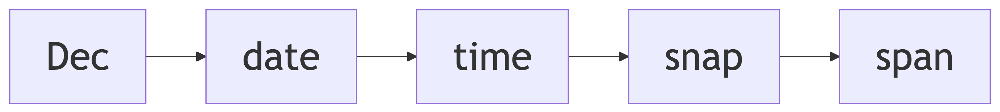
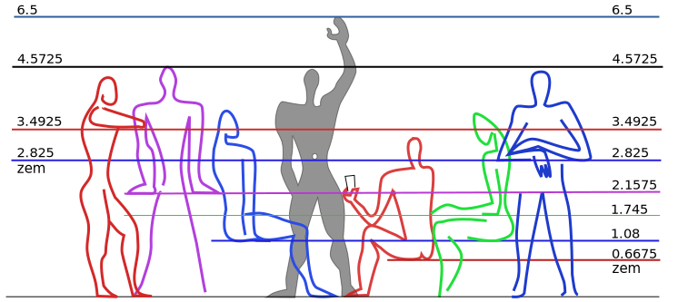
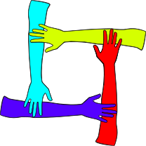
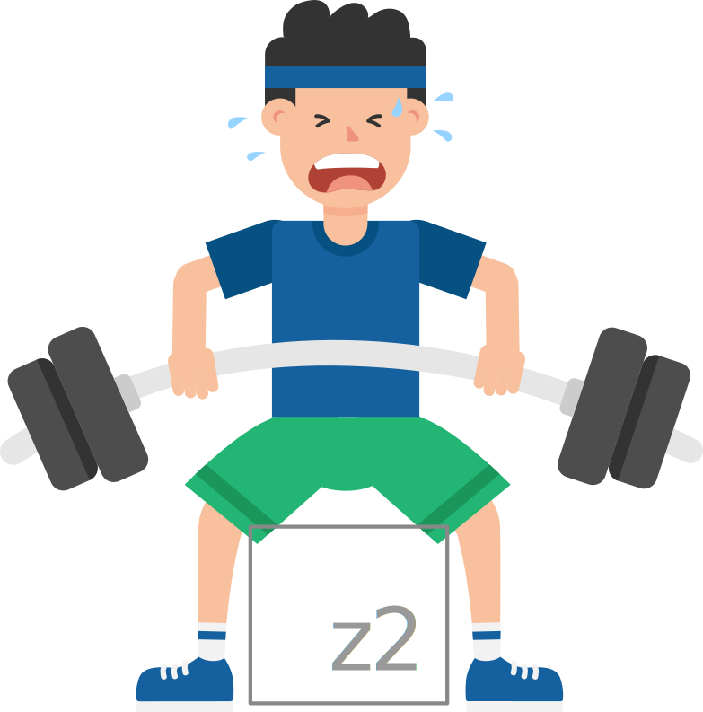
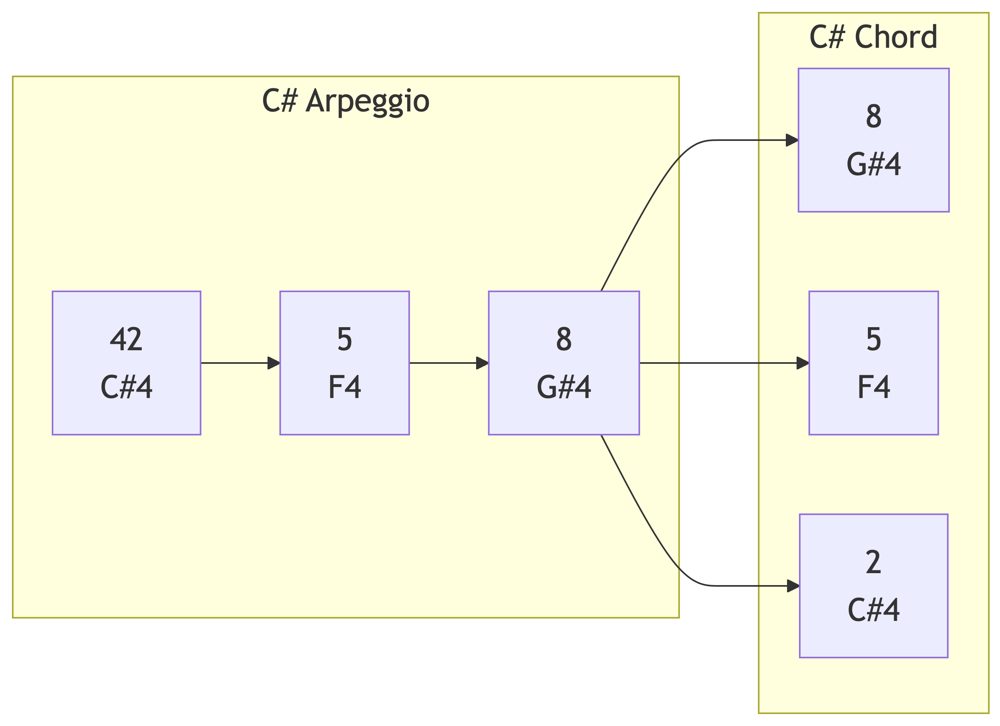
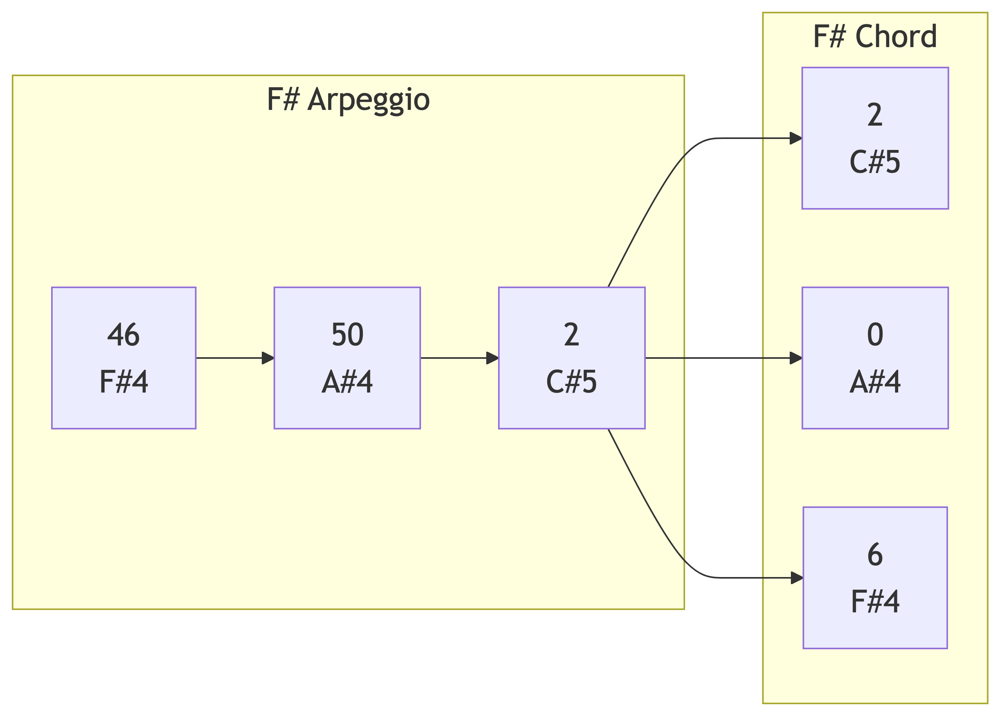
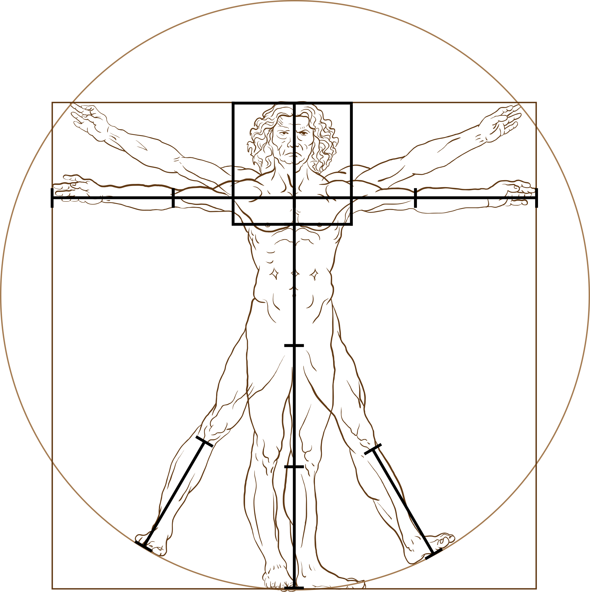

# Note
Martin Laptev
2026+052

- [<span class="toc-section-number">0</span> Dec measurement
  system](#sec-dec)
- [<span class="toc-section-number">1</span> Longitude latitude
  course](#sec-llc)
- [<span class="toc-section-number">2</span> Distance speed
  duration](#sec-dsd)
  - [Interactive world map](#map)
  - [Color wheel compass](#cwc)
  - [<span class="toc-section-number">3.1</span> Hue saturation
    lightness (hsl)](#hsl)
  - [<span class="toc-section-number">3.2</span> Course color
    table](#cct)
- [<span class="toc-section-number">3</span> Red green blue
  (rgb)](#sec-rgb)
- [<span class="toc-section-number">4</span> Dec time zones](#sec-dtz)
- [<span class="toc-section-number">5</span> Dates and times](#sec-dat)
- [<span class="toc-section-number">6</span> Millenium Year
  Day](#sec-myd)
- [<span class="toc-section-number">7</span> Day of dek (dod)](#sec-dod)
- [<span class="toc-section-number">8</span> Zone equatorial meter
  (zem)](#sec-zem)
- [<span class="toc-section-number">9</span> Length area
  volume](#sec-lav)
- [<span class="toc-section-number">10</span> Typical seat
  height](#sec-tsh)
- [<span class="toc-section-number">11</span> Perpetually setting
  sun](#sec-pss)
- [<span class="toc-section-number">12</span> Airplane cruising
  speed](#sec-acs)
- [<span class="toc-section-number">13</span> Centimilliday
  (cmd)](#sec-cmd)
- [<span class="toc-section-number">14</span> heart rate
  tempo](#sec-hrt)
- [<span class="toc-section-number">15</span> Frequency period
  wavelength](#sec-fpw)
- [<span class="toc-section-number">16</span> Ten equal temperament
  (Xet)](#sec-xet)
  - [Color sound table](#cst)
- [<span class="toc-section-number">17</span> Octave note
  tone](#sec-ont)
- [<span class="toc-section-number">18</span> Light and sound](#sec-las)
- [<span class="toc-section-number">19</span> US customary
  units](#sec-ucu)
  - [Unit conversion tables](#unit-conversion-tables)
- [<span class="toc-section-number">20</span> Miles per hour
  (mph)](#sec-mph)
- [<span class="toc-section-number">21</span> Are hectare
  acre](#sec-aha)
- [<span class="toc-section-number">22</span> Drop wineglass
  keg](#sec-dwk)
- [<span class="toc-section-number">23</span> Body mass index
  (bmi)](#sec-bmi)
- [<span class="toc-section-number">24</span> Centizem centimeter
  inch](#sec-cci)
- [<span class="toc-section-number">25</span> Claude Boniface
  Collignon](#sec-cbc)
- [Summary](#tldr)
- [Next](#next)
- [Cite](#cite)
- [Appendix](#last)
- [Observable notebooks](#note)
- [Glossary](#glos)

<div id="firstnav">

<div>

<figure class=''>

<div>



</div>

</figure>

</div>

</div>

# Dec measurement system

This part of my website focuses on Dec, a [measurement
system](https://en.wikipedia.org/wiki/System_of_units_of_measurement#:~:text=a%20collection%20of%20units%20of%20measurement%20and%20rules%20relating%20them%20to%20each%20other)
that [I](https://maptv.github.io) created. All Dec measurements are
based on
[turns](https://en.wikipedia.org/wiki/Turn_%28angle%29#:~:text=a%20unit%20of%20plane%20angle%20measurement%20equal%20to%202%CF%80%C2%A0radians%2C%20360%C2%A0degrees).
When measuring
[angles](https://en.wikipedia.org/wiki/Angle#:~:text=the%20figure%20formed%20by%20two%20rays)📐,
a
[turn](https://en.wikipedia.org/wiki/Turn_%28angle%29#:~:text=the%20Greek%20letter,to%20one%20turn)
(<a href="#t" id="turn" class="tool" data-bs-toggle="tooltip"
data-bs-title="turn">t</a>) represents a full⭕️circle and equals 2*π*
(<a href="#2pi" id="tau" class="tool" data-bs-toggle="tooltip"
data-bs-title="tau"><span
class="math inline">$\underline\tau$</span></a>)
[radians](https://en.wikipedia.org/wiki/Radian#:~:text=the%20unit%20of%20angle%20in%20the%20International%20System%20of%20Units)
(<a href="#rad" id="radian" class="tool" data-bs-toggle="tooltip"
data-bs-title="radians">rad</a>) or 360
[degrees](https://en.wikipedia.org/wiki/Degree_(angle)#:~:text=a%20measurement%20of%20a%20plane%20angle%20in%20which%20one%20full%20rotation%20is%20360%20degrees)
(<a href="#deg" id="degree" class="tool" data-bs-toggle="tooltip"
data-bs-title="degrees">°</a>). [Geographic
coordinates](https://en.wikipedia.org/wiki/Geographic_coordinate_system#:~:text=positions%20directly%20on%20Earth%20as%20latitude%20and%20longitude)
and
[compass](https://en.wikipedia.org/wiki/Compass#:~:text=a%20device%20that%20shows%20the%20cardinal%20directions%20used%20for%20navigation%20and%20geographic%20orientation)🧭directions
are angles📐and thus can, and should😄, be measured in turns instead of
<a href="#rad" class="tool" data-bs-toggle="tooltip"
data-bs-title="radians">rad</a> or
<a href="#deg" class="tool" data-bs-toggle="tooltip"
data-bs-title="degrees">°</a>.

# Longitude latitude course

Dec measures
[longitude](https://en.wikipedia.org/wiki/Longitude#:~:text=denoted%20by%20the%20Greek%20letter%20lambda)
in
[parallels](https://en.wikipedia.org/wiki/Circle_of_latitude#:~:text=an%20abstract%20east%E2%80%93west%20small%20circle%20connecting%20all%20locations%20around%20Earth%20(ignoring%20elevation)%20at%20a%20given%20latitude%20coordinate%20line)
(<a href="#lambda" id="parallel" class="tool" data-bs-toggle="tooltip"
data-bs-title="parallels">λ</a>),
[latitude](https://en.wikipedia.org/wiki/Latitude#:~:text=denoted%20by%20the%20Greek%20lower%2Dcase%20letter%20phi)
in
[meridians](https://en.wikipedia.org/wiki/Meridian_arc#Full_meridian_(polar_perimeter):~:text=The%20polar%20Earth%27s%20circumference%20is%20simply%20four%20times%20quarter%20meridian)
(<a href="#m" id="meridian" class="tool" data-bs-toggle="tooltip"
data-bs-title="meridians">m</a>), and compass🧭directions in
[roses](https://en.wikipedia.org/wiki/Compass_rose#:~:text=a%20polar%20diagram%20displaying%20the%20orientation%20of%20the%20cardinal%20directions)
(<a href="#r" id="rose" class="tool" data-bs-toggle="tooltip"
data-bs-title="roses">r</a>). To measure certain kinds of angles📐, Dec
uses specific types of turns with distinct names like
<a href="#lambda" class="tool" data-bs-toggle="tooltip"
data-bs-title="parallel">λ</a>,
<a href="#m" class="tool" data-bs-toggle="tooltip"
data-bs-title="meridian">m</a>, or
<a href="#r" class="tool" data-bs-toggle="tooltip"
data-bs-title="rose">r</a>. All turn types can be combined with [metric
prefixes](https://en.wikipedia.org/wiki/Metric_prefix#:~:text=a%20unit%20prefix%20that%20precedes%20a%20basic%20unit%20of%20measure%20to%20indicate%20a%20multiple%20or%20submultiple%20of%20the%20unit),
like
[deci](https://en.wikipedia.org/wiki/Deci-#:~:text=a%20decimal%20unit%20prefix%20in%20the%20metric%20system%20denoting%20a%20factor%20of%20one%20tenth),
[centi](https://en.wikipedia.org/wiki/Centi-#:~:text=a%20unit%20prefix%20in%20the%20metric%20system%20denoting%20a%20factor%20of%20one%20hundredth),
or
[milli](https://en.wikipedia.org/wiki/Milli-#:~:text=a%20unit%20prefix%20in%20the%20metric%20system%20denoting%20a%20factor%20of%20one%20thousandth),
to create turn
[submultiples](https://en.wikipedia.org/wiki/Multiple_%28mathematics%29#:~:text=of%20%22a%20being-,a%20unit%20fraction,-of%20b%22%20%28a),
such as <span class="tool" data-bs-toggle="tooltip"
data-bs-title="tenths of a turn">deciturns</span>
(<a href="#dt" id="deciturn" class="tool" data-bs-toggle="tooltip"
data-bs-title="deciturns">dt</a>), <span class="tool"
data-bs-toggle="tooltip"
data-bs-title="hundredths of a turn">centiturns</span>
(<a href="#ct" id="centiturn" class="tool" data-bs-toggle="tooltip"
data-bs-title="centiturns">ct</a>), or <span class="tool"
data-bs-toggle="tooltip"
data-bs-title="thousandths of a turn">milliturns</span>
(<a href="#mt" id="milliturn" class="tool" data-bs-toggle="tooltip"
data-bs-title="milliturns">mt</a>).

The table below provides the current longitude in <span class="tool"
data-bs-toggle="tooltip"
data-bs-title="thousandths of a parallel">milliparallels</span>
(<a href="#mlambda" id="milliparallel" class="tool"
data-bs-toggle="tooltip" data-bs-title="milliparallels">mλ</a>) and
latitude in <span class="tool" data-bs-toggle="tooltip"
data-bs-title="thousandths of a meridian">millimeridians</span>
(<a href="#mm" id="millimeridian" class="tool" data-bs-toggle="tooltip"
data-bs-title="millimeridians">mm</a>) of Points
<span class="point0">0</span> and <span class="point1">1</span> on the
map🗺️beneath the table. By default, Point <span class="point0">0</span>
is at <span class="color8">800</span>
<a href="#mlambda" class="tool" data-bs-toggle="tooltip"
data-bs-title="milliparallels">mλ</a> and <span class="color0">0</span>
<a href="#mm" class="tool" data-bs-toggle="tooltip"
data-bs-title="millimeridians">mm</a>, near the
[Galápagos🏝️archipelago](https://en.wikipedia.org/wiki/Gal%C3%A1pagos_Islands#:~:text=an%20archipelago%20of%20volcanic%20islands%20in%20the%20Eastern%20Pacific)
of Ecuador🇪🇨, and Point <span class="point1">1</span> is at
<span class="color8">800</span>
<a href="#mlambda" class="tool" data-bs-toggle="tooltip"
data-bs-title="milliparallels">mλ</a> and
<span class="color1">100</span>
<a href="#mm" class="tool" data-bs-toggle="tooltip"
data-bs-title="millimeridians">mm</a>, near the bottom of the [Missouri
bootheel](https://en.wikipedia.org/wiki/Missouri_Bootheel#:~:text=a%20salient%20(protrusion)%20located%20in%20the%20southeasternmost%20part%20of%20the%20U.S.%20state%20of%20Missouri)
in the United States🇺🇸.

To move the points, click the map🗺️or edit their coordinates in the
table. The
[toggle](https://observablehq.com/framework/inputs/toggle)✅inputs above
the table add layers to the map🗺️: country borders, a
rainbow🌈colored🎨grid of Dec
[graticules](https://en.wikipedia.org/wiki/Graticule_(cartography)#:~:text=a%20graphical%20depiction%20of%20a%20coordinate%20system%20as%20a%20grid%20of%20lines),
a
[choropleth](https://en.wikipedia.org/wiki/Choropleth_map#:~:text=a%20type%20of%20statistical%20thematic%20map%20that%20uses%20pseudocolor)
of [Coordinated Universal
Time](https://en.wikipedia.org/wiki/Coordinated_Universal_Time#:~:text=the%20primary%20time%20standard%20globally%20used%20to%20regulate%20clocks%20and%20time)
(<a href="#utc" id="coordinateduniversaltime" class="tool"
data-bs-toggle="tooltip"
data-bs-title="Coordinated Universal Time">utc</a>) time zones, and
[solar
terminator](https://en.wikipedia.org/wiki/Terminator_(solar)#:~:text=a%20moving%20line%20that%20divides%20the%20daylit%20side%20and%20the%20dark%20night%20side%20of%20a%20planetary%20body)
shading with a yellow🟡dot denoting the
[point](https://en.wikipedia.org/wiki/Subsolar_point#:~:text=the%20point%20at%20which%20its%20Sun%20is%20perceived%20to%20be%20directly%20overhead)
where the Sun☀️is [directly
overhead](https://en.wikipedia.org/wiki/Zenith#:~:text=the%20imaginary%20point%20on%20the%20celestial%20sphere%20directly%20%22above%22%20a%20particular%20location):
${sunLonHsl} <a href="#mlambda" class="tool" data-bs-toggle="tooltip"
data-bs-title="milliparallels">mλ</a> and ${sunLatHsl}
<a href="#mm" class="tool" data-bs-toggle="tooltip"
data-bs-title="millimeridians">mm</a>.

Alongside the geographic coordinates of a point, each row of the table
contains the
[course](https://en.wikipedia.org/wiki/Azimuth#:~:text=%20azimuth%20is%20usually%20denoted%20alpha)
in <span class="tool" data-bs-toggle="tooltip"
data-bs-title="thousandths of a compass rose">milliroses</span>
(<a href="#mr" id="millirose" class="tool" data-bs-toggle="tooltip"
data-bs-title="milliroses">mr</a>) we would need to maintain to
travel🧳the shortest distance to the other point. The shortest distance
is shown as orange🟠dots on the map🗺️. The default courses in
<a href="#mr" class="tool" data-bs-toggle="tooltip"
data-bs-title="milliroses">mr</a> are <span class="color0">0</span>
(North) from Point <span class="point0">0</span> to
<span class="point1">1</span> and <span class="color5">500</span>
(South) from Point <span class="point1">1</span> to
<span class="point0">0</span>.

# Distance speed duration

Dec measures distance in
[taurs](https://en.wikipedia.org/wiki/Turn_(angle)#Tau_proposals:~:text=%E2%81%A0%20turn-,Circumference%20of%20a%20circle,-%F0%9D%90%B6)
(<a href="#c" id="taur" class="tool" data-bs-toggle="tooltip"
data-bs-title="taurs">c</a>), speed in
[omegars](https://en.wikipedia.org/wiki/Angular_velocity#:~:text=linear%20velocity%20is%20the%20radius%20times%20the%20angular%20velocity)
(<a href="#v" id="omegar" class="tool" data-bs-toggle="tooltip"
data-bs-title="omegars">v</a>), and time in years
(<a href="#y" id="year" class="tool" data-bs-toggle="tooltip"
data-bs-title="years">y</a>) and days
(<a href="#d" id="day" class="tool" data-bs-toggle="tooltip"
data-bs-title="days">d</a>). Each of these four turn types approximates
(≈) a physical property of the Earth🌍:
<a href="#c" class="tool" data-bs-toggle="tooltip"
data-bs-title="taur">c</a> =
<a href="#c" class="tool" data-bs-toggle="tooltip"
data-bs-title="taur"><span class="math inline">$\underline{\tau
r}$</span></a> ≈ its
[circumference](https://en.wikipedia.org/wiki/Earth%27s_circumference#:~:text=the%20distance%20around%20Earth),
<a href="#y" class="tool" data-bs-toggle="tooltip"
data-bs-title="year">y</a> ≈ the duration of its
[orbit](https://en.wikipedia.org/wiki/Earth%27s_orbit#:~:text=From%20a%20vantage%20point%20above%20the%20north%20pole%20of%20either%20the%20Sun%20or%20Earth%2C%20Earth%20would%20appear%20to%20revolve%20in%20a%20counterclockwise%20direction%20around%20the%20Sun)
around the Sun☀️, <a href="#d" class="tool" data-bs-toggle="tooltip"
data-bs-title="day">d</a> ≈ the duration of its
[rotation](https://en.wikipedia.org/wiki/Earth%27s_rotation#:~:text=the%20rotation%20of%20planet%20Earth%20around%20its%20own%20axis)
on its
[axis](https://en.wikipedia.org/wiki/Axial_tilt#:~:text=the%20imaginary%20line%20that%20passes%20through%20both%20the%20north%20pole%20and%20south%20pole),
and $\text c\over\text d$ =
<a href="#v" class="tool" data-bs-toggle="tooltip"
data-bs-title="omegar">v</a> =
<a href="#v" class="tool" data-bs-toggle="tooltip"
data-bs-title="omegar"><span class="math inline">$\underline{\omega
r}$</span></a> ≈ the speed of its rotation at the
[Equator](https://en.wikipedia.org/wiki/Equator#:~:text=the%20circle%20of%20latitude%20that%20divides%20Earth%20into%20the%20Northern%20and%20Southern%20hemispheres).

At a speed of <span class="color5">0.5</span>
<a href="#v" class="tool" data-bs-toggle="tooltip"
data-bs-title="omegars">v</a> or <span class="color5">500</span>
<span class="tool" data-bs-toggle="tooltip"
data-bs-title="thousandths of an omegar">milliomegars</span>
(<a href="#mv" id="milliomegar" class="tool" data-bs-toggle="tooltip"
data-bs-title="milliomegars">mv</a>), we could travel🧳the
<span class="color1">0.1</span>
<a href="#c" class="tool" data-bs-toggle="tooltip"
data-bs-title="taurs">c</a> or <span class="color1">100</span>
<span class="tool" data-bs-toggle="tooltip"
data-bs-title="thousandths of a taur">millitaurs</span>
(<a href="#mc" id="millitaur" class="tool" data-bs-toggle="tooltip"
data-bs-title="millitaurs">mc</a>) between the default positions📍of
Points <span class="point0">0</span> and <span class="point1">1</span>
in <span class="color2">0.2</span>
<a href="#d" class="tool" data-bs-toggle="tooltip"
data-bs-title="days">d</a> or <span class="color2">200</span>
<span class="tool" data-bs-toggle="tooltip"
data-bs-title="thousandths of a day">millidays</span>
(<a href="#md" id="milliday" class="tool" data-bs-toggle="tooltip"
data-bs-title="millidays">md</a>). The time required to travel🧳between
two points is the distance divided by the speed: ${distance_mcHsl0}
<a href="#mc" class="tool" data-bs-toggle="tooltip"
data-bs-title="millitaurs">mc</a> ÷ ${velocity_vHsl0}
<a href="#v" class="tool" data-bs-toggle="tooltip"
data-bs-title="omegars">v</a> = ${traveltimeHsl0}
<a href="#md" class="tool" data-bs-toggle="tooltip"
data-bs-title="millidays">md</a> = ${distance_cHsl}
<a href="#c" class="tool" data-bs-toggle="tooltip"
data-bs-title="taurs">c</a> ÷ ${velocity_vHsl1}
<a href="#v" class="tool" data-bs-toggle="tooltip"
data-bs-title="omegars">v</a> = ${distance_mcHsl1}
<a href="#mc" class="tool" data-bs-toggle="tooltip"
data-bs-title="millitaurs">mc</a> ÷ ${velocity_mvHsl}
<a href="#mv" class="tool" data-bs-toggle="tooltip"
data-bs-title="milliomegars">mv</a> = ${traveltimeHsl1}
<a href="#d" class="tool" data-bs-toggle="tooltip"
data-bs-title="days">d</a>.

## Interactive world map

<div class="marginInputs">

``` {ojs}
//| echo: false
//| label: speedinput
//| column: margin
viewof travelspeed = Inputs.range([0, 1000], {label: "Speed", value: 500, step: 1})
```

``` {ojs}
//| echo: false
//| label: yawinput
//| column: margin
viewof yaw = Inputs.range([0, 1000], {label: "Yaw", value: 500, step: 1})
```

``` {ojs}
//| echo: false
//| label: pitchinput
//| column: margin
viewof pitch = Inputs.range([-500, 500], {label: "Pitch", value: 0, step: 1})
```

``` {ojs}
//| echo: false
//| label: rollinput
//| column: margin
viewof roll = Inputs.range([-500, 500], {label: "Roll", value: 0, step: 1})
```

``` {ojs}
//| echo: false
//| label: sizeinput
//| column: margin
viewof mapsize = Inputs.range([0, 100], {label: "Size", value: 100, step: 1})
```

``` {ojs}
//| echo: false
//| label: projselect
//| column: margin
viewof select = Inputs.select(
  projections, {format: x => x.name, value: projections.find(t => t.name === "Equirectangular (plate carrée)")})
```

</div>

``` {ojs}
//| echo: false
//| label: toggles
viewof bordertoggle = labelToggle(Inputs.toggle, "Border", false, "bordertoggle")
viewof gridtoggle = labelToggle(Inputs.toggle, "Grid", false, "gridtoggle")
viewof utctoggle = labelToggle(Inputs.toggle, "UTC", false, "utctoggle")
viewof suntoggle = labelToggle(Inputs.toggle, "Sun", false, "suntoggle")
rstbtn.node();
```

``` {ojs}
//| echo: false
//| label: maptable
table = createTable([
  { Point: 0, Milliparallel: 800, Millimeridian: 0, Milliwindrose: 0 },
  { Point: 1, Milliparallel: 800, Millimeridian: 100, Milliwindrose: 500 },
], { headerEditable: false, appendRows: false })
//   {Point: 0, Milliparallel: `${Math.floor(long2turn(Place_A[0], 3))}`, Millimeridian: `${Math.floor(lati2turn(Place_A[1], 3))}`, Milliwindrose: `${Math.floor(lati2turn(coor2bear(Place_A, Place_B)))}`},
//   {Point: 1, Milliparallel: `${Math.floor(long2turn(Place_B[0], 3))}`, Millimeridian: `${Math.floor(lati2turn(Place_B[1], 3))}`, Milliwindrose: `${Math.floor(lati2turn(coor2bear(Place_B, Place_A)))}`},
// ], {headerEditable: false, appendRows: false})
```

<div class="column-page">

``` {ojs}
//| echo: false
//| label: fig-distmap
// https://observablehq.com/@d3/solar-terminator
// https://observablehq.com/@mbostock/time-zones
viewof coordinates = worldMapCoordinates([[turn2long(table.rows[1].cells[1].childNodes[0].innerText), turn2degr(table.rows[1].cells[2].childNodes[0].innerText % 250)], [turn2long(table.rows[2].cells[1].childNodes[0].innerText), turn2degr(table.rows[2].cells[2].childNodes[0].innerText % 250)], projection], [width, height * mapsize / 100])
//viewof coordinates = worldMapCoordinates([
//  [turn2long(table.rows[1].cells[1].childNodes[0].innerText), turn2degr(table.rows[1].cells[2].childNodes[0].innerText % 250)],
//  [turn2long(table.rows[2].cells[1].childNodes[0].innerText), turn2degr(table.rows[2].cells[2].childNodes[0].innerText % 250)],
//  projection], [width, height])
```

</div>

## Color wheel compass

``` {ojs}
//| echo: false
//| label: colorpreview
//| column: margin
//| class: colorcomponent
preview()
```

``` {ojs}
//| echo: false
//| label: coloropposites8
//| column: margin
//| class: coloropp
// https://observablehq.com/@maddievision/enneagram
quickRender(326, 326, context => {
  const center = 163
  const ringRadius = 140
  const ringLineWidth = 4
  // Ring
  context.beginPath();
  context.lineWidth = ringLineWidth
  context.strokeStyle = "#ddd"
  context.arc(center, center, ringRadius, 0, 2 * Math.PI);
  context.stroke();
  context.font = "Bold 16px Arial"
  context.textAlign = 'center'
  let octPoints = []
  for (let i = 0; i < 8; i++) {
    const xPhase = Math.sin(i / 8 * 2 * Math.PI)
    const yPhase = Math.cos(i / 8 * 2 * Math.PI)
    const x = center + ringRadius * xPhase
    const y = center - ringRadius * yPhase
    octPoints.push([x, y])
  }
  // Lines
  octConnections.forEach(([a, b], i ) => {
    const [x1, y1] = octPoints[a]
    const [x2, y2] = octPoints[b]
    const lineAngle = Math.atan2(y2 - y1, x2 - x1)
    // Draw just short of the label circumference
    const x2a = x2 - 28 * Math.cos(lineAngle)
    const y2a = y2 - 28 * Math.sin(lineAngle)
    const x1a = x1 + 28 * Math.cos(lineAngle)
    const y1a = y1 + 28 * Math.sin(lineAngle)
    context.lineWidth = ringLineWidth
    context.strokeStyle = "#ddd"
    context.beginPath();
    context.moveTo(x2a, y2a);
    context.lineTo(x1a, y1a);
    context.stroke();
  })
  // Arrow Heads
  octConnections.forEach(([a, b], i ) => {
    const [x1, y1] = octPoints[a]
    const [x2, y2] = octPoints[b]
    const lineAngle = Math.atan2(y2 - y1, x2 - x1)
    const xl = x2 - 88 * Math.cos(lineAngle - (15 / 360) * 2 * Math.PI)
    const yl = y2 - 88 * Math.sin(lineAngle - (15 / 360) * 2 * Math.PI)
    const xr = x2 - 88 * Math.cos(lineAngle + (15 / 360) * 2 * Math.PI)
    const yr = y2 - 88 * Math.sin(lineAngle + (15 / 360) * 2 * Math.PI)
    const x2a = x2 - 22 * Math.cos(lineAngle)
    const y2a = y2 - 22 * Math.sin(lineAngle)
    const x = x2 - 69 * Math.cos(lineAngle)
    const y = y2 - 69 * Math.sin(lineAngle)
    context.fillStyle = hsl8[i]
    context.strokeStyle = window.darkmode ? "#aaa" : "#333";
    context.lineWidth = 1
    context.beginPath();
    context.moveTo(x2a, y2a);
    context.lineTo(xl, yl);
    context.lineTo(xr, yr);
    context.lineTo(x2a, y2a);
    context.fill();
    context.stroke();
    context.fillStyle = yiq(hsl8[i]) > 0.51 ? "#000" : "white"
    context.fillText(["N", "NE", "E", "SE", "S", "SW", "W", "NW"][i], x, y + 6)
  })
  // Labels
  octPoints.forEach(([x, y], i) => {
    context.lineWidth = 1
    context.fillStyle = hsl8[i]
    context.strokeStyle = window.darkmode ? "#aaa" : "#333";
    context.beginPath();
    context.arc(x, y, 22, 0, 2 * Math.PI);
    context.fill();
    context.stroke();
    context.fillStyle = yiq(hsl8[i]) > 0.51 ? "#000" : "white";
    context.fillText(["N", "NE", "E", "SE", "S", "SW", "W", "NW"][i], x, y + 6)
  })
})
```

``` {ojs}
//| echo: false
//| label: colorcomparer8
//| column: margin
//| class: colorcomparer
// https://observablehq.com/@observablehq/categorical-palette-tool
displayPalette(hsl8, {darkMode: true})
```

``` {ojs}
//| echo: false
//| label: coloropposites10
//| column: margin
//| class: coloropp
// https://observablehq.com/@maddievision/enneagram
quickRender(326, 326, context => {
  const center = 163
  const ringRadius = 140
  const ringLineWidth = 4
  // Ring
  context.beginPath();
  context.lineWidth = ringLineWidth
  context.strokeStyle = "#ddd"
  context.arc(center, center, ringRadius, 0, 2 * Math.PI);
  context.stroke();
  context.font = "Bold 24px Arial"
  context.textAlign = 'center'
  let decPoints = []
  for (let i = 0; i < 10; i++) {
    const xPhase = Math.sin(i / 10 * 2 * Math.PI)
    const yPhase = Math.cos(i / 10 * 2 * Math.PI)
    const x = center + ringRadius * xPhase
    const y = center - ringRadius * yPhase
    decPoints.push([x, y])
  }
  // Lines
  decConnections.forEach(([a, b], i ) => {
    const [x1, y1] = decPoints[a]
    const [x2, y2] = decPoints[b]
    const lineAngle = Math.atan2(y2 - y1, x2 - x1)
    // Draw just short of the label circumference
    const x2a = x2 - 28 * Math.cos(lineAngle)
    const y2a = y2 - 28 * Math.sin(lineAngle)
    const x1a = x1 + 28 * Math.cos(lineAngle)
    const y1a = y1 + 28 * Math.sin(lineAngle)
    context.lineWidth = ringLineWidth
    context.strokeStyle = "#ddd"
    context.beginPath();
    context.moveTo(x2a, y2a);
    context.lineTo(x1a, y1a);
    context.stroke();
  })
  // Arrow Heads
  decConnections.forEach(([a, b], i ) => {
    const [x1, y1] = decPoints[a]
    const [x2, y2] = decPoints[b]
    const lineAngle = Math.atan2(y2 - y1, x2 - x1)
    const xl = x2 - 79 * Math.cos(lineAngle - (15 / 360) * 2 * Math.PI)
    const yl = y2 - 79 * Math.sin(lineAngle - (15 / 360) * 2 * Math.PI)
    const xr = x2 - 79 * Math.cos(lineAngle + (15 / 360) * 2 * Math.PI)
    const yr = y2 - 79 * Math.sin(lineAngle + (15 / 360) * 2 * Math.PI)
    const x2a = x2 - 22 * Math.cos(lineAngle)
    const y2a = y2 - 22 * Math.sin(lineAngle)
    const x = x2 - 60 * Math.cos(lineAngle)
    const y = y2 - 60 * Math.sin(lineAngle)
    context.fillStyle = hsl10[i]
    context.strokeStyle = window.darkmode ? "#aaa" : "#333";
    context.lineWidth = 1
    context.beginPath();
    context.moveTo(x2a, y2a);
    context.lineTo(xl, yl);
    context.lineTo(xr, yr);
    context.lineTo(x2a, y2a);
    context.fill();
    context.stroke();
    context.fillStyle = yiq(hsl10[i]) > 0.51 ? "#000" : "white"
    context.fillText(i, x, y + 8)
  })
  // Labels
  decPoints.forEach(([x, y], i) => {
    context.lineWidth = 1
    context.fillStyle = hsl10[i]
    context.strokeStyle = window.darkmode ? "#aaa" : "#333";
    context.beginPath();
    context.arc(x, y, 22, 0, 2 * Math.PI);
    context.fill();
    context.stroke();
    context.fillStyle = yiq(hsl10[i]) > 0.51 ? "#000" : "white";
    context.fillText(i, x, y + 8)
  })
})
```

``` {ojs}
//| echo: false
//| label: colorcomparer10
//| column: margin
//| class: colorcomparer
// https://observablehq.com/@observablehq/categorical-palette-tool
displayPalette(hsl10.slice(0, 10), {darkMode: true})
```

``` {ojs}
//| echo: false
//| label: fig-colorwheelcompass
//| class: colorcomponent
// https://observablehq.com/@pjedwards/compass-rose-as-legend-with-colors
svg`<svg width="${size}" height="${size}" viewBox="${-size/2} ${-size/2} ${size} ${size}">
  <g transform='rotate(${Math.round(-colorD * .36)})'>
  ${repeat(tick(radius, 5, '#434343'), 5 * 4 * 10)}
  ${repeat(tick(radius, 8), 10 * 4)}
  ${repeat(`<path d="M 0,-${radius+12} l 3,10 l -6,0 z" fill="black" stroke="black" stroke-width="1"/>`, 4, 0)}
  ${repeat(`<path d="M 0,-${radius+12} l 3,10 l -6,0 z" fill="white" stroke="black" stroke-width="1"/>`, 4, 45)}
  <circle r="${radius}" fill="#d3d3d3" stroke="#434343" stroke-width="3" />
  ${repeat(directionMarker(radius+14, 24), 4, 0)}
  ${repeat(directionMarker(radius+12, 24), 4, 45)}
  ${repeat(turnMarker(radius+14, 32), 4, 0)}
  ${repeat(turnMarker(radius+12, 32), 4, 45)}
  ${repeat(pie(radius-margin/2, 2 * Math.PI * (radius-margin/2) / deccolors.length / 2, 1, deccolors), deccolors.length, 360/deccolors.length)}
</svg>
`
```

``` {ojs}
//| echo: false
//| label: colorbar
//| class: colorcomponent
// https://observablehq.com/@paavanb/progressive-color-picker
decBar = colorbar({
  colorFn: t => hslToRgb(dec2hue(t) / 1000, colorS / 1000, colorL / 1000),
  onSelect: t => {
    set(viewof colorD, t * 1000)
    onUpdateHSL(dec2hue(t), colorS / 1000, colorL / 1000)
  }
})
```

## Hue saturation lightness (hsl)

``` {ojs}
//| echo: false
//| label: hueslider
//| class: colorslider
// https://observablehq.com/@paavanb/progressive-color-picker
{ const input = Inputs.range([0, 1000], { label: "Hue", value: 0, step: 1 })
  input.value = initialHSL[0]
  input.oninput = (evt) => onUpdateHSL(dec2hue(evt.currentTarget.value / 1000), colorS / 1000, colorL / 1000)
  return Inputs.bind(input, viewof colorD)
}
```

``` {ojs}
//| echo: false
//| label: satslider
//| class: colorslider
// https://observablehq.com/@paavanb/progressive-color-picker
{ const input = Inputs.range([0, 1000], { label: "Saturation", value: 1000, step: 1, })
  input.oninput = (evt) => onUpdateHSL(colorD, evt.currentTarget.value / 1000, colorL / 1000)
  return Inputs.bind(input, viewof colorS)
}
```

``` {ojs}
//| echo: false
//| label: litslider
//| class: colorslider
// https://observablehq.com/@paavanb/progressive-color-picker
{ const input = Inputs.range([0, 1000], { label: "Lightness", value: 500, step: 1, })
  input.oninput = (evt) => onUpdateHSL(colorD, colorS / 1000, evt.currentTarget.value / 1000)
  return Inputs.bind(input, viewof colorL)
}
```

## Course color table

<div id="colortable">

<table>
<colgroup>
<col style="width: 17%" />
<col style="width: 18%" />
<col style="width: 21%" />
<col style="width: 21%" />
<col style="width: 20%" />
</colgroup>
<thead>
<tr>
<th></th>
<th><strong><span class="tool" data-bs-toggle="tooltip"
data-bs-title="milliroses">mr</span></strong>🧭</th>
<th><strong><span class="tool" data-bs-toggle="tooltip"
data-bs-title="compass degrees">c°</span></strong>🧭</th>
<th><strong><span class="tool" data-bs-toggle="tooltip"
data-bs-title="HSL or HSV degrees">h°</span></strong>🎨</th>
<th><strong><span class="tool" data-bs-toggle="tooltip"
data-bs-title="hexadecimal">hex</span></strong>🎨</th>
</tr>
</thead>
<tbody>
<tr>
<td>${rainbowDir}</td>
<td>${rainbowMtr}</td>
<td>${rainbowDegC}</td>
<td>${rainbowDegH}</td>
<td>${rainbowHex}</td>
</tr>
<tr>
<td><span class="color125">NE</span></td>
<td><span class="color125">125</span></td>
<td><span class="color125">45</span></td>
<td><span class="color125">44</span></td>
<td><span class="color125">fb0</span></td>
</tr>
<tr>
<td><span class="color250">E</span></td>
<td><span class="color250">250</span></td>
<td><span class="color250">90</span></td>
<td><span class="color250">68</span></td>
<td><span class="color250">df0</span></td>
</tr>
<tr>
<td><span class="color375">SE</span></td>
<td><span class="color375">375</span></td>
<td><span class="color375">135</span></td>
<td><span class="color375">96</span></td>
<td><span class="color375">6f0</span></td>
</tr>
<tr>
<td><span class="color5">S</span></td>
<td><span class="color5">500</span></td>
<td><span class="color5">180</span></td>
<td><span class="color5">180</span></td>
<td><span class="color5">0ff</span></td>
</tr>
<tr>
<td><span class="color625">SW</span></td>
<td><span class="color625">625</span></td>
<td><span class="color625">225</span></td>
<td><span class="color625">216</span></td>
<td><span class="color625">06f</span></td>
</tr>
<tr>
<td><span class="color750">W</span></td>
<td><span class="color750">750</span></td>
<td><span class="color750">270</span></td>
<td><span class="color750">264</span></td>
<td><span class="color750">60f</span></td>
</tr>
<tr>
<td><span class="color875">NW</span></td>
<td><span class="color875">875</span></td>
<td><span class="color875">315</span></td>
<td><span class="color875">292</span></td>
<td><span class="color875">d0f</span></td>
</tr>
<tr>
<td><span class="color0">N</span></td>
<td><span class="color0">0</span></td>
<td><span class="color0">0</span></td>
<td><span class="color0">0</span></td>
<td><span class="color0">f00</span></td>
</tr>
</tbody>
</table>

</div>

The
[color🎨wheel](https://en.wikipedia.org/wiki/Color_wheel#:~:text=an%20abstract%20illustrative%20organization%20of%20color%20hues%20around%20a%20circle)
compass🧭above indicates both a
[hue](https://en.wikipedia.org/wiki/Hue#:~:text=an%20angular%20position%20around%20a%20central%20or%20neutral%20point%20or%20axis%20on%20a%20color%20space%20coordinate%20diagram)
in <a href="#mt" class="tool" data-bs-toggle="tooltip"
data-bs-title="milliturns">mt</a> and a course in
<a href="#mr" class="tool" data-bs-toggle="tooltip"
data-bs-title="milliroses">mr</a>. We can convert the hue to [HSL and
HSV](https://en.wikipedia.org/wiki/HSL_and_HSV#:~:text=the%20two%20most%20common%20cylindrical%2Dcoordinate%20representations%20of%20points%20in%20an%20RGB%20color%20model)
degrees
(<a href="#hdeg" id="huedegree" class="tool" data-bs-toggle="tooltip"
data-bs-title="HSL or HSV degrees">h°</a>) and the course to
compass🧭degrees
(<a href="#cdeg" id="compassdegree" class="tool" data-bs-toggle="tooltip"
data-bs-title="compass degrees">c°</a>): 25
<a href="#mr" class="tool" data-bs-toggle="tooltip"
data-bs-title="milliroses">mr</a> = 9
<a href="#cdeg" class="tool" data-bs-toggle="tooltip"
data-bs-title="compass degrees">c°</a>. To rotate🔄the color🎨wheel
compass🧭, use the “Hue”
[range](https://observablehq.com/framework/inputs/range)🎚️and [hue
bar](https://observablehq.com/@paavanb/progressive-color-picker) inputs
beneath it or change the course from Point <span class="point0">0</span>
to <span class="point1">1</span> on the map🗺️.

# Red green blue (rgb)

The table beneath the hue bar compares the current Point
<span class="point0">0</span> to <span class="point1">1</span> course in
its top row with the
[cardinal](https://en.wikipedia.org/wiki/Cardinal_direction#:~:text=north%2C%20south%2C%20east%2C%20and%20west)
and
[intercardinal](https://en.wikipedia.org/wiki/Cardinal_direction#:~:text=northeast%20(NE)%2C%20southeast%20(SE)%2C%20southwest%20(SW)%2C%20and%20northwest%20(NW))
directions. Together, the range🎚️inputs underneath the hue bar form a
“hue saturation lightness”
(<a href="#hsl" id="huesaturationlightness" class="tool"
data-bs-toggle="tooltip"
data-bs-title="hue saturation lightness">hsl</a>) triplet. Like
“[<span class="color0">red</span> <span class="color4">green</span>
<span class="color7">blue</span>](https://en.wikipedia.org/wiki/RGB_color_model#:~:text=an%20additive%20color%20model)”
(<a href="#rgb" id="redgreenblue" class="tool" data-bs-toggle="tooltip"
data-bs-title="red green blue">rgb</a>) or
[hexadecimal](https://en.wikipedia.org/wiki/Web_colors#Hex_triplet:~:text=hexadecimal%20number%20used%20in%20HTML%2C%20CSS%2C%20SVG%2C%20and%20other%20computing%20applications%20to%20represent%20colors)
(<a href="#hex" id="hexadecimal" class="tool" data-bs-toggle="tooltip"
data-bs-title="hexadecimal">hex</a>) triplets,
<a href="#hsl" id="huesaturationlightness" class="tool"
data-bs-toggle="tooltip"
data-bs-title="hue saturation lightness">hsl</a> triplets specify a
full-fledged color🎨instead of just a hue.

<div>

> **Bad Pun Alert**
>
> Feeling ***disoriented***😵‍💫? Of
> [***course***](https://en.wikipedia.org/wiki/Course_(navigation)#:~:text=the%20cardinal%20direction%20in%20which%20the%20craft%20is%20to%20be%20steered)
> you are! Color🎨labels🏷️can help you find your
> [***bearings***](https://en.wikipedia.org/wiki/Bearing_(navigation)#:~:text=the%20horizontal%20angle%20between%20the%20direction%20of%20an%20object%20and%20north%20or%20another%20object),
> stay on
> [***track***](https://en.wikipedia.org/wiki/Course_(navigation)#:~:text=The%20path%20that%20a%20vessel%20follows),
> and avoid
> [***heading***](https://en.wikipedia.org/wiki/Course_(navigation)#:~:text=the%20direction%20where%20the%20watercraft's%20bow%20or%20the%20aircraft's%20nose%20is%20pointed)
> aches🤕. <span class="orange">Orange</span> you glad I couldn’t think
> of a color🎨pun?

</div>

Color🎨can provide a general idea of
angular📐[measure](https://en.wikipedia.org/wiki/Angle#:~:text=The%20magnitude%20of%20an%20angle),
regardless of the metric prefixes or
[units](https://en.wikipedia.org/wiki/Angle#Units) we use. Therefore, we
can reuse♻️colors🎨across many different contexts. Most often,
<span class="color0">red</span> designates starting points, like North
(<span class="color0">0</span>
<a href="#mr" class="tool" data-bs-toggle="tooltip"
data-bs-title="milliroses">mr</a>) and [Longitude
0](https://en.wikipedia.org/wiki/18th_meridian_west#:~:text=a%20line%20of%20longitude%20that%20extends%20from%20the%20North%20Pole%20across%20the%20Arctic%20Ocean%2C%20Greenland%2C%20Iceland%2C%20the%20Atlantic%20Ocean%2C%20the%20Canary%20Islands%2C%20the%20Southern%20Ocean%2C%20and%20Antarctica%20to%20the%20South%20Pole)
(<span class="color0">0</span>
<a href="#mlambda" class="tool" data-bs-toggle="tooltip"
data-bs-title="milliparallels">mλ</a>), and
<span class="color5">cyan</span> denotes midpoints, such as South
(<span class="color5">500</span>
<a href="#mr" class="tool" data-bs-toggle="tooltip"
data-bs-title="milliroses">mr</a>) and [Longitude
5](https://en.wikipedia.org/wiki/162nd_meridian_east#:~:text=a%20line%20of%20longitude%20that%20extends%20from%20the%20North%20Pole%20across%20the%20Arctic%20Ocean%2C%20Asia%2C%20the%20Pacific%20Ocean%2C%20the%20Southern%20Ocean%2C%20and%20Antarctica%20to%20the%20South%20Pole)
(<span class="color5">500</span>
<a href="#mlambda" class="tool" data-bs-toggle="tooltip"
data-bs-title="milliparallels">mλ</a>).

The Equator (<span class="color0">0</span>
<a href="#mm" class="tool" data-bs-toggle="tooltip"
data-bs-title="millimeridians">mm</a>) is the [major
latitude](https://en.wikipedia.org/wiki/Circle_of_latitude#:~:text=mark%20the%20divisions%20between%20the%20five%20principal%20geographical%20zones)
midway between the South (<span class="color750">-250</span>
<a href="#mm" class="tool" data-bs-toggle="tooltip"
data-bs-title="millimeridians">mm</a>) and North
(<span class="color250">250</span>
<a href="#mm" class="tool" data-bs-toggle="tooltip"
data-bs-title="millimeridians">mm</a>) Poles. Unlike the Equator, the
Tropics of
[Cancer](https://en.wikipedia.org/wiki/Tropic_of_Cancer#:~:text=northernmost%20circle%20of%20latitude%20where%20the%20Sun%20can%20be%20seen%20directly%20overhead)♋(<span class="color065">65</span>
<a href="#mm" class="tool" data-bs-toggle="tooltip"
data-bs-title="millimeridians">mm</a>) and
[Capricorn](https://en.wikipedia.org/wiki/Tropic_of_Capricorn#:~:text=the%20southernmost%20latitude%20where%20the%20Sun%20can%20be%20seen%20directly%20overhead)♑️(<span class="color935">-65</span>
<a href="#mm" class="tool" data-bs-toggle="tooltip"
data-bs-title="millimeridians">mm</a>) and the
[Arctic](https://en.wikipedia.org/wiki/Arctic_Circle#:~:text=the%20southernmost%20latitude%20at%20which%2C%20on%20the%20winter%20solstice%20in%20the%20Northern%20Hemisphere%2C%20the%20Sun%20does%20not%20rise%20all%20day%2C%20and%20on%20the%20Northern%20Hemisphere%27s%20summer%20solstice%2C%20the%20Sun%20does%20not%20set)
(<span class="color250">250</span>
<a href="#mm" class="tool" data-bs-toggle="tooltip"
data-bs-title="millimeridians">mm</a> – <span class="color065">65</span>
<a href="#mm" class="tool" data-bs-toggle="tooltip"
data-bs-title="millimeridians">mm</a> =
<span class="color185">185</span>
<a href="#mm" class="tool" data-bs-toggle="tooltip"
data-bs-title="millimeridians">mm</a>) and
[Antarctic](https://en.wikipedia.org/wiki/Antarctic_Circle#:~:text=the%20Sun%20is%20above%20the%20horizon%20for%2024%20continuous%20hours%20at%20least%20once%20per%20year%20(and%20therefore%20visible%20at%20solar%20midnight)%20and%20the%20centre%20of%20the%20Sun%20(ignoring%20refraction)%20is%20below%20the%20horizon%20for%2024%20continuous%20hours%20at%20least%20once%20per%20year%20(and%20therefore%20not%20visible%20at%20solar%20noon))
(<span class="color065">65</span>
<a href="#mm" class="tool" data-bs-toggle="tooltip"
data-bs-title="millimeridians">mm</a> –
<span class="color250">250</span>
<a href="#mm" class="tool" data-bs-toggle="tooltip"
data-bs-title="millimeridians">mm</a> =
<span class="color815">-185</span>
<a href="#mm" class="tool" data-bs-toggle="tooltip"
data-bs-title="millimeridians">mm</a>) Circles are defined by the [axial
tilt](https://en.wikipedia.org/wiki/Axial_tilt#Earth:~:text=the%20angle%20between%20the%20ecliptic%20and%20the%20celestial%20equator%20on%20the%20celestial%20sphere)
of the Earth🌏: <span class="color065">65</span>
<a href="#mt" class="tool" data-bs-toggle="tooltip"
data-bs-title="milliturns">mt</a>.

# Dec time zones

Enable the “Grid” toggle✅input to see Latitudes
[-2](https://en.wikipedia.org/wiki/72nd_parallel_south#:~:text=a%20circle%20of%20latitude%20that%20is%2072%20degrees%20south%20of%20the%20Earth's%20equatorial%20plane%20in%20the%20Antarctic)
(<span class="color8">-200</span> <span class="tool"
data-bs-toggle="tooltip" data-bs-title="millimeridians">mm</span>),
[-1](https://en.wikipedia.org/wiki/36th_parallel_south#:~:text=a%20circle%20of%20latitude%20that%20is%2036%20degrees%20south%20of%20the%20Earth's%20equatorial%20plane)
(<span class="color9">-100</span>
<a href="#mm" class="tool" data-bs-toggle="tooltip"
data-bs-title="millimeridians">mm</a>),
[0](https://en.wikipedia.org/wiki/Equator#:~:text=the%20circle%20of%20latitude%20that%20divides%20Earth%20into%20the%20Northern%20and%20Southern%20hemispheres)
(<span class="color0">0</span>
<a href="#mm" class="tool" data-bs-toggle="tooltip"
data-bs-title="millimeridians">mm</a>),
[1](https://en.wikipedia.org/wiki/36th_parallel_north#:~:text=a%20circle%20of%20latitude%20that%20is%2036%20degrees%20north%20of%20the%20Earth's%20equatorial%20plane)
(<span class="color1">100</span>
<a href="#mm" class="tool" data-bs-toggle="tooltip"
data-bs-title="millimeridians">mm</a>), and
[2](https://en.wikipedia.org/wiki/72nd_parallel_north#:~:text=a%20circle%20of%20latitude%20that%20is%2072%20degrees%20north%20of%20the%20Earth's%20equatorial%20plane%2C%20in%20the%20Arctic)
(<span class="color2">200</span>
<a href="#mm" class="tool" data-bs-toggle="tooltip"
data-bs-title="millimeridians">mm</a>) on the map🗺️above along with the
ten major longitudes that divide the Earth🌎into the ten Dec time zones.
Notably, Longitude <span class="color0">0</span> is the major longitude
that functions as both the [Prime
Meridian](https://en.wikipedia.org/wiki/Prime_meridian#:~:text=an%20arbitrarily%2Dchosen%20meridian%20%28a%20line%20of%20longitude%29%20in%20a%20geographic%20coordinate%20system%20at%20which%20longitude%20is%20defined%20to%20be%200%C2%B0)
and [International Date
Line](https://en.wikipedia.org/wiki/International_Date_Line#:~:text=the%20line%20between%20the%20South%20and%20North%20Poles%20that%20is%20the%20boundary%20between%20one%20calendar%20day%20and%20the%20next)
in Dec.

Like the ten major longitudes that separate them, Dec time zones are
numbered <span class="color0">0</span> to <span class="color9">9</span>.
Based on its current <span class="tool" data-bs-toggle="tooltip"
data-bs-title="a tenth of a parallel">deciparallel</span>
(<a href="#dlambda" id="deciparallel" class="tool"
data-bs-toggle="tooltip" data-bs-title="deciparallel">dλ</a>) longitude,
${point0lHsl}, Point <span class="point0">0</span> on the map🗺️above is
in Zone ${point0zHsl}. The number assigned to each time zone is its
offset from Zone <span class="color0">0</span> in <span class="tool"
data-bs-toggle="tooltip" data-bs-title="tenths of a day">decidays</span>
(<a href="#dd" id="deciday" class="tool" data-bs-toggle="tooltip"
data-bs-title="decidays">dd</a>). To obtain the
<a href="#dd" class="tool" data-bs-toggle="tooltip"
data-bs-title="deciday">dd</a> offset at a location, we
[floor](https://en.wikipedia.org/wiki/Floor_and_ceiling_functions#:~:text=the%20greatest%20integer%20less%20than%20or%20equal%20to%20x)
its <a href="#dlambda" class="tool" data-bs-toggle="tooltip"
data-bs-title="deciparallel">dλ</a> longitude: ⌊${decLonHsl}⌋ =
${decZonHsl}.

``` {ojs}
//| echo: false
//| label: loninput
viewof longitude = Inputs.range([0, 10], {label: "Longitude", value: .5, step: .01})
```

Each Dec time zone is 1
<a href="#dlambda" class="tool" data-bs-toggle="tooltip"
data-bs-title="deciparallel">dλ</a> wide and 0.5
<a href="#m" class="tool" data-bs-toggle="tooltip"
data-bs-title="meridians">m</a> long. While 1
<a href="#m" class="tool" data-bs-toggle="tooltip"
data-bs-title="meridian">m</a> is always <span class="tool"
data-bs-toggle="tooltip" data-bs-title="approximately">~</span>1
<a href="#c" class="tool" data-bs-toggle="tooltip"
data-bs-title="taur">c</a> long, the length of a
<a href="#lambda" class="tool" data-bs-toggle="tooltip"
data-bs-title="parallel">λ</a> [varies by
latitude](https://en.wikipedia.org/wiki/Longitude#Length_of_a_degree_of_longitude:~:text=depends%20only%20on%20the%20radius%20of%20a%20circle%20of%20latitude).
At the Equator, 1
<a href="#lambda" class="tool" data-bs-toggle="tooltip"
data-bs-title="parallel">λ</a> is <span class="tool"
data-bs-toggle="tooltip" data-bs-title="approximately">~</span>1
<a href="#c" class="tool" data-bs-toggle="tooltip"
data-bs-title="taur">c</a> long. At the
[North](https://en.wikipedia.org/wiki/North_Pole#:~:text=the%20point%20in%20the%20Northern%20Hemisphere%20where%20the%20Earth%27s%20axis%20of%20rotation%20meets%20its%20surface)
or
[South](https://en.wikipedia.org/wiki/South_Pole#:~:text=the%20point%20in%20the%20Southern%20Hemisphere%20where%20the%20Earth%27s%20axis%20of%20rotation%20meets%20its%20surface)
Pole, the length of a
<a href="#lambda" class="tool" data-bs-toggle="tooltip"
data-bs-title="parallel">λ</a> is zero. The approximate
<a href="#c" class="tool" data-bs-toggle="tooltip"
data-bs-title="taur">c</a> length of a
<a href="#lambda" class="tool" data-bs-toggle="tooltip"
data-bs-title="parallel">λ</a> is the
[cosine](https://en.wikipedia.org/wiki/Sine_and_cosine#:~:text=the%20ratio%20of%20the%20length%20of%20the%20adjacent%20leg%20to%20that%20of%20the%20hypotenuse)
of its latitude in <a href="#m" class="tool" data-bs-toggle="tooltip"
data-bs-title="meridians">m</a>,
<a href="#rad" class="tool" data-bs-toggle="tooltip"
data-bs-title="radians">rad</a>, or
<a href="#deg" class="tool" data-bs-toggle="tooltip"
data-bs-title="degrees">°</a>, depending on the input requirement of our
cosine function: cos(${parLat}${conversionFactor}) = ${parLen}.

``` {ojs}
//| echo: false
//| label: latinput
viewof latitude = Inputs.range([-.25, .25], {label: "Latitude", value: 0, step: .001})
```

``` {ojs}
//| echo: false
//| label: costype
viewof costype = Inputs.radio(["turns", "radians", "degrees"], {label: "Cosine input", value: "turns"})
```

# Dates and times

Dec dates consist of a “year of era”
(<a href="#yoe" id="yearofera" class="tool" data-bs-toggle="tooltip"
data-bs-title="year of era">yoe</a>) and a “day of year”
(<a href="#doy" id="dayofyear" class="tool" data-bs-toggle="tooltip"
data-bs-title="day of year">doy</a>), whereas Dec times are composed of
a “time of day”
(<a href="#tod" id="timeofday" class="tool" data-bs-toggle="tooltip"
data-bs-title="time of day">tod</a>) and a “time zone offset”
(<a href="#tzo" id="timezoneoffset" class="tool" data-bs-toggle="tooltip"
data-bs-title="time zone offset">tzo</a>). In Zone
<span class="color0">0</span>, the current date is
${decYearP0hsl0}<span class="mono">+</span>${decDateP0hsl0} and the
current time is
${decTimeP0hsl0}<span class="mono">-</span><span class="color0">0</span>.
Color🎨labels🏷️can help us to visually
[parse](https://en.wikipedia.org/wiki/Parsing#:~:text=a%20process%20of%20analyzing%20a%20string%20of%20symbols)
the date and time that make up a Dec snap🫰:
${decYearP0hsl1}<span class="mono">+</span>${decDateP0hsl1}${decTimeP0hsl1}<span class="mono">-</span><span class="color0">0</span>.

# Millenium Year Day

<a href="#yoe" class="tool" data-bs-toggle="tooltip"
data-bs-title="year of era">Yoe</a> color🎨labels🏷️are based on
<a href="#y" class="tool" data-bs-toggle="tooltip"
data-bs-title="year">y</a>. Every millennium starts with Year 0
(<span class="color0">0</span>
<a href="#y" class="tool" data-bs-toggle="tooltip"
data-bs-title="year">y</a>) and has Year 500
(<span class="color5">500</span>
<a href="#y" class="tool" data-bs-toggle="tooltip"
data-bs-title="year">y</a>) as its midpoint.
<a href="#doy" class="tool" data-bs-toggle="tooltip"
data-bs-title="day of year">Doy</a> color🎨labels🏷️are derived from
<span class="tool" data-bs-toggle="tooltip"
data-bs-title="thousandths of a year">milliyears</span>
(<a href="#my" id="milliyear" class="tool" data-bs-toggle="tooltip"
data-bs-title="milliyears">my</a>). Every year starts on
<span class="tool" data-bs-toggle="tooltip" data-bs-title="March 1">Day
0</span> (<span class="color0">0</span>
<a href="#my" class="tool" data-bs-toggle="tooltip"
data-bs-title="milliyears">my</a>). The midyear point
(<span class="color5">500</span>
<a href="#my" class="tool" data-bs-toggle="tooltip"
data-bs-title="milliyears">my</a>) is noon
(<span class="color5">500</span>
<a href="#md" class="tool" data-bs-toggle="tooltip"
data-bs-title="millidays">md</a>) on <span class="tool"
data-bs-toggle="tooltip" data-bs-title="August 30">Day 182</span> in
[common
years](https://en.wikipedia.org/wiki/Common_year#:~:text=a%20calendar%20year%20with%20365%20days)
and midnight (<span class="color0">0</span>
<a href="#md" class="tool" data-bs-toggle="tooltip"
data-bs-title="millidays">md</a>) on <span class="tool"
data-bs-toggle="tooltip" data-bs-title="August 31">Day 183</span> in
[leap
years](https://en.wikipedia.org/wiki/Leap_year#:~:text=a%20calendar%20year%20that%20contains%20an%20additional%20day).

# Day of dek (dod)

Each <a href="#doy" class="tool" data-bs-toggle="tooltip"
data-bs-title="day of year">doy</a> also has two components. The first
two digits of a three-digit
<a href="#doy" class="tool" data-bs-toggle="tooltip"
data-bs-title="days of year">doy</a> represent a group of ten days
called a <a href="#doy" class="tool" data-bs-toggle="tooltip"
data-bs-title="group of ten days">decaday</a>
(<a href="#dek" id="decaday" class="tool" data-bs-toggle="tooltip"
data-bs-title="group of ten days">dek</a>). The last digit of a
<span class="tool" data-bs-toggle="tooltip"
data-bs-title="days of year">doy</span> is the “day of dek”
(<a href="#dod" id="dayofdek" class="tool" data-bs-toggle="tooltip"
data-bs-title="day of dek">dod</a>). In Dec,
<a href="#dek" class="tool" data-bs-toggle="tooltip"
data-bs-title="groups of ten days">deks</a> are used instead of months
and weeks. Likewise, Dec uses
<a href="#dod" class="tool" data-bs-toggle="tooltip"
data-bs-title="days of dek">dod</a> in lieu of days of month
(<a href="#dom" id="dayofmonth" class="tool" data-bs-toggle="tooltip"
data-bs-title="days of month">dom</a>) and days of week
(<a href="#dow" id="dayofweek" class="tool" data-bs-toggle="tooltip"
data-bs-title="days of week">dow</a>). In Zone
<span class="color0">0</span>, it is currently
<a href="#dek" class="tool" data-bs-toggle="tooltip"
data-bs-title="group of ten days">Dek</a> ${decDekP0hsl} and
<a href="#dod" class="tool" data-bs-toggle="tooltip"
data-bs-title="Day of dek">Dod</a> ${decDodP0hsl}.

# Zone equatorial meter (zem)

<div id="zemmodulor" class="column-page-right lighthouse"
fig-align="center" style="text-align:center;font-size:.825rem;">


[Wikimedia](https://commons.m.wikimedia.org/wiki/File:Modulor_measurements.svg#mw-jump-to-license)

</div>

Apart from <a href="#c" class="tool" data-bs-toggle="tooltip"
data-bs-title="taur">c</a>, Dec also measures distance using a unit
called the **z**one **e**quatorial **m**eter (zem). The width of a Dec
time zone at the Equator is approximately ten million
(<span class="tool" data-bs-toggle="tooltip"
data-bs-title="approximately ten million">~10<sup>7</sup></span>) zem
(<a href="#z" id="zoneequatorialmeter" class="tool"
data-bs-toggle="tooltip" data-bs-title="zem">z</a>). Similarly, the
distance from the Equator to one of the Poles is <span class="tool"
data-bs-toggle="tooltip"
data-bs-title="approximately ten million">~10<sup>7</sup></span>
[meters](https://en.wikipedia.org/wiki/Metre#Definition:~:text=the%20base%20unit%20of%20length%20in%20the%20International%20System%20of%20Units).
In other words, a <span class="tool" data-bs-toggle="tooltip"
data-bs-title="a tenth of a meridian">decimeridian</span>
(<a href="#dm" id="decimeridian" class="tool" data-bs-toggle="tooltip"
data-bs-title="decimeridian">dm</a>) is <span class="tool"
data-bs-toggle="tooltip"
data-bs-title="approximately ten million">~10<sup>7</sup></span>
<a href="#z" class="tool" data-bs-toggle="tooltip"
data-bs-title="zem">z</a> long and a [quarter
meridian](https://en.wikipedia.org/wiki/Meridian_arc#Full_meridian_(polar_perimeter):~:text=The%20distance%20from%20the%20equator%20to%20the%20pole)
is <span class="tool" data-bs-toggle="tooltip"
data-bs-title="approximately ten million">~10<sup>7</sup></span> meters
long.

<div id="zemhands" class="column-margin hand" fig-align="center"
style="text-align:center;">

<span class="handlabel">[Wikimedia](https://commons.wikimedia.org/wiki/File:Typing-colour_for-finger-positions.svg)</span>

</div>

# Length area volume

You can approximate a <a href="#z" class="tool" data-bs-toggle="tooltip"
data-bs-title="zem">z</a> using your hands🤲. With your palms flat on a
table in front of you and the tips of your thumbs👍touching, the maximum
distance between the tips of your pinkies is <span class="tool"
data-bs-toggle="tooltip" data-bs-title="approximately">~</span>1
<a href="#z" class="tool" data-bs-toggle="tooltip"
data-bs-title="zem">z</a>. When you spread out the fingers on one
hand✋or do the “[call
me](https://en.wikipedia.org/wiki/Shaka_sign#:~:text=the%20gesture%20is%20commonly%20understood%20to%20mimic%20the%20handset%20of%20a%20traditional%20landline%20telephone)”,
“[drink](https://en.wikipedia.org/wiki/Shaka_sign#:~:text=placing%20the%20thumb%20to%20the%20mouth%20and%20motioning%20the%20little%20finger%20upward%20as%20if%20tipping%20up%20a%20bottle%27s%20bottom%20end)”,
or
“[shaka](https://en.wikipedia.org/wiki/Shaka_sign#:~:text=a%20gesture%20with%20friendly%20intent%20often%20associated%20with%20Hawaii%20and%20surf%20culture)”🤙gesture,
your thumb👍and pinky tips are <span class="tool"
data-bs-toggle="tooltip" data-bs-title="approximately">~</span>0.5
<a href="#z" class="tool" data-bs-toggle="tooltip"
data-bs-title="zems">z</a> apart.

<div id="zemarms" class="column-margin" fig-align="center"
style="text-align:center;">


<a href="https://commons.wikimedia.org/wiki/File:Extended_arm.jpg"
id="armlabel">Wikimedia</a>

</div>

To visualize a square <span class="tool" data-bs-toggle="tooltip"
data-bs-title="zone equatorial meter">zem</span>
(<a href="#z2" id="squarezem" class="tool" data-bs-toggle="tooltip"
data-bs-title="square zem">z²</a>), imagine four people standing in a
circle, facing inward, each with their right hand✋placed on top of the
elbow of the person to their right. Alternatively, two people can stand
in front of each other and raise their arms💪, placing one hand✋on the
elbow of the other person and the other hand✋on their own elbow.

<div id="zemlift" class="column-margin" fig-align="center"
style="text-align:center;">

 <a
href="https://commons.wikimedia.org/wiki/File:Man_Lifting_Barbell_Cartoon.svg"
id="liftlabel">Wikimedia</a>

</div>

You can approximate a
<a href="#z2" class="tool" data-bs-toggle="tooltip"
data-bs-title="square zem">z²</a> yourself by sitting in a chair🪑or
standing🧍with your knees and feet🦶1
<a href="#z" class="tool" data-bs-toggle="tooltip"
data-bs-title="zem">z</a>, 4 <span class="tool" data-bs-toggle="tooltip"
data-bs-title="tenths of a meter">decimeters</span>, or 16 inches apart,
which is probably about the width of your hips or shoulders. The
<a href="#z2" class="tool" data-bs-toggle="tooltip"
data-bs-title="square zem">z²</a> will be between your shins, its top
will be below your knees, and its bottom will be either above your
ankles or feet🦶, depending on your height.

<div id="zemcubic" class="column-margin" fig-align="center"
style="text-align:center;">

<a href="https://www.dimensions.com/element/sitting-male-side-1"
id="cubiclabel">Dimensions.com</a>

</div>

# Typical seat height

According to [dimensions.com](https://www.dimensions.com), 115
<a href="#cz" class="tool" data-bs-toggle="tooltip"
data-bs-title="hundredths of a zem">centizem</a>
(<a href="#cz" id="centizem" class="tool" data-bs-toggle="tooltip"
data-bs-title="centizem">cz</a>) is the [typical seat
height](https://www.dimensions.com/element/sitting-female-side-1#:~:text=Seat%20Height%20(Typical)%3A-,18%E2%80%9D%20%7C%2046%20cm,-Style%3A%20Casual)
for both men and women age 25 to 45. A box📦that is the size of a cubic
<span class="tool" data-bs-toggle="tooltip"
data-bs-title="zone equatorial meter">zem</span>
(<a href="#z3" id="cubiczem" class="tool" data-bs-toggle="tooltip"
data-bs-title="cubic zem">z³</a>) would likely fit under a typical
chair🪑 or in between the shins of two people sitting in front of each
other with their knees and feet🦶1
<a href="#z" class="tool" data-bs-toggle="tooltip"
data-bs-title="zem">z</a> apart and their legs🦵bent at 25
<span class="tool" data-bs-toggle="tooltip"
data-bs-title="a hundredth of a turn">centiturn</span> angles📐.

# Perpetually setting sun

In [Slovak](https://sk.wikipedia.org/wiki/Zem)🇸🇰,
<a href="#z" class="tool" data-bs-toggle="tooltip"
data-bs-title="zone equatorial meter">zem</a> means Earth🌍. This is
fitting because all Dec units are based on physical attributes of the
Earth🌏. At the Equator, the Earth🌎rotates on its axis at a speed of
<span class="tool" data-bs-toggle="tooltip"
data-bs-title="approximately">~</span>1.00224
<a href="#v" class="tool" data-bs-toggle="tooltip"
data-bs-title="omegars">v</a>. If we could indefinitely maintain this
speed while flying West in an airplane✈️towards the setting sun☀️, we
would be able to perpetually fly [into the
sunset](https://tvtropes.org/pmwiki/pmwiki.php/Main/RidingIntoTheSunset)🌅.

# Airplane cruising speed

To travel fast enough for a perpetual sunset🌅, the airplane✈️would need
to surpass the [speed of
sound](https://en.wikipedia.org/wiki/Speed_of_sound#:~:text=the%20distance%20travelled%20per%20unit%20of%20time%20by%20a%20sound%20wave)🔊(<a href="#sos" id="speedofsound" class="tool" data-bs-toggle="tooltip"
data-bs-title="speed of sound">sos</a>), which at 15
<a href="#deg" class="tool" data-bs-toggle="tooltip"
data-bs-title="degrees">°</a>
[Celsius](https://en.wikipedia.org/wiki/Celsius#:~:text=the%20unit%20of%20temperature%20on%20the%20Celsius%20temperature%20scale)
and 1 [standard
atmosphere](https://en.wikipedia.org/wiki/Standard_atmosphere_(unit)#:~:text=a%20unit%20of%20pressure%20defined%20as%20101325%20Pa)
is 0.735048 <a href="#v" class="tool" data-bs-toggle="tooltip"
data-bs-title="omegars">v</a> or Mach 1. [Mach
numbers](https://en.wikipedia.org/wiki/Mach_number) are relative to the
<a href="#sos" class="tool" data-bs-toggle="tooltip"
data-bs-title="speed of sound">sos</a>, which varies greatly by air
temperature and pressure. The cruising speed of a [Boeing
747](https://en.wikipedia.org/wiki/Boeing_747#:~:text=sweep%2C%20allowing%20a-,Mach%C2%A00.85,-%28490%C2%A0kn;%20900)
is <span class="tool" data-bs-toggle="tooltip"
data-bs-title="approximately">~</span>0.54
<a href="#v" class="tool" data-bs-toggle="tooltip"
data-bs-title="omegars">v</a> or Mach <span class="tool"
data-bs-toggle="tooltip" data-bs-title="approximately">~</span>0.85.

The highway🛣️speed of a car🚗is roughly tenfold slower than the cruising
speed of an airplane✈️. If we are driving on a highway🛣️at a speed of 50
<a href="#mv" class="tool" data-bs-toggle="tooltip"
data-bs-title="milliomegars">mv</a> and our exit is 1000
<a href="#z" class="tool" data-bs-toggle="tooltip"
data-bs-title="zems">z</a> away, we will have 20 <span class="tool"
data-bs-toggle="tooltip"
data-bs-title="hundred thousandths of a day">centimillidays</span>
(<a href="#cmd" id="centimilliday" class="tool" data-bs-toggle="tooltip"
data-bs-title="centimilliday">cmd</a>) until we have to exit the
highway🛣️. To ensure we do not miss our exit, we can periodically check
a countdown of the remaining
<a href="#z" class="tool" data-bs-toggle="tooltip"
data-bs-title="zems">z</a>: ${zLeft}.

# Centimilliday (cmd)

Dec refers to <a href="#cmd" class="tool" data-bs-toggle="tooltip"
data-bs-title="centimillidays">cmd</a> as <span class="tool"
data-bs-toggle="tooltip"
data-bs-title="hundred thousandths of a day">beats</span>
(<a href="#b" id="beat" class="tool" data-bs-toggle="tooltip"
data-bs-title="beats">b</a>) because they are similar in duration to
heart❤️beats or [musical
beats](https://en.wikipedia.org/wiki/Beat_(music)#:~:text=I-,n%20music%20and%20music%20theory%2C%20the%20beat%20is%20the%20basic%20unit%20of%20time,-%2C%20the).
In Dec, 1 <a href="#d" class="tool" data-bs-toggle="tooltip"
data-bs-title="day">d</a> = 100 <span class="tool"
data-bs-toggle="tooltip"
data-bs-title="hundredths of a day">centiday</span>
(<a href="#cd" id="centiday" class="tool" data-bs-toggle="tooltip"
data-bs-title="centidays">cd</a>) = <span class="tool"
data-bs-toggle="tooltip"
data-bs-title="a hundred thousand">10<sup>5</sup></span>
<a href="#b" class="tool" data-bs-toggle="tooltip"
data-bs-title="beats">b</a> = <span class="tool"
data-bs-toggle="tooltip" data-bs-title="a million">10<sup>6</sup></span>
<span class="tool" data-bs-toggle="tooltip"
data-bs-title="millionths of a day">microdays</span>
(<a href="#ud" id="microday" class="tool" data-bs-toggle="tooltip"
data-bs-title="microdays">µd</a>), 1
<a href="#mc" id="millitaur" class="tool" data-bs-toggle="tooltip"
data-bs-title="millitaur">mc</a> = 100 <span class="tool"
data-bs-toggle="tooltip" data-bs-title="thousands of zem">kilozem</span>
(<a href="#kz" id="kilozem" class="tool" data-bs-toggle="tooltip"
data-bs-title="thousands of zems">kz</a>) = <span class="tool"
data-bs-toggle="tooltip"
data-bs-title="a hundred thousand">10<sup>5</sup></span>
<a href="#z" class="tool" data-bs-toggle="tooltip"
data-bs-title="zems">z</a> = <span class="tool" data-bs-toggle="tooltip"
data-bs-title="a million">10<sup>6</sup></span> <span class="tool"
data-bs-toggle="tooltip" data-bs-title="tenths of a zem">decizems</span>
(<a href="#dz" id="decizem" class="tool" data-bs-toggle="tooltip"
data-bs-title="decizems">dz</a>) = <span class="tool"
data-bs-toggle="tooltip" data-bs-title="a million">10<sup>6</sup></span>
<span class="tool" data-bs-toggle="tooltip"
data-bs-title="millionths of a taur">nanotaurs</span>
(<a href="#nc" id="nanotaur" class="tool" data-bs-toggle="tooltip"
data-bs-title="nanotaurs">nc</a>), and therefore, 1
<a href="#mv" class="tool" data-bs-toggle="tooltip"
data-bs-title="milliomegar">mv</a> = $\text{mc}\over\text d$ =
$\text {kz}\over\text {cd}$ = $\text z\over\text b$ =
$\text {dz}\over\text{µd}$ = $\text {nc}\over\text{µd}$. A
<span class="tool" data-bs-toggle="tooltip"
data-bs-title="centiday">cd</span> is <span class="color960">96%</span>
of a quarter hour and a
<a href="#b" class="tool" data-bs-toggle="tooltip"
data-bs-title="beat">b</a> is <span class="color864">86.4%</span> of a
second.

# heart rate tempo

A [normal resting
heart❤️rate](https://en.wikipedia.org/wiki/Heart_rate#:~:text=heart%20rate%20is-,60–100%20bpm,-.%20An%20ultra%2Dtrained)
is between 100 and 166.<span class="vinculum">6</span>
<a href="#b" class="tool" data-bs-toggle="tooltip"
data-bs-title="beats">b</a> per
<a href="#md" class="tool" data-bs-toggle="tooltip"
data-bs-title="millidays">md</a>
(<a href="#bpm" id="beatpermilliday" class="tool"
data-bs-toggle="tooltip" data-bs-title="beats per milliday">bpm</a>).
The unofficial anthem of the Dec measurement system, “[Turn the beat
around](https://en.wikipedia.org/wiki/Turn_the_Beat_Around#:~:text=a%20disco%20song%20written%20by%20Gerald%20Jackson%20and%20Peter%20Jackson%2C%20and%20performed%20by%20American%20actress%20and%20singer%20Vicki%20Sue%20Robinson%20in%201976)”,
has a
[tempo](https://en.wikipedia.org/wiki/Tempo#:~:text=the%20speed%20or%20pace%20of%20a%20given%20composition)
of 188.64 <a href="#bpm" class="tool" data-bs-toggle="tooltip"
data-bs-title="beats per milliday">bpm</a>, which corresponds to the
*allegro* [tempo
marking](https://en.wikipedia.org/wiki/Tempo#Approximately_from_the_slowest_to_the_fastest).
A Dec clock⏰ticks at a rate of 100
<a href="#bpm" class="tool" data-bs-toggle="tooltip"
data-bs-title="beats per milliday">bpm</a>, $\text b^{-1}$,
$1\over\text b$, 1
[inverse](https://en.wikipedia.org/wiki/Multiplicative_inverse#:~:text=x%2C%20denoted%20by-,1/x%20or%20x%E2%88%921,-%2C%20is%20a%20number)
beat, or 1 perbeat
(<a href="#per" id="perbeat" class="tool" data-bs-toggle="tooltip"
data-bs-title="perbeat">p</a>), which is
<span class="colorIob">1.15<span class="vinculum">740</span></span>
times more frequent than a
[Hertz](https://en.wikipedia.org/wiki/Hertz#:~:text=one%20event%20(or%20cycle)).

# Frequency period wavelength

Dec uses <a href="#per" class="tool" data-bs-toggle="tooltip"
data-bs-title="perbeat">p</a>, <span class="tool"
data-bs-toggle="tooltip" data-bs-title="beats">b</span>, and
<span class="tool" data-bs-toggle="tooltip"
data-bs-title="zem">z</span>, often with metric prefixes, to measure the
[frequency](https://en.wikipedia.org/wiki/Frequency#:~:text=the%20number%20of%20occurrences%20of%20a%20repeating%20event%20per%20unit%20of%20time),
[period](https://en.wikipedia.org/wiki/Frequency#:~:text=the%20reciprocal%20of%20the%20frequency),
and
[wavelength](https://en.wikipedia.org/wiki/Wavelength#:~:text=the%20distance%20over%20which%20the%20wave%27s%20shape%20repeats),
respectively, of a sound or light wave. The equations below show how
frequency, period, and wavelength are related to each other and to
speed. The speed of light
(<a href="#sol" id="speedoflight" class="tool" data-bs-toggle="tooltip"
data-bs-title="speed of light">sol</a>) is roughly 647.551657
<span class="tool" data-bs-toggle="tooltip"
data-bs-title="thousands of omegars">kiloomegars</span>
(<a href="#kv" id="kiloomegar" class="tool" data-bs-toggle="tooltip"
data-bs-title="kiloomegars">kv</a>), which is about 881 thousand times
faster than the <a href="#sos" class="tool" data-bs-toggle="tooltip"
data-bs-title="speed of sound">sos</a>.

frequency = speed ÷ wavelength = 1 ÷ period

period = wavelength ÷ speed = 1 ÷ frequency

wavelength = speed × period = speed ÷ frequency

The frequency range of the
[visible](https://en.wikipedia.org/wiki/Visible_spectrum#:~:text=the%20band%20of%20the%20electromagnetic%20spectrum%20that%20is%20visible%20to%20the%20human%20eye)
spectrum of light is <span class="tool" data-bs-toggle="tooltip"
data-bs-title="approximately">~</span>345.6 to <span class="tool"
data-bs-toggle="tooltip" data-bs-title="approximately">~</span>914.4
<span class="tool" data-bs-toggle="tooltip"
data-bs-title="trillions of perbeats">teraperbeats</span>
(<a href="#Tp" id="teraperbeat" class="tool" data-bs-toggle="tooltip"
data-bs-title="teraperbeats">Tp</a>). The range of sound frequencies
which can be
[audible](https://en.wikipedia.org/wiki/Hearing_range#:~:text=the%20frequency%20range%20that%20can%20be%20heard%20by%20humans)
for humans is <span class="tool" data-bs-toggle="tooltip"
data-bs-title="approximately">~</span>[10](https://en.wikipedia.org/wiki/Hearing_range#:~:text=humans%20can%20hear%20sound%20as%20low%20as%2012%C2%A0Hz)
to <span class="tool" data-bs-toggle="tooltip"
data-bs-title="approximately">~</span>[24000](https://en.wikipedia.org/wiki/Hearing_range#:~:text=8%5D%20and-,as%20high%20as%2028%C2%A0kHz,-%2C%20though%20the%20threshold)
<a href="#per" class="tool" data-bs-toggle="tooltip"
data-bs-title="perbeats">p</a>. The period and wavelength that
correspond to the frequency chosen by the range input below are 1000 ÷
${iobs} <a href="#per" class="tool" data-bs-toggle="tooltip"
data-bs-title="perbeats">p</a> = ${parseFloat((1000 / iobs).toFixed(3))}
<span class="tool" data-bs-toggle="tooltip"
data-bs-title="thousandths of a beat">millibeats</span>
(<a href="#mb" id="millibeat" class="tool" data-bs-toggle="tooltip"
data-bs-title="millibeats">mb</a>) and 735.048
<a href="#mv" class="tool" data-bs-toggle="tooltip"
data-bs-title="milliomegars">mv</a> ÷ ${iobs}
<a href="#per" class="tool" data-bs-toggle="tooltip"
data-bs-title="perbeats">p</a> = ${parseFloat((735.048 /
iobs).toFixed(3))} <a href="#z" class="tool" data-bs-toggle="tooltip"
data-bs-title="zem">z</a>.

``` {ojs}
//| echo: false
//| label: iobinput
//| class: freqcomponent
// https://observablehq.com/@freedmand/sounds
viewof iobs = Inputs.range([1, 9999], { step: 1,  value: 380, label: "Frequency" })
```

``` {ojs}
//| echo: false
//| label: beatinput
//| class: freqcomponent
// https://observablehq.com/@freedmand/sounds
viewof beats = Inputs.range([1, 999], { step: 1,  value: 1, label: "Duration" })
```

``` {ojs}
//| echo: false
//| label: iobplayer
//| class: freqcomponent
// https://observablehq.com/@freedmand/sounds
Play((t) => Math.sin(iobs / .864 * t * 2 * Math.PI), beats * .864, iobs)
```

In addition to <a href="#per" class="tool" data-bs-toggle="tooltip"
data-bs-title="perbeats">p</a>, the limits of human hearing can be
expressed in musical
[steps](https://en.wikipedia.org/wiki/Steps_and_skips#:~:text=the%20difference%20in%20pitch%20between%20two%20consecutive%20notes%20of%20a%20musical%20scale)
(<a href="#s" id="step" class="tool" data-bs-toggle="tooltip"
data-bs-title="steps">s</a>). Frequencies less than 12.5
<a href="#per" class="tool" data-bs-toggle="tooltip"
data-bs-title="perbeats">p</a> have a negative
<a href="#s" class="tool" data-bs-toggle="tooltip"
data-bs-title="steps">s</a> value and are unlikely to be audible outside
of carefully controlled laboratory experiments. Similarly, frequencies
above 109 <a href="#s" class="tool" data-bs-toggle="tooltip"
data-bs-title="steps">s</a> or 24320
<a href="#per" class="tool" data-bs-toggle="tooltip"
data-bs-title="perbeats">p</a> represent the upper limit of the audible
range. In <a href="#s" class="tool" data-bs-toggle="tooltip"
data-bs-title="steps">s</a>, the
[range](https://en.wikipedia.org/wiki/Range_(music)#:~:text=the%20distance%20from%20the%20lowest%20to%20the%20highest%20pitch%20it%20can%20play)
of an 88-key piano is <span class="tool" data-bs-toggle="tooltip"
data-bs-title="approximately">~</span>9 to <span class="tool"
data-bs-toggle="tooltip" data-bs-title="approximately">~</span>81.3.

The equations below uses an
[octave](https://en.wikipedia.org/wiki/Octave#:~:text=an%20interval%20between%20two%20notes%2C%20one%20having%20twice%20the%20frequency%20of%20vibration%20of%20the%20other)
index (<a href="#i" id="index" class="tool" data-bs-toggle="tooltip"
data-bs-title="an index">i</a>) measured in integer <span class="tool"
data-bs-toggle="tooltip"
data-bs-title="tens of musical steps">decasteps</span>
(<a href="#Ds" id="decastep" class="tool" data-bs-toggle="tooltip"
data-bs-title="decasteps">Ds</a>) and a note
(<a href="#n" id="note" class="tool" data-bs-toggle="tooltip"
data-bs-title="a musical note">n</a>) measured in
<a href="#s" class="tool" data-bs-toggle="tooltip"
data-bs-title="steps">s</a> to convert between
<a href="#per" class="tool" data-bs-toggle="tooltip"
data-bs-title="perbeats">p</a> and
<a href="#s" class="tool" data-bs-toggle="tooltip"
data-bs-title="steps">s</a>.

i = ⌊s ÷ 10⌋ = ⌊log<sub>2</sub>(p ÷ 12.5)⌋

$$\text{n} = \text{s}-10 \times \text{i} = \text{s mod } 10 = \frac{\text{p} \div 2^\text{i}-12.5}{1.25}$$

s = 10 × i + n

p = (12.5 + 1.25 × n) × 2<sup>i</sup>

$$10 \times \text{i} + \frac{\text{p}/2^\text{i} - 12.5}{1.25}$$

In the context of music, Dec refers to
<a href="#per" class="tool" data-bs-toggle="tooltip"
data-bs-title="perbeats">p</a> values as
[pitches](https://en.wikipedia.org/wiki/Pitch_(music)#:~:text=the%20quality%20that%20makes%20it%20possible%20to%20judge%20sounds%20as%20%22higher%22%20and%20%22lower%22%20in%20the%20sense%20associated%20with%20musical%20melodies)
and <span class="tool" data-bs-toggle="tooltip"
data-bs-title="steps">s</span> and
<a href="#s" class="tool" data-bs-toggle="tooltip"
data-bs-title="steps">s</a> values as
[tones](https://en.wikipedia.org/wiki/Musical_tone#:~:text=a%20steady%20periodic%20sound).

A typical person can reliably distinguish sounds🔊that
[differ](https://en.wikipedia.org/wiki/Cent_(music)#:~:text=Normal%20adults%20are%20able%20to%20recognize%20pitch%20differences%20of%20as%20small%20as%2025%20cents%20very%20reliably)
by at least <span class="color2">200</span>
<a href="#ms" class="tool" data-bs-toggle="tooltip"
data-bs-title="millisteps">ms</a>.

Notably, the <span class="colorA">A4</span>
[pitch](https://en.wikipedia.org/wiki/Pitch_(music)#:~:text=the%20quality%20that%20makes%20it%20possible%20to%20judge%20sounds%20as%20%22higher%22%20and%20%22lower%22%20in%20the%20sense%20associated%20with%20musical%20melodies)
widely used to [tune musical
instruments](https://en.wikipedia.org/wiki/Concert_pitch#:~:text=the%20pitch%20reference%20to%20which%20a%20group%20of%20musical%20instruments%20are%20tuned%20for%20a%20performance)
is very close to 380
<a href="#per" class="tool" data-bs-toggle="tooltip"
data-bs-title="perbeats">p</a> or 49
<a href="#s" class="tool" data-bs-toggle="tooltip"
data-bs-title="steps">s</a>.

Like the ten Dec colors, there are ten frequencies that Dec chooses from
the audible range to serve as a set of sound labels. These ten
frequencies the Dechromatic scale.

Dec uses nine [spectral
colors](https://en.wikipedia.org/wiki/Visible_spectrum#:~:text=the%20band%20of%20the%20electromagnetic%20spectrum%20that%20is%20visible%20to%20the%20human%20eye)
and a tenth color which cannot be defined by a single wavelength,
period, or frequency because it is an equal mix of
<span class="color0">Red</span> and <span class="color7">Blue</span>.

To make the
[audible](https://en.wikipedia.org/wiki/Hearing_range#:~:text=the%20frequency%20range%20that%20can%20be%20heard%20by%20humans)
frequency range more intuitive, Humans can hear The typical range for
humans extends from Tone <span class="color3">03</span> to Tone
<span class="color4">104</span>.a sound wave include its
[frequency](https://en.wikipedia.org/wiki/Frequency#:~:text=the%20number%20of%20occurrences%20of%20a%20repeating%20event%20per%20unit%20of%20time),
[pitch](https://en.wikipedia.org/wiki/Pitch_(music)#:~:text=a%20perceptual%20property%20that%20allows%20sounds%20to%20be%20ordered%20on%20a%20frequency%2Drelated%20scale)
in <a href="#per" class="tool" data-bs-toggle="tooltip"
data-bs-title="perbeats">p</a>,
[period](https://en.wikipedia.org/wiki/Frequency#:~:text=the%20reciprocal%20of%20the%20frequency),
musical in <a href="#s" class="tool" data-bs-toggle="tooltip"
data-bs-title="steps">s</a>, . From the value selected by the
“Frequency” range🎚️input below, we can calculate a pitch: , a : The
table The positive (**+**) and negative (**–**)
[indexes](https://en.wikipedia.org/wiki/Index#:~:text=an%20integer%20pointer%20into%20an%20array%20data%20structure),
<a href="#hex" class="tool" data-bs-toggle="tooltip"
data-bs-title="hexadecimal">hex</a> triplets, and
<a href="#hdeg" class="tool" data-bs-toggle="tooltip"
data-bs-title="HSL or HSV degrees">h°</a> in the table below are used by
Dec to label🏷️groups of ten, like
<a href="#dod" class="tool" data-bs-toggle="tooltip"
data-bs-title="days of dek">dod</a>, “[top of the <span class="tool"
data-bs-toggle="tooltip"
data-bs-title="deciday">dd</span>](https://en.wiktionary.org/wiki/top_of_the_hour)”
<span class="tool" data-bs-toggle="tooltip"
data-bs-title="times of day">tod</span>, and time zones. In addition to
colors🎨, Dec also labels🏷️groups of ten with the [musical
notes](https://en.wikipedia.org/wiki/Musical_note#:~:text=Chromatic%20scale,-note%20naming%20conventions)
that constitute the Dec
[chromatic](https://en.wikipedia.org/wiki/Chromatic_scale#:~:text=a%20set%20of%20twelve%20pitches%20(more%20completely%2C%20pitch%20classes)%20used%20in%20tonal%20music)
(Dechromatic)
[scale](https://en.wikipedia.org/wiki/Scale_(music)#:~:text=any%20consecutive%20series%20of%20notes%20that%20form%20a%20progression%20between%20one%20note%20and%20its%20octave)
of the **Ten** **e**qual **t**emperament
(<a href="#tenet" id="tenequaltemperance" class="tool"
data-bs-toggle="tooltip" data-bs-title="ten equal temperament">Tenet</a>)
musical system.

# Ten equal temperament (Xet)

<span class="tool" data-bs-toggle="tooltip"
data-bs-title="ten equal temperament">Tenet</span>
(<a href="#xet" id="10et" class="tool" data-bs-toggle="tooltip"
data-bs-title="Tenet">Xet</a>) identifies each Dechromatic scale note
with a single-digit integer and expresses all other possible
sound🔊frequencies as decimal numbers. In contrast, the notes of the [12
equal
temperament](https://en.wikipedia.org/wiki/12_equal_temperament#:~:text=the%20musical%20system%20that%20divides%20the%20octave%20into%2012%20parts)
(<a href="#12et" id="twelveequaltemperance" class="tool"
data-bs-toggle="tooltip" data-bs-title="12 equal temperament">12et</a>)
musical system have names that consist of a letter from
<span class="colorA">A</span> to <span class="colorG">G</span> and often
a symbol such as sharp (<span class="iosevka">♯</span>), half sharp
(<span class="iosevka">𝄲</span>), flat (<span class="iosevka">♭</span>),
and half flat (<span class="iosevka">𝄳</span>).

The sound🔊frequencies of two consecutive
<a href="#xet" class="tool" data-bs-toggle="tooltip"
data-bs-title="Tenet">Xet</a> Dechromatic scale notes always differ by
one <a href="#s" class="tool" data-bs-toggle="tooltip"
data-bs-title="step">s</a>, but the differences between consecutive
<a href="#12et" class="tool" data-bs-toggle="tooltip"
data-bs-title="12 equal temperament">12et</a> chromatic scale notes vary
from the <span class="tool" data-bs-toggle="tooltip"
data-bs-title="approximately">~</span><span class="color599">599</span>
<span class="tool" data-bs-toggle="tooltip"
data-bs-title="ten thousandths of an octave">millisteps</span>
(<a href="#ms" id="millistep" class="tool" data-bs-toggle="tooltip"
data-bs-title="millisteps">ms</a>) between
<span class="colorAs">A<span class="iosevka">♯</span></span> and
<span class="colorB">B</span> to the <span class="tool"
data-bs-toggle="tooltip"
data-bs-title="approximately">~</span><span class="color067">1067</span>
<a href="#ms" class="tool" data-bs-toggle="tooltip"
data-bs-title="millisteps">ms</a> between
<span class="colorGs">G<span class="iosevka">♯</span></span> and
<span class="colorA">A</span>.

The rightmost column of the table below shows the
<a href="#12et" class="tool" data-bs-toggle="tooltip"
data-bs-title="12 equal temperament">12et</a> notes that are closest to
the <a href="#xet" class="tool" data-bs-toggle="tooltip"
data-bs-title="Tenet">Xet</a> Dechromatic scale notes.
<a href="#12et" class="tool" data-bs-toggle="tooltip"
data-bs-title="12 equal temperament">12et</a> considers
<span class="colorBc">B<span class="iosevka">𝄲</span></span>,
<span class="colorDds">D<span class="iosevka">𝄲</span></span>, and
<span class="colorDsE">E<span class="iosevka">𝄳</span></span> to be
[microtones](https://en.wikipedia.org/wiki/Microtonality#:~:text=intervals%20not%20found%20in%20the%20customary%20Western%20tuning%20of%20twelve%20equal%20intervals%20per%20octave).
The sound🔊frequency differences between the nearest
<a href="#xet" class="tool" data-bs-toggle="tooltip"
data-bs-title="Tenet">Xet</a> and
<a href="#12et" class="tool" data-bs-toggle="tooltip"
data-bs-title="12 equal temperament">12et</a> notes in the table range
from the <span class="color008">8</span> <span class="tool"
data-bs-toggle="tooltip" data-bs-title="millisteps">ms</span> between
Notes <span class="color9">9</span> and <span class="colorA">A</span> to
the <span class="tool" data-bs-toggle="tooltip"
data-bs-title="approximately">~</span><span class="color26div300">87</span>
<a href="#ms" class="tool" data-bs-toggle="tooltip"
data-bs-title="millisteps">ms</a> between Notes
<span class="color5">5</span> and <span class="colorF">F</span>.

## Color sound table

# Octave note tone

The image above applies Dec color🎨labels🏷️to one
[octave](https://en.wikipedia.org/wiki/Octave#:~:text=the%20interval%20between%20one%20musical%20pitch%20and%20another%20with%20double%20or%20half%20its%20frequency)
of piano🎹keys. In <a href="#xet" class="tool" data-bs-toggle="tooltip"
data-bs-title="Tenet">Xet</a>, an octave is 10 <span class="tool"
data-bs-toggle="tooltip" data-bs-title="steps">s</span>, 1
<span class="tool" data-bs-toggle="tooltip"
data-bs-title="ten steps">decastep</span>
(<a href="#Ds" id="decastep" class="tool" data-bs-toggle="tooltip"
data-bs-title="decastep">Ds</a>), or <span class="tool"
data-bs-toggle="tooltip" data-bs-title="ten steps">10<sup>4</sup></span>
<a href="#ms" class="tool" data-bs-toggle="tooltip"
data-bs-title="millisteps">ms</a>. From top to bottom, the text below
the image provides the [scientific pitch
name](https://en.wikipedia.org/wiki/Scientific_pitch_notation#:~:text=a%20method%20of%20specifying%20musical%20pitch%20by%20combining%20a%20musical%20note%20name%20(with%20accidental%20if%20needed)%20and%20a%20number%20identifying%20the%20pitch%27s%20octave),
integer <span class="tool" data-bs-toggle="tooltip"
data-bs-title="iob">i</span> sound🔊frequency, and integer
<span class="tool" data-bs-toggle="tooltip"
data-bs-title="thousandths of a zem">millizem</span>
(<a href="#mz" id="millizem" class="tool" data-bs-toggle="tooltip"
data-bs-title="millizem">mz</a>) wavelength of the corresponding white
key. As octave indexes and frequencies increase, wavelengths decrease.

From the perspective of
<a href="#xet" class="tool" data-bs-toggle="tooltip"
data-bs-title="Tenet">Xet</a>, all of the labeled🏷️keys in the image
above are in Octave <span class="color4">4</span>. Octave indexes in
<a href="#xet" class="tool" data-bs-toggle="tooltip"
data-bs-title="Tenet">Xet</a> and
<a href="#12et" class="tool" data-bs-toggle="tooltip"
data-bs-title="12 equal temperament">12et</a> match except for
<a href="#xet" class="tool" data-bs-toggle="tooltip"
data-bs-title="Tenet">Xet</a> notes with indexes below
<span class="color2">2</span> and
<a href="#12et" class="tool" data-bs-toggle="tooltip"
data-bs-title="12 equal temperament">12et</a> notes from
<span class="colorAs">A<span class="iosevka">♯</span></span> to
<span class="colorB">B<span class="iosevka">𝄲</span></span>. An octave
index is the <a href="#xet" class="tool" data-bs-toggle="tooltip"
data-bs-title="Tenet">Xet</a> analog of a clef in staff notation,
because both are responsible for setting the reference frame that allows
us to interpret the relative pitches of notes as the absolute pitches of
tones.

Clefs in staff notation and octave indexes in
<a href="#xet" class="tool" data-bs-toggle="tooltip"
data-bs-title="Tenet">Xet</a> set the reference frame that allows us to

When we append a positive note index that is less than ten to an octave
index which is a positive integer, we obtain a
<a href="#xet" class="tool" data-bs-toggle="tooltip"
data-bs-title="Tenet">Xet</a> [musical
tone](https://en.wikipedia.org/wiki/Musical_tone#:~:text=a%20steady%20periodic%20sound)
index.

The tone indexes of the labeled🏷️keys in the image above range from
<span class="colorAs">40.069</span> to
<span class="colorA">49.008</span>. Tone
<span class="colorA">49.008</span> is <span class="colorA">A4</span>,
the <span class="colorA">A</span> note widely used to [tune musical
instruments](https://en.wikipedia.org/wiki/Concert_pitch#:~:text=the%20pitch%20reference%20to%20which%20a%20group%20of%20musical%20instruments%20are%20tuned%20for%20a%20performance).
Tone <span class="colorC">41.302</span> is
<span class="colorC">C4</span>, the “[Middle
<span class="colorC">C</span>](https://en.wikipedia.org/wiki/C_(musical_note)#Middle_C:~:text=above%20the%20top%20line%20of%20the%20bass%20staff%20or%20below%20the%20bottom%20line%20of%20the%20treble%20staff)”
in between the [bass](https://en.wikipedia.org/wiki/Clef#Bass_clef) and
[treble](https://en.wikipedia.org/wiki/Clef#:~:text=the%20most%20common%20clef%20in%20use%20and%20is%20generally%20the%20first%20clef%20learned%20by%20music%20students)🎼[clefs](https://en.wikipedia.org/wiki/Clef#:~:text=a%20musical%20symbol%20used%20to%20indicate%20which%20notes%20are%20represented%20by%20the%20lines%20and%20spaces%20on%20a%20musical%20staff)
of a [grand
staff](https://en.wikipedia.org/wiki/Staff_(music)#Grand_staff).

The mermaid chart below visualizes the structure of the
<a href="#xet" class="tool" data-bs-toggle="tooltip"
data-bs-title="Tenet">Xet</a> music notation example above it, which is
composed of the <a href="#xet" class="tool" data-bs-toggle="tooltip"
data-bs-title="Tenet">Xet</a> equivalents of an ascending
<span class="colorCs">C♯</span> major
[arpeggio](https://en.wikipedia.org/wiki/Arpeggio#:~:text=a%20type%20of%20chord%20in%20which%20the%20notes%20that%20compose%20a%20chord%20are%20individually%20sounded%20in%20a%20progressive%20rising%20or%20descending%20order)
and a <span class="colorCs">C♯</span> major
[chord](https://en.wikipedia.org/wiki/Chord_(music)#:~:text=a%20group%5Ba%5D%20of%20notes%20played%20together%20for%20their%20harmonic%20consonance%20or%20dissonance).
This arpeggio and chord are also shown beneath the mermaid chart in
[staff
notation](https://en.wikipedia.org/wiki/Musical_notation#Modern_staff_notation:~:text=5%20parallel%20horizontal%20lines%20that%20act%20as%20a%20framework%20upon%20which%20pitches%20are%20indicated%20by%20placing%20oval%20note%2Dheads%20on%20(i.e.%20crossing)%20the%20staff%20lines%2C%20between%20the%20lines%20(i.e.%20in%20the%20spaces)%20or%20above%20and%20below%20the%20staff%20using%20small%20additional%20lines%20called%20ledger%20lines).
Whereas staff notation is graphical,
<a href="#xet" class="tool" data-bs-toggle="tooltip"
data-bs-title="Tenet">Xet</a> notation is
[text-based](https://en.wikipedia.org/wiki/Plain_text#:~:text=only%20characters%20of%20readable%20material%20but%20not%20its%20graphical%20representation).

```
       8 |
42 5 8 5 |
       2 |
```

<div id="csharpchart">

<div>



</div>

</div>

<a href="#xet" class="tool" data-bs-toggle="tooltip"
data-bs-title="Tenet">Xet</a> vertically aligns chords into columns. A
chord can contain either notes that represent tones or the tones
themselves. Mixing notes and tones in the same chord is not allowed. The
chord in the example above can be written with notes instead of tones
because Tone <span class="color2">42</span> sets Octave
<span class="color4">4</span> as the default. Each line can have its own
default octave.

In the example below, Tone <span class="color6">46</span> sets the
default on the middle line to Octave <span class="color4">4</span> but
then Tone <span class="color0">50</span> changes it Octave
<span class="color5">5</span>. Based on the default, we know the middle
note in the chord represents Tone <span class="color0">50</span>. We can
then infer the tones represented by the top and bottom notes because
chords are always ordered from highest to lowest tone.

```
        2 |
46 50 2 0 |
        6 |
```

<div id="fsharpchart">

<div>



</div>

</div>

Column widths are measured in characters. A column of notes has a width
of one character.

The three notes vertically aligned in the column below are the
<a href="#xet" class="tool" data-bs-toggle="tooltip"
data-bs-title="Tenet">Xet</a> equivalent of a
<span class="colorFs">F♯</span> major chord. Tone
<span class="color0">50</span> is able to set the reference frame for
all three of these notes, even though they do not all belong to the same
octave. Notes that span more than two octaves can be part of the same
column but not part of the same reference frame.

```
        2 |       2 |
46 50 2 0 | 2 0 x 0 |
        6 |     6 6 |
```

```
     8 8 |
   5 x 5 |
42 x   2 |
```

```
     2 2 |2 x   2 |
   0 x 0 |  0 x 0 |
46 x   6 |    6 6 |
```

```
52 2 x   |    2 2 |
50 x 0 x |  0 x 0 |
46 x   6 |6 x   6 |
```

```
      52 2 | 2 ∅   2 |
   50 ∅∅ 0 |   0 ∅ 0 |
46 ∅∅    6 |     6 6 |
```

Thanks to this convention, we can The first example below uses
<a href="#xet" class="tool" data-bs-toggle="tooltip"
data-bs-title="Tenet">Xet</a> tones to emulate the
<span class="colorFs">F♯</span> major chord. because aligned three notes
in column below consists of notes because the previous in the example
below below the example below, notes should be played If a chord spans
multiple octaves, it has to be specified with tones. In the example
below, Tone <span class="color6">46</span> sets the octave and then Tone
<span class="color0">50</span><span class="color2">2</span>) changes it.
indicate that these notes are in Octave 4 The whereas the chord
(<span class="colorFs">F<span class="iosevka">♯</span></span><span class="colorAs">A<span class="iosevka">♯</span></span><span class="colorCs">C<span class="iosevka">♯</span></span>
=
<span class="color6">6</span><span class="color0">0</span><span class="color2">2</span>)
spans two octaves. When played as an
[arpeggio](https://en.wikipedia.org/wiki/Arpeggio#:~:text=a%20type%20of%20chord%20in%20which%20the%20notes%20that%20compose%20a%20chord%20are%20individually%20sounded%20in%20a%20progressive%20rising%20or%20descending%20order)
starting immediately after kkkkk shown below can be written in
<a href="#xet" class="tool" data-bs-toggle="tooltip"
data-bs-title="Tenet">Xet</a> as one line of text that consists of a
[time
signature](https://en.wikipedia.org/wiki/Time_signature#Symbolic_signatures:~:text=an%20indication%20in%20music%20notation%20that%20specifies%20how%20many%20note%20values%20of%20a%20particular%20type%20fit%20into%20each%20measure),
tones, notes, spaces, and bar (|) characters.

<span class="fraction"><span class="numerator">4</span><span class="denominator">4</span></span><span class="color2">42</span><span class="iosevka"> </span><span class="color5">5</span><span class="iosevka"> </span><span class="color8">8</span><span class="iosevka"> </span><span class="color6">6</span><span class="iosevka"> </span>|<span class="color0">50</span><span class="iosevka"> </span><span class="color2">2</span><span class="iosevka"> </span><span class="color2">2</span><span class="iosevka"> </span><span class="color0">0</span><span class="iosevka"> </span>|<span class="color6">46</span><span class="iosevka"> </span><span class="color8">8</span><span class="iosevka"> </span><span class="color5">5</span><span class="iosevka"> </span><span class="color2">2</span><span class="iosevka"> </span><br><span class="fraction"><span class="numerator">4</span><span class="denominator">4</span></span><span class="color2">42</span><span class="iosevka"> </span><span class="color5">5</span><span class="iosevka"> </span><span class="color8">8</span><span class="iosevka"> </span><span class="color6">6</span><span class="iosevka"> </span>|<span class="color0">50</span><span class="iosevka"> </span><span class="color2">2</span><span class="iosevka"> </span><span class="color2">2</span><span class="iosevka"> </span><span class="color0">0</span><span class="iosevka"> </span>|<span class="color6">46</span><span class="iosevka"> </span><span class="color8">8</span><span class="iosevka"> </span><span class="color5">5</span><span class="iosevka"> </span><span class="color2">2</span><span class="iosevka"> </span>

at the end of every
[measure](https://en.wikipedia.org/wiki/Bar_(music)#:~:text=a%20segment%20of%20music%20bounded%20by%20vertical%20lines):

<span class="fraction"><span class="numerator">4</span><span class="denominator">4</span></span><span class="color420">42</span><span class="color0625"> </span><span class="color5">5</span><span class="color0625"> </span><span class="color8">8</span><span class="color0625"> </span>.
[time
signatures](https://en.wikipedia.org/wiki/Time_signature#Symbolic_signatures:~:text=an%20indication%20in%20music%20notation%20that%20specifies%20how%20many%20note%20values%20of%20a%20particular%20type%20fit%20into%20each%20measure),

4<span class="fraction"><span class="numerator">4</span><span class="denominator">4</span></span>|
The value of a space depends on the [time
signatures](https://en.wikipedia.org/wiki/Time_signature#Symbolic_signatures:~:text=an%20indication%20in%20music%20notation%20that%20specifies%20how%20many%20note%20values%20of%20a%20particular%20type%20fit%20into%20each%20measure),
which in <a href="#xet" class="tool" data-bs-toggle="tooltip"
data-bs-title="Tenet">Xet</a> consist of a top number that defines the
number of musical
[beats](https://en.wikipedia.org/wiki/Beat_(music)#:~:text=In%20music%20and%20music%20theory%2C%20the%20beat%20is%20the%20basic%20unit%20of%20time)
per
[measure](https://en.wikipedia.org/wiki/Bar_(music)#:~:text=a%20segment%20of%20music%20bounded%20by%20vertical%20lines)
and a bottom number that determines the number of spaces per musical
beat. The number of spaces per measure is the product of the top and
bottom numbers.

If a time signature is never specified, we assume there are four beats
per measure, four spaces per beat, and thus sixteen spaces per measure.
Whenever

The color labels of the examples below, one musical beat is indicated by
four spaces (<span class="color0625">    </span>). Therefore, a single
space (<span class="color0625"> </span>) is worth a quarter of a musical
beat, which is the equivalent of an eighth note in [common
time](https://en.wikipedia.org/wiki/Time_signature#Symbolic_signatures:~:text=time%2C%20also%20called-,common%20time,-or%20imperfect%20time).
Similarly

Each tone in the
[arpeggio](https://en.wikipedia.org/wiki/Arpeggio#:~:text=a%20type%20of%20chord%20in%20which%20the%20notes%20that%20compose%20a%20chord%20are%20individually%20sounded%20in%20a%20progressive%20rising%20or%20descending%20order)
shown below that consists of the three <span class="colorCs">C♯</span>
major chord notes immediately above Middle
<span class="colorC">C</span>. Each note in the arpeggio lasts a If we
specify that one space (<span class="color0625"> </span>) is equivalent
to a quarter of a musical beat, this arpeggio could be written in
<a href="#xet" class="tool" data-bs-toggle="tooltip"
data-bs-title="Tenet">Xet</a> as a series of tones:
<span class="color420">42</span><span class="color0625"> </span><span class="color450">45</span><span class="color0625"> </span><span class="color480">48</span><span class="color0625"> </span>.
To avoid repeating the octave index, we can specify it at the beginning
of the line and place a bar character (|) between it and the three notes
of the arpeggio:
4|<span class="color2">2</span><span class="color0625"> </span><span class="color5">5</span><span class="color0625"> </span><span class="color8">8</span><span class="color0625"> </span>.

<a href="#xet" class="tool" data-bs-toggle="tooltip"
data-bs-title="Tenet">Xet</a> indicates note duration with whitespace
indicated with one or more spaces following a note or a rest indicates
its duration. The single space (<span class="color0625"> </span>) that
follows each note in the arpeggio example above indicates that each note
is held for the shortest duration. The table below shows the note and
rest names, symbols, and number of spaces that are equivalent if a
quarter note is one beat and there are eight spaces per beat.

a single space (<span class="color0625"> </span>) is equivalent to an
eighth note in. If a piece of music contains sixteenth notes, we will
need at least eight spaces per musical is often an eighth note.

If these three notes are to be played simultaneously instead of
sequentially, they need to be split across three separate lines:

4|<span class="color2">2</span><span class="color0625"> </span>  
4|<span class="color5">5</span><span class="color0625"> </span>  
4|<span class="color8">8</span><span class="color0625"> </span>

If the three notes are all quarter C♯, F, and G♯,. Rather than annotate
music as a series of tones,
<a href="#xet" class="tool" data-bs-toggle="tooltip"
data-bs-title="Tenet">Xet</a> first identifies an octave at the
beginning of a line before the notes that should be played in that
octave. the notes that are played simultaneously instead of sequentially
are written on separate lines and aligned vertically using whitespace.
The example below shows an below Middle C. Notes written on the same
line are in the same octave and are played sequentially. Notes can be
grouped into a
[chord](https://en.wikipedia.org/wiki/Chord_(music)#:~:text=a%20group%5Ba%5D%20of%20notes%20played%20together)
such as the <span class="colorFs">F<span class="iosevka">♯</span></span>
major chord
(<span class="colorAs">A<span class="iosevka">♯</span></span><span class="colorCs">C<span class="iosevka">♯</span></span><span class="colorFs">F<span class="iosevka">♯</span></span>):
<span class="color0">0</span><span class="color2">2</span><span class="color6">6</span>.
All notes, rests, and chords are followed by a
<a href="#xet" class="tool" data-bs-toggle="tooltip"
data-bs-title="Tenet">Xet</a> separator which indicates their respective
durations. A separator that follows a chord applies to all notes in that
chord:
<span class="color0">0</span><span class="color2">2</span><span class="color6">6</span><span class="color5">    </span>.
As shown in the table below,
<a href="#xet" class="tool" data-bs-toggle="tooltip"
data-bs-title="Tenet">Xet</a> separators can be color coded.

<div style="overflow-x:scroll;">

<table>
<colgroup>
<col style="width: 3%" />
<col style="width: 3%" />
<col style="width: 62%" />
<col style="width: 14%" />
<col style="width: 16%" />
</colgroup>
<thead>
<tr>
<th>Note</th>
<th>Rest</th>
<th>Separator</th>
<th>US name</th>
<th>UK name</th>
</tr>
</thead>
<tbody>
<tr>
<td>𝅜</td>
<td>𝄺</td>
<td><span class="color0">                </span></td>
<td>double</td>
<td>breve</td>
</tr>
<tr>
<td>𝅝</td>
<td>𝄻</td>
<td><span class="color0">        </span></td>
<td>whole</td>
<td>semibreve</td>
</tr>
<tr>
<td>𝅗𝅥</td>
<td>𝄼</td>
<td><span class="color5">    </span></td>
<td>half</td>
<td>minim</td>
</tr>
<tr>
<td>𝅘𝅥</td>
<td>𝄽</td>
<td><span class="color250">  </span></td>
<td>quarter</td>
<td>crotchet</td>
</tr>
<tr>
<td>𝅘𝅥𝅮</td>
<td>𝄾</td>
<td><span class="color125">𝄖</span></td>
<td>eighth</td>
<td>quaver</td>
</tr>
<tr>
<td>𝅘𝅥𝅯</td>
<td>𝄿</td>
<td><span class="color0625">𝄗</span></td>
<td>sixteenth</td>
<td>semiquaver</td>
</tr>
<tr>
<td>𝅘𝅥𝅰</td>
<td>𝅀</td>
<td><span class="color03125">𝄘</span></td>
<td>thirty-second</td>
<td>demisemiquaver</td>
</tr>
<tr>
<td>𝅘𝅥𝅱</td>
<td>𝅁</td>
<td><span class="color015625">𝄙</span></td>
<td>sixty-fourth</td>
<td>hemidemisemiquaver</td>
</tr>
<tr>
<td>𝅘𝅥𝅲</td>
<td>𝅂</td>
<td><span class="color0078125">𝄚</span></td>
<td>hundred twenty-eighth</td>
<td>semihemidemisemiquaver</td>
</tr>
<tr>
<td></td>
<td></td>
<td><span class="color00390625">𝄛</span></td>
<td>two hundred fifty-sixth</td>
<td>demisemihemidemisemiquaver</td>
</tr>
</tbody>
</table>

</div>

In <a href="#xet" class="tool" data-bs-toggle="tooltip"
data-bs-title="Tenet">Xet</a>, a rest is denoted by a null sign (∅).
Notes, rests, chords, and their separators are grouped into
[measures](https://en.wikipedia.org/wiki/Bar_(music)#:~:text=a%20segment%20of%20music)
that have a bar (|) on both sides. Measures are grouped into lines that
start with an octave index and end with a
[newline](https://en.wikipedia.org/wiki/Newline#:~:text=used%20to%20signify%20the%20end%20of%20a%20line%20of%20text%20and%20the%20start%20of%20a%20new%20one)
character. Lines separated by empty lines are played sequentially,
whereas groups of lines are played simultaneously.

Since each line that represent Octaves 4 and 5, span Notes 40 to 59, and
overlap with the majority of the range of
<a href="#12et" class="tool" data-bs-toggle="tooltip"
data-bs-title="12 equal temperament">12et</a> treble clef tones: 41.302
to 61.302. Similarly, two lines representing Octaves 2 and 3 are To
cover most of the tone range of the bass clef: 21.302 to 41.302, we need
two <a href="#xet" class="tool" data-bs-toggle="tooltip"
data-bs-title="Tenet">Xet</a> lines labeled as Octaves 2 and 3, Notes 20
to 39. Of these four lines, the top two cover but the treble clef and
the bottom two closely match the bass clef.

The <a href="#xet" class="tool" data-bs-toggle="tooltip"
data-bs-title="Tenet">Xet</a> analog of the
<a href="#12et" class="tool" data-bs-toggle="tooltip"
data-bs-title="12 equal temperament">12et</a> treble clef is two lines
that represent Octaves 4 and 5, to be played separately are separated by
spaces and grouped into measures that end with a bar (|). Measures are
grouped into lines that start with an octave and [time
signature](https://en.wikipedia.org/wiki/Time_signature#:~:text=an%20indication%20in%20music%20notation%20that%20specifies%20how%20many%20note%20values%20of%20a%20particular%20type%20fit%20into%20each%20measure)
and end with a
[newline](https://en.wikipedia.org/wiki/Newline#:~:text=used%20to%20signify%20the%20end%20of%20a%20line%20of%20text%20and%20the%20start%20of%20a%20new%20one)
character.

Groups of lines are played together and are separated by empty lines.
With four lines, we can cover Octaves 2, 3, 4, and 5 or equivalently
Notes 20 to 59, which is close to the range of the
<a href="#12et" class="tool" data-bs-toggle="tooltip"
data-bs-title="12 equal temperament">12et</a> bass and treble
[clefs](https://en.wikipedia.org/wiki/Clef#:~:text=a%20musical%20symbol%20used%20to%20indicate%20which%20notes%20are%20represented%20by%20the%20lines%20and%20spaces%20on%20a%20musical%20staff):
<span class="colorC2">21.302</span> to
<span class="colorC6">61.302</span>. Of these four lines, the top two
are analogous to the treble clef and the bottom two closely match the
bass clef.

All rests except whole rests are followed by a fraction: ½ for a half
rest, ¼ for a quarter rest, ⅛ for an eighth rest, and so on. The same
goes for notes. The first two
[measures](https://en.wikipedia.org/wiki/Bar_(music)#:~:text=a%20segment%20of%20music)
of the
[chorus](https://en.wikipedia.org/wiki/Chorus#:~:text=the%20part%20of%20a%20song%20that%20is%20repeated%20several%20times)
from “[Turn the beat
around](https://en.wikipedia.org/wiki/Turn_the_Beat_Around#:~:text=a%20disco%20song%20written%20by%20Gerald%20Jackson%20and%20Peter%20Jackson%2C%20and%20performed%20by%20American%20actress%20and%20singer%20Vicki%20Sue%20Robinson%20in%201976)”
are shown below, first using
<a href="#xet" class="tool" data-bs-toggle="tooltip"
data-bs-title="Tenet">Xet</a> music notation and then a
<a href="#12et" class="tool" data-bs-toggle="tooltip"
data-bs-title="12 equal temperament">12et</a> treble clef.

4<span class="fraction"><span class="numerator">4</span><span class="denominator">4</span></span>
|
9<span class="fraction"><span class="numerator"></span><span class="denominator">4</span></span>
9<span class="fraction"><span class="numerator"></span><span class="denominator">8</span></span>
<span class="under">8<span class="fraction"><span class="numerator"></span><span class="denominator">8</span></span>
8<span class="fraction"><span class="numerator"></span><span class="denominator">8</span></span></span>
8<span class="fraction"><span class="numerator"></span><span class="denominator">4</span></span>
6<span class="fraction"><span class="numerator"></span><span class="denominator">8</span></span>
|
6<span class="fraction"><span class="numerator">3</span><span class="denominator">4</span></span>
∅<span class="fraction"><span class="numerator"></span><span class="denominator">4</span></span>
|

4<sup>4</sup><sub>4</sub> | 9<sub>4</sub> 9<sub>8</sub>
<span class="under">8<sub>8</sub> 8<sub>8</sub></span> 8<sub>4</sub>
<span class="under">6<sub>8</sub> | 6³<sub>4</sub></span> ∅<sub>4</sub>
|

4<span class="fraction"><span class="numerator">4</span><span class="denominator">4</span></span>
| <span class="mono">9¼</span> <span class="mono">9⅛</span>
<span class="under">8<span class="mono">⅛</span>
<span class="mono">8⅛</span></span> <span class="mono">8¼</span>
<span style="text-decoration: underline;"><span class="mono">6⅛</span> |
<span class="mono">6¾</span></span> <span class="mono">∅¼</span> |

# Light and sound

In his <span class="color704">1704</span> book entitled
[Optiks](https://en.wikipedia.org/wiki/Opticks#:~:text=a%20collection%20of%20three%20books%20by%20Isaac%20Newton)[1],
[Isaac
Newton](https://en.wikipedia.org/wiki/Isaac_Newton#:~:text=,an%20English%20polymath,-active%20as%20a)
presented the first
[color🎨wheel](https://en.wikipedia.org/wiki/Color_wheel#:~:text=Newton's%20asymmetric%20color%20wheel%20based%20on%20musical%20intervals)
and linked its colors🎨to musical notes. On <span class="tool"
data-bs-toggle="tooltip"
data-bs-title="May 20, 2025"><span class="color025">2025</span><span class="mono">+</span><span class="colorD080">080</span></span>,
I read [The Color of Sound](https://www.flutopedia.com/sound_color.htm)
by [Clint Goss](https://www.clintgoss.com)[2], which presents a method
of connecting musical notes to colors🎨via their frequencies. The note
and color🎨pairs in that article are similar to those of the Dechromatic
scale.

# US customary units

The [unit
conversion](https://en.wikipedia.org/wiki/Conversion_of_units#:~:text=the%20conversion%20of%20the%20unit%20of%20measurement%20in%20which%20a%20quantity%20is%20expressed)
table below shows the [United
States](https://en.wikipedia.org/wiki/Imperial_and_US_customary_measurement_systems)🇺🇸(<a href="#us" id="unitedstates" class="tool" data-bs-toggle="tooltip"
data-bs-title="United States">US</a>) customary units that Dec
redefines. The values in the first column are approximate [fold
changes](https://en.wikipedia.org/wiki/Fold_change#:~:text=measure%20describing%20how%20much%20a%20quantity%20changes%20between%20an%20original%20and%20a%20subsequent%20measurement)
from original to redefined units. A fold change of
<span class="color0">1</span> means <span class="color0">0</span>
[change](https://en.wikipedia.org/wiki/Relative_change#:~:text=compare%20two%20quantities%20while%20taking%20into%20account%20the%20%22sizes%22%20of%20the%20things%20being%20compared).
Identical fold changes indicate
<a href="#us" class="tool" data-bs-toggle="tooltip"
data-bs-title="United States">US</a> customary units derived from the
same Dec and [International System of
Units](https://en.wikipedia.org/wiki/International_System_of_Units#:~:text=the%20world%27s%20most%20widely%20used%20system%20of%20measurement)
(<a href="#si" id="internationalsystemofunits" class="tool"
data-bs-toggle="tooltip"
data-bs-title="International System of Units">SI</a>) units.

## Unit conversion tables

# Miles per hour (mph)

Unlike Dec and <a href="#si" class="tool" data-bs-toggle="tooltip"
data-bs-title="International System of Units">SI</a>, the
<a href="#us" class="tool" data-bs-toggle="tooltip"
data-bs-title="United States">US</a> customary measurement system does
not use metric prefixes to scale units by [powers of
ten](https://en.wikipedia.org/wiki/Power_of_10#:~:text=any%20of%20the%20integer%20powers%20of%20the%20number%20ten).
Redefined <a href="#us" class="tool" data-bs-toggle="tooltip"
data-bs-title="United States">US</a> customary units serve as convenient
reference points. <a href="#us" class="tool" data-bs-toggle="tooltip"
data-bs-title="United States">US</a> customary volume units have
intuitive names and scale by [powers of
two](https://en.wikipedia.org/wiki/Power_of_two#:~:text=a%20number%20of%20the%20form%202n%20where%20n%20is%20an%20integer).

# Are hectare acre

A square <span class="tool" data-bs-toggle="tooltip"
data-bs-title="a thousand zems">kilozem</span>
(<a href="#kz2" id="squarekilozem" class="tool" data-bs-toggle="tooltip"
data-bs-title="square kilozem">kz²</a>) is 1 <span class="tool"
data-bs-toggle="tooltip"
data-bs-title="sixteen hundred ares">hexakilare</span>, 16 <a
href="https://en.wikipedia.org/wiki/Hectare#:~:text=a%20square%20with%20100%2Dmetre%20sides"
class="tool" data-bs-toggle="tooltip"
data-bs-title="hundreds of ares">hectares</a>, 1600
[ares](https://en.wikipedia.org/wiki/Hectare#Are), 40 Dec
[acres](https://en.wikipedia.org/wiki/Acre#:~:text=%20is-,a%20unit%20of%20land%20area,-used%20in%20the),
0.16 square <a
href="https://en.wikipedia.org/wiki/Kilometre#:~:text=a%20unit%20of%20length%20in%20the%20International%20System%20of%20Units"
class="tool" data-bs-toggle="tooltip"
data-bs-title="thousands of meters">kilometers</a>
(<a href="#km2" id="squarekilometer" class="tool"
data-bs-toggle="tooltip" data-bs-title="square kilometers">km²</a>),
0.0625 Dec [square
miles](https://en.wikipedia.org/wiki/Square_mile#:~:text=US%20unit%20of%20measure%20for%20area),
<span class="tool" data-bs-toggle="tooltip"
data-bs-title="a million">10<sup>6</sup></span>
<a href="#z2" class="tool" data-bs-toggle="tooltip"
data-bs-title="square zems">z²</a>, or 1 megahexamilliare
(<a href="#Mx" id="megahexamilliare" class="tool"
data-bs-toggle="tooltip" data-bs-title="megahexamilliare">Mx</a>). A
<a href="#z2" class="tool" data-bs-toggle="tooltip"
data-bs-title="square zem">z²</a> is 1 <span class="tool"
data-bs-toggle="tooltip"
data-bs-title="1.6 thousandths of an are">hexamilliare</span>
(<a href="#x" id="hexamilliare" class="tool" data-bs-toggle="tooltip"
data-bs-title="hexamilliare">x</a>), 16 square <span class="tool"
data-bs-toggle="tooltip"
data-bs-title="tenths of a meter">decimeters</span>
(<a href="#dm2" id="squaredecimeter" class="tool"
data-bs-toggle="tooltip" data-bs-title="square decimeters">dm²</a>),
1.<span class="vinculum">7</span> Dec [square
feet](https://en.wikipedia.org/wiki/Square_foot#:~:text=the%20area%20of%20a%20square%20with%20sides%20of%201%20foot)🦶
(<a href="#f2" id="squarefoot" class="tool" data-bs-toggle="tooltip"
data-bs-title="square feet">f²</a>), or 256 Dec square inches
(<a href="#i2" id="squareinch" class="tool" data-bs-toggle="tooltip"
data-bs-title="square inch">i²</a>). A square <span class="tool"
data-bs-toggle="tooltip" data-bs-title="ten zem">decazem</span>
(<a href="#Dz2" id="squaredecazem" class="tool" data-bs-toggle="tooltip"
data-bs-title="square decazem">Dz²</a>) is 1 <span class="tool"
data-bs-toggle="tooltip"
data-bs-title="sixteen hundredths of an are">hexadeciare</span>, 16
[square
meters](https://en.wikipedia.org/wiki/Square_metre#:~:text=the%20unit%20of%20area%20in%20the%20International%20System%20of%20Units)
(<a href="#m2" id="squaremeter" class="tool" data-bs-toggle="tooltip"
data-bs-title="square meters">m²</a>), <span class="tool"
data-bs-toggle="tooltip" data-bs-title="approximately">~</span>19.75 Dec
[square
yards](https://en.wikipedia.org/wiki/Square_yard#:~:text=U.S.%20customary%20unit%20of%20area),
or 100 <a href="#x" class="tool" data-bs-toggle="tooltip"
data-bs-title="hexamilliares">x</a>.

# Drop wineglass keg

A cubic <span class="tool" data-bs-toggle="tooltip"
data-bs-title="a tenth of a zone equatorial meter">decizem</span>
(<a href="#dz3" id="cubicdecizem" class="tool" data-bs-toggle="tooltip"
data-bs-title="cubic decizem">dz³</a>) is 1 cubic <span class="tool"
data-bs-toggle="tooltip"
data-bs-title="a millionth of a taur">nanotaur</span>
(<a href="#nc3" id="cubicnanotaur" class="tool" data-bs-toggle="tooltip"
data-bs-title="cubic nanotaur">nc³</a>), 1 Dec wineglass, 2 Dec ounces,
64 <span class="tool" data-bs-toggle="tooltip"
data-bs-title="thousandths of a liter">milliliters</span>
(<a href="#mL" id="milliliter" class="tool" data-bs-toggle="tooltip"
data-bs-title="milliliters">mL</a>), 1000 Dec drops
(<a href="#g" id="gutta" class="tool" data-bs-toggle="tooltip"
data-bs-title="drops">g</a>), or 1000 cubic <span class="tool"
data-bs-toggle="tooltip"
data-bs-title="a tenth of a zone equatorial meter">centizems</span>
(<a href="#cz3" id="cubiccentizem" class="tool" data-bs-toggle="tooltip"
data-bs-title="cubic centizem">cz³</a>). A
<a href="#dz3" class="tool" data-bs-toggle="tooltip"
data-bs-title="cubic decizem">dz³</a> of water🌊weighs $1\over7$ Dec
pounds, 64 grams, or 1000 Dec grains
(<a href="#g" class="tool" data-bs-toggle="tooltip"
data-bs-title="grain">g</a>). A Dec ounce
(<a href="#u" id="ounce" class="tool" data-bs-toggle="tooltip"
data-bs-title="ounce">u</a>) of water weighs $1\over14$ Dec pounds, 500
Dec <a href="#g" class="tool" data-bs-toggle="tooltip"
data-bs-title="grains">g</a>, or 32 grams. In Dec, the symbols
<a href="#g" class="tool" data-bs-toggle="tooltip"
data-bs-title="grain">g</a> and
<a href="#u" class="tool" data-bs-toggle="tooltip"
data-bs-title="ounce">u</a> can refer to either volume or mass. Mass
divided by volume is density.

<div class="column-margin" fig-align="center"
style="text-align:center;">


[Wikimedia](https://commons.wikimedia.org/wiki/File:Da_Vinci_Vitruve_Luc_Viatour_2.svg)

</div>

A <a href="#z3" class="tool" data-bs-toggle="tooltip"
data-bs-title="cubic zem">z³</a> is 1 keg. A keg of water🌊weighs 64
<span class="tool" data-bs-toggle="tooltip"
data-bs-title="thousands of grams">kilograms</span>, 128 Dec pounds, or
a 1000 Dec <span class="tool" data-bs-toggle="tooltip"
data-bs-title="thousands of grains">kilograins</span>
(<a href="#kg" id="kilograin" class="tool" data-bs-toggle="tooltip"
data-bs-title="kilograins">kg</a>). If [Leonardo da
Vinci](https://en.wikipedia.org/wiki/Leonardo_da_Vinci#:~:text=an%20Italian%20polymath%20of%20the%20High%20Renaissance)’s
[Vitruvian
Man](https://en.wikipedia.org/wiki/Vitruvian_Man#:~:text=a%20drawing%20by%20the%20Italian%20Renaissance%20artist%20and%20scientist%20Leonardo%20da%20Vinci)
were 4 <a href="#z" class="tool" data-bs-toggle="tooltip"
data-bs-title="zems">z</a> tall, we could measure 1
<a href="#z" class="tool" data-bs-toggle="tooltip"
data-bs-title="zem">z</a> from his knees to his feet🦶or from his
elbows💪to his fingertips. If he also weighed 1000 Dec
<a href="#kg" id="kilograin" class="tool" data-bs-toggle="tooltip"
data-bs-title="kilograins">kg</a>, his [body mass
index](https://en.wikipedia.org/wiki/Body_mass_index#:~:text=the%20body%20mass%20divided%20by%20the%20square%20of%20the%20body%20height)
(<a href="#bmi" id="bodymassindex" class="tool" data-bs-toggle="tooltip"
data-bs-title="body mass index">bmi</a>) would be 62.5
<a href="#kg" id="kilograin" class="tool" data-bs-toggle="tooltip"
data-bs-title="kilograins">kg</a> per
<a href="#x" class="tool" data-bs-toggle="tooltip"
data-bs-title="hexamilliares">x</a> ($\text {kg}\over\text x$) or 25
kilograms per <a href="#m2" class="tool" data-bs-toggle="tooltip"
data-bs-title="square meters">m²</a> ($\text {kilogram}\over\text m^2$).

# Body mass index (bmi)

A normal <a href="#bmi" class="tool" data-bs-toggle="tooltip"
data-bs-title="body mass index">bmi</a> ranges from 46.25 to 62.5
$\text {kg}\over\text x$ or 18.5 to 25 $\text {kg}\over\text m^2$. A
person with a <a href="#bmi" class="tool" data-bs-toggle="tooltip"
data-bs-title="body mass index">bmi</a> above 75
$\text {kg}\over\text x$ or 30 $\text {kg}\over\text m^2$ can be
classified as obese. A
<a href="#bmi" class="tool" data-bs-toggle="tooltip"
data-bs-title="body mass index">bmi</a> of ${kgrains}
<a href="#kg" id="kilograin" class="tool" data-bs-toggle="tooltip"
data-bs-title="kilograins">kg</a> ÷ ${zem2}
<a href="#x" class="tool" data-bs-toggle="tooltip"
data-bs-title="hexamilliares">x</a> = ${bmi} $\text {kg}\over\text x$ =
${kgrams} kilograms ÷ ${meter2}
<a href="#m2" class="tool" data-bs-toggle="tooltip"
data-bs-title="square meters">m²</a> = ${bmim2}
$\text {kilograms}\over\text m^2$ is considered ${bmiStr}.

``` {ojs}
//| echo: false
//| label: kginput
viewof kilograins = Inputs.range([0, 10000], {label: "Kilograins", value: 1000, step: 1})
```

``` {ojs}
//| echo: false
//| label: zinput
viewof zems = Inputs.range([0, 10], {label: "Zems", value: 4, step: 0.01})
```

# Centizem centimeter inch

<div class="column-page-right" fig-align="left"
style="text-align:center;font-size:.825rem;">


[Wikimedia](https://commons.wikimedia.org/wiki/File:Ruler_illustration.svg)

</div>

The longest length depicted in the image of a ruler📏above is 1
<a href="#dz" class="tool" data-bs-toggle="tooltip"
data-bs-title="decizem">dz</a>, 1
<a href="#nc" class="tool" data-bs-toggle="tooltip"
data-bs-title="nanotaur">nc</a>, 4 <span class="tool"
data-bs-toggle="tooltip"
data-bs-title="hundredths of a meter">centimeters</span>, or $8\over5$
Dec inches, and the shortest length is $1\over2$
<a href="#mz" class="tool" data-bs-toggle="tooltip"
data-bs-title="millizems">mz</a>, $1\over5$ <span class="tool"
data-bs-toggle="tooltip"
data-bs-title="thousandths of a meter">millimeters</span>, $1\over125$
Dec inches, or $1\over127$
<a href="#us" class="tool" data-bs-toggle="tooltip"
data-bs-title="United States">US</a> customary inches. A
<a href="#us" class="tool" data-bs-toggle="tooltip"
data-bs-title="United States">US</a> customary inch is $127\over2$
<a href="#mz" class="tool" data-bs-toggle="tooltip"
data-bs-title="millizems">mz</a>, $127\over5$ millimeters, or
$127\over125$ Dec inches. A Dec inch is $5\over2$ centimeters. A
centimeter is $5\over2$
<a href="#cz" class="tool" data-bs-toggle="tooltip"
data-bs-title="centizems">cz</a>. A
<a href="#z" class="tool" data-bs-toggle="tooltip"
data-bs-title="zem">z</a> is 4 decimeters. A decimeter is 4 Dec inches.

# Claude Boniface Collignon

In <span class="color788">1788</span>, [Claude Boniface
Collignon](https://en.wikipedia.org/wiki/Claude_Boniface_Collignon#:~:text=a%20French%20attorney%20who%20contributed%20to%20scientific%20and%20social%20reforms%20in%20the%20time%20of%20the%20French%20Revolution)
proposed measuring length in
<a href="#dz" class="tool" data-bs-toggle="tooltip"
data-bs-title="decizems">dz</a> or
<a href="#nc" class="tool" data-bs-toggle="tooltip"
data-bs-title="nanotaurs">nc</a> and tracking time in
<a href="#dek" class="tool" data-bs-toggle="tooltip"
data-bs-title="groups of ten days">deks</a>, <span class="tool"
data-bs-toggle="tooltip" data-bs-title="decidays">dd</span>,
<a href="#md" class="tool" data-bs-toggle="tooltip"
data-bs-title="millidays">md</a>,
<a href="#ud" class="tool" data-bs-toggle="tooltip"
data-bs-title="microdays">µd</a>, and <span class="tool"
data-bs-toggle="tooltip"
data-bs-title="billionths of a day">nanodays</span>
(<a href="#nd" id="nanoday" class="tool" data-bs-toggle="tooltip"
data-bs-title="nanodays">nd</a>)[3]. On <span class="tool"
data-bs-toggle="tooltip"
data-bs-title="April 9, 2025"><span class="color025">2025</span><span class="mono">+</span><span class="colorD039">039</span></span>,
while searching for units similar to <span class="tool"
data-bs-toggle="tooltip" data-bs-title="taur">c</span> and
<span class="tool" data-bs-toggle="tooltip"
data-bs-title="zem">z</span>, I noticed the definition of a
<span class="tool" data-bs-toggle="tooltip"
data-bs-title="zone equatorial meter">zem</span>, 1
<a href="#z" class="tool" data-bs-toggle="tooltip"
data-bs-title="zem">z</a> = <span class="tool" data-bs-toggle="tooltip"
data-bs-title="a hundred millionth">10<sup>-8</sup></span>
<a href="#c" class="tool" data-bs-toggle="tooltip"
data-bs-title="taur">c</a> = 40 centimeters, in a table of [ten possible
length units](https://www.roma1.infn.it/~dagos/history/sm/node12.html)
from a <span class="color004">2004</span>
[arxiv](https://arxiv.org/abs/physics/0412078)
[article](https://www.roma1.infn.it/~dagos/history/sm/sm.html) entitled
“Why does the meter beat the second?”[4].

# Summary

This article introduces the Dec measurement system and describes how Dec
uses metric prefixes and the properties of the planet Earth🌍to define
units based on turns for geographic coordinates, compass🧭directions,
dates, times, speeds, distances, areas, volumes, and weights. Each unit
has a unique name, such as
<a href="#lambda" class="tool" data-bs-toggle="tooltip"
data-bs-title="parallel">λ</a>,
<a href="#m" class="tool" data-bs-toggle="tooltip"
data-bs-title="meridian">m</a>,
<a href="#r" class="tool" data-bs-toggle="tooltip"
data-bs-title="rose">r</a>,
<a href="#y" class="tool" data-bs-toggle="tooltip"
data-bs-title="year">y</a>,
<a href="#d" class="tool" data-bs-toggle="tooltip"
data-bs-title="day">d</a>,
<a href="#b" class="tool" data-bs-toggle="tooltip"
data-bs-title="beat">b</a>,
<a href="#v" class="tool" data-bs-toggle="tooltip"
data-bs-title="omegar">v</a>,
<a href="#c" class="tool" data-bs-toggle="tooltip"
data-bs-title="taur">c</a>,
<a href="#z" class="tool" data-bs-toggle="tooltip"
data-bs-title="zem">z</a>, or
<a href="#x" class="tool" data-bs-toggle="tooltip"
data-bs-title="hexamilliare">x</a>.

Dec attempts to bridge the gap, improve interoperability, and faciliate
conversion between the
<a href="#us" class="tool" data-bs-toggle="tooltip"
data-bs-title="United States">US</a> customary and
<a href="#si" class="tool" data-bs-toggle="tooltip"
data-bs-title="International System of Units">SI</a> measurement systems
by redefining <a href="#us" class="tool" data-bs-toggle="tooltip"
data-bs-title="United States">US</a> customary units. Redefinition of
<a href="#us" class="tool" data-bs-toggle="tooltip"
data-bs-title="United States">US</a> customary units makes inches
<span class="tool" data-bs-toggle="tooltip"
data-bs-title="approximately">~</span><span class="color0158">1.58%</span>
shorter, miles <span class="tool" data-bs-toggle="tooltip"
data-bs-title="approximately">~</span><span class="colorMile">0.58%</span>
shorter, pints <span class="tool" data-bs-toggle="tooltip"
data-bs-title="approximately">~</span><span class="colorPint">5.67%</span>
larger, ounces <span class="tool" data-bs-toggle="tooltip"
data-bs-title="approximately">~</span><span class="colorFlOz">8.21%</span>
larger, and pounds <span class="tool" data-bs-toggle="tooltip"
data-bs-title="approximately">~</span><span class="colorMass">1.23%</span>
lighter.

Dec color🎨labels🏷can convey an impression of a value at a glance.
<a href="#xet" class="tool" data-bs-toggle="tooltip"
data-bs-title="Tenet">Xet</a> sound🔊labels🏷allow us to estimate a value
without even having to look at it. Both types of labels can help avoid
confusion when [decimal
separators](https://en.wikipedia.org/wiki/Decimal_separator#:~:text=In%20English%2Dspeaking%20countries%2C%20the%20decimal%20point%20is%20usually%20a%20small%20dot%20%28.%29%20placed%20either%20on%20the%20baseline)
appear, disappear, or move due to a measurement unit change such as the
addition, removal, or replacement of a metric prefix.

# Next

Now that you have had a taste of Dec, I hope that you are hungry for
more! If so, dive🤿deeper into Dec [dates](../../dec/date) and
[times](../../dec/time) before tackling Dec [snaps](../../dec/snap)🫰and
[spans](../../dec/span)🌈. My [filter](../../quarto/filter),
[include](../../quarto/include), and [script](../../quarto/script)
articles discuss the [Quarto](../../quarto) publishing system and how I
display Dec [dates](../../dec/date) in the [navigation
bar](https://en.wikipedia.org/wiki/Navigation_bar#:~:text=a%20section%20of%20a%20graphical%20user%20interface%20intended%20to%20aid%20visitors%20in%20accessing%20information),
the [article list](../../list), and [title
blocks](https://quarto.org/docs/authoring/title-blocks.html) of my
website.

<div id="firstnav">

</div>

# Cite

Of the several different [bibliography file
formats](https://pandoc.org/MANUAL.html#specifying-bibliographic-data)
supported by [Quarto](https://quarto.org), I recommend storing
[citations](https://en.wikipedia.org/wiki/Citation#:~:text=a%20reference%20to%20a%20source)
in
[yaml](https://en.wikipedia.org/wiki/YAML#:~:text=a%20human%2Dreadable%20data%20serialization%20language)
files. With the `bibliography.yml` file shown below, you can cite this
article and the <span class="color021">2021</span> article entitled
[<span class="mono under">`chrono`</span>-Compatible Low-Level Date
Algorithms](https://howardhinnant.github.io/date_algorithms) in which
[Howard Hinnant](https://howardhinnant.github.io) describes the
algorithms that serve as the foundation of Dec dates (Hinnant 2021+185).

<div class="code-with-filename">

**bibliography.yml**

``` yml
---
references:
- id: laptev2025
  author:
    - family: Laptev
      given: Martin
  issued:
    literal: 2026+052

  title: Dec
  type: article
  URL: https://maptv.github.io/dec
- id: hinnant2021
  author:
    - family: Hinnant
      given: Howard
  issued:
    literal: 2021+185
  title: chrono-Compatible Low-Level Date Algorithms
  type: article
  URL: https://howardhinnant.github.io/date_algorithms
...
```

</div>

As demonstrated by the previous sentence above and the
[References](#references) section below, Quarto citations can include
Dec dates. By default, Quarto formats citations according to the
[Chicago Manual of Style](https://chicagomanualofstyle.org/) author-date
format. Per this format, the citation for this article would appear as
[Laptev, Martin](https://maptv.github.io/about). 2026+052. “Dec.”
${decYearP0}+${decDateP0}. <https://maptv.github.io/dec>.

Instead of using Quarto [citation
syntax](https://quarto.org/docs/authoring/citations.html#sec-citations),
you can also prepare a list of references using
[footnotes](https://quarto.org/docs/authoring/markdown-basics.html#footnotes).
As an example, I included citations for the Hinnant date algorithm
article[5] in both the [references](#references) and
[footnotes](#footnotes) sections. In alphabetical order below, you will
find a list of the [Observable](http://observablehq.com) notebooks that
I adapted into many of the visualizations above.

# Appendix

# Observable notebooks

<div id="citelist" class="column-page-right">

0.  [Armstrong, Zan](https://observablehq.com/@zanarmstrong)
    <span class="tool" data-bs-toggle="tooltip"
    data-bs-title="April 27, 2023">2023+057</span>. “Text color
    annotations in markdown.” ${decYearP0}+${decDateP0}.
    <https://observablehq.com/@observablehq/text-color-annotations-in-markdown>.
1.  [Bostock, Mike](https://observablehq.com/@mbostock)
    <span class="tool" data-bs-toggle="tooltip"
    data-bs-title="January 30, 2021">2020+335</span>. “Time Zones.”
    ${decYearP0}+${decDateP0}.
    <https://observablehq.com/@mbostock/time-zones>.
2.  [Bostock, Mike](https://observablehq.com/@mbostock)
    <span class="tool" data-bs-toggle="tooltip"
    data-bs-title="April 7, 2022">2022+037</span>. “Solar Terminator.”
    ${decYearP0}+${decDateP0}.
    <https://observablehq.com/@d3/solar-terminator>.
3.  [Bostock, Mike](https://observablehq.com/@mbostock)
    <span class="tool" data-bs-toggle="tooltip"
    data-bs-title="January 9, 2024">2023+314</span>. “Input: Table.”
    ${decYearP0}+${decDateP0}.
    <https://observablehq.com/@observablehq/input-table>.
4.  [Edwards, Paul](https://observablehq.com/@pjedwards).
    <span class="tool" data-bs-toggle="tooltip"
    data-bs-title="August 19, 2022">2022+171</span>. “Compass Rose as
    legend with colors.” ${decYearP0}+${decDateP0}.
    <https://observablehq.com/@pjedwards/compass-rose-as-legend-with-colors>.
5.  [Freedman, Dylan](https://observablehq.com/@freedmand).
    <span class="tool" data-bs-toggle="tooltip"
    data-bs-title="February 9, 2018">2017+345</span>. “Sounds.”
    ${decYearP0}+${decDateP0}.
    <https://observablehq.com/@freedmand/sounds>.
6.  [Gordon, Marcus A.](https://observablehq.com/@magfoto).
    <span class="tool" data-bs-toggle="tooltip"
    data-bs-title="December 14, 2018">2018+288</span>. “Wavelengths and
    Spectral Colours.” ${decYearP0}+${decDateP0}.
    <https://observablehq.com/@magfoto/wavelengths-and-spectral-colours>.
7.  [Harmath, Dénes](https://observablehq.com/user/@thsoft).
    <span class="tool" data-bs-toggle="tooltip"
    data-bs-title="June 13, 2018">2018+104</span>. “ABC.”
    ${decYearP0}+${decDateP0}. <https://observablehq.com/@thsoft/abc>.
8.  [Johnson, Ian](https://observablehq.com/@enjalot) <span class="tool"
    data-bs-toggle="tooltip"
    data-bs-title="June 30, 2021">2021+121</span>. “Draggable World Map
    Coordinates Input.” ${decYearP0}+${decDateP0}.
    <https://observablehq.com/@enjalot/draggable-world-map-coordinates-input>.
9.  [Lim, Maddie](https://observablehq.com/@maddievision)
    <span class="tool" data-bs-toggle="tooltip"
    data-bs-title="January 25, 2019">2018+330</span>. “Enneagram.”
    ${decYearP0}+${decDateP0}.
    <https://observablehq.com/@maddievision/enneagram>.
10. [Paavanb](https://observablehq.com/@paavanb). <span class="tool"
    data-bs-toggle="tooltip"
    data-bs-title="March 7, 2024">2024+006</span>. “Progressive Color
    Picker.” ${decYearP0}+${decDateP0}.
    <https://observablehq.com/@paavanb/progressive-color-picker>.
11. [Patel, Amit](https://observablehq.com/@redblobgames).
    <span class="tool" data-bs-toggle="tooltip"
    data-bs-title="December 16, 2021">2021+290</span>. “Compass Rose.”
    ${decYearP0}+${decDateP0}.
    <https://observablehq.com/@paavanb/progressive-color-picker>.
12. [Pettiross, Jeff](https://observablehq.com/@pettiross)
    <span class="tool" data-bs-toggle="tooltip"
    data-bs-title="July 19, 2024">2024+150</span>. “Categorical color
    scheme test tool.” ${decYearP0}+${decDateP0}.
    <https://observablehq.com/@observablehq/categorical-palette-tool>
13. [Rieder, Lukas](https://observablehq.com/@lukasrieder)
    <span class="tool" data-bs-toggle="tooltip"
    data-bs-title="April 2, 2023">2023+032</span>. “Editable table.”
    ${decYearP0}+${decDateP0}.
    <https://observablehq.com/@parlant/editable-table>.
14. [Rivière, Philippe](https://observablehq.com/@fil)
    <span class="tool" data-bs-toggle="tooltip"
    data-bs-title="November 15, 2022">2022+259</span>. “Add a class to
    an observable input.” ${decYearP0}+${decDateP0}.
    <https://observablehq.com/@recifs/add-a-class-to-an-observable-input--support>.
15. [Rivière, Philippe](https://observablehq.com/@fil)
    <span class="tool" data-bs-toggle="tooltip"
    data-bs-title="January 25, 2024">2023+330</span>. “D3 Projections.”
    ${decYearP0}+${decDateP0}.
    <https://observablehq.com/@fil/d3-projections>.
16. [Yamahata,
    Christophe](https://observablehq.com/@christophe-yamahata)
    <span class="tool" data-bs-toggle="tooltip"
    data-bs-title="June 28, 2022">2021+119</span>. “Great circle:
    shortest distance between two locations on Earth 🌏.”
    ${decYearP0}+${decDateP0}.
    <https://observablehq.com/@christophe-yamahata/great-circle-shortest-distance-between-two-locations-on-ea>.

</div>

# Glossary

<div id="gloslist" class="column-page-right">

- <a href="#arcbeat" id="ab">a</a>: arcbeat, a hundred thousandth of a
  circle, 0.0036 degrees, .216 arcminutes, 12.96 arcseconds
- <a href="#beat" id="b">b</a>: beat, centimilliday, a hundred
  thousandth of an day, 864 milliseconds
  - <a href="#millibeat" id="mb">mb</a>: millibeat, centimicroday, a
    thousandth of a beat, a hundred millionth of a day, 864 microseconds
- <a href="#beatpercentiday" id="bpc">bpc</a>: a musical or heart beat
  per centiday, a tenth of a beat per milliday,
  0.069<span class="vinculum">4</span> beats per minute, 100 beats per
  day
- <a href="#beatpermilliday" id="bpm">bpm</a>: a musical or heart beat
  per milliday, ten beats per centiday,
  0.69<span class="vinculum">4</span> beats per minute, 1000 beats per
  day
- <a href="#bodymassindex" id="bmi">bmi</a>: body mass index, kilograins
  of body mass divided by height in zem squared (kg/z²)
- <a href="#taur" id="c">c</a>: taur, 𝜏*r*, 100000 kilozem, 40000
  kilometers, nearly the circumference of the Earth, roughly the product
  of 𝜏 and the radius of the Earth, approximately the dividend of the
  surface area and the diameter of the Earth
  - <a href="#millitaur" id="mc">mc</a>: millitaur, *m*𝜏*r*, a
    thousandth of a taur, 100 kilozem, 40 kilometers
  - <a href="#nanotaur" id="nc">nc</a>: nanotaur, *n*𝜏*r*, a thousandth
    of a taur, 100 millizem, 1 decizem, 4 centimeters
  - <a href="#cubicnanotaur" id="nc3">nc³</a>: cubic nanotaur, *n*𝜏*r*³,
    1 cubic decizem
- <a href="#day" id="d">d</a>: day, a tenth of a decaday, a seventh of
  week, a fifth of a pentaday, 10 decidays, 24 hours, 100 centidays,
  1000 millidays, 1440 minutes, 86400 seconds, 100000 beats, the inverse
  of a quotidie
  - <a href="#decaday" id="dek">dek</a>: decaday, a group of ten days, 2
    pentadays
  - <a href="#pentaday" id="pent">pent</a>: pentaday, a group of five
    days, half a decaday
  - <a href="#dayofdek" id="dod">dod</a>: day of decaday
    - <a href="#dod0" id="d0">ba</a>: the name of day of decaday 0, the
      frontmost voiced consonant and the most open vowel
    - <a href="#dod1" id="d1">ve</a>: the name of day of decaday 1, the
      second frontmost voiced consonant and the second most open vowel
    - <a href="#dod2" id="d2">di</a>: the name of day of decaday 2, the
      third frontmost voiced consonant and the third most open vowel
    - <a href="#dod3" id="d3">zo</a>: the name of day of decaday 3, the
      fourth frontmost voiced consonant and the fourth most open vowel
    - <a href="#dod4" id="d4">gu</a>: the name of day of decaday 4, the
      least frontmost voiced consonant and the least open vowel
    - <a href="#dod5" id="d5">pa</a>: the name of day of decaday 5, the
      frontmost voiceless consonant and the most open vowel
    - <a href="#dod6" id="d6">fe</a>: the name of day of decaday 6, the
      second frontmost voiceless consonant and the second most open
      vowel
    - <a href="#dod7" id="d7">ti</a>: the name of day of decaday 7, the
      third frontmost voiceless consonant and the third most open vowel
    - <a href="#dod8" id="d8">so</a>: the name of day of decaday 8, the
      fourth frontmost voiceless consonant and the fourth most open
      vowel
    - <a href="#dod9" id="d9">ku</a>: the name of day of decaday 9, the
      least frontmost voiceless consonant and the least open vowel
  - <a href="#dayofpent" id="dop">dop</a>: day of pentaday
  - <a href="#dayofmonth" id="dom">dom</a>: day of month
  - <a href="#dayofweek" id="dow">dow</a>: day of week
  - <a href="#dayofyear" id="doy">doy</a>: day of year, decaday \* 10 +
    dod
  - <a href="#deciday" id="dd">dd</a>: deciday, a tenth of a day, 2.4
    hours, 144 minutes
  - <a href="#centiday" id="cd">cd</a>: centiday, a hundredth of a day,
    0.24 hours, 14.4 minutes
  - <a href="#milliday" id="md">md</a>: milliday, a thousandth of a day,
    1.44 minutes
  - <a href="#centimilliday" id="cmd">cmd</a>: centimilliday, a hundred
    thousandth of a day, 1 beat, 864 milliseconds
  - <a href="#microday" id="ud">µd</a>: microday, a millionth of a day,
    86.4 milliseconds
  - <a href="#nanoday" id="nd">nd</a>: nanoday, a billionth of a day,
    86.4 microseconds
- <a href="#degree" id="deg">°</a>: degree, 1/360 turns, 180/𝜋 or 360/𝜏
  radians
  - <a href="#compassdegree" id="cdeg">c°</a>: compass degree
  - <a href="#huedegree" id="hdeg">h°</a>: hue degree
- <a href="#egg" id="e">e</a>: egg, 1000 grains, 2 ounces, 64 grams
- <a href="#foot" id="f">f</a>: Dec foot, 0.75 zem, 75 millimeter
  - <a href="#squarefoot" id="f2">f²</a>: Dec square foot, 5625 square
    centizem, 9 square decimeter
- <a href="#gutta" id="g">g</a>: drop (gutta in Latin) or grain (granum
  in Latin), 64 microliters or 64 milligrams
  - <a href="#kilograin" id="kg">kg</a>: kilograin or kilodrop, 64 grams
    or 64 milliliters
  - <a href="#megagrain" id="Mg">Mg</a>: megagrain or megadrop, 64
    kilograms or 64 liters
- <a href="#hand" id="h">h</a>: hand, 0.25 zem, 1 decimeter
- <a href="#hexadecimal" id="hex">hex</a>: hexadecimal, base 16
- <a href="#huesaturationlightness" id="hsl">hsl</a>: hue saturation
  lightness
- <a href="#huesaturationvalue" id="hsv">hsv</a>: hue saturation value
- <a href="#inch" id="i">i</a>: inch, a sixteenth of a zem, 25
  millimeter
  - <a href="#squareinch" id="i2">i²</a>: Dec square inch, 3906.25
    square millizem, 625 square millimeters
- <a href="#keg" id="k">k</a>: keg, cubic zem, 64 liters, 1000 wine
  glasses, a million drops, half a barrel
- <a href="#liter" id="L">L</a>: liter, 15625 drops, a cubic decimeter
  - <a href="#milliliter" id="mL">mL</a>: milliliter, a cubic
    centimeter, a thousandth of a liter, 15.625 drops
  - <a href="#microliter" id="uL">µL</a>: microliter, a cubic
    millimeter, a millionth of a liter, 0.015625 drops
- <a href="#meridian" id="m">m</a>: meridian, a full circle around the
  Earth moving North or South; used in the abbreviations a.m.
  (antemeridian) and p.m. (postmeridian)
  - <a href="#decimeridian" id="dm">dm</a>: decimeridian, a tenth of a
    meridian
  - <a href="#millimeridian" id="mm">mm</a>: millimeridian, a thousandth
    of a meridian
- <a href="#squaremeter" id="m2">m²</a>: square meter, 6.25 square zem
  - <a href="#squarekilometer" id="km2">km²</a>: square kilometer, 6.25
    square kilozem
  - <a href="#squaredecimeter" id="dm2">dm²</a>: square decimeter, 6.25
    square decizem
- <a href="#parallel" id="lambda">λ</a>: parallel, a full circle around
  the Earth moving West or East; the English alphabet equivalent of λ is
  the letter “l”, which occurs three times in the word “parallel” and
  represents a ***l***ine that crosses every possible ***l***ongitude at
  the same ***l***atitude
  - <a href="#deciparallel" id="dlambda">dλ</a>: deciparallel, a tenth
    of a parallel
  - <a href="#milliparallel" id="mlambda">mλ</a>: milliparallel, a
    thousandth of a parallel
- <a href="#note" id="n">n</a>: a musical note
  - <a href="#note0" id="n0">ba</a>: the name of musical note 0, the
    frontmost voiced consonant and the most open vowel
  - <a href="#note1" id="n1">ve</a>: the name of musical note 1, the
    second frontmost voiced consonant and the second most open vowel
  - <a href="#note2" id="n2">di</a>: the name of musical note 2, the
    third frontmost voiced consonant and the third most open vowel
  - <a href="#note3" id="n3">zo</a>: the name of musical note 3, the
    fourth frontmost voiced consonant and the fourth most open vowel
  - <a href="#note4" id="n4">gu</a>: the name of musical note 4, the
    least frontmost voiced consonant and the least open vowel
  - <a href="#note5" id="n5">pa</a>: the name of musical note 5, the
    frontmost voiceless consonant and the most open vowel
  - <a href="#note6" id="n6">fe</a>: the name of musical note 6, the
    second frontmost voiceless consonant and the second most open vowel
  - <a href="#note7" id="n7">ti</a>: the name of musical note 7, the
    third frontmost voiceless consonant and the third most open vowel
  - <a href="#note8" id="n8">so</a>: the name of musical note 8, the
    fourth frontmost voiceless consonant and the fourth most open vowel
  - <a href="#note9" id="n9">ku</a>: the name of musical note 9, the
    least frontmost voiceless consonant and the least open vowel
- <a href="#index" id="i">i</a>: an index that represents either the ten
  musical steps in a musical octave that result in a two-fold increase
  in frequency or the ten days in a decaday; the Greek letter iota
  represents ten in the Greek numeral system
- <a href="#perbeat" id="per">p</a>: perbeat, the inverse of a beat,
  1/beat, once per beat, every beat, 100000 q; the letter “p” can be
  flipped vertically to produce the letter “b”
  - <a href="#teraperbeat" id="Tp">Tp</a>: teraperbeat, 10<sup>12</sup>
    perbeat, the inverse of a picobeat, 1/picobeat, once per picobeat,
    every picobeat
- <a href="#quotidie" id="q">q</a>: quotidie, the inverse of a day, a
  hundred thousandth of a perbeat; the letter “q” can be flipped
  vertically to produce the letter “d”
- <a href="#rose" id="r">r</a>: compass rose, a full circle along the
  horizon, 360 compass degress
  - <a href="#millirose" id="mr">mr</a>: compass millirose, a thousandth
    of a circle along the horizon, .36 compass degress
- <a href="#radian" id="rad">rad</a>: radian, $1\over\tau$ turns,
  $360\over\tau$ degrees, $1\over 2\pi$ turns, $180\over\pi$ degrees
- <a href="#redgreenblue" id="rgb">rgb</a>: red green blue
- <a href="#step" id="s">s</a>: step, a tenth of a two fold change in
  frequency from one octave to an adjacent octave
  - <a href="#decastep" id="Ds">Ds</a>: decastep, octave, a two fold
    change in frequency from one octave to an adjacent octave
  - <a href="#millistep" id="ms">ms</a>: millistep, a ten thousandth of
    a two fold change in frequency from one octave to an adjacent octave
- <a href="#internationalsystemofunits" id="si">SI</a>: [International
  System of
  Units](https://en.wikipedia.org/wiki/International_System_of_Units#:~:text=the%20world%27s%20most%20widely%20used%20system%20of%20measurement)
- <a href="#speedoflight" id="sol">sol</a>: speed of light, 647.55170928
  kiloomegars, 299792458 meters per second
- <a href="#speedofsound" id="sos">sos</a>: speed of sound, 735.048
  milliomegars, 340.3 meters per second
- <a href="#tau" id="2pi">𝜏</a>: 2𝜋 or approximately 6.2831853
- <a href="#tenequaltemperance" id="tenet">Tenet</a>: ten equal
  temperance
  - <a href="#10et" id="xet">Xet</a>: Tenet
  - <a href="#twelveequaltemperance" id="12et">12et</a>: twelve equal
    temperance
- <a href="#timeofday" id="tod">tod</a>: time of day
- <a href="#turn" id="t">t</a>: turn, 360 degrees, 𝜏 or 2𝜋 radians
  - <a href="#centiturn" id="ct">ct</a>: centiturn, a hundredth of a
    turn, 3.6 degrees, 𝜏/100 or 𝜋/50 radians
  - <a href="#deciturn" id="dt">dt</a>: deciturn, a tenth of a turn, 36
    degrees, 𝜏/10 or 𝜋/5 radians
  - <a href="#milliturn" id="mt">mt</a>: milliturn, a thousandth of a
    turn, .36 degrees, 𝜏/1000 or 𝜋/500 r $\pi\over 500$ radians
- <a href="#timezoneoffset" id="tzo">tzo</a>: time zone offset
- <a href="#ounce" id="u">u</a>: ounce (uncia in Latin), 500 grains, 32
  grams, 500 drops, 32 milliliters
- <a href="#coordinateduniversaltime" id="utc">utc</a>: [Coordinated
  Universal
  Time](https://en.wikipedia.org/wiki/Coordinated_Universal_Time#:~:text=the%20primary%20time%20standard%20globally%20used%20to%20regulate%20clocks%20and%20time)
- <a href="#unitedstates" id="us">US</a>: [United
  States](https://en.wikipedia.org/wiki/Imperial_and_US_customary_measurement_systems)
- <a href="#omegar" id="v">v</a>: omegar, ωr,
  1041.<span class="vinculum">6</span> Dec miles per hour, approximately
  1035.62 US miles per hour, 1.<span class="vinculum">6</span>
  megameters per hour, 0.4<span class="vinculum">629</span> kilometers
  per second, roughly 1.36 times the speed of sound
  - <a href="#kiloomegar" id="kv">kv</a>: kiloomegar, kωr,
    1.<span class="vinculum">6</span> gigameters per hour,
    0.4<span class="vinculum">629</span> megameters per second,
    approximately 0.1544% of the speed of light
  - <a href="#milliomegar" id="mv">mv</a>: milliomegar, mωr,
    1.041<span class="vinculum">6</span> Dec miles per hour, roughly
    1.03562 US miles per hour, 1.<span class="vinculum">6</span>
    kilometers per hour, 0.4<span class="vinculum">629</span> meters per
    second, approximately 0.136% the speed of sound
- <a href="#wineglass" id="w">w</a>: wineglass, 64 milliters, 2 ounces,
  cubic decizem, 1000 drops
- <a href="#hexamilliare" id="x">x</a>: hexamilliare, square zem, z², 16
  square decimeters, 1.<span class="vinculum">7</span> Dec square feet,
  256 Dec square inches
  - <a href="#megahexamilliare" id="Mx">Mx</a>: megahexamilliare, a
    million square zem, square kilozem, kz², hexakilare, 16 hectares,
    1600 ares, 40 Dec acres, 0.16 square kilometers, 0.0625 Dec square
    miles
- <a href="#year" id="y">y</a>: year
  - <a href="#milliyear" id="my">my</a>: milliyear, a thousandth of a
    year
  - <a href="#yearofera" id="yoe">yoe</a>: year of era, integer years
    since the Dec epoch
- <a href="#zoneequatorialmeter" id="z">z</a>: zem, zone equatorial
  meter, 4 decimeters, 16 Dec inches
  - <a href="#squarekilozem" id="kz2">kz²</a>: square kilozem, a million
    square zem, megahexamilliare, Mx, hexakilare, 16 hectares, 1600
    ares, 40 Dec acres, 0.16 square kilometers, 0.0625 Dec square miles
  - <a href="#kilozem" id="kz">kz</a>: kilozem, 1000 zem, 400 meters, a
    quarter Dec mile
  - <a href="#squarezem" id="z2">z²</a>: square zem, hexamilliare, 16
    square decimeters, 1.<span class="vinculum">7</span> Dec square
    feet, 256 Dec square inches
  - <a href="#squaredecazem" id="Dz2">Dz²</a>: square decazem, 1
    hexadeciare, 16 square meters, 19.75 Dec square yards, 100 square
    zem
  - <a href="#cubiczem" id="z3">z³</a>: cubic zem, 1 keg, 64 liters,
    1000 wine glasses, a million drops, half a barrel
  - <a href="#cubicdecizem" id="dz3">dz³</a>: cubic decizem, 1000 drops,
    64 milliliters, 2 ounces, 1 wine glass
  - <a href="#cubiccentizem" id="cz3">cz³</a>: cubic centizem, 1 drop,
    64 microliters
  - <a href="#decizem" id="dz">dz</a>: decizem, a tenth of a zem, 4
    centimeters
  - <a href="#centizem" id="cz">cz</a>: centizem, a hundredth of a zem,
    4 millimeters
  - <a href="#millizem" id="mz">mz</a>: millizem, a thousandth of a zem,
    0.4 millimeters

</div>

``` {ojs}
//| echo: false
//| output: false
// https://observablehq.com/@parlant/editable-table
function createTable(data, options) {
  let table = html`<table class="editable-table"></table>`;
  table.innerHTML = xss.filterXSS(tableify.default(data));
  makeTableEditable(table, options);
  return table;
}
table.setAttribute("class", "table")
tableify = import("https://cdn.skypack.dev/tableify@1.1.1?min")
xss = import("https://cdn.skypack.dev/xss@1.0.14?min")
function createCellDiv(value, max) {
  return `<div style="
    width: ${Math.abs(value) / max}%;
    float: left;
    padding: 0px 0px 0px 2px;
    text-indent: 2px;
    box-sizing: border-box;
    overflow: visible;
    white-space: nowrap;
    display: flex;
    justify-content: start;">${Math.round(value)}</div>`
}
liveTable = observeTable(table)
function makeTableEditable(table, options) {
  const defaults = {headerEditable: false, appendRows: true};
  options = options === undefined ? {} : options;
  for (let key in defaults) {
    options[key] = options[key] === undefined ? defaults[key] : options[key];
  }
  return Generators.observe((_notify) => {
    const navigate = (event) => {
      const cell = event.target;
      const row = cell.closest('tr');
      const table = row.closest('table');
      const isBody = row.parentNode.tagName === 'TBODY';
      const isHeader = row.parentNode.tagName === 'THEAD';
      const colIndex = cell.cellIndex;
      const colCount = row.cells.length;
      const rowIndex = row.rowIndex;
      const rowCount = table.rows.length;
      const headStop = options.headerEditable ? 0 : 1;
      let direction = null;
      let x = colIndex;
      let y = rowIndex;
      if (![
      // https://www.freecodecamp.org/news/javascript-keycode-list-keypress-event-key-codes#heading-a-full-list-of-key-event-values
        8, 9, 13, 16, 17, 18, 27, 33, 34, 35, 36, 37, 38, 39, 40, 46, 48, 49, 50, 51, 52, 53, 54, 55, 56, 57, 109, 189
      ].includes(event.which)) {
        event.preventDefault();
      }
      else {
      switch(event.code) {
        // Tab cycles through the table, adding new rows as needed.
        case 'Tab':
          event.preventDefault();
          if (event.altKey || event.shiftKey) {
            direction = -1;
            if (x - 1 < 0) {
              if (y - 1 < headStop) break;
              x = colCount - 1;
              y = y - 1;
            } else {
              x = x - 1;
            }
          } else {
            direction = 1;
            if (x + 1 === colCount) {
              x = 0;
              y = y + 1;
            } else {
              x = x + 1;
            }
          }
          break;
        // Plain Enter navigates downwards.
        // Shift + Enter or Alt + Enter goes up to the cell above.
        case 'Enter':
          event.preventDefault();
          if (event.altKey || event.shiftKey) {
            direction = -1;
            x = x;
            y = y - 1;
          }
          else {
            direction = 1;
            x = x;
            y = y + 1;
          }
          break;
        // The arrow keys allow you to navigate through cells.
        // No new rows are added.
        case 'ArrowUp':
        case 'ArrowDown':
        case 'ArrowLeft':
        case 'ArrowRight':
        case 'Enter':
          if (!event.altKey) break;
          event.preventDefault();
          switch(event.code) {
            case 'ArrowUp':
              direction = -1;
              y = Math.max(y - 1, headStop);
              break;
            case 'ArrowDown':
              direction = 1;
              y = Math.min(y + 1, rowCount - 1);
              break;
            case 'ArrowLeft':
              direction = -1;
              x = Math.max(x - 1, 0);
              break;
            case 'ArrowRight':
              direction = 1;
              x = Math.min(x + 1, colCount - 1);
              break;
          }
          break;
      }
      if (direction !== null) {
        let nextRow;
        if (y === rowCount) {
          nextRow = options.appendRows ? addRowRelativeTo(row, direction) : row;
        } else {
          nextRow = table.rows[y];
        }
        let nextCell = nextRow.cells[x];
        focusCell(nextCell);
      }
    };
    }
    table.addEventListener("keydown", navigate, false);
    if (table.rows.length > 0) {
      for (let row of table.rows) {
        if (!options.headerEditable && row.rowIndex === 0) continue;
        for (let cell of row.cells) {
        if (cell.cellIndex === 0) continue;
          let cellValue = cell.innerText
          cell.innerHTML = `<div style="
            width: ${Math.abs(cellValue) / (cell.cellIndex === 2 ? 2.5 : 10)}%;
            float: left;
            padding: 0px 0px 0px 2px;
            text-indent: 2px;
            box-sizing: border-box;
            overflow: visible;
            white-space: nowrap;
            display: flex;
            justify-content: start;">${cellValue}</div>`
        if (cell.cellIndex === 3) continue;
          cell.contentEditable = true;
        }
      }
    }
    return () => table.removeEventListener("keydown", navigate);
  });
}
function observeTable(table) {
  return Generators.observe((notify) => {
    const keyinput = (event) => notify(parseTableData(table));
    table.addEventListener("input", keyinput, false);
    notify(parseTableData(table));
    return () => window.removeEventListener("input", keyinput);
  });
}
function parseTableData(table) {
  const header = [];
  const data = [];
  for (let row of table.rows) {
    const rowIndex = row.rowIndex;
    const isHeader = row.parentNode.tagName === 'THEAD' && rowIndex === 0;
    let obj = {};
    for (let cell of row.cells) {
      const head = header[cell.cellIndex];
      if (isHeader) {
        header.push(cell.innerText);
      } else {
        obj[head] = cell.innerText;
      }
    }
    if (!isHeader) data.push(obj);
  }
  return JSON.parse(JSON.stringify(data));
}
function focusCell(td) {
  const s = window.getSelection();
  const r = document.createRange();
  let textNode = td.childNodes[0];
  const i = td.innerText.length;
  td.focus();
  if (textNode) {
    r.setStart(textNode, i);
    r.setEnd(textNode, i);
  } else {
    r.selectNode(td);
  }
  s.removeAllRanges();
  s.addRange(r);
}
function addRowRelativeTo(tr, direction) {
  const newTr = document.createElement('tr');
  const insertPosition = direction == 1 ? 'afterend' : 'beforebegin';
  tr.insertAdjacentElement(insertPosition, newTr);
  for (let _td of Array.from(tr.children)) {
    const newTd = document.createElement('td');
    newTd.appendChild(document.createTextNode(''));
    newTd.contentEditable = true;
    newTr.appendChild(newTd);
  }
  return newTr;
}
// https://observablehq.com/@observablehq/text-color-annotations-in-markdown
rstbtn = d3.create('button').html('Reset').attr("id", "rstbtn").attr("class", "btn btn-quarto");
// https://observablehq.com/@recifs/add-a-class-to-an-observable-input--support
function labelToggle(inputType, inputLabel, inputValue, inputId) {
  const input = inputType({label: inputLabel, value: inputValue});
  input.setAttribute("id", inputId);
  return input;
}
// https://observablehq.com/@observablehq/synchronized-inputs
function set(input, value) {
  input.value = value;
  input.dispatchEvent(new Event("input", {bubbles: true}));
}
// https://observablehq.com/@observablehq/input-table
// https://stackoverflow.com/a/52079217
// Converts from degrees to radians.
function toRadians(degrees) { return degrees * Math.PI / 180; };
// Converts from radians to degrees.
function toDegrees(radians) { return radians * 180 / Math.PI; }
function coor2bear(strt, dest) {
  const [strtLng, strtLat] = strt.map(toRadians);
  const [destLng, destLat] = dest.map(toRadians);
  return (toDegrees(Math.atan2(
    Math.sin(destLng - strtLng) * Math.cos(destLat),
    Math.cos(strtLat) * Math.sin(destLat) - Math.sin(strtLat) * Math.cos(destLat) * Math.cos(destLng - strtLng)
  )) + 360) % 360;
}
function yiq(color) {
  const {r, g, b} = d3.rgb(color);
  return (r * 299 + g * 587 + b * 114) / 1000 / 255; // returns values between 0 and 1
}
function textcolor(content, style = {}) {
  const {
    background,
    color = yiq(background) > 0.51 ? "#000" : "white",
    padding = "0 2px",
    borderRadius = "4px",
    fontWeight = 400,
    fontFamily = "monospace",
    ...rest
  } = typeof style === "string" ? {background: style} : style;
  return htl.html`<span style=${{
    background,
    color,
    padding,
    borderRadius,
    fontWeight,
    fontFamily,
    ...rest
  }}>${content}</span>`;
}
function turn2comp(turn) {
  return ["N", "NE", "E", "SE", "S", "SW", "W", "NW"][Math.round(turn / 125) % 8]
}
function dec2rgb(d) {
  const color = d3.color(piecewiseColor(d % 1))
  return [color.r, color.g, color.b]
}
function dec2hue(d) {
  return rgbToHsl(...dec2rgb(d))[0] * 1000
}
piecewiseColor = d3.piecewise(d3.interpolateRgb, [
  "#f00",    //  0   0 red
  "#f50",    //  0.25  20 yr
  "#f60",    //  0.5   24 yr orangered
  "#f70",    //  0.75  28 yr
  "#f90",    //  1     36 yr orange
  "#fb0",    //  1.25  44 yr
  "#fc0",    //  1.5   48 yr yelloworange
  "#fd0",    //  1.75  52 yr
  "#ff0",    //  2     60 yellow
  "#ef0",    //  2.25  64 gy
  "#df0",    //  2.5   68 gy limeyellow
  "#cf0",    //  2.75  72 gy
  "#af0",    //  3     80 gy lime
  "#8f0",    //  3.25  88 gy
  "#7f0",    //  3.5   92 gy greenlime
  "#6f0",    //  3.75  96 gy
  "#0f0",    //  4    120 green
  "#0f7",    //  4.25 148 cg
  "#0f9",    //  4.5  156 cg cyangreen
  "#0fb",    //  4.75 164 cg
  "#0ff",    //  5    180 cyan
  "#0cf",    //  5.25 192 bc
  "#0bf",    //  5.5  196 bc azurecyan
  "#0af",    //  5.75 200 bc
  "#08f",    //  6    208 bc azure
  "#06f",    //  6.25 216 bc
  "#05f",    //  6.5  220 bc blueazure
  "#04f",    //  6.75 224 bc
  "#00f",    //  7    240 blue
  "#50f",    //  7.25 260 mb
  "#60f",    //  7.5  264 mb purpleblue
  "#70f",    //  7.75 268 mb
  "#90f",    //  8    276 mb purple
  "#b0f",    //  8.25 284 mb
  "#c0f",    //  8.5  288 mb violetpurple
  "#d0f",    //  8.75 292 mb
  "#f0f",    //  9    300 magenta
  "#f0a",    //  9.25 320 rm
  "#f08",    //  9.5  328 rm
  "#f06",    //  9.75 336 rm
  "#f00",    //  0        0 red
])
hueMtr = Math.round(colorD)
hueDeg = dec2hue(colorD / 1000) * .36
hStr = `hsl(${hueDeg}`
slStr = `, ${colorS / 10}%, ${colorL / 10}%)`
hslStr = hStr + slStr
bkgH = ({background: hStr + ", 100%, 50%)"})
bkgHsl = ({background: hslStr})
rainbowMtr = textcolor(hueMtr, bkgHsl)
rainbowDir = textcolor(turn2comp(hueMtr), bkgHsl)
rainbowDegC = textcolor(Math.round(colorD *.36), bkgHsl)
rainbowDegH = textcolor(Math.round(hueDeg), bkgHsl)
rainbowHex = textcolor(shortenHex(d3.color(hslStr).formatHex()).slice(1), bkgHsl)
rainbowN5zn = textcolor('-5', d3.color(`hsl(180${slStr}`).formatHex())
rainbowP583 = textcolor('5.83̅', d3.color(`hsl(129.88235294117646${slStr}`).formatHex())
// Show preview swatches of color
preview = () => {
  const container = DOM.element('div')
  d3.select(container).attr('style', 'display: flex;')
  d3.select(container)
    .append('div')
      .text('Selected')
      .style('font-weight', 'bold')
    .append('div')
      .classed('swatch', true)
      .style('background-color', `hsl(${dec2hue(colorD / 1000) * .36}, ${colorS / 10}%, ${colorL / 10}%`);
  d3.select(container)
    .append('div')
      .text('Preview')
      .style('font-style', 'italic')
    .append('div')
      .classed('swatch', true)
      .style('background-color', `rgb(${hoverRGB[0]}, ${hoverRGB[1]}, ${hoverRGB[2]}`)
  d3.select(container).selectAll('div.swatch')
    .style('width', '100px')
    .style('height', '100px')
    .style('margin-right', '8px')
    .style('padding', '4px')
  return container
}
// The currently hovered color
mutable hoverRGB = [255, 0, 0]
/**
 * Draw an interactive color bar
 * @param colorFn (t: number) => [number, number, number] Given a position on the bar (between 0 and 1), return its RGB
 * @param onSelect (t: number) => void Callback for when a position is selected on the bar
 */
function colorbar({colorFn, onSelect}) {
  const WIDTH = 360
  const HEIGHT = 32
  const container = DOM.element('div')
  function handleSelect(coords) {
    const t = coords[0] / WIDTH
    onSelect(t)
  }
  let isDragging = false
  const canvas = d3.select(container).append('canvas')
    .attr('width', WIDTH)
    .attr('height', HEIGHT)
    .attr('style', 'cursor: crosshair; border: 1px solid black; border-radius: 2px;')
    .on('mousedown', function() {
      isDragging = true
      handleSelect(d3.mouse(this))
    })
    .on('mouseup', () => { isDragging = false; })
    .on('mousemove', function() {
      const coords = d3.mouse(this)
      if (isDragging) {
        handleSelect(coords)
      }
      mutable hoverRGB = colorFn(coords[0] / WIDTH)
    })
  const ctx = canvas.node().getContext('2d')
  const imgData = ctx.getImageData(0, 0, WIDTH, HEIGHT)
  // Possible optimization: cache d3.range so we're not recalculating it a million times
  d3.range(WIDTH).forEach(colIdx => {
    const t = colIdx / WIDTH
    const rgb = colorFn(t)
    d3.range(HEIGHT).forEach(rowIdx => {
      const screenIdx = rowIdx * WIDTH + colIdx
      const imgDataIdx = 4 * screenIdx
      imgData.data[imgDataIdx] = rgb[0]
      imgData.data[imgDataIdx + 1] = rgb[1]
      imgData.data[imgDataIdx + 2] = rgb[2]
      imgData.data[imgDataIdx + 3] = 255
    })
  });
  ctx.putImageData(imgData, 0, 0)
  return container;
}
initialRGB = [255, 0, 0]
initialHSL = rgbToHsl(...initialRGB)
viewof colorR = Inputs.input(initialRGB[0])
viewof colorG = Inputs.input(initialRGB[1])
viewof colorB = Inputs.input(initialRGB[2])
viewof colorD = Inputs.input(dec2hue(initialHSL[0]))
viewof colorS = Inputs.input(1000)
viewof colorL = Inputs.input(500)
viewof colorA = Inputs.input(1000)
/**
 * Update all color values based on current HSL
 */
onUpdateHSL = function(h, s, l) {
  const rgb = hslToRgb(h / 1000, s / 1000, l / 1000)
  console.log(h)
  set(viewof colorR, rgb[0])
  set(viewof colorG, rgb[1])
  set(viewof colorB, rgb[2])
}
/**
 * Credit to github.com/mjackson Source: https://gist.github.com/mjackson/5311256
 * Converts an RGB color value to HSL. Conversion formula
 * adapted from http://en.wikipedia.org/wiki/HSL_color_space.
 * Assumes r, g, and b are contained in the set [0, 255] and
 * returns h, s, and l in the set [0, 1].
 *
 * @param   Number  r       The red color value
 * @param   Number  g       The green color value
 * @param   Number  b       The blue color value
 * @return  Array           The HSL representation
 */
function rgbToHsl(r, g, b) {
  r /= 255, g /= 255, b /= 255;
  var max = Math.max(r, g, b), min = Math.min(r, g, b);
  var h, s, l = (max + min) / 2;
  if (max == min) {
    h = s = 0; // achromatic
  } else {
    var d = max - min;
    s = l > 0.5 ? d / (2 - max - min) : d / (max + min);
    switch (max) {
      case r: h = (g - b) / d + (g < b ? 6 : 0); break;
      case g: h = (b - r) / d + 2; break;
      case b: h = (r - g) / d + 4; break;
    }
    h /= 6;
  }
  return [ h, s, l ];
}
/**
 * Credit to github.com/mjackson Source: https://gist.github.com/mjackson/5311256
 * Converts an HSL color value to RGB. Conversion formula
 * adapted from http://en.wikipedia.org/wiki/HSL_color_space.
 * Assumes h, s, and l are contained in the set [0, 1] and
 * returns r, g, and b in the set [0, 255].
 *
 * @param   {number}  h       The hue
 * @param   {number}  s       The saturation
 * @param   {number}  l       The lightness
 * @return  {Array}           The RGB representation
 */
function hslToRgb(h, s, l){
    let r, g, b;
    if(s == 0){
        r = g = b = l; // achromatic
    } else {
        let q = l < 0.5 ? l * (1 + s) : l + s - l * s;
        let p = 2 * l - q;
        r = hue2rgb(p, q, h + 1/3);
        g = hue2rgb(p, q, h);
        b = hue2rgb(p, q, h - 1/3);
    }
    return [Math.round(r * 255), Math.round(g * 255), Math.round(b * 255)];
}
/**
 * Credit github.com/mjackson. Source: https://gist.github.com/mjackson/5311256
 */
function hue2rgb(p, q, t) {
  if (t < 0) t += 1;
  if (t > 1) t -= 1;
  if (t < 1/6) return p + (q - p) * 6 * t;
  if (t < 1/2) return q;
  if (t < 2/3) return p + (q - p) * (2/3 - t) * 6;
  return p;
}
// https://observablehq.com/@maddievision/simple-canvas
pixelRatio = window.devicePixelRatio;
createCanvas = (width, height) => {
  const canvas = document.createElement('canvas');
  canvas.width = width * pixelRatio;
  canvas.height = height * pixelRatio;
  canvas.style.width = width + 'px';
  canvas.style.height = height + 'px';
  return canvas
}
renderWithScale = (context, renderFunction) => {
  context.save();
  context.scale(pixelRatio, pixelRatio);
  renderFunction()
  context.restore();
}
quickRender = (width, height, renderer) => {
  const canvas = createCanvas(width, height)
  const context = canvas.getContext('2d')
  renderWithScale(context, () => {
    renderer(context)
  })
  return canvas
}
// http://howardhinnant.github.io/date_algorithms.html#civil_from_days
function unix2dote(unix, zone, offset = 719468) {
  return [(unix ?? Date.now()) / 86400000 + (
    zone = zone ?? -Math.round(
      (new Date).getTimezoneOffset() / 144)
    ) / 10 + offset, zone]
}
function unix2dote1(unix, zone, offset = 719468) {
  return [(unix ?? Date.now()) / 86400000 + (
    zone = zone ?? (-Math.round(
      (new Date).getTimezoneOffset() / 144) + 10) % 10
    ) / 10 + offset, zone]
}
octConnections = [
  [0, 4],
  [1, 5],
  [2, 6],
  [3, 7],
  [4, 0],
  [5, 1],
  [6, 2],
  [7, 3],
]
decConnections = [
  [0, 5],
  [1, 6],
  [2, 7],
  [3, 8],
  [4, 9],
  [5, 0],
  [6, 1],
  [7, 2],
  [8, 3],
  [9, 4]
]
hsl8 = [
  `hsl(0, ${colorS / 10}%, ${colorL / 10}%)`,   // 0
  `hsl(44, ${colorS / 10}%, ${colorL / 10}%)`, // 875
  `hsl(68, ${colorS / 10}%, ${colorL / 10}%)`, // 750
  `hsl(96, ${colorS / 10}%, ${colorL / 10}%)`, // 625
  `hsl(180, ${colorS / 10}%, ${colorL / 10}%)`, // 500
  `hsl(216, ${colorS / 10}%, ${colorL / 10}%)`, // 375
  `hsl(264, ${colorS / 10}%, ${colorL / 10}%)`, // 250
  `hsl(292, ${colorS / 10}%, ${colorL / 10}%)`, // 125
]
hsl10 = [
  `hsl(0, ${colorS / 10}%, ${colorL / 10}%)`, // red
  `hsl(36, ${colorS / 10}%, ${colorL / 10}%)`, // orange
  `hsl(60, ${colorS / 10}%, ${colorL / 10}%)`, // yellow
  `hsl(80, ${colorS / 10}%, ${colorL / 10}%)`, // lime
  `hsl(120, ${colorS / 10}%, ${colorL / 10}%)`, // green
  `hsl(180, ${colorS / 10}%, ${colorL / 10}%)`, // cyan
  `hsl(208, ${colorS / 10}%, ${colorL / 10}%)`, // azure
  `hsl(240, ${colorS / 10}%, ${colorL / 10}%)`, // blue
  `hsl(276, ${colorS / 10}%, ${colorL / 10}%)`, // violet
  `hsl(300, ${colorS / 10}%, ${colorL / 10}%)`, // magenta
  `hsl(0, ${colorS / 10}%, ${colorL / 10}%)`, // red
]
hsla10 = [
  `hsla(0, ${colorS / 10}%, ${colorL / 10}%, ${colorA / 10}%)`, // red
  `hsla(36, ${colorS / 10}%, ${colorL / 10}%, ${colorA / 10}%)`, // orange
  `hsla(60, ${colorS / 10}%, ${colorL / 10}%, ${colorA / 10}%)`, // yellow
  `hsla(80, ${colorS / 10}%, ${colorL / 10}%, ${colorA / 10}%)`, // lime
  `hsla(120, ${colorS / 10}%, ${colorL / 10}%, ${colorA / 10}%)`, // green
  `hsla(180, ${colorS / 10}%, ${colorL / 10}%, ${colorA / 10}%)`, // cyan
  `hsla(208, ${colorS / 10}%, ${colorL / 10}%, ${colorA / 10}%)`, // azure
  `hsla(240, ${colorS / 10}%, ${colorL / 10}%, ${colorA / 10}%)`, // blue
  `hsla(276, ${colorS / 10}%, ${colorL / 10}%, ${colorA / 10}%)`, // violet
  `hsla(300, ${colorS / 10}%, ${colorL / 10}%, ${colorA / 10}%)`, // magenta
  `hsla(0, ${colorS / 10}%, ${colorL / 10}%, ${colorA / 10}%)`, // red
]
function dote2date(dote, zone = 0) {
  const cote = Math.floor((
      dote >= 0 ? dote
      : dote - 146096
    ) / 146097),
  dotc = dote - cote * 146097,
  yotc = Math.floor((dotc
    - Math.floor(dotc / 1460)
    + Math.floor(dotc / 36524)
    - Math.floor(dotc / 146096)
  ) / 365);
  return [
    yotc + cote * 400,
    dotc - (yotc * 365
      + Math.floor(yotc / 4)
      - Math.floor(yotc / 100)
  ), zone]}
sunLonHsl = textcolor(sunLon, `hsl(${d3.hsl(piecewiseColor(sunLon % 1000 / 1000)).h}` + slStr)
sunLatHsl = textcolor(sunLat, `hsl(${d3.hsl(piecewiseColor((sunLat + 1000) % 1000 / 1000)).h}` + slStr)
dz = unix2dote(now)
ydz = dote2date(...dz)
decZone = ydz[2]
decZonePos = (decZone + 10) % 10
decSign = decZone < 0 ? "+" : "–"
ydzP0 = dote2date(...unix2dote(now, 0))
decYearP0 = ydzP0[0]
decYdaP0 = ydzP0[1]
decDateP0 = Math.floor(decYdaP0)
decTimeP0 = ydzP0[1] % 1
decDekP0 = Math.floor(decDateP0 / 10)
decDodP0 = decDateP0 % 10
decYearP0hsl0 = textcolor(decYearP0, `hsl(${d3.hsl(piecewiseColor(decYearP0 % 1000 / 1000)).h}` + slStr)
decYearP0hsl1 = textcolor(decYearP0, `hsl(${d3.hsl(piecewiseColor(decYearP0 % 1000 / 1000)).h}` + slStr)
decDateP0hsl0 = textcolor(decDateP0.toString().padStart(3, "0"), `hsl(${d3.hsl(piecewiseColor(decDateP0 / (365 + isLeapP0))).h}` + slStr)
decDateP0hsl1 = textcolor(decDateP0.toString().padStart(3, "0"), `hsl(${d3.hsl(piecewiseColor(decDateP0 / (365 + isLeapP0))).h}` + slStr)
decYdaP0hsl = textcolor(decYdaP0.toFixed(5).padStart(9, "0"), `hsl(${d3.hsl(piecewiseColor(decYdaP0 / (365 + isLeapP0))).h}` + slStr)
decTimeP0hsl0 = textcolor((decTimeP0 * 10).toFixed(4), `hsl(${d3.hsl(piecewiseColor(decTimeP0)).h}` + slStr)
decTimeP0hsl1 = textcolor((decTimeP0 * 10).toFixed(4), `hsl(${d3.hsl(piecewiseColor(decTimeP0)).h}` + slStr)
decDekP0hsl = textcolor(decDekP0, `hsl(${d3.hsl(piecewiseColor(decDekP0 / 37)).h}` + slStr)
decDodP0hsl = textcolor(decDodP0, `hsl(${d3.hsl(piecewiseColor(decDodP0 / 10)).h}` + slStr)
decLon = longitude % 10
decLonHsl = textcolor(parseFloat(decLon.toFixed(2)), `hsl(${d3.hsl(piecewiseColor(decLon / 10)).h}` + slStr)
decZon = Math.floor(decLon)
decZonHsl = textcolor(decZon, `hsl(${d3.hsl(piecewiseColor(decZon / 10)).h}` + slStr)
parLat = textcolor(parseFloat(latitude.toFixed(3)), `hsl(${d3.hsl(piecewiseColor((latitude + 1) % 1)).h}` + slStr)
parCos = Math.cos(latitude * 2 * Math.PI)
parLen = textcolor(parseFloat(parCos.toFixed(3)), `hsl(${d3.hsl(piecewiseColor(parCos)).h}` + slStr)
conversionFactor = costype === "turns" ? "" : costype === "radians" ?  tex`\,\tau\!` : tex`\times360`
zemsLeft = 1000 - 50 * Math.floor(now / 86400000 % 1 * 1000 % 1 * 100 % 21)
zLeft = textcolor(zemsLeft, `hsl(${d3.hsl(piecewiseColor(zemsLeft / 1000)).h}` + slStr)
point0long = long2turn(Place_A[0], 1)
point0zone = Math.floor(point0long)
point0lHsl = textcolor(parseFloat(point0long.toFixed(2)), `hsl(${d3.hsl(piecewiseColor(point0long / 10)).h}` + slStr)
point0zHsl = textcolor(point0zone, `hsl(${d3.hsl(piecewiseColor(point0zone / 10)).h}` + slStr)
isLeapP0 = decYearP0 % 4 == 0 && decYearP0 % 100 != 0 || decYearP0 % 400 == 0;
timezones = FileAttachment("../asset/timezones.json").json()
zones = topojson.feature(timezones, timezones.objects.timezones).features
mesh = topojson.mesh(timezones, timezones.objects.timezones)
color = d3.scaleSequential(d3.interpolateRdBu).domain([-12, 14])
coor = [[[-18, -89.98], [-18, 89.98], [18, 89.98], [18, -89.98], [-18, -89.98], ]]
deczones = [...Array(10).keys()].map(
  i => ({
    "type": "Feature",
    "geometry": {
      "type": "Polygon",
      "coordinates": [coor[0].map(t => [t[0]+36*i, t[1]])]
      },
    "properties": []
  })
)
// https://observablehq.com/@enjalot/draggable-world-map-coordinates-input
// https://observablehq.com/@christophe-yamahata/great-circle-shortest-distance-between-two-locations-on-ea
function worldMapCoordinates(config = {}, dimensions) {
  var n_point;
  var lonA, lonB, latA, latB;
  const {
    value = [], title, description, width = dimensions[0]
  } = Array.isArray(config) ? {value: config} : config;
  const height = dimensions[1];
  [lonA, latA] = value[0];
  [lonB, latB] = value[1];
  lonA = lonA != null ? lonA : 90;
  latA = latA != null ? latA : 0.025;
  lonB = lonB != null ? lonB : -90;
  latB = latB != null ? latB : 36;
  const formEl = html`<form style="width: ${width}px;"></form>`;
  const context = DOM.context2d(width, height);
  const canvas = context.canvas;
  const projection = config[2]
    .precision(0.1)
    .fitSize([width, height], { type: "Sphere" });
  const path = d3.geoPath(projection, context).pointRadius(2.5);
  formEl.append(canvas);
  function fillMesh(f) {
    context.beginPath();
    path(f);
    context.fillStyle = color(f.properties.zone);
    context.fill();
    context.innerHTML = `<title>${f.properties.places} ${f.properties.time_zone}</title>`;
  }
  function draw(lon0, lat0, lon1, lat1) {
    if (!utctoggle) {
      context.beginPath(); path({type: "Sphere"});
      context.fillStyle = window.darkmode ? "#007FFF" : mapcolors.ocean;
      context.fill();
      if (gridtoggle) {
        deczones.map((f, i) =>  {
          context.beginPath();
          path(f);
          context.fillStyle = hsla10[i];
          context.fill();
        })
      }
    }
    if (utctoggle) {
      zones.map(f => fillMesh(f))
    }
    context.beginPath();
    path(land);
    if (!utctoggle) {
      context.fillStyle = window.darkmode ? "#0808" : mapcolors.land;
      context.fill();
    }
    context.strokeStyle = `#000`;
    context.stroke();
    if (bordertoggle) {
      context.beginPath();
      path(borders);
      context.lineWidth = 1.25;
      context.strokeStyle = window.darkmode ? "#aaa" : "#333";
      context.stroke();
    }
    if (utctoggle) {
      context.beginPath();
      path(mesh);
      context.lineWidth = 1.25;
      context.strokeStyle = `#999`;
      context.stroke();
    }
    if (gridtoggle) {
      context.beginPath();
      path(graticule);
      context.lineWidth = 1.25;
      context.strokeStyle = utctoggle || !window.darkmode ? "#000" : "#fff";
      context.stroke();
      context.fillStyle = "#000";
      context.font = width < 760 ? "14px serif" : width < 990 ? "17px serif" : "23px serif";
      d3.range(-1.5, 342 + 1, 36).map(x =>  context.fillText(long2zone(x), ...projection([x, 54.7])));
      d3.range(-1.5, 342 + 1, 36).map(x =>  context.fillText(long2zone(x), ...projection([x, -59.7])));
      // context.font = width < 760 ? "12px serif" : "21px serif";
      // context.fillStyle = `#000`;
      // d3.range(-1.5, 342 + 1, 36).map(x =>  context.fillText(long2zone(x), ...projection([x, 27.5])));
      // d3.range(-1.5, 342 + 1, 36).map(x =>  context.fillText(long2zone(x), ...projection([x, -48])));
      // d3.range(-18, 336 + 1, 36).map(x => context.fillText(formatLongitude(x), ...projection([x, 90])));
      // d3.range(-18, 336 + 1, 36).map(x => context.fillText(formatLongitude(x), ...projection([x, -90])));
    }
    if (suntoggle) {
      context.beginPath();
      path(night);
      context.fillStyle = "rgba(0,0,255,0.3)";
      context.fill();
      context.beginPath();
      path.pointRadius(width / 84 + 5);
      path({type: "Point", coordinates: sun});
      context.strokeStyle = "#0009";
      context.fillStyle = "#ff0b";
      context.lineWidth = 1;
      context.stroke();
      context.fill();
    }
    if (lon0 != null && lat0 != null) {
      const pointPath = { type: "MultiPoint", coordinates: [[lon0, lat0]], id: "point0test"};
      context.beginPath();
      path.pointRadius(point_radius_2);
      path(pointPath);
      context.fillStyle = window.darkmode ? "#A24" : "#FDF";
      context.fill();
      context.strokeStyle = window.darkmode ? "white" : "black";
      context.stroke();
    }
    if (lon1 != null && lat1 != null) {
      const pointPath = { type: "MultiPoint", coordinates: [[lon1, lat1]] };
      context.beginPath();
      path.pointRadius(point_radius_2);
      path(pointPath);
      context.fillStyle = window.darkmode ? "#24B" : "#BFF";
      context.fill();
      context.strokeStyle = window.darkmode ? "white" : "black";
      context.stroke();
    }
    // We draw the path between 2 points
    var interpolation = d3.geoInterpolate([lon0,lat0],[lon1,lat1]);
    var nb_points =  d3.geoDistance([lon0,lat0],[lon1,lat1])*20;
    for(let i = 1; i<nb_points; i++) {
      const pointPath = { type: "MultiPoint", coordinates: [interpolation(i/nb_points)] };
      path.pointRadius(point_radius);
      context.beginPath(),
      context.fillStyle = window.darkmode ? "#FF420E" : "orange",
      path(pointPath),
      context.strokeStyle = window.darkmode ? "white" : "black";
      context.fill(),
      context.stroke();
    }
  }
  draw(lonA, latA, lonB, latB);
  canvas.onclick = function(ev) {
    const { offsetX, offsetY } = ev;
    var coords = projection.invert([offsetX, offsetY]);
    if(n_point==0){
    lonA = +coords[0].toFixed(2);
    latA = +coords[1].toFixed(2);
      n_point = 1;
    }else{
    lonB = +coords[0].toFixed(2);
    latB = +coords[1].toFixed(2);
      n_point = 0;
    }
    const point0bear = Math.round(lati2turn(coor2bear([lonA, latA], [lonB, latB])))
    set(viewof colorD, point0bear)
    table.rows[1].cells[1].innerHTML = createCellDiv(long2turn(lonA), 10)
    table.rows[2].cells[1].innerHTML = createCellDiv(long2turn(lonB), 10)
    table.rows[1].cells[2].innerHTML = createCellDiv(lati2turn(latA), 2.5)
    table.rows[2].cells[2].innerHTML = createCellDiv(lati2turn(latB), 2.5)
    table.rows[1].cells[3].innerHTML = createCellDiv(point0bear, 10)
    table.rows[2].cells[3].innerHTML = createCellDiv(lati2turn(coor2bear([lonB, latB], [lonA, latA])), 10)
    draw(lonA, latA, lonB, latB);
    canvas.dispatchEvent(new CustomEvent("input", { bubbles: true }));
  };
  function resetlatlon() {
    lonA = -90;
    latA = 0;
    lonB = -90;
    latB = 36;
    set(viewof bordertoggle, false);
    set(viewof gridtoggle, false);
    set(viewof suntoggle, false);
    set(viewof utctoggle, false);
    set(viewof yaw, 500);
    set(viewof pitch, 0);
    set(viewof roll, 0);
    set(viewof select, projections.find(t => t.name === "Equirectangular (plate carrée)"));
    set(viewof colorD, 0)
    set(viewof colorS, 1000)
    set(viewof colorL, 500)
    table.rows[1].cells[1].innerHTML = createCellDiv(800, 10)
    table.rows[2].cells[1].innerHTML = createCellDiv(800, 10)
    table.rows[1].cells[2].innerHTML = createCellDiv(0, 2.5)
    table.rows[2].cells[2].innerHTML = createCellDiv(100, 2.5)
    table.rows[1].cells[3].innerHTML = createCellDiv(0, 10)
    table.rows[2].cells[3].innerHTML = createCellDiv(500, 10)
    draw(lonA, latA, lonB, latB);
    canvas.dispatchEvent(new CustomEvent("input", { bubbles: true }));
  }
  table.onkeyup = function(ev) {
   if ([
    // https://www.freecodecamp.org/news/javascript-keycode-list-keypress-event-key-codes#heading-a-full-list-of-key-event-values
      9, 13, 27
    ].includes(ev.which)) {
      lonA = turn2long(liveTable[0].Milliparallel);
      latA = turn2degr(liveTable[0].Millimeridian);
      lonB = turn2long(liveTable[1].Milliparallel);
      latB = turn2degr(liveTable[1].Millimeridian);
      const point0bear = Math.round(lati2turn(coor2bear([lonA, latA], [lonB, latB])))
      set(viewof colorD, point0bear)
      table.rows[1].cells[1].innerHTML = createCellDiv(long2turn(lonA), 10)
      table.rows[2].cells[1].innerHTML = createCellDiv(long2turn(lonB), 10)
      table.rows[1].cells[2].innerHTML = createCellDiv(lati2turn(latA), 2.5)
      table.rows[2].cells[2].innerHTML = createCellDiv(lati2turn(latB), 2.5)
      table.rows[1].cells[3].innerHTML = createCellDiv(point0bear, 10)
      table.rows[2].cells[3].innerHTML = createCellDiv(lati2turn(coor2bear([lonB, latB], [lonA, latA])), 10)
      draw(lonA, latA, lonB, latB);
      canvas.dispatchEvent(new CustomEvent("input", { bubbles: true }));
    } else if ([
    // https://www.freecodecamp.org/news/javascript-keycode-list-keypress-event-key-codes#heading-a-full-list-of-key-event-values
      8, 46, 48, 49, 50, 51, 52, 53, 54, 55, 56, 57, 109, 189
    ].includes(ev.which)) {
      lonA = turn2long(liveTable[0].Milliparallel);
      latA = turn2degr(liveTable[0].Millimeridian);
      lonB = turn2long(liveTable[1].Milliparallel);
      latB = turn2degr(liveTable[1].Millimeridian);
      const point0bear = Math.round(lati2turn(coor2bear([lonA, latA], [lonB, latB])))
      set(viewof colorD, point0bear)
      table.rows[1].cells[3].innerHTML = createCellDiv(point0bear, 10)
      table.rows[2].cells[3].innerHTML = createCellDiv(lati2turn(coor2bear([lonB, latB], [lonA, latA])), 10)
      draw(lonA, latA, lonB, latB);
      canvas.dispatchEvent(new CustomEvent("input", { bubbles: true }));
    }
  }
  rstbtn.on('click', resetlatlon);
  document.getElementsByClassName("quarto-color-scheme-toggle")[0].onclick = function (e) {
    window.quartoToggleColorScheme();
    window.darkmode = document.getElementsByTagName("body")[0].className.match(/quarto-dark/) ? true : false;
    draw(lonA, latA, lonB, latB);
    return false;
  };
  const form = input({
    type: "worldMapCoordinates",
    title,
    description,
    display: v => "",
     // html`<div style="width: ${width}px; white-space: nowrap; color: #444; text-align: center; font: 13px sans-serif; margin-bottom: 5px;">
     //       <span style="color: ${color_A}">Longitude: ${lonA != null ? lonA.toFixed(2) : ""}</span>
     //       &nbsp; &nbsp;
     //       <span style="color: ${color_A}">Latitude: ${latA != null ? latA.toFixed(2) : ""} </span>
     //     </div>
     //     <div style="width: ${width}px; white-space: nowrap; color: #444; text-align: center; font: 13px sans-serif; margin-bottom: 5px;">
     //       <span style="color: ${color_B}">Longitude: ${lonB != null ? lonB.toFixed(2) : ""}</span>
     //       &nbsp; &nbsp;
     //       <span style="color: ${color_B}">Latitude: ${latB != null ? latB.toFixed(2) : ""}</span>
     //     </div>`,
    getValue: () => [[lonA != null ? lonA : null, latA != null ? latA : null], [lonB != null ? lonB : null, latB != null ? latB : null]],
    form: formEl
  });
  return form;
}
point_radius = width / 900 * mapsize / 100 + 3
point_radius_2 = width / 150 * mapsize / 100 + 3
Place_A = coordinates[0]
Place_B = coordinates[1]
distance_km = (d3.geoDistance(Place_A, Place_B)* 6371).toFixed(0)
distance_mc = distance_km / 40
distance_mcHsl0 = textcolor(parseFloat(distance_mc.toFixed(0)), `hsl(${d3.hsl(piecewiseColor(distance_mc % 1000 / 1000)).h}` + slStr)
distance_mcHsl1 = textcolor(parseFloat(distance_mc.toFixed(0)), `hsl(${d3.hsl(piecewiseColor(distance_mc % 1000 / 1000)).h}` + slStr)
distance_c = distance_mc / 1000
distance_cHsl = textcolor(parseFloat(distance_c.toFixed(3)), `hsl(${d3.hsl(piecewiseColor(distance_c % 1)).h}` + slStr)
velocity_v = travelspeed / 1000
velocity_vHsl0 = textcolor(parseFloat(velocity_v.toFixed(3)), `hsl(${d3.hsl(piecewiseColor(velocity_v)).h}` + slStr)
velocity_vHsl1 = textcolor(parseFloat(velocity_v.toFixed(3)), `hsl(${d3.hsl(piecewiseColor(velocity_v)).h}` + slStr)
velocity_mvHsl = textcolor(parseFloat(travelspeed.toFixed(0)), `hsl(${d3.hsl(piecewiseColor(travelspeed / 1000)).h}` + slStr)
traveltime = Math.round(distance_mc) / Math.round(travelspeed)
traveltimeHsl0 = Number.isFinite(traveltime) ? textcolor(parseFloat(Math.round(traveltime * 1000).toFixed(3)), `hsl(${d3.hsl(piecewiseColor(traveltime % 1)).h}` + slStr) : traveltime
traveltimeHsl1 = Number.isFinite(traveltime) ? textcolor(parseFloat(traveltime.toFixed(3)), `hsl(${d3.hsl(piecewiseColor(traveltime % 1)).h}` + slStr) : traveltime
nb_points = Math.round(distance_km/150)
d3format = require("d3-format@1")
function input(config) {
  let {
    form,
    type = "text",
    attributes = {},
    action,
    getValue,
    title,
    description,
    format,
    display,
    submit,
    options
  } = config;
  const wrapper = html`<div></div>`;
  if (!form)
    form = html`<form>
    <input name=input type=${type} />
  </form>`;
  Object.keys(attributes).forEach(key => {
    const val = attributes[key];
    if (val != null) form.input.setAttribute(key, val);
  });
  if (submit)
    form.append(
      html`<input name=submit type=submit style="margin: 0 0.75em" value="${
        typeof submit == "string" ? submit : "Submit"
      }" />`
    );
  form.append(
    html`<output name=output style="font: 14px Menlo, Consolas, monospace; margin-left: 0.5em;"></output>`
  );
  if (title)
    form.prepend(
      html`<div style="font: 700 0.9rem sans-serif; margin-bottom: 3px;">${title}</div>`
    );
  if (description)
    form.append(
      html`<div style="font-size: 0.85rem; font-style: italic; margin-top: 3px;">${description}</div>`
    );
  if (format)
    format = typeof format === "function" ? format : d3format.format(format);
  if (action) {
    action(form);
  } else {
    const verb = submit
      ? "onsubmit"
      : type == "button"
      ? "onclick"
      : type == "checkbox" || type == "radio"
      ? "onchange"
      : "oninput";
    form[verb] = e => {
      e && e.preventDefault();
      const value = getValue ? getValue(form.input) : form.input.value;
      if (form.output) {
        const out = display ? display(value) : format ? format(value) : value;
        if (out instanceof window.Element) {
          while (form.output.hasChildNodes()) {
            form.output.removeChild(form.output.lastChild);
          }
          form.output.append(out);
        } else {
          form.output.value = out;
        }
      }
      form.value = value;
      if (verb !== "oninput")
        form.dispatchEvent(new CustomEvent("input", { bubbles: true }));
    };
    if (verb !== "oninput")
      wrapper.oninput = e => e && e.stopPropagation() && e.preventDefault();
    if (verb !== "onsubmit") form.onsubmit = e => e && e.preventDefault();
    form[verb]();
  }
  while (form.childNodes.length) {
    wrapper.appendChild(form.childNodes[0]);
  }
  form.append(wrapper);
  return form;
}
// https://observablehq.com/@fil/d3-projections
projections = [
  { name: "Airocean", value: d3.geoAirocean },
  { name: "Airy’s minimum error", value: d3.geoAiry },
  { name: "Aitoff", value: d3.geoAitoff },
  { name: "American polyconic", value: d3.geoPolyconic },
  { name: "Armadillo", value: d3.geoArmadillo, options: { clip: { type: "Sphere" } } },
  { name: "August", value: d3.geoAugust },
  { name: "azimuthal equal-area", value: d3.geoAzimuthalEqualArea },
  { name: "azimuthal equidistant", value: d3.geoAzimuthalEquidistant },
  { name: "Baker dinomic", value: d3.geoBaker },
  { name: "Berghaus’ star", value: d3.geoBerghaus, options: { clip: { type: "Sphere" } } },
  { name: "Bertin’s 1953", value: d3.geoBertin1953 },
  { name: "Boggs’ eumorphic", value: d3.geoBoggs },
  { name: "Boggs’ eumorphic (interrupted)", value: d3.geoInterruptedBoggs, options: { clip: { type: "Sphere" } } },
  { name: "Bonne", value: d3.geoBonne },
  { name: "Bottomley", value: d3.geoBottomley },
  { name: "Bromley", value: d3.geoBromley },
  { name: "Butterfly (gnomonic)", value: d3.geoPolyhedralButterfly },
  { name: "Butterfly (Collignon)", value: d3.geoPolyhedralCollignon },
  { name: "Butterfly (Waterman)", value: d3.geoPolyhedralWaterman },
  { name: "Cahill-Keyes", value: d3.geoCahillKeyes },
  { name: "Collignon", value: d3.geoCollignon },
  { name: "conic equal-area", value: d3.geoConicEqualArea },
  { name: "conic equidistant", value: d3.geoConicEquidistant },
  { name: "Craig retroazimuthal", value: d3.geoCraig },
  { name: "Craster parabolic", value: d3.geoCraster },
  { name: "Cox", value: d3.geoCox },
  { name: "cubic", value: d3.geoCubic },
  { name: "cylindrical equal-area", value: d3.geoCylindricalEqualArea },
  { name: "cylindrical stereographic", value: d3.geoCylindricalStereographic },
  { name: "dodecahedral", value: d3.geoDodecahedral },
  { name: "Eckert I", value: d3.geoEckert1 },
  { name: "Eckert II", value: d3.geoEckert2 },
  { name: "Eckert III", value: d3.geoEckert3 },
  { name: "Eckert IV", value: d3.geoEckert4 },
  { name: "Eckert V", value: d3.geoEckert5 },
  { name: "Eckert VI", value: d3.geoEckert6 },
  { name: "Eisenlohr conformal", value: d3.geoEisenlohr },
  { name: "Equal Earth", value: d3.geoEqualEarth },
  { name: "Equirectangular (plate carrée)", value: d3.geoEquirectangular },
  { name: "Fahey pseudocylindrical", value: d3.geoFahey },
  { name: "flat-polar parabolic", value: d3.geoMtFlatPolarParabolic },
  { name: "flat-polar quartic", value: d3.geoMtFlatPolarQuartic },
  { name: "flat-polar sinusoidal", value: d3.geoMtFlatPolarSinusoidal },
  { name: "Foucaut’s stereographic equivalent", value: d3.geoFoucaut },
  { name: "Foucaut’s sinusoidal", value: d3.geoFoucautSinusoidal },
  { name: "general perspective", value: d3.geoSatellite },
  { name: "Gingery", value: d3.geoGingery, options: { clip: { type: "Sphere" } } },
  { name: "Ginzburg V", value: d3.geoGinzburg5 },
  { name: "Ginzburg VI", value: d3.geoGinzburg6 },
  { name: "Ginzburg VIII", value: d3.geoGinzburg8 },
  { name: "Ginzburg IX", value: d3.geoGinzburg9 },
  { name: "Goode’s homolosine", value: d3.geoHomolosine},
  { name: "Goode’s homolosine (interrupted)", value: d3.geoInterruptedHomolosine, options: { clip: { type: "Sphere" } }  },
  { name: "gnomonic", value: d3.geoGnomonic },
  { name: "Gringorten square", value: d3.geoGringorten },
  { name: "Gringorten quincuncial", value: d3.geoGringortenQuincuncial },
  { name: "Guyou square", value: d3.geoGuyou },
  { name: "Hammer", value: d3.geoHammer },
  { name: "Hammer retroazimuthal", value: d3.geoHammerRetroazimuthal, options: { clip: { type: "Sphere" } } },
  { name: "HEALPix", value: d3.geoHealpix, options: { clip: { type: "Sphere" } } },
  { name: "Hill eucyclic", value: d3.geoHill },
  { name: "Hufnagel pseudocylindrical", value: d3.geoHufnagel },
  { name: "icosahedral", value: d3.geoIcosahedral },
  { name: "Imago", value: d3.geoImago },
  { name: "Kavrayskiy VII", value: d3.geoKavrayskiy7 },
  { name: "Lagrange conformal", value: d3.geoLagrange },
  { name: "Larrivée", value: d3.geoLarrivee },
  { name: "Laskowski tri-optimal", value: d3.geoLaskowski },
  { name: "Loximuthal", value: d3.geoLoximuthal },
  { name: "Mercator", value: d3.geoMercator },
  { name: "Miller cylindrical", value: d3.geoMiller },
  { name: "Mollweide", value: d3.geoMollweide },
  { name: "Mollweide (Goode’s interrupted)", value: d3.geoInterruptedMollweide, options: { clip: { type: "Sphere" } } },
  { name: "Mollweide (interrupted hemispheres)", value: d3.geoInterruptedMollweideHemispheres, options: { clip: { type: "Sphere" } } },
  { name: "Natural Earth", value: d3.geoNaturalEarth1 },
  { name: "Natural Earth II", value: d3.geoNaturalEarth2 },
  { name: "Nell–Hammer", value: d3.geoNellHammer },
  { name: "Nicolosi globular", value: d3.geoNicolosi },
  { name: "orthographic", value: d3.geoOrthographic },
  { name: "Patterson cylindrical", value: d3.geoPatterson },
  { name: "Peirce quincuncial", value: d3.geoPeirceQuincuncial },
  { name: "rectangular polyconic", value: d3.geoRectangularPolyconic },
  { name: "Robinson", value: d3.geoRobinson },
  { name: "sinusoidal", value: d3.geoSinusoidal },
  { name: "sinusoidal (interrupted)", value: d3.geoInterruptedSinusoidal, options: { clip: { type: "Sphere" } } },
  { name: "sinu-Mollweide", value: d3.geoSinuMollweide },
  { name: "sinu-Mollweide (interrupted)", value: d3.geoInterruptedSinuMollweide, options: { clip: { type: "Sphere" } } },
  { name: "stereographic", value: d3.geoStereographic },
  { name: "Lee’s tetrahedal", value: d3.geoTetrahedralLee },
  { name: "Times", value: d3.geoTimes },
  { name: "Tobler hyperelliptical", value: d3.geoHyperelliptical },
  { name: "transverse Mercator", value: d3.geoTransverseMercator },
  { name: "Van der Grinten", value: d3.geoVanDerGrinten },
  { name: "Van der Grinten II", value: d3.geoVanDerGrinten2 },
  { name: "Van der Grinten III", value: d3.geoVanDerGrinten3 },
  { name: "Van der Grinten IV", value: d3.geoVanDerGrinten4 },
  { name: "Wagner IV", value: d3.geoWagner4 },
  { name: "Wagner VI", value: d3.geoWagner6 },
  { name: "Wagner VII", value: d3.geoWagner7 },
  { name: "Werner", value: d3.geoBonne ? () => d3.geoBonne().parallel(90) : null },
  { name: "Wiechel", value: d3.geoWiechel },
  { name: "Winkel tripel", value: d3.geoWinkel3 }
]
mapcolors = ({
  night: "#719fb6",
  day: "#ffe438",
  grid: "#4b6a79",
  ocean: "#adeeff",
  land: "#90ff7888",
  sun: "#ffb438"
})
function long2turn(degrees = -180, e = 3) {
  // turns: e=0, deciturns: e=1, etc.
  return (((degrees %= 360) < 0 ? degrees + 360 : degrees) + 18) / (360 / 10**e) % 10**e;
}
function turn2degr(turns = -500, e = 3) {
  // turns: e=0, deciturns: e=1, etc.
  return turns % 10**e * (360 / 10**e)
}
function turn2long(turns = -500, e = 3) {
  // turns: e=0, deciturns: e=1, etc.
  return turns % 10**e * (360 / 10**e) - 18
}
function long2zone(degrees = -180) { return Math.floor(long2turn(degrees, 1)); }
function lati2turn(degrees = -180, e = 3) {
  // turns: e=0, deciturns: e=1, etc.
  return (degrees %= 360) / (360 / 10**e) % 10**e;
}
selectedProjection = select ? select.value() : d3.geoEquirectangular()
projection = {
  let proj = selectedProjection;
  if (proj.rotate) proj.rotate([-turn2long(yaw), -turn2degr(pitch), turn2degr(roll)]);
  return proj;
}
sun = {
  const now = new Date;
  const day = new Date(+now).setUTCHours(0, 0, 0, 0);
  const t = solar.century(now);
  const longitude = (day - now) / 864e5 * 360 - 180;
  return [longitude - solar.equationOfTime(t) / 4, solar.declination(t)];
}
sunLon = Math.round(long2turn(sun[0]))
sunLat = Math.round(lati2turn(sun[1]))
night = d3.geoCircle().radius(90).center(antipode(sun))()
antipode = ([longitude, latitude]) => [longitude + 180, -latitude]
height = {
  const [[x0, y0], [x1, y1]] = d3.geoPath(projection.fitWidth(width, sphere)).bounds(sphere);
  const dy = Math.ceil(y1 - y0), l = Math.min(Math.ceil(x1 - x0), dy);
  projection.scale(projection.scale() * (l - 1) / l).precision(0.2);
  return dy;
}
d3 = require("d3@5", "d3-array@3", "d3-geo@3", "d3-geo-projection@4", "d3-geo-polygon@1.8")
sphere = ({type: "Sphere"})
graticule = d3.geoGraticule().stepMinor([36, 36]).stepMajor([36, 36])()
graticule.coordinates = graticule.coordinates.map(
  i => i.map(j => j.map((k, index, arr) => i.length === 3 && index === 0 ? k - 18 : k))
)
land = topojson.feature(world, world.objects.land)
world = fetch("https://cdn.jsdelivr.net/npm/world-atlas@2/land-50m.json").then(response => response.json())
topojson = require("topojson-client@3")
solar = require("solar-calculator@0.3/dist/solar-calculator.min.js")
borders = topojson.mesh(countries, countries.objects.countries, (a, b) => a !== b)
countries = fetch("https://cdn.jsdelivr.net/npm/world-atlas@2/countries-50m.json").then(response => response.json())
deccolors = [
  `hsl(20${slStr}`,
  `hsl(24${slStr}`,
  `hsl(28${slStr}`,
  `hsl(36${slStr}`,
  `hsl(44${slStr}`,
  `hsl(48${slStr}`,
  `hsl(52${slStr}`,
  `hsl(60${slStr}`,
  `hsl(64${slStr}`,
  `hsl(68${slStr}`,
  `hsl(72${slStr}`,
  `hsl(80${slStr}`,
  `hsl(88${slStr}`,
  `hsl(92${slStr}`,
  `hsl(96${slStr}`,
  `hsl(120${slStr}`,
  `hsl(148${slStr}`,
  `hsl(156${slStr}`,
  `hsl(164${slStr}`,
  `hsl(180${slStr}`,
  `hsl(192${slStr}`,
  `hsl(196${slStr}`,
  `hsl(200${slStr}`,
  `hsl(208${slStr}`,
  `hsl(216${slStr}`,
  `hsl(220${slStr}`,
  `hsl(224${slStr}`,
  `hsl(240${slStr}`,
  `hsl(260${slStr}`,
  `hsl(264${slStr}`,
  `hsl(268${slStr}`,
  `hsl(276${slStr}`,
  `hsl(284${slStr}`,
  `hsl(288${slStr}`,
  `hsl(292${slStr}`,
  `hsl(300${slStr}`,
  `hsl(320${slStr}`,
  `hsl(328${slStr}`,
  `hsl(336${slStr}`,
  `hsl(0${slStr}`,
]
viewof size = Inputs.range([50, 700], {
  value: 300,
  step: 20,
  label: 'size'
})
viewof numMajorTicks = Inputs.range([0, 45], {
  value: 6,
  step: 2,
  label: "Major ticks"
})
viewof numMinorTicks = Inputs.range([0, 10], {
  value: 2,
  step: 1,
  label: "Minor ticks"
})
function repeat(component, N, initialAngle=0) {
  // NOTE: if component is a function, it will be called with (angle, i)
  if (N <= 0) return "";
  let result = [];
  for (let i = 0; i < N; i++) {
    let angle = (360 / N) * i + initialAngle;
    let el = typeof component === 'function'? component(angle, i) : component;
    result.push(`<g transform="rotate(${angle})">${el}</g>`);
  }
  return result.join("");
}
function tick(radius, length, color='black') {
  return `<path d="M 0,${-radius} l 0,${-length}" fill="none" stroke="${color}" stroke-width="1" />`;
}
function directionMarker(radius, fontSize) { return (angle, _) => {
  let label = {0: 'N', 45: 'NE', 90: 'E', 135: 'SE', 180: 'S', 225: 'SW', 270: 'W', 315: 'NW'}[angle] ?? '??';
  return `<text y="${-radius-(margin/2)}" font-size="${fontSize}" text-anchor="middle" dy=".36em">${label}</text>`;
};
}
function turnMarker(radius, fontSize) { return (angle, _) => {
  let label = {0: '0', 45: '125', 90: '250', 135: '375', 180: '500', 225: '625', 270: '750', 315: '875'}[angle] ?? '??';
  return `<text y="${-radius-(margin/2)}" font-size="${fontSize}" text-anchor="middle" dy="-0.36em">${label}</text>`;
  };
}
function pie(radius, width, narrowness=1.0, piecolors) {
  return (_, i) => `<path id="piepath" d="M 0,0 L ${-width},${-radius} A ${width} ${width/2} 0 0 1 ${width} ${-radius} z" fill="${piecolors[i]}" stroke="black" stroke-width="0.5"/>`;
}
margin = size / 14
padding = 42
radius = size / 2 - margin - padding
window.darkmode = document.getElementsByTagName("body")[0].className.match(/quarto-dark/) ? true : false;
// https://observablehq.com/@observablehq/categorical-palette-tool
function displayPalette(palette, { darkMode = false } = {}) {
  return htl.html`
  <div style="display: flex; flex-direction: column;">
    <div style="margin-bottom:8px;">${cielabScatter(palette, { darkMode: darkMode })}</div>
    <div style="display: flex; flex-direction: row; align-items: center; justify-content: space-evenly;">
      <div style="">${lightnessSpectrum(palette, { darkMode: darkMode })}</div>
      <div>${swatches(palette)}</div>
  </div></div>
</div>`
}
paletteDots = function(palette, { darkMode = false } = {}) {
  return Plot.plot( {
    marks: [
      Plot.dot(palette, {
        x: (d,i) => i * 36,
        r: 16,
        fill: { value: (d) => d, label: "Color" },
        stroke: darkMode ? "white" : "#202020" ,
        tip: {
          format: { x: false },
          fill: darkMode ? "#202020" : "white"
        }
      }),
      Plot.text(palette.map((d,i) => i), {
        x: (d) => d * 36,
        dx: 18,
        dy: 16,
        opacity: 0.8
      }),
    ],
    x: { domain: [ 0, 320 ], ticks: 0 },
    height: 48,
    width: (palette.length) * 40,
    marginTop: 16,
    style: { fontSize: 18, overflow: "visible" }
    })
}
function cielabScatter(palette, { darkMode = false } = {}) {
  let labPalette = palette.map((c,i)=>({...d3.lab(c), i, color: c, ...({})}));
  return Plot.plot({
    width: colorsize,
    height: colorsize,
    style: { fontSize: 12 },
    marks: [
      Plot.frame({rx: size / 2, ry: size / 2, opacity: 0.2}),
      Plot.gridX({ticks: 3, opacity: 0.2}),
      Plot.gridY({ticks: 3, opacity: 0.2}),
      Plot.ruleX([0], {opacity: 0.25}),
      Plot.ruleY([0], {opacity: 0.25}),
      Plot.dot(labPalette, {
        x: "a", y: "b", r: 5,
        fill: { value: (d) => d.color, label: "Color" },
        channels: {
          L: { value: "l", label: "L*" }
        },
        tip: {
          format: { fill: (d,i) => `${i}` },
          fill: "#202020",
        }
      }),
    ],
    x: {
      domain: [-80, 80],
      ticks: 3,
      tickSize: 0,
      labelArrow: null,
      labelAnchor: "center",
      label: "a*"
    },
    y: {
      domain: [-80, 80],
      ticks: 3,
      tickRotate: 0,
      tickSize: 0,
      labelArrow: null,
      labelAnchor: "center",
      label: "b*"
    }
  });
}
function lightnessSpectrum(palette, { darkMode = false } = {}) {
  let labPalette = palette.map((c,i)=>({...d3.lab(c), i, color: c, ...({})}));
  return Plot.plot({
    height: colorsize,
    width: 70,
    style: { fontSize: 12, overflow: "visible" }, // let the tip overflow the rect of the plot
    marks: [
      Plot.tickY( labPalette, {
        y: (d) => d.l,
        stroke: { value: (d) => d.color, label: "Color" },
        strokeWidth: 3,
        tip: {
          anchor: "right",
          frameAnchor: "left",
          format: {
            fontSize: 12,
            stroke: (d,i) => `${i}`,
            a: true, b: true
          },
          fill: "#202020"
        },
        channels: {
          a: { value: "a", label: "a*" },
          b: { value: "b", label: "b*" }
        },
      })
    ],
    y: {
      domain: [30, 100],
      grid: true,
      tickSize: 0,
      labelAnchor: "center",
      label: "L*",
      labelArrow: false
    },
  })
}
function swatches(palette) {
  return Plot.plot({
    height: colorsize,
    width: 50,
    x: {ticks: 0},
    margin: 0,
    marks: [
      Plot.barX(
        palette, {
          y: (d,i) => i,
          fill: (d) => d,
          inset: -1
        }
      )
    ]
})}
colorsize = 210
kilograms = kilograins * 0.064
kgrains = parseFloat(kilograins.toFixed(2))
kgrams = parseFloat(kilograms.toFixed(2))
zem2 = parseFloat((zems**2).toFixed(2))
meter2 = parseFloat(((zems*.4)**2).toFixed(2))
bmi = parseFloat((kilograins / zems**2).toFixed(2))
bmim2 = parseFloat((kilograms / meter2).toFixed(2))
bmiStr = bmi < 46.25 ? "underweight" : bmi < 62.5 ? "normal" : bmi < 75 ? "overweight" : "obese"
// https://observablehq.com/@magfoto/wavelengths-and-spectral-colours
// takes wavelength in nm and returns an rgba value
    function wavelengthToColor(wavelength) {
        let R,
            G,
            B,
            alpha,
            colorSpace,
            wl = wavelength,
            gamma = 1;
        if (wl >= 380 && wl < 440) {
            R = -1 * (wl - 440) / (440 - 380);
            G = 0;
            B = 1;
       } else if (wl >= 440 && wl < 490) {
           R = 0;
           G = (wl - 440) / (490 - 440);
           B = 1;
        } else if (wl >= 490 && wl < 510) {
            R = 0;
            G = 1;
            B = -1 * (wl - 510) / (510 - 490);
        } else if (wl >= 510 && wl < 580) {
            R = (wl - 510) / (580 - 510);
            G = 1;
            B = 0;
        } else if (wl >= 580 && wl < 645) {
            R = 1;
            G = -1 * (wl - 645) / (645 - 580);
            B = 0.0;
        } else if (wl >= 645 && wl <= 780) {
            R = 1;
            G = 0;
            B = 0;
        } else {
            R = 0;
            G = 0;
            B = 0;
        }
        // intensty is lower at the edges of the visible spectrum.
        if (wl > 780 || wl < 380) {
            alpha = 0;
        } else if (wl > 700) {
            alpha = (780 - wl) / (780 - 700);
        } else if (wl < 420) {
            alpha = (wl - 380) / (420 - 380);
        } else {
            alpha = 1;
        }
        colorSpace = ["rgba(" + (R * 100) + "%," + (G * 100) + "%," + (B * 100) + "%, " + alpha + ")", R, G, B, alpha]
        // colorSpace is an array with 5 elements.
        // The first element is the complete code as a string.
        // Use colorSpace[0] as is to display the desired color.
        // Use the last four elements alone or together to access each of the individual r, g, and b channels.
        return colorSpace;
    }
// https://observablehq.com/@freedmand/sounds
function piano(stlibWidth) {
  const width = 960;
  const keyHeight = 450;
  const height = 575;
  const whiteKeys = 11;
  const blackKeys = [1, 1, 1, 0, 1, 1, 0, 1, 1, 1, 0, 1];
  const whiteOffsets = blackKeys.reduce((x, y) => x.concat([y + x[x.length - 1] + 1]), [0]);
  const svg = html`<svg width="100%" height="auto" viewBox="0 0 ${width} ${height}"
    xmlns="http://www.w3.org/2000/svg"></svg>`;
  function wrap(elem, note) {
    const freq = 440 * Math.pow(2, note / 12);
    // Play a note when clicked.
    const oscillator = ctx.createOscillator();
    const gain = ctx.createGain();
    gain.gain.value = 0;
    oscillator.type = 'square';
    oscillator.frequency.setValueAtTime(freq, ctx.currentTime);
    oscillator.connect(gain);
    gain.connect(ctx.destination);
    oscillator.start();
    elem.style.cursor = 'pointer';
    elem.onclick = () => {
      gain.gain.cancelScheduledValues(ctx.currentTime);
      gain.gain.linearRampToValueAtTime(0.1, ctx.currentTime + 0.05);
      gain.gain.linearRampToValueAtTime(0, ctx.currentTime + 0.3);
    };
    return elem;
  }
  // Draw the white keys.
  for (let i = 0; i <= whiteKeys - 1; i++) {
    svg.appendChild(wrap(html`<svg><rect x="${width * i / whiteKeys}" y="0" width="${width / whiteKeys}" height="${keyHeight}" fill=${whiteKeyColors[i]} stroke="black" stroke-width="2"/></svg>`, whiteOffsets[i] - 4));
    svg.appendChild(html`<svg><text style="user-select: none;" x="${width * (i + 0.5) / whiteKeys}" y="${keyHeight + 42}" font-family="monospace" id="pianotext" font-size="36" text-anchor="middle">${String.fromCharCode('A'.charCodeAt(0) + (i + 5) % 7) + (i < 4 ? "3" : "4")}</text></svg>`);
    svg.appendChild(html`<svg><text style="user-select: none;" x="${width * (i + 0.5) / whiteKeys}" y="${keyHeight + 82}" font-family="monospace" id="pianotext" font-size="36" text-anchor="middle">${Math.round(220 * Math.pow(2, (whiteOffsets[i] - 4) / 12) * .864)}</text></svg>`);
    svg.appendChild(html`<svg><text style="user-select: none;" x="${width * (i + 0.5) / whiteKeys}" y="${keyHeight + 122}" font-family="monospace" id="pianotext" font-size="36" text-anchor="middle">${Math.round(73504.8 / (220 * Math.pow(2, (whiteOffsets[i] - 4) / 12) * .864))}</text></svg>`);
  }
  // Draw the black keys.
  for (let i = 0; i <= whiteKeys - 2; i++) {
    if (blackKeys[i] == 1) {
      svg.appendChild(wrap(html`<svg><rect x="${width * ((i + 0.65) / whiteKeys)}" y="0" width="${width / whiteKeys * 0.7}" height="${keyHeight * 0.55}" fill=${blackKeyColors[i]} stroke="black" stroke-width="2"/></svg>`, whiteOffsets[i] - 4 + blackKeys[i]));
    }
  }
  return svg;
}
whiteKeyColors = [
  "#fff",
  "#fff",
  "#fff",
  xetHex[1],
  xetHex[2],
  xetHex[4],
  xetHex[6],
  xetHex[7],
  xetHex[9],
  xetHex[11],
  "#fff",
  "#fff",
  "#fff",
]
blackKeyColors = [
  "#000",
  "#000",
  xetHex[0],
  "",
  xetHex[3],
  xetHex[5],
  "",
  xetHex[8],
  xetHex[10],
  "#000",
  "#000",
  "#000",
]
// https://observablehq.com/@freedmand/sounds
ctx = new (window.AudioContext || window.webkitAudioContext)()
function Play(genFn, duration, frequency) {
  return new SoundBuffer(genFn, duration, frequency).gui();
}
class SoundBuffer {
  constructor(genFn, duration, frequency) {
    this.duration = duration;
    this.frequency = frequency;
    // Create an audio buffer.
    this.audioBuffer = ctx.createBuffer(1, ctx.sampleRate * this.duration, ctx.sampleRate);
    this.buffer = this.audioBuffer.getChannelData(0);
    let max = 0;
    for (let i = 0; i < this.audioBuffer.length; i++) {
      const value = genFn(i / ctx.sampleRate);
      this.buffer[i] = value;
      if (Math.abs(value) > max) max = Math.abs(value);
    }
    for (let i = 0; i < this.audioBuffer.length; i++) {
      this.buffer[i] = this.buffer[i] / max;
    }
  }
  play(maxVol = 0.3) {
    this.stop();
    this.source = ctx.createBufferSource();
    this.source.buffer = this.audioBuffer;
    const gain = ctx.createGain();
    gain.gain.value = maxVol;
    this.source.connect(gain);
    gain.connect(ctx.destination);
    this.source.start();
  }
  stop() {
    if (this.source) this.source.stop();
  }
  draw(height = 50, width = width, color = 'blue') {
    const drawingCtx = DOM.context2d(width, height);
    // Draw the middle line.
    drawingCtx.strokeStyle = 'gainsboro';
    drawingCtx.beginPath();
    drawingCtx.moveTo(0, height / 2);
    drawingCtx.lineTo(width, height / 2);
    drawingCtx.stroke();
    // Draw the waveform.
    drawingCtx.strokeStyle = color;
    drawingCtx.beginPath();
    for (let i = 0; i < width; i++) {
      const value = this.buffer[Math.floor(i / width * this.audioBuffer.length)];
      const y = height - Math.floor((value / 2 + 0.5) * height * 0.9 + height * 0.05);
      if (i == 0) {
        drawingCtx.moveTo(i, y);
      } else {
        drawingCtx.lineTo(i, y);
      }
    }
    drawingCtx.stroke();
    return drawingCtx.canvas;
  }
  gui() {
    const ui = html`<style>
      .sound-player {
        border: solid 1px gainsboro;
        background: #f5f5f5;
        font-family: sans-serif;
        color: #6f6f6f;
        font-size: 0.8em;
      }
      .sound-pane {
        height: 50px;
        background: white;
        margin: 8px;
        border: solid 1px gainsboro;
        position: relative;
      }
      .icons {
        margin: 0 8px 8px 8px;
      }
      .icons .button {
         cursor: pointer;
         border: solid 1px transparent;
      }
      .icons .button:hover {
         border: solid 1px gainsboro;
      }
      .cursor {
        background: red;
        width: 2px;
        height: 100%;
        position: absolute;
      }
    </style>
    <div class="sound-player">
      <div class="sound-pane">
        <span class="cursor" style="display: none;"></span>
      </div>
      <div class="icons">
        <span class="button play-button" style="font-size:18px;">▶</span>
        <span class="button stop-button" style="font-size:18px;">◼</span>&nbsp;&nbsp;
        <span class="duration">Frequency: ${this.frequency} ib, Duration: ${Math.round(this.duration / .864)} b</span>
      </div>
    </div>`;
    const cursor = ui.querySelector('.cursor');
    let interval = null;
    const resetInterval = () => {
      if (interval != null) {
        clearInterval(interval);
        interval = null;
      }
    };
    const soundPlayer = ui.querySelector('.sound-player');
    ui.querySelector('.sound-pane').appendChild(this.draw(46, width - 20));
    ui.querySelector('.play-button').onclick = () => {
      cursor.style.left = '0';
      this.play();
      cursor.style.display = 'block';
      const playTime = Date.now();
      resetInterval();
      interval = setInterval(() => {
        if (!document.contains(soundPlayer)) {
          resetInterval();
          this.stop();
        }
        let progress = (Date.now() - playTime) / this.duration / 1000;
        if (progress < 0) progress = 0;
        if (progress > 1) {
          progress = 1;
          resetInterval();
          this.stop();
          cursor.style.display = 'none';
        }
        cursor.style.left = `${Math.floor(progress * (width - 20))}px`;
      }, 20);
    };
    ui.querySelector('.stop-button').onclick = () => {
      resetInterval();
      this.stop();
      cursor.style.display = 'none';
    };
    return ui;
  }
}
function shortenHex(hex) {
  if (!/^#([0-9a-f]{3}){1,2}$/i.test(hex)) {
    return hex;
  }
  hex = hex.replace("#", "");
  if (hex.length === 6 && hex[0] === hex[1] && hex[2] === hex[3] && hex[4] === hex[5]) {
    return "#" + hex[0] + hex[2] + hex[4];
  }
  return "#" + hex;
}
piecewiseIob = d3.piecewise(d3.interpolateRound, [
  301.734720,
  319.675162,
  338.684026,
  358.823261,
  380.160000,
  402.765523,
  426.715171,
  452.088950,
  478.971619,
  507.452688,
  537.627456,
  569.596406,
  603.466416,
  639.351360,
])
piecewiseLen = d3.piecewise(d3.interpolateRound, [
  2436.073648,
  2299.359125,
  2170.306080,
  2048.495960,
  1933.522727,
  1825.002285,
  1722.572924,
  1625.892425,
  1534.637900,
  1448.505481,
  1367.206961,
  1290.471625,
  1218.042928,
  1149.677698,
])
class minMax {
  constructor(limits) {
    this.min = Math.min(...limits)
    this.max = Math.max(...limits)
  }
  scale(val) {
    return (val - this.min) / (this.max - this.min)
  }
}
octave4scaler = new minMax([200, 400])
freqs = [
  201.38,
  213.36,
  226.04,
  239.49,
  253.73,
  268.81,
  284.80,
  301.73,
  319.68,
  338.68,
  358.82,
  380.16,
]
notes = [
  "A♯",
  "B",
  "C",
  "C♯",
  "D",
  "D♯",
  "E",
  "F",
  "F#",
  "G",
  "G♯",
  "A",
]
xet = freqs.map(x => octave4scaler.scale(x))
xetFix = xet.map(x => parseFloat((x * 10).toFixed(2)))
xetCol = xet.map(piecewiseColor)
xetHex = xetCol.map(x => d3.color(x).formatHex())
xetHue = xetCol.map(x => Math.round(d3.hsl(x).h))
xetIob = xet.map(piecewiseIob)
xetLen = xet.map(piecewiseLen)
hues = Object.fromEntries([
    0.002,
    0.00390625,
    0.004,
    0.0078125,
    0.008,
    0.014,
    0.015625,
    0.0158,
    0.016,
    0.021,
    0.022,
    0.024,
    0.030,
    0.03125,
    0.040,
    0.039,
    0.0625,
    0.065,
    0.067,
    0.130,
    0.185,
    1/3,
    0.40069,
    0.41302,
    0.413,
    0.4132,
    0.420,
    0.450,
    0.460,
    0.480,
    0.490,
    0.49008,
    0.599,
    0.704,
    0.754,
    0.788,
    0.815,
    0.864,
    0.935,
    0.960,
  ].map(i => [i, d3.hsl(piecewiseColor(i)).h])
);
h26div300 = d3.hsl(piecewiseColor(26 / 300)).h
hD039 = d3.hsl(piecewiseColor(39 / 365)).h
hD080 = d3.hsl(piecewiseColor(80 / 365)).h
hD285 = d3.hsl(piecewiseColor(285 / 365)).h
fMile = 1.6 / 1.609344
fInch = 25 / 25.4
hIob = d3.hsl(piecewiseColor(1 / .864 % 1)).h
hDrop = d3.hsl(piecewiseColor(64 / 51 % 1)).h
hMass = d3.hsl(piecewiseColor(448 / 453.59237 % 1)).h
hGall = d3.hsl(piecewiseColor(3.584 / 3.785411784 % 1)).h
hBarr = d3.hsl(piecewiseColor(128 / 119.24 % 1)).h
hCara = d3.hsl(piecewiseColor(192 / 200 % 1)).h
hAvOz = d3.hsl(piecewiseColor(32 / 28.349523125  % 1)).h
hFlOz = d3.hsl(piecewiseColor(32 / 29.5735295625 % 1)).h
hInch = d3.hsl(piecewiseColor(fInch % 1)).h
hSqIn = d3.hsl(piecewiseColor(fInch**2 % 1)).h
hCuIn = d3.hsl(piecewiseColor(fInch**3 % 1)).h
hMile = d3.hsl(piecewiseColor(fMile % 1)).h
hSqMi = d3.hsl(piecewiseColor(fMile**2 % 1)).h
bcHue = (xetHue[1] + xetHue[2]) / 2
ddsHue = (xetHue[4] + xetHue[5]) / 2
dseHue = (xetHue[5] + xetHue[6]) / 2
```

``` {ojs}
//| echo: false
//| output: false
html`
<style>
.colorAs {
  background: hsl(${xetHue[0]} ${colorS / 10}% ${colorL / 10}%);
  color: ${yiq(`hsl(${xetHue[0]}, ${colorS / 10}%, ${colorL / 10}%)`) > 0.51 ? "black" : "white"};
  padding: 0px 5px;
  border-radius: 4px;
  font-weight: 400;
  font-family: monospace;
}
.colorAs3 {
  background: hsl(${hues[0.40069]} ${colorS / 10}% ${colorL / 10}%);
  color: ${yiq(`hsl(${hues[0.40069]}, ${colorS / 10}%, ${colorL / 10}%)`) > 0.51 ? "black" : "white"};
  padding: 0px 5px;
  border-radius: 4px;
  font-weight: 400;
  font-family: monospace;
}
.color0158 {
  background: hsl(${hues[0.0158]} ${colorS / 10}% ${colorL / 10}%);
  color: ${yiq(`hsl(${hues[0.0158]}, ${colorS / 10}%, ${colorL / 10}%)`) > 0.51 ? "black" : "white"};
  padding: 0px 5px;
  border-radius: 4px;
  font-weight: 400;
  font-family: monospace;
}
.colorC4 {
  background: hsl(${hues[0.41302]} ${colorS / 10}% ${colorL / 10}%);
  color: ${yiq(`hsl(${hues[0.41302]}, ${colorS / 10}%, ${colorL / 10}%)`) > 0.51 ? "black" : "white"};
  padding: 0px 5px;
  border-radius: 4px;
  font-weight: 400;
  font-family: monospace;
}
.colorA4 {
  background: hsl(${hues[0.49008]} ${colorS / 10}% ${colorL / 10}%);
  color: ${yiq(`hsl(${hues[0.49008]}, ${colorS / 10}%, ${colorL / 10}%)`) > 0.51 ? "black" : "white"};
  padding: 0px 5px;
  border-radius: 4px;
  font-weight: 400;
  font-family: monospace;
}
.colorB {
  background: hsl(${xetHue[1]} ${colorS / 10}% ${colorL / 10}%);
  color: ${yiq(`hsl(${xetHue[1]}, ${colorS / 10}%, ${colorL / 10}%)`) > 0.51 ? "black" : "white"};
  padding: 0px 5px;
  border-radius: 4px;
  font-weight: 400;
  font-family: monospace;
}
.colorBc {
  background: hsl(${bcHue} ${colorS / 10}% ${colorL / 10}%);
  color: ${yiq(`hsl(${bcHue}, ${colorS / 10}%, ${colorL / 10}%)`) > 0.51 ? "black" : "white"};
  padding: 0px 5px;
  border-radius: 4px;
  font-weight: 400;
  font-family: monospace;
}
.colorC {
  background: hsl(${xetHue[2]} ${colorS / 10}% ${colorL / 10}%);
  color: ${yiq(`hsl(${xetHue[2]}, ${colorS / 10}%, ${colorL / 10}%)`) > 0.51 ? "black" : "white"};
  padding: 0px 5px;
  border-radius: 4px;
  font-weight: 400;
  font-family: monospace;
}
.colorCs {
  background: hsl(${xetHue[3]} ${colorS / 10}% ${colorL / 10}%);
  color: ${yiq(`hsl(${xetHue[3]}, ${colorS / 10}%, ${colorL / 10}%)`) > 0.51 ? "black" : "white"};
  padding: 0px 5px;
  border-radius: 4px;
  font-weight: 400;
  font-family: monospace;
}
.colorD {
  background: hsl(${xetHue[4]} ${colorS / 10}% ${colorL / 10}%);
  color: ${yiq(`hsl(${xetHue[4]}, ${colorS / 10}%, ${colorL / 10}%)`) > 0.51 ? "black" : "white"};
  padding: 0px 5px;
  border-radius: 4px;
  font-weight: 400;
  font-family: monospace;
}
.colorDs {
  background: hsl(${xetHue[5]} ${colorS / 10}% ${colorL / 10}%);
  color: ${yiq(`hsl(${xetHue[5]}, ${colorS / 10}%, ${colorL / 10}%)`) > 0.51 ? "black" : "white"};
  padding: 0px 5px;
  border-radius: 4px;
  font-weight: 400;
  font-family: monospace;
}
.colorDds {
  background: hsl(${ddsHue} ${colorS / 10}% ${colorL / 10}%);
  color: ${yiq(`hsl(${ddsHue}, ${colorS / 10}%, ${colorL / 10}%)`) > 0.51 ? "black" : "white"};
  padding: 0px 5px;
  border-radius: 4px;
  font-weight: 400;
  font-family: monospace;
}
.colorDsE {
  background: hsl(${dseHue} ${colorS / 10}% ${colorL / 10}%);
  color: ${yiq(`hsl(${dseHue}, ${colorS / 10}%, ${colorL / 10}%)`) > 0.51 ? "black" : "white"};
  padding: 0px 5px;
  border-radius: 4px;
  font-weight: 400;
  font-family: monospace;
}
.colorE {
  background: hsl(${xetHue[6]} ${colorS / 10}% ${colorL / 10}%);
  color: ${yiq(`hsl(${xetHue[6]}, ${colorS / 10}%, ${colorL / 10}%)`) > 0.51 ? "black" : "white"};
  padding: 0px 5px;
  border-radius: 4px;
  font-weight: 400;
  font-family: monospace;
}
.colorF {
  background: hsl(${xetHue[7]} ${colorS / 10}% ${colorL / 10}%);
  color: ${yiq(`hsl(${xetHue[7]}, ${colorS / 10}%, ${colorL / 10}%)`) > 0.51 ? "black" : "white"};
  padding: 0px 5px;
  border-radius: 4px;
  font-weight: 400;
  font-family: monospace;
}
.colorFs {
  background: hsl(${xetHue[8]} ${colorS / 10}% ${colorL / 10}%);
  color: ${yiq(`hsl(${xetHue[8]}, ${colorS / 10}%, ${colorL / 10}%)`) > 0.51 ? "black" : "white"};
  padding: 0px 5px;
  border-radius: 4px;
  font-weight: 400;
  font-family: monospace;
}
.colorG {
  background: hsl(${xetHue[9]} ${colorS / 10}% ${colorL / 10}%);
  color: ${yiq(`hsl(${xetHue[9]}, ${colorS / 10}%, ${colorL / 10}%)`) > 0.51 ? "black" : "white"};
  padding: 0px 5px;
  border-radius: 4px;
  font-weight: 400;
  font-family: monospace;
}
.colorGs {
  background: hsl(${xetHue[10]} ${colorS / 10}% ${colorL / 10}%);
  color: ${yiq(`hsl(${xetHue[10]}, ${colorS / 10}%, ${colorL / 10}%)`) > 0.51 ? "black" : "white"};
  padding: 0px 5px;
  border-radius: 4px;
  font-weight: 400;
  font-family: monospace;
}
.colorA {
  background: hsl(${xetHue[11]} ${colorS / 10}% ${colorL / 10}%);
  color: ${yiq(`hsl(${xetHue[11]}, ${colorS / 10}%, ${colorL / 10}%)`) > 0.51 ? "black" : "white"};
  padding: 0px 5px;
  border-radius: 4px;
  font-weight: 400;
  font-family: monospace;
}
.color0 {
  background: hsl(0 ${colorS / 10}% ${colorL / 10}%);
  color: ${yiq(`hsl(0, ${colorS / 10}%, ${colorL / 10}%)`) > 0.51 ? "black" : "white"};
  padding: 0px 5px;
  border-radius: 4px;
  font-weight: 400;
  font-family: monospace;
}
.color002 {
  background: hsl(${hues[.002]} ${colorS / 10}% ${colorL / 10}%);
  color: ${yiq(`hsl(${hues[.002]}, ${colorS / 10}%, ${colorL / 10}%)`) > 0.51 ? "black" : "white"};
  padding: 0px 5px;
  border-radius: 4px;
  font-weight: 400;
  font-family: monospace;
}
.color004 {
  background: hsl(${hues[.004]} ${colorS / 10}% ${colorL / 10}%);
  color: ${yiq(`hsl(${hues[.004]}, ${colorS / 10}%, ${colorL / 10}%)`) > 0.51 ? "black" : "white"};
  padding: 0px 5px;
  border-radius: 4px;
  font-weight: 400;
  font-family: monospace;
}
.color00390625 {
  background: hsl(${hues[.00390625]} ${colorS / 10}% ${colorL / 10}%);
  color: ${yiq(`hsl(${hues[.00390625]}, ${colorS / 10}%, ${colorL / 10}%)`) > 0.51 ? "black" : "white"};
  padding: 0px 5px;
  border-radius: 4px;
  font-weight: 400;
  font-family: monospace;
}
.color0078125 {
  background: hsl(${hues[.0078125]} ${colorS / 10}% ${colorL / 10}%);
  color: ${yiq(`hsl(${hues[.0078125]}, ${colorS / 10}%, ${colorL / 10}%)`) > 0.51 ? "black" : "white"};
  padding: 0px 5px;
  border-radius: 4px;
  font-weight: 400;
  font-family: monospace;
}
.color008 {
  background: hsl(${hues[.008]} ${colorS / 10}% ${colorL / 10}%);
  color: ${yiq(`hsl(${hues[.008]}, ${colorS / 10}%, ${colorL / 10}%)`) > 0.51 ? "black" : "white"};
  padding: 0px 5px;
  border-radius: 4px;
  font-weight: 400;
  font-family: monospace;
}
.color014 {
  background: hsl(${hues[.014]} ${colorS / 10}% ${colorL / 10}%);
  color: ${yiq(`hsl(${hues[.014]}, ${colorS / 10}%, ${colorL / 10}%)`) > 0.51 ? "black" : "white"};
  padding: 0px 5px;
  border-radius: 4px;
  font-weight: 400;
  font-family: monospace;
}
.color015625 {
  background: hsl(${hues[0.015625]} ${colorS / 10}% ${colorL / 10}%);
  color: ${yiq(`hsl(${hues[0.015625]}, ${colorS / 10}%, ${colorL / 10}%)`) > 0.51 ? "black" : "white"};
  padding: 0px 5px;
  border-radius: 4px;
  font-weight: 400;
  font-family: monospace;
}
.color016 {
  background: hsl(${hues[0.016]} ${colorS / 10}% ${colorL / 10}%);
  color: ${yiq(`hsl(${hues[0.016]}, ${colorS / 10}%, ${colorL / 10}%)`) > 0.51 ? "black" : "white"};
  padding: 0px 5px;
  border-radius: 4px;
  font-weight: 400;
  font-family: monospace;
}
.color021 {
  background: hsl(${hues[0.021]} ${colorS / 10}% ${colorL / 10}%);
  color: ${yiq(`hsl(${hues[0.021]}, ${colorS / 10}%, ${colorL / 10}%)`) > 0.51 ? "black" : "white"};
  padding: 0px 5px;
  border-radius: 4px;
  font-weight: 400;
  font-family: monospace;
}
.color022 {
  background: hsl(${hues[0.022]} ${colorS / 10}% ${colorL / 10}%);
  color: ${yiq(`hsl(${hues[0.022]}, ${colorS / 10}%, ${colorL / 10}%)`) > 0.51 ? "black" : "white"};
  padding: 0px 5px;
  border-radius: 4px;
  font-weight: 400;
  font-family: monospace;
}
.color024 {
  background: hsl(${hues[0.024]} ${colorS / 10}% ${colorL / 10}%);
  color: ${yiq(`hsl(${hues[0.024]}, ${colorS / 10}%, ${colorL / 10}%)`) > 0.51 ? "black" : "white"};
  padding: 0px 5px;
  border-radius: 4px;
  font-weight: 400;
  font-family: monospace;
}
.color025 {
  background: hsl(20 ${colorS / 10}% ${colorL / 10}%);
  color: ${yiq(`hsl(20, ${colorS / 10}%, ${colorL / 10}%)`) > 0.51 ? "black" : "white"};
  padding: 0px 5px;
  border-radius: 4px;
  font-weight: 400;
  font-family: monospace;
}
.color030 {
  background: hsl(${hues[0.030]} ${colorS / 10}% ${colorL / 10}%);
  color: ${yiq(`hsl(${hues[0.030]}, ${colorS / 10}%, ${colorL / 10}%)`) > 0.51 ? "black" : "white"};
  padding: 0px 5px;
  border-radius: 4px;
  font-weight: 400;
  font-family: monospace;
}
.color03125 {
  background: hsl(${hues[0.03125]} ${colorS / 10}% ${colorL / 10}%);
  color: ${yiq(`hsl(${hues[0.03125]}, ${colorS / 10}%, ${colorL / 10}%)`) > 0.51 ? "black" : "white"};
  padding: 0px 5px;
  border-radius: 4px;
  font-weight: 400;
  font-family: monospace;
}
.color039 {
  background: hsl(${hues[0.039]} ${colorS / 10}% ${colorL / 10}%);
  color: ${yiq(`hsl(${hues[0.039]}, ${colorS / 10}%, ${colorL / 10}%)`) > 0.51 ? "black" : "white"};
  padding: 0px 5px;
  border-radius: 4px;
  font-weight: 400;
  font-family: monospace;
}
.color040 {
  background: hsl(${hues[0.040]} ${colorS / 10}% ${colorL / 10}%);
  color: ${yiq(`hsl(${hues[0.040]}, ${colorS / 10}%, ${colorL / 10}%)`) > 0.51 ? "black" : "white"};
  padding: 0px 5px;
  border-radius: 4px;
  font-weight: 400;
  font-family: monospace;
}
.color050 {
  background: hsl(24 ${colorS / 10}% ${colorL / 10}%);
  color: ${yiq(`hsl(24, ${colorS / 10}%, ${colorL / 10}%)`) > 0.51 ? "black" : "white"};
  padding: 0px 5px;
  border-radius: 4px;
  font-weight: 400;
  font-family: monospace;
}
.color0625 {
  background: hsl(${hues[0.0625]} ${colorS / 10}% ${colorL / 10}%);
  color: ${yiq(`hsl(${hues[0.0625]}, ${colorS / 10}%, ${colorL / 10}%)`) > 0.51 ? "black" : "white"};
  padding: 0px 5px;
  border-radius: 4px;
  font-weight: 400;
  font-family: monospace;
}
.color065 {
  background: hsl(${hues[0.065]} ${colorS / 10}% ${colorL / 10}%);
  color: ${yiq(`hsl(${hues[0.065]}, ${colorS / 10}%, ${colorL / 10}%)`) > 0.51 ? "black" : "white"};
  padding: 0px 5px;
  border-radius: 4px;
  font-weight: 400;
  font-family: monospace;
}
.color067 {
  background: hsl(${hues[0.067]} ${colorS / 10}% ${colorL / 10}%);
  color: ${yiq(`hsl(${hues[0.067]}, ${colorS / 10}%, ${colorL / 10}%)`) > 0.51 ? "black" : "white"};
  padding: 0px 5px;
  border-radius: 4px;
  font-weight: 400;
  font-family: monospace;
}
.color26div300 {
  background: hsl(${h26div300} ${colorS / 10}% ${colorL / 10}%);
  color: ${yiq(`hsl(${h26div300}, ${colorS / 10}%, ${colorL / 10}%)`) > 0.51 ? "black" : "white"};
  padding: 0px 5px;
  border-radius: 4px;
  font-weight: 400;
  font-family: monospace;
}
.color1 {
  background: hsl(36 ${colorS / 10}% ${colorL / 10}%);
  color: ${yiq(`hsl(36, ${colorS / 10}%, ${colorL / 10}%)`) > 0.51 ? "black" : "white"};
  padding: 0px 5px;
  border-radius: 4px;
  font-weight: 400;
  font-family: monospace;
}
.color125 {
  background: hsl(44 ${colorS / 10}% ${colorL / 10}%);
  color: ${yiq(`hsl(44, ${colorS / 10}%, ${colorL / 10}%)`) > 0.51 ? "black" : "white"};
  padding: 0px 5px;
  border-radius: 4px;
  font-weight: 400;
  font-family: monospace;
}
.color130 {
  background: hsl(${hues[0.130]} ${colorS / 10}% ${colorL / 10}%);
  color: ${yiq(`hsl(${hues[0.130]}, ${colorS / 10}%, ${colorL / 10}%)`) > 0.51 ? "black" : "white"};
  padding: 0px 5px;
  border-radius: 4px;
  font-weight: 400;
  font-family: monospace;
}
.color185 {
  background: hsl(${hues[0.185]} ${colorS / 10}% ${colorL / 10}%);
  color: ${yiq(`hsl(${hues[0.185]}, ${colorS / 10}%, ${colorL / 10}%)`) > 0.51 ? "black" : "white"};
  padding: 0px 5px;
  border-radius: 4px;
  font-weight: 400;
  font-family: monospace;
}
.color2 {
  background: hsl(60 ${colorS / 10}% ${colorL / 10}%);
  color: ${yiq(`hsl(60, ${colorS / 10}%, ${colorL / 10}%)`) > 0.51 ? "black" : "white"};
  padding: 0px 5px;
  border-radius: 4px;
  font-weight: 400;
  font-family: monospace;
}
.color250 {
  background: hsl(68 ${colorS / 10}% ${colorL / 10}%);
  color: ${yiq(`hsl(68, ${colorS / 10}%, ${colorL / 10}%)`) > 0.51 ? "black" : "white"};
  padding: 0px 5px;
  border-radius: 4px;
  font-weight: 400;
  font-family: monospace;
}
.color3 {
  background: hsl(80 ${colorS / 10}% ${colorL / 10}%);
  color: ${yiq(`hsl(80, ${colorS / 10}%, ${colorL / 10}%)`) > 0.51 ? "black" : "white"};
  padding: 0px 5px;
  border-radius: 4px;
  font-weight: 400;
  font-family: monospace;
}
.colorThird {
  background: hsl(${hues[1/3]} ${colorS / 10}% ${colorL / 10}%);
  color: ${yiq(`hsl(${hues[1/3]}, ${colorS / 10}%, ${colorL / 10}%)`) > 0.51 ? "black" : "white"};
  padding: 0px 5px;
  border-radius: 4px;
  font-weight: 400;
  font-family: monospace;
}
.color375 {
  background: hsl(96 ${colorS / 10}% ${colorL / 10}%);
  color: ${yiq(`hsl(96, ${colorS / 10}%, ${colorL / 10}%)`) > 0.51 ? "black" : "white"};
  padding: 0px 5px;
  border-radius: 4px;
  font-weight: 400;
  font-family: monospace;
}
.color4 {
  background: hsl(120 ${colorS / 10}% ${colorL / 10}%);
  color: ${yiq(`hsl(120, ${colorS / 10}%, ${colorL / 10}%)`) > 0.51 ? "black" : "white"};
  padding: 0px 5px;
  border-radius: 4px;
  font-weight: 400;
  font-family: monospace;
}
.color413 {
  background: hsl(${hues[0.413]} ${colorS / 10}% ${colorL / 10}%);
  color: ${yiq(`hsl(${hues[0.413]}, ${colorS / 10}%, ${colorL / 10}%)`) > 0.51 ? "black" : "white"};
  padding: 0px 5px;
  border-radius: 4px;
  font-weight: 400;
  font-family: monospace;
}
.color4132 {
  background: hsl(${hues[0.4132]} ${colorS / 10}% ${colorL / 10}%);
  color: ${yiq(`hsl(${hues[0.4132]}, ${colorS / 10}%, ${colorL / 10}%)`) > 0.51 ? "black" : "white"};
  padding: 0px 5px;
  border-radius: 4px;
  font-weight: 400;
  font-family: monospace;
}
.color420 {
  background: hsl(${hues[0.420]} ${colorS / 10}% ${colorL / 10}%);
  color: ${yiq(`hsl(${hues[0.420]}, ${colorS / 10}%, ${colorL / 10}%)`) > 0.51 ? "black" : "white"};
  padding: 0px 5px;
  border-radius: 4px;
  font-weight: 400;
  font-family: monospace;
}
.color450 {
  background: hsl(${hues[0.450]} ${colorS / 10}% ${colorL / 10}%);
  color: ${yiq(`hsl(${hues[0.450]}, ${colorS / 10}%, ${colorL / 10}%)`) > 0.51 ? "black" : "white"};
  padding: 0px 5px;
  border-radius: 4px;
  font-weight: 400;
  font-family: monospace;
}
.color460 {
  background: hsl(${hues[0.460]} ${colorS / 10}% ${colorL / 10}%);
  color: ${yiq(`hsl(${hues[0.460]}, ${colorS / 10}%, ${colorL / 10}%)`) > 0.51 ? "black" : "white"};
  padding: 0px 5px;
  border-radius: 4px;
  font-weight: 400;
  font-family: monospace;
}
.color480 {
  background: hsl(${hues[0.480]} ${colorS / 10}% ${colorL / 10}%);
  color: ${yiq(`hsl(${hues[0.480]}, ${colorS / 10}%, ${colorL / 10}%)`) > 0.51 ? "black" : "white"};
  padding: 0px 5px;
  border-radius: 4px;
  font-weight: 400;
  font-family: monospace;
}
.color490 {
  background: hsl(${hues[0.490]} ${colorS / 10}% ${colorL / 10}%);
  color: ${yiq(`hsl(${hues[0.490]}, ${colorS / 10}%, ${colorL / 10}%)`) > 0.51 ? "black" : "white"};
  padding: 0px 5px;
  border-radius: 4px;
  font-weight: 400;
  font-family: monospace;
}
.color5 {
  background: hsl(180 ${colorS / 10}% ${colorL / 10}%);
  color: ${yiq(`hsl(180, ${colorS / 10}%, ${colorL / 10}%)`) > 0.51 ? "black" : "white"};
  padding: 0px 5px;
  border-radius: 4px;
  font-weight: 400;
  font-family: monospace;
}
.color599 {
  background: hsl(${hues[0.599]} ${colorS / 10}% ${colorL / 10}%);
  color: ${yiq(`hsl(${hues[0.599]}, ${colorS / 10}%, ${colorL / 10}%)`) > 0.51 ? "black" : "white"};
  padding: 0px 5px;
  border-radius: 4px;
  font-weight: 400;
  font-family: monospace;
}
.color6 {
  background: hsl(208 ${colorS / 10}% ${colorL / 10}%);
  color: ${yiq(`hsl(208, ${colorS / 10}%, ${colorL / 10}%)`) > 0.51 ? "black" : "white"};
  padding: 0px 5px;
  border-radius: 4px;
  font-weight: 400;
  font-family: monospace;
}
.color625 {
  background: hsl(216 ${colorS / 10}% ${colorL / 10}%);
  color: ${yiq(`hsl(216, ${colorS / 10}%, ${colorL / 10}%)`) > 0.51 ? "black" : "white"};
  padding: 0px 5px;
  border-radius: 4px;
  font-weight: 400;
  font-family: monospace;
}
.color7 {
  background: hsl(240 ${colorS / 10}% ${colorL / 10}%);
  color: ${yiq(`hsl(240, ${colorS / 10}%, ${colorL / 10}%)`) > 0.51 ? "black" : "white"};
  padding: 0px 5px;
  border-radius: 4px;
  font-weight: 400;
  font-family: monospace;
}
.color704 {
  background: hsl(${hues[0.704]} ${colorS / 10}% ${colorL / 10}%);
  color: ${yiq(`hsl(${hues[0.704]}, ${colorS / 10}%, ${colorL / 10}%)`) > 0.51 ? "black" : "white"};
  padding: 0px 5px;
  border-radius: 4px;
  font-weight: 400;
  font-family: monospace;
}
.color750 {
  background: hsl(264 ${colorS / 10}% ${colorL / 10}%);
  color: ${yiq(`hsl(264, ${colorS / 10}%, ${colorL / 10}%)`) > 0.51 ? "black" : "white"};
  padding: 0px 5px;
  border-radius: 4px;
  font-weight: 400;
  font-family: monospace;
}
.color754 {
  background: hsl(${hues[0.754]} ${colorS / 10}% ${colorL / 10}%);
  color: ${yiq(`hsl(${hues[0.754]}, ${colorS / 10}%, ${colorL / 10}%)`) > 0.51 ? "black" : "white"};
  padding: 0px 5px;
  border-radius: 4px;
  font-weight: 400;
  font-family: monospace;
}
.color788 {
  background: hsl(${hues[0.788]} ${colorS / 10}% ${colorL / 10}%);
  color: ${yiq(`hsl(${hues[0.788]}, ${colorS / 10}%, ${colorL / 10}%)`) > 0.51 ? "black" : "white"};
  padding: 0px 5px;
  border-radius: 4px;
  font-weight: 400;
  font-family: monospace;
}
.color8 {
  background: hsl(276 ${colorS / 10}% ${colorL / 10}%);
  color: ${yiq(`hsl(276, ${colorS / 10}%, ${colorL / 10}%)`) > 0.51 ? "black" : "white"};
  padding: 0px 5px;
  border-radius: 4px;
  font-weight: 400;
  font-family: monospace;
}
.color815 {
  background: hsl(${hues[0.815]} ${colorS / 10}% ${colorL / 10}%);
  color: ${yiq(`hsl(${hues[0.815]}, ${colorS / 10}%, ${colorL / 10}%)`) > 0.51 ? "black" : "white"};
  padding: 0px 5px;
  border-radius: 4px;
  font-weight: 400;
  font-family: monospace;
}
.color864 {
  background: hsl(${hues[0.864]} ${colorS / 10}% ${colorL / 10}%);
  color: ${yiq(`hsl(${hues[0.864]}, ${colorS / 10}%, ${colorL / 10}%)`) > 0.51 ? "black" : "white"};
  padding: 0px 5px;
  border-radius: 4px;
  font-weight: 400;
  font-family: monospace;
}
.color875 {
  background: hsl(292 ${colorS / 10}% ${colorL / 10}%);
  color: ${yiq(`hsl(292, ${colorS / 10}%, ${colorL / 10}%)`) > 0.51 ? "black" : "white"};
  padding: 0px 5px;
  border-radius: 4px;
  font-weight: 400;
  font-family: monospace;
}
.color9 {
  background: hsl(300 ${colorS / 10}% ${colorL / 10}%);
  color: ${yiq(`hsl(300, ${colorS / 10}%, ${colorL / 10}%)`) > 0.51 ? "black" : "white"};
  padding: 0px 5px;
  border-radius: 4px;
  font-weight: 400;
  font-family: monospace;
}
.color935 {
  background: hsl(${hues[0.935]} ${colorS / 10}% ${colorL / 10}%);
  color: ${yiq(`hsl(${hues[0.935]}, ${colorS / 10}%, ${colorL / 10}%)`) > 0.51 ? "black" : "white"};
  padding: 0px 5px;
  border-radius: 4px;
  font-weight: 400;
  font-family: monospace;
}
.color950 {
  background: hsl(328 ${colorS / 10}% ${colorL / 10}%);
  color: ${yiq(`hsl(328, ${colorS / 10}%, ${colorL / 10}%)`) > 0.51 ? "black" : "white"};
  padding: 0px 5px;
  border-radius: 4px;
  font-weight: 400;
  font-family: monospace;
}
.color960 {
  background: hsl(${hues[0.960]} ${colorS / 10}% ${colorL / 10}%);
  color: ${yiq(`hsl(${hues[0.960]}, ${colorS / 10}%, ${colorL / 10}%)`) > 0.51 ? "black" : "white"};
  padding: 0px 5px;
  border-radius: 4px;
  font-weight: 400;
  font-family: monospace;
}
.colorD039 {
  background: hsl(${hD039} ${colorS / 10}% ${colorL / 10}%);
  color: ${yiq(`hsl(${hD039}, ${colorS / 10}%, ${colorL / 10}%)`) > 0.51 ? "black" : "white"};
  padding: 0px 5px;
  border-radius: 4px;
  font-weight: 400;
  font-family: monospace;
}
.colorD080 {
  background: hsl(${hD080} ${colorS / 10}% ${colorL / 10}%);
  color: ${yiq(`hsl(${hD080}, ${colorS / 10}%, ${colorL / 10}%)`) > 0.51 ? "black" : "white"};
  padding: 0px 5px;
  border-radius: 4px;
  font-weight: 400;
  font-family: monospace;
}
.colorD285 {
  background: hsl(${hD285} ${colorS / 10}% ${colorL / 10}%);
  color: ${yiq(`hsl(${hD285}, ${colorS / 10}%, ${colorL / 10}%)`) > 0.51 ? "black" : "white"};
  padding: 0px 5px;
  border-radius: 4px;
  font-weight: 400;
  font-family: monospace;
}
.colorff6300 {
  background: #ff6300;
  color: black;
  padding: 0px 5px;
  border-radius: 4px;
  font-weight: 400;
  font-family: monospace;
}
.colorffec00 {
  background: #ffec00;
  color: black;
  padding: 0px 5px;
  border-radius: 4px;
  font-weight: 400;
  font-family: monospace;
}
.color99ff00 {
  background: #99ff00;
  color: black;
  padding: 0px 5px;
  border-radius: 4px;
  font-weight: 400;
  font-family: monospace;
}
.color28ff00 {
  background: #28ff00;
  color: black;
  padding: 0px 5px;
  border-radius: 4px;
  font-weight: 400;
  font-family: monospace;
}
.color00ffe8 {
  background: #00ffe8;
  color: black;
  padding: 0px 5px;
  border-radius: 4px;
  font-weight: 400;
  font-family: monospace;
}
.color007cff {
  background: #007cff;
  color: white;
  padding: 0px 5px;
  border-radius: 4px;
  font-weight: 400;
  font-family: monospace;
}
.color0800ff {
  background: #0800ff;
  color: white;
  padding: 0px 5px;
  border-radius: 4px;
  font-weight: 400;
  font-family: monospace;
}
.color5e00d6 {
  background: #5e00d6;
  color: white;
  padding: 0px 5px;
  border-radius: 4px;
  font-weight: 400;
  font-family: monospace;
}
.colorIob {
  background: hsl(${hIob} ${colorS / 10}% ${colorL / 10}%);
  color: ${yiq(`hsl(${hIob}, ${colorS / 10}%, ${colorL / 10}%)`) > 0.51 ? "black" : "white"};
  padding: 0px 5px;
  border-radius: 4px;
  font-weight: 400;
  font-family: monospace;
}
.colorMile {
  background: hsl(${hMile} ${colorS / 10}% ${colorL / 10}%);
  color: ${yiq(`hsl(${hMile}, ${colorS / 10}%, ${colorL / 10}%)`) > 0.51 ? "black" : "white"};
  padding: 0px 5px;
  border-radius: 4px;
  font-weight: 400;
  font-family: monospace;
}
.colorInch {
  background: hsl(${hInch} ${colorS / 10}% ${colorL / 10}%);
  color: ${yiq(`hsl(${hInch}, ${colorS / 10}%, ${colorL / 10}%)`) > 0.51 ? "black" : "white"};
  padding: 0px 5px;
  border-radius: 4px;
  font-weight: 400;
  font-family: monospace;
}
.colorCuIn {
  background: hsl(${hCuIn} ${colorS / 10}% ${colorL / 10}%);
  color: ${yiq(`hsl(${hCuIn}, ${colorS / 10}%, ${colorL / 10}%)`) > 0.51 ? "black" : "white"};
  padding: 0px 5px;
  border-radius: 4px;
  font-weight: 400;
  font-family: monospace;
}
.colorDrop {
  background: hsl(${hDrop} ${colorS / 10}% ${colorL / 10}%);
  color: ${yiq(`hsl(${hDrop}, ${colorS / 10}%, ${colorL / 10}%)`) > 0.51 ? "black" : "white"};
  padding: 0px 5px;
  border-radius: 4px;
  font-weight: 400;
  font-family: monospace;
}
.colorMass {
  background: hsl(${hMass} ${colorS / 10}% ${colorL / 10}%);
  color: ${yiq(`hsl(${hMass}, ${colorS / 10}%, ${colorL / 10}%)`) > 0.51 ? "black" : "white"};
  padding: 0px 5px;
  border-radius: 4px;
  font-weight: 400;
  font-family: monospace;
}
.colorCara {
  background: hsl(${hCara} ${colorS / 10}% ${colorL / 10}%);
  color: ${yiq(`hsl(${hCara}, ${colorS / 10}%, ${colorL / 10}%)`) > 0.51 ? "black" : "white"};
  padding: 0px 5px;
  border-radius: 4px;
  font-weight: 400;
  font-family: monospace;
}
.colorGall {
  background: hsl(${hGall} ${colorS / 10}% ${colorL / 10}%);
  color: ${yiq(`hsl(${hGall}, ${colorS / 10}%, ${colorL / 10}%)`) > 0.51 ? "black" : "white"};
  padding: 0px 5px;
  border-radius: 4px;
  font-weight: 400;
  font-family: monospace;
}
.colorBarr {
  background: hsl(${hBarr} ${colorS / 10}% ${colorL / 10}%);
  color: ${yiq(`hsl(${hBarr}, ${colorS / 10}%, ${colorL / 10}%)`) > 0.51 ? "black" : "white"};
  padding: 0px 5px;
  border-radius: 4px;
  font-weight: 400;
  font-family: monospace;
}
.colorAvOz {
  background: hsl(${hAvOz} ${colorS / 10}% ${colorL / 10}%);
  color: ${yiq(`hsl(${hAvOz}, ${colorS / 10}%, ${colorL / 10}%)`) > 0.51 ? "black" : "white"};
  padding: 0px 5px;
  border-radius: 4px;
  font-weight: 400;
  font-family: monospace;
}
.colorFlOz {
  background: hsl(${hFlOz} ${colorS / 10}% ${colorL / 10}%);
  color: ${yiq(`hsl(${hFlOz}, ${colorS / 10}%, ${colorL / 10}%)`) > 0.51 ? "black" : "white"};
  padding: 0px 5px;
  border-radius: 4px;
  font-weight: 400;
  font-family: monospace;
}
.colorSqMi {
  background: hsl(${hSqMi} ${colorS / 10}% ${colorL / 10}%);
  color: ${yiq(`hsl(${hSqMi}, ${colorS / 10}%, ${colorL / 10}%)`) > 0.51 ? "black" : "white"};
  padding: 0px 5px;
  border-radius: 4px;
  font-weight: 400;
  font-family: monospace;
}
.colorSqIn {
  background: hsl(${hSqIn} ${colorS / 10}% ${colorL / 10}%);
  color: ${yiq(`hsl(${hSqIn}, ${colorS / 10}%, ${colorL / 10}%)`) > 0.51 ? "black" : "white"};
  padding: 0px 5px;
  border-radius: 4px;
  font-weight: 400;
  font-family: monospace;
}
</style>
`
```

<style>
.text-preview {
  display: flex;
  font-family: sans-serif;
  flex-direction: column;
  margin: 0 32px;
  font-size: 12px;
}
.text-preview div {
  display: flex;
  justify-content: center;
  align-items: center;
  padding: 0;
  flex: auto;
}
#maptable table * {
  font-size: 18px;
  padding: 0px 5px 0px 5px;
}
div#projselect {
  max-width: 250px;
}
div#projselect > div, div#sizeinput > div, div#speedinput > div,  div#yawinput > div, div#pitchinput > div, div#rollinput > div {
  overflow-x: clip;
}
div#sizeinput label, div#speedinput label, div#yawinput label, div#pitchinput label, div#rollinput label {
  width: 35px;
}
button#rstbtn:hover {
  box-shadow: 0 4px 12px rgba(0, 0, 0, .08);
  text-decoration: none;
  transform: translateY(-1px);
}
div#fig-distmap {
  margin-bottom: -28px;
}
#sizeinput #speedinput #yawinput #pitchinput #rollinput {
  display: flex;
  align-items: center;
  justify-content: center;
}
#speedinput input[type="number"], #sizeinput input[type="number"], #yawinput input[type="number"], #pitchinput input[type="number"], #rollinput input[type="number"] {
  width: 58px;
}
#speedinput input[type="range"], #sizeinput input[type="range"], #yawinput input[type="range"], #pitchinput input[type="range"], #rollinput input[type="range"]  {
  width: 72%;
}
.colorcomponent {
  display: flex;
  align-items: center;
  justify-content: center;
}
div#colorpreview, div.colorcomparer, div#coloropposites8, div#coloropposites10, div#colorcomparer8, div#colorcomparer10 {
  overflow: visible;
}
div.colorcomparer g[aria-label="y-axis label"] > text {
 transform: translate(40px,100px);
}
div.colorcomparer svg {
  overflow: visible;
  margin-left: 5px;
}
div.coloropp {
  overflow: visible;
}
div.coloropp canvas {
  width: 240px !important;
  height: 240px !important;
  overflow: visible;
}
div#hueslider label, div#satslider label, div#litslider label, div#loninput label, div#latinput label, div#offinput label, div#kginput label, div#zinput label, div#wavinput label, div#iobinput label, div#beatinput label {
  width: 110px;
}
div#hueslider input[type="number"], div#satslider input[type="number"], div#litslider input[type="number"], div#loninput input[type="number"], div#latinput input[type="number"], div#offinput input[type="number"], div#kginput input[type="number"], div#zinput input[type="number"], #wavinput input[type="number"], #iobinput input[type="number"], div#beatinput input[type="number"] {
  width: 100px;
}
div#hueslider input[type="range"], div#satslider input[type="range"], div#litslider input[type="range"], div#loninput input[type="range"], div#latinput input[type="range"], div#offinput input[type="range"], div#kginput input[type="range"], div#zinput input[type="range"], #wavinput input[type="range"], #iobinput input[type="range"] , #beatinput input[type="range"] {
  max-width: 225px;
  min-width: 125px;
}
.colorslider {
  display: flex;
  justify-content: center;
}
div#fig-distmap {
  display: flex;
  justify-content: center;
  overflow-x: visible;
}
div#maptable {
  display: flex;
  justify-content: center;
  overflow-x: visible;
  line-height: 1.5;
}
div#maptable form {
  padding: 0px;
}
div#toggles {
  display: flex;
  align-items: center;
  justify-content: center;
  flex-wrap: nowrap;
  margin-top: -16px;
  margin-bottom: -9px;
}
div#toggles * {
  overflow: visible;
}
div#toggles form.oi-3a86ea-toggle#bordertoggle {
  width: 100px;
}
div#toggles form.oi-3a86ea-toggle#bordertoggle > label {
  width: 50px;
}
div#toggles form.oi-3a86ea-toggle#gridtoggle {
  width: 80px;
}
div#toggles form.oi-3a86ea-toggle#gridtoggle > label {
  width: 31px;
}
div#toggles form.oi-3a86ea-toggle#suntoggle {
  width: 75px;
}
div#toggles form.oi-3a86ea-toggle#suntoggle > label {
  width: 28px;
}
div#toggles form.oi-3a86ea-toggle#utctoggle {
  width: 80px;
}
div#toggles form.oi-3a86ea-toggle#utctoggle > label {
  width: 32px;
}
div#toggles form.oi-3a86ea-toggle > label {
  margin-top: -4px;
}
div#toggles input.oi-3a86ea-input[type="checkbox"] {
  margin-top: 1px;
}
div#toggles button#rstbtn {
  overflow: visible;
  margin-top: -6px;
}
div:has(div.description) {
  display: none;
}
h4.hiddenheading, h5.hiddenheading {
  display: none;
}
h4.anchored {
  margin: 8px 0px 8px 0px;
}
#zemcubic svg {
  max-width: 100%;
  height: 220px;
}
#zemhands svg {
  max-width: 100%;
}
svg#lefthand {
  height: 50%;
}
.marginInputs {
  position: relative;
  top: -120px;
}
#cct table, #zct table {
  line-height: 1.5;
  vertical-align: middle;
}
section#map {
  line-height: 1.5;
}
#ruler {
  margin-top: 25px;
}
form.oi-3a86ea {
  flex-wrap: nowrap;
}
#costype label {
  max-width: 100px;
}
img#ruler, svg#zhands {
  width: 100%;
}
div#iobpiano > div > div > svg {
  max-width: 100%;
  max-height: 100%;
  overflow: visible;
}
.freqcomponent {
  max-width: 100%;
}
#iobpiano {
  overflow: clip;
  max-width: 100%;
  margin-bottom: 8px;
}
img#zModu {
  width: 100%;
}
#iobplayer {
  overflow: clip;
}
#iobplayer canvas {
  height: 100%;
}
@font-face {
  font-family: "Iosevka";
  src: url(../asset/IosevkaNerdFont-Regular.ttf);
}
.iosevka {
  font-family: "Iosevka", sans-serif !important;
}
#chorus svg {
  width: 100%;
}
#chorus > div {
  overflow: clip;
}
#citelist ol li {
  overflow-x: scroll;
  white-space: nowrap;
  padding: 0;
  margin: 0;
}
#gloslist ul li {
  overflow-x: scroll;
  white-space: nowrap;
  list-style: none;
  padding: 0;
  margin: 0;
}
#gloslist div {
  padding: 0;
  margin: 0;
}
#chorus {
  margin-top: -12px;
  margin-bottom: 19px;
}
.fraction {
  display: inline-flex; /* Allows the container to sit inline with text */
  flex-direction: column; /* Stacks the children vertically */
  align-items: center; /* Centers the numbers */
  vertical-align: middle; /* Aligns the fraction with the surrounding text */
  font-size: 60%; /* Makes the numbers smaller for a better look */
}
.numerator {
  position: relative;
  top: .4em;
}
.denominator {
  position: relative;
  bottom: .6em;
}
g#arpeggio.cluster rect {
  height: 156px;
  y: 148;
}
g#arpeggio g.cluster-label {
  transform: translate(148.73508071899414px, 150px);
}
div.cell-output-display:has(svg#csharpchart-mermaid.flowchart.mermaid-js) {
  margin-top: -120px;
  margin-bottom: -100px;
}
div.cell#csharpstaff * {
  overflow: visible;
}
figcaption {
  display: none;
}
</style>

<div id="refs" class="references csl-bib-body hanging-indent">

<div id="ref-hinnant2021" class="csl-entry">

Hinnant, Howard. 2021+185.
“<span class="nocase"><code>chrono</code></span>-Compatible Low-Level
Date Algorithms.” Preprint, 2021+185.
<https://howardhinnant.github.io/date_algorithms>.

</div>

</div>

[1] [Newton,
Issac](https://en.wikipedia.org/wiki/Isaac_Newton#:~:text=,an%20English%20polymath,-active%20as%20a).
1704. “Opticks.” ${decYearP0}+${decDateP0}.
<https://doi.org/10.5479/sil.302475.39088000644674>.

[2] [Clint Goss](https://www.clintgoss.com). <span class="tool"
data-bs-toggle="tooltip" data-bs-title="June 7, 2022">2022+098</span>.
“Color of Sound.” ${decYearP0}+${decDateP0}.
<https://www.flutopedia.com/sound_color.htm>.

[3] [Collignon, Claude
Boniface](https://en.wikipedia.org/wiki/Claude_Boniface_Collignon#:~:text=a%20French%20attorney%20who%20contributed%20to%20scientific%20and%20social%20reforms%20in%20the%20time%20of%20the%20French%20Revolution).
1788. “Découverte d’étalons justes, naturels, invariables et
universels.” ${decYearP0}+${decDateP0}.
<https://archive.org/details/dcouvertedtalon00collgoog/page/n68/mode/2up>.

[4] [Agnoli, Paolo](http://www.paoloagnoli.it) & [D’Agostini,
Giulio](https://www.roma1.infn.it/~dagos). <span class="tool"
data-bs-toggle="tooltip"
data-bs-title="January 25, 2005">2004+330</span>. “Why does the meter
beat the second?” ${decYearP0}+${decDateP0}.
<https://arxiv.org/abs/physics/0412078>.

[5] [Hinnant, Howard](https://howardhinnant.github.io).
<span class="tool" data-bs-toggle="tooltip"
data-bs-title="September 1, 2021">2021+185</span>. “`chrono`-Compatible
Low-Level Date Algorithms.” ${decYearP0}+${decDateP0}.
<https://howardhinnant.github.io/date_algorithms.html>.
