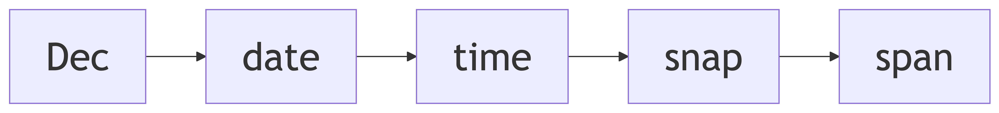
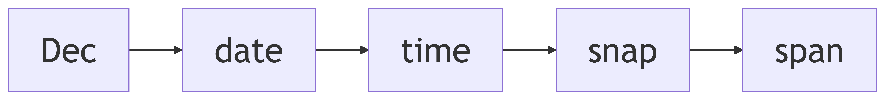

# Dec
Martin Laptev
2024+342

<div id="snapnavtop">

<div>



</div>

</div>

This article builds on the previous two [Dec](../../dec) articles on
[dates](../../dec/date)📅and [times](../../dec/time)⏳. A date
<span class="yellow">year</span>+<span class="cyan">day</span> and a
time <span class="cyan">.clock</span>-<span class="lime">z</span> can be
combined into a
snap🫰<span class="yellow">year</span>+<span class="cyan">day.clock</span>-<span class="lime">z</span>.
Like the
<span class="yellow">yyyy</span>-<span class="mulberry">mm</span>-<span class="magenta">dd</span>T<span class="hardwood">hh</span>:<span class="maroon">mm</span>:<span class="sienna">ss</span>+<span class="hardwood">hh</span>:<span class="maroon">mm</span>
[format](https://en.wikipedia.org/wiki/ISO_8601#Combined_date_and_time_representations:~:text=A%20single%20point%20in%20time%20can%20be%20represented%20by%20concatenating%20a%20complete%20date%20expression%2C%20the%20letter%20%22T%22%20as%20a%20delimiter%2C%20and%20a%20valid%20time%20expression)
of the
[ISO🌐8601](https://en.wikipedia.org/wiki/ISO_8601#:~:text=an%20international%20standard%20covering%20the%20worldwide%20exchange%20and%20communication%20of%20date%20and%20time%2Drelated%20data)
international date📅and time⏳standard, Dec snaps🫰represent a [point in
time](https://en.m.wikipedia.org/wiki/Instant#:~:text=an%20infinitesimal%20interval%20in%20time)
and organize their components from the largest to the smallest.

In between the <span class="yellow">year</span> and
<span class="lime">zone</span> of a Dec snap🫰is
<span class="cyan">day.clock</span>, a single number called a
<span class="cyan">day-of-year</span> (<span class="cyan under tool"
data-bs-toggle="tooltip" data-bs-title="day-of-year">doy</span>) which
serves the same purpose as the <span class="mulberry">month</span>,
<span class="magenta">day-of-month</span>
(<span class="magenta under tool" data-bs-toggle="tooltip"
data-bs-title="day-of-month">dom</span>),
<span class="hardwood">hour</span>, <span class="maroon">minute</span>,
and <span class="sienna">second</span> in between the year and time zone
in the ISO🌐format. The [integer
part](https://en.wikipedia.org/wiki/Decimal#:~:text=the%20integer%20written%20to%20the%20left%20of%20the%20decimal%20separator)
of the <span class="cyan under tool" data-bs-toggle="tooltip"
data-bs-title="day-of-year">doy</span>, <span class="cyan">day</span>,
identifies a specific day in the given year and its
[fractional](https://en.wikipedia.org/wiki/Fractional_part#:~:text=the%20excess%20beyond%20that%20number%27s%20integer%20part)
part is the time-of-day (<span class="cyan under tool"
data-bs-toggle="tooltip" data-bs-title="time-of-day">tod</span>):
<span class="cyan">.clock</span>.

The Dec snap🫰in the Zone <span class="lime">0</span> Dec time⏳zone,
<span class="yellow">${String(decYear).padStart(4,
“0”)}</span>+<span class="cyan">${String(decDate).padStart(3,
“0”)}</span>.<span class="cyan">${decTime.toFixed(5).slice(2)}</span>+<span class="lime">0</span>,
is equivalent to its ISO🌐8601
[counterpart](https://en.wikipedia.org/wiki/ISO_8601#Combined_date_and_time_representations:~:text=A%20single%20point%20in%20time%20can%20be%20represented%20by%20concatenating%20a%20complete%20date%20expression%2C%20the%20letter%20%22T%22%20as%20a%20delimiter%2C%20and%20a%20valid%20time%20expression)
in the
[UTC+<span class="maroon">00</span>:<span class="sienna">00</span>](https://en.wikipedia.org/wiki/UTC%2B00:00#:~:text=a%20time%20offset%20from%20UTC%20of%20%2B00%3A00)
time⏳zone: <span class="yellow">${String(isoYear).padStart(4,
“0”)}</span>-<span class="mulberry">${String(month).padStart(2,
“0”)}</span>-<span class="magenta">${String(decDotm).padStart(2,
“0”)}</span>T<span class="hardwood">${String(isoHour).padStart(2,
“0”)}</span>:<span class="maroon">${String(isoMinute).padStart(2,
“0”)}</span>:<span class="sienna">${String(isoSecond).padStart(2,
“0”)}</span>+<span class="hardwood">00</span>:<span class="maroon">00</span>.
In the current doy, <span class="cyan">${String(decDate).padStart(3,
“0”)}</span>.<span class="cyan">${decTime.toFixed(5).slice(2)}</span>,
the integer part, <span class="cyan">${String(decDate).padStart(3,
“0”)}</span>, corresponds to the
ISO🌐<span class="mulberry">month</span> and <span class="under tool"
data-bs-toggle="tooltip" data-bs-title="day-of-month">dom</span>,
<span class="mulberry">${String(month).padStart(2,
“0”)}</span>-<span class="magenta">${String(decDotm).padStart(2,
“0”)}</span>, and the fractional part,
.<span class="cyan">${decTime.toFixed(5).slice(2)}</span>, converts to
the ISO🌐<span class="hardwood">hour</span>,
<span class="maroon">minute</span>, and
<span class="sienna">second</span>:
T<span class="hardwood">${String(isoHour).padStart(2,
“0”)}</span>:<span class="maroon">${String(isoMinute).padStart(2,
“0”)}</span>:<span class="sienna">${String(isoSecond).padStart(2,
“0”)}</span>.

``` {ojs}
//| echo: false
viewof schedule = Inputs.radio([2, 3, 4, 5], {label: "Workdays per pent", value: 3})
viewof intervals = Inputs.form([
  interval([0, 1], {step: .01, value: [.3, .7], label: '0 or 5', width: 195, format: ([start, end]) => start === end ? "" : `${formatDecimal(start)}=${formatDecimal(end)}`}),
  interval([0, 1], {step: .01, value: [.3, .7], label: '1 or 6', width: 195, format: ([start, end]) => start === end ? "" : `${formatDecimal(start)}=${formatDecimal(end)}`}),
  interval([0, 1], {step: .01, value: [.3, .7], label: '2 or 7', width: 195, format: ([start, end]) => start === end ? "" : `${formatDecimal(start)}=${formatDecimal(end)}`}),
  interval([0, 1], {step: .01, value: [0, 0], label: '3 or 8', width: 195, format: ([start, end]) => start === end ? "" : `${formatDecimal(start)}=${formatDecimal(end)}`}),
  interval([0, 1], {step: .01, value: [0, 0], label: '4 or 9', width: 195, format: ([start, end]) => start === end ? "" : `${formatDecimal(start)}=${formatDecimal(end)}`}),
])
pentBar = Plot.plot({
  x: {label: "Day of the dek", labelOffset: 36, labelArrow: true, labelAnchor: "center"},
  style: {fontSize: "16px"},
  marginBottom: 40,
  marginLeft: 45,
  width: width,
  className: "pentbar",
  color: {scheme: "Set1", legend: "swatches", reverse: true, className: "pentbarlegend"},
  y: {label: "Proportion of the day", domain: [1, 0], tickPadding: 6, tickSize: -4, labelOffset: 44, labelArrow: true, labelAnchor: "center"},
  marks: [
  Plot.barY(durations, {x: "label", y: "duration", fill: "group"}),
  Plot.textY(
      durations,
      Plot.stackY(
        Plot.groupX(
          { y: "first", text: "first",
          },
          {
            x: "label",
            z: "group",
            y: "duration",
            text: (d) => (d.duration < .0001 ? null : formatDecimal(d.duration)),
            fill: "white",
            stroke: "black",
            fontSize: 28,
          }
        )
      )
    ),
  ]})
```

<div id="snapnavbtm">

<div>



</div>

</div>

``` {ojs}
//| echo: false
//| output: false
// http://howardhinnant.github.io/date_algorithms.html#civil_from_days
function unix2dote(unix, zone, offset = 719468) {
  return [(unix ?? Date.now()) / 86400000 + (
    zone = zone ?? -Math.round(
      (new Date).getTimezoneOffset() / 144)
    ) / 10 + offset, zone]
}
function dote2date(dote, zone = 0) {
  const cote = Math.floor((
      dote >= 0 ? dote
      : dote - 146096
    ) / 146097),
  dotc = dote - cote * 146097,
  yotc = Math.floor((dotc
    - Math.floor(dotc / 1460)
    + Math.floor(dotc / 36524)
    - Math.floor(dotc / 146096)
  ) / 365);
  return [
    yotc + cote * 400,
    dotc - (yotc * 365
      + Math.floor(yotc / 4)
      - Math.floor(yotc / 100)
  ), zone]}
dz = unix2dote(now, 0)
ydz = dote2date(...dz)
decYear = ydz[0]
decDate = Math.floor(ydz[1])
decTime = ydz[1] % 1
decDek = Math.floor(decDate / 10)
decDod = decDate % 10
decMoty = Math.floor((5 * decDate + 2) / 153)
decDotm = Math.floor(decDate - (153 * decMoty + 2) / 5 + 1)
isoYear = decYear + (decMoty > 9)
month = decMoty < 10 ? decMoty + 3 : decMoty - 9
decHour = decTime * 24
decMinute = (decHour % 1) * 60
decSecond = (decMinute % 1) * 60
isoHour = Math.floor(decHour)
isoMinute = Math.floor(decMinute)
isoSecond = Math.floor(decSecond)
isLeap = decYear % 4 == 0 && decYear % 100 != 0 || decYear % 400 == 0;
durations = [].concat(...nested)
nested = Array.from({length: intervals.length}, (_, i) => ([
  {
  label: `${i} or ${i+5}`,
  duration: intervals[i][1] !== intervals[i][0] ? intervals[i][0] : 1,
  group: "Rest"
},
  {
  label: `${i} or ${i+5}`,
  duration: intervals[i][1]-intervals[i][0],
  group: "Work"
},
  {
  label: `${i} or ${i+5}`,
  duration: intervals[i][1] !== intervals[i][0] ? 1-intervals[i][1] : null,
  group: "Rest"
  }]))
schedules = [
  [[.2, .8], [.2, .8], [0, 0], [0, 0], [0, 0]],
  [[.3, .7], [.3, .7], [.3, .7], [0, 0], [0, 0]],
  [[.35, .65], [.35, .65], [.35, .65], [.35, .65], [0, 0]],
  [[.38, .62], [.38, .62], [.38, .62], [.38, .62], [.38, .62]],
]
set(viewof intervals, schedules[schedule-2])
function interval(range = [], options = {}) {
  const [min = 0, max = 1] = range;
  const {
    step = .001,
    label = null,
    value = [min, max],
    format = ([start, end]) => `${start} … ${end}`,
    color,
    width,
    theme,
  } = options;
  const __ns__ = DOM.uid('scope').id;
  const css = `
#${__ns__} {
  font: 13px/1.2 var(--sans-serif);
  display: flex;
  align-items: baseline;
  flex-wrap: wrap;
  max-width: 100%;
  width: auto;
}
@media only screen and (min-width: 30em) {
  #${__ns__} {
    flex-wrap: nowrap;
    width: 360px;
  }
}
#${__ns__} .label {
  width: 60px;
  padding: 5px 0 4px 0;
  margin-right: .5px;
  flex-shrink: 0;
}
#${__ns__} .form {
  display: flex;
  width: 100%;
}
#${__ns__} .range {
  flex-shrink: 1;
  width: 100%;
}
#${__ns__} .range-slider {
  width: 100%;
}
  `;
  const $range = rangeInput({min, max, value: [value[0], value[1]], step, color, width, theme});
  const $output = html`<output>`;
  const $view = html`<div id=${__ns__}>
${label == null ? '' : html`<div class="label">${label}`}
<div class=form>
  <div class=range>
    ${$range}<div class=range-output style="display: inline-block;">${$output}</div>
  </div>
</div>
${html`<style>${css}`}
  `;
  const update = () => {
    const content = format([$range.value[0], $range.value[1]]);
    if(typeof content === 'string') $output.value = content;
    else {
      while($output.lastChild) $output.lastChild.remove();
      $output.appendChild(content);
    }
  };
  $range.oninput = update;
  update();
  return Object.defineProperty($view, 'value', {
    get: () => $range.value,
    set: ([a, b]) => {
      $range.value = [a, b];
      update();
    },
  });
}
function rangeInput(options = {}) {
  const {
    min = 0,
    max = 100,
    step = 'any',
    value: defaultValue = [min, max],
    color,
    width,
    theme = theme_Flat,
  } = options;
  const controls = {};
  const scope = randomScope();
  const clamp = (a, b, v) => v < a ? a : v > b ? b : v;
  const html = htl.html;
  // Will be used to sanitize values while avoiding floating point issues.
  const input = html`<input type=range ${{min, max, step}}>`;
  const dom = html`<div class=${`${scope} range-slider`} style=${{
    color,
    width: cssLength(width),
  }}>
  ${controls.track = html`<div class="range-track">
    ${controls.zone = html`<div class="range-track-zone">
      ${controls.range = html`<div class="range-select" tabindex=0>
        ${controls.min = html`<div class="thumb thumb-min" tabindex=0>`}
        ${controls.max = html`<div class="thumb thumb-max" tabindex=0>`}
      `}
    `}
  `}
  ${html`<style>${theme.replace(/:scope\b/g, '.'+scope)}`}
</div>`;
  let value = [], changed = false;
  Object.defineProperty(dom, 'value', {
    get: () => [...value],
    set: ([a, b]) => {
      value = sanitize(a, b);
      updateRange();
    },
  });
  const sanitize = (a, b) => {
    a = isNaN(a) ? min : ((input.value = a), input.valueAsNumber);
    b = isNaN(b) ? max : ((input.value = b), input.valueAsNumber);
    return [Math.min(a, b), Math.max(a, b)];
  }
  const updateRange = () => {
    const ratio = v => (v - min) / (max - min);
    dom.style.setProperty('--range-min', `${ratio(value[0]) * 100}%`);
    dom.style.setProperty('--range-max', `${ratio(value[1]) * 100}%`);
  };
  const dispatch = name => {
    dom.dispatchEvent(new Event(name, {bubbles: true}));
  };
  const setValue = (vmin, vmax) => {
    const [pmin, pmax] = value;
    value = sanitize(vmin, vmax);
    updateRange();
    // Only dispatch if values have changed.
    if(pmin === value[0] && pmax === value[1]) return;
    dispatch('input');
    changed = true;
  };
  setValue(...defaultValue);
  // Mousemove handlers.
  const handlers = new Map([
    [controls.min, (dt, ov) => {
      const v = clamp(min, ov[1], ov[0] + dt * (max - min));
      setValue(v, ov[1]);
    }],
    [controls.max, (dt, ov) => {
      const v = clamp(ov[0], max, ov[1] + dt * (max - min));
      setValue(ov[0], v);
    }],
    [controls.range, (dt, ov) => {
      const d = ov[1] - ov[0];
      const v = clamp(min, max - d, ov[0] + dt * (max - min));
      setValue(v, v + d);
    }],
  ]);
  // Returns client offset object.
  const pointer = e => e.touches ? e.touches[0] : e;
  // Note: Chrome defaults "passive" for touch events to true.
  const on  = (e, fn) => e.split(' ').map(e => document.addEventListener(e, fn, {passive: false}));
  const off = (e, fn) => e.split(' ').map(e => document.removeEventListener(e, fn, {passive: false}));
  let initialX, initialV, target, dragging = false;
  function handleDrag(e) {
    // Gracefully handle exit and reentry of the viewport.
    if(!e.buttons && !e.touches) {
      handleDragStop();
      return;
    }
    dragging = true;
    const w = controls.zone.getBoundingClientRect().width;
    e.preventDefault();
    handlers.get(target)((pointer(e).clientX - initialX) / w, initialV);
  }
  function handleDragStop(e) {
    off('mousemove touchmove', handleDrag);
    off('mouseup touchend', handleDragStop);
    if(changed) dispatch('change');
  }
  invalidation.then(handleDragStop);
  dom.ontouchstart = dom.onmousedown = e => {
    dragging = false;
    changed = false;
    if(!handlers.has(e.target)) return;
    on('mousemove touchmove', handleDrag);
    on('mouseup touchend', handleDragStop);
    e.preventDefault();
    e.stopPropagation();
    target = e.target;
    initialX = pointer(e).clientX;
    initialV = value.slice();
  };
  controls.track.onclick = e => {
    if(dragging) return;
    changed = false;
    const r = controls.zone.getBoundingClientRect();
    const t = clamp(0, 1, (pointer(e).clientX - r.left) / r.width);
    const v = min + t * (max - min);
    const [vmin, vmax] = value, d = vmax - vmin;
    if(v < vmin) setValue(v, v + d);
    else if(v > vmax) setValue(v - d, v);
    if(changed) dispatch('change');
  };
  return dom;
}
function randomScope(prefix = 'scope-') {
  return prefix + (performance.now() + Math.random()).toString(32).replace('.', '-');
}
function formatDecimal(number) {
  return number == 1 ? number : (Math.round(number * 100) / 100).toString().slice(1)
}
cssLength = v => v == null ? null : typeof v === 'number' ? `${v}px` : `${v}`
theme_Flat = `
/* Options */
:scope {
  color: #3b99fc;
  width: 240px;
}
:scope {
  position: relative;
  display: inline-block;
  --thumb-size: 15px;
  --thumb-radius: calc(var(--thumb-size) / 2);
  padding: var(--thumb-radius) 0;
  margin: 2px;
  vertical-align: middle;
}
:scope .range-track {
  box-sizing: border-box;
  position: relative;
  height: 7px;
  background-color: hsl(0, 0%, 80%);
  overflow: visible;
  border-radius: 4px;
  padding: 0 var(--thumb-radius);
}
:scope .range-track-zone {
  box-sizing: border-box;
  position: relative;
}
:scope .range-select {
  box-sizing: border-box;
  position: relative;
  left: var(--range-min);
  width: calc(var(--range-max) - var(--range-min));
  cursor: ew-resize;
  background: currentColor;
  height: 7px;
  border: inherit;
}
/* Expands the hotspot area. */
:scope .range-select:before {
  content: "";
  position: absolute;
  width: 100%;
  height: var(--thumb-size);
  left: 0;
  top: calc(2px - var(--thumb-radius));
}
:scope .range-select:focus,
:scope .thumb:focus {
  outline: none;
}
:scope .thumb {
  box-sizing: border-box;
  position: absolute;
  width: var(--thumb-size);
  height: var(--thumb-size);
  background: #fcfcfc;
  top: -4px;
  border-radius: 100%;
  border: 1px solid hsl(0,0%,55%);
  cursor: default;
  margin: 0;
}
:scope .thumb:active {
  box-shadow: inset 0 var(--thumb-size) #0002;
}
:scope .thumb-min {
  left: calc(-1px - var(--thumb-radius));
}
:scope .thumb-max {
  right: calc(-1px - var(--thumb-radius));
}
`
move = {
  d3.select(pentBar)
    .select("div")
    .raise() // Places swatch below the plot
    .style("float", "right"); // Floats the swatch on the right.
}
```

<style>
.pentbarlegend-swatch {
  font-size: 19px;
}
</style>
