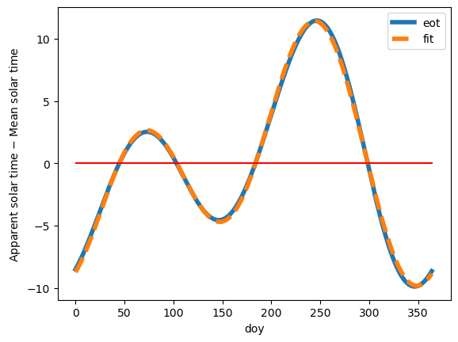
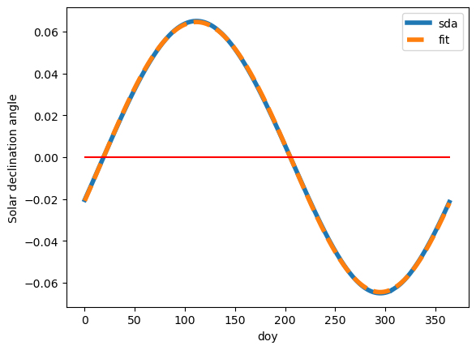

# Bonus examples

Author

[Martin Laptev](https://maptv.github.io)

Published

1764870764

Modified

2025+278

    In [1]:

``` python
import numpy as np
import polars as pl
from mpmath import sinpi, cospi
from scipy.optimize import curve_fit
```

    In [2]:

``` python
root =  "https://gml.noaa.gov/grad/solcalc/"
stem = "NOAA_Solar_Calculations_year"
```

    In [3]:

``` python
df = pl.read_ods(
    stem + ".ods" # local file
    # root + stem + ".ods" # url
)
```

    Could not determine dtype for column 2, falling back to string
    Could not determine dtype for column 7, falling back to string

    In [4]:

``` python
def ymdhms2doe(datecol: str, timecol: str, outcol: str) -> pl.Expr:
    return (
        pl.col(datecol).dt.epoch(time_unit="s")
        / 86400
        + pl.col(timecol)
        + 719468
    ).alias(outcol)
```

    In [5]:

``` python
def doe2coe(incol: str, outcol: str) -> pl.Expr:
    incol_expr = pl.col(incol)
    return (
        pl.when(incol_expr >= 0)
        .then(incol_expr)
        .otherwise(incol_expr - 146096)
        // 146097
    ).alias(outcol)
```

    In [6]:

``` python
def coe2doc(doecol: str, coecol: str, outcol: str) -> pl.Expr:
    return (
        pl.col(doecol)
        - pl.col(coecol)
        * 146097
    ).alias(outcol)
```

    In [7]:

``` python
def doc2yoc(incol: str, outcol: str) -> pl.Expr:
    incol_expr = pl.col(incol)
    return ((
        incol_expr
        - incol_expr // 1460
        + incol_expr // 36524
        - incol_expr // 146096
        ) // 365
    ).alias(outcol)
```

    In [8]:

``` python
def yoc2yoe(yoccol: str, coecol: str, outcol: str) -> pl.Expr:
    return (
        pl.col(yoccol) + pl.col(coecol) * 400
    ).cast(pl.Int32).alias(outcol)
```

    In [9]:

``` python
def yoc2yda(doccol: str, yoccol: str, outcol: str) -> pl.Expr:
    yoccol_expr = pl.col(yoccol)
    return (
        pl.col(doccol) - (
            yoccol_expr * 365
            + yoccol_expr // 4
            - yoccol_expr // 100
        )).alias(outcol)
```

    In [10]:

``` python
def yda2doy(incol: str, outcol: str) -> pl.Expr:
    return pl.col(incol).floor().cast(pl.Int32).alias(outcol)
```

    In [11]:

``` python
def yda2toy(incol: str, diy: int, outcol: str) -> pl.Expr:
    return (pl.col(incol) / diy).alias(outcol)
```

    In [12]:

``` python
def min2cd(incol: str, outcol: str) -> pl.Expr:
    return (pl.col(incol) / 1.44).alias(outcol)
```

    In [13]:

``` python
df = (
    df.with_columns(ymdhms2doe(
        "Date",
        "Time (hrs past local midnight)",
        "doe",
    )).with_columns(doe2coe(
        "doe", "coe"
    )).with_columns(coe2doc(
        "doe", "coe", "doc",
    )).with_columns(doc2yoc(
        "doc", "yoc",
    )).with_columns(
        yoc2yoe("yoc", "coe", "yoe"),
        yoc2yda("doc", "yoc", "yda"),
    ).with_columns(
        yda2toy("yda", 365, "toy"),
        yda2doy("yda", "doy"),
        min2cd(
            "Eq of Time (minutes)",
            "eot",
        )
    )
)
```

    In [14]:

``` python
df.select(["yoe", "yda", "doy", "toy", "eot"]).head()
```

shape: (5, 5)

| yoe  | yda   | doy | toy      | eot       |
|------|-------|-----|----------|-----------|
| i32  | f64   | i32 | f64      | f64       |
| 2025 | 306.5 | 306 | 0.839726 | -2.572193 |
| 2025 | 307.5 | 307 | 0.842466 | -2.895113 |
| 2025 | 308.5 | 308 | 0.845205 | -3.213904 |
| 2025 | 309.5 | 309 | 0.847945 | -3.528227 |
| 2025 | 310.5 | 310 | 0.850685 | -3.837754 |

    In [15]:

``` python
costau = np.vectorize(lambda x: np.float64(cospi(2 * x)))
```

    In [16]:

``` python
sintau = np.vectorize(lambda x: np.float64(sinpi(2 * x)))
```

    In [17]:

``` python
costau([0, .25, .5, .75, 1])
```

    array([ 1.,  0., -1.,  0.,  1.])

    In [18]:

``` python
sintau([0, .25, .5, .75, 1])
```

    array([ 0.,  1.,  0., -1.,  0.])

    In [19]:

``` python
def model(toy, p0, p1, p2, p3, p4):
    return (
        p0 +
        p1 * costau(toy) +
        p2 * sintau(toy) +
        p3 * costau(2 * toy) +
        p4 * sintau(2 * toy)
    )
```

    In [20]:

``` python
popt, pcov = curve_fit(model, df["toy"], df["eot"])
dict(enumerate(popt.tolist()))
```

    {0: 0.0011114386869002235,
     1: -4.155124400404918,
     2: -2.9710873225303756,
     3: -4.635570414590801,
     4: 5.116176940364264}

    In [21]:

``` python
df = df.with_columns(pl.Series(name="fit", values=model(df["toy"], *popt)))
```

    In [22]:

``` python
df["fit"].max()
```

    11.409907228557664

    In [23]:

``` python
df["fit"].min()
```

    -9.81710322341188

    In [24]:

``` python
plotopts = {"linewidth": 4, "legend": True, "x": "doy"}
```

    In [25]:

``` python
plotdf = df.to_pandas().sort_values("doy")
ax = plotdf.plot(
    y="eot",
    xlabel="Day of year",
    ylabel=r"Apparent solar time $-$ Mean solar time",
    **plotopts
)
plotdf.plot(
    y="fit",
    linestyle="--",
    ax=ax,
    **plotopts
).hlines(y=0, xmin=0, xmax=365, color='r', linestyle='-');
```

[](eot_files/figure-html/cell-26-output-1.png)

    In [26]:

``` python
df = df.with_columns((pl.col("Sun Declin (deg)") / 360).alias("sda"))
```

    In [27]:

``` python
popt, pcov = curve_fit(model, df["toy"], df["sda"])
dict(enumerate(popt.tolist()))
```

    {0: 0.001091553079960761,
     1: -0.023117708562197206,
     2: 0.060320423699681706,
     3: 0.0006152631125526081,
     4: 0.0008981745798778195}

    In [28]:

``` python
df = df.with_columns(pl.Series(name="fit", values=model(df["toy"], *popt)))
```

    In [29]:

``` python
plotdf = df.to_pandas().sort_values("doy")
ax = plotdf.plot(
    y="sda",
    xlabel="Day of year",
    ylabel=r"Solar declination angle",
    **plotopts
)
plotdf.plot(
    y="fit",
    linestyle="--",
    ax=ax,
    **plotopts
).hlines(y=0, xmin=0, xmax=365, color='r', linestyle='-');
```

[](eot_files/figure-html/sdaplot-output-1.png)

    In [30]:

``` python
import math
```

    In [31]:

``` python
def get_sunrise_sha(sdacol, lat=0.1):
    sdacol_expr = pl.col(sdacol)
    return ((((
        math.cos(.2523 * 2 * math.pi)
        - math.sin(lat * 2 * math.pi)
        * (sdacol_expr * 2 * math.pi).sin()
    ) / (
        math.cos(lat * 2 * math.pi)
        * (sdacol_expr * 2 * math.pi).cos()
    )) % 1).arccos()
            / (2 * math.pi)
            * 360
           ).alias("sha")
```

    In [32]:

``` python
df = df.with_columns(get_sunrise_sha("sda"))
```

    In [33]:

``` python
df.select(["doy", "sha", "HA Sunrise (deg)"])
```

shape: (366, 3)

| doy | sha       | HA Sunrise (deg) |
|-----|-----------|------------------|
| i32 | f64       | f64              |
| 306 | 73.245535 | 73.252543        |
| 307 | 73.325806 | 73.332806        |
| 308 | 73.412633 | 73.419625        |
| 309 | 73.505937 | 73.512921        |
| 310 | 73.605635 | 73.61261         |
| …   | …         | …                |
| 302 | 72.979995 | 72.987029        |
| 303 | 73.031716 | 73.038745        |
| 304 | 73.090262 | 73.097285        |
| 305 | 73.155579 | 73.162596        |
| 306 | 73.227608 | 73.234618        |

    In [34]:

``` python
# All in one go
df = df.with_columns(
    (pl.col("Date")
    .dt.epoch(time_unit="s")
    / 86400
    + pl.col("Time (hrs past local midnight)")
    + 719468
).alias("doe")).with_columns(
    (pl.when(pl.col("doe") >= 0)
       .then(pl.col("doe") // 146097)
       .otherwise((pl.col("doe") - 146096) // 146097)
).alias("coe")).with_columns(
    (pl.col("doe")
     - pl.col("coe")
     * 146097
).alias("doc")).with_columns(
    ((pl.col("doc")
      - pl.col("doc") // 1460
      + pl.col("doc") // 36524
      - pl.col("doc") // 146096
     ) // 365
).alias("yoc")).with_columns(
    (pl.col("yoc") + pl.col("coe") * 400
    ).cast(pl.Int32).alias("yoe"),
    (pl.col("doc") -
     (pl.col("yoc") * 365
      + pl.col("yoc") // 4
      - pl.col("yoc") // 100
     )).alias("yda"),
    (pl.col("Eq of Time (minutes)")
     / 1.44
).alias("eot")).with_columns(
    (pl.col("yda")
     / 365
    ).alias("toy")).with_columns(
    pl.col("yda")
    .floor()
    .cast(pl.Int32)
    .alias("doy")
)
```

    In [35]:

``` python
# simple Python function
def unix2yd(unix):
    doe = unix / 86400 + 719468
    coe = (
        doe if doe >= 0
        else doe - 146096
    ) // 146097
    doc = doe - coe * 146097
    yoc = (doc
        - doc // 1460
        + doc // 36524
        - doc // 146096
    ) // 365
    return [
        int(yoc + coe * 400),
        doc - (yoc * 365
            + yoc // 4
            - yoc // 100
    )]
```

Back to top
