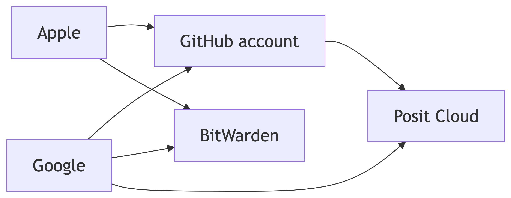
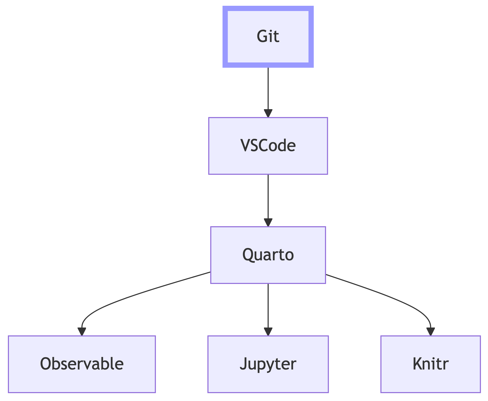
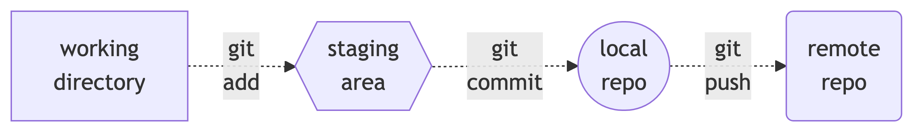

# Git
Martin Laptev
2025+356

- [<span class="toc-section-number">0.1</span> <span class="tool"
  data-bs-toggle="tooltip"
  data-bs-title="too long; didn't read">TL;DR</span>](#tldr)
- [<span class="toc-section-number">0</span> Git version control
  system](#sec-git)
  - [<span class="toc-section-number">1.1</span> Git set, git ready,
    go!](#sec-set)
  - [<span class="toc-section-number">1.2</span> Navigation
    Chart](#navigation-chart)
  - [<span class="toc-section-number">1.3</span>
    Introduction](#sec-intro)
  - [<span class="toc-section-number">1.4</span> Setup](#sec-setup)
    - [<span class="toc-section-number">1.4.1</span>
      Homebrew](#sec-setup-brew)
    - [<span class="toc-section-number">1.4.2</span>
      Authentication](#sec-setup-auth)
    - [<span class="toc-section-number">1.4.3</span>
      Repository](#sec-setup-repo)
  - [<span class="toc-section-number">1.5</span> Git
    workflow](#sec-workflow)
    - [<span class="toc-section-number">1.5.1</span> Shell
      aliases](#sec-workflow-alias)
    - [<span class="toc-section-number">1.5.2</span>
      Keybindings](#sec-workflow-key)

## <span class="tool" data-bs-toggle="tooltip" data-bs-title="too long; didn't read">TL;DR</span>

1.  Use a pre-existing or newly-created
    [Google](https://www.google.com/account/about) account to [create a
    new GitHub account](https://github.com/signup).
2.  [Log into GitHub](https://github.com/login)
3.  Click the Plus (`+`) sign on the navigation bar of the GitHub
    Dashboard and then click “New repository”.
4.  Give your repository (repo) a name and then click “Create
    repository”.
5.  Complete either Option 0 or 1 below:
    1.  Click “Create a codespace”
    2.  Create a new Posit Cloud project by
        - Copying the [uniform resource
          locator](https://en.wikipedia.org/wiki/URL#:~:text=a%20reference%20to%20a%20resource%20on%20the%20World%20Wide%20Web)
          (<a href="#url" id="uniformresourcelocator" class="tool"
          data-bs-toggle="tooltip"
          data-bs-title="uniform resource locator">url</a>) of your
          repo,
        - using your GitHub or Google account to create a new [Posit
          Cloud](https://login.posit.cloud/register) account,
        - clicking “New Project”,
        - clicking “New Project from Git repository”,
        - pasting in the repo
          <a href="#url" class="tool" data-bs-toggle="tooltip"
          data-bs-title="uniform resource locator">url</a>, and
        - clicking “OK”.

# Git version control system

[Git](https://en.wikipedia.org/wiki/Git#:~:text=Git%20(/%C9%A1%C9%AAt/)%5B8%5D%20is%20a%20distributed%20version%20control%20system%5B9%5D%20that%20tracks%20changes%20in%20any%20set%20of%20computer%20files%2C%20usually%20used%20for%20coordinating%20work%20among%20programmers%20who%20are%20collaboratively%20developing%20source%20code%20during%20software%20development)
is a [version
control](https://en.wikipedia.org/wiki/Version_control#:~:text=version%20control%20(also%20known%20as%20revision%20control%2C%20source%20control%2C%20or%20source%20code%20management)%20is%20a%20class%20of%20systems%20responsible%20for%20managing%20changes%20to%20computer%20programs%2C%20documents%2C%20large%20web%20sites%2C%20or%20other%20collections%20of%20information)
system developed by
[Linux](https://en.wikipedia.org/wiki/Linux#:~:text=Linux%20(/%CB%88l%C9%AAn%CA%8Aks/%20LIN%2Duuks)%5B11%5D%20is%20a%20family%20of%20open%2Dsource%20Unix%2Dlike%20operating%20systems%20based%20on%20the%20Linux%20kernel%2C%5B12%5D%20an%20operating%20system%20kernel%20first%20released%20on%20September%2017%2C%201991%2C%20by%20Linus%20Torvalds)
creator [Linus
Torvalds](https://en.wikipedia.org/wiki/Linus_Torvalds#:~:text=creator%20and%20lead%20developer%20of%20the%20Linux%20kernel%20since%201991.%20He%20also%20created%20the%20distributed%20version%20control%20system%20Git).
Since its first release on <span class="tool" data-bs-toggle="tooltip"
data-bs-title="April 7, 2005">2005+037</span>, Git has largely replaced
other version control systems and is used by 93% of
[software](https://en.wikipedia.org/wiki/Software#:~:text=Software%20is%20a%20set%20of%20computer%20programs%20and%20associated%20documentation%20and%20data)
developers worldwide, according to [survey
results](https://stackoverflow.blog/2023/01/09/beyond-git-the-other-version-control-systems-developers-use/#:~:text=Our%20developer%20survey%20found%2093%25%20of%20developers%20use%20Git)
published by [StackOverflow](https://stackoverflow.com/tour) on
<span class="tool" data-bs-toggle="tooltip"
data-bs-title="2023-01-09">2022+314</span>.

Thanks to Git, I can sleep💤soundly at night, reassured by the knowledge
that all of my progress on all of my ongoing projects is recorded. My
progress is not only stored on my local computer, but also on the
servers of [Git repository
hosts](https://en.wikipedia.org/wiki/Git#:~:text=Git%20repository%20services%2C%20including%20GitHub%2C%20SourceForge%2C%20Bitbucket%20and%20GitLab.%5B)
such as
[GitHub](https://en.wikipedia.org/wiki/GitHub#:~:text=GitHub%2C%20Inc.%20(/%CB%88%C9%A1%C9%AAth%CA%8Cb/%5Ba%5D)%20is%20a%20platform%20and%20cloud%2Dbased%20service%20for%20software%20development%20and%20version%20control%2C%20allowing%20developers%20to%20store%20and%20manage%20their%20code.)
and [GitLab](https://en.wikipedia.org/wiki/GitLab).

A Git
[repository](https://en.wikipedia.org/wiki/Repository_(version_control)#:~:text=In%20version%20control%20systems%2C%20a%20repository%20is%20a%20data%20structure%20that%20stores%20metadata%20for%20a%20set%20of%20files%20or%20directory%20structure.)
(repo) is a
[directory](https://en.wikipedia.org/wiki/Directory_(computing)#:~:text=a%20directory%20is%20a%20file%20system%20cataloging%20structure%20which%20contains%20references%20to%20other%20computer%20files%2C%20and%20possibly%20other%20directories.)
that tracks the changes made to its contents. For more information on
GitHub, the largest Git repo host, take a look at the <span class="tool"
data-bs-toggle="tooltip" data-bs-title="May 27, 2022">2022+088</span>
[“GitHub for supporting, reusing, contributing, and failing
safely”](https://openscapes.org/blog/2022-05-27-github-illustrated-series/)
post by [Allison Horst](https://allisonhorst.com) and [Julie
Lowndes](https://jules32.github.io) on the
[Openscapes](https://openscapes.org)
[blog](https://openscapes.org/blog).

GitHub and GitLab do not only host repos, but also websites via [GitHub
Pages](https://docs.github.com/en/pages) and [GitLab
Pages](https://docs.gitlab.com/user/project/pages). In addition to
providing basic web hosting for free, GitHub and GitLab offer free
access to [continuous
integration](https://en.wikipedia.org/wiki/Continuous_integration#:~:text=In%20software%20engineering%2C%20continuous%20integration%20(CI)%20is%20the%20practice%20of%20merging%20all%20developers%27%20working%20copies%20to%20a%20shared%20mainline%20several%20times%20a%20day)
systems called [GitHub Actions](https://docs.github.com/en/actions) and
[GitLab CI/CD](https://docs.gitlab.com/ee/ci) that can automatically
[build](https://en.wikipedia.org/wiki/Software_build) and
[deploy](https://en.wikipedia.org/wiki/Software_deployment#:~:text=Software%20deployment%20is%20all%20of%20the%20activities%20that%20make%20a%20software%20system%20available%20for%20use)
software.

Another advantage of using Git is the availability of free web-based
editors, such as [github.dev](https://github.dev/github/dev),
[vscode.dev](https://vscode.dev), and [GitLab
web](https://docs.gitlab.com/user/project/web_ide) [integrated
development
environment](https://en.wikipedia.org/wiki/Integrated_development_environment#:~:text=software%20that%20provides%20a%20relatively%20comprehensive%20set%20of%20features%20for%20software%20development)
(<a href="#ide" class="tool" data-bs-toggle="tooltip"
data-bs-title="integrated development environment">ide</a>), that make
it possible to modify repo contents via a [web
browser](https://en.wikipedia.org/wiki/Web_browser#:~:text=an%20application%20for%20accessing%20websites)
without the need to keep local copies of repos or have anything
installed locally. [Cloud
computing](https://en.wikipedia.org/wiki/Cloud_computing#:~:text=shareable%20physical%20or%20virtual%20resources)
platforms like [GitHub
Codespaces](https://github.com/features/codespaces) and [Posit
Cloud](https://posit.cloud) offer the same benefits of web-based
editors, but also provide compute for running code and building
software, thus enabling remote development on any computer with a web
browser.

Before you can benefit from everything Git has to offer, you will need
to set up your computer so that you can work locally or configure a
service like GitHub Codespaces for remote development in your web
browser. My setup for local development requires a high level of
technical skill and relies on the [Homebrew](https://brew.sh) [package
manager](https://en.wikipedia.org/wiki/Package_manager#:~:text=A%20package%20manager%20or%20package%2Dmanagement%20system%20is%20a%20collection%20of%20software%20tools%20that%20automates%20the%20process%20of%20installing%2C%20upgrading%2C%20configuring%2C%20and%20removing%20computer%20programs%20for%20a%20computer%20in%20a%20consistent%20manner.),
which is currently only available for
[macOS](https://en.wikipedia.org/wiki/MacOS#:~:text=the%20current%20operating%20system%20for%20Apple%27s%20Mac%20computers)
and [Linux](https://www.linux.org). For a universal approach to git, I
recommend using the [usethis](https://usethis.r-lib.org) software
package to set up git in Posit Cloud or GitHub Codespaces.

The web interface provided by Posit Cloud is based on the
[RStudio](https://posit.co/products/open-source/rstudio)
<a href="#ide" class="tool" data-bs-toggle="tooltip"
data-bs-title="integrated development environment">ide</a>. Similarly,
the [Visual Studio Code](https://code.visualstudio.com) (VSCode)
<a href="#ide" class="tool" data-bs-toggle="tooltip"
data-bs-title="integrated development environment">ide</a> serves as the
main GitHub Codespaces interface. While using an
<a href="#ide" class="tool" data-bs-toggle="tooltip"
data-bs-title="integrated development environment">ide</a> is
undoubtedly more difficult than using a dedicated Git [graphical user
interface](https://git-scm.com/tools/guis)
(<a href="#gui" id="graphicaluserinterface" class="tool"
data-bs-toggle="tooltip"
data-bs-title="graphical user interface">gui</a>) like [GitHub
Desktop](https://docs.github.com/en/desktop), it is the only way to get
everyone on the same page📖regardless of what operating system they use.

## Git set, git ready, go!

GitI you follow along to end of this article, you will have authenticate
into Posit Cloud Google or Apple account repo called `dotfiles` that can
be used for Codespaces setup. I cover how to set up Codespaces and
GitPod in my [next blog post](../vscode), which focuses on the [Visual
Studio Code](https://code.visualstudio.com) (VSCode) and
[VSCodium](https://vscodium.com) [source-code
editors](https://en.wikipedia.org/wiki/Source-code_editor#:~:text=A%20source%2Dcode%20editor%20is%20a%20text%20editor%20program%20designed%20specifically%20for%20editing%20source%20code%20of%20computer%20programs.).

The first step to getting started is creating an account for a git host
like [GitHub](https://github.com) and a [password
manager](https://en.wikipedia.org/wiki/Password_manager#:~:text=a%20software%20program%20that%20prevents%20password%20fatigue%20by%20automatically%20generating%2C%20autofilling%2C%20and%20storing%20passwords)
such as [BitWarden](https://bitwarden.com). For
[GitHub](https://github.com/signup) account creation, you can use an
[Apple](https://support.apple.com/apple-account) or
[Google](https://www.google.com/account/about) account.

I introduce the
[git](https://en.wikipedia.org/wiki/Git#:~:text=Git%20(/%C9%A1%C9%AAt/)%5B8%5D%20is%20a%20distributed%20version%20control%20system%5B9%5D%20that%20tracks%20changes%20in%20any%20set%20of%20computer%20files%2C%20usually%20used%20for%20coordinating%20work%20among%20programmers%20who%20are%20collaboratively%20developing%20source%20code%20during%20software%20development.)
[version
control](https://en.wikipedia.org/wiki/Version_control#:~:text=version%20control%20(also%20known%20as%20revision%20control%2C%20source%20control%2C%20or%20source%20code%20management)%20is%20a%20class%20of%20systems%20responsible%20for%20managing%20changes%20to%20computer%20programs%2C%20documents%2C%20large%20web%20sites%2C%20or%20other%20collections%20of%20information)
system. Personally, I use git via a [command line
interfaces](https://en.wikipedia.org/wiki/Command-line_interface#:~:text=A%20command%2Dline%20interface%20(CLI)%20is%20a%20means%20of%20interacting%20with%20a%20computer%20program%20by%20inputting%20lines%20of%20text%20called%20command%2Dlines)
(<a href="#cli" id="commandlineinterface" class="tool"
data-bs-toggle="tooltip" data-bs-title="command line interface">cli</a>),
but this requires a high level of technical skill and training. As an
alternative to <a href="#cli" class="tool" data-bs-toggle="tooltip"
data-bs-title="command line interfaces">cli</a>, I typically recommend
using a git [graphical user interface](https://git-scm.com/tools/guis)
(<a href="#gui" id="graphicaluserinterface" class="tool"
data-bs-toggle="tooltip"
data-bs-title="graphical user interface">gui</a>) client like [GitHub
Desktop](https://docs.github.com/en/desktop). Even I, a self-proclaimed
<a href="#cli" class="tool" data-bs-toggle="tooltip"
data-bs-title="command line interface">cli</a> guru, have switched to a
<a href="#gui" class="tool" data-bs-toggle="tooltip"
data-bs-title="graphical user interface">gui</a> in a pinch🤏.

https://docs.github.com/en/codespaces/the-githubdev-web-based-editor
Even though the installation, setup, and use of GitHub Desktop are
relatively straightforward, it is currently only available to [macOS]()
and [Windows]() users. To support users of other operating systems, such
as [Android](https://www.android.com),
[ChromeOS](https://chromeos.google),
[iOS](https://www.apple.com/os/ios/), and
[Linux](https://www.linux.org), I recommend using git via an [integrated
development
environment](https://en.wikipedia.org/wiki/Integrated_development_environment#:~:text=software%20that%20provides%20a%20relatively%20comprehensive%20set%20of%20features%20for%20software%20development)
(<a href="#ide" class="tool" data-bs-toggle="tooltip"
data-bs-title="integrated development environment">ide</a>) like
[RStudio](https://posit.co/products/open-source/rstudio) or
[Positron](https://posit.co/products/ide/positron).

With a Google or GitHub account, you can also create a [Posit
Cloud](https://posit.cloud) account, which is a web browser-based
version of the RStudio
<a href="#ide" class="tool" data-bs-toggle="tooltip"
data-bs-title="integrated development environment">ide</a>. If you
prefer the Visual Studio Code
<a href="#ide" class="tool" data-bs-toggle="tooltip"
data-bs-title="integrated development environment">ide</a>, you can use
your GitHub account to that can be used for free with a GitHub or GitLab
account. Posit Cloud is a great option for users who want to use RStudio
but do not have access to a computer that can run it locally. It also
provides a seamless way to work with GitHub and GitLab repos without
having to set up anything locally. To create a
[BitWarden](https://bitwarden.com) account, you will need an email
address, such as the one connected to your
[Apple](https://support.apple.com/apple-account) or
[Google](https://www.google.com/account/about) account. The
[mermaid](https://mermaid.ai) diagram below shows the recommended order
of account creation steps.

<div id="accounts">

<div>



</div>

</div>

Along the way you will also learn about the and the [command line
interfaces](https://en.wikipedia.org/wiki/Command-line_interface#:~:text=A%20command%2Dline%20interface%20(CLI)%20is%20a%20means%20of%20interacting%20with%20a%20computer%20program%20by%20inputting%20lines%20of%20text%20called%20command%2Dlines.)
(CLIs) for the [GitHub](https://github.com) and
[GitLab](https://gitlab.com) Git [repository
hosts](https://en.wikipedia.org/wiki/Git#:~:text=Git%20repository%20services%2C%20including%20GitHub%2C%20SourceForge%2C%20Bitbucket%20and%20GitLab.%5B)
to create a Git
[repository](https://en.wikipedia.org/wiki/Repository_(version_control)#:~:text=In%20version%20control%20systems%2C%20a%20repository%20is%20a%20data%20structure%20that%20stores%20metadata%20for%20a%20set%20of%20files%20or%20directory%20structure.)
that contains setup files for the
[Codespaces](https://github.com/features/codespaces) and
[GitPod](https://www.gitpod.io) [computing
platforms](https://en.wikipedia.org/wiki/Computing_platform#:~:text=A%20computing%20platform%2C%20digital%20platform%2C%5B1%5D%20or%20software%20platform%20is%20an%20environment%20in%20which%20software%20is%20executed.).

## Navigation Chart

<a href="#fig-navchart" class="quarto-xref">Figure 1</a> summarizes the
relationship between this post (highlighted with a
<span style="color: #88f;">violet</span> border) and the subsequent
posts in my [Tools](..#category=tool) blog post series. Click/tap on a
node in <a href="#fig-navchart" class="quarto-xref">Figure 1</a> to
navigate to the corresponding post. If you cannot see
<a href="#fig-navchart" class="quarto-xref">Figure 1</a>, rotate your
smartphone screen to a horizontal (landscape) position.

<div>



</div>

## Introduction

## Setup

### Homebrew

[Linux](https://en.wikipedia.org/wiki/Linux#:~:text=Linux%20(/%CB%88l%C9%AAn%CA%8Aks/%20LIN%2Duuks)%5B11%5D%20is%20a%20family%20of%20open%2Dsource%20Unix%2Dlike%20operating%20systems),
[macOS](https://en.wikipedia.org/wiki/MacOS#:~:text=macOS%20(/%CB%8Cm%C3%A6ko%CA%8A%CB%88%C9%9Bs/%3B%5B6%5D%20previously%20OS%C2%A0X%20and%20originally%20Mac%C2%A0OS%C2%A0X)%20is%20an%20operating%20system%20developed%20and%20marketed%20by%20Apple%20Inc.%20since%202001.),
or [Windows Subsystem for
Linux](https://en.wikipedia.org/wiki/Windows_Subsystem_for_Linux#:~:text=Windows%20Subsystem%20for%20Linux%20(WSL)%20is%20a%20feature%20of%20Windows%20that%20allows%20developers%20to%20run%20a%20Linux%20environment%20without%20the%20need%20for%20a%20separate%20virtual%20machine%20or%20dual%20booting.)
(WSL) users can install everything needed to work through all of the
examples in this blog post via the Homebrew\](https://brew.sh) package
manager. First, [install Homebrew](https://brew.sh/#install) itself with
the latest [`.pkg` installer](https://github.com/Homebrew/brew/releases)
for macOS or by running the
<a href="#exm-brew" class="quarto-xref">Example 1</a>
[Unix](https://en.wikipedia.org/wiki/Unix#:~:text=Unix%20(/%CB%88ju%CB%90n%C9%AAks/%2C%20YOO%2Dniks%3B%20trademarked%20as%20UNIX)%20is%20a%20family%20of%20multitasking%2C%20multi%2Duser%20computer%20operating%20systems)
[shell](https://en.wikipedia.org/wiki/Unix_shell#:~:text=A%20Unix%20shell%20is%20a%20command%2Dline%20interpreter%20or%20shell%20that%20provides%20a%20command%20line%20user%20interface%20for%20Unix%2Dlike%20operating%20systems.)
code in your
[terminal](https://en.wikipedia.org/wiki/Terminal_emulator#:~:text=A%20terminal%20emulator%2C%20or%20terminal%20application%2C%20is%20a%20computer%20program%20that%20emulates%20a%20video%20terminal%20within%20some%20other%20display%20architecture.).

<div id="exm-brew" class="theorem example">

<span class="theorem-title">**Example 1**</span>  

``` sh
/bin/bash -c "$(curl -fsSL https://\
raw.githubusercontent.com/Homebrew/\
install/HEAD/install.sh)"
```

</div>

If you are not completely satisfied with the terminal that comes with
your [operating
system](https://en.wikipedia.org/wiki/Operating_system#:~:text=An%20operating%20system%20(OS)%20is%20system%20software%20that%20manages%20computer%20hardware%20and%20software%20resources%2C%20and%20provides%20common%20services%20for%20computer%20programs.)
(OS), you can use Homebrew to install a new terminal. The terminals I
use most often are the
[iTerm2](https://formulae.brew.sh/cask/iterm2#default) standalone
terminal and the integrated terminal built into my preferred
[source-code
editor](https://en.wikipedia.org/wiki/Source-code_editor#:~:text=A%20source%2Dcode%20editor%20is%20a%20text%20editor%20program%20designed%20specifically%20for%20editing%20source%20code%20of%20computer%20programs.)
VSCodium. Unfortunately, iTerm2 is only for macOS, but there is an
abundance of great multi-OS standalone terminals, such as
[Alacritty](https://formulae.brew.sh/cask/alacritty#default),
[Hyper](https://formulae.brew.sh/cask/hyper#default),
[Kitty](https://formulae.brew.sh/cask/kitty#default), and
[Tabby](https://formulae.brew.sh/cask/tabby#default).

After installing Homebrew, you can run `brew` `doctor` in your terminal
to confirm that everything is set up correctly. If the `brew` command is
not available, you need to follow the instructions provided after
installation to add `brew` to your [PATH
variable](https://en.wikipedia.org/wiki/PATH_(variable)#:~:text=PATH%20is%20an%20environment%20variable%20on%20Unix%2Dlike%20operating%20systems%2C%20DOS%2C%20OS/2%2C%20and%20Microsoft%20Windows%2C%20specifying%20a%20set%20of%20directories%20where%20executable%20programs%20are%20located.).

Once Homebrew is ready, you can run the shell code in
<a href="#exm-echo" class="quarto-xref">Example 2</a> to create a file
called `Brewfile` with the
[`echo`](https://en.wikipedia.org/wiki/Echo_(command)#:~:text=echo%20is%20a%20command%20that%20outputs%20the%20strings%20that%20are%20passed%20to%20it%20as%20arguments.)
shell command and install everything listed in this newly created
[`Brewfile`](https://homebrew-file.readthedocs.io/en/latest/usage.html)
with the `brew` `bundle` shell command.

<div id="exm-echo" class="theorem example">

<span class="theorem-title">**Example 2**</span>  

``` sh
echo 'brew "gh"\nbrew "git"
brew "glab"\ncask "github"' > Brewfile
brew bundle
```

</div>

The `Brewfile` created by the shell code in
<a href="#exm-echo" class="quarto-xref">Example 2</a> installs:

- Git,
- the [command line
  interfaces](https://en.wikipedia.org/wiki/Command-line_interface#:~:text=A%20command%2Dline%20interface%20(CLI)%20is%20a%20means%20of%20interacting%20with%20a%20computer%20program%20by%20inputting%20lines%20of%20text%20called%20command%2Dlines.)
  (CLIs) for
  - [GitHub](https://cli.github.com) and
  - [GitLab](https://docs.gitlab.com/ee/editor_extensions/gitlab_cli/),
    and
- the [GitHub
  Desktop](https://git-scm.com/downloads/guis#:~:text=iOS-,GitHub%20Desktop,-Platforms%3A%20Mac)
  Git [Graphical User
  Interface](https://en.wikipedia.org/wiki/Graphical_user_interface#:~:text=A%20graphical%20user%20interface%2C%20or%20GUI%20(/%CB%88%C9%A1u%CB%90i/%5B1%5D%5B2%5D%20GOO%2Dee)%2C%20is%20a%20form%20of%20user%20interface%20that%20allows%20users%20to%20interact%20with%20electronic%20devices%20through%20graphical%20icons%20and%20audio%20indicators%20such%20as%20primary%20notation.)
  (GUI).

After installing Git, you should go through the [First-Time Git
Setup](https://git-scm.com/book/en/v2/Getting-Started-First-Time-Git-Setup)
or make sure you have a Git configuration file with the correct name and
location, either `~/.gitconfig` or `~/.config/git/config`, where
[`~`](https://en.wikipedia.org/wiki/Home_directory#:~:text=the%20~%20(tilde)%20character%20is%20equivalent%20to%20specifying%20the%20current%20user%27s%20home%20directory)
represents the [home
directory](https://en.wikipedia.org/wiki/Home_directory#:~:text=A%20home%20directory%20is%20a%20file%20system%20directory%20on%20a%20multi%2Duser%20operating%20system%20containing%20files%20for%20a%20given%20user%20of%20the%20system.)
and `/` is the [directory
delimiter](https://en.wikipedia.org/wiki/Path_(computing)#:~:text=Around%201970%2C%20Unix%20introduced%20the%20slash%20character%20(%22/%22)%20as%20its%20directory%20separator.)
used in
[Unix](https://en.wikipedia.org/wiki/Unix#:~:text=Unix%20(/%CB%88ju%CB%90n%C9%AAks/%2C%20YOO%2Dniks%3B%20trademarked%20as%20UNIX)%20is%20a%20family%20of%20multitasking%2C%20multi%2Duser%20computer%20operating%20systems)
[paths](https://en.wikipedia.org/wiki/Path_(computing)#:~:text=A%20path%20is%20a%20string%20of%20characters%20used%20to%20uniquely%20identify%20a%20location%20in%20a%20directory%20structure.).
When configuring Git, I recommend that you set your [default
editor](https://git-scm.com/book/en/v2/Getting-Started-First-Time-Git-Setup#_editor)
to VSCode (`code`) or VSCodium (`codium`) as shown in
<a href="#exm-editor" class="quarto-xref">Example 3</a>.

<div id="exm-editor" class="theorem example">

<span class="theorem-title">**Example 3**</span>  

<div class="panel-tabset">

#### Shell

``` sh
git config --global core.editor "codium --wait"
```

#### `.gitconfig`

``` toml
[core]
    editor = codium --wait
```

</div>

</div>

If you are curious about how I set up my computer, you can take a look
at my [`Brewfile`](https://github.com/maptv/setup/blob/main/Brewfile),
[`.gitconfig`](https://github.com/maptv/setup/blob/main/.gitconfig), and
other configuration files in my `setup` repo on
[GitHub](https://github.com/maptv/setup) and
[GitLab](https://gitlab.com/maptv/setup). In particular, I will
highlight my [Z
shell](https://en.wikipedia.org/wiki/Z_shell#:~:text=The%20Z%20shell%20(Zsh)%20is%20a%20Unix%20shell%20that%20can%20be%20used%20as%20an%20interactive%20login%20shell%20and%20as%20a%20command%20interpreter%20for%20shell%20scripting.)
configuration file (`.zshrc`) in
<a href="#sec-workflow" class="quarto-xref">Section 0.5</a>.

### Authentication

Before we get started, you will need to have created an account on
[GitHub](https://github.com/signup) and/or
[GitLab](https://gitlab.com/users/sign_up). You will need two
authentication methods: 1) to sign into [github.com](https://github.com)
or [gitlab.com](https://gitlab.com) in your browser and 2) to run the
`git` `push` shell command in your terminal. For `git` `push` to work,
you will need either a [Personal Access
Token](https://en.wikipedia.org/wiki/Personal_access_token#:~:text=a%20personal%20access%20token%20(or%20PAT)%20is%20a%20string%20of%20characters%20that%20can%20be%20used%20to%20authenticate%20a%20user%20when%20accessing%20a%20computer%20system%20instead%20of%20the%20usual%20password.)
(PAT) or a [Secure
Shell](https://en.wikipedia.org/wiki/Secure_Shell#:~:text=The%20Secure%20Shell%20Protocol%20(SSH)%20is%20a%20cryptographic%20network%20protocol%20for%20operating%20network%20services%20securely%20over%20an%20unsecured%20network.)
(SSH)
[key](https://en.wikipedia.org/wiki/Public-key_cryptography#:~:text=Public%2Dkey%20cryptography%2C%20or%20asymmetric%20cryptography%2C%20is%20the%20field%20of%20cryptographic%20systems%20that%20use%20pairs%20of%20related%20keys.).

Creating a PAT on
[GitHub](https://docs.github.com/en/authentication/keeping-your-account-and-data-secure/managing-your-personal-access-tokens#creating-a-personal-access-token-classic)
or
[GitLab](https://docs.gitlab.com/ee/user/profile/personal_access_tokens.html#create-a-personal-access-token)
is easy, but then you must also store your PAT in [Keychain
Access](https://docs.github.com/en/get-started/getting-started-with-git/updating-credentials-from-the-macos-keychain)
on Mac or [Git Credential
Manager](https://github.blog/2022-04-07-git-credential-manager-%20authentication-for-everyone)
on Windows and Linux to avoid having to enter your PAT every time you
run `git` `push` in your terminal. In contrast, setting up an SSH key on
[GitHub](https://docs.github.com/en/authentication/connecting-to-github-with-ssh/adding-a-new-ssh-key-to-your-github-account#about-addition-of-ssh-keys-to-your-account)
or
[GitLab](https://docs.gitlab.com/ee/user/ssh.html#generate-an-ssh-key-pair)
requires much more effort but you can set up a single SSH key and reuse
it for GitHub, GitLab, and any other service that supports
authentication via SSH key.

When I set up a new computer, I create a SSH key using the command in
**?@exm-keygen**. I can add this key to my SSH agent simply by running
`ssh-add`, but I also

ssh-keygen -t ed25519 -f ~/.ssh/id_ed25519 -C $(uname -n)\_$(sysctl
hw.model | cut -f2 -d )

I use the

If you enter an empty passphrase when creating your SSH key, then you
will not need Keychain Access or Git Credential Manager. frictionless
experience by default, whereas PATs are more difficult than need to
entered every time your. This major limitation of PATs can be
circumvented by storing your PAT in [Keychain
Access](https://docs.github.com/en/get-started/getting-started-with-git/updating-credentials-from-the-macos-keychain)
on Mac or [Git Credential
Manager](https://github.blog/2022-04-07-git-credential-manager-%20authentication-for-everyone)
on Windows and Linux.

The instructions for setting up an SSH key can use your newly created
key for both GitHub and GitLab, but if you have more than one account on
the same Git repo host, you will need to create a separate key for each
account and include each identity file in your `~/.ssh/config` file as
shown in <a href="#exm-ssh" class="quarto-xref">Example 5</a>.

I can add this key that one SSH key is named `~/.ssh/id_rsa`,
`~/.ssh/id_ecdsa`, `~/.ssh/id_ecdsa_sk`, `~/.ssh/id_ed25519`,
`~/.ssh/id_ed25519_sk`, or `~/.ssh/id_dsa.`

Iso I can [add it to my SSH
agent](https://docs.github.com/en/authentication/connecting-to-github-with-ssh/generating-a-new-ssh-key-and-adding-it-to-the-ssh-agent?platform=mac#adding-your-ssh-key-to-the-ssh-agent)
simply by running `ssh-add`. unless I need to sign into multiple
accounts on the same Git repository host.

For example, if I have separate accounts for work and personal projects,
I create a separate SSH key for each account and include each identity
file in my `~/.ssh/config` file as shown in
<a href="#exm-ssh" class="quarto-xref">Example 5</a>. If including
“`AddKeysToAgent` `yes`” does not automatically add your SSH keys to
your SSH agent, run `ssh-add` `~/.ssh/USERNAME` to add each SSH key.

<div id="exm-ssh" class="theorem example">

<span class="theorem-title">**Example 4**</span>  

<div class="code-with-filename">

**~/.ssh/config**

``` ssh-config
Host github-WORKUSERNAME
    AddKeysToAgent yes
    HostName github.com
    IdentityFile ~/.ssh/WORKUSERNAME
    IdentitiesOnly yes

Host github-PERSONALUSERNAME
    AddKeysToAgent yes
    HostName github.com
    IdentityFile ~/.ssh/PERSONALUSERNAME
    IdentitiesOnly yes
```

</div>

</div>

Of the many [authentication
methods](https://docs.github.com/en/authentication/keeping-your-account-and-data-secure/about-authentication-to-github#about-authentication-to-github),
passkeys stand out because they can function as both a password and
[two-factor
authentication](https://en.wikipedia.org/wiki/Multi-factor_authentication#:~:text=two%2Dfactor%20authentication%2C%20or%202FA%2C%20along%20with%20similar%20terms%20is%20an%20electronic%20authentication%20method%20in%20which%20a%20user%20is%20granted%20access%20to%20a%20website%20or%20application%20only%20after%20successfully%20presenting%20two%20or%20more%20pieces%20of%20evidence%20(or%20factors)%20to%20an%20authentication%20mechanism.)
(2FA), thus combining the two steps in the 2FA sign-in process into one.
Passkeys will certainly become more common in the future, especially now
that GitHub recently announced its plan to make [2FA
mandatory](https://github.blog/2023-03-09-raising-the-bar-for-software-security-github-2fa-begins-march-13)
for code contributors.

When authenticating via SSH, we use SSH
[URLs](https://en.wikipedia.org/wiki/URL#:~:text=A%20Uniform%20Resource%20Locator%20(URL)%2C%20colloquially%20known%20as%20an%20address%20on%20the%20Web),
such as <git@github.com:maptv/dotfiles>.With PATs, we use
[HTTPS](https://en.wikipedia.org/wiki/HTTPS) URLs such as
<https://github.com/maptv/dotfiles>, instead of the

<div id="exm-ssh" class="theorem example">

<span class="theorem-title">**Example 5**</span>  

<div class="code-with-filename">

**~/.ssh/config**

``` ssh-config
Host github-USERNAME1
   HostName github.com
   IdentityFile ~/.ssh/USERNAME1
   IdentitiesOnly yes

Host github-USERNAME2
   HostName github.com
   IdentityFile ~/.ssh/USERNAME2
   IdentitiesOnly yes
```

</div>

</div>

If you have an identity file in your `~/.ssh/` directory that follows
the [naming
convention](https://man7.org/linux/man-pages/man1/ssh-add.1.html#:~:text=~/.ssh/id_rsa%2C%20~/.ssh/id_ecdsa%2C%20~/.ssh/id_ecdsa_sk%2C%0A%20%20%20%20%20~/.ssh/id_ed25519%2C%20~/.ssh/id_ed25519_sk%2C%20and%20~/.ssh/id_dsa),
you can add it to your current shell session by running `ssh-add`. If
not, you will need to provide the identity file as an argument,
e.g. `ssh-add ~/.ssh/USERNAME1`.

You can create a repo using the web interface of <https://github.com> or
<https://gitlab.com> in your browser, but the best way to start a new
project is using the CLI for [GitHub](https://cli.github.com) or
[GitLab](https://docs.gitlab.com/ee/editor_extensions/gitlab_cli/) in
your [terminal](https://en.wikipedia.org/wiki/Terminal_emulator). First,
run `gh` `auth` `login` or `glab` `auth` `login` and follow the prompts
to authenticate via your web browser or with an [authentication
token](https://docs.github.com/en/authentication/keeping-your-account-and-data-secure/managing-your-personal-access-tokens).

The GitHub CLI allows you to add an SSH key to your account during or
[after
authentication](https://docs.github.com/en/authentication/connecting-to-github-with-ssh/adding-a-new-ssh-key-to-your-github-account?tool=cli#adding-a-new-ssh-key-to-your-account).
The GitLab CLI does not handle SSH keys during authentication, but has a
similar command for [adding an SSH key to your GitLab
account](https://gitlab.com/gitlab-org/cli/-/blob/main/docs/source/ssh-key/add.md).

### Repository

After authentication and SSH key setup, you can run the code in either
of the code chunks in
<a href="#exm-git" class="quarto-xref">Example 6</a> to set up your
local and remote repos and create a Quarto website project in the local
repo. You can create shell alias that combine all of the repo creation
steps like I did in my
[`.zshrc`](https://github.com/maptv/setup/blob/0bd5898908974746fa55e7e8f19a36859040b6ca/.zshrc#L630).

<div id="exm-git" class="theorem example">

<span class="theorem-title">**Example 6**</span>  

<div class="panel-tabset">

#### GitHub

``` sh
cd # start in home directory
mkdir USERNAME
cd USERNAME
gh repo create REPONAME --add-readme --clone --public
cd REPONAME
```

#### GitLab

``` sh
cd # start in home directory
mkdir USERNAME
cd USERNAME
glab repo create REPONAME --readme --defaultBranch main --public
cd REPONAME
git pull origin main
git branch --set-upstream-to=origin/main main
```

</div>

</div>

To make it easier to backup my repos on both GitHub and GitLab, I set up
each local repo to have two `origin` remote URLs using the code as shown
in <a href="#exm-remote" class="quarto-xref">Example 7</a>. With this
setting, running `git` `push` in my local repo updates my remote repos
on both GitHub and GitLab.

<div id="exm-remote" class="theorem example">

<span class="theorem-title">**Example 7**</span>  

``` sh
git remote add lab git@gitlab.com:maptv/maptv.gitlab.io
git remote add hub git@github.com:maptv/maptv.github.io
git remote set-url --add origin $(git remote get-url lab)
```

</div>

## Git workflow

When I want to add or update the content on my site, I go through the
steps in the standard Git workflow shown in
<a href="#fig-git" class="quarto-xref">Figure 2</a>. Every time I “push”
a collection of changes called a
[commit](https://en.wikipedia.org/wiki/Commit_(version_control)#:~:text=In%20version%20control%20systems%2C%20a%20commit%20is%20an%20operation%20which%20sends%20the%20latest%20changes%20of%20the%20source%20code%20to%20the%20repository%2C%20making%20these%20changes%20part%20of%20the%20head%20revision%20of%20the%20repository.)
to my [maptv.github.io](https://github.com/maptv.github.io) repo on
GitHub, a [continuous
integration](https://en.wikipedia.org/wiki/Continuous_integration#:~:text=In%20software%20engineering%2C%20continuous%20integration%20(CI)%20is%20the%20practice%20of%20merging%20all%20developers%27%20working%20copies%20to%20a%20shared%20mainline%20several%20times%20a%20day.)
(CI) system called [GitHub Actions](https://docs.github.com/en/actions)
automatically completes the steps required to build and publish my
website.

<div>



</div>

### Shell aliases

To make it easier to make incremental changes to my website and
frequently release new content, I combined all of the `git` shell
commands in <a href="#fig-git" class="quarto-xref">Figure 2</a> into
shell
[aliases](https://en.wikipedia.org/wiki/Alias_(command)#:~:text=In%20computing%2C%20alias%20is%20a%20command%20in%20various%20command%2Dline%20interpreters%20(shells)%2C%20which%20enables%20a%20replacement%20of%20a%20word%20by%20another%20string.).
You can add shell aliases to a [shell configuration
file](https://en.wikipedia.org/wiki/Unix_shell#:~:text=The%20%22rc%22%20suffix%20on%20some%20Unix%20configuration%20files%20(for%20example%2C%20%22.vimrc%22)%2C%20is%20a%20remnant%20of%20the%20RUNCOM%20ancestry%20of%20Unix%20shells.)
like `.bashrc` or `.zshrc` on your computer to shorten one or more
commands and any associated command
[arguments](https://en.wikipedia.org/wiki/Command-line_interface#Arguments:~:text=A%20command%2Dline%20argument%20or%20parameter%20is%20an%20item%20of%20information%20provided%20to%20a%20program%20when%20it%20is%20started.).

The `git` `commit` aliases in the `.zshrc` file in my `setup` repo on
[GitHub](https://github.com/maptv/setup) and
[GitLab](https://gitlab.com/maptv/setup) target different groups of
files for inclusion in the next commit. For example, `cmp` targets
[staged](https://git-scm.com/book/en/v2/Getting-Started-What-is-Git%3F#:~:text=Staged%20means%20that%20you%20have%20marked%20a%20modified%20file%20in%20its%20current%20version%20to%20go%20into%20your%20next%20commit%20snapshot.)
files, `camp` targets
[tracked](https://git-scm.com/book/en/v2/Git-Basics-Recording-Changes-to-the-Repository#:~:text=Tracked%20files%20are%20files%20that%20were%20in%20the%20last%20snapshot%2C%20as%20well%20as%20any%20newly%20staged%20files)
files, `a.cmp` targets files in the current directory, and `aacmp`
targets files in the repo.

<a href="#exm-alias" class="quarto-xref">Example 8</a> shows the `aacmp`
alias as an example of the shell alias syntax. The mnemonic device for
this alias is **a**dd **a**ll, **c**ommit with a **m**essage, and
**p**ush.

<div id="exm-alias" class="theorem example">

<span class="theorem-title">**Example 8**</span>  

<div class="code-with-filename">

**.zshrc**

``` sh
alias aacmp="func() { git add --all && git commit --message \
    \"$(echo '${*:-$(echo $(git diff --name-status --cached \
    | tr "[:space:]" " "))}')\" && git push; }; func"
```

</div>

</div>

Aliases like `aacmp` allow me to enter free-form [commit
messages](https://en.wikipedia.org/wiki/Commit_(version_control)#:~:text=git%20commit%20%2Dm%20%27-,commit%20message,-%27)
directly on the command line without quotes, e.g. `aacmp` `edit` `first`
`post`. If you decide to try one of these aliases, please exercise
extreme caution as any
un-[escaped](https://en.wikipedia.org/wiki/Escape_character#:~:text=an%20escape%20character%20is%20a%20character%20that%20invokes%20an%20alternative%20interpretation%20on%20the%20following%20characters%20in%20a%20character%20sequence.)
or un-quoted
[metacharacters](https://en.wikipedia.org/wiki/Metacharacter#:~:text=A%20metacharacter%20is%20a%20character%20that%20has%20a%20special%20meaning%20to%20a%20computer%20program%2C%20such%20as%20a%20shell%20interpreter)
may yield surprising effects instead of being included verbatim in the
commit message, e.g. `*` is replaced by all of the file and directory
names in the current directory!

If no commit message is provided after the aliases, a generic commit
message is created that includes the [change
type](https://git-scm.com/docs/git-diff#Documentation/git-diff.txt---diff-filterACDMRTUXB82308203)
and name of each changed file. In
<a href="#sec-workflow-key" class="quarto-xref">Section 0.5.2</a>, I
describe how I used this generic commit message approach to further
simplify the Git workflow.

### Keybindings

An alternative to a shell alias that combines `git` commands is to use a
keyboard shortcut in a [Git Graphical User Interface
(GUI)](https://git-scm.com/downloads/guis#:~:text=iOS-,GitHub%20Desktop,-Platforms%3A%20Mac)
such as [`GitHub Desktop`](https://desktop.github.com) or the Git
interface in a [code
editor](https://en.wikipedia.org/wiki/Source-code_editor#:~:text=A%20source%2Dcode%20editor%20is%20a%20text%20editor%20program%20designed%20specifically%20for%20editing%20source%20code%20of%20computer%20programs.)
like VSCode, VSCodium, or RStudio. I use keyboard shortcuts in VSCode
and VSCodium to send shell commands to the integrated terminal without
moving my focus away from the files I am editing.

I created different shortcuts to control which files are included in
each commit: ⌥⇧F for the current file only, ⌥⇧S for already
[staged](https://git-scm.com/book/en/v2/Getting-Started-What-is-Git%3F#:~:text=Staged%20means%20that%20you%20have%20marked%20a%20modified%20file%20in%20its%20current%20version%20to%20go%20into%20your%20next%20commit%20snapshot.)
files, ⌥⇧T for all [tracked
files](https://git-scm.com/book/en/v2/Git-Basics-Recording-Changes-to-the-Repository#:~:text=Tracked%20files%20are%20files%20that%20were%20in%20the%20last%20snapshot%2C%20as%20well%20as%20any%20newly%20staged%20files),
and ⌥⇧U for all files including [untracked
files](https://git-scm.com/book/en/v2/Git-Basics-Recording-Changes-to-the-Repository#:~:text=Untracked%20files%20are%20everything%20else%E2%80%89%E2%80%94%E2%80%89any%20files%20in%20your%20working%20directory%20that%20were%20not%20in%20your%20last%20snapshot%20and%20are%20not%20in%20your%20staging%20area.).
I also have keyboard shortcuts that affect a specific directory (and all
of its subdirectories): ⌥⇧D for the current file’s directory, ⌥⇧. for
shell’s current directory, ⌥⇧C for the current working directory
according to VSCode/VSCodium, ⌥⇧W for the
[Workspace](https://code.visualstudio.com/docs/editor/workspaces#:~:text=A%20Visual%20Studio%20Code%20%22workspace%22%20is%20the%20collection%20of%20one%20or%20more%20folders%20that%20are%20opened%20in%20a%20VS%20Code%20window)
directory.

<a href="#exm-key" class="quarto-xref">Example 9</a> displays the ⌥⇧F
shortcut as an example of the VSCode/VSCodium shortcut syntax. This
shortcut uses the [escape
code](https://en.wikipedia.org/wiki/ANSI_escape_code#C0_control_codes)
for the [return
key](https://en.wikipedia.org/wiki/ANSI_escape_code#C0_control_codes:~:text=0x0D,Carriage%20Return)
(`\u000D`) to run several `git` commands and [predefined
variables](https://code.visualstudio.com/docs/editor/variables-reference#_predefined-variables)
to insert the absolute (`${file}`) and relative (`${relativeFile}`) path
to the currently open file.

<div id="exm-key" class="theorem example">

<span class="theorem-title">**Example 9**</span>  

<div class="code-with-filename">

**keybindings.json**

``` json
{
  "key": "shift+alt+f",
  "command": "workbench.action.terminal.sendSequence", "args": { "text":
    "git add ${file} && git commit -m \"M ${relativeFile}\" && git push\u000D" },
  "when": "terminalIsOpen"
}
```

</div>

</div>

If you want to set up similar shortcuts for yourself, take a look at [my
keybindings.json](https://github.com/maptv/setup/blob/main/keybindings.json)
in my `setup` repo on [GitHub](https://github.com/maptv/setup) and
[GitLab](https://gitlab.com/maptv/setup). As you create keyboard
shortcuts, please be mindful of [keybinding
conflicts](https://code.visualstudio.com/docs/getstarted/keybindings#_detecting-keybinding-conflicts)
that may arise.

To set up a keyboard shortcut that runs a series of steps rather than a
single line of shell code, I suggest you use the VSCode/VSCodium
[Tasks](https://code.visualstudio.com/docs/editor/tasks) mechanism, a
system designed to
[automate](https://en.wikipedia.org/wiki/Build_automation#:~:text=Build%20automation%20is%20the%20process%20of%20automating%20the%20creation%20of%20a%20software%20build)
[software
build](https://en.wikipedia.org/wiki/Software_build#:~:text=In%20software%20development%2C%20a%20build%20is%20the%20process%20of%20converting%20source%20code%20files%20into%20standalone%20software%20artifact(s)%20that%20can%20be%20run%20on%20a%20computer%2C%20or%20the%20result%20of%20doing%20so.)
tasks. The default keyboard shortcut to run all tasks in a
[local](https://code.visualstudio.com/docs/editor/tasks#_global-tasks:~:text=Workspace%20or%20folder%20specific%20tasks%20are%20configured%20from%20the%20tasks.json%20file%20in%20the%20.vscode%20folder%20for%20a%20workspace.)
or
[global](https://code.visualstudio.com/docs/editor/tasks#_global-tasks)
`task.json` file is ⌃⇧B on Linux/Windows or ⌘⇧B on Mac (mnemonic: B is
for Build), but you can [bind other shortcuts to specific
tasks](https://code.visualstudio.com/docs/editor/tasks#_binding-keyboard-shortcuts-to-tasks).

If you use a text editor like
[Vim](https://en.wikipedia.org/wiki/Vim_(text_editor)#:~:text=Vim%20(/v%C9%AAm/%3B%5B5%5D%20a%20contraction%20of%20Vi%20IMproved)%20is%20a%20free%20and%20open%2Dsource%2C%20screen%2Dbased%20text%20editor%20program.)
or
[Emacs](https://en.wikipedia.org/wiki/Emacs#:~:text=Emacs%20/%CB%88i%CB%90m%C3%A6ks/%2C%20originally%20named%20EMACS%20(an%20acronym%20for%20%22Editor%20Macros%22)%2C%5B1%5D%5B2%5D%5B3%5D%20is%20a%20family%20of%20text%20editors%20that%20are%20characterized%20by%20their%20extensibility.),
you can create keybindings for Vim plugins like
[fugitive](https://github.com/tpope/vim-fugitive) or Emacs packages like
[magit](https://magit.vc/) that run through the entire Git workflow.
<a href="#exm-vim" class="quarto-xref">Example 10</a> shows the
Vim+fugitive equivalent of my ⌥⇧F VSCode/VSCodium keybinding.

<div id="exm-vim" class="theorem example">

<span class="theorem-title">**Example 10**</span>  

<div class="code-with-filename">

**.vimrc**

``` sh
nnoremap <A-S-f> :Gw<bar>G! commit -m "M "%<bar>G! push<CR>
```

</div>

</div>

The drawback of my keyboard shortcut approach for the Git workflow is
that it produces generic commit messages that are no very informative.
Anyone reading the messages will not be able to tell what changes were
made and more importantly why the changes were made.

To automatically generate commit messages based on the currently staged
changes, we can use a [Large Language
Model](https://en.wikipedia.org/wiki/Large_language_model#:~:text=A%20large%20language%20model%20(LLM)%20is%20a%20type%20of%20language%20model%20notable%20for%20its%20ability%20to%20achieve%20general%2Dpurpose%20language%20understanding%20and%20generation.)
(LLM). [Generative artificial
intelligence](https://en.wikipedia.org/wiki/Generative_artificial_intelligence#:~:text=Generative%20artificial%20intelligence%20(also%20generative%20AI%20or%20GenAI%5B1%5D)%20is%20artificial%20intelligence%20capable%20of%20generating%20text%2C%20images%2C%20or%20other%20media)
models like LLMs tend to be large in size and have atypical
computational requirements, so I will save my adventures with LLMs for a
[different post](../llm).

I really enjoy using Git, especially with shell aliases in my terminal
and keyboard shortcuts in my favorite text editors. If we ever
collaborate on a project together, you can be sure that I will insist on
using Git!
