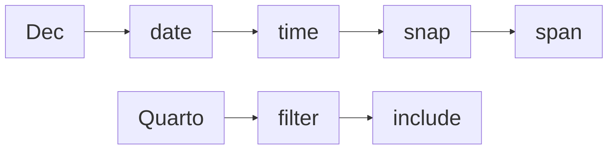

Greetings! 

Welcome to my personal website, which I created using the [Quarto](https://quarto.org) publishing system.

You are currently on the [ Home]() page of my site. You can use the [ Sidebar](https://en.wikipedia.org/wiki/Sidebar_(computing)#:~:text=a%20graphical%20control%20element%20that%20displays%20various%20forms%20of%20information%20to%20the%20right%20or%20left%20side) on the left to go to the [ About](about), [ Article List](list), and [ Curriculum Vitae (CV)](cv) pages of my site or my profile pages on [ GitHub](https://github.com/maptv) and [ LinkedIn](https://www.linkedin.com/in/maptv). The remaining items in the sidebar are sections that contain articles on many different topics. In addition to the sidebar, you can also use the arrows at the bottom to move between articles in a given section or on to the next section.

If you are not sure where to begin, I recommend starting with my articles on [ Dec](dec), a measurement system that I created, and then continuing on my [ Quarto](quarto) section to learn about how I customized my website to show Dec dates in every article and the navigation bar.

Each article contains at least one navigation chart (navchart). As with [breadcrumb navigation](https://en.wikipedia.org/wiki/Breadcrumb_navigation#:~:text=allows%20users%20to%20keep%20track%20and%20maintain%20awareness%20of%20their%20locations%20within%20programs%2C%20documents%2C%20or%20websites), you can click on any node in the navchart below to go to the article that it represents.

Please feel free to take a look around!

Back to top

## Reuse

[CC BY-SA 4.0](https://creativecommons.org/licenses/by-sa/4.0/)
