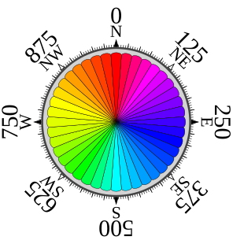
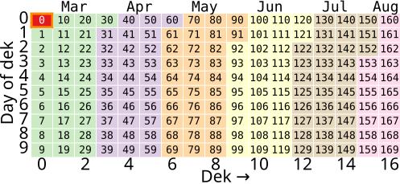
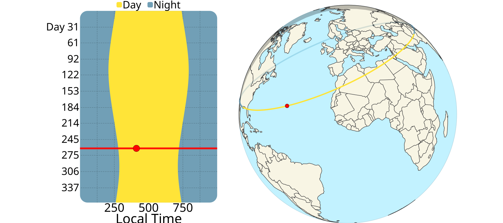
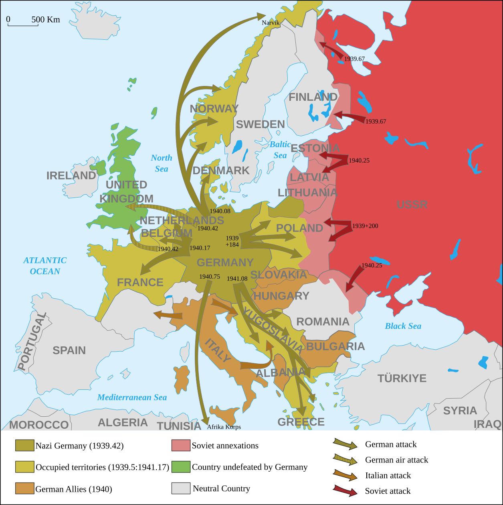
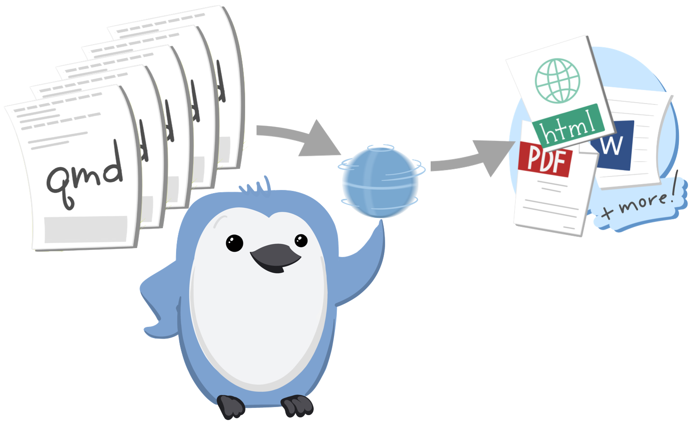
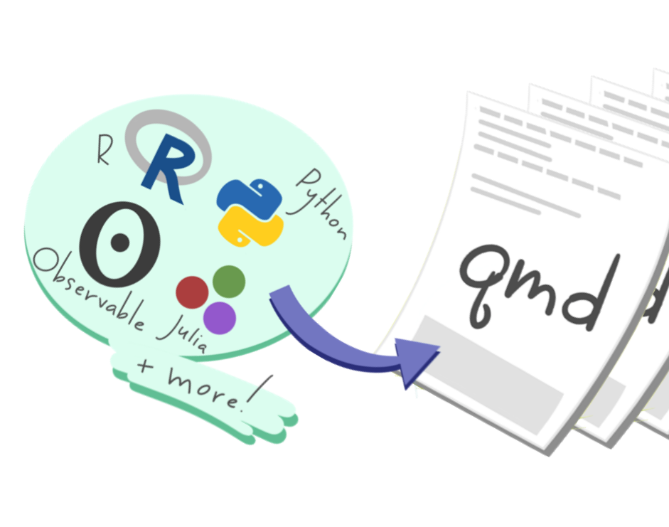
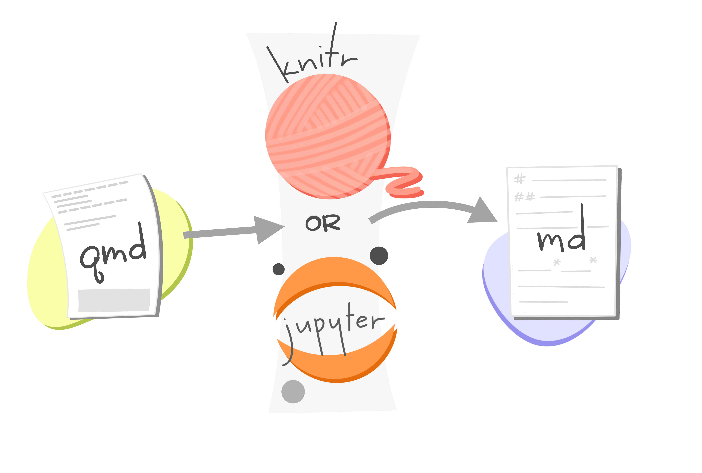
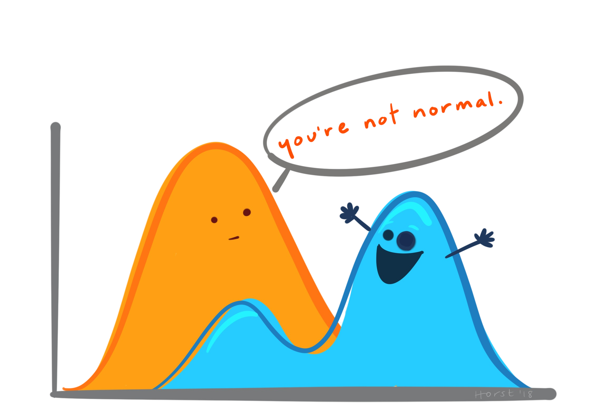

##### Dec Measurement System

24 min

Introducing Dec, a measurement system, which uses turns instead of months, weeks, hours, minutes, seconds, and degrees.

|            |             |
|------------|-------------|
| Word Count | 4,781 words |

1789682037

##### Decalendar

214 min

Introducing Decalendar, a solar calendar which measures time in years and days without the need for months or weeks.

|            |              |
|------------|--------------|
| Word Count | 42,632 words |

1789794434

##### Dec time

226 min

Introducing Declock, a timekeeping system that displays time in decimal days using math notation without the need for hours, minutes, or seconds.

|            |              |
|------------|--------------|
| Word Count | 45,070 words |

1778015565

##### World War 2

3 min

|            |           |
|------------|-----------|
| Word Count | 409 words |

1725860445

##### Git

17 min

Get started with Git version control, the RStudio integrated development environment, and the Quarto publishing system.

|            |             |
|------------|-------------|
| Word Count | 3,317 words |

1776874460

##### Quarto

19 min

|            |             |
|------------|-------------|
| Word Count | 3,763 words |

1738643333

##### Positron

14 min

|            |             |
|------------|-------------|
| Word Count | 2,627 words |

1746560774

##### Observable

45 min

|            |             |
|------------|-------------|
| Word Count | 8,966 words |

1738642623

##### Jupyter

1 min

|            |          |
|------------|----------|
| Word Count | 79 words |

1738642636

##### Knitr

1 min

|            |          |
|------------|----------|
| Word Count | 77 words |

1738642605

##### Probability

5 min

|            |           |
|------------|-----------|
| Word Count | 911 words |

1787929874

##### LLM

1 min

|            |          |
|------------|----------|
| Word Count | 21 words |

1725581207

Back to top

## 

Attributions

All artwork by [allison_horst](https://twitter.com/allison_horst) except for the images related to the following articles:

- [Dec](../dec/index.llms.md): [Observable](https://observablehq.com) [color🎨wheel compass🧭](https://observablehq.com/@pjedwards/compass-rose-as-legend-with-colors)
- [Dec date](../dec/date/index.llms.md): [Observable](https://observablehq.com) [calendar🗓️plot](https://observablehq.com/@observablehq/plot-calendar)
- [Dec time](../dec/time/index.llms.md): [Observable](https://observablehq.com) [daylight☀️plot and globe🌍](https://observablehq.com/@dbridges/visualizing-seasonal-daylight)
- [Positron](../positron/index.llms.md): [Positron](https://positron.posit.co) logo by [Posit](https://posit.co/)
- [LLM](../ml/llm/index.llms.md), which was generated by `DALL·E` `3` with the following prompt:

> a cartoon image of a person climbing a mountain to obtain answers to their questions from an omniscient robotic guru with a glowing positronic brain

## Reuse

[CC BY-SA 4.0](https://creativecommons.org/licenses/by-sa/4.0/)
